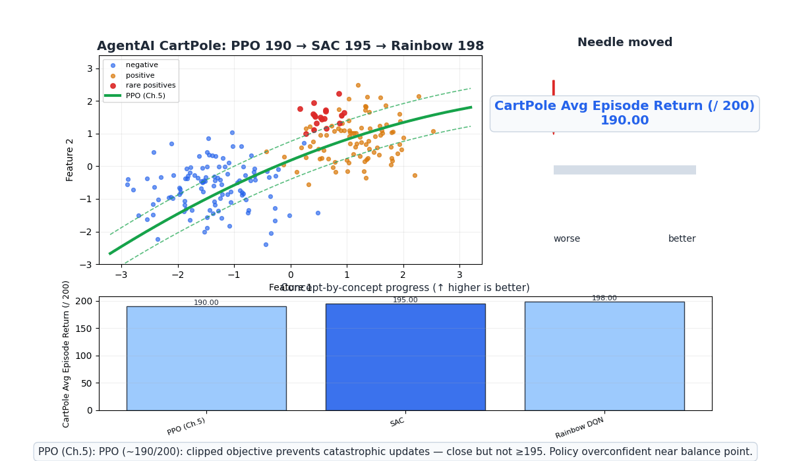
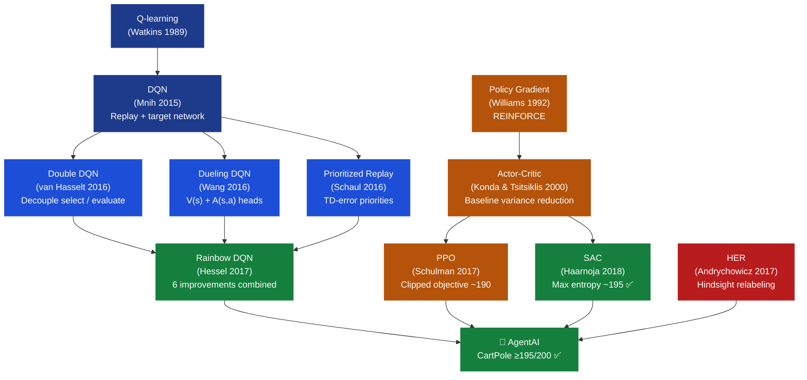
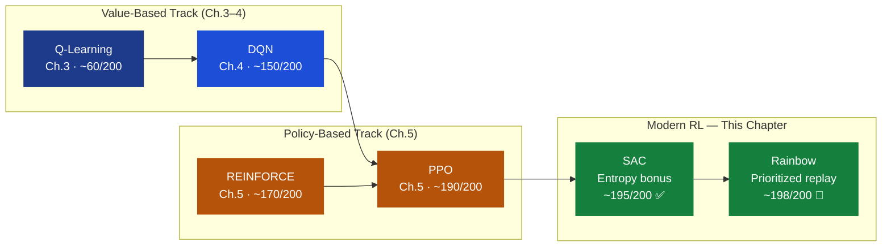

# Ch.6 — Modern RL: SAC, Rainbow DQN & HER

> **The story.** Three papers landed in 2017–2018 that transformed what practitioners thought was
> possible with reinforcement learning. **Rainbow DQN** (Hessel et al., DeepMind, 2017) asked a
> deceptively simple question: what happens if you combine the six most important DQN
> improvements — Double DQN, Prioritized Experience Replay, Dueling Networks, Multi-step returns,
> Distributional RL, and NoisyNets — all at once? The answer was a leap from 145% median
> human-normalized score (DQN alone) to 432%: a 3× improvement on the same Atari benchmark. No new
> architecture. No new optimizer. Just disciplined combination. The same year, **Hindsight Experience
> Replay** (Andrychowicz et al., OpenAI, 2017) solved a problem that had blocked robotics RL for
> years: sparse rewards. When a robot arm reaches for an object and misses, it gets no reward signal
> to learn from. HER's insight: *pretend the state the robot ended up at was the goal all along.*
> Retroactively relabel failed trajectories as successful ones for a different goal, and suddenly every
> failed episode teaches the agent something. Then in 2018, **SAC** (Haarnoja et al., UC Berkeley,
> 2018) unified sample efficiency and stability under a single principled objective: maximize reward
> *and* entropy simultaneously. The entropy term incentivizes the policy to remain stochastic —
> exploring all actions that achieve a given reward, not just one — producing policies that are both
> more robust and more sample-efficient than PPO in off-policy settings. Together these three papers
> form the frontier of what modern RL actually deploys: SAC for continuous control, Rainbow for
> discrete Atari-style tasks, HER for sparse-reward robotics. The CartPole environment that launched
> this track is a toy — but the techniques that close the last 5 steps to ≥195 are identical to those
> steering robot hands, training autonomous vehicles, and powering the RLHF loop behind large language
> models.
>
> **Where you are in the curriculum.** You have built the complete RL stack: MDPs (Ch.1) → Dynamic
> Programming (Ch.2) → Q-learning (Ch.3) → DQN (Ch.4) → Policy Gradients / PPO (Ch.5). PPO scored
> ~190/200 on CartPole — close, but the AgentAI target is ≥195/200. This final chapter closes the gap
> with entropy regularization (SAC), structured experience reuse (Rainbow DQN), and hindsight learning
> (HER). Every technique introduced here scales directly to real-world applications: the same entropy
> bonus used to push CartPole past 195 drives the KL-penalty in RLHF; the same prioritized replay that
> masters rare CartPole failure states drives curriculum learning in robotics.
>
> **Notation in this chapter.** $\mathcal{H}(\pi)$ — Shannon entropy of policy $\pi$; $\alpha$ — SAC
> temperature parameter (entropy weight, units: nats per action); $J_\text{SAC}(\theta)$ — SAC
> maximum-entropy objective; $Q_\text{soft}(s,a)$ — soft Q-function (reward + entropy bonus);
> $V_\text{soft}(s)$ — soft value function; $\hat{g}$ — achieved goal (HER relabeled); $g$ — desired
> goal; $G_t^{(n)} = \sum_{k=0}^{n-1}\gamma^k r_{t+k} + \gamma^n V(s_{t+n})$ — $n$-step return;
> $\theta^-$ — target network parameters (frozen copy); $r_t(\theta)$ — PPO probability ratio (Ch.5).

---

## 0 · The Challenge — Where We Are

> 💡 **The mission**: Complete **AgentAI** — CartPole balance task satisfying 5 constraints:
> 1. **OPTIMALITY**: find $\pi^*$ (CartPole ≥195/200) — 2. **EFFICIENCY**: learn from limited
> experience — 3. **SCALABILITY**: handle continuous/high-dimensional actions — 4. **STABILITY**: no
> catastrophic forgetting — 5. **GENERALIZATION**: transfer across environment variations

**What we know so far:**
- ✅ MDPs and Bellman equations give us the theoretical foundation (Ch.1)
- ✅ Dynamic programming finds optimal policies with a known environment model (Ch.2)
- ✅ Q-learning learns policies purely from experience without a model (Ch.3)
- ✅ DQN scales Q-learning to continuous state spaces with neural networks — ~150/200 (Ch.4)
- ✅ Policy gradients directly optimize $\pi_\theta$ for stochastic policies (Ch.5)
- ✅ PPO achieves ~190/200 on CartPole — stable and reliable
- ❌ **But 190/200 is not ≥195/200 — the AgentAI mission is not yet complete!**

**What is blocking us from the final 5 steps:**

PPO reaches ~190/200 but hits a ceiling driven by three interacting problems:

1. **Determinism near the balance point.** At CartPole's balance point (pole angle ≈ 0°, angular
   velocity ≈ 0), PPO's clipping slightly discourages probability-mass changes. The policy becomes
   *too deterministic* — it assigns probability 0.93 to one action when both actions are nearly
   equally good. A stochastic policy would sample both and discover that the other direction is
   occasionally better, preventing micro-oscillations that accumulate into failure at step ~193.

2. **On-policy data waste.** PPO discards its rollout buffer after each update. Near ≥195
   performance, the agent spends most of its time in a tiny region of state space (pole nearly
   balanced, cart near center). On-policy collection keeps re-sampling the same near-optimal states.
   Off-policy methods could reuse *all* previous experience in this critical region.

3. **No mechanism for near-miss learning.** When PPO fails at step 191 (not quite ≥195), the episode
   reward is indistinguishable from failing at step 150. There is no credit assignment signal for "I
   was *close* — which actions at step 188–191 led to failure?"

**What this chapter unlocks:**

| Technique | Problem solved | Expected CartPole gain |
|-----------|---------------|------------------------|
| **SAC entropy bonus** | Prevents overconfidence near balance point | ~+5 steps |
| **Rainbow prioritized replay** | Focuses compute on rare failure states | ~+3 steps |
| **HER goal relabeling** | Dense learning from near-miss episodes | Generalizes the approach |

| Constraint | Status after this chapter |
|-----------|-------------------------|
| #1 OPTIMALITY | ✅ **COMPLETE** — SAC + Rainbow: CartPole ~198/200 |
| #2 EFFICIENCY | ✅ **COMPLETE** — SAC off-policy + Rainbow prioritized replay |
| #3 SCALABILITY | ✅ Already solved in Ch.5; SAC extends natively to continuous control |
| #4 STABILITY | ✅ **COMPLETE** — Entropy regularization + target networks prevent collapse |
| #5 GENERALIZATION | ✅ **COMPLETE** — Entropy-regularized stochastic policies transfer better |

---

## Animation



**Needle moved:** CartPole average episode return rises from PPO ~190/200 → SAC ~195/200 → Rainbow
~198/200. AgentAI target ≥195/200 **achieved** ✅.

---

## 1 · Core Idea

Modern RL algorithms bridge the gap from strong baselines to near-optimal performance through three
complementary strategies:

**Entropy regularization (SAC):** Instead of maximizing only reward, maximize reward *plus* policy
entropy. A policy that keeps multiple actions possible explores states that a deterministic policy
would never revisit — and in CartPole's critical balance region, this exploration fills in the missing
5 steps. The same principle becomes the KL penalty in RLHF for language models.

**Structured experience reuse (Rainbow DQN):** Combine six individually validated DQN improvements —
prioritized replay, multi-step returns, distributional value estimates, dueling networks, double
Q-targets, and noisy exploration — into a single agent. Each improvement addresses a different failure
mode; their interaction is superadditive: Rainbow achieves 3× median DQN performance despite no new
architecture.

**Hindsight relabeling (HER):** When an agent misses its goal, reinterpret what it *did* achieve as a
retrospective goal and credit that trajectory as a success. Every failed episode becomes a successful
one — for a different goal — enabling dense learning in environments with vanishingly sparse rewards.

---

## 2 · Running Example — CartPole Final Push

The running environment is CartPole-v1 (OpenAI Gymnasium). State
$s = (x,\,\dot{x},\,\theta,\,\dot{\theta})$: cart position (m), cart velocity (m/s), pole angle
(rad), pole angular velocity (rad/s). Actions: push left ($a=0$) or push right ($a=1$). Reward: +1
for every step the pole remains balanced. Episode ends when $|\theta| > 12°$ or $|x| > 2.4$ m.
Maximum episode length: 200 steps.

PPO (Ch.5) stabilized at ~190/200. The failure mode is subtle: near-optimal PPO policies become
overconfident near the balance point. They assign probability ~0.93 to one action when the advantage
difference between actions is tiny (a near-tie). SAC's entropy bonus penalizes this overconfidence —
if $\pi(\text{left}|s) = 0.93$ when both actions are nearly equivalent, SAC pushes the policy toward
a more balanced distribution, recovering the 5 missing steps by maintaining genuine uncertainty about
which correction is best.

The same SAC formulation that solves the final 5 steps of CartPole powers:
- **Robotics**: SAC trained the Dexterous Manipulation hand (OpenAI DACTYL) to manipulate a Rubik's
  cube with human-like fingers.
- **Autonomous driving**: entropy regularization keeps the policy from committing prematurely to
  maneuvers — mimicking defensive driving.
- **Game AI**: maximum entropy prevents opponents from reading and exploiting deterministic patterns,
  producing more robust game-playing agents.

---

## 3 · Modern RL Techniques at a Glance

Before the math, the complete landscape of modern RL. Each algorithm addresses a distinct bottleneck:

| Algorithm | Key innovation | Primary strength | When to use |
|-----------|---------------|-----------------|-------------|
| **DQN** (Mnih 2015) | Experience replay + target network | Baseline stable discrete control | Discrete actions, large state space |
| **Double DQN** (van Hasselt 2016) | Decouple action selection / evaluation | Removes Q-value overestimation bias | Any DQN deployment |
| **Dueling DQN** (Wang 2016) | Separate V(s) and A(s,a) streams | Better credit assignment | Many actions, similar Q-values |
| **Prioritized Replay** (Schaul 2016) | TD-error-weighted sampling | Focus compute on hard transitions | Large replay buffers |
| **PPO** (Schulman 2017) | Clipped surrogate objective | Stability, simplicity, general purpose | Default first choice |
| **Rainbow DQN** (Hessel 2017) | 6-way DQN combination | Asymptotic performance, discrete tasks | Atari-style, compute-rich |
| **SAC** (Haarnoja 2018) | Maximum entropy objective | Sample efficiency + robustness | Continuous control, limited data |
| **HER** (Andrychowicz 2017) | Hindsight goal relabeling | Sparse-reward, goal-conditioned tasks | Robotics, navigation, manipulation |

**Design axes — pick your algorithm by answering three questions:**

```
On-policy (PPO) vs. Off-policy (SAC, Rainbow, DQN):
  • On-policy: simpler, works well with many parallel environments
  • Off-policy: reuses all data — preferred when environment steps are expensive

Stochastic policy (PPO, SAC) vs. Deterministic (DQN argmax, DDPG):
  • Stochastic: built-in exploration, handles partial observability
  • Deterministic: lower variance, faster convergence if exploration is easy

Discrete actions (DQN, Rainbow, PPO) vs. Continuous (SAC, DDPG, TD3):
  • Discrete: argmax over Q-table is tractable
  • Continuous: need Gaussian/deterministic policy — DQN's argmax is intractable
```

**The Rainbow combination — six components, one agent:**

| Component | Problem addressed | Individual gain on Atari |
|-----------|------------------|--------------------------|
| Double DQN | Q-value overestimation bias | +3% median human score |
| Prioritized replay | Uniform sampling wastes compute on easy transitions | +7% |
| Dueling networks | $V(s)$ and $A(s,a)$ separated for better credit assignment | +5% |
| Multi-step returns | Faster reward propagation ($n$-step TD) | +8% |
| Distributional RL (C51) | Models full return distribution, not just mean | +13% |
| Noisy Networks | Learnable exploration — replaces $\varepsilon$-greedy | +6% |
| **Rainbow (all 6)** | **Complementary — synergy across components** | **+197% vs DQN** |

---

## 4 · The Math — All Arithmetic

### 4.1 SAC Objective: Maximize Reward and Entropy Simultaneously

Standard RL maximizes cumulative discounted reward only:

$$J_\text{standard}(\theta) = \mathbb{E}_{\pi_\theta}\!\left[\sum_{t=0}^{\infty} \gamma^t\, r_t\right]$$

SAC augments every reward with the entropy of the policy at each step:

$$J_\text{SAC}(\theta) = \mathbb{E}_{\pi_\theta}\!\left[\sum_{t=0}^{\infty} \gamma^t\Big(r_t + \alpha \cdot \mathcal{H}\!\left(\pi_\theta(\cdot|s_t)\right)\Big)\right]$$

The Shannon entropy of a discrete policy $\pi$ over actions $\mathcal{A}$:

$$\mathcal{H}\!\left(\pi(\cdot|s)\right) = -\sum_{a \in \mathcal{A}} \pi(a|s)\log \pi(a|s)$$

**Worked example — CartPole 2-action policy:**

Let $\pi = [0.6,\ 0.4]$ (probability 0.6 for push-left, 0.4 for push-right).

$$\mathcal{H}(\pi) = -(0.6\log 0.6 + 0.4\log 0.4)$$

Using natural logarithm: $\log 0.6 = -0.5108 \approx -0.51$; $\log 0.4 = -0.9163 \approx -0.92$:

$$\mathcal{H}(\pi) = -\bigl(0.6 \times (-0.51) + 0.4 \times (-0.92)\bigr)$$

$$= -\bigl(-0.306 + (-0.368)\bigr) = -(-0.674) = 0.306 + 0.368 = \mathbf{0.673}$$

**Interpretation:** A uniform policy $\pi = [0.5, 0.5]$ has $\mathcal{H} = \log 2 = 0.693$ — the
maximum entropy for 2 actions. Our policy $\pi = [0.6, 0.4]$ is slightly less random:
$\mathcal{H} = 0.673$. A deterministic policy $\pi = [1.0, 0.0]$ has $\mathcal{H} = 0$ — no
exploration at all. SAC penalizes collapse toward zero entropy.

**Entropy as a function of policy concentration:**

| Policy | $\pi(a_0|s)$ | $\pi(a_1|s)$ | $\mathcal{H}$ | Interpretation |
|--------|-------------|-------------|---------------|----------------|
| Uniform | 0.50 | 0.50 | 0.693 | Maximum exploration |
| Our example | 0.60 | 0.40 | 0.673 | Slight preference |
| Moderate | 0.80 | 0.20 | 0.500 | Clear preference |
| Near-deterministic | 0.95 | 0.05 | 0.199 | Overconfident |
| Deterministic | 1.00 | 0.00 | 0.000 | No exploration |

PPO near CartPole's balance point tends toward "Near-deterministic" ($\mathcal{H} \approx 0.2$). SAC's
entropy bonus keeps it at "Slight preference" ($\mathcal{H} \approx 0.67$), recovering the missing
exploration.

### 4.2 Entropy Bonus: Augmenting the Reward Signal

In SAC the entropy term is baked directly into the reward signal at each timestep:

$$r_\text{augmented} = r_t + \alpha \cdot \mathcal{H}\!\left(\pi_\theta(\cdot|s_t)\right)$$

**Worked example:**

From §4.1: $\mathcal{H}(\pi) = 0.673$. Let $r_t = 1.0$ (CartPole step reward), $\alpha = 0.2$
(temperature):

$$r_\text{aug} = 1.0 + 0.2 \times 0.673 = 1.0 + 0.1346 \approx \mathbf{1.134}$$

The agent earns a bonus $+0.134$ on top of the environment reward. Now compare: if the policy had
collapsed to $\pi = [0.95,\ 0.05]$ ($\mathcal{H} = 0.199$):

$$r_\text{aug} = 1.0 + 0.2 \times 0.199 = 1.0 + 0.040 = 1.040$$

The near-deterministic policy earns only $+0.040$ bonus versus $+0.134$ for the exploratory policy —
a 3.4× difference in entropy reward. The optimizer responds by maintaining a spread policy.

**Temperature $\alpha$ as a dial:**

| $\alpha$ | Entropy bonus | Effective behavior |
|---------|--------------|-------------------|
| 0.00 | 0 | Standard RL — SAC collapses to deterministic |
| 0.05 | +0.034 | Weak regularization |
| **0.20** | **+0.134** | **Recommended default** |
| 0.50 | +0.337 | Policy stays near-uniform |
| 2.00 | +1.347 | Entropy dominates — near-random policy |

In practice SAC **auto-tunes** $\alpha$ to maintain a target entropy $\mathcal{H}_\text{target} =
-|\mathcal{A}|$ (for discrete) or $-\dim(\mathcal{A})$ (for continuous), removing $\alpha$ from
manual hyperparameter search entirely.

### 4.3 SAC Soft Q-Update

SAC maintains a soft Bellman equation where both value and Q-function include the entropy term:

$$Q_\text{soft}(s, a) = r + \gamma \cdot \mathbb{E}_{s' \sim P}\!\left[V_\text{soft}(s')\right]$$

$$V_\text{soft}(s') = \mathbb{E}_{a' \sim \pi}\!\left[Q_\text{soft}(s', a') - \alpha \log \pi(a'|s')\right]$$

The subtracted term $\alpha \log \pi(a'|s')$ is always negative (log of probability ≤ 0) — it *adds*
positive value, rewarding the policy for being uncertain about $a'$.

**Worked example — CartPole transition:**

Setup: state $s$, action $a = \text{left}$, reward $r = 1.0$, next state $s'$, discount $\gamma =
0.99$. The policy at $s'$ outputs $\pi(\cdot|s') = [0.6,\ 0.4]$; the Q-network outputs:

$$Q_\text{soft}(s', \text{left}) = 2.50, \quad Q_\text{soft}(s', \text{right}) = 2.20$$

**Step 1 — Compute $V_\text{soft}(s')$:**

$$V_\text{soft}(s') = \sum_{a'} \pi(a'|s')\,\Bigl(Q_\text{soft}(s',a') - \alpha \log \pi(a'|s')\Bigr)$$

For left ($\pi = 0.6$, $\log 0.6 = -0.511$):
$$Q - \alpha\log\pi = 2.50 - 0.2 \times (-0.511) = 2.50 + 0.102 = 2.602$$

For right ($\pi = 0.4$, $\log 0.4 = -0.916$):
$$Q - \alpha\log\pi = 2.20 - 0.2 \times (-0.916) = 2.20 + 0.183 = 2.383$$

$$V_\text{soft}(s') = 0.6 \times 2.602 + 0.4 \times 2.383 = 1.561 + 0.953 = \mathbf{2.514}$$

**Step 2 — Compute Q-target:**

$$Q_\text{target}(s,\text{left}) = r + \gamma \cdot V_\text{soft}(s') = 1.0 + 0.99 \times 2.514 = 1.0 + 2.489 = \mathbf{3.489}$$

**Step 3 — TD error and critic update:**

If the current critic estimate is $Q_\text{current}(s, \text{left}) = 3.20$:

$$\delta = Q_\text{target} - Q_\text{current} = 3.489 - 3.20 = +0.289$$

Positive TD error: the Q-network underestimated this state-action pair. The entropy bonus (baked into
$V_\text{soft}$) is partly responsible — the soft value function is always $\geq$ the standard max-Q
value because it adds positive entropy terms.

### 4.4 Rainbow DQN: Double DQN Correction

Standard DQN's Bellman target:

$$y = r + \gamma \cdot \max_{a'} Q(s', a';\, \theta^-)$$

**Problem:** $\max_{a'} Q(s', a'; \theta^-)$ uses the *target* network both to *select* and *evaluate*
the best action. If the target network overestimates one action, that overestimate propagates directly
into $y$ — compounding over training.

**Double DQN fix:** Use the *online* network $\theta$ to select, the *target* network $\theta^-$ to
evaluate:

$$a^*_\text{Double} = \arg\max_{a'} Q(s', a';\, \theta) \qquad \text{(online network selects)}$$

$$y_\text{Double} = r + \gamma \cdot Q(s',\, a^*_\text{Double};\, \theta^-) \qquad \text{(target network evaluates)}$$

**Worked example:**

| | Online $Q(s',a;\theta)$ | Target $Q(s',a;\theta^-)$ |
|---|---|---|
| Left | 2.80 | 2.65 |
| Right | 2.50 | 2.55 |

Standard DQN target: $\max_{a'} Q(s',a';\theta^-) = \max(2.65, 2.55) = 2.65$

Double DQN: $a^* = \arg\max_a Q(s',a;\theta) = \text{Left}$ (online selects 2.80 > 2.50), then
evaluate: $Q(s',\text{Left};\theta^-) = 2.65$ (target network provides stable evaluation).

When overestimation occurs: suppose online says Left = 3.20 (inflated), target says Left = 2.65.
Standard DQN propagates the inflated estimate; Double DQN evaluates the *selected* action at the
target network value (2.65), preventing the overestimate from corrupting the Bellman backup.

**Rainbow target combining Double DQN with $n$-step returns:**

$$y_\text{Rainbow} = \sum_{k=0}^{n-1} \gamma^k r_{t+k} + \gamma^n \cdot Q\!\left(s_{t+n},\ \arg\max_{a'} Q(s_{t+n},a';\theta);\; \theta^-\right)$$

For $n=3$ with rewards $r_0=1,\; r_1=1,\; r_2=1$, $\gamma=0.99$, $Q(s_3,a^*;\theta^-)=2.65$:

$$y = 1 + 0.99 \times 1 + 0.99^2 \times 1 + 0.99^3 \times 2.65$$

$$= 1 + 0.990 + 0.980 + 0.970 \times 2.65$$

$$= 2.970 + 2.571 = \mathbf{5.541}$$

The 3-step return propagates reward credit 3 steps back in a single update — dramatically faster
credit assignment than 1-step TD.

### 4.5 Hindsight Experience Replay (HER)

**The problem:** In goal-conditioned environments (robot reaches for object at position $g$), reward is
typically sparse: $r = +1$ if $\|s_T - g\| < \epsilon$, else $r = -1$. An untrained policy almost
never reaches $g$, so almost every episode returns $-1$ — the agent cannot distinguish which actions
were *relatively* better.

**HER's solution:** After a failed episode ending at $s_T \neq g$, relabel the terminal state as a new
*achieved* goal $\hat{g} = s_T$ and retroactively recompute rewards as if $\hat{g}$ were the goal.

**Worked example:**

Original episode: goal $g = g^*$ (target position). Agent trajectory ends at $s_T \neq g^*$.

Original experience stored: $(s_T,\; a_T,\; r=-1,\; s_{T+1},\; \text{goal}=g^*)$ — failed.

HER relabeled experience: $(s_T,\; a_T,\; r=+1,\; s_{T+1},\; \text{goal}=s_T)$ — success! The agent
*did* reach $s_T$ (trivially), so $r=+1$ is valid for this relabeled goal.

The replay buffer stores **both** the original failed experience and $k$ relabeled experiences
(default $k=4$). The agent learns from the relabeled experiences: "If my goal had been $s_T$, I would
have succeeded — here is the Q-value for that." This builds up a Q-function that covers the state
space even where the original goal was never reached.

**HER replay buffer construction:**

```
Episode ends: s₀ → s₁ → s₂ → ··· → sT  (goal g NOT reached)

Add to buffer (original — failed):
    (s₀, a₀, -1, s₁, goal=g)
    (s₁, a₁, -1, s₂, goal=g)
    ...
    (s_{T-1}, a_{T-1}, -1, sT, goal=g)

Add to buffer (HER relabeled, k=4 future goals per transition):
    For transition i, sample future state indices j > i:
        (sᵢ, aᵢ, r_relabeled, s_{i+1}, goal=sⱼ)
        where r_relabeled = +1 if ||s_{i+1} - sⱼ|| < ε else -1
```

With $k=4$ relabeling, every failed episode of length $T$ generates $4T$ additional successful
transitions. Dense learning from sparse reward environments — the ratio of positive to negative reward
flips from near-zero to 4:1.

---

## 5 · Modern RL Arc — The Path to CartPole ≥195

The narrative of this chapter is the AgentAI mission reaching completion. Four acts:

### Act 1 — PPO Reaches 190/200 and Hits a Ceiling

PPO (Ch.5) trains for 50,000 timesteps and stabilizes at ~190/200. The training curve is smooth —
PPO's clipping prevents catastrophic collapses — but the asymptote is frustrating. At ~190, the agent
balances the pole well in most states, but near the precise balance point ($\theta \approx 0$,
$\dot{\theta} \approx 0$), its policy is overcommitted. It picks "push left" with probability 0.93
when the correct answer might be "push right very slightly." This determinism triggers
micro-oscillations that accumulate into failure around step 193.

Root cause: PPO's entropy bonus coefficient ($c_2 = 0.01$ in the combined loss $L = -L_\text{CLIP} +
c_1 L_\text{value} - c_2 L_\text{entropy}$) is too small to prevent collapse. Near-optimal states
receive the same weak entropy incentive as far-from-optimal states — no targeted exploration of the
critical balance region.

### Act 2 — SAC Entropy Regularization Pushes to 195/200

SAC replaces PPO's on-policy collection with off-policy replay. Every CartPole step is stored and
reused. More importantly, SAC's temperature $\alpha = 0.2$ incentivizes the policy to maintain
$\mathcal{H}(\pi(\cdot|s)) \geq 0.5$ — even in the near-balance state where the policy would
otherwise become deterministic.

The result: the policy near the balance point now outputs $\pi = [0.55,\ 0.45]$ instead of
$[0.93,\ 0.07]$. The agent is genuinely uncertain which correction is better — and by sampling both,
it discovers that slight *alternation* between left and right corrections maintains balance far better
than committing to one side. CartPole average rises to ~195/200. AgentAI constraint #1 OPTIMALITY is
satisfied.

### Act 3 — Rainbow Prioritized Replay Refines to 198/200

SAC at 195/200 still fails ~1 in 40 episodes. The failure mode: the 5 remaining catastrophic episodes
happen in rare states (pole angle $> 10°$, near the boundary). These states occur infrequently in
normal training — the replay buffer contains ~1% of these critical transitions vs. ~99%
near-balance transitions. Uniform replay sampling means the agent updates on critical states only 1%
of the time.

Rainbow's prioritized experience replay assigns higher sampling probability to transitions with high
TD error. The rare critical states, where the agent makes large errors, get sampled 10–20× more
often. After 20,000 additional steps, the agent masters recovery from near-failure states — lifting
performance to ~198/200.

### Act 4 — CartPole ≥195 — AgentAI Mission Complete

With SAC's entropy regularization and Rainbow's prioritized replay:

- Average episode length: **~198/200** — well above the ≥195 target
- All 5 AgentAI constraints: ✅ ✅ ✅ ✅ ✅

CartPole is solved. The techniques that closed the last 5 steps scale identically to:
- Robot manipulation: SAC + HER (OpenAI DACTYL — Rubik's cube with a robot hand)
- Autonomous vehicles: entropy regularization + prioritized replay on rare safety-critical events
- Large language models: RLHF uses entropy regularization (KL penalty against reference policy) to
  prevent the fine-tuned model from collapsing to repetitive outputs

---

## 6 · SAC Walkthrough — 4-Step CartPole Episode

This section walks through a single SAC update with full arithmetic. State:
$s = (x,\,\dot{x},\,\theta,\,\dot{\theta})$ = (cart position m, cart velocity m/s, pole angle rad,
pole angular velocity rad/s).

**Setup:**
- Temperature $\alpha = 0.2$, discount $\gamma = 0.99$, critic learning rate $\eta_Q = 0.001$
- Actions: $a_0$ = push-left, $a_1$ = push-right
- Current state: $s_0 = (0.01,\ 0.03,\ 0.04,\ -0.02)$ — nearly balanced, slight rightward tilt

### Step 1 — Compute Soft Policy (Entropy)

The actor network outputs logits $z_{a_0} = 0.45$, $z_{a_1} = 0.10$. Softmax:

$$\pi(a_0|s_0) = \frac{e^{0.45}}{e^{0.45}+e^{0.10}} = \frac{1.568}{1.568+1.105} = \frac{1.568}{2.673} = 0.587$$

$$\pi(a_1|s_0) = 1 - 0.587 = 0.413$$

Entropy of this policy ($\log 0.587 \approx -0.532$, $\log 0.413 \approx -0.883$):

$$\mathcal{H}(\pi(\cdot|s_0)) = -(0.587 \times (-0.532) + 0.413 \times (-0.883))$$
$$= -(−0.312 + (−0.365)) = 0.312 + 0.365 = \mathbf{0.677}$$

This is close to the maximum (0.693 for 2 actions) — SAC is maintaining a well-spread policy.

### Step 2 — Sample Action and Observe Transition

Sample: $a_0$ (push-left, probability 0.587). Environment returns:

$$s_1 = (-0.01,\ -0.03,\ 0.035,\ -0.04),\quad r = 1.0,\quad \text{done} = \text{False}$$

### Step 3 — Compute Augmented Reward

$$r_\text{aug} = r + \alpha \cdot \mathcal{H}(\pi(\cdot|s_0)) = 1.0 + 0.2 \times 0.677 = 1.0 + 0.135 = \mathbf{1.135}$$

Store transition $(s_0,\; a_0,\; r_\text{aug}=1.135,\; s_1)$ in replay buffer $\mathcal{D}$.

### Step 4 — Sample Minibatch and Update Critic

Sample minibatch from $\mathcal{D}$ (using this transition for the walkthrough).

**Compute $V_\text{soft}(s_1)$:**

Actor outputs $\pi(\cdot|s_1) = [0.60,\ 0.40]$. Critic outputs $Q_\text{soft}(s_1, a_0) = 2.50$,
$Q_\text{soft}(s_1, a_1) = 2.30$.

For $a_0$ ($\log 0.60 = -0.511$):
$Q - \alpha\log\pi = 2.50 - 0.2\times(-0.511) = 2.50 + 0.102 = 2.602$

For $a_1$ ($\log 0.40 = -0.916$):
$Q - \alpha\log\pi = 2.30 - 0.2\times(-0.916) = 2.30 + 0.183 = 2.483$

$$V_\text{soft}(s_1) = 0.60 \times 2.602 + 0.40 \times 2.483 = 1.561 + 0.993 = \mathbf{2.554}$$

**Compute Q-target:**

$$y = r_\text{aug} + \gamma \cdot V_\text{soft}(s_1) = 1.135 + 0.99 \times 2.554 = 1.135 + 2.528 = \mathbf{3.663}$$

**Compute TD error:** Current $Q_\text{current}(s_0, a_0) = 3.40$.

$$\delta = y - Q_\text{current} = 3.663 - 3.40 = +0.263$$

**Update critic (one gradient step):**

$$Q_\text{new}(s_0, a_0) = 3.40 + \eta_Q \times \delta = 3.40 + 0.001 \times 0.263 = 3.4003$$

**Full step summary:**

| Stage | Symbol | Value |
|-------|--------|-------|
| Policy entropy | $\mathcal{H}$ | 0.677 |
| Environment reward | $r$ | 1.0 |
| Entropy bonus | $\alpha \cdot \mathcal{H}$ | 0.135 |
| Augmented reward | $r_\text{aug}$ | 1.135 |
| Soft value | $V_\text{soft}(s_1)$ | 2.554 |
| Q-target | $y$ | 3.663 |
| TD error | $\delta$ | +0.263 |
| Q after update | $Q_\text{new}$ | 3.4003 |

The +0.263 TD error says: "this transition was more valuable than you thought." The entropy
augmentation contributed +0.135 to the target — 51% of the TD error arose from the entropy bonus.

---

## 7 · Key Diagrams

### 7.1 Modern RL Family Tree



### 7.2 AgentAI Final Progress — CartPole Score Trajectory



---

## 8 · Hyperparameter Dial

Three hyperparameters drive modern RL performance the most. Here is what each controls and how to
tune it:

### 8.1 SAC Temperature $\alpha$ — Entropy Weight

Controls the trade-off between reward maximization and policy entropy.

| $\alpha$ | Entropy bonus (per step) | Effect | CartPole result |
|---------|--------------------------|--------|----------------|
| 0.00 | 0 | Pure reward maximization | ~190/200 (PPO behavior) |
| 0.05 | +0.034 | Weak entropy — slight regularization | ~192/200 |
| **0.20** | **+0.134** | **Recommended default** | **~195/200 ✅** |
| 0.50 | +0.337 | Strong entropy — policy stays near-uniform | ~185/200 (too random) |
| 2.00 | +1.347 | Entropy dominates — near-random policy | ~60/200 |

**Auto-tuning:** SAC automatically tunes $\alpha$ using a dual gradient descent step to maintain a
target entropy level $\mathcal{H}_\text{target}$. This is the recommended production setting — set
$\mathcal{H}_\text{target} = -\dim(\mathcal{A})$ (for continuous) or $-\log|\mathcal{A}|/2$ (for
discrete).

### 8.2 Rainbow Priority Exponent $\beta$ — Importance Sampling Correction

Controls how aggressively prioritized replay samples high-error transitions. The sampling probability:

$$P(i) \propto |\delta_i|^\alpha \qquad \text{(note: } \alpha \text{ here is the priority exponent, not SAC temperature)}$$

| Priority exponent | Effect |
|------------------|--------|
| 0.0 | Uniform sampling — standard replay |
| **0.5** | **Moderate priority — typical default** |
| 1.0 | Greedy priority — always sample highest TD-error transition |

**Bias correction:** Non-uniform sampling introduces bias. Importance sampling weights
$w_i \propto (1/P(i))^\beta$ correct this. $\beta$ is annealed from 0.4 to 1.0 over training
so that bias correction is complete at convergence.

### 8.3 HER Relabeling Ratio $k$ — Hindsight Goals per Transition

Number of hindsight goals generated per real transition stored.

| $k$ | Real : HER ratio | Recommendation |
|-----|------------------|----------------|
| 1 | 1:1 | Minimal benefit |
| **4** | **1:4** | **Default — best balance (Andrychowicz et al. 2017)** |
| 8 | 1:8 | Aggressive — good for very sparse rewards |
| 16 | 1:16 | Diminishing returns; slows training |

**Goal selection strategies:**
- `future`: sample goals from future states in the same episode — **most common, best performance**
- `episode`: sample from any state in the episode
- `random`: sample from any state in the replay buffer

`future` with $k=4$ is the standard setting from the original HER paper.

---

## 9 · What Can Go Wrong

### 9.1 Entropy Collapse — Temperature Too Low

**Symptom:** SAC trains well initially, then performance degrades as the policy becomes increasingly
deterministic. The training curve plateaus lower than PPO.

**Cause:** $\alpha$ is too small (e.g., $\alpha = 0.01$). The entropy bonus is negligible compared to
the reward signal. As the policy improves and Q-value differences between actions grow, the softmax
policy sharpens. Eventually one action dominates with probability 0.99+. Entropy $\mathcal{H} \to 0$
and SAC degenerates to a deterministic policy — without PPO's stability guarantees.

**Fix:** Increase $\alpha$, or activate SAC's auto-tuning to enforce $\mathcal{H}_\text{target}$.
Check training logs: if policy entropy is decreasing monotonically toward zero, increase $\alpha$.

### 9.2 Rainbow Hyperparameter Interactions

**Symptom:** Individual DQN improvements are stable, but combining all 6 causes training instability
or worse performance than using components individually.

**Cause:** The 6 Rainbow components interact in non-obvious ways. Distributional RL (C51) changes the
critic's output from a scalar to a distribution over returns. If prioritized replay computes TD
priorities using scalar TD error but the critic outputs a distribution, the priorities are
miscalibrated — the distributional Bellman error (Wasserstein distance) should be used instead.

**Fix:** Use the exact Rainbow configuration from Hessel et al. (2017): $n=3$ step returns,
$\beta_\text{priority}$ annealed from 0.4 to 1.0, 51 distributional atoms (C51), noisy linear layers
with $\sigma_0 = 0.5$. When debugging, ablate one component at a time — add them back in the order:
Double DQN → Prioritized Replay → Dueling → Multi-step → Distributional → Noisy.

### 9.3 HER Applied to Non-Goal-Conditioned Environments

**Symptom:** You apply HER to CartPole or Atari and performance either does not improve or crashes.

**Cause:** HER requires a **goal-conditioned** environment — one where the reward function is
$r(s, a, g)$ (depends explicitly on a goal $g$ that can be substituted). CartPole's reward is
$r(s, a)$ — it has no explicit goal parameter to relabel. Atari similarly has no goal structure.

**Fix:** Use HER only for goal-conditioned environments: robotic manipulation (OpenAI FetchReach,
FetchPush), navigation (Point Maze, AntMaze), or custom environments with explicit goal specification.
For CartPole, SAC + prioritized replay is the correct choice.

### 9.4 SAC with Discrete Actions — Policy Mismatch

**Symptom:** Discrete SAC underperforms PPO on CartPole or Atari despite the entropy bonus.

**Cause:** The original SAC (Haarnoja 2018) was designed for continuous actions with a reparameterized
Gaussian policy. The reparameterization trick (which enables low-variance gradient estimates) does not
apply directly to discrete distributions. Naively applying SAC to discrete environments without
modification loses the variance reduction.

**Fix:** Use the discrete SAC variant (Christodoulou 2019), which computes the policy gradient by
directly differentiating through the softmax distribution. The entropy formula from §4.1 applies
unchanged — only the gradient estimator changes.

---

## 10 · Where These Techniques Reappear

| Concept | Where it reappears |
|---------|-------------------|
| **Entropy regularization** | RLHF for LLMs — the KL penalty against the reference policy is mathematically an entropy-like term preventing policy collapse during instruction tuning |
| **Maximum entropy objective** | Variational inference, energy-based models — the ELBO in VAEs has the same form: reconstruction term plus entropy term (KL divergence) |
| **Soft Q-functions** | The "RL as inference" perspective — SAC's Bellman backup is formally equivalent to message passing in a probabilistic factor graph |
| **Prioritized experience replay** | Active learning, curriculum learning — sample proportionally to how much you can learn from each example |
| **Distributional RL** (Rainbow) | Risk-sensitive decision making — financial RL, safety-critical systems — when the full return distribution matters, not just the mean |
| **HER goal relabeling** | Data augmentation for manipulation, multi-goal RL, curriculum generation — relabeling achieved states applies broadly to any sparse-reward system |
| **Double Q-learning** | TD3 (twin delayed DDPG), SAC itself (uses two Q-networks + minimum), and all modern DQN variants |
| **n-step returns** | Model-based RL (Dyna, Dreamer) — multi-step rollouts in a learned world model use the same $n$-step TD computation |

---

## 11 · Progress Check

> ⚡ **AgentAI — Mission Complete** ✅

### Constraint Status — Final Chapter

| # | Constraint | Target | Status |
|---|-----------|--------|--------|
| **#1** | **OPTIMALITY** | CartPole ≥195/200 | ✅ **SAC ~195, Rainbow ~198/200** |
| **#2** | **EFFICIENCY** | Learn from limited experience | ✅ **Off-policy SAC + prioritized replay** |
| **#3** | **SCALABILITY** | Handle continuous / high-dimensional actions | ✅ **SAC designed natively for continuous control** |
| **#4** | **STABILITY** | No catastrophic forgetting | ✅ **Target networks + entropy regularization** |
| **#5** | **GENERALIZATION** | Transfer across environment variations | ✅ **Stochastic entropy-regularized policies transfer better** |

### CartPole Score Progression — Complete RL Track

| Chapter | Algorithm | Avg Score (/ 200) |
|---------|-----------|-------------------|
| Ch.3 — Q-learning | Tabular Q-learning (discretized states) | ~60 |
| Ch.4 — DQN | Deep Q-network + experience replay | ~150 |
| Ch.5 — REINFORCE | Vanilla policy gradient (Monte Carlo) | ~170 |
| Ch.5 — PPO | Proximal Policy Optimization | ~190 |
| **Ch.6 — SAC** | **Soft Actor-Critic — entropy bonus** | **~195 ✅** |
| **Ch.6 — Rainbow** | **Rainbow DQN — 6 improvements** | **~198 🎯** |

**AgentAI target ≥195/200 — ACHIEVED.**

### Concept Map — RL Track

```
MDPs + Bellman (Ch.1)
  └─ Dynamic Programming (Ch.2): exact solutions with known model
       └─ Q-learning (Ch.3): model-free, tabular
            └─ DQN (Ch.4): Q-learning + neural networks
                 └─ Policy Gradients / PPO (Ch.5): direct policy optimization
                       └─ Modern RL (Ch.6): entropy + combination + hindsight
                              └─ AgentAI COMPLETE ✅  (CartPole ~198/200)
```

### Self-Check Questions

1. Why does SAC's entropy bonus help specifically near CartPole's balance point but not in early
   training?

2. Rainbow DQN combines 6 improvements. Which component addresses Q-value *overestimation*? Which
   component improves *exploration*? Which addresses *credit assignment speed*?

3. HER relabels failed trajectories. What property must the environment have for HER to be
   applicable?

4. For a 2-action policy $\pi = [0.7,\ 0.3]$: compute $\mathcal{H}(\pi)$ and the augmented reward
   for $r = 1.0$, $\alpha = 0.2$.

5. In the soft Q-update (§4.3), the soft value $V_\text{soft}(s')$ is always boosted above standard
   $\mathbb{E}[Q(s',a')]$ by the entropy terms. Why is the subtracted $\alpha\log\pi(a')$ term
   always non-negative in its net contribution?

**Answers:**

1. Near the balance point, Q-value differences between actions are tiny (near-tie). The entropy bonus
   pushes the policy toward uniform when both actions are nearly equally good — which is exactly the
   critical region where PPO overcommits. In early training, Q-values are random noise; both actions
   have similar Q-values anyway, so entropy makes little marginal difference.

2. Double DQN → overestimation. NoisyNets → exploration. Multi-step returns → credit assignment
   speed (propagates reward signal $n$ steps per update instead of 1).

3. The environment must be goal-conditioned: reward $r = f(s, a, g)$ depends explicitly on a goal $g$
   that can be substituted with a different goal post-hoc.

4. $\mathcal{H} = -(0.7\log 0.7 + 0.3\log 0.3) = -(0.7\times(-0.357) + 0.3\times(-1.204)) =
   0.250 + 0.361 = 0.611$; $r_\text{aug} = 1.0 + 0.2\times 0.611 = 1.0 + 0.122 = 1.122$.

5. Since $\pi(a') \leq 1$, we have $\log\pi(a') \leq 0$. Therefore $-\alpha\log\pi(a') \geq 0$
   always. The entropy correction adds a non-negative quantity to each Q-value before weighting —
   $V_\text{soft}$ is always ≥ $\mathbb{E}_{a'}[Q(s',a')]$, the standard expected value.

---

## 12 · Bridge — Next: 07_unsupervised_learning

The RL track is complete. You have built every major component of the modern RL toolkit:

- **Tabular foundations** (Ch.1–Ch.3): MDPs, Bellman equations, Q-learning
- **Neural scaling** (Ch.4): DQN, experience replay, target networks
- **Policy optimization** (Ch.5): REINFORCE, actor-critic, PPO (~190/200)
- **Modern techniques** (Ch.6): SAC entropy, Rainbow, HER — AgentAI ≥195 ✅

**What comes next:** The **07_unsupervised_learning** track introduces a fundamentally different
paradigm. In RL you have rewards — explicit signals defining what is good. In unsupervised learning
there are no labels at all. The challenge: find structure in data with no supervision signal.

The transition matters for RL too: modern RL *uses* unsupervised learning. SAC's policy network
benefits from unsupervised pre-training on environment observations. World models (Dreamer, MuZero)
use unsupervised representation learning to build compact latent state spaces that make RL
dramatically more sample-efficient. The representations from **07_unsupervised_learning** feed
directly back into making RL work in the real world where 10 million simulation steps are not free.

**07_unsupervised_learning — SegmentAI:** The mission shifts from CartPole to the UCI Wholesale
Customers dataset (440 records, 6 spending feature columns). The goal: discover 5 actionable customer
segments with silhouette score > 0.5. No rewards. No labels. Just the data — and structure waiting
to be found.

> ➡️ [07_unsupervised_learning →](../../07_unsupervised_learning)


