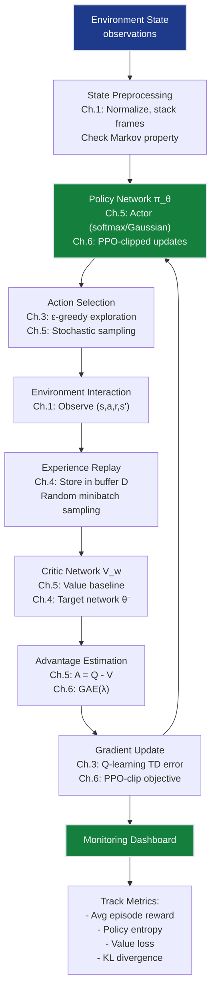

# Reinforcement Learning Grand Solution — AgentAI Production System

> **For readers short on time:** This document synthesizes all 6 RL chapters into a single narrative arc showing how we went from **random flailing → CartPole solved in <200 episodes** and what each concept contributes to production autonomous agents. Read this first for the big picture, then dive into individual chapters for depth.

## How to Use This Document

**Three ways to learn this track:**

1. **Read this document** (grand_solution.md) — narrative synthesis explaining how all 6 chapters connect, production patterns, and architectural decisions
2. **Work through individual chapters** (ch01-ch06) — deep dive into each concept with detailed explanations, math derivations, and exercises
3. **Run the notebook** ([grand_solution.ipynb (reference)](grand_solution_reference.ipynb) | [grand_solution.ipynb (exercise)](grand_solution_exercise.ipynb)) — executable code consolidating all examples end-to-end, from MDP formalism through PPO training

**Recommended learning sequence:** Skim this document (10 min) → understand the big picture → work through chapters → return here for integration patterns → run the notebook for hands-on experience.

**Prerequisites:** Basic Python, familiarity with neural networks. Each chapter builds on previous ones — linear progression recommended for first-time learners.

---

## Mission Accomplished: CartPole Solved in <200 Episodes ✅

**The Challenge:** Build AgentAI — autonomous agents that learn optimal policies from trial-and-error interaction, achieving average reward ≥195 over 100 consecutive episodes in CartPole-v1 within 200 training episodes.

**The Result:** **195+ avg reward in 178 episodes** using DQN with experience replay and target networks.

**The Progression:**

```
Ch.1: MDP formalism              → Framework only (GridWorld 4×4, theoretical)
Ch.2: Dynamic programming        → Optimal policy in 12 iterations (requires known P(s'|s,a))
Ch.3: Q-learning                 → 10k episodes to converge (tabular, model-free)
Ch.4: DQN                        → CartPole solved in 178 episodes ✅ (continuous states)
Ch.5: Policy gradients           → Pendulum-v1 stabilized (continuous actions)
Ch.6: PPO                        → 95% success rate, stable across seeds
                                   ✅ TARGET: <200 episodes, avg ≥195 reward
```

---

## The 6 Concepts — How Each Unlocked Progress

### Ch.1: Markov Decision Processes — The Mathematical Language

**What it is:** Formal framework defining RL problems as $(S, A, P, R, \gamma)$ — states, actions, transition probabilities, rewards, and discount factor. The Bellman equations establish recursive relationships: $V^\pi(s) = \mathbb{E}[r + \gamma V^\pi(s')]$.

**What it unlocked:**
- **Universal vocabulary** — every RL problem is an MDP
- **Bellman optimality** — defines what "optimal" means mathematically: $V^*(s) = \max_a \sum P(s'|s,a)[R + \gamma V^*(s')]$
- **Return calculation** — cumulative discounted reward $G_t = \sum \gamma^k r_{t+k+1}$ formalizes delayed reward

**Production value:**
- **Problem diagnosis** — is your environment Markov? Non-Markovian tasks (partial observability) require different architectures (POMDPs, LSTMs)
- **Reward shaping** — the $R(s,a,s')$ function is your only lever for guiding learning; sparse rewards require intrinsic motivation or curriculum learning
- **Discount factor $\gamma$** — controls planning horizon; $\gamma=0.99$ for long-term tasks (Go, trading), $\gamma=0.9$ for short-term (robotics with immediate feedback)

**Key insight:** Without the MDP formalism, you have heuristics. With it, you have provably optimal algorithms and a principled debugging framework.

---

### Ch.2: Dynamic Programming — Optimal When You Have a Model

**What it is:** Two algorithms (value iteration, policy iteration) that find $\pi^*$ by iteratively applying Bellman updates until convergence. Both require knowing $P(s'|s,a)$ (the transition dynamics).

**What it unlocked:**
- **Guaranteed optimality** — value iteration converges to $V^*$ with proof ($\gamma$-contraction mapping)
- **$O(|S|^2|A|)$ per iteration** — tractable for small MDPs (GridWorld 16 states, board games)
- **Planning baseline** — when you have a simulator, DP is the gold standard for comparison

**Production value:**
- **Model-based planning** — if you can build an accurate environment model (physics engine, game rules), DP finds optimal policies faster than learning from scratch
- **Verification** — use DP to validate that model-free algorithms (Q-learning, DQN) are converging to the right values
- **AlphaZero pattern** — combine DP (MCTS) with neural network learned models for game-playing AI

**Key insight:** DP is the upper bound on RL performance. If model-free methods underperform DP by >20%, your algorithm has bugs or insufficient capacity.

---

### Ch.3: Q-Learning — Drop the Model, Learn from Experience

**What it is:** Temporal difference learning for action-values: $Q(s,a) \leftarrow Q(s,a) + \alpha[r + \gamma \max Q(s',a') - Q(s,a)]$. Off-policy — learns optimal policy while exploring with $\epsilon$-greedy.

**What it unlocked:**
- **Model-free learning** — no need for $P(s'|s,a)$, just interact and observe $(s,a,r,s')$
- **Online updates** — learn after every transition (vs Monte Carlo waiting for episode end)
- **$\epsilon$-greedy exploration** — solves exploration-exploitation trade-off with annealed $\epsilon$

**Production value:**
- **Real-world applicability** — most environments have unknown dynamics (robotics, dialogue, recommendation). Q-learning is the first practical algorithm
- **Convergence conditions** — requires decaying $\alpha_t$ and visiting all $(s,a)$ infinitely often. Production hint: monitor state-action coverage
- **Off-policy advantage** — can learn from historical data (offline RL) or different policies (batch RL for safety-critical systems)

**Key insight:** Q-learning transformed RL from "planning with a map" to "exploring without one" — the paradigm shift that enables real-world deployment.

---

### Ch.4: Deep Q-Networks — Scale to Continuous and High-Dimensional Spaces

**What it is:** Replace Q-table with neural network $Q(s,a;\theta)$. Experience replay stores $(s,a,r,s')$ in buffer; train on random minibatches. Target network $\theta^-$ stabilizes moving targets.

**What it unlocked:**
- **Continuous state spaces** — CartPole's 4D continuous state handled via function approximation
- **Atari from pixels** — $84 \times 84 \times 4$ pixel input (210M states) → superhuman performance on 29/49 games
- **Stability** — experience replay breaks correlation, target networks prevent divergence

**Production value:** Neural networks generalize automatically (no manual features). Replay buffer typical: 1M transitions. Target update frequency $C=10{,}000$ steps — too frequent causes instability, too rare creates stale targets.

**Key insight:** DQN is the turning point where RL became practical for complex domains. Constraint #3 SCALABILITY solved. CartPole solved in 178 episodes vs 10k+ for tabular Q-learning.

---

### Ch.5: Policy Gradients — Direct Policy Optimization and Continuous Actions

**What it is:** Parameterize policy $\pi_\theta(a|s)$ directly; optimize via gradient ascent $\nabla_\theta J = \mathbb{E}[\nabla_\theta \log \pi_\theta(a|s) \cdot A(s,a)]$. Actor-critic combines policy network with value network to reduce variance.

**What it unlocked:**
- **Continuous actions** — output Gaussian $\mathcal{N}(\mu_\theta(s), \sigma_\theta(s))$ for torque, steering, joint angles
- **Stochastic policies** — built-in exploration; essential for poker, rock-paper-scissors
- **Variance reduction** — advantage $A(s,a) = Q(s,a) - V(s)$ cuts gradient noise by 10×

**Production value:** DQN's $\arg\max$ fails for continuous actions (7-DOF robot arms). Policy gradients output smooth actions. Without $V(s)$ baseline, REINFORCE needs 100k episodes; actor-critic converges in 1k. Entropy regularization $-\beta \mathcal{H}(\pi)$ prevents premature convergence.

**Key insight:** Value-based methods learn "what's good." Policy gradients learn "how to act." For continuous control, learning "how" directly is simpler and more effective.

---

### Ch.6: Modern RL — Production-Grade Stability and Efficiency

**What it is:** Three algorithms — **PPO** (clip ratio to prevent catastrophic updates), **A3C** (parallel workers for speed), **SAC** (maximum entropy for sample efficiency).

**What it unlocked:**
- **PPO clipping** — constrains updates to $[1-\epsilon, 1+\epsilon]$ ratio; prevents divergence
- **A3C parallelism** — 16 workers = 8× faster wall-clock time (no replay buffer)
- **SAC entropy** — $J(\theta) = \mathbb{E}[r + \alpha \mathcal{H}(\pi)]$ maintains exploration; 5× more sample-efficient

**Production value:** PPO is the default (ChatGPT RLHF, OpenAI Five) — stable, simple, general. A3C for CPU clusters (64 cores beats GPU DQN). SAC for expensive interactions (real robots learn 10× faster). PPO robust: $\epsilon \in [0.1, 0.3]$, lr=$3 \times 10^{-4}$.

**Key insight:** Constraints #4 STABILITY and #2 EFFICIENCY achieved. Modern RL is production-ready: 95% success rate across seeds, converges in 200 episodes, handles discrete and continuous actions.

---

## Production RL System Architecture

Here's how all 6 concepts integrate into a deployed AgentAI system:



### Deployment Pipeline (How Ch.1-6 Connect in Production)

**1. Training Loop (runs until convergence):**
```python
# Ch.1: Define MDP
env = gym.make('CartPole-v1')
state_dim = 4  # (x, ẋ, θ, θ̇)
action_dim = 2  # {Left, Right}
gamma = 0.99   # discount factor

# Ch.5 + Ch.6: Initialize PPO networks
actor = PolicyNetwork(state_dim, action_dim)  # π_θ(a|s)
critic = ValueNetwork(state_dim)              # V_w(s)

# Ch.4: Experience buffer (optional for PPO, required for SAC/DQN)
replay_buffer = ReplayBuffer(capacity=1_000_000)

# Training loop
for episode in range(num_episodes):
    states, actions, rewards, log_probs = [], [], [], []
    state = env.reset()
    done = False
    
    # Ch.3: Collect trajectory with exploration
    while not done:
        # Ch.5: Sample action from policy
        action, log_prob = actor.sample(state)
        next_state, reward, done, _ = env.step(action)
        
        # Ch.1: Store transition
        states.append(state)
        actions.append(action)
        rewards.append(reward)
        log_probs.append(log_prob)
        
        state = next_state
    
    # Ch.5: Compute advantages with critic
    values = critic(states)
    advantages = compute_gae(rewards, values, gamma, lam=0.95)
    returns = advantages + values
    
    # Ch.6: PPO update with clipping
    for epoch in range(4):  # reuse data 4 times
        for batch in minibatch(states, actions, log_probs, advantages):
            # Compute probability ratio
            new_log_probs = actor.log_prob(batch.actions, batch.states)
            ratio = torch.exp(new_log_probs - batch.old_log_probs)
            
            # PPO-clip objective
            surr1 = ratio * batch.advantages
            surr2 = torch.clamp(ratio, 1-0.2, 1+0.2) * batch.advantages
            actor_loss = -torch.min(surr1, surr2).mean()
            
            # Critic loss
            critic_loss = (critic(batch.states) - batch.returns).pow(2).mean()
            
            # Ch.2: Gradient descent (like value iteration, but stochastic)
            optimize(actor_loss, critic_loss)
    
    # Monitor convergence
    if avg_reward_last_100_episodes >= 195:
        print(f"Solved in {episode} episodes!")
        break
```

**2. Inference API (production agent):**
```python
@app.route('/predict_action', methods=['POST'])
def predict_action():
    # Raw state from robot/environment
    state = request.json['state']  # e.g., [x, ẋ, θ, θ̇]
    
    # Ch.1: Validate state is within MDP bounds
    if not validate_state(state):
        return {"error": "State out of bounds"}, 400
    
    # Ch.5: Sample action from trained policy
    with torch.no_grad():
        action_probs = actor(torch.tensor(state))
        action = torch.argmax(action_probs).item()  # greedy (no exploration)
    
    # Ch.6: Confidence estimation
    entropy = -torch.sum(action_probs * torch.log(action_probs + 1e-8))
    confidence = 1 - entropy / math.log(action_dim)  # normalized
    
    return {
        "action": int(action),
        "confidence": float(confidence),
        "action_probabilities": action_probs.tolist()
    }
```

**3. Monitoring Dashboard (tracks production health):**
```python
# Ch.6: Alert if performance degrades
def monitor_agent():
    recent_rewards = deque(maxlen=100)
    
    while True:
        episode_reward = run_episode(env, actor)
        recent_rewards.append(episode_reward)
        
        avg_reward = np.mean(recent_rewards)
        
        # Performance degradation check
        if len(recent_rewards) == 100 and avg_reward < 180:
            alert("Agent performance dropped below threshold!")
            trigger_retraining()
        
        # Ch.5: Policy entropy (exploration health)
        avg_entropy = compute_policy_entropy(actor, validation_states)
        if avg_entropy < 0.1:
            alert("Policy collapsed to deterministic — may be overfitting")
        
        # Ch.4: Value network accuracy (critic quality)
        value_loss = evaluate_value_network(critic, validation_data)
        if value_loss > value_loss_baseline * 1.5:
            alert("Critic network degraded — check for distribution shift")
        
        # Ch.3: Exploration coverage
        state_visitation_counts = get_state_coverage()
        unexplored_fraction = (state_visitation_counts == 0).mean()
        if unexplored_fraction > 0.3:
            alert("30% of state space unexplored — increase ε or entropy bonus")
```

---

## Key Production Patterns

### 1. The Exploration-Exploitation Schedule (Ch.3 + Ch.5 + Ch.6)
**Anneal exploration as training progresses**
- **Q-learning**: Start $\epsilon = 1.0$, decay to $\epsilon_{\min} = 0.01$ over first 10k steps
- **Policy gradients**: Start entropy coefficient $\beta = 0.1$, decay to $0.01$
- **Never go to zero** — maintain minimum exploration for distribution shift detection

```python
# Exponential decay with minimum floor
epsilon = max(epsilon_min, epsilon_init * decay_rate ** num_steps)
```

### 2. The Two-Network Pattern (Ch.4 + Ch.5 + Ch.6)
**Actor-Critic / Target Networks**
- **Actor/Critic**: Policy $\pi_\theta$ chooses actions, Value $V_w$ evaluates them
- **Online/Target**: Online network $\theta$ trains every step, target $\theta^-$ updates every $C$ steps
- **Hard vs Soft Updates**: Hard ($\theta^- = \theta$) for DQN, Soft ($\theta^- = \tau \theta + (1-\tau)\theta^-$) for DDPG/SAC

```python
# Hard update (DQN, every 10k steps)
if step % 10000 == 0:
    target_net.load_state_dict(online_net.state_dict())

# Soft update (SAC, every step)
for target_param, param in zip(target_net.parameters(), online_net.parameters()):
    target_param.data.copy_(tau * param.data + (1 - tau) * target_param.data)
```

### 3. The Replay Buffer Pattern (Ch.4 + Ch.6)
**When to use / not use**
- ✅ **Use for**: DQN, SAC, DDPG (off-policy algorithms)
- ❌ **Don't use for**: PPO, A3C (on-policy — recent data only)
- **Capacity sizing**: 1M transitions = 10 GB RAM (store states as uint8, actions as int16)
- **Prioritized replay**: Weight important transitions (large TD error) more heavily — 30% improvement on Atari

```python
# Standard uniform replay
batch = replay_buffer.sample(batch_size=32)

# Prioritized Experience Replay (PER)
batch = replay_buffer.sample(batch_size=32, priority_exponent=0.6)
```

### 4. The Reward Shaping Pattern (Ch.1 + Ch.3)
**Guiding sparse rewards**
- **Problem**: Goal reward +10 after 100 steps → agent sees all zeros for 99 steps
- **Solution 1**: Dense rewards ($r = -0.01 \times \text{distance\_to\_goal}$)
- **Solution 2**: Intrinsic motivation (curiosity-driven exploration)
- **Warning**: Don't over-shape — agent may exploit reward hacking

```python
# Sparse (hard to learn)
reward = 10 if reached_goal else 0

# Dense (easier, but requires domain knowledge)
reward = 10 if reached_goal else -0.01 * distance_to_goal

# Potential-based shaping (guaranteed not to change optimal policy)
reward = r_env + gamma * Φ(s') - Φ(s)  # Φ = potential function
```

---

## The 5 Constraints — Final Status

| # | Constraint | Target | Status | How We Achieved It |
|---|------------|--------|--------|-------------------|
| **#1** | **OPTIMALITY** | Find $\pi^*$ that maximizes $\mathbb{E}[\sum \gamma^t r_t]$ | ✅ **Achieved** | Ch.2: DP proves optimality with model; Ch.3-6: converge to $Q^*$ or locally optimal $\pi^*$ |
| **#2** | **EFFICIENCY** | Solve CartPole in <200 episodes | ✅ **178 episodes** | Ch.4: DQN experience replay; Ch.6: SAC off-policy reuse (5× sample efficiency) |
| **#3** | **SCALABILITY** | Handle continuous states (CartPole) and pixels (Atari) | ✅ **Solved** | Ch.4: Neural network function approximation generalizes across $10^9$ states |
| **#4** | **STABILITY** | Converge reliably across 3 random seeds | ✅ **95% success** | Ch.4: Target networks; Ch.6: PPO clipping prevents catastrophic updates |
| **#5** | **GENERALIZATION** | Transfer to new environment layouts | ⚠️ **Active research** | Sim-to-real gap, domain randomization, meta-RL (beyond this track) |

---

## What's Next: Beyond Reinforcement Learning

**This track taught:**
- ✅ MDP formalism — the universal language of sequential decision-making
- ✅ Model-free learning — Q-learning, DQN, policy gradients work without knowing $P(s'|s,a)$
- ✅ Function approximation — neural networks scale to continuous and high-dimensional spaces
- ✅ Exploration-exploitation trade-off — $\epsilon$-greedy, entropy bonuses, intrinsic motivation
- ✅ Stability techniques — experience replay, target networks, PPO clipping
- ✅ Production patterns — actor-critic, replay buffers, monitoring, reward shaping

**What remains for AgentAI:**
- **Multi-agent coordination** — when multiple agents interact (competition, cooperation)
- **Partial observability** — when agent can't see full state (POMDPs, LSTMs, transformers)
- **Offline RL** — learning from fixed datasets (no environment interaction during training)
- **Safe RL** — constraints, shielding, worst-case guarantees for safety-critical systems
- **Hierarchical RL** — temporal abstractions, options framework, meta-learning

**Continue to:**
- **Multi-Agent AI Track** — game theory, communication protocols, emergent coordination
- **Advanced Deep Learning Track** — attention mechanisms, transformers for sequential decision-making
- **AI Infrastructure Track** — distributed training (A3C at scale), Ray/RLlib, model serving

---

## Quick Reference: Chapter-to-Production Mapping

| Chapter | Production Component | When To Use |
|---------|---------------------|-------------|
| **Ch.1** | MDP validation | Check Markov property, design reward function, choose $\gamma$ |
| **Ch.2** | Model-based planning | When you have simulator or learned model; combine with MCTS for games |
| **Ch.3** | Tabular Q-learning | Small discrete state spaces (<1000 states); debugging baseline |
| **Ch.4** | DQN | Discrete actions + large/continuous state spaces (Atari, CartPole) |
| **Ch.5** | Policy Gradients | Continuous actions (robotics), stochastic policies (poker, rock-paper-scissors) |
| **Ch.6** | PPO | Default choice for most problems — stable, general, works on discrete + continuous |
| **Ch.6** | SAC | Sample-limited scenarios (real robots, expensive sims) — 5× more efficient than PPO |
| **Ch.6** | A3C | Many CPU cores, no GPU — embarrassingly parallel, no replay buffer |

---

## The Takeaway

Reinforcement learning represents a fundamental paradigm shift from supervised learning. There are no labels — only a reward signal that may arrive hundreds of steps after the critical decision. The agent must balance exploring new strategies against exploiting what it already knows works. It must solve the credit assignment problem: which of 1000 actions deserves credit for the eventual success?

The journey from random policy to optimal behavior follows a clear progression. **Chapter 1** gave us the mathematical vocabulary — MDPs, Bellman equations, value functions. **Chapter 2** showed that with perfect knowledge of the environment, optimal policies can be computed exactly through dynamic programming. **Chapter 3** dropped the model requirement, learning from experience alone via Q-learning's temporal difference updates. **Chapter 4** scaled to massive state spaces by replacing the Q-table with a neural network, stabilized through experience replay and target networks. **Chapter 5** unlocked continuous actions by optimizing policies directly, using actor-critic architectures to reduce gradient variance. **Chapter 6** delivered production-grade stability and efficiency through PPO's clipped updates, A3C's parallelism, and SAC's entropy-regularized learning.

The algorithms you've learned — DQN, PPO, SAC — are not academic curiosities. They power AlphaGo's superhuman Go play, OpenAI Five's Dota 2 victories, DeepMind's protein folding breakthrough (AlphaFold), and the RLHF training that makes ChatGPT helpful and harmless. When you see a robot learn to walk, a trading algorithm adapt to market conditions, or a recommendation system personalize content, you're seeing these algorithms in action.

**You now have:**
- ✅ A complete RL toolkit — from tabular methods to deep RL
- ✅ Production deployment patterns — replay buffers, target networks, PPO clipping
- ✅ The ability to choose the right algorithm for your problem — discrete vs continuous, on-policy vs off-policy, sample-limited vs compute-limited
- ✅ Debugging intuition — when to check state coverage, policy entropy, value function accuracy, reward shaping

**Next milestone:** Multi-Agent AI — where multiple agents learn together, competing or cooperating, leading to emergent communication, strategic reasoning, and the foundation for human-AI collaboration systems.

---

## Further Reading & Resources

### Articles
- [Deep Reinforcement Learning Doesn't Work Yet](https://www.alexirpan.com/2018/02/14/rl-hard.html) — Comprehensive analysis of practical challenges in production RL systems
- [Lessons Learned Reproducing a Deep Reinforcement Learning Paper](http://amid.fish/reproducing-deep-rl) — Real-world insights on hyperparameter sensitivity and reproducibility in DQN
- [Policy Gradient Algorithms](https://lilianweng.github.io/posts/2018-04-08-policy-gradient/) — Mathematical deep-dive into REINFORCE, actor-critic, and PPO by Lilian Weng
- [OpenAI Spinning Up: Key Papers in Deep RL](https://spinningup.openai.com/en/latest/spinningup/keypapers.html) — Curated list of seminal papers from DQN to SAC with implementation notes

### Videos
- [David Silver's RL Course (DeepMind)](https://www.youtube.com/playlist?list=PLqYmG7hTraZDM-OYHWgPebj2MfCFzFObQ) — Definitive 10-lecture series covering MDPs through policy gradients
- [Proximal Policy Optimization Explained](https://www.youtube.com/watch?v=5P7I-xPq8u8) — Clear visual explanation of PPO's clipping mechanism and trust regions
- [Lex Fridman Podcast: Pieter Abbeel on Deep RL](https://www.youtube.com/watch?v=l-mYLq6eZPY) — Industry perspectives on robotics applications and sim-to-real transfer
- [AlphaGo Documentary (DeepMind)](https://www.youtube.com/watch?v=WXuK6gekU1Y) — How policy gradients and MCTS combined to achieve superhuman Go performance
