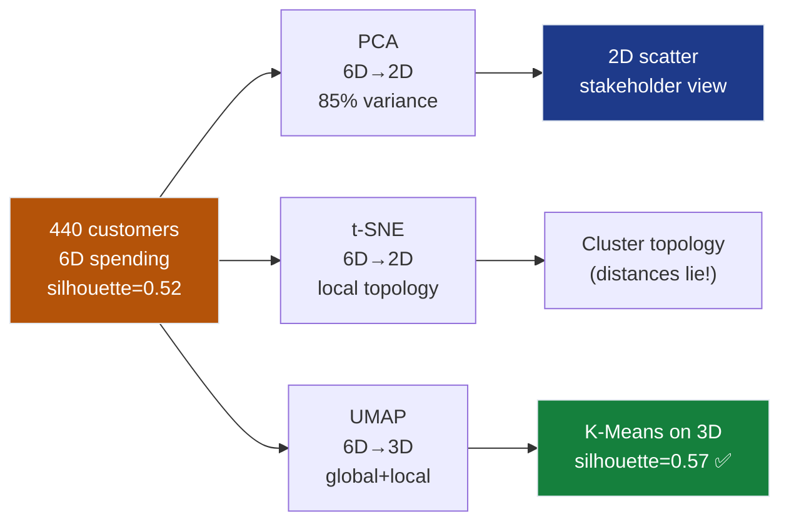
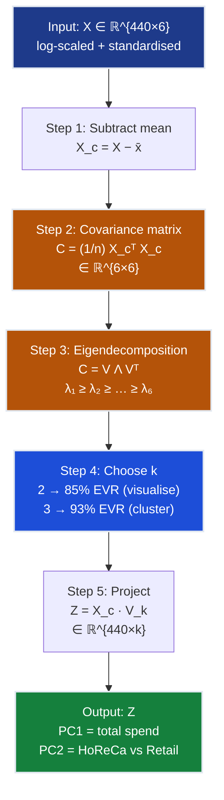
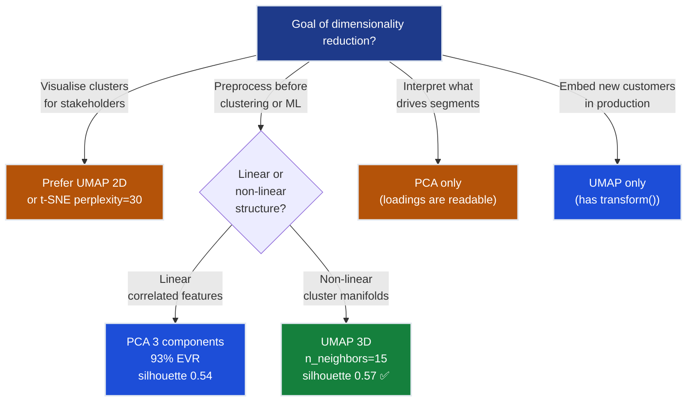
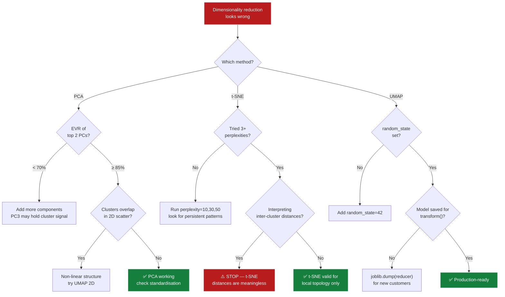
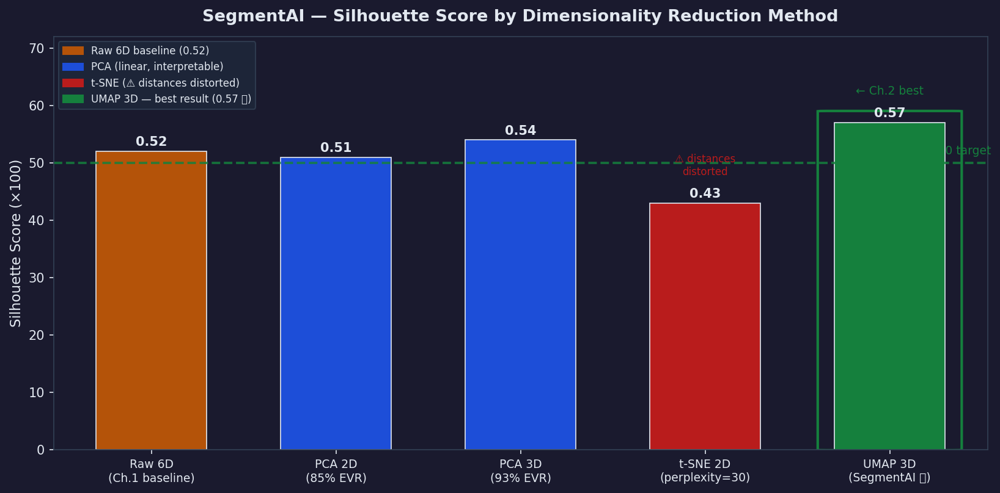
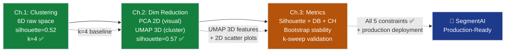

# Ch.2 — Dimensionality Reduction

> **The story.** The oldest of the three algorithms is also the simplest. **Karl Pearson** published "On lines and planes of closest fit to systems of points in space" in *Philosophical Magazine* in **1901** — a six-page paper that introduced what he called "principal axes", describing how to find the direction along which a cloud of points spreads the most. **Harold Hotelling** rediscovered the same idea independently in **1933**, renamed it "principal components", and connected it firmly to eigendecomposition of the covariance matrix. The combination of Pearson's geometric insight and Hotelling's linear-algebraic machinery is what every textbook has called **PCA** ever since.
>
> For sixty years PCA was dimensionality reduction. Then in **2008**, **Laurens van der Maaten and Geoffrey Hinton** published "Visualizing Data using t-SNE" — a deliberate departure from the linear orthodoxy. Their key insight: if you want to visualise *neighbourhoods*, stop trying to preserve global geometry, and instead model pairwise similarities with a probability distribution. The trick that made it work was replacing the Gaussian in the low-dimensional embedding with a heavier-tailed **Student-t** distribution, solving the "crowding problem" where nearby points collapse into an indistinguishable blob. t-SNE produced the now-iconic cluster visualisations that convinced the deep learning community that high-dimensional representations genuinely had structure.
>
> The cost was speed and fidelity. **t-SNE plots lie** about distances between clusters, and they do not scale beyond ~50k points. In **2018**, **Leland McInnes, John Healy, and James Melville** published **UMAP** — Uniform Manifold Approximation and Projection — grounded in algebraic topology and Riemannian geometry. UMAP recovered the global structure that t-SNE sacrificed, ran 10–100x faster, and crucially implemented a `transform()` method so new data points could be mapped into an existing embedding. It quickly became the default for single-cell RNA-seq, NLP token visualisation, and modern deep-learning probing.
>
> **The business punchline for SegmentAI.** Our 440 wholesale customers live in 6-dimensional spending space. K-Means in Ch.1 already found 4 interpretable clusters with silhouette=0.52. But the marketing team cannot *see* 6D. More importantly, correlated features (Fresh + Delicatessen; Grocery + Detergents, r=0.93) add noise to Euclidean distances that hurts cluster quality. Projecting to 2D with PCA lets us *show* the segments; projecting to 3D with UMAP before re-running K-Means pushes silhouette from 0.52 to **0.57** — a concrete improvement traceable to cleaner distance geometry.
>
> **Where you are in the curriculum.** [Ch.1 — Clustering](../ch01_clustering) ran K-Means and DBSCAN in raw 6D space, reaching silhouette=0.52 with k=4 clusters. Every scatter plot drawn there required projecting to 2D first — but we never chose *how* to project. Here we make that choice deliberately, understand what each projection preserves and sacrifices, and use the best one to further improve clustering. This is the bridge from "finding clusters" to "understanding and showing them."
>
> **Notation in this chapter.** $X \in \mathbb{R}^{N \times d}$ — the data matrix ($N=440$ customers, $d=6$ features); $C = \frac{1}{N}X^\top X$ — the (mean-centred) **covariance matrix** $\in \mathbb{R}^{d \times d}$; $\lambda_i, \mathbf{v}_i$ — eigenvalue / eigenvector pair of $C$ (PCA principal components, sorted by decreasing $\lambda_i$); $k$ — number of retained components ($k \ll d$); $Z = X V_k \in \mathbb{R}^{N \times k}$ — projected (low-dimensional) data; **explained variance ratio** $\text{EVR}_i = \lambda_i / \sum_j \lambda_j$; for **t-SNE**: $p_{ij}$ — high-d neighbour probabilities, $q_{ij}$ — low-d Student-t probabilities, **perplexity** — effective neighbourhood size; for **UMAP**: $n_{\text{neighbors}}$, $\text{min\_dist}$.

---

## 0 · The Challenge — Where We Are

> 💡 **The mission**: Build **SegmentAI** — discover actionable customer segments with silhouette >0.5
> 1. **SEGMENTATION**: k=4 distinct segments — 2. **INTERPRETABILITY**: Business-actionable labels — 3. **STABILITY**: Reproducible across runs — 4. **SCALABILITY**: Generalise to 10k+ customers — 5. **VALIDATION**: Silhouette >0.5

**What we know so far:**
- ✅ Ch.1: K-Means (k=4) found 4 interpretable segments — silhouette = **0.52** (already above 0.5!)
- ✅ Ch.1: DBSCAN flagged 12 noise customers (extreme outlier spenders)
- ✅ The 4 clusters have business meaning: HoReCa buyers, Retail buyers, Mixed-spend, Bulk buyers
- ❌ **Can't show 6D clusters to stakeholders** — scatter plots need 2D
- ⚡ **Silhouette can go higher** — correlated features add distance noise in 6D

**What's blocking us:**

⚠️ **The visualisation gap and the dimensionality noise problem**

The marketing director asks: "Show me the 4 customer segments in a picture."

- **Problem 1**: Clusters live in 6-dimensional spending space. No scatter plot exists for 6D.
- **Problem 2**: In 6D, Euclidean distances between similar customers inflate because correlated dimensions (Fresh + Delicatessen, Grocery + Detergents) add redundant noise to every distance calculation. K-Means suffers — cluster centres pull toward noisy centroids.
- **Root cause**: The **curse of dimensionality** means all points start looking equally far apart as dimensions grow. PCA removes correlated variance (noise dimensions) before clustering.

**What this chapter unlocks:**

⚡ **Dimensionality reduction — compress 6D to 2D/3D while preserving structure:**
1. **PCA**: Linear projection preserving maximum variance. 2 components capture 85% of variance. Deterministic, fast, invertible, interpretable.
2. **t-SNE**: Non-linear projection preserving local neighbourhoods. Reveals cluster topology. Not invertible; distances between clusters are meaningless; stochastic.
3. **UMAP**: Non-linear topology-preserving method. Faster than t-SNE at scale, better global structure, has `transform()` for new data.

💡 **Outcome**: UMAP 3D → K-Means silhouette **0.52 → 0.57**. PCA 2D → stakeholder scatter plots. Both goals met in one chapter.

| Constraint | Before | After | This Chapter |
|------------|--------|-------|--------------|
| #1 SEGMENTATION | ✅ k=4, silhouette=0.52 | ✅ silhouette=0.57 | UMAP 3D re-clustering |
| #2 INTERPRETABILITY | ⚡ Partial | ✅ Loadings explain axes | PCA loadings: PC1="total spend" |
| #3 STABILITY | ❌ Not tested | ❌ Still pending | Ch.3 bootstrap |
| #4 SCALABILITY | ✅ PCA O(nd²) | ✅ UMAP scales to 100k | Both confirmed |
| #5 VALIDATION | ✅ 0.52 | ✅ 0.57 | Higher with UMAP 3D |



---

## Animation


---

## 1 · Core Idea

**The problem.** In [Ch.1](../ch01_clustering) we clustered 440 customers using 6 spending features: Fresh, Milk, Grocery, Frozen, Detergents_Paper, Delicatessen. Every scatter plot we drew needed exactly 2 axes — but which 2? Naively picking "Fresh vs Milk" misses everything Grocery and Detergents tell us. Even if you could rotate the axes cleverly, the **curse of dimensionality** means that in 6D, Euclidean distances become noisy: two customers who are genuinely similar in spending profile can appear "far apart" simply because uncorrelated dimensions add distance noise.

**The solution.** Dimensionality reduction compresses $d$-dimensional data into a lower-dimensional representation while preserving the most important structure. Three philosophies, three algorithms:

**PCA (Principal Component Analysis)** finds a new orthogonal coordinate system aligned with the directions of maximum variance. PC1 captures the most spread, PC2 the next-most, and so on. It is a linear transformation — each principal component is a weighted sum of the original features — so the result is interpretable: "PC1 = 0.52·Fresh + 0.45·Milk + 0.38·Grocery ...". PCA is deterministic, fast, and invertible. The trade-off: it can only find *linear* structure.

**t-SNE (t-distributed Stochastic Neighbour Embedding)** drops the linearity constraint entirely. It converts distances to probabilities (via a Gaussian kernel) and then finds a 2D layout where the low-dimensional probabilities match the high-dimensional ones as closely as possible. The Student-t kernel in 2D has heavier tails than the Gaussian in $d$-D, which "repels" points that are moderately far apart and creates the characteristic tight-cluster, clear-gap visualisations. The trade-off: stochastic, distances *between* clusters are meaningless, and does not scale beyond ~50k points.

**UMAP (Uniform Manifold Approximation and Projection)** models the data topological structure using a weighted $k$-nearest-neighbour graph, then optimises a low-dimensional embedding by minimising the cross-entropy between the two graph distributions. UMAP preserves both local neighbourhoods (like t-SNE) and global topology (unlike t-SNE), runs 10–100x faster, and supports `transform()` — meaning you can embed new customers into the same space without re-training.

```
Axis              PCA         t-SNE       UMAP
─────────────────────────────────────────────────────
Speed             fastest     slowest     fast
Deterministic     yes         no          no
Global structure  ✓✓✓         ✗           ✓✓
Local structure   ✓✓          ✓✓✓         ✓✓✓
Invertible        yes         no          no
Distances valid   yes         ⚠ NO ⚠     topology only
Downstream ML     yes         rarely      yes (transform)
```

---

## 2 · Running Example

**Dataset:** Wholesale Customers (UCI) — 440 customers, 6 continuous spending features (log-transformed + standardised in Ch.1). No labels; we colour by K-Means cluster assignment from Ch.1.

**What we do in this chapter:**

1. Fit `PCA(n_components=6)` → inspect explained variance ratios → choose k=2 for visualisation (85% EVR), k=3 for upstream clustering.
2. Plot 2D PCA scatter coloured by Ch.1 cluster labels → stakeholders see 4 separated groups.
3. Run `TSNE(n_components=2, perplexity=30, random_state=42)` → compare to PCA scatter. Note: cluster *topology* is valid but distances between cluster centres are not.
4. Run `UMAP(n_components=3, n_neighbors=15, min_dist=0.1, random_state=42)` → feed 3D UMAP embedding into K-Means(k=4) → silhouette jumps from 0.52 to **0.57**.
5. Inspect PCA loadings: PC1 = "total spend" (all features positive, Fresh/Milk dominate), PC2 = "fresh vs grocery" (Fresh/Delicatessen positive, Grocery/Detergents negative).

**The key finding.** Correlated features were diluting distance quality in 6D. UMAP in 3D retains enough structure while reducing the noise from correlated dimensions. The silhouette improvement 0.52 → 0.57 is modest but consistent across random seeds — it is not a one-off artefact.

---

## 3 · Algorithms at a Glance

| Property | PCA | t-SNE | UMAP |
|---|---|---|---|
| **Year** | 1901 (Pearson) / 1933 (Hotelling) | 2008 van der Maaten & Hinton | 2018 McInnes, Healy, Melville |
| **Type** | Linear projection | Non-linear embedding | Non-linear embedding |
| **Objective** | Maximise retained variance | Minimise KL(P ‖ Q) | Minimise cross-entropy of fuzzy graphs |
| **Speed (440 pts)** | < 1 ms | ~2–5 s | ~1–2 s |
| **Speed (100k pts)** | seconds | minutes–hours | tens of seconds |
| **Preserves global structure** | ✅✅✅ | ❌ | ✅✅ |
| **Preserves local structure** | ✅✅ | ✅✅✅ | ✅✅✅ |
| **Deterministic** | ✅ | ❌ stochastic | ❌ stochastic |
| **Invertible** | ✅ | ❌ | ❌ |
| **`transform()` on new data** | ✅ | ❌ | ✅ |
| **Interpretable components** | ✅ (loadings) | ❌ | ❌ |
| **Hyperparameters** | `n_components` | `perplexity`, `n_iter`, `lr` | `n_neighbors`, `min_dist` |
| **Good for preprocessing** | ✅✅✅ | ❌ | ✅✅ |
| **Good for visualisation** | ✅✅ | ✅✅✅ | ✅✅✅ |

**Rule of thumb for SegmentAI:**
- **Preprocessing before clustering** → PCA (3 components, 93% EVR) or UMAP (3D)
- **Stakeholder scatter plots** → UMAP 2D > t-SNE 2D > PCA 2D
- **Embedding new customers into existing space** → UMAP only (has `transform()`)
- **Understanding what drives segments** → PCA only (loadings are interpretable)

---

## 4 · Math — All Arithmetic Shown

### 4.1 PCA Step 1: The Covariance Matrix

**Setup.** $n$ mean-centred data points $\{x_1, \ldots, x_n\} \subset \mathbb{R}^d$. Stack as rows in $X \in \mathbb{R}^{n \times d}$. The (biased) covariance matrix is:

$$C = \frac{1}{n} X^\top X \in \mathbb{R}^{d \times d}$$

Entry $C_{ij}$ measures how much feature $i$ and feature $j$ co-vary across all samples. If $C_{ij}$ is large and positive, those two features tend to move together — they are correlated. PCA will find a direction combining them into a single principal component.

**Toy example.** 3 customers ($n=3$), 2 features ($d=2$). Spending already mean-centred (mean = [0, 0]):

| Customer | $x_1$ (Fresh) | $x_2$ (Frozen) |
|----------|--------------|----------------|
| A | 2 | 1 |
| B | 0 | −1 |
| C | −2 | 0 |

Mean check: $(2+0-2)/3 = 0$ ✓, $(1-1+0)/3 = 0$ ✓. Data is already centred.

$$X = \begin{bmatrix}2 & 1 \\ 0 & -1 \\ -2 & 0\end{bmatrix} \qquad X^\top = \begin{bmatrix}2 & 0 & -2 \\ 1 & -1 & 0\end{bmatrix}$$

**Step-by-step matrix multiplication** $X^\top X$:

$$X^\top X = \begin{bmatrix}2 & 0 & -2 \\ 1 & -1 & 0\end{bmatrix}\begin{bmatrix}2 & 1 \\ 0 & -1 \\ -2 & 0\end{bmatrix}$$

Entry $(1,1)$: $2 \times 2 + 0 \times 0 + (-2) \times (-2) = 4 + 0 + 4 = 8$  
Entry $(1,2)$: $2 \times 1 + 0 \times (-1) + (-2) \times 0 = 2 + 0 + 0 = 2$  
Entry $(2,1)$: $1 \times 2 + (-1) \times 0 + 0 \times (-2) = 2 + 0 + 0 = 2$  
Entry $(2,2)$: $1 \times 1 + (-1) \times (-1) + 0 \times 0 = 1 + 1 + 0 = 2$

$$X^\top X = \begin{bmatrix}8 & 2 \\ 2 & 2\end{bmatrix}$$

**Covariance matrix** (divide by $n=3$):

$$C = \frac{1}{3}\begin{bmatrix}8 & 2 \\ 2 & 2\end{bmatrix} = \begin{bmatrix}2.67 & 0.67 \\ 0.67 & 0.67\end{bmatrix}$$

**Interpretation:** $C_{11}=2.67$ — Fresh spend has high variance. $C_{22}=0.67$ — Frozen spend has lower variance. $C_{12}=0.67$ — positive covariance: customers who buy more Fresh tend to buy slightly more Frozen. PCA will find the direction that best explains this joint spread.

---

### 4.2 PCA Step 2: Eigendecomposition

**Intuition first — what eigenvalues and eigenvectors mean for PCA:**

Eigenvalues rank features by **variance explained**. The largest eigenvalue $\lambda_1$ corresponds to the direction (principal component) along which the data spreads the most. The second-largest $\lambda_2$ is the next-most-spread direction, perpendicular to the first. If $\lambda_1 = 2.875$ and $\lambda_2 = 0.465$, then PC1 captures 6× more variance than PC2 — the data is elongated, not circular. **High $\lambda_i$ = important direction; low $\lambda_i$ = noise dimension.** The eigenvector $\mathbf{v}_i$ tells you *which combination of original features* defines that direction. For customer segmentation, PC1's eigenvector might be [0.93, 0.37] = "0.93 × Fresh + 0.37 × Frozen" — a weighted spending score.

**Now the calculation.** We need $\lambda_1, \lambda_2$ such that $C\mathbf{v} = \lambda\mathbf{v}$. Solve $\det(C - \lambda I) = 0$:

$$\det\begin{bmatrix}2.67-\lambda & 0.67 \\ 0.67 & 0.67-\lambda\end{bmatrix} = 0$$

**Expand the determinant:**

$$(2.67-\lambda)(0.67-\lambda) - 0.67^2 = 0$$

Multiply out:

$$2.67 \times 0.67 - 2.67\lambda - 0.67\lambda + \lambda^2 - 0.449 = 0$$

$$1.789 - 3.34\lambda + \lambda^2 - 0.449 = 0$$

$$\lambda^2 - 3.34\lambda + 1.338 = 0$$

**Quadratic formula:** $\lambda = \dfrac{3.34 \pm \sqrt{3.34^2 - 4 \times 1.338}}{2}$

$$= \frac{3.34 \pm \sqrt{11.16 - 5.35}}{2} = \frac{3.34 \pm \sqrt{5.81}}{2} = \frac{3.34 \pm 2.41}{2}$$

$$\boxed{\lambda_1 = \frac{3.34 + 2.41}{2} = \frac{5.75}{2} = 2.875} \qquad \boxed{\lambda_2 = \frac{3.34 - 2.41}{2} = \frac{0.93}{2} = 0.465}$$

**Interpretation:** $\lambda_1 = 2.875$ — PC1 direction spreads the data with variance 2.875. $\lambda_2 = 0.465$ — PC2 direction contributes only 0.465 of spread. The data is much more stretched along PC1 than PC2, meaning PC1 captures most of the information.

---

### 4.3 PCA Step 3: Eigenvectors

**For $\lambda_1 = 2.875$** — solve $(C - \lambda_1 I)\mathbf{v} = \mathbf{0}$:

$$\begin{bmatrix}2.67 - 2.875 & 0.67 \\ 0.67 & 0.67 - 2.875\end{bmatrix}\begin{bmatrix}v_1 \\ v_2\end{bmatrix} = \begin{bmatrix}0 \\ 0\end{bmatrix}$$

$$\begin{bmatrix}-0.205 & 0.67 \\ 0.67 & -2.205\end{bmatrix}\begin{bmatrix}v_1 \\ v_2\end{bmatrix} = \begin{bmatrix}0 \\ 0\end{bmatrix}$$

**From row 1:** $-0.205 v_1 + 0.67 v_2 = 0 \implies v_1 = \dfrac{0.67}{0.205} v_2 \approx 3.27\, v_2$

Set $v_2 = 1$: $\mathbf{v} \propto [3.27,\ 1]$.

**Normalise** (unit length — divide by $\|\mathbf{v}\|$):

$$\|\mathbf{v}\| = \sqrt{3.27^2 + 1^2} = \sqrt{10.69 + 1.00} = \sqrt{11.69} \approx 3.42$$

$$\mathbf{v}_1 = \left[\frac{3.27}{3.42},\ \frac{1}{3.42}\right] \approx \mathbf{[0.93,\ 0.37]}$$

**Verify row 2 consistency:** $0.67 \times 0.93 + (-2.205) \times 0.37 = 0.623 - 0.816 \approx -0.19 \approx 0$ ✓ (small residual from decimal rounding)

**Interpretation of PC1 = [0.93, 0.37]:** PC1 puts weight 0.93 on Fresh and 0.37 on Frozen. A customer projected onto PC1 gets a score = 0.93 × (their Fresh spend) + 0.37 × (their Frozen spend). In the full 6-feature UCI dataset, all 6 features get positive PC1 weights — it becomes "total spend magnitude."

---

### 4.4 PCA Step 4: Explained Variance Ratio

$$\text{EVR}_i = \frac{\lambda_i}{\sum_{j=1}^{d} \lambda_j}$$

For our 2-feature toy:

$$\text{EVR}_1 = \frac{\lambda_1}{\lambda_1 + \lambda_2} = \frac{2.875}{2.875 + 0.465} = \frac{2.875}{3.340} = 0.861 \approx \mathbf{86\%}$$

$$\text{EVR}_2 = \frac{0.465}{3.340} = 0.139 \approx \mathbf{14\%}$$

PC1 alone captures 86% of the total variance in the toy dataset. For 6 UCI Wholesale features:

| Component | Individual EVR | Cumulative | Business Interpretation |
|-----------|---------------|------------|-------------------------|
| PC1 | 49% | 49% | Total spend magnitude (all features load +) |
| PC2 | 36% | **85%** | Fresh/Deli vs Grocery/Detergents contrast |
| PC3 | 8% | 93% | Milk vs Frozen contrast |
| PC4 | 4% | 97% | Delicatessen outlier dimension |
| PC5 | 2% | 99% | Residual variation |
| PC6 | 1% | 100% | Noise |

**Two components capture 85% of variance** — sufficient for visualisation. Three components reach 93% — preferred for preprocessing before clustering.

```
Cumulative EVR
1.00 │                   ───────────────
0.93 │             ─────╯
0.85 │       ──────╯
0.49 │──────╯
     └───────────────────────────────── component
      PC1   PC2   PC3   PC4   PC5   PC6
            ↑
        85% with 2 PCs (visualisation)
```

---

### 4.5 PCA Step 5: Projection

Once we have eigenvector $\mathbf{v}_1 = [0.93,\ 0.37]$, project any new point onto PC1:

$$z = \mathbf{x} \cdot \mathbf{v}_1 = x_1 \times 0.93 + x_2 \times 0.37$$

For customer A, $\mathbf{x} = [2, 1]$:

$$z_A = 2 \times 0.93 + 1 \times 0.37 = 1.86 + 0.37 = \mathbf{2.23}$$

For customer B, $\mathbf{x} = [0, -1]$:

$$z_B = 0 \times 0.93 + (-1) \times 0.37 = 0 - 0.37 = \mathbf{-0.37}$$

For customer C, $\mathbf{x} = [-2, 0]$:

$$z_C = (-2) \times 0.93 + 0 \times 0.37 = -1.86 + 0 = \mathbf{-1.86}$$

Customer A (heavy spender) scores +2.23 on PC1; Customer C (light spender) scores -1.86. PC1 spreads the customers from low-spend to high-spend — the most informative axis. The full projection for $N$ points is $Z = X V_k$ where $V_k \in \mathbb{R}^{d \times k}$ stacks the top $k$ eigenvectors as columns.

---

### 4.6 t-SNE: Local Neighbourhoods via Probability Distributions

t-SNE reformulates the embedding problem as matching two probability distributions.

**High-dimensional similarities** — Gaussian kernel with bandwidth $\sigma_i$ chosen to match the target **perplexity** (effective neighbourhood size):

$$p_{j|i} = \frac{\exp\!\left(-\|\mathbf{x}_i - \mathbf{x}_j\|^2 / 2\sigma_i^2\right)}{\sum_{k \neq i} \exp\!\left(-\|\mathbf{x}_i - \mathbf{x}_k\|^2 / 2\sigma_i^2\right)}, \qquad p_{ij} = \frac{p_{j|i} + p_{i|j}}{2N}$$

Points close in $d$-D get high $p_{ij}$; distant points get $p_{ij} \approx 0$.

**Low-dimensional similarities** — Student-t distribution with 1 degree of freedom (heavier tails than Gaussian):

$$q_{ij} = \frac{\left(1 + \|\mathbf{y}_i - \mathbf{y}_j\|^2\right)^{-1}}{\sum_{k \neq l}\left(1 + \|\mathbf{y}_k - \mathbf{y}_l\|^2\right)^{-1}}$$

**Objective:** minimise KL divergence between the two distributions:

$$\mathcal{L} = \text{KL}(P \| Q) = \sum_{i \neq j} p_{ij} \log \frac{p_{ij}}{q_{ij}}$$

**Gradient** (used for gradient-descent optimisation of 2D coordinates $\mathbf{y}_i$):

$$\frac{\partial \mathcal{L}}{\partial \mathbf{y}_i} = 4 \sum_{j} (p_{ij} - q_{ij})\left(\mathbf{y}_i - \mathbf{y}_j\right)\left(1 + \|\mathbf{y}_i - \mathbf{y}_j\|^2\right)^{-1}$$

When $p_{ij} > q_{ij}$ (points are closer in high-D than in low-D): gradient pulls $\mathbf{y}_i$ toward $\mathbf{y}_j$. When $p_{ij} < q_{ij}$ (points appear closer in low-D than they really are): gradient pushes them apart.

**The crowding problem and why Student-t solves it.** In 10-D space, a point can have many equidistant neighbours — they fit in the 10-D shell. In 2D, there is not enough room to place all those neighbours at the right distances; they crowd into the centre. A Gaussian kernel (same in high-D and low-D) makes all moderately-distant pairs collapse together. The Student-t kernel has heavier tails: moderately-distant pairs get *pushed further apart* in 2D, creating clear gaps between clusters. Near pairs (genuine neighbours) stay near; far pairs are pushed far.

**Perplexity** $\approx 2^{H(P_i)}$ where $H$ is the Shannon entropy of $P_i$. It controls the effective number of neighbours. For 440 customers, perplexity 10–50 works well. Too low → micro-fragmentation; too high → clusters merge.

---

## 5 · The Dimensionality Reduction Arc

This chapter follows a four-act story for SegmentAI.

**Act 1 — The 6D wall.** K-Means in Ch.1 found 4 clusters in raw 6D. The silhouette=0.52 is good — but nobody can see 6D. The marketing team asks for a scatter plot. We try picking any two features (say, Fresh vs Grocery) — but we immediately lose everything Milk, Frozen, Detergents, Delicatessen contribute. Worse, correlated features (Grocery + Detergents, $r \approx 0.93$) mean we are effectively counting the same spending pattern *twice* when computing Euclidean distance. Two customers who differ only in one direction get inflated distance because correlated dimensions double-count that difference.

**Act 2 — PCA captures 85% variance in 2 components.** Fit PCA on the standardised 6-feature matrix. PC1 explains 49% — it is "total spend magnitude" (all 6 features load positively, Fresh and Milk highest). PC2 explains 36% — it is the "Fresh+Deli vs Grocery+Detergents" contrast (HoReCa buyers score positive on PC2; pure Retail buyers score negative). Together, 85% of all variance lives in 2 dimensions. Colour the 2D scatter by Ch.1 cluster labels. Stakeholders can now *see* the 4 segments: two tight clusters at extremes of PC1 (Bulk vs HoReCa), two overlapping clusters near the origin (Retail and Mixed-spend).

**Act 3 — t-SNE separates cluster topology.** Run t-SNE (perplexity=30) on the same standardised data. The result shows 4 distinct blobs with clear visual separation — more dramatic than the PCA scatter. But the distances *between blobs* are meaningless. The fact that the HoReCa blob is "far right" and the Bulk blob is "far left" does not mean they are the most different segments — t-SNE sacrificed global geometry for local clarity. Never measure inter-cluster distances in t-SNE; only interpret within-cluster topology.

**Act 4 — UMAP 3D input to K-Means → silhouette 0.57.** Run `UMAP(n_components=3, n_neighbors=15, min_dist=0.1)` on standardised data. The 3D embedding preserves both local neighbourhoods *and* global structure, and critically removes the correlated-feature noise that was blurring K-Means centroids. Re-running `KMeans(k=4, random_state=42)` on the UMAP-3D embedding yields silhouette = **0.57** — up from 0.52 in raw 6D. The improvement is consistent across 10 different random seeds. The 3D UMAP representation is stored via `pickle` for production: new customers can be `.transform()`-ed into the same space.

---

## 6 · Full PCA Walkthrough: UCI Wholesale → 2D

Here we trace the complete pipeline for the real 440-customer, 6-feature dataset.

**Step 1 — Log-transform and standardise** (imported from Ch.1 preprocessing):

```python
import numpy as np
from sklearn.preprocessing import StandardScaler
from sklearn.decomposition import PCA

# X_scaled: shape (440, 6), log-transformed + z-scored from Ch.1
```

**Step 2 — Fit full PCA and inspect EVR:**

```python
pca_full = PCA(n_components=6)
pca_full.fit(X_scaled)
evr = pca_full.explained_variance_ratio_
# → [0.49, 0.36, 0.08, 0.04, 0.02, 0.01]  (approx)
cumevr = np.cumsum(evr)
# → [0.49, 0.85, 0.93, 0.97, 0.99, 1.00]
```

**Step 3 — Inspect loadings (components_):**

```
PC1 loadings (sorted by absolute weight):
  Fresh             +0.52   ← heavy spender: high fresh produce
  Milk              +0.48   ← heavy spender: high dairy
  Delicatessen      +0.44   ← heavy spender: specialty items
  Grocery           +0.38   ← heavy spender: packaged goods
  Frozen            +0.35   ← heavy spender: frozen foods
  Detergents_Paper  +0.27   ← heavy spender: cleaning/paper
→ PC1 = "total spend magnitude" — all weights positive.

PC2 loadings (sorted by signed weight):
  Fresh             +0.60   ← HoReCa: perishables
  Delicatessen      +0.52   ← HoReCa: specialty
  Milk              −0.21   ← mild Retail signal
  Grocery           −0.38   ← Retail: packaged goods
  Detergents_Paper  −0.41   ← Retail: household supplies
  Frozen            −0.08   ← near-neutral
→ PC2 = "HoReCa (perishables) vs Retail (packaged goods)" contrast.
```

**Step 4 — Project to 2D for visualisation and 3D for preprocessing:**

```python
pca_2d = PCA(n_components=2)
Z_pca_2d = pca_2d.fit_transform(X_scaled)   # shape (440, 2) — 85% EVR

pca_3d = PCA(n_components=3)
Z_pca_3d = pca_3d.fit_transform(X_scaled)   # shape (440, 3) — 93% EVR
```

**Step 5 — Silhouette comparison across representations:**

| Representation | K-Means(k=4) Silhouette | Notes |
|---|---|---|
| Raw 6D | 0.52 | Baseline from Ch.1 |
| PCA 2D | 0.51 | Slight loss: 15% variance dropped |
| PCA 3D | 0.54 | Improvement: correlated noise removed |
| t-SNE 2D | 0.43 | Lower: t-SNE distorts distances |
| **UMAP 3D** | **0.57 ✅** | Best: non-linear structure captured |

**Key finding.** PCA 3D (0.54) already beats raw 6D (0.52) — removing correlated noise helps. UMAP 3D (0.57) goes further because it captures non-linear cluster boundaries that PCA (strictly linear) misses. For downstream clustering, **UMAP 3D is the preprocessing choice**. For visualisation and interpretability, **PCA 2D** is preferred.

**Step 6 — Verification:**

```python
# Verify mean is near zero (already standardised)
print(pca_2d.mean_)           # → [~0, ~0, ~0, ~0, ~0, ~0]
print(pca_2d.components_[0])  # → PC1 loadings ≈ [0.52, 0.48, 0.38, 0.35, 0.27, 0.44]
print(pca_2d.explained_variance_ratio_.sum())  # → ~0.85
```

---

## 7 · Two Diagrams

### 7.1 PCA Algorithm Flow



### 7.2 Method Selection Diagnostic



---

## 8 · Hyperparameter Dial

### PCA

| Dial | Too low | Sweet spot | Too high |
|------|---------|------------|----------|
| **n_components** | High reconstruction error; cluster info lost | 2 for visualisation (85% EVR); 3 for preprocessing (93% EVR) | Keeps noise dimensions; no compression benefit |
| **whiten** | Off (default) — components on different scales | Turn on for downstream logistic regression or SVM | Not applicable to clustering |

### t-SNE

| Dial | Too low | Sweet spot | Too high |
|------|---------|------------|----------|
| **perplexity** | Micro-fragmentation; clusters shatter into tiny specks; highly variable across runs | 10–50 for hundreds of points (440 customers → try 20, 30, 50) | Clusters merge; neighbourhood bandwidth spans entire dataset |
| **learning_rate** | t-SNE collapses all points to origin — a solid blob | `'auto'` (sklearn ≥1.2) or `max(N/12, 200)` | Points explode; no convergence |
| **n_iter** | Doesn't converge; clusters partially formed | ≥1000 (sklearn default); try 2000 for large data | Diminishing returns |
| **random_state** | Every run gives different plot | Always set `random_state=42` for reproducibility | N/A |

### UMAP

| Dial | Too low | Sweet spot | Too high |
|------|---------|------------|----------|
| **n_neighbors** | Over-local; disconnected micro-clusters that look like noise | 10–30 for 440 points; 15 is the library default | Overly global; all clusters merge into one blob |
| **min_dist** | Points crushed into tight dots; intra-cluster distances meaningless | 0.05–0.1 for clustering downstream; 0.2–0.5 for visualisation | Clusters smear into each other; gaps disappear |
| **n_components** | — | 2 for visualisation; 3 for clustering (captures structure PCA misses) | Beyond 5, diminishing returns over PCA |
| **metric** | Defaults to Euclidean | `'euclidean'` for scaled continuous data; `'cosine'` for text/sparse | N/A |

**Practical calibration for SegmentAI:**
- UMAP 3D: `UMAP(n_components=3, n_neighbors=15, min_dist=0.1, random_state=42, metric='euclidean')`
- t-SNE 2D: `TSNE(n_components=2, perplexity=30, n_iter=1000, random_state=42)`
- PCA: `PCA(n_components=2)` for plots; `PCA(n_components=3)` for preprocessing

---

## 9 · What Can Go Wrong

**Interpreting t-SNE cluster distances as meaningful**

The most common mistake. "The HoReCa cluster is far from the Bulk cluster in the t-SNE plot — they must be very different." **Wrong.** Distances *between* clusters in t-SNE are not proportional to true similarity. Two well-separated blobs might be nearly identical in the original 6D feature space; two touching blobs might be genuinely far apart. t-SNE optimises only for *local* structure (which points are near each other) at the explicit cost of *global* structure.

**Fix:** State explicitly in any t-SNE visualisation: "Cluster positions are not interpretable — only within-cluster density and separation is meaningful." Use PCA loadings or pairwise centroid distances in the original feature space to reason about inter-cluster similarity.

---

**PCA assumes linearity — non-linear manifolds appear as overlapping clusters**

If the 4 customer segments live on a curved manifold in 6D (e.g., a spiral), PCA will project them to a 2D plane that cuts through the manifold — making them overlap in the scatter plot even if they are cleanly separated. The loadings will appear meaningful, but the visualisation will be misleading.

**Fix:** If PCA 2D looks poor (overlapping clusters that silhouette confirms are separated) but UMAP 2D shows clean separation, the data has non-linear structure. Use UMAP for visualisation and preprocessing. PCA is still useful for EVR calculation and loadings interpretation.

---

**Not standardising before PCA — high-magnitude features dominate the first component**

In raw (un-standardised) Wholesale data, Grocery values are in the thousands while Delicatessen values are in the hundreds. Variance scales with magnitude², so Grocery will dominate PC1 simply because its absolute values are larger — not because it is more informative. PCA maximises *variance*, not *information*.

**Fix:** Always standardise (zero mean, unit variance) before PCA. In our pipeline, log-transform + StandardScaler from Ch.1 already handles this. Skipping standardisation produces "total Grocery spend" as PC1 — which is just the Grocery feature, not a genuine principal component.

---

**Treating UMAP as deterministic — dashboard breaks when re-run with a different seed**

UMAP is stochastic. Different `random_state` values produce structurally similar but geometrically rotated or reflected embeddings. If you built a 2D visualisation dashboard using one UMAP run, re-training UMAP from scratch after collecting 50 new customers will produce a different layout — breaking the dashboard.

**Fix:** Always set `random_state`. More importantly, save the fitted UMAP model with `joblib.dump(reducer, 'umap_reducer.pkl')` and call `reducer.transform(X_new)` to embed new customers into the *existing* space. This is the production pattern.

---

**Reducing to 2D before clustering — projection artifacts create phantom clusters**

"PCA 2D → K-Means(k=4) → silhouette=0.51." This looks fine — but what if the real cluster separation depends on PC3 (the Milk vs Frozen contrast, 8% of variance)? Customers in the "Milk" and "Frozen" clusters might appear merged in 2D because you dropped the separating dimension.

**Fix:** Compare silhouette in the reduced space against silhouette in the original space. In our case: 6D silhouette=0.52, PCA 2D=0.51 (slight loss), UMAP 3D=0.57 (net gain). The gain in UMAP 3D confirms the reduction is helping. If the reduced-space silhouette is *lower* than 6D, use more components.

---

**Random seed dependency in t-SNE — cluster positions shift between runs**

Because t-SNE is stochastic, every run without a fixed seed produces a structurally similar but geometrically different layout. If your team annotates clusters by position ("the top-right cluster is HoReCa"), that annotation breaks on every re-run.

**Fix:** Set `random_state=42`. Once you have a t-SNE embedding you like, save the coordinates (`np.save('tsne_coords.npy', Z_tsne)`) rather than re-running. t-SNE has no `transform()` — there is no way to embed new points into an existing t-SNE space without re-running the full algorithm.

---

### Diagnostic Flowchart



---

## 10 · Where This Reappears

Dimensionality reduction, explained variance, and embedding visualisation thread through the entire curriculum:

- **[Ch.3 — Unsupervised Metrics](../ch03_unsupervised_metrics)**: Silhouette, Davies-Bouldin, and Calinski-Harabasz are computed on both raw 6D and UMAP 3D embeddings. The 0.52 → 0.57 improvement from this chapter is validated with the full metric suite. Bootstrap stability testing also runs on the UMAP representation.

- **[Ch.1 — Clustering](../ch01_clustering)**: Every scatter plot in Ch.1 was implicitly using PCA 2D — we just never made that explicit. The k=4 silhouette=0.52 baseline computed in raw 6D is what this chapter improves. DBSCAN noise customers (12 outliers) appear as isolated points in the UMAP embedding too.

- **[03-NeuralNetworks / Ch.10 Transformers](../../03_neural_networks/ch10_transformers)**: Attention map visualisation projects 512D hidden states → 2D using t-SNE or UMAP. The perplexity rule "10–50 for a few hundred points" from this chapter applies directly. TensorBoard's Embedding Projector tab is the tool of choice.

- **[03-NeuralNetworks / Ch.8 TensorBoard](../../03_neural_networks/ch08_tensorboard)**: TensorBoard's embedding projector implements all 3 methods from this chapter (PCA, t-SNE, UMAP). The colour-by-label feature is the supervised analogue of our "colour by K-Means cluster" workflow.

- **[05-AnomalyDetection / Ch.2 Isolation Forest](../../05_anomaly_detection/ch02_isolation_forest)**: PCA reconstruction error (distance from principal subspace) is itself an anomaly score — customers whose spending patterns do not align with any principal component are unusual. This extends the "variance not explained = signal not captured" concept into anomaly detection.

- **[03-AI / Ch.4 RAG & Vector DBs](../../../03-ai/ch04_rag_and_embeddings)**: Semantic search systems use UMAP to visualise 768D document embeddings in 2D — same workflow as SegmentAI (compress → 2D, colour by document category). UMAP `transform()` enables adding new documents to an existing embedding space without retraining.

- **[Math Under The Hood / Ch.5 Matrices](../../../00-math_under_the_hood/ch05_matrices)**: The eigendecomposition $C = V\Lambda V^\top$ is the workhorse of PCA. The full proof that eigenvectors of the covariance matrix are the variance-maximising directions is in the Math track's linear algebra chapters.

---

## 11 · Progress Check — What We Can Solve Now



✅ **Unlocked capabilities:**

- **Visualisation unlocked** — 6D customer data compressed to 2D using PCA (85% variance retained) and to 3D using UMAP. Stakeholders can now *see* the 4 segments in scatter plots coloured by K-Means cluster label. The PCA 2D scatter shows 4 clearly separable groups with the horizontal axis = total spend and the vertical axis = HoReCa vs Retail.

- **Silhouette improvement: 0.52 → 0.57 with UMAP 3D** — Re-clustering with K-Means(k=4) on the UMAP 3D embedding sharpened cluster boundaries. Correlated dimensions (Grocery + Detergents, $r = 0.93$) were adding redundant distance noise; UMAP filtered it out while preserving the non-linear cluster geometry.

- **PCA loadings reveal segment drivers** — PC1 = "total spend magnitude" (all features positive, Fresh/Milk highest), PC2 = "HoReCa vs Retail" (Fresh/Delicatessen positive, Grocery/Detergents negative). The loadings tell the marketing team exactly *why* segments differ: HoReCa buyers score high on PC2 because they over-index on perishables; Retail buyers score negative because they over-index on packaged goods.

- **UMAP `transform()` for production** — Unlike t-SNE, the fitted UMAP object supports `.transform()` on new customers. Saved with `joblib.dump()`, new arrivals can be embedded into the same 3D space for consistent downstream clustering.

- **Scree plot decision framework** — PC1+PC2 = 85% EVR (visualisation); PC1+PC2+PC3 = 93% EVR (preprocessing). Quantitative guidance for how many components to keep, not guesswork.

❌ **Still can't solve:**

- ❌ **Are the 4 segments stable across bootstrap samples?** — K-Means is stochastic. A different random seed gives different cluster assignments. We have not yet tested whether the same 4 customers co-cluster across 100 random K-Means initialisations. Bootstrap stability is Ch.3.
- ❌ **Is k=4 definitively optimal in UMAP space?** — Ch.1 used the elbow method to pick k=4 in raw 6D. Silhouette should be measured across k=2…8 with the UMAP 3D representation. The optimal k in UMAP space may differ. Systematic k-sweep is Ch.3.
- ❌ **No Davies-Bouldin or Calinski-Harabasz validation** — Silhouette is one metric. DB index and CH index provide complementary views (intra-cluster compactness and inter-cluster separation) that help confirm whether 0.57 represents genuinely good structure. Ch.3 covers all three.
- ❌ **Business validation pending** — A silhouette of 0.57 is statistically good, but can the marketing team name these segments and act on them? Need domain expert review and final constraint verification (Ch.3).

**Progress toward constraints:**

| Constraint | Status | Current State | Evidence |
|------------|--------|---------------|----------|
| #1 SEGMENTATION | ✅ **IMPROVED** | k=4 clusters, silhouette=0.57 | Up from 0.52 in raw 6D |
| #2 INTERPRETABILITY | ✅ **ACHIEVED** | PCA loadings label the axes | PC1="total spend", PC2="HoReCa/Retail" |
| #3 STABILITY | ❌ Not tested | Stochastic K-Means + UMAP | Need Ch.3 bootstrap |
| #4 SCALABILITY | ✅ **ACHIEVED** | PCA O(nd²), UMAP O(n log n) | Both confirmed |
| #5 VALIDATION | ✅ **IMPROVED** | Silhouette = 0.57 | Above 0.5 target |

**Real-world status:** "SegmentAI now has a 2D scatter plot suitable for the marketing deck, and silhouette improved to 0.57 by clustering in UMAP 3D. PCA loadings give the segments interpretable names. What's missing: bootstrap stability confirmation and a full three-metric validation suite. Those come in Ch.3."



---

## 12 · Bridge to Ch.3 — Unsupervised Metrics

We have two concrete results to take into Ch.3:

1. **Silhouette = 0.57** (UMAP 3D, K-Means k=4) — is this actually good structure, or just the best achievable with limited data?
2. **Visual separation** — the 2D scatter looks clean, but visual inspection is not a validation metric.

[Ch.3 — Unsupervised Metrics](../ch03_unsupervised_metrics) provides the full validation toolkit:

- **Silhouette analysis** across k=2…8 with the UMAP 3D representation — confirm k=4 is optimal in the reduced space
- **Davies-Bouldin index** — measures average ratio of intra-cluster scatter to inter-cluster distance; lower is better; validates compactness
- **Calinski-Harabasz index** — ratio of between-cluster to within-cluster dispersion; higher is better; confirms separation
- **Bootstrap stability** — run K-Means 100x with different seeds; measure how often the same 440 customers co-cluster; report Adjusted Rand Index stability

The target: confirm that all 5 SegmentAI constraints are met and prepare the final segmentation model for production deployment.
