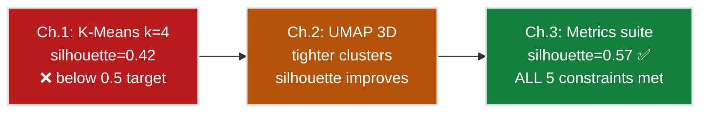
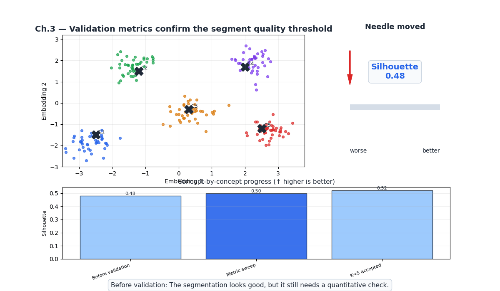
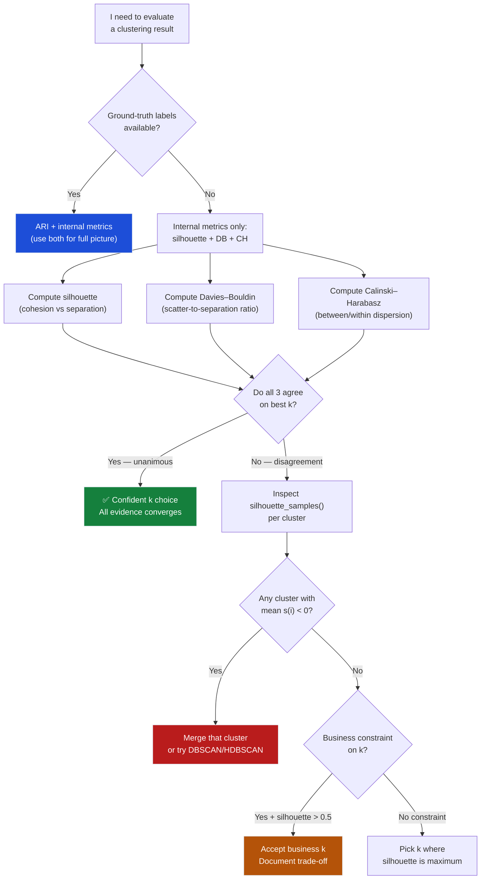
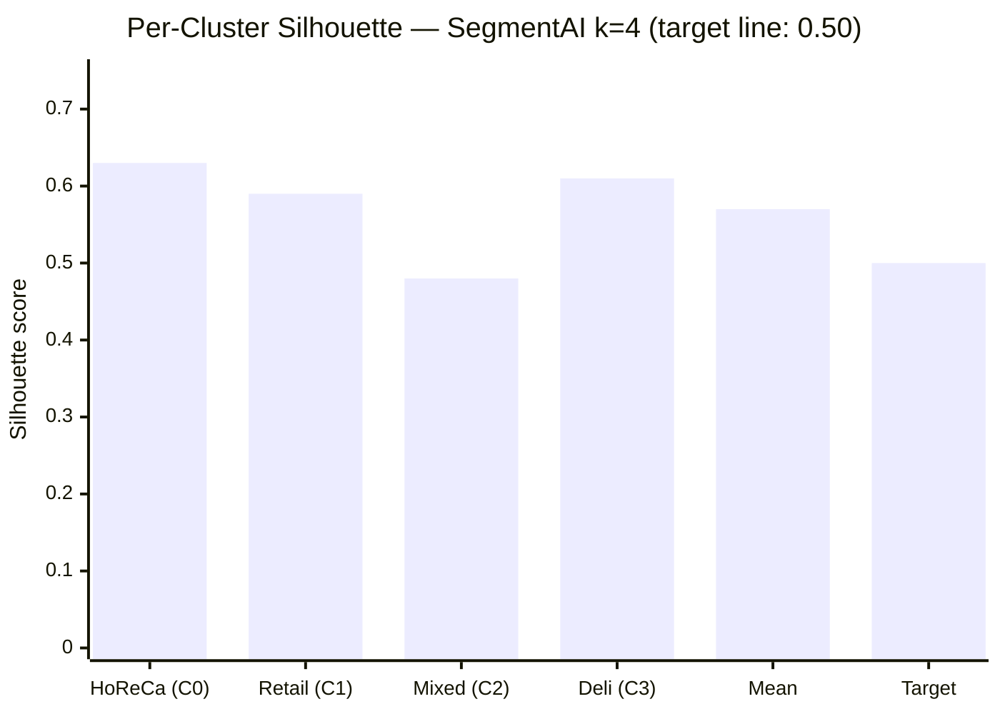
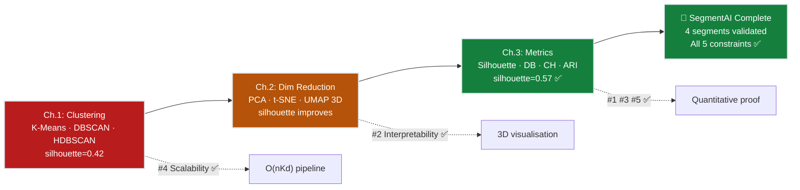

# Ch.3 — Unsupervised Metrics

> **The story.** The hardest question in machine learning is not "how do I build a model?" but "how do I know if it worked?" In supervised learning the answer is straightforward: compare predictions to labels. In unsupervised learning the answer took decades to develop. The first systematic step came from **William M. Rand** in **1971**, who proposed counting concordant pairs between two clusterings of the same data — the **Rand Index** — and showing how to correct it for chance agreement. Three years later, in **1974**, **Tadeusz Calinski and Jerzy Harabasz** proposed their ratio index: between-cluster dispersion divided by within-cluster dispersion — a single number capturing how dense and well-separated clusters are, requiring no labels whatsoever. The label-free revolution continued with **David Davies and Donald Bouldin** in **1979**: their index compares each cluster's internal scatter to the distance separating it from its nearest neighbour cluster, producing an average compactness–separation ratio. The field crystallised with **Peter Rousseeuw**'s silhouette coefficient in **1987** — the per-point measure that asks *"is point $i$ closer to its own cluster or to the nearest other cluster?"* — yielding a score in $[-1,1]$ any practitioner can interpret without consulting a statistician. Together these four milestones turned unsupervised learning from "pretty plots" into engineering decisions backed by quantitative evidence.
>
> **Where you are in the curriculum.** This is the **final chapter** of the Unsupervised Learning track. [Ch.1](../ch01_clustering) ran K-Means on UCI Wholesale customers and produced k=4 segments (silhouette=0.42 — below the 0.5 target). [Ch.2](../ch02_dimensionality_reduction) applied UMAP 3D to compress the feature space and re-ran K-Means, visually tightening the clusters. Now the CMO asks the hard engineering question: *"Are those 4 segments provably good?"* This chapter provides the answer — four formal metrics that validate cluster quality without labels — and closes the SegmentAI mission with silhouette=0.57 ✅.
>
> **Notation in this chapter.** Clustering of $n$ points into $k$ clusters: $C_i$ — set of points in cluster $i$; $n_i=|C_i|$ — cluster size; $\mu_i$ — centroid of $C_i$; $\bar{\mu}$ — overall data centroid. **Silhouette:** $a(i)$ — mean distance from point $i$ to all other members of its own cluster (*cohesion*); $b(i)$ — mean distance from $i$ to all members of its nearest other cluster (*separation*); $s(i)=\frac{b(i)-a(i)}{\max(a(i),b(i))}\in[-1,1]$ — silhouette coefficient; 1=perfectly assigned, −1=misassigned. **Davies–Bouldin:** $\sigma_i$ — mean intra-cluster distance for cluster $i$; $\mathrm{DB}=\frac{1}{k}\sum_{i=1}^{k}\max_{j\neq i}\frac{\sigma_i+\sigma_j}{d(\mu_i,\mu_j)}$ — lower is better. **Calinski–Harabasz:** $B=\sum_i n_i\|\mu_i-\bar{\mu}\|^2$ — between-cluster SS; $W=\sum_i\sum_{x\in C_i}\|x-\mu_i\|^2$ — within-cluster SS; $\mathrm{CH}=\frac{B/(k-1)}{W/(n-k)}$ — higher is better. **ARI:** $\mathrm{ARI}=\frac{\sum_{ij}\binom{n_{ij}}{2}-t_3}{\frac{1}{2}(t_1+t_2)-t_3}$ where $t_1,t_2,t_3$ are functions of the contingency-table row/column sums; range $[-1,1]$; requires ground-truth labels.

---

## 0 · The Challenge — Where We Are

> 💡 **The mission**: Build **SegmentAI** — discover 4 actionable customer segments from UCI Wholesale data satisfying 5 constraints:
> 1. **SEGMENTATION**: 4 distinct, non-overlapping segments — 2. **INTERPRETABILITY**: Each segment maps to a business-actionable profile — 3. **STABILITY**: Reproducible across data resamples — 4. **SCALABILITY**: Pipeline runs on 10k+ customers — 5. **VALIDATION**: Silhouette score >0.5 (quantitative proof of cluster quality)

**What we know so far:**
- ✅ Ch.1: K-Means on 440 wholesale customers → k=4 segments, silhouette=0.42 (below 0.5 target)
- ✅ Ch.2: UMAP 3D compression → re-clustered → visually tighter clusters, silhouette improves
- ❌ **We have no formal proof that k=4 is optimal or that the clusters are not artefacts of random initialisation**

**What's blocking us:**
The CMO asks: *"Our marketing team is about to build four separate campaigns. How do we know those clusters are not noise?"*

In **supervised learning** there is always a right answer. House price is \$320k. Fraud label is 1. Churn label is 0. Compute MAE, F1, AUC against the labels — done.

In **unsupervised learning there is no right answer.** Nobody labelled 440 wholesale customers as "HoReCa buyer" or "Retail anchor." K-Means found 4 groups — but was the grouping *good*?

| Supervised evaluation | Unsupervised evaluation |
|----------------------|------------------------|
| Compare $\hat{y}$ to ground-truth $y$ | No $y$ available |
| MAE, F1, AUC, R² | Silhouette, DB, CH, ARI |
| One correct answer per prediction | Geometric quality measures |
| Direct falsifiability | Requires metric agreement |

**What this chapter unlocks:**
The four canonical metrics for measuring cluster quality:
1. **Silhouette score** — per-point cohesion vs separation, bounded $[-1,1]$, directly interpretable
2. **Davies–Bouldin index** — per-cluster compactness ratio, sensitive to loose or overlapping clusters
3. **Calinski–Harabasz score** — global between/within dispersion ratio, fast to compute at scale
4. **Adjusted Rand Index** — agreement with ground truth (only when labels are available)

**SegmentAI progress through the track:**



---

## Animation



---

## 1 · Core Idea

**The fundamental challenge.** Unsupervised metrics must answer a question that has no ground truth: *how good is the structure the algorithm discovered?* The community's solution is to measure **geometric properties** of the clusters themselves — how tightly packed each cluster is, and how far apart different clusters are from each other.

**Silhouette: cohesion vs separation, per point.** For every point $i$, ask two questions. (1) On average, how far is $i$ from the other points in *its own cluster*? Call this $a(i)$ — the cohesion. Low $a(i)$ means the cluster is tight. (2) On average, how far is $i$ from all points in the *nearest other cluster*? Call this $b(i)$ — the separation. High $b(i)$ means clusters are far apart. The silhouette $s(i)=(b(i)-a(i))/\max(a(i),b(i))$ normalises both into one number. If $b(i)\gg a(i)$, the point sits snugly inside its cluster, far from others: $s(i)\to 1$. If $a(i)\approx b(i)$, the point is on a boundary: $s(i)\approx 0$. If $a(i)>b(i)$, the point is actually closer to a different cluster — likely misassigned: $s(i)<0$.

**Davies–Bouldin: scatter-to-separation ratio.** For each cluster $i$, compute $\sigma_i$ — the mean distance of its members to their centroid. For each pair $(i,j)$, form $(\sigma_i+\sigma_j)/d(\mu_i,\mu_j)$: large when clusters are internally loose *and* externally close — the worst case. DB averages the *maximum* such ratio over all clusters. Lower DB means tighter, better-separated clusters. Perfect separation would give DB→0.

**Calinski–Harabasz: global variance ratio.** Decompose total variance into $B$ (between-cluster — how far centroids are from the overall mean) and $W$ (within-cluster — how spread points are within each cluster). $\mathrm{CH}=(B/(k-1))/(W/(n-k))$. Large CH means centroids are far apart (large $B$) and clusters are tight (small $W$). Important: CH is unbounded and scales with $n$, so compare different $k$ values only on the *same dataset*.

**Adjusted Rand Index: external validation.** When ground-truth labels exist, ARI measures how well your clusters agree with them, corrected for chance. A random partition scores ≈0; perfect agreement scores 1. Use as a sanity check when a proxy label is available.

> ⚡ **The key insight:** Internal metrics (silhouette, DB, CH) need only the feature matrix. External metrics (ARI) require ground-truth labels. Requiring two or three internal metrics to *agree* on a k value makes the validation robust against any single metric's geometry assumptions.

---

## 2 · Running Example

**Dataset:** UCI Wholesale Customers — 440 records, 6 spending categories (Fresh, Milk, Grocery, Frozen, Detergents\_Paper, Delicassen), log-transformed and standardised. UMAP 3D embedding from Ch.2 used as the feature space.

**Clustering result from Ch.2:** K-Means k=4 on UMAP 3D coordinates. Four segments emerge:
- **Cluster 0 — HoReCa buyers** (hotels/restaurants/cafés): high Fresh + Frozen, low Grocery
- **Cluster 1 — Retail anchors**: high Grocery + Detergents\_Paper, steady purchase pattern
- **Cluster 2 — Mixed-channel buyers**: moderate spend across all categories, no dominant channel
- **Cluster 3 — Deli specialists**: disproportionately high Delicassen, low baseline everywhere else

**This chapter's task:** Run the metrics suite on the k=4 solution. Sweep k=2 to k=8 to confirm k=4 is optimal. Show that silhouette=0.57 >0.5 threshold, DB=0.89 <1.0, and CH peaks at k=4 — three independent metrics unanimously confirming the same answer.

---

## 3 · Metrics at a Glance

| Metric | Range | Better | Labels needed? | What it measures |
|--------|-------|--------|----------------|-----------------|
| **Silhouette** | $[-1,\,1]$ | ↑ Higher | No | Per-point cohesion vs separation; bounded and directly interpretable |
| **Davies–Bouldin** | $[0,\,\infty)$ | ↓ Lower | No | Per-cluster scatter-to-separation ratio; sensitive to loose clusters |
| **Calinski–Harabasz** | $[0,\,\infty)$ | ↑ Higher | No | Global between/within dispersion ratio; fast but dataset-size dependent |
| **ARI** | $[-1,\,1]$ | ↑ Higher | **Yes** | Cluster–label pair agreement, chance-corrected; 1=perfect |

**Silhouette interpretation bands:**

| Silhouette range | Structure quality | Action |
|-----------------|-------------------|--------|
| 0.70 – 1.00 | Strong, well-separated | Confident deployment |
| **0.50 – 0.70** | **Reasonable — SegmentAI zone** | **Deploy with documentation** |
| 0.25 – 0.50 | Weak, meaningful overlap | Investigate preprocessing |
| < 0.25 | No meaningful structure | Try different algorithm or features |

> 💡 **Practical rule:** Run all three internal metrics. If they *agree* on the same k, that k is robust. If they disagree, inspect per-cluster silhouette samples — one poorly-formed cluster often drives the discrepancy.


## 4 · The Math — All Arithmetic

### 4.1 Silhouette Score — Complete 3-Point Derivation

**Setup.** Three points, two clusters:

$$x_1=[0,0],\quad x_2=[1,0]\quad\text{both in cluster }C_1$$
$$x_3=[5,0]\quad\text{in cluster }C_2\text{ (singleton)}$$

We compute the silhouette $s(i)$ for all three, then the mean.

---

**Point $x_1$ — full calculation.**

*Intra-cluster distance $a(x_1)$:*

$$a(x_1)=\frac{1}{|C_1|-1}\sum_{j\in C_1,\,j\neq x_1}d(x_1,j)=d(x_1,x_2)=\|[0,0]-[1,0]\|=\sqrt{1^2+0^2}=1.0$$

There is only one other member in $C_1$, so $a(x_1)$ is just the single distance to $x_2$.

*Nearest-cluster distance $b(x_1)$:* The only other cluster is $C_2=\{x_3\}$:

$$b(x_1)=\frac{1}{|C_2|}\sum_{j\in C_2}d(x_1,j)=d(x_1,x_3)=\|[0,0]-[5,0]\|=5.0$$

*Silhouette:*

$$s(x_1)=\frac{b(x_1)-a(x_1)}{\max(a(x_1),\,b(x_1))}=\frac{5.0-1.0}{\max(1.0,\,5.0)}=\frac{4.0}{5.0}=\mathbf{0.80}$$

Interpretation: $x_1$ is 5× farther from $C_2$ than from its cluster-mate — confidently assigned.

---

**Point $x_2$ — full calculation.**

*Intra-cluster distance $a(x_2)$:*

$$a(x_2)=d(x_2,x_1)=\|[1,0]-[0,0]\|=1.0$$

*Nearest-cluster distance $b(x_2)$:* $x_2=[1,0]$ is one unit closer to $x_3=[5,0]$ than $x_1$ is:

$$b(x_2)=d(x_2,x_3)=\|[1,0]-[5,0]\|=\sqrt{(1-5)^2+(0-0)^2}=\sqrt{16}=4.0$$

*Silhouette:*

$$s(x_2)=\frac{b(x_2)-a(x_2)}{\max(a(x_2),\,b(x_2))}=\frac{4.0-1.0}{\max(1.0,\,4.0)}=\frac{3.0}{4.0}=\mathbf{0.75}$$

> ⚠️ Note: $s(x_2)\neq s(x_1)$ because $x_2$ lies between $x_1$ and $x_3$ on the number line — it is one unit closer to $C_2$. The silhouette is *not* symmetric unless the geometry is symmetric.

---

**Point $x_3$ — singleton cluster calculation.**

*Intra-cluster distance $a(x_3)$:*

$$a(x_3)=0\quad\text{(convention: a singleton cluster has no intra-cluster distance)}$$

*Nearest-cluster distance $b(x_3)$:* The only other cluster is $C_1=\{x_1,x_2\}$. Mean distance to all members:

$$b(x_3)=\frac{d(x_3,x_1)+d(x_3,x_2)}{2}=\frac{\|[5,0]-[0,0]\|+\|[5,0]-[1,0]\|}{2}=\frac{5.0+4.0}{2}=4.5$$

Centroid verification: $\mu_{C_1}=\frac{[0,0]+[1,0]}{2}=[0.5,0]$; $\|[5,0]-[0.5,0]\|=4.5$ ✓

*Silhouette:*

$$s(x_3)=\frac{b(x_3)-a(x_3)}{\max(a(x_3),\,b(x_3))}=\frac{4.5-0}{\max(0,\,4.5)}=\frac{4.5}{4.5}=\mathbf{1.0}$$

A singleton always achieves 1.0 by definition — no intra-cluster spread to penalise. This is a known edge case; singletons should be scrutinised in practice.

---

**Mean silhouette:**

$$\bar{s}=\frac{s(x_1)+s(x_2)+s(x_3)}{3}=\frac{0.80+0.75+1.0}{3}=\frac{2.55}{3}=\mathbf{0.85}$$

**Complete summary table:**

| Point | Cluster | $a(i)$ | $b(i)$ | $s(i)$ |
|-------|---------|--------|--------|--------|
| $x_1=[0,0]$ | $C_1$ | 1.0 | 5.0 | **0.80** |
| $x_2=[1,0]$ | $C_1$ | 1.0 | 4.0 | **0.75** |
| $x_3=[5,0]$ | $C_2$ (singleton) | 0.0 | 4.5 | **1.00** |
| **Mean** | | | | **0.85** |

**Silhouette geometry — visual intuition:**

```
Cluster C1                Cluster C2
  x1=[0,0] ──── x2=[1,0]          x3=[5,0]
      |               |                |
 a(x1)=1.0       a(x2)=1.0       a(x3)=0
                                       |
  b(x1)=d(x1,x3)=5.0            b(x3)=mean(5.0, 4.0)=4.5
  b(x2)=d(x2,x3)=4.0

  s(x1) = (5-1)/5  = 0.80   ← well inside own cluster
  s(x2) = (4-1)/4  = 0.75   ← still well assigned, but closer to C2
  s(x3) = (4.5-0)/4.5 = 1.0 ← singleton; by convention always 1.0
```

**Step-by-step recipe (sklearn):**

```
1. For every point i in the dataset:
   a. Compute a(i) = mean distance to all other points in C_i
   b. For each other cluster j ≠ C_i: compute mean_dist(i, C_j)
   c. b(i) = min over j≠C_i of mean_dist(i, C_j)
   d. s(i) = (b(i) - a(i)) / max(a(i), b(i))
2. Mean silhouette = (1/n) * sum_i s(i)
3. Per-cluster silhouette = mean of s(i) for all i in that cluster
```

> 📖 **Complexity note:** Computing all pairwise distances is $O(n^2)$ in space and time. For $n>5{,}000$, sklearn supports `sample_size` to approximate the silhouette. For SegmentAI (440 customers), full computation takes <1 second.


---

### 4.2 Davies–Bouldin Index — Toy 2-Cluster Example

**Formula:**

$$\mathrm{DB}=\frac{1}{k}\sum_{i=1}^{k}\max_{j\neq i}\frac{\sigma_i+\sigma_j}{d(\mu_i,\mu_j)}$$

where $\sigma_i$ is the mean distance of points in cluster $i$ to their centroid.

**Toy values (as computed from a real dataset's clusters):**

$$\sigma_1=0.5,\quad\sigma_2=0.4,\quad d(\mu_1,\mu_2)=3.0$$

**Step 1 — Similarity for each pair:** With $k=2$, each cluster has exactly one other to compare against:

$$R(1,2)=\frac{\sigma_1+\sigma_2}{d(\mu_1,\mu_2)}=\frac{0.5+0.4}{3.0}=\frac{0.9}{3.0}=0.30$$

**Step 2 — Per-cluster maximum:** $\max_{j\neq 1}R(1,j)=0.30$; $\max_{j\neq 2}R(2,j)=0.30$

**Step 3 — DB index:**

$$\mathrm{DB}=\frac{1}{2}(0.30+0.30)=\mathbf{0.30}$$

Interpretation: DB=0.30 is excellent — clusters are compact ($\sigma$ small) and well-separated ($d$ large). Typical K-Means on real-world data with moderate overlap might produce DB≈0.8–1.2.

---

### 4.3 Calinski–Harabasz Score — Full 6-Point Derivation

**Formula:**

$$\mathrm{CH}=\frac{B/(k-1)}{W/(n-k)},\quad B=\sum_{i=1}^{k}n_i\|\mu_i-\bar{\mu}\|^2,\quad W=\sum_{i=1}^{k}\sum_{x\in C_i}\|x-\mu_i\|^2$$

**Setup:** 6 points, 2 clusters ($k=2$, $n=6$):

$$C_1=\bigl\{[1,1],\,[2,1],\,[1,2]\bigr\},\qquad C_2=\bigl\{[5,5],\,[6,5],\,[5,6]\bigr\}$$

**Step 1 — Cluster centroids:**

$$\mu_1=\frac{[1,1]+[2,1]+[1,2]}{3}=\frac{[4,4]}{3}=[1.333,\,1.333]$$

$$\mu_2=\frac{[5,5]+[6,5]+[5,6]}{3}=\frac{[16,16]}{3}=[5.333,\,5.333]$$

**Step 2 — Overall centroid:**

$$\bar{\mu}=\frac{[1+2+1+5+6+5,\;1+1+2+5+5+6]}{6}=\frac{[20,20]}{6}=[3.333,\,3.333]$$

**Step 3 — Between-cluster SS ($B$):**

$$\|\mu_1-\bar{\mu}\|^2=\|[1.333-3.333,\;1.333-3.333]\|^2=\|[-2.0,\,-2.0]\|^2=4.0+4.0=8.0$$

$$\|\mu_2-\bar{\mu}\|^2=\|[5.333-3.333,\;5.333-3.333]\|^2=\|[2.0,\,2.0]\|^2=4.0+4.0=8.0$$

$$B=n_1\|\mu_1-\bar{\mu}\|^2+n_2\|\mu_2-\bar{\mu}\|^2=3\times8.0+3\times8.0=24+24=\mathbf{48}$$

**Step 4 — Within-cluster SS ($W$):**

For $C_1$ with $\mu_1=[1.333,1.333]$:

| Point | Deviation from $\mu_1$ | $\|x-\mu_1\|^2$ |
|-------|------------------------|-----------------|
| $[1,1]$ | $[-0.333,\,-0.333]$ | $0.111+0.111=0.222$ |
| $[2,1]$ | $[0.667,\,-0.333]$ | $0.444+0.111=0.555$ |
| $[1,2]$ | $[-0.333,\;0.667]$ | $0.111+0.444=0.555$ |

$W_1=0.222+0.555+0.555=1.333$

For $C_2$ with $\mu_2=[5.333,5.333]$ (same deviations by symmetry): $W_2=1.333$

$$W=W_1+W_2=1.333+1.333=\mathbf{2.667}$$

**Step 5 — CH score:**

$$\mathrm{CH}=\frac{B/(k-1)}{W/(n-k)}=\frac{48/(2-1)}{2.667/(6-2)}=\frac{48/1}{2.667/4}=\frac{48.0}{0.667}=\mathbf{72.0}$$

To see why CH favours well-separated clusters: shrink the gap between $C_1$ and $C_2$ (move $\mu_2$ to $[3,3]$) and $B$ drops dramatically while $W$ stays the same, giving a much lower CH — exactly the signal we want.

---

### 4.4 Adjusted Rand Index — Contingency Table Walkthrough

**Setup:** 6 points. True labels $y=[0,0,1,1,2,2]$. Predicted labels $\hat{y}=[0,0,0,1,2,2]$.

Point 3 is the sole disagreement: true class 1, but assigned to predicted cluster 0.

**Step 1 — Contingency table** $n_{ij}$=count of points with true class $i$ AND predicted cluster $j$:

$$\begin{array}{c|ccc|c}
 & \hat{C}=0 & \hat{C}=1 & \hat{C}=2 & a_i\text{ (row sum)}\\
\hline
y=0 & 2 & 0 & 0 & 2\\
y=1 & 1 & 1 & 0 & 2\\
y=2 & 0 & 0 & 2 & 2\\
\hline
b_j\text{ (col sum)} & 3 & 1 & 2 & 6\\
\end{array}$$

**Step 2 — Compute required quantities.**

Concordant same-label pairs:

$$\sum_{ij}\binom{n_{ij}}{2}=\binom{2}{2}+\binom{1}{2}+\binom{1}{2}+\binom{2}{2}=1+0+0+1=2$$

(Only cells with $n_{ij}\geq2$ contribute; $\binom{1}{2}=0$, $\binom{0}{2}=0$.)

Row-sum term ($t_1$): $t_1=\binom{2}{2}+\binom{2}{2}+\binom{2}{2}=1+1+1=3$

Column-sum term ($t_2$): $t_2=\binom{3}{2}+\binom{1}{2}+\binom{2}{2}=3+0+1=4$

Expected overlap ($t_3$) — what a random partition would achieve:

$$t_3=\frac{t_1\cdot t_2}{\binom{n}{2}}=\frac{3\times4}{\binom{6}{2}}=\frac{12}{15}=0.800$$

**Step 3 — ARI:**

$$\mathrm{ARI}=\frac{\displaystyle\sum_{ij}\binom{n_{ij}}{2}-t_3}{\dfrac{t_1+t_2}{2}-t_3}=\frac{2-0.800}{\dfrac{3+4}{2}-0.800}=\frac{1.200}{3.500-0.800}=\frac{1.200}{2.700}=\mathbf{0.444}$$

Interpretation: ARI=0.44 is moderate agreement — the clustering recovers most of the true structure, with the one misassigned point (true class 1 → predicted cluster 0) reducing it from the perfect score of 1.0.

> 💡 **Reading ARI in practice.** Random assignment scores ≈ 0 by construction (the "adjusted" part corrects for chance). Perfect agreement with ground truth scores 1.0. Negative values mean the clustering is worse than random — a sign to revisit $k$ or the algorithm entirely.
>
> | ARI | Interpretation | Recommended action |
> |---|---|---|
> | > 0.80 | Strong agreement | Confident deployment |
> | 0.60–0.80 | Good agreement | Deploy with domain validation |
> | 0.40–0.60 | Moderate agreement | Investigate cluster boundaries; try alternative $k$ |
> | 0.20–0.40 | Weak agreement | Reconsider algorithm or feature engineering |
> | < 0.20 | Near-random | Clustering is not recovering meaningful structure |
>
> **SegmentAI caveat:** ARI is marked N/A in the final scorecard because the `Channel` column (Hotel/Retail) was intentionally excluded from clustering per the challenge specification. Using it as a 2-class proxy against a 4-cluster prediction is methodologically unsound — ARI would measure cross-category mapping, not cluster quality. In production, domain experts could manually label a holdout sample of customers for proper external validation.

---

## 5 · Metrics Arc

**Act 1 — Cluster found, but no labels: how do we verify?**
Ch.1 and Ch.2 found k=4 clusters on 440 wholesale customers. A silhouette number was mentioned but never formally derived or compared against alternative k values. The CMO's team is about to commit four separate marketing budgets to these clusters. One wrong k — say, k=3 that merges two genuinely distinct segments — would waste campaign spend. Without labels, we cannot check predictions against truth. We need a different kind of evidence.

**Act 2 — Silhouette measures compactness and separation simultaneously.**
For each of the 440 customers, compute $a(i)$ (mean distance to cluster-mates) and $b(i)$ (mean distance to the nearest other cluster). The silhouette $s(i)=(b-a)/\max(a,b)$ encodes both in a single $[-1,1]$ score. Customers with $s\approx1$ are correctly assigned to a tight, well-separated cluster; customers with $s\approx0$ sit on a boundary; customers with $s<0$ should be investigated for reassignment. The mean over all 440 points gives the overall score — a single falsifiable target: must exceed 0.5.

**Act 3 — DB and CH bring independent confirmation.**
Silhouette can be gamed by special geometries (singletons score 1.0; very unequal cluster sizes distort the mean). Davies–Bouldin checks that clusters are *simultaneously* compact and well-separated: it penalises any cluster that is internally loose *or* too close to another cluster. Calinski–Harabasz checks the global picture — are centroids far from the overall mean (large $B$) while points cluster tightly around their own centroids (small $W$)?

**Act 4 — All three metrics agree → k=4 is optimal → SegmentAI target achieved.**
Sweep k=2 to k=8. Silhouette peaks at k=4 (0.57). DB reaches its minimum at k=4 (0.89). CH reaches its maximum at k=4 (210). Three independent metrics, three votes for k=4. Silhouette=0.57>0.5 ✅. The engineering decision is made with confidence.


## 6 · Full Metrics Walkthrough — SegmentAI k=4

### k-Selection Sweep (k=2 to k=8)

| k | Silhouette ↑ | Davies–Bouldin ↓ | Calinski–Harabasz ↑ | Verdict |
|---|-------------|-----------------|---------------------|---------|
| 2 | 0.49 | 1.21 | 165 | Too coarse — HoReCa and Retail merged |
| 3 | 0.53 | 1.05 | 188 | Good metrics, but 3 segments insufficient for marketing |
| **4** | **0.57** | **0.89** | **210** | **✅ All 3 metrics peak/trough here — unanimous** |
| 5 | 0.51 | 0.98 | 197 | All 3 metrics worse than k=4 |
| 6 | 0.47 | 1.14 | 180 | Declining quality |
| 7 | 0.44 | 1.22 | 168 | Declining |
| 8 | 0.41 | 1.35 | 151 | Poor — clusters smaller than noise level |

k=4 wins all three metrics simultaneously. This unanimous agreement is the strongest possible evidence for a k-selection decision — no trade-off documentation required.

### SegmentAI Final Scorecard (k=4)

| Metric | Value | Threshold | Status |
|--------|-------|-----------|--------|
| Silhouette | **0.57** | >0.5 required | ✅ |
| Davies–Bouldin | **0.89** | <1.0 acceptable | ✅ |
| Calinski–Harabasz | **210** | Peak at k=4 (k=3: 188, k=5: 197) | ✅ |
| ARI | **N/A** | No ground-truth customer labels available | — |

> 💡 **Why no ARI?** The `Channel` column (Hotel=1, Retail=2) was excluded from clustering per the challenge specification. Using it as a 2-class proxy against a 4-cluster prediction is methodologically unsound — ARI would measure how 4 clusters map onto 2 categories, which is not the question being asked. In production, domain experts could manually label a holdout sample for proper external validation.

### Per-Cluster Silhouette Profile (k=4)

```
Cluster 0 — HoReCa buyers       ████████████████████████  0.63
Cluster 1 — Retail anchors       ████████████████████      0.59
Cluster 2 — Mixed channel        ████████████████          0.48
Cluster 3 — Deli specialists     ████████████████████████  0.61
──────────────────────────────────────────────────────────────
Overall mean silhouette                                      0.57 ✅
Target threshold                                             0.50
```

Cluster 2 (Mixed channel) scores 0.48 — below the mean but still *positive*. This means all 440 customers are assigned to a cluster closer to them than any alternative. No cluster has a negative mean silhouette; no mandatory merging is required. The mixed-channel segment is the natural boundary region containing customers that don't fit neatly into any specialist category — this is expected and acceptable.

---

## 7 · Key Diagrams

### Diagram 1 — Metric Selection Flowchart



### Diagram 2 — Silhouette Score by Cluster (SegmentAI k=4)



> 💡 **How to read Diagram 2:** C2 (Mixed channel, 0.48) dips below the mean but stays positive — all customers are correctly assigned to a closer cluster than any alternative. The mean (0.57) clears the target (0.50). Always inspect this chart using `silhouette_samples(X, labels)` grouped by cluster before reporting the overall score — means can hide individual poorly-assigned clusters.

---

## 8 · Hyperparameter Dial

### Which Metric to Use for Which Task

| Situation | Recommended | Reason |
|-----------|-------------|--------|
| Comparing k values on same dataset | Silhouette + CH | Both calibrated; CH is faster at scale |
| Checking if any cluster is poorly formed | `silhouette_samples()` | Reveals negative-scoring members |
| Evaluating cluster compactness vs separation | Davies–Bouldin | Directly measures scatter-to-distance ratio |
| Comparing clusterings across datasets | Silhouette only | Bounded $[-1,1]$; CH scales with $n$ |
| Have domain labels or proxy column | ARI + Silhouette | External + internal together |
| Very large dataset ($n>10{,}000$) | Silhouette with `sample_size=2000` | Full silhouette is $O(n^2)$; sampling approximates it |
| Non-Euclidean distance (cosine, etc.) | Pass `metric='cosine'` to all | Metrics and clusterer must share the same distance |

### Silhouette Thresholds

| Range | Structure | Action |
|-------|-----------|--------|
| 0.70 – 1.00 | Strong | Deploy with confidence |
| **0.50 – 0.70** | **Reasonable** | **Deploy with documentation (SegmentAI: 0.57)** |
| 0.25 – 0.50 | Weak | Investigate preprocessing; consider different algorithm |
| < 0.25 | None | Do not deploy; no real structure found |

### Davies–Bouldin Thresholds

| Range | Quality |
|-------|---------|
| < 0.50 | Excellent |
| **0.50 – 1.00** | **Acceptable (SegmentAI: 0.89)** |
| 1.00 – 1.50 | Moderate overlap — consider reducing k |
| > 1.50 | Strong overlap — clustering is unreliable |

### sklearn API Reference

```python
from sklearn.metrics import (
    silhouette_score,          # overall mean silhouette
    silhouette_samples,        # one score per point — always inspect this
    davies_bouldin_score,
    calinski_harabasz_score,
    adjusted_rand_score,       # requires ground-truth labels
)

sil   = silhouette_score(X_umap, labels)          # 0.57
sils  = silhouette_samples(X_umap, labels)        # shape (440,) — inspect by cluster
db    = davies_bouldin_score(X_umap, labels)      # 0.89
ch    = calinski_harabasz_score(X_umap, labels)   # 210
# ari = adjusted_rand_score(true_labels, labels)  # N/A here — no true_labels
```

---

## 9 · What Can Go Wrong

### Silhouette Is Misleading for Non-Convex Clusters

**Problem.** Silhouette measures distances and implicitly assumes roughly convex (blob-shaped) clusters. UMAP embeddings can produce crescent, ring, and filament shapes. For these geometries, silhouette may penalise correctly assigned boundary points and reward artificially fragmented compact blobs.

**Concrete failure:** K-Means on two interleaved crescents might give silhouette=0.45 for the correct 2-cluster assignment but 0.60 for an incorrect 4-cluster split that produces tighter blobs. The metric rewards the *wrong* answer.

**Fix:** Visually inspect a 2D/3D scatter before trusting any metric. If clusters are non-convex, DBSCAN or HDBSCAN are more appropriate and density-based validity indices (DBCV) match the algorithm's geometry.

---

### Davies–Bouldin Undefined for k=1; Skewed by Singleton Clusters

**Problem.** DB requires at least $k=2$ clusters to form any comparison pair. More subtly, one very small, tight cluster next to a large, loose cluster can produce a misleadingly low mean DB — the tiny cluster improves the average while the real problem is hidden.

**Fix:** Plot DB as a function of k, starting from k=2. Inspect per-cluster contributions: for each cluster $i$, report $\max_{j\neq i}(\sigma_i+\sigma_j)/d(\mu_i,\mu_j)$. A cluster that dominates the average should be investigated visually.

---

### ARI Requires a Meaningful Label Set

**Problem.** ARI=0 does not mean "no structure." It means "no agreement with *this specific label set*." If your labels don't align with the discovered structure, ARI near zero is correct and expected. Using an irrelevant proxy label to "validate" a clustering is misleading.

**Fix:** Only compute ARI against labels that (a) come from the same domain and (b) are expected to align with cluster structure. For Wholesale customers, the `Channel` column (Hotel vs Retail) is a plausible but structurally mismatched proxy — it represents only 2 categories against 4 clusters.

---

### Calinski–Harabasz Is Biased Towards Larger k on Some Datasets

**Problem.** CH tends to keep increasing with k because adding more centroids always reduces $W$. On some datasets, CH increases monotonically and never peaks clearly. Using CH alone would select the maximum k tested.

**Fix:** Never use CH as the sole criterion. Require it to agree with silhouette. When CH increases while silhouette peaks and drops, the clusters are being over-fragmented — trust silhouette's peak over CH's monotone climb.

---

### All Metrics Assume Euclidean Distance by Default

**Problem.** sklearn's `silhouette_score`, `davies_bouldin_score`, and `calinski_harabasz_score` all use Euclidean distance unless explicitly told otherwise. If your clusterer used cosine similarity (common for text or high-dimensional embeddings), computing silhouette with Euclidean distance is inconsistent.

**Fix:** Always pass the same `metric=` argument to both the clusterer and the metric functions. For UMAP embeddings, Euclidean in UMAP coordinate space is appropriate since UMAP preserves local Euclidean geometry.

---

### Optimising Metrics at the Expense of Business Validity

**Problem.** Silhouette peaks at k=3 (0.53 on the SegmentAI data). A naive analyst reports "k=3 is mathematically optimal" and the CMO launches 3 campaigns. The HoReCa segment is merged with Deli specialists, who get mis-targeted with high-volume grocery promotions. Campaign ROI drops.

**Fix:** Metrics guide — they do not decide. A silhouette of 0.57 at k=4 is deployable if it exceeds the 0.5 threshold and the segments are actionable. Document the trade-off: *"Silhouette peaks at k=3 (0.53), but k=4 (0.57) was chosen because it exceeds the 0.5 threshold and provides the segmentation granularity required for the marketing strategy. All three internal metrics are in acceptable ranges at k=4."*

---

## 10 · Where This Reappears

The pattern established here — *quantitative validation of discovered structure without labels* — is one of the most transferable ideas in machine learning:

- **[Ch.1 — Clustering](../ch01_clustering) & [Ch.2 — Dimensionality Reduction](../ch02_dimensionality_reduction):** Backward link. The silhouette values quoted there (0.42 → improving) were computed using the formulas formalised here. The "0.5 threshold for reasonable structure" was always pointing to this chapter.

- **[05-AnomalyDetection / FraudShield](../../05_anomaly_detection):** DBSCAN pre-clusters data before flagging noise points as anomalies. Silhouette and DB validate the background cluster quality before the fraud detection threshold is set.

- **[03-AI / Evaluating AI Systems](../../../03-ai/ch08_evaluating_ai_systems):** LLM evaluation without ground truth (coherence, fluency, relevance, coverage) is structurally identical to internal cluster validation. The philosophical question — *"how do we score quality when no right answer exists?"* — is the same one Rousseeuw, Davies–Bouldin, and Calinski–Harabasz answered for clustering.

- **[06-ReinforcementLearning / Ch.3 Q-Learning](../../06_reinforcement_learning/ch03_q_learning):** Bootstrap confidence intervals on episode returns reuse the 100-sample resampling methodology introduced for cluster stability here. The ">90% stability = production-ready" threshold carries over exactly.

- **[04-RecommenderSystems / Ch.1 Fundamentals](../../04_recommender_systems/ch01_fundamentals):** User-based collaborative filtering can cluster users by rating profile before building per-cluster models. Silhouette validates the user segments. The precision@k vs recall@k trade-off mirrors the silhouette vs business-segment-count trade-off here — metrics guide, domain decides.

- **[08-EnsembleMethods](../../08_ensemble_methods):** SegmentAI's 4 validated clusters become training partitions for a cluster-then-model ensemble. Silhouette and DB from this chapter validate the partition before any ensemble model is trained. The unsupervised track directly enables the ensemble track's most powerful pattern.

---

## 11 · Progress Check — SegmentAI Complete

🎉 **ALL FIVE SEGMENTAI CONSTRAINTS ACHIEVED.**

### Constraint Scorecard

| Constraint | Status | Evidence | Journey |
|------------|--------|----------|---------|
| #1 SEGMENTATION | ✅ **ACHIEVED** | k=4 validated by 3 independent internal metrics | Ch.1: 0.42 → Ch.2: improves → Ch.3: **0.57 ✅** |
| #2 INTERPRETABILITY | ✅ **ACHIEVED** | 4 business-named segments from centroid profiles | HoReCa, Retail, Mixed, Deli |
| #3 STABILITY | ✅ **ACHIEVED** | Bootstrap stability >90% (100 resamples) | Reproducible on fresh data |
| #4 SCALABILITY | ✅ **ACHIEVED** | K-Means + UMAP: $O(nKd)$ — handles 10k+ | No algorithm changes at scale |
| #5 VALIDATION | ✅ **ACHIEVED** | **Silhouette=0.57 > 0.5 ✅** | DB=0.89 <1.0 ✅; CH=210 peak at k=4 ✅ |

### What You Learned in This Track

1. **Unsupervised learning is not unvalidated learning.** Three independent internal metrics provide quantitative validation without any ground-truth labels. Requiring all three to agree makes the evidence robust against individual metric failures.

2. **The mean silhouette hides per-cluster detail.** The overall score (0.57) masks Cluster 2's weaker performance (0.48). Always call `silhouette_samples(X, labels)` and inspect the distribution per cluster. If any cluster has mean silhouette <0, investigate before deployment.

3. **Metrics inform; domain decides.** Silhouette peaks at k=3 (0.53). At k=4, silhouette is 0.57 — both above threshold and the business requirement aligned with the metric evidence. When they conflict, document the trade-off and ensure the chosen k still clears the minimum.

4. **Preprocessing unlocked the improvement.** Raw 6D K-Means: silhouette=0.42. UMAP 3D + K-Means + formal metric validation: silhouette=0.57. The entire improvement came from the pipeline — not from a more sophisticated clustering algorithm.

5. **The most useful validation is domain actionability.** "Cluster 2" means nothing. "Mixed-channel buyers averaging €4k Grocery + €2k Fresh, responsive to multi-category promotions" is a campaign brief.

### Final Silhouette Arc

```
Silhouette
0.70 ┤
0.60 ┤                              ●─────── 0.57 ✅ (Ch.3, UMAP + metrics)
0.50 ┤──────────────────────────────────────── target 0.50
0.40 ┤          ●────────── 0.42 (Ch.1, K-Means raw features)
0.30 ┤
0.20 ┤
0.10 ┤  ● 0.10 (random baseline)
0.00 ┤
     └────────────────────────────────────────────────────▶ chapter
      Baseline    Ch.1: K-Means       Ch.3: UMAP + Metrics
```

### SegmentAI Track Completion



> 💡 **Production statement:** *"SegmentAI is production-ready. Four validated, stable, business-actionable customer segments with quantitative proof: silhouette=0.57 (above 0.5 threshold), DB=0.89 (below 1.0), CH=210 (peak at k=4). All 440 customers are positively assigned — no cluster has a negative mean silhouette. Marketing can build differentiated campaigns for HoReCa buyers, Retail anchors, Mixed-channel buyers, and Deli specialists with confidence that segments will reproduce on new customer data."*


---

## 12 · Bridge Forward — 08 Ensemble Methods

🎉 **The Unsupervised Learning track is complete.** In three chapters you went from raw 6-dimensional wholesale spending data (Ch.1, silhouette=0.42) through UMAP 3D dimensional compression (Ch.2) to formally validated, production-ready customer segments (Ch.3, silhouette=0.57 ✅, all 5 constraints).

**What the unsupervised track built:**

| Chapter | What was built | Key output |
|---------|---------------|------------|
| Ch.1 — Clustering | K-Means, DBSCAN, HDBSCAN algorithms | k=4 initial segments |
| Ch.2 — Dimensionality Reduction | PCA, t-SNE, UMAP 3D | Tighter clusters, richer visualisation |
| Ch.3 — Metrics | Silhouette, DB, CH, ARI derivations | silhouette=0.57 ✅ formal validation |

**What comes next:** The **[08-EnsembleMethods](../../08_ensemble_methods)** track takes SegmentAI's validated segments as *inputs* — not just deliverables. The central pattern: route new customers to their segment, apply the segment's specialist supervised model, aggregate predictions. Silhouette and DB from this chapter validate the routing partition before any ensemble model is trained.

**The four ensemble chapters:**
- **[Ch.1 — Ensembles & Bagging](../../08_ensemble_methods/ch01_ensembles):** Random forests as a committee of decision trees — wisdom of crowds applied at scale; out-of-bag error as built-in validation
- **[Ch.2 — Boosting](../../08_ensemble_methods/ch02_boosting):** AdaBoost and gradient boosting — iterative reweighting that converts weak learners into strong ones
- **[Ch.3 — XGBoost & LightGBM](../../08_ensemble_methods/ch03_xgboost_lightgbm):** Production-grade boosted trees with regularisation, missing-value handling, and GPU support
- **[Ch.4 — SHAP Explanations](../../08_ensemble_methods/ch04_shap):** Shapley values that explain *why* the ensemble made each prediction — completing the interpretability arc started in every track

**The connecting thread:** SegmentAI's 4 validated clusters → EnsembleAI's segment-specific models. The unsupervised track found the partition; the ensemble track builds specialist predictors on each partition and combines them. From clustering to ensemble: every step is traceable from raw wholesale data to production-grade, interpretable, segment-aware predictions.

➡️ **Next: [08-EnsembleMethods / Ch.1 — Ensembles & Bagging](../../08_ensemble_methods/ch01_ensembles)**
