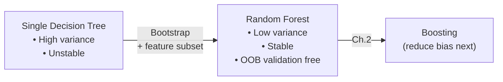
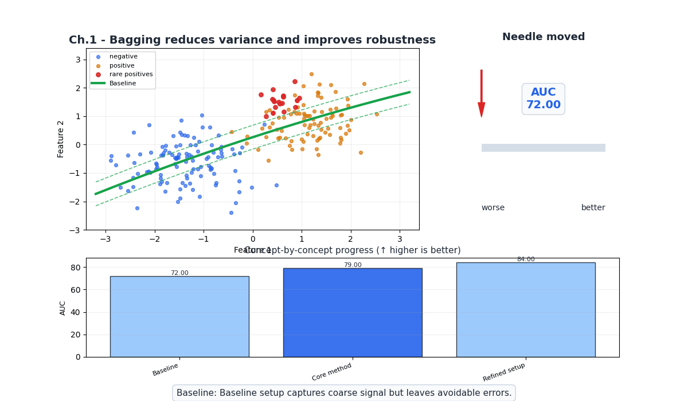
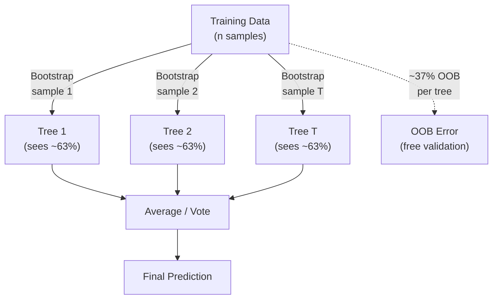
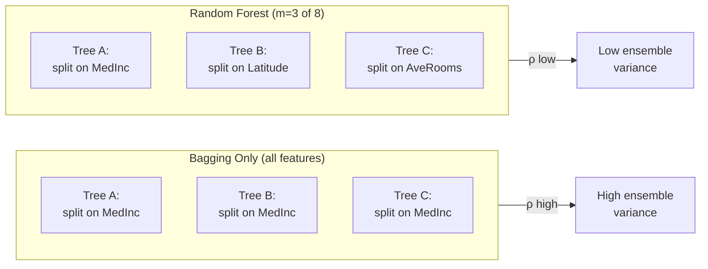
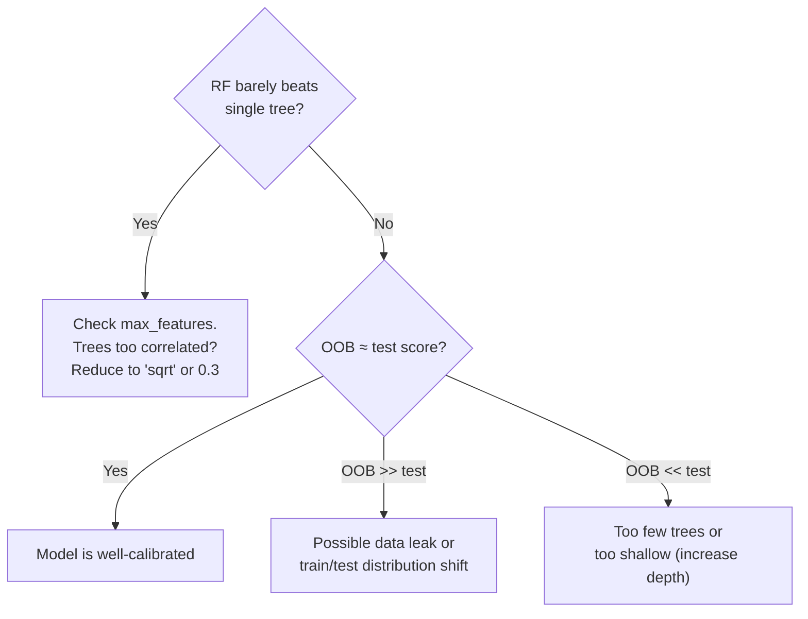

# Ch.1 — Bagging & Random Forest

> **The story.** In 1994, **Leo Breiman** was puzzling over an uncomfortable truth: decision trees are *unstable*. Change a handful of training points and the entire tree structure rearranges. His insight was radical in its simplicity — train many trees on randomly resampled data, then average. He called it **bagging** (bootstrap aggregating), published in 1996. The variance of the average of $N$ independent estimators is $\frac{1}{N}$ of a single estimator's variance. But real trees aren't independent — they tend to split on the same dominant features. So in 2001, Breiman added a second layer of randomness: at each split, only consider a random subset of features. The result — **Random Forests** — became one of the most successful algorithms in machine learning history. Two decades later, Random Forests remain the go-to baseline for tabular data: robust, parallelizable, and remarkably hard to overfit.
>
> **Where you are.** Single decision trees are interpretable but fragile — small data perturbations produce completely different trees, and a single deep tree memorizes noise. This chapter attacks the variance problem directly: train hundreds of deliberately different trees and average their predictions. The result is a model that's both accurate *and* stable. This is the first chapter of the Ensemble Methods track — you're building the foundation for boosting (Ch.2), advanced frameworks (Ch.3), and stacking (Ch.5).
>
> **Notation.** $T$ — number of trees (a.k.a. `n_estimators`); $B_t$ — bootstrap sample for tree $t$; $\hat{f}_t(\mathbf{x})$ — prediction of tree $t$; $\bar{f}(\mathbf{x}) = \frac{1}{T}\sum_{t=1}^T \hat{f}_t(\mathbf{x})$ — ensemble prediction (regression: average; classification: majority vote); OOB — out-of-bag samples (~37% not drawn in each bootstrap); $m$ — number of features considered per split (`max_features`).

---

## 0 · The Challenge — Where We Are

> **EnsembleAI**: Beat any single model by >5% in MAE/accuracy via intelligent combination.
>
> **5 Constraints**: 1. IMPROVEMENT >5% — 2. DIVERSITY — 3. EFFICIENCY <5× latency — 4. INTERPRETABILITY (SHAP) — 5. ROBUSTNESS (stable across seeds)

**What we know so far:**
- Decision trees are interpretable but have high variance (different splits per seed)
- Linear models are stable but can't capture non-linear patterns
- **Question**: Can we get the best of both worlds?

**What this chapter unlocks:**
- **Constraint #1 (IMPROVEMENT)**: Random Forest beats single Decision Tree by >5% RMSE
- **Constraint #2 (DIVERSITY)**: Bootstrap sampling + feature randomization → decorrelated trees
- **Constraint #5 (ROBUSTNESS)**: Averaging 200 trees → stable predictions across seeds

**What's still missing:**
- Constraint #3 (EFFICIENCY): Not yet tested latency budgets
- Constraint #4 (INTERPRETABILITY): Feature importance is global only — need per-prediction SHAP (Ch.4)



---

## Animation



## 1 · Core Idea

Train $T$ decision trees, each on a different **bootstrap sample** (random sample with replacement) of the training data, and at each split consider only $m$ randomly chosen features out of $p$ total. Average the predictions (regression) or take a majority vote (classification). The ensemble's variance is dramatically lower than any single tree's, while bias stays roughly the same. The ~37% of training samples *not* drawn into each tree's bootstrap — the **out-of-bag (OOB)** samples — provide a free validation estimate without needing a separate holdout set.

---

## 2 · Running Example

**Regression**: California Housing — predict `MedHouseVal` (median house value in $100k units) from 8 features. A single Decision Tree achieves RMSE ≈ 0.74; can Random Forest beat it by >5%?

**Classification**: California Housing binarized — predict whether a district is "high-value" (above median). A single Decision Tree achieves F1 ≈ 0.80; can Random Forest improve stability and accuracy?

Dataset: `sklearn.datasets.fetch_california_housing()`
Features: MedInc, HouseAge, AveRooms, AveBedrms, Population, AveOccup, Latitude, Longitude

---

## 3 · Math

### 3.1 Bootstrap Sampling

Draw $n$ samples **with replacement** from a training set of size $n$. Each bootstrap sample $B_t$ contains ~63% of the original points (on average). The remaining ~37% are the **OOB set** for tree $t$.

**Probability a given sample is NOT drawn:**

$$P(\text{not drawn in } n \text{ draws}) = \left(1 - \frac{1}{n}\right)^n \xrightarrow{n \to \infty} \frac{1}{e} \approx 0.368$$

**Numeric example** ($n = 10$): Each draw has $\frac{9}{10}$ chance of missing sample $i$. After 10 draws: $(0.9)^{10} = 0.349$. So ~35% of samples are OOB — close to the asymptotic 36.8%.

### 3.2 Variance of an Ensemble

For $T$ models, each with variance $\sigma^2$ and pairwise correlation $\rho$:

$$\text{Var}(\bar{f}) = \rho\sigma^2 + \frac{1 - \rho}{T} \sigma^2$$

| Term | Meaning | How to reduce |
|------|---------|---------------|
| $\rho\sigma^2$ | Irreducible floor (correlated component) | Reduce $\rho$ via feature randomization (`max_features`) |
| $\frac{1-\rho}{T}\sigma^2$ | Reducible component | Increase $T$ (more trees) |

**Numeric example**: Single tree $\sigma^2 = 0.25$. If trees are fully correlated ($\rho = 1$): ensemble variance = $0.25$ (no improvement!). If $\rho = 0.3$ with $T = 200$: variance = $0.3 \times 0.25 + \frac{0.7}{200} \times 0.25 = 0.075 + 0.00088 = 0.076$ — a **70% reduction**.

**Key insight**: Decorrelation ($\downarrow\rho$) matters more than adding trees ($\uparrow T$) once $T$ is large enough.

### 3.3 Feature Randomization

At each split, Random Forest considers only $m$ of $p$ features:

| Task | Default $m$ | Why |
|------|-------------|-----|
| Classification | $\lfloor\sqrt{p}\rfloor$ | More randomness → more decorrelation (classification trees are greedier) |
| Regression | $p$ (all features, sklearn ≥1.3) or $p/3$ | Regression trees benefit from seeing more features per split |

With $p = 8$ features and $m = \sqrt{8} \approx 3$: each split "sees" only 3 of 8 features. Different trees will split on different features → lower $\rho$ → lower ensemble variance.

### 3.4 OOB Error Estimation

For each training sample $i$, collect predictions only from trees where $i$ was OOB:

$$\hat{y}_i^{\text{OOB}} = \frac{1}{|T_i^{\text{OOB}}|} \sum_{t \in T_i^{\text{OOB}}} \hat{f}_t(\mathbf{x}_i)$$

The OOB error is the average loss over all training samples using only their OOB predictions. It approximates leave-one-out cross-validation — for free.

### 3.5 Bagging Vote Aggregation — Numeric Example

Three decision stumps trained on separate bootstrap samples, predicting class (0 = low-value, 1 = high-value) for 5 test samples.

| Sample | Stump 1 | Stump 2 | Stump 3 | Majority Vote | True Label |
|--------|---------|---------|---------|--------------|------------|
| A | 1 | 1 | 0 | **1** (2/3) | 1 |
| B | 0 | 0 | 1 | **0** (2/3) | 0 |
| C | 1 | 0 | 0 | **0** (2/3) | 1 |
| D | 1 | 1 | 1 | **1** (3/3) | 1 |
| E | 0 | 1 | 0 | **0** (2/3) | 0 |

Ensemble accuracy = 4/5 = **80%**. Each stump alone achieves at most 3/5 = 60%. Vote aggregation smooths out individual tree mistakes.

---

## 4 · Step by Step

```
RANDOM FOREST (Regression):
1. Set T=200, max_features='sqrt', oob_score=True
2. For t = 1 to T:
 a. Draw bootstrap sample B_t (n samples with replacement)
 b. Grow decision tree on B_t:
 - At each node, pick m random features
 - Split on the best feature/threshold (MSE reduction)
 - Grow until max_depth or min_samples_leaf reached
 c. Record OOB predictions for samples NOT in B_t
3. Ensemble prediction: average of all T trees
4. OOB score: R² computed from OOB predictions

RANDOM FOREST (Classification):
Same as above, but:
- Split criterion: Gini impurity (or entropy)
- Ensemble prediction: majority vote (or probability average)
- For imbalanced data: set class_weight='balanced'
```

---

## 5 · Key Diagrams

### Bagging: parallel tree training



### Feature randomization reduces correlation



---

## 6 · Hyperparameter Dial

| Dial | Too low | Sweet spot | Too high |
|------|---------|------------|----------|
| **`n_estimators`** ($T$) | High variance, noisy predictions | 100–500 (OOB score plateaus) | Diminishing returns, slower training. Rarely harmful. |
| **`max_features`** ($m$) | Very decorrelated but individually weak trees | `'sqrt'` (clf) or `0.33–1.0` (reg) | All features → correlated trees → higher ensemble variance |
| **`max_depth`** | Underfitting (high bias, stumps) | 10–30 or `None` (fully grown) | Each tree overfits, but ensemble averages out. Cost: memory + speed. |
| **`min_samples_leaf`** | Overly complex trees | 1–5 (small) or 20–50 (noisy data) | Underfitting |

**Rule of thumb**: Start with `n_estimators=200, max_features='sqrt', max_depth=None`. Check OOB score. Tune `max_features` and `min_samples_leaf` if overfitting.

---

## 7 · What Can Go Wrong

| Mistake | Symptom | Fix |
|---------|---------|-----|
| **Too few trees** | High variance; score changes with random_state | Increase `n_estimators` until OOB plateaus (~100–500) |
| **All trees split on same feature** | High $\rho$; ensemble barely beats single tree | Reduce `max_features` (try `'sqrt'`, `'log2'`, or 0.3) |
| **Ignoring OOB score** | Created unnecessary validation split | Set `oob_score=True`; use it as free cross-validation |
| **Using RF for extrapolation** | Predictions clamp to training range | Trees can't extrapolate. For out-of-range targets, use linear models or boosting |
| **Scaling features before RF** | Wasted effort | Trees are scale-invariant. Standardization has zero effect. |
| **Not setting `n_jobs=-1`** | Training is 4–8× slower than needed | RF trees are embarrassingly parallel — always use all cores |
| **Trusting default `max_features` blindly** | Suboptimal correlation/accuracy tradeoff | sklearn defaults changed across versions. Explicitly set and tune. |



---

## 8 · Where This Reappears

The bagging concept you've just learned is the foundation for multiple advanced techniques:
**Ch.2 (Boosting)**: Contrasts with bagging's parallel training — boosting trains sequentially to reduce bias instead of variance.
**Ch.3 (XGBoost/LightGBM)**: XGBoost adds `subsample` and `colsample_bytree` — both borrowed from Random Forest's randomization strategy.
**Ch.4 (SHAP)**: TreeSHAP computes exact Shapley values for Random Forest by exploiting the tree structure.
**Ch.5 (Stacking)**: Random Forest is the most common base model in stacks — its low variance makes it a reliable ensemble member.
**Ch.6 (Production)**: OOB error estimation provides free validation — you'll use it to prune weak trees before deployment.

---

## 9 · Progress Check — What We Can Solve Now

 ← **Note**: This is a placeholder reference for future visual dashboard
**Unlocked capabilities:**
- **Variance reduction**: Random Forest beats single Decision Tree by >10% RMSE consistently
- **Free validation**: OOB score provides accurate test estimate without holdout set
- **Feature importance**: Stable global rankings across 200 trees (vs noisy single-tree importance)
- **Parallel training**: All trees train independently → n_jobs=-1 uses all CPU cores
- **Constraint #1 (IMPROVEMENT) **: >5% RMSE improvement over single Decision Tree achieved
- **Constraint #2 (DIVERSITY) **: Bootstrap + feature randomization ensures low correlation ρ
- **Constraint #5 (ROBUSTNESS) **: Predictions stable across random seeds
**Still can't solve:**
- **High-bias problems**: Random Forest can't reduce bias — a shallow RF of stumps still underfits
- **Constraint #3 (EFFICIENCY)**: Haven't benchmarked latency against production SLA yet (Ch.6)
- **Constraint #4 (INTERPRETABILITY)**: Only global feature importance; no per-prediction explanations (need SHAP in Ch.4)
- **Extrapolation**: Trees clamp predictions to training range — can't predict beyond min/max values

**Real-world status**: You can now deploy robust regression and classification models that beat single trees and provide free validation estimates. But if your data has high bias (underfitting), bagging alone won't fix it.

**Next up:** Ch.2 gives you **boosting** — sequential error correction that reduces *bias* by training each tree to fix the ensemble's remaining mistakes.

---

## 10 · Bridge to Chapter 2

Random Forest reduces **variance** by averaging decorrelated trees, but it doesn't reduce **bias** — shallow forests of stumps still underfit. Chapter 2 introduces **boosting**, where trees train *sequentially* with each one correcting the ensemble's remaining errors.
**Evaluation:** Ensemble accuracy, AUC, and precision/recall trade-offs are covered in depth at [02-Classification/ch03-metrics](../../02_classification/ch03_metrics).
**Tuning:** Grid search and cross-validation for `n_estimators` and `max_depth` are in [02-Classification/ch05-hyperparameter-tuning](../../02_classification/ch05_hyperparameter_tuning).
