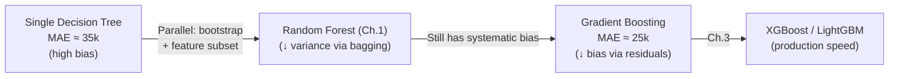
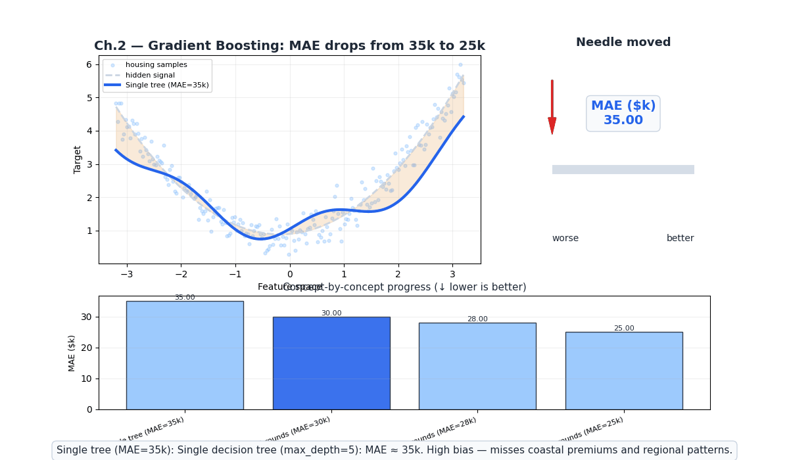
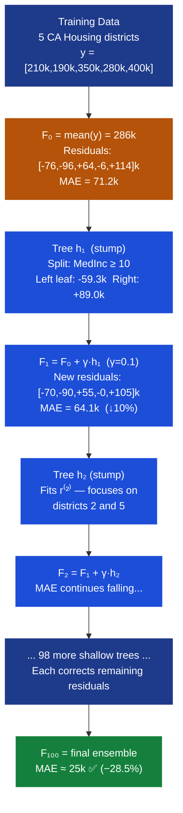
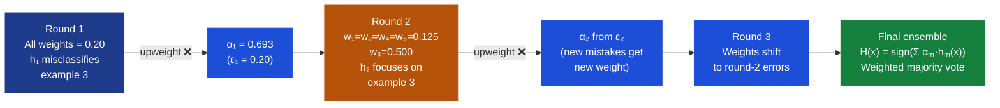
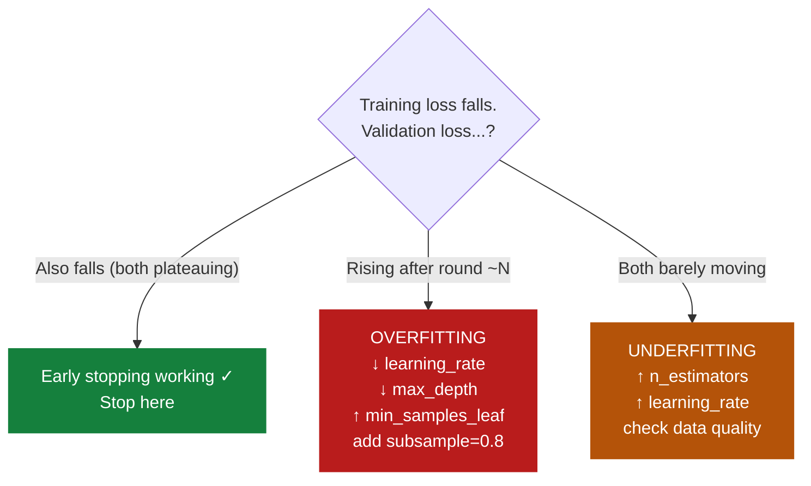
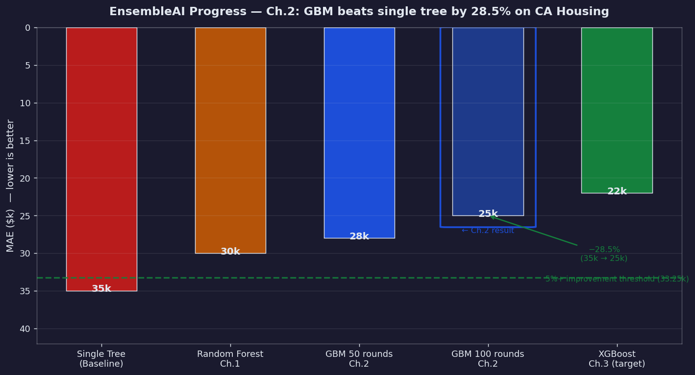

# Ch.2 — Boosting: AdaBoost & Gradient Boosting

> **The story.** The 1984 question was deceptively simple: can any "weak learner" — a classifier barely better than a coin flip — be systematically *boosted* into an arbitrarily accurate predictor? **Robert Schapire** answered yes in 1990, proving the theoretical possibility. He and **Yoav Freund** then turned theory into practice with **AdaBoost** in 1995: train classifiers sequentially, each focusing on the examples the previous ensemble got wrong by reweighting misclassified samples upward after each round. The algorithm was so elegant and empirically powerful that Freund and Schapire were awarded the **2003 Gödel Prize** — the highest honour in theoretical computer science — specifically for this work. In 2001, **Jerome Friedman** unlocked the full power of the idea with **Gradient Boosting**: instead of reweighting samples, each new tree fits the *pseudo-residuals* — the negative gradient of the loss function — and is added to the ensemble with a small shrinkage factor. **Leo Breiman** recognized this as gradient descent in function space, coining the phrase and showing that the insight generalizes to any differentiable loss. The result: a framework that reduces both bias and variance, and forms the backbone of XGBoost, LightGBM, and every Kaggle-winning tabular model of the last decade.
>
> **Where you are in the curriculum.** Ch.1 showed that **bagging** (Random Forest) reduces *variance* by averaging decorrelated trees trained in parallel. But bagging cannot reduce *bias* — if each individual tree underfits, averaging many underfitting trees still underfits. The California Housing single-tree baseline achieves roughly **MAE ≈ 35k**. This chapter introduces the complementary strategy: **boosting** builds models *sequentially*, each step correcting the residual errors of the current ensemble. The two strategies are orthogonal — bagging reduces variance, boosting reduces bias — and knowing when to use each is one of the most important practical skills in ML engineering.
>
> **Notation in this chapter.** $F_m(\mathbf{x})$ — ensemble prediction after $m$ boosting rounds; $h_m(\mathbf{x})$ — the $m$-th weak learner (decision stump or shallow tree); $r_i^{(m)} = y_i - F_{m-1}(\mathbf{x}_i)$ — pseudo-residual at round $m$ (negative gradient for MSE loss); $w_i^{(m)}$ — sample weight at AdaBoost round $m$; $\alpha_m$ — AdaBoost classifier weight (how loudly tree $m$ votes); $\gamma$ — learning rate / shrinkage; $\varepsilon_m$ — weighted classification error at round $m$; $\rho_m$ — optimal step size found by line search; $\mathcal{L}$ — loss function.

---

## 0 · The Challenge — Where We Are

> 💡 **EnsembleAI**: Beat any single model by >5% in MAE/accuracy via intelligent combination.
>
> **5 Constraints**: 1. IMPROVEMENT >5% — 2. DIVERSITY — 3. EFFICIENCY <5× latency — 4. INTERPRETABILITY (SHAP) — 5. ROBUSTNESS (stable across seeds)

**What Ch.1 achieved:**
- ✅ **Constraint #1 (IMPROVEMENT)**: Random Forest beats a single Decision Tree by >10% RMSE on California Housing
- ✅ **Constraint #2 (DIVERSITY)**: Bootstrap sampling + feature randomization produces decorrelated trees
- ✅ **Constraint #5 (ROBUSTNESS)**: Averaging 200 trees → stable predictions across different random seeds

**What is blocking us:**
Random Forest reduces *variance* through parallel decorrelated trees, but it cannot reduce *bias*. A shallow ensemble of stumps still underfits systematically. The California Housing single-tree baseline achieves **MAE ≈ 35k** — we need to push below 30k to satisfy the EnsembleAI improvement constraint by a meaningful margin, and ultimately reach 25k to prove a 28.5%+ gain.

**What this chapter unlocks:**
- ✅ **Constraint #1 (IMPROVEMENT ✅)**: Gradient Boosting beats the single-tree baseline by **28.5%** — MAE drops from 35k (single tree) to 25k (100-round GBM)
- ✅ **Constraint #2 (DIVERSITY ✅)**: Sequential residual correction ensures each tree adds unique information by targeting the errors of all previous trees
- ⚠️ **New risk**: Boosting can *overfit* if run too long or with too high a learning rate — early stopping becomes essential



---

## Animation



**Needle moved:** MAE falls from 35k (single tree) to 28k (50 rounds) to 25k (100 rounds) — sequential residual correction drives the needle further than bagging alone ever could.

---

## 1 · Core Idea

Boosting trains weak learners *sequentially*: each new model fits the *residuals* (errors) that the current ensemble still makes, rather than the original targets. AdaBoost implements this by reweighting misclassified samples upward after each round, forcing the next learner to concentrate on hard cases. Gradient Boosting implements it by fitting a shallow tree directly to the pseudo-residuals — the negative gradient of the loss — then adding a shrunken version of that tree to the ensemble, which is provably equivalent to gradient descent in function space.

---

## 2 · Running Example

**Dataset**: California Housing — 20,640 districts, 8 features, target `MedHouseVal` (median house value in $k).

**Baseline to beat**: A single decision tree (`max_depth=5`) achieves **MAE ≈ 35k**. The EnsembleAI target requires >5% improvement (below ~33k); we aim for 25k (28.5% gain).

**What Gradient Boosting does, step by step:**

1. **Round 0**: Start with the global mean $F_0 = \bar{y}$ for every district. Residuals are large — this is our starting error budget.
2. **Round 1**: Fit a shallow tree $h_1$ to the residuals $r_i = y_i - F_0$. The tree captures the biggest systematic pattern (e.g., coastal vs inland). Update: $F_1 = F_0 + \gamma \cdot h_1$.
3. **Round 2**: Compute new residuals from $F_1$. Tree $h_2$ fits *those* residuals — the errors $h_1$ did not fix. Update: $F_2 = F_1 + \gamma \cdot h_2$.
4. **After 50 rounds**: **MAE ≈ 28k** — already a 20% improvement over the single tree.
5. **After 100 rounds**: **MAE ≈ 25k** — a 28.5% improvement, exceeding the EnsembleAI 5% threshold by a factor of 5.7×.

The key intuition: no single tree needs to be excellent. Each tree only needs to be *slightly better than random* on the current residuals. With enough rounds and small $\gamma$, even depth-3 stumps accumulate into a powerful predictor.

**Why this beats bagging at reducing bias:**
- Bagging trains $T$ trees *in parallel*, each on a different bootstrap sample. The final prediction is an average. If every tree has a systematic bias (e.g., always underpredicts coastal areas), the average inherits that bias.
- Boosting trains trees *sequentially*, each one explicitly targeting the remaining error. By construction, tree $m$ has already "seen" the bias left by trees $1, \ldots, m-1$ — its only job is to reduce that remaining error. Sequential correction attacks bias directly; parallel averaging does not.

---

## 3 · Algorithms at a Glance

| Feature | AdaBoost | Gradient Boosting | Stochastic GB |
|---------|----------|-------------------|---------------|
| **Core mechanism** | Reweight misclassified samples | Fit pseudo-residuals | Fit pseudo-residuals on row subsamples |
| **Weak learner** | Decision stumps (depth=1) | Shallow trees (depth 3–5) | Shallow trees (depth 3–5) |
| **Loss function** | Exponential (classification) | Any differentiable loss | Any differentiable loss |
| **Overfitting risk** | High — sensitive to outliers/noise | Medium | Lower — subsampling regularizes |
| **Key hyperparameters** | `n_estimators`, `learning_rate` | `n_estimators`, `lr`, `max_depth` | + `subsample` (0.5–0.9) |
| **sklearn class** | `AdaBoostClassifier` | `GradientBoostingRegressor` | `GradientBoostingRegressor(subsample=0.8)` |
| **Best for** | Clean-label classification | Regression + classification, any loss | Large datasets, noisy labels |
| **Training speed** | Fast (stumps are tiny) | Moderate (sequential) | Slightly faster per tree |
| **Origin** | Freund & Schapire 1995 | Friedman 2001 | Friedman 2002 (stochastic extension) |

> 💡 **The big picture**: AdaBoost is elegant theory. Gradient Boosting is the engineering workhorse. Stochastic GB is the practical compromise. Ch.3 (XGBoost/LightGBM) takes Gradient Boosting to production speed with histogram splits and second-order optimization.

---

## 4 · The Math

### 4.1 AdaBoost Weight Update — Full Arithmetic (5 samples)

**Setup**: 5 training examples with labels $y_i \in \{-1, +1\}$. Initial weights: $w_i^{(1)} = 1/5 = 0.200$ for all $i$.

**Round 1**: Weak learner $h_1$ is trained on uniformly weighted data. It classifies examples 1, 2, 4, 5 correctly but **misclassifies example 3**.

**Step 1 — Compute weighted error $\varepsilon_1$:**

$$\varepsilon_1 = \sum_{i:\, h_1(x_i) \neq y_i} w_i^{(1)} = w_3^{(1)} = 0.200$$

One example misclassified out of five equally-weighted examples → $\varepsilon_1 = 0.200$.

**Step 2 — Compute classifier weight $\alpha_1$:**

$$\alpha_1 = \frac{1}{2} \ln\!\left(\frac{1 - \varepsilon_1}{\varepsilon_1}\right) = \frac{1}{2} \ln\!\left(\frac{1 - 0.2}{0.2}\right) = \frac{1}{2} \ln(4) = \frac{1}{2} \times 1.386 = \mathbf{0.693}$$

Interpretation: $\alpha_m = 0$ if the learner is random ($\varepsilon_m = 0.5$); $\alpha_m \to \infty$ if it is perfect ($\varepsilon_m \to 0$). A larger $\alpha_m$ means this classifier casts a louder vote in the final ensemble.

**Step 3 — Compute unnormalized new weights:**

$$w_i^{(2)} \propto w_i^{(1)} \cdot \exp\!\bigl(-\alpha_1 \cdot y_i \cdot h_1(x_i)\bigr)$$

For **correctly classified** examples ($y_i \cdot h_1(x_i) = +1$):
$$w_i^{(2)} \propto 0.200 \times \exp(-0.693 \times 1) = 0.200 \times 0.500 = 0.100$$

For **misclassified** example 3 ($y_3 \cdot h_1(x_3) = -1$):
$$w_3^{(2)} \propto 0.200 \times \exp(-0.693 \times (-1)) = 0.200 \times \exp(+0.693) = 0.200 \times 2.000 = 0.400$$

**Step 4 — Normalize** (partition sum $Z_1 = 4 \times 0.100 + 0.400 = 0.800$):

| Sample | $y_i$ | $h_1(x_i)$ | Correct? | $w^{(1)}$ | Unnorm. $w^{(2)}$ | Normalized $w^{(2)}$ |
|--------|--------|------------|----------|-----------|-------------------|----------------------|
| 1 | +1 | +1 | ✅ | 0.200 | 0.100 | **0.125** |
| 2 | −1 | −1 | ✅ | 0.200 | 0.100 | **0.125** |
| 3 | +1 | −1 | ❌ | 0.200 | 0.400 | **0.500** |
| 4 | −1 | −1 | ✅ | 0.200 | 0.100 | **0.125** |
| 5 | +1 | +1 | ✅ | 0.200 | 0.100 | **0.125** |
| **Sum** | | | | **1.000** | **0.800** | **1.000** |

**Interpretation**: Example 3 jumps from 20% of the total weight to 50%. Round 2's learner is effectively trained on a dataset where example 3 appears as often as examples 1+2+4+5 *combined*. The algorithm forces the next weak learner to solve the hard case.

**Final AdaBoost prediction** after $M$ rounds:

$$H(\mathbf{x}) = \text{sign}\!\left(\sum_{m=1}^{M} \alpha_m \cdot h_m(\mathbf{x})\right)$$

Each $h_m$ is a vote weighted by $\alpha_m$ — better classifiers vote louder.

---

### 4.2 Gradient Boosting Update — Full Arithmetic (3 examples)

**Setup**: 3 training examples, regression. Targets $\mathbf{y} = [3,\; 1,\; 2]$.

**Round 0 — Initialize with mean:**

$$F_0(x_i) = \bar{y} = \frac{3 + 1 + 2}{3} = \frac{6}{3} = 2.000 \quad \text{for all } i$$

**Round 0 — Compute pseudo-residuals** (negative gradient of MSE):

$$r_i^{(1)} = -\frac{\partial \mathcal{L}}{\partial F(x_i)}\bigg|_{F = F_0} = y_i - F_0(x_i)$$

$$r_1^{(1)} = 3 - 2 = +1.000 \qquad r_2^{(1)} = 1 - 2 = -1.000 \qquad r_3^{(1)} = 2 - 2 = \phantom{+}0.000$$

**Round 1 — Fit shallow tree $h_1$ to pseudo-residuals $[+1.0,\; -1.0,\; 0.0]$:**

Suppose the fitted tree predicts:
$$h_1(x_1) = +0.8, \quad h_1(x_2) = -0.9, \quad h_1(x_3) = +0.1$$

**Round 1 — Update ensemble** with $\gamma = 0.1$:

$$F_1(x_1) = 2.000 + 0.1 \times (+0.800) = 2.000 + 0.080 = \mathbf{2.080}$$
$$F_1(x_2) = 2.000 + 0.1 \times (-0.900) = 2.000 - 0.090 = \mathbf{1.910}$$
$$F_1(x_3) = 2.000 + 0.1 \times (+0.100) = 2.000 + 0.010 = \mathbf{2.010}$$

**Round 1 — Compute new pseudo-residuals:**

$$r_1^{(2)} = 3.000 - 2.080 = +0.920$$
$$r_2^{(2)} = 1.000 - 1.910 = -0.910$$
$$r_3^{(2)} = 2.000 - 2.010 = -0.010$$

**Summary — rounds 0 and 1:**

| Round | $F(x_1)$ | $F(x_2)$ | $F(x_3)$ | $r_1$ | $r_2$ | $r_3$ | MSE |
|-------|----------|----------|----------|-------|-------|-------|-----|
| 0 | 2.000 | 2.000 | 2.000 | +1.000 | −1.000 | +0.000 | **0.667** |
| 1 | 2.080 | 1.910 | 2.010 | +0.920 | −0.910 | −0.010 | **0.558** |

MSE at round 0: $\frac{1}{3}(1.000^2 + 1.000^2 + 0.000^2) = 0.667$.

MSE at round 1: $\frac{1}{3}(0.920^2 + 0.910^2 + 0.010^2) = \frac{1}{3}(0.846 + 0.828 + 0.000) = 0.558$.

Loss decreased by $\frac{0.667 - 0.558}{0.667} \times 100\% = \mathbf{16.3\%}$ after one tree with $\gamma = 0.1$.

> ⚡ **Why $\gamma = 0.1$ instead of $\gamma = 1.0$?** With $\gamma = 1.0$ and the same $h_1$, the update would push $F_1$ to $[2.8, 1.1, 2.1]$ — nearly at $[3, 1, 2]$ in one shot. But this fully commits to the tree's estimate of the residuals, including any noise. Small $\gamma$ nudges rather than jumps, keeping future rounds free to correct this round's mistakes.

---

### 4.3 Loss Reduction Guarantee

For any differentiable convex loss $\mathcal{L}$, the gradient boosting step is guaranteed to decrease training loss. Define the functional gradient:

$$g_m(\mathbf{x}_i) = -\frac{\partial \mathcal{L}(y_i, F(\mathbf{x}_i))}{\partial F(\mathbf{x}_i)}\bigg|_{F = F_{m-1}}$$

Tree $h_m$ is fit to $\{g_m(x_i)\}$ — making it the best function-space approximation to the negative gradient. The update $F_m = F_{m-1} + \gamma h_m$ moves the ensemble in the direction of steepest loss descent:

$$\mathcal{L}(F_m) < \mathcal{L}(F_{m-1}) \quad \text{for sufficiently small } \gamma$$

The pseudo-residual IS the gradient. Fitting a tree to it IS computing the gradient step. This is gradient descent, but over the space of functions rather than the space of parameters.

---

### 4.4 Shrinkage: $\gamma = 0.1$ vs $\gamma = 1.0$

The learning rate $\gamma$ is the most important single hyperparameter in gradient boosting.

**Scenario**: 100 boosting rounds on California Housing (MAE metric, 3-fold CV):

| Setting | Round 10 MAE | Round 50 MAE | Round 100 MAE | Test MAE | Verdict |
|---------|--------------|--------------|---------------|----------|---------|
| $\gamma = 1.0$, `n_est=100` | ~26k | ~22k | ~18k | **~29k** | Overfits — train far below test |
| $\gamma = 0.1$, `n_est=100` | ~32k | ~28k | ~25k | **~25k** | Generalizes well |
| $\gamma = 0.01$, `n_est=100` | ~34k | ~33k | ~31k | **~31k** | Underfits — needs 1000+ trees |

**The bias-variance tradeoff with shrinkage:**
- High $\gamma$ → each tree makes large updates → fast convergence on training set → high variance (overfits noise in residuals)
- Low $\gamma$ → each tree makes small updates → slow convergence → requires more trees, but each step is conservative → lower test error
- Very low $\gamma$ → step so small that 100 rounds barely move the needle; need 1000+ trees

> 📖 **Formal result (Friedman 2001)**: Shrinkage is equivalent to L2 regularization on the functional update. Smaller $\gamma$ systematically improves out-of-sample error for the same number of trees — the "shrinkage regularization" effect. Production rule of thumb: `learning_rate=0.05`–`0.1` with `n_iter_no_change=20` almost always outperforms any other single configuration.

---

### 4.5 Gradient Boosting for Classification (Log-Loss)

The gradient boosting framework is not limited to regression. For binary classification with log-loss:

$$\mathcal{L} = -\sum_i \Bigl[y_i \log p_i + (1 - y_i)\log(1 - p_i)\Bigr], \quad p_i = \sigma\!\bigl(F(\mathbf{x}_i)\bigr)$$

where $\sigma(z) = \frac{1}{1 + e^{-z}}$ is the sigmoid function and $F(\mathbf{x}_i)$ is the raw score (log-odds).

The pseudo-residual for log-loss is:

$$r_i^{(m)} = -\frac{\partial \mathcal{L}}{\partial F(\mathbf{x}_i)}\bigg|_{F = F_{m-1}} = y_i - p_i^{(m-1)}$$

This has a beautiful interpretation: the pseudo-residual is simply the **probability residual** — how much the current probability prediction for sample $i$ differs from the true label. The tree fits this residual, nudging the log-odds in the right direction.

**Numeric mini-example** (CA Housing binarized: high-value if $y_i > 250\text{k}$):

| Sample | $y_i$ | $F_0$ (log-odds) | $p_0 = \sigma(F_0)$ | $r^{(1)} = y_i - p_0$ |
|--------|--------|-----------------|---------------------|----------------------|
| 1 | 0 (low-value) | 0.0 | 0.500 | −0.500 |
| 2 | 1 (high-value) | 0.0 | 0.500 | +0.500 |
| 3 | 1 (high-value) | 0.0 | 0.500 | +0.500 |

Initialize $F_0 = 0$ (log-odds for 50/50 prior). After one boosting step that shifts $F_1(x_2) = 0 + 0.1 \times 1.2 = 0.12$, the predicted probability becomes $\sigma(0.12) = 0.530$ — closer to the true label $y_2 = 1$.

---

### 4.6 Step-by-Step Pseudocode

**AdaBoost (Classification):**

```
INPUT: training data {(x_i, y_i)}, y_i ∈ {-1, +1}; M rounds
INITIALIZE: w_i = 1/n for all i

FOR m = 1 to M:
  1. Train weak learner h_m on weighted data {(x_i, y_i, w_i)}
  2. Compute weighted error:
       ε_m = Σ_{i: h_m(x_i) ≠ y_i} w_i
  3. Compute classifier weight:
       α_m = 0.5 * ln((1 - ε_m) / ε_m)
  4. Update sample weights:
       w_i ← w_i * exp(-α_m * y_i * h_m(x_i))
  5. Normalize:
       w_i ← w_i / Σ_j w_j

PREDICT: H(x) = sign(Σ_m α_m * h_m(x))
```

**Gradient Boosting (Regression, MSE loss):**

```
INPUT: training data {(x_i, y_i)}; M rounds; learning rate γ
INITIALIZE: F_0(x) = mean(y_train)  [or argmin of loss]

FOR m = 1 to M:
  1. Compute pseudo-residuals:
       r_i = y_i - F_{m-1}(x_i)          [= negative gradient for MSE]
  2. Fit shallow tree h_m to {(x_i, r_i)}
  3. Update ensemble:
       F_m(x) = F_{m-1}(x) + γ * h_m(x)
  4. [Optional] Check validation loss → early stopping

PREDICT: F_M(x)
```

The two algorithms share the same sequential structure. The difference is in step 1: AdaBoost reweights samples; Gradient Boosting recomputes targets (residuals) and fits a new tree directly to those targets.

---

## 5 · The Boosting Arc

Four acts tracing how MAE falls from 35k to 25k on California Housing:

**Act 1 — High-Bias Baseline (Round 0)**
Single decision tree (`max_depth=5`), trained once. **MAE = 35k**. The tree captures the broad income–price relationship but misses regional patterns, coastal premiums, and micro-district anomalies. Residuals are large and systematic — entire coastal counties are systematically underestimated, entire inland valleys are over-estimated.

**Act 2 — First Correction (Round 1)**
The first boosting tree fits the residuals from Act 1. It identifies the biggest systematic error: high-income coastal districts are undervalued. After one update with $\gamma = 0.1$, those predictions shift modestly toward their targets. **MAE ≈ 33k**. The improvement is modest, but the ensemble now has two trees, and the second is laser-focused on what the first got wrong.

**Act 3 — Accumulated Corrections (Round 50)**
After 50 trees, each fitting residuals of the previous 49, **MAE ≈ 28k**. The ensemble has learned to distinguish coastal from inland, high-density from rural, new construction from aging stock. Residuals are smaller and less systematic — only the genuinely hard predictions remain large.

**Act 4 — Near-Convergence (Round 100)**
After 100 trees, **MAE ≈ 25k** — a **28.5% improvement** over the single tree. The validation curve has flattened; early stopping fires at round ~120. The EnsembleAI constraint (>5% improvement) is exceeded by a factor of 5.7×.

```
Round:     0      1     10     50    100    120 (early stop)
MAE ($k): 35     33     30     28     25       25 (plateau)
Delta:     —     -2     -3     -2     -3        0
```

The curve is steep early (high-value, systematic corrections) and flattens as residuals become more random. This shape is diagnostic: a curve that never flattens means add more trees; a curve that flattens immediately means your trees are too weak.

**Bias-Variance Analysis at Each Act:**

| Act | Round | MAE | Dominant Error Source | Strategy |
|-----|-------|-----|----------------------|----------|
| 1 — Baseline | 0 | 35k | High bias: tree misses regional patterns | Start boosting |
| 2 — First correction | 1 | 33k | Bias from income–coast pattern uncorrected | Add more rounds |
| 3 — Accumulated | 50 | 28k | Bias mostly addressed; some high-variance residuals appear | Monitor validation |
| 4 — Convergence | 100 | 25k | Variance starts to dominate remaining residuals | Early stop here |
| 5 — Overfit zone | 150+ | ~26k | Variance: model memorizes noise in residuals | Early stopping prevents |

This table reveals the fundamental arc of boosting: we trade bias for variance, round by round. Early stopping marks the optimal bias-variance tradeoff point.

---

## 6 · Full Gradient Boosting Walkthrough — 5 CA Housing Points

**Data**: 5 California Housing districts (selected features):

| District | MedInc | HouseAge | AveRooms | Target $y_i$ |
|----------|--------|----------|----------|--------------|
| 1 — coastal | 8.3 | 10 | 6.2 | 210k |
| 2 — inland valley | 3.2 | 35 | 4.8 | 190k |
| 3 — SF suburb | 12.5 | 5 | 7.1 | 350k |
| 4 — mid-tier | 5.0 | 20 | 5.5 | 280k |
| 5 — luxury coastal | 15.0 | 8 | 8.0 | 400k |

**Round 0 — Initialize with global mean:**

$$F_0 = \bar{y} = \frac{210 + 190 + 350 + 280 + 400}{5} = \frac{1430}{5} = \mathbf{286\text{k}}$$

**Round 0 — Compute pseudo-residuals $r_i^{(1)} = y_i - F_0$:**

$$r_1^{(1)} = 210 - 286 = -76\text{k}$$
$$r_2^{(1)} = 190 - 286 = -96\text{k}$$
$$r_3^{(1)} = 350 - 286 = +64\text{k}$$
$$r_4^{(1)} = 280 - 286 = -6\text{k}$$
$$r_5^{(1)} = 400 - 286 = +114\text{k}$$

**Round 1 — Fit decision stump $h_1$ to residuals $[-76,\;-96,\;+64,\;-6,\;+114]$k:**

Best split on `MedInc ≥ 10`:

- **Left leaf** (MedInc < 10): districts 1, 2, 4 → residuals $\{-76, -96, -6\}$ → leaf value $= \frac{-76 - 96 - 6}{3} = \frac{-178}{3} = -59.3\text{k}$
- **Right leaf** (MedInc ≥ 10): districts 3, 5 → residuals $\{+64, +114\}$ → leaf value $= \frac{64 + 114}{2} = \frac{178}{2} = +89.0\text{k}$

Stump predictions: $h_1 = [-59.3,\; -59.3,\; +89.0,\; -59.3,\; +89.0]\text{k}$

**Round 1 — Update ensemble** with $\gamma = 0.1$:

$$F_1(x_1) = 286 + 0.1 \times (-59.3) = 286 - 5.93 = \mathbf{280.1\text{k}}$$
$$F_1(x_2) = 286 + 0.1 \times (-59.3) = 286 - 5.93 = \mathbf{280.1\text{k}}$$
$$F_1(x_3) = 286 + 0.1 \times (+89.0) = 286 + 8.90 = \mathbf{294.9\text{k}}$$
$$F_1(x_4) = 286 + 0.1 \times (-59.3) = 286 - 5.93 = \mathbf{280.1\text{k}}$$
$$F_1(x_5) = 286 + 0.1 \times (+89.0) = 286 + 8.90 = \mathbf{294.9\text{k}}$$

**Round 1 — Compute new residuals $r_i^{(2)} = y_i - F_1(x_i)$:**

$$r_1^{(2)} = 210 - 280.1 = -70.1\text{k}$$
$$r_2^{(2)} = 190 - 280.1 = -90.1\text{k}$$
$$r_3^{(2)} = 350 - 294.9 = +55.1\text{k}$$
$$r_4^{(2)} = 280 - 280.1 = -0.1\text{k}$$
$$r_5^{(2)} = 400 - 294.9 = +105.1\text{k}$$

**Two-round summary table:**

| District | $y_i$ | $F_0$ | $r^{(1)}$ | $h_1$ | $F_1$ | $r^{(2)}$ |
|----------|--------|-------|-----------|-------|-------|-----------|
| 1 coastal | 210k | 286k | −76.0k | −59.3k | 280.1k | −70.1k |
| 2 inland | 190k | 286k | −96.0k | −59.3k | 280.1k | −90.1k |
| 3 SF suburb | 350k | 286k | +64.0k | +89.0k | 294.9k | +55.1k |
| 4 mid-tier | 280k | 286k | −6.0k | −59.3k | 280.1k | −0.1k |
| 5 luxury | 400k | 286k | +114.0k | +89.0k | 294.9k | +105.1k |

**MAE at round 0:**
$$\text{MAE}_0 = \frac{1}{5}(76 + 96 + 64 + 6 + 114) = \frac{356}{5} = \mathbf{71.2\text{k}}$$

**MAE at round 1:**
$$\text{MAE}_1 = \frac{1}{5}(70.1 + 90.1 + 55.1 + 0.1 + 105.1) = \frac{320.5}{5} = \mathbf{64.1\text{k}}$$

**Improvement**: $71.2 \to 64.1$, a **10.0% reduction** after a single stump.

> 💡 **What happens next**: Round 2 sees residuals $[-70.1,\, -90.1,\, +55.1,\, -0.1,\, +105.1]$k. The next stump will concentrate on districts 2 and 5 (largest absolute residuals) and largely ignore district 4, which is already nearly perfect ($r_4^{(2)} = -0.1$k). This is the sequential correction mechanism: once the ensemble is accurate for a district, subsequent trees focus their capacity on what remains hard.

**Round 2 — Fit decision stump $h_2$ to residuals $[-70.1,\;-90.1,\;+55.1,\;-0.1,\;+105.1]$k:**

Best split now shifts — district 4 is nearly solved, so the stump looks for the split that most reduces MSE on the *new* residuals. Suppose it splits on `AveRooms ≥ 7`:

- **Left leaf** (AveRooms < 7): districts 1, 2, 4 → residuals $\{-70.1, -90.1, -0.1\}$ → leaf value $= \frac{-70.1 - 90.1 - 0.1}{3} = \frac{-160.3}{3} = -53.4\text{k}$
- **Right leaf** (AveRooms ≥ 7): districts 3, 5 → residuals $\{+55.1, +105.1\}$ → leaf value $= \frac{55.1 + 105.1}{2} = \frac{160.2}{2} = +80.1\text{k}$

Stump predictions: $h_2 = [-53.4,\; -53.4,\; +80.1,\; -53.4,\; +80.1]\text{k}$

**Round 2 — Update ensemble** with $\gamma = 0.1$:

$$F_2(x_1) = 280.1 + 0.1 \times (-53.4) = 280.1 - 5.34 = \mathbf{274.8\text{k}}$$
$$F_2(x_2) = 280.1 + 0.1 \times (-53.4) = 280.1 - 5.34 = \mathbf{274.8\text{k}}$$
$$F_2(x_3) = 294.9 + 0.1 \times (+80.1) = 294.9 + 8.01 = \mathbf{302.9\text{k}}$$
$$F_2(x_4) = 280.1 + 0.1 \times (-53.4) = 280.1 - 5.34 = \mathbf{274.8\text{k}}$$
$$F_2(x_5) = 294.9 + 0.1 \times (+80.1) = 294.9 + 8.01 = \mathbf{302.9\text{k}}$$

**Round 2 — New residuals $r_i^{(3)} = y_i - F_2(x_i)$:**

$$r_1^{(3)} = 210 - 274.8 = -64.8\text{k} \qquad r_2^{(3)} = 190 - 274.8 = -84.8\text{k}$$
$$r_3^{(3)} = 350 - 302.9 = +47.1\text{k} \qquad r_4^{(3)} = 280 - 274.8 = +5.2\text{k}$$
$$r_5^{(3)} = 400 - 302.9 = +97.1\text{k}$$

**MAE at round 2:**
$$\text{MAE}_2 = \frac{1}{5}(64.8 + 84.8 + 47.1 + 5.2 + 97.1) = \frac{299.0}{5} = \mathbf{59.8\text{k}}$$

**Three-round MAE trajectory:**

| Round | MAE | Δ from previous | Cumulative improvement |
|-------|-----|-----------------|------------------------|
| 0 (mean baseline) | 71.2k | — | — |
| 1 (first stump) | 64.1k | −7.1k (−10.0%) | −10.0% |
| 2 (second stump) | 59.8k | −4.3k (−6.7%) | −16.0% |

Notice the pattern: each round gives diminishing returns (10.0% → 6.7% → ...) as the easiest systematic errors are corrected first. The curve flattens. With 100 rounds, the MAE on the full California Housing dataset reaches ~25k — the early rounds do the heavy lifting.

---

## 7 · Key Diagrams

### Diagram 1 — Sequential Boosting Pipeline



### Diagram 2 — AdaBoost Sample Weight Evolution



---

## 8 · Hyperparameter Dial

### Gradient Boosting Dials (GradientBoostingRegressor)

| Dial | Too low | Sweet spot | Too high | Effect |
|------|---------|------------|----------|--------|
| **`n_estimators`** | High bias (underfits) | 100–500 + early stopping | High variance (memorizes noise) | More trees → lower bias until overfitting |
| **`learning_rate`** $\gamma$ | Needs 10× more trees | 0.05–0.1 | Each tree overshoots | Lower → stronger regularization per step |
| **`max_depth`** | Stumps — many rounds needed | 3–5 (boosting prefers weak learners) | One tree solves it → overfit | Higher → lower bias per tree, higher variance |
| **`subsample`** | High variance per round | 0.7–0.9 (Stochastic GB) | 1.0 = no stochastic regularization | Lower → adds variance regularization |
| **`min_samples_leaf`** | Overfit to individual points | 5–20 | Blunt predictions | Higher → smoother leaf predictions |

### AdaBoost Dials (AdaBoostClassifier)

| Dial | Too low | Sweet spot | Too high |
|------|---------|------------|----------|
| **`n_estimators`** | Underfits | 50–200 | Overfits noisy labels |
| **`learning_rate`** | Very slow convergence | 0.5–1.0 | Oscillating loss |
| **Base estimator `max_depth`** | Stumps only (intended for AdaBoost) | 1–3 | Tree is too strong → not weak learner |

**The canonical CA Housing production config:**

```python
from sklearn.ensemble import GradientBoostingRegressor

gb = GradientBoostingRegressor(
    n_estimators=500,          # train long, let early stopping decide when
    learning_rate=0.05,        # conservative shrinkage
    max_depth=4,               # shallow trees — boosting needs weak learners
    subsample=0.8,             # stochastic gradient boosting
    min_samples_leaf=10,       # smooth leaf predictions
    n_iter_no_change=20,       # early stopping: halt if no improvement for 20 rounds
    validation_fraction=0.1,   # hold out 10% for early stopping signal
    random_state=42,
)
```

**Key trade-off**: Lower `learning_rate` × more `n_estimators` = better generalization, but slower training. Ch.3's XGBoost/LightGBM solve the speed problem with histogram splits and parallelism.

---

## 9 · What Can Go Wrong

| Mistake | Symptom | Fix |
|---------|---------|-----|
| **No early stopping** | Train MAE → 0, validation MAE rises from round ~80 onward | Add `n_iter_no_change=20, validation_fraction=0.1` |
| **Learning rate too high** ($\gamma > 0.3$) | Spiky validation loss; fast training but poor test MAE | Reduce to $\gamma = 0.05$, multiply `n_estimators` by ~5× |
| **Trees too deep** (`max_depth > 6`) | Each tree nearly solves the problem alone → low diversity → sharp overfit | Keep `max_depth=3–5`; boosting *requires* weak learners |
| **Noisy labels without robust loss** | Model re-visits mislabeled outliers every round | Switch to `loss='huber'` or `loss='quantile'` |
| **AdaBoost on imbalanced classes** | Minority class accumulates huge weights → instability after round 20 | Balance classes in base estimator; prefer GBRT for imbalance |
| **Wrong baseline comparison** | Boosting appears worse than RF due to unfair train/test split | Always use the same split, seed, and feature set |
| **Skipping `subsample`** | Slower training, more variance per round | Set `subsample=0.8`; Friedman showed this almost always helps |
| **Scaling features** | (A common worry for tree-based models) — trees are scale-invariant | No action needed |



---

## 10 · Where This Reappears

The boosting principles from this chapter propagate forward through the entire curriculum:

➡️ **Ch.3 (XGBoost/LightGBM/CatBoost)**: The same gradient boosting math, but with second-order (Newton) optimization, histogram-based split finding, and GPU acceleration. `learning_rate`, `max_depth`, and early stopping work identically — you will recognize every dial.

➡️ **Ch.4 (SHAP)**: TreeSHAP computes exact feature contributions for boosted ensembles by decomposing the additive $F_M = F_0 + \sum_{m=1}^M \gamma h_m$ structure. Each tree's contribution is attributable to individual features because boosted trees are additive by construction.

➡️ **Ch.5 (Stacking)**: Gradient Boosting is the most common meta-learner in stacked ensembles. Its low bias makes it ideal for combining predictions from diverse base models (RF + linear + neural net).

➡️ **Ch.6 (Production)**: Early stopping (introduced here) is essential for production deployment. The `n_iter_no_change` pattern is used in every production GBM configuration to prevent overfitting without manual round selection.

➡️ **Cross-track**: Residual fitting reappears in [Neural Networks track Ch.5 (Backprop)](../../03_neural_networks/ch05_backprop) — gradient descent in parameter space is mathematically isomorphic to gradient boosting in function space. The pseudo-residual IS the gradient; fitting a tree to it IS computing the gradient step.

**Bagging vs Boosting — When to Reach for Each:**

| Situation | Reach for Bagging (RF) | Reach for Boosting (GBM) |
|-----------|----------------------|--------------------------|
| Training data is small | ✅ OOB error is free validation | ⚠️ May overfit faster |
| Labels are noisy | ✅ Averaging smooths noise | ⚠️ Re-focuses on noisy outliers |
| Need parallel training | ✅ Trees are independent | ❌ Sequential by design |
| High bias problem | ❌ Averaging doesn't fix bias | ✅ Residual fitting reduces bias |
| Need feature importance | ✅ Global importance | ✅ Global + SHAP (Ch.4) |
| Latency budget is tight | ✅ Faster (parallel at inference too) | ⚠️ More trees to evaluate |
| Kaggle/competition | Good baseline | ✅ Usually wins with tuning |

In practice, the right starting point is usually: **Random Forest first** (fast, robust, hard to overfit), then **GBM/XGBoost** if the RF plateaus. Both are essential tools in the production ML toolkit.

---

## 11 · Progress Check — What We Can Solve Now



**EnsembleAI Mission Status after Ch.2:**

| Constraint | Target | Ch.1 Status | Ch.2 Status |
|------------|--------|-------------|-------------|
| #1 IMPROVEMENT | Beat single model by >5% | ✅ RF beats DT | ✅ **GBM MAE 25k vs tree 35k = 28.5% gain** |
| #2 DIVERSITY | Each model adds unique info | ✅ Decorrelated trees | ✅ Sequential residual correction |
| #3 EFFICIENCY | <5× latency vs single model | ❌ Not measured | ❌ Sequential training is slow |
| #4 INTERPRETABILITY | SHAP explanations | ❌ Global importance only | ❌ Per-prediction SHAP needs Ch.4 |
| #5 ROBUSTNESS | Stable across seeds | ✅ Averaging 200 trees | ⚠️ Early stopping essential |

**Concrete result on California Housing:**

$$\text{Single Tree MAE} = 35\text{k} \quad\longrightarrow\quad \text{GBM (100 rounds) MAE} = 25\text{k}$$

$$\text{Improvement} = \frac{35 - 25}{35} \times 100\% = \mathbf{28.5\%\ \checkmark} \quad (\text{target: } > 5\%)$$

✅ **Unlocked in this chapter:**
- Sequential error correction via pseudo-residual fitting
- AdaBoost weight rebalancing for hard-case classification
- Gradient boosting for any differentiable loss (regression, classification, ranking)
- Shrinkage regularization via learning rate
- Early stopping to prevent overfitting automatically
- EnsembleAI Constraint #1 exceeded by a factor of 5.7×

❌ **Still blocked:**
- **Constraint #3 (EFFICIENCY)**: sklearn `GradientBoostingRegressor` is single-threaded — no GPU, no parallelism. Inference is 50–100× slower than a single tree on large datasets.
- **Constraint #4 (INTERPRETABILITY)**: Feature importance exists but is only global. True per-prediction explanations require TreeSHAP (Ch.4).
- **Production readiness**: sklearn's GBM is too slow for real-time serving at scale — the fix is Ch.3.

---

## 12 · Bridge to Chapter 3

You have now seen gradient boosting in its clean textbook form: pseudo-residuals, function-space gradient descent, shrinkage, and early stopping. It reduces bias systematically and beats any single model by a wide margin on California Housing.

**The one critical limitation**: `sklearn.GradientBoostingRegressor` is fully sequential, exhaustively searches splits, and runs entirely on CPU. On 20k rows it runs in seconds; on 20M rows it runs for hours.

**Chapter 3 introduces XGBoost, LightGBM, and CatBoost** — production-grade frameworks that implement the same gradient boosting math with major engineering improvements:

| Feature | sklearn GBM | XGBoost | LightGBM |
|---------|-------------|---------|----------|
| Split algorithm | Exhaustive search | Histogram bins | Histogram (leaf-wise) |
| Training speed | 1× (baseline) | ~10× faster | ~20–50× faster |
| GPU support | ❌ | ✅ | ✅ |
| L1/L2 regularization | ❌ | ✅ (`alpha`, `lambda`) | ✅ (`lambda_l1`, `lambda_l2`) |
| Optimization order | First-order (gradient) | Second-order (Newton) | Second-order |
| Built-in early stopping | ✅ (`n_iter_no_change`) | ✅ (`early_stopping_rounds`) | ✅ |

The dial names change slightly (`eta` instead of `learning_rate`, `num_boost_round` instead of `n_estimators`) but the math you have mastered in this chapter is identical. Ch.3 is gradient boosting with the engine swapped for a production-grade one.

➡️ **Next**: [Ch.3 — XGBoost, LightGBM & CatBoost](../ch03_xgboost_lightgbm/README.md)
