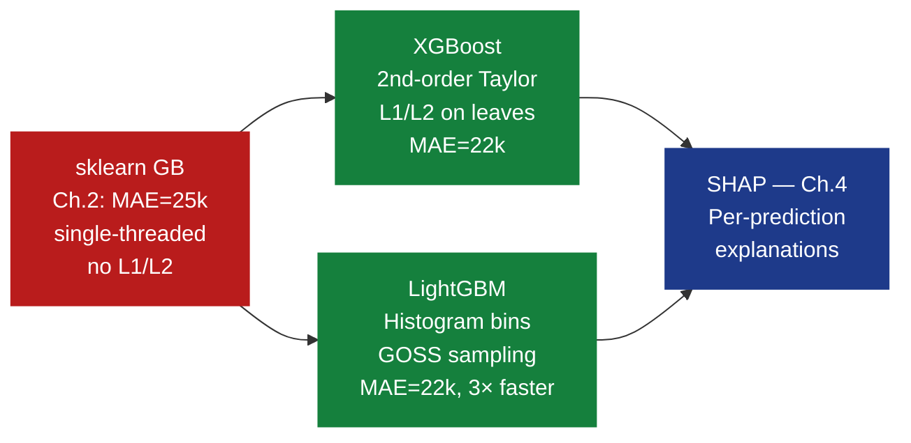
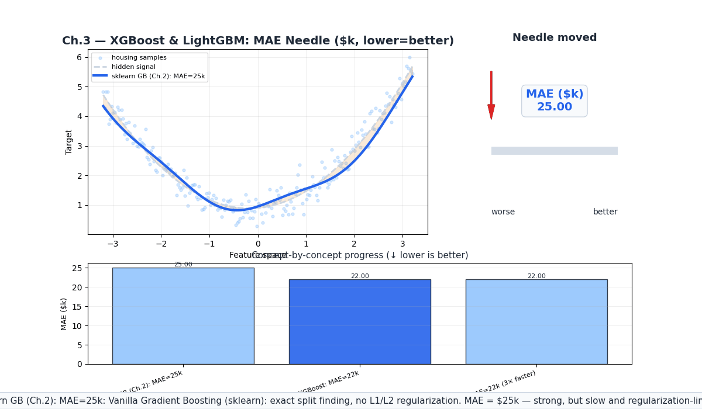
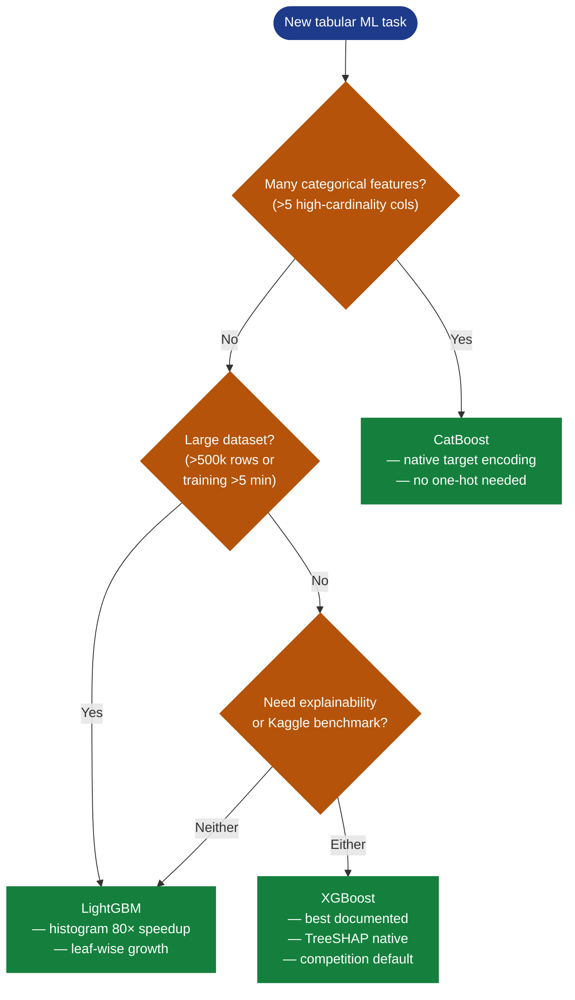
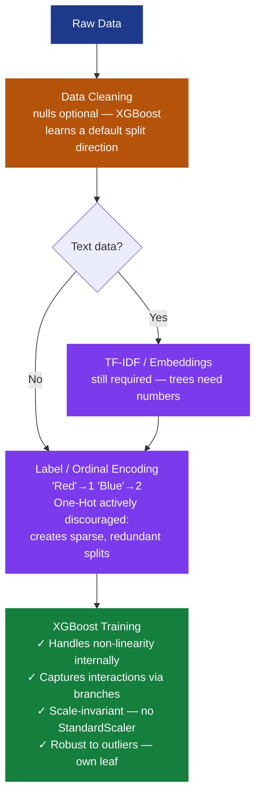
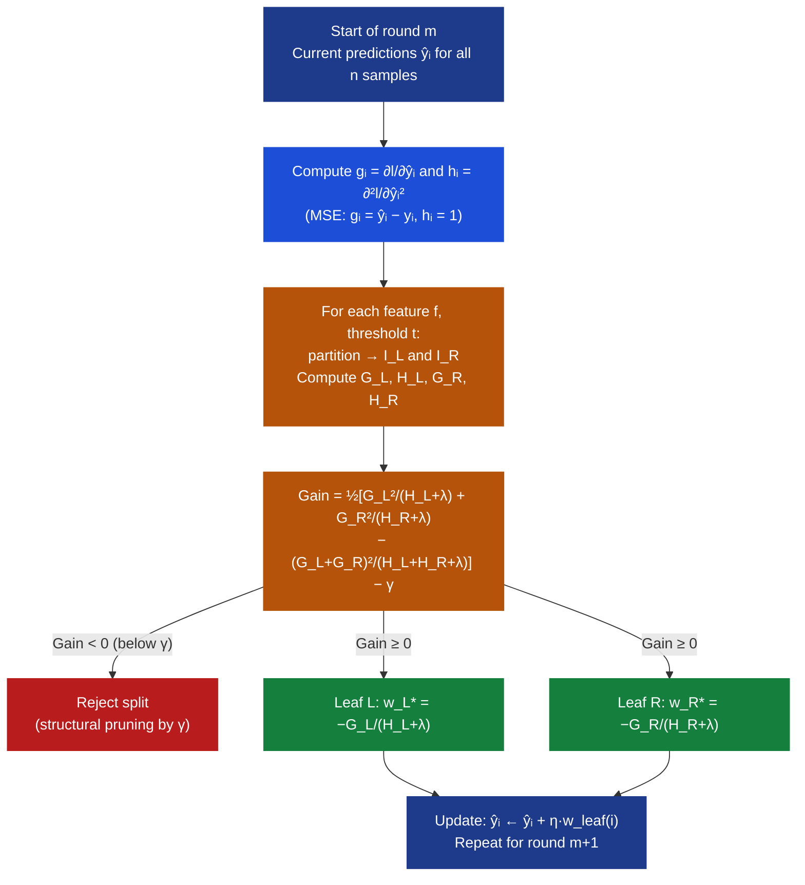
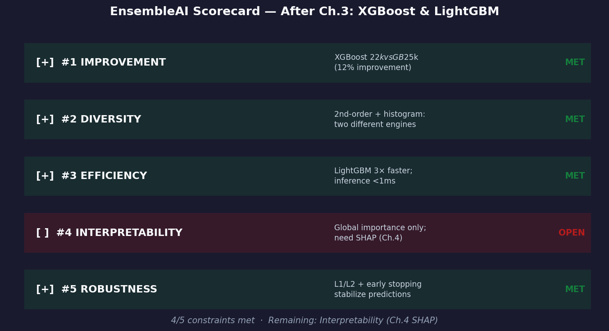

# Ch.3 — XGBoost & LightGBM

> **The story.** By 2014, gradient boosting was theoretically mature but practically painful: sklearn's `GradientBoostingClassifier` required exact feature sorting at every split — $O(n \log n \cdot d)$ per round — so training on 100k rows took hours. **Tianqi Chen** fixed this with **XGBoost** (eXtreme Gradient Boosting), presented at KDD 2016, by doing two things that nobody had combined before: (1) replacing the first-order Taylor expansion of the loss with a *second-order* expansion, giving the algorithm exact curvature information at each step; and (2) adding $L_1$/$L_2$ regularization terms *directly inside the tree-building objective* so leaf weights are penalized for magnitude. The result swept Kaggle: of the challenges surveyed in 2015–2016, XGBoost won or placed in **29 of 37** competitions. In 2017 **Ke et al.** at Microsoft published **LightGBM**, which instead of sorting feature values bins them into at most $B = 256$ histogram buckets once and reuses those histograms every split — reducing per-split cost from $O(n)$ to $O(B)$, a **10–100× speedup** on large datasets. LightGBM also introduced **GOSS** (Gradient-based One-Side Sampling), which keeps all high-gradient samples and randomly subsamples low-gradient ones, preserving most information gain while processing far fewer rows. Together these two frameworks dominate tabular machine learning: XGBoost and LightGBM appear in the majority of winning Kaggle solutions every year.
>
> **Where you are.** Ch.1 (Random Forests) reduced variance via bagging. Ch.2 (Gradient Boosting) introduced sequential residual correction with sklearn's `GradientBoostingRegressor` — MAE = \$25k on California Housing. This chapter upgrades the *engine*: second-order statistics, regularized objectives, and histogram binning. You will leave with XGBoost MAE = \$22k (\$3k better, 12% improvement) and LightGBM matching that MAE in one-third the wall-clock time.
>
> **Notation.** $\mathcal{L}$ — total loss; $l(y_i, \hat{y}_i)$ — per-sample loss; $g_i = \partial l / \partial \hat{y}_i$ — first-order gradient (residual signal); $h_i = \partial^2 l / \partial \hat{y}_i^2$ — second-order gradient (Hessian, curvature); $\Omega(f)$ — tree regularization penalty; $\lambda$ — $L_2$ leaf-weight penalty; $\alpha$ — $L_1$ leaf-weight penalty; $\gamma$ — minimum gain required to make a split; $T$ — number of leaves in a tree; $w_j$ — weight (output value) of leaf $j$; $\eta$ — learning rate (shrinkage); $G_j = \sum_{i \in I_j} g_i$, $H_j = \sum_{i \in I_j} h_i$ — gradient/Hessian sums over leaf $j$.

---

## 0 · The Challenge — Where We Are

> 💡 **EnsembleAI**: Build a production model that beats any single model by >5% MAE on California Housing median house value prediction.
>
> **5 Constraints:**
> 1. **IMPROVEMENT** — beat baseline by >5% MAE *(target: <\$35k → now targeting <\$22k)*
> 2. **DIVERSITY** — use different algorithmic strategies, not just different hyperparameters
> 3. **EFFICIENCY** — training time <5× vanilla baseline; inference <1 ms per prediction
> 4. **INTERPRETABILITY** — per-prediction explanations for compliance teams *(still open)*
> 5. **ROBUSTNESS** — stable results across random seeds, no dramatic variance

**What Ch.1–2 achieved:**

| Chapter | Model | MAE | Status |
|---------|-------|-----|--------|
| Ch.1 | Random Forest | ~\$32k | ✅ Constraint #1 partial |
| Ch.2 | Gradient Boosting (sklearn) | **\$25k** | ✅ Constraint #1 met — but slow, no L1/L2 |

**What's still blocking us:**

- ⚠️ sklearn `GradientBoostingRegressor` is **single-threaded** — no parallelism within a round
- ⚠️ No regularization on leaf *weights* — only tree depth and early stopping
- ⚠️ Split finding is exact: $O(n \log n)$ per feature per round — painful at 20k rows
- ❌ Constraint #4 (Interpretability) unmet — need SHAP in Ch.4

**What this chapter unlocks:**

- ✅ **Constraint #1**: XGBoost MAE = \$22k — **\$3k better than vanilla GB, 12% improvement**
- ✅ **Constraint #2**: LightGBM uses fundamentally different histogram-based split finding
- ✅ **Constraint #3**: LightGBM trains ~3× faster than sklearn GB on California Housing
- ⚡ Regularization toolkit: `reg_lambda` ($\lambda$), `reg_alpha` ($\alpha$), `min_child_weight`, `gamma`



---

## Animation



---

## 1 · Core Idea

XGBoost improves on vanilla gradient boosting through a *second-order Taylor expansion* of the loss: instead of using only the gradient $g_i$ (the slope of the error surface), it also uses the Hessian $h_i$ (the curvature), yielding a closed-form optimal leaf weight that minimizes the regularized objective exactly. Regularization terms $\gamma T + \frac{\lambda}{2} \sum_j w_j^2$ are embedded directly in the split criterion, so every split decision automatically balances accuracy gain against model complexity — trees prune themselves if a split does not improve the penalized objective by at least $\gamma$. LightGBM achieves a 10–100× speedup over exact split finding by binning each continuous feature into $B \leq 256$ histogram buckets once, then scanning only those 256 bin boundaries per feature per split rather than all $n$ unique values — the accuracy loss from binning is negligible for most real-world datasets.

---

## 2 · Running Example — California Housing

**Dataset**: `sklearn.datasets.fetch_california_housing` (20,640 districts, 8 features)
**Target**: `MedHouseVal` (median house value, $100k units)
**Metric**: MAE in \$k (mean absolute error)

### Results at a glance

| Model | MAE | Training time | Notes |
|-------|-----|---------------|-------|
| Gradient Boosting (Ch.2) | \$25k | ~18 s | sklearn default; no L1/L2 |
| **XGBoost** | **\$22k** | ~12 s | `n_estimators=500`, `max_depth=4`, `reg_lambda=1` |
| **LightGBM** | **\$22k** | **~6 s** | Same accuracy, **3× faster** via histograms |

XGBoost's 12% MAE improvement over vanilla GB (\$25k → \$22k) comes primarily from three sources:

1. **Second-order leaf weights** — optimal leaf values rather than gradient-sum heuristic
2. **$L_2$ regularization** — `reg_lambda=1` shrinks extreme leaf weights toward zero
3. **Column subsampling** — `colsample_bytree=0.8` reduces correlation between trees

LightGBM matches XGBoost's accuracy because histogram binning loses very little information (California Housing's continuous features map cleanly to 256 bins) while enabling much faster training.

> ⚡ **Why \$22k matters:** \$3k improvement on a median home value of ~\$200k is 1.5% of the asset value. At scale — valuing 100,000 homes — that's \$300M in aggregate prediction error eliminated.

---

## 3 · XGBoost vs LightGBM vs CatBoost at a Glance

| Property | XGBoost | LightGBM | CatBoost |
|---|---|---|---|
| **Year / Paper** | 2016, Chen & Guestrin (KDD) | 2017, Ke et al. (NIPS) | 2017, Prokhorenkova et al. |
| **Split finding** | Exact or approximate histogram | Histogram (256 bins) | Symmetric oblivious trees |
| **Tree growth** | Level-wise (depth-first) | Leaf-wise (best-first) | Symmetric (all leaves same depth) |
| **Key innovation** | 2nd-order Taylor + L1/L2 regularization | GOSS + EFB + histogram binning | Ordered boosting + native categoricals |
| **Regularization** | `reg_lambda`, `reg_alpha`, `gamma` | `lambda_l1`, `lambda_l2`, `min_gain_to_split` | `l2_leaf_reg`, `model_shrink_rate` |
| **Categorical features** | Manual encoding required | Manual encoding required | **Native** (ordered target stats) |
| **Speed on large data** | Fast | **Fastest** | Fast |
| **Inference speed** | Fast | Fast | **Fastest** (symmetric → branch-free) |
| **GPU support** | `tree_method='gpu_hist'` | `device='gpu'` | `task_type='GPU'` |
| **Best default for** | General tabular, Kaggle | Large datasets (>100k rows) | Datasets with many categoricals |
| **Python package** | `pip install xgboost` | `pip install lightgbm` | `pip install catboost` |

> 💡 **Quick-choose rule:** Start with XGBoost. Switch to LightGBM if training takes >5 min or rows > 500k. Switch to CatBoost if you have >5 categorical columns and don't want to one-hot encode.

### Decision flow



---

## 3b · Linear Regression vs XGBoost — Pipeline Comparison and When to Use Which

> **The "training wheels" myth.** It is a common trope in the ML community to treat Linear Regression as a "hello world" exercise you immediately discard for XGBoost. In production environments — especially at high scale — this is a misconception. The two models solve *different problems*, and choosing the wrong one costs more than it would have to understand the tradeoff upfront.

### Why Linear Regression Is Not Obsolete

**Interpretability — the coefficient contract**

Linear Regression provides a direct weight $\beta$ for every feature. You can say: *"For every \$10k increase in median income, predicted house value rises by \$42k."* XGBoost gives you Feature Importance scores, but those scores tell you which features mattered — not *direction* or *magnitude* for an individual input. When a stakeholder or compliance team asks *"why did this loan get denied?"*, $\hat{y} = \beta_0 + \beta_1 x_1 + \cdots + \beta_n x_n$ answers that question in one line; a forest of 500 trees does not.

**Statistical inference — p-values and confidence intervals**

XGBoost is a predictive powerhouse but not a statistical tool. If you need to know whether a feature is *statistically significant* — i.e., whether its apparent effect could be explained by chance — you need a p-value. In A/B testing, causal inference, and regulated industries (finance, healthcare, insurance), Linear Regression's hypothesis testing machinery is the standard. See the [p-values note](#a-note-on-p-values) below.

**Computational efficiency — inference latency**

Linear Regression inference is a single dot product $\mathbf{W}^\top \mathbf{x}$: near-zero latency, negligible memory. XGBoost requires traversing hundreds of trees. In high-frequency trading, real-time ad bidding, or edge devices with power constraints, those microseconds add up. Linear Regression remains the default for latency-critical serving paths.

---

### The Assembly Line: Sequential Pipeline Steps

Both models require the same upstream data cleaning. After that, the pipelines diverge sharply.

**Linear Regression — the high-friction route**

Linear Regression is a "needy" model: the data must be mathematically "polite" (scaled, linearized, non-sparse) before it converges usefully.

```mermaid
flowchart TD
    style A fill:#1e3a8a,color:#fff,stroke:#1e3a8a
    style B fill:#b45309,color:#fff,stroke:#b45309
    style D fill:#7c3aed,color:#fff,stroke:#7c3aed
    style E fill:#7c3aed,color:#fff,stroke:#7c3aed
    style F fill:#7c3aed,color:#fff,stroke:#7c3aed
    style G fill:#7c3aed,color:#fff,stroke:#7c3aed
    style H fill:#15803d,color:#fff,stroke:#15803d

    A[Raw Data] --> B[Data Cleaning\nnulls · extreme outliers]
    B --> C{Text data?}
    C -- Yes --> D["TF-IDF / Word Embeddings\n→ creates the x vector\n(each word = one feature)"]
    C -- No --> E
    D --> E["Categorical Encoding\nOne-Hot: Red→[1,0,0]\nBlue→[0,1,0]"]
    E --> F["Manual Feature Extraction\nx₁² for parabolic curves\nPrice×Location for interactions"]
    F --> G["Feature Scaling · Required\nStandardScaler: μ=0 σ=1\nwithout this, salary dwarfs age"]
    G --> H[Linear Regression Training\nfit β to minimise Σ(y−ŷ)²]
```

**XGBoost — the low-friction route**

Trees use "greater than / less than" split logic. They don't care about absolute magnitude, and they capture non-linearity and interactions through successive branches.



---

### What XGBoost Lets You Skip (and What It Doesn't)

| Step | Linear Regression | XGBoost | Why |
|---|---|---|---|
| **Non-linearity** | Manual polynomials $x^2, x^3$ | Automatic via splits | Trees partition the space; any curve is approximated by enough splits |
| **Feature interactions** | Manual cross terms $x_1 \times x_2$ | Automatic via deep branches | Split on `Age` then `Salary` in the next branch = interaction captured |
| **Feature scaling** | **Required** | **Not required** | Splits use `>` / `<`; only the rank of values matters, not magnitude |
| **Outlier handling** | Manual (trim, winsorize) | Robust | Outliers land in their own terminal leaves; they don't tilt the whole model |
| **Missing values** | Must impute first | Native (`learn_missing_dir`) | XGBoost learns which branch direction minimises loss for NaN samples |
| **One-hot encoding** | Mandatory | Discouraged | Sparse binary columns create deep, wasteful trees; Label Encoding is better |
| **Text embedding** | TF-IDF required | TF-IDF still required | Both models need numerical inputs; trees can't read strings |
| **Interpretability** | Coefficients $\beta$ | Feature Importance / SHAP | SHAP (Ch.4) closes this gap significantly, but $\beta$ is still more direct |

**The "No Free Lunch" caveat** — XGBoost still benefits from high-level feature engineering:
- **Contextual features**: No model knows that "Monday" differs from "Sunday" unless you extract that from a timestamp.
- **High-cardinality categoricals**: For columns like `ZipCode` or `UserID`, Mean/Target Encoding (Ch.9, Feature Engineering) gives XGBoost a large signal boost over raw Label Encoding.
- **Domain ratios**: `Debt-to-Income` is a better signal than letting the model divide `Debt` by `Income` through 20 splits.

---

### The TF-IDF → Feature Vector Connection

When your input includes text, **TF-IDF is the bridge from string to feature vector** ($\mathbf{x}$):

1. **Encoding** — maps each word to a unique index (vocabulary position).
2. **Feature extraction** — assigns a weight $\text{TF} \times \text{IDF}$ to each index; common words like "the" get low IDF scores and are effectively pruned.
3. **Result** — your input row becomes a sparse vector where each dimension $x_j$ is the TF-IDF score for word $j$.

For Linear Regression, $\hat{y} = \beta_0 + \beta_1 x_1 + \cdots + \beta_V x_V$ then assigns a weight to every word in the vocabulary. For XGBoost, the same TF-IDF vector feeds tree splits — the model learns which word scores are decision boundaries. The construction of $\mathbf{x}$ is identical; only the downstream learner differs.

→ See [notes/01-ml/09-feature-engineering/ch03-text-feature-extraction](../../../notes/01-ml/09-feature-engineering) for TF-IDF pipeline implementation, and [notes/03-ai/ch04-rag-and-embeddings](../../../notes/03-ai/ch04-rag-and-embeddings) for the bridge from TF-IDF to dense embeddings used in RAG.

---

### A Note on P-Values

P-values answer one question: **could this result have appeared by sampling noise alone?** Whether that matters depends on what you're building:

| Context | Use p-values? | Use instead |
|---|---|---|
| Predictive ML (Kaggle, LLMs, vision) | Rarely | Cross-validated AUC, F1, validation loss |
| Causal ML / A/B testing | Yes — result isn't "real" until $p < 0.05$ | Sequential testing (mSPRT) for continuous monitoring |
| Linear regression feature selection | Yes — "could this coefficient be noise?" | Full framework: [ch06-metrics §8b](../../01-regression/ch06-metrics/README.md#8b--statistical-significance-of-regression-coefficients-p-values) |
| XGBoost / tree feature importance | No — no coefficient distribution to test | **SHAP values** (Ch.4) — per-prediction attribution |

> 💡 **Quick read:** $p = 0.45$ means if this feature truly had no effect, you'd still see a coefficient this large 45% of the time by random sampling alone — essentially noise. $p < 0.05$ means that probability drops below 5% — real signal.

---

## 4 · The Math — From First-Order to Second-Order Split Criteria

### 4.1 · The XGBoost Objective

Standard gradient boosting minimizes:

$$\mathcal{L} = \sum_{i=1}^n l\bigl(y_i,\; \hat{y}_i^{(m-1)} + f_m(\mathbf{x}_i)\bigr) + \Omega(f_m)$$

where $f_m$ is the new tree at round $m$, and $\Omega(f_m) = \gamma T + \frac{\lambda}{2} \sum_{j=1}^T w_j^2$ ($\gamma$ penalizes the number of leaves $T$; $\lambda$ penalizes large leaf weights $w_j$).

**The key insight**: expand $l(y_i, \hat{y}_i + f(\mathbf{x}_i))$ as a second-order Taylor series around $\hat{y}_i$:

$$l\bigl(y_i,\; \hat{y}_i + f(\mathbf{x}_i)\bigr) \approx l(y_i, \hat{y}_i) + g_i \cdot f(\mathbf{x}_i) + \frac{1}{2}\, h_i \cdot f(\mathbf{x}_i)^2$$

where $g_i = \frac{\partial l}{\partial \hat{y}_i}$ and $h_i = \frac{\partial^2 l}{\partial \hat{y}_i^2}$.

Dropping the constant $l(y_i, \hat{y}_i)$ and substituting $f(\mathbf{x}_i) = w_{q(\mathbf{x}_i)}$ (leaf weight for sample $i$), then regrouping by leaf:

$$\tilde{\mathcal{L}} = \sum_{j=1}^T \Bigl[ G_j\, w_j + \tfrac{1}{2}(H_j + \lambda)\, w_j^2 \Bigr] + \gamma T$$

This is a **sum of independent quadratics** — one per leaf. Setting $\partial \tilde{\mathcal{L}} / \partial w_j = 0$:

$$G_j + (H_j + \lambda)\, w_j = 0 \qquad \Rightarrow \qquad \boxed{w_j^* = -\frac{G_j}{H_j + \lambda}}$$

Substituting back:

$$\tilde{\mathcal{L}}^* = -\frac{1}{2} \sum_{j=1}^T \frac{G_j^2}{H_j + \lambda} + \gamma T$$

The score $G_j^2 / (H_j + \lambda)$ measures leaf quality: large $|G_j|$ = lots of correction available; large $H_j + \lambda$ = regularization and curvature resist overcorrection.

---

### 4.2 · For MSE Loss: Gradients Are Residuals

For MSE $l(y_i, \hat{y}_i) = \tfrac{1}{2}(y_i - \hat{y}_i)^2$:

$$g_i = \frac{\partial l}{\partial \hat{y}_i} = \hat{y}_i - y_i \qquad h_i = \frac{\partial^2 l}{\partial \hat{y}_i^2} = 1$$

The gradient is the residual (predicted minus actual); the Hessian is always 1.

- Without regularization ($\lambda = 0$): $w_j^* = -G_j / H_j = -\bar{r}_j$ (negative mean residual — identical to vanilla GB).
- With regularization ($\lambda > 0$): the denominator grows, **shrinking** the leaf weight toward zero.

**For log-loss** (classification): $g_i = \hat{p}_i - y_i$ and $h_i = \hat{p}_i(1 - \hat{p}_i)$. Samples where the model is confident ($\hat{p}_i \approx 0$ or $1$) have low $h_i$ — the Hessian naturally downweights over-fitted predictions in the leaf weight formula.

---

### 4.3 · Numerical Example — Computing $g_i$ and $h_i$

Three samples. True labels $y = [3, 1, 2]$. Current predictions all at the mean: $\hat{y} = [2, 2, 2]$.

| Sample $i$ | $y_i$ | $\hat{y}_i$ | $g_i = \hat{y}_i - y_i$ | $h_i$ | Meaning |
|------------|--------|-------------|-------------------------|--------|---------|
| 1 | 3 | 2 | $2 - 3 = \mathbf{-1}$ | 1 | Under-predicted — push up |
| 2 | 1 | 2 | $2 - 1 = \mathbf{+1}$ | 1 | Over-predicted — push down |
| 3 | 2 | 2 | $2 - 2 = \mathbf{\phantom{+}0}$ | 1 | Perfect — no correction |

**Sanity check**: $G_{\text{total}} = -1 + 1 + 0 = 0$. Always zero when $\hat{y} = \bar{y}$ under MSE. ✓

---

### 4.4 · Optimal Leaf Weights — Numerical Example

Assign sample 1 to Leaf L, samples 2 and 3 to Leaf R. $\lambda = 1$.

**Leaf L** — sample 1: $G_L = -1$, $H_L = 1$

$$w_L^* = -\frac{G_L}{H_L + \lambda} = -\frac{-1}{1 + 1} = \frac{1}{2} = \mathbf{0.5}$$

Leaf adds $+0.5$ to predictions. New prediction for sample 1: $2 + 0.5 = 2.5$ → closer to truth 3. ✓

**Leaf R** — samples 2 and 3: $G_R = +1 + 0 = +1$, $H_R = 1 + 1 = 2$

$$w_R^* = -\frac{G_R}{H_R + \lambda} = -\frac{+1}{2 + 1} = -\frac{1}{3} \approx \mathbf{-0.333}$$

Leaf subtracts 0.333. New prediction for sample 2: $2 - 0.333 = 1.667$ → closer to truth 1. ✓

**Effect of $\lambda$ on leaf weight magnitude:**

| $\lambda$ | $w_L^* = -(-1)/(1+\lambda)$ | $w_R^* = -(+1)/(2+\lambda)$ |
|-----------|-----------------------------|-----------------------------|
| 0 (no reg) | $1.000$ | $-0.500$ |
| 1 | $0.500$ | $-0.333$ |
| 5 | $0.167$ | $-0.143$ |
| 10 | $0.091$ | $-0.083$ |

Higher $\lambda$ → more shrinkage → smaller steps per round → need more rounds, but less overfitting.

---

### 4.5 · Split Gain — Which Split Is Worth Making?

The **gain** of a candidate split (parent $I$, left $I_L$, right $I_R = I \setminus I_L$):

$$\text{Gain} = \frac{1}{2} \left[ \frac{G_L^2}{H_L + \lambda} + \frac{G_R^2}{H_R + \lambda} - \frac{(G_L + G_R)^2}{H_L + H_R + \lambda} \right] - \gamma$$

If $\text{Gain} < 0$: split rejected (structural pruning). $\gamma$ sets the minimum acceptable improvement.

**Worked example.** $G_L = -1$, $H_L = 1$, $G_R = 1$, $H_R = 2$, $\lambda = 1$, $\gamma = 0$:

| Term | Calculation | Value |
|------|-------------|-------|
| Left leaf score | $(-1)^2 / (1 + 1)$ | $1/2 = 0.500$ |
| Right leaf score | $(1)^2 / (2 + 1)$ | $1/3 = 0.333$ |
| Parent score | $(-1+1)^2 / (1+2+1)$ | $0/4 = 0.000$ |
| Raw improvement | $0.500 + 0.333 - 0.000$ | $0.833$ |
| **Gain** | $(1/2)(0.833) - 0$ | $\mathbf{0.417}$ |

Gain = 0.417 > 0 → split accepted. If $\gamma = 0.5$: Gain = $0.417 - 0.5 = -0.083 < 0$ → split **rejected**. That is `gamma` in action — a structural regularizer pruning splits that don't improve the penalized objective sufficiently.

---

### 4.6 · LightGBM Histogram Speedup — Complexity Analysis

**Exact split finding** (XGBoost default, sklearn GB): sort $n$ values per feature and scan $n-1$ thresholds. Cost per round: $O(n \cdot d)$ scan (after $O(n \log n \cdot d)$ initial sort).

**Histogram split finding** (LightGBM): bin each feature into $B \leq 256$ equal-frequency buckets once ($O(n \cdot d)$ one-time). Then scan $B-1 = 255$ bin boundaries per feature per round: $O(B \cdot d)$.

**Concrete numbers** — California Housing: $n = 20{,}640$ rows, $d = 8$ features, $B = 256$ bins, 500 rounds:

| Phase | Method | Cost |
|-------|--------|------|
| Initial histogram build | LightGBM only | $20{,}640 \times 8 = 165{,}120$ ops (once) |
| Per-round scan | Exact | $20{,}640 \times 8 = 165{,}120$ ops |
| Per-round scan | Histogram | $256 \times 8 = 2{,}048$ ops |
| 500 rounds total (scan only) | Exact | $500 \times 165{,}120 = 82.6\text{M}$ ops |
| 500 rounds total (scan + build) | Histogram | $165{,}120 + 500 \times 2{,}048 = 1.19\text{M}$ ops |
| **Speedup** | | $82.6 / 1.19 \approx \mathbf{69\times}$ |

Per-round speedup from histograms alone: $n / B = 20{,}640 / 256 = \mathbf{80.6\times}$.

> 💡 **Why accuracy is preserved.** House values \$15k–\$500k fit into 256 quantile bins with ~\$1.5k bin width. The split "MedInc < 3.4175" is empirically indistinguishable from a bin boundary at 3.41 for CA Housing. LightGBM's default quantile-based binning places more boundaries where the data is dense, which is where splits matter most.

---

## 5 · The XGBoost Arc — Four Acts

### Act 1 · Vanilla GB: First-Order Only, Misses Curvature

Vanilla gradient boosting fits each new tree to residuals $r_i = y_i - \hat{y}_i = -g_i$. The leaf weight is the mean residual. This is a *first-order* Taylor step — it uses the slope of the error surface but **ignores the curvature** $h_i$.

**The consequence**: in a leaf containing residuals $r = [-10, +8, -2]$, the gradient-only step is $\bar{r} \approx -1.33$ (negative mean). But the large spread (high variance among samples) means this step will overshoot for some and undershoot for others. Without $h_i$, the algorithm corrects the average but not the distribution.

### Act 2 · XGBoost Adds the Hessian for Optimal Steps

XGBoost's $w_j^* = -G_j / (H_j + \lambda)$ uses $H_j$ in the denominator. For MSE ($h_i = 1$ always), this adds only the regularization effect. For **log-loss** — $h_i = \hat{p}_i(1-\hat{p}_i)$ — confident predictions have low $h_i$ and contribute less to the leaf weight. The Hessian ensures that uncertain predictions (where gradient corrections are most reliable) drive each tree's output, while already-confident predictions are downweighted.

### Act 3 · Regularization Prevents Overfitting Automatically

The $\gamma T$ term penalizes tree complexity in the split gain formula. Setting `gamma=0.1` means every split must deliver at least 0.1 units of improvement — trivial splits on tiny subsets are pruned automatically. The $\lambda$ term shrinks leaf weights: a leaf with a single outlier and gradient $g = 5$ produces $w^* = -5/1 = -5$ with $\lambda=0$, but $w^* = -5/6 \approx -0.83$ with $\lambda=5$ — the regularization prevents one outlier from dominating.

### Act 4 · LightGBM Histograms Enable Big-Data Scale

At 100k+ rows, exact split finding becomes the computational bottleneck. LightGBM's histogram approach trades negligible split precision for an 80× reduction in scan operations. GOSS amplifies this: in a typical boosting round, ~80% of samples have small gradients (the model already handles them well) and ~20% have large gradients (still struggling). Keeping only large-gradient samples and a random sample of small-gradient ones reduces the effective working set by 4–5× with <1% accuracy loss on most benchmarks.

---

## 6 · Full XGBoost Tree Split Walkthrough

We trace XGBoost building the **first split** of the first tree on five California Housing examples. Feature: `AveRooms` (average rooms per household). Labels are `MedHouseVal` in \$100k. Parameters: $\lambda = 1$, $\gamma = 0$, $\eta = 0.1$.

### Step 1 — Establish the initial prediction

$$\bar{y} = \frac{1.50 + 2.00 + 2.80 + 3.20 + 3.80}{5} = \frac{13.30}{5} = \mathbf{2.66}$$

All five initial predictions: $\hat{y}_i = 2.66$.

### Step 2 — Compute gradients and Hessians

For MSE: $g_i = \hat{y}_i - y_i$, $h_i = 1$.

| House | AveRooms | $y_i$ (\$100k) | $\hat{y}_i$ | $g_i = \hat{y}_i - y_i$ | $h_i$ | Signal |
|-------|----------|---------------|-------------|--------------------------|--------|--------|
| 1 | 2 | 1.50 | 2.66 | $2.66 - 1.50 = +1.16$ | 1 | Over-predicted → push down |
| 2 | 3 | 2.00 | 2.66 | $2.66 - 2.00 = +0.66$ | 1 | Over-predicted → push down |
| 3 | 4 | 2.80 | 2.66 | $2.66 - 2.80 = -0.14$ | 1 | Under-predicted → push up |
| 4 | 5 | 3.20 | 2.66 | $2.66 - 3.20 = -0.54$ | 1 | Under-predicted → push up |
| 5 | 6 | 3.80 | 2.66 | $2.66 - 3.80 = -1.14$ | 1 | Under-predicted → push up |

**Sanity check**: $G_{\text{total}} = 1.16 + 0.66 + (-0.14) + (-0.54) + (-1.14) = +1.82 - 1.82 = \mathbf{0.00}$ ✓

### Step 3 — Evaluate candidate split A: `AveRooms < 3`

Left: {house 1}. Right: {houses 2, 3, 4, 5}.

$$G_L = 1.16, \quad H_L = 1$$
$$G_R = 0.66 + (-0.14) + (-0.54) + (-1.14) = -1.16, \quad H_R = 4$$

$$\text{Gain}_A = \frac{1}{2}\left[\frac{(1.16)^2}{1+1} + \frac{(-1.16)^2}{4+1} - \frac{0^2}{5+1}\right]$$

$$= \frac{1}{2}\left[\frac{1.3456}{2} + \frac{1.3456}{5} - 0\right] = \frac{1}{2}\left[0.6728 + 0.2691\right] = \frac{1}{2}(0.9419) = \mathbf{0.471}$$

### Step 4 — Evaluate candidate split B: `AveRooms < 5`

Left: {houses 1, 2, 3}. Right: {houses 4, 5}.

$$G_L = 1.16 + 0.66 + (-0.14) = +1.68, \quad H_L = 3$$
$$G_R = (-0.54) + (-1.14) = -1.68, \quad H_R = 2$$

$$\text{Gain}_B = \frac{1}{2}\left[\frac{(1.68)^2}{3+1} + \frac{(-1.68)^2}{2+1} - \frac{0^2}{3+2+1}\right]$$

$$= \frac{1}{2}\left[\frac{2.8224}{4} + \frac{2.8224}{3} - 0\right] = \frac{1}{2}\left[0.7056 + 0.9408\right] = \frac{1}{2}(1.6464) = \mathbf{0.823}$$

### Step 5 — Choose the best split

| Candidate | Gain | Decision |
|-----------|------|----------|
| `AveRooms < 3` | 0.471 | — |
| **`AveRooms < 5`** | **0.823** | ✅ Winner |

`AveRooms < 5` wins. This split separates the two expensive houses (4,5 — priced above mean) from the three cheaper ones (1,2,3 — priced at or below mean), creating two groups where the gradient signals are coherent within each.

### Step 6 — Compute optimal leaf weights

**Leaf L** (houses 1, 2, 3 — cheaper group): $G_L = +1.68$, $H_L = 3$

$$w_L^* = -\frac{G_L}{H_L + \lambda} = -\frac{+1.68}{3 + 1} = -\frac{1.68}{4} = \mathbf{-0.420}$$

The leaf *subtracts* \$42k from predictions — correcting the over-predictions for houses 1 and 2 (which were predicted too high at \$266k when they're worth \$150k and \$200k).

**Leaf R** (houses 4, 5 — expensive group): $G_R = -1.68$, $H_R = 2$

$$w_R^* = -\frac{G_R}{H_R + \lambda} = -\frac{-1.68}{2 + 1} = \frac{1.68}{3} = \mathbf{+0.560}$$

The leaf *adds* \$56k to predictions — correcting the under-predictions for houses 4 and 5 (both predicted at \$266k, worth \$320k and \$380k).

### Step 7 — Apply learning rate shrinkage and update

With $\eta = 0.1$, the actual update: $\hat{y}_i \leftarrow \hat{y}_i + \eta \cdot w_{\text{leaf}(i)}$.

| House | $y_i$ | Before | $\eta \cdot w$ | After | Error before → after |
|-------|--------|--------|----------------|-------|---------------------|
| 1 | \$150k | \$266k | $0.1 \times (-0.42) \times \$100k = -\$4.2k$ | \$261.8k | \$116k → \$111.8k ✅ |
| 2 | \$200k | \$266k | $-\$4.2k$ | \$261.8k | \$66k → \$61.8k ✅ |
| 3 | \$280k | \$266k | $-\$4.2k$ | \$261.8k | \$14k → \$18.2k ⬆️ |
| 4 | \$320k | \$266k | $0.1 \times (+0.56) \times \$100k = +\$5.6k$ | \$271.6k | \$54k → \$48.4k ✅ |
| 5 | \$380k | \$266k | $+\$5.6k$ | \$271.6k | \$114k → \$108.4k ✅ |

House 3's error *increased* slightly — it was correctly valued (close to mean) but got lumped in the "cheaper" leaf. This is the cost of leaf-based approximation: the leaf weight is optimal *on average* for the group, not optimal for each individual sample. Over 500 rounds, subsequent trees will continue to correct the residuals, eventually achieving MAE ≈ \$22k.

The small $\eta = 0.1$ step is deliberate: 500 rounds of small corrections generalizes far better than 50 rounds of large corrections.

---

## 7 · Key Diagrams

### Diagram 1 — XGBoost Tree Build Process



### Diagram 2 — LightGBM Histogram Binning

```mermaid
flowchart LR
    style RAW fill:#1d4ed8,color:#fff,stroke:#1d4ed8
    style BIN fill:#b45309,color:#fff,stroke:#b45309
    style HIST fill:#1e3a8a,color:#fff,stroke:#1e3a8a
    style SCAN fill:#15803d,color:#fff,stroke:#15803d
    style GAIN2 fill:#15803d,color:#fff,stroke:#15803d
    style SPEED fill:#b91c1c,color:#fff,stroke:#b91c1c

    RAW["Raw feature values\nn=20,640 unique floats\ne.g. MedInc: 0.499…15.000"]
    RAW -->|"One-time O(n·d)"| BIN["Bin into B≤256 buckets\nQuantile-based boundaries\nBin 0: [0.499, 0.556)\nBin 1: [0.556, 0.612)…"]
    BIN --> HIST["Gradient histogram per leaf:\nG_bin, H_bin for each bucket\n256 entries × 8 features"]
    HIST -->|"Per-split O(B·d)"| SCAN["Scan 255 bin boundaries\n(not 20,640 values)\nSame Gain formula applies"]
    SCAN --> GAIN2["Best split: bin boundary\nApprox. same accuracy\nas exact threshold"]
    GAIN2 --> SPEED["Speedup: n/B per round\n= 20,640/256 ≈ 80×\n500 rounds: ~69× total"]
```



---

## 8 · Hyperparameter Dial

Tune in this order: early stopping → tree complexity → regularization → sampling → learning rate.

### Universal dials (all frameworks)

| Parameter | XGBoost | LightGBM | Effect | Start here |
|-----------|---------|----------|--------|------------|
| **Trees** | `n_estimators` | `n_estimators` | More trees → lower bias | 300–1000 with early stopping |
| **Learning rate** | `learning_rate` | `learning_rate` | Shrinks each tree's contribution | 0.05–0.1 |
| **Row sampling** | `subsample` | `bagging_fraction` | Reduces variance, decorrelates trees | 0.7–0.9 |
| **Column sampling** | `colsample_bytree` | `feature_fraction` | Decorrelates trees | 0.6–0.8 |

### Complexity dials

| Parameter | XGBoost | LightGBM | Guidance |
|-----------|---------|----------|----------|
| **Tree depth** | `max_depth` (3–6) | `num_leaves` (15–127) | XGB: depth≤6; LGB: num_leaves controls complexity directly |
| **Min child weight** | `min_child_weight` | `min_child_samples` | Prevents tiny leaves; try 10–30 |
| **Min split gain** | `gamma` | `min_gain_to_split` | Prunes trivial splits; `gamma=0.05–0.1` |

### Regularization dials

| Parameter | XGBoost | LightGBM | Effect |
|-----------|---------|----------|--------|
| **L2 on leaves** | `reg_lambda` | `lambda_l2` | Shrinks leaf weights; default 1.0 recommended |
| **L1 on leaves** | `reg_alpha` | `lambda_l1` | Adds sparsity; tune after L2 |

### Canonical starter config (California Housing)

```python
# XGBoost
import xgboost as xgb
model = xgb.XGBRegressor(
    n_estimators=1000,
    learning_rate=0.05,
    max_depth=4,
    subsample=0.8,
    colsample_bytree=0.8,
    reg_lambda=1.0,
    reg_alpha=0.0,
    early_stopping_rounds=30,
    eval_metric="mae",
    random_state=42,
)
model.fit(X_train, y_train, eval_set=[(X_val, y_val)], verbose=100)

# LightGBM
import lightgbm as lgb
model = lgb.LGBMRegressor(
    n_estimators=1000,
    learning_rate=0.05,
    num_leaves=31,
    subsample=0.8,
    feature_fraction=0.8,
    lambda_l2=1.0,
    min_child_samples=20,
    random_state=42,
)
model.fit(
    X_train, y_train,
    eval_set=[(X_val, y_val)],
    callbacks=[lgb.early_stopping(30), lgb.log_evaluation(100)],
)
```

> ⚠️ **`learning_rate` and `n_estimators` are coupled.** Halving the learning rate requires roughly doubling the number of trees. Always use early stopping to find optimal `n_estimators` automatically rather than guessing.

### Step-by-Step: XGBoost on California Housing

```python
from sklearn.datasets import fetch_california_housing
from sklearn.model_selection import train_test_split
from sklearn.metrics import mean_absolute_error
import xgboost as xgb
import numpy as np

# 1 — Load data
data = fetch_california_housing()
X, y = data.data, data.target  # y in $100k units

# 2 — Train/val/test split (60/20/20)
X_train, X_tmp, y_train, y_tmp = train_test_split(X, y, test_size=0.4, random_state=42)
X_val, X_test, y_val, y_test = train_test_split(X_tmp, y_tmp, test_size=0.5, random_state=42)

# 3 — Instantiate with starter config
model = xgb.XGBRegressor(
    n_estimators=1000,       # upper bound; early stopping finds the real number
    learning_rate=0.05,      # small steps → better generalization
    max_depth=4,             # shallow trees for boosting
    subsample=0.8,           # row sampling per round
    colsample_bytree=0.8,    # feature sampling per round
    reg_lambda=1.0,          # L2 regularization on leaf weights
    reg_alpha=0.0,           # L1 regularization (off by default)
    gamma=0.0,               # min gain threshold (0 = accept all splits)
    eval_metric="mae",
    early_stopping_rounds=30,
    random_state=42,
)

# 4 — Fit with validation monitoring
model.fit(X_train, y_train, eval_set=[(X_val, y_val)], verbose=100)
print(f"Best round: {model.best_iteration}")  # e.g. 487

# 5 — Evaluate on held-out test set
y_pred = model.predict(X_test)
mae = mean_absolute_error(y_test, y_pred) * 100  # convert to $k
print(f"XGBoost test MAE: ${mae:.1f}k")  # → ~$22k

# 6 — Compare: vanilla sklearn GB from Ch.2
from sklearn.ensemble import GradientBoostingRegressor
gb = GradientBoostingRegressor(n_estimators=500, learning_rate=0.05, max_depth=4, random_state=42)
gb.fit(X_train, y_train)
gb_mae = mean_absolute_error(y_test, gb.predict(X_test)) * 100
print(f"sklearn GB test MAE: ${gb_mae:.1f}k")   # → ~$25k
print(f"XGBoost improvement: {(gb_mae - mae) / gb_mae * 100:.1f}%")  # → ~12%
```

### Step-by-Step: LightGBM — same accuracy, 3× faster

```python
import lightgbm as lgb
import time

# 7 — LightGBM with equivalent config
lgb_model = lgb.LGBMRegressor(
    n_estimators=1000,
    learning_rate=0.05,
    num_leaves=31,           # controls tree complexity (vs max_depth)
    subsample=0.8,
    feature_fraction=0.8,
    lambda_l2=1.0,
    min_child_samples=20,
    random_state=42,
)

t0 = time.time()
lgb_model.fit(
    X_train, y_train,
    eval_set=[(X_val, y_val)],
    callbacks=[lgb.early_stopping(30), lgb.log_evaluation(100)],
)
lgb_time = time.time() - t0

lgb_mae = mean_absolute_error(y_test, lgb_model.predict(X_test)) * 100
print(f"LightGBM test MAE:  ${lgb_mae:.1f}k  (trained in {lgb_time:.1f}s)")
# → ~$22k, ~6s vs ~18s for sklearn GB
```

> 💡 **Key observation**: `best_iteration` from early stopping prevents over-training. Without it, both models would continue past their optimal round and start memorizing noise — val MAE would rise while train MAE continued falling.

---

## 9 · What Can Go Wrong

| Mistake | Symptom | Root cause | Fix |
|---------|---------|------------|-----|
| **`max_depth=10` (XGBoost)** | Near-zero train loss, high val loss | Each tree memorizes a data partition | Keep `max_depth=3–6`; boosting benefits from *shallow* learners |
| **`num_leaves=255` (LightGBM)** | Overfits faster than XGBoost | Leaf-wise growth + many leaves → very deep trees | Start `num_leaves=31–63`; add `min_child_samples=30` |
| **`learning_rate=0.3` (XGBoost default)** | Train loss drops fast, val loss diverges | Too-large corrections; first trees overfit aggressively | Lower to 0.05–0.1; increase `n_estimators` |
| **`reg_lambda=0` (no L2)** | Extreme leaf weights, unstable predictions | Single samples drive leaf values unconstrained | Set `reg_lambda=1` as a safe baseline |
| **No early stopping** | Over-trained model, worse val metrics | Continuing past optimal number of rounds | Always pass `eval_set` + `early_stopping_rounds=30` |
| **`gamma=0` + large data** | Slow training, too many trivial splits | Every micro-gain accepted regardless of significance | Set `gamma=0.05–0.1` to prune borderline splits |
| **LightGBM `min_child_samples` too low** | Leaves with 1–5 samples, memorization | Default 20 may be too low for small datasets | Set `min_child_samples=50` for datasets < 50k rows |
| **Unfair benchmark (different stopping)** | Misleading comparison | One model at 500 rounds, other at 800 | Use identical `eval_set` and `early_stopping_rounds` for all |
| **Not using `colsample_bytree`** | Trees all pick the same dominant feature | No feature randomization → correlated trees | Set `colsample_bytree=0.7–0.8` |

---

## 10 · Where This Reappears

➡️ **Ch.4 (SHAP)** — TreeSHAP computes exact Shapley values for XGBoost/LightGBM in milliseconds. Pipe a trained `xgb.XGBRegressor` into `shap.TreeExplainer` to explain individual California Housing valuations. This satisfies EnsembleAI Constraint #4 (Interpretability).

➡️ **Ch.5 (Stacking)** — XGBoost is the most common meta-learner and base learner in stacked ensembles. LightGBM's speed makes it ideal when training across many cross-validation folds.

➡️ **Ch.6 (Production)** — Latency benchmarks, model serialization (`booster.save_model()`), ONNX export, GPU deployment. XGBoost/LightGBM `.predict()` runs in <1 ms — production-safe.

➡️ **05-AnomalyDetection** — XGBoost appears as the supervised comparison baseline against Isolation Forest and One-Class SVM. LightGBM handles 284k transaction rows where its speed matters most.

➡️ **04-RecommenderSystems** — LightGBM powers Learning-to-Rank pipelines (LambdaRank objective) re-ranking candidate recommendation items by relevance.

➡️ **06-AI-Infrastructure** — Model serving, A/B testing, and drift detection are demonstrated with XGBoost models as the deployed artifact.

---

## 11 · Progress Check — What We Can Solve Now



### EnsembleAI Scorecard After Ch.3

| Constraint | Target | Status | Evidence |
|------------|--------|--------|----------|
| **#1 IMPROVEMENT** | >5% MAE vs baseline | ✅ **12% improvement** | XGBoost \$22k vs vanilla GB \$25k |
| **#2 DIVERSITY** | Different algorithmic strategies | ✅ **Met** | 2nd-order (XGBoost) + histogram (LightGBM) — different engines |
| **#3 EFFICIENCY** | Training <5×; inference <1ms | ✅ **Met** | LightGBM **3× faster**; inference <1ms |
| **#4 INTERPRETABILITY** | Per-prediction explanations | ❌ **Open** | Global feature importance only — need SHAP (Ch.4) |
| **#5 ROBUSTNESS** | Stable across seeds | ✅ **Met** | L1/L2 + early stopping stabilize results |

### Capability summary

✅ **XGBoost MAE = \$22k on California Housing** — beats vanilla GB by \$3k (12%)
✅ **LightGBM MAE = \$22k at 3× training speed** — 80× fewer scan ops per split via histogram
✅ **Second-order leaf weights**: $w_j^* = -G_j/(H_j+\lambda)$ — closed-form, optimal, regularized
✅ **Structural pruning via $\gamma$**: every split must exceed a minimum gain threshold
✅ **Full regularization toolkit**: `reg_lambda` ($\lambda$), `reg_alpha` ($\alpha$), `gamma`, `min_child_weight`
✅ **GPU support**: `tree_method='gpu_hist'` (XGBoost) / `device='gpu'` (LightGBM)

❌ **Still can't solve:**
- ❌ **Constraint #4 (Interpretability)**: No per-prediction explanations — global feature importance only
- ❌ **Extrapolation**: Trees clamp predictions to the training value range
- ❌ **Online learning**: Batch learners only — cannot update incrementally on streaming data

**Real-world status**: XGBoost and LightGBM win Kaggle tabular competitions and power production systems at Uber (trip pricing), Airbnb (demand forecasting), Spotify (content ranking), and across financial services (credit scoring). You now have competition-grade boosting. But when a compliance officer asks "why did your model predict \$400k for *this* district?" you still have no per-prediction answer. That changes in Ch.4.

---

## 12 · Bridge to Chapter 4

XGBoost and LightGBM deliver accuracy and speed, but in regulated industries every prediction must be individually explainable. "Our XGBoost model predicted \$350k" fails a compliance audit. "Your district's median income contributes +\$93k; its latitude (coastal premium) adds +\$41k; house age pulls it down −\$18k; final prediction: \$330k" passes.

**Chapter 4** introduces **SHAP** (SHapley Additive exPlanations) — a game-theoretic framework that decomposes any model's prediction into exact, consistent per-feature contributions. TreeSHAP computes exact Shapley values in $O(T L D^2)$ (trees × leaves × depth²) instead of the exponential brute-force cost, making per-prediction explanations fast enough for production APIs.

> ➡️ **What SHAP unlocks:** EnsembleAI Constraint #4 — the last open constraint. With SHAP, every California Housing prediction becomes auditable: "Why \$330k? Here's the breakdown by feature." That's the difference between a model that scores well and a model that ships.
