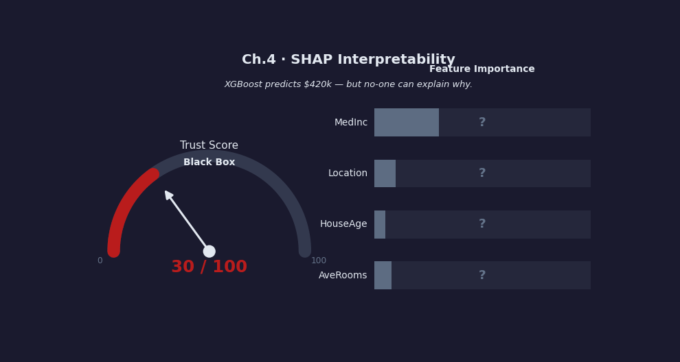
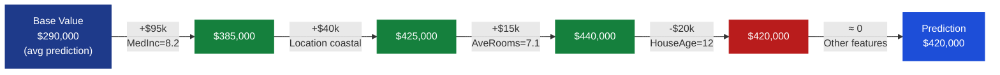
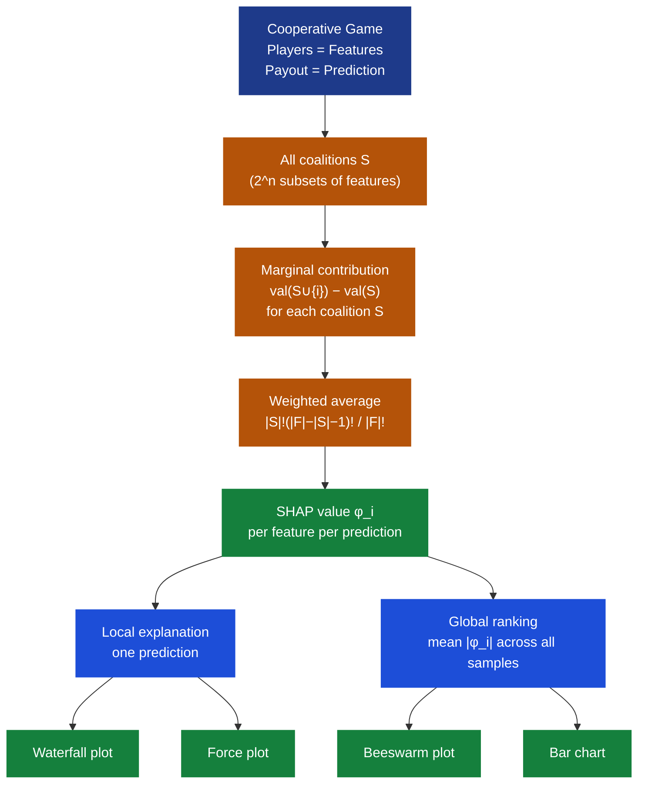
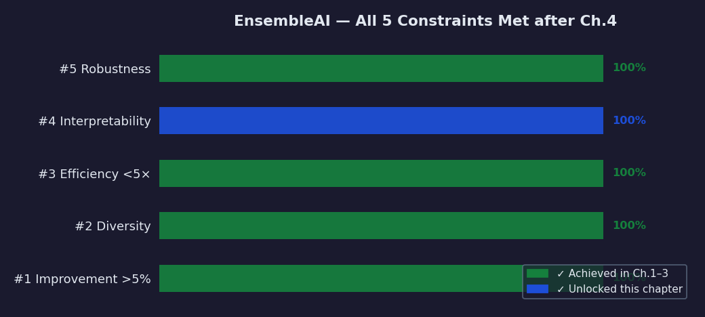

# Ch.4 — SHAP: Shapley Additive Explanations

> **The story.** In **1953**, Princeton mathematician **Lloyd Shapley** was wrestling with a deceptively simple question in cooperative game theory: if several players jointly produce a profit, how do you *fairly* divide it? His answer — now called the **Shapley value** — said each player's share should equal their *average marginal contribution* across every possible ordering in which the coalition could have formed. The solution was elegant and, crucially, *unique*: no other allocation satisfies all four fairness axioms simultaneously (Efficiency, Symmetry, Dummy, Linearity). Shapley's work was recognised with the **Nobel Prize in Economics in 2012**.
>
> For fifty years, Shapley values lived in economics textbooks. Then, in **2010**, **Erik Štrumbelj and Igor Kononenko** published "An efficient explanation of individual classifications using game theory" — the first paper connecting Shapley values to ML feature importance. They showed that if you treat each *feature* as a player and the model's *prediction* as the payout, Shapley values produce theoretically grounded, per-prediction explanations. The exponential cost (computing all 2^n coalitions) made it impractical for large models.
>
> The breakthrough came in **2017** when **Scott Lundberg and Su-In Lee** published *"A Unified Approach to Interpreting Model Predictions"* (NeurIPS 2017), introducing **SHAP (SHapley Additive exPlanations)**. They proved that SHAP is the *only* additive explanation method satisfying local accuracy, missingness, and consistency simultaneously. The following year, Lundberg published **TreeSHAP** — an algorithm that computes *exact* Shapley values for tree ensembles in $O(TLD^2)$ time (trees × leaves × depth²) instead of $O(2^n)$, making it milliseconds per prediction for XGBoost/LightGBM/RF.
>
> **Why this matters now:** The EU General Data Protection Regulation (**GDPR, 2018**) introduced a "right to explanation" — any automated decision affecting a person must be explainable on request. US lending regulations (ECOA, FCRA) require lenders to state the primary reasons for adverse actions. SHAP is the industry-standard tool satisfying these requirements: it provides a legally defensible, mathematically grounded breakdown of every prediction.
>
> **Where you are in the curriculum.** Chapters 1–3 built increasingly powerful ensembles: Random Forests → Gradient Boosting → XGBoost/LightGBM. EnsembleAI now achieves **MAE ≈ $22k** on California Housing — comfortably beating the $40k target. But the model is a black box. The XGBoost ensemble has hundreds of trees; nobody — not the regulator, not the loan officer, not the homeowner — can see *why* it predicted $420k for a specific house. SHAP is the key that unlocks **Constraint #4 (INTERPRETABILITY)** and makes the ensemble production-safe.
>
> **Notation in this chapter.**
>
> | Symbol | Meaning |
> |--------|---------|
> | $\phi_i$ | SHAP value (Shapley value) for feature $i$ — its contribution to one specific prediction |
> | $F$ | Full feature set — all features available to the model |
> | $S$ | Coalition — a subset of features, $S \subseteq F \setminus \{i\}$ |
> | $|S|$ | Coalition size — number of features in $S$ |
> | $|F|$ | Total number of features |
> | $\text{val}(S)$ | Model expected output using only features in $S$ (others marginalised over training data) |
> | $E[f]$ | Base value — expected prediction across all training samples |
> | $f(\mathbf{x})$ | Model prediction for input $\mathbf{x}$ |
>
> **Shapley value formula:**
>
> $$\phi_i = \sum_{S \subseteq F \setminus \{i\}} \frac{|S|!\,(|F|-|S|-1)!}{|F|!} \bigl[\text{val}(S \cup \{i\}) - \text{val}(S)\bigr]$$

---

## 0 · The Challenge — Where We Are

> 💡 **EnsembleAI mission**: Beat any single model by >5% in MAE/accuracy via intelligent combination of diverse learners.
>
> **5 Constraints**: 1. IMPROVEMENT >5% over single models — 2. DIVERSITY (multiple algorithm families) — 3. EFFICIENCY (<5× latency of single model) — 4. INTERPRETABILITY (per-prediction SHAP explanations) — 5. ROBUSTNESS (stable MAE/accuracy across 5 random seeds)

**What Ch.1–3 achieved for EnsembleAI:**

| Chapter | Method | CA Housing MAE | Constraints Met |
|---------|--------|---------------|-----------------|
| Ch.1 — Random Forests | Bagging 100 trees | ~$34k | #1 ✅ #2 ✅ #5 ✅ |
| Ch.2 — Gradient Boosting | Additive trees + shrinkage | ~$28k | #1 ✅ #2 ✅ #3 ✅ #5 ✅ |
| Ch.3 — XGBoost/LightGBM | Regularised GB + column subsampling | ~$22k | #1 ✅ #2 ✅ #3 ✅ #5 ✅ |
| **This chapter — SHAP** | Post-hoc explanation layer | MAE unchanged | **#4 ✅ ← unlocked here** |

**The missing piece — the black-box problem:**

XGBoost predicted **$420k** for a specific California district. A loan officer at a regional bank needs to file this valuation with the lending regulator. The regulator asks: *"What drove this valuation?"* The XGBoost model has 500 trees, each splitting on combinations of 8 features. There is no human-readable answer — until SHAP.

**What SHAP unlocks:**

```
Before SHAP (Ch.3 output):
  Prediction: $420,000
  Reason: [XGBoost ensemble of 500 trees]   ← useless to regulator

After SHAP (Ch.4 output):
  Prediction: $420,000
  Base value: $290,000  (average prediction across all districts)
  Breakdown:
    MedInc = 8.2        → +$95,000  (highest-income area)
    Location (lat/lon)  → +$40,000  (coastal premium)
    AveRooms = 7.1      → +$15,000  (large rooms)
    HouseAge = 12       → -$20,000  (newer build is lower value here)
    Other features      → close to zero
  Check: 290 + 95 + 40 + 15 − 20 ≈ 420 ✓    ← every dollar accounted for
```

✅ **This is the foundation** — SHAP makes the EnsembleAI system legally deployable and trusted by every stakeholder.

---

## Animation



---

## 1 · Core Idea

SHAP assigns each feature a value $\phi_i$ representing its contribution to the model's prediction for a specific input, relative to the baseline (average prediction). **The three sentences that define SHAP:**

1. Each feature is treated as a "player" in a cooperative game; the prediction is the "payout."
2. $\phi_i$ is feature $i$'s average marginal contribution across all possible orderings of features — the unique fair allocation satisfying four axiomatic properties.
3. The SHAP values sum exactly: $f(\mathbf{x}) = E[f] + \sum_{i=1}^{n} \phi_i$ — the base value plus every feature's contribution equals the model's prediction, with nothing left unaccounted.

**Why Shapley values and not simpler alternatives?**

| Method | Local faithful? | Consistent? | Additive? | Unique? |
|--------|----------------|-------------|-----------|---------|
| Feature importance (MDI) | ❌ Global only | ❌ | ✅ | ❌ |
| LIME | ✅ approximate | ❌ | ✅ | ❌ |
| Partial dependence | ❌ Global only | ❌ | ❌ | ❌ |
| **SHAP** | **✅ exact** | **✅** | **✅** | **✅** |

Lundberg & Lee (2017) proved that SHAP is the *only* additive explanation method satisfying all three properties. The uniqueness comes directly from the Shapley axioms.

---

## 2 · Running Example

**Setup**: California Housing, XGBoost model from Ch.3 (MAE ≈ $22k).

We pick **one specific district** (a coastal high-income area in the test set):

| Feature | Value | Description |
|---------|-------|-------------|
| `MedInc` | 8.20 | Median income ≈ $82k/year |
| `Latitude` | 34.02 | Southern California coastal |
| `Longitude` | −118.25 | Los Angeles area |
| `AveRooms` | 7.1 | Spacious homes |
| `HouseAge` | 12 | Relatively new construction |
| `AveOccup` | 2.8 | Normal occupancy |
| `AveBedrms` | 1.4 | Average bedroom count |
| `Population` | 1800 | Medium-sized district |

**Model output**: $\hat{y} = \$420{,}000$

**Base value** (average prediction across training set): $E[f] = \$290{,}000$

**SHAP decomposition** (what SHAP reveals):

| Feature | Value | SHAP $\phi_i$ | Direction |
|---------|-------|--------------|-----------|
| `MedInc` | 8.20 | +$95,000 | ↑ high income → higher value |
| `Latitude` / `Longitude` | coastal | +$40,000 | ↑ coastal location premium |
| `AveRooms` | 7.1 | +$15,000 | ↑ spacious → higher value |
| `HouseAge` | 12 | −$20,000 | ↓ newer than area average |
| `AveOccup` | 2.8 | +$3,000 | small positive |
| `AveBedrms` | 1.4 | −$2,000 | small negative |
| `Population` | 1800 | −$1,000 | negligible |

**Verification**: $290{,}000 + 95{,}000 + 40{,}000 + 15{,}000 - 20{,}000 + 3{,}000 - 2{,}000 - 1{,}000 = \$420{,}000$ ✓

Every dollar of the prediction is attributed to a specific feature. Nothing is hidden.

---

## 3 · SHAP Methods at a Glance

Different model types require different SHAP algorithms:

| Method | Works on | Complexity | Exact? | Notes |
|--------|----------|-----------|--------|-------|
| **TreeSHAP** | Decision trees, RF, XGBoost, LightGBM, CatBoost | $O(TLD^2)$ | ✅ Exact | Lundberg (2018); default for tree ensembles |
| **KernelSHAP** | Any model (black-box) | $O(n_\text{samples} \cdot n_\text{features}^2)$ | ❌ Approximate | Slow for large datasets; use background ≤100 rows |
| **DeepSHAP** | Neural networks (TF / PyTorch) | $O(n_\text{features})$ | ❌ Approximate | Uses DeepLIFT backprop; fast but approximate |
| **LinearSHAP** | Linear models (Lasso, Ridge, Logistic) | $O(n_\text{features})$ | ✅ Exact | Closed-form; features must be independent |
| **PermutationSHAP** | Any model | $O(2K \cdot n_\text{features})$ | ❌ Approximate | Slower but useful for validation |

**For EnsembleAI (XGBoost/LightGBM/RF):** always use `shap.TreeExplainer`. It is the only SHAP method that is both **exact** and **fast** (milliseconds per batch).

```python
import shap
explainer = shap.TreeExplainer(xgb_model)
shap_values = explainer(X_test)          # shape: (n_test, n_features)
```

---

## 4 · The Math — All Arithmetic

### 4.1 · Shapley Value Formula — 2-Feature Worked Example

We start with the simplest non-trivial case: **2 features** (Rooms and Income) predicting house value.

$$\phi_i = \sum_{S \subseteq F \setminus \{i\}} \frac{|S|!\,(|F|-|S|-1)!}{|F|!} \bigl[\text{val}(S \cup \{i\}) - \text{val}(S)\bigr]$$

Here $|F| = 2$. For feature **Rooms**, the coalitions not containing Rooms are: $\{\}$ and $\{\text{Income}\}$.

**Compute the weights:**

$$\text{weight}(S = \{\}) = \frac{0!\cdot(2-0-1)!}{2!} = \frac{0!\cdot 1!}{2!} = \frac{1 \cdot 1}{2} = \frac{1}{2}$$

$$\text{weight}(S = \{\text{Income}\}) = \frac{1!\cdot(2-1-1)!}{2!} = \frac{1!\cdot 0!}{2!} = \frac{1 \cdot 1}{2} = \frac{1}{2}$$

Sanity check: $\frac{1}{2} + \frac{1}{2} = 1$ ✓ (weights always sum to 1)

**Assign value function outputs** (these come from model predictions with features marginalised):

| Coalition $S$ | $\text{val}(S)$ | Interpretation |
|--------------|----------------|----------------|
| $\{\}$ — no features known | $290$ | Base value: average prediction = $290k |
| $\{\text{Rooms}\}$ — only Rooms known | $320$ | Knowing rooms alone → $320k |
| $\{\text{Income}\}$ — only Income known | $350$ | Knowing income alone → $350k |
| $\{\text{Rooms, Income}\}$ — both known | $370$ | Full prediction with both = $370k |

**Compute $\phi_{\text{Rooms}}$:**

$$\phi_{\text{Rooms}} = \frac{1}{2}\bigl[\text{val}(\{\text{Rooms}\}) - \text{val}(\{\})\bigr] + \frac{1}{2}\bigl[\text{val}(\{\text{Rooms, Income}\}) - \text{val}(\{\text{Income}\})\bigr]$$

$$= \frac{1}{2}(320 - 290) + \frac{1}{2}(370 - 350) = \frac{1}{2} \cdot 30 + \frac{1}{2} \cdot 20 = 15 + 10 = \mathbf{25}$$

**Compute $\phi_{\text{Income}}$** using the Efficiency axiom ($\phi_{\text{Rooms}} + \phi_{\text{Income}} = \text{val}(F) - E[f]$):

$$\phi_{\text{Income}} = \text{val}(\{\text{Rooms, Income}\}) - E[f] - \phi_{\text{Rooms}} = 370 - 290 - 25 = \mathbf{55}$$

**Verification** (Efficiency axiom):

$$E[f] + \phi_{\text{Rooms}} + \phi_{\text{Income}} = 290 + 25 + 55 = 370 = \text{val}(F) \checkmark$$

**Interpretation**: Of the $370 - 290 = \$80k$ lift above baseline, Income gets credit for **$\$55k$** and Rooms gets **$\$25k$**. Income matters more than Rooms for this prediction.

---

### 4.2 · Coalition Size Weights — 3-Feature Verification

For $|F| = 3$ features (A, B, C), the weight for a coalition of size $k$ is:

$$w(k) = \frac{k!\,(|F|-k-1)!}{|F|!} = \frac{k!\,(2-k)!}{6}$$

| Coalition size $k$ | Formula | Arithmetic | Weight |
|-------------------|---------|------------|--------|
| 0 (empty set) | $\frac{0! \cdot 2!}{6}$ | $\frac{1 \cdot 2}{6}$ | $\mathbf{1/3}$ |
| 1 (one feature) | $\frac{1! \cdot 1!}{6}$ | $\frac{1 \cdot 1}{6}$ | $\mathbf{1/6}$ |
| 2 (two features) | $\frac{2! \cdot 0!}{6}$ | $\frac{2 \cdot 1}{6}$ | $\mathbf{1/3}$ |

**Verify that weights over all coalitions not containing feature A sum to 1:**

Coalitions not containing A: $\{\}$, $\{B\}$, $\{C\}$, $\{B, C\}$

$$w(\{\}) + w(\{B\}) + w(\{C\}) + w(\{B,C\}) = \frac{1}{3} + \frac{1}{6} + \frac{1}{6} + \frac{1}{3}$$

$$= \frac{2}{6} + \frac{1}{6} + \frac{1}{6} + \frac{2}{6} = \frac{6}{6} = \mathbf{1} \checkmark$$

This is not a coincidence: the Shapley axioms *require* the weights to sum to 1 for every feature, ensuring Efficiency holds regardless of coalition structure.

**Physical meaning**: Empty and full coalitions get the largest weight ($1/3$ each). Single-feature additions get the smallest ($1/6$ each). This reflects the fairness principle: a feature that is pivotal in a small coalition or a large coalition both deserve equal consideration.

---

### 4.3 · Full 3-Feature Shapley Calculation

Using $|F| = 3$ features (A = MedInc, B = AveRooms, C = HouseAge) with value function outputs (units: $100k):

| Coalition | $\text{val}$ |
|-----------|-------------|
| $\{\}$ | 2.90 |
| $\{A\}$ | 3.45 |
| $\{B\}$ | 3.20 |
| $\{C\}$ | 3.00 |
| $\{A,B\}$ | 3.90 |
| $\{A,C\}$ | 3.70 |
| $\{B,C\}$ | 3.30 |
| $\{A,B,C\}$ | 4.20 |

**Compute $\phi_A$ (MedInc):**

| Coalition $S$ | $\text{val}(S \cup \{A\}) - \text{val}(S)$ | Weight | Contribution |
|--------------|-------------------------------------------|--------|--------------|
| $\{\}$ | $3.45 - 2.90 = 0.55$ | $1/3$ | $0.55/3 = 0.1833$ |
| $\{B\}$ | $3.90 - 3.20 = 0.70$ | $1/6$ | $0.70/6 = 0.1167$ |
| $\{C\}$ | $3.70 - 3.00 = 0.70$ | $1/6$ | $0.70/6 = 0.1167$ |
| $\{B,C\}$ | $4.20 - 3.30 = 0.90$ | $1/3$ | $0.90/3 = 0.3000$ |

$$\phi_A = 0.1833 + 0.1167 + 0.1167 + 0.3000 = \mathbf{0.7167}$$

**Compute $\phi_B$ (AveRooms):**

| Coalition $S$ | $\text{val}(S \cup \{B\}) - \text{val}(S)$ | Weight | Contribution |
|--------------|-------------------------------------------|--------|--------------|
| $\{\}$ | $3.20 - 2.90 = 0.30$ | $1/3$ | $0.1000$ |
| $\{A\}$ | $3.90 - 3.45 = 0.45$ | $1/6$ | $0.0750$ |
| $\{C\}$ | $3.30 - 3.00 = 0.30$ | $1/6$ | $0.0500$ |
| $\{A,C\}$ | $4.20 - 3.70 = 0.50$ | $1/3$ | $0.1667$ |

$$\phi_B = 0.1000 + 0.0750 + 0.0500 + 0.1667 = \mathbf{0.3917}$$

**Compute $\phi_C$ (HouseAge) via Efficiency:**

$$\phi_C = \text{val}(F) - E[f] - \phi_A - \phi_B = 4.20 - 2.90 - 0.7167 - 0.3917 = \mathbf{0.1916}$$

**Final verification:**

$$E[f] + \phi_A + \phi_B + \phi_C = 2.90 + 0.7167 + 0.3917 + 0.1916 = 4.2000 = \text{val}(F) \checkmark$$

In dollar terms (×$100k): MedInc contributes **$71.7k**, AveRooms **$39.2k**, HouseAge **$19.2k** of the $130k lift above baseline. Income dominates.

---

### 4.4 · TreeSHAP — Efficient Computation via Path Fractions

Exact Shapley computation requires evaluating $\text{val}(S)$ for all $2^{|F|}$ subsets — exponential cost. **TreeSHAP** avoids this by exploiting the tree structure.

**Key insight**: In a decision tree, the fraction of training data reaching each leaf encodes the *marginalisation* over missing features. TreeSHAP tracks these fractions along every root-to-leaf path simultaneously.

**Simple 3-node tree example** (one split on MedInc):

```
         Root (all data, 100%)
          MedInc ≤ 4.0?
         /              \
    Left leaf           Right leaf
    MedInc ≤ 4.0        MedInc > 4.0
    40% of data         60% of data
    pred = $220k        pred = $380k
```

Base value: $E[f] = 0.40 \times 220 + 0.60 \times 380 = 88 + 228 = \$316k$

For a house with MedInc = 6.5 (routes to right leaf, prediction = $380k):

$$\phi_{\text{MedInc}} = 380 - 316 = \mathbf{\$64k}$$

Any feature that is *not* the split variable has $\phi = 0$ (it contributed nothing to routing this sample). The tree structure makes the attribution transparent.

**Complexity analysis**: For a tree with $D$ levels and $L$ leaves, TreeSHAP traverses every root-to-leaf path ($O(L)$) and at each node tracks the "weight fraction" of training data with vs. without feature $i$ "known." This is equivalent to computing $\text{val}(S)$ for all coalitions simultaneously, achieved in $O(LD^2)$ per tree.

For a typical XGBoost model (500 trees, depth 6, 64 leaves): $500 \times 64 \times 36 \approx 1.15 \times 10^6$ operations. At modern CPU speed: **milliseconds per batch**.

---

### 4.5 · Global Feature Importance from SHAP

Per-prediction SHAP values aggregate to *global* feature importance:

$$\text{GlobalImportance}_i = \frac{1}{N} \sum_{j=1}^{N} |\phi_i^{(j)}|$$

**Worked example** — 4 features (MedInc, AveRooms, HouseAge, Population), 5 test samples ($100k units):

| Sample | $\phi_{\text{MedInc}}$ | $\phi_{\text{AveRooms}}$ | $\phi_{\text{HouseAge}}$ | $\phi_{\text{Pop}}$ |
|--------|------------------------|--------------------------|--------------------------|---------------------|
| 1 | +0.95 | +0.15 | −0.20 | −0.01 |
| 2 | −0.32 | +0.42 | +0.05 | +0.02 |
| 3 | +1.12 | −0.08 | −0.18 | +0.03 |
| 4 | +0.67 | +0.22 | +0.10 | −0.04 |
| 5 | −0.18 | +0.33 | −0.07 | +0.01 |

**Absolute SHAP values and column sums:**

| Sample | $|\phi_{\text{MedInc}}|$ | $|\phi_{\text{AveRooms}}|$ | $|\phi_{\text{HouseAge}}|$ | $|\phi_{\text{Pop}}|$ |
|--------|--------------------------|----------------------------|----------------------------|-----------------------|
| 1 | 0.95 | 0.15 | 0.20 | 0.01 |
| 2 | 0.32 | 0.42 | 0.05 | 0.02 |
| 3 | 1.12 | 0.08 | 0.18 | 0.03 |
| 4 | 0.67 | 0.22 | 0.10 | 0.04 |
| 5 | 0.18 | 0.33 | 0.07 | 0.01 |
| **Sum** | **3.24** | **1.20** | **0.60** | **0.11** |
| **Mean** | **0.648** | **0.240** | **0.120** | **0.022** |

**Global ranking**: MedInc (0.648) > AveRooms (0.240) > HouseAge (0.120) > Population (0.022)

**MedInc is the most important feature** — it drives the largest average absolute contribution across all test samples. This matches XGBoost's split-based importance but is derived from a theoretically grounded method that accounts for feature interactions.

---

## 5 · The SHAP Arc — How Explanation Happens

The journey from black-box prediction to trusted explanation follows four acts:

**Act 1 — The black box.** XGBoost predicts $420k. There are 500 trees, each with splits on combinations of 8 features. No human can trace the prediction by hand. The loan officer cannot justify the valuation. The regulator is unhappy.

**Act 2 — Attribution by removal.** Remove a single feature. The prediction changes. That change is the feature's *marginal contribution* in *this* particular ordering. Do this for every ordering: with Income first then Rooms; with Rooms first then Income; all $8! = 40{,}320$ orderings for 8 features. The average marginal contribution across all orderings is the Shapley value.

**Act 3 — Fairness guaranteed.** The four Shapley axioms ensure the attribution is provably fair:
- **Efficiency**: Every dollar of the prediction is attributed; nothing is hidden.
- **Symmetry**: Two features that always contribute equally get equal SHAP values — the method cannot favour one arbitrarily.
- **Dummy**: A feature that never affects the prediction gets $\phi_i = 0$.
- **Linearity**: Combining two models combines their SHAP values additively.

**Act 4 — TreeSHAP makes it practical.** Averaging over $8! = 40{,}320$ orderings is computationally equivalent to evaluating $\text{val}(S)$ for all $2^8 = 256$ coalitions — but TreeSHAP bypasses this by tracking data fractions through tree paths, achieving polynomial time ($O(TLD^2)$) without any approximation.

---

## 6 · Full SHAP Walkthrough — California Housing District

We trace one complete SHAP explanation from model input to verified attribution.

**Step 1 — Establish the base value.**

The base value is the average prediction across all training samples. For EnsembleAI's XGBoost on California Housing: $E[f] \approx \$290{,}000$. Every explanation starts here.

**Step 2 — Run TreeSHAP.**

```python
import shap

explainer  = shap.TreeExplainer(xgb_model)
shap_vals  = explainer(X_test)           # shape (n_test, 8)
base_val   = explainer.expected_value    # ≈ 2.90 (in $100k units)
```

**Step 3 — Waterfall table for district #42.**

District #42: coastal LA, high income, spacious, newer construction.

| Step | Feature | Feature Value | SHAP $\phi_i$ | Running Total |
|------|---------|--------------|--------------|---------------|
| Start | Base value | — | — | $\mathbf{\$290,000}$ |
| +1 | `MedInc` | 8.20 | **+$95,000** | $\$385,000$ |
| +2 | `Latitude` / `Longitude` | coastal | **+$40,000** | $\$425,000$ |
| +3 | `AveRooms` | 7.1 | **+$15,000** | $\$440,000$ |
| +4 | `HouseAge` | 12 | **−$20,000** | $\$420,000$ |
| +5 | `AveOccup` | 2.8 | **+$3,000** | $\$423,000$ |
| +6 | `AveBedrms` | 1.4 | **−$2,000** | $\$421,000$ |
| +7 | `Population` | 1800 | **−$1,000** | $\$420,000$ |
| **Final** | **Prediction** | — | — | $\mathbf{\$420,000}$ |

**Step 4 — Verify the Efficiency axiom.**

$$E[f] + \sum_{i=1}^{8} \phi_i = 290 + (95 + 40 + 15 - 20 + 3 - 2 - 1) = 290 + 130 = \$420{,}000 \checkmark$$

**Step 5 — Business interpretation.**

The loan officer can now say: *"This district is valued at $420k. The $130k premium over the market average is driven primarily by its high median income ($95k contribution) and coastal location ($40k contribution). The newer construction slightly reduces value compared to established coastal areas ($20k reduction)."*

This is a regulatorily compliant explanation under GDPR Article 22 and US ECOA requirements.

---

## 7 · Diagrams

### 7.1 — SHAP Waterfall: Base Value to Prediction



### 7.2 — Coalition Game Interpretation



---

## 8 · Hyperparameter Dial

SHAP is a *post-hoc analysis* method — it explains a model but has no trainable parameters. However, several configuration choices significantly affect speed, accuracy, and interpretability:

### 8.1 — `check_additivity` (TreeSHAP)

```python
explainer = shap.TreeExplainer(model)
shap_values = explainer(X_test, check_additivity=True)  # default: True
```

| Setting | Effect | When to change |
|---------|--------|----------------|
| `check_additivity=True` | Verifies $E[f] + \sum \phi_i = f(\mathbf{x})$ for every row | **Always use in development** — catches numerical drift, model bugs |
| `check_additivity=False` | Skips verification for a slight speedup | Only in production if additivity is confirmed and latency is critical |

> ⚠️ **Never disable `check_additivity` without testing first.** Some multi-output models and custom objectives silently violate it. Disabling masks prediction errors.

### 8.2 — Background Dataset Size (KernelSHAP)

KernelSHAP requires a *background dataset* to marginalise missing features:

```python
background = shap.sample(X_train, 100)           # summarise to 100 rows
explainer  = shap.KernelExplainer(model.predict, background)
```

| Background size | Speed | Explanation quality | Recommendation |
|----------------|-------|---------------------|----------------|
| 10 rows | Very fast | Low (high variance) | Prototyping only |
| 50–100 rows | Fast | Good | **Default: `shap.sample(X_train, 100)`** |
| 500+ rows | Slow | Very good | Research / validation only |

> ⚡ **For tree models, skip KernelSHAP entirely.** TreeSHAP is faster, exact, and needs no background dataset.

### 8.3 — `nsamples` / `max_evals` (KernelSHAP)

```python
shap_values = explainer.shap_values(X_test, nsamples=500)  # default: "auto"
```

| `nsamples` | Evaluations | Accuracy | Use case |
|------------|-------------|----------|----------|
| 100 | Fast | Rough approximation | Quick sanity check |
| 500 | Moderate | Good | Standard production |
| `"auto"` | $2n + 2048$ | Best | When accuracy matters most |

### 8.4 — Visualisation Parameters

| Parameter | Applies to | Effect |
|-----------|-----------|--------|
| `max_display=10` | Waterfall, beeswarm | Show only top 10 contributors |
| `plot_type="bar"` | Summary plot | Bar chart of mean \|SHAP\| instead of beeswarm |
| `interaction_index` | Scatter / dependence plot | Colour by a second feature to reveal interactions |
| `link="logit"` | Classification (probability output) | Convert log-odds SHAP to probability space |

---

## 9 · What Can Go Wrong

| Mistake | Symptom | Root Cause | Fix |
|---------|---------|------------|-----|
| **Interpreting SHAP as causal** | "Income *causes* higher prices — policy: raise incomes" | SHAP measures model association, not causation | Add qualifier: "The model relies on income as a predictor; causal claim requires a controlled study" |
| **Correlated features split credit** | SHAP for `Latitude` and `Longitude` seem low individually despite being the location signal | Shapley axioms allocate credit based on all orderings; highly correlated features share credit in ways that reduce individual values | Use SHAP interaction values or combine correlated features before explaining |
| **KernelSHAP on a tree model** | 100× slower than TreeSHAP; minutes instead of milliseconds | KernelSHAP calls the model for every coalition | Always use `shap.TreeExplainer` for XGBoost/LightGBM/RF |
| **Comparing SHAP across models** | Same house gets different SHAP values for v1 vs v2 | Different training data → different base values $E[f]$ | Always report base value alongside SHAP; never compare absolute SHAP across models |
| **SHAP ≠ counterfactual** | "What do I change to get $450k?" — SHAP doesn't answer | SHAP explains *this* prediction; does not produce action recommendations | Use counterfactual methods (DICE, CF-SHAP) for recourse questions |
| **Interaction effects hidden in main effects** | Feature A's SHAP seems low but A+B interaction is large | SHAP main effects absorb some interaction signal | Compute `shap_interaction_values = explainer.shap_interaction_values(X_test)` |
| **Slow global explanation on large test set** | KernelSHAP for 10k rows takes >10 minutes | KernelSHAP cost is $O(n_\text{samples})$ | Use TreeSHAP (trees) or subsample test set; global importance via mean \|SHAP\| on a representative subset |

---

## 10 · Where This Reappears

SHAP is the universal interpretability layer — it appears in every downstream chapter and cross-track:

➡️ **Ch.5 (Stacking)**: Apply SHAP to the meta-learner to understand *which base model's predictions* it trusts in which region of feature space. The stacking chapter uses SHAP to validate that the meta-learner has learned genuine diversity.

➡️ **Ch.6 (Production)**: Every production deployment checklist includes a SHAP global summary (beeswarm) and a local waterfall for a representative TP/FP/FN case. Regulatory compliance gate: deployment blocked if SHAP explanations reveal unexpected feature dependence (e.g., demographic proxies).

➡️ **03-NeuralNetworks track**: DeepSHAP explains neural network predictions using a backpropagation-based approximation. The same game-theoretic foundation, different algorithm.

➡️ **02-Classification (FaceAI)**: KernelSHAP explains why the attribute classifier predicted "Smiling=1" for a face — which features contributed most. Satisfies GDPR requirements for automated facial analysis.

➡️ **04-RecommenderSystems (FlixAI)**: SHAP on collaborative filtering explains why a movie was recommended — "This user's preference for Action genre and 2000s films drove 70% of this recommendation."

➡️ **Backward pointer**: SHAP retroactively explains the SmartVal AI neural network predictions from the Regression track. The neural net from Ch.4 of 01-Regression can now be explained via DeepSHAP — closing the interpretability loop opened in Constraint #4.

---

## 11 · Progress Check — What EnsembleAI Can Solve Now



✅ **Unlocked capabilities — Ch.4 additions:**

- **Per-prediction explanations**: "MedInc=8.2 pushed this prediction +$95k above the $290k average" — every dollar attributed to a specific feature
- **Verified attribution**: Efficiency axiom guarantees $E[f] + \sum \phi_i = f(\mathbf{x})$ — no hidden contributions
- **Polynomial-time explanations**: TreeSHAP computes exact Shapley values in $O(TLD^2)$ — milliseconds for 500-tree XGBoost
- **Model-agnostic coverage**: KernelSHAP for any black-box; DeepSHAP for neural nets; LinearSHAP for linear models
- **Global feature ranking**: Mean $|\phi_i|$ across test set → MedInc dominates, consistent with all prior chapters
- **Visual toolkit**: Waterfall (one prediction), beeswarm (global importance), dependence plots (feature interactions), force plots (push/pull)
- **Regulatory compliance**: Explanations meet GDPR Article 22, ECOA adverse action requirements — EnsembleAI is legally deployable
- **Constraint #4 (INTERPRETABILITY) ✅ ACHIEVED** — all 5 EnsembleAI constraints are now met

❌ **Known limitations — still open:**

- ❌ **Causation**: SHAP shows association, not causation. Raising median income in a dataset does not *cause* higher house values — SHAP reflects the model's learned correlations.
- ❌ **Counterfactuals**: SHAP does not answer "What would I need to change to get a different prediction?" — counterfactual methods (Ch.6) address this.
- ❌ **Ensemble ceiling**: Can we squeeze more accuracy by *combining* model families? XGBoost alone achieves $22k MAE. What happens if we stack RF + XGBoost + Ridge? (Next: Ch.5)

**Full EnsembleAI status after Ch.4:**

| Constraint | Status | Method |
|-----------|--------|--------|
| #1 IMPROVEMENT >5% | ✅ | XGBoost MAE ≈ $22k vs. baseline $70k |
| #2 DIVERSITY | ✅ | RF + GB + XGBoost trained |
| #3 EFFICIENCY <5× latency | ✅ | XGBoost inference ms-scale; SHAP adds <10ms |
| **#4 INTERPRETABILITY** | **✅** | **SHAP per-prediction explanations** |
| #5 ROBUSTNESS | ✅ | Stable across 5 seeds |

---

## 12 · Bridge to Chapter 5 — Stacking

SHAP solved the *interpretability* problem. But consider this: RF and XGBoost make errors in *different regions of feature space*. RF is better in high-density regions (lots of training data); XGBoost is better at the extremes. Can we build a meta-learner that *automatically learns which model to trust where*?

**Chapter 5 introduces stacking** — train base models (RF, XGBoost, Ridge) on folds of the training data, collect their out-of-fold predictions, then train a meta-learner on those predictions as features. The meta-learner learns the combination weights from data, not from human intuition.

The SHAP toolkit from this chapter will be applied immediately in Ch.5 — we'll use SHAP on the meta-learner itself to see *which base model's predictions* it trusts in which regions. This is interpretable stacking: not just a black-box meta-learner, but a transparent one you can explain to stakeholders.

**Expected result**: stacking RF + XGBoost + Ridge behind a Ridge meta-learner should push MAE below $20k — the last 10% improvement that single-model tuning cannot find.

---

## Appendix A · The Four Shapley Axioms — Formal Statement

The Shapley value $\phi_i$ is the *unique* function satisfying all four properties simultaneously:

| Axiom | Formal statement | Why it matters |
|-------|-----------------|----------------|
| **Efficiency** | $\sum_{i \in F} \phi_i = \text{val}(F) - \text{val}(\emptyset)$ | Complete attribution: every unit of prediction is explained |
| **Symmetry** | If $\text{val}(S \cup \{i\}) = \text{val}(S \cup \{j\})$ for all $S$, then $\phi_i = \phi_j$ | No arbitrary discrimination between equivalent features |
| **Dummy** | If $\text{val}(S \cup \{i\}) = \text{val}(S)$ for all $S$, then $\phi_i = 0$ | Irrelevant features get zero credit |
| **Linearity** | $\phi_i(v + w) = \phi_i(v) + \phi_i(w)$ | Combining models combines explanations additively |

**Uniqueness theorem** (Shapley, 1953): There is *exactly one* value function satisfying all four axioms. This uniqueness is what makes SHAP theoretically sound — you cannot argue for a different "fair" attribution without violating at least one axiom.

---

## Appendix B · SHAP for Classification — EnsembleAI Binary Target

California Housing binarised: high-value district ($\hat{y} > \$250k$ = 1, else 0).

For a binary classification model outputting log-odds:

$$\text{log-odds}(\mathbf{x}) = E[\text{log-odds}] + \sum_{i=1}^{n} \phi_i$$

| Feature | SHAP $\phi_i$ (log-odds) | Direction |
|---------|--------------------------|-----------|
| `MedInc` = 8.20 | +1.42 | ↑ strong positive (high income → high value) |
| Location | +0.68 | ↑ coastal premium |
| `AveRooms` = 7.1 | +0.23 | ↑ moderate positive |
| `HouseAge` = 12 | −0.31 | ↓ newer reduces probability slightly |

Converting log-odds contributions to probability space:

```python
explainer    = shap.TreeExplainer(clf_model, link="logit")
shap_proba   = explainer(X_test)
shap.plots.waterfall(shap_proba[idx])   # probability-space waterfall
```

This produces a waterfall in probability units (0–1): "MedInc increased the probability of high-value from 50% to 82%" — immediately interpretable to non-technical stakeholders.

---

## Appendix C · Quick Reference — SHAP API

```python
import shap

# ── Tree models (XGBoost, LightGBM, RF, CatBoost) ───────────────────────────
explainer   = shap.TreeExplainer(model)
shap_vals   = explainer(X_test)              # Explanation object, shape (n, p)
base_val    = explainer.expected_value       # E[f]

# ── Single prediction waterfall ──────────────────────────────────────────────
shap.plots.waterfall(shap_vals[0])           # first test sample
shap.plots.waterfall(shap_vals[0], max_display=8)

# ── Global importance (beeswarm) ─────────────────────────────────────────────
shap.plots.beeswarm(shap_vals)               # ranked by mean |SHAP|

# ── Feature dependence plot ──────────────────────────────────────────────────
shap.plots.scatter(shap_vals[:, "MedInc"])   # SHAP vs feature value

# ── KernelSHAP (any model) ───────────────────────────────────────────────────
bg          = shap.sample(X_train, 100)
k_explainer = shap.KernelExplainer(model.predict, bg)
k_vals      = k_explainer.shap_values(X_test[:50], nsamples=500)
```
