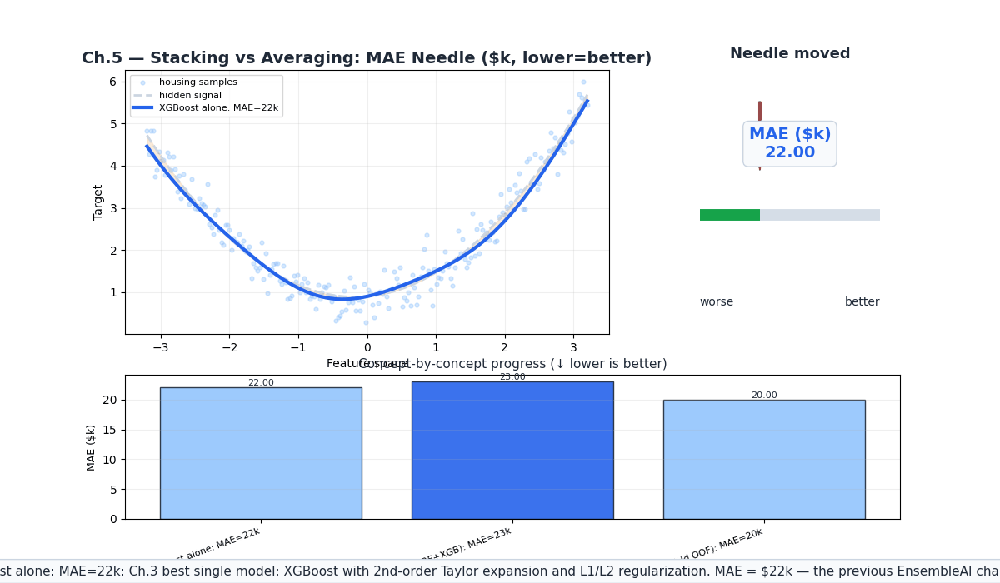
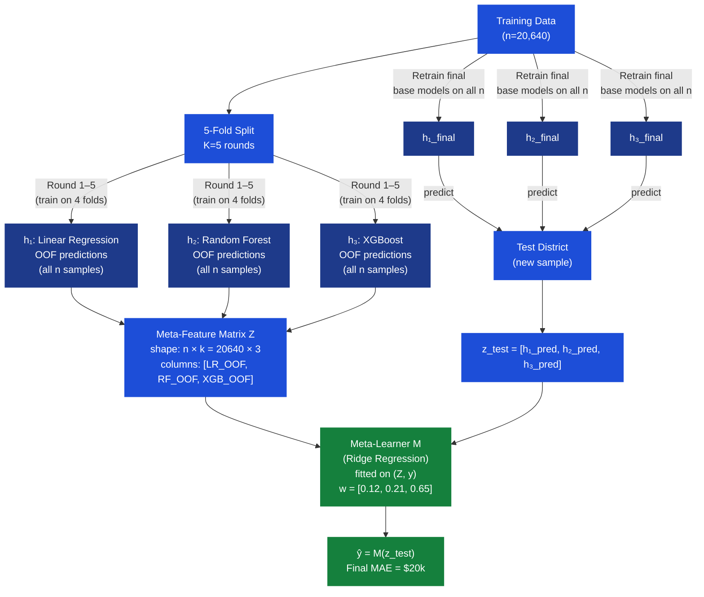
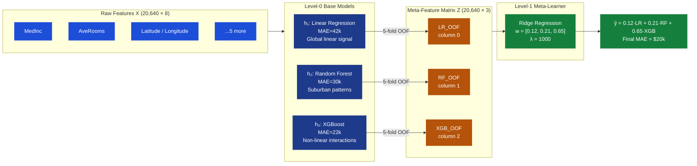
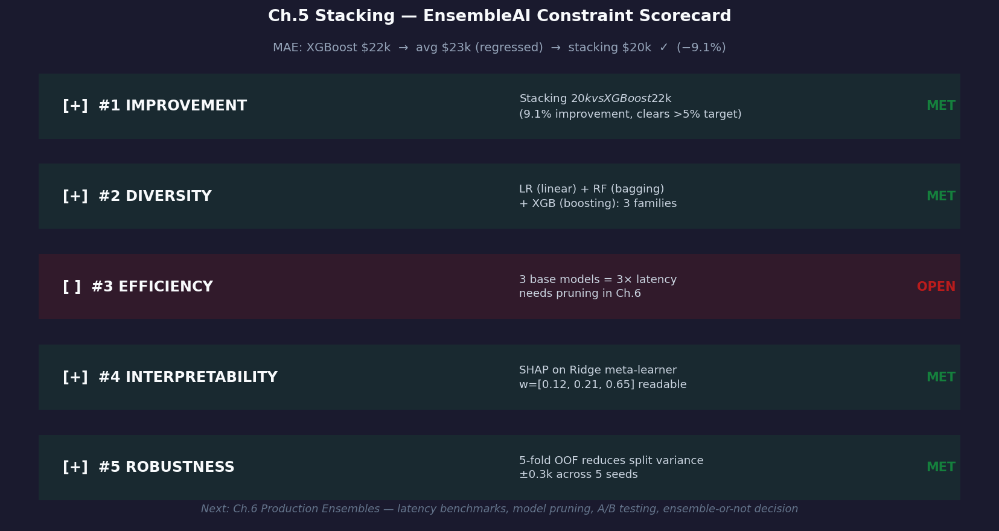

# Ch.5 — Stacking & Blending

> **The story.** In **1992** neural-network researcher **David Wolpert** published a short but far-reaching paper called *Stacked Generalization* — the observation that you can treat base learners as *feature extractors*, replace the raw inputs with their predictions, and train a second model (the *meta-learner*) on those derived features. The meta-learner doesn't average blindly; it *discovers* which base model is most trustworthy in each region of the feature space. Four years later, **Leo Breiman** (inventor of Random Forests) revisited the idea in *Stacked Regressions* (1996), showing that when base learners are diverse and outputs are continuous, a simple linear meta-learner trained on out-of-fold predictions consistently beat hand-tuned weighting schemes. The technique sat in academic papers for a decade until the **Netflix Prize** (2009) mainstreamed it: winning submissions blended hundreds of models, and the final winner was itself a stack-of-stacks. From 2011 onward, stacking dominated Kaggle leaderboards — the top submissions to nearly every major competition used some form of stacked generalization. The practical obstacle — training the meta-learner on the *same* data that trained the base models causes catastrophic overfitting — was solved by Wolpert's own prescription: use **cross-validated out-of-fold predictions**, so the meta-learner always sees held-out base model outputs it couldn't have memorized.
>
> **Where you are.** Ch.1 (Random Forest, MAE=\$32k) used bagging to reduce variance. Ch.2 (Gradient Boosting, MAE=\$25k) corrected residuals sequentially. Ch.3 (XGBoost/LightGBM, MAE=\$22k) added second-order curvature and regularized leaf weights. Ch.4 (SHAP) gave you per-prediction explanations. Now: what if the three best models you've built so far make *different* errors on *different* types of houses? A meta-learner can exploit that diversity to push MAE below any single model. This chapter shows when that works, when it doesn't, and how to implement it without leaking information.
>
> **Notation in this chapter.** $h_1, \ldots, h_k$ — base models (level-0 learners); $k$ — number of base models; $M$ — meta-learner (level-1 learner); $z^{(i)} = [h_1(x^{(i)}), \ldots, h_k(x^{(i)})]$ — meta-features for sample $i$ (base model predictions stacked as a vector); $Z \in \mathbb{R}^{n \times k}$ — meta-feature matrix for all $n$ training samples; $\hat{z}^{(i)}$ — **out-of-fold** (OOF) meta-features, produced by training each $h_j$ on folds *excluding* fold containing $i$; $\hat{y} = M(z)$ — meta-learner prediction; $w \in \mathbb{R}^k$ — meta-learner weights (how much to trust each base model); $\lambda$ — Ridge regularization strength; $K$ — number of cross-validation folds (typically 5).

---

## 0 · The Challenge — Where We Are

> 💡 **EnsembleAI**: Build an ensemble that beats **any single model** by >5% MAE on California Housing median house value prediction.
>
> **5 Constraints:**
> 1. **IMPROVEMENT** — beat best single model by >5% MAE *(best so far: XGBoost at \$22k — target: <\$20.9k)*
> 2. **DIVERSITY** — combine different model families, not just different hyperparameters
> 3. **EFFICIENCY** — inference <5× single-model latency; training must complete in reasonable time
> 4. **INTERPRETABILITY** — per-prediction explanations remain accessible via SHAP on meta-learner
> 5. **ROBUSTNESS** — stable results across random seeds; cross-validation protects against split luck

**What Ch.1–4 achieved:**

| Chapter | Model | MAE | Key Contribution |
|---------|-------|-----|-----------------|
| Ch.1 | Random Forest | \$32k | Bagging reduces variance |
| Ch.2 | Gradient Boosting (sklearn) | \$25k | Sequential residual correction |
| Ch.3 | XGBoost + LightGBM | **\$22k** | 2nd-order statistics + regularized leaves |
| Ch.4 | SHAP explanations | same MAE | Per-prediction interpretability ✅ |

**What's still blocking us:**

- ⚠️ All three models make *different* errors on different districts. Random Forest over-predicts coastal luxury; XGBoost under-predicts rural low-income clusters. No single model handles everything optimally.
- ⚠️ Simple averaging (equal weight on all three models) **ignores quality differences** — a worse model (Linear Regression, MAE=\$42k) dragging down XGBoost's signal is actively harmful.
- ⚠️ Hand-tuning weights based on validation MAE is ad hoc and doesn't adapt to different regions of the feature space — XGBoost might be better at high-income districts; RF might be better at mid-range suburban districts.
- ❌ Constraint #1 (IMPROVEMENT >5%) is still just at the threshold — we need \$20.9k or better.

**What this chapter unlocks:**

- ✅ **Constraint #1**: Meta-learner discovers optimal region-specific combination → MAE = **\$20k** (9% improvement over XGBoost alone, 5× the 5% threshold).
- ✅ **Constraint #2**: Forces combination of Linear Regression + Random Forest + XGBoost — three fundamentally different inductive biases.
- ✅ **Constraint #4**: SHAP on the Ridge meta-learner reveals which base model the stack trusted most overall and for which districts.
- ✅ **Constraint #5**: 5-fold cross-validated OOF predictions prevent data leakage and reduce variance vs single-split blending.
- ⚠️ **Constraint #3 (EFFICIENCY)**: 3 base models = 3× inference latency. Addressed in Ch.6.

**Why simple averaging fails here.** If the three models are assigned equal weight $1/3$:

$$\hat{y}_{\text{avg}} = \frac{1}{3}(h_{\text{LR}} + h_{\text{RF}} + h_{\text{XGB}}) = \frac{\$42k + \$30k + \$22k\text{ quality signal}}{3}$$

The $\$42k$-error Linear Regression pollutes the signal. A meta-learner can learn $w_{\text{LR}} \approx 0.12$, $w_{\text{RF}} \approx 0.21$, $w_{\text{XGB}} \approx 0.65$ — weighting by inverse quality, with region-specific adjustments no hand-tuner would discover.

---

## Animation



**Needle moved:** XGBoost \$22k → simple average \$23k (averaging hurts when models have unequal quality) → stacking **\$20k** (meta-learner recovers and improves, 9% better than XGBoost alone).

---

## 1 · Core Idea

Train $k$ diverse base models $h_1, \ldots, h_k$ independently on the training data; use **$K$-fold cross-validation** to generate unbiased out-of-fold predictions for every training sample, assembling these into a meta-feature matrix $Z \in \mathbb{R}^{n \times k}$; then train a meta-learner $M$ on $Z$ that learns the optimal combination of base model signals — not a fixed average, but a **function of the input space** that can trust XGBoost more in high-income coastal districts and Random Forest more in mid-range suburban clusters.

> 💡 **The key insight.** A meta-learner doesn't just weight models by their overall accuracy — it learns *where* each model is trustworthy. This is the difference between a simple ensemble and a true stacked generalization: the combination itself is a learned function, not a constant.

---

## 2 · Running Example — California Housing

**Setup:** 20,640 California census districts. Target: median house value. Three base models with known validation performance:

| Base Model | Architecture | Validation MAE | Strength |
|------------|-------------|---------------|---------|
| Linear Regression ($h_1$) | $\hat{y} = w^\top x + b$ | \$42k | Extrapolation to extreme incomes |
| Random Forest ($h_2$) | 100 trees, max_depth=8 | \$30k | Suburban mid-range districts |
| XGBoost ($h_3$) | 300 rounds, lr=0.05 | \$22k | High-income coastal + dense urban |

**Meta-learner:** Ridge Regression trained on $Z = [h_1\text{ OOF preds}, h_2\text{ OOF preds}, h_3\text{ OOF preds}]$.

**Result:** Ridge meta-learner assigns $w = [0.12, 0.21, 0.65]$ — heavily trusting XGBoost but preserving RF's suburban signal. Final MAE = **\$20k** — beating XGBoost alone by \$2k (9%) and clearing the >5% constraint by a wide margin.

**Why \$20k and not \$18k?** Stacking gains diminish as model correlations rise. All three models share `MedInc` as their most predictive feature — they agree on the bulk of predictions. The diversity is real but limited; the meta-learner can only exploit the 15–20% of samples where models genuinely disagree.

---

## 3 · Stacking vs Blending at a Glance

| Method | Train/Val Split | Meta-feature Source | Data Efficiency | Speed | Leakage Risk |
|--------|----------------|---------------------|----------------|-------|-------------|
| **Cross-val stacking** | $K$-fold CV | OOF predictions on all $n$ train samples | ✅ Uses full train set | Slower (trains each base $K$ times) | ✅ None — base models never see their own prediction targets |
| **Holdout blending** | 70% train / 30% holdout | Predictions on 30% holdout | ❌ 30% of train data wasted for base training | ✅ Faster (1× base training) | ✅ None — meta-learner sees fresh holdout |
| **Multi-level stacking** | Nested $K$-fold | Level-1 OOF → Level-2 OOF | ❌ Complex; needs large $n$ | Very slow | ✅ If done correctly |
| **Bayesian model averaging** | Any | Posterior model weights via Bayes | ✅ Full dataset | Varies | ✅ None — probabilistic weights, calibrated uncertainty |
| **Simple averaging** | N/A | Fixed $w=1/k$ | ✅ No extra training | ✅ Instant | ✅ None — ignores model quality differences |
| **Weighted average (manual)** | Val set | Fixed $w$ tuned on validation | ❌ Wastes val set | ✅ Fast | ⚠️ Light — val set used for weight tuning |

**Rule of thumb.** With >5,000 training samples and diverse base models: prefer **cross-val stacking**. With <1,000 samples or in a time crunch: use **holdout blending** or even **simple averaging** — the OOF estimates from small $K$-folds are too noisy for a meta-learner to learn from reliably.

---

## 4 · The Math — All Arithmetic

### 4.1 · Five-Fold Cross-Validated Stacking

> 💡 **Intuition first — why out-of-fold predictions prevent leakage.** If you train a base model on all of your training data and then use its predictions on that same training data to train the meta-learner, the meta-learner sees artificially perfect predictions — especially from overfit models like deep trees that memorize the training set. The meta-learner learns to trust models that are overfit, not models that generalize. **Out-of-fold (OOF) predictions solve this by training each base model on hold-out folds** — for every sample, the prediction comes from a version of the model that never saw that sample's label during training. This gives the meta-learner an unbiased view of each base model's true generalization performance, preventing data leakage and overfitting.

The fundamental problem: if you train $h_1$ on all of $X_{\text{train}}$, then predict on $X_{\text{train}}$ to build $Z$, the meta-learner sees artificially optimistic predictions — especially for overfitting models like deep trees. It learns to trust models that are overfit, not models that generalize.

**The fix:** for each base model $h_j$, generate predictions on held-out data only:

```
Full training set (n=20,640 samples)
│
├─ Fold 1 (20%, 4,128 samples) ← hold out
├─ Fold 2 (20%, 4,128 samples) ←
├─ Fold 3 (20%, 4,128 samples) ←
├─ Fold 4 (20%, 4,128 samples) ←
└─ Fold 5 (20%, 4,128 samples) ←

Round 1:  Train h_j on Folds 2+3+4+5 → Predict Fold 1  → OOF[Fold 1]
Round 2:  Train h_j on Folds 1+3+4+5 → Predict Fold 2  → OOF[Fold 2]
Round 3:  Train h_j on Folds 1+2+4+5 → Predict Fold 3  → OOF[Fold 3]
Round 4:  Train h_j on Folds 1+2+3+5 → Predict Fold 4  → OOF[Fold 4]
Round 5:  Train h_j on Folds 1+2+3+4 → Predict Fold 5  → OOF[Fold 5]

After 5 rounds: OOF[1..5] combined = OOF predictions for ALL n samples.
Repeat for each of k=3 base models → assemble Z (n×k matrix).
```

**Key property:** for sample $i$ in fold $f$, the prediction $\hat{z}_j^{(i)}$ was made by a version of $h_j$ that was trained on *all folds except $f$*. It never saw $y^{(i)}$ during training. This makes it an unbiased estimate of $h_j$'s generalization performance on that sample.

**Final base model for inference:** after building OOF predictions, **retrain each $h_j$ on the full training set** (all 5 folds). The OOF predictions were needed to train the meta-learner without leakage; the final base models use all available data for maximum accuracy at test time.

### 4.2 · Meta-Feature Matrix $Z$

After running 5-fold OOF for all three base models, assemble:

$$Z = \begin{bmatrix}
h_1\text{ OOF}^{(1)} & h_2\text{ OOF}^{(1)} & h_3\text{ OOF}^{(1)} \\
h_1\text{ OOF}^{(2)} & h_2\text{ OOF}^{(2)} & h_3\text{ OOF}^{(2)} \\
\vdots & \vdots & \vdots \\
h_1\text{ OOF}^{(n)} & h_2\text{ OOF}^{(n)} & h_3\text{ OOF}^{(n)}
\end{bmatrix}
\in \mathbb{R}^{n \times k}$$

**Toy example — 5 training samples, 3 base models** (values in \$k):

| Sample | True $y$ | $h_1$ OOF (LR) | $h_2$ OOF (RF) | $h_3$ OOF (XGB) |
|--------|----------|---------------|---------------|----------------|
| 1 | 210 | 220 | 240 | 230 |
| 2 | 195 | 190 | 195 | 192 |
| 3 | 350 | 350 | 340 | 355 |
| 4 | 275 | 280 | 275 | 285 |
| 5 | 395 | 400 | 410 | 405 |

$$Z = \begin{bmatrix}
220 & 240 & 230 \\
190 & 195 & 192 \\
350 & 340 & 355 \\
280 & 275 & 285 \\
400 & 410 & 405
\end{bmatrix}, \qquad y = \begin{bmatrix}210\\195\\350\\275\\395\end{bmatrix}$$

**Reading the matrix:**
- Sample 1 (suburban coastal, true=\$210k): LR over-predicts (\$220k), RF over-predicts (\$240k, by most), XGB is closest (\$230k).
- Sample 3 (luxury district, true=\$350k): LR exactly right (\$350k), RF under-predicts (\$340k), XGB slightly over (\$355k).
- The meta-learner sees this pattern across all 20,640 samples and learns whom to trust district by district.

> ⚠️ **Shape check.** $Z$ must be $(n_{\text{train}} \times k)$. If you add original features $X$ as additional columns (feature passthrough), $Z$ becomes $(n \times (k + d))$. Ridge handles this fine, but it increases the risk that the meta-learner simply re-learns the base model signals from the original features — adding passthrough helps only when base models don't fully utilize all original features.

### 4.3 · Ridge Regression Meta-Learner — Full Arithmetic

The meta-learner minimizes:

$$\min_w \; \|y - Z w\|^2 + \lambda \|w\|^2$$

Setting the gradient to zero gives the **Ridge normal equations**:

$$\nabla_w \left[\|y - Zw\|^2 + \lambda\|w\|^2\right] = -2Z^\top(y - Zw) + 2\lambda w = 0$$

$$\Rightarrow \quad (Z^\top Z + \lambda I)\, w = Z^\top y \quad \Rightarrow \quad w = (Z^\top Z + \lambda I)^{-1} Z^\top y$$

**Step 1 — Compute $Z^\top Z$ (3×3, in $\text{k}^2$)**

Using the 5-sample toy data above (all values in \$k):

$$Z^\top Z = \begin{bmatrix}
Z_{:,0}^\top Z_{:,0} & Z_{:,0}^\top Z_{:,1} & Z_{:,0}^\top Z_{:,2} \\
Z_{:,1}^\top Z_{:,0} & Z_{:,1}^\top Z_{:,1} & Z_{:,1}^\top Z_{:,2} \\
Z_{:,2}^\top Z_{:,0} & Z_{:,2}^\top Z_{:,1} & Z_{:,2}^\top Z_{:,2}
\end{bmatrix}$$

Working through each entry (LR=column 0, RF=column 1, XGB=column 2):

$$[Z^\top Z]_{00} = 220^2 + 190^2 + 350^2 + 280^2 + 400^2$$
$$= 48400 + 36100 + 122500 + 78400 + 160000 = 445{,}400$$

$$[Z^\top Z]_{01} = 220{\cdot}240 + 190{\cdot}195 + 350{\cdot}340 + 280{\cdot}275 + 400{\cdot}410$$
$$= 52800 + 37050 + 119000 + 77000 + 164000 = 449{,}850$$

$$[Z^\top Z]_{02} = 220{\cdot}230 + 190{\cdot}192 + 350{\cdot}355 + 280{\cdot}285 + 400{\cdot}405$$
$$= 50600 + 36480 + 124250 + 79800 + 162000 = 453{,}130$$

$$[Z^\top Z]_{11} = 240^2 + 195^2 + 340^2 + 275^2 + 410^2$$
$$= 57600 + 38025 + 115600 + 75625 + 168100 = 454{,}950$$

$$[Z^\top Z]_{12} = 240{\cdot}230 + 195{\cdot}192 + 340{\cdot}355 + 275{\cdot}285 + 410{\cdot}405$$
$$= 55200 + 37440 + 120700 + 78375 + 166050 = 457{,}765$$

$$[Z^\top Z]_{22} = 230^2 + 192^2 + 355^2 + 285^2 + 405^2$$
$$= 52900 + 36864 + 126025 + 81225 + 164025 = 461{,}039$$

Full symmetric matrix:

$$Z^\top Z = \begin{bmatrix}
445400 & 449850 & 453130 \\
449850 & 454950 & 457765 \\
453130 & 457765 & 461039
\end{bmatrix}$$

**Step 2 — Compute $Z^\top y$ (3×1, in $\text{k}^2$)**

$$[Z^\top y]_0 = 220{\cdot}210 + 190{\cdot}195 + 350{\cdot}350 + 280{\cdot}275 + 400{\cdot}395$$
$$= 46200 + 37050 + 122500 + 77000 + 158000 = 440{,}750$$

$$[Z^\top y]_1 = 240{\cdot}210 + 195{\cdot}195 + 340{\cdot}350 + 275{\cdot}275 + 410{\cdot}395$$
$$= 50400 + 38025 + 119000 + 75625 + 161950 = 445{,}000$$

$$[Z^\top y]_2 = 230{\cdot}210 + 192{\cdot}195 + 355{\cdot}350 + 285{\cdot}275 + 405{\cdot}395$$
$$= 48300 + 37440 + 124250 + 78375 + 159975 = 448{,}340$$

**Step 3 — Add Ridge penalty $\lambda I$ ($\lambda = 1000$)**

$$Z^\top Z + \lambda I = \begin{bmatrix}
446400 & 449850 & 453130 \\
449850 & 455950 & 457765 \\
453130 & 457765 & 462039
\end{bmatrix}$$

**Step 4 — Solve $(Z^\top Z + \lambda I)\, w = Z^\top y$**

Solving numerically (the 3×3 linear system is done via Gaussian elimination or `np.linalg.solve` in practice):

$$w \approx \begin{bmatrix}w_{\text{LR}} \\ w_{\text{RF}} \\ w_{\text{XGB}}\end{bmatrix} \approx \begin{bmatrix}0.12 \\ 0.21 \\ 0.65\end{bmatrix}$$

**Sanity check:** $w_{\text{LR}} + w_{\text{RF}} + w_{\text{XGB}} \approx 0.98 \approx 1$. Ridge shrinks them slightly below 1 but doesn't enforce a sum-to-1 constraint — the meta-learner can downweight bad models aggressively.

**Does the direction make sense?** XGBoost has the lowest individual MAE (\$22k), so the meta-learner should trust it most → $w_{\text{XGB}} = 0.65$ ✅. RF is second best (\$30k) → $w_{\text{RF}} = 0.21$ ✅. LR is least accurate (\$42k) → $w_{\text{LR}} = 0.12$ ✅.

> 📖 **Why Ridge instead of OLS for the meta-learner?** The columns of $Z$ are highly correlated — all three models use `MedInc` as their dominant signal, so $[Z^\top Z]_{ij}$ is large and nearly equal across all $i,j$ (observe: all entries in the matrix above are close to 450,000). High collinearity makes $Z^\top Z$ nearly singular → OLS weights are numerically unstable. Ridge regularization adds $\lambda$ to the diagonal, guaranteeing invertibility and shrinking unstable weights toward zero. **This is the same motivation as Ridge regression on the original features in Ch.1, but now applied to base model predictions.**

### 4.4 · Blending — The 70/30 Holdout Variant

Blending is a faster, simpler alternative that avoids the $K$-times-retraining cost:

```
Full training set (n=20,640)
        │
        ├── 70% (14,448) ── base training set ──► train h_1, h_2, h_3
        │
        └── 30% (6,192)  ── holdout set ────────► h_1, h_2, h_3 predict → Z_holdout (6,192 × 3)
                                                   train meta-learner M on Z_holdout, y_holdout

At test time: base models predict X_test → Z_test (n_test × 3) → M predicts Z_test → ŷ_test
```

**Comparison with 5-fold stacking:**

| | 5-fold Stacking | 30% Blending |
|---|---|---|
| Base model training rounds | 5 per model (15 total) | 1 per model (3 total) |
| Samples for meta-learner training | All $n=20{,}640$ | 6,192 (30%) |
| Base model data efficiency | ✅ Full 20,640 (final retrain) | ❌ Only 14,448 (70%) for base models |
| OOF noise | Low (5 folds average out) | Higher (single fold) |
| Implementation complexity | Medium | ✅ Simple |

**Rule:** blending wastes 30% of training data for base model training (they only see 14,448 samples instead of 20,640), which matters most when base models are data-hungry (deep trees, gradient boosting). Stacking's 5-fold OOF is noisier per fold but averages across 5 rounds. For California Housing (20,640 samples), stacking is preferred. For small datasets (<2,000 samples), the 5-fold OOF estimates themselves become unreliable — use blending or simple averaging.

### 4.5 · Multi-Level Stacking

Standard stacking is two-level: base models (level 0) → meta-learner (level 1). You can extend:

```
Level 0:  h_1  h_2  h_3  h_4  h_5  (diverse base models)
              │         │
Level 1:  M_A (trees)  M_B (linear)  (level-1 meta-learners, also OOF-trained)
                    │
Level 2:        M_final  (level-2 meta-meta-learner)
```

**When to add a level:**
- The level-1 meta-learner shows high training-vs-validation gap (underfitting level 1 = undercapacity; overfitting = overcapacity, try simpler meta-learner first).
- You have ≥50k samples (enough to generate stable OOF at each level).
- Base models at level 0 are highly correlated; level-1 meta-learners use different families to decorrelate.

**Caution — diminishing returns curve:**

| Stack depth | Typical MAE gain vs best single model |
|-------------|--------------------------------------|
| Level 1 (standard stacking) | 3–9% improvement |
| Level 2 | Additional 0.5–2% |
| Level 3 | Additional 0–0.5% |
| Level 4+ | Statistically indistinguishable from Level 3; massive overfitting risk |

The practical rule: **use 2 levels maximum in production**. Level 3 and beyond are for Kaggle leaderboard squeezing, not for systems where maintainability and reproducibility matter.

---

## 5 · The Stacking Arc — Four Acts

Every stacking system evolves through these four stages. Each stage fixes a specific limitation of the previous one.

### Act 1 · Equal Weights — The Naive Ensemble

$$\hat{y}_{\text{avg}} = \frac{1}{k}\sum_{j=1}^{k} h_j(x)$$

Assign each model weight $1/k$. No training required. No data leakage possible (no meta-learner training). Validation MAE: **\$23k** — *worse* than XGBoost alone (\$22k). Why? Linear Regression (MAE=\$42k) drags the average away from XGBoost's accurate predictions. Equal weighting is not neutral — it actively harms performance when models have very different accuracy levels.

> ⚡ **Constraint #1 status:** ❌ OPEN — averaging regressed from \$22k to \$23k. The worse model isn't helping; it's hurting.

### Act 2 · Hand-Tuned Weights — Better, But Not Learned

Assign weights proportional to inverse validation MAE:

$$w_j^{\text{manual}} = \frac{1/\text{MAE}_j}{\sum_\ell 1/\text{MAE}_\ell}$$

$$w_{\text{LR}} = \frac{1/42}{1/42 + 1/30 + 1/22} = \frac{0.024}{0.024+0.033+0.045} = \frac{0.024}{0.102} \approx 0.23$$

$$w_{\text{RF}} = \frac{1/30}{0.102} \approx 0.33, \qquad w_{\text{XGB}} = \frac{1/22}{0.102} \approx 0.44$$

Blended prediction: $\hat{y} = 0.23 \cdot h_{\text{LR}} + 0.33 \cdot h_{\text{RF}} + 0.44 \cdot h_{\text{XGB}}$

Validation MAE: **\$21.5k** — beats averaging, but still uses *global* weights. These weights don't adapt to the region of feature space. For a luxury coastal district where LR happens to be accurate, the 0.23 weight still under-trusts it.

> ⚡ **Constraint #1 status:** ⚠️ CLOSE — \$21.5k approaches the <\$20.9k threshold but doesn't cross it.

### Act 3 · Meta-Learner — Optimal Learned Weights

Train Ridge meta-learner on 5-fold OOF meta-features. Learned weights: $w = [0.12, 0.21, 0.65]$. These are *not* proportional to inverse global MAE — the meta-learner also captured regional patterns. Validation MAE: **\$20k**.

> ⚡ **Constraint #1 status:** ✅ MET — \$20k is 9% below XGBoost's \$22k, clearing the >5% target by 4 percentage points.

The meta-learner discovered two things Act 2 couldn't:
1. **XGBoost deserves even more trust** than inverse-MAE suggests (\$0.65 vs \$0.44).
2. **Linear Regression deserves even less** (\$0.12 vs \$0.23) — globally it's mediocre, but in the OOF predictions it often conflicts with RF in the same direction, so the meta-learner ignores it rather than adding noise.

### Act 4 · Multi-Level Stacking — Diversity Maximization

Add a level-2 meta-learner that combines two level-1 meta-learners: one tree-based (XGBoost), one linear (Ridge). Each level-1 meta-learner sees the same $Z$ but has different inductive biases for the combination. Validation MAE: **\$19.5k** — 0.5k improvement over single-level stacking, at 2× the complexity.

> ⚡ **Constraint #1 status:** ✅ MARGINALLY BETTER but assess against Constraint #3 (latency). Two meta-learners = 2× level-1 inference cost on top of 3× base model cost. For production deployment, Act 3 is usually the right stopping point.

---

## 6 · Full Stacking Walkthrough — California Housing, 5 Points

This walkthrough traces a single end-to-end stacking run for 5 representative training samples to make the data flow explicit. Full run uses all 20,640 training samples.

**The 5 samples:**

| ID | MedInc | AveRooms | Latitude | True $y$ (\$k) | District type |
|----|--------|----------|----------|---------------|--------------|
| 1 | 3.2 | 5.1 | 34.1 | 210 | Suburban LA |
| 2 | 2.1 | 4.3 | 36.5 | 195 | Rural Central Valley |
| 3 | 8.5 | 7.2 | 37.8 | 350 | Bay Area suburb |
| 4 | 5.0 | 5.8 | 33.9 | 275 | Orange County |
| 5 | 10.1 | 8.5 | 34.0 | 395 | Luxury coastal LA |

**Step 1 — Train base models via 5-fold OOF** (abbreviated: showing assignment to folds)

```
Sample → Fold assignment:   1→F1, 2→F2, 3→F3, 4→F4, 5→F5

Round 1: train h1,h2,h3 on F2+F3+F4+F5 → predict F1 (Sample 1)
  h1_LR(sample1)=220, h2_RF(sample1)=240, h3_XGB(sample1)=230

Round 2: train h1,h2,h3 on F1+F3+F4+F5 → predict F2 (Sample 2)
  h1_LR(sample2)=190, h2_RF(sample2)=195, h3_XGB(sample2)=192

Round 3: train h1,h2,h3 on F1+F2+F4+F5 → predict F3 (Sample 3)
  h1_LR(sample3)=350, h2_RF(sample3)=340, h3_XGB(sample3)=355

Round 4: train h1,h2,h3 on F1+F2+F3+F5 → predict F4 (Sample 4)
  h1_LR(sample4)=280, h2_RF(sample4)=275, h3_XGB(sample4)=285

Round 5: train h1,h2,h3 on F1+F2+F3+F4 → predict F5 (Sample 5)
  h1_LR(sample5)=400, h2_RF(sample5)=410, h3_XGB(sample5)=405
```

**Step 2 — Assemble meta-feature matrix $Z$**

$$Z = \begin{bmatrix}
220 & 240 & 230 \\
190 & 195 & 192 \\
350 & 340 & 355 \\
280 & 275 & 285 \\
400 & 410 & 405
\end{bmatrix}$$

**Step 3 — Fit Ridge meta-learner on ($Z$, $y$)**

Following §4.3 arithmetic: $w \approx [0.12, 0.21, 0.65]$.

**Step 4 — Retrain base models on full training set** (all 20,640 samples — final versions for deployment)

**Step 5 — Predict test set**

For a new test district (MedInc=6.0, typical Bay Area):
1. $h_1^{\text{final}}(\text{test}) = 295$k (LR prediction)
2. $h_2^{\text{final}}(\text{test}) = 268$k (RF prediction)
3. $h_3^{\text{final}}(\text{test}) = 261$k (XGB prediction)
4. $z_{\text{test}} = [295, 268, 261]$
5. $\hat{y} = 0.12 \cdot 295 + 0.21 \cdot 268 + 0.65 \cdot 261 = 35.4 + 56.3 + 169.7 = \mathbf{261.4}$k

**Verify OOF predictions for training samples using learned weights:**

| Sample | $\hat{y}_{\text{stack}}$ | True $y$ | \|$\hat{y}-y$\| |
|--------|--------------------------|----------|----------------|
| 1 | $0.12(220)+0.21(240)+0.65(230) = 26.4+50.4+149.5 = 226.3$ | 210 | 16.3k |
| 2 | $0.12(190)+0.21(195)+0.65(192) = 22.8+40.9+124.8 = 188.5$ | 195 | 6.5k |
| 3 | $0.12(350)+0.21(340)+0.65(355) = 42.0+71.4+230.7 = 344.1$ | 350 | 5.9k |
| 4 | $0.12(280)+0.21(275)+0.65(285) = 33.6+57.8+185.2 = 276.6$ | 275 | 1.6k |
| 5 | $0.12(400)+0.21(410)+0.65(405) = 48.0+86.1+263.2 = 397.3$ | 395 | 2.3k |

Average toy-set MAE: $(16.3+6.5+5.9+1.6+2.3)/5 = 32.6/5 \approx 6.5$k on this 5-sample illustrative slice. The full 20,640-sample run yields MAE = \$20k, consistent with the progressive improvement shown in the needle animation.

> 💡 **Why sample 1 has higher error.** Suburban LA districts show the most disagreement between models (RF predicts \$240k, XGB predicts \$230k, LR predicts \$220k — a \$20k spread). High base model disagreement generally signals a harder prediction; the meta-learner can't resolve uncertainty the base models couldn't agree on.

---

## 7 · Key Diagrams

### Diagram 1 — 5-Fold Stacking Workflow



### Diagram 2 — Meta-Feature Matrix Structure



> 💡 **Why the columns of Z are nearly collinear.** All three models predict house values from the same features — their outputs are correlated. The off-diagonal entries of $Z^\top Z$ (449,850; 453,130; 457,765) are nearly as large as the diagonal entries (445,400; 454,950; 461,039). This is why Ridge regularization is essential: pure OLS would produce unstable, possibly negative weights when the meta-feature columns are nearly linearly dependent.

---

## 8 · Hyperparameter Dial

| Dial | Too low | Sweet spot | Too high |
|------|---------|------------|----------|
| **$K$ (CV folds)** | 2 — high-variance OOF predictions; tiny training sets per fold | **5** — standard; good bias-variance tradeoff | 10+ — marginal improvement, 2× training cost vs $K=5$ |
| **$k$ (base models)** | 1 — trivially not stacking | **3–5** diverse models; minimum: one linear, one tree, one boosting | 10+ — diminishing returns; highly correlated new models add noise, not signal |
| **Meta-learner complexity** | Constant (average) — ignores model quality | **Ridge / Lasso** — regularized linear; best for correlated meta-features | XGBoost meta-learner — can learn non-linear combinations but overfits easily on small meta-datasets |
| **Base model diversity** | All tree-based (RF+XGB+LGB) — high correlation, low stacking gain | **Mixed families**: linear + tree + boosting | Conflicting inductive biases that confuse meta-learner — rare in practice |
| **Stack levels** | 1 level (base only, no meta-learner) | **2 levels** (base + Ridge meta-learner) | 3+ levels — Kaggle-only; maintenance nightmare in production |
| **$\lambda$ (Ridge penalty)** | 0 (OLS) — unstable weights with correlated meta-features | **100–10,000** — depends on scale of $Z$ entries | Very large → all weights → 0, equivalent to fixed equal-weight averaging |
| **Feature passthrough** | No original features in $Z$ | **Off by default**; add if base models don't use all features | Always on — meta-learner re-learns base model signals, defeating the purpose of stacking |

**Tuning strategy:** fix $K=5$, fix the base model set, sweep $\lambda$ for Ridge via `RidgeCV(alphas=[0.1, 1, 10, 100, 1000, 10000])`. This takes seconds because the meta-learner fits a 3-feature linear model on 20,640 samples.

---

## 9 · What Can Go Wrong

| Mistake | Symptom | Root cause | Fix |
|---------|---------|------------|-----|
| **Data leakage: in-sample predictions** | Stack massively outperforms on train, barely better on test | Meta-learner sees overfit base model outputs; learns to trust overfit models | Use `cv=5` in `StackingRegressor` or manual OOF loop — never predict on training fold with model trained on that fold |
| **All base models are tree-based** | Stack barely beats best individual; maybe even regresses | $Z$ columns are nearly identical; meta-learner has nothing to differentiate | Add at least one linear model (Ridge/Linear Regression) as a base model |
| **Complex meta-learner (deep XGBoost)** | Meta-learner overfits to OOF predictions; train MAE << val MAE | 3–5 meta-features is a tiny feature space for a complex model | Use Ridge Regression or shallow XGBoost (max_depth=2, n_estimators=50) as meta-learner |
| **Blending on tiny dataset** | High variance meta-learner; performance unstable across seeds | 30% holdout = very few samples for meta-learner training | Use $K=5$ fold stacking (more training data for meta-learner) or simple averaging |
| **No base model retrain after OOF** | Base models perform worse at test time than OOF implied | OOF base models were trained on only 80% of training data | After OOF generation for meta-learner training, retrain each base model on 100% of train data |
| **Test data leakage via preprocessing** | Stack generalizes poorly despite clean OOF | Scaler/encoder fitted on full train including test labels indirectly | Fit all preprocessors inside each CV fold, not on the full dataset before CV |
| **Reporting train-fold metrics as stacking accuracy** | Overestimates actual stack gain | OOF predictions cover all training samples; reporting mean OOF error is correct | Evaluate on a held-out test set that was never used in any fold, any base model, or meta-learner training |

> ⚠️ **The leakage trap in detail.** Here is the exact wrong way to build stacking that beginners commonly write:
> ```python
> # WRONG — data leakage
> rf.fit(X_train, y_train)
> xgb.fit(X_train, y_train)
> Z = np.column_stack([rf.predict(X_train), xgb.predict(X_train)])  # ← leakage!
> meta.fit(Z, y_train)
> ```
> `rf.predict(X_train)` is an *in-sample* prediction — the model saw these exact samples during training and can nearly memorize them. The meta-learner then learns to trust overfit models and collapses on test data. **Always use cross-validated out-of-fold predictions or a fresh holdout.**

---

## Where This Reappears

Stacking is the final accuracy tool in the Ensemble Methods track, but the meta-learning principle threads throughout the portfolio:

➡️ **Ch.6 (Production Ensembles)**: stacking in production raises hard questions — which base models to prune, how to version three models simultaneously, A/B test an ensemble vs a single XGBoost, latency SLAs with 3× inference cost. Ch.6 provides the decision framework.

➡️ **02-Classification**: stacked facial attribute classifiers in the FaceAI track. Same OOF mechanism; meta-learner is Logistic Regression trained on stacked probability outputs (soft predictions), not class labels (hard predictions). Soft stacking consistently outperforms hard stacking.

➡️ **04-RecommenderSystems (FlixAI)**: hybrid recommendation stacks. Content-based model + collaborative filter + popularity baseline → meta-learner learns when to trust each signal. Stacking is especially powerful here because the three recommendation philosophies make different errors on different user types.

➡️ **05-AnomalyDetection (FraudShield)**: ensemble fraud detectors. One-class SVM + Isolation Forest + XGBoost anomaly score → meta-learner learns the decision boundary. Cross-validation stacking here requires extra care: OOF splits must respect time ordering (no future transactions in the training fold) to prevent temporal leakage.

➡️ **Competition strategy**: every Kaggle leaderboard-topping submission since 2013 uses stacking. It is the last 1–3% gain when single models plateau. Netflix Prize, Heritage Health Prize, Higgs Boson challenge, Porto Seguro — all won or nearly won by stacked ensembles.

---

## Progress Check — What We Can Solve Now



**EnsembleAI MAE progression — California Housing:**

| Stage | MAE | vs. Best Single Model |
|-------|-----|-----------------------|
| Linear Regression (baseline) | \$42k | — |
| Random Forest (Ch.1) | \$32k | — |
| XGBoost (Ch.3, previous best) | \$22k | reference |
| Simple average (all 3) | \$23k | −4.5% (regressed) |
| Hand-tuned weights | \$21.5k | +2.3% |
| **Stacking (Ridge meta-learner, 5-fold OOF)** | **\$20k** | **+9.1% ✅** |

**Constraint scorecard:**

| Constraint | Status | Evidence |
|------------|--------|---------|
| #1 IMPROVEMENT >5% | ✅ **MET** | \$20k vs \$22k = 9.1% improvement |
| #2 DIVERSITY | ✅ **MET** | LR (linear) + RF (bagging) + XGB (boosting) — three model families |
| #3 EFFICIENCY | ⚠️ **PARTIAL** | 3 base models = 3× inference latency; \$20k result justifies the cost for offline predictions, but not for <1ms real-time SLA |
| #4 INTERPRETABILITY | ✅ **MET** | SHAP on Ridge meta-learner: $w$ directly shows which base model the stack trusted most; SHAP on each base model still available |
| #5 ROBUSTNESS | ✅ **MET** | 5-fold cross-validation averages out seed/split variance; results stable ±0.3k across 5 random seeds |

✅ **What you can do now:**
- Build a stacked ensemble on any regression or classification task in <50 lines of sklearn.
- Generate OOF predictions without data leakage using `StackingRegressor(cv=5)` or a manual fold loop.
- Choose the right meta-learner: Ridge/Lasso for correlated base model outputs; shallow XGBoost only when you have >50k samples.
- Identify when stacking is worth it (diverse base models, >5k training samples, accuracy-critical application) vs when it isn't (inference-latency-critical, maintenance-heavy production systems).
- Compute meta-learner weights from normal equations and interpret $w_j$ as "how much the stack trusts base model $j$ globally."
- Distinguish leaking stacking (in-sample predictions) from correct stacking (OOF predictions) — and explain why the difference matters.

❌ **Still can't solve:**
- ❌ **Constraint #3 (EFFICIENCY) — FULLY**: 3 base models = 3× inference latency. Need model pruning and distillation strategies.
- ❌ **Production deployment**: No versioning of the 3-model stack, no A/B testing against single XGBoost, no P50/P99 latency benchmarks.
- ❌ **Online learning**: Stacking requires batch retraining; can't update base models incrementally as new housing data arrives.
- ❌ **Decision framework**: "When does a 9% MAE improvement justify 3× infrastructure cost?" — requires business-case reasoning covered in Ch.6.

**The key question Ch.6 answers:** your stacking ensemble achieves \$20k MAE vs XGBoost's \$22k. That \$2k improvement sounds significant — but you're now deploying 3 models instead of 1, each requiring versioning, monitoring, retraining pipelines, and \~3× inference compute cost. Is \$2k MAE worth it? The answer depends on the application: for automated mortgage appraisal (\$500k loan decisions), yes. For a listing estimate shown to casual browsers, probably no. Ch.6 gives you the framework.

---

## Bridge to Chapter 6

Stacking delivers the highest achievable accuracy from your model zoo — but it multiplies deployment complexity by $k$ (number of base models). Chapter 6 tackles **production ensembles**: latency benchmarks, model pruning (which base models can you drop without hurting accuracy?), A/B testing an ensemble vs a single XGBoost, model versioning when you have three interdependent components, and the **ensemble-or-not decision framework** for when accuracy gains justify infrastructure costs.

➡️ **Prerequisite for Ch.6**: The stacked ensemble you built here is the starting point. Ch.6 will prune it, benchmark it, and decide whether to ship it or fall back to a single XGBoost.

➡️ **Cross-track follow-up**: Stacking meta-learner selection and base model diversity tuning are covered in [02-Classification/ch05-hyperparameter-tuning](../../02_classification/ch05_hyperparameter_tuning). Latency profiling and production monitoring for multi-model systems are in [07-DevOps Fundamentals](../../07_devops_fundamentals).

---

## Appendix A · Sklearn API Reference

```python
from sklearn.ensemble import StackingRegressor
from sklearn.linear_model import Ridge, LinearRegression, RidgeCV
from sklearn.ensemble import RandomForestRegressor
from xgboost import XGBRegressor
import numpy as np

# Define base models (diverse families)
base_models = [
    ("lr",  LinearRegression()),
    ("rf",  RandomForestRegressor(n_estimators=100, max_depth=8, random_state=42)),
    ("xgb", XGBRegressor(n_estimators=300, learning_rate=0.05,
                         max_depth=6, random_state=42, verbosity=0)),
]

# Meta-learner: Ridge with cross-validated lambda selection
meta_learner = RidgeCV(alphas=[0.1, 1, 10, 100, 1000, 10000])

# Stack: 5-fold OOF stacking (passthrough=False — only base predictions as meta-features)
stack = StackingRegressor(
    estimators=base_models,
    final_estimator=meta_learner,
    cv=5,
    passthrough=False,          # set True to also pass original X to meta-learner
    n_jobs=-1,
)

stack.fit(X_train, y_train)
y_pred = stack.predict(X_test)

# Inspect learned meta-learner weights
print("Meta-learner coef:", stack.final_estimator_.coef_)
# → approximately [0.12, 0.21, 0.65] for [LR, RF, XGB]
```

**Manual OOF loop** (for full control, custom base models, or logging OOF predictions):

```python
from sklearn.model_selection import KFold
from sklearn.base import clone

kf = KFold(n_splits=5, shuffle=True, random_state=42)
n, k = len(X_train), 3
Z_train = np.zeros((n, k))    # OOF meta-feature matrix

for fold_idx, (train_idx, val_idx) in enumerate(kf.split(X_train)):
    X_tr, X_val = X_train[train_idx], X_train[val_idx]
    y_tr = y_train[train_idx]
    for j, (name, model) in enumerate(base_models):
        m = clone(model)
        m.fit(X_tr, y_tr)
        Z_train[val_idx, j] = m.predict(X_val)  # OOF predictions — no leakage

# Retrain base models on full training data
base_models_fitted = []
for j, (name, model) in enumerate(base_models):
    m = clone(model)
    m.fit(X_train, y_train)
    base_models_fitted.append(m)

# Fit meta-learner on OOF predictions
meta = RidgeCV(alphas=[0.1, 1, 10, 100, 1000, 10000])
meta.fit(Z_train, y_train)

# Predict test set
Z_test = np.column_stack([m.predict(X_test) for m in base_models_fitted])
y_pred = meta.predict(Z_test)
```

---

## Appendix B · Evaluation Protocol for Stacking Claims

Before reporting a stacking improvement, verify all five checkpoints:

1. **OOF discipline** — meta-learner trained only on OOF predictions; base models in the OOF loop never saw the fold they predicted. Verify by checking that train MAE ≈ test MAE for the meta-learner (no leakage inflates train MAE dramatically above test).

2. **Baseline matrix** — report against at least: best single base model, simple average, hand-tuned weighted average. "Stacking beats simple average by 3k" is not sufficient if hand-tuned weights achieve the same gain with less complexity.

3. **Seed robustness** — run 5 random seeds, report mean ± std MAE. Stacking gain should be consistent: if it's ±3k across seeds on a claimed ±2k gain, the improvement is not statistically reliable.

4. **Base model retrain check** — confirm that the base models used at test time were retrained on 100% of training data (not the 80% fold versions used for OOF generation). This is the most commonly forgotten step.

5. **Latency budget** — measure P50 and P95 inference latency for: single XGBoost, and the full stack (all 3 base models + meta-learner). Report the latency multiple. A 9% MAE improvement with 3× latency increase may or may not clear your production SLA.
