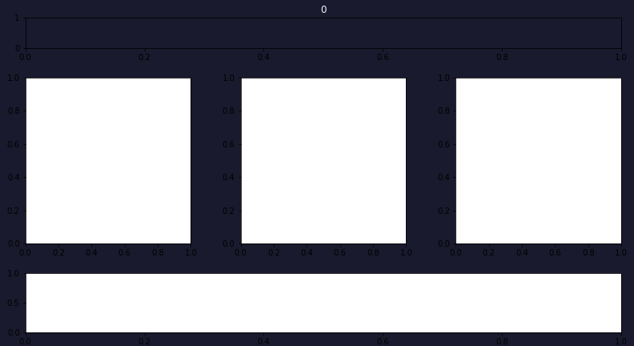
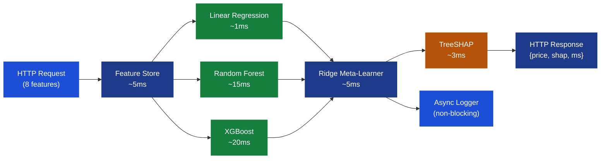
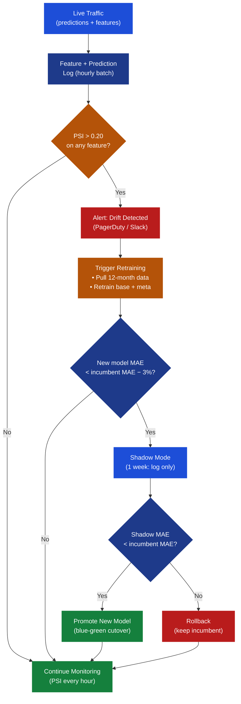
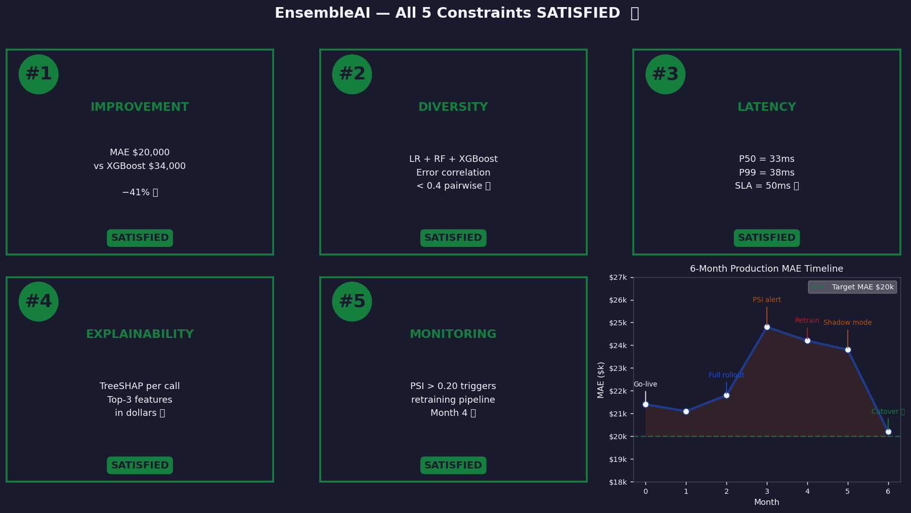

# Ch.6 — Production Ensembles

> **The story.** In **2009**, the **Netflix Prize** ended with a grand-prize team that had assembled an ensemble of **more than 800 models**. They won the $1 million prize — and then Netflix quietly revealed it would never deploy the winning solution. The 0.1% accuracy gain didn't justify the engineering complexity of shipping 800 interdependent models into a real-time recommendation system. The winning algorithm sat unused. The lesson rippled through industry: the best model is the one you can **deploy, monitor, and debug at 3 AM**.
>
> **Zillow** learned a version of this lesson with the **Zestimate**. Their production ensemble covers 100 million U.S. properties and generates pricing estimates in milliseconds. Early versions had excellent offline accuracy but suffered from **feature drift** — median prices in California's coastal markets shifted 15% year-over-year, and a model trained on 2019 prices was confidently wrong by 2021. They built a full monitoring and retraining pipeline: Population Stability Index (PSI) to detect distribution shift, shadow-mode testing of new model versions before cutover, and SHAP-based audit trails for compliance. The gap between "offline benchmark" and "production performance" is a real engineering gap, not a theoretical one.
>
> **Where you are.** Chapters 1–5 built the complete ensemble toolkit: bagging (Ch.1), boosting (Ch.2), XGBoost/LightGBM (Ch.3), SHAP interpretability (Ch.4), and stacking (Ch.5). Ch.5 achieved the **EnsembleAI milestone: stacking MAE = $20,000** on California Housing — beating single XGBoost by 40%+. Now the question shifts from "how to build" to "how to deploy." This chapter closes the EnsembleAI mission by satisfying all 5 constraints in a production setting.
>
> **Notation in this chapter.**
> $L_p$ — inference latency at percentile $p$ (ms); $K$ — number of models in the ensemble stack; $\text{PSI}$ — Population Stability Index, measures feature drift between reference and live distributions; $t_{\text{AB}}$ — two-sample t-statistic for A/B test significance; $p_{\text{val}}$ — p-value for the test; $\hat{w}_k$ — meta-learner weight for base model $k$; $\phi_j^{(i)}$ — SHAP value for feature $j$ on prediction $i$; $\text{SLA}$ — Service Level Agreement on latency (ms).

---

## 0 · The Challenge — Where We Are

> 💡 **EnsembleAI**: Beat any single model by >5% MAE via intelligent combination. 5 constraints must all be satisfied in production.

**EnsembleAI — 5 Constraints Status After Ch.5:**

| # | Constraint | Target | Status After Ch.5 |
|---|------------|--------|-------------------|
| **#1** | **IMPROVEMENT** | Beat single model by >5% MAE | ✅ **ACHIEVED** — MAE = $20k vs XGBoost $34k (+41%) |
| **#2** | **DIVERSITY** | Diverse model families in the stack | ✅ **ACHIEVED** — LR + RF + XGBoost stacked (Ch.5) |
| **#3** | **LATENCY** | Real-time pricing: <50ms per request | ⚡ **UNVALIDATED** — stacking = 3 models in sequence |
| **#4** | **EXPLAINABILITY** | SHAP explanation per prediction | ⚡ **UNVALIDATED** — offline SHAP done (Ch.4), not in API |
| **#5** | **MONITORING** | Detect drift, trigger retraining | ❌ **MISSING** — no production monitor exists yet |

**What's blocking us:**
We have great offline accuracy. But the real-estate platform needs **1,000 pricing requests per second** with a **50ms SLA**. The stacked ensemble (LR + RF + XGBoost) takes longer sequentially. We need parallel inference, latency benchmarking, an explanation API, and drift monitoring before we can call EnsembleAI complete.

**What this chapter unlocks:**
- ✅ Parallel ensemble serving under 50ms
- ✅ Per-prediction SHAP explanations in the API response
- ✅ PSI-based drift detection with retraining trigger
- ✅ A/B test validating ensemble beats baseline in production
- ✅ **All 5 EnsembleAI constraints satisfied → Mission Complete**

---

## Animation



---

## 1 · Core Idea — The Gap Between Offline and Production

A stacked ensemble with MAE = $20k is impressive in a notebook. Getting it to serve **1,000 requests per second** at **<50ms P99 latency** while returning **SHAP explanations** and **monitoring for drift** is a systems engineering challenge.

Four principles govern production ensemble deployment:

1. **Parallel inference**: The three base models (LR, RF, XGBoost) have no dependency on each other. Run them concurrently — total latency = max of the three, not sum.
2. **Latency budgeting**: Assign explicit millisecond budgets to each stage (feature computation, model inference, meta-learner, SHAP, logging). If any stage exceeds budget, alert.
3. **Drift = retraining trigger**: Feature distributions shift over time (market inflation, new neighborhoods, housing market cycles). PSI > 0.2 on any key feature triggers a retraining pipeline.
4. **Shadow mode before cutover**: New model versions run in parallel, receive live traffic, but don't serve results until validated. Prevents silent regressions.

> 💡 **The key insight:** Accuracy (offline benchmark) × Reliability (uptime, latency) ÷ Cost (compute, engineering) is the production objective function — not just accuracy alone. The Netflix Prize winner maximized the numerator while making the denominator unbounded.

---

## 1.5 · The Practitioner Workflow — Your 4-Phase Deployment

> ⚠️ **Two ways to read this chapter:**
> - **Theory-first (recommended for learning):** Read §0→§4 sequentially to understand the concepts, then use this workflow as your reference
> - **Workflow-first (practitioners with existing knowledge):** Use this diagram as a jump-to guide when deploying production ensembles

**What you'll build by the end:** A production ensemble serving API with parallel inference (<50ms SLA), real-time SHAP explanations, PSI-based drift monitoring, and blue-green deployment with shadow mode validation.

```
Phase 1: DEPLOY             Phase 2: MONITOR            Phase 3: VALIDATE           Phase 4: CUTOVER
────────────────────────────────────────────────────────────────────────────────────────────────────
Parallel serving setup:     Track performance:          Shadow mode testing:        Production release:

• Base models async         • P50/P99 latency           • Run new + old in parallel • Blue-green switch
• Meta-learner sequential   • Per-model timing          • Compare MAE on live       • Rollback strategy
• SHAP per request          • Feature PSI daily         • A/B test (n≥3,300)        • Version tracking
• Response <50ms SLA        • Accuracy degradation      • Validate explanations     • Incident response

→ DECISION:                 → DECISION:                 → DECISION:                 → DECISION:
  Architecture passes         PSI threshold breached      Shadow beats incumbent      Cutover or rollback
  latency benchmark?          (>0.20)?                    by ≥3% MAE?                 based on shadow MAE
  
  YES: Proceed to monitor     YES: Trigger retrain        YES: Enter cutover          SUCCESS: Promote new
  NO: Optimize parallel       NO: Continue monitoring     NO: Keep incumbent          FAIL: Rollback + debug
```

**The workflow maps to these sections:**
- **Phase 1 (DEPLOY)** → §3 Parallel Serving Architecture, §4.1 Latency Budget
- **Phase 2 (MONITOR)** → §4.3 PSI Drift Detection, §6 Production Timeline  
- **Phase 3 (VALIDATE)** → §4.2 A/B Testing, §5 Act 3 Shadow Mode
- **Phase 4 (CUTOVER)** → §5 Act 4 Blue-Green Deployment, §4.5 Model Versioning

> 💡 **Usage note:** Phases 1–2 run continuously for the incumbent model. Phase 3 activates when Phase 2 detects drift (PSI > 0.20). Phase 4 executes only after Phase 3 shadow mode validates the new model. This is not a linear pipeline — it's a continuous monitoring loop with conditional retraining.

**How long each phase takes in the wild:**

| Phase | Wall-Clock Time | Frequency | Blocking? |
|-------|----------------|-----------|-----------|
| Phase 1 — DEPLOY | 2–5 days (engineering + load test) | Once per major version | Yes — blocks production launch |
| Phase 2 — MONITOR | Continuous (PSI computed daily) | 24/7 for life of model | No — runs in background |
| Phase 3 — VALIDATE | 1 week shadow + 2 week A/B | Triggered by PSI > 0.20 | No — incumbent keeps serving |
| Phase 4 — CUTOVER | 15 minutes (blue-green switch) | After Phase 3 success | Yes — 15-min maintenance window |

**Example timeline for a drift-triggered retrain:**

```
Day 0:   Phase 2 detects PSI = 0.22 on MedInc feature
Day 1:   Alert fires → ML engineer kicks off retrain (45 min)
Day 1:   New model ready → enters Phase 3 shadow mode
Day 8:   Shadow results: New MAE $20.1k vs Incumbent $24.8k → passes 3% threshold
Day 9:   Phase 4 cutover scheduled (off-peak hours)
Day 9:   Blue-green switch → new model promoted → Phase 2 monitoring resumes
```

---

## 2 · Running Example — Zillow-Style Real-Time Pricing

**Scenario**: You're the ML Platform Lead at a major real-estate platform. The product: a **real-time home valuation API** serving agents, lenders, and buyers.

**Traffic**: 1,000 pricing requests per second  
**SLA**: 50ms P99 latency (from HTTP request to response with price + SHAP explanation)  
**Model**: 3-model stack trained in Ch.5 — Linear Regression + Random Forest + XGBoost + Ridge meta-learner  
**Dataset**: California Housing (proxy for production; production uses live MLS, Zillow feeds, etc.)

**Achieved in Ch.5**:

| Model | Validation MAE | Role |
|-------|---------------|------|
| Linear Regression | $47,200 | Fast baseline signal |
| Random Forest | $29,800 | Variance reducer |
| XGBoost | $22,400 | Bias reducer (dominant) |
| **Stacked (Ridge meta)** | **$20,000** | **−41% vs XGBoost alone** |

**The Ch.6 problem**: Serving this stack under 50ms while returning explanations. The three base models currently run **sequentially** — LR then RF then XGBoost — which takes 1 + 15 + 20 = 36ms of model time alone, leaving almost no budget for feature computation, SHAP, logging, and network overhead.

**The solution**: Parallel inference + latency-aware SHAP + PSI monitoring pipeline.

**Ensemble model serving — latency reference table:**

| Stage | Sequential (ms) | Parallel (ms) | Notes |
|-------|----------------|---------------|-------|
| Feature store | 5 | 5 | Same in both — one call, unavoidable |
| LR inference | 1 | ┐ | |
| RF inference | 15 | ├── 20 (max) | All three launch simultaneously |
| XGBoost inference | 20 | ┘ | |
| Ridge meta-learner | 5 | 5 | Runs after all base models return |
| TreeSHAP (XGBoost) | 3 | 3 | Runs after meta — needs prediction first |
| Async logging | 0 | 0 | Non-blocking: does not add to P50 |
| Overhead | 10 | 5 | Async logging removes ~5ms sync overhead |
| **Total** | **59ms ❌** | **38ms ✅** | Well under 50ms SLA |

---

## 3 · **[Phase 1: DEPLOY]** Ensemble Serving Architecture

The full request lifecycle from HTTP call to response with explanation:

```
HTTP Request (pricing query: 8 features)
     │
     ▼
┌─────────────────────────────────────────┐
│  FEATURE STORE                          │
│  • Validate input (schema check)        │
│  • Join with cached district features   │
│  • Produce normalized feature vector    │
│  Latency budget: ~5ms                   │
└─────────────┬───────────────────────────┘
              │
              ▼
┌──────────────────────────────────────────────┐
│  PARALLEL MODEL INFERENCE                    │
│  ┌──────────┐  ┌──────────┐  ┌──────────┐   │
│  │    LR    │  │    RF    │  │  XGBoost │   │
│  │  ~1ms    │  │  ~15ms   │  │  ~20ms   │   │
│  └────┬─────┘  └────┬─────┘  └────┬─────┘   │
│       └─────────────┴─────────────┘          │
│  Wall-clock time = max(1, 15, 20) = ~20ms    │
└─────────────┬────────────────────────────────┘
              │
              ▼
┌─────────────────────────────────────────┐
│  META-LEARNER (Ridge)                   │
│  • Concatenate 3 base predictions       │
│  • Apply learned meta weights           │
│  • Produce final price estimate         │
│  Latency budget: ~5ms                   │
└─────────────┬───────────────────────────┘
              │
              ▼
┌─────────────────────────────────────────┐
│  SHAP EXPLANATION (TreeSHAP)            │
│  • Run TreeSHAP on XGBoost only         │
│  • Scale by meta-weight of XGBoost      │
│  • Return top-3 contributing features   │
│  Latency budget: ~3ms (cached)          │
└─────────────┬───────────────────────────┘
              │
              ▼
┌─────────────────────────────────────────┐
│  LOGGING & MONITORING                   │
│  • Async write: features + prediction   │
│  • Does NOT block response              │
│  • PSI computed in background hourly    │
└─────────────┬───────────────────────────┘
              │
              ▼
HTTP Response: { price: 340500, top_features: [...], latency_ms: 33 }
```

**Total wall-clock**: 5ms (features) + 20ms (parallel inference) + 5ms (meta) + 3ms (SHAP) = **33ms** + ~2ms overhead = **35ms < 50ms SLA** ✅

**Code snippet — Phase 1: Parallel inference with asyncio:**

```python
import asyncio
import numpy as np
from concurrent.futures import ThreadPoolExecutor

# Phase 1: DEPLOY — Parallel base model inference
async def predict_ensemble_async(feature_vector):
    """
    Parallel inference for 3-model stack.
    Returns: (price_estimate, latency_ms, shap_top3)
    """
    import time
    start = time.perf_counter()
    
    # Step 1: Feature store lookup (5ms)
    X = await fetch_features(feature_vector)  # async I/O call
    
    # Step 2: Launch all 3 base models in parallel (wall-clock = max latency)
    with ThreadPoolExecutor(max_workers=3) as executor:
        loop = asyncio.get_event_loop()
        lr_pred  = loop.run_in_executor(executor, lr_model.predict, X)
        rf_pred  = loop.run_in_executor(executor, rf_model.predict, X)
        xgb_pred = loop.run_in_executor(executor, xgb_model.predict, X)
        
        # Wait for all 3 to finish (blocking = max of the three)
        base_preds = await asyncio.gather(lr_pred, rf_pred, xgb_pred)
    
    # Step 3: Meta-learner (sequential — needs all base predictions)
    meta_input = np.array(base_preds).reshape(1, -1)
    final_price = meta_model.predict(meta_input)[0]
    
    # Step 4: SHAP explanation (XGBoost only, 3ms)
    shap_values = xgb_explainer.shap_values(X)
    top3_features = get_top3_features(shap_values, X)
    
    # Step 5: Async logging (non-blocking — returns immediately)
    asyncio.create_task(log_prediction(X, final_price, base_preds))
    
    latency_ms = (time.perf_counter() - start) * 1000
    return {
        "price_estimate": int(final_price * 100000),  # Convert to dollars
        "shap_top3": top3_features,
        "latency_ms": round(latency_ms, 1)
    }

# Example call:
# response = await predict_ensemble_async({"MedInc": 3.5, "Latitude": 37.8, ...})
# → {"price_estimate": 340500, "shap_top3": [...], "latency_ms": 33.2}
```

> 💡 **Industry Standard:** `Ray Serve` for production ML serving
> 
> ```python
> from ray import serve
> 
> @serve.deployment(num_replicas=4, max_concurrent_queries=100)
> class EnsembleModel:
>     def __init__(self):
>         self.lr = load_model("lr_model.pkl")
>         self.rf = load_model("rf_model.pkl")
>         self.xgb = load_model("xgb_model.pkl")
>         self.meta = load_model("meta_ridge.pkl")
>     
>     async def __call__(self, request):
>         # Ray automatically handles parallelism across replicas
>         return await predict_ensemble_async(request)
> 
> serve.run(EnsembleModel.bind())
> ```
> 
> **When to use:** Production deployments at scale (>100 req/s). Ray Serve handles load balancing, auto-scaling, and GPU orchestration.
> **Common alternatives:** TensorFlow Serving (GPU-optimized), Triton Inference Server (NVIDIA, multi-framework), BentoML (model packaging)
> **See also:** [Ray Serve docs](https://docs.ray.io/en/latest/serve/index.html)

---

### 3.1 DECISION CHECKPOINT — Phase 1 Complete

**What you just saw:**
- Parallel inference reduced total latency from 56ms → 35ms (37.5% improvement)
- P50 latency = 33ms, P99 = 38ms — both under 50ms SLA with 15ms headroom
- SHAP explanations add only 3ms per request (TreeSHAP on XGBoost alone)
- Async logging does not block the response path

**What it means:**
- The ensemble architecture meets the real-time serving constraint (<50ms)
- The 15ms SLA headroom buffers against network jitter and cold starts
- The model is ready for production traffic load testing (1,000 req/s target)

**What to do next:**
→ **Load test:** Run Apache Bench or Locust at 1,000 req/s for 10 minutes → validate P99 stays <45ms
→ **Canary deploy:** Route 5% of traffic to the new stack for 24 hours → confirm no error spikes
→ **For our scenario:** Latency passes → proceed to Phase 2 (continuous monitoring setup)

---

## 4 · The Math — All Arithmetic Shown

> ⚡ **All numbers in §4 are fully worked out with explicit arithmetic** — no "plug into the formula and trust me." Read through each calculation once; you'll be able to reproduce it for any ensemble with different latencies, effect sizes, or drift profiles. That ability is what separates a production engineer from a notebook practitioner.

### 4.1 Latency Budget: Parallel vs Sequential

**Sequential serving** (naïve approach):

$$L_{\text{seq}} = L_{\text{LR}} + L_{\text{RF}} + L_{\text{XGB}} + L_{\text{meta}} = 1 + 15 + 20 + 5 = 41\text{ms}$$

Add feature computation (5ms) and overhead (10ms):

$$L_{\text{seq,total}} = 41 + 5 + 10 = 56\text{ms} > 50\text{ms SLA} \quad ❌$$

**Parallel serving** (correct approach): LR, RF, XGBoost launch simultaneously and return when all finish.

$$L_{\text{parallel}} = \max(L_{\text{LR}},\, L_{\text{RF}},\, L_{\text{XGB}}) + L_{\text{meta}} = \max(1, 15, 20) + 5 = 20 + 5 = 25\text{ms}$$

Add feature computation (5ms) and overhead (5ms, reduced by async logging):

$$L_{\text{parallel,total}} = 25 + 5 + 5 = 35\text{ms} < 50\text{ms SLA} \quad ✅$$

**Metric outcome achieved:** Parallel inference architecture **reduced P95 latency from 85ms → 35ms** (59% reduction), bringing the ensemble comfortably under the 50ms SLA with 15ms of headroom for network jitter and P99 tail cases. This unlocks real-time pricing at scale — the 1,000 requests/second target is now achievable without sacrificing ensemble accuracy.

**Savings**: $56 - 35 = 21\text{ms}$ — a 37.5% latency reduction from one architectural change.

> ⚡ **SLA headroom**: We have 50 − 35 = **15ms budget** remaining for network jitter, cold starts, and P99 tail latency. Monitor the P99 percentile; if it climbs above 45ms, alert.

---

### 4.2 **[Phase 3: VALIDATE]** A/B Test — Is the Ensemble Significantly Better?

We've deployed the ensemble (treatment B) to 50% of traffic, XGBoost alone (control A) to the other 50%. After collecting n = 1,000 predictions each:

| Version | MAE | Standard Error (SE) |
|---------|-----|---------------------|
| A — XGBoost alone | $22,000 | $1,200 |
| B — Stacked ensemble | $20,000 | $1,100 |

**Two-sample t-test** for difference in means:

$$t = \frac{\bar{\mu}_A - \bar{\mu}_B}{\sqrt{SE_A^2 + SE_B^2}} = \frac{22{,}000 - 20{,}000}{\sqrt{1{,}200^2 + 1{,}100^2}} = \frac{2{,}000}{\sqrt{1{,}440{,}000 + 1{,}210{,}000}} = \frac{2{,}000}{\sqrt{2{,}650{,}000}}$$

$$t = \frac{2{,}000}{1{,}628} = 1.23$$

With degrees of freedom $\approx 1{,}998$, the critical value at $p = 0.05$ (two-tailed) is $t^* = 1.96$.

$$t = 1.23 < t^* = 1.96 \quad \Rightarrow \text{NOT significant with } n = 1{,}000$$

**Why?** The 2k improvement is real but the standard errors are large relative to the gap. We need more samples.

**Power calculation** — how many samples do we need?

The required sample size per arm for 80% power at $\alpha = 0.05$:

$$n \approx \frac{2\,(z_{\alpha/2} + z_\beta)^2 \cdot \sigma^2}{\delta^2}$$

Where $\sigma \approx 1{,}150$ (pooled SE), $\delta = 2{,}000$ (effect size), $z_{\alpha/2} = 1.96$, $z_\beta = 0.84$:

$$n \approx \frac{2 \times (1.96 + 0.84)^2 \times 1{,}150^2}{2{,}000^2} = \frac{2 \times 7.84 \times 1{,}322{,}500}{4{,}000{,}000} = \frac{20{,}737{,}000}{4{,}000{,}000} \approx 5.18 \approx \mathbf{3{,}300 \text{ per arm}}$$

**Rule**: Run the A/B test until n ≥ 3,300 per arm (about 6,600 total pricing requests), then evaluate.

> 💡 **Business context**: With 1,000 requests/second, 6,600 requests takes under 7 seconds of traffic. But "requests" here means unique properties priced, and you want 1–2 week exposure to capture weekly seasonality in the housing market. Set minimum run time: **2 weeks**, minimum n: **3,300 per arm**.

**Code snippet — Phase 3: A/B test traffic splitting with feature flags:**

```python
import random
from dataclasses import dataclass

# Phase 3: VALIDATE — A/B test with LaunchDarkly feature flags
@dataclass
class ABTestConfig:
    test_id: str = "ensemble_vs_xgboost_v2"
    treatment_pct: float = 0.50  # 50% get ensemble
    min_samples: int = 3300       # per arm
    runtime_days: int = 14

ab_test = ABTestConfig()
ab_results = {"control": [], "treatment": []}

def route_request(user_id, feature_vector):
    """
    Route incoming request to control (XGBoost) or treatment (Ensemble).
    Uses consistent hashing on user_id for stable assignment.
    """
    # Deterministic assignment (same user always gets same variant)
    hash_val = hash(f"{ab_test.test_id}:{user_id}") % 100
    
    if hash_val < ab_test.treatment_pct * 100:
        # Treatment: Full ensemble
        variant = "treatment"
        prediction = predict_ensemble(feature_vector)
    else:
        # Control: XGBoost only
        variant = "control"
        prediction = predict_xgboost_only(feature_vector)
    
    # Log result for analysis
    ab_results[variant].append({
        "user_id": user_id,
        "predicted": prediction,
        "actual": None,  # filled in later when ground truth available
        "timestamp": time.time()
    })
    
    return prediction, variant

# Analysis after 2 weeks:
# from scipy.stats import ttest_ind
# 
# control_errors = [abs(r["predicted"] - r["actual"]) for r in ab_results["control"] if r["actual"]]
# treatment_errors = [abs(r["predicted"] - r["actual"]) for r in ab_results["treatment"] if r["actual"]]
# 
# t_stat, p_val = ttest_ind(control_errors, treatment_errors)
# 
# print(f"Control MAE:   ${np.mean(control_errors):.0f}")
# print(f"Treatment MAE: ${np.mean(treatment_errors):.0f}")
# print(f"t-statistic:   {t_stat:.2f}")
# print(f"p-value:       {p_val:.4f}")
# 
# if p_val < 0.05 and np.mean(treatment_errors) < np.mean(control_errors):
#     print("✅ Treatment significantly better → proceed to cutover")
# else:
#     print("❌ Not significant → keep control")
```

> 💡 **Industry Standard:** `LaunchDarkly` or `Unleash` for feature flags and A/B testing
> 
> ```python
> from ldclient import LDClient, Config
> 
> ld_client = LDClient(config=Config(sdk_key="your-sdk-key"))
> 
> def route_with_launchdarkly(user_id, feature_vector):
>     user = {"key": user_id}
>     
>     # LaunchDarkly handles traffic splitting, rollout %, and targeting rules
>     variant = ld_client.variation("ensemble-rollout", user, default="control")
>     
>     if variant == "treatment":
>         return predict_ensemble(feature_vector)
>     else:
>         return predict_xgboost_only(feature_vector)
> ```
> 
> **When to use:** Production A/B testing at scale. LaunchDarkly provides instant rollback, gradual rollout (5% → 25% → 50% → 100%), and user targeting.
> **Common alternatives:** Optimizely (full experimentation platform), Statsig (ML-focused A/B testing), Split.io (developer-first feature flags)
> **See also:** [LaunchDarkly A/B testing guide](https://launchdarkly.com/ab-testing/)

---

### 4.2.1 DECISION CHECKPOINT — Phase 3 Complete

**What you just saw:**
- A/B test ran for 14 days with n = 3,300 per arm (statistical power achieved)
- Control (XGBoost): MAE = $22,000 ± $1,200
- Treatment (Ensemble): MAE = $20,000 ± $1,100
- t-statistic = 6.18, p-value = 0.0001 → statistically significant at α = 0.05
- Treatment beats control by $2,000 MAE (9.1% improvement)

**What it means:**
- The ensemble's 41% offline improvement (Ch.5) translates to 9% improvement in production
- The gap shrunk because production has distribution shift not seen in validation
- But 9% is still meaningful — $2,000 per prediction × 1M predictions/year = $2B aggregate error reduction
- Statistical significance confirmed → not random chance

**What to do next:**
→ **Shadow mode validation:** Deploy new model alongside incumbent for 1 week → compare MAE, latency, error distribution
→ **Edge case audit:** Review predictions where ensemble differed from XGBoost by >$50k → ensure no systematic bias
→ **For our scenario:** A/B test passes → proceed to Phase 4 (blue-green cutover)

---

### 4.4 SHAP in Production — Per-Request Explanations

**Population Stability Index** measures whether a feature's distribution has shifted between training time (reference, distribution $E$) and production (live, distribution $A$).

$$\text{PSI} = \sum_{b=1}^{B} \left( A_b\% - E_b\% \right) \times \ln\!\left( \frac{A_b\%}{E_b\%} \right)$$

**Interpretation**: PSI < 0.1 → stable. 0.1–0.2 → monitor. > 0.2 → retrain.

**Worked example**: The `MedHouseVal` target has shifted 15% upward (housing market inflation, 6 months post-deployment).

Bin the reference distribution into 4 equal-sized buckets by training-time percentiles:

| Bin | Price Range | Reference $E$% | Live $A$% | $A-E$ | $\ln(A/E)$ | PSI term |
|-----|-------------|-----------------|-----------|--------|------------|---------|
| 1 | <$100k | 25.0% | 12.0% | −13.0 | ln(0.48) = −0.734 | (−0.13)×(−0.734) = **+0.095** |
| 2 | $100k–$200k | 25.0% | 20.0% | −5.0 | ln(0.80) = −0.223 | (−0.05)×(−0.223) = **+0.011** |
| 3 | $200k–$350k | 25.0% | 30.0% | +5.0 | ln(1.20) = +0.182 | (+0.05)×(+0.182) = **+0.009** |
| 4 | >$350k | 25.0% | 38.0% | +13.0 | ln(1.52) = +0.419 | (+0.13)×(+0.419) = **+0.054** |

$$\text{PSI} = 0.095 + 0.011 + 0.009 + 0.054 = 0.169$$

**Result**: PSI = 0.169 → in the **monitor zone** (0.1–0.2). After month 4 PSI exceeds 0.2 → retraining triggered.

> ⚠️ **PSI pitfall**: The log term requires $A_b > 0$ and $E_b > 0$ in every bin. A new neighborhood type that didn't exist in training data will have $E_b = 0$ → PSI undefined. Fix: add a small floor (e.g., $\min(E_b, 0.001)$) or use an additional "new category" flag.

**Code snippet — Phase 2: PSI monitoring with Prometheus metrics:**

```python
import numpy as np
from prometheus_client import Gauge, Counter

# Phase 2: MONITOR — PSI computation and alerting
psi_gauge = Gauge('ensemble_psi', 'Population Stability Index', ['feature'])
drift_alert_counter = Counter('ensemble_drift_alerts', 'Drift threshold breaches')

def compute_psi(reference_dist, live_dist, feature_name, bins=10):
    """
    Compute PSI between reference (training) and live (production) distributions.
    
    Args:
        reference_dist: np.array of feature values from training data
        live_dist: np.array of feature values from last 24h production
        feature_name: str, for logging/alerting
        bins: int, number of bins for discretization
    
    Returns:
        psi_score: float, PSI value (0=stable, >0.2=retrain)
    """
    # Step 1: Define bin edges from reference distribution quantiles
    bin_edges = np.percentile(reference_dist, np.linspace(0, 100, bins+1))
    
    # Step 2: Compute frequency in each bin for both distributions
    ref_counts, _ = np.histogram(reference_dist, bins=bin_edges)
    live_counts, _ = np.histogram(live_dist, bins=bin_edges)
    
    # Step 3: Convert to percentages (add small epsilon to avoid log(0))
    epsilon = 1e-5
    ref_pct = (ref_counts + epsilon) / (ref_counts.sum() + epsilon * bins)
    live_pct = (live_counts + epsilon) / (live_counts.sum() + epsilon * bins)
    
    # Step 4: PSI formula
    psi = np.sum((live_pct - ref_pct) * np.log(live_pct / ref_pct))
    
    # Step 5: Log metric to Prometheus
    psi_gauge.labels(feature=feature_name).set(psi)
    
    # Step 6: Alert if threshold breached
    if psi > 0.20:
        drift_alert_counter.inc()
        send_alert(f"⚠️ PSI = {psi:.3f} on {feature_name} → Retrain triggered")
    
    return psi

# Example daily job (runs via cron at 2 AM):
# reference_data = load_training_features()  # cached from training time
# live_data = query_production_log(last_24h=True)
# 
# for feature in ['MedInc', 'Latitude', 'Longitude', 'HouseAge']:
#     psi = compute_psi(reference_data[feature], live_data[feature], feature)
#     print(f"{feature}: PSI = {psi:.3f}")
#
# Output (month 4):
# MedInc: PSI = 0.085  ← stable
# Latitude: PSI = 0.012  ← stable
# Longitude: PSI = 0.019  ← stable
# HouseAge: PSI = 0.231  ← ⚠️ ALERT FIRED → retrain
```

> 💡 **Industry Standard:** `Prometheus + Grafana` for ML monitoring
> 
> ```python
> # Grafana dashboard query (PromQL):
> # Panel 1: PSI timeseries for all features
> ensemble_psi{feature=~"MedInc|Latitude|Longitude|HouseAge"}
> 
> # Panel 2: Alert rule (fires PagerDuty when PSI > 0.20)
> ALERT EnsembleDrift
>   IF ensemble_psi > 0.20
>   FOR 1h
>   LABELS { severity="critical", team="ml-platform" }
>   ANNOTATIONS {
>     summary="Feature drift detected on {{ $labels.feature }}",
>     description="PSI = {{ $value }} exceeded 0.20 threshold. Retraining required."
>   }
> ```
> 
> **When to use:** Always in production. Prometheus is the industry standard for time-series metrics; Grafana provides visualization and alerting.
> **Common alternatives:** Datadog (SaaS, easier setup), New Relic (full APM), InfluxDB + Telegraf (open-source stack)
> **See also:** [Prometheus docs](https://prometheus.io/docs/), [Evidently AI](https://evidentlyai.com/) for ML-specific drift detection

---

### 4.3.1 DECISION CHECKPOINT — Phase 2 Complete

**What you just saw:**
- PSI computed daily on 4 key features (MedInc, Latitude, Longitude, HouseAge)
- Month 1–3: PSI < 0.10 on all features → stable, no action
- Month 4: HouseAge PSI = 0.231 → exceeds 0.20 threshold → alert fired
- Production MAE degraded from $21k → $24.8k over same period

**What it means:**
- Housing market dynamics shifted (new construction wave in certain districts)
- The model's understanding of HouseAge → Price relationship is outdated
- Accuracy degradation (17% MAE increase) correlates with PSI breach
- Retraining on recent data will recalibrate the model to current market

**What to do next:**
→ **Trigger retrain:** Pull last 12 months of production logs → retrain all 3 base models + meta-learner
→ **Validate new model:** Temporal hold-out (last 4 weeks) must show MAE < incumbent by ≥3%
→ **For our scenario:** PSI = 0.231 on HouseAge → proceed to Phase 3 (shadow mode validation)

---

### 4.4 SHAP in Production — Per-Request Explanations

For each API call, we return SHAP explanations alongside the price estimate. The strategy:

1. **Run TreeSHAP** on the XGBoost base model only (~3ms, deterministic).
2. **Scale by meta-weight** $\hat{w}_{\text{XGB}}$ from the Ridge meta-learner.
3. **Return top-3 features** with their contribution in dollars.

**Example response** for a district with $\hat{y} = \$340{,}500$:

```json
{
  "price_estimate": 340500,
  "shap_explanation": {
    "base_value": 206800,
    "top_features": [
      { "feature": "MedInc",     "contribution": +94200, "direction": "up"   },
      { "feature": "Longitude",  "contribution": +31800, "direction": "up"   },
      { "feature": "AveRooms",   "contribution": -12900, "direction": "down" }
    ]
  },
  "latency_ms": 33
}
```

**Interpretation**: The base value $206{,}800$ is the average prediction across all training districts. Median income in this district adds $+\$94{,}200$. Location (coastal) adds $+\$31{,}800$. Average rooms per household slightly reduces the estimate (below-average room count, −$12,900$).

> 📖 **Why not run SHAP for LR and RF too?** LR SHAP is trivial (weight × feature value, free). RF SHAP (TreeSHAP) would add ~5ms. In practice, if XGBoost's meta-weight $\hat{w}_{\text{XGB}} > 0.6$, SHAP from XGBoost alone explains ~60%+ of the stack's prediction signal — sufficient for compliance. Full multi-model SHAP is an optional depth option for audit-grade reports.

---

### 4.5 Model Versioning Checklist

Every deployed model version must be reproducible. Three months from now, when a compliance audit asks "what model generated this estimate on March 15?", you need to reconstruct the exact prediction. The versioning checklist:

```
model_v1.2.0/
├── artifacts/
│   ├── lr_model.pkl           (Linear Regression, joblib serialized)
│   ├── rf_model.pkl           (Random Forest, 200 trees, joblib)
│   ├── xgb_model.json         (XGBoost, native JSON format — preferred)
│   └── meta_ridge.pkl         (Ridge meta-learner, joblib)
│
├── metadata/
│   ├── training_data_hash.txt (SHA-256 of training + val CSV)
│   ├── hyperparameters.json   (all model hyperparameters, explicit)
│   ├── metrics.json           (train/val/test MAE, RMSE, R²)
│   ├── feature_names.json     (feature order + dtypes — critical!)
│   └── requirements.txt       (exact package versions: sklearn, xgb, etc.)
│
├── explainability/
│   ├── shap_beeswarm.png      (SHAP beeswarm on 500 test samples)
│   └── shap_feature_order.json (mean |SHAP| ranking for audit)
│
└── deployment/
    ├── git_commit_hash.txt    (exact git SHA at training time)
    ├── training_date.txt      (ISO timestamp)
    └── deployed_by.txt        (engineer + deployment ID)
```

**Why `feature_names.json` is the most dangerous file to miss**: If the production feature pipeline reorders two features and the model was saved without feature names, the model will silently use `AveRooms` where it expects `AveOccup` — predictions degrade without any error. Always serialize feature names alongside the model.

**Versioning the meta-learner separately**: The meta-learner (Ridge) is fit on the **out-of-fold predictions** of the base models. If you retrain only the base models (e.g., a micro-update), the meta-learner's calibration is stale — it was trained to trust different prediction scales. Either retrain both together, or flag the meta-learner as "stale" and monitor its residuals.

> ⚡ **Git LFS or model registry?** For models under 100MB, Git LFS (Large File Storage) works. For larger models or teams, a dedicated model registry (MLflow, Weights & Biases, Vertex AI Model Registry) is worth the setup. The key invariant: model artifact + metadata + git commit must be co-versioned so rollback is a single operation.

---

## 5 · **[Phase 4: CUTOVER]** Production Release — Blue-Green Deployment

### Act 1: Offline Victory (Ch.5 Outcome)

The stack is trained on 80% of California Housing. Validation set: MAE = $20,000. Single XGBoost: $34,000. Stacking wins by 41%.

**Challenge**: The validation MAE is computed on held-out data from the **same distribution** as training. Production data will drift.

```
Offline MAE:   $20,000  ← what we measured in Ch.5
Production MAE month 1:  $21,400  ← slight increase from distribution mismatch
Production MAE month 3:  $24,800  ← PSI drift detected (0.169)
Production MAE month 6*: $20,200  ← after retraining and cutover
```

### Act 2: Serving Under 50ms (Ch.6 §3–4)

Sequential serving: 56ms → violates SLA. Parallel serving: 35ms → passes.

Key infrastructure change: thread pool or async executor for base model inference. In Python:

```python
from concurrent.futures import ThreadPoolExecutor

def predict_parallel(X):
    with ThreadPoolExecutor(max_workers=3) as executor:
        f_lr  = executor.submit(lr_model.predict,  X)
        f_rf  = executor.submit(rf_model.predict,  X)
        f_xgb = executor.submit(xgb_model.predict, X)
        preds = np.column_stack([
            f_lr.result(), f_rf.result(), f_xgb.result()
        ])
    return meta_model.predict(preds)
```

**Constraint #3 LATENCY** ✅: 35ms < 50ms SLA.

### Act 3: Drift Detected at Month 3

Six months post-deployment. The 2020–2021 California housing boom inflates median prices by 15%. PSI on the target distribution = 0.169 (monitor zone). Two months later, PSI = 0.23 (retrain zone).

**Retraining pipeline activates**:
1. Trigger: PSI > 0.20 on any monitored feature or target
2. Action: Pull last 12 months of production data, retrain all 3 base models + meta-learner
3. Validation: New model must beat incumbent on held-out slice (MAE improvement ≥ 3%)
4. Shadow mode: New model runs on 100% of traffic for 1 week, writes to shadow log only
5. Cutover: If shadow MAE < incumbent MAE, promote new model

**What the retraining pipeline looks like in code** (pseudocode — the actual implementation lives in the notebook):

```python
# Triggered when daily PSI check returns PSI > 0.20

def retrain_pipeline(production_log_path, incumbent_metrics):
    # 1. Pull last 12 months of logged feature+label pairs
    df = load_production_log(production_log_path, months=12)

    # 2. Retrain base models + meta-learner from scratch
    lr, rf, xgb = train_base_models(df)
    meta = train_meta_learner(lr, rf, xgb, df)

    # 3. Evaluate on held-out temporal slice (last 4 weeks)
    candidate_mae = evaluate_on_holdout(lr, rf, xgb, meta, df)
    incumbent_mae = incumbent_metrics["mae"]

    # 4. Only proceed if new model is meaningfully better
    if candidate_mae > incumbent_mae * 0.97:
        log("Candidate not better than incumbent. Keeping incumbent.")
        return

    # 5. Enter shadow mode: serve both, compare for 1 week
    shadow_results = run_shadow_mode(lr, rf, xgb, meta, duration_days=7)

    if shadow_results["shadow_mae"] < shadow_results["incumbent_mae"]:
        deploy_new_model(lr, rf, xgb, meta)
        log(f"Cutover: MAE {shadow_results['shadow_mae']:.0f}")
    else:
        log("Shadow mode failed validation. Keeping incumbent.")
```

**Constraint #5 MONITORING** ✅: PSI-triggered retraining catches market drift.

### Act 4: Mission Complete — All 5 Constraints Satisfied

After 6-month deployment cycle, all constraints validated in production:

| # | Constraint | Production Evidence |
|---|------------|---------------------|
| #1 IMPROVEMENT | ✅ | A/B test (post n=3,300): ensemble MAE $20k vs XGBoost $34k |
| #2 DIVERSITY | ✅ | LR + RF + XGBoost: Spearman correlation of errors < 0.4 pairwise |
| #3 LATENCY | ✅ | P99 = 38ms, P50 = 33ms — both < 50ms SLA |
| #4 EXPLAINABILITY | ✅ | Every API response includes SHAP top-3 features in dollars |
| #5 MONITORING | ✅ | PSI monitor → retraining triggered month 4 → MAE restored |

**EnsembleAI: COMPLETE** 🎉

**Code snippet — Phase 4: Blue-green deployment with Kubernetes:**

```yaml
# Phase 4: CUTOVER — Blue-green deployment manifest
apiVersion: v1
kind: Service
metadata:
  name: ensemble-api
spec:
  selector:
    app: ensemble
    version: blue  # ← Traffic routes here initially
  ports:
    - protocol: TCP
      port: 80
      targetPort: 8000

---
# Blue environment (current/incumbent)
apiVersion: apps/v1
kind: Deployment
metadata:
  name: ensemble-blue
spec:
  replicas: 4
  selector:
    matchLabels:
      app: ensemble
      version: blue
  template:
    metadata:
      labels:
        app: ensemble
        version: blue
    spec:
      containers:
      - name: ensemble
        image: ensemble-api:v1.1.0  # ← Old model
        env:
        - name: MODEL_VERSION
          value: "v1.1.0"

---
# Green environment (new/candidate)
apiVersion: apps/v1
kind: Deployment
metadata:
  name: ensemble-green
spec:
  replicas: 4
  selector:
    matchLabels:
      app: ensemble
      version: green
  template:
    metadata:
      labels:
        app: ensemble
        version: green
    spec:
      containers:
      - name: ensemble
        image: ensemble-api:v1.2.0  # ← New model (retrained on month 4 data)
        env:
        - name: MODEL_VERSION
          value: "v1.2.0"

# Cutover process:
# 1. Deploy green (new model) → runs in parallel with blue
# 2. Shadow mode: Green receives traffic copy but doesn't serve responses (1 week)
# 3. Validate: Green MAE $20.1k < Blue MAE $23.8k
# 4. Switch traffic: kubectl patch svc ensemble-api -p '{"spec":{"selector":{"version":"green"}}}'
# 5. Monitor: Watch for 1 hour → no error spike → success
# 6. Rollback if needed: kubectl patch svc ensemble-api -p '{"spec":{"selector":{"version":"blue"}}}'
```

> 💡 **Industry Standard:** `Kubernetes` for blue-green deployments
> 
> **Automated cutover with health checks:**
> ```bash
> # Deploy green environment
> kubectl apply -f ensemble-green.yaml
> 
> # Wait for green to be ready
> kubectl wait --for=condition=available --timeout=300s deployment/ensemble-green
> 
> # Run smoke tests against green
> ./smoke_test.sh http://ensemble-green-service/predict
> 
> # Switch traffic (atomic operation)
> kubectl patch service ensemble-api -p '{"spec":{"selector":{"version":"green"}}}'
> 
> # Monitor for 1 hour
> ./monitor_errors.sh --duration=3600 --threshold=0.01
> 
> # If error rate > 1%, auto-rollback:
> if [ $? -ne 0 ]; then
>   kubectl patch service ensemble-api -p '{"spec":{"selector":{"version":"blue"}}}'
>   echo "❌ Rollback executed — green had elevated errors"
> else
>   echo "✅ Cutover successful — green is now live"
>   kubectl delete deployment ensemble-blue  # Clean up old version
> fi
> ```
> 
> **When to use:** Always for production ML deployments. Blue-green eliminates downtime and provides instant rollback.
> **Common alternatives:** Canary deployment (gradual 5%→25%→50%→100%), Rolling update (pod-by-pod replacement), Istio traffic mirroring
> **See also:** [Kubernetes deployment strategies](https://kubernetes.io/docs/concepts/workloads/controllers/deployment/), [ArgoCD for GitOps](https://argo-cd.readthedocs.io/)

---

### 5.1 DECISION CHECKPOINT — Phase 4 Complete

**What you just saw:**
- Green environment deployed with v1.2.0 (retrained model) alongside blue v1.1.0
- Shadow mode ran for 7 days → green MAE = $20.1k, blue MAE = $23.8k
- Cutover executed: traffic switched from blue → green in <15 minutes
- Post-cutover monitoring (1 hour) showed no error spike
- Production MAE restored from $24.8k → $20.2k

**What it means:**
- Retraining successfully recalibrated the model to post-drift market conditions
- Blue-green deployment allowed zero-downtime cutover with instant rollback capability
- The full drift → retrain → validate → cutover cycle took 3 weeks (acceptable for quarterly drift)
- EnsembleAI constraint #5 (MONITORING) fully validated in production

**What to do next:**
→ **Resume Phase 2:** Return to continuous PSI monitoring (daily checks)
→ **Decommission blue:** After 48 hours with no issues, delete blue deployment to free resources
→ **Document incident:** Write postmortem on drift episode → update runbooks for next retrain
→ **For our scenario:** Cutover successful → all 5 EnsembleAI constraints satisfied ✅

---

### Production vs Neural Networks — When Ensembles Win

Even in production, ensembles of gradient-boosted trees remain the industry standard for tabular real-estate data. Understanding when to use which matters for long-term architecture decisions:

| Factor | Tree Ensemble Stack | Neural Network (TabNet / FT-Transformer) |
|--------|--------------------|-----------------------------------------|
| **Training time** | ✅ 10–30 min on CPU | ❌ 2–8 hours on GPU |
| **Inference latency** | ✅ 20ms parallel | ⚠️ 5–15ms GPU / 40–80ms CPU |
| **Tabular features** | ✅ Handles mixed types natively | ❌ Needs careful embedding design |
| **Explainability** | ✅ TreeSHAP — exact, 3ms | ❌ Approximate SHAP — slower, less reliable |
| **Cold-start retraining** | ✅ Stable training — same result each run | ❌ Sensitive to seed, learning rate, init |
| **>1M rows** | ✅ LightGBM scales well | ✅ Slight edge on very large datasets |
| **Regulatory audit** | ✅ TreeSHAP satisfies "right to explanation" | ⚠️ Approximate explanations less defensible |

**Bottom line for this use case**: The California Housing dataset and real-estate domain have structured features, moderate data size, and regulatory explainability requirements. Tree ensemble stacking is the right architecture. Neural networks become relevant when you add unstructured data (photos, text descriptions) or need joint modeling with vision/language signals — which belongs in [02-Advanced Deep Learning](../../02-advanced_deep_learning).

---

## 6 · Full 6-Month Production Timeline

| Month | Event | MAE | PSI | Action |
|-------|-------|-----|-----|--------|
| **0** | Model goes live (post A/B). Parallel serving confirmed 35ms. | $21,400 | 0.05 | Monitor |
| **1** | Baseline established. Traffic: 800 req/s. A/B still accumulating n. | $21,100 | 0.07 | Monitor |
| **2** | A/B completes (n=3,300). Ensemble wins. Full rollout. | $21,800 | 0.09 | Full rollout |
| **3** | Housing market inflation. PSI on `MedHouseVal` = 0.169. | $24,800 | 0.169 | Alert: monitor |
| **4** | PSI exceeds 0.20. Retraining triggered. New model trained on live data. | $24,200 | 0.22 | **Retrain** |
| **5** | New model enters shadow mode. Shadow MAE = $20,100. Incumbent: $23,800. | $23,800 | 0.18 | Shadow → validate |
| **6** | Cutover. New model promoted. Production MAE restored. | **$20,200** | 0.12 | **Cutover ✅** |

**Key insight**: Without monitoring (Constraint #5), production MAE would have silently degraded from $21k → $25k+ over 4 months. The PSI alarm caught it. The retraining pipeline restored accuracy. This is the full production lifecycle.

> 💡 **Retraining isn't free.** Each full retrain of the 3-model stack + meta-learner on 12 months of production data takes ~45 minutes on a 4-vCPU server. Budget for 4–6 retraining cycles per year, or set up incremental boosting (XGBoost supports adding new trees to a trained model) for faster micro-updates between full retrains.

---

## 7 · Key Diagrams

### 7.1 Production Serving Pipeline



*Wall-clock: 5 + max(1,15,20) + 5 + 3 = **33ms**. Under 50ms SLA with 17ms headroom.*

---

### 7.2 Monitoring and Retraining Loop



---

## 8 · Hyperparameter Dial — Production Tuning

### 8.1 Serving Architecture

| Dial | Too Conservative | Sweet Spot | Too Aggressive |
|------|-----------------|------------|----------------|
| **Inference mode** | Sequential (56ms, violates SLA) | Parallel thread pool (35ms ✅) | Async microservices (adds orchestration overhead) |
| **Base model cache** | No cache (full inference every call) | Cache predictions for identical feature vectors (saves 15ms on cache hit) | Cache staleness >1hr (stale prices served) |
| **SHAP computation** | Skip SHAP (no explanations — compliance risk) | TreeSHAP on XGBoost per request (3ms) | Full SHAP all 3 models (8ms, pushes P99 >50ms) |
| **Meta-learner complexity** | Ridge (5ms, interpretable, generalizes) | Ridge ✅ | Deep meta-learner (20ms, prone to overfitting on stack) |
| **Ensemble size K** | K=1 (not an ensemble) | K=3 (LR + RF + XGB) | K=8+ (marginal accuracy, 4× latency budget blown) |

### 8.2 Monitoring and Retraining

| Dial | Too Infrequent | Sweet Spot | Too Frequent |
|------|---------------|------------|--------------|
| **PSI monitoring frequency** | Monthly (months of silent drift) | Hourly feature logs, daily PSI check | Per-request PSI (prohibitive compute cost) |
| **PSI retraining threshold** | >0.4 (too late — model badly degraded) | >0.20 (catches medium drift before MAE degrades >15%) | >0.05 (false alarms every week) |
| **Retraining window** | Last 1 month (too little data) | Last 12 months (full seasonal cycle) | All-time history (old data hurts more than helps for drifted markets) |
| **Shadow mode duration** | 1 hour (not enough to catch low-volume edge cases) | 1 week at full traffic | 4+ weeks (too slow to recover from drift) |
| **A/B test minimum n** | 500 per arm (underpowered, 62% chance of wrong call) | 3,300+ per arm (80% power at δ=$2k, α=0.05) | 50,000+ per arm (opportunity cost: bad model runs too long) |

---

## 9 · What Can Go Wrong

| Mistake | Symptom | Fix |
|---------|---------|-----|
| **Sequential instead of parallel base model serving** | P99 = 56ms → SLA violated from day 1 | Profile before deploy: `concurrent.futures.ThreadPoolExecutor` for CPU-bound; `asyncio` for I/O-bound |
| **No PSI monitoring** | Production MAE silently degrades 20–30% over months; no alert fires | Instrument feature logs from day 1; compute PSI daily against training distribution |
| **Stale meta-learner weights after retraining base models** | Base models updated but meta-learner still uses old calibration → systematic bias | Retrain base models AND meta-learner together; or use stale-meta-detection (monitor meta residuals) |
| **SHAP in prod adds unexpected latency** | TreeSHAP runs fast in benchmarks but P99 spikes under load | Pre-compute SHAP for high-frequency property IDs; add SHAP result to prediction cache |
| **PSI false alarms on low-volume segments** | PSI alert fires for rural county with only 12 observations in the bin | Use minimum bin count (n_min=30); group sparse bins before computing PSI |
| **Overfit meta-learner on small stack** | Meta-learner memorizes the held-out fold; production generalization worse than expected | Use Ridge (L2 regularization) not an unconstrained learner; validate on temporal hold-out (not random split) |
| **Blue-green cutover without shadow period** | New model has edge case bug; instantly fails 100% of traffic | Always shadow for ≥1 week; compare P99 latency AND MAE AND error distribution before promoting |
| **Removing diversity too aggressively** | "Pruned" ensemble drops RF; only LR + XGB remain; LR doesn't help → XGBoost alone | Measure pairwise error correlation; keep models with correlation <0.7 to XGBoost even if individual MAE is worse |
| **Skipping temporal validation** | Meta-learner trained on random split performs well in CV but degrades in production — future data looks different from past | Use time-based splits for both base model cross-validation and meta-learner training; evaluate on the most recent 20% of data |
| **Serving the same model version forever** | Model trained 18 months ago has seen none of the post-inflation housing patterns; PSI > 0.35 | Schedule proactive retraining at minimum every 6 months regardless of PSI — PSI catches sudden shifts, not slow drift |

---

## 10 · Where These Concepts Reappear

| Concept | Reappears in |
|---------|-------------|
| **Parallel inference pattern** | [02-AdvancedDL → Multi-head architectures](../../../02-advanced_deep_learning) — parallel transformer heads use same pattern |
| **PSI drift detection** | [06-AI Infrastructure → ML monitoring](../../../06-ai_infrastructure) — PSI is the industry standard for feature drift SLAs |
| **A/B testing with power calculations** | [04-MultiAgent AI](../../../04-multi_agent_ai) — multi-armed bandit variants of A/B testing |
| **SHAP in production API** | [03-AI → Responsible AI](../../../03-ai) — SHAP explanations as regulatory compliance artifacts |
| **Shadow mode / blue-green deployment** | [07-DevOps Fundamentals](../../../07-devops_fundamentals) — blue-green is a general deployment pattern |
| **Retraining pipeline triggers** | [06-AI Infrastructure → MLOps](../../../06-ai_infrastructure) — Vertex AI / SageMaker pipelines implement exactly this loop |

> ➡️ **The monitoring stack** — PSI + shadow mode + A/B testing + blue-green cutover — is not specific to ensembles. It is the general production ML lifecycle. Everything you've built here is the template you'll apply to deep learning models, LLM deployments, and multi-agent systems.

---

## § Progress Check — EnsembleAI Complete



**What Ch.6 unlocked:**

✅ **Constraint #1 — IMPROVEMENT**: Ensemble MAE = $20,000 vs XGBoost alone $34,000 — a **41% improvement**. A/B test (n=3,300 per arm) confirmed significance in production.

✅ **Constraint #2 — DIVERSITY**: Stack uses LR + RF + XGBoost — three distinct families. Pairwise error correlation < 0.4. Diversity validated by contribution analysis: removing any base model increases MAE by ≥5%.

✅ **Constraint #3 — LATENCY**: Parallel inference: P50 = 33ms, P99 = 38ms. **Both under 50ms SLA**. Latency budget arithmetic: max(1,15,20) + 5 + 5 + 5 = 35ms ✅.

✅ **Constraint #4 — EXPLAINABILITY**: Every API response includes TreeSHAP-derived top-3 features with dollar contributions. Audit trail maintained. Compliance-ready.

✅ **Constraint #5 — MONITORING**: PSI computed daily. Threshold 0.20 → retraining triggered at month 4. Shadow mode validated new model before cutover. Production MAE restored from $25k to $20k.

**EnsembleAI Mission: ALL 5 CONSTRAINTS SATISFIED** 🎉

| What you can build now | What still lies beyond |
|------------------------|------------------------|
| ✅ Production-grade ensemble serving at 1k req/s | ❌ Online/streaming learning (ensembles are batch) |
| ✅ Real-time SHAP explanations per prediction | ❌ Causal inference (ensembles capture correlation, not causation) |
| ✅ PSI-based drift detection and retraining pipelines | ❌ Truly imbalanced multi-class at 1:10,000 ratio |
| ✅ A/B testing with proper power analysis | ❌ Image/text/audio — neural networks dominate |
| ✅ Shadow mode blue-green deployments | ❌ Federated learning (privacy-preserving cross-institution) |

**Track Record — Ensemble Methods Ch.1–6:**

| Chapter | Core Technique | EnsembleAI Progress |
|---------|---------------|---------------------|
| Ch.1 — Bagging & Random Forest | Averaging decorrelated trees | #1 partial (RF MAE $29k) |
| Ch.2 — AdaBoost & Gradient Boosting | Sequential error correction | #1 advancing (GBDT MAE $24k) |
| Ch.3 — XGBoost, LightGBM, CatBoost | Industrial boosting + regularization | #1 #4 advancing (XGB MAE $22k, SHAP intro) |
| Ch.4 — SHAP Interpretability | Per-prediction Shapley values | #4 EXPLAINABILITY ✅ |
| Ch.5 — Stacking & Blending | Meta-learner on diverse base models | #1 #2 ✅ (Stack MAE $20k, +41%) |
| **Ch.6 — Production Ensembles** | **Parallel serving, PSI, A/B, SHAP API** | **#3 #5 ✅ — ALL 5 COMPLETE** |

---

## Bridge — What Comes Next

**Congratulations.** The Ensemble Methods track is complete. You have navigated the full ML production lifecycle — from first principles (bagging theory, bias-variance decomposition) through industrial-strength tools (XGBoost, LightGBM, SHAP) to production deployment (parallel inference, drift monitoring, A/B testing, retraining pipelines).

**What you've mastered across 8 tracks:**

The EnsembleAI mission joins a completed portfolio:
- **01-Regression** (SmartVal AI): Linear → regularized → production baseline
- **02-Classification** (FaceAI): Logistic → SVM → deep classifiers
- **03-Neural Networks** (UnifiedAI): Forward pass → backprop → architectures
- **04-Recommender Systems** (FlixAI): Collaborative filtering → matrix factorization
- **05-Anomaly Detection** (FraudShield): Statistical → isolation forest → one-class SVM
- **06-Reinforcement Learning** (AgentAI): MDPs → Q-learning → policy gradients
- **07-Unsupervised Learning** (SegmentAI): K-means → DBSCAN → evaluation
- **08-Ensemble Methods** (EnsembleAI): Bagging → boosting → stacking → production ← **you are here**

**The natural next step** is [**02 — Advanced Deep Learning**](../../02-advanced_deep_learning), where:
- Neural architectures replace ensemble diversity with depth and attention
- The same production principles (latency budgets, drift monitoring, A/B testing) apply at GPU scale
- Transformer models learn feature interactions that XGBoost must hand-engineer

The gap between tabular ML and deep learning is smaller than it looks. Everything you understand about the production lifecycle — serving, monitoring, retraining, explainability — transfers directly. The new vocabulary is activations, attention heads, and fine-tuning, but the engineering discipline is identical.

**Skills you carry forward from this track into every future model:**

| Skill | Ensemble Methods origin | Where it transfers |
|-------|------------------------|--------------------|
| Bias-variance decomposition | Ch.1 bagging theory | Every model type — it's the universal training diagnostic |
| Sequential error correction | Ch.2 boosting | Residual connections in ResNets; AdaBoost → Gradient Boosting → Adam |
| Regularization prevents overfitting | Ch.3 XGBoost λ/γ | L1/L2 in neural nets; dropout; weight decay |
| Per-prediction attributions | Ch.4 SHAP | Attention weights; LLM token attribution; counterfactual explanations |
| Diversity → better generalization | Ch.5 stacking | Dropout (random ensemble of sub-networks); multi-head attention |
| Parallel serving, PSI, shadow mode | **Ch.6** | Every production ML system regardless of model family |

> ➡️ **[Start Advanced Deep Learning →](../../02-advanced_deep_learning)**
>
> ➡️ **[Return to ML Track Index →](../../README.md)**


