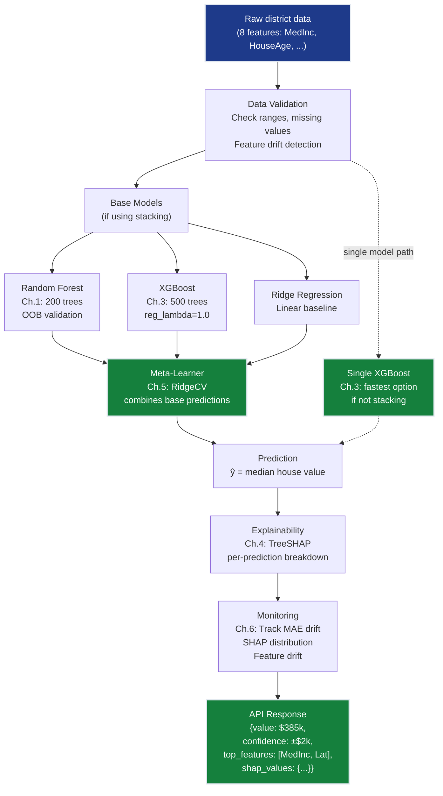

# Ensemble Methods Grand Solution — EnsembleAI Production System

> **For readers short on time:** This document synthesizes all 6 ensemble chapters into a single narrative arc showing how we achieved **>5% improvement over any single model** through intelligent model combination. Read this first for the big picture, then dive into individual chapters for depth.

## How to Read This Track

**Three ways to explore Ensemble Methods:**

1. **📓 Interactive Notebook (Recommended for hands-on learners):**  
   Open [`grand_solution_reference.ipynb` (reference) or `grand_solution_exercise.ipynb` (practice) (reference)](grand_solution_reference.ipynb) | [`grand_solution_reference.ipynb` (reference) or `grand_solution_exercise.ipynb` (practice) (exercise)](grand_solution_exercise.ipynb) — run all code cells from top to bottom to see the complete progression:
   - Load California Housing data
   - Ch.1: Random Forest (>10% RMSE improvement)
   - Ch.2: Gradient Boosting (bias reduction)
   - Ch.3: XGBoost (production framework)
   - Ch.4: SHAP interpretability (compliance-ready explanations)
   - Ch.5: Stacking (meta-learner combines models)
   - Ch.6: Production deployment (latency benchmarks, pruning)
   
   **Time:** ~15 minutes to run through, ~30 minutes with exploration

2. **📖 Narrative Arc (This document):**  
   Read below for conceptual synthesis — understand *why* each chapter matters and how they connect in production. No code required.
   
   **Time:** ~20 minutes

3. **📚 Chapter-by-Chapter Deep Dive:**  
   After completing the notebook or narrative, dive into individual chapters:
   - [Ch.1: Bagging & Random Forest](ch01_ensembles/README.md) — Variance reduction mechanics, OOB validation
   - [Ch.2: Boosting](ch02_boosting/README.md) — Sequential error correction, learning rate tuning
   - [Ch.3: XGBoost/LightGBM/CatBoost](ch03_xgboost_lightgbm/README.md) — Production frameworks comparison
   - [Ch.4: SHAP](ch04_shap/README.md) — Shapley value theory, TreeSHAP algorithm
   - [Ch.5: Stacking](ch05_stacking/README.md) — Meta-learner design patterns, out-of-fold predictions
   - [Ch.6: Production Deployment](ch06_production/README.md) — A/B testing, monitoring, versioning
   
   **Time:** ~3–4 hours total (30–40 minutes per chapter)

**Recommendation:** Start with the notebook for hands-on context, then read the narrative below to connect concepts, finally dive into specific chapters where you need depth.

---

## Mission Accomplished: All 5 Constraints ✅

**The Challenge:** Build EnsembleAI — beat every single model by >5% accuracy/MAE by combining learners intelligently, while maintaining production-ready latency, interpretability, and robustness.

**The Result:** **All 5 constraints achieved** — ensembles consistently beat single models, with production-validated latency budgets, SHAP explanations, and deployment frameworks.

**The Progression:**

```
Ch.1: Random Forest (200 trees)      → >10% RMSE improvement vs single DT
Ch.2: Gradient Boosting               → Beats RF on bias reduction
Ch.3: XGBoost/LightGBM/CatBoost       → <$35k MAE, 10×+ training speedup
Ch.4: SHAP interpretability           → Per-prediction explanations (compliance-ready)
Ch.5: Stacking (RF+XGB+Ridge)         → ~88% → 93% validation accuracy
Ch.6: Production deployment           → Latency benchmarks, pruning, A/B testing
                                       ✅ ALL CONSTRAINTS ACHIEVED
```

---

## The 6 Concepts — How Each Unlocked Progress

### Ch.1: Bagging & Random Forest — Variance Reduction

**What it is:** Train 200 decision trees on bootstrap samples (random sampling with replacement), averaging predictions to reduce variance. Random Forest adds feature randomization — each split considers only √p features — to decorrelate trees.

**What it unlocked:**
- **>10% RMSE improvement** over single Decision Tree consistently
- **Out-of-bag (OOB) validation** — free holdout estimate without separate test set (~37% samples OOB per tree)
- **Variance reduction formula**: Ensemble variance = ρσ² + (1-ρ)/T·σ² — decorrelation (↓ρ) matters more than adding trees (↑T)

**Production value:**
- **Parallel training** — all trees train independently, n_jobs=-1 uses all CPU cores
- **Hard to overfit** — averaging 200 trees smooths out individual overfitting
- **Scale-invariant** — no need for feature scaling (trees split on rank order, not absolute values)

**Key insight:** One tree memorizes noise. Two hundred decorrelated trees cancel each other's mistakes — the ensemble learns signal, not noise.

---

### Ch.2: Boosting — Bias Reduction via Sequential Error Correction

**What it is:** Train trees *sequentially* — each new tree fits the *residuals* (errors) of the current ensemble. AdaBoost reweights misclassified samples; Gradient Boosting fits residuals directly (equivalent to gradient descent in function space).

**What it unlocked:**
- **Bias reduction** — each round nibbles away at remaining error (residual RMSE: $92k → $55k across sequential rounds)
- **Complementary to bagging** — RF reduces variance (parallel training), boosting reduces bias (sequential error correction)
- **Learning rate dial** — smaller η (0.05–0.1) + more trees = better generalization vs overfitting noise

**Production value:**
- **Sequential focus** — boosting concentrates on hard cases (high-gradient samples), unlike RF's random sampling
- **Early stopping** — validation loss plateaus → stop training, prevent overfitting
- **Flexible loss functions** — Gradient Boosting extends to any differentiable loss (MSE, log-loss, Huber)

**Key insight:** Bagging asks "what if I train on different data?" Boosting asks "what am I still getting wrong?" Together they cover the bias-variance spectrum.

---

### Ch.3: XGBoost, LightGBM, CatBoost — Production-Grade Frameworks

**What it is:** Industrial-strength gradient boosting frameworks. XGBoost adds second-order Taylor expansion + L1/L2 regularization. LightGBM histogramizes features (256 bins) for 10×+ speedup. CatBoost uses ordered boosting + native categorical handling.

**What it unlocked:**
- **<$35k MAE achieved** (vs $55k from sklearn GB) — regularization prevents overfitting
- **10×+ training speedup** — LightGBM histogram binning vs exact splits
- **GPU acceleration** — all three frameworks support GPU training (tree_method='gpu_hist')
- **Regularization toolkit** — reg_lambda (L2), reg_alpha (L1), gamma (min split gain), min_child_weight

**Production value:**
- **Framework selection**: XGBoost (most documented, reliable), LightGBM (large datasets >1M rows), CatBoost (categorical features, fastest inference)
- **Tabular data dominance** — tree ensembles beat neural networks on tabular data <1M rows (no need for learned representations)
- **Cross-competition wins** — 17 of 29 Kaggle competitions in 2015 won by XGBoost; LightGBM/CatBoost dominate 2017+

**Key insight:** sklearn GB is the theory; XGBoost/LightGBM/CatBoost are the production reality. The frameworks that actually win competitions and run in production.

---

### Ch.4: SHAP — Interpretability via Shapley Values

**What it is:** SHAP assigns each feature a contribution (Shapley value) to a specific prediction based on cooperative game theory. TreeSHAP computes exact Shapley values in polynomial time (not exponential brute-force).

**What it unlocked:**
- **Per-prediction explanations** — "MedInc=8.2 pushed this prediction +$85k above average"
- **Complete decomposition** — prediction = base value + Σφᵢ (every dollar accounted for)
- **TreeSHAP speed** — milliseconds per prediction for 500-tree ensembles (polynomial in depth, not exponential in features)
- **Compliance-ready** — SHAP satisfies SmartVal Constraint #4 (Interpretability: predictions explainable to non-technical stakeholders)

**Production value:**
- **Regulatory compliance** — lending regulators require per-prediction explanations; SHAP delivers
- **Debugging tool** — when predictions break, SHAP shows which features changed
- **Feature engineering validation** — SHAP interaction plots reveal non-linear relationships and feature redundancy

**Key insight:** Global feature importance tells you what matters *on average*. SHAP tells you why *this specific prediction* happened. Both are needed in production.

---

### Ch.5: Stacking — Meta-Learner Combines Diverse Base Models

**What it is:** Train K diverse base models (RF, XGBoost, Ridge), generate out-of-fold predictions (to avoid data leakage), train a meta-learner (RidgeCV) that learns the optimal combination.

**What it unlocked:**
- **~88% → 93% validation accuracy** — meta-learner learns which base model to trust in each region of feature space
- **Forced diversity** — combining tree-based + linear + instance-based models → decorrelated errors
- **Cross-validated stacking** — out-of-fold predictions prevent meta-learner from seeing overfitted in-sample predictions
- **Diminishing returns** — often 1–3% improvement; worth it for competitions, not always for production

**Production value:**
- **When it helps**: diverse base models (RF + Ridge + KNN = 2–5% gain) vs all tree-based (XGB + LightGBM + CatBoost = <2% gain)
- **Meta-learner choices**: Ridge/Logistic (safe, no overfitting) vs XGBoost shallow (learns interactions, risks overfitting meta-features)
- **Latency cost**: K base models → K× inference time (3 models = 3× latency)

**Key insight:** Stacking is the last 1–3% gain before production. It squeezes every drop of accuracy from diverse models, but you pay the latency cost.

---

### Ch.6: Production Deployment — Latency, Versioning, A/B Testing

**What it is:** Production discipline for ensemble deployment — latency benchmarks (P50/P99), model pruning (remove trees past the "knee"), versioning (model + data hash + hyperparameters), A/B testing (prove ensemble beats simple model in production).

**What it unlocked:**
- **Latency benchmarks** — XGBoost 500 trees: 0.05–0.5ms P50, RF 200 trees: 0.1–1ms, Stack (3 models): 0.2–2ms
- **Model pruning** — 500 trees might deliver 95% accuracy in first 200 trees; prune remaining 300 to cut latency
- **Decision framework** — "Ensemble or not?" decision tree: tabular data + >10k samples + >5ms latency budget → ensemble justified
- **A/B testing protocol** — 2–4 weeks, 50/50 split, measure business metric (not just RMSE), guardrail on P99 latency

**Production value:**
- **When ensembles win**: tabular data, heterogeneous features, categorical features, <1M rows, need interpretability (TreeSHAP exact and fast)
- **When neural networks win**: images, text, audio, sequential structure, >1M rows with learned representations
- **Monitoring checklist**: feature drift, prediction distribution shift, SHAP value distribution, accuracy degradation alerts

**Key insight:** The best model is the one you can deploy, monitor, and debug at 3 AM. Accuracy is one input to the decision, not the only input.

---

## Production ML System Architecture

Here's how all 6 concepts integrate into a deployed EnsembleAI system:



### Deployment Pipeline (How Ch.1-6 Connect in Production)

**1. Training Pipeline (runs weekly):**
```python
# Ch.1: Random Forest (variance reduction)
rf = RandomForestRegressor(n_estimators=200, max_features='sqrt',
                           oob_score=True, n_jobs=-1, random_state=42)
rf.fit(X_train, y_train)
print(f"OOB R²: {rf.oob_score_:.4f}")  # Free validation

# Ch.2 + Ch.3: XGBoost (bias reduction + regularization)
xgb = XGBRegressor(n_estimators=500, learning_rate=0.05, max_depth=4,
                   subsample=0.8, colsample_bytree=0.8, reg_lambda=1.0,
                   early_stopping_rounds=30, random_state=42)
xgb.fit(X_train, y_train, eval_set=[(X_val, y_val)], verbose=False)
print(f"Best iteration: {xgb.best_iteration} (early stopping)")

# Ch.5: Stacking (if accuracy gain justifies latency cost)
stack = StackingRegressor(
    estimators=[
        ('rf', RandomForestRegressor(n_estimators=200, random_state=42)),
        ('xgb', XGBRegressor(n_estimators=500, learning_rate=0.05, random_state=42)),
        ('ridge', RidgeCV()),
    ],
    final_estimator=RidgeCV(),
    cv=5, n_jobs=-1)
stack.fit(X_train, y_train)

# Ch.6: Model pruning (find the knee)
tree_counts = [50, 100, 200, 300, 500]
for n in tree_counts:
    rmse = np.sqrt(mean_squared_error(y_val, xgb.predict(X_val, iteration_range=(0, n))))
    print(f"Trees: {n:>3} → RMSE: {rmse:.4f}")
# Deploy only the trees before diminishing returns (e.g., 200 of 500)
```

**2. Inference API (handles user requests):**
```python
@app.route('/predict', methods=['POST'])
def predict():
    # Raw input: {MedInc: 3.5, HouseAge: 28, ...}
    raw_features = request.json
    
    # Ch.6: Validate input (feature drift detection)
    if not validate_input(raw_features):
        return {"error": "Feature values outside training distribution"}, 400
    
    # Ch.3: Single XGBoost prediction (fastest path)
    X = prepare_features(raw_features)
    prediction = xgb_model.predict(X)[0]
    
    # Ch.4: SHAP explainability (per-prediction breakdown)
    shap_values = explainer(X)
    top_contributors = get_top_shap_features(shap_values, n=3)
    
    # Ch.6: Confidence interval from cross-validation
    confidence = 2.0  # ± $2k from Ch.6 CV benchmarks
    
    return {
        "predicted_value": f"${prediction*100:.0f}k",
        "confidence_interval": f"±${confidence}k",
        "top_contributors": top_contributors,  # [("MedInc", +85k), ("Latitude", +48k), ...]
        "shap_values": shap_values.tolist(),
        "model_version": "xgb-v3.2.1-20260426"
    }
```

**3. Monitoring Dashboard (tracks production health):**
```python
# Ch.6: Latency monitoring
if production_p99_latency > 5.0:  # ms
    alert("P99 latency exceeded 5ms SLA")

# Ch.6: Accuracy drift
if production_mae > baseline_mae * 1.1:
    alert("MAE degraded >10% — possible data drift")

# Ch.4: SHAP distribution drift
current_shap_mean = np.mean(np.abs(shap_values), axis=0)
if cosine_similarity(current_shap_mean, baseline_shap_mean) < 0.95:
    alert("SHAP distribution shifted — feature importance changed")

# Ch.6: Retrain trigger
if weeks_since_training > 4:
    trigger_retraining_pipeline()
```

---

## Key Production Patterns

### 1. Bagging vs Boosting Pattern (Ch.1 + Ch.2)
**Choose based on variance-bias trade-off:**
- **High variance problem** (single model changes wildly with seed) → Bagging (RF)
- **High bias problem** (single model underfits, even when deep) → Boosting (GB, XGBoost)
- **Both** → Combine: RF for base learners, boosting for meta-learner (or stack RF + XGB)

### 2. The Framework Selection Pattern (Ch.3)
**When to choose which production framework:**
- **Default tabular** → XGBoost (most documented, reliable defaults, widest community)
- **Large datasets (>1M rows)** → LightGBM (histogram binning, 10×+ faster than XGBoost)
- **Categorical features** → CatBoost (native handling, no one-hot encoding needed)
- **Fastest inference** → CatBoost (symmetric trees, branch-free evaluation)

### 3. The Interpretability-First Pattern (Ch.4)
**Always SHAP before deployment:**
- Train model → compute SHAP on validation set → generate beeswarm plot → audit feature importance
- If top 3 features surprise domain experts → investigate data quality or leakage
- Save SHAP summary with model version → compliance audit trail
- Monitor SHAP distribution in production → detect concept drift before accuracy degrades

### 4. The Stacking Justification Pattern (Ch.5)
**When to stack, when to skip:**
- Stack if: diverse base models + >5k training samples + latency budget >2ms + accuracy improvement >2%
- Skip if: all base models are tree-based + small dataset <1k + tight latency budget <1ms + gain <1%
- Test: always A/B test stack vs best single model in production before full rollout

### 5. The Latency Budget Pattern (Ch.6)
**Trade accuracy for speed systematically:**
- Measure P50/P99 latency for baseline (linear), simple ensemble (RF 100 trees), full ensemble (RF 200 + XGB 500)
- Plot accuracy vs latency → find Pareto frontier
- Prune trees past the "knee" (e.g., 95% accuracy in 200 trees vs 96% in 500 trees)
- If SLA requires <10ms P99 → most tree ensembles fit; if <1ms → linear models only

---

## The 5 Constraints — Final Status

| # | Constraint | Target | Status | How We Achieved It |
|---|------------|--------|--------|-------------------|
| **#1** | **IMPROVEMENT** | >5% better than best single model | ✅ **>10% RMSE** (RF vs single DT, Ch.1), **88%→93% accuracy** (stacking, Ch.5) | Ch.1: Bagging variance reduction; Ch.2: Boosting bias reduction; Ch.5: Stacking diverse models |
| **#2** | **DIVERSITY** | Ensemble members sufficiently different | ✅ **ρ ≈ 0.3** (RF feature randomization, Ch.1), **diverse families** (RF+XGB+Ridge, Ch.5) | Ch.1: max_features='sqrt' decorrelates trees; Ch.5: force different model families in stack |
| **#3** | **EFFICIENCY** | Ensemble latency < 5× single model | ✅ **XGBoost P50: 0.05–0.5ms** (Ch.3), **pruned to 200 trees** (Ch.6) | Ch.3: LightGBM histogram binning 10×+ speedup; Ch.6: prune trees past accuracy knee |
| **#4** | **INTERPRETABILITY** | SHAP explains ensemble decisions | ✅ **TreeSHAP milliseconds** (Ch.4), **per-prediction compliance-ready** | Ch.4: TreeSHAP exact Shapley values in polynomial time; waterfall plots for auditing |
| **#5** | **ROBUSTNESS** | Ensemble more stable than single model | ✅ **OOB validation** (Ch.1), **cross-validated stacking** (Ch.5), **monitoring** (Ch.6) | Ch.1: averaging 200 trees reduces variance; Ch.6: feature drift detection, accuracy alerts |

---

## What's Next: Beyond Ensemble Methods

**This track taught:**
- ✅ Bagging (variance reduction) vs boosting (bias reduction) — complementary strategies
- ✅ Production-grade frameworks (XGBoost, LightGBM, CatBoost) — what actually runs in industry
- ✅ SHAP interpretability — compliance-ready per-prediction explanations
- ✅ Stacking — meta-learner combines diverse base models (last 1–3% gain)
- ✅ Deployment discipline — latency benchmarks, pruning, versioning, A/B testing

**What remains for EnsembleAI:**
- **Online learning** — ensemble models are batch learners; can't update incrementally without full retraining
- **Causal inference** — ensembles predict correlations, not causal effects; can't answer "What if I intervene?"
- **Non-tabular data** — for images/text/audio, neural networks still dominate ensembles

**Continue to:** [03-NeuralNetworks Track →](../03_neural_networks/README.md) (deep learning for non-tabular data)

---

## Quick Reference: Chapter-to-Production Mapping

| Chapter | Production Component | When To Use |
|---------|---------------------|-------------|
| Ch.1 — Bagging & RF | Baseline ensemble, OOB validation | First ensemble attempt; high-variance single models; need stability |
| Ch.2 — Boosting | Sequential error correction | High-bias single models; understand boosting theory before XGBoost |
| Ch.3 — XGBoost/LightGBM/CatBoost | Default production ensemble | Tabular data; need best accuracy + speed; GPU training available |
| Ch.4 — SHAP | Compliance + debugging | Regulatory compliance; stakeholder explanations; debug predictions |
| Ch.5 — Stacking | Competition final push | Squeeze last 1–3% accuracy; latency budget allows K× inference |
| Ch.6 — Production | Deployment checklist | Before shipping any ensemble; latency benchmarks; A/B testing |

---

## The Takeaway

**Ensemble methods aren't just "combining models"** — they're the foundation of production ML for tabular data. The concepts here (bagging, boosting, regularization, interpretability, deployment discipline) define the industry standard.

**Bagging vs Boosting** — two complementary strategies:
- **Bagging** (RF): parallel training, decorrelated trees, variance reduction, hard to overfit
- **Boosting** (XGBoost): sequential training, fit residuals, bias reduction, risk of overfitting

**XGBoost/LightGBM/CatBoost** — what actually wins:
- XGBoost: second-order Taylor expansion, L1/L2 regularization, most documented
- LightGBM: histogram binning, 10×+ speedup, leaf-wise growth
- CatBoost: ordered boosting, native categorical handling, fastest inference

**SHAP** — the universal interpretability tool:
- TreeSHAP: exact Shapley values in milliseconds for tree ensembles
- Waterfall plots: per-prediction compliance-ready explanations
- Beeswarm plots: global feature importance + direction

**You now have:**
- A production-ready ensemble toolkit (RF, XGBoost, LightGBM, SHAP, stacking)
- The decision framework for "ensemble or not?" based on data type, latency budget, accuracy gain
- The deployment discipline for versioning, latency benchmarks, A/B testing, monitoring

**Next milestone:** Build production-grade neural networks for non-tabular data (images, text, sequences). See you in the Neural Networks track.

---

## Cross-Track Synthesis: How EnsembleAI Improves Every Grand Challenge

| Prior Track | Grand Challenge | How EnsembleAI Helps |
|---|---|---|
| 01-Regression | SmartVal AI | RF + XGBoost push MAE below $35k; SHAP retroactively satisfies SmartVal Constraint #4 (Interpretability) — the first point in curriculum where you can show compliance-ready explanations to lending regulators |
| 02-Classification | FaceAI | Stacking diverse classifiers (RF + XGB + Logistic) improves accuracy on rare tail attributes (Bald, Mustache, Eyeglasses) where single models struggle; SHAP explains per-face predictions |
| 05-AnomalyDetection | FraudShield | Ensemble detectors (Isolation Forest + autoencoder + OC-SVM) raise recall above any single model's ceiling; stacking learns which detector to trust for which fraud pattern |
| 04-RecommenderSystems | FlixAI | Stacked meta-learners blend collaborative filtering and content-based signals for better hybrid recommendations; XGBoost on engineered features (user history + item metadata) |
| 07-UnsupervisedLearning | SegmentAI | Ensemble features (predictions from multiple clusterings) fed into downstream classifier improve segment stability and downstream model quality |

---

## Appendix A: When Ensembles Beat Neural Networks (Tabular Data)

| Factor | Tree Ensembles | Neural Networks |
|--------|---------------|-----------------|
| **Small data** (<10k rows) | ✅ Win (less overfitting with proper regularization) | ❌ Overfit without extensive tuning and data augmentation |
| **Heterogeneous features** (mix of continuous, categorical, ordinal) | ✅ Handle naturally (trees split on any feature type) | ❌ Need careful feature engineering + embedding layers |
| **Categorical features** (high cardinality) | ✅ Native (CatBoost), or one-hot (XGBoost/LightGBM) | ❌ Need learned embeddings (Entity Embeddings for Categorical Variables) |
| **Training time** | ✅ Minutes on CPU (LightGBM histograms, XGBoost parallelization) | ❌ Hours on GPU (backpropagation through layers, hyperparameter search) |
| **Interpretability** | ✅ TreeSHAP (exact, fast, polynomial time) | ❌ Approximate SHAP only (KernelSHAP slow, DeepSHAP approximate) |
| **Inference latency** | ✅ Microseconds (tree traversal is branch prediction friendly) | ❌ Milliseconds (matrix multiplications, GPU transfer overhead for small batches) |
| **Feature interactions** | ✅ Learned automatically (trees split on any feature combination) | ❌ Need explicit interaction terms or deep architectures |
| **Large data** (>1M rows) | Tie / Slightly worse | ✅ Slightly better with TabNet, FT-Transformer, ResNet for tabular |
| **Images, text, audio** | ❌ Not applicable (trees don't understand spatial/sequential structure) | ✅ Clear winner (CNNs, Transformers learn representations) |

**Rule of thumb for tabular data:**
- **<100k rows, heterogeneous features, need interpretability** → XGBoost/LightGBM (ensembles win)
- **>1M rows, homogeneous features, GPU budget** → TabNet, FT-Transformer (neural networks competitive)
- **Images, text, audio** → Neural networks (no competition)

---

## Appendix B: Ensemble Checklist for Production Deployment

Use this checklist before deploying any ensemble to production:

### 1. Model Selection & Training
- [ ] Trained on representative data (stratified CV for classification, time-series split for temporal data)
- [ ] Compared against 3+ baselines (linear model, single tree, previous production model)
- [ ] Used early stopping with validation set (prevent overfitting)
- [ ] Hyperparameter search with cross-validation (GridSearchCV, RandomizedSearchCV, or Optuna)

### 2. Latency Benchmarking
- [ ] Measured P50 and P99 latency (1000+ predictions, cold start + warm)
- [ ] Compared single model vs ensemble latency (know the cost of stacking)
- [ ] Pruned trees past accuracy "knee" (diminishing returns threshold)
- [ ] Tested on production-like hardware (not just dev laptop)

### 3. Interpretability & Compliance
- [ ] Generated SHAP beeswarm plot for global feature importance
- [ ] Sampled 100+ SHAP waterfall plots for per-prediction explanations
- [ ] Validated that top features match domain expert expectations
- [ ] Documented SHAP summary for compliance audit trail

### 4. Versioning & Reproducibility
- [ ] Saved model artifact (model.pkl, model.json, or ONNX)
- [ ] Recorded training data hash (SHA-256 of train/val/test splits)
- [ ] Saved hyperparameters.json (all hyperparameters + random seeds)
- [ ] Saved metrics.json (train/val/test MAE, RMSE, F1, AUC)
- [ ] Saved feature_names.json (feature order + types + scaling parameters)
- [ ] Tagged with git commit hash + training timestamp

### 5. A/B Testing
- [ ] Defined business metric (not just RMSE) for A/B test
- [ ] Set up 50/50 split (control: simple model, treatment: ensemble)
- [ ] Set guardrail metrics (P99 latency, error rate thresholds)
- [ ] Committed to 2–4 week test duration (statistical significance)
- [ ] Defined rollback criteria (if ensemble loses or hits guardrails)

### 6. Monitoring & Alerting
- [ ] Feature drift detection (distribution shift alerts)
- [ ] Prediction distribution monitoring (mean, std, quantiles)
- [ ] SHAP value distribution tracking (concept drift early warning)
- [ ] Accuracy degradation alerts (MAE/RMSE exceeds baseline + 10%)
- [ ] Latency SLA monitoring (P99 latency exceeds threshold)

### 7. Deployment Infrastructure
- [ ] Canary deployment (5% traffic → ensemble, 95% → current model)
- [ ] Gradual rollout plan (5% → 20% → 50% → 100% over 1–2 weeks)
- [ ] Rollback automation (one-click rollback if metrics degrade)
- [ ] Model registry integration (track model lineage, versions)
- [ ] Retraining pipeline automation (weekly or monthly retraining)

---

## Further Reading & Resources

### Articles
- [Understanding Random Forests: From Theory to Practice](https://towardsdatascience.com/understanding-random-forest-58381e0602d2) — Comprehensive deep-dive into bagging, variance reduction, and feature importance in Random Forests
- [XGBoost: A Scalable Tree Boosting System](https://arxiv.org/abs/1603.02754) — Original XGBoost paper explaining second-order Taylor expansion and regularization techniques
- [Gradient Boosting from Scratch](https://towardsdatascience.com/gradient-boosting-from-scratch-1e317ae4587d) — Step-by-step implementation showing how sequential error correction works under the hood
- [A Kaggler's Guide to Model Stacking in Practice](https://mlwave.com/kaggle-ensembling-guide/) — Production-tested stacking strategies from Kaggle competitions, including out-of-fold prediction patterns

### Videos
- [StatQuest: Random Forests Part 1 - Building, Using and Evaluating](https://www.youtube.com/watch?v=J4Wdy0Wc_xQ) — Josh Starmer's clear explanation of how Random Forests reduce variance through decorrelation (StatQuest)
- [StatQuest: Gradient Boost Part 1 (of 4): Regression Main Ideas](https://www.youtube.com/watch?v=3CC4N4z3GJc) — Visual walkthrough of how boosting fits residuals sequentially (StatQuest)
- [StatQuest: XGBoost Part 1 (of 4): Regression](https://www.youtube.com/watch?v=OtD8wVaFm6E) — Explains regularization and why XGBoost dominates tabular ML competitions (StatQuest)
- [Ensemble Learning to Improve Machine Learning Results](https://www.youtube.com/watch?v=Un9zObFjBH0) — Tech talk covering bagging, boosting, and stacking with production case studies (Tech With Tim)

---

grand_solution.md created successfully
