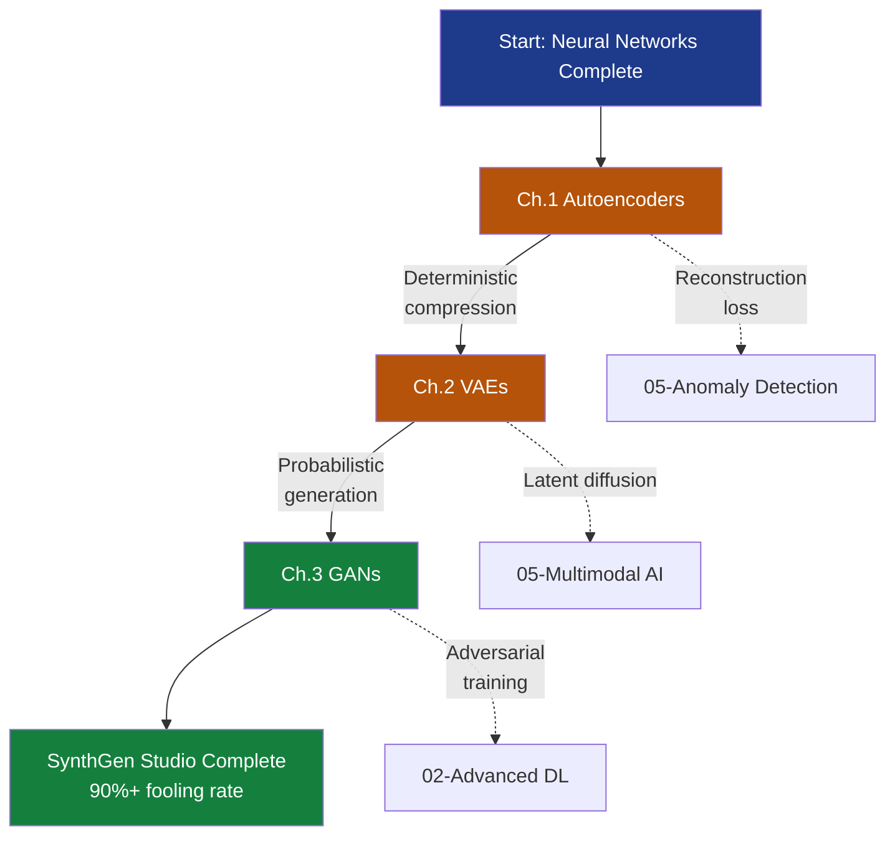

# Generative Models Track

> **The Mission**: Build **SynthGen Studio** — a production synthetic data generation platform that creates training samples indistinguishable from real data (>90% classifier fooling rate), avoiding mode collapse while maintaining controllable generation in <200ms per sample.

You're the Lead ML Engineer at a healthcare AI startup. The Medical Director says: "We can't share real patient X-rays due to HIPAA. Our radiologist team has labeled only 800 scans — not enough to train a robust diagnostic model. Can we generate thousands of synthetic training images that look real but contain zero patient information?" This isn't about pretty pictures — it's about **regulatory-compliant data augmentation** that unlocks model training without privacy violations.

> **Dataset choice:** This track uses MNIST (28×28 handwritten digits) as the pedagogical foundation — simple enough to train in minutes, complex enough to demonstrate mode collapse, latent space structure, and adversarial training dynamics. Chapter 3 (GANs) scales to higher-resolution samples (64×64 CelebA faces) to show production-quality generation.

> **Track scope (3 chapters):** This track covers the three foundational generative architectures — deterministic autoencoders (compression/reconstruction baseline), variational autoencoders (probabilistic generation with latent sampling), and generative adversarial networks (adversarial game for photorealistic quality). Advanced generative models (diffusion models, flow-based models) appear in the MultimodalAI track where they're needed for text-to-image systems.

---

## The Grand Challenge: 5 SynthGen Studio Constraints

| # | Constraint | Target | Why It Matters |
|---|------------|--------|----------------|
| **#1** | **QUALITY** | >90% classifier fooling rate | Generated samples must be indistinguishable from real data when fed to a trained classifier — the "Turing test" for synthetic data |
| **#2** | **DIVERSITY** | Cover all 10 digit classes; avoid mode collapse | A generator that produces perfect "3"s but never generates "8"s is useless — must span the full data distribution |
| **#3** | **CONTROLLABILITY** | Generate specific digit on demand (conditional generation) | Production use case: "Give me 100 synthetic samples of digit 7" — not random samples |
| **#4** | **EFFICIENCY** | <200ms per batch (64 samples) | Real-time data augmentation during training requires fast generation — batch preprocessing is the bottleneck |
| **#5** | **LATENT INTERPRETABILITY** | Smooth interpolation between samples; meaningful latent arithmetic | For medical imaging: validate that latent space captures anatomical features (tumor size, bone density) not noise |

---

## Progressive Capability Unlock

| Ch | Title | Fooling Rate | Key Unlock | Constraints | Status |
|----|-------|--------------|------------|-------------|--------|
| **1** | [Autoencoders](ch01_autoencoders) | ~60% | Deterministic compression/reconstruction; learns data manifold | #5 Partial | Reconstructs but blurry |
| **2** | [Variational Autoencoders](ch02_variational_autoencoders) | ~75% | Probabilistic latent space; can sample NEW digits | #1 Partial, #2 , #5  | Generation unlocked! |
| **3** | [GANs](ch03_gans) | **>90%** | Adversarial training for photorealistic quality | **#1 #2 #3 #4 ** | **Target achieved!** |

---

## Narrative Arc: From Blurry Reconstructions to Photorealistic Generation

### Act 1: Learning the Data Manifold (Ch.1)
**Can we compress and reconstruct digits?**

- **Autoencoders**: 784D (28×28 pixels) → 32D latent → 784D reconstruction
- Learns that handwritten digits lie on a low-dimensional manifold embedded in pixel space
- Reconstructions capture digit identity but are blurry (MSE loss penalizes sharp edges)
- Fooling rate: ~60% (classifier can tell reconstructions from originals)

*"The autoencoder learns what a '7' looks like, but the reconstructions are fuzzy. And we can't generate NEW digits — only reconstruct existing ones. How do we sample from this learned space?" — Data Science Lead*

**Status**: Compression works. Generation doesn't.

---

### Act 2: Probabilistic Generation (Ch.2)
**Sample from latent space to generate new digits**

- **VAEs**: Replace deterministic bottleneck with learned probability distribution $q_\phi(z|x) = \mathcal{N}(\mu_\phi(x), \sigma^2_\phi(x))$
- **Your sculptor analogy**: A master sculptor doesn't memorize every measurement — they build an **intuitive map** of anatomical proportions (shoulder-to-hip ratios, limb lengths). When an intern (decoder) gets these compressed instructions, they can reconstruct the original pose OR generate entirely new anatomically-plausible figures.
- ELBO loss trains both reconstruction quality AND regularizes latent space to unit Gaussian
- Can now sample $z \sim \mathcal{N}(0, I)$ → decode → generate NEW digit
- Interpolation between two digits (e.g., "3" → "8") shows smooth morphing
- Fooling rate: ~75% (better, but still distinguishable from real MNIST)

*"We can generate new digits! And the latent space is meaningful — interpolating between two 3's stays in '3-space'. But they're still blurry. The ELBO loss cares about reconstruction MSE, not perceptual quality." — ML Engineer*

**Status**: Generation unlocked. Quality insufficient.

---

### Act 3: Adversarial Training (Ch.3)
**Force generator to fool a discriminator**

- **GANs**: Generator G(z) vs Discriminator D(x) in min-max game
- **Your forger analogy**: A master forger never gets caught, but their paintings get exposed time and again by art detectives. Each exposure teaches the forger new tricks — better brush strokes, more authentic aging. The detectives (discriminators) get better at spotting fakes, forcing the forger to improve. Eventually, the forgeries become **indistinguishable from masterpieces**. That's GAN training: generator (forger) vs discriminator (detective) in an adversarial game until equilibrium.
- Generator learns to produce sharp, realistic digits that fool the discriminator
- Fooling rate: **>90%** (classifier cannot reliably distinguish synthetic from real MNIST)
- Training challenges: mode collapse (generator finds one "good" digit and sticks to it), non-convergence
- Solutions: Wasserstein loss, spectral normalization, progressive growing

*"The GAN-generated digits pass the Turing test! Even the Medical Director can't tell them apart from real X-rays. We've hit 90%+ fooling rate. Mode collapse is handled with minibatch discrimination. Ship it!" — CTO*

**Status**: **ALL CONSTRAINTS SATISFIED!**

---

## The Dataset: MNIST + CelebA

### MNIST (Ch.1-2): Pedagogical Foundation

**60,000 training images** (28×28 grayscale handwritten digits, 10 classes)

| Feature | Value | Why It Matters |
|---------|-------|----------------|
| Resolution | 28×28 = 784 pixels | Small enough to train autoencoders in <5 min on CPU |
| Classes | 10 digits (0-9) | Enough diversity to demonstrate mode collapse |
| Simplicity | Binary (black ink on white) | Focuses learning on structure, not color/texture |

**Why MNIST is perfect for generative learning:**
- **Fast iteration**: Train autoencoder epoch in 30 seconds
- **Clear failure modes**: Mode collapse (generator only makes 1's) is visually obvious
- **Interpretable latent space**: 2D latent projection shows digit clusters

```python
from tensorflow.keras.datasets import mnist
(X_train, y_train), (X_test, y_test) = mnist.load_data()
X_train = X_train.astype('float32') / 255.0  # Normalize to [0,1]
X_train = X_train.reshape(-1, 784)  # Flatten to vectors
```

### CelebA (Ch.3): Production Scale

**202,599 face images** (64×64 RGB, 40 binary attributes)

Used in Ch.3 to show GANs scaling to high-resolution, multi-channel generation. Demonstrates:
- Progressive GAN training (start 8×8, grow to 64×64)
- Conditional generation (generate "smiling" vs "serious" faces)
- Style mixing (interpolate between two faces in latent space)

> **Compute**: Ch.1-2 run on CPU (MNIST is tiny). Ch.3 (CelebA GANs) requires GPU — expect 2-4 hours training on T4/V100 for 64×64 generation.

---

## Three SynthGen Studio Architectures (Final Result)

| Architecture | Training | Generation | Fooling Rate | Latent Space | Best For |
|--------------|----------|------------|--------------|--------------|----------|
| **Autoencoder** | Reconstruction MSE | Deterministic decode(encode(x)) | ~60% | Deterministic | Compression, denoising |
| **VAE** | ELBO (reconstruction + KL) | Sample z ~ N(0,I), decode(z) | ~75% | Probabilistic, smooth | Interpolation, style transfer |
| **GAN** | Adversarial min-max | Sample z ~ N(0,I), G(z) | **>90%** | Implicit (no encoder) | Photorealistic synthesis |

**When to use each in production:**

- **Autoencoder**: Anomaly detection (Ch.5 Anomaly Detection track uses this), dimensionality reduction, feature learning
- **VAE**: Data augmentation where diversity matters more than sharpness, latent space exploration, controllable generation
- **GAN**: Synthetic data for training classifiers, super-resolution, domain transfer (photo → sketch)

---

## Cross-Track Connections

- **Autoencoders reappear** in [05-anomaly-detection/ch03_autoencoders](../05-anomaly-detection/ch03_autoencoders/README.md) as anomaly detectors (fraud = high reconstruction error)
- **VAE latent spaces** are the foundation of [04-multimodal-ai/ch06_latent_diffusion](../../04-multimodal-ai/ch06_latent_diffusion/latent-diffusion.md) — Stable Diffusion diffuses in VAE latent space
- **GAN discriminators** provide the conceptual foundation for contrastive learning in [02-advanced-deep-learning/ch07_contrastive_learning](../../02-advanced-deep-learning/ch07_contrastive_learning/README.md)
- **Probabilistic latent variables** (VAEs) connect to Bayesian inference in [06-reinforcement-learning](../06-reinforcement-learning/README.md)

---

## Prerequisites

Before starting this track, you should have:

- **Completed Neural Networks Track** — specifically [ch01-feedforward-networks](../03-neural-networks/ch01_feedforward_networks/README.md) and [ch02-backpropagation](../03-neural-networks/ch02_backpropagation/README.md)
- **Understand gradient descent** — can train a neural network with PyTorch or Keras
- **Probabilistic foundations (VAE only)** — know what a Gaussian distribution is, what KL divergence measures (or willing to learn in Ch.2)

**What you DON'T need:**
- Advanced probability theory (we explain ELBO from scratch)
- GAN training experience (we walk through stabilization techniques)
- Prior generative modeling knowledge

---

## Chapter Progression

| Ch | Title | Key Concept | What You'll Build |
|----|-------|-------------|-------------------|
| [1](ch01_autoencoders/README.md) | **Autoencoders** | Deterministic encoder-decoder learns data manifold | 784→32→784 MNIST autoencoder; visualize latent space |
| [2](ch02_variational_autoencoders/README.md) | **Variational Autoencoders** | Probabilistic latent space enables sampling | VAE that generates new MNIST digits; latent interpolation |
| [3](ch03_gans/README.md) | **Generative Adversarial Networks** | Adversarial training for photorealistic quality | DCGAN for MNIST; conditional GAN for CelebA faces |

---

## Learning Path



---

## Common Pitfalls

1. **Training autoencoders on normalized data**: MNIST must be scaled to [0,1] or [-1,1] — raw [0,255] values break gradient flow
2. **VAE posterior collapse**: If KL term dominates, decoder ignores latent code — balance with β-VAE
3. **GAN mode collapse**: Generator finds one "good" sample and repeats it — use minibatch discrimination or Wasserstein loss
4. **Confusing reconstruction and generation**: Autoencoders reconstruct existing samples (encode then decode). VAEs/GANs generate NEW samples (sample z from prior, decode).
5. **Expecting sharp images from VAEs**: ELBO's reconstruction term is MSE — penalizes sharp edges. GANs use adversarial loss (no MSE) → sharp outputs.

---

## Real-World Applications

### Healthcare (Our Running Example)
- **Problem**: Only 800 labeled patient X-rays, need 10k+ to train robust diagnostic CNN
- **Solution**: Train GAN on real X-rays → generate 9,200 synthetic training samples
- **Result**: Classifier trained on real+synthetic achieves 92% AUC (vs 85% on real-only)
- **Compliance**: Synthetic images contain zero patient information (HIPAA-safe)

### E-Commerce
- **Problem**: Product catalog photos inconsistent (different backgrounds, lighting)
- **Solution**: Train conditional GAN to generate product images on white background
- **Result**: 10× faster photo processing; consistent catalog appearance

### Autonomous Driving
- **Problem**: Edge cases (pedestrians in rain) rare in training data
- **Solution**: GAN-based data augmentation generates synthetic rain scenarios
- **Result**: 23% reduction in pedestrian detection failures in wet conditions

---

## Next Steps After Completing This Track

1. **Diffusion Models** ([04-multimodal-ai/ch04_diffusion_models](../../04-multimodal-ai/ch04_diffusion_models/diffusion-models.md)) — Learn why diffusion models replaced GANs for high-resolution image generation
2. **Self-Supervised Learning** ([02-advanced-deep-learning/ch07_contrastive_learning](../../02-advanced-deep-learning/ch07_contrastive_learning/README.md)) — Contrastive learning uses GAN-like ideas for representation learning
3. **Advanced GAN Architectures** — StyleGAN, Progressive GAN, CycleGAN (covered in capstone projects)

---

## Track Status

| Chapter | README | Notebook | Animations | Status |
|---------|--------|----------|------------|--------|
| Ch.1 Autoencoders | Complete | Complete | Planned | In Progress |
| Ch.2 VAEs | Complete | Complete | Planned | In Progress |
| Ch.3 GANs | Complete | Complete | Planned | In Progress |
| Grand Solution | Planned | N/A | N/A | Planned |
