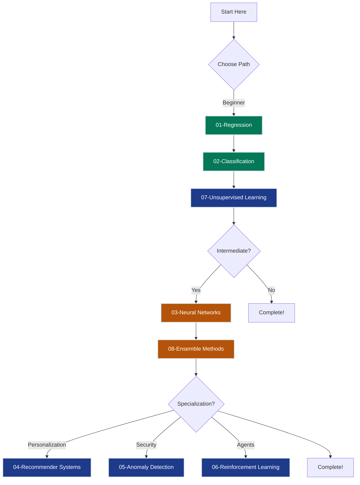
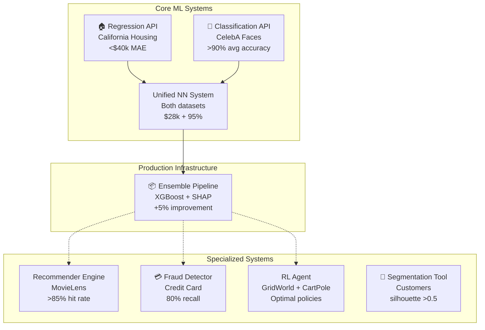

# Machine Learning — Topic-Based Curriculum

This curriculum covers the core paradigms of machine learning across 8 independent tracks. Each track has its own dataset, grand challenge, and chapter sequence — you can complete them in any order, though the Learning Paths below recommend progressions by experience level.

## The Journey

You start by predicting house prices with linear regression (Track 1), add facial attribute classification (Track 2), discover unsupervised customer segments (Track 7), then see how neural networks unify everything (Track 3). From there, choose specialized domains — recommendations, fraud detection, or reinforcement learning — before finishing with ensemble methods (Track 8), which improve every prior grand challenge. Each track is independent, but together they trace the path from "first ML model" to "production ML engineer."

## 8 Learning Tracks

### Core Fundamentals (Start Here)

#### 1. [Regression](01_regression/README.md) — SmartVal AI
> **Dataset**: California Housing (20,640 districts, 8 features)
> **Grand Challenge**: <$40k MAE (regulatory appraisal accuracy)
> **Chapters**: 7 chapters (`ch01`–`ch07`) plus `GRAND_CHALLENGE.md`

Learn regression fundamentals with a real estate valuation system. Master loss functions (MSE, MAE, Huber), regularization (Ridge, Lasso), and tree ensembles.

---

#### 2. [Classification](02_classification/README.md) — FaceAI
> **Dataset**: CelebA (202,599 celebrity faces, 40 binary attributes)
> **Grand Challenge**: >90% average accuracy across 40 facial attributes
> **Chapters**: 5 chapters (`ch01`–`ch05`) from logistic regression through SVMs and tuning

Master classification with natural multi-label data. Learn logistic regression, softmax, class imbalance handling, and multi-label prediction—all with real facial attributes (Smiling, Eyeglasses, Male, Bald, etc.).

---

#### 7. [Unsupervised Learning](07_unsupervised_learning/README.md) — SegmentAI
> **Dataset**: UCI Wholesale Customers (440 customers, 6 spending features)
> **Grand Challenge**: 5 actionable segments, silhouette score >0.5
> **Chapters**: 3 chapters (`ch01`–`ch03`) covering clustering, dimensionality reduction, and unsupervised metrics

Learn clustering and dimensionality reduction. Master K-means, DBSCAN, HDBSCAN, PCA, t-SNE, UMAP, and cluster validation.

---

### Intermediate / Deep Learning

#### 3. [Neural Networks](03_neural_networks/README.md) — UnifiedAI
> **Datasets**: California Housing (regression) + CelebA (classification)
> **Grand Challenge**: ≤$28k MAE + ≥95% accuracy
> **Chapters**: 10 chapters from XOR to Transformers

Discover how neural networks unify regression and classification. Same feedforward architecture + backpropagation, different output layers + loss functions. Includes CNNs, RNNs, Attention, and production deployment.

---

### Specialized Paradigms

#### 4. [Recommender Systems](04_recommender_systems/README.md) — FlixAI
> **Dataset**: MovieLens 100k (943 users, 1,682 movies, 100k ratings)
> **Grand Challenge**: >85% hit rate @ top-10 recommendations
> **Chapters**: 6 chapters from collaborative filtering to hybrid systems

Build personalization systems. Master collaborative filtering, matrix factorization, neural collaborative filtering, and cold start handling.

---

#### 5. [Anomaly Detection](05_anomaly_detection/README.md) — FraudShield
> **Dataset**: Credit Card Fraud (284,807 transactions, 0.17% fraud)
> **Grand Challenge**: 80% recall @ 0.5% false positive rate
> **Chapters**: 6 chapters from statistical methods to ensemble detectors

Handle extreme class imbalance (0.17% fraud!). Learn isolation forests, autoencoders, one-class SVM, and production fraud detection.

---

#### 6. [Reinforcement Learning](06_reinforcement_learning/README.md) — AgentAI
> **Environments**: GridWorld (4×4) + CartPole (OpenAI Gym)
> **Grand Challenge**: Find optimal policy π* (GridWorld solved; CartPole ≥195/200 steps)
> **Chapters**: 6 chapters (MDPs → DQN → Policy Gradients)

Master MDPs, Q-learning, Deep Q-Networks, policy gradients, and modern RL (PPO, A3C, SAC). Theory-first track — companion notebooks are planned.

---

### Capstone

#### 8. [Ensemble Methods](08_ensemble_methods/README.md) — EnsembleAI
> **Datasets**: California Housing (regression) + CelebA (classification)
> **Grand Challenge**: Beat single models by 5%+
> **Chapters**: 6 chapters from bagging to stacking

Cross-cutting capstone. Ensemble methods are the most consistent winners in production ML — improving every prior grand challenge. Master Random Forest, XGBoost, LightGBM, SHAP, stacking, and production ensemble serving.

---

## Learning Paths

### Beginner Path (12 weeks)
**Goal**: Master core supervised and unsupervised learning

1. **Regression** (3 weeks) → Understand continuous prediction, loss functions, evaluation
2. **Classification** (4 weeks) → Learn categorical prediction, multi-label, different metrics
3. **Unsupervised Learning** (2 weeks) → Explore data without labels

**Outcome**: Can build regression/classification APIs, cluster customers

---

### Intermediate Path (18 weeks)
**Goal**: Add deep learning and ensemble methods

1. **Neural Networks** (6 weeks) → See how deep learning unifies regression + classification
2. **Ensemble Methods** (2 weeks) → Learn production-grade modeling (XGBoost, stacking)

**Outcome**: Can deploy neural networks and ensemble pipelines

---

### Specialized Paths (6-8 weeks each)
**Goal**: Domain expertise

Choose based on career goals:
- **Personalization**: Recommender Systems (collaborative filtering, matrix factorization)
- **Security/Finance**: Anomaly Detection (fraud detection, outlier detection)
- **Robotics/Games**: Reinforcement Learning (MDPs, Q-learning, policy gradients)

**Outcome**: Production systems in specialized domains

---

## What You'll Build (After All 8 Tracks)

1. **Regression API** — Real estate valuation (<$40k MAE, interpretable with SHAP)
2. **Classification API** — Facial attribute recognition (>90% accuracy, 40 multi-label attributes)
3. **Unified NN System** — Same architecture for regression + classification tasks
4. **Recommender Engine** — Collaborative filtering (>85% hit rate @ top-10)
5. **Fraud Detector** — Real-time anomaly detection (80% recall @ 0.5% FPR, extreme imbalance)
6. **RL Agent** — Trial-and-error learning (conceptual mastery of MDPs, Q-learning, policy gradients)
7. **Segmentation Tool** — Unsupervised customer clustering (silhouette >0.5, actionable segments)
8. **Ensemble Pipeline** — Production boosting/stacking (+5% over single models)

---

## Prerequisites

**Before starting:**
- Python programming (NumPy, Pandas, Matplotlib)
- Basic statistics (mean, variance, probability distributions)
- Linear algebra (vectors, matrices, dot products) — see [Math Under The Hood](../00-math_under_the_hood)

**Recommended** (but not required):
- Calculus (derivatives, gradients) — covered in Math track Ch.3-6
- Jupyter notebooks (all code examples use notebooks)

**Not required:**
- Deep learning experience (we build from scratch)
- Production ML experience (we cover deployment in each track)

---

## Extension Tracks

**After ML fundamentals:**

### For LLMs and Agentic AI:
- **[AI Track](../03-ai/README.md)** — LLMs, RAG, agents, prompt engineering
- **[Multi-Agent AI](../04-multi_agent_ai/README.md)** — Agent-to-agent coordination, MCP, shared memory

### For Production ML Infrastructure:
- **[AI Infrastructure](../06-ai_infrastructure/README.md)** — GPUs, distributed training, model serving, MLOps

### For Deep Math Understanding:
- **[Math Under The Hood](../00-math_under_the_hood)** — Linear algebra, calculus, probability (ML prerequisites)

---

## How to Use This Track

### Sequential (Recommended)
Work through topics 01 → 08 in order. Each topic is self-contained but builds conceptual understanding that helps with later topics.

### By Learning Goal

**"I need to build a regression model"**
→ [01-Regression](01_regression/README.md) — 6 chapters (`ch01`–`ch06`) plus `GRAND_CHALLENGE.md` on California Housing

**"I need to classify examples and compare classifiers"**
→ [02-Classification](02_classification/README.md) — 5 chapters covering logistic regression, classical classifiers, metrics, SVMs, and tuning

**"I need neural networks from first principles to transformers"**
→ [03-NeuralNetworks](03_neural_networks/README.md) — 10 chapters from XOR and backprop to CNNs, RNNs/LSTMs, attention, and transformers

**"I need a recommendation engine"**
→ [04-RecommenderSystems](04_recommender_systems/README.md) — 6 chapters from fundamentals to cold-start and production patterns

**"I need fraud detection or anomaly detection"**
→ [05-AnomalyDetection](05_anomaly_detection/README.md) — 6 chapters from statistical methods to one-class methods, ensembles, and production

**"I need agents that learn from trial and error"**
→ [06-ReinforcementLearning](06_reinforcement_learning/README.md) — 6 theory chapters (`ch01-mdps` → `ch06-modern-rl`) covering MDPs, dynamic programming, Q-learning, DQN, and modern RL

**"I need to segment customers or cluster unlabeled data"**
→ [07-UnsupervisedLearning](07_unsupervised_learning/README.md) — 3 chapters: clustering, dimensionality reduction, and unsupervised metrics

**"I need production ensemble models and explainability"**
→ [08-EnsembleMethods](08_ensemble_methods/README.md) — 6 chapters covering ensembles, boosting, XGBoost/LightGBM, SHAP, stacking, and production

### By Career Path

**Data Scientist / Analyst**: Start with `01 → 02 → 07` for supervised + unsupervised foundations
**ML Engineer**: Focus on `01 → 02 → 03 → 08` for modeling depth, diagnostics, and production-ready pipelines
**Recommender Systems Engineer**: Prioritize `01 → 04 → 08` for ranking, personalization, and ensemble improvements
**Fraud / Risk Engineer**: Prioritize `02 → 05 → 08` for classification, anomaly detection, and robust serving patterns
**Research-Curious Learner**: Deep dive `03 → 06` for neural-network mechanics and reinforcement learning foundations

---

## Topic Layout at a Glance

This ML collection is organized by numbered topic folders, not a single monolithic `ch01`–`ch19` sequence. Each topic has its own `README.md`, and the chapters live inside `chXX-*` subdirectories:

- `01-Regression/` — `ch01` through `ch06` + `GRAND_CHALLENGE.md`
- `02-Classification/` — `ch01` through `ch05`
- `03-NeuralNetworks/` — `ch01` through `ch10`
- `04-RecommenderSystems/` — `ch01` through `ch06`
- `05-AnomalyDetection/` — `ch01` through `ch06`
- `06-ReinforcementLearning/` — `ch01` through `ch06` (theory-first track)
- `07-UnsupervisedLearning/` — `ch01` through `ch03`
- `08-EnsembleMethods/` — `ch01` through `ch06`

If you want the most practical learning order, start with `01-Regression`, then `02-Classification`, then `03-NeuralNetworks`, and branch into `07-UnsupervisedLearning`, `08-EnsembleMethods`, or one of the specialization tracks.

---

## Start Here
**Your mission**: go from fitting your first model to understanding the main ML paradigms used in production.

**Best starting point**: [01-Regression — SmartVal AI](01_regression/README.md)

**Recommended core path**: `01-Regression → 02-Classification → 03-NeuralNetworks → 07-UnsupervisedLearning → 08-EnsembleMethods`
**Interview prep?** Use [Interview_guide.md](../interview_guides/interview-guide.md) for the condensed review version of the track.
