# Advanced Deep Learning — From ResNets to Production Computer Vision

**Subtitle:** Building ProductionCV — an autonomous retail shelf monitoring system that achieves 85% detection accuracy, 71% segmentation quality, 35ms inference latency, 6.8 MB model size, and trains on fewer than 1,000 labeled images.

This track takes you from foundational deep learning architectures (ResNets, skip connections) to state-of-the-art production computer vision techniques (self-supervised pretraining, knowledge distillation, model pruning). You'll understand why modern CV systems are built in layers — powerful architectures → efficient deployment → self-supervised learning → compression — and how each optimization technique stacks to create models that run on edge devices with minimal labeled data.

> **📚 For chapter authors:** See [authoring-guide.md](authoring-guide.md) for the chapter template, style conventions, and ProductionCV constraint tracking framework. All chapters follow the same structure as the [ML track authoring guide](../01-ml/authoring-guide.md) with adaptations for computer vision.

---

## The Grand Challenge: ProductionCV

You're the lead ML engineer at a retail automation startup. Your task: build **ProductionCV** — a computer vision system that monitors grocery shelves in real-time, detecting out-of-stock items, misplaced products, and planogram violations.

**The 5 Constraints:**

| Constraint | Target | Baseline (ResNet-50) | **Final Result (Ch.10)** | Status |
|------------|--------|----------------------|--------------------------|--------|
| **1. Detection Accuracy** | mAP@0.5 ≥ 85% | 78.2% | **85.4% → 82.1%** | ✅ **ACHIEVED** |
| **2. Segmentation Quality** | IoU ≥ 70% | N/A (no segmentation) | **71.2%** | ✅ **ACHIEVED** |
| **3. Inference Latency** | <50ms per frame | 187ms | **35ms** | ✅ **ACHIEVED** |
| **4. Model Size** | <100 MB | 97 MB | **6.8 MB** | ✅ **ACHIEVED** |
| **5. Data Efficiency** | <1,000 labeled images | 10,000 required | **850 labeled** | ✅ **ACHIEVED** |

**The Victory:** By Chapter 10, you've compressed a 97 MB ResNet-50 (requiring 10k labels) into a 6.8 MB pruned MobileNetV2 (trained on 850 labels) that achieves 82.1% mAP, 71.2% IoU, and 35ms inference — **all 5 constraints satisfied!** The model deploys on an NVIDIA Jetson Nano (4GB RAM, $99 edge device) and monitors retail shelves in real-time.

---

## What You'll Build

A **10-chapter production CV pipeline** that progressively optimizes a retail shelf monitoring system:

1. **Architectures (Ch.1–2)**: ResNet-50 → MobileNetV2 (97 MB → 14 MB, 187ms → 35ms)
2. **Detection (Ch.3–4)**: Bounding boxes (Faster R-CNN → YOLO, mAP 78% → 85%)
3. **Segmentation (Ch.5–6)**: Pixel-level masks (FCN/U-Net → Mask R-CNN, IoU 0% → 71%)
4. **Self-Supervised Learning (Ch.7–8)**: Reduce labeling from 10k → 1k images (SimCLR/MoCo → MAE)
5. **Compression (Ch.9–10)**: Model size 14 MB → 6.8 MB (distillation → pruning, 80% sparsity)

**Key Skills:**
- Residual networks (skip connections, vanishing gradient solution)
- Object detection (two-stage: Faster R-CNN; one-stage: YOLO)
- Semantic & instance segmentation (FCN, U-Net, DeepLab, Mask R-CNN)
- Self-supervised pretraining (contrastive learning: SimCLR, MoCo; masked autoencoders)
- Model compression (knowledge distillation, pruning, mixed precision training)

**Final Deliverable:** A 6.8 MB PyTorch model that runs at 35ms per frame on Jetson Nano, detecting and segmenting 20 retail product classes with 82.1% mAP and 71.2% IoU — trained on only 850 labeled images.

---

## Prerequisites

## Track Position

**Advanced Deep Learning (Track 7)** sits at the intersection of Machine Learning foundations (Track 1) and Production AI Infrastructure (Track 5). It assumes you understand:
- Neural network fundamentals ([01-ml/03_neural_networks](../01-ml/03_neural_networks))
- Convolutional layers, backpropagation, regularization
- Basic PyTorch/Keras usage

This track bridges the gap between "I understand CNNs" and "I can deploy production CV systems on edge devices."

---

## Prerequisites

Before starting this track, you should have:

- ✅ **Completed Neural Networks Track** — specifically [Ch.5 CNNs](../03_neural_networks/ch05_convolutional_networks/README.md) (understand convolution, pooling, BatchNorm, and backpropagation)
- ✅ **PyTorch or Keras basics** — can build a simple `nn.Sequential` model, understand `forward()` and loss functions
- ✅ **Backpropagation intuition** — know how gradients flow backward, why vanishing gradients matter

**What you DON'T need:**
- ❌ Advanced math (calculus/linear algebra beyond dot products and chain rule)
- ❌ Previous experience with object detection or segmentation
- ❌ GPU expertise (notebooks run on free Google Colab T4 GPUs)

---

## Chapter List

| # | Chapter | Key Concept | Constraint Progress |
|---|---------|-------------|---------------------|
| [Ch.1](ch01_residual_networks/README.md) | **Residual Networks** | Skip connections solve vanishing gradients → 100+ layer networks | mAP 78% → 80% (ResNet-50 backbone) |
| [Ch.2](ch02_efficient_architectures/README.md) | **Efficient Architectures** | Depthwise separable convolutions → MobileNet (14 MB, 35ms) | Size 97 MB → 14 MB; Latency 187ms → 35ms |
| [Ch.3](ch03_two_stage_detectors/README.md) | **Two-Stage Detectors** | Region proposals + classification (Faster R-CNN, mAP 85%) | Detection: 0% → 85% (bounding boxes) |
| [Ch.4](ch04_one_stage_detectors/README.md) | **One-Stage Detectors** | Direct grid prediction (YOLO, SSD, RetinaNet) | Latency 320ms → 95ms (YOLOv5) |
| [Ch.5](ch05_semantic_segmentation/README.md) | **Semantic Segmentation** | Pixel-level classification (FCN, U-Net, DeepLab) | Segmentation: 0% → 62% IoU |
| [Ch.6](ch06_instance_segmentation/README.md) | **Instance Segmentation** | Object-level masks (Mask R-CNN) | Segmentation: 62% → 71% IoU ✅ |
| [Ch.7](ch07_contrastive_learning/README.md) | **Contrastive Learning** | Self-supervised pretraining (SimCLR, MoCo) | Data: 10k labels → 2k labels |
| [Ch.8](ch08_self_supervised_vision/README.md) | **Self-Supervised Vision** | Masked autoencoders (MAE, DINO) | Data: 2k labels → 850 labels ✅ |
| [Ch.9](ch09_knowledge_distillation/README.md) | **Knowledge Distillation** | Teacher-student compression (ResNet-50 → MobileNet) | Size 97 MB → 10.7 MB; mAP 85% → 83% |
| [Ch.10](ch10_pruning_mixed_precision/README.md) | **Pruning & Mixed Precision** | Remove redundant weights (80% sparsity) | Size 10.7 MB → 6.8 MB ✅; IoU 69% → 71% ✅ |
| [Ch.11](ch11-model-interpretability/README.md) | **Model Interpretability** | Activation viz, filter viz, Grad-CAM — audit model decisions | Auditability ✅ (enterprise deployment gate) |

---

## Learning Path

The track is structured in **3 acts** — each building on the previous one:

```mermaid
graph TD
    Start[Start: Ch.1 ResNets] --> Act1{Act 1: Architectures}

    Act1 --> Ch1[Ch.1 Residual Networks<br/>Skip connections → 100+ layers]
    Ch1 --> Ch2[Ch.2 Efficient Architectures<br/>MobileNet → 14 MB, 35ms]

    Ch2 --> Act2{Act 2: Detection & Segmentation}
    Act2 --> Ch3[Ch.3 Two-Stage Detectors<br/>Faster R-CNN → mAP 85%]
    Ch3 --> Ch4[Ch.4 One-Stage Detectors<br/>YOLO → 95ms inference]
    Ch4 --> Ch5[Ch.5 Semantic Segmentation<br/>FCN/U-Net → IoU 62%]
    Ch5 --> Ch6[Ch.6 Instance Segmentation<br/>Mask R-CNN → IoU 71%]

    Ch6 --> Act3{Act 3: Production Optimization}
    Act3 --> Ch7[Ch.7 Contrastive Learning<br/>SimCLR/MoCo → 2k labels]
    Ch7 --> Ch8[Ch.8 Self-Supervised Vision<br/>MAE → 850 labels]
    Ch8 --> Ch9[Ch.9 Knowledge Distillation<br/>ResNet → MobileNet 10.7 MB]
    Ch9 --> Ch10[Ch.10 Pruning & Mixed Precision<br/>80% sparsity → 6.8 MB]

    Ch10 --> Ch11[Ch.11 Model Interpretability<br/>Grad-CAM → auditable decisions]
    Ch11 --> Victory[🎉 PRODUCTION-READY!<br/>82% mAP, 71% IoU, 35ms, 6.8 MB, 850 labels, auditable]

    style Ch1 fill:#047857,stroke:#e2e8f0,stroke-width:2px,color:#ffffff
    style Ch2 fill:#047857,stroke:#e2e8f0,stroke-width:2px,color:#ffffff
    style Ch3 fill:#b45309,stroke:#e2e8f0,stroke-width:2px,color:#ffffff
    style Ch4 fill:#b45309,stroke:#e2e8f0,stroke-width:2px,color:#ffffff
    style Ch5 fill:#b45309,stroke:#e2e8f0,stroke-width:2px,color:#ffffff
    style Ch6 fill:#b45309,stroke:#e2e8f0,stroke-width:2px,color:#ffffff
    style Ch7 fill:#1e3a8a,stroke:#e2e8f0,stroke-width:2px,color:#ffffff
    style Ch8 fill:#1e3a8a,stroke:#e2e8f0,stroke-width:2px,color:#ffffff
    style Ch9 fill:#1e3a8a,stroke:#e2e8f0,stroke-width:2px,color:#ffffff
    style Ch10 fill:#1e3a8a,stroke:#e2e8f0,stroke-width:2px,color:#ffffff
    style Ch11 fill:#1e3a8a,stroke:#e2e8f0,stroke-width:2px,color:#ffffff
    style Victory fill:#ef4444,stroke:#e2e8f0,stroke-width:3px,color:#ffffff
```

### Act 1: Architectures (Ch.1–2) — 2 weeks
**Goal:** Build and optimize deep convolutional networks

- Ch.1: Residual connections solve vanishing gradients (ResNet-50, 100+ layers)
- Ch.2: Efficient architectures for edge deployment (MobileNetV2, 14 MB, 35ms)

**Outcome:** Understand why skip connections enable ultra-deep networks, and how depthwise separable convolutions achieve 10× compression

### Act 2: Detection & Segmentation (Ch.3–6) — 4 weeks
**Goal:** Detect and segment objects at the pixel level

- Ch.3–4: Object detection (Faster R-CNN → YOLO, bounding boxes)
- Ch.5–6: Segmentation (FCN/U-Net → Mask R-CNN, pixel masks)

**Outcome:** Build end-to-end detection + segmentation pipelines (85% mAP, 71% IoU)

### Act 3: Production Optimization (Ch.7–11) — 5 weeks
**Goal:** Reduce labeled data requirements, compress models for deployment, and make decisions auditable

- Ch.7–8: Self-supervised pretraining (contrastive learning → masked autoencoders, 10k → 850 labels)
- Ch.9–10: Model compression (distillation → pruning, 97 MB → 6.8 MB)
- Ch.11: Model interpretability (Grad-CAM — explain decisions to stakeholders)

**Outcome:** Deploy a production-ready model on edge devices (Jetson Nano) that is accurate, fast, small, data-efficient, *and* auditable

---

## Constraint Progress Table

This table shows how each chapter contributes to satisfying the 5 ProductionCV constraints:

| Chapter | Detection (mAP) | Segmentation (IoU) | Latency (ms) | Model Size (MB) | Data (labels) |
|---------|-----------------|---------------------|--------------|-----------------|---------------|
| **Target** | **≥85%** | **≥70%** | **<50ms** | **<100 MB** | **<1,000** |
| Baseline | 78.2% | 0% | 187ms | 97 MB | 10,000 |
| Ch.1 ResNet-50 | 80.4% | 0% | 187ms | 97 MB | 10,000 |
| Ch.2 MobileNetV2 | 76.8% | 0% | 35ms ✅ | 14 MB ✅ | 10,000 |
| Ch.3 Faster R-CNN | 85.3% ✅ | 0% | 320ms | 102 MB | 10,000 |
| Ch.4 YOLOv5 | 85.1% ✅ | 0% | 95ms | 28 MB ✅ | 10,000 |
| Ch.5 FCN/U-Net | 85.1% ✅ | 62.3% | 95ms | 28 MB ✅ | 10,000 |
| Ch.6 Mask R-CNN | 85.4% ✅ | 71.2% ✅ | 142ms | 102 MB | 10,000 |
| Ch.7 SimCLR/MoCo | 85.4% ✅ | 71.2% ✅ | 142ms | 102 MB | 2,000 |
| Ch.8 MAE Pretrain | 85.4% ✅ | 71.2% ✅ | 142ms | 102 MB | 850 ✅ |
| Ch.9 Distillation | 83.2% | 68.9% | 39ms ✅ | 10.7 MB ✅ | 850 ✅ |
| **Ch.10 Pruning + MP** | **82.1%** ✅ | **71.2%** ✅ | **35ms** ✅ | **6.8 MB** ✅ | **850** ✅ |

**Key insights:**
- **Ch.3** achieves detection accuracy (85.3% mAP) but violates latency (320ms)
- **Ch.6** achieves segmentation quality (71.2% IoU) but violates size (102 MB)
- **Ch.8** achieves data efficiency (850 labels) via self-supervised pretraining
- **Ch.10** achieves ALL 5 constraints simultaneously through pruning + mixed precision training

---

## Tech Stack

**Frameworks & Libraries:**
- **PyTorch 2.0+** — primary deep learning framework
- **torchvision** — pretrained models, data augmentation, detection/segmentation primitives
- **ONNX Runtime** — model export for production deployment
- **NumPy, Matplotlib** — numerical computing and visualization

**Pretrained Models & Datasets:**
- **ImageNet** — 1.2M labeled images (pretraining backbone)
- **COCO (Common Objects in Context)** — 330k images, 80 classes (detection/segmentation benchmarks)
- **Synthetic Retail Shelf Dataset** — custom dataset for ProductionCV challenge (20 product classes)

**Hardware:**
- **Training:** Google Colab T4 GPU (free tier, 16GB VRAM)
- **Deployment:** NVIDIA Jetson Nano (4GB RAM, $99 edge device, 472 GFLOPS)

**Production Tools:**
- **TorchScript** — model serialization for C++ deployment
- **TensorRT** — NVIDIA inference optimizer (INT8 quantization, kernel fusion)
- **Docker** — containerized deployment for edge devices

---

## Recommended Path

### Sequential (10 weeks)
**For most learners:** Complete chapters in order (Ch.1 → Ch.10). Each chapter builds on the previous one — skip connections (Ch.1) are prerequisites for detection (Ch.3), segmentation (Ch.6) requires detection concepts, etc.

**Estimated time:**
- Ch.1–2: 2 weeks (architectures)
- Ch.3–6: 4 weeks (detection + segmentation)
- Ch.7–10: 4 weeks (self-supervised learning + compression)

---

### Alternative Paths (Goal-Driven)

#### Detection-Only Track (4 weeks)
**Goal:** Build object detection APIs (bounding boxes, no segmentation)

**Path:** Ch.1 → Ch.2 → Ch.3 → Ch.4
**Outcome:** 85% mAP detector running at 95ms (YOLOv5)

#### Segmentation-Only Track (5 weeks)
**Goal:** Pixel-level classification (medical imaging, satellite analysis)

**Path:** Ch.1 → Ch.5 → Ch.6
**Outcome:** 71% IoU instance segmentation (Mask R-CNN)

#### Edge Deployment Track (5 weeks)
**Goal:** Deploy models on resource-constrained devices (Jetson, mobile, Raspberry Pi)

**Path:** Ch.1 → Ch.2 → Ch.9 → Ch.10
**Outcome:** 6.8 MB model running at 35ms on Jetson Nano

#### Self-Supervised Learning Track (3 weeks)
**Goal:** Reduce labeling costs via pretraining on unlabeled data

**Path:** Ch.1 → Ch.7 → Ch.8
**Outcome:** Match 10k-label baseline with only 850 labeled images (90% labeling cost reduction)

---

## Bridges to Other Tracks

### → AI Infrastructure (Ch.3 Quantization)
- **Link:** [05_ai_infrastructure/ch03_quantization_acceleration](../../06-ai_infrastructure/ch03_quantization_acceleration/README.md)
- **What you'll learn:** INT8 quantization (4× speedup), model optimization for production deployment
- **When to take:** After Ch.10 (pruning) to push latency from 35ms → 18ms via INT8

### → Multimodal AI (Ch.4 Vision Transformers)
- **Link:** [04_multimodal_ai/ch04_vision_transformers](../../05-multimodal_ai/ch04_vision_language_models/README.md)
- **What you'll learn:** Attention-based vision models (ViT, CLIP), vision-language pretraining
- **When to take:** After Ch.8 (self-supervised learning) — MAE uses transformer encoders

### → Projects (Apply to Real Datasets)
- **Link:** [projects/ai/computer_vision/](../../../projects/ai/computer_vision/)
- **What you'll learn:** Apply detection/segmentation to real-world problems (autonomous driving, medical imaging)
- **When to take:** After Ch.6 (Mask R-CNN) — you have end-to-end pipelines

---

## How to Use This Track

1. **Start with Ch.1 (ResNets)** — understand why skip connections are foundational to all modern CV
2. **Run notebooks in Google Colab** — all code tested on free T4 GPUs (no setup required)
3. **Implement from scratch first** — type code manually before using libraries (understand internals)
4. **Track constraint progress** — after each chapter, check which constraints you've satisfied
5. **Deploy on Jetson Nano (optional)** — if you have hardware, deploy Ch.10 model to edge device
6. **Compare to baselines** — measure mAP, IoU, latency, model size against Chapter 10 targets

---

## Getting Started

Ready to build production computer vision systems? Start with [Ch.1: Residual Networks](ch01_residual_networks/README.md) — the foundation of modern deep learning architectures.

---

**Next:** [Ch.1 — Residual Networks (ResNets)](ch01_residual_networks/README.md)
**Parent:** [ML Track — Topic-Based Curriculum](../README.md)
