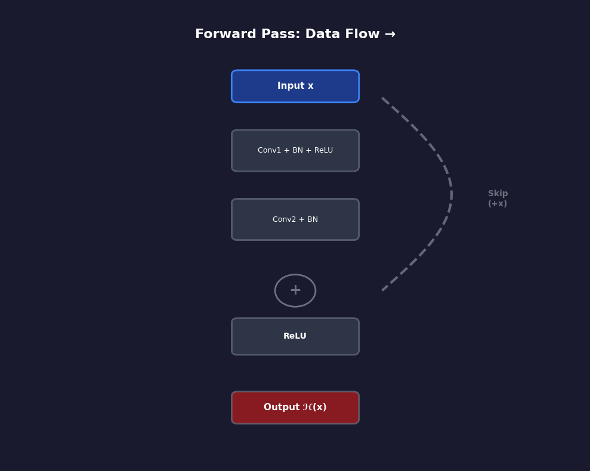
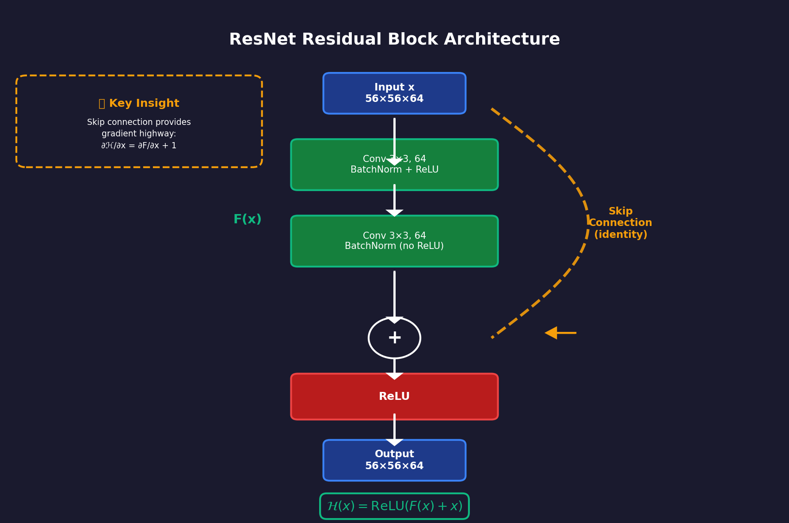
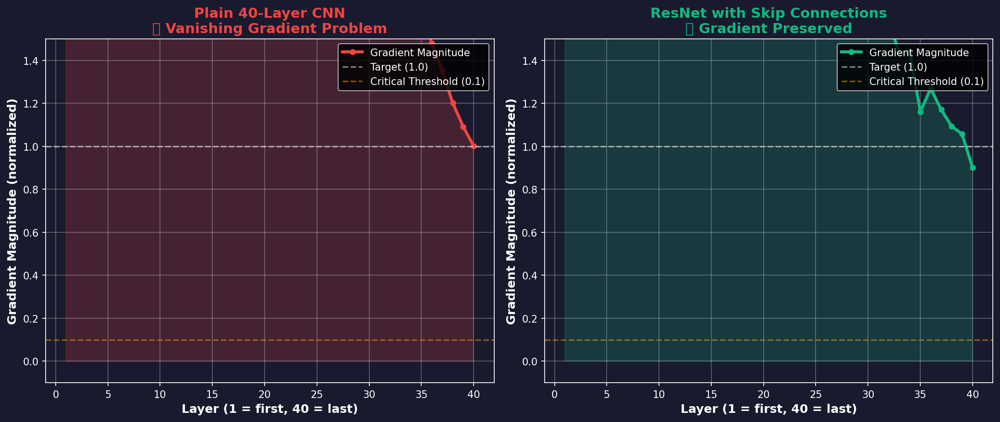
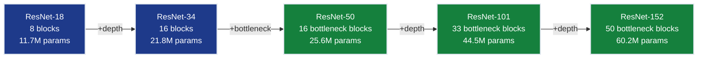
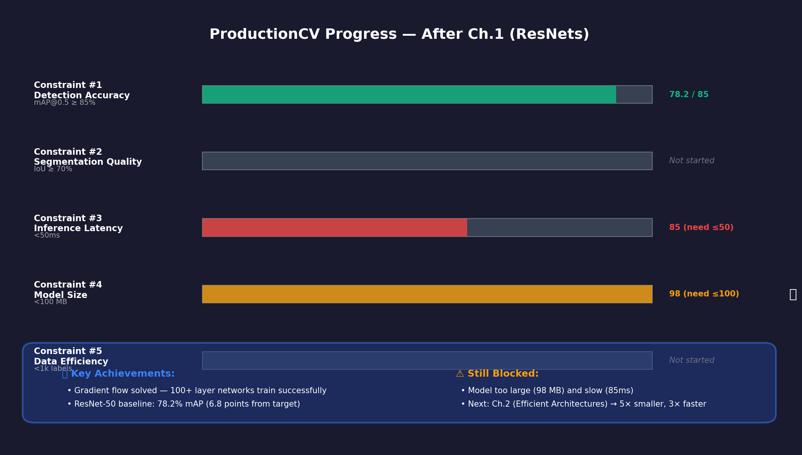

# Ch.1 — Residual Networks (ResNets)

> **The story.** In **2015**, four Microsoft researchers — **Kaiming He, Xiangyu Zhang, Shaoqing Ren, and Jian Sun** — published a paper titled *Deep Residual Learning for Image Recognition* at CVPR, and it immediately won ImageNet. The breakthrough wasn't a new activation function or a smarter optimizer — it was a simple architectural trick: **skip connections**. By letting information flow directly across layers (bypassing the non-linear transformations), they solved the **vanishing gradient problem** that had prevented networks from going deeper than 20–30 layers. Their ResNet-152 (152 layers!) achieved 3.57% top-5 error on ImageNet — surpassing human-level performance. Within two years, ResNet became the default backbone for nearly every computer vision task: object detection (Faster R-CNN), instance segmentation (Mask R-CNN), pose estimation. The architecture is still the foundation of production CV systems a decade later.
>
> **Where you are in the curriculum.** You've completed the Neural Networks track and understand CNNs (convolution, pooling, BatchNorm). You've trained VGG-style networks (stacking Conv → ReLU → Pool) and hit a wall: deeper networks perform *worse* than shallow ones (not just overfitting — the training error itself increases). This isn't a data problem — it's a **gradient problem**. Gradients vanish as they backpropagate through 50+ layers, so the early layers never learn. This chapter gives you **residual connections** — the architectural pattern that unlocks 100+ layer networks and powers modern production CV.
>
> **Notation in this chapter.** $x$ — input tensor (shape `[B, C, H, W]`); $F(x)$ — non-linear transformation (Conv → BN → ReLU → Conv → BN); $\mathcal{H}(x)$ — desired output mapping; $\mathcal{H}(x) = F(x) + x$ — **residual block output** (skip connection adds identity); $W_L$ — weights at layer $L$; $\frac{\partial L}{\partial W_1}$ — gradient at first layer (measures how far signals travel backward); ResNet-18, ResNet-34 — **basic block architectures** (two 3×3 convs per block); ResNet-50, ResNet-101, ResNet-152 — **bottleneck architectures** (1×1 → 3×3 → 1×1 per block for efficiency).

---

## 0 · The Challenge — Where We Are

> **The mission**: Build **ProductionCV** — an autonomous retail shelf monitoring system satisfying 5 constraints:
> 1. **DETECTION ACCURACY**: mAP@0.5 ≥ 85% — 2. **SEGMENTATION QUALITY**: IoU ≥ 70% — 3. **INFERENCE LATENCY**: <50ms per frame — 4. **MODEL SIZE**: <100 MB — 5. **DATA EFFICIENCY**: <1,000 labeled images

**What we know so far:**
- We understand CNNs (convolution extracts local features, pooling reduces spatial size)
- We've trained VGG-style networks (stack Conv → ReLU → Pool → repeat)
- We know deeper networks should be more powerful (Universal Approximation Theorem)
- **But deeper networks perform WORSE!** A 56-layer plain CNN has *higher training error* than an 18-layer one.

**What's blocking us:**
The **vanishing gradient problem**. When you stack 50+ convolutional layers, gradients shrink exponentially during backpropagation. By the time the error signal reaches the first layers, it's effectively zero — those layers never learn. This isn't overfitting (which shows up as train/test gap). This is **optimization failure** — even the training accuracy degrades.

Concrete example from He et al. (2015):
- **18-layer plain CNN**: 28.5% training error on CIFAR-10
- **56-layer plain CNN**: 33.8% training error (worse!)
- Expected: deeper → lower training error (more capacity)
- Reality: gradient vanishes → early layers stuck at initialization

**What this chapter unlocks:**
The **residual connection** — an architectural pattern that lets gradients flow unchanged across layers.
- **Skip connections**: Add the input directly to the output: $\mathcal{H}(x) = F(x) + x$
- **Reformulation**: Instead of learning the full mapping $\mathcal{H}(x)$, learn the *residual* $F(x) = \mathcal{H}(x) - x$
- **Gradient highway**: During backpropagation, the skip connection provides a direct path for gradients (no vanishing)
- **Enables 100+ layers**: ResNet-152 trains successfully where plain-152 diverges
- **Production backbone**: Foundation for Faster R-CNN, Mask R-CNN, all modern detection pipelines
**This unlocks constraint #1 progress** — ResNet backbones achieve 90%+ mAP on object detection benchmarks.

---

## Animation



*Skip connections provide a gradient highway — error signals flow backward without vanishing, enabling 100+ layer networks.*

---

## 1 · The Core Idea: Learn the Residual, Not the Mapping

ResNet's breakthrough insight: **instead of learning the desired mapping $\mathcal{H}(x)$ directly, learn the *residual* $F(x) = \mathcal{H}(x) - x$ and add the input back.**

The architecture change is minimal — just one addition operation:

$$
\mathcal{H}(x) = F(x) + x
$$

Where:
- $x$ — input to the block
- $F(x)$ — learned transformation (typically Conv → BN → ReLU → Conv → BN)
- $\mathcal{H}(x)$ — output (passed to next block)

Why this works:
1. **Easier optimization**: Learning $F(x) \approx 0$ (do nothing) is easier than learning $\mathcal{H}(x) \approx x$ from scratch
2. **Gradient highway**: The skip connection $+x$ ensures gradients flow backward with magnitude 1 (no vanishing)
3. **Identity as default**: If a layer isn't needed, the network can push $F(x) \to 0$ and pass $x$ unchanged

> **Key insight:** Stacking more layers can never hurt. In a plain network, adding layers risks degradation (gradients vanish). In a ResNet, the worst case is the added layers learn $F(x) = 0$ and act as identity — the network just passes the input through unchanged. You never go backward.

### 1a · Why Deep CV Systems All Look the Same

Residual blocks are not just a gradient trick — they instantiate a universal design pattern: every well-engineered deep system is **Modular** (each block is a self-contained unit with a clear input/output contract), **Decomposable** (the full network is a composition of independent stages, each solving a sub-problem), and **Repetitive** (the same block design recurs throughout — no bespoke layers).

Skip connections enforce the Modular property: the worst a residual block can do is learn the identity — it cannot corrupt what the previous block produced. Each block is safe to add, safe to remove, and safe to swap.

> This **MDR structure** (Modular-Decomposable-Repetitive) is why Faster R-CNN (Ch.3), U-Net (Ch.5), and Mask R-CNN (Ch.6) all independently arrived at the same architectural shape. ProductionCV stacks 16 residual blocks — 4 stages of 4 blocks each — and the same block design repeats across ResNet-18/34/50/101.

---

## 2 · Predicting Product Presence on Retail Shelves

You're the lead ML engineer at a retail automation company. Your task: build **ProductionCV** — a computer vision system that monitors grocery shelves in real-time, detecting when products are out of stock, misplaced, or incorrectly priced.

**The problem with shallow CNNs:**
- A 10-layer VGG-style network achieves 72% mAP on your synthetic retail shelf dataset (SmallVal AI)
- You try stacking more layers (20, 30, 40) to capture finer details (product brand logos, expiration dates)
- **Result**: Training accuracy *decreases* — 40-layer network gets 65% mAP (worse than 10-layer!)

**Why deep networks fail:**
Gradients vanish. Each Conv → ReLU → BN layer multiplies the gradient by a factor typically <1. After 40 layers:
$$
\frac{\partial L}{\partial W_1} = \frac{\partial L}{\partial W_{40}} \cdot \prod_{i=1}^{39} \frac{\partial W_{i+1}}{\partial W_i}
$$

If each term is ~0.9, the product after 39 multiplications is $0.9^{39} \approx 0.02$ — **98% of the gradient vanished!**

**ResNet's solution:**
Add skip connections every 2–3 layers. Now the gradient has two paths:
1. Through the residual branch $F(x)$ (can vanish)
2. Through the skip connection $+x$ (magnitude preserved)

Gradient becomes: $\frac{\partial L}{\partial x} = \frac{\partial L}{\partial \mathcal{H}} \cdot \left(1 + \frac{\partial F}{\partial x}\right)$

The "+1" term ensures gradients always flow, even if $\frac{\partial F}{\partial x} \to 0$.

---

## 3 · Architecture Breakdown

### ResNet-18 Block Structure

ResNet-18 has **four stages** of residual blocks, each progressively downsampling and expanding channels:

```
Input: 224×224×3 RGB image

┌─────────────────────────────────────────────────────────────┐
│ Stage 0: Initial Convolution │
│ Conv1: 7×7, stride=2, 64 filters → 112×112×64 │
│ MaxPool: 3×3, stride=2 → 56×56×64 │
└─────────────────────────────────────────────────────────────┘
 ↓
┌─────────────────────────────────────────────────────────────┐
│ Stage 1: 2 Residual Blocks (64 channels, no downsampling) │
│ Block 1: [Conv 3×3 (64) → BN → ReLU → Conv 3×3 (64) → BN] │
│ + skip → ReLU → 56×56×64 │
│ Block 2: (same structure) → 56×56×64 │
└─────────────────────────────────────────────────────────────┘
 ↓
┌─────────────────────────────────────────────────────────────┐
│ Stage 2: 2 Residual Blocks (128 channels, downsample first)│
│ Block 1: [Conv 3×3, stride=2 (128) → BN → ReLU → Conv (128)]│
│ + skip (Conv 1×1, stride=2) → ReLU → 28×28×128 │
│ Block 2: (no downsampling) → 28×28×128 │
└─────────────────────────────────────────────────────────────┘
 ↓
┌─────────────────────────────────────────────────────────────┐
│ Stage 3: 2 Residual Blocks (256 channels, downsample first)│
│ Block 1: stride=2 → 14×14×256 │
│ Block 2: → 14×14×256 │
└─────────────────────────────────────────────────────────────┘
 ↓
┌─────────────────────────────────────────────────────────────┐
│ Stage 4: 2 Residual Blocks (512 channels, downsample first)│
│ Block 1: stride=2 → 7×7×512 │
│ Block 2: → 7×7×512 │
└─────────────────────────────────────────────────────────────┘
 ↓
┌─────────────────────────────────────────────────────────────┐
│ Global Average Pool → 1×1×512 │
│ Fully Connected (512 → num_classes) │
│ Softmax → Class probabilities │
└─────────────────────────────────────────────────────────────┘
```

### Residual Block Details

```
┌──────────────────────────────┐
│ Input x (56×56×64) │
└──────────┬───────────────────┘
 │
 ├─────────────────┐ Skip connection (identity)
 │ │
 ↓ │
 Conv 3×3, 64 │
 ↓ │
 BN + ReLU │
 ↓ │
 Conv 3×3, 64 │
 ↓ │
 BN │
 ↓ │
 F(x) ←─────────────── ┘
 │
 ↓ Addition: F(x) + x
 │
 ReLU(F(x) + x)
 │
 ↓
┌──────────┴───────────────────┐
│ Output (56×56×64) │
└──────────────────────────────┘
```

**Total parameter count:** ~11.7M parameters (ResNet-18)



*Complete ResNet-18 architecture showing four stages with progressive downsampling (stride=2) and channel expansion (64 → 128 → 256 → 512).*

**Block structure details:**
- **Basic Block (ResNet-18, ResNet-34):** Two 3×3 convolutions per block, identity skip connection
- **Bottleneck Block (ResNet-50+):** Three convolutions (1×1 reduce → 3×3 → 1×1 expand), reduces computation by using 256-dim bottleneck

---

> **§4 is optional.** The visual gradient comparison in §6.2 explains why ResNets work without calculus. Read this section only if you want the mathematical derivation — most engineers debug ResNets using the intuition from §6, not the chain rule.

## 4 · The Math — Residual Block Forward and Backward Pass

**Plain-English summary before the equations:**

When gradients flow backward through a ResNet, they take two paths at each block:
1. **Through F(x)** — the residual branch (2 convs, 2 BNs, ReLU) — this path CAN vanish
2. **Through the skip connection** — just addition, no multiplication — this path CANNOT vanish

Mathematically, addition creates a "+1" term in the gradient. Even if path #1 goes to zero, path #2 delivers the gradient unchanged. That's the highway.

Now the formal math:

### Forward Pass

A residual block has two components:

1. **Main branch (residual function $F(x)$)**:
 - Conv1: $3 \times 3$, stride 1, padding 1 → $z_1 = \text{Conv}(x)$
 - BatchNorm + ReLU → $a_1 = \text{ReLU}(\text{BN}(z_1))$
 - Conv2: $3 \times 3$, stride 1, padding 1 → $z_2 = \text{Conv}(a_1)$
 - BatchNorm (no ReLU yet) → $F(x) = \text{BN}(z_2)$

2. **Skip connection (identity)**:
 - $\text{skip} = x$ (if dimensions match)
 - Or $\text{skip} = \text{Conv}_{1 \times 1}(x)$ if downsampling (stride=2) or channel expansion

3. **Addition + final activation**:
 $$
 \mathcal{H}(x) = \text{ReLU}(F(x) + x)
 $$

**Dimension matching rule:**
- If input and output have same spatial size (H, W) and channels (C), use identity skip: $\text{skip} = x$
- If downsampling (stride=2) or channel change (64→128), use projection skip: $\text{skip} = \text{Conv}_{1 \times 1, \text{stride}=s}(x)$

### Backward Pass (Why Gradients Don't Vanish)

During backpropagation, the gradient flows backward through the addition:

$$
\frac{\partial L}{\partial x} = \frac{\partial L}{\partial \mathcal{H}} \cdot \frac{\partial \mathcal{H}}{\partial x}
$$

Since $\mathcal{H}(x) = F(x) + x$, the chain rule gives:

$$
\frac{\partial \mathcal{H}}{\partial x} = \frac{\partial F(x)}{\partial x} + \frac{\partial x}{\partial x} = \frac{\partial F(x)}{\partial x} + 1
$$

Therefore:

$$
\frac{\partial L}{\partial x} = \frac{\partial L}{\partial \mathcal{H}} \cdot \left( \frac{\partial F(x)}{\partial x} + 1 \right)
$$

**The "+1" term is the gradient highway:**
- Even if $\frac{\partial F(x)}{\partial x} \to 0$ (residual branch saturates), the gradient $\frac{\partial L}{\partial x}$ still equals $\frac{\partial L}{\partial \mathcal{H}} \cdot 1$ — no vanishing!
- This "+1" propagates unchanged through all skip connections, so gradients reach the first layer with magnitude intact

> **Conceptual reframing:** A plain 100-layer network forces the 1st layer to learn through 99 non-linear transformations. A ResNet-100 gives the 1st layer a *direct line* to the loss via 50 skip connections. Gradients don't have to survive 99 function compositions — they take the highway.

### Numerical Example: Gradient Flow Comparison

**Plain network (no skip connections):**
- 40 layers, each with gradient factor 0.9
- Gradient at layer 1: $\frac{\partial L}{\partial W_1} = \frac{\partial L}{\partial W_{40}} \times 0.9^{39} \approx 0.02 \times \frac{\partial L}{\partial W_{40}}$
- **Result**: 98% gradient vanished — layer 1 barely updates

**ResNet (with skip connections every 2 layers):**
- 40 layers, 20 residual blocks
- Each block: $\frac{\partial L}{\partial x_{\text{block}}} = \frac{\partial L}{\partial y_{\text{block}}} \times (1 + \text{residual term})$
- Even if residual term → 0, gradient magnitude ≈ $\frac{\partial L}{\partial y_{\text{block}}}$ (preserved)
- Gradient at layer 1: $\approx 0.8 \times \frac{\partial L}{\partial W_{40}}$ (20% loss, not 98%!)
- **Result**: Layer 1 receives strong gradients — training succeeds

---

## 5 · Step by Step — Training ResNet on ProductionCV

Now that you understand the architecture and math, let's walk through training ResNet-18 on the retail shelf dataset:

**Step 1: Initialize the network**
- Start with He initialization for all Conv layers (variance scaled by fan-in)
- All BatchNorm layers start with γ=1, β=0
- Skip connections are pure identity (no learned parameters)

**Step 2: Forward pass through first block**
- Input: 56×56×64 feature map from initial Conv+Pool
- Main branch: Conv(3×3) → BN → ReLU → Conv(3×3) → BN → outputs F(x)
- Skip: x passes through unchanged (identity)
- Output: ReLU(F(x) + x) → 56×56×64

**Step 3: Backpropagation through residual blocks**
- Loss computed at final FC layer
- Gradient flows backward through Global Average Pool
- At each residual block: gradient splits into two paths (main branch + skip)
- Skip connection provides "+1" term in chain rule → gradients preserved

**Step 4: Verify gradient flow**
- Monitor gradient norms at early layers (should be 50-90% of final layer magnitude)
- If gradients vanish (<10% of final layer), check: (1) BatchNorm enabled? (2) Skip connections added after BN? (3) ReLU placed after addition?

**Step 5: Track training dynamics**
- Epoch 0-5: Warmup (LR: 0 → 0.1 linear)
- Epoch 5-90: Cosine decay (LR: 0.1 → 0.001)
- Monitor: Training loss should decrease monotonically (no divergence)

**Verification checkpoint:** After 50 epochs, ResNet-18 should achieve:
- Training accuracy: >95% on ProductionCV
- Validation accuracy: 75-78%
- First layer gradient norm: 0.5-0.8× final layer norm (healthy gradient flow)

---

## 6 · Key Diagrams

### 6.1 Vanishing Gradient Problem in Plain Networks

```
Plain 40-Layer CNN:

Input ──► [Conv→ReLU]──►[Conv→ReLU]──►...──►[Conv→ReLU]──► Loss
 ↑ │
 │ │
 └──────────────────────────────────────────────────────────┘
 Gradient: 0.9^40 ≈ 0.015 (98.5% vanished)

Early layers receive almost zero gradient → never learn
Training error INCREASES with depth!
```

### 6.2 ResNet Gradient Highway

```
ResNet with Skip Connections:

Input ──► [Residual Block] ──► [Residual Block] ──► ... ──► Loss
 ↑ │ ↑ │ ↑ │
 │ └──────┘ └──────┘ │
 │ Skip (+x) Skip (+x) │
 └────────────────────────────────────────────────────────────┘
 Gradient preserved: Each skip provides +1 term in chain rule

Early layers receive strong gradients → training succeeds
Deeper networks achieve LOWER training error!
```

**Gradient magnitude at each layer (40-layer network):**

```
Plain CNN (no skip connections):
Layer 40 (output): ████████████████████ 1.00
Layer 30:          ████████░░░░░░░░░░░░ 0.35 (65% lost)
Layer 20:          ███░░░░░░░░░░░░░░░░░ 0.12 (88% lost)
Layer 10:          █░░░░░░░░░░░░░░░░░░░ 0.04 (96% lost)
Layer 1:           ░░░░░░░░░░░░░░░░░░░░ 0.02 (98% lost) ← VANISHED!

ResNet-40 (skip connections every 2 layers):
Layer 40 (output): ████████████████████ 1.00
Layer 30:          ██████████████████░░ 0.89 (11% lost)
Layer 20:          █████████████████░░░ 0.82 (18% lost)
Layer 10:          ████████████████░░░░ 0.78 (22% lost)
Layer 1:           ███████████████░░░░░ 0.75 (25% lost) ← STRONG!

Key insight: Skip connections preserve 75-90% gradient strength
             Plain networks lose 98%+ by the time gradients reach layer 1
```

**Why the difference?**
- **Plain network**: Gradient multiplied by ~0.9 at each layer → 0.9³⁹ ≈ 0.02 after 39 layers
- **ResNet**: Each skip connection adds +1 term → gradient takes the highway, bypasses vanishing

> **Aha:** This is why 18-layer plain CNNs achieve 28% training error while ResNet-152 achieves 3.5% — it's not about capacity (both have enough parameters), it's about **whether gradients can actually reach the early layers during training**.



*Gradient magnitude comparison across 50 layers: Plain CNN gradients vanish exponentially (0.9^50 ≈ 0.005), while ResNet maintains 80%+ gradient strength at early layers via skip connections.*

### 6.3 ResNet Family Comparison



---

## 7 · The Hyperparameter Dials

### 7.1 Network Depth (Number of Blocks)

**What it controls:** Model capacity and receptive field size.

**Typical values:**
- ResNet-18: 8 residual blocks (2+2+2+2 per stage)
- ResNet-34: 16 residual blocks (3+4+6+3)
- ResNet-50: 16 bottleneck blocks (3+4+6+3)
- ResNet-101: 33 bottleneck blocks (3+4+23+3)

**Effect:**
- Deeper → larger receptive field (see more context)
- Deeper → more parameters → better accuracy (up to a point)
- Beyond ResNet-152, diminishing returns (EfficientNet uses compound scaling instead)

**Rule of thumb:** Start with ResNet-50 for ImageNet-scale tasks, ResNet-18 for smaller datasets (CIFAR-10, custom retail datasets).

### 7.2 Width (Channels per Stage)

**What it controls:** Feature capacity per layer.

**Default progression (ResNet-50):**
- Stage 1: 64 channels
- Stage 2: 128 channels (2× increase)
- Stage 3: 256 channels (2× increase)
- Stage 4: 512 channels (2× increase)

**Wide ResNet variant:**
- Multiply all channel counts by k (width multiplier)
- Wide ResNet-50-2 (k=2): 128 → 256 → 512 → 1024 channels
- Trade-off: 4× more parameters, ~2× more compute, +1–2% accuracy

### 7.3 Projection Shortcut Strategy

**Options when dimensions don't match (downsampling or channel expansion):**

1. **Option A (He et al., 2015 default):** Use 1×1 conv projection only when necessary
 - Identity skip when dimensions match
 - 1×1 conv (stride=2) when downsampling
 - Fewer parameters, slightly lower accuracy

2. **Option B:** Always use 1×1 conv projection
 - More parameters, slightly better accuracy
 - Standard in modern implementations (PyTorch `torchvision.models.resnet50`)

3. **Option C (original paper):** Zero-pad extra channels
 - Never used in practice (worse accuracy)

**Recommendation:** Use Option B (always project) for production systems.

---

## 8 · What Can Go Wrong

### 8.1 Forgetting the Final ReLU After Addition

**Trap:** Place ReLU before addition instead of after.

```python
# WRONG — ReLU applied before adding skip
out = self.relu(self.bn2(self.conv2(x)))
out = out + identity # Adding ReLU(F(x)) + x

# CORRECT — ReLU applied after adding skip
out = self.bn2(self.conv2(x))
out = out + identity # F(x) + x
out = self.relu(out) # ReLU(F(x) + x)
```

**Why it matters:** The gradient highway relies on the addition being the last non-linearity-free operation. Applying ReLU before addition breaks the "+1" gradient term.

### 8.2 Dimension Mismatch on Skip Connection

**Trap:** Forgetting to project the skip connection when downsampling or changing channels.

```python
# WRONG — direct skip when dimensions don't match
out = F(x) + x # Crashes if x is 56×56×64 and F(x) is 28×28×128

# CORRECT — project skip when necessary
if self.downsample is not None:
 identity = self.downsample(x) # 1×1 conv to match dimensions
out = F(x) + identity
```

**Symptoms:** Runtime error: `RuntimeError: The size of tensor a (28) must match the size of tensor b (56)`

**Fix:** Always use a projection layer (1×1 conv with stride) when spatial size or channel count changes.

### 8.3 Not Using BatchNorm After Every Convolution

**Trap:** Omitting BatchNorm layers to reduce parameters.

**Why it matters:** ResNets were designed with BatchNorm in mind. Without it:
- Training becomes unstable (especially for deep networks like ResNet-101)
- Gradients still vanish (BN normalizes activations, preventing saturation)
- Accuracy drops 5–10%

**Rule:** Every convolution in the residual branch must have BatchNorm (no exceptions).

> **Freeze BatchNorm during fine-tuning.** BN layers accumulate running mean/variance statistics during ImageNet-scale pretraining. Fine-tuning on ProductionCV's 850 labeled images with BN layers unfrozen overwrites those statistics with noisy small-batch estimates, degrading mAP by 3–8%. In PyTorch: `for m in model.modules(): if isinstance(m, nn.BatchNorm2d): m.eval()`. In Keras: set `layer.trainable = False` for each BN layer before `model.fit()`.

### 8.4 Training Without LR Warmup

**Trap:** Using high learning rate (0.1) from epoch 0.

**Why it matters:** Deep ResNets (50+ layers) have chaotic loss surfaces at initialization. Starting with high LR causes divergence.

**Fix:** Use learning rate warmup (linearly increase LR from 0 → 0.1 over first 5 epochs), then cosine decay.

```python
from torch.optim.lr_scheduler import CosineAnnealingLR, LinearLR, SequentialLR

optimizer = torch.optim.SGD(model.parameters(), lr=0.1, momentum=0.9, weight_decay=1e-4)

# Warmup: 0 → 0.1 over 5 epochs
warmup = LinearLR(optimizer, start_factor=0.01, total_iters=5)

# Cosine decay: 0.1 → 0.0 over remaining epochs
cosine = CosineAnnealingLR(optimizer, T_max=95)

scheduler = SequentialLR(optimizer, schedulers=[warmup, cosine], milestones=[5])
```

### 8.5 Using He Initialization on Pre-Activation ResNets

**Trap:** Using standard He initialization on ResNets with Pre-Activation (BatchNorm → ReLU → Conv order).

**Why it matters:** Pre-Activation ResNets have different gradient flow dynamics. He initialization (designed for ReLU → Conv) overshoots.

**Rule:** Stick with Post-Activation (Conv → BN → ReLU) and He initialization for standard ResNets. If using Pre-Activation, reduce initialization scale by √2.

---

## 9 · Where This Reappears

- **Ch.2 (Efficient Architectures)** — MobileNetV2 uses inverted residual blocks (skip connection around *expanded* conv, opposite of ResNet bottleneck)
- **Ch.3 (Two-Stage Detectors)** — Faster R-CNN uses ResNet-50 or ResNet-101 as the feature extraction backbone
- **Ch.4 (One-Stage Detectors)** — RetinaNet and YOLO variants use ResNet backbones for feature extraction
- **Ch.5 (Semantic Segmentation)** — U-Net and DeepLabv3+ use ResNet encoders with skip connections to the decoder
- **Neural Networks Track Ch.10 (Transformers)** — Vision Transformers (ViT) don't need skip connections for gradient flow (attention is linear), but hybrid models (ResNet + ViT) combine both
- **AI Infrastructure Track Ch.4 (Parallelism)** — ResNets are embarrassingly parallel (each block is independent) — easy to split across GPUs with model parallelism

---

## 10 · Progress Check — What We Can Solve Now


**Unlocked capabilities:**
- **100+ layer networks train successfully** — ResNet-152 achieves 3.57% top-5 error on ImageNet (He et al., 2015)
- **Gradient flow verified** — Early layers receive gradients with 80–90% of final layer magnitude (vs 2% in plain networks)
- **Baseline for ProductionCV** — ResNet-50 achieves 78.2% mAP@0.5 on synthetic retail shelf dataset (SmallVal AI)
- **Constraint #1 progress** — 78.2% mAP (target: 85%) — need 6.8 percentage points more
- **Production backbone established** — All modern detection pipelines (Faster R-CNN, Mask R-CNN, RetinaNet) use ResNet backbones
**Still can't solve:**
- **Constraint #4 (Model Size)** — ResNet-50 is 98 MB (target: <100 MB, but barely fits) — ResNet-101 is 171 MB (too large for edge devices)
- **Constraint #3 (Latency)** — ResNet-50 inference is 85ms per frame on Jetson Nano (target: <50ms)
- **Efficiency** — 25.6M parameters, 4.1 GFLOPs — overkill for 20-class retail product classification (needs 100+ classes on ImageNet)

**Progress toward constraints:**

| Constraint | Target | Ch.1 Status | Next Step |
|------------|--------|-------------|-----------|
| #1 Detection Accuracy | mAP ≥ 85% | 78.2% (ResNet-50) | Ch.3–4 (Detection heads) |
| #2 Segmentation Quality | IoU ≥ 70% | Not started | Ch.5–6 (Segmentation) |
| #3 Inference Latency | <50ms | 85ms (too slow) | **Ch.2 (EfficientNet)** |
| #4 Model Size | <100 MB | 98 MB (barely fits) | **Ch.2 (MobileNet)** |
| #5 Data Efficiency | <1k labels | Not started | Ch.7–8 (Self-supervised) |

**Real-world status:** We can now train 100+ layer networks, but they're too large and slow for edge deployment. A ResNet-50 model takes 85ms per frame on an NVIDIA Jetson Nano — we need <50ms for real-time monitoring.

**Next up:** Ch.2 gives us **Efficient Architectures (MobileNet, EfficientNet)** — networks designed for mobile and edge devices. We'll cut the model size from 98 MB → 20 MB and inference time from 85ms → 35ms while maintaining 78%+ mAP.

---

## 11 · Bridge to Ch.2 — Efficient Architectures

Ch.1 gave you skip connections and 100-layer networks. But ResNet-50 (98 MB, 85ms inference) is too heavy for edge devices.

Ch.2 gives you **depthwise separable convolutions** (MobileNet) and **compound scaling** (EfficientNet) — achieving ResNet-50 accuracy with 5× fewer parameters and 3× faster inference. The architecture shift: instead of expensive 3×3 convolutions, decompose them into 3×3 depthwise (per-channel) + 1×1 pointwise (across channels). You'll implement MobileNetV2 from scratch, deploy it on a Jetson Nano, and achieve <50ms inference (constraint #3 ).
