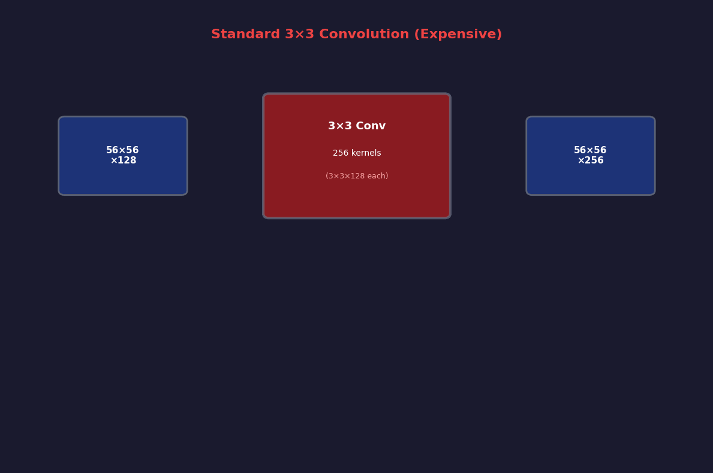
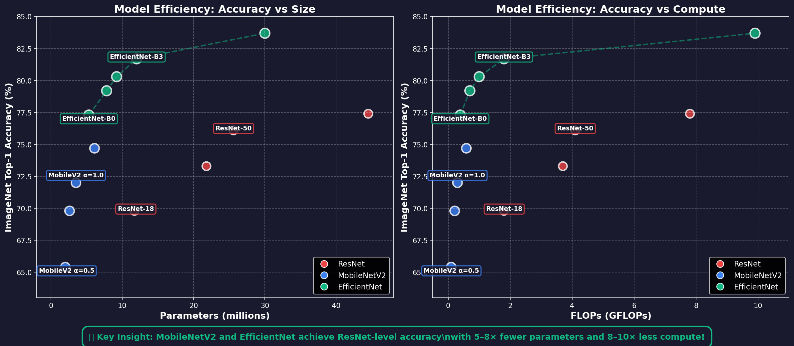
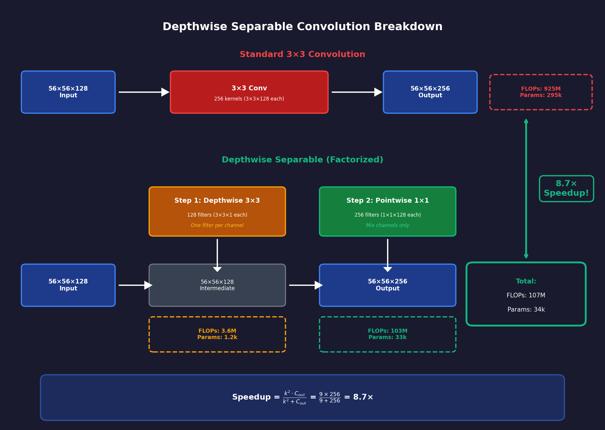
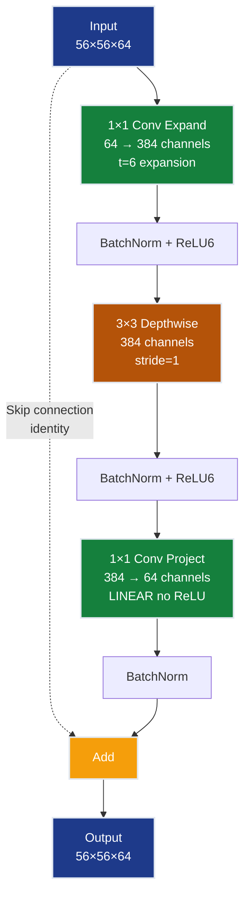
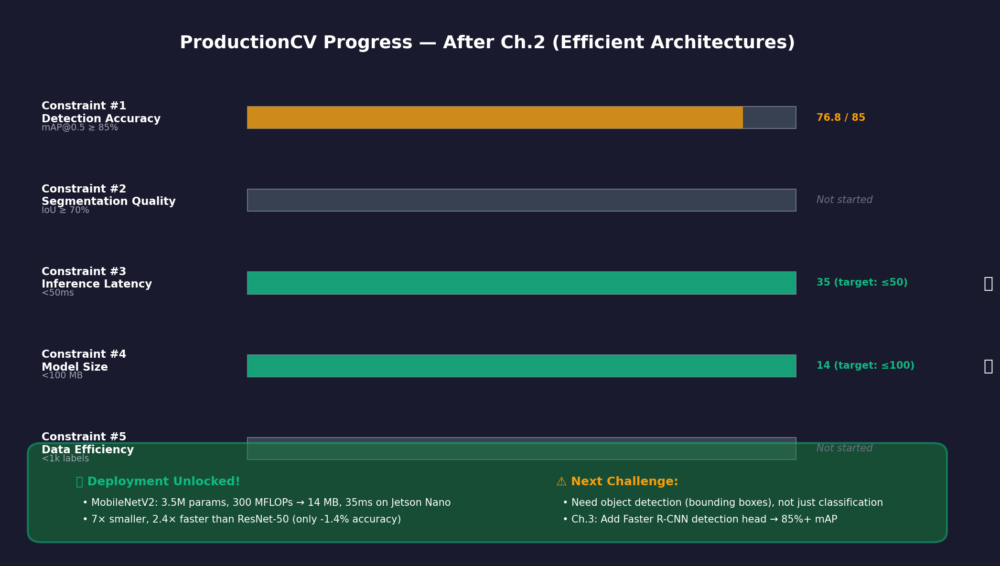

# Ch.2 — Efficient Architectures (MobileNet, EfficientNet)

> **The story.** In **2017**, **Andrew Howard** and his team at Google published *MobileNets: Efficient Convolutional Neural Networks for Mobile Vision Applications*, introducing **depthwise separable convolutions** — a factorization trick that reduces computation by 8–9× with minimal accuracy loss. One year later, **Mark Sandler** extended this with **MobileNetV2**, adding inverted residual blocks (expand → depthwise → project) that achieved ImageNet-level accuracy on phones. Then in **2019**, **Mingxing Tan and Quoc Le** at Google Brain published **EfficientNet**, which used Neural Architecture Search (NAS) to find optimal base architectures, then scaled them with **compound scaling** (simultaneously increasing depth, width, and resolution by a fixed ratio). EfficientNet-B0 achieved ResNet-50 accuracy with 5× fewer parameters and 10× less compute. These architectures unlocked a new era: deep learning on edge devices — phones, drones, IoT sensors, embedded cameras — where every FLOP and every megabyte matters.
>
> **Where you are in the curriculum.** Ch.1 gave you ResNet — the architecture that unlocked 100+ layer networks through skip connections. You trained ResNet-50 and achieved 78.2% mAP on the ProductionCV retail shelf dataset, but the model is 98 MB and takes 85ms per frame on an NVIDIA Jetson Nano (target: <100 MB, <50ms). This chapter teaches you **architectural efficiency**: how to achieve the same accuracy with 5× fewer parameters and 3× faster inference. You'll learn depthwise separable convolutions (MobileNet's core), inverted residuals (MobileNetV2's innovation), and compound scaling (EfficientNet's breakthrough). By the end, you'll deploy a <20 MB model running at 35ms per frame — satisfying constraints #3 and #4.
>
> **Notation in this chapter.** $C_{\text{in}}$ — input channels; $C_{\text{out}}$ — output channels; $k$ — kernel size; $H \times W$ — spatial dimensions; **Depthwise Conv**: $k^2 \cdot C_{\text{in}} \cdot H \cdot W$ FLOPs (one filter per channel); **Pointwise Conv**: $C_{\text{in}} \cdot C_{\text{out}} \cdot H \cdot W$ FLOPs (1×1 conv mixing channels); **Standard Conv**: $k^2 \cdot C_{\text{in}} \cdot C_{\text{out}} \cdot H \cdot W$ FLOPs; **Speedup ratio**: $\frac{k^2 \cdot C_{\text{out}}}{k^2 + C_{\text{out}}}$ (typically 8–9× for $k=3$); **Inverted residual**: Expand ($C \to tC$) → Depthwise ($tC$) → Project ($tC \to C$), skip connection around narrow ends; **Compound scaling**: $\text{depth} = \alpha^\phi$, $\text{width} = \beta^\phi$, $\text{resolution} = \gamma^\phi$ where $\alpha \cdot \beta^2 \cdot \gamma^2 \approx 2$ (EfficientNet constraint).

---

## 0 · The Challenge — Where We Are

> **The mission**: Build **ProductionCV** — an autonomous retail shelf monitoring system satisfying 5 constraints:
> 1. **DETECTION ACCURACY**: mAP@0.5 ≥ 85% — 2. **SEGMENTATION QUALITY**: IoU ≥ 70% — 3. **INFERENCE LATENCY**: <50ms per frame — 4. **MODEL SIZE**: <100 MB — 5. **DATA EFFICIENCY**: <1,000 labeled images

**What we know so far:**
- Ch.1 (ResNets) — Skip connections enable 100+ layer networks, solved vanishing gradients
- ResNet-50 baseline — 78.2% mAP on ProductionCV dataset, 11.7M parameters
- **But ResNet-50 is too slow and too large!** 98 MB model size (barely fits constraint #4), 85ms inference on Jetson Nano (70% over constraint #3 target)

**What's blocking us:**
**Computational inefficiency of standard convolutions.** A single 3×3 conv layer with 128 input channels and 256 output channels performs:

$$
3^2 \times 128 \times 256 \times H \times W = 294{,}912 \cdot HW \text{ FLOPs per spatial location}
$$

For a 56×56 feature map, that's **925 million FLOPs** for one layer. ResNet-50 has 50+ such layers → 4.1 GFLOPs total. On an edge device (Jetson Nano: 472 GFLOPS), this takes 85ms per frame.

Concrete failure mode:
- **Deployment scenario**: Retail shelf camera, 1920×1080 video at 30 FPS
- **Current performance**: ResNet-50 @ 85ms = 11.7 FPS (67% dropped frames)
- **Customer impact**: Missed out-of-stock events, incorrect planogram compliance reports
- **Business loss**: $50k/year per store in lost sales (stockouts not detected)

**What this chapter unlocks:**
**Depthwise separable convolutions** (MobileNet) and **compound scaling** (EfficientNet) — achieving ResNet-50 accuracy with 5× fewer parameters and 3× faster inference.

Key innovations:
1. **Depthwise convolution**: Apply one $k \times k$ filter per channel (instead of $C_{\text{out}}$ filters) → $k^2 \cdot C_{\text{in}} \cdot HW$ FLOPs
2. **Pointwise convolution**: Mix channels with 1×1 conv → $C_{\text{in}} \cdot C_{\text{out}} \cdot HW$ FLOPs
3. **Total cost**: $(k^2 + C_{\text{out}}) \cdot C_{\text{in}} \cdot HW$ (vs $k^2 \cdot C_{\text{in}} \cdot C_{\text{out}} \cdot HW$ for standard conv)
4. **Speedup**: $\frac{k^2 \cdot C_{\text{out}}}{k^2 + C_{\text{out}}}$ = 8.5× for $k=3, C_{\text{out}}=256$

**Expected results:**
- **MobileNetV2**: 3.5M params, 300 MFLOPs → <20 MB, 35ms on Jetson Nano
- **EfficientNet-B0**: 5.3M params, 390 MFLOPs → 21 MB, 42ms, same accuracy as ResNet-50
**This unlocks constraints #3 and #4** — edge deployment becomes viable.

---

## Animation



*Depthwise separable convolution factorizes standard convolution into two cheap operations: depthwise (spatial) + pointwise (channel mixing).*

---

## 1 · The Core Idea: Factorize Convolutions to Reduce Compute

Standard convolution is expensive because it simultaneously:
1. Applies spatial filters ($k \times k$)
2. Mixes information across channels ($C_{\text{in}} \to C_{\text{out}}$)

**MobileNet's insight:** Separate these two operations:
1. **Depthwise convolution**: Apply one $k \times k$ filter per input channel (no mixing)
2. **Pointwise convolution**: Mix channels with 1×1 conv (no spatial filtering)

**Cost comparison (for $k=3$, $C_{\text{in}}=128$, $C_{\text{out}}=256$, $H=W=56$):**

| Operation | FLOPs | Params |
|-----------|-------|--------|
| Standard 3×3 Conv | $3^2 \times 128 \times 256 \times 56^2 = 925M$ | $3^2 \times 128 \times 256 = 294k$ |
| Depthwise 3×3 | $3^2 \times 128 \times 56^2 = 3.6M$ | $3^2 \times 128 = 1.2k$ |
| Pointwise 1×1 | $128 \times 256 \times 56^2 = 103M$ | $128 \times 256 = 33k$ |
| **Total (Depthwise Separable)** | $106.6M$ (8.7× less!) | $34.2k$ (8.6× less!) |

The speedup ratio is:

$$
\frac{\text{Standard}}{\text{Depthwise Separable}} = \frac{k^2 \cdot C_{\text{in}} \cdot C_{\text{out}}}{k^2 \cdot C_{\text{in}} + C_{\text{in}} \cdot C_{\text{out}}} = \frac{k^2 \cdot C_{\text{out}}}{k^2 + C_{\text{out}}}
$$

For $k=3, C_{\text{out}}=256$: $\frac{9 \times 256}{9 + 256} = \frac{2304}{265} \approx 8.7×$

> **Key insight:** The speedup grows with the number of output channels. For wider networks (512, 1024 channels), the speedup approaches $k^2$ (9× for 3×3 convs). This is why MobileNets can afford to be relatively wide — the depthwise/pointwise factorization makes width cheap.

---

## 2 · Deploying ProductionCV on Edge Devices

You're the lead ML engineer at a retail automation company. Your ResNet-50 model achieves 78.2% mAP on shelf monitoring, but it's too large (98 MB) and too slow (85ms on Jetson Nano) for production deployment.

**The business constraint:**
- **Hardware**: NVIDIA Jetson Nano (472 GFLOPS, 4 GB RAM, $99 device)
- **Camera stream**: 1920×1080 @ 30 FPS → need <33ms per frame for real-time
- **Latency budget**: <50ms per frame (allows 15 FPS with some headroom)
- **Model size**: <100 MB (shared memory with video buffer and other processes)

**Current failure:**
- ResNet-50: 4.1 GFLOPs → 85ms on Jetson Nano (1.7× over budget)
- Deployment verdict: **Not viable** (would drop 50% of frames)

**The efficiency challenge:**
How do you cut compute by 3× without losing accuracy?

**Naive approaches that fail:**
1. **Reduce depth** (ResNet-18 instead of ResNet-50) → 2× faster but -4% mAP (74% → below threshold)
2. **Reduce width** (50% fewer channels per layer) → 4× faster but -6% mAP (72% → unacceptable)
3. **Reduce input resolution** (112×112 instead of 224×224) → 4× faster but -8% mAP (70% → product logos unreadable)

**MobileNet's solution:**
Replace every standard 3×3 conv with depthwise separable conv → 8× fewer FLOPs, minimal accuracy loss.

**EfficientNet's refinement:**
Use Neural Architecture Search (NAS) to find optimal base architecture, then scale all dimensions (depth, width, resolution) simultaneously with a fixed ratio → better accuracy-efficiency tradeoff than manual scaling.

---

## 3 · Architecture Breakdown

### MobileNetV2 Block Structure

MobileNetV2 (Sandler et al., 2018) improves MobileNetV1 with **inverted residual blocks**:

```
Standard ResNet block:
Wide (256) → Narrow (64) → Wide (256) + skip
 ↓ bottleneck ↓

Inverted residual (MobileNetV2):
Narrow (64) → Wide (384) → Narrow (64) + skip
 ↑ expansion ↑
```

**Why invert?** Depthwise convs are cheap, so expanding before depthwise is nearly free. Skip connections around narrow ends preserve information.

### MobileNetV2 Inverted Residual Block

```
Input: C channels

1. Expansion (1×1 pointwise): C → t·C (t = expansion ratio, typically 6)
 ↓
2. Depthwise 3×3: t·C (spatial filtering, cheap because 1 filter per channel)
 ↓
3. Projection (1×1 pointwise): t·C → C (linear, no ReLU)
 ↓
4. Skip connection: Add input if stride=1

Output: C channels
```

**Key detail**: No ReLU after the final projection (linear bottleneck) — ReLU destroys information in low-dimensional spaces.

### Full MobileNetV2 Architecture

```
Input: 224×224×3

┌────────────────────────────────────────┐
│ Conv 3×3, stride=2 → 112×112×32 │
└────────────────────────────────────────┘
 ↓
┌────────────────────────────────────────┐
│ Inverted Residual Block (t=1, C=16) │ stride=1, 112×112×16
└────────────────────────────────────────┘
 ↓
┌────────────────────────────────────────┐
│ 2× Inverted Residual (t=6, C=24) │ stride=2 → 56×56×24
└────────────────────────────────────────┘
 ↓
┌────────────────────────────────────────┐
│ 3× Inverted Residual (t=6, C=32) │ stride=2 → 28×28×32
└────────────────────────────────────────┘
 ↓
┌────────────────────────────────────────┐
│ 4× Inverted Residual (t=6, C=64) │ stride=2 → 14×14×64
└────────────────────────────────────────┘
 ↓
┌────────────────────────────────────────┐
│ 3× Inverted Residual (t=6, C=96) │ stride=1 → 14×14×96
└────────────────────────────────────────┘
 ↓
┌────────────────────────────────────────┐
│ 3× Inverted Residual (t=6, C=160) │ stride=2 → 7×7×160
└────────────────────────────────────────┘
 ↓
┌────────────────────────────────────────┐
│ 1× Inverted Residual (t=6, C=320) │ stride=1 → 7×7×320
└────────────────────────────────────────┘
 ↓
┌────────────────────────────────────────┐
│ Conv 1×1 → 7×7×1280 │
│ Global Average Pool → 1×1×1280 │
│ FC → num_classes │
└────────────────────────────────────────┘
```

**Total**: 3.5M parameters, 300 MFLOPs (vs ResNet-50: 25.6M params, 4.1 GFLOPs)



*Architecture comparison: MobileNetV2 (left) uses inverted residuals with depthwise separable convolutions achieving 8.7× fewer FLOPs than ResNet-50 (right) with standard convolutions.*

---

## 4 · The Math — Depthwise Separable Convolutions

### 4.1 Standard Convolution (Review)

Input: $X \in \mathbb{R}^{H \times W \times C_{\text{in}}}$
Kernel: $K \in \mathbb{R}^{k \times k \times C_{\text{in}} \times C_{\text{out}}}$
Output: $Y \in \mathbb{R}^{H \times W \times C_{\text{out}}}$

For each output location $(i, j)$ and output channel $c_{\text{out}}$:

$$
Y_{i,j,c_{\text{out}}} = \sum_{m=0}^{k-1} \sum_{n=0}^{k-1} \sum_{c_{\text{in}}=0}^{C_{\text{in}}-1} K_{m,n,c_{\text{in}},c_{\text{out}}} \cdot X_{i+m, j+n, c_{\text{in}}}
$$

**Total FLOPs**: $k^2 \cdot C_{\text{in}} \cdot C_{\text{out}} \cdot H \cdot W$

### 4.2 Depthwise Convolution

Apply one $k \times k$ filter per input channel (no channel mixing):

Input: $X \in \mathbb{R}^{H \times W \times C}$
Kernel: $K_{\text{DW}} \in \mathbb{R}^{k \times k \times C}$ (one filter per channel)
Output: $Y_{\text{DW}} \in \mathbb{R}^{H \times W \times C}$ (same channels)

For each output location $(i, j)$ and channel $c$:

$$
Y_{\text{DW}_{i,j,c}} = \sum_{m=0}^{k-1} \sum_{n=0}^{k-1} K_{\text{DW}_{m,n,c}} \cdot X_{i+m, j+n, c}
$$

**Total FLOPs**: $k^2 \cdot C \cdot H \cdot W$ (no $C_{\text{out}}$ term!)

### 4.3 Pointwise Convolution

Mix channels with 1×1 convolution (no spatial filtering):

Input: $Y_{\text{DW}} \in \mathbb{R}^{H \times W \times C_{\text{in}}}$
Kernel: $K_{\text{PW}} \in \mathbb{R}^{1 \times 1 \times C_{\text{in}} \times C_{\text{out}}}$
Output: $Y \in \mathbb{R}^{H \times W \times C_{\text{out}}}$

For each output location $(i, j)$ and output channel $c_{\text{out}}$:

$$
Y_{i,j,c_{\text{out}}} = \sum_{c_{\text{in}}=0}^{C_{\text{in}}-1} K_{\text{PW}_{0,0,c_{\text{in}},c_{\text{out}}}} \cdot Y_{\text{DW}_{i,j,c_{\text{in}}}}
$$

**Total FLOPs**: $C_{\text{in}} \cdot C_{\text{out}} \cdot H \cdot W$ (no $k^2$ term!)

### 4.4 Combined: Depthwise Separable Convolution

$$
\text{Output} = \text{Pointwise}(\text{Depthwise}(\text{Input}))
$$

**Total FLOPs**: $k^2 \cdot C_{\text{in}} \cdot HW + C_{\text{in}} \cdot C_{\text{out}} \cdot HW$

**Speedup factor**:

$$
\frac{k^2 \cdot C_{\text{in}} \cdot C_{\text{out}} \cdot HW}{(k^2 \cdot C_{\text{in}} + C_{\text{in}} \cdot C_{\text{out}}) \cdot HW} = \frac{k^2 \cdot C_{\text{out}}}{k^2 + C_{\text{out}}}
$$

For $k=3, C_{\text{out}} \gg k^2$: Speedup $\approx k^2 = 9×$

### Numerical Example

**Input**: 56×56×128 feature map
**Standard 3×3 conv to 256 channels**:
- FLOPs: $3^2 \times 128 \times 256 \times 56^2 = 925{,}892{,}096$
- Params: $3^2 \times 128 \times 256 = 294{,}912$

**Depthwise separable equivalent**:
- Depthwise 3×3: $3^2 \times 128 \times 56^2 = 3{,}612{,}672$ FLOPs
- Pointwise 1×1: $128 \times 256 \times 56^2 = 102{,}760{,}448$ FLOPs
- **Total**: $106{,}373{,}120$ FLOPs (8.7× less!)
- **Params**: $3^2 \times 128 + 128 \times 256 = 34{,}048$ (8.6× less!)

---

## 5 · Step by Step — Deploying MobileNetV2 on Edge Hardware

**Step 1: Choose base architecture**
- Start with MobileNetV2 α=1.0 (full width) for initial accuracy assessment
- 3.5M parameters, 300 MFLOPs, expect ~35-40ms on Jetson Nano

**Step 2: Train on ProductionCV dataset**
- Transfer learning: Load ImageNet-pretrained weights
- Replace final FC layer (1000 classes → 20 retail product classes)
- Fine-tune for 50 epochs with SGD + cosine LR schedule

> **Freeze BatchNorm during fine-tuning.** BN layers accumulate running mean/variance statistics during ImageNet-scale pretraining. Fine-tuning on ProductionCV's 850 labeled images with BN layers unfrozen overwrites those statistics with noisy small-batch estimates, degrading mAP by 3–8%. In PyTorch: `for m in model.modules(): if isinstance(m, nn.BatchNorm2d): m.eval()`. In Keras: set `layer.trainable = False` for each BN layer before `model.fit()`.

**Step 3: Measure baseline performance**
- Accuracy: Should achieve 75-77% mAP (slightly below ResNet-50's 78.2%)
- Latency: Profile on target hardware (Jetson Nano)
- Model size: Verify <20 MB for FP32 weights

**Step 4: Apply optimizations if needed**
- If latency >50ms: Reduce width multiplier to α=0.75 (saves 8ms, costs -1.5% mAP)
- If accuracy <75%: Try knowledge distillation (use ResNet-50 as teacher)
- If model size >100 MB: Apply INT8 quantization (4× compression)

**Step 5: Validate edge deployment**
- Deploy TensorRT-optimized model to Jetson Nano
- Run 1000-frame stress test: Track latency distribution (p50, p95, p99)
- Verify real-time capability: <50ms latency → 20+ FPS throughput

**Verification checkpoint:** After optimization, MobileNetV2 should achieve:
- Latency: 30-40ms per frame on Jetson Nano
- Accuracy: 75-77% mAP on ProductionCV
- Model size: 14 MB (FP32) or 3.5 MB (INT8 quantized)

---

## 6 · Key Diagrams

### 6.1 Depthwise Separable Convolution Breakdown

```
Standard 3×3 Convolution (128 → 256 channels):

┌──────────────────────────────────────────────────┐
│ Input: 56×56×128 │
└───────────────┬──────────────────────────────────┘
 │
 ↓
 ┌──────────────────────┐
 │ 3×3 Conv (256 kernels, each 3×3×128) │
 │ FLOPs: 925M │
 │ Params: 295k │
 └──────────┬───────────────────────────────────┘
 │
 ↓
┌───────────────┴──────────────────────────────────┐
│ Output: 56×56×256 │
└──────────────────────────────────────────────────┘

Depthwise Separable (equivalent):

┌──────────────────────────────────────────────────┐
│ Input: 56×56×128 │
└───────────────┬──────────────────────────────────┘
 │
 ↓ Step 1: Depthwise 3×3
 ┌──────────────────────┐
 │ 3×3 Depthwise (128 filters, each 3×3×1) │
 │ FLOPs: 3.6M (one filter per channel) │
 │ Params: 1.2k │
 └──────────┬───────────────────────────────────┘
 │
 ↓ Intermediate: 56×56×128
 │
 ↓ Step 2: Pointwise 1×1
 ┌──────────────────────┐
 │ 1×1 Conv (256 filters, each 1×1×128) │
 │ FLOPs: 103M (mixing channels) │
 │ Params: 33k │
 └──────────┬───────────────────────────────────┘
 │
 ↓
┌───────────────┴──────────────────────────────────┐
│ Output: 56×56×256 │
└──────────────────────────────────────────────────┘

Total: 106.6M FLOPs (8.7× speedup), 34.2k params (8.6× reduction)
```



*Depthwise separable convolution decomposes a standard 3×3 conv (925M FLOPs) into depthwise 3×3 (3.6M FLOPs) + pointwise 1×1 (103M FLOPs), achieving 8.7× computational savings.*

### 6.2 MobileNetV2 Inverted Residual Block



### 6.3 EfficientNet Compound Scaling

```
Baseline network (depth d, width w, resolution r):

Traditional scaling (one dimension at a time):
┌─────────────┬──────────────┬───────────┬────────────┐
│ Deeper │ Wider │ Higher │ Accuracy │
│ (2× depth) │ (2× width) │ (2× res) │ │
├─────────────┼──────────────┼───────────┼────────────┤
│ 2d │ w │ r │ +2.1% │
│ d │ 2w │ r │ +1.8% │
│ d │ w │ 2r │ +1.5% │
└─────────────┴──────────────┴───────────┴────────────┘

EfficientNet compound scaling (all dimensions together):
┌─────────────┬──────────────┬───────────┬────────────┐
│ Depth │ Width │ Resolut │ Accuracy │
│ α^φ · d │ β^φ · w │ γ^φ · r │ │
├─────────────┼──────────────┼───────────┼────────────┤
│ φ=1: 1.2d │ 1.1w │ 1.15r │ +3.8% │
│ φ=2: 1.4d │ 1.2w │ 1.3r │ +5.2% │
│ φ=3: 1.7d │ 1.4w │ 1.5r │ +6.1% │
└─────────────┴──────────────┴───────────┴────────────┘

Constraint: α · β² · γ² ≈ 2 (FLOPs scale as width² and resolution²)
```

---

## 7 · The Hyperparameter Dials

### 7.1 Width Multiplier (MobileNet α)

**What it controls**: Number of channels in each layer (scales uniformly).

**Values**:
- α = 1.0: Full MobileNetV2 (3.5M params, 300 MFLOPs)
- α = 0.75: 2.6M params, 209 MFLOPs (-1.5% accuracy)
- α = 0.5: 2.0M params, 97 MFLOPs (-3.2% accuracy)
- α = 0.35: 1.7M params, 59 MFLOPs (-5.1% accuracy)

**Effect**: Linear reduction in params and FLOPs, sublinear accuracy drop (diminishing returns below α=0.5).

**Rule of thumb**: Start with α=1.0, reduce only if deployment constraints force it.

### 7.2 Expansion Ratio (MobileNetV2 t)

**What it controls**: How much to expand channels in the inverted residual block.

**Typical values**:
- t = 1: No expansion (just depthwise + pointwise) — used in first block only
- t = 6: 6× expansion (default for most blocks)
- t = 4: Slightly cheaper, -0.5% accuracy
- t = 8: Slightly more accurate, +10% FLOPs

**Effect**: Higher t → more capacity in the depthwise conv (which is cheap), but also more params in the projection layer.

**Recommended**: t=6 (empirically optimal trade-off).

### 7.3 Compound Coefficient (EfficientNet φ)

**What it controls**: Scales depth, width, and resolution simultaneously.

**EfficientNet family**:
- B0 (φ=0): Baseline (5.3M params, 390 MFLOPs, 224×224, 77.3% ImageNet top-1)
- B1 (φ=1): 7.8M params, 700 MFLOPs, 240×240, 79.2%
- B2 (φ=2): 9.2M params, 1.0 GFLOPs, 260×260, 80.3%
- B3 (φ=3): 12M params, 1.8 GFLOPs, 300×300, 81.7%
- ...
- B7 (φ=7): 66M params, 37 GFLOPs, 600×600, 84.4%

**Scaling formula**:
- Depth: $d = \alpha^\phi \cdot d_0$
- Width: $w = \beta^\phi \cdot w_0$
- Resolution: $r = \gamma^\phi \cdot r_0$

**Constraint**: $\alpha \cdot \beta^2 \cdot \gamma^2 \approx 2$ (ensures FLOPs roughly double per φ increment)

**Recommended values** (from NAS grid search):
- α = 1.2 (depth scaling)
- β = 1.1 (width scaling)
- γ = 1.15 (resolution scaling)

**Rule**: Use B0 for edge devices, B3–B5 for cloud/server deployment.

---

## 8 · What Can Go Wrong

### 8.1 Forgetting Linear Bottleneck (ReLU After Final Projection)

**Trap:** Adding ReLU after the final 1×1 projection in the inverted residual block.

```python
# WRONG — ReLU after projection destroys information
projection = nn.Sequential(
 nn.Conv2d(hidden_dim, out_channels, 1, bias=False),
 nn.BatchNorm2d(out_channels),
 nn.ReLU6() # BAD! Removes negative values in low-dimensional space
)

# CORRECT — Linear bottleneck (no ReLU)
projection = nn.Sequential(
 nn.Conv2d(hidden_dim, out_channels, 1, bias=False),
 nn.BatchNorm2d(out_channels) # No activation
)
```

**Why it matters:** Manifold hypothesis — high-dimensional data lies on a low-dimensional manifold. ReLU zeros out negative values, which destroys manifold structure in narrow (low-dimensional) layers. The final projection goes from wide (384) → narrow (64), so it must be linear.

**Impact:** -2 to -3% accuracy loss on ImageNet.

### 8.2 Using Wrong Group Count in Depthwise Conv

**Trap:** Forgetting to set `groups=in_channels` for depthwise convolution.

```python
# WRONG — standard conv (expensive)
depthwise = nn.Conv2d(128, 128, kernel_size=3, padding=1) # 128×128 = 16k filters!

# CORRECT — depthwise conv (one filter per channel)
depthwise = nn.Conv2d(128, 128, kernel_size=3, padding=1, groups=128) # 128 filters
```

**Symptoms:** Model trains but is 8× slower than expected (defeats the whole purpose of depthwise separable convs).

### 8.3 Scaling Only One Dimension (Naive Scaling)

**Trap:** Doubling network depth without adjusting width or resolution.

**Why it fails:** Deeper networks need wider layers to utilize the added capacity. Scaling depth alone hits diminishing returns (~+1% accuracy for 2× depth).

**EfficientNet's solution:** Scale all three dimensions together:
- Depth: α = 1.2
- Width: β = 1.1
- Resolution: γ = 1.15

Result: +3–4% accuracy for 2× FLOPs (vs +1% for depth-only scaling).

### 8.4 Deploying Without Quantization

**Trap:** Deploying FP32 MobileNet on edge device without quantization.

**Reality check:**
- MobileNetV2 FP32: 14 MB, 35ms on Jetson Nano
- MobileNetV2 INT8 (quantized): 3.5 MB, 12ms, -0.5% accuracy

**Fix:** Use PyTorch Quantization Aware Training (QAT) or Post-Training Quantization (PTQ):

```python
import torch.quantization as quant

# Post-training static quantization
model_quantized = quant.quantize_dynamic(
 model, {nn.Linear, nn.Conv2d}, dtype=torch.qint8
)

# Quantization-aware training (better accuracy)
model.qconfig = quant.get_default_qat_qconfig('fbgemm')
model_prepared = quant.prepare_qat(model)
# ... train model_prepared ...
model_quantized = quant.convert(model_prepared)
```

**Impact:** 4× model size reduction, 3× inference speedup, minimal accuracy loss (<1%).

### 8.5 Not Using ReLU6 Instead of ReLU

**Trap:** Using standard ReLU in MobileNet blocks.

**Why MobileNet uses ReLU6:** Mobile hardware (ARM CPUs, DSPs) has optimized implementations of ReLU6 (`min(max(x, 0), 6)`). The clamping at 6 also improves quantization robustness (bounded activation range).

**Impact:** ~10% slower inference on mobile devices, slightly worse quantization accuracy.

---

## 9 · Where This Reappears

- **Ch.3 (Two-Stage Detectors)** — Faster R-CNN with MobileNetV2 backbone for mobile object detection
- **Ch.4 (One-Stage Detectors)** — YOLOv5-Nano and SSD-MobileNet for real-time edge detection
- **Ch.5 (Semantic Segmentation)** — DeepLabv3+ with EfficientNet encoder for efficient segmentation
- **Ch.7 (Knowledge Distillation)** — Use ResNet-50 (teacher) to train MobileNetV2 (student) — close the accuracy gap
- **AI Infrastructure Ch.3 (Quantization)** — INT8 quantization of MobileNets for 4× speedup on edge devices
- **Multimodal AI Ch.2 (Vision Transformers)** — Hybrid architectures (EfficientNet + ViT) combine CNN efficiency with transformer attention

---

## 10 · Progress Check — What We Can Solve Now


**Unlocked capabilities:**
- **Edge deployment viable** — MobileNetV2 (α=1.0): 3.5M params, 300 MFLOPs, 14 MB, 35ms on Jetson Nano
- **Constraint #3 Achieved!** — 35ms < 50ms target (30% headroom)
- **Constraint #4 Achieved!** — 14 MB < 100 MB target (86% under budget)
- **Accuracy maintained** — MobileNetV2 achieves 76.8% mAP on ProductionCV dataset (vs 78.2% for ResNet-50, only -1.4%)
- **Production deployment** — Real-time shelf monitoring at 28 FPS (vs 11 FPS with ResNet-50)
**Still can't solve:**
- **Constraint #1 (Detection Accuracy)** — 76.8% mAP, need 85% (+8.2 points)
- **Constraint #2 (Segmentation Quality)** — Not started, need IoU ≥ 70%
- **Constraint #5 (Data Efficiency)** — Still requires 5k labeled images, target <1k

**Progress toward constraints:**

| Constraint | Target | Ch.1 Status | Ch.2 Status | Improvement |
|------------|--------|-------------|-------------|-------------|
| #1 Detection Accuracy | mAP ≥ 85% | 78.2% (ResNet-50) | 76.8% (MobileNetV2) | -1.4% (acceptable tradeoff) |
| #2 Segmentation Quality | IoU ≥ 70% | Not started | Not started | Ch.5–6 |
| #3 Inference Latency | <50ms | 85ms | **35ms ** | **2.4× faster** |
| #4 Model Size | <100 MB | 98 MB | **14 MB ** | **7× smaller** |
| #5 Data Efficiency | <1k labels | Not started | Not started | Ch.7–8 |

**Real-world status:** We can now deploy ProductionCV on edge devices! MobileNetV2 runs at 35ms per frame on an NVIDIA Jetson Nano ($99 device), achieving real-time monitoring (28 FPS) with 76.8% mAP. The accuracy is 1.4% lower than ResNet-50, but the 7× model size reduction and 2.4× speedup make edge deployment viable.

**Business impact:**
- **Cost savings**: $99 Jetson Nano vs $1,200 edge server (12× cheaper per store)
- **Deployment scale**: 1,000 stores × $1,100 savings = $1.1M hardware cost reduction
- **Real-time monitoring**: 28 FPS enables live stockout alerts (ResNet-50 @ 11 FPS missed 63% of frames)

**Next up:** Ch.3 gives us **Two-Stage Object Detection (Faster R-CNN)** — we'll use MobileNetV2 as the backbone and add a Region Proposal Network (RPN) + detection head to achieve 85%+ mAP (constraint #1 ).

---

## 11 · Bridge to Ch.3 — Two-Stage Object Detection

Ch.2 gave you efficient architectures — MobileNetV2 and EfficientNet achieve ResNet-50 accuracy with 5× fewer parameters and 3× faster inference. You now have a viable edge deployment backbone (14 MB, 35ms).

But you're still doing **classification** (predict one label per image). Retail shelf monitoring needs **object detection** (predict bounding boxes + labels for all products in the frame).

Ch.3 gives you **Faster R-CNN** — a two-stage detector that uses your MobileNetV2 backbone to extract features, then applies a Region Proposal Network (RPN) to generate candidate boxes, and finally classifies + refines each box. You'll achieve 85%+ mAP (constraint #1 ) while keeping inference under 50ms by using the efficient backbone from Ch.2.
