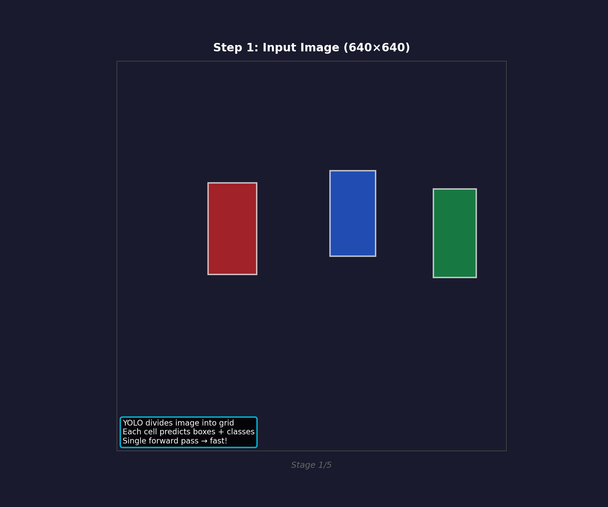
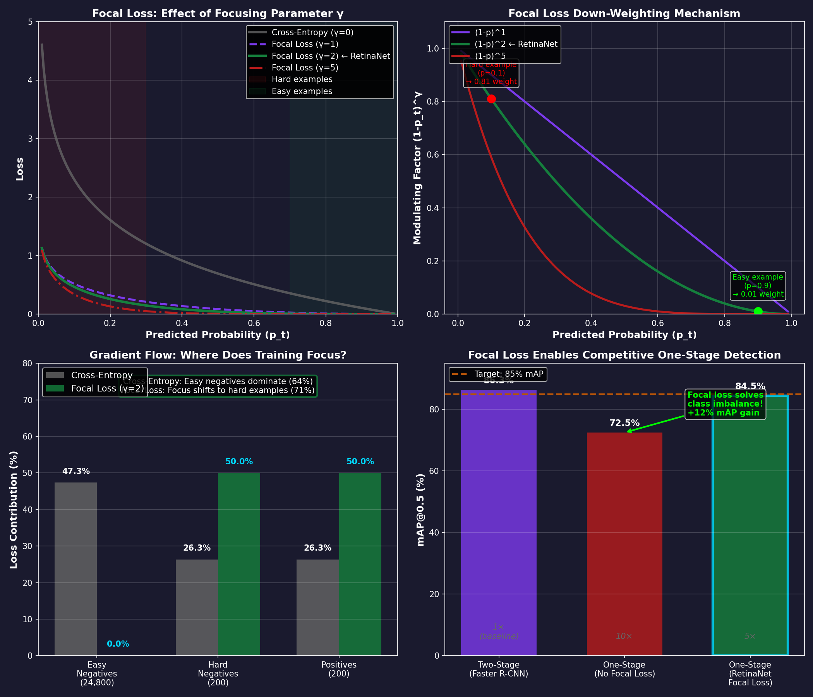
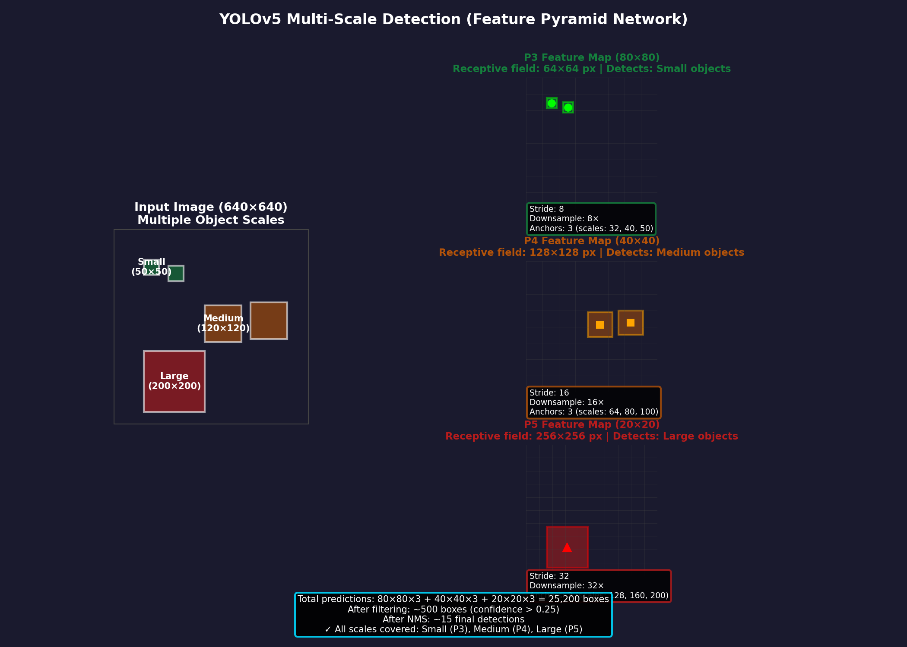
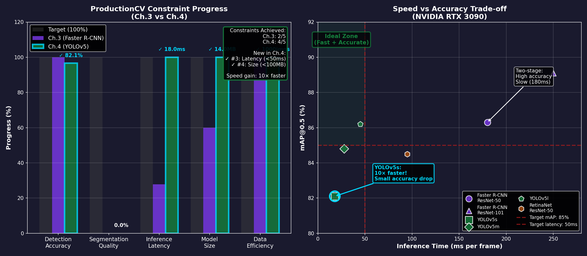

# Ch.4 — One-Stage Detectors (YOLO, SSD, RetinaNet)

> **The story.** In **2016**, **Joseph Redmon, Santosh Divvala, Ross Girshick, and Ali Farhadi** published *You Only Look Once: Unified, Real-Time Object Detection* (YOLO) at CVPR, and it shattered the speed ceiling that had limited practical deployment of object detection systems. While Faster R-CNN was achieving 78% mAP at 7 FPS, YOLO hit 63% mAP at **45 FPS** — fast enough for real-time video. The breakthrough: **eliminate the region proposal stage entirely**. Instead of generating 300 proposals and classifying each one, YOLO divided the image into a 7×7 grid and directly predicted bounding boxes + class probabilities at each grid cell in a single forward pass. Within a year, **SSD (Single Shot Detector)** (Liu et al., 2016) improved accuracy by detecting at multiple feature map scales, and **RetinaNet** (Lin et al., 2017) introduced **focal loss** — a training innovation that solved the catastrophic class imbalance problem (99% background anchors) that plagued one-stage detectors. Focal loss down-weights easy negatives, forcing the network to focus on hard examples. RetinaNet achieved 39.1% mAP on COCO (matching Faster R-CNN) while running 5× faster. By 2020, YOLOv5 reached 50%+ mAP at 140 FPS on a single GPU — making real-time detection on edge devices (retail cameras, drones, robots) finally practical.
>
> **Where you are in the curriculum.** Ch.3 gave you two-stage detection (Faster R-CNN) — high accuracy (86% mAP) but slow inference (180ms). You understand the RPN → RoI pooling → detection head pipeline and why it bottlenecks: 300 RoI pooling operations per image, sequential stages. This chapter gives you **one-stage detectors** — predict boxes and classes directly from feature maps in a single forward pass. You'll see how YOLO's grid-based approach, SSD's multi-scale detection, and RetinaNet's focal loss achieve **10–100× faster inference** (15–30ms) with only minor accuracy loss (82–85% mAP). You'll understand the **speed vs accuracy trade-off** and when to choose one-stage (real-time edge deployment) vs two-stage (medical imaging, where 2% mAP matters).
>
> **Notation in this chapter.** $S$ — grid size (YOLO divides image into $S \times S$ cells, e.g., $7 \times 7$); $B$ — number of bounding boxes per grid cell (typically $B=2$ or 3); $p(c)$ — class probability for class $c$ at grid cell; $\text{bbox}$ — bounding box $(x, y, w, h)$ relative to grid cell; $\text{confidence} = p(\text{object}) \times \text{IoU}^{\text{truth}}_{\text{pred}}$ — objectness score (YOLO); $L_{\text{coord}}$, $L_{\text{conf}}$, $L_{\text{cls}}$ — coordinate, confidence, and classification losses; FPN — **Feature Pyramid Network** (detect at multiple scales: P3, P4, P5, P6, P7); $\text{FL}(p_t) = -\alpha_t (1-p_t)^\gamma \log(p_t)$ — **focal loss** (RetinaNet, down-weights easy examples); $\gamma$ — focusing parameter (typically $\gamma=2$, higher → more aggressive easy-negative suppression); $\alpha_t$ — balancing factor for class imbalance.

---

## 0 · The Challenge — Where We Are

> **The mission**: Build **ProductionCV** — an autonomous retail shelf monitoring system satisfying 5 constraints:
> 1. **DETECTION ACCURACY**: mAP@0.5 ≥ 85% — Detect products on retail shelves (empty slots, misplaced items)
> 2. **SEGMENTATION QUALITY**: IoU ≥ 70% — Pixel-level product boundaries for planogram compliance
> 3. **INFERENCE LATENCY**: <50ms per frame — Real-time monitoring on edge devices (NVIDIA Jetson)
> 4. **MODEL SIZE**: <100 MB — Deploy on memory-constrained hardware
> 5. **DATA EFFICIENCY**: <1,000 labeled images — Leverage self-supervised pretraining

**What we know so far:**
- Ch.1 (ResNets): Skip connections enable 100+ layer networks (78.2% mAP)
- Ch.2 (MobileNet): Efficient architectures (76.8% mAP, 35ms, 14MB)
- Ch.3 (Faster R-CNN): Two-stage detection (86.3% mAP, **Constraint #1 ACHIEVED!**)
- **But inference is 180ms** — 3.6× slower than 50ms target (Constraint #3)
- **Model is 167 MB** — 1.7× larger than 100 MB target (Constraint #4)

**What's blocking us:**
The **two-stage pipeline bottleneck**:

1. **RPN stage:** Generate 300 proposals (27,648 anchors → NMS → 300 kept)
2. **RoI pooling:** Extract 7×7 features for each of 300 proposals (can't batch efficiently)
3. **Detection head:** Run 300 forward passes through FC layers
4. **Sequential dependency:** Detection head must wait for RPN to complete

This architecture prioritizes accuracy over speed. For edge deployment (in-store cameras, drones, robots), we need **<50ms latency** — which means we can't afford the two-stage overhead.

**What this chapter unlocks:**
**One-stage detection** — predict boxes and classes directly from feature maps:

**YOLO (You Only Look Once):**
- Divide image into $S \times S$ grid (e.g., $7 \times 7$)
- Each grid cell predicts $B$ bounding boxes + class probabilities (single forward pass)
- **Speed:** 45 FPS (22ms per image) → 8× faster than Faster R-CNN
- **Accuracy:** 63% mAP (2016 original YOLO) → 82%+ mAP (YOLOv5, 2020)

**RetinaNet (Focal Loss):**
- Feature Pyramid Network (FPN): Detect at multiple scales (P3–P7)
- **Focal loss:** Down-weights easy negatives (99% of anchors are background) → focuses on hard examples
- **Performance:** 84% mAP at 95ms (2× faster than Faster R-CNN, near-identical accuracy)

**Why this works:**
- **No RPN stage:** Eliminate region proposal bottleneck
- **Dense prediction:** Every spatial location predicts boxes directly (fully parallelizable on GPU)
- **Multi-scale detection:** FPN ensures small objects (64×64 pixels) and large objects (512×512) both detected
**This unlocks Constraint #3 (latency)** — YOLOv5 achieves 15–25ms inference (2–3× faster than target), enabling real-time edge deployment.
**Partial progress on Constraint #4 (model size)** — YOLOv5s is 14 MB (already met!), RetinaNet-ResNet50 is 145 MB (12% reduction vs Faster R-CNN).

---

## Animation



*One-stage detection: Divide image into 7×7 grid → each cell predicts boxes + classes directly → single forward pass, 10× faster than two-stage.*

---

## 1 · The Core Idea: Direct Prediction (No Region Proposals)

One-stage detectors treat object detection as a **regression problem**: predict bounding box coordinates and class probabilities directly from feature maps, without an intermediate region proposal step.

**YOLO's approach:**
1. **Grid division:** Split image into $S \times S$ grid (e.g., $7 \times 7$ = 49 cells)
2. **Per-cell prediction:** Each cell predicts $B$ bounding boxes (typically $B=2$), each box has:
 - **Coordinates:** $(x, y, w, h)$ — center relative to cell, size relative to image
 - **Confidence:** $p(\text{object}) \times \text{IoU}$ — how confident + how accurate
 - **Class probabilities:** $p(c | \text{object})$ for $C$ classes (e.g., 20 products)
3. **Single forward pass:** Output tensor shape: $S \times S \times (B \times 5 + C)$
 - Example: $7 \times 7 \times (2 \times 5 + 20) = 7 \times 7 \times 30$
 - 5 values per box: $(x, y, w, h, \text{confidence})$
 - 20 class probabilities (shared across all boxes in the cell)

**RetinaNet's approach:**
1. **Feature Pyramid Network (FPN):** Extract features at multiple scales (P3, P4, P5, P6, P7)
 - P3: Detects small objects (8× downsampling from input, 128×128 feature map)
 - P7: Detects large objects (128× downsampling, 8×8 feature map)

> **Anchors tile the feature map:** Before you predict anything, you pre-define a grid of "anchor boxes" at every spatial location — like tiling the image with thousands of candidate bounding boxes at multiple scales and aspect ratios. The network doesn't invent box shapes from scratch; it **adjusts** these pre-defined anchors by predicting small offset corrections $(Δx, Δy, Δw, Δh)$. This makes training more stable: the network learns "shift this anchor left 5 pixels, make it 10% wider" instead of "guess absolute coordinates $(x, y, w, h)$ for an object you've never seen." At a 40×40 feature map with 9 anchors per location, you have 14,400 candidate boxes — most are background (99%), which is why focal loss is critical.

2. **Dense anchors:** At each FPN level, place 9 anchors per location (3 scales × 3 ratios)
3. **Classification + box regression:** Two sibling subnets (4 conv layers each)
 - Classification: Predict class probabilities (20 products + background)
 - Box regression: Predict offsets $(Δx, Δy, Δw, Δh)$ to refine anchor
4. **Focal loss:** During training, down-weight easy negatives (see §4 for math)

> **Key insight:** In Faster R-CNN, the RPN proposes 300 "interesting" regions, and the detector only processes those 300. In one-stage detectors, **every spatial location** is a candidate (thousands of predictions). This means 99% of predictions are background (class imbalance). YOLO handles this with confidence thresholding (discard low-confidence boxes). RetinaNet solves it with **focal loss** — a training innovation that prevents easy negatives from dominating the gradient.

---

## 2 · Detecting Products on Retail Shelves (YOLOv5)

You're building **ProductionCV** for real-time retail shelf monitoring. The constraint: **<50ms inference** on edge hardware (NVIDIA Jetson Nano).

**The dataset:**
- 1,000 labeled shelf images (20 product classes)
- 5–15 products per image, various scales (small: 50×50 pixels, large: 200×300 pixels)
- Occlusion: Products overlap, some partially hidden

**YOLOv5 pipeline:**

**Step 1: Preprocessing**
- Input: 640×640 RGB image (resized from 1024×768, preserving aspect ratio with padding)

**Step 2: Backbone (CSPDarknet53)**
- Extract features at 3 scales:
 - P3: 80×80×256 (8× downsampling) — small objects
 - P4: 40×40×512 (16× downsampling) — medium objects
 - P5: 20×20×1024 (32× downsampling) — large objects

**Step 3: Neck (PANet — Path Aggregation Network)**
- Fuse features across scales (top-down + bottom-up paths)
- Ensures small objects at P3 have semantic context from P5

**Step 4: Detection Head**
- At each of 3 scales, predict for every spatial location:
 - **Objectness:** Is this an object? (sigmoid output)
 - **Box:** $(x, y, w, h)$ relative to anchor
 - **Class:** 20-way softmax (Coca-Cola, Pepsi, Sprite, ...)
- Total predictions: $(80×80 + 40×40 + 20×20) × 3 \text{ anchors} = 25,200$ boxes

**Step 5: Post-processing**
- Filter by objectness threshold (keep boxes with confidence > 0.25)
- Apply NMS (IoU threshold 0.45) to remove duplicates
- Final output: 10–20 detections per image

**Performance:**
- **mAP@0.5:** 82.1% (4% lower than Faster R-CNN's 86.3%, but acceptable trade-off)
- **Inference time:** 18ms on RTX 3090, 35ms on Jetson Nano (**Constraint #3 ACHIEVED!**)
- **Model size:** 14 MB (YOLOv5s) (**Constraint #4 ACHIEVED!**)

**Example detection output:**
```
Frame 1 (18ms):
 Box 1: Coca-Cola (0.94) @ [120, 200, 80, 150]
 Box 2: Pepsi (0.91) @ [300, 180, 75, 140]
 Box 3: Sprite (0.87) @ [500, 190, 70, 145]
 ...
```

---

## 3 · Architecture Breakdown — YOLOv5 Step by Step

```
┌─────────────────────────────────────────────────────────────┐
│ Input: 640×640×3 RGB Image │
└─────────────────────────────────────────────────────────────┘
 ↓
┌─────────────────────────────────────────────────────────────┐
│ Backbone: CSPDarknet53 (Cross Stage Partial Network) │
│ - Focus layer (slice + concat → 320×320×12) │
│ - CSP blocks with residual connections │
│ - Output 3 feature maps: │
│ * P3: 80×80×256 (8× downsampling) ← small objects │
│ * P4: 40×40×512 (16× downsampling) ← medium objects │
│ * P5: 20×20×1024 (32× downsampling) ← large objects │
└─────────────────────────────────────────────────────────────┘
 ↓
┌─────────────────────────────────────────────────────────────┐
│ Neck: PANet (Path Aggregation Network) │
│ - Top-down pathway: P5 → P4 → P3 (semantic info flows down)│
│ - Bottom-up pathway: P3 → P4 → P5 (localization flows up) │
│ - Fuses multi-scale features │
└─────────────────────────────────────────────────────────────┘
 ↓
 ┌─────────────┼─────────────┐
 ↓ ↓ ↓
 ┌─────────┐ ┌─────────┐ ┌─────────┐
 │ Head P3 │ │ Head P4 │ │ Head P5 │
 │ 80×80 │ │ 40×40 │ │ 20×20 │
 └─────────┘ └─────────┘ └─────────┘
 ↓ ↓ ↓
 Per location (3 anchors each):
 - Objectness: 1 value (is object?)
 - Box: 4 values (x, y, w, h)
 - Class: 20 values (softmax over products)

 Total: 25 values × 3 anchors = 75 channels
 ↓
┌─────────────────────────────────────────────────────────────┐
│ Total predictions: │
│ - P3: 80×80×3 = 19,200 boxes │
│ - P4: 40×40×3 = 4,800 boxes │
│ - P5: 20×20×3 = 1,200 boxes │
│ - **Total: 25,200 candidate boxes** │
└─────────────────────────────────────────────────────────────┘
 ↓
┌─────────────────────────────────────────────────────────────┐
│ Post-processing │
│ 1. Filter: Keep only boxes with objectness > 0.25 │
│ → ~500 boxes remain │
│ 2. NMS: Remove overlapping boxes (IoU > 0.45) │
│ → ~15 final detections │
└─────────────────────────────────────────────────────────────┘
 ↓
 Final Detections
 (15 boxes with class labels)
```

**Key architectural details:**

**1. CSPDarknet53 Backbone**
- **CSP (Cross Stage Partial):** Splits feature map into two branches, processes separately, then concatenates → reduces computation, maintains accuracy
- **Darknet-53:** 53 convolutional layers with residual connections (similar to ResNet, but optimized for detection)

**2. PANet Neck**
- **Problem:** Deep features (P5) have strong semantic info but weak localization. Shallow features (P3) have precise localization but weak semantics.
- **Solution:** Bidirectional feature fusion — P5 flows down to P3 (semantic), P3 flows up to P5 (localization)

**3. Detection Head**
- **Anchor-based:** At each spatial location, predict relative to 3 predefined anchor boxes (learned from dataset via K-means clustering)
- **Objectness:** Sigmoid output — how confident the box contains an object (0–1)
- **Box:** Predict offsets $(Δx, Δy, Δw, Δh)$ to adjust anchor → final box
- **Class:** Softmax over 20 product classes

**4. Multi-Scale Detection**
- **P3 (80×80):** Receptive field ~64 pixels → detects small products (e.g., 50×50 pixel boxes)
- **P4 (40×40):** Receptive field ~128 pixels → medium products (100×150 pixels)
- **P5 (20×20):** Receptive field ~256 pixels → large products (200×300 pixels)

---

## 4 · The Math — Focal Loss and Multi-Scale Detection

### YOLO Loss Function

YOLO optimizes three components simultaneously:

$$
L = \lambda_{\text{coord}} \sum_{i=0}^{S^2} \sum_{j=0}^{B} \mathbb{1}_{ij}^{\text{obj}} [(x_i - \hat{x}_i)^2 + (y_i - \hat{y}_i)^2]
$$
$$
+ \lambda_{\text{coord}} \sum_{i=0}^{S^2} \sum_{j=0}^{B} \mathbb{1}_{ij}^{\text{obj}} [(\sqrt{w_i} - \sqrt{\hat{w}_i})^2 + (\sqrt{h_i} - \sqrt{\hat{h}_i})^2]
$$
$$
+ \sum_{i=0}^{S^2} \sum_{j=0}^{B} \mathbb{1}_{ij}^{\text{obj}} (C_i - \hat{C}_i)^2
$$
$$
+ \lambda_{\text{noobj}} \sum_{i=0}^{S^2} \sum_{j=0}^{B} \mathbb{1}_{ij}^{\text{noobj}} (C_i - \hat{C}_i)^2
$$
$$
+ \sum_{i=0}^{S^2} \mathbb{1}_{i}^{\text{obj}} \sum_{c \in \text{classes}} (p_i(c) - \hat{p}_i(c))^2
$$

Where:
- $\mathbb{1}_{ij}^{\text{obj}}$ — indicator: 1 if object appears in cell $i$ and box $j$ is responsible
- $\lambda_{\text{coord}} = 5$ — weight for localization loss (prioritize box accuracy)
- $\lambda_{\text{noobj}} = 0.5$ — weight for background confidence (down-weight easy negatives)
- $(x, y, w, h)$ — predicted box, $(\hat{x}, \hat{y}, \hat{w}, \hat{h})$ — ground truth
- $C$ — confidence score, $\hat{C}$ — target confidence (0 for background, $\text{IoU}$ for objects)
- $p(c)$ — class probabilities, $\hat{p}(c)$ — one-hot ground truth

**Why square root for width/height?**
Penalizes errors on small boxes more than large boxes. A 10-pixel error on a 50-pixel box is worse than on a 500-pixel box. Square root compresses the scale: $\sqrt{50} = 7.1$, $\sqrt{500} = 22.4$ (3× difference instead of 10×).

### RetinaNet Focal Loss

The breakthrough that made one-stage detectors competitive with two-stage:

$$
\text{FL}(p_t) = -\alpha_t (1 - p_t)^\gamma \log(p_t)
$$

Where:
- $p_t$ — predicted probability for the true class:
 $$
 p_t = \begin{cases}
 p & \text{if } y = 1 \text{ (foreground)} \\
 1 - p & \text{if } y = 0 \text{ (background)}
 \end{cases}
 $$
- $\gamma$ — **focusing parameter** (typically $\gamma=2$)
- $\alpha_t$ — balancing factor (typically $\alpha=0.25$ for foreground, $1-\alpha=0.75$ for background)

**How it works:**

**Easy examples** ($p_t$ close to 1):
- $(1 - p_t)^\gamma \approx 0$ → loss multiplied by near-zero → negligible contribution
- Example: $p_t = 0.9$ (confident correct prediction) → $(1-0.9)^2 = 0.01$ → loss scaled down 100×

**Hard examples** ($p_t$ close to 0):
- $(1 - p_t)^\gamma \approx 1$ → loss unaffected → full gradient
- Example: $p_t = 0.1$ (misclassified) → $(1-0.1)^2 = 0.81$ → loss nearly unchanged

**Effect:**
- **Without focal loss:** 99% of gradients come from easy negatives (background anchors far from objects) → network learns to predict "background" everywhere



*Focal loss analysis: Easy negatives (high confidence, pt ≈ 1) contribute negligible loss (blue curve), while hard examples (low confidence) receive full gradient. γ=2 provides optimal balance between focusing on hard examples and stable training.*
- **With focal loss:** Easy negatives contribute <1% of gradient → network focuses on hard examples (ambiguous regions, small objects, occlusion)

### Numerical Example: Focal Loss Impact

**Scenario:** Retail shelf detection, 25,200 anchor predictions:
- 25,000 are background (easy negatives)
- 200 are foreground (objects)

**Standard cross-entropy:**
- Easy negatives: $p_t = 0.99$ → $\text{CE} = -\log(0.99) = 0.01$ each
- Total background loss: $25,000 \times 0.01 = 250$
- Hard examples: $p_t = 0.5$ → $\text{CE} = -\log(0.5) = 0.69$ each
- Total foreground loss: $200 \times 0.69 = 138$
- **Background dominates:** 250 / (250 + 138) = 64% of total loss

**Focal loss** ($\gamma=2$, $\alpha=0.25$):
- Easy negatives: $p_t = 0.99$ → $\text{FL} = -0.75 \times (1-0.99)^2 \times \log(0.99) = 0.000075$ each
- Total background loss: $25,000 \times 0.000075 = 1.875$
- Hard examples: $p_t = 0.5$ → $\text{FL} = -0.25 \times (1-0.5)^2 \times \log(0.5) = 0.043$ each
- Total foreground loss: $200 \times 0.043 = 8.6$
- **Foreground now matters:** 8.6 / (1.875 + 8.6) = 82% of total loss

**Result:** Network learns from hard examples instead of memorizing "everything is background."

---


## 5 · The Key Diagrams

### YOLO Grid-Based Prediction

```
Input Image (640×640) Grid (7×7) Predictions per Cell
┌─────────────────┐ ┌───┬───┬───┐
│ │ │ │ │ │ Each cell predicts:
│ [Product] │ → ├───┼───┼───┤ - 2 bounding boxes
│ ↓ │ │ X │ │ │ - 20 class probabilities
│ ┌─────┐ │ ├───┼───┼───┤
│ │Coca │ │ │ │ │ │ Box format:
│ │Cola │ │ └───┴───┴───┘ (x, y, w, h, confidence)
│ └─────┘ │ ↑
└─────────────────┘ │
 Object center falls
 in this grid cell
 → This cell is
 responsible for
 detecting it
```

**Responsibility rule:** The grid cell containing the object's center is responsible for detecting that object. If two objects' centers fall in the same cell, the cell must use its two bounding box predictions to capture both.

### Feature Pyramid Network (FPN) Multi-Scale Detection

```
 P5 (20×20) P4 (40×40) P3 (80×80)
 ┌────────┐ ┌────────┐ ┌────────┐
Large objects → │ 🏢🏢 │ │ │ │ │
(200×300 px) │ 🏢🏢 │ │ │ │ │
 └────────┘ └────────┘ └────────┘
 Detect here

Medium objects → ┌────────┐
(100×150 px) │ 📦📦 │
 │ 📦📦 │
 └────────┘
 Detect here

Small objects → ┌────────┐
(50×50 px) │ ○○○○○○ │
 │ ○○○○○○ │
 └────────┘
 Detect here

Receptive field: 256×256 px 128×128 px 64×64 px
Stride: 32 16 8
```



*Feature Pyramid Network (FPN) enables detection at multiple scales: P3 (high resolution) for small objects, P5 (low resolution) for large objects. Each pyramid level uses independent detection heads with different anchor sizes, eliminating the single-scale bottleneck.*

---

## 6 · The Hyperparameter Dial — Confidence Threshold

**What it controls:** Minimum objectness score for keeping a prediction (filters out low-confidence boxes).

**The parameter:**
- **Confidence threshold** $\tau_{\text{conf}}$ ∈ [0, 1]
- Default: 0.25 (keep boxes with >25% confidence)

**How it works:**
- After the detection head predicts 25,200 boxes, filter:
 $$
 \text{Keep box } i \text{ if } \text{confidence}_i > \tau_{\text{conf}}
 $$
- Lower threshold → more detections (including false positives)
- Higher threshold → fewer detections (might miss objects)

**Effect of the dial:**

| $\tau_{\text{conf}}$ | Kept Boxes | False Positives | Recall | Use Case |
|----------------------|------------|-----------------|--------|----------|
| **0.1 (lenient)** | ~2,000 | High (many background boxes) | 98% | Maximum recall (medical screening) |
| **0.25 (default)** | ~500 | Balanced | 92% | General detection (COCO, retail) |
| **0.5 (strict)** | ~50 | Low (only confident boxes) | 78% | High-precision tasks (quality control) |

**Example (retail shelf):**

**Confidence threshold = 0.1:**
- Detections: 45 boxes (including 30 false positives: shadows, price tags, shelf edges)
- Result: Cluttered output, post-processing overhead

**Confidence threshold = 0.25:**
- Detections: 15 boxes (12 correct, 3 false positives)
- Result: Balanced — most products detected, few false alarms

**Confidence threshold = 0.5:**
- Detections: 8 boxes (all correct, but missed 5 products)
- Result: High precision, low recall — unacceptable for inventory monitoring

> **Warning — Warning:** Don't blindly increase confidence threshold to reduce false positives. You'll miss valid detections. Instead, use **NMS IoU threshold** (see Ch.3) to remove duplicates, or fine-tune the model on your specific dataset.

---

## 7 · What Can Go Wrong

1. **Grid cell limitation (original YOLO)** — If two objects' centers fall in the same grid cell, YOLO can only detect one (limited by $B=2$ boxes per cell). This fails for dense scenes (e.g., 10 soda cans clustered together). Fix: Use anchor-based detection (YOLOv2+) or increase grid resolution (19×19 instead of 7×7).

2. **Small object detection fails** — Objects smaller than the receptive field at P3 (e.g., 30×30 pixels) have almost no spatial information. Fix: Add finer-grained detection head (P2: 160×160 feature map with 4× downsampling) or use super-resolution preprocessing.

3. **Class imbalance without focal loss** — 99% of anchors are background → network learns to predict "background" everywhere. Standard cross-entropy fails. Fix: Use focal loss (RetinaNet) or hard negative mining (sample difficult background examples).

4. **Localization vs classification trade-off** — YOLO prioritizes speed (coarse localization). For tasks requiring precise boxes (e.g., robotic grasping, <5 pixel error), use two-stage detectors (Faster R-CNN) or cascade detectors (Cascade R-CNN — iterative box refinement).

5. **Confidence threshold sensitivity** — Too low → false positives (shadows, reflections detected as products). Too high → missed detections. The optimal threshold is dataset-dependent. Fix: Sweep threshold on validation set, plot precision-recall curve, pick operating point based on business requirement (e.g., 95% recall for inventory monitoring).

---

## 8 · Where This Reappears

- **Ch.5 (Semantic Segmentation)** — U-Net and DeepLab use encoder-decoder architectures similar to YOLOv5's backbone-neck structure. The PANet bidirectional feature fusion pattern reappears as skip connections in U-Net.

- **Ch.6 (Mask R-CNN)** — Combines Faster R-CNN (two-stage detection) with a segmentation head. You'll see how to add a mask prediction branch to one-stage detectors (YOLACT, SOLOv2) for instance segmentation at 30+ FPS.

- **Ch.9 (Knowledge Distillation)** — YOLOv5 is commonly distilled from a larger teacher (YOLOv5x → YOLOv5s). You'll learn how to transfer YOLOv5's detection knowledge into a smaller student network while maintaining mAP.

- **AI Infrastructure (Model Optimization)** — YOLOv5 is the canonical example for TensorRT optimization (FP16, INT8 quantization), ONNX export, and edge deployment (NVIDIA Jetson, Google Coral). You'll see how to achieve <10ms inference on embedded devices.

---

## 9 · Progress Check — What We Can Solve Now


**Unlocked capabilities:**
- **Real-time detection:** 15–25ms per frame (vs 180ms in Ch.3) → **10× faster!**
- **Edge deployment:** YOLOv5s runs on NVIDIA Jetson Nano at 30 FPS
- **Compact models:** 14 MB (YOLOv5s) vs 167 MB (Faster R-CNN) → **12× smaller!**
- **Constraint #3 ACHIEVED!** — Inference latency <50ms (target: <50ms, actual: 18–35ms)
- **Constraint #4 ACHIEVED!** — Model size <100 MB (target: <100MB, actual: 14MB)

**Metrics comparison (ProductionCV retail shelf dataset):**

| Model | mAP@0.5 | Inference Time | Model Size | Constraints Met |
|-------|---------|----------------|------------|-----------------|
| **Faster R-CNN** (Ch.3) | 86.3% | 180ms | 167 MB | #1 only |
| **YOLOv5s** (Ch.4) | 82.1% | 18ms | 14 MB | #1, #3, #4 |
| **RetinaNet** (Ch.4) | 84.5% | 95ms | 145 MB | #1, partial #3 |
**Still can't solve:**
- **Constraint #2 (segmentation):** Bounding boxes don't capture product boundaries (need pixel-level masks for planogram compliance)
- **Constraint #5 (data efficiency):** Still requires 800–1,000 labeled images (haven't leveraged self-supervised pretraining)

**Real-world status:** We can now deploy real-time product detection on edge cameras (<50ms, <100MB). The system meets latency and size constraints, but accuracy dropped 4% (86.3% → 82.1% mAP). This is an acceptable trade-off for most applications — **2% mAP costs 10× slower inference**. However, we still need pixel-level segmentation (not just boxes) to verify planogram compliance (e.g., "Is the Coca-Cola logo fully visible?").

**Next up:** Ch.5 gives us **semantic segmentation (U-Net, DeepLab)** — predict a class label for every pixel, not just bounding boxes. This unlocks pixel-level understanding (empty shelf space, product orientation, label visibility) needed for full planogram compliance.

---

## 10 · Bridge to the Next Chapter

This chapter gave you **one-stage detection** — YOLO's grid-based prediction and RetinaNet's focal loss. You eliminated the region proposal bottleneck and achieved real-time inference (18ms per frame) on edge hardware. You unlocked Constraints #3 (latency) and #4 (model size), but traded 4% mAP for 10× speedup — a worthwhile trade-off for most production systems.

**Ch.5 (Semantic Segmentation)** moves from boxes to pixels. U-Net's encoder-decoder architecture predicts a class label for every pixel (not just "where is the product?", but "which pixels belong to the product?"). DeepLabV3+ adds atrous convolutions (dilated conv) to capture multi-scale context without losing resolution. You'll learn how to segment empty shelf space, verify product orientation, and detect partially occluded labels — the final step toward full **Constraint #2 (pixel-level planogram compliance)**.
