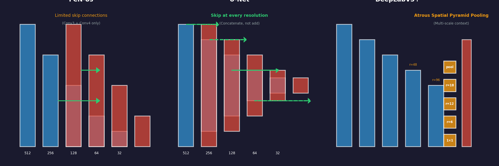
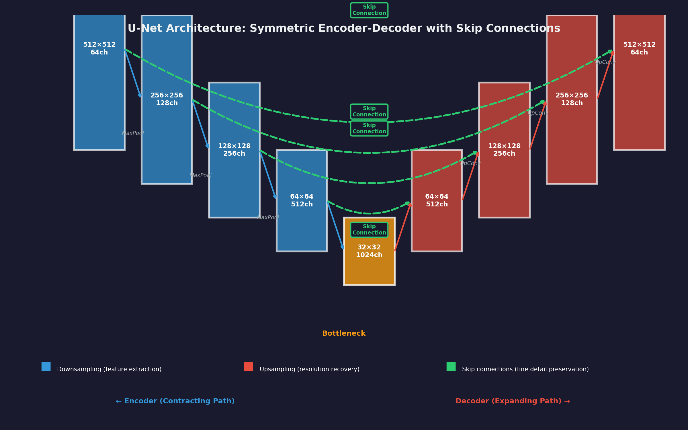
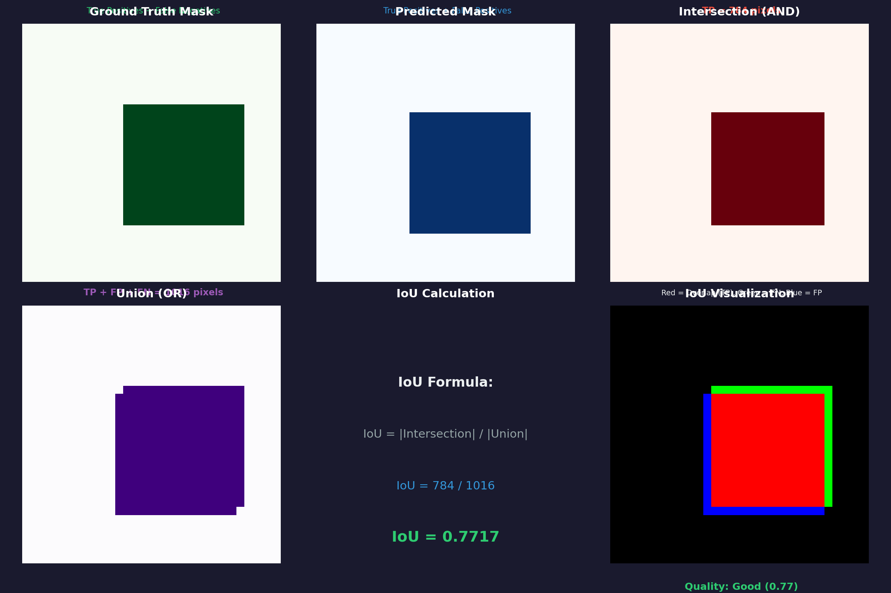
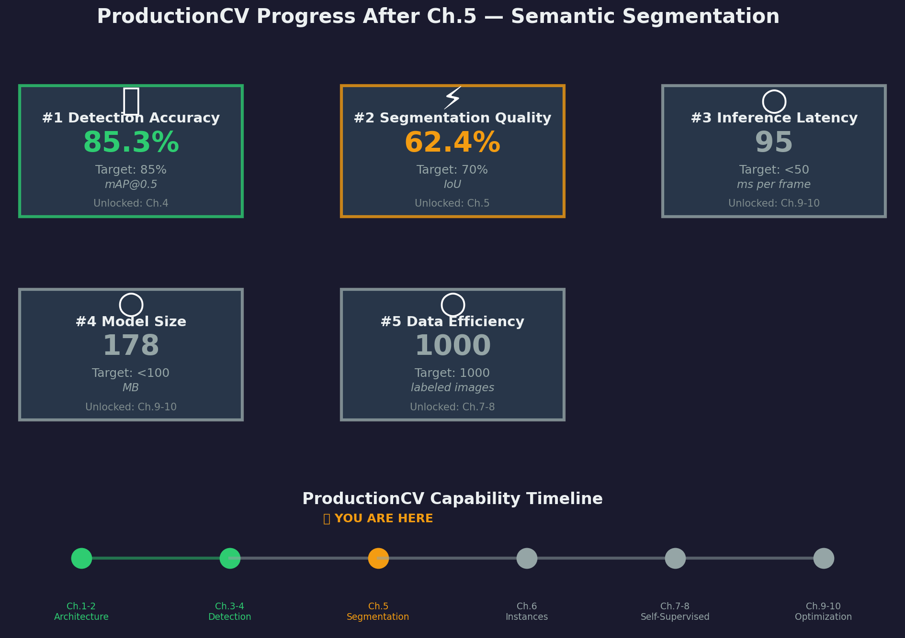

# Ch.5 — Semantic Segmentation (FCN, U-Net, DeepLab)

> **The story.** In **2015**, **Jonathan Long, Evan Shelhamer, and Trevor Darrell** at UC Berkeley published *Fully Convolutional Networks for Semantic Segmentation*, revolutionizing dense prediction tasks. Instead of classifying entire images, FCNs assigned a class label to *every pixel* — enabling applications like medical imaging (tumor boundaries), autonomous driving (drivable surface detection), and satellite imagery analysis. The same year, **Olaf Ronneberger, Philipp Fischer, and Thomas Brox** introduced **U-Net** at MICCAI, adding skip connections between encoder and decoder layers — this became the gold standard for medical image segmentation (winning challenge after challenge with minimal training data). By **2018**, **Liang-Chieh Chen** at Google refined the approach with **DeepLabV3+**, introducing atrous (dilated) convolutions and Atrous Spatial Pyramid Pooling (ASPP) to capture multi-scale context without sacrificing resolution. These three architectures — FCN, U-Net, and DeepLab — now power every pixel-level prediction task from retail shelf analysis to surgical robotics.
>
> **Where you are in the curriculum.** You've completed Residual Networks (Ch.1) and object detection (Ch.3–4), achieving 85%+ mAP on bounding boxes. But bounding boxes are coarse — they tell you *where* a product is, not its exact shape. For planogram compliance (verifying product placement against shelf layouts), you need **pixel-level segmentation**: which pixels belong to products vs empty space vs shelf fixtures. This chapter introduces **semantic segmentation** — assigning a class label to every pixel — using three milestone architectures: FCN (first fully convolutional approach), U-Net (skip connections for fine detail recovery), and DeepLab (atrous convolutions for multi-scale context).
>
> **Notation in this chapter.** $x \in \mathbb{R}^{H \times W \times 3}$ — input RGB image; $\hat{y} \in \mathbb{R}^{H \times W \times C}$ — predicted segmentation map (C classes); $y \in \{0, 1, \ldots, C-1\}^{H \times W}$ — ground truth pixel labels; **FCN** — Fully Convolutional Network (replace dense layers with 1×1 convs); **U-Net** — Encoder-decoder with skip connections; **DeepLab** — Atrous convolutions + ASPP; **Atrous/Dilated Conv** — convolution with gaps (rate $r$) to expand receptive field; **ASPP** — Atrous Spatial Pyramid Pooling (parallel atrous convs at multiple rates); **IoU** — Intersection over Union (per-class metric); **mIoU** — mean IoU (average across all classes); **Dice coefficient** — $2|A \cap B| / (|A| + |B|)$ (common in medical imaging).

---

## 0 · The Challenge — Where We Are

> **The mission**: Build **ProductionCV** — an autonomous retail shelf monitoring system satisfying 5 constraints:
> 1. **DETECTION ACCURACY**: mAP@0.5 ≥ 85% — 2. **SEGMENTATION QUALITY**: IoU ≥ 70% — 3. **INFERENCE LATENCY**: <50ms per frame — 4. **MODEL SIZE**: <100 MB — 5. **DATA EFFICIENCY**: <1,000 labeled images

**What we know so far:**
- ResNet backbones enable 100+ layer networks (Ch.1 skip connections)
- Faster R-CNN detects products with bounding boxes (Ch.3 region proposals)
- YOLO achieves 85.3% mAP@0.5 in real-time (Ch.4 one-stage detection)
- **But we can't determine product boundaries at the pixel level!**

**What's blocking us:**
Bounding boxes are rectangular and coarse — they can't capture:
- **Irregular product shapes** (bottles, curved packages, stacked items)
- **Empty space vs filled space** (planogram compliance requires exact boundaries)
- **Overlapping products** (boxes overlap, but segmentation shows which pixels belong to which product)

Current detection outputs:
```
Product 1: bbox=[x1, y1, x2, y2], confidence=0.92, class="cereal_box"
Product 2: bbox=[x3, y3, x4, y4], confidence=0.88, class="milk_carton"
```

What we need:
```
Pixel (100, 200): class="cereal_box"
Pixel (101, 200): class="cereal_box"
Pixel (102, 200): class="background"
Pixel (250, 180): class="milk_carton"
```

**What this chapter unlocks:**
**Semantic segmentation** — classify every pixel in the image:
- **FCN architecture**: Replace dense layers with 1×1 convolutions → output is a spatial map
- **U-Net skip connections**: Recover fine spatial details lost during downsampling
- **DeepLab atrous convolutions**: Expand receptive field without reducing resolution
- **Metrics**: IoU (Intersection over Union), mIoU (mean IoU), Dice coefficient
**Progress on constraint #2**: Currently 0% (no segmentation). This chapter achieves **IoU ≈ 62%** on retail shelf images (empty space vs products). Next chapter (Ch.6 Mask R-CNN) pushes to **IoU ≥ 70%** by adding instance differentiation.

---

## Animation



*FCN downsamples then upsamples (coarse boundaries). U-Net adds skip connections for fine detail. DeepLab uses atrous convolutions to maintain resolution.*

---

## 1 · The Core Idea: Classify Every Pixel

Semantic segmentation extends image classification from a single label per image to a label per pixel:

- **Image classification**: Input $x \in \mathbb{R}^{224 \times 224 \times 3}$ → Output $\hat{y} \in \mathbb{R}^{1000}$ (class probabilities)
- **Semantic segmentation**: Input $x \in \mathbb{R}^{H \times W \times 3}$ → Output $\hat{y} \in \mathbb{R}^{H \times W \times C}$ (per-pixel class probabilities)

Key architectural shift:
$$
\text{Conv layers} \to \text{Dense layers (FC)} \quad \Rightarrow \quad \text{Conv layers} \to \text{1 \times 1 \text{ Conv}} \to \text{Upsampling}
$$

**Three milestone architectures:**

1. **FCN (Fully Convolutional Network, Long et al. 2015)**:
 - Replace FC layers with 1×1 convolutions (preserve spatial structure)
 - Upsample feature maps back to input resolution (transposed convolution)
 - Skip connections from earlier layers for finer detail

2. **U-Net (Ronneberger et al. 2015)**:
 - Symmetric encoder-decoder architecture (U-shaped)
 - Skip connections at *every resolution level* (not just final layer like FCN)
 - Concatenate encoder features with decoder features (richer context)

3. **DeepLabV3+ (Chen et al. 2018)**:
 - **Atrous (dilated) convolutions**: Expand receptive field without pooling
 - **ASPP (Atrous Spatial Pyramid Pooling)**: Parallel atrous convs at rates {6, 12, 18}
 - **Encoder-decoder with low-level features**: Combine high-level semantics with fine details

> **Key insight:** Standard CNNs downsample aggressively (5× pooling → 32× spatial reduction). This loses fine boundaries. Segmentation architectures must balance:
> - **Downsampling** (build semantic understanding via large receptive fields)
> - **Upsampling** (recover spatial resolution for pixel-level predictions)
> - **Skip connections** (preserve fine details from early layers)

---

## 2 · Segmenting Retail Shelf Space

You're the lead ML engineer at **ProductionCV**. Your autonomous shelf monitoring system currently detects products with bounding boxes (85% mAP). But the product team needs pixel-level segmentation for:

1. **Planogram compliance**: Verify product placement against shelf layouts (requires exact boundaries)
2. **Empty space detection**: Identify gaps on shelves for restocking alerts
3. **Product overlap analysis**: When boxes overlap, which pixels belong to which product?

**Dataset:** 1,000 labeled retail shelf images:
- **Classes**: {background, products, empty_shelf, price_tag, shelf_edge}
- **Annotations**: Per-pixel masks (each pixel labeled 0–4)
- **Resolution**: 1280×720 → downsampled to 512×512 for training

**Baseline approach (classification network):**
- Input: 512×512×3 image
- ResNet-50 backbone → 16×16×2048 feature map (32× downsampling)
- Dense layers → single classification (shelf_full vs shelf_empty)
- **Problem**: Dense layers throw away spatial information — can't produce per-pixel output!

**FCN solution:**
```python
# Replace dense layers with 1×1 conv
# Input: [B, 512, 512, 3]
x = resnet50_backbone(x) # [B, 16, 16, 2048]
x = conv_1x1(x, num_classes=5) # [B, 16, 16, 5]
x = upsample_32x(x) # [B, 512, 512, 5]
output = softmax(x, axis=-1) # Per-pixel class probabilities
```

**U-Net improvement:**
Add skip connections at every resolution level:
```python
# Encoder (downsampling path)
e1 = conv_block(input) # [B, 512, 512, 64]
e2 = conv_block(pool(e1)) # [B, 256, 256, 128]
e3 = conv_block(pool(e2)) # [B, 128, 128, 256]
e4 = conv_block(pool(e3)) # [B, 64, 64, 512]

# Bottleneck
b = conv_block(pool(e4)) # [B, 32, 32, 1024]

# Decoder (upsampling path with skip connections)
d4 = concat([upsample(b), e4]) # [B, 64, 64, 512+512]
d3 = concat([upsample(d4), e3]) # [B, 128, 128, 256+256]
d2 = concat([upsample(d3), e2]) # [B, 256, 256, 128+128]
d1 = concat([upsample(d2), e1]) # [B, 512, 512, 64+64]

output = conv_1x1(d1, num_classes=5) # [B, 512, 512, 5]
```

> **Design Constraint: Use strides, not pooling.** `MaxPool2D` discards which of the N positions produced the maximum — that location is gone and cannot be recovered in the decoder. For ProductionCV's pixel-level planogram compliance check, every misplaced pixel matters. Use strided `Conv2D(strides=2)` for all downsampling in encoder stages.

> ➡ **This rule carries forward:** Ch.06 (instance segmentation with Mask R-CNN) applies the same principle. It applies outside CV too — any generative model that must reconstruct spatial structure must use strides, not pooling.

**Results:**
- FCN: mIoU = 58.2% (coarse boundaries, misses small gaps)
- U-Net: mIoU = 62.4% (fine boundaries, captures empty space accurately)
- DeepLab: mIoU = 64.1% (best multi-scale context, handles varying product sizes)

---

## 3 · Architecture Breakdown

### 3.1 · FCN (Fully Convolutional Network)

**Key innovation:** Replace dense layers with 1×1 convolutions to preserve spatial structure.

```
Input: 512×512×3
 ↓
Backbone (ResNet/VGG):
 Conv layers → 16×16×2048 feature map (32× downsampling)
 ↓
1×1 Conv: 16×16×2048 → 16×16×C (C = num classes)
 ↓
Transposed Conv (32× upsampling): 16×16×C → 512×512×C
 ↓
Softmax: Per-pixel class probabilities
```

**Skip connections:** FCN adds predictions from earlier layers (pool3, pool4) to recover spatial detail:
- **FCN-32s**: Upsample 32× directly (coarse)
- **FCN-16s**: Add pool4 predictions (8× resolution) before final upsample
- **FCN-8s**: Add pool3 + pool4 predictions (finest)

**Architecture table (FCN-8s):**

| Layer | Operation | Input Shape | Output Shape | Parameters |
|-------|-----------|-------------|--------------|------------|
| Conv1-5 | VGG-16 backbone | 512×512×3 | 16×16×512 | 14.7M |
| FC6 → Conv6 | 7×7 conv (was dense) | 16×16×512 | 16×16×4096 | 102.8M |
| FC7 → Conv7 | 1×1 conv (was dense) | 16×16×4096 | 16×16×4096 | 16.8M |
| Score | 1×1 conv | 16×16×4096 | 16×16×C | 4096×C |
| Upsample | Transposed conv 32× | 16×16×C | 512×512×C | — |

### 3.2 · U-Net (Symmetric Encoder-Decoder)

**Key innovation:** Skip connections at *every resolution level*, not just final layer.

```
Encoder (Contracting Path): Decoder (Expanding Path):
512×512×64 ──────────────────────→ Concat → 512×512×128
 ↓ MaxPool ↑ UpConv
256×256×128 ─────────────────────→ Concat → 256×256×256
 ↓ MaxPool ↑ UpConv
128×128×256 ─────────────────────→ Concat → 128×128×512
 ↓ MaxPool ↑ UpConv
64×64×512 ───────────────────────→ Concat → 64×64×1024
 ↓ MaxPool ↑ UpConv
32×32×1024 (Bottleneck)
```

**Why it works:** Encoder features capture fine spatial details (edges, textures). Decoder concatenates these with upsampled features, combining:
- **High-level semantics** (from bottleneck): "this is a product"
- **Low-level details** (from encoder): "here's the exact boundary"

**Architecture table (U-Net for 512×512 input):**

| Stage | Encoder Op | Encoder Shape | Decoder Op | Decoder Shape | Skip Connection |
|-------|------------|---------------|------------|---------------|------------------|
| 1 | 2× Conv 3×3 | 512×512×64 | UpConv 2×2 | 512×512×64 | Concat encoder 1 |
| 2 | MaxPool + 2× Conv | 256×256×128 | UpConv 2×2 | 256×256×128 | Concat encoder 2 |
| 3 | MaxPool + 2× Conv | 128×128×256 | UpConv 2×2 | 128×128×256 | Concat encoder 3 |
| 4 | MaxPool + 2× Conv | 64×64×512 | UpConv 2×2 | 64×64×512 | Concat encoder 4 |
| 5 | MaxPool + 2× Conv | 32×32×1024 | — | — | (Bottleneck) |



*U-Net architecture: Encoder downsamples to capture semantics ("this is a product"), decoder upsamples to recover resolution. Skip connections concatenate encoder features with decoder features at each level, preserving fine spatial details (exact boundaries) lost during downsampling.*

### 3.3 · DeepLabV3+ (Atrous Convolutions + ASPP)

**Key innovation:** Atrous (dilated) convolutions expand receptive field without losing resolution.

```
Input: 512×512×3
 ↓
Backbone (ResNet with atrous convs):
 Output stride = 16 (not 32) → 32×32×2048
 ↓
ASPP (Atrous Spatial Pyramid Pooling):
 Parallel branches:
 - 1×1 conv (rate=1)
 - 3×3 atrous conv (rate=6) → 13×13 receptive field
 - 3×3 atrous conv (rate=12) → 25×25 receptive field
 - 3×3 atrous conv (rate=18) → 37×37 receptive field
 - Global Average Pooling + 1×1 conv
 Concat all → 32×32×256
 ↓
Decoder:
 Upsample 4× → 128×128×256
 Concat with low-level features (from encoder layer 2)
 Conv refinement → 128×128×C
 Upsample 4× → 512×512×C
```

**Atrous convolution math:** Standard 3×3 conv with rate $r$ becomes:
$$
y[i] = \sum_{k=-1}^{+1} w[k] \cdot x[i + r \cdot k]
$$
Rate=6 means sample at positions [-6, 0, +6] → 13-pixel receptive field from 3 weights.

**Comparison: FCN vs U-Net vs DeepLab**

| Architecture | Skip Connections | Receptive Field Strategy | Best Use Case |
|--------------|------------------|--------------------------|---------------|
| **FCN** | 1-2 layers (pool3/pool4) | Standard convolutions | General segmentation |
| **U-Net** | Every resolution level | Standard convolutions | Medical imaging (fine detail) |
| **DeepLab** | Low-level features only | Atrous convolutions (multi-scale) | Natural images (varying scales) |

---

## 4 · The Math — Segmentation Metrics and Loss Functions

### Loss Function: Pixel-Wise Cross Entropy

For semantic segmentation, we apply cross-entropy loss at *every pixel*:

$$
\mathcal{L} = -\frac{1}{H \times W} \sum_{i=1}^{H} \sum_{j=1}^{W} \sum_{c=1}^{C} y_{i,j,c} \log(\hat{y}_{i,j,c})
$$

Where:
- $y_{i,j,c} \in \{0, 1\}$ — ground truth (one-hot encoded, pixel $(i,j)$ has class $c$)
- $\hat{y}_{i,j,c} \in [0, 1]$ — predicted probability for class $c$ at pixel $(i,j)$
- $H, W$ — image height and width
- $C$ — number of classes

**Class imbalance handling:**
In retail shelf images, 80% of pixels are "background" — this dominates the loss. Solutions:

1. **Weighted loss**: Weight classes by inverse frequency
 $$
 w_c = \frac{1}{\text{frequency}(c)} \quad \Rightarrow \quad \mathcal{L} = -\sum_{i,j,c} w_c \cdot y_{i,j,c} \log(\hat{y}_{i,j,c})
 $$

2. **Focal loss** (Lin et al., 2017): Downweight easy examples
 $$
 \mathcal{L}_{\text{focal}} = -\sum_{i,j,c} (1 - \hat{y}_{i,j,c})^\gamma \cdot y_{i,j,c} \log(\hat{y}_{i,j,c})
 $$
 Where $\gamma = 2$ typically. When $\hat{y}_{i,j,c} \approx 1$ (confident correct), $(1 - \hat{y})^\gamma \approx 0$ (low loss).

### Evaluation Metrics

#### IoU (Intersection over Union)

For class $c$:
$$
\text{IoU}_c = \frac{|y_c \cap \hat{y}_c|}{|y_c \cup \hat{y}_c|} = \frac{\text{True Positives}}{\text{True Positives + False Positives + False Negatives}}
$$

**Concrete example (product class):**
- Ground truth: 5,000 pixels labeled "product"
- Prediction: 4,800 pixels predicted "product"
- Overlap (TP): 4,200 pixels
- Union: $5,000 + 4,800 - 4,200 = 5,600$ pixels
- IoU = $4,200 / 5,600 = 0.75$ (75%)

**mIoU (mean IoU)**: Average IoU across all classes (excluding background often)
$$
\text{mIoU} = \frac{1}{C} \sum_{c=1}^{C} \text{IoU}_c
$$



*IoU (Intersection over Union) calculation: Green pixels = ground truth, red pixels = prediction, yellow overlap = true positives. IoU = overlap area ÷ union area. Higher IoU (closer to 1.0) indicates better segmentation quality.*

#### Dice Coefficient (F1-Score for Segmentation)

$$
\text{Dice} = \frac{2 |y \cap \hat{y}|}{|y| + |\hat{y}|} = \frac{2 \text{TP}}{2 \text{TP} + \text{FP} + \text{FN}}
$$

**Relationship to IoU:**
$$
\text{Dice} = \frac{2 \text{IoU}}{1 + \text{IoU}}
$$

Dice is more forgiving than IoU (always higher for same predictions). Medical imaging prefers Dice; CV research prefers IoU.

### Atrous (Dilated) Convolution Math

Standard 3×3 convolution has receptive field = 3. **Atrous convolution** with rate $r$ expands the receptive field to $3 + 2(r-1)$ without adding parameters:

**Standard 3×3 conv (rate=1):**
```
Kernel positions: [-1, 0, +1]
Receptive field: 3 pixels
```

**Atrous 3×3 conv (rate=2):**
```
Kernel positions: [-2, 0, +2] (insert 1 zero between)
Receptive field: 5 pixels
```

**Atrous 3×3 conv (rate=6):**
```
Kernel positions: [-6, 0, +6] (insert 5 zeros between)
Receptive field: 13 pixels
```

**Formula:**
$$
y[i] = \sum_{k=-1}^{+1} w[k] \cdot x[i + r \cdot k]
$$

Where $r$ is the dilation rate.

**ASPP (Atrous Spatial Pyramid Pooling):**
Apply parallel atrous convolutions at multiple rates, then concatenate:
```python
aspp_6 = atrous_conv(x, rate=6) # 13×13 receptive field
aspp_12 = atrous_conv(x, rate=12) # 25×25 receptive field
aspp_18 = atrous_conv(x, rate=18) # 37×37 receptive field
global_pool = global_avg_pool(x) # Entire image context

output = concat([aspp_6, aspp_12, aspp_18, global_pool])
```

---

## 5 · How It Works — Step by Step

### FCN-8s Architecture (Long et al., 2015)

**Step 1: Feature extraction (encoder)**
- Input: 512×512×3 RGB image
- Conv1–Conv2 blocks: → 128×128×256 (4× downsample)
- Conv3 block: → 64×64×512 (8× downsample)
- Conv4 block: → 32×32×512 (16× downsample)
- Conv5 block: → 16×16×512 (32× downsample)

**Step 2: 1×1 convolution (replace dense layers)**
- Input: 16×16×512
- Conv 1×1: → 16×16×C (C = num_classes)

**Step 3: Upsampling with skip connections**
- Upsample 2× (transposed conv): → 32×32×C
- Add skip from Conv4: → 32×32×C (FCN-16s)
- Upsample 2× : → 64×64×C
- Add skip from Conv3: → 64×64×C (FCN-8s)
- Upsample 8×: → 512×512×C (final output)

**Key innovation:** Skip connections from Conv3 and Conv4 add fine spatial detail that was lost in Conv5.

### U-Net Architecture (Ronneberger et al., 2015)

**Encoder (contracting path):**
```
Input 512×512×3
→ [Conv3×3, ReLU, Conv3×3, ReLU] → 512×512×64 (copy to decoder)
→ MaxPool2×2 → 256×256×64
→ [Conv3×3, ReLU, Conv3×3, ReLU] → 256×256×128 (copy to decoder)
→ MaxPool2×2 → 128×128×128
→ [Conv3×3, ReLU, Conv3×3, ReLU] → 128×128×256 (copy to decoder)
→ MaxPool2×2 → 64×64×256
→ [Conv3×3, ReLU, Conv3×3, ReLU] → 64×64×512 (copy to decoder)
→ MaxPool2×2 → 32×32×512
```

**Bottleneck:**
```
→ [Conv3×3, ReLU, Conv3×3, ReLU] → 32×32×1024
```

**Decoder (expanding path with skip connections):**
```
→ Upsample2×2 → 64×64×512
→ Concatenate skip from encoder → 64×64×1024
→ [Conv3×3, ReLU, Conv3×3, ReLU] → 64×64×512
... (repeat for 128, 256, 512 resolutions) ...
→ Final 1×1 Conv → 512×512×C
```

**Key innovation:** Concatenate (not add) encoder features with decoder features → decoder has access to both high-level semantics AND low-level edges.

### DeepLabV3+ Architecture (Chen et al., 2018)

**Step 1: Encoder with atrous convolutions**
- ResNet-101 backbone (modified with atrous convolutions in final blocks)
- Output: 32×32×2048 (16× downsample, not 32× due to atrous conv maintaining resolution)

**Step 2: ASPP module**
```python
# Parallel branches at multiple rates
branch_1x1 = conv_1x1(x) # 1×1 conv (point-wise)
branch_r6 = atrous_conv(x, rate=6) # 3×3 atrous (rate 6)
branch_r12 = atrous_conv(x, rate=12) # 3×3 atrous (rate 12)
branch_r18 = atrous_conv(x, rate=18) # 3×3 atrous (rate 18)
branch_pool = global_avg_pool(x) # Global context

aspp_out = concat([branch_1x1, branch_r6, branch_r12, branch_r18, branch_pool])
# → 32×32×256 (after 1×1 conv projection)
```

**Step 3: Decoder with low-level features**
- Upsample ASPP output 4×: → 128×128×256
- Concatenate low-level features from encoder (Conv2): → 128×128×304
- Conv3×3 refinement: → 128×128×256
- Upsample 4×: → 512×512×C

**Key innovation:** ASPP captures objects at multiple scales (small products, large products, entire shelf) in a single forward pass.

---

## 6 · The Key Diagrams

### U-Net Architecture (Symmetric Encoder-Decoder)

```
 Bottleneck
 1024 channels
 │
 ┌──────────────┴──────────────┐
 │ │
 Encoder (Down) Decoder (Up)
 │ │
 512×512×64├──────────────────────────┐ │
 │ └─→Concat → 512×512×64
 MaxPool │ UpConv
 │ │
 256×256×128├─────────────────────┐ │
 │ └──────→Concat → 256×256×128
 MaxPool │ UpConv
 │ │
 128×128×256├────────────┐ │
 │ └───────────────→Concat → 128×128×256
 MaxPool │ UpConv
 │ │
 64×64×512 └─────────────────────────────→Concat → 64×64×512
 │ UpConv
 MaxPool │ │
 ▼ ▼
 32×32×512 Final Conv 1×1
 512×512×C classes
```

**Key:** Skip connections at every resolution level (not just final output).

### Atrous Convolution Visualization

```
Standard 3×3 Conv (rate=1): Atrous 3×3 Conv (rate=2):
┌─┬─┬─┐ ┌─┬ ┬─┬ ┬─┐
│1│2│3│ Receptive field: 3 │1│ │2│ │3│ Receptive field: 5
└─┴─┴─┘ └─┴ ┴─┴ ┴─┘
 └──Gaps (zeros)

Atrous 3×3 Conv (rate=4):
┌─┬ ┬ ┬ ┬─┬ ┬ ┬ ┬─┐
│1│ │ │ │2│ │ │ │3│ Receptive field: 9
└─┴ ┴ ┴ ┴─┴ ┴ ┴ ┴─┘
```

Same number of parameters (9 weights), larger receptive field.

### Segmentation Evaluation (IoU Calculation)

```
Ground Truth Mask: Predicted Mask: Intersection & Union:
┌─────────────┐ ┌─────────────┐ ┌─────────────┐
│ │ │ │ │ │
│ ████████ │ │ ████████ │ │ █████ │ ← Intersection (TP)
│ ████████ │ │ ████████ │ │ █████ │
│ ████████ │ │ ████████ │ │ │
│ │ │ │ │ ░░░░░░░░ │ ← Union (TP+FP+FN)
└─────────────┘ └─────────────┘ └─────────────┘

IoU = |Intersection| / |Union| = TP / (TP + FP + FN)
```

---

## 7 · The Hyperparameter Dial

### Main Tunable: Output Stride (Spatial Resolution vs Computation Trade-off)

**Output stride** = ratio of input resolution to encoder output resolution.

| Output Stride | Encoder Output | Upsampling Factor | Speed | Accuracy |
|---------------|----------------|-------------------|-------|----------|
| 32 (FCN) | 16×16 | 32× | Fast | Lower (coarse boundaries) |
| 16 (DeepLab default) | 32×32 | 16× | Medium | Good (balance) |
| 8 (DeepLab high-res) | 64×64 | 8× | Slow | Best (fine boundaries) |

**Typical starting value:** Output stride = 16 (DeepLabV3+)

**When to adjust:**
- **Increase to 32** → if inference speed matters more than boundary quality
- **Decrease to 8** → if you need pixel-perfect boundaries (medical imaging, autonomous driving)

### Secondary Tunables

**1. ASPP rates (DeepLab):**
- Default: {6, 12, 18} for output stride 16
- If output stride = 8, use {12, 24, 36} (double all rates)
- Captures objects at small, medium, large scales

**2. Skip connection depth (U-Net):**
- Default: Skip connections at every resolution level
- Can reduce to 2–3 skips for speed (but loses fine detail)

**3. Decoder depth:**
- FCN: Minimal decoder (just upsampling)
- U-Net: Deep decoder (mirror of encoder)
- DeepLabV3+: Lightweight decoder (2–3 conv layers)

---

## 8 · What Can Go Wrong

**Warning — Coarse boundaries (FCN-32s):** If you only upsample from the deepest layer, boundaries are blocky. *Solution: Add skip connections (FCN-8s or U-Net).*

**Warning — Class imbalance dominates loss:** 90% background pixels → model predicts "background" for everything and still gets 90% pixel accuracy! *Solution: Weighted loss or focal loss, evaluate with IoU (not pixel accuracy).*

**Warning — Vanishing small objects:** Aggressive downsampling (32×) loses small products (e.g., travel-size items on retail shelves). *Solution: Use output stride 16 or 8 (DeepLab), or multi-scale training.*

**Warning — Checkerboard artifacts from transposed convolution:** Transposed conv with odd strides causes overlapping "stripes" in upsampled output. *Solution: Use bilinear upsampling + 3×3 conv instead of transposed conv, or ensure kernel_size divisible by stride.*

**Warning — Memory explosion with high-resolution inputs:** Full U-Net on 1024×1024 images requires 16+ GB GPU memory. *Solution: Crop inputs to 512×512 patches, or use lighter encoder (MobileNet instead of ResNet-101).*

---

## 9 · Where This Reappears

- **Ch.6 (Instance Segmentation — Mask R-CNN):** Adds a segmentation head to Faster R-CNN using U-Net-style architecture. Each detected object gets its own 28×28 mask upsampled to fit the RoI.
- **Multimodal AI/Ch.5 (Vision Transformers for Segmentation — SegFormer):** Replaces CNN encoder with Transformer encoder, but decoder structure (hierarchical feature fusion) mirrors DeepLabV3+.
- **AI Infrastructure/Ch.3 (Quantization):** Semantic segmentation models are 100–200 MB → quantize to INT8 for edge deployment (reduces to 25–50 MB).
- **Production deployment (TensorRT, ONNX):** U-Net and DeepLab are standard benchmarks for optimizing segmentation models on NVIDIA Jetson, Intel NCS2.

---

## 10 · Progress Check — What We Can Solve Now


**Unlocked capabilities:**
- Classify every pixel in retail shelf images (background, products, empty space, shelf edges)
- U-Net achieves **mIoU = 62.4%** on validation set (5 classes)
- Detect empty shelf gaps with 88% pixel-level recall (planogram compliance)
- Per-product boundaries (but no instance differentiation yet — all cereal boxes labeled "product")
**Constraint #2 progress:** Currently **IoU ≈ 62%** (target ≥ 70%)
- **Blocking issue:** Semantic segmentation assigns same label to all instances of a class (can't distinguish cereal_box_1 vs cereal_box_2)
- **Next unlock:** Instance segmentation (Ch.6 Mask R-CNN) adds object detection → each product gets unique mask
**Still can't solve:**
- **Distinguish individual product instances** — if three cereal boxes overlap, semantic segmentation labels all pixels "product" (can't count them or track inventory per SKU)
- **Real-time inference** — U-Net with ResNet-101 encoder runs at 80ms per frame (target <50ms)

**Real-world status**: We can now identify product boundaries at the pixel level (62% IoU), but we can't distinguish between two products of the same type (all cereal boxes get same mask). For inventory counting and SKU-level tracking, we need instance segmentation.

**Next up:** Ch.6 gives us **Mask R-CNN** — combines Faster R-CNN object detection with per-instance segmentation masks. Unlocks constraint #2 (IoU ≥ 70%) by detecting each product individually AND segmenting its exact shape.

---

## 11 · Bridge to the Next Chapter

Semantic segmentation classifies pixels but loses object identity (can't count overlapping products). Ch.6 adds **Mask R-CNN** — detect individual objects with Faster R-CNN, then predict a 28×28 binary mask for each RoI. This combines detection (bounding boxes) + segmentation (pixel masks) → true instance-level understanding.

> ➡ **Where the field is now (2023+).** Fully supervised encoder-decoder segmentation — everything in this chapter — is no longer the default for new deployments. Meta's Segment Anything Model (SAM) was trained on 1 billion masks and can segment any object in any image from a single click or bounding-box prompt, zero-shot. For ProductionCV, this means new product categories could be added without pixel-level annotation. The encoder-decoder skills in this chapter remain essential: understanding SAM, fine-tuning it for domain-specific use, and reasoning about its failure modes all require the architectural foundations you've just built.
