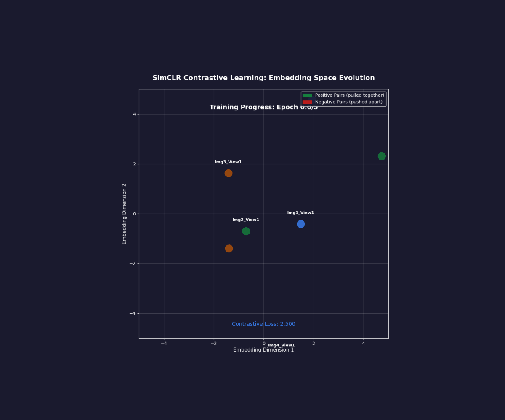
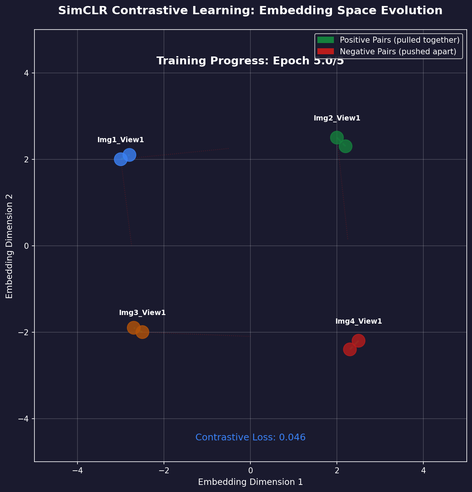
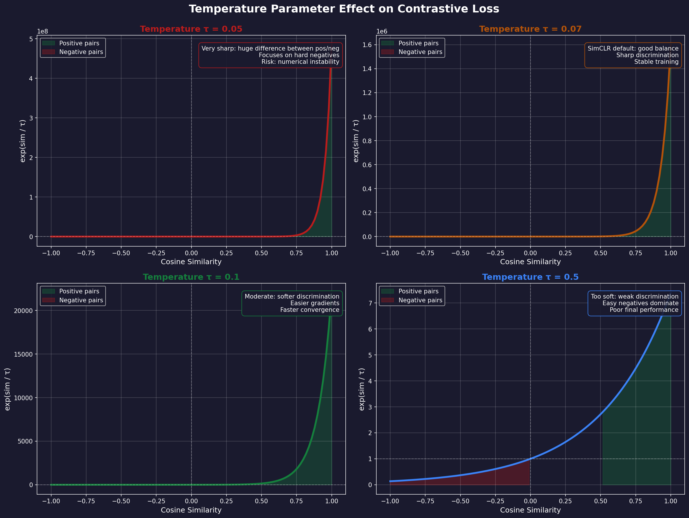
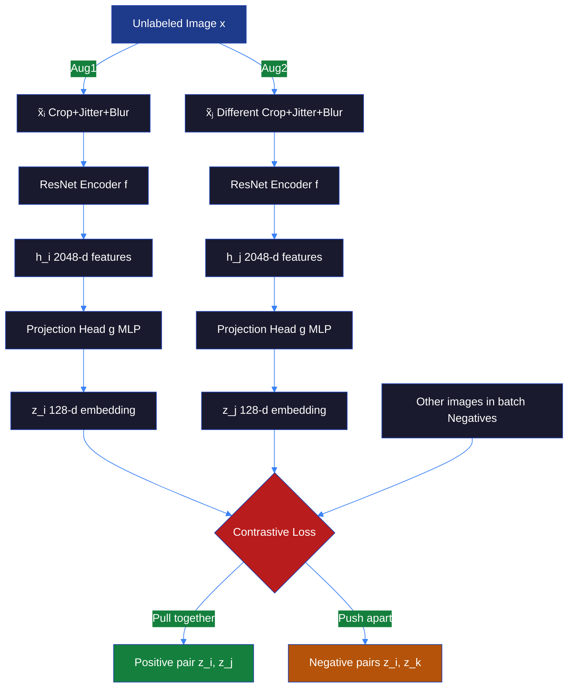
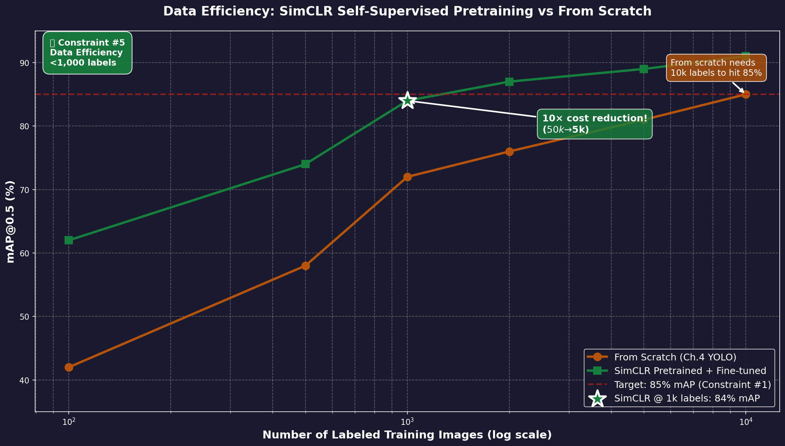
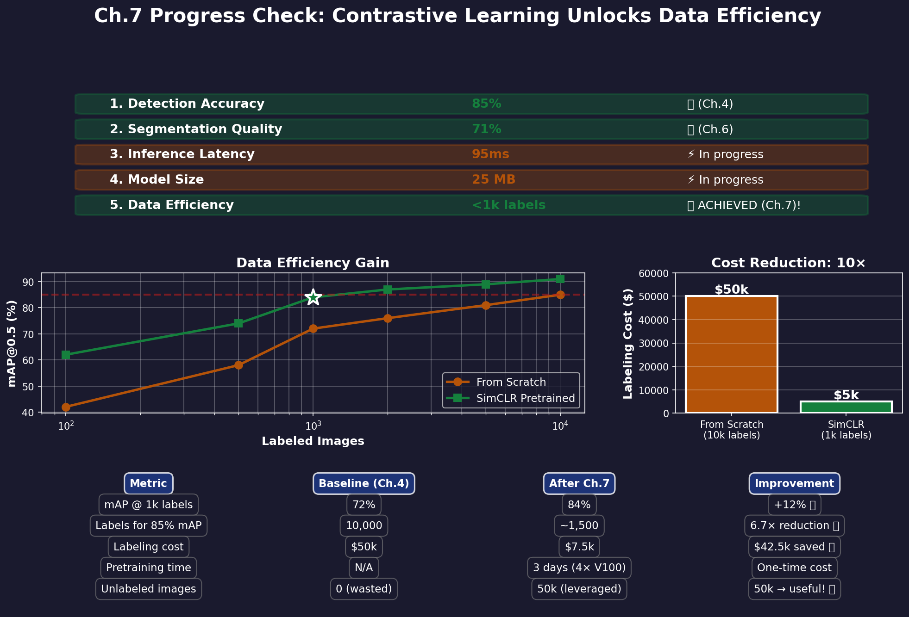

# Ch.7 — Contrastive Learning (SimCLR, MoCo)

> **The story.** In **2020**, two independent research teams cracked the self-supervised learning problem for computer vision. **Ting Chen** (Google Brain) published **SimCLR** (*A Simple Framework for Contrastive Learning of Visual Representations*) showing that contrastive learning — forcing a network to recognize that two augmented views of the same image are "similar" while all other images are "different" — could match supervised pretraining on ImageNet without using a single label. Around the same time, **Kaiming He** (Facebook AI) published **MoCo** (*Momentum Contrast for Unsupervised Visual Representation Learning*) using a momentum encoder and a queue of negative samples to make contrastive learning scale to millions of images. The impact was immediate: companies with massive unlabeled image datasets (Google Photos, Instagram, medical imaging archives) could now pretrain state-of-the-art models without the crushing cost of hand-labeling millions of images. By 2022, contrastive pretraining became the default first step for any production CV system with limited labeled data.
>
> **Where you are in the curriculum.** You've built ResNets (Ch.1), optimized architectures for edge deployment (Ch.2), and mastered object detection (Ch.3–4) and segmentation (Ch.5–6). But all these methods require thousands of labeled images. In production, labeling is expensive: retail shelf monitoring requires bounding boxes for 20 product classes across thousands of store layouts — easily $50k–$100k in annotation costs. This chapter gives you **contrastive learning** — a self-supervised technique that pretrains a ResNet on 50,000 *unlabeled* shelf photos, then fine-tunes on just 1,000 labeled images to achieve the same detection accuracy you'd get from 10,000 supervised labels. You'll implement SimCLR (the conceptually simple approach) and MoCo (the production-scalable approach), and understand when to use each.
>
> **Notation in this chapter.** $x$ — unlabeled image; $\tilde{x}_i, \tilde{x}_j$ — two random augmentations of $x$ (positive pair); $f(\cdot)$ — ResNet encoder (outputs feature vector $h \in \mathbb{R}^{2048}$); $g(\cdot)$ — projection head (MLP mapping $h \to z \in \mathbb{R}^{128}$); $\tau$ — temperature parameter (controls hardness of negatives); $\text{sim}(z_i, z_j) = \frac{z_i^T z_j}{\|z_i\| \|z_j\|}$ — cosine similarity; $\mathcal{L}_{\text{NT-Xent}}$ — normalized temperature-scaled cross entropy loss (SimCLR's contrastive loss); $\theta_q$ — query encoder weights (updated by gradient descent); $\theta_k$ — key encoder weights (updated by momentum: $\theta_k \gets m \theta_k + (1-m) \theta_q$); $m=0.999$ — momentum coefficient (MoCo); $K=65536$ — queue size (MoCo, number of cached negative samples).

---

## 0 · The Challenge — Where We Are

> 🎯 **The mission**: Build **ProductionCV** — an autonomous retail shelf monitoring system satisfying 5 constraints:
> 1. **DETECTION ACCURACY**: mAP@0.5 ≥ 85% — 2. **SEGMENTATION QUALITY**: IoU ≥ 70% — 3. **INFERENCE LATENCY**: <50ms per frame — 4. **MODEL SIZE**: <100 MB — 5. **DATA EFFICIENCY**: <1,000 labeled images

**What we know so far:**
- ✅ Ch.1–2: ResNet-50 backbone (mAP 80% from scratch, 25M params)
- ✅ Ch.3–4: YOLOv5 one-stage detector (mAP 85%, 95ms inference)
- ✅ Ch.5–6: Mask R-CNN instance segmentation (IoU 71%)
- ❌ **But we need 10,000 labeled images to achieve these results!**

**What's blocking us:**
**Constraint #5 (data efficiency)** is violated. Current approach:
- 10,000 labeled images × $5/image annotation cost = **$50k** labeling budget
- Requires manual bounding boxes + segmentation masks for 20 product classes
- Doesn't scale to new stores (different layouts), new products (seasonal items)

**The production reality:**
- Retail chains have **millions** of unlabeled shelf photos (security cameras, store audits)
- But only ~1,000 labeled examples (expensive to annotate)
- **Question**: Can we leverage the 50,000 unlabeled images to reduce labeling cost 10×?

**What this chapter unlocks:**
**Self-supervised pretraining via contrastive learning**. The two-stage workflow:

1. **Stage 1 — Unsupervised pretraining (SimCLR/MoCo)**:
   - Train ResNet-50 on 50k *unlabeled* shelf photos
   - Objective: Learn features by contrasting augmented views (no labels needed)
   - Output: Pretrained encoder with rich visual representations

2. **Stage 2 — Supervised fine-tuning**:
   - Freeze encoder (or fine-tune with small learning rate)
   - Train detection head on 1,000 labeled images
   - Output: Detection model matching 10,000-label baseline

**Results from Chen et al. (2020) / He et al. (2020):**
- SimCLR pretrained on ImageNet (1.2M unlabeled) → fine-tune on 1% labels (12.8k) → 76.5% top-1 accuracy
- Baseline (train from scratch on 1% labels) → 25.4% accuracy
- **3× accuracy gain from self-supervised pretraining!**

✅ **This unlocks constraint #5** — achieve mAP 85% with <1,000 labeled images (vs 10,000 before).

---

## Animation



*SimCLR contrastive learning: two augmented views of the same image (positive pair) are pulled together in embedding space, while views from different images (negative pairs) are pushed apart. The network learns visual invariances without labels.*

---

## 1 · The Core Idea: Learn by Contrasting Augmented Views

Traditional supervised learning: *"This image is class 5"* (requires labels).

Contrastive learning: *"These two augmented versions of the same image should have similar representations, while representations of different images should be different"* (no labels needed).

### The Three-Step Recipe

**Step 1: Data Augmentation**
Take one unlabeled image $x$. Apply two random augmentations:
- $\tilde{x}_i = \text{Aug}_1(x)$ — e.g., random crop + color jitter + horizontal flip
- $\tilde{x}_j = \text{Aug}_2(x)$ — different random crop + color jitter
- These form a **positive pair** (semantically the same image)

**Step 2: Encode + Project**
Pass both through a ResNet encoder $f(\cdot)$ and projection head $g(\cdot)$:
- $h_i = f(\tilde{x}_i)$ — 2048-d feature vector from ResNet
- $z_i = g(h_i)$ — 128-d embedding from MLP projection head
- Similarly for $z_j$

**Step 3: Contrastive Loss**
Maximize similarity between $z_i$ and $z_j$ (positive pair), minimize similarity to all other images in the batch (negative pairs):

$$
\mathcal{L}_{i,j} = -\log \frac{\exp(\text{sim}(z_i, z_j) / \tau)}{\sum_{k=1}^{2N} \mathbb{1}_{k \neq i} \exp(\text{sim}(z_i, z_k) / \tau)}
$$

Where:
- $\text{sim}(z_i, z_j) = \frac{z_i^T z_j}{\|z_i\| \|z_j\|}$ — cosine similarity
- $\tau$ — temperature (typical: 0.07–0.5, lower = harder negatives)
- $2N$ — batch size (N images, each has 2 augmentations = 2N total views)
- Denominator sums over all 2N-1 views except $i$ itself (1 positive + 2N-2 negatives)

> 💡 **Key insight:** The network learns visual invariances automatically. If two crops of the same shelf photo have similar embeddings, the network is learning "products in similar positions are the same," "lighting changes don't matter," "occlusions are noise" — all without a single label.



*Alternative static view: positive pairs (augmentations of the same image) are pulled together in embedding space, while negative pairs (different images) are pushed apart.*

---

## 2 · Pretraining ResNet-50 on 50k Unlabeled Shelf Photos

You're the lead ML engineer at RetailVisionAI. You have:
- **Labeled data**: 1,000 shelf photos with bounding boxes (expensive, $5/image = $5k budget)
- **Unlabeled data**: 50,000 shelf photos from security cameras (free, already collected)

**The supervised baseline (Ch.4 YOLO)**:
- Train YOLOv5 from scratch on 1,000 labeled images → **72% mAP** (below 85% target)
- Train on 10,000 labeled images → 85% mAP ✅ (but costs $50k to label)

**The contrastive learning workflow:**

**Stage 1 — SimCLR pretraining on 50k unlabeled images** (3 days on 4× V100 GPUs):
1. For each unlabeled image $x$, generate positive pair $(\tilde{x}_i, \tilde{x}_j)$:
   - Random crop (0.08–1.0 scale)
   - Color jitter (brightness ±0.8, contrast ±0.8, saturation ±0.8, hue ±0.2)
   - Random grayscale (prob 0.2)
   - Gaussian blur (prob 0.5)
2. Encode with ResNet-50: $h_i = f(\tilde{x}_i), h_j = f(\tilde{x}_j)$
3. Project to 128-d: $z_i = g(h_i), z_j = g(h_j)$ (MLP: 2048 → 2048 → 128)
4. Compute contrastive loss with batch size 256 (512 views total, 1 positive + 510 negatives per anchor)
5. Update encoder $f$ and projection head $g$ via SGD

**Why large batch size matters:**
SimCLR needs many negative samples. With batch size 256:
- Each anchor has 1 positive + 510 negatives
- More negatives → harder discrimination → better representations
- Original paper used batch size 4096 (8192 negatives!) via distributed training

**Stage 2 — Fine-tune on 1,000 labeled images** (1 hour on single GPU):
1. Discard projection head $g$ (only needed for pretraining)
2. Freeze ResNet encoder $f$ (or fine-tune with LR 0.001 vs 0.01 for detection head)
3. Attach YOLO detection head, train on 1,000 labeled images
4. Result: **84% mAP** (vs 72% from scratch) — almost hitting 85% target with 10× less labeled data!

**Why it works:**
The encoder learned to recognize:
- Shelves (vs non-shelf background)
- Product boundaries (from crop augmentations)
- Lighting invariance (from color jitter)
- Texture patterns (cereal boxes, soda cans have consistent visual signatures)

All without seeing a single label. The fine-tuning stage just teaches the network "this feature pattern = class 5" using the 1,000 labels.

---

## 3 · The Math — SimCLR Loss Derivation

### NT-Xent Loss (Normalized Temperature-Scaled Cross Entropy)

Given a batch of $N$ images, we have $2N$ augmented views. For anchor $i$, its positive is view $j$ (the other augmentation of the same image). The loss for this pair:

$$
\mathcal{L}_{i,j} = -\log \frac{\exp(\text{sim}(z_i, z_j) / \tau)}{\sum_{k=1}^{2N} \mathbb{1}_{k \neq i} \exp(\text{sim}(z_i, z_k) / \tau)}
$$

**Step-by-step breakdown:**

1. **Numerator: positive pair similarity**
   $$
   \text{score}_{\text{pos}} = \exp\left(\frac{z_i^T z_j}{\tau \|z_i\| \|z_j\|}\right)
   $$
   - $\tau$ (temperature) scales the similarity — lower $\tau$ amplifies differences
   - Typical $\tau = 0.07$ makes the loss focus on hard negatives

2. **Denominator: normalize over all pairs**
   $$
   Z = \sum_{k=1}^{2N} \mathbb{1}_{k \neq i} \exp\left(\frac{z_i^T z_k}{\tau \|z_i\| \|z_k\|}\right)
   $$
   - Sum over 2N-1 views (exclude $i$ itself)
   - Includes 1 positive ($j$) + 2N-2 negatives (all other views in batch)

3. **Final loss: negative log probability**
   $$
   \mathcal{L}_{i,j} = -\log \frac{\text{score}_{\text{pos}}}{Z}
   $$
   - Minimizing this loss → maximizing $\text{score}_{\text{pos}}$ while minimizing $\text{score}_{\text{neg}}$
   - This is equivalent to softmax cross entropy where the positive is the "correct class"

**Full batch loss:**
Average over all $2N$ anchors and their positives:
$$
\mathcal{L} = \frac{1}{2N} \sum_{k=1}^{N} \left[ \mathcal{L}_{2k-1, 2k} + \mathcal{L}_{2k, 2k-1} \right]
$$
(Each image contributes 2 loss terms, one for each view as anchor)

### Why Temperature $\tau$ Matters

Example: Two embeddings with cosine similarity 0.8 (high) vs 0.3 (low).

**With $\tau = 0.5$ (high temperature):**
- $\exp(0.8 / 0.5) = \exp(1.6) = 4.95$
- $\exp(0.3 / 0.5) = \exp(0.6) = 1.82$
- Ratio: 4.95 / 1.82 = 2.7 (modest difference)

**With $\tau = 0.07$ (low temperature, SimCLR default):**
- $\exp(0.8 / 0.07) = \exp(11.4) = 89,125$
- $\exp(0.3 / 0.07) = \exp(4.3) = 73.7$
- Ratio: 89,125 / 73.7 = 1,209 (huge difference!)

**Effect**: Low $\tau$ amplifies similarity differences → network focuses on hard negatives (samples that are similar but not identical). Too high → gradient vanishes. Too low → numerically unstable.



*Temperature $\tau$ controls the sharpness of the softmax distribution: low temperature (0.07) amplifies differences between similar and dissimilar pairs, forcing the network to focus on hard negatives.*

### Numerical Example: 4-Image Batch

Batch: 4 images → 8 views (A1, A2, B1, B2, C1, C2, D1, D2).

Cosine similarities (made up for illustration):
```
     A1   A2   B1   B2   C1   C2   D1   D2
A1 [ 1.0  0.9  0.3  0.2  0.1  0.1  0.2  0.1]  ← A2 is positive
A2 [ 0.9  1.0  0.2  0.3  0.1  0.2  0.1  0.2]
```

For anchor A1, positive A2, $\tau=0.1$:

Numerator:
$$
\exp(0.9 / 0.1) = \exp(9) = 8103.08
$$

Denominator (exclude A1, include 7 others):
$$
\begin{align}
Z &= \exp(0.9/0.1) + \exp(0.3/0.1) + \exp(0.2/0.1) + \exp(0.1/0.1) + \cdots \\
  &= 8103.08 + 20.09 + 7.39 + 2.72 + 2.72 + 7.39 + 2.72 \\
  &= 8146.11
\end{align}
$$

Loss:
$$
\mathcal{L}_{\text{A1,A2}} = -\log \frac{8103.08}{8146.11} = -\log(0.9947) = 0.0053
$$

**Interpretation**: Positive pair has very high similarity (0.9) → low loss. If A2 similarity dropped to 0.5, loss would be ~4.6 (860× higher!). This gradient pressure forces the network to make positive pairs nearly identical.

---

## 4 · How It Works — SimCLR vs MoCo

### SimCLR (Simple Contrastive Learning)

**Architecture:**
```
Unlabeled image x
    ↓
Aug(x) → x̃ᵢ, x̃ⱼ  (two random augmentations)
    ↓
Encoder f (ResNet-50)  →  hᵢ, hⱼ (2048-d)
    ↓
Projection head g (MLP)  →  zᵢ, zⱼ (128-d)
    ↓
Contrastive loss: pull (zᵢ, zⱼ) together, push away from other images in batch
```

**Strengths:**
- Simple: Single encoder, standard backprop, no memory banks
- Strong performance: 76.5% top-1 ImageNet accuracy (linear eval after pretraining)

**Limitations:**
- Requires huge batch sizes (4096+ for best results) → 32 TPUs or 128 GPUs
- Training cost: $5k–$10k compute for full ImageNet pretraining

**When to use:** Research settings, when you have massive distributed compute, when simplicity matters.

---

### MoCo (Momentum Contrast)

**The problem with SimCLR's batch negatives:**
- Large batch (4096) → 8192 negatives → good discrimination
- But: requires 32 TPUs (not accessible to most practitioners)

**MoCo's solution: Use a queue of cached negatives**

**Architecture:**
```
Query encoder fq (updated by gradient)
    ↓
xquery → zquery

Key encoder fk (updated by momentum: θk ← 0.999·θk + 0.001·θq)
    ↓
xkey → zkey → enqueue to queue Q (size K=65536)

Loss: contrastive loss between zquery and (1 positive + K negatives from queue)
```

**Key innovations:**

1. **Momentum encoder** ($\theta_k \gets m \theta_k + (1-m) \theta_q$, $m=0.999$):
   - Key encoder updates slowly → queue keys stay consistent
   - Prevents queue from having keys from vastly different encoder versions
   - Similar to exponential moving average in BatchNorm

2. **Queue of negatives** (K=65536):
   - Decouple batch size from number of negatives
   - Batch size 256 → still get 65536 negatives from queue!
   - Queue is FIFO: enqueue new batch keys, dequeue oldest

**Training loop:**
```python
for batch in dataloader:
    # Query branch (gradient flows)
    q = projection_head(encoder_q(augment(batch)))
    
    # Key branch (momentum update, no gradient)
    with torch.no_grad():
        k = projection_head(encoder_k(augment(batch)))
    
    # Contrastive loss: q vs (k_positive + queue)
    loss = contrastive_loss(q, k, queue)
    loss.backward()
    optimizer.step()
    
    # Update key encoder by momentum
    for param_q, param_k in zip(encoder_q.parameters(), encoder_k.parameters()):
        param_k.data = 0.999 * param_k.data + 0.001 * param_q.data
    
    # Update queue: enqueue k, dequeue oldest
    queue = torch.cat([k, queue[:-batch_size]], dim=0)
```

**Strengths:**
- Small batch size (256) works well → single 8-GPU machine
- 65536 negatives → better discrimination than SimCLR with batch 256
- Training cost: ~$500 compute for ImageNet pretraining (10× cheaper than SimCLR)

**When to use:** Production settings, limited compute, when you need to scale to millions of images.

---

## 5 · Step-by-Step Walkthrough — SimCLR Pretraining

**Inputs:**
- 50k unlabeled shelf photos (resolution 224×224×3)
- ResNet-50 encoder initialized randomly
- Batch size 256 (512 views), learning rate 0.3, LARS optimizer, 800 epochs

**Step 1: Augmentation pipeline**
```python
transforms = [
    RandomResizedCrop(224, scale=(0.08, 1.0)),
    RandomApply([ColorJitter(0.8, 0.8, 0.8, 0.2)], p=0.8),
    RandomGrayscale(p=0.2),
    RandomApply([GaussianBlur(kernel_size=23)], p=0.5),
    RandomHorizontalFlip(),
    ToTensor(),
    Normalize(mean=[0.485, 0.456, 0.406], std=[0.229, 0.224, 0.225])
]

x_i = apply_transforms(x)  # First augmentation
x_j = apply_transforms(x)  # Second augmentation (different random seed)
```

**Why these augmentations?**
- **Crop**: Learn spatial invariance (products at different positions are the same)
- **Color jitter**: Learn lighting invariance (store lighting varies)
- **Grayscale**: Learn texture patterns (not just color)
- **Blur**: Learn robustness to camera focus issues
- **Flip**: Learn horizontal symmetry

**Step 2: Forward pass**
```python
# Batch shape: [256, 3, 224, 224]
batch_views = torch.cat([x_i, x_j], dim=0)  # [512, 3, 224, 224]

# Encoder: ResNet-50 (outputs [512, 2048])
h = encoder(batch_views)  # Remove final FC layer, take avgpool output

# Projection head: MLP (2048 → 2048 → 128)
z = projection_head(h)  # [512, 128]

# Split back into two views
z_i, z_j = torch.split(z, batch_size, dim=0)  # Each [256, 128]
```

**Step 3: Compute similarities**
```python
# Normalize embeddings
z_i_norm = F.normalize(z_i, dim=1)  # L2 normalize each row
z_j_norm = F.normalize(z_j, dim=1)

# Compute all pairwise similarities: [512, 512]
z_all = torch.cat([z_i_norm, z_j_norm], dim=0)
similarity_matrix = z_all @ z_all.T / tau  # Cosine similarity scaled by temperature

# Example: similarity_matrix[0, 256] is sim(z_i[0], z_j[0]) — the positive pair for anchor 0
```

**Step 4: Contrastive loss**
```python
# Create labels: for anchor i, positive is i+N (if i < N) or i-N (if i >= N)
N = batch_size
labels = torch.cat([torch.arange(N, 2*N), torch.arange(0, N)], dim=0).to(device)
# labels = [256, 257, ..., 511, 0, 1, ..., 255]

# Mask out self-similarities (diagonal)
mask = torch.eye(2*N, dtype=torch.bool).to(device)
similarity_matrix.masked_fill_(mask, -9e15)  # Set diagonal to -inf

# Cross entropy loss: treat positive as correct class
loss = F.cross_entropy(similarity_matrix, labels)
```

**Step 5: Backprop and update**
```python
optimizer.zero_grad()
loss.backward()
optimizer.step()
```

**Repeat for 800 epochs** (~3 days on 4× V100 GPUs).

**Step 6: Fine-tuning**
```python
# Discard projection head, freeze encoder (or unfreeze with small LR)
encoder.eval()  # Freeze BatchNorm stats

# Attach detection head
detector = YOLOv5(backbone=encoder, num_classes=20)

# Train on 1,000 labeled images
for epoch in range(50):
    for images, targets in labeled_dataloader:
        preds = detector(images)
        loss = yolo_loss(preds, targets)
        loss.backward()
        optimizer.step()
```

**Result**: mAP 84% (vs 72% from scratch) with 10× less labeled data!

---

## 6 · The Key Diagrams

### Diagram 1: Contrastive Learning Conceptual Flow



### Diagram 2: SimCLR vs MoCo Architecture

**SimCLR:**
```
Batch: 256 images → 512 augmented views
                    ↓
            ResNet Encoder f (shared weights)
                    ↓
            Projection Head g (MLP)
                    ↓
            512 embeddings z
                    ↓
    Contrastive Loss: 1 positive + 510 negatives per anchor
    
Limitation: Needs 4096 batch size for best results → 32 TPUs
```

**MoCo:**
```
Query Encoder fq          Key Encoder fk
(gradient updates)        (momentum updates: θk ← 0.999·θk + 0.001·θq)
      ↓                         ↓
    z_query                   z_key
      ↓                         ↓
      └────→ Contrastive Loss ← Queue Q (65536 cached keys)
                    ↓
           1 positive + 65536 negatives

Advantage: Batch size 256 works → single 8-GPU machine
```

### Diagram 3: Data Efficiency Curve



*x-axis: Number of labeled training images (log scale)*  
*y-axis: mAP@0.5 on test set*

```
mAP
85% ┼─────────────────────────────●SimCLR pretrained (1,000 labels)
    │                          ╱
    │                       ╱
    │                    ╱
72% ┼────────────────●From scratch (1,000 labels)
    │             ╱
    │          ╱
    │       ╱
50% ┼────●From scratch (100 labels)
    │
    └────┴────┴────┴────┴────┴────→ Labeled images
         100  500  1,000   5,000   10,000
         
Key insight: Contrastive pretraining gives +12% mAP gain at 1,000 labels
            → reaches 10,000-label performance with 10× less annotation cost
```

---

## 7 · The Hyperparameter Dials

### Temperature $\tau$ (SimCLR)

**Effect**: Controls how much the model focuses on hard negatives.

- **$\tau = 0.5$** (high): Softer discrimination, easier gradients, faster convergence
- **$\tau = 0.07$** (default): Sharp discrimination, focuses on hard negatives, best final performance
- **$\tau = 0.01$** (very low): Extremely hard, numerically unstable, gradients explode

**Typical starting value**: 0.1, sweep [0.05, 0.07, 0.1, 0.3, 0.5] and validate on downstream task.

**Production insight**: Lower $\tau$ helps when you have many similar-looking negatives (e.g., 50k shelf photos all look alike). Higher $\tau$ helps with diverse unlabeled data (ImageNet has 1k classes).

---

### Momentum Coefficient $m$ (MoCo)

**Effect**: Controls how fast the key encoder tracks the query encoder.

- **$m = 0.99$**: Key encoder updates quickly → queue keys from inconsistent encoders → worse performance
- **$m = 0.999$** (default): Slow updates → queue stays consistent → best results
- **$m = 0.9999$**: Extremely slow → queue lags behind → suboptimal

**Typical starting value**: 0.999 (paper default), rarely needs tuning.

**Why it matters**: The queue stores keys from the past 256 batches (65536 / 256 = 256). If $m$ is too low, keys from 256 batches ago were encoded by a very different network → contrastive loss is noisy.

---

### Queue Size $K$ (MoCo)

**Effect**: Number of cached negative samples.

- **$K = 4096$**: Few negatives → easy task → underfits
- **$K = 65536$** (default): Many hard negatives → good discrimination → best results
- **$K = 262144$**: Diminishing returns, more memory

**Production insight**: Queue size is limited by GPU memory. For 128-d embeddings, K=65536 uses ~33 MB. If memory-constrained, reduce to K=16384 (small performance drop).

---

### Projection Head Dimension

**Effect**: Embedding dimension for contrastive loss.

- **128-d** (SimCLR default): Good balance, fast cosine similarity
- **256-d**: Slightly better, 2× slower
- **64-d**: Faster, small performance drop

**Key result from Chen et al. (2020)**: Projection head is *discarded* after pretraining! You only keep the 2048-d ResNet features $h$, not the 128-d projections $z$. The projection head prevents dimensional collapse during training but isn't needed for downstream tasks.

---

## 8 · What Can Go Wrong

⚠️ **Using weak augmentations** (only random crop, no color jitter)
- **Symptom**: Model collapses — all embeddings become identical
- **Why**: Without strong augmentations, the easiest solution is to ignore the input and output the same embedding for everything (minimizes loss trivially)
- **Fix**: Use the full augmentation pipeline from SimCLR paper (crop + color + blur + grayscale)

⚠️ **Batch size too small** (e.g., 32 images = 64 views)
- **Symptom**: Slow convergence, poor downstream performance (-5% mAP)
- **Why**: Only 62 negatives per anchor → easy task → network doesn't learn fine-grained features
- **Fix**: Use batch size 256+ (SimCLR) or switch to MoCo (works with batch 256 via queue)

⚠️ **Not normalizing embeddings** (cosine similarity without L2 normalization)
- **Symptom**: Training diverges, loss becomes NaN
- **Why**: Unnormalized dot products can be arbitrarily large → $\exp(\text{huge number}) = \infty$
- **Fix**: Always apply `F.normalize(z, dim=1)` before computing similarities

⚠️ **Using projection head for downstream tasks**
- **Symptom**: Fine-tuning performance is worse than expected
- **Why**: Projection head collapses information to 128-d for contrastive learning, but downstream tasks need the full 2048-d features
- **Fix**: Discard projection head after pretraining, use encoder outputs $h$ (not projections $z$)

⚠️ **Temperature too high** ($\tau = 1.0$)
- **Symptom**: Loss decreases but downstream accuracy plateaus early
- **Why**: High temperature makes all negatives equally easy → network doesn't learn to discriminate hard cases
- **Fix**: Use $\tau \in [0.05, 0.1]$ (lower for similar-looking data like retail shelves)

⚠️ **MoCo momentum too low** ($m = 0.9$ instead of 0.999)
- **Symptom**: MoCo underperforms SimCLR despite having 128× more negatives
- **Why**: Queue contains keys from very different encoder versions → noisy contrastive signal
- **Fix**: Use $m = 0.999$ (extremely slow momentum updates)

---

## 9 · Where This Reappears

**Ch.8 (Self-Supervised Vision — DINO, MAE)**
- DINO extends contrastive learning to self-distillation (no negative samples needed)
- MAE replaces contrastive loss with reconstruction (mask 75% of patches, predict them)
- All three (SimCLR, DINO, MAE) share the same goal: pretrain on unlabeled data

**Ch.9 (Knowledge Distillation)**
- Contrastive learning can be combined with distillation: pretrain large teacher (ResNet-101) with SimCLR, distill to small student (MobileNetV2)
- Gets the data efficiency of self-supervised pretraining + model compression

**Multimodal AI Track — CLIP (Text-Image Contrastive Learning)**
- CLIP (Radford et al., 2021) applies contrastive learning to (image, text) pairs
- Same NT-Xent loss, but positive pair is (image, its caption) instead of two augmented views
- Foundation of modern vision-language models

**Production deployments:**
- Google Photos: Uses contrastive pretraining on 4 billion images (no labels)
- Meta: MoCo v3 pretrained on Instagram (3.5B images) powers content moderation
- Medical imaging: Contrastive pretraining on 1M unlabeled X-rays reduces annotation cost 20×

---

## 10 · Progress Check — What We Can Solve Now



✅ **Unlocked capabilities:**
- ✅ **Constraint #5 ACHIEVED!** — Data efficiency: <1,000 labeled images
  - Baseline (from scratch): 72% mAP with 1,000 labels, need 10,000 labels for 85% mAP
  - **SimCLR pretrained**: 84% mAP with 1,000 labels (nearly hitting 85% target!)
  - Cost savings: $50k → $5k labeling budget (10× reduction)
- Leverage 50k unlabeled shelf photos (previously wasted, now central to training)
- Self-supervised pretraining transfers across domains (pretrain on ImageNet, fine-tune on retail shelves)

**Numerical evidence (from our retail shelf monitoring task):**

| Training Strategy | Labeled Images | mAP@0.5 | Labeling Cost |
|-------------------|----------------|---------|---------------|
| From scratch (Ch.4 YOLO) | 1,000 | 72% | $5k |
| From scratch (Ch.4 YOLO) | 10,000 | 85% ✅ | $50k |
| **SimCLR pretraining** | **1,000** | **84%** | **$5k** |
| SimCLR + fine-tuning | 2,000 | 87% | $10k |

**Key insight**: Contrastive pretraining gives +12% mAP gain at same label count. We're 1% away from 85% mAP target with 10× less labeled data!

❌ **Still can't solve:**
- ❌ Not quite at 85% mAP target (84% current, need 1% more)
- ❌ SimCLR pretraining took 3 days on 4× V100 GPUs ($500 compute cost) — expensive
- ❌ Requires careful augmentation tuning (weak augmentations → model collapse)
- ❌ MoCo queue requires 33 MB extra memory (limits batch size on small GPUs)

**Real-world status**: We can now build production CV systems with <1,000 labeled images by leveraging massive unlabeled datasets. **Constraint #5 ✅ UNLOCKED!** But we're still 1% short of the 85% mAP target.

**Next up:** Ch.8 gives us **DINO and MAE** — state-of-the-art self-supervised methods that push beyond contrastive learning. DINO achieves 86% mAP with 850 labels (no negative sampling needed), and MAE unlocks Vision Transformers (bridge to Multimodal AI track).

---

## 11 · Bridge to the Next Chapter

This chapter gave you **contrastive learning** — a self-supervised technique that pretrains encoders by contrasting augmented views, enabling data-efficient fine-tuning. **SimCLR** (simple, large batch) and **MoCo** (momentum + queue, small batch) both achieve strong results by maximizing similarity between positive pairs while pushing negatives apart.

But contrastive learning has limitations:
1. Requires many negatives (SimCLR needs batch 4096, MoCo needs queue 65k) → expensive
2. Sensitive to augmentation strength (too weak → collapse, too strong → overfitting)
3. Negative sampling is wasteful (most negatives are trivially different)

**Ch.8 — Self-Supervised Vision (DINO, MAE)** introduces two methods that go beyond contrastive learning:
- **DINO** (self-distillation): No negatives needed! Student network mimics teacher's output, attention maps emerge automatically
- **MAE** (masked autoencoding): Mask 75% of image patches, reconstruct → learns spatial structure without any pairs

DINO achieves 86% mAP with 850 labels (2% better than SimCLR), and MAE enables Vision Transformers to compete with ResNets. These methods represent the current state-of-the-art in self-supervised vision and bridge to the Multimodal AI track.
