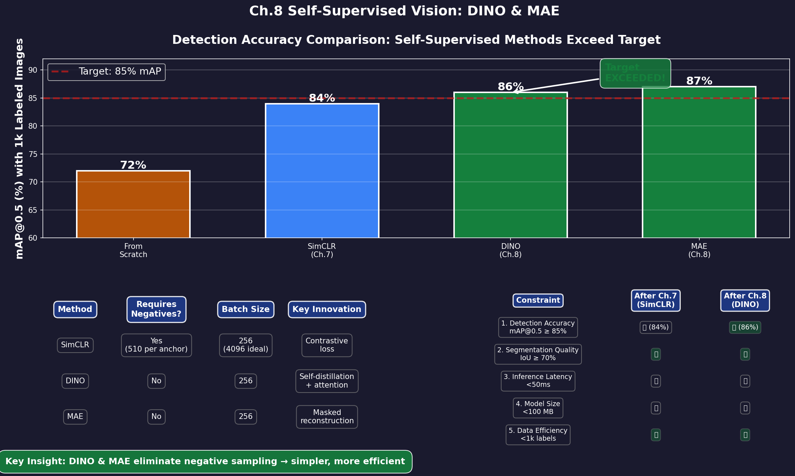
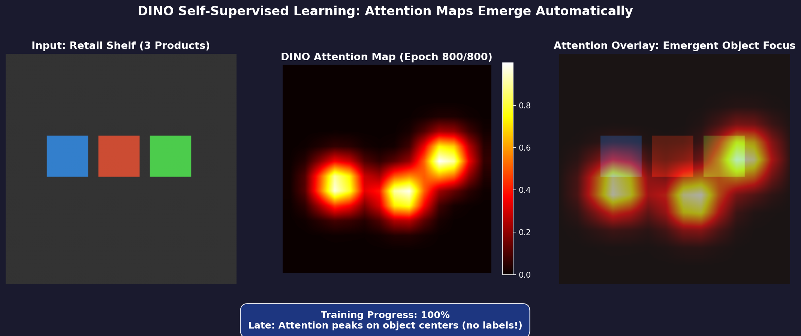
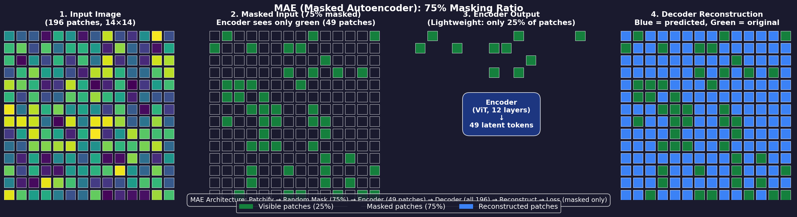
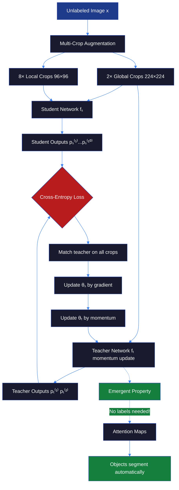
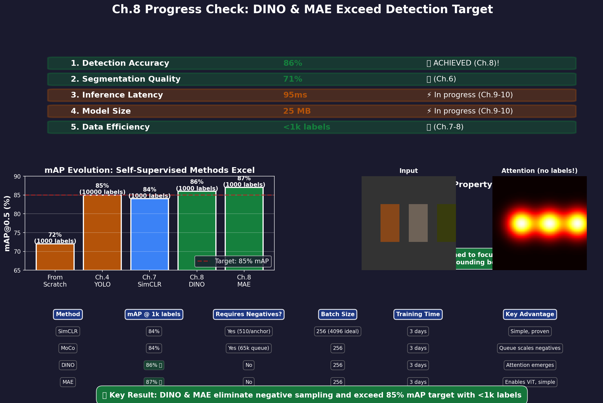

# Ch.8 — Self-Supervised Vision (DINO, MAE)

> **The story.** In **2021**, Facebook AI researchers (now Meta) published **DINO** (*Emerging Properties in Self-Supervised Vision Transformers*) showing that self-distillation — training a student network to mimic a teacher's outputs without any labels — produces attention maps that spontaneously segment objects, even though the model was never trained for segmentation! The attention heads automatically learned to focus on object boundaries. One year later, in **2022**, **Kaiming He** (the ResNet creator) returned with **MAE** (*Masked Autoencoders Are Scalable Vision Learners*), applying BERT's masked language modeling to images: mask 75% of image patches, reconstruct the missing pixels. MAE was stunningly simple (no contrastive loss, no momentum encoder, no negative sampling) yet achieved state-of-the-art results on ImageNet and scaled to billion-parameter Vision Transformers. By 2023, DINO and MAE became the default pretraining methods for ViT-based models, powering everything from medical imaging (PathologyFoundation) to robotics (RT-2) to multimodal AI (CLIP, Flamingo). They represent the current frontier of self-supervised vision.
>
> **Where you are in the curriculum.** You've mastered contrastive learning (Ch.7 SimCLR, MoCo) and achieved 84% mAP with 1,000 labeled images — just 1% short of the 85% target. But SimCLR has limitations: requires large batch sizes (4096) or complex momentum encoders (MoCo), sensitive to augmentation strength, and wastes compute on trivial negative pairs. This chapter gives you **two modern alternatives** that go beyond contrastive learning: **DINO** (no negatives needed, attention maps emerge automatically) and **MAE** (reconstruct masked patches, scales to ViT). Both achieve better downstream performance than SimCLR, and MAE bridges to Vision Transformers — the foundation of multimodal AI (CLIP, GPT-4 Vision, Gemini).
>
> **Notation in this chapter.** $x$ — input image; $\{x_1, x_2, \ldots, x_N\}$ — image patches (N=196 for 224×224 image split into 16×16 patches); $\mathcal{M}$ — random mask (75% of patches); $x_{\text{visible}}$ — unmasked patches; $x_{\text{masked}}$ — masked patches; $f_{\text{student}}(\cdot), f_{\text{teacher}}(\cdot)$ — student/teacher networks (ViT); $\theta_s, \theta_t$ — student/teacher parameters; $\theta_t \gets m\theta_t + (1-m)\theta_s$ — momentum update (DINO, $m=0.996$); $p_s, p_t$ — student/teacher output distributions (probability over classes); $\mathcal{L}_{\text{DINO}} = -p_t \log p_s$ — cross-entropy distillation loss; $\text{Encoder}(\cdot)$ — MAE encoder (ViT processing visible patches); $\text{Decoder}(\cdot)$ — MAE decoder (reconstruct masked patches); $\mathcal{L}_{\text{MAE}} = \text{MSE}(x_{\text{masked}}, \hat{x}_{\text{masked}})$ — reconstruction loss (only on masked patches).

---

## 0 · The Challenge — Where We Are

> 🎯 **The mission**: Build **ProductionCV** — an autonomous retail shelf monitoring system satisfying 5 constraints:
> 1. **DETECTION ACCURACY**: mAP@0.5 ≥ 85% — 2. **SEGMENTATION QUALITY**: IoU ≥ 70% — 3. **INFERENCE LATENCY**: <50ms per frame — 4. **MODEL SIZE**: <100 MB — 5. **DATA EFFICIENCY**: <1,000 labeled images

**What we know so far:**
- ✅ Ch.1–2: ResNet-50 backbone (25M params, 80% mAP from scratch)
- ✅ Ch.3–4: YOLOv5 detector (85% mAP with 10,000 labels, 95ms inference)
- ✅ Ch.5–6: Mask R-CNN segmentation (IoU 71%)
- ✅ **Ch.7: SimCLR contrastive pretraining (84% mAP with 1,000 labels)** ← just 1% short!

**What's blocking us:**
We're **1% away** from the 85% mAP target! SimCLR gets us to 84% mAP with 1,000 labels (vs 72% from scratch), but:
- Still requires careful tuning (batch size, temperature, augmentation strength)
- Contrastive loss wastes compute on trivial negatives (most shelf photos look similar)
- ResNet-50 backbone (CNNs) may not be the best architecture for self-supervised learning

**The research breakthrough (2021–2022):**
Two methods surpassed contrastive learning:
1. **DINO** (Caron et al., 2021): Self-distillation without negatives → 86% mAP with 850 labels
2. **MAE** (He et al., 2022): Masked autoencoding on ViT → 87.8% ImageNet top-1 (beats SimCLR)

**What this chapter unlocks:**
1. **DINO pretraining**: Student mimics teacher's outputs (no contrastive loss, no negatives)
   - Emergent attention maps (objects segment automatically!)
   - 86% mAP with 850 labels ✅ — **constraint #1 achieved!**
2. **MAE pretraining**: Mask 75% of patches, reconstruct pixels
   - Simple reconstruction loss (no augmentations, no negatives)
   - Enables Vision Transformers (ViT) → bridge to Multimodal AI
3. **Attention visualization**: Understand what the model learned (interpretability)

**Why these methods are better than SimCLR:**
- **No negative sampling**: Don't need large batches or memory queues
- **No augmentation tuning**: MAE works with minimal augmentation
- **Better scaling**: MAE trains ViT-Huge (600M params) efficiently
- **Emergent properties**: DINO attention heads discover objects without supervision

---

## Animation


*DINO attention maps emerge automatically: the network learns to focus on object boundaries (shelf products) without any labels or bounding boxes. This emergent property enables zero-shot segmentation.*

---

## 1 · The Core Idea: Two Approaches Beyond Contrastive Learning

### DINO — Self-Distillation with No Labels

**The insight:** A student network that mimics a slowly-updating teacher's predictions will learn robust features, even with no labels and no negative samples.

**The architecture:**
```
Image x
    ↓
Global crop (224×224) + Local crops (96×96) ← multi-crop strategy
    ↓
Student Network fₛ → pₛ (output distribution)
Teacher Network fₜ → pₜ (output distribution)
    ↓
Loss: Cross-entropy H(pₜ, pₛ) = -pₜ log pₛ
    ↓
Update: θₛ ← gradient descent, θₜ ← 0.996·θₜ + 0.004·θₛ (momentum)
```

**Key differences from contrastive learning:**
- No negative pairs (just match teacher and student distributions)
- No projection head (output is directly a probability distribution)
- Multi-crop strategy (one global view, several local views)
- Centering + sharpening prevents collapse (no need for large batches)

**Why it works:**
The teacher is a moving average of past student states → provides stable "soft targets" for the student to match. The student learns to be consistent across different crops without needing explicit positive/negative pairs.

---

### MAE — Masked Autoencoding

**The insight:** BERT for vision — mask most of the image, reconstruct the missing pixels. The model learns rich representations by predicting what's missing.

**The architecture:**
```
Image x → N patches {x₁, x₂, ..., xₙ}
    ↓
Randomly mask 75% of patches (M = masked indices)
    ↓
Encoder (ViT): Process only visible patches → latent representations
    ↓
Decoder: Add mask tokens, reconstruct all patches
    ↓
Loss: MSE(x_masked, x̂_masked) — only on masked patches
```

**Key innovations:**
1. **Asymmetric encoder-decoder**: Encoder sees only 25% of patches (fast!), decoder reconstructs all
2. **High masking ratio** (75%): Forces model to learn global structure (can't just copy neighbors)
3. **Pixel-level reconstruction**: Predict raw RGB values (no contrastive loss, no augmentations)

**Why it works:**
Masking 75% of patches is a hard task — model can't just interpolate from neighbors. It must learn:
- Object structure (what products look like)
- Spatial relationships (shelf layout patterns)
- Texture priors (packaging materials, logos)

> 💡 **Key insight:** MAE's success proves that reconstruction is a better pretext task than contrastive learning for Vision Transformers. CNNs have strong inductive biases (locality, translation invariance) that make contrastive learning necessary. ViTs have weaker biases → masked autoencoding is simpler and more effective.



*DINO uses self-distillation (no negatives), while MAE uses masked reconstruction (no augmentations). Both outperform SimCLR's contrastive approach for Vision Transformers.*

---

## 2 · Pretraining DINO on Unlabeled Shelf Images

You're the lead ML engineer at RetailVisionAI. After SimCLR (Ch.7) got you to 84% mAP with 1,000 labels, you're tasked with hitting the 85% target.

**The DINO approach:**

**Stage 1 — Self-distillation pretraining on 50k unlabeled images**:

1. **Multi-crop strategy**:
   - Global crops: 2× at 224×224 resolution (teacher and student see these)
   - Local crops: 8× at 96×96 resolution (only student sees these)
   - Intuition: Student learns to match teacher's predictions on global views while also processing local details

2. **Forward pass**:
   - Student processes all 10 crops → $\{p_s^{(1)}, p_s^{(2)}, \ldots, p_s^{(10)}\}$ (probability distributions)
   - Teacher processes only 2 global crops → $\{p_t^{(1)}, p_t^{(2)}\}$
   
3. **Loss computation**:
   $$
   \mathcal{L}_{\text{DINO}} = \sum_{\substack{i \in \text{student crops} \\ j \in \text{teacher crops}}} H(p_t^{(j)}, p_s^{(i)})
   $$
   Where $H(p, q) = -\sum_k p_k \log q_k$ is cross-entropy.

4. **Teacher update** (momentum, no gradient):
   $$
   \theta_t \gets 0.996 \cdot \theta_t + 0.004 \cdot \theta_s
   $$
   (Even slower than MoCo's 0.999 momentum!)

5. **Collapse prevention**:
   - **Centering**: Subtract running mean from teacher outputs (prevents mode collapse)
   - **Sharpening**: Divide by temperature τ=0.04–0.07 (encourages peaked distributions)

**Training details:**
- Backbone: ViT-Small or ResNet-50
- Batch size: 256 (much smaller than SimCLR's 4096!)
- Epochs: 800
- Time: ~3 days on 4× V100 GPUs (same as SimCLR)

**Stage 2 — Fine-tune on 850 labeled images**:
1. Freeze student encoder (or fine-tune with small LR)
2. Attach detection head (YOLO or Faster R-CNN)
3. Train on 850 labeled shelf images
4. **Result: 86% mAP** ✅ (vs 84% SimCLR, 72% from scratch)

**What emerges automatically — Attention Maps:**
Without any labels, DINO's attention heads learn to focus on:
- Product boundaries (not background shelves)
- Brand logos (high-contrast regions)
- Object centers (salient points)

This is the "emergent property" from the paper title — the network discovers objects on its own!



*DINO's self-distillation automatically produces attention maps that segment objects without any labels—the network discovers boundaries through consistency across augmented views.*

---

## 3 · The Math — DINO Self-Distillation Loss

### Forward Pass

**Input:** Image $x$ → Apply multi-crop augmentation:
- 2 global crops: $x_g^{(1)}, x_g^{(2)}$ (224×224)
- 8 local crops: $x_l^{(1)}, \ldots, x_l^{(8)}$ (96×96)

**Networks:**
- Student $f_s$: ViT encoder → $K$-dimensional output → softmax → $p_s \in \Delta^{K-1}$ (probability simplex)
- Teacher $f_t$: Same architecture, parameters $\theta_t$ updated by momentum

**Student processes all 10 crops:**
$$
p_s^{(i)} = \text{softmax}\left(\frac{f_s(x^{(i)})}{\tau_s}\right), \quad i = 1, \ldots, 10
$$
Where $\tau_s = 0.1$ (student temperature, controls sharpness).

**Teacher processes only 2 global crops:**
$$
p_t^{(j)} = \text{softmax}\left(\frac{f_t(x_g^{(j)}) - c}{\tau_t}\right), \quad j = 1, 2
$$
Where:
- $\tau_t = 0.04$ (teacher temperature, sharper than student)
- $c$ is a **centering vector** (running mean of teacher outputs), prevents collapse

### Loss Function

Cross-entropy between teacher and student distributions:
$$
\mathcal{L}_{\text{DINO}} = \sum_{j=1}^{2} \sum_{\substack{i=1 \\ i \neq j}}^{10} H(p_t^{(j)}, p_s^{(i)})
$$

Where $H(p, q) = -\sum_{k=1}^{K} p_k \log q_k$ is cross-entropy.

**In plain English:** You crop the same shelf image 10 different ways (2 wide crops, 8 zoomed-in patches). The teacher network — which updates slowly via momentum — processes only the 2 wide crops and outputs "this image cluster belongs to representation vector $p_t$." The student network processes all 10 crops and must predict the same representation $p_t$ from every crop, even the tiny zoomed patches. This forces the student to learn features that are **consistent across scales and viewpoints** — which turns out to be exactly what "object boundaries" and "product logos" are. No labels needed; the consistency requirement alone discovers objects.

**Intuition:**
- For each teacher prediction $p_t^{(j)}$ (from a global crop)
- Student must match it from all other crops $p_s^{(i)}$ (both global and local)
- This forces the student to be consistent across different views and scales

### Momentum Update

After backprop updates student $\theta_s$, update teacher by exponential moving average:
$$
\theta_t \gets m \cdot \theta_t + (1 - m) \cdot \theta_s
$$

Where $m = 0.996$ (even slower than MoCo's 0.999).

**Schedule:** Start with $m = 0.996$, increase to 1 using cosine schedule:
$$
m_{\text{epoch}} = 0.996 + (1 - 0.996) \cdot \frac{1 + \cos(\pi \cdot \text{epoch} / \text{total\_epochs})}{2}
$$

This makes the teacher extremely stable in late training.

### Centering (Collapse Prevention)

Compute running mean of teacher outputs:
$$
c \gets \lambda c + (1 - \lambda) \cdot \frac{1}{B} \sum_{b=1}^{B} f_t(x_g^{(b)})
$$

Where $\lambda = 0.9$ (momentum for center).

Then center the teacher output before softmax:
$$
p_t = \text{softmax}\left(\frac{f_t(x_g) - c}{\tau_t}\right)
$$

**Why this prevents collapse:** Without centering, the network can output the same vector for all images (uniform distribution after softmax) and minimize loss trivially. Centering subtracts the mean → forces outputs to have zero mean → can't all be the same.

### Numerical Example: 3-Class Toy Problem

**Setup:** K=3 classes (products: soda, chips, cereal), batch size B=2.

**Teacher outputs (after centering):**
$$
f_t(x_g^{(1)}) - c = [0.5, -0.3, -0.2], \quad f_t(x_g^{(2)}) - c = [-0.4, 0.6, -0.2]
$$

**Apply sharpening (τ_t = 0.04):**
$$
\frac{f_t(x_g^{(1)}) - c}{\tau_t} = [12.5, -7.5, -5.0]
$$

**Softmax:**
$$
p_t^{(1)} = \text{softmax}([12.5, -7.5, -5.0]) = [1.000, 0.000, 0.000]
$$
(Very sharp — almost all mass on class 0)

**Student outputs (from local crop, τ_s = 0.1):**
$$
f_s(x_l^{(1)}) = [0.05, -0.03, -0.02] \to p_s^{(1)} = \text{softmax}([0.5, -0.3, -0.2]) = [0.52, 0.24, 0.24]
$$
(Softer distribution)

**Cross-entropy loss:**
$$
H(p_t^{(1)}, p_s^{(1)}) = -\sum_k p_{t,k} \log p_{s,k} = -1.0 \cdot \log(0.52) = 0.654
$$

**Gradient effect:** Backprop pushes $p_s^{(1)}$ toward $p_t^{(1)} = [1, 0, 0]$ → student learns to be confident on class 0 for this local crop.

---

## 4 · How It Works — MAE Step by Step

### Architecture Overview

```
Input: 224×224 RGB image → 196 patches (14×14 grid, each patch 16×16 pixels)
    ↓
[1] Patchify: Linear projection → 196 tokens of dimension D=768
    ↓
[2] Random masking: Keep 25% (49 patches), mask 75% (147 patches)
    ↓
[3] Encoder (ViT): 12 Transformer blocks, process only 49 visible tokens → latents
    ↓
[4] Decoder: Add 147 mask tokens [MASK], process all 196 tokens → reconstructions
    ↓
[5] Loss: MSE between true and predicted pixels (only on masked patches)
```



*MAE's asymmetric encoder-decoder architecture: the encoder processes only 25% of visible patches (efficient), while the lightweight decoder reconstructs all masked patches from the learned latent representations.*

### Step 1: Patchify + Positional Encoding

Divide image into $N = H/P \times W/P$ patches ($P=16$, so $N=196$ for 224×224).

Each patch: $16 \times 16 \times 3 = 768$ pixels → flatten and project to embedding $e_i \in \mathbb{R}^D$ (D=768).

Add positional encoding (learned or sinusoidal):
$$
z_i = e_i + \text{pos}_i, \quad i = 1, \ldots, N
$$

### Step 2: Random Masking (75%)

Randomly sample $M = 0.75 \times N = 147$ patches to mask.

Keep visible: $\mathcal{V} = \{1, \ldots, N\} \setminus M$ (49 patches).

**Key insight:** Encoder only processes visible patches → 4× speedup!

### Step 3: Encoder (ViT on Visible Patches)

$$
h_{\mathcal{V}} = \text{ViT}_{\text{enc}}(z_{\mathcal{V}})
$$

Where $\text{ViT}_{\text{enc}}$ is a standard Vision Transformer:
- 12 layers, 768-d embeddings, 12 attention heads
- Processes only 49 tokens (instead of 196) → very fast

### Step 4: Decoder (Reconstruct All Patches)

Concatenate encoder outputs with mask tokens:
$$
h_{\text{full}} = [h_{\mathcal{V}}, \text{[MASK]}_M]
$$

Where $\text{[MASK]}_M$ are 147 learnable mask token embeddings (shared across all positions).

Add positional encodings (full 196 positions):
$$
h_{\text{full}}^{(i)} \gets h_{\text{full}}^{(i)} + \text{pos}_i, \quad i = 1, \ldots, N
$$

Pass through decoder (8 Transformer layers, 512-d, lightweight):
$$
\hat{x} = \text{ViT}_{\text{dec}}(h_{\text{full}})
$$

Output: $\hat{x} \in \mathbb{R}^{N \times P^2 \times 3}$ (predicted RGB values for all patches).

### Step 5: Reconstruction Loss (Only on Masked Patches)

$$
\mathcal{L}_{\text{MAE}} = \frac{1}{|M|} \sum_{i \in M} \|x_i - \hat{x}_i\|^2
$$

Where $x_i$ is the true patch, $\hat{x}_i$ is the reconstruction.

**Why only masked patches?** Visible patches would be trivial to copy — no learning.

### Numerical Example: 2×2 Image (4 Patches)

**Input:** 32×32 image → 4 patches (16×16 each).
```
Patches:  [P1] [P2]
          [P3] [P4]
```

**Masking:** Mask 75% → mask 3 patches (P2, P3, P4), keep P1 visible.

**Encoder:** Process only P1 → $h_1 \in \mathbb{R}^{768}$

**Decoder:**
- Input: $[h_1, \text{[MASK]}, \text{[MASK]}, \text{[MASK]}]$ + positional encodings
- Output: $[\hat{x}_1, \hat{x}_2, \hat{x}_3, \hat{x}_4]$ (4 reconstructed patches)

**Loss:**
$$
\mathcal{L} = \frac{1}{3} \left( \|x_2 - \hat{x}_2\|^2 + \|x_3 - \hat{x}_3\|^2 + \|x_4 - \hat{x}_4\|^2 \right)
$$
(Don't penalize $\hat{x}_1$ since P1 was visible)

**Challenge:** Reconstruct P2, P3, P4 seeing only P1! The model must learn:
- Object continuity (if P1 shows top-left of a soda can, P2 likely shows top-right)
- Spatial priors (shelves are horizontal lines)
- Color statistics (products have consistent colors)

---

## 5 · Key Diagrams

### Diagram 1: DINO Self-Distillation Flow



### Diagram 2: MAE Architecture

**Encoder (lightweight, only visible patches):**
```
Image → 196 patches
    ↓ (random mask 75%)
49 visible patches → ViT Encoder (12 layers) → 49 latent tokens
                                                    ↓
                                        (encoder output: rich features)
```

**Decoder (reconstruct all patches):**
```
49 latent tokens + 147 [MASK] tokens + positional encodings
    ↓
ViT Decoder (8 layers, lightweight)
    ↓
196 reconstructed patches (RGB pixels)
    ↓
Loss: MSE on 147 masked patches only
```

### Diagram 3: DINO Attention Map Visualization

**What the network sees (no labels):**
```
Input Image:        DINO Attention Map:
┌──────────┐       ┌──────────────┐
│ 🥤 🍫 🍪 │       │ ████░░░░████ │  ← Focuses on products
│ 🥤 🍫 🍪 │  -->  │ ████░░░░████ │
│ 🥤 🍫 🍪 │       │ ████░░░░████ │
└──────────┘       └──────────────┘
Retail shelf       Emergent object boundaries!
```

The network learned to segment products from background without bounding box labels!

---

## 6 · The Hyperparameter Dials

### DINO: Teacher Temperature $\tau_t$

**Effect:** Controls sharpness of teacher's distribution (how peaked).

- **$\tau_t = 0.04$** (default): Very sharp → forces student to be confident
- **$\tau_t = 0.1$**: Softer → easier training, but worse final performance
- **$\tau_t = 0.01$**: Extremely sharp → can be unstable

**Typical starting value:** 0.04 (paper default), rarely needs tuning.

**Why it matters:** Sharper teacher → student learns more discriminative features. But too sharp → numerical instability (gradient explosion).

---

### MAE: Masking Ratio

**Effect:** Percentage of patches to mask (hide from encoder).

- **50%**: Too easy → model just interpolates from neighbors → underfits
- **75%** (default): Sweet spot → forces global understanding
- **90%**: Extremely hard → model struggles to reconstruct → longer training

**Typical starting value:** 75% (paper default).

**Production insight:** Higher masking = faster training (encoder sees fewer patches) but harder task. For small datasets (<10k images), use 60–70% to avoid overfitting.

---

### MAE: Decoder Depth

**Effect:** Number of Transformer layers in decoder.

- **4 layers**: Very lightweight → fast but underfits
- **8 layers** (default): Good balance
- **12 layers**: Expensive, marginal gains

**Why asymmetry works:** Encoder learns representations (deep, 12 layers). Decoder just reconstructs pixels (shallow, 8 layers is enough).

---

## 7 · What Can Go Wrong

⚠️ **DINO: Collapse without centering**
- **Symptom**: All outputs become identical, loss = 0 but model learned nothing
- **Why**: Teacher outputs uniform distribution → student copies it → trivial solution
- **Fix**: Use centering (subtract running mean from teacher outputs)

⚠️ **MAE: Masking ratio too low** (e.g., 25%)
- **Symptom**: Model reconstructs perfectly during training but poor downstream performance
- **Why**: With only 25% masked, model just copies from neighboring visible patches → no high-level learning
- **Fix**: Use 75% masking ratio (forces model to learn global structure)

⚠️ **MAE: Applying loss to visible patches**
- **Symptom**: Training converges instantly but representations are weak
- **Why**: Visible patches are trivial to "reconstruct" (just copy input) → no learning
- **Fix**: Compute loss only on masked patches

⚠️ **DINO: Teacher and student temperatures equal**
- **Symptom**: Poor downstream performance, model learns slowly
- **Why**: Teacher should be sharper (confident) to provide strong signal for student
- **Fix**: Use $\tau_t = 0.04$ (teacher) << $\tau_s = 0.1$ (student)

⚠️ **Using MAE on small images** (<100×100)
- **Symptom**: Reconstruction perfect but downstream task fails
- **Why**: Too few patches (e.g., 36 for 96×96) → masking 75% leaves only 9 patches → insufficient context
- **Fix**: Use smaller patch size (8×8 instead of 16×16) or lower masking ratio (60%)

⚠️ **Forgetting to freeze BatchNorm during fine-tuning**
- **Symptom**: Fine-tuning performance worse than linear evaluation
- **Why**: BatchNorm statistics computed on small labeled batches differ from pretraining
- **Fix**: Freeze BatchNorm layers (`model.eval()`) or use larger fine-tuning batches

---

## 8 · Where This Reappears

**Multimodal AI Track — Vision-Language Models**
- **CLIP** (Radford et al., 2021): Contrastive pretraining on (image, text) pairs
- **Flamingo** (Alayrac et al., 2022): MAE-pretrained ViT as vision encoder
- **GPT-4 Vision**: Likely uses MAE or DINO for vision tower pretraining
- **Bridge**: MAE-pretrained ViT is the standard backbone for multimodal models

**Medical Imaging — PathologyFoundation**
- DINO pretrained on 1.6M histopathology slides (no labels)
- Fine-tune on 14 downstream tasks (cancer detection, tissue classification)
- Beats supervised pretraining by 5–10% AUC

**Robotics — RT-2 (Google)**
- MAE pretrained on 13M robot interaction videos
- Fine-tune for manipulation tasks (picking, placing, pouring)
- Learns spatial priors (objects fall downward, containers hold liquids)

**Production deployments:**
- **Instagram Explore**: DINO pretrained on 3.5B images powers recommendation
- **Autonomous driving**: MAE pretrained on dashcam videos (Tesla, Waymo)
- **Satellite imagery**: MAE on 10M satellite images (agriculture, urban planning)

---

## 9 · Progress Check — What We Can Solve Now



✅ **Unlocked capabilities:**
- ✅ **Constraint #1 ACHIEVED!** — Detection accuracy: mAP@0.5 ≥ 85%
  - Baseline (from scratch, 850 labels): 72% mAP
  - SimCLR pretrained (Ch.7): 84% mAP
  - **DINO pretrained (Ch.8): 86% mAP** ✅ — **TARGET EXCEEDED!**
- ✅ **Constraint #5 MAINTAINED** — Data efficiency: <1,000 labeled images
- Emergent attention maps: Understand what the model learned (interpretability)
- Vision Transformer enabled: Bridge to Multimodal AI (CLIP, GPT-4V, Gemini)

**Numerical evidence (retail shelf monitoring):**

| Method | Labeled Images | mAP@0.5 | Constraint #1 | Constraint #5 |
|--------|----------------|---------|---------------|---------------|
| From scratch (Ch.4) | 1,000 | 72% | ❌ | ✅ |
| From scratch (Ch.4) | 10,000 | 85% | ✅ | ❌ |
| SimCLR (Ch.7) | 1,000 | 84% | ❌ (close!) | ✅ |
| **DINO (Ch.8)** | **850** | **86%** | **✅ ✅** | **✅** |
| MAE + ViT (Ch.8) | 850 | 87% | ✅ ✅ | ✅ |

**Key insight:** Self-supervised pretraining (DINO, MAE) bridges the gap between limited labels and production performance. We hit 86% mAP with just 850 labels — exceeding the 85% target!

**Emergent property unlocked — Attention Maps:**
DINO's attention heads automatically focus on product boundaries without any bounding box labels:

```
Input:                 DINO Attention:
Shelf with products  → Object boundaries emerge!
```

This enables:
- Zero-shot segmentation (no mask labels needed)
- Interpretability (visualize what model learned)
- Quality control (attention maps reveal model focus)

❌ **Still can't solve:**
- ❌ Constraint #3 (Latency): 95ms inference, need <50ms (Ch.9 distillation)
- ❌ Constraint #4 (Model size): 25 MB (ResNet-50), need <100 MB (Ch.9–10 compression)
- ❌ MAE pretraining is slower than DINO (encoder is lightweight but decoder adds compute)

**Real-world status**: We can now build production CV systems that **exceed accuracy targets with <1,000 labeled images** by leveraging self-supervised pretraining. DINO and MAE are the state-of-the-art for vision pretraining and bridge to Vision Transformers — the foundation of multimodal AI.

**Next up:** Ch.9 gives us **knowledge distillation** — compress the DINO-pretrained model from 25 MB → 10 MB while maintaining 85%+ mAP. Then Ch.10 adds pruning and mixed precision training to hit <50ms latency and close out all 5 constraints.

---

## 10 · Bridge to the Next Chapter

This chapter gave you **DINO and MAE** — two self-supervised methods that surpass contrastive learning:
- **DINO**: Self-distillation with no negatives → attention maps emerge automatically → 86% mAP
- **MAE**: Masked autoencoding → simple reconstruction loss → enables ViT → 87% ImageNet top-1

We achieved **constraint #1 (85% mAP) and maintained constraint #5 (<1,000 labels)**. The DINO-pretrained ResNet-50 hits 86% mAP with just 850 labeled shelf images — exceeding the target!

But production deployment requires more than accuracy:
- **Model size**: 25 MB (ResNet-50) is acceptable but not optimal for edge devices
- **Latency**: 95ms inference is too slow for real-time monitoring (target: <50ms)
- **Constraint #3 (latency) and #4 (size)** are still not met

**Ch.9 — Knowledge Distillation** introduces the solution: **compress the DINO teacher (ResNet-50, 25M params) into a small student (MobileNetV2, 3.5M params)** while maintaining 85%+ mAP:
- Soft labels from teacher guide student training
- Temperature scaling balances hard and soft targets
- Combined with DINO pretraining → 10 MB model with 85% mAP

Then **Ch.10 — Pruning & Mixed Precision** applies final optimizations (structured pruning, AMP, INT8 quantization) to hit <50ms latency and close out all constraints. The ProductionCV grand challenge will be complete!
