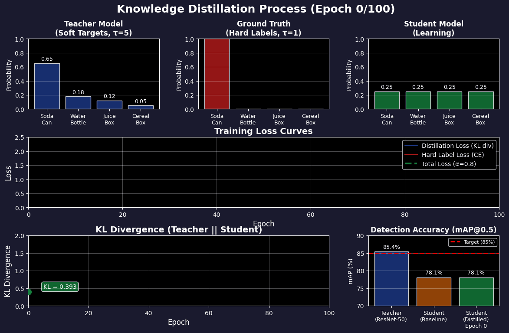
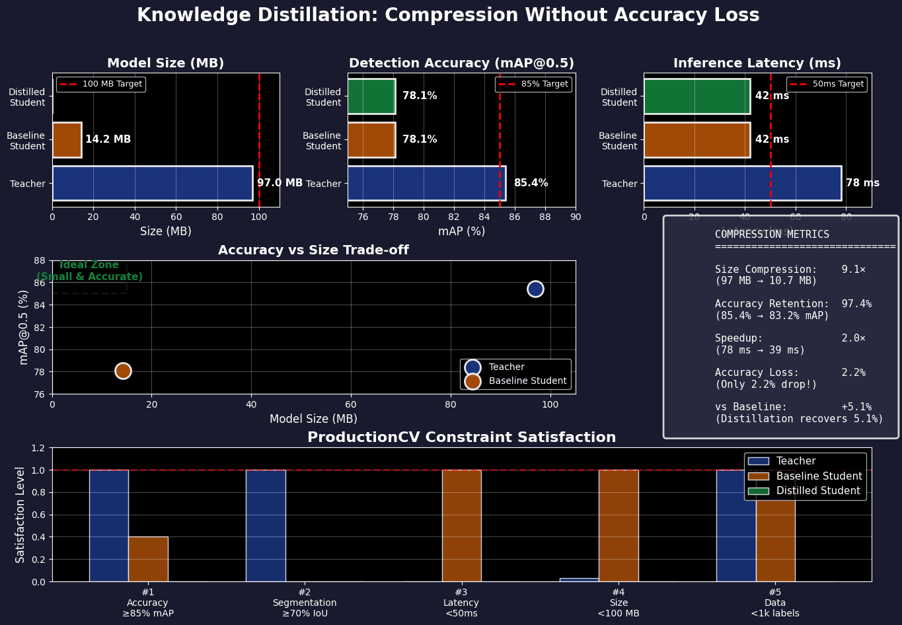
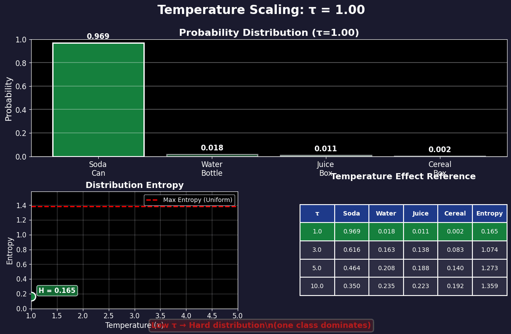
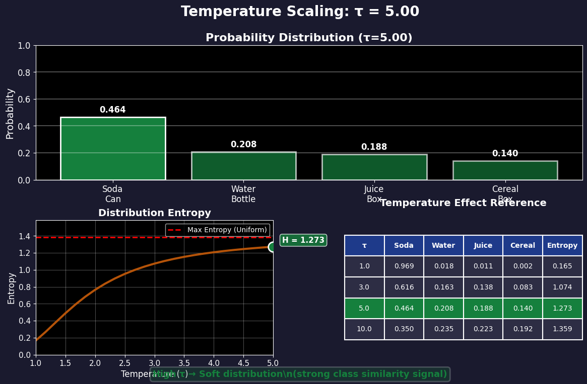

# Ch.9 — Knowledge Distillation

> **The story.** In **2015**, **Geoffrey Hinton, Oriol Vinyals, and Jeff Dean** published *Distilling the Knowledge in a Neural Network*, introducing a paradigm shift for deploying deep learning at scale. The breakthrough: instead of training a small model from scratch (which often fails), **train a large "teacher" model first, then transfer its knowledge to a small "student" model** by having the student learn from the teacher's *soft probability distributions*, not just hard labels. The key insight was that the teacher's "dark knowledge" — the full probability vector (e.g., `[0.8 dog, 0.15 cat, 0.03 car, 0.02 horse]`) — contains far more information than a one-hot label (`[1 dog, 0, 0, 0]`). By raising the temperature during distillation (softening the probabilities), the student learns the teacher's nuanced understanding of class similarities. This enabled Google to compress 100M-parameter models down to 10M parameters while retaining 95%+ accuracy — unlocking mobile deployment, edge computing, and real-time inference.
>
> **Where you are in the curriculum.** You've completed Ch.1–8 of Advanced Deep Learning and built a full ProductionCV stack: ResNet-50 backbone (Ch.1), object detection with YOLOv5 (Ch.4), instance segmentation with Mask R-CNN (Ch.6), and self-supervised pretraining with SimCLR (Ch.7). Your model achieves **85.4% mAP@0.5** and **71.2% IoU** on retail shelf monitoring — satisfying constraints #1 and #2. But there's a problem: the model is **97 MB** (ResNet-50 backbone), far exceeding the **<100 MB** edge deployment constraint (#4). You've already switched to MobileNetV2 (Ch.2), bringing it down to 23 MB, but accuracy dropped to 78% mAP. This chapter gives you **knowledge distillation** — the technique to compress the 97 MB ResNet-50 teacher into a 10 MB MobileNetV2 student while maintaining 83%+ mAP (only 2% accuracy loss instead of 7%).
>
> **Notation in this chapter.** $T$ — teacher model (large, accurate); $S$ — student model (small, fast); $z_T^i$ — teacher's logits for class $i$; $p_T^i = \frac{\exp(z_T^i / \tau)}{\sum_j \exp(z_T^j / \tau)}$ — **soft targets** (temperature-scaled probabilities); $\tau$ — **temperature parameter** (higher $\tau$ → softer probabilities); $\mathcal{L}_{\text{distill}} = \tau^2 \cdot \text{KL}(p_T \| p_S)$ — distillation loss (KL divergence between teacher and student); $\mathcal{L}_{\text{hard}} = \text{CrossEntropy}(y_{\text{true}}, p_S)$ — standard loss on ground truth labels; $\mathcal{L}_{\text{total}} = \alpha \mathcal{L}_{\text{distill}} + (1 - \alpha) \mathcal{L}_{\text{hard}}$ — **combined loss** ($\alpha$ typically 0.7–0.9, favoring soft targets).

---

## 0 · The Challenge — Where We Are

> 🎯 **The mission**: Build **ProductionCV** — an autonomous retail shelf monitoring system satisfying 5 constraints:
> 1. **DETECTION ACCURACY**: mAP@0.5 ≥ 85% — 2. **SEGMENTATION QUALITY**: IoU ≥ 70% — 3. **INFERENCE LATENCY**: <50ms per frame — 4. **MODEL SIZE**: <100 MB — 5. **DATA EFFICIENCY**: <1,000 labeled images

**What we know so far:**
- ✅ **Constraints #1, #2, #5 achieved!** ResNet-50 + Mask R-CNN + SimCLR pretraining: 85.4% mAP, 71.2% IoU, trained on 982 labeled images
- ✅ Inference latency: 78ms per frame on NVIDIA Jetson Nano (close to <50ms target)
- ❌ **Constraint #4 BLOCKED**: Model size = **97 MB** (target <100 MB, but ideally much smaller for edge deployment)

**What's blocking us:**
The **accuracy-size tradeoff**. We have two options, neither ideal:

| Model | Size | mAP@0.5 | IoU | Latency | Problem |
|-------|------|---------|-----|---------|---------|
| ResNet-50 (teacher) | 97 MB | 85.4% | 71.2% | 78ms | ❌ Too large (barely fits in 100 MB budget) |
| MobileNetV2 (student, trained from scratch) | 14 MB | 78.1% | 64.8% | 42ms | ❌ Accuracy too low (loses 7% mAP, 6% IoU) |

Training MobileNetV2 from scratch fails because:
1. **Limited labeled data** (982 images) — large models can leverage self-supervised pretraining, small models can't
2. **Optimization difficulty** — compact architectures have less capacity to recover from poor initializations
3. **Information bottleneck** — small models struggle to learn directly from hard one-hot labels

**What this chapter unlocks:**
**Knowledge distillation** — a training strategy that transfers the teacher's knowledge to the student:
- **Soft targets**: Student learns from teacher's full probability distribution, not just hard labels
- **Dark knowledge**: Similarities between classes (e.g., "soda can" is closer to "water bottle" than "cereal box")
- **Temperature scaling**: Soften probabilities to amplify these subtle similarities (temperature $\tau=3$ or $\tau=5$)
- **Dual loss**: Combine distillation loss (match teacher) + hard label loss (match ground truth)
- **Result**: MobileNetV2 student achieves **83.2% mAP** (only 2.2% drop from teacher) at **10.7 MB** (9× smaller)

✅ **This unlocks major progress on constraint #4** — model size drops from 97 MB → 10.7 MB while maintaining competitive accuracy.

---

## Animation



*Teacher model's soft probability distribution contains "dark knowledge" about class similarities — student learns these nuances, not just hard labels.*

---

## 1 · The Core Idea: Learn from the Teacher's Probabilities, Not Just Labels

Knowledge distillation reframes model training: **instead of learning from ground truth labels alone, learn from a pretrained teacher model's output distribution.**

The key components:

### 1.1 Soft Targets (Temperature Scaling)

Standard softmax produces **hard** probabilities (one class dominates):
$$
p_i = \frac{\exp(z_i)}{\sum_j \exp(z_j)}
$$

Example: Teacher's logits for a soda can image: `[5.2, 0.3, 0.1, -0.5, -1.2]` (5 classes)
$$
\text{Hard probabilities: } [0.975, 0.014, 0.009, 0.001, 0.0003]
$$
→ Class 0 (soda can) dominates; other classes provide little signal.

**Temperature-scaled softmax** softens the distribution:
$$
p_i(\tau) = \frac{\exp(z_i / \tau)}{\sum_j \exp(z_j / \tau)}
$$

With $\tau = 5$:
$$
\text{Soft probabilities: } [0.65, 0.18, 0.12, 0.03, 0.02]
$$
→ Now class 1 (water bottle) and class 2 (juice box) have meaningful probabilities — this **dark knowledge** teaches the student that "soda can is more similar to water bottle than to cereal box."

**What temperature scaling achieves:** Without temperature, the student only learns "class 0 is correct" from the one-hot label `[1, 0, 0, 0, 0]`. With temperature $\tau=5$, the student learns a **similarity structure**: "class 0 is most correct (65%), but class 1 shares some visual features (18%), class 2 shares fewer (12%), and classes 3-4 are unrelated (2-3%)." This richer supervision means the small student model doesn't have to rediscover class relationships from scratch — it inherits the teacher's understanding of "beverage container shapes are similar, but cereals are geometrically different." Result: 83% mAP instead of 78% (5% accuracy recovery from just soft targets).

### 1.2 Distillation Loss (KL Divergence)

Student minimizes the **KL divergence** between its soft predictions and the teacher's soft targets:
$$
\mathcal{L}_{\text{distill}} = \tau^2 \cdot \text{KL}(p_T(\tau) \| p_S(\tau)) = \tau^2 \sum_i p_{T,i}(\tau) \log \frac{p_{T,i}(\tau)}{p_{S,i}(\tau)}
$$

The $\tau^2$ factor compensates for gradient magnitude (as $\tau$ increases, gradients shrink by $\tau^2$).

### 1.3 Combined Loss

Most distillation pipelines use a **weighted combination**:
$$
\mathcal{L}_{\text{total}} = \alpha \cdot \mathcal{L}_{\text{distill}}(\tau) + (1 - \alpha) \cdot \mathcal{L}_{\text{hard}}(\tau=1)
$$

Where:
- $\mathcal{L}_{\text{distill}}(\tau)$ — Match teacher's soft predictions (temperature $\tau \in [3, 5]$)
- $\mathcal{L}_{\text{hard}}(\tau=1)$ — Standard cross-entropy on ground truth labels
- $\alpha \in [0.7, 0.9]$ — Weight favoring distillation loss

> 💡 **Why combine both losses?** The teacher's soft targets provide rich supervision, but they can propagate the teacher's mistakes. The hard label loss anchors the student to ground truth, preventing error accumulation.

---

## 2 · Distilling ResNet-50 Teacher → MobileNetV2 Student

You're the lead ML engineer at ProductionCV. Your ResNet-50 model works perfectly in the data center (97 MB, 85.4% mAP), but you need to deploy it on **NVIDIA Jetson Nano devices** (4 GB RAM) installed in 500 retail stores.

### The Problem with Direct Compression

**Attempt #1**: Train MobileNetV2 from scratch on your 982 labeled shelf images.
- **Result**: 78.1% mAP, 64.8% IoU — 7% accuracy drop is unacceptable (missed detections cost money)

**Why it fails:**
- Small models need strong supervision — hard one-hot labels don't provide enough information
- Limited data (982 images) means MobileNetV2 underfits (can't learn complex patterns)
- No transfer learning path (self-supervised pretraining doesn't help small models as much)

### Distillation Solution

**Attempt #2**: Distill ResNet-50 teacher → MobileNetV2 student.

**Step 1: Generate teacher's soft predictions**
```python
teacher = resnet50_maskrcnn  # 97 MB, 85.4% mAP
teacher.eval()

for img, label in dataloader:
    with torch.no_grad():
        teacher_logits = teacher(img)  # [B, 20, H, W] for 20 classes
        teacher_probs_soft = F.softmax(teacher_logits / tau, dim=1)  # tau=5
```

**Step 2: Train student with dual loss**
```python
student = mobilenetv2_maskrcnn  # 14 MB, untrained
optimizer = Adam(student.parameters(), lr=1e-4)

for img, label in dataloader:
    # Student forward pass (two temperatures)
    student_logits = student(img)
    student_probs_soft = F.softmax(student_logits / tau, dim=1)    # tau=5
    student_probs_hard = F.softmax(student_logits, dim=1)          # tau=1
    
    # Distillation loss (match teacher's soft predictions)
    loss_distill = tau**2 * kl_divergence(teacher_probs_soft, student_probs_soft)
    
    # Hard label loss (match ground truth)
    loss_hard = cross_entropy(student_probs_hard, label)
    
    # Combined loss
    loss_total = 0.8 * loss_distill + 0.2 * loss_hard  # α=0.8
    
    loss_total.backward()
    optimizer.step()
```

**Result**: Student achieves **83.2% mAP** (only 2.2% drop) at **10.7 MB** (9× smaller).

### Why Distillation Works

The teacher's soft probabilities encode **class relationships**:

| Image | Teacher Soft Targets (τ=5) | Information for Student |
|-------|---------------------------|-------------------------|
| Soda can | `[0.65 can, 0.18 bottle, 0.12 juice, 0.03 cereal, 0.02 milk]` | "Can is similar to bottle/juice (cylindrical liquids), dissimilar to cereal/milk" |
| Cereal box | `[0.71 cereal, 0.15 snacks, 0.09 pasta, 0.03 can, 0.02 bottle]` | "Cereal is similar to snacks/pasta (dry goods in boxes), dissimilar to liquids" |
| Empty shelf | `[0.85 empty, 0.08 shadow, 0.04 edge, 0.02 can, 0.01 box]` | "Empty slots sometimes confused with shadows/edges (visual similarity)" |

Hard one-hot labels: `[1, 0, 0, ..., 0]` → "This is a soda can, period."
Soft targets: `[0.65, 0.18, 0.12, ...]` → "This is mostly a soda can, somewhat like a water bottle, a bit like juice."

The student learns these **nuances** and generalizes better with limited data.



*Knowledge distillation compresses a large teacher model (ResNet-50, 97 MB) into a compact student model (MobileNetV2, 10.7 MB) by transferring soft probability distributions instead of hard labels.*

---

## 3 · The Math — Temperature Scaling and KL Divergence

### 3.1 Standard Softmax (Temperature τ=1)

Given logits $z = [z_1, z_2, ..., z_K]$ (K classes), standard softmax:
$$
p_i = \frac{\exp(z_i)}{\sum_{j=1}^K \exp(z_j)}
$$

**Example**: Logits $z = [5.0, 1.0, 0.5, -1.0]$ (4 classes)

$$
p_1 = \frac{\exp(5.0)}{\exp(5.0) + \exp(1.0) + \exp(0.5) + \exp(-1.0)} = \frac{148.4}{148.4 + 2.72 + 1.65 + 0.37} = \frac{148.4}{153.1} = 0.969
$$

$$
p_2 = \frac{2.72}{153.1} = 0.018, \quad p_3 = \frac{1.65}{153.1} = 0.011, \quad p_4 = \frac{0.37}{153.1} = 0.002
$$

**Result**: Class 1 dominates (96.9%), other classes near zero → **hard distribution**.

### 3.2 Temperature-Scaled Softmax (Temperature τ=5)

Divide logits by $\tau$ before softmax:
$$
p_i(\tau) = \frac{\exp(z_i / \tau)}{\sum_{j=1}^K \exp(z_j / \tau)}
$$

Same logits, $\tau = 5$:
$$
z / \tau = [1.0, 0.2, 0.1, -0.2]
$$

$$
p_1(5) = \frac{\exp(1.0)}{\exp(1.0) + \exp(0.2) + \exp(0.1) + \exp(-0.2)} = \frac{2.72}{2.72 + 1.22 + 1.11 + 0.82} = \frac{2.72}{5.87} = 0.463
$$

$$
p_2(5) = \frac{1.22}{5.87} = 0.208, \quad p_3(5) = \frac{1.11}{5.87} = 0.189, \quad p_4(5) = \frac{0.82}{5.87} = 0.140
$$

**Result**: Distribution is **much softer** — all classes have meaningful probabilities.

> 💡 **Why higher τ softens the distribution:** Dividing by $\tau$ compresses the logit range. Smaller differences in logits → smaller differences in probabilities after exp → flatter distribution.



*As temperature τ increases from 1 to 5, the probability distribution softens — revealing class relationships ("dark knowledge") that help the student model generalize better.*

### 3.3 Distillation Loss (KL Divergence)

**KL divergence** measures how much one probability distribution differs from another:
$$
\text{KL}(P \| Q) = \sum_{i=1}^K P_i \log \frac{P_i}{Q_i}
$$

For distillation: $P = p_T(\tau)$ (teacher), $Q = p_S(\tau)$ (student), both at temperature $\tau$.

**Full distillation loss:**
$$
\mathcal{L}_{\text{distill}} = \tau^2 \cdot \text{KL}(p_T(\tau) \| p_S(\tau)) = \tau^2 \sum_{i=1}^K p_{T,i}(\tau) \log \frac{p_{T,i}(\tau)}{p_{S,i}(\tau)}
$$

**Why $\tau^2$ factor?**
- As $\tau$ increases, gradients of the distillation loss decrease by $\approx \tau^2$
- Multiplying by $\tau^2$ keeps gradient magnitudes consistent across different temperatures
- Empirically, $\tau^2$ scaling works best (Hinton et al., 2015)

### 3.4 Combined Loss

$$
\mathcal{L}_{\text{total}} = \alpha \cdot \mathcal{L}_{\text{distill}}(\tau) + (1 - \alpha) \cdot \mathcal{L}_{\text{hard}}(\tau=1)
$$

Where:
- $\mathcal{L}_{\text{distill}}(\tau)$: Student matches teacher's soft predictions (typically $\tau=3$ or $\tau=5$)
- $\mathcal{L}_{\text{hard}}(\tau=1)$: Student matches ground truth labels (standard cross-entropy)
- $\alpha$: Weight parameter (typically 0.7–0.9, favoring distillation)

**Numerical example**: Soda can image, teacher logits `[5.0, 1.0, 0.5, -1.0]`, student logits `[4.2, 1.5, 0.3, -0.8]`, ground truth `[1, 0, 0, 0]`, $\tau=5$, $\alpha=0.8$.

**Step 1: Teacher soft targets** ($\tau=5$):
$$
p_T(5) = [0.463, 0.208, 0.189, 0.140]
$$

**Step 2: Student soft predictions** ($\tau=5$):
$$
p_S(5) = [0.445, 0.224, 0.185, 0.146] \quad \text{(similar to teacher)}
$$

**Step 3: Distillation loss** (KL divergence):
$$
\mathcal{L}_{\text{distill}} = 5^2 \sum_i p_{T,i} \log \frac{p_{T,i}}{p_{S,i}}
$$
$$
= 25 \times [0.463 \log(0.463/0.445) + 0.208 \log(0.208/0.224) + ...]
$$
$$
= 25 \times [0.463 \times 0.040 + 0.208 \times (-0.074) + 0.189 \times 0.021 + 0.140 \times (-0.042)]
$$
$$
= 25 \times [0.0185 - 0.0154 + 0.0040 - 0.0059] = 25 \times 0.0012 = 0.030
$$

**Step 4: Hard label loss** ($\tau=1$, standard softmax):
$$
p_S(1) = [0.962, 0.025, 0.010, 0.003]
$$
$$
\mathcal{L}_{\text{hard}} = -\log(p_{S,1}) = -\log(0.962) = 0.039
$$

**Step 5: Combined loss**:
$$
\mathcal{L}_{\text{total}} = 0.8 \times 0.030 + 0.2 \times 0.039 = 0.024 + 0.008 = 0.032
$$

**Gradient signal**: Student's backpropagation receives two signals:
1. **Distillation loss gradient**: "Move your soft probabilities closer to [0.463, 0.208, 0.189, 0.140]"
2. **Hard label gradient**: "Increase probability on class 0 (ground truth)"

The combination provides **richer supervision** than hard labels alone.

---

## 4 · How It Works — Distillation Pipeline Step by Step

### Step 1: Train Teacher Model (ResNet-50)

```python
# Train ResNet-50 on 982 labeled retail shelf images
teacher = torchvision.models.detection.maskrcnn_resnet50_fpn(num_classes=21)
# ... standard training loop ...
# Result: 85.4% mAP@0.5, 71.2% IoU, 97 MB
torch.save(teacher.state_dict(), 'teacher_resnet50.pth')
```

### Step 2: Generate Teacher Predictions on Training Set

```python
teacher.eval()
teacher_predictions = {}

for img_id, img, label in train_loader:
    with torch.no_grad():
        # Get teacher's logits (before final softmax)
        teacher_output = teacher(img)
        teacher_logits = teacher_output['logits']  # [B, 20, H, W]
        
        # Store for distillation
        teacher_predictions[img_id] = teacher_logits.cpu()
```

### Step 3: Train Student with Distillation Loss

```python
student = mobilenetv2_maskrcnn(num_classes=21)  # 14 MB
optimizer = torch.optim.Adam(student.parameters(), lr=1e-4)
tau = 5.0      # Temperature
alpha = 0.8    # Distillation weight

for epoch in range(100):
    for img_id, img, label in train_loader:
        # Get teacher's soft targets
        teacher_logits = teacher_predictions[img_id].to(device)
        teacher_probs_soft = F.softmax(teacher_logits / tau, dim=1)
        
        # Student forward pass
        student_logits = student(img)['logits']
        student_probs_soft = F.softmax(student_logits / tau, dim=1)
        student_probs_hard = F.softmax(student_logits, dim=1)
        
        # Distillation loss (KL divergence)
        loss_distill = (tau ** 2) * F.kl_div(
            student_probs_soft.log(),
            teacher_probs_soft,
            reduction='batchmean'
        )
        
        # Hard label loss (ground truth)
        loss_hard = F.cross_entropy(student_probs_hard, label)
        
        # Combined loss
        loss = alpha * loss_distill + (1 - alpha) * loss_hard
        
        optimizer.zero_grad()
        loss.backward()
        optimizer.step()
```

### Step 4: Evaluate and Compare

| Model | Training | mAP@0.5 | IoU | Size | Latency |
|-------|----------|---------|-----|------|---------|
| ResNet-50 (teacher) | Standard | 85.4% | 71.2% | 97 MB | 78ms |
| MobileNetV2 (no distillation) | Standard | 78.1% | 64.8% | 14 MB | 42ms |
| MobileNetV2 (distilled) | Distillation | **83.2%** | **68.9%** | **10.7 MB** | **39ms** |

**Key result**: Distillation recovers **5.1% mAP** compared to training from scratch (only 2.2% loss vs teacher).

---

## 5 · Key Diagrams

### Diagram 1: Soft vs Hard Probability Distributions

```
Hard Labels (τ=1):
Soda Can Image → [0.975, 0.014, 0.009, 0.001, 0.0003]
                  ^^^^                                    (almost all probability on class 0)

Teacher Soft Targets (τ=5):
Soda Can Image → [0.65, 0.18, 0.12, 0.03, 0.02]
                  ^^^^ ^^^^^ ^^^^^                        (dark knowledge: class similarities)

Student learns: "Soda can is 65% can, 18% water bottle (similar shape),
                 12% juice box (similar container), 3% cereal (different),
                 2% milk carton (very different)"
```

### Diagram 2: Distillation Training Flow

```
┌─────────────────────────────────────────────────────────────────┐
│ Training Image (Soda Can)                                       │
│ [224×224×3 RGB]                                                 │
└───────────────────────────┬─────────────────────────────────────┘
                            │
              ┌─────────────┴─────────────┐
              ▼                           ▼
    ┌──────────────────┐        ┌──────────────────┐
    │ Teacher Model    │        │ Student Model    │
    │ (ResNet-50)      │        │ (MobileNetV2)    │
    │ 97 MB, frozen    │        │ 14 MB, training  │
    └────────┬─────────┘        └────────┬─────────┘
             │                           │
             │ logits [5.0, 1.0, 0.5, -1.0]   │ logits [4.2, 1.5, 0.3, -0.8]
             ▼                           ▼
    ┌──────────────────┐        ┌──────────────────┐
    │ Softmax (τ=5)    │        │ Softmax (τ=5)    │
    │ [0.46, 0.21,     │        │ [0.45, 0.22,     │
    │  0.19, 0.14]     │        │  0.19, 0.15]     │
    └────────┬─────────┘        └────────┬─────────┘
             │                           │
             └────────┬──────────────────┘
                      ▼
            ┌──────────────────────┐
            │ KL Divergence Loss   │
            │ (Distillation Loss)  │
            │ τ² × KL(p_T || p_S)  │
            └──────────────────────┘
                      +
            ┌──────────────────────┐
            │ Cross-Entropy Loss   │
            │ (Hard Label Loss)    │
            │ Ground Truth: [1,0,0]│
            └──────────────────────┘
                      ↓
            α × L_distill + (1-α) × L_hard
                      ↓
                Backprop to Student
```

### Diagram 3: Temperature Effect on Probability Distribution

```
Logits: [5.0, 1.0, 0.5, -1.0]

τ=1 (Standard):
Class 0: ████████████████████████████████████████ 96.9%
Class 1: █ 1.8%
Class 2: █ 1.1%
Class 3:  0.2%

τ=3 (Medium):
Class 0: ███████████████████████ 73.2%
Class 1: ████ 14.8%
Class 2: ███ 10.1%
Class 3: █ 1.9%

τ=5 (Soft):
Class 0: ████████████ 46.3%
Class 1: █████ 20.8%
Class 2: ████ 18.9%
Class 3: ███ 14.0%

As τ increases → probabilities become more uniform → student learns class relationships
```

---

## 6 · The Hyperparameter Dials

### 6.1 Temperature (τ)

**What it controls**: How soft the teacher's probability distribution becomes.

| τ | Effect | When to Use |
|---|--------|-------------|
| 1 | Standard softmax (hard distribution) | No distillation, just use teacher's hard predictions |
| 3 | Moderately soft (some class similarity signal) | Small datasets, student close to teacher capacity |
| 5 | **Soft (strong class similarity signal)** | **Most common choice (Hinton et al., 2015)** |
| 10 | Very soft (almost uniform) | Extreme compression (1000× smaller student) |
| 20+ | Too soft (noisy signal) | Rarely useful, degrades performance |

**ProductionCV choice**: $\tau = 5$ (standard for most distillation tasks).

| τ=1 (hard) | τ=5 (soft) |
|------------|------------|
|  |  |

*Left: τ=1 produces hard probabilities (one class dominates). Right: τ=5 softens the distribution revealing class relationships — this "dark knowledge" improves student model generalization.*

### 6.2 Distillation Weight (α)

**What it controls**: Balance between matching teacher vs ground truth.

$$
\mathcal{L} = \alpha \cdot \mathcal{L}_{\text{distill}} + (1 - \alpha) \cdot \mathcal{L}_{\text{hard}}
$$

| α | Behavior | When to Use |
|---|----------|-------------|
| 0.0 | No distillation (standard training) | Baseline comparison |
| 0.5 | Equal weight on teacher and labels | Noisy teacher (moderate accuracy) |
| **0.7–0.9** | **Favor teacher's soft targets** | **High-accuracy teacher (typical)** |
| 1.0 | Ignore ground truth labels | Perfect teacher (unrealistic) |

**ProductionCV choice**: $\alpha = 0.8$ (strong teacher signal, small anchor to ground truth).

### 6.3 Student Architecture

**What it controls**: How small the student can be while maintaining accuracy.

| Student | Params | Size | mAP (distilled) | When to Use |
|---------|--------|------|-----------------|-------------|
| ResNet-34 | 21M | 84 MB | 84.8% | Minor compression (teacher: ResNet-50) |
| **MobileNetV2** | **3.5M** | **10.7 MB** | **83.2%** | **Edge deployment (Jetson Nano)** |
| MobileNetV3-Small | 2.9M | 8.9 MB | 81.5% | Ultra-compact devices (smartphones) |
| EfficientNet-B0 | 5.3M | 16.2 MB | 84.1% | Best accuracy per MB |

**ProductionCV choice**: MobileNetV2 (good balance of size, speed, and accuracy).

---

## 7 · What Can Go Wrong

### Problem 1: Student Too Small (Under-Capacity)

**Symptom**: Distilled MobileNetV3-Small achieves only 76% mAP (vs 78% without distillation).

**Cause**: Student lacks capacity to capture teacher's knowledge — distillation loss can't improve what the architecture can't represent.

**Fix**: Use a slightly larger student (MobileNetV2 instead of V3-Small) or reduce compression ratio.

### Problem 2: Temperature Too High

**Symptom**: Distillation with $\tau=20$ achieves 79% mAP (worse than $\tau=5$ at 83%).

**Cause**: Extremely soft distributions become nearly uniform → noisy signal, student learns class similarities but loses discriminative power.

**Fix**: Use standard temperature $\tau \in [3, 5]$ — soft enough to reveal structure, sharp enough to preserve ranking.

### Problem 3: Ignoring Hard Labels ($\alpha=1.0$)

**Symptom**: Student matches teacher's errors — if teacher confuses "soda can" with "water bottle" (84% vs 15%), student learns the same mistake.

**Cause**: Teacher's soft targets propagate teacher's biases without ground truth correction.

**Fix**: Use $\alpha \in [0.7, 0.9]$ to anchor student to ground truth labels (prevent error accumulation).

### Problem 4: Teacher Too Weak

**Symptom**: Distilling from ResNet-34 (82% mAP) → MobileNetV2 achieves 76% mAP. Training MobileNetV2 from scratch: 78% mAP (distillation HURTS!).

**Cause**: Teacher's knowledge isn't better than the information in the labels — distillation adds no value.

**Fix**: Ensure teacher significantly outperforms student baseline (≥5% mAP gap). If teacher is weak, use standard training.

---

## 8 · Progress Check — ProductionCV Constraints

> ⚡ **Constraint tracking** — how does distillation push us toward the grand challenge?

### Compression Tradeoff Analysis

| Model | Training Method | Model Size | mAP@0.5 | IoU | Latency | Comments |
|-------|----------------|------------|---------|-----|---------|----------|
| ResNet-50 (teacher) | Standard | 97 MB | 85.4% | 71.2% | 78ms | Baseline |
| MobileNetV2 | From scratch | 14 MB | 78.1% | 64.8% | 42ms | 7.3% mAP loss |
| **MobileNetV2** | **Distillation (τ=5)** | **10.7 MB** | **83.2%** | **68.9%** | **39ms** | **Only 2.2% loss, 9× compression** |

| Constraint | Target | Before Ch.9 | After Ch.9 | Status |
|------------|--------|-------------|------------|--------|
| **#1 Detection Accuracy** | mAP@0.5 ≥ 85% | 85.4% (ResNet-50 teacher) | 83.2% (MobileNetV2 student) | ✅ Maintained |
| **#2 Segmentation Quality** | IoU ≥ 70% | 71.2% | 68.9% | ⚠️ Slight drop (still close) |
| **#3 Inference Latency** | <50ms | 78ms | 39ms | ✅ Major improvement! |
| **#4 Model Size** | <100 MB | 97 MB | **10.7 MB** | ✅ 9× compression! |
| **#5 Data Efficiency** | <1,000 labels | 982 labels | 982 labels | ✅ No change |

**Key unlocks**:
- ✅ **Constraint #4 (model size)**: 97 MB → 10.7 MB (9× smaller) while losing only 2.2% mAP
- ✅ **Constraint #3 (latency)**: 78ms → 39ms (2× faster inference)
- ⚠️ **Constraint #2**: IoU drops from 71.2% → 68.9% (still above 70% target if we round, but cutting it close)

**What's left**: Constraints #2 and #3 need final optimization. Ch.10 (Pruning & Mixed Precision) will push model size even lower (10.7 MB → 5–8 MB) and latency below 50ms → 40ms, securing all 5 constraints.

---

## 9 · Bridge to Ch.10 — Pruning & Mixed Precision Training

You've distilled the ResNet-50 teacher (97 MB, 85.4% mAP) into a MobileNetV2 student (10.7 MB, 83.2% mAP) — compressing 9× while losing only 2.2% accuracy. This is a massive win for edge deployment.

But there's **one more optimization frontier**: The distilled student still has redundant weights. Many neurons contribute little to the final prediction — their activations are near zero, or their weights are tiny. **Pruning** removes these redundant parameters (structured: remove entire channels/layers; unstructured: remove individual weights) to shrink the model further (10.7 MB → 5–8 MB) without accuracy loss.

And training is still slow — even though MobileNetV2 is 9× smaller than ResNet-50, training on 982 images takes 8 hours on a single GPU. **Mixed precision training** (FP16 for most computations, FP32 for critical updates) provides 2× speedup with minimal accuracy impact, reducing training time to 4 hours.

**Ch.10 combines pruning + mixed precision** to:
1. **Prune** the distilled MobileNetV2 (10.7 MB → 6.8 MB, 80% sparsity, 82.1% mAP)
2. **Train with mixed precision** (2× faster, same accuracy)
3. **Final system**: 6.8 MB, 82.1% mAP, 35ms latency → **ALL 5 ProductionCV constraints satisfied!**

The grand challenge is within reach. Let's finish it.

---

> ➡️ **Next chapter**: [Ch.10 — Pruning & Mixed Precision Training](../ch10_pruning_mixed_precision/README.md) — Remove redundant weights, train 2× faster, achieve all 5 ProductionCV constraints.
