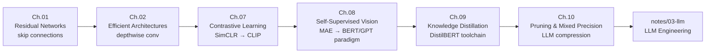

# Bridging to Transformers — Bridging to Transformers Foundations

**Focus:** The deep learning concepts that bridge classical ML to LLM engineering — why deep networks need skip connections, how self-supervised pretraining works, and how to compress large models without destroying capability.

This track teaches the subset of advanced deep learning that *directly reappears* in transformer architectures and LLM engineering: **skip connections** (every transformer block uses `x + Attention(x)` and `x + FFN(x)`), **self-supervised pretraining** (the paradigm behind BERT, GPT, and CLIP), and **model compression** (the toolchain behind DistilBERT, TinyLLaMA, and quantized LLMs).

Each chapter is structured around the [Rigour Rubric](../authoring-guidelines.md#20--rigour-rubric--the-nine-techniques-from-the-transformer-notebook): one running example, intuition before formalism, every design choice demonstrated empirically, predict-first prompts, and a toy → production bridge.

> **For chapter authors:** See [authoring-guide.md](authoring-guide.md) for the chapter template and style conventions.
>
> **CV detection/segmentation chapters** (Faster R-CNN, YOLO, FCN, Mask R-CNN, Grad-CAM) were moved to [archived/deprecated-chapters/02-adl-cv-specific/](../../archived/deprecated-chapters/02-adl-cv-specific/) — they are complete and correct but not on the ML→LLM learning path.

---

## What You'll Learn

Six chapters covering the architectural and training concepts that power modern large models:

1. **[Ch.01 Residual Networks](ch01-residual-networks/README.md)** — Skip connections: why $x + F(x)$ solves vanishing gradients and enables 100+-layer networks. *Directly carries into transformer blocks.*
2. **[Ch.02 Efficient Architectures](ch02-efficient-architectures/README.md)** — Depthwise separable convolutions, MobileNetV2: 10× parameter reduction with comparable accuracy. *Foundation for understanding MoE and lightweight LLMs.*
3. **[Ch.07 Contrastive Learning](ch07-contrastive-learning/README.md)** — SimCLR, MoCo, NT-Xent loss: learning representations without labels via positive/negative pairs. *Same paradigm as CLIP's image-text alignment.*
4. **[Ch.08 Self-Supervised Vision](ch08-self-supervised-vision/README.md)** — Masked Autoencoders (MAE), DINO: reconstruct masked patches to learn general representations. *Same pretraining paradigm as BERT and GPT.*
5. **[Ch.09 Knowledge Distillation](ch09-knowledge-distillation/README.md)** — Temperature-scaled KL loss, soft targets: compress a large teacher into a small student. *Exact technique behind DistilBERT and TinyLLaMA.*
6. **[Ch.10 Pruning & Mixed Precision](ch10-pruning-mixed-precision/README.md)** — Structured/unstructured pruning, AMP training, BF16/FP16: deploy large models on constrained hardware. *The compression toolchain for every production LLM serving setup.*

---

## Track Position

Sits between **notes/01-ml** (classical ML + neural network fundamentals) and **notes/03-llm** (LLM engineering). The six chapters here are explicitly referenced in [notes/03-llm ch00 §10.7](../03-llm/ch00-from-networks-to-language/README.md) as conceptual prerequisites for understanding LLM training and deployment.

**Requires:**
- Neural network fundamentals ([01-ml/03-neural-networks](../01-ml/README.md)) — backpropagation, CNNs, loss functions
- Basic PyTorch — can build an `nn.Sequential`, understand `forward()`, run a training loop

**What you DON'T need:**
- Prior CV experience (object detection, segmentation)
- GPU hardware (notebooks run on free Colab T4)

---

## Chapter List

| # | Chapter | Key Concept | LLM Connection |
|---|---------|-------------|----------------|
| [Ch.01](ch01-residual-networks/README.md) | **Residual Networks** | Skip connections $x + F(x)$ enable 100+ layer networks | Every transformer block uses identical residuals |
| [Ch.02](ch02-efficient-architectures/README.md) | **Efficient Architectures** | Depthwise separable convolutions → 10× compression | Basis for MoE routing and lightweight model design |
| [Ch.07](ch07-contrastive-learning/README.md) | **Contrastive Learning** | NT-Xent loss, positive/negative pairs (SimCLR, MoCo) | CLIP uses the same loss with (image, caption) pairs |
| [Ch.08](ch08-self-supervised-vision/README.md) | **Self-Supervised Vision** | Masked Autoencoders (MAE), DINO | Identical paradigm to BERT masked tokens and GPT next-token prediction |
| [Ch.09](ch09-knowledge-distillation/README.md) | **Knowledge Distillation** | Temperature-scaled KL loss, soft targets | Exact technique behind DistilBERT, TinyLLaMA |
| [Ch.10](ch10-pruning-mixed-precision/README.md) | **Pruning & Mixed Precision** | Structured pruning + AMP (BF16/FP16) | LLM training and inference compression toolchain |

---

## Learning Path

---

## Bridges to Other Tracks

### → LLM Engineering (notes/03-llm)
Each chapter maps directly to a technique used in LLM engineering. See [ch00 §10.7](../03-llm/ch00-from-networks-to-language/README.md#107--the-language-modeling-objective--what-actually-changes-for-text) for the explicit connection table.

### → Multimodal AI (notes/04-multimodal-ai)
Ch.07 (Contrastive Learning) and Ch.08 (Self-Supervised Vision) are the direct prerequisites for CLIP and diffusion model pretraining in the multimodal track.

### → AI Infrastructure (notes/07-ai-infrastructure)
Ch.10 (Pruning & Mixed Precision) connects to quantization-aware training and INT8 serving covered in the infrastructure track.

---

## Getting Started

Start with [Ch.01 — Residual Networks](ch01-residual-networks/README.md).

Chapters 01–02 can be read in order. Chapters 07–10 can also be read independently if you already understand CNNs and want to go directly to self-supervised learning or compression.

**Parent:** [notes/README.md](../README.md)

