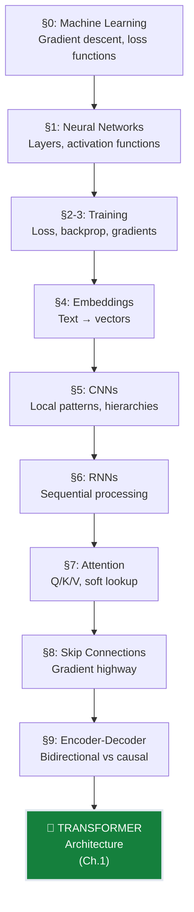

# Ch.0 — ML Prerequisites: From Neural Networks to Transformers

> **The story:** The path to modern AI began long before transformers. In 1986, Rumelhart, Hinton, and Williams published backpropagation—the algorithm that made neural network training practical. In 1997, Hochreiter and Schmidhuber introduced LSTMs, solving the vanishing gradient crisis that had stalled deep learning for years. In 2014, Bahdanau added attention mechanisms to machine translation, introducing the "soft dictionary lookup" that would become the heart of every modern LLM. And in 2015, He et al. published ResNets, showing that skip connections could train networks 100+ layers deep without gradient collapse. When Vaswani et al. unveiled transformers in 2017 with "Attention Is All You Need," they weren't inventing from scratch—they were synthesizing these breakthroughs into an architecture that would power GPT, BERT, Claude, and every foundation model since. This chapter walks through those foundations: gradient descent, backpropagation, embeddings, CNNs, RNNs, attention, and skip connections. You're about to learn why RNNs failed at scale, how attention parallelized sequence processing, and why the "+1" gradient term changed everything.
>
> **Where you are:** You've completed notes/01 (ML fundamentals: gradient descent, loss functions, overfitting) and notes/02 (Advanced DL: ResNets, U-Net, transfer learning). Those tracks taught you *how to train models*. This chapter teaches the specific architectural concepts Ch.1 assumes you know—concepts that made transformers possible. If you've recently finished notes/01 Ch.6 (RNNs/LSTMs), Ch.9 (attention), and notes/02 Ch.1 (ResNets), you can skip directly to Ch.1. If those are fuzzy, this comprehensive chapter rebuilds the intuition from the ground up.
>
> **Notation:** $x_t$ — input at time $t$; $h_t$ — hidden state at time $t$; $W$ — weight matrix; $Q, K, V$ — query, key, value matrices (attention); $\alpha$ — attention weights; $d_k$ — key/query dimension; $\eta$ — learning rate; $\mathcal{L}$ — loss.

---

## §0: What is Machine Learning? (The Big Picture)

### The Core Idea

Imagine you're teaching a child to recognize dogs. You don't write down a rulebook like:
- "If it has four legs AND fur AND barks → it's a dog"

Why? Because you'd miss three-legged dogs, hairless dogs, and dogs that don't bark. Instead, you **show them many examples** and let them figure out the patterns.

That's machine learning in a nutshell: **computers learning patterns from examples** instead of following hand-coded rules.

---

**Animation: "Rule-based vs ML approach"**
- Shows: Two paths side-by-side
- Left path: Programmer writes if-then rules → brittle system breaks on edge cases
- Right path: Show many dog photos → model learns pattern → robust recognition
- Formula embedded: None (conceptual diagram)

---

### The Three Ingredients

Every machine learning system needs three things:

1. **Data** (examples to learn from)
2. **Model** (the pattern-learner)
3. **Feedback** (how to improve)

Let's make this concrete with a real problem.

### Example: Predicting House Prices

You're a real estate agent. You want to predict house prices based on square footage.

**Your Data (5 houses you sold last month):**

| Square Feet | Actual Price |
|-------------|--------------|
| 800         | $160,000     |
| 1000        | $200,000     |
| 1200        | $240,000     |
| 1500        | $300,000     |
| 1800        | $360,000     |

**Your Model (a simple line):**
```
Price = Square_Feet × m + b
```
Where `m` (slope) and `b` (y-intercept) are numbers the model learns.

**Your First Guess:**
Let's say the model starts with random guesses: `m = 100`, `b = 50,000`.

For the 800 sq ft house, the model predicts:
```
Price = 800 × 100 + 50,000 = $130,000
```

But the actual price was **$160,000**. The model is **off by $30,000**! 😬

---

**Animation: "Single prediction error"**
- Shows: 800 sq ft input → model box (m=100, b=50,000) → output $130,000
- Red gap between prediction ($130k) and actual ($160k) labeled "Error: $30k"
- Formula embedded: ŷ = mx + b

---

### The Training Loop (How Models Learn)

Here's the magic: the model **adjusts** `m` and `b` to reduce errors.

**Step 1: Make Predictions** (for all 5 houses)

| Sq Ft | Actual Price | Predicted Price | Error       |
|-------|--------------|-----------------|-------------|
| 800   | $160,000     | $130,000        | -$30,000    |
| 1000  | $200,000     | $150,000        | -$50,000    |
| 1200  | $240,000     | $170,000        | -$70,000    |
| 1500  | $300,000     | $200,000        | -$100,000   |
| 1800  | $360,000     | $230,000        | -$130,000   |

**Step 2: Measure Overall Error**

Average error = ($30k + $50k + $70k + $100k + $130k) / 5 = **$76,000** 🤯

(In practice, we use **Mean Squared Error** to penalize big mistakes more, but the idea is the same.)

**Step 3: Adjust the Model**

The model says: "I'm underpredicting by a lot. I need to increase `m` (make the line steeper) and increase `b` (shift it up)."

New values: `m = 180`, `b = 20,000`

**Step 4: Repeat**

Now predictions look like:

| Sq Ft | Actual Price | New Prediction | New Error  |
|-------|--------------|----------------|------------|
| 800   | $160,000     | $164,000       | +$4,000    |
| 1000  | $200,000     | $200,000       | $0         |
| 1200  | $240,000     | $236,000       | -$4,000    |
| 1500  | $300,000     | $290,000       | -$10,000   |
| 1800  | $360,000     | $344,000       | -$16,000   |

Average error = **$6,800** ✅ (much better!)

---

**Animation: "Training loop cycle"**
- Shows: Circular flow with 4 stages
  1. Data → Model (current m, b)
  2. Model → Predictions (show 5 outputs)
  3. Predictions vs Actual → Error calculation (show average)
  4. Error → Weight adjustment (show m and b changing)
- Loop arrow returns to stage 1
- Formula embedded: Error = (1/n)Σ|ŷᵢ - yᵢ|

---

The model keeps doing this loop hundreds or thousands of times until errors get tiny. That's **training**.

### Why This Beats Hard-Coded Rules

**Hard-coded approach:**
```python
if square_feet < 1000:
    price = 180000
elif square_feet < 1500:
    price = 270000
else:
    price = 360000
```

**Problems:**
- ❌ Doesn't handle 1100 sq ft well (is it $180k or $270k?)
- ❌ Can't adapt to new data (what if prices rise 10% next year?)
- ❌ Breaks for new features (what if we add "number of bedrooms"?)

**Machine learning approach:**
- ✅ Learns the exact relationship from data
- ✅ Updates automatically with new examples
- ✅ Easily extends to multiple features

---

### Supervised Learning: The Most Common Type

In our house price example, we had **labeled data**: each input (square feet) came with the correct output (actual price).

This is called **supervised learning** — like a teacher supervising a student with an answer key.

**Other types you'll hear about:**
- **Unsupervised learning**: Find patterns in data without labels (e.g., group similar customers)
- **Reinforcement learning**: Learn by trial and error with rewards (e.g., game-playing AI)

For this chapter, we focus on **supervised learning** because it's the foundation for 90% of ML applications.

---

**Checkpoint Questions:**

1. In your own words, what's the difference between "programming rules" and "learning from data"?
2. In the house price example, what would happen if we started with `m = 200` and `b = 0`? Would the first predictions be too high or too low?
3. Why do we need multiple training iterations instead of just one?

---

**Animation: "Types of ML triangle"**
- Shows: Triangle with three corners
- Top: Supervised (has labels) - house price, dog photos with tags
- Bottom-left: Unsupervised (no labels) - customer grouping, anomaly detection
- Bottom-right: Reinforcement (rewards) - game AI, robot navigation
- Formula embedded: None (taxonomy diagram)

---

## §1: Neural Networks 101

### What Problem Are We Solving?

Our house price model (`Price = m × Square_Feet + b`) works great for **linear relationships** (straight lines).

But what if the relationship is curved? What if price depends on **multiple factors** like:
- Square footage
- Number of bedrooms
- Age of house
- Distance to downtown

And these factors interact in complex ways? (e.g., "2 bedrooms is great for 800 sq ft, but terrible for 2000 sq ft")

**Neural networks** can learn these complex, non-linear patterns. Let's see how.

---

### The Building Block: A Single Neuron

A **neuron** is just a tiny decision-maker. It takes multiple inputs, weighs them by importance, and produces a single output.

**Concrete Example: Predicting Your Test Score**

Suppose your test score depends on:
- **Hours studied** (let's say you studied 5 hours)
- **Hours slept** (let's say you got 7 hours of sleep)

A single neuron might work like this:

```
Inputs:
  x₁ = 5  (hours studied)
  x₂ = 7  (hours slept)

Weights (learned during training):
  w₁ = 10  (studying is important!)
  w₂ = 3   (sleep helps, but less than studying)

Bias:
  b = 20   (baseline score even if x₁ and x₂ are zero)

Calculation:
  z = w₁×x₁ + w₂×x₂ + b
  z = 10×5 + 3×7 + 20
  z = 50 + 21 + 20
  z = 91

Output:
  Your predicted test score = 91%
```

---

**Animation: "Single neuron computation"**
- Shows: Two inputs (x₁=5, x₂=7) flowing into a circle (neuron)
- Inside circle: multiplication w₁×x₁ (shows 10×5=50), w₂×x₂ (shows 3×7=21)
- Then addition: 50+21+20=91
- Flows to output: 91
- Formula embedded: z = w₁x₁ + w₂x₂ + b

---

**Key Insight:** The weights tell you **what matters**. `w₁ = 10` means studying has 3× the impact of sleep (`w₂ = 3`).

During training, the model learns these weights from data (just like it learned `m` and `b` in the house price example).

---

**Checkpoint Questions:**

1. If you studied 3 hours and slept 8 hours, what would this neuron predict? (Use the same weights: w₁=10, w₂=3, b=20)
2. If the model learns `w₁ = 2` and `w₂ = 10` instead, what would that tell you about what matters for test scores?
3. What does the bias `b` represent? (Hint: what happens if x₁ and x₂ are both zero?)

---

### Adding Activation Functions (Making It Nonlinear)

There's one problem with our neuron: it can only model **straight-line relationships**.

Look what happens if we stack two neurons in a chain:
```
First neuron:  z₁ = w₁×x + b₁
Second neuron: z₂ = w₂×z₁ + b₂
```

Substitute z₁ into z₂:
```
z₂ = w₂×(w₁×x + b₁) + b₂
z₂ = (w₂×w₁)×x + (w₂×b₁ + b₂)
```

This is still a straight line! 😱 You could have 100 layers, but it would collapse to a single line.

**Solution: Activation Functions**

We add a **nonlinear function** after each neuron's calculation. The most popular is **ReLU** (Rectified Linear Unit):

```
ReLU(z) = max(0, z)
```

**What does ReLU do? It "turns off" negative values.**

**Example with numbers:**

| Input z | ReLU(z) |
|---------|---------|
| -2      | 0       |
| -1      | 0       |
| 0       | 0       |
| 1       | 1       |
| 2       | 2       |

---

**Animation: "ReLU activation"**
- Shows: Number line from -3 to +3 on x-axis
- Input values slide along bottom: [-2, -1, 0, 1, 2]
- Pass through ReLU gate (shows max(0,z) operation)
- Output values appear on top: [0, 0, 0, 1, 2]
- Graph: shows bent line (flat at 0 for x<0, then diagonal for x>0)
- Formula embedded: f(z) = max(0, z)

---

**Now let's redo our test score example with ReLU:**

```
Step 1: Weighted sum
  z = 10×5 + 3×7 + 20 = 91

Step 2: Apply ReLU
  output = ReLU(91) = max(0, 91) = 91
```

Since 91 is positive, ReLU doesn't change it. But what if our calculation gave `-15`?

```
If z = -15:
  output = ReLU(-15) = max(0, -15) = 0
```

The neuron "shuts off" for negative inputs. This creates **nonlinear bends** in the model's decision boundary.

---

**Other Common Activations:**

**Sigmoid** (squashes output to 0-1, useful for probabilities):
```
sigmoid(z) = 1 / (1 + e^(-z))
```

Example:
- sigmoid(-5) ≈ 0.007 (very unlikely)
- sigmoid(0) = 0.5 (50/50 chance)
- sigmoid(5) ≈ 0.993 (very likely)

**Tanh** (squashes output to -1 to +1):
```
tanh(z) = (e^z - e^(-z)) / (e^z + e^(-z))
```

Example:
- tanh(-2) ≈ -0.96
- tanh(0) = 0
- tanh(2) ≈ 0.96

**When to use which?**
- **ReLU**: Default choice for hidden layers (fast, works well)
- **Sigmoid**: Output layer for binary classification (yes/no predictions)
- **Tanh**: Sometimes used in recurrent networks (not covered here)

---

**Animation: "Three activation functions comparison"**
- Shows: Three side-by-side graphs, each with input z from -5 to +5
- ReLU: flat at 0 until z=0, then diagonal line upward
- Sigmoid: S-curve from 0 to 1, steep in middle
- Tanh: S-curve from -1 to +1, steep in middle
- Highlight: ReLU = "simple cutoff", Sigmoid = "probability", Tanh = "centered around zero"
- Formulas embedded: All three formulas shown above each graph

---

**Checkpoint Questions:**

1. Calculate ReLU(8), ReLU(-3), and ReLU(0).
2. Why would a network with NO activation functions (just linear operations) fail to learn complex patterns?
3. If you're predicting "Is this email spam?" (yes/no answer), which activation function should you use in the output layer? Why?

---

### Stacking Neurons Into Layers

One neuron can learn simple patterns. To learn complex patterns, we **stack many neurons in layers**.

**A 3-Layer Network Example:**

```
Input Layer (2 neurons - just pass through inputs):
  x₁ = 5   (hours studied)
  x₂ = 7   (hours slept)

Hidden Layer (3 neurons - learn intermediate patterns):
  Neuron H1: z₁ = w₁₁×x₁ + w₁₂×x₂ + b₁ → ReLU(z₁) = h₁
  Neuron H2: z₂ = w₂₁×x₁ + w₂₂×x₂ + b₂ → ReLU(z₂) = h₂
  Neuron H3: z₃ = w₃₁×x₁ + w₃₂×x₂ + b₃ → ReLU(z₃) = h₃

Output Layer (1 neuron - final prediction):
  z_out = w_o1×h₁ + w_o2×h₂ + w_o3×h₃ + b_out
  test_score = z_out
```

**Let's trace through with actual numbers!**

**Weights (learned during training):**
```
Hidden layer:
  Neuron H1: w₁₁=8,  w₁₂=2,  b₁=-10  (maybe learns "total study effort")
  Neuron H2: w₂₁=1,  w₂₂=10, b₂=-40  (maybe learns "well-rested")
  Neuron H3: w₃₁=5,  w₃₂=5,  b₃=0    (maybe learns "overall readiness")

Output layer:
  w_o1=20, w_o2=15, w_o3=10, b_out=0
```

**Forward Pass (computing the prediction):**

**Step 1: Hidden Layer Computations**

```
Neuron H1:
  z₁ = 8×5 + 2×7 + (-10) = 40 + 14 - 10 = 44
  h₁ = ReLU(44) = 44

Neuron H2:
  z₂ = 1×5 + 10×7 + (-40) = 5 + 70 - 40 = 35
  h₂ = ReLU(35) = 35

Neuron H3:
  z₃ = 5×5 + 5×7 + 0 = 25 + 35 + 0 = 60
  h₃ = ReLU(60) = 60
```

**Step 2: Output Layer Computation**

```
z_out = 20×44 + 15×35 + 10×60 + 0
z_out = 880 + 525 + 600
z_out = 2005

Final prediction: test_score = 2005
```

Wait, 2005%?! 🤯 That's impossible! This shows our weights are **not trained yet** — they're random garbage.

After training on real data (hundreds of students' study/sleep hours and their actual scores), the model would learn sensible weights that produce scores like 75%, 88%, etc.

---

**Animation: "3-layer forward pass"**
- Shows: Network diagram with nodes and edges
- Left: 2 input nodes (x₁=5, x₂=7)
- Middle: 3 hidden nodes (H1, H2, H3) with ReLU symbols
- Right: 1 output node (test_score)
- Values flow through edges (show numbers appearing):
  - x₁, x₂ → each hidden node (show multiplications)
  - z₁=44 → ReLU → h₁=44 (highlighted calculation)
  - Repeat for H2, H3
  - h₁, h₂, h₃ → output (show multiplications)
  - Final: 2005 (with warning: "Not trained yet!")
- Formula embedded: z = Wx + b, then h = ReLU(z)

---

### Why Do We Need Multiple Layers?

Think of layers as **building up abstractions**:

**Example: Recognizing Handwritten Digits**

- **Layer 1** (close to input): Detects edges and curves
  - "There's a vertical line here"
  - "There's a curve here"

- **Layer 2**: Combines edges into parts
  - "Vertical line + curve = could be '2' or '3'"
  - "Two curves = could be '8' or '0'"

- **Layer 3**: Combines parts into full digits
  - "Top curve + middle line + bottom curve = definitely '8'"

**Why can't one layer do it all?**

Imagine trying to recognize faces with just one step:
- ❌ Pixels → "Is it Bob?" (too big a jump!)

Better:
- ✅ Pixels → edges → facial features (nose, eyes) → face identity

Each layer learns a **hierarchy of features**, from simple to complex.

---

**Animation: "Hierarchical feature learning"**
- Shows: Three columns representing 3 layers
- Column 1 (Input): Raw pixels of handwritten "8"
- Column 2 (Hidden Layer 1): Zoomed boxes showing edge detectors (vertical, horizontal, curves)
- Column 3 (Hidden Layer 2): Assembled parts (top loop, bottom loop, middle crossing)
- Column 4 (Output): Final prediction: "8" with 98% confidence
- Arrows show how simple features combine into complex ones
- Formula embedded: None (conceptual diagram)

---

**Checkpoint Questions:**

1. In a 3-layer network (input → hidden → output), which layer learns the most abstract features?
2. If all neurons used NO activation function (just z = Wx + b), what would happen if you stacked 100 layers?
3. Walk through the forward pass: If x₁=10, x₂=5, w₁₁=2, w₁₂=3, b₁=-5, and we use ReLU, what is h₁?

---

## §2: Training Neural Networks: The Core Loop

Now that we understand how neural networks make predictions, we need to tackle the central challenge: **how do we make them get better at their job?**

Think of training like teaching someone to throw darts. You don't just tell them "throw better" — you need:
1. **A score** that measures how far their dart landed from the bullseye
2. **A strategy** to adjust their aim based on that score

In machine learning, we call these:
1. **Loss functions** (the score)
2. **Gradient descent** (the adjustment strategy)

This section walks through both, with real numbers at every step.

---

### 2.1: Loss Functions — Measuring How Wrong We Are

#### Why One Number?

Imagine training a house price predictor. Your model makes these predictions:

| House | True Price | Predicted | Error |
|-------|-----------|-----------|-------|
| A | $200k | $180k | -$20k |
| B | $300k | $350k | +$50k |
| C | $150k | $140k | -$10k |

We have three separate errors. To train the model, we need **one single number** that captures "how wrong we are overall." Why?

- Our training algorithm can only move in one direction at a time
- We need a clear "better vs. worse" signal
- We want a number that decreases as predictions improve

That's what a loss function does: it collapses all errors into **one number we try to minimize**.

---

#### Mean Squared Error (MSE) — For Regression

**The Setup:** You're predicting house prices. Your model just predicted $180k for a house that actually sold for $200k.

**Step 1: Calculate the error**
$$
\text{Error} = \text{Predicted} - \text{True} = 180 - 200 = -20 \text{ (thousands)}
$$

**Step 2: Square it**
$$
\text{Squared Error} = (-20)^2 = 400 \text{ (thousands}^2\text{)}
$$

**Why square?** Two reasons:
1. **Removes the sign** — a $20k overestimate is just as bad as a $20k underestimate
2. **Punishes big mistakes** — an error of $40k gives $40^2 = 1600$, which is **4× worse** than two $20k errors ($20^2 + 20^2 = 800$)

**Step 3: Average over all houses**

For our three houses above:
$$
\text{MSE} = \frac{1}{3}\left[(-20)^2 + (50)^2 + (-10)^2\right] = \frac{1}{3}[400 + 2500 + 100] = \frac{3000}{3} = 1000
$$

**What does MSE = 1000 mean?** The typical squared error is 1000 (thousands²), meaning typical errors are around $\sqrt{1000} \approx \$32k$.

**Real Training Example:**

| Iteration | MSE | Interpretation |
|-----------|-----|----------------|
| 0 (initial) | 1000 | Typical error: ~$32k |
| 100 | 625 | Typical error: ~$25k |
| 500 | 256 | Typical error: ~$16k |
| 1000 | 100 | Typical error: ~$10k ✓ |

**The goal:** Make MSE as small as possible. When MSE = 0, every prediction is perfect (rarely happens in practice).

---

#### Cross-Entropy Loss — For Classification

**The Setup:** You're building an image classifier. For a picture of a cat, your model outputs probabilities:

$$
\begin{aligned}
P(\text{cat}) &= 0.80 \\
P(\text{dog}) &= 0.15 \\
P(\text{car}) &= 0.05
\end{aligned}
$$

The model is 80% confident it's a cat. The true label is **cat**.

**How confident should we be?** Ideally, $P(\text{cat}) = 1.0$ (100% sure it's a cat, 0% for dog/car).

**Cross-Entropy Formula:**
$$
\text{Loss} = -\log(P_{\text{correct class}})
$$

**Step 1: Plug in our prediction**
$$
\text{Loss} = -\log(0.80) = -(-0.223) = 0.223
$$

**What does 0.223 mean?** Lower is better. Let's compare:

| Prediction for cat image | $P(\text{cat})$ | Loss $= -\log(P)$ | Interpretation |
|---------------------------|-----------------|-------------------|----------------|
| **Good** (confident & correct) | 0.80 | 0.223 | Low penalty ✓ |
| **Perfect** | 1.0 | 0.000 | No penalty |
| **Okay** (uncertain) | 0.50 | 0.693 | Medium penalty |
| **Bad** (wrong & confident) | 0.10 | 2.303 | High penalty ✗ |

**Key Insight:** The loss **explodes** when you're confidently wrong. If $P(\text{cat}) = 0.01$ for a cat image:
$$
\text{Loss} = -\log(0.01) = 4.605 \quad \text{(20× worse than the 0.80 prediction!)}
$$

---

#### Checkpoint: Loss Functions

Before moving on, make sure you can answer:

✅ **What does a loss function do?**  
_Converts all prediction errors into one number we minimize._

✅ **Why do we square errors in MSE?**  
_Removes sign (under/over predictions both bad) and punishes big mistakes more._

✅ **What does cross-entropy loss = 0.223 mean for a classification?**  
_Model is reasonably confident in correct class (P ≈ 0.80), but not perfect._

✅ **Why use $-\log(P)$ instead of $(1-P)$ for classification loss?**  
_Logarithm gives larger gradients when very wrong, helping model learn faster._

---

### 2.2: Gradient Descent — Walking Downhill to Minimize Loss

Now we have a loss function that measures "how wrong" our model is. But how do we **adjust the model's weights** to make the loss smaller?

**The Big Idea:** Imagine you're blindfolded on a hillside, trying to reach the valley (lowest point). You can't see, but you can feel the ground's slope under your feet. **Strategy:** Take a step in the downhill direction, measure the new slope, and repeat.

That's gradient descent. The "slope" is the **gradient**, and "downhill" means toward smaller loss.

---

#### A Concrete 1-D Example

Let's train the simplest possible model: predicting a single number using a single weight $w$.

**The Task:** Predict the number 5. Our model's prediction is just $\hat{y} = w$ (one weight, no fancy math).

**Loss Function:** Mean Squared Error between prediction $w$ and true value 5:
$$
\text{Loss}(w) = (w - 5)^2
$$

This is a parabola with minimum at $w = 5$, where Loss = 0.

**Our Training Problem:** Start with a random guess (say $w = 0$) and use gradient descent to find $w = 5$.

---

#### Step-by-Step: 10 Iterations

**Learning rate:** $\alpha = 0.1$ (step size)

**Gradient formula:** Using calculus, $\frac{d}{dw}[(w-5)^2] = 2(w-5)$

**Update rule:** $w_{\text{new}} = w_{\text{old}} - \alpha \times \text{Gradient}$

| Step | $w$ | Loss $(w-5)^2$ | Gradient $2(w-5)$ | Update $w - 0.1 \times \text{Grad}$ |
|------|-----|----------------|-------------------|-------------------------------------|
| 0 | 0.00 | 25.00 | -10.00 | $0 - 0.1(-10) = 1.0$ |
| 1 | 1.00 | 16.00 | -8.00 | $1 - 0.1(-8) = 1.8$ |
| 2 | 1.80 | 10.24 | -6.40 | $1.8 - 0.1(-6.4) = 2.44$ |
| 3 | 2.44 | 6.55 | -5.12 | $2.44 - 0.1(-5.12) = 2.95$ |
| 4 | 2.95 | 4.20 | -4.10 | $2.95 - 0.1(-4.1) = 3.36$ |
| 5 | 3.36 | 2.69 | -3.28 | $3.36 - 0.1(-3.28) = 3.69$ |
| 6 | 3.69 | 1.72 | -2.62 | $3.69 - 0.1(-2.62) = 3.95$ |
| 7 | 3.95 | 1.10 | -2.10 | $3.95 - 0.1(-2.1) = 4.16$ |
| 8 | 4.16 | 0.71 | -1.68 | $4.16 - 0.1(-1.68) = 4.33$ |
| 9 | 4.33 | 0.45 | -1.34 | $4.33 - 0.1(-1.34) = 4.46$ |
| 10 | 4.46 | 0.29 | -1.08 | $4.46 - 0.1(-1.08) = 4.57$ |

**What's Happening?**

1. **Iteration 0:** We're at $w=0$, far from the target (5). Gradient is **-10** (steep downward slope to the left).
2. **Update:** Since gradient is negative, we're **below** the minimum. The update rule subtracts $0.1 \times (-10) = -1$, which means **add 1**, moving us from 0 → 1 (toward 5). ✓
3. **Iteration 1:** Now at $w=1$. Loss dropped from 25 → 16 (improvement!). Gradient is **-8** (still negative, still moving right).
4. **Pattern:** Each step, we move ~80% of the remaining distance toward $w=5$.
5. **Convergence:** After 10 steps, we're at $w=4.57$, loss is 0.29 (compared to starting loss of 25). Almost there!

---

#### Checkpoint: Gradient Descent

Before moving on, make sure you can answer:

✅ **What does the gradient tell us?**  
_Direction of steepest increase in loss. We go opposite (downhill) to decrease loss._

✅ **Why does $w_{\text{new}} = w - \alpha \times \text{gradient}$ move us toward lower loss?**  
_The minus sign flips the gradient's "uphill" direction to "downhill"._

✅ **What happens if learning rate $\alpha$ is too large?**  
_We overshoot the minimum, causing oscillations or divergence (loss increases)._

✅ **What happens if $\alpha$ is too small?**  
_Training is slow — takes many iterations to converge._

---

### Summary: The Training Loop

Putting it all together, here's the complete training process:

```
1. Initialize weights randomly
2. Loop for many iterations:
   a. Make predictions on training data
   b. Compute loss (MSE for regression, cross-entropy for classification)
   c. Compute gradients (one per weight)
   d. Update weights: w_i ← w_i - α × grad_i
   e. Check if loss is small enough → stop if yes
3. Return trained model
```

**What we've learned:**

- **Loss functions** convert errors into one trainable number
  - MSE for regression: penalizes squared errors
  - Cross-entropy for classification: rewards confident correct predictions
  
- **Gradient descent** minimizes loss by following the slope
  - Gradient = direction of steepest increase → go opposite
  - Learning rate = step size (tune carefully!)
  - Works for any number of weights (even billions)

**Next:** In §3, we'll see how to compute gradients efficiently using **backpropagation** — the algorithm that makes training deep networks practical.

---

## §3: Backpropagation — How Models Learn

You've seen how neural networks make predictions (forward pass) and how we measure their mistakes (loss functions). But here's the real challenge: **how do we actually update millions of weights efficiently?**

A modern neural network might have 100 million parameters. If we tried to compute each gradient individually—nudging each weight slightly and measuring the loss change—it would take years to train a single model. Yet your laptop can train a network in minutes.

The secret? **Backpropagation**: an elegant algorithm that computes all gradients in one backward sweep through the network.

---

### 3.1 The Forward-Backward Pattern

Training a neural network follows a four-step cycle that repeats thousands of times:

```
┌─────────────┐
│  1. Forward │  Make a prediction with current weights
└──────┬──────┘
       │
┌──────▼──────┐
│  2. Loss    │  Measure how wrong the prediction is
└──────┬──────┘
       │
┌──────▼──────┐
│  3. Backward│  Compute gradients for ALL weights (backpropagation)
└──────┬──────┘
       │
┌──────▼──────┐
│  4. Update  │  Adjust weights using gradient descent
└──────┬──────┘
       │
       └──────> Repeat until loss is small
```

**Forward pass** — We already know this from §1:
- Input flows through layers
- Each neuron computes: z = w·x + b, then a = activation(z)
- Final layer produces prediction

**Loss computation** — We already know this from §2:
- Compare prediction to true target
- Calculate a single number measuring error

**Backward pass** — The new part:
- Start from the loss
- Compute how much each weight contributed to the error
- Flow gradients backward through the network
- At each layer, calculate: ∂Loss/∂w for every weight

**Update step** — Simple gradient descent:
- For each weight: w_new = w_old - learning_rate × gradient
- Moves weights in the direction that reduces loss

The magic? **Step 3 computes ALL gradients in one pass**—not millions of separate calculations.

---

### 3.2 Chain Rule Intuition (No Heavy Calculus)

Before we see how backpropagation works, we need one mathematical tool: the **chain rule**. Don't worry—we'll build intuition with actual numbers, not abstract symbols.

#### The Problem: Nested Functions

Imagine you have a function inside another function:

```
y = (x + 2)²
```

This is really two steps:
1. First, compute u = x + 2
2. Then, compute y = u²

**Question**: If we change x by a tiny amount, how much does y change?

#### Working With Numbers

Let's try x = 3:

```
Step 1: u = 3 + 2 = 5
Step 2: y = 5² = 25
```

Now let's increase x slightly to x = 3.01:

```
Step 1: u = 3.01 + 2 = 5.01
Step 2: y = (5.01)² = 25.1001
```

So a **+0.01 change in x** caused a **+0.1001 change in y**. That's about 10× amplification!

#### Breaking It Down

The chain rule says: to find how x affects y, multiply two simpler sensitivities:

1. **How does x affect u?** When x increases by 1, u increases by 1 (since u = x + 2)
   - Sensitivity: ∂u/∂x = 1

2. **How does u affect y?** When u = 5 increases by 1, y = u² increases by 2u = 10
   - Sensitivity: ∂y/∂u = 2u = 2(5) = 10

3. **Chain them together**: ∂y/∂x = (∂y/∂u) × (∂u/∂x) = 10 × 1 = 10

**Verification**: We saw that x = 3 → y = 25 and x = 3.01 → y ≈ 25.10, which matches our sensitivity of 10!

---

### 3.3 Backpropagation Worked Example

Time to see the full algorithm with actual numbers. We'll use a tiny 3-layer network and work through every calculation.

#### The Network Setup

```
Input layer:   x = 2
               ↓ w₁ = 1.5, b₁ = 0
Hidden layer:  z₁ = w₁·x + b₁ = 1.5×2 + 0 = 3
               a₁ = ReLU(z₁) = max(0, 3) = 3
               ↓ w₂ = 2.0, b₂ = 0
Output layer:  z₂ = w₂·a₁ + b₂ = 2.0×3 + 0 = 6
               ŷ = z₂ = 6  (no activation for regression)

Target:        y_true = 10
Loss:          L = (ŷ - y_true)² = (6 - 10)² = 16
```

Our network predicted 6 but the true value is 10. Loss = 16. We need to update w₁ and w₂ to improve.

#### Backward Pass — Computing Gradients

**Goal**: Find ∂L/∂w₂ and ∂L/∂w₁ (how each weight affects the loss).

##### Step 1: Gradient at Output (∂L/∂z₂)

The loss is L = (z₂ - 10)². Using the derivative of squared error:

```
∂L/∂z₂ = 2(z₂ - y_true) = 2(6 - 10) = 2(-4) = -8
```

**Interpretation**: If we increase z₂ by 1, loss decreases by 8 (that's good! z₂ should increase).

##### Step 2: Gradient for w₂ (∂L/∂w₂)

How does w₂ affect the loss? Use chain rule:

```
∂L/∂w₂ = (∂L/∂z₂) × (∂z₂/∂w₂)
```

We know ∂L/∂z₂ = -8. Now find ∂z₂/∂w₂:

Since z₂ = w₂·a₁ + b₂ = w₂·3 + 0, we have:

```
∂z₂/∂w₂ = a₁ = 3
```

Therefore:

```
∂L/∂w₂ = (-8) × 3 = -24
```

**Interpretation**: Increasing w₂ by 1 decreases loss by 24. Great! We should increase w₂.

##### Step 3: Gradient at Hidden Layer (∂L/∂a₁)

Before we can find ∂L/∂w₁, we need to backpropagate through the hidden layer:

```
∂L/∂a₁ = (∂L/∂z₂) × (∂z₂/∂a₁)
```

Since z₂ = w₂·a₁:

```
∂z₂/∂a₁ = w₂ = 2.0
```

Therefore:

```
∂L/∂a₁ = (-8) × 2.0 = -16
```

##### Step 4: Backpropagate Through ReLU (∂L/∂z₁)

The hidden layer used ReLU: a₁ = max(0, z₁). The derivative:

```
∂a₁/∂z₁ = 1  if z₁ > 0
          0  if z₁ ≤ 0
```

Since z₁ = 3 > 0:

```
∂L/∂z₁ = (∂L/∂a₁) × (∂a₁/∂z₁) = (-16) × 1 = -16
```

##### Step 5: Gradient for w₁ (∂L/∂w₁)

Finally:

```
∂L/∂w₁ = (∂L/∂z₁) × (∂z₁/∂w₁)
```

Since z₁ = w₁·x = w₁·2:

```
∂z₁/∂w₁ = x = 2
```

Therefore:

```
∂L/∂w₁ = (-16) × 2 = -32
```

#### Weight Updates

Now apply gradient descent with learning rate α = 0.01:

**Update w₂**:
```
w₂_new = w₂_old - α × (∂L/∂w₂)
       = 2.0 - 0.01 × (-24)
       = 2.0 + 0.24
       = 2.24
```

**Update w₁**:
```
w₁_new = w₁_old - α × (∂L/∂w₁)
       = 1.5 - 0.01 × (-32)
       = 1.5 + 0.32
       = 1.82
```

#### Verify Improvement

Let's check: do the new weights give a better prediction?

**Forward pass with updated weights**:
```
z₁ = 1.82 × 2 = 3.64
a₁ = ReLU(3.64) = 3.64
z₂ = 2.24 × 3.64 = 8.15

New loss:
L = (8.15 - 10)² = 3.42  ✓ Better! (was 16)
```

---

### 3.4 Why Deep Networks Can Fail

Backpropagation is mathematically elegant, but it has a dark side: **vanishing gradients**.

Remember the chain rule? To compute ∂L/∂w for a weight in layer 1, we multiply many derivatives:

```
∂L/∂w₁ = (∂L/∂z₅) × (∂z₅/∂z₄) × (∂z₄/∂z₃) × (∂z₃/∂z₂) × (∂z₂/∂z₁) × (∂z₁/∂w₁)
```

#### The Problem: Shrinking Gradients

Each term in this product is often less than 1. For example:
- Sigmoid activation: derivative ≤ 0.25
- Tanh activation: derivative ≤ 1
- Weights initialized small: often |w| < 1

If each layer multiplies the gradient by 0.9:

```
Layer 10: gradient × 0.9¹⁰ = gradient × 0.349
Layer 20: gradient × 0.9²⁰ = gradient × 0.122
Layer 50: gradient × 0.9⁵⁰ = gradient × 0.005
```

After 50 layers, the gradient has shrunk to **0.5% of its original strength**!

**Consequences**:
- Early layers learn **very slowly** (tiny gradients → tiny updates)
- Late layers learn much faster
- Network becomes shallow in practice (only last few layers matter)

#### Preview: Modern Solutions

This is why training deep networks was nearly impossible before 2010. Modern techniques solve vanishing gradients:

1. **ReLU activations** (§1) — Derivative is exactly 1 for positive inputs
2. **Residual connections** (§8) — Skip connections let gradients flow directly
3. **Batch normalization** — Keeps gradient magnitudes stable
4. **Better initialization** — Xavier/He initialization prevents early shrinking

We'll explore these in detail later. For now, just know: **backpropagation is mathematically correct but numerically fragile**.

---

### ✓ Checkpoint

**Can you explain why we need the chain rule in one sentence?**

<details>
<summary>Answer</summary>

The chain rule lets us compute how the loss (at the network's output) depends on any weight (possibly deep inside the network) by multiplying the sensitivity of each intermediate layer as we work backward.

</details>

**What's the relationship between these three values?**
- Learning rate: 0.01
- Gradient: -50
- Weight change: +0.5

<details>
<summary>Answer</summary>

Weight change = -(learning rate × gradient) = -(0.01 × -50) = +0.5. The negative gradient means "loss decreases if we increase this weight," so we add 0.5 to the current weight.

</details>

---

## §4: Embeddings — Why Text Becomes Vectors

> **Why you care:** Every API call to OpenAI, Anthropic, or any LLM provider sends text → embeddings → transformer layers → output. Understanding embeddings = understanding what your $0.03/1k tokens actually buys. When you fine-tune a model, you're adjusting these embedding vectors. When you build RAG, you're searching embedding space.

### The Problem

Modern neural networks process text using **vector representations** of tokens, not raw strings. Ch.1 jumps straight into formulas like $Q = X W_Q$ where $X$ is an embedding matrix. Why vectors?

**Answer:** Math operations (dot products, matrix multiplication, gradient descent) require numbers. "cat" is a string—we need a numeric representation that preserves meaning.

### What is an Embedding?

An **embedding** maps each token to a point in high-dimensional space where **distance = similarity**.

**Example:** 3-dimensional embedding space (real embeddings are 512-4096 dims):
```
"cat"   → [0.8, 0.9, 0.1]
"dog"   → [0.7, 0.8, 0.2]  # Close to "cat" (both animals)
"car"   → [0.1, 0.2, 0.9]  # Far from "cat" (different concept)
```

**Dot product measures similarity:**
```
cat · dog = 0.8×0.7 + 0.9×0.8 + 0.1×0.2 = 0.56 + 0.72 + 0.02 = 1.30 (high)
cat · car = 0.8×0.1 + 0.9×0.2 + 0.1×0.9 = 0.08 + 0.18 + 0.09 = 0.35 (low)
```

Higher dot product → more similar meaning.

### Where Embeddings Come From

In modern neural architectures:
1. **Vocabulary:** Fixed set of all possible tokens the model knows (e.g., 32,000-100,000 tokens)
2. **Token ID:** "cat" → token 4517 (index in vocabulary)
3. **Lookup:** Row 4517 of embedding matrix $E$ (shape: [vocab_size, d_model])
4. **Vector:** Returns $d_{model}$-dimensional vector (e.g., 256-d, 512-d, or 768-d)

**These embeddings are learned during training**—the model adjusts them so semantically similar words end up nearby in vector space.

### Why This Matters

- **All modern sequence models operate on embeddings:** Whether RNNs, attention mechanisms, or other architectures
- **"Sequence of vectors" means embeddings:** A sentence with n tokens becomes n embedding vectors
- **Dimensionality tradeoff:** Higher dimensions (512-768) capture richer semantics but use more memory and computation

> ➡ **Forward pointer:** Ch.1's transformer processes embeddings through 12-96 layers of attention and feed-forward networks. Every matrix operation ($Q = XW_Q$, $K = XW_K$) transforms these embedding vectors.

> **Checkpoint:** Can you explain why we can't just use one-hot encoding (binary vectors with single 1)?
>
> *Answer: One-hot vectors have no semantic structure. "cat" = [0,0,1,0,0] and "dog" = [0,1,0,0,0] have dot product 0 (orthogonal) despite being semantically similar. Embeddings learn similarity relationships.*

---

## §5: Convolutional Neural Networks (Brief Intro)

> **Context check.** You've mastered gradient descent (§2), backpropagation (§3), and embeddings (§4). You understand how neural networks learn. But every example so far used **fully-connected layers** — every input connects to every neuron. This section answers: *why do images need different treatment?* This is NOT a full CNN course — it's just enough context so Vision Transformers (later chapters) make sense.

---

### 5.1 · Why Images Break Regular Neural Networks

**The parameter explosion problem.**

A typical image classification task:
- **Input**: 224×224 RGB image → 224 × 224 × 3 = **150,528 pixel values**
- **Task**: Classify into 1,000 categories (ImageNet)
- **Standard approach**: Flatten the image, feed to fully-connected network

Let's calculate the parameter count for one hidden layer:
- **First layer**: 150,528 inputs × 1,000 hidden neurons = **150,528,000 parameters** (150 million!)
- **Memory**: Each parameter is a float32 (4 bytes) → 150M × 4 = **600 MB just for one layer**

Result: One hidden layer exhausts GPU memory. Training is impossible.

---

**The spatial structure problem.**

Flattening an image throws away critical information. The network has no idea that pixel `[0,0]` and pixel `[0,1]` are adjacent.

**Natural images have local structure:**
- Edges occur when adjacent pixels have different colors
- Textures are patterns of nearby pixels
- Objects are composed of local parts (eyes, wheels, corners)

A fully-connected layer ignores all of this.

> **Checkpoint:** Why can't we use regular dense layers for images?
> 
> **Answer:** Two reasons: (1) Parameter explosion — a 224×224×3 image has 150k inputs, creating 150M parameters for just one layer. (2) Spatial structure loss — flattening destroys the spatial relationships between pixels.

---

### 5.2 · Convolution: Local Pattern Detection

**The convolution operation solves both problems:**
1. **Fewer parameters**: A 3×3 filter has 9 parameters, reused across the entire image
2. **Preserves spatial structure**: The filter slides across the image, learning local patterns

---

**Filter/Kernel concept.**

A **convolutional filter** (also called a **kernel**) is a small matrix (typically 3×3 or 5×5) that slides across the image, computing a weighted sum at each position.

Example: A vertical edge detection filter.

```
Filter (3×3):
[[-1,  0,  1],
 [-1,  0,  1],
 [-1,  0,  1]]
```

**What this filter does:**
- Left column (−1): "subtract left side"
- Middle column (0): "ignore center"
- Right column (+1): "add right side"
- **Result**: High response where pixels change from dark → light (vertical edge)

---

**Why this works: Learning local patterns.**

In practice, CNNs don't use hand-designed filters. Instead:
1. **Initialize filters randomly**
2. **Learn optimal values via backpropagation**
3. **Different filters learn different patterns**:
   - Filter 1: vertical edges
   - Filter 2: horizontal edges
   - Filter 3: diagonal lines
   - Filter 4: corners

You typically have **64-512 filters per layer**, each producing one feature map.

---

**Hierarchical feature learning.**

CNNs stack multiple convolutional layers. Each layer learns increasingly complex patterns:

**Layer 1 (early layers):** Simple patterns
- Vertical edges, horizontal edges, textures

**Layer 2-3 (mid layers):** Parts of objects
- Corners, circles, curves, wheels, eyes

**Layer 4-5 (deep layers):** Full objects
- Cars, faces, buildings

This happens automatically through backpropagation.

---

**Parameter efficiency: Reusing the same filter.**

Key advantage over fully-connected layers:

- **Fully-connected layer**: 150,528 inputs × 1,000 neurons = 150M parameters
- **Convolutional layer**: 64 filters × (3×3 kernel + 1 bias) = 64 × 10 = **640 parameters**

The 3×3 filter with 9 parameters is applied to every position in the image — **parameter sharing**. This reduces parameters by a factor of 200,000×!

---

### 5.3 · Pooling: Dimensionality Reduction

**Problem:** Stacking convolutional layers preserves spatial size. A 224×224 image remains large even after 5 convolutions → slow computation.

**Solution:** Pooling layers downsample feature maps, keeping only the most important information.

---

**MaxPooling: Keep the strongest activation.**

Most common pooling operation:
1. Divide the feature map into non-overlapping 2×2 windows
2. In each window, keep the maximum value
3. Discard the other 3 values

**Example:**

```
Input feature map (4×4):
[[1, 3, 2, 4],
 [5, 6, 1, 2],
 [0, 2, 8, 3],
 [1, 0, 4, 7]]

Apply 2×2 MaxPooling:
Output (2×2):
[[6, 4],
 [2, 8]]
```

**Result:** Spatial size reduced by 2× in each dimension (4×4 → 2×2), keeping 75% fewer values.

---

**Why MaxPooling works:**

1. **Translation invariance**: If an edge moves 1 pixel, max pooling still captures it
2. **Keep important features**: Maximum activation represents "edge detected here"
3. **Reduce computation**: Smaller feature maps → fewer parameters
4. **Robustness**: Discarding weak activations reduces noise

---

### 5.4 · CNN Architecture Pattern

**The standard recipe:**

```
Input Image (H × W × 3)
    ↓
[Conv → ReLU → Conv → ReLU → MaxPool]  ← Block 1
    ↓
[Conv → ReLU → Conv → ReLU → MaxPool]  ← Block 2
    ↓
[Conv → ReLU → Conv → ReLU → MaxPool]  ← Block 3
    ↓
Flatten
    ↓
Dense (Fully-Connected Layer)
    ↓
Softmax (classification probabilities)
```

**Trend:** Spatial size shrinks (224 → 112 → 56 → 28), but number of channels grows (3 → 64 → 128 → 256).

---

**Modern architectures: ResNet and skip connections.**

Modern CNNs add **skip connections** (we'll cover these in §8):

```
Input
  ↓
[Conv → ReLU → Conv] ──┐
  ↓                     │ (skip connection)
  + ←───────────────────┘
  ↓
Output
```

**Why CNNs dominated vision (2012-2020):**

1. **Parameter efficiency**: 640 parameters vs. 150M
2. **Spatial inductive bias**: Convolution assumes nearby pixels are related
3. **Translation invariance**: A cat detector works regardless of position
4. **Hierarchical learning**: Edges → shapes → objects

**Why Vision Transformers are replacing CNNs (2020+):**

- CNNs have a **limited receptive field** (a 3×3 filter only sees 3×3 pixels)
- **Transformers use attention**: Every position can attend to every other position
- Result: ViT matches ResNet accuracy with fewer layers

*We'll explore Vision Transformers in Chapter 2.*

---

> **Checkpoint:** Explain convolution in one sentence.
> 
> **Answer:** A small filter (e.g., 3×3) slides across the image, computing a weighted sum at each position to detect local patterns like edges, with the same filter reused everywhere (parameter sharing).

---

## §6: Sequential Models — Why RNNs Failed at Scale

### 6.1 · How RNNs Work

> **TL;DR if skimming:** RNNs process sequences one token at a time ("The" → "cat" → "sat"), maintaining a hidden state that carries information forward. Problem: Token 3 must wait for Token 2 to finish, so GPUs sit idle (can't parallelize). This is why transformers replaced RNNs.

A **Recurrent Neural Network** processes sequences one token at a time, maintaining a **hidden state** that threads information forward:

$$
h_t = \tanh(W_{hh} h_{t-1} + W_{xh} x_t + b)
$$

- $h_t$: Hidden state at step $t$ (e.g., 128-d vector)
- $x_t$: Current input embedding
- $h_{t-1}$: Previous hidden state (memory from earlier tokens)
- $\tanh$: Activation function that squashes values to (-1, 1)

**Key insight:** Each step depends on the previous one—**cannot parallelize**.

### 6.2 · The Vanishing Gradient Problem

**Why deep RNNs fail:** Gradients decay exponentially when backpropagating through time.

Suppose each time step multiplies the gradient by 0.8. After $T$ steps:

| Steps (T) | Gradient Magnitude | % of Original |
|-----------|-------------------|---------------|
| 1         | 0.8               | 80%           |
| 5         | 0.8^5 = 0.33      | 33%           |
| 10        | 0.8^10 = 0.11     | 11%           |
| 20        | 0.8^20 = 0.012    | 1.2%          |
| 50        | 0.8^50 = 0.000014 | 0.0014%       |

**After 50 tokens, gradients are essentially zero**—early tokens never learn.

**LSTMs help but don't solve:**
- Gates control information flow
- Reduces vanishing but still serial
- Training 1.5B-parameter LSTM: **months** even on 256 GPUs

### 6.3 · Why This Motivated New Architectures

Two fatal flaws:
1. **No parallelization:** GPU must process tokens sequentially
2. **Gradient vanishing:** Information from token 1 doesn't reach token 100

**The attention mechanism (§7) solves both problems:**
- All tokens processed simultaneously (parallelization)
- Direct connections between any two tokens (no gradient decay)

> **Checkpoint:** Calculate gradient magnitude after 100 time steps if each step multiplies by 0.9.
>
> *Answer: 0.9^100 ≈ 0.000027 (0.0027%) — effectively vanished.*

---

## §7: Attention — The Core Mechanism

> **Why you care:** Attention is THE breakthrough that made modern AI possible. When ChatGPT "understands" your prompt, it's attention deciding which words matter. This section teaches you how the magic actually works.

### 7.1 · The Big Idea

Attention is a **soft dictionary lookup**.

- **Query (Q):** "What am I looking for?"
- **Key (K):** "What do I offer?"
- **Value (V):** "What information do I carry?"

**Process:**
1. Compute similarity: Q · K (dot product)
2. Normalize: softmax → probability distribution
3. Retrieve: weighted sum of V

### 7.2 · Worked Example: 3-Token Attention

**Sentence:** "The river bank"

**Embeddings (2-D for simplicity):**
```
x₁ = "The"   = [1.0, 0.2]
x₂ = "river" = [0.8, 0.9]
x₃ = "bank"  = [0.5, 1.1]
```

**Step 1: Create Q, K, V**

For simplicity, use identity projection (Q=K=V=X):
```
Q = K = V = [[1.0, 0.2],
             [0.8, 0.9],
             [0.5, 1.1]]
```

**Step 2: Compute attention scores (Q·K^T)**

```
Row 3 (query="bank"):
  score₃₁ = [0.5, 1.1] · [1.0, 0.2] = 0.72
  score₃₂ = [0.5, 1.1] · [0.8, 0.9] = 1.39
  score₃₃ = [0.5, 1.1] · [0.5, 1.1] = 1.46
```

**Step 3: Apply softmax**

```
Row 3 (bank):
  exp(0.72) = 2.05, exp(1.39) = 4.01, exp(1.46) = 4.31
  sum = 10.37
  α₃ = [0.198, 0.387, 0.416]
```

**Step 4: Weighted sum of values**

```
Output for "bank":
  out₃ = 0.198×[1.0, 0.2] + 0.387×[0.8, 0.9] + 0.416×[0.5, 1.1]
       = [0.716, 0.846]
```

**Interpretation:** "bank" attended most strongly to itself (41.6%) and "river" (38.7%), incorporating contextual information that disambiguates it as a geographic feature.

### 7.3 · Why Scaled Dot-Product?

**The formula in Ch.1:**
$$
\text{Attention}(Q, K, V) = \text{softmax}\left(\frac{QK^T}{\sqrt{d_k}}\right) V
$$

**Why divide by $\sqrt{d_k}$?**

Without scaling, dot products grow with dimension. For $d_k=64$ (typical):
- Unscaled scores might be [82, 15, -38] → softmax → [0.9998, 0.0002, 0] (saturated)
- With scaling: [10.25, 1.875, -4.75] → softmax → [0.87, 0.09, 0.01] (balanced)

> **Checkpoint:** Why is attention better than RNNs?
>
> *Answer: (1) Parallelization — all tokens processed simultaneously. (2) No vanishing gradients — direct connections between any two tokens. (3) Global context — each token can attend to all others.*

---

## §8: Skip Connections — The Gradient Highway

> **Why you care:** GPT-4 has 120+ layers. Without skip connections, gradients would vanish after 10 layers (training would fail). When you see "x + Attention(x)" in transformer code, that "+" is a skip connection—the reason deep models work.

### 8.1 · The ResNet Insight

Residual connections solve vanishing gradients by adding an identity path.

**Standard network:**
$$
y = F(x)
$$

**Residual network:**
$$
y = F(x) + x
$$

Where $F(x)$ is a non-linear transformation.

### 8.2 · Why This Works: The "+1" Gradient Term

**Backward pass through residual connection:**

Since $y = F(x) + x$:

$$
\frac{\partial y}{\partial x} = \frac{\partial F(x)}{\partial x} + 1
$$

**The "+1" term is the gradient highway:**
- Even if $\frac{\partial F(x)}{\partial x} \to 0$ (transformation saturates), gradient still flows via "+1"
- Through 50 residual blocks: gradient preserved
- Compare to plain network: $0.9^{50} \approx 0$ (vanished)

### 8.3 · Skip Connections in Transformers

**Modern attention-based architectures:**

```
x_1 = x + AttentionBlock(x)     # Skip around attention
x_2 = x_1 + FeedForward(x_1)    # Skip around FFN
```

This enables training **96-120 layer networks** — gradients flow directly through all layers via addition.

> **Checkpoint:** Why can't we just make learning rates smaller to compensate for vanishing gradients?
>
> *Answer: Vanishing happens in forward/backward pass, not learning rate. If gradient is 0.02, multiplying by any learning rate still gives tiny updates. Skip connections fix the gradient flow itself.*

---

## §9: Encoder-Decoder Architecture

### 9.1 · The Pattern

**Encoder:** Processes input sequence bidirectionally
- Reads full sentence
- Builds contextualized representations
- Use cases: Classification, retrieval

**Decoder:** Generates output sequence autoregressively
- Produces one token at a time
- Can only see previous outputs (causal masking)
- Use cases: Text generation, language modeling

**Encoder-Decoder:** Combines both
- Encoder processes source (e.g., English)
- Decoder generates target (e.g., French)
- Cross-attention: decoder attends to encoder outputs
- Use cases: Translation, summarization

### 9.2 · Information Flow

**Why different attention masks?**
- **Encoder:** Understanding tasks benefit from full context
- **Decoder:** Generation requires causal masking (can't peek at future)

> **Checkpoint:** Why can't decoders use bidirectional attention?
>
> *Answer: During generation, future tokens don't exist yet. At step 5, we're predicting token 6—we can't "attend to" tokens 7-10 because they haven't been generated.*

---

## §10: Putting It All Together — Your Transformer Foundation

You've journeyed through the nine foundational concepts that power modern AI. Now let's connect the dots and see how they synthesize into transformers—the architecture behind GPT, BERT, Claude, and every foundation model.

### 10.1 · The Architecture Stack



*Each section built one piece. Transformers combine them all: embeddings flow through attention layers (with skip connections), trained end-to-end with cross-entropy loss.*

---

### 10.2 · How Each Section Powers Transformers

| Section | What You Learned | How It Powers Transformers |
|---------|------------------|----------------------------|
| **§0: ML Basics** | Training loop: data → predictions → loss → gradient descent | Every transformer trains this way: forward pass → cross-entropy loss → backprop → Adam optimizer updates 175B+ parameters |
| **§1: Neural Networks** | Layers, activation functions (ReLU), forward pass | Transformers stack 96+ layers: each has attention + feed-forward sub-layers with ReLU/GELU activation |
| **§2: Loss Functions** | MSE (regression), cross-entropy (classification) | Language models use cross-entropy: maximize P(correct next token \| context). GPT-3 trained on -log P across trillions of tokens |
| **§3: Backpropagation** | Chain rule, gradient flow, vanishing gradients | Backprop through 96 layers would fail without skip connections (§8). Transformers compute ∂Loss/∂W for billions of parameters in one backward pass |
| **§4: Embeddings** | Text → vectors, dot product similarity | First layer: token IDs → embedding lookup. "cat" becomes [768-d vector]. All subsequent operations transform these vectors |
| **§5: CNNs** | Local patterns, hierarchical features | Vision Transformers (ViT) replace Conv layers with attention but keep the idea: patch embeddings → hierarchical attention layers |
| **§6: RNNs** | Sequential processing, vanishing gradients | Transformers **replace** RNNs. Attention processes all tokens in parallel (no h_t → h_{t+1} dependency), solving the parallelization bottleneck |
| **§7: Attention** | Q/K/V, dot-product similarity, softmax | **The core mechanism**. Every transformer layer has self-attention: Q=K=V from same sequence. Multi-head attention runs 8-16 attention ops in parallel |
| **§8: Skip Connections** | x + F(x), "+1" gradient term | **Critical for depth**. Transformers use skip connections twice per layer: x + Attention(x) and x + FFN(x). Enables 96-layer GPT-3 without gradient vanishing |
| **§9: Encoder-Decoder** | Bidirectional vs causal, cross-attention | Three variants: **BERT** (encoder-only, bidirectional), **GPT** (decoder-only, causal), **T5** (encoder-decoder with cross-attention for translation) |

---

### 10.3 · The Synthesis: What Vaswani et al. Combined

In 2017's "Attention Is All You Need," Google Brain's team didn't invent from scratch—they synthesized decades of breakthroughs:

**What they kept:**
- **Embeddings (§4)**: Token → vector representations
- **Attention (§7)**: Bahdanau 2014's soft lookup, scaled by √d_k
- **Skip connections (§8)**: He et al. 2015's ResNet residuals
- **Layer normalization**: Ba et al. 2016's stabilization technique
- **Position encodings**: Sine/cosine waves to inject sequence order

**What they removed:**
- **RNNs (§6)**: Eliminated sequential dependency → parallelization
- **Convolutions (§5)**: Replaced local receptive fields with global attention

**The result:** A fully parallelizable architecture where:
- Every token attends to every other token (global context in one layer)
- Skip connections preserve gradients through 96+ layers
- Training uses standard backprop + cross-entropy loss
- Scales to billions of parameters on TPU/GPU clusters

---

### 10.4 · Real-World Scale: GPT-3 by the Numbers

Let's make this concrete with GPT-3 (175B parameters):

**Architecture:**
- **96 transformer layers** (each with attention + feed-forward)
- **96 attention heads** (8-16 per layer)
- **12,288-dimensional embeddings** (each token = 12k-d vector)
- **50,257 vocabulary tokens**

**Training:**
- **300 billion tokens** of text (books, web pages, code)
- **~1.4 × 10²³ FLOPs** (floating-point operations)
- **Cross-entropy loss**: $-\frac{1}{N} \sum \log P(\text{next token} | \text{context})$
- **Adam optimizer** with learning rate warmup + decay

**How concepts apply:**

1. **Embeddings (§4)**: 50,257 tokens × 12,288 dims = **617M parameters just for token embeddings**
2. **Attention (§7)**: Each layer computes Q/K/V for 12k dims → 12k×12k weight matrices = **442M parameters per attention layer**
3. **Skip connections (§8)**: Without them, gradients would vanish by layer 10. With them, all 96 layers train effectively
4. **Backpropagation (§3)**: Every training step computes ∂Loss/∂W for all **175 billion parameters** using chain rule through 96 layers
5. **Gradient descent (§2)**: Each parameter updates via: $w_{new} = w_{old} - \eta \times \nabla L$. With 175B parameters and 300B tokens, that's **5.25 × 10²² parameter updates** during training

---

### 10.5 · The Bridge to Ch.1

You now understand:

✅ **Why transformers exist**: RNNs couldn't parallelize (§6) → attention solved it (§7)  
✅ **How they work**: Embeddings (§4) → attention layers (§7) → skip connections (§8) → trained with backprop (§3)  
✅ **Why they scale**: Skip connections (§8) enable 96+ layers without vanishing gradients  
✅ **What training means**: Forward pass → cross-entropy loss → backprop → gradient descent (§0-3)  
✅ **The three variants**: Encoder-only (BERT), decoder-only (GPT), encoder-decoder (T5) from §9  

**Ch.1 will show you:**

1. **Multi-head attention mechanics**: How 8-16 attention heads work in parallel
2. **Positional encodings**: Injecting sequence order (attention has no inherent position)
3. **Layer normalization**: Stabilizing training across 96 layers
4. **Feed-forward networks**: The MLP sub-layer between attention blocks
5. **Complete architecture diagrams**: From input tokens to output probabilities
6. **Training at scale**: Data pipelines, mixed-precision, distributed training
7. **Production patterns**: Inference optimization, prompt engineering, fine-tuning

**The explicit bridge:**

```
Your journey:
  §0-3: How neural networks learn (training fundamentals)
  §4-5: How to represent data (embeddings, local patterns)
  §6-7: Why attention replaced RNNs (parallelization + global context)
  §8-9: How to train very deep models (skip connections, architectures)

Ch.1's journey:
  → Combine §4+§7+§8 into transformer blocks
  → Stack 96 layers with skip connections
  → Train with §2-3's backprop + cross-entropy loss
  → Deploy GPT/BERT/T5 variants (§9)
```

You're no longer learning isolated concepts—you're seeing how the pieces fit. When Ch.1 shows you the formula `Attention(Q,K,V) = softmax(QK^T/√d_k)V`, you'll recognize every symbol:
- **Q/K/V**: From §7 (query, key, value)
- **Dot product**: From §4 (embedding similarity)
- **Softmax**: From §2 (converting scores to probabilities)
- **√d_k scaling**: From §7 (preventing saturation)

When you see `x = x + Attention(x)`, you'll know:
- **x**: Embedding vectors from §4
- **Attention(x)**: Self-attention from §7
- **+ x**: Skip connection from §8 (the "+1" gradient highway)

---

### 10.6 · One More Thing: The Scale That Changes Everything

Everything you've learned applies at any scale. But modern transformers cross a threshold where **scale becomes qualitative, not just quantitative**.

**Small models (millions of parameters):**
- Learn specific tasks with labeled data
- Require task-specific training
- Predictable behavior

**Large models (billions of parameters):**
- **Emergence**: New capabilities appear without explicit training (few-shot learning, chain-of-thought reasoning)
- **Generalization**: Same model handles translation, coding, math, creative writing
- **In-context learning**: Adapt to new tasks from examples in the prompt

**Why scale matters:**

| Model | Parameters | Training Data | Emergent Capabilities |
|-------|-----------|---------------|----------------------|
| GPT-2 (2019) | 1.5B | 40GB text | Basic completion |
| GPT-3 (2020) | 175B | 570GB text | Few-shot learning, reasoning |
| GPT-4 (2023) | ~1.8T (rumored) | Multi-modal | Visual reasoning, advanced math |

**All trained using §0-9's concepts:** The same backpropagation (§3), same attention mechanism (§7), same skip connections (§8). Scale unlocks new behaviors, but the math is identical.

---

## Summary — Your Complete ML Foundation

You've built a comprehensive understanding of the nine concepts that power modern AI:

**§0: Machine Learning Basics**
- Training loop: data → predictions → loss → adjust weights → repeat
- Supervised learning with labeled examples

**§1: Neural Networks 101**
- Neurons: weighted sums + activation functions (ReLU, sigmoid, tanh)
- Layers build hierarchical features (edges → shapes → objects)

**§2: Training Neural Networks**
- Loss functions: MSE (regression), cross-entropy (classification)
- Gradient descent: follow the slope downhill to minimize loss

**§3: Backpropagation**
- Chain rule computes all gradients in one backward pass
- Vanishing gradients in deep networks (motivation for skip connections)

**§4: Embeddings**
- Text → vectors where distance = similarity
- Dot products measure semantic relationships

**§5: CNNs**
- Convolution: local pattern detection with parameter sharing
- Hierarchical features: edges → textures → objects

**§6: RNNs**
- Sequential processing with hidden states
- Fatal flaws: no parallelization + vanishing gradients

**§7: Attention**
- Q/K/V soft dictionary lookup
- Parallel processing + direct connections between any tokens

**§8: Skip Connections**
- x + F(x) creates "+1" gradient highway
- Enables 96+ layer networks without vanishing gradients

**§9: Encoder-Decoder**
- Encoder: bidirectional (full context)
- Decoder: causal (can't peek at future)
- Cross-attention bridges them

---

**The complete picture:**

Every modern LLM—GPT-4, Claude, Gemini, Llama—uses these nine concepts:
1. **Embeddings (§4)** convert tokens to vectors
2. **Attention (§7)** processes all tokens in parallel
3. **Skip connections (§8)** enable very deep stacking (96-120 layers)
4. **Encoder or decoder patterns (§9)** depending on the task
5. **Trained with backprop (§3)** and gradient descent (§2)** on cross-entropy loss

GPT-3 has **175 billion parameters**, all trained using gradient descent (§2) and backpropagation (§3). Every one of those parameters updates via: $w_{new} = w_{old} - \eta \nabla L$.

---

**You're ready for Ch.1.** 

When you open Chapter 1 and see "multi-head self-attention with skip connections trained on cross-entropy loss," every word will make sense. You'll understand why transformers obsoleted RNNs (§6 vs §7), why they stack 96 layers without breaking (§8), and how GPT differs from BERT (§9).

The journey from "What is machine learning?" to "I understand transformer architecture" is complete. Ch.1 awaits—and now you have the foundation to master it.

> **Next chapter preview:** Ch.1 opens with Vaswani et al.'s 2017 "Attention Is All You Need" paper and walks through the complete transformer block: multi-head self-attention, position-wise feed-forward networks, layer normalization, and positional encodings. You'll understand why this architecture obsoleted RNNs and became the foundation of every major LLM since 2018.
