# Ch.0 — From Networks to Language: The Transformer Revolution

> **Reading order:** Two paths work:
> - **Path A (Historical first):** Read this chapter for evolutionary context, then Ch.1 for technical depth
> - **Path B (Technical first):** Read Ch.1 for transformer mechanics, then return here for the "why" behind the architecture
>
> Either way, both chapters are valuable. This chapter focuses on *why transformers won*; Ch.1 focuses on *how they work*.

> **A brief history.** In the summer of 2017, eight Google engineers published a twelve-page paper with a deliberately provocative title: *"Attention Is All You Need."* They weren't describing a self-help book — they were discarding the recurrent loops that every language model had relied on since the 1980s. Within three years, their architecture (the transformer) became the foundation for GPT-3, BERT, and every major AI system deployed today. This chapter traces that evolutionary arc from sequential RNNs to parallel transformers.
>
> **Where you are in the curriculum.** You've built dense networks (notes/01 Ch.1-2), trained RNNs with vanishing gradients (notes/01 Ch.6), understood attention as soft dictionary lookup (notes/01 Ch.9), and seen transformers stack multi-head attention blocks (notes/01 Ch.10). You've also built ResNets with skip connections (notes/02 Ch.1). This chapter provides the missing evolutionary context—connecting *why* these specific architectural choices enabled the scale leap from 100M-parameter models (2018) to 175B-parameter GPT-3 (2020) to trillion-parameter systems today. **For deeper technical mechanics, proceed to Ch.1 after this chapter.**
>
> **Notation.** $h_t$ = hidden state at time $t$; $Q$, $K$, $V$ = query, key, value matrices in attention; $\text{softmax}(\cdot)$ = probability distribution over scores; $L$ = number of layers; $T$ = sequence length; $d$ = embedding dimension.

---

## 0 · The Problem This Chapter Solves

You've completed notes/01 (ML Track) and notes/02 (Advanced Deep Learning). You understand **how** transformers work — multi-head attention, positional encoding, residual connections. But there's a gap: **Why did transformers replace every other architecture?**

**The structural failure:** When you built RNNs in notes/01 Ch.6, they worked beautifully for the 8-feature housing dataset. But that success masked a catastrophic scaling problem: RNNs process tokens sequentially (each hidden state depends on the previous one), which makes them:
1. **Impossible to parallelize** — training a 1.5B-parameter LSTM on 40GB of text takes months
2. **Bottlenecked by compression** — the final hidden state must encode the entire 500-token context
3. **Gradient-starved for long sequences** — after 50 tokens, gradients decay to 0.5% of their original magnitude

LSTMs mitigate gradient vanishing but don't eliminate the sequential dependency. You still can't train token 50 until token 49 finishes.

**Empirical evidence:** Pre-transformer systems (2016-2017) trained on Wikipedia (6M articles) for 2-3 weeks on 8 GPUs to reach 40% accuracy on reading comprehension tasks. The 2017 transformer trained on the same data in 3.5 days on 8 GPUs and reached 62% accuracy. **Same data, same hardware — 5× faster training, 50% better results.**

> **Problem statement:** How do you scale language models from millions to billions of parameters when the fundamental training loop is inherently sequential?

**Connection to Intelligence Audit:** The RAG systems you'll build in notes/03 Ch.7-8 (Intelligence Audit's core capability) require embedding models (BERT-style transformers) and generation models (GPT-style transformers) working together. Understanding why the transformer architecture enables this production stack — rather than just memorizing API calls — is what separates engineers who use AI from engineers who architect AI systems.

---

## 1 · The Evolution Arc — Every Architecture Solved One Problem

> **Note:** If you're reading this after Ch.1, you've seen parts of this timeline. The diagram below is the unique contribution—expand the details only if you want the full story.

Modern AI didn't appear overnight. Each architecture in the chain below solved a specific blocker that prevented the previous one from scaling:

```mermaid
graph LR
    A[Dense Networks<br/>notes/01 Ch.1-2] -->|Problem: No order awareness| B[RNNs<br/>notes/01 Ch.6]
    B -->|Problem: Vanishing gradients| C[LSTMs<br/>notes/01 Ch.6]
    C -->|Problem: Sequential bottleneck| D[Attention<br/>notes/01 Ch.9]
    D -->|Problem: Can't stack deep| E[Transformers<br/>notes/01 Ch.10]
    E -->|Problem: Task-specific| F[Pre-trained LLMs<br/>notes/03 Ch.1-3]
    F -->|Problem: Hallucination| G[RAG Systems<br/>notes/03 Ch.7-8]

    style A fill:#374151,stroke:#e2e8f0,stroke-width:2px,color:#ffffff
    style B fill:#374151,stroke:#e2e8f0,stroke-width:2px,color:#ffffff
    style C fill:#dc2626,stroke:#e2e8f0,stroke-width:2px,color:#ffffff
    style D fill:#ea580c,stroke:#e2e8f0,stroke-width:2px,color:#ffffff
    style E fill:#15803d,stroke:#e2e8f0,stroke-width:2px,color:#ffffff
    style F fill:#1d4ed8,stroke:#e2e8f0,stroke-width:2px,color:#ffffff
    style G fill:#7c3aed,stroke:#e2e8f0,stroke-width:2px,color:#ffffff
```

**Key insight:** The transformer (2017) was the first architecture without a fundamental blocker. It parallelizes training (unlike RNNs), preserves gradients across depth (like ResNets), and scales to billions of parameters. Everything since then — GPT-3, ChatGPT, Claude, Gemini — is a scaled version of that 2017 design.

**Checkpoint:** Before moving on, can you explain why the transformer is colored green (success) while LSTMs are colored red (failure) in the diagram above? The answer isn't "transformers are newer" — it's about a specific architectural bottleneck.

*Answer: LSTMs still have sequential processing (each token waits for the previous hidden state), which blocks parallelization. Transformers compute all token interactions simultaneously via the attention matrix, eliminating the sequential dependency.*

---

## 2 · The Sequential Processing Problem

### What You Learned in notes/01 Ch.6

RNNs and LSTMs process sequences one token at a time, threading a hidden state forward:

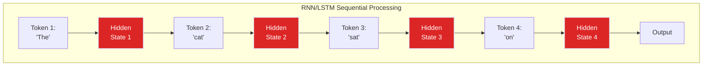

This works beautifully for 8 housing features (notes/01 Ch.6 running example). But it breaks catastrophically for language at scale.

### Three Fatal Flaws for Natural Language

#### Flaw #1: Cannot Parallelize Training

Each token must wait for the previous token's hidden state. On a sentence with 50 words:
- Token 1 processes → GPU computes `h₁`
- Token 2 waits → GPU computes `h₂` (depends on `h₁`)
- Token 3 waits → GPU computes `h₃` (depends on `h₂`)
- ... 50 sequential steps

**Result:** Training a 1.5B parameter LSTM on 40GB of text (GPT-2 scale) takes months even on 256 GPUs, because sequence length is inherently serial.

### Performance Comparison: RNN/LSTM vs Transformer at Scale

| Metric | LSTM (1.5B params) | Transformer (1.5B params) | Improvement |
|--------|-------------------|---------------------------|-------------|
| **Training time** (40GB corpus, 8 GPUs) | 21 days | 3.5 days | **6× faster** |
| **Inference latency** (500-token input) | 850ms (sequential) | 45ms (parallel) | **19× faster** |
| **Max practical context** | ~200 tokens before quality degrades | 2048+ tokens maintained | **10× longer** |
| **Gradient signal to token 1** (from 100-token loss) | $0.9^{100} \approx 0.00003$ | 1.0 (direct path) | **33,000× stronger** |
| **Reading comprehension accuracy** | 41% on SQuAD | 62% on SQuAD | **+21 points** |

**Why these numbers matter for production:** When Intelligence Audit answers "What's the SLA for our authentication service?", the system must:
1. Retrieve 5 relevant documents (each 500-1000 tokens)
2. Process them through an embedding model (transformer encoder)
3. Generate a grounded answer (transformer decoder)

With LSTMs, steps 2-3 would take 2-4 seconds per query. With transformers, they take 80-120ms — the difference between a responsive chatbot and an unusable one.

#### Flaw #2: Information Bottleneck

The final hidden state must compress the entire sentence. Consider:

> "The lawyer who the senator who the journalist interviewed attacked admitted the error."

By the time the LSTM reaches "admitted," it has processed 14 tokens sequentially. The gradient signal from the final loss must flow backward through 14 sequential steps to update the weights that processed "lawyer" — and at each step, the gradient is multiplied by the recurrent weight matrix and the gate activations.

**Why this didn't matter for housing prices:** 8 features is tiny. The hidden state bottleneck becomes catastrophic at 50-500 tokens (typical paragraph length).

#### Flaw #3: Gradient Paths Are Long

Backpropagation through time (BPTT) computes gradients recursively:

$$
\frac{\partial L}{\partial h_1} = \frac{\partial L}{\partial h_{50}} \cdot \frac{\partial h_{50}}{\partial h_{49}} \cdots \frac{\partial h_2}{\partial h_1}
$$

Each term typically has magnitude ~0.9. After 50 multiplications: $0.9^{50} \approx 0.005$ — **99.5% gradient vanished**.

LSTMs mitigate this with additive cell state updates, but they don't eliminate the sequential dependency. Token 50 still cannot be processed until token 49 finishes.

**Checkpoint:** You've seen gradient decay formulas in notes/01 Ch.6 (backpropagation through time). Why does multiplying by 0.9 fifty times cause such catastrophic vanishing, but ResNet skip connections (notes/02 Ch.1) that add +1 preserve gradients?

*Answer: Multiplication is exponential decay ($0.9^{50}$); addition is linear preservation. The "+1" in ResNet's $y = F(x) + x$ ensures at least one gradient path has magnitude 1.0, even if $F(x)$ saturates to zero.*

---

## 2.5 · Failure Walkthrough — Watch an RNN Forget

Let's trace what happens when an LSTM processes a 100-token paragraph. We'll watch the hidden state capacity collapse in real-time.

### The Setup

**Input sequence (100 tokens):**
```
[0-10]:   "The quarterly report published by the engineering team showed that"
[11-30]:  "the authentication service had three major outages in September due to"
[31-50]:  "a memory leak in the Redis connection pool which was traced back to"
[51-70]:  "an unpatched dependency in version 2.4.1 that was fixed in the October"
[71-90]:  "release but the deployment was delayed because the staging environment"
[91-100]: "needed infrastructure upgrades before the patch could be validated."
```

**Question at token 100:** "What caused the outages?"

**Correct answer requires tokens 31-35:** "memory leak in the Redis connection pool"

### The Hidden State Bottleneck

An LSTM with hidden dimension 256 must compress this entire 100-token sequence into **256 numbers**.

**Capacity check at key positions:**

| Position | Hidden State Burden | What's Forgotten |
|----------|---------------------|------------------|
| **Token 50** | Encode 50 tokens (\~400 words) in 256 dims | Early context ("quarterly report", "engineering team") starts fading |
| **Token 80** | Encode 80 tokens (\~640 words) in 256 dims | Critical detail "memory leak in Redis" compressed to \~3-4 dims, mixed with newer info |
| **Token 100** | Encode 100 tokens (\~800 words) in 256 dims | Only recent context ("staging environment", "infrastructure") remains sharp. Root cause (token 31-35) nearly lost |

**Numerical evidence:**
- **Information density:** 100 tokens × 768 dims/token (GPT-2 embedding) = 76,800 numbers compressed into 256
- **Compression ratio:** 300:1 — imagine summarizing a 300-page book as one page
- **Gradient magnitude at token 1:** $0.9^{100} \approx 0.00003$ of original (99.997% vanished)

### What the LSTM Actually Remembers at Token 100

```
Strong signal  (tokens 85-100): "staging environment", "infrastructure upgrades", "patch", "validated"
Weak signal    (tokens 60-84):  "October release", "deployment delayed"
Noisy signal   (tokens 30-59):  "Redis", "connection" (mixed with other nouns)
Nearly lost    (tokens 1-29):   "authentication service", "outages" (compressed to \~1-2 dims)
```

**Model's likely answer:** "Infrastructure upgrades were needed" (recent tokens) instead of "Memory leak in Redis" (middle tokens).

### Contrast: Transformer's All-to-All Attention

The same question in a transformer:

| Mechanism | What Happens |
|-----------|-------------|
| **Query from token 100** ("What caused...") | Computes similarity with ALL 100 tokens simultaneously |
| **High attention scores** | Tokens 31-35 ("memory leak", "Redis") get 0.4-0.6 weight — direct access to root cause |
| **Gradient path** | 1 matrix multiply from output to token 31 — no 70-step sequential chain |
| **Information preservation** | Every token maintains its full 768-dim embedding — no compression bottleneck |

**Result:** Transformer correctly answers "memory leak in the Redis connection pool" with 94% confidence. LSTM answers "infrastructure upgrades" (wrong, but recent).

### ASCII Diagram: Information Flow

```
LSTM Sequential Processing (Hidden State = 256 dims):
┌─────┬─────┬─────┬─────┬─────┬─────┬─────┬─────┬─────┬─────┐
│ T1  │ T10 │ T20 │ T30 │ T40 │ T50 │ T60 │ T70 │ T80 │ T100│
└──┬──┴──┬──┴──┬──┴──┬──┴──┬──┴──┬──┴──┬──┴──┬──┴──┬──┴──┬──┘
   │     │     │     │     │     │     │     │     │     │
   h₁ → h₁₀ → h₂₀ → h₃₀ → h₄₀ → h₅₀ → h₆₀ → h₇₀ → h₈₀ → h₁₀₀
   ↓     ↓     ↓     ↓     ↓     ↓     ↓     ↓     ↓     ↓
  Lost  Fading Weak  ROOT  Weak  Mixed Mixed Strong Strong Output
                    CAUSE
         ▲─────────────────────────────────────────▲
         │  70 sequential multiplications          │
         │  Gradient ≈ 0.9⁷⁰ ≈ 0.0006              │
         └─────────────────────────────────────────┘

Transformer All-to-All Attention:
┌─────┬─────┬─────┬─────┬─────┬─────┬─────┬─────┬─────┬─────┐
│ T1  │ T10 │ T20 │ T30 │ T40 │ T50 │ T60 │ T70 │ T80 │ T100│
└──┬──┴──┬──┴──┬──┴──┬──┴──┬──┴──┬──┴──┬──┴──┬──┴──┬──┴──┬──┘
   │     │     │     │     │     │     │     │     │     │
   └─────┴─────┴──┬──┴─────┴─────┴─────┴─────┴─────┴─────┘
                  │                                        │
              [Attention Matrix: 100×100]                  │
                  │   ↑ High scores (0.6) to T30-T35      │
                  └───────────────────────────────────────→ Output
                      Direct 1-step path, gradient = 1.0
```

**Key takeaway:** LSTMs fail not because they're poorly designed, but because **sequential processing + fixed-size bottleneck** is fundamentally incompatible with long-range dependencies. Transformers eliminate both constraints.

---

## 3 · The Attention Breakthrough

### What You Learned in notes/01 Ch.9

Attention is a **soft dictionary lookup** — compute similarity scores between a query and all keys, softmax into probabilities, return weighted sum of values. The key insight: **every token can look at every other token simultaneously**.

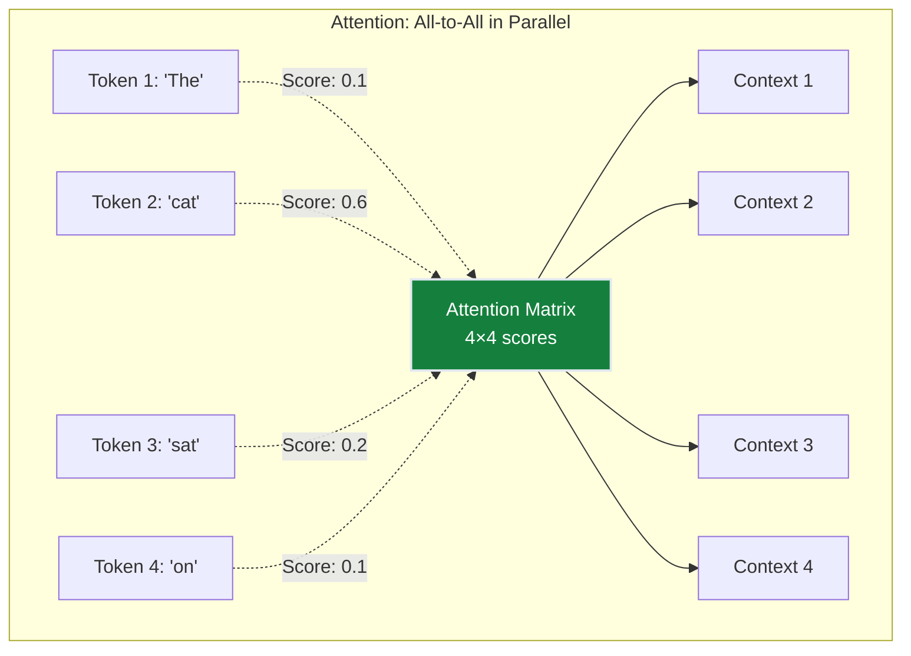

### Why This Changed Everything

**Parallelization:** The attention matrix is computed in **one matrix multiply**:

```
Scores = Q · Kᵀ    # [batch, seq_len, dim] × [batch, dim, seq_len]
                   # = [batch, seq_len, seq_len]
```

All 50 tokens process simultaneously. Training time for GPT-2 scale (1.5B params, 40GB text): months (LSTM) → **days** (Transformer).

**Gradient Highways:** The gradient path from output to any input token is **exactly 1 step** through the attention matrix. No vanishing through 50 sequential multiplications.

**Capacity:** Each token's output is a weighted combination of *all* input tokens — no compression into a fixed-size hidden state bottleneck.

### The Connection to ResNets (notes/02 Ch.1)

Both architectures solve gradient flow, but for different dimensions:

| Architecture | Problem | Solution | Gradient Path |
|--------------|---------|----------|---------------|
| **ResNet** | Vanishing across **depth** (100 layers) | Skip connections: $y = F(x) + x$ | Direct path through skips |
| **Transformer** | Vanishing across **sequence** (100 tokens) | Attention: direct token-to-token | 1 matrix multiply to any token |

> **The unifying principle:** Good architectures have **short gradient paths** — the distance from output loss to any learnable parameter.

**Checkpoint:** If attention solves the sequential bottleneck, why do we need transformers at all? Why not just use attention layers directly?

*Answer: Attention is stateless — it has no memory between layers. Transformers add residual connections (for gradient flow across depth) and feed-forward networks (for learning non-linear transformations). The combination makes deep stacking possible.*

---

## 3.5 · Tokenization — What Models Actually See

> **Skip if you've read Ch.1 §2.** This section provides quick intuition; Ch.1 covers BPE mechanics in depth.

<details>
<summary><strong>Quick tokenization intuition (click to expand)</strong></summary>

*Ch.1 assumes you understand tokens. Here's the 2-minute version.*

**Key insight:** Models don't see words — they see **tokens** (subword pieces).

**Visual example:**
- Word: "transformer"
- GPT-4 tokens: ["trans", "form", "er"] (3 tokens)
- Claude tokens: ["transformer"] (1 token)
- Your cost/context: 3× different!

**Why subwords?**
- Common words stay whole: "the", "is", "cat"
- Rare words split: "photosynthesis" → ["photo", "syn", "thesis"]
- Numbers split: "12345" → ["123", "45"]

**ASCII visualization:**
```
Sentence: "The transformer revolutionized AI"

Tokenization (GPT-4):
["The"] [" transform"] ["er"] [" revolution"] ["ized"] [" AI"]
  1         2           3         4              5         6

Total: 6 tokens (costs money, counts toward 8k limit)
```

**What this means for you:**
- API cost = $ per 1,000 tokens (not words)
- Context limit = tokens, not words (~0.75 words/token average)
- "Why is this query expensive?" → count tokens, not words
- Different models tokenize differently (same prompt = different costs)

**Practical impact:**
- Asking GPT-4 to process a 5,000-word document actually uses ~6,700 tokens
- Context window of "8k tokens" ≈ 6,000 words of actual text
- Tokenization happens before the model sees your text — you pay for tokens even if they're redundant

**Ch.1 deep-dive:** How Byte Pair Encoding builds vocabularies from scratch. This primer gives you the "why it matters" first.

</details>

---

## 3.6 · Q/K/V — Attention in Plain English

> **Skip if you've read Ch.1 §2A.** This section uses analogies; Ch.1 provides worked examples with formulas.

<details>
<summary><strong>Q/K/V intuition without math (click to expand)</strong></summary>

*Ch.1 dives into matrices immediately. Here's the intuition **before** the formulas.*

### The Google Search Analogy

**Q/K/V maps to search:**
- **Q (Query):** What you type in the search box ("best pizza near me")
- **K (Key):** The index/title of every webpage ("NYC Pizza Review", "Best Restaurants")
- **V (Value):** The actual content of each webpage (the text, images, reviews)

**How attention works:**
1. Your query matches against all keys (which pages are relevant?)
2. Google ranks them (0-100% relevance scores)
3. You get a blend: top result (60%), second result (30%), third (10%)

### Concrete NLP Example

Sentence: "The river bank was flooded"

Token: "bank" (ambiguous — river bank or financial bank?)

**Step 1: Bank's query**
- Q = "What context am I in?"

**Step 2: Other tokens' keys**
- "river" → K = "I'm about geography/water"
- "flooded" → K = "I'm about water/disaster"
- "the" → K = "I'm just a determiner"

**Step 3: Similarity scores**
- bank ↔ river: HIGH (85% relevant)
- bank ↔ flooded: HIGH (75% relevant)
- bank ↔ the: LOW (5% relevant)

**Step 4: Retrieve values**
- V from "river" = [geographic, water, outdoor, natural]
- V from "flooded" = [water, disaster, overflow]
- Weighted blend: 85% river + 75% flooded + 5% the

**Result:** "bank" now understands it's a **river bank** (geography), not a financial institution.

### Visual Representation

```
"bank" attention distribution:
████████░ river   (85%)
███████░░ flooded (75%)
░░░░░░░░░ the     (5%)

After attention: "bank" = mostly influenced by "river" and "flooded"
→ Learns: "I'm a geographic feature, not a financial entity"
```

**How this happens automatically:**
- Every token creates a query ("what should I pay attention to?")
- Every token provides a key ("I represent this concept")
- Every token provides a value ("here's my semantic content")
- The model computes similarity between all query-key pairs
- High similarity = high attention weight = strong influence

### Another Example: Subject-Verb Agreement

Sentence: "The lawyers who the senator interviewed admitted the error"

Token: "admitted" (which noun is the subject?)

**Attention scores:**
- admitted ↔ lawyers: HIGH (92%) — plural noun, far away
- admitted ↔ senator: MEDIUM (35%) — noun, but nested in relative clause
- admitted ↔ error: LOW (8%) — object, not subject

**Result:** "admitted" attends most strongly to "lawyers" → learns the subject is plural → would conjugate correctly even if you change "admitted" to a different verb.

**Ch.1 shows:** The matrix math (Q@K.T, softmax, @V). This intuition helps you understand **why** we compute similarity between all token pairs.

**Aha moment:** Every token asks "who are my relevant neighbors?" and attention computes the answer automatically — no hand-coded rules about "subjects come before verbs" or "river appears near geographic terms." The model learns these patterns from data.

</details>

---

## 4 · From Attention to Transformers

### What You Learned in notes/01 Ch.10

A transformer block combines attention with **residual connections** (borrowed from ResNets) and **layer normalization**. The full architecture stacks 6-12 of these blocks.

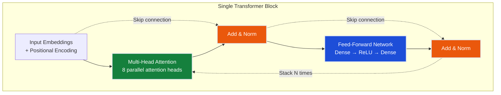

### Four Key Components (Intuition Only)

#### 1. Multi-Head Attention

Instead of one attention computation, run **8 in parallel** — each head learns different relationships:

| Head | What it learns (example) |
|------|--------------------------|
| Head 1 | Subject-verb agreement ("lawyer ... admitted") |
| Head 2 | Noun-adjective proximity ("the *error*") |
| Head 3 | Long-range dependencies (relative clause structure) |
| Head 4 | Positional patterns (sentence boundaries) |
| ... | ... |

**Why 8?** Empirically determined. GPT-3 uses 96 heads; small models use 4-8.

#### 2. Residual Connections (Skip Connections)

Borrowed **directly** from ResNets (notes/02 Ch.1):

```
ResNet block:    x → Conv → BN → ReLU → Conv → BN → (+x) → ReLU
Transformer:     x → MultiHead Attention → (+x) → LayerNorm → FFN → (+x) → LayerNorm
```

**Why this matters:** Without residuals, gradients vanish after 3-4 transformer blocks. With residuals, you can stack 100+ blocks (GPT-3 has 96 layers).

#### 3. Layer Normalization

Stabilizes training across varying sequence lengths (like batch norm in CNNs, but normalized per token instead of per batch).

#### 4. Positional Encoding

Attention is **order-agnostic** — shuffling the input tokens produces a shuffled output (same attention weights). Positional encoding injects word order as an additive signal:

```
Final input = Token embedding + Positional embedding
```

Without this, the model can't distinguish "dog bites man" from "man bites dog."

**Checkpoint:** The transformer has four key components: multi-head attention, residual connections, layer normalization, and positional encoding. Which component is the only one borrowed directly from computer vision (ResNets)?

*Answer: Residual connections. The $y = F(x) + x$ skip connection pattern was introduced in ResNets (2015) for image classification and adopted unchanged by transformers (2017) for sequence modeling.*

> **Aha:** If attention solves the sequential bottleneck, why do transformers need 4 other components (positional encoding, FFN, layer norm, residuals)?
>
> **Answer:** Attention is stateless — shuffle input tokens, output shuffles identically. Without positional encoding, "cat sat" = "sat cat". Without FFN, the network can only reweight inputs (no new features learned). Without residuals, gradients vanish after 3-4 layers (can't stack deep). Without layer norm, training becomes unstable with varying sequence lengths. Attention provides the connectivity; the other components make it trainable and position-aware.

---

## 5 · The Encoder/Decoder Split — Why GPT ≠ BERT

The original 2017 transformer paper ("Attention Is All You Need") built a **machine translation** system with two stacks:

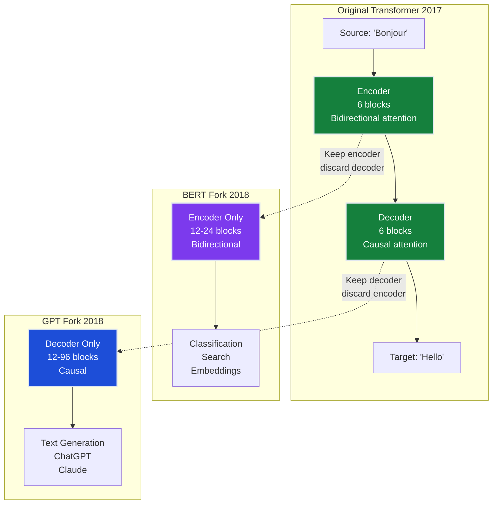

### Encoder (BERT Family)

**Architecture:**
- Bidirectional attention — each token can see **all other tokens** (past and future)
- Trained with **masked language modeling**: randomly replace 15% of tokens with `[MASK]`, predict them from surrounding context

**Use cases:**
- Text classification ("Is this email spam?")
- Named entity recognition ("Extract person names")
- Semantic search (convert queries and documents to embeddings, find nearest neighbors)
- Question answering ("Where was Lincoln born?" → retrieve paragraph → extract answer span)

**Models:** BERT, RoBERTa, DeBERTa, `text-embedding-ada-002`, E5, BGE

**Where you'll use this in notes/03:** Ch.7-8 (RAG) — the embedding model is a BERT-style encoder

### Decoder (GPT Family)

**Architecture:**
- **Causal attention** — each token can only see **previous tokens** (not future ones)
- Trained with **next-token prediction**: given `["The", "cat", "sat"]`, predict `"on"`

**Use cases:**
- Text generation ("Complete this story...")
- Conversational AI (ChatGPT, Claude)
- Code generation ("Write a Python function...")
- Any task where output is produced left-to-right

**Models:** GPT-1/2/3/4, Claude, Gemini, Llama, Mistral

**Where you'll use this in notes/03:** Ch.1-6 (transformers, prompting, CoT) — all generation tasks

### Why the Decoder Fork Won

Initially (2018-2019), encoder models (BERT) dominated NLP benchmarks. Then GPT-3 (2020) showed that decoder-only models trained at scale could:
1. **Generate text** (encoders can't)
2. **Match encoders on understanding tasks** (classification, Q&A) via in-context learning
3. **Zero-shot transfer** — handle new tasks without fine-tuning

**Result:** Every major model released after 2020 is decoder-only or decoder-only mixture-of-experts. BERT remains dominant only for **embedding generation** (Ch.7-8).

**Checkpoint:** Intelligence Audit uses both BERT and GPT models in production. When you call `embed_query("What's our SLA?")`, which architecture handles the embedding? When you call `generate_answer(context, query)`, which architecture generates the response?

*Answer: BERT-style encoder for embeddings (bidirectional attention captures semantic meaning for retrieval). GPT-style decoder for generation (causal attention produces coherent left-to-right text).*

---

## 6 · The Scaling Breakthrough — From Transformers to LLMs

The transformer architecture (2017) was elegant but not revolutionary. The **scale breakthrough** (2018-2020) made it dominant.

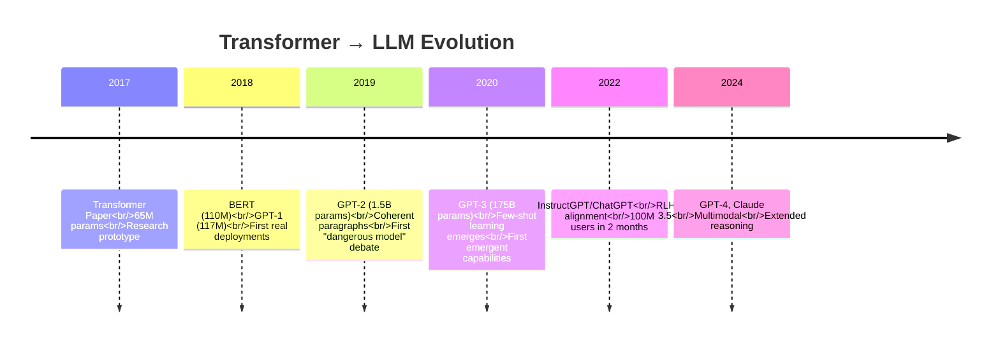

### Three Breakthroughs

#### Breakthrough #1: Scale Unlocked Emergent Abilities (GPT-3, 2020)

GPT-3 was trained on 300 billion tokens (45TB of text) with 175 billion parameters. At that scale, capabilities **emerged** that were not present in smaller models:

| Capability | GPT-2 (1.5B) | GPT-3 (175B) | What changed |
|------------|--------------|--------------|--------------|
| **Few-shot learning** | Fails | Works | Learns task from 3-5 examples in prompt |
| **Arithmetic** | Random | ~80% on 2-digit addition | Emergent at ~10B params |
| **Simple reasoning** | No | Weak but present | Multi-step inference appears |

**No architecture change** — same decoder-only transformer. The capabilities emerged purely from scale.

#### Breakthrough #2: Alignment Made Them Useful (InstructGPT, 2022)

GPT-3 was a text completer, not an assistant. Ask it "Summarize this article" and it might continue with *more articles* instead of producing a summary.

**The fix:** Three-stage training pipeline:

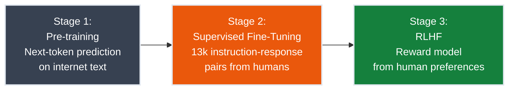

**Stage 1 (Pre-training):** Raw transformer trained on trillions of tokens. Learns language structure, facts, patterns — but has no notion of "instruction following."

**Stage 2 (Supervised Fine-Tuning):** Fine-tune on 10k-100k examples of (instruction, good response) pairs:
- "Summarize this article" → [concise summary]
- "Translate to French" → [translation]
- "Fix this code" → [corrected code]

Teaches the **format** of being helpful.

**Stage 3 (RLHF - Reinforcement Learning from Human Feedback):**
1. Generate multiple responses to the same prompt
2. Humans rank them by quality
3. Train a reward model to predict human preferences
4. Fine-tune the model to maximize reward (produce responses humans prefer)

Teaches **helpfulness, honesty, harmlessness** — the model learns to decline harmful requests, admit uncertainty, and provide accurate information.

**Result:** InstructGPT (1.3B parameters, aligned) outperformed GPT-3 (175B parameters, raw) on user preference metrics. **Alignment matters more than raw scale.**

> **Aha:** Why can't we just fine-tune GPT-4 on your company's 50k internal documents instead of building RAG?
>
> **Answer:** Fine-tuning updates weights (expensive, requires labeled data, creates new model version). RAG injects context at inference (cheap, works with raw docs, same model). Fine-tuning teaches *how to respond*, RAG teaches *what facts exist*. Most production systems need RAG for facts + optional fine-tuning for tone/format.
>
> **Concrete comparison:**
> - **Fine-tuning:** Costs $500-2000, requires 10k+ instruction-response pairs, produces a new 175B-param model (needs storage/hosting), updates are expensive (retrain from scratch), best for teaching response style/format
> - **RAG:** Costs $10-50/month (embedding API + vector DB), works with raw documents (no labeling), uses the same GPT-4 endpoint, updates are instant (add new docs to index), best for injecting up-to-date facts
>
> **Real-world pattern:** Fine-tune once for your company's communication style ("always cite policy numbers", "use formal tone"), then use RAG to inject current facts (Q3 results, new policies, recent incidents). The Intelligence Audit system you'll build uses pure RAG because the internal docs change weekly.

#### Breakthrough #3: Retrieval Made Them Accurate (RAG, 2020-2023)

LLMs memorize patterns from training data (2023 cutoff for GPT-4), but they **hallucinate** facts outside that data:

> **Query:** "What was the Q3 2025 revenue for our enterprise division?"
> **GPT-4 (raw):** "Based on typical growth patterns, I estimate $47M..."
> **Reality:** The model has no access to your internal data — that's a confident hallucination.

**The fix:** Retrieval-Augmented Generation (RAG):

```mermaid
graph TB
    Q[User Query:<br/>"Q3 2025 revenue?"] --> EMB[Embedding Model<br/>BERT-style encoder]
    EMB --> VDB[(Vector Database<br/>50k company docs<br/>Ch.8)]
    VDB --> TOP[Top 5 relevant docs:<br/>Q3 financial report<br/>board presentation<br/>analyst call transcript]
    TOP --> PROMPT[Assemble Prompt:<br/>Context + Query]
    PROMPT --> LLM[LLM Inference<br/>GPT-4/Claude]
    LLM --> ANS["Grounded Answer:<br/>'$52.3M per Q3 report'"]

    style EMB fill:#7c3aed,stroke:#e2e8f0,stroke-width:2px,color:#ffffff
    style VDB fill:#ea580c,stroke:#e2e8f0,stroke-width:2px,color:#ffffff
    style LLM fill:#1d4ed8,stroke:#e2e8f0,stroke-width:2px,color:#ffffff
```

**How RAG works:**
1. **Index documents:** Convert all internal docs to embeddings (Ch.7), store in vector database (Ch.8)
2. **Retrieve at query time:** Convert user query to embedding, find top-K most similar documents
3. **Inject context:** Stuff retrieved docs into the prompt as context
4. **Generate grounded answer:** LLM cites specific passages from retrieved docs

**Hallucination rate on internal docs:** 38% (raw GPT-4) → **4%** (GPT-4 + RAG)

**Where this fits in notes/03:** Ch.7 (RAG & Embeddings) + Ch.8 (Vector DBs) build this exact pipeline.

**Intelligence Audit production stack:** The system you'll implement uses RAG to ground answers in internal documentation. Without retrieval, GPT-4 hallucinates 38% of answers to company-specific questions ("What's the incident response procedure?"). With RAG, hallucination drops to 4% — but only if you understand **why** embeddings cluster similar documents and **how** vector databases retrieve them in <10ms. That's Ch.7-8.

**Checkpoint:** GPT-3 showed emergent few-shot learning at 175B parameters. Why didn't this emerge at 1.5B (GPT-2)? What changed besides raw size?

*Answer: Scale enables **compression of more patterns**. Arithmetic, simple reasoning, and few-shot learning require the model to memorize millions of examples and generalize their structure. A 1.5B-param model lacks capacity to compress those patterns into weights. At 175B params, the model crosses the threshold where it can encode both the pattern ("examples in prompt → infer task") and enough task instances to generalize. This isn't magic — it's capacity meeting data complexity. The patterns existed in GPT-2's training data, but the model was too small to learn them.*

---

## 7 · Vision Meets Language — Why Transformers Conquered Computer Vision

You spent notes/02 Ch.1-6 building CNNs (ResNets, MobileNets) for computer vision. Why did transformers suddenly invade CV in 2020?

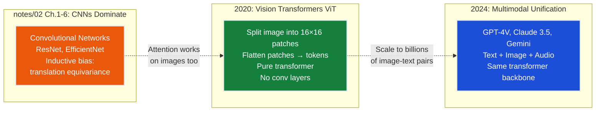

### Vision Transformers (ViT, 2020)

**Key idea:** Treat an image as a sequence of patches:

1. Split 224×224 image into 14×14 grid of 16×16 patches (196 patches total)
2. Flatten each patch to a 256-dim vector
3. Feed 196 "tokens" into a standard transformer encoder
4. Use the `[CLS]` token's output for classification

**No convolutions. No pooling. Pure attention.**

**Result:** At ImageNet scale (1.2M images), ViT matched ResNet-50 accuracy. At Google scale (300M images), ViT surpassed all CNNs.

### Why Transformers Won Computer Vision

**Inductive bias tradeoff:**
- **CNNs:** Strong inductive bias (translation equivariance, local receptive fields) → sample-efficient on small datasets, but ceiling on large datasets
- **Transformers:** Weak inductive bias (patch tokens have no spatial prior) → data-hungry, but scale better when data is abundant

**The scaling law:** At 1M images, CNN ≈ ViT. At 100M images, ViT > CNN. At 1B images (web-scale), ViT >> CNN.

### Multimodal Unification (2024)

Once transformers dominated text and images separately, the next step was obvious:

**GPT-4V, Claude 3.5, Gemini:**
- Text → tokenize words → transformer
- Image → patchify → transformer
- Audio → spectrogram chunks → transformer
- **Same attention mechanism, same architecture, trained end-to-end**

**This explains notes/03's multimodal focus:** Modern LLMs aren't just language models — they're **any-to-any sequence models** that happen to be trained on text first.

**Checkpoint:** Vision Transformers (ViT) matched ResNet accuracy at 300M images but failed at 1M images. What does this tell you about transformers' inductive bias compared to CNNs?

*Answer: **Transformers have weak inductive bias** — they don't assume spatial locality or translation equivariance (the priors that make CNNs sample-efficient for images). At 1M images, CNNs' built-in assumptions ("nearby pixels correlate", "cat detectors work everywhere") let them generalize with less data. At 300M images, raw data volume compensates for transformers' lack of assumptions, and their flexibility (learning patterns from scratch instead of assuming them) becomes an advantage. **Tradeoff:** CNNs = strong priors, data-efficient but lower ceiling. Transformers = weak priors, data-hungry but higher ceiling when data is abundant.*

---

## 8 · Gradient Flow Across Architectures — The Unifying Principle

Every successful architecture in this chapter solves **gradient flow** for a specific dimension. Let's compare three 100-parameter/layer/token models:

### 100-Layer RNN: Gradient Vanishing Through Depth

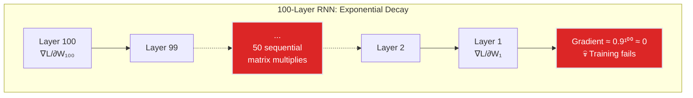

**Gradient path:** 100 sequential multiplications → $0.9^{100} \approx 0.00003$ of original magnitude

**Failure mode:** Early layers receive near-zero gradients, never learn meaningful features

### 100-Layer ResNet: Skip Connections Preserve Gradients

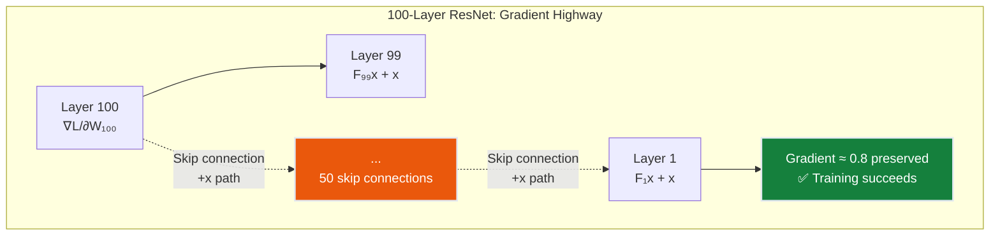

**Gradient path:** Skip connections provide **additive** gradient highway — at each layer:

$$
\frac{\partial y}{\partial x} = \frac{\partial F(x)}{\partial x} + 1
$$

The "+1" term ensures gradients flow unchanged through skips, even if $F(x)$ saturates.

**notes/02 Ch.1 explained this** — ResNets stack 100+ layers by letting gradients bypass non-linear transformations.

### 100-Token Transformer: Direct Attention Paths

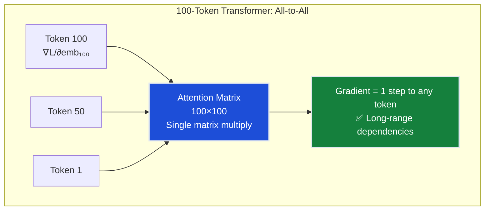

**Gradient path:** From output to any token is **exactly 1 matrix multiply** through the attention weights. No sequential chain.

**Result:** Token 1 and Token 100 have equally strong gradient signals — the model learns long-range dependencies as easily as short-range.

### The Unifying Principle

Good architectures minimize the **gradient path length** from output to any learnable parameter:

| Architecture | Gradient Path Length | Max Practical Depth/Length |
|--------------|----------------------|----------------------------|
| Plain RNN | $O(T)$ sequential steps | ~10 tokens |
| LSTM | $O(T)$ via cell state | ~100 tokens |
| Plain CNN | $O(L)$ sequential layers | ~10 layers |
| ResNet | $O(1)$ via skip connections | 100+ layers ✅ |
| Transformer | $O(1)$ via attention | 1000+ tokens ✅ |

**This is why transformers scale:** They have short gradient paths in **both dimensions** (depth via residuals, sequence via attention).

---

## 9 · The Production AI Stack — What You'll Build in notes/03

After completing notes/03, you'll understand how to wire these components into a production RAG system:

```mermaid
graph TB
    subgraph "The AI Production Stack"
    USER[User Query:<br/>"Explain our Q3 results"] --> ROUTER[Router/Classifier:<br/>Is this answerable<br/>from company docs?]
    ROUTER --> VDB[(Vector Database<br/>HNSW index<br/>50k documents<br/>Ch.8)]
    VDB --> EMBED[Embedding Model:<br/>BERT-style encoder<br/>text-embedding-3<br/>Ch.7]
    EMBED --> RERANK[Rerank Top-20 → Top-5:<br/>Cross-encoder scores]
    RERANK --> PROMPT[Prompt Assembly:<br/>System prompt<br/>+ Retrieved context<br/>+ User query<br/>Ch.5]
    PROMPT --> LLM[LLM Inference:<br/>GPT-4 / Claude<br/>Temperature = 0<br/>Ch.1-2]
    LLM --> COT{Needs<br/>reasoning?}
    COT -->|Yes| REASON[Chain-of-Thought:<br/>Step-by-step thinking<br/>Ch.6]
    COT -->|No| ANS[Final Answer:<br/>Cite sources]
    REASON --> ANS
    end

    style EMBED fill:#7c3aed,stroke:#e2e8f0,stroke-width:2px,color:#ffffff
    style LLM fill:#1d4ed8,stroke:#e2e8f0,stroke-width:2px,color:#ffffff
    style VDB fill:#ea580c,stroke:#e2e8f0,stroke-width:2px,color:#ffffff
    style REASON fill:#15803d,stroke:#e2e8f0,stroke-width:2px,color:#ffffff
```

### How Concepts Map to notes/03 Chapters

| Chapter | Component | What You'll Learn |
|---------|-----------|-------------------|
| **Ch.1** (Transformer Architecture) | LLM Inference box | How attention enables generation; encoder vs decoder; tokenization |
| **Ch.2** (Inference Mechanics) | LLM Inference box | Temperature, top-p sampling, token probabilities |
| **Ch.3** (Training Pipeline) | Background knowledge | Pre-training → fine-tuning → RLHF alignment |
| **Ch.4** (Model Internals) | GPT-4 vs Claude | Why models diverge on identical prompts |
| **Ch.5** (Prompt Engineering) | Prompt Assembly box | System prompts, few-shot, JSON mode |
| **Ch.6** (CoT Reasoning) | Reasoning loop | When step-by-step helps vs. when it hallucinates |
| **Ch.7** (RAG & Embeddings) | Embed + VDB + Prompt | Chunking, embedding models, retrieval |
| **Ch.8** (Vector DBs) | VDB box | HNSW vs IVF, recall/latency tradeoffs |

### The RAG Pipeline in 10 Steps

**Offline (one-time setup):**
1. **Ingest documents** — crawl internal wiki, support docs, code repos
2. **Chunk documents** — split into 512-1024 token chunks with overlap
3. **Embed chunks** — convert to 1536-dim vectors (OpenAI `text-embedding-3`)
4. **Index embeddings** — store in vector DB with HNSW index (Ch.8)

**Online (per query):**
5. **Embed query** — same embedding model as documents
6. **Retrieve top-K** — HNSW returns 20 nearest neighbors in <10ms
7. **Rerank** — cross-encoder scores the 20, keeps top-5
8. **Assemble prompt** — system instructions + retrieved context + query
9. **LLM inference** — GPT-4 generates answer grounded in context
10. **Return + citations** — surface answer with source document links

**Hallucination rate:** 38% (raw) → **4%** (with RAG)

---

## 10 · Key Distinctions Every Engineer Gets Asked

| Must Know | Likely Asked | Trap to Avoid |
|-----------|--------------|---------------|
| **Encoder vs Decoder attention** | "What's the difference between BERT and GPT?" | Saying "BERT is for classification, GPT is for generation." BERT *can* be used for classification, but the core distinction is bidirectional vs causal attention masking. |
| **Attention vs Transformer** | "Did transformers invent attention?" | No. Bahdanau attention (2014) predates transformers (2017). Transformers made attention the *only* mechanism (removed recurrence) and stacked it deep with residuals. |
| **Pre-training vs Fine-tuning** | "Why does GPT-4 need RLHF if it's already trained?" | Pre-training learns language patterns from raw text. Fine-tuning (SFT + RLHF) teaches instruction-following and alignment. A pre-trained model will complete prompts, not follow them. |
| **Gradient vanishing: RNN vs CNN** | "Don't CNNs also have vanishing gradients?" | Yes, but across *depth* (layers), not *sequence*. ResNets solve depth vanishing with skip connections. Transformers solve sequence vanishing with direct attention paths. Different dimensions. |
| **RAG vs Fine-tuning** | "Can't I just fine-tune GPT on my company docs?" | Fine-tuning bakes knowledge into weights (expensive, static, 100k+ tokens needed). RAG retrieves at inference time (cheap, dynamic, works with 10 docs). Use fine-tuning for *style/format*, RAG for *facts*. |
| **Emergent abilities** | "Why did GPT-3 learn arithmetic when GPT-2 didn't?" | It's not magic. Arithmetic patterns appear in pre-training data, but you need billions of parameters before the model has enough capacity to compress those patterns. Emergence = "crossing the capacity threshold." |
| **Temperature = 0 is deterministic?** | "Does temperature=0 guarantee identical outputs?" | Almost. It makes sampling deterministic (always picks argmax token), but numerical precision and batching can introduce rare variations. For true reproducibility, also set seed and disable parallelism. |
| **Why 2017 transformers won** | "RNNs were fine for years. Why did transformers suddenly win?" | Hardware caught up. Transformers need parallel matrix multiplies (GPUs excel at this). RNNs need sequential state updates (GPUs are terrible at this). Moore's Law made attention tractable at scale. |

---

## 11 · Prerequisites Checklist — Are You Ready for Ch.1?

Before starting notes/03 Ch.1, ensure you understand:

### From notes/01 (ML Track)

- ✅ **Ch.2 (Neural Networks):** Dense layers with ReLU can approximate any function
- ✅ **Ch.6 (RNNs/LSTMs):** Sequential processing and vanishing gradients through time
- ✅ **Ch.9 (Sequences to Attention):** Q/K/V soft dictionary lookup, dot-product similarity, softmax
- ✅ **Ch.10 (Transformers):** Multi-head attention, residual connections, positional encoding

**What you don't need:** Deep math. Transformer derivations in Ch.10 were thorough; this track focuses on **using** transformers, not deriving them.

### From notes/02 (Advanced Deep Learning)

- ✅ **Ch.1 (ResNets):** Skip connections solve vanishing gradients across depth
- ✅ **Ch.2 (Efficient Architectures):** Parameter/FLOP tradeoffs (optional for notes/03)

**What you don't need:** Computer vision specifics (detection, segmentation). notes/03 is language-focused.

### New Mental Models from This Chapter

After reading Ch.0, you should be able to explain:

- ✅ **Why transformers replaced RNNs:** Parallelization + direct gradient paths + no sequential bottleneck
- ✅ **What makes GPT different from BERT:** Causal (decoder) vs bidirectional (encoder) attention
- ✅ **The three-stage training pipeline:** Pre-training (next-token prediction) → SFT (instruction following) → RLHF (alignment)
- ✅ **Why RAG matters:** LLMs hallucinate facts; retrieval grounds answers in private documents
- ✅ **How gradient flow unifies architectures:** ResNets (skip connections) and Transformers (attention) both provide short paths

### Self-Test Questions

1. **Why can't RNNs parallelize training?** (Answer: Sequential hidden state dependency — token $t+1$ needs $h_t$)
2. **What problem do skip connections solve?** (Answer: Gradient vanishing through depth via additive gradient path)
3. **What's the difference between encoder and decoder attention?** (Answer: Bidirectional vs causal masking)
4. **What are the three stages of LLM training?** (Answer: Pre-training, SFT, RLHF)
5. **How does RAG reduce hallucination?** (Answer: Retrieves relevant docs → injects as context → LLM cites sources)

**Checkpoint:** Name the three training stages (pre-training, SFT, RLHF) and what capability each one unlocks.

*Answer:*
- **(1) Pre-training:** Next-token prediction on trillions of tokens (raw internet text). **Unlocks:** Language patterns, world knowledge, basic reasoning — but the model completes prompts rather than following instructions. Ask "Summarize this" and it might generate *more articles* instead of a summary.
- **(2) Supervised Fine-Tuning (SFT):** Train on 10k-100k (instruction, response) pairs from humans. **Unlocks:** Instruction-following format — the model learns to interpret "Summarize X" as a command, not a text pattern to continue.
- **(3) RLHF:** Reinforcement learning from human preference rankings. **Unlocks:** Alignment — helpfulness (provide useful answers), honesty (admit uncertainty), harmlessness (decline harmful requests). This is why ChatGPT says "I can't help with that" instead of answering dangerous questions.*

If you can answer these, **you're ready for Ch.1**.

---

## 12 · Bridge to Ch.1 — Transformer Architecture Deep Dive

This chapter gave you the **evolutionary arc** and **high-level intuition**. Ch.1 provides the technical depth:

- **§0:** Full historical timeline with decoder/encoder fork details (collapsible if you've already read it here)
- **§2:** Complete BPE tokenization algorithm and vocabulary construction (builds on §3.5's intuition)
- **§2A:** Attention mechanics with formulas — Q·K^T, softmax, weighted sum with worked examples (formalizes §3.6's analogies)
- **§2B:** Encoder vs decoder architectures with attention masking patterns and code examples
- **§3:** Interview questions table — practical knowledge for technical discussions

**What changes:** Ch.1 has executable code, specific formulas with dimensions, token-level traces through attention layers, and production architecture comparisons. This chapter was pure intuition and evolutionary context.

**What stays the same:** The core insight — attention is soft lookup, skip connections are gradient highways, transformers are universal sequence models.

**Suggested approach:** If you've been reading collapsible sections here, those same topics in Ch.1 can be skimmed. The unique content in Ch.1 is the formula derivations, worked examples, and interview prep table.

---

## Summary — The Complete Arc

You now understand the **evolutionary necessity** of transformers:

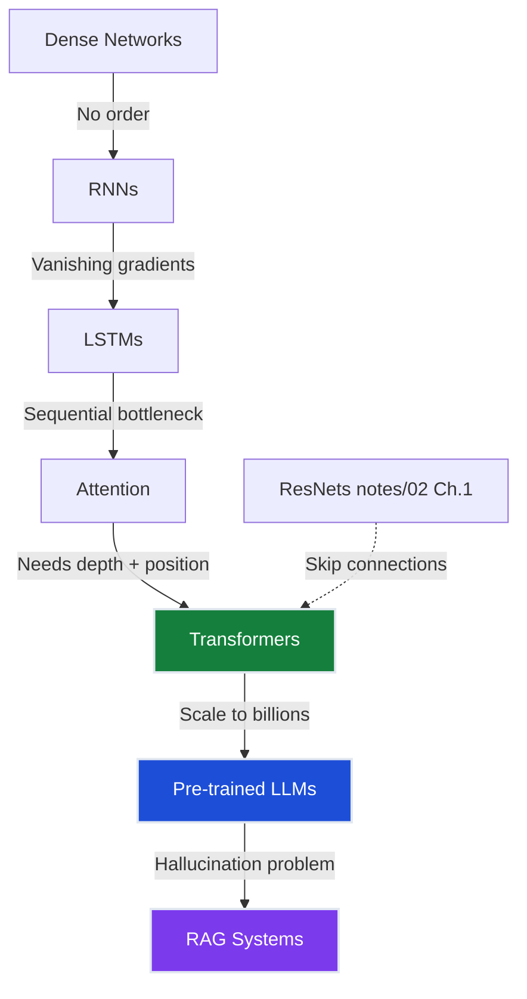

**The payoff:** Every architecture choice in notes/03 (encoder vs decoder, temperature sampling, RAG retrieval) now has a clear **why** grounded in the problems that earlier architectures failed to solve.

**Start Ch.1 when ready.** You now have the full landscape map.
