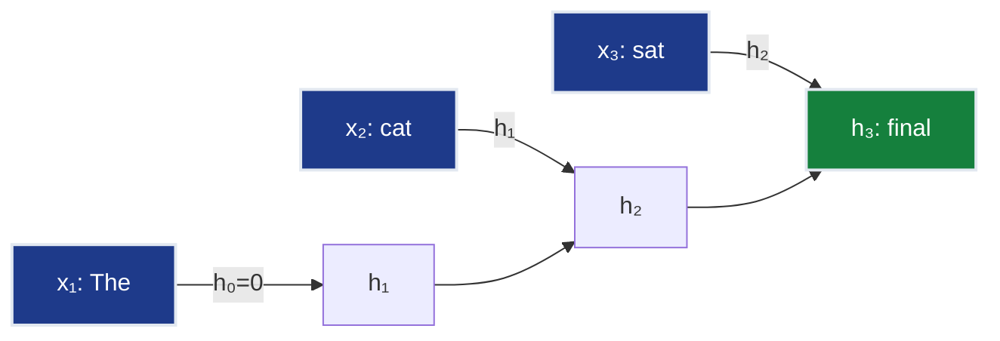
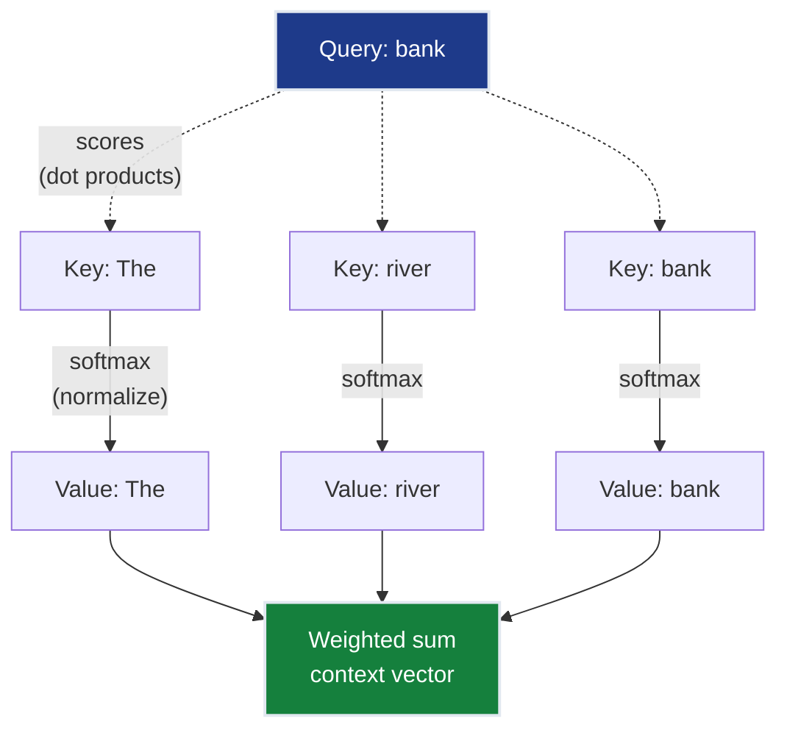
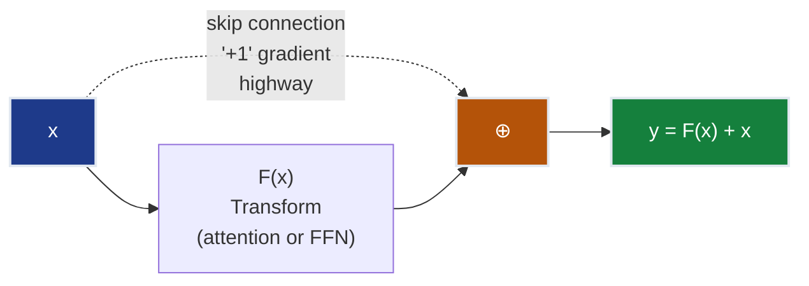
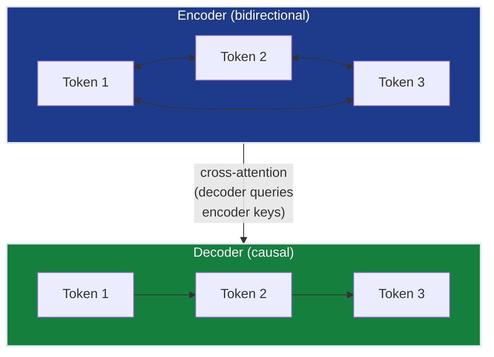
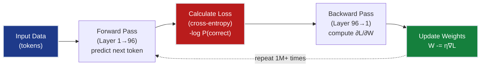
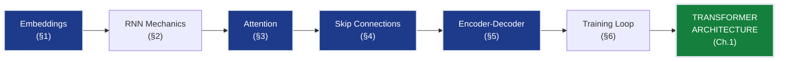

# Ch.0 — Prerequisites: From Neural Networks to Transformers

> **The story:** In 2017, Google Brain's Vaswani et al. published "Attention Is All You Need"—the paper that obsoleted decades of RNN research overnight. But that breakthrough stood on foundations laid years earlier: Hochreiter & Schmidhuber's 1997 LSTM (solving vanishing gradients), Bahdanau's 2014 attention mechanism (soft dictionary lookup), and He et al.'s 2015 ResNets (skip connections). This chapter extracts those prerequisites so you can understand how transformers synthesized them into the architecture powering GPT, Claude, and every modern LLM. You're about to learn why RNNs failed at scale, how attention parallelized sequence processing, and why the "+1" gradient term changed everything.
>
> **Where you are:** You've completed notes/01 (ML fundamentals: gradient descent, loss functions, overfitting) and notes/02 (Advanced DL: ResNets, U-Net, transfer learning). Those tracks taught you *how to train models*. This chapter teaches the specific architectural concepts Ch.1 assumes you know—concepts that made transformers possible. If you've recently finished notes/01 Ch.6 (RNNs/LSTMs), Ch.9 (attention), and notes/02 Ch.1 (ResNets), you can skip directly to Ch.1. If those are fuzzy, this 45-minute chapter rebuilds the intuition.
>
> **Notation:** $x_t$ — input at time $t$; $h_t$ — hidden state at time $t$; $W$ — weight matrix; $Q, K, V$ — query, key, value matrices (attention); $\alpha$ — attention weights; $d_k$ — key/query dimension; $\eta$ — learning rate; $\mathcal{L}$ — loss.

---

## 0 · The Challenge — Can You Understand Transformers?

**The gap:** Ch.1 (Transformer Architecture) opens with statements like:

- "RNNs process sequences one token at a time" (assumes you know what hidden states are)
- "Vanishing gradients beyond 100-200 tokens" (assumes you've seen exponential gradient decay)
- "Attention is a soft dictionary lookup with Q/K/V" (assumes you understand dot-product similarity)
- "Skip connections prevent gradient vanishing" (assumes you know the "+1" gradient term)
- "Embeddings as vector representations" (assumes you know why we need vectors for text)

If those statements make complete sense, **skip this chapter**. If any are fuzzy, **this chapter builds the intuition** Ch.1 assumes.

**What you'll learn:**
- §1: Why text becomes vectors (embeddings), what dimensions mean
- §2: How RNNs process sequences, why gradients vanish (with 0.8^T calculation)
- §3: Attention mechanism with a 3-token numeric walkthrough
- §4: Skip connections and the "+1" gradient highway
- §5: Encoder-decoder architectural pattern
- §6: What "training" means (loss, backprop, parameters)

**Time investment:** 20-30 minutes if skimming worked examples, 45-60 minutes if working through calculations.

> **Quick glossary for first-timers:**
> - **Token** = word or sub-word piece (e.g., "unhappiness" → ["un", "happiness"])
> - **Model** = trained neural network (billions of weights learned from data)
> - **Inference** = using a trained model to make predictions (what happens when you hit "send" in ChatGPT)

---

## 1 · Embeddings: Why Text Becomes Vectors

> **Why you care:** Every API call to OpenAI, Anthropic, or any LLM provider sends text → embeddings → transformer layers → output. Understanding embeddings = understanding what your $0.03/1k tokens actually buys. When you fine-tune a model, you're adjusting these embedding vectors. When you build RAG, you're searching embedding space.

### The Problem

Modern neural networks process text using **vector representations** of tokens, not raw strings. Ch.1 jumps straight into formulas like $Q = X W_Q$ where $X$ is an embedding matrix. Why vectors?

**Answer:** Math operations (dot products, matrix multiplication, gradient descent) require numbers. "cat" is a string—we need a numeric representation that preserves meaning.

> **Back-reference:** This builds on notes/01 Ch.2's feature engineering principle: models need numeric inputs. For tabular data, you used one-hot encoding. For text, embeddings are the dense alternative that captures semantic relationships.

### What is an Embedding?

An **embedding** maps each token to a point in high-dimensional space where **distance = similarity**.

**Example:** 3-dimensional embedding space (real embeddings are 512-4096 dims):
```
"cat"   → [0.8, 0.9, 0.1]
"dog"   → [0.7, 0.8, 0.2]  # Close to "cat" (both animals)
"car"   → [0.1, 0.2, 0.9]  # Far from "cat" (different concept)
```

**Dot product measures similarity:**
```
cat · dog = 0.8×0.7 + 0.9×0.8 + 0.1×0.2 = 0.56 + 0.72 + 0.02 = 1.30 (high)
cat · car = 0.8×0.1 + 0.9×0.2 + 0.1×0.9 = 0.08 + 0.18 + 0.09 = 0.35 (low)
```

Higher dot product → more similar meaning.

### Where Embeddings Come From

In modern neural architectures:
1. **Vocabulary:** Fixed set of all possible tokens the model knows (e.g., 32,000-100,000 tokens)
2. **Token ID:** "cat" → token 4517 (index in vocabulary)
3. **Lookup:** Row 4517 of embedding matrix $E$ (shape: [vocab_size, d_model])
4. **Vector:** Returns $d_{model}$-dimensional vector (e.g., 256-d, 512-d, or 768-d)

**Vocabulary size tradeoffs:**
- Larger vocabulary (100k tokens): Fewer tokens per sentence, but bigger embedding table (100k × 768 = 77M parameters just for embeddings)
- Smaller vocabulary (32k tokens): More tokens per sentence (more computation), but smaller embedding table

**These embeddings are learned during training**—the model adjusts them so semantically similar words end up nearby in vector space.

### Why This Matters

- **All modern sequence models operate on embeddings:** Whether RNNs, attention mechanisms, or other architectures
- **"Sequence of vectors" means embeddings:** A sentence with n tokens becomes n embedding vectors
- **Dimensionality tradeoff:** Higher dimensions (512-768) capture richer semantics but use more memory and computation

> ➡ **Forward pointer:** Ch.1's transformer processes embeddings through 12-96 layers of attention and feed-forward networks. Every matrix operation ($Q = XW_Q$, $K = XW_K$) transforms these embedding vectors. Without understanding embeddings, transformer diagrams are incomprehensible.

### Matrix Operations on Embeddings

**Why matrices:** Neural networks transform embeddings using **matrix multiplication**.

**Matrix multiplication basics:**
```
If X is (n × d_in) and W is (d_in × d_out), then X @ W is (n × d_out)

Example: 3 tokens, 2-D embeddings → 3-D space
X = [[1.0, 0.2],     W = [[0.5, 0.3, 0.1],
     [0.8, 0.9],          [0.2, 0.4, 0.6]]
     [0.5, 1.1]]

X @ W = [[1.0×0.5 + 0.2×0.2, 1.0×0.3 + 0.2×0.4, 1.0×0.1 + 0.2×0.6],
         [0.8×0.5 + 0.9×0.2, 0.8×0.3 + 0.9×0.4, 0.8×0.1 + 0.9×0.6],
         [0.5×0.5 + 1.1×0.2, 0.5×0.3 + 1.1×0.4, 0.5×0.1 + 1.1×0.6]]

      = [[0.54, 0.38, 0.22],
         [0.58, 0.60, 0.62],
         [0.47, 0.59, 0.71]]
```

**Matrix transpose (T):** Swaps rows and columns.
```
K = [[1.0, 0.2],     K^T = [[1.0, 0.8, 0.5],
     [0.8, 0.9],           [0.2, 0.9, 1.1]]
     [0.5, 1.1]]
```

Used in attention: Q @ K^T computes all pairwise similarities at once.

### Special Tokens

Models use special markers for different purposes:
- **[BOS]** (beginning of sequence): Marks start of text
- **[EOS]** (end of sequence): Marks where generation should stop
- **[PAD]** (padding): Fills shorter sequences to match batch length
- **[MASK]** (masking): Replaces words during training (BERT-style models)
- **[CLS]** (classification): Special token whose embedding summarizes the whole sequence

You'll see these in Ch.1 when discussing different training objectives.

> **Checkpoint:** Can you explain why we can't just use one-hot encoding (binary vectors with single 1)?
>
> *Answer: One-hot vectors have no semantic structure. "cat" = [0,0,1,0,0] and "dog" = [0,1,0,0,0] have dot product 0 (orthogonal) despite being semantically similar. Embeddings learn similarity relationships.*

---

## 2 · Sequential Models: Why RNNs Failed at Scale

### 2.1 · How RNNs Work

> **TL;DR if skimming:** RNNs process sequences one token at a time ("The" → "cat" → "sat"), maintaining a hidden state that carries information forward. Problem: Token 3 must wait for Token 2 to finish, so GPUs sit idle (can't parallelize). This is why transformers replaced RNNs—they process all tokens simultaneously.
>
> **Want the mechanics?** Read the walkthrough below.

A **Recurrent Neural Network** processes sequences one token at a time, maintaining a **hidden state** that threads information forward:

$$
h_t = \tanh(W_{hh} h_{t-1} + W_{xh} x_t + b)
$$

- $h_t$: Hidden state at step $t$ (e.g., 128-d vector)
- $x_t$: Current input embedding
- $h_{t-1}$: Previous hidden state (memory from earlier tokens)
- $\tanh$: **Activation function** that squashes values to (-1, 1) range, adding nonlinearity

**Concrete example (2-D hidden state for simplicity):**

```python
# Sentence: "The cat sat"
# Embeddings: x₁=[1.0, 0.5], x₂=[0.8, 0.9], x₃=[0.3, 1.2]

W_hh = [[0.5, 0.2],   W_xh = [[0.3, 0.1],
        [0.1, 0.4]]           [0.2, 0.5]]

# Step 1: Process "The"
h₁ = tanh(W_hh @ h₀ + W_xh @ x₁)
   = tanh([[0,0]] + [[0.3×1.0 + 0.1×0.5], [0.2×1.0 + 0.5×0.5]])
   = tanh([0.35, 0.45]) = [0.336, 0.422]

# Step 2: Process "cat" (uses h₁)
h₂ = tanh(W_hh @ h₁ + W_xh @ x₂)
   = tanh([[0.5×0.336 + 0.2×0.422], [0.1×0.336 + 0.4×0.422]] + [[0.3×0.8 + 0.1×0.9], [0.2×0.8 + 0.5×0.9]])
   = tanh([0.252, 0.202] + [0.33, 0.61]) = tanh([0.582, 0.812]) = [0.524, 0.671]

# Step 3: Process "sat" (uses h₂)
h₃ = tanh(W_hh @ h₂ + W_xh @ x₃)
   = [final hidden state encoding entire sentence]
```

**Key insight:** Each step depends on the previous one—**cannot parallelize**.



*RNN sequential dependency: Token 3 must wait for Token 2's hidden state. GPUs sit idle because this can't parallelize—one of two fatal flaws that killed RNNs for large-scale language modeling.*

> **Back-reference:** This is why notes/01 Ch.6 introduced LSTMs—gates control information flow to reduce (but not eliminate) vanishing gradients. Transformers solve this completely by removing sequential dependencies.

### 2.2 · The Vanishing Gradient Problem

**Why deep RNNs fail:** Gradients decay exponentially when backpropagating through time.

**From notes/01 Ch.6, explicit calculation:**

Suppose each time step multiplies the gradient by 0.8 (typical for tanh activation). After $T$ steps:

| Steps (T) | Gradient Magnitude | % of Original |
|-----------|-------------------|---------------|
| 1         | 0.8               | 80%           |
| 5         | 0.8^5 = 0.33      | 33%           |
| 10        | 0.8^10 = 0.11     | 11%           |
| 20        | 0.8^20 = 0.012    | 1.2%          |
| 50        | 0.8^50 = 0.000014 | 0.0014%       |

**After 50 tokens, gradients are essentially zero**—early tokens never learn.

**LSTMs help but don't solve:**
- Gates control information flow (forget gate, input gate)
- Reduces vanishing but still serial (token $t$ waits for $t-1$)
- Training 1.5B-parameter LSTM on 40GB text: **months** even on 256 GPUs

### 2.3 · Why This Motivated New Architectures

Two fatal flaws:
1. **No parallelization:** GPU must process tokens sequentially
2. **Gradient vanishing:** Information from token 1 doesn't reach token 100

**The attention mechanism (§3) solves both problems:**
- All tokens can be processed simultaneously (parallelization)
- Direct connections between any two tokens (no gradient decay over distance)

> **Checkpoint:** Calculate gradient magnitude after 100 time steps if each step multiplies by 0.9.
>
> *Answer: 0.9^100 ≈ 0.000027 (0.0027% of original) — effectively vanished.*

> ➡ **Forward pointer:** Ch.1's transformer uses **self-attention** where every token directly attends to every other token—no sequential dependency, no exponential gradient decay. This is why GPT-4 trains on 8,192-token contexts while RNNs struggle beyond 200 tokens.

---

## 3 · Attention: The Core Mechanism

> **Why you care:** Attention is THE breakthrough that made modern AI possible. When ChatGPT "understands" your prompt, it's attention deciding which words matter. When it hallucinates, it's attention weights going to the wrong context. When you debug why a prompt fails, attention patterns show you what the model "sees." This section teaches you how the magic actually works.

### 3.1 · The Big Idea

**From notes/01 Ch.9:** Attention is a **soft dictionary lookup**.

- **Query (Q):** "What am I looking for?"
- **Key (K):** "What do I offer?"
- **Value (V):** "What information do I carry?"

**Process:**
1. Compute similarity: Q · K (dot product)
2. Normalize: softmax → probability distribution
3. Retrieve: weighted sum of V



*Attention processes all tokens in parallel: "bank" computes similarity scores with all keys simultaneously ("The"=0.198, "river"=0.387, "bank"=0.416), then retrieves weighted combination of values. No sequential dependency like RNNs.*

### 3.2 · Worked Example: 3-Token Attention

> **TL;DR if skimming:** Attention computes how much each word "attends to" every other word. For "The river bank", the word "bank" attends most to "river" (38.7%) and itself (41.6%), not "The" (19.8%). This disambiguates "bank" as riverbank, not financial institution. The mechanism: dot products → softmax → weighted sum.
>
> **Want every calculation?** The complete walkthrough below shows all 9 dot products step-by-step.

**Sentence:** "The river bank"

**Embeddings (2-D for simplicity):**
```
x₁ = "The"   = [1.0, 0.2]
x₂ = "river" = [0.8, 0.9]
x₃ = "bank"  = [0.5, 1.1]
```

**Step 1: Create Q, K, V**

For simplicity, use identity projection (Q=K=V=X):
```
Q = K = V = [[1.0, 0.2],
             [0.8, 0.9],
             [0.5, 1.1]]
```

**Step 2: Compute attention scores (Q·K^T)**

```
Scores = Q · K^T

Row 1 (query="The"):
  score₁₁ = [1.0, 0.2] · [1.0, 0.2] = 1.0×1.0 + 0.2×0.2 = 1.04
  score₁₂ = [1.0, 0.2] · [0.8, 0.9] = 1.0×0.8 + 0.2×0.9 = 0.98
  score₁₃ = [1.0, 0.2] · [0.5, 1.1] = 1.0×0.5 + 0.2×1.1 = 0.72

Row 2 (query="river"):
  score₂₁ = [0.8, 0.9] · [1.0, 0.2] = 0.8×1.0 + 0.9×0.2 = 0.98
  score₂₂ = [0.8, 0.9] · [0.8, 0.9] = 0.8×0.8 + 0.9×0.9 = 1.45
  score₂₃ = [0.8, 0.9] · [0.5, 1.1] = 0.8×0.5 + 0.9×1.1 = 1.39

Row 3 (query="bank"):
  score₃₁ = [0.5, 1.1] · [1.0, 0.2] = 0.5×1.0 + 1.1×0.2 = 0.72
  score₃₂ = [0.5, 1.1] · [0.8, 0.9] = 0.5×0.8 + 1.1×0.9 = 1.39
  score₃₃ = [0.5, 1.1] · [0.5, 1.1] = 0.5×0.5 + 1.1×1.1 = 1.46

Score matrix:
      The    river  bank
The  [1.04   0.98   0.72]
river[0.98   1.45   1.39]
bank [0.72   1.39   1.46]
```

**Step 3: Apply softmax (row-wise)**

**Softmax converts scores to a probability distribution:**
- All values between 0 and 1
- All values sum to 1.0 (100%)
- Larger scores get larger probabilities

**Formula:** $\text{softmax}(x_i) = \frac{e^{x_i}}{\sum_j e^{x_j}}$

```
Row 1 (The):
  exp(1.04) = 2.83, exp(0.98) = 2.66, exp(0.72) = 2.05
  sum = 7.54
  α₁ = [2.83/7.54, 2.66/7.54, 2.05/7.54] = [0.375, 0.353, 0.272]

Row 2 (river):
  exp(1.45) = 4.26, exp(0.98) = 2.66, exp(1.39) = 4.01
  sum = 10.93
  α₂ = [0.244, 0.390, 0.367]

Row 3 (bank):
  exp(0.72) = 2.05, exp(1.39) = 4.01, exp(1.46) = 4.31
  sum = 10.37
  α₃ = [0.198, 0.387, 0.416]
```

**Step 4: Weighted sum of values**

```
Output for "bank" (row 3):
  out₃ = 0.198×[1.0, 0.2] + 0.387×[0.8, 0.9] + 0.416×[0.5, 1.1]
       = [0.198, 0.040] + [0.310, 0.348] + [0.208, 0.458]
       = [0.716, 0.846]
```

**Interpretation:** "bank" attended most strongly to itself (41.6%) and "river" (38.7%), incorporating contextual information that disambiguates it as a geographic feature.

### 3.3 · Why Scaled Dot-Product?

**The formula in Ch.1:**
$$
\text{Attention}(Q, K, V) = \text{softmax}\left(\frac{QK^T}{\sqrt{d_k}}\right) V
$$

**Why divide by $\sqrt{d_k}$?**

Without scaling, dot products grow with dimension. For $d_k=64$ (typical):
- Unscaled scores might be [82, 15, -38] → softmax → [0.9998, 0.0002, 0]
- Softmax saturates (all weight on one token)
- Gradients vanish

**With scaling:**
- Divide by $\sqrt{64}=8$ → [10.25, 1.875, -4.75]
- Softmax → [0.87, 0.09, 0.01] (balanced distribution)
- Gradients flow cleanly

> **Checkpoint:** In the 3-token example, if we used 64-D embeddings instead of 2-D, how would scores change?
>
> *Answer: Dot products would be ~8× larger (sum of 64 products vs 2). Without √d_k scaling, softmax would collapse to near-one-hot (gradient issues).*

> ➡ **Forward pointer:** Ch.1's transformer uses **multi-head attention**—running 8-16 of these attention mechanisms in parallel with different Q/K/V projections. Each head specializes in different patterns (syntactic vs semantic relationships). The complete formula you'll see is: `Attention(Q,K,V) = softmax(QK^T/√d_k)V`.

---

## 4 · Skip Connections: The Gradient Highway

> **Why you care:** GPT-4 has 120+ layers. Without skip connections, gradients would vanish after 10 layers (training would fail). When you fine-tune a model and decide which layers to freeze, you're leveraging skip connections' gradient preservation. When you see "x + Attention(x)" in transformer code, that "+" is a skip connection—the reason deep models work.

### 4.1 · The ResNet Insight

**From notes/02 Ch.1:** Residual connections solve vanishing gradients by adding an identity path.

**Standard network:**
$$
y = F(x)
$$

**Residual network:**
$$
y = F(x) + x
$$

Where $F(x)$ is a non-linear transformation (e.g., two Conv layers in ResNets, or any multi-layer computation).



*Skip connection bypasses the transformation: even if F(x) saturates (gradients → 0), the "+1" term ensures gradients flow through addition. This is why transformers can stack 96 layers while plain networks struggle beyond 10.*

> **Back-reference:** Notes/02 Ch.1 showed ResNet-50 reaching 75% ImageNet accuracy while plain-50 network failed at 2%. Same principle: skip connections preserve gradient flow through depth.

### 4.2 · Why This Works: The "+1" Gradient Term

**Backward pass through residual connection:**

$$
\frac{\partial \mathcal{L}}{\partial x} = \frac{\partial \mathcal{L}}{\partial y} \cdot \frac{\partial y}{\partial x}
$$

Since $y = F(x) + x$:

$$
\frac{\partial y}{\partial x} = \frac{\partial F(x)}{\partial x} + \frac{\partial x}{\partial x} = \frac{\partial F(x)}{\partial x} + 1
$$

Therefore:

$$
\frac{\partial \mathcal{L}}{\partial x} = \frac{\partial \mathcal{L}}{\partial y} \left( \frac{\partial F(x)}{\partial x} + 1 \right)
$$

**The "+1" term is the gradient highway:**
- Even if $\frac{\partial F(x)}{\partial x} \to 0$ (transformation branch saturates), gradient still flows via the "+1"
- Through 50 residual blocks: gradient = $\frac{\partial \mathcal{L}}{\partial y_{50}} \times (1 + \epsilon)^{50}$ where $\epsilon$ is small
- Compare to plain network: $\frac{\partial \mathcal{L}}{\partial y_{50}} \times 0.9^{50} \approx 0$

### 4.3 · Skip Connections in Deep Sequence Models

**Modern attention-based architectures use skip connections extensively:**

```
x_1 = x + AttentionBlock(x)     # Skip around attention computation
x_2 = x_1 + FeedForward(x_1)    # Skip around dense layers
```

This enables training **very deep networks** (50-100+ layers)—gradients flow directly through all layers via the addition operations.

**Numerical comparison (from notes/02 Ch.1):**

| Architecture | Layers | Gradient at Layer 1 |
|--------------|--------|---------------------|
| Plain network| 40     | 2% of final layer   |
| ResNet-40    | 40     | 75% of final layer  |
| Deep attention model| 96 | 60-70% of final layer|

> **Checkpoint:** Why can't we just make learning rates smaller to compensate for vanishing gradients?
>
> *Answer: Vanishing happens in forward/backward pass, not learning rate. If gradient is 0.02 at layer 1, multiplying by any learning rate still gives tiny updates. Skip connections fix the gradient flow itself.*

> ➡ **Forward pointer:** Every transformer block uses two skip connections: `x = x + Attention(x)` and `x = x + FeedForward(x)`. Ch.1 will show you the exact stacking pattern that enables GPT-3's 96 layers and GPT-4's rumored 120+ layers.

---

## 5 · Encoder-Decoder Architecture

### 5.1 · The Pattern

**From notes/02 Ch.5 (U-Net) and notes/03 Ch.1:**

**Encoder:** Processes input sequence bidirectionally
- Reads full sentence
- Builds contextualized representations
- Use cases: Classification, retrieval, understanding tasks

**Decoder:** Generates output sequence autoregressively
- Produces one token at a time
- Can only see previous outputs (causal masking)
- Use cases: Text generation, language modeling

**Encoder-Decoder:** Combines both
- Encoder processes source (e.g., English sentence)
- Decoder generates target (e.g., French translation)
- Cross-attention: decoder attends to encoder outputs
- Use cases: Translation, summarization, question answering

### 5.2 · Information Flow



*Encoder processes input bidirectionally (all tokens attend to all tokens). Decoder generates output causally (token N only sees tokens 1..N-1). Cross-attention lets decoder attend to encoder outputs—used in translation (English encoder → French decoder) and summarization.*

**Why different attention masks?**
- **Encoder:** Understanding tasks benefit from full context (classification, retrieval)
- **Decoder:** Generation requires causal masking (can't peek at future)

> **Checkpoint:** Why can't decoders use bidirectional attention?
>
> *Answer: During generation, future tokens don't exist yet. At step 5, we're predicting token 6—we can't "attend to" tokens 7-10 because they haven't been generated. Bidirectional attention would be peeking at the answer.*

> ➡ **Forward pointer:** Ch.1 introduces three transformer variants: **BERT** (encoder-only, bidirectional), **GPT** (decoder-only, causal), and **T5** (encoder-decoder). ChatGPT uses decoder-only architecture—pure causal generation with no encoder.

---

## 6 · Training Foundations

### 6.1 · What are Parameters?

**Parameters = the numbers the model learns.**

In a dense layer: $y = Wx + b$
- $W$: weight matrix (e.g., 768×3072 = 2.4M parameters)
- $b$: bias vector (e.g., 3072 parameters)

**Large models:** Modern language models have billions of parameters distributed across dozens of layers (embeddings, attention, feed-forward networks).

### 6.1A · What are Layers?

A **layer** is a transformation that takes inputs and produces outputs:

```
Layer L: input (n, d_in) → transformation → output (n, d_out)
```

**Dense (fully-connected) layer:**
```python
# Input: x with shape (n, d_in)
# Layer computes: y = x @ W + b
# Output: y with shape (n, d_out)
```

**Forward pass:** Processing data through all layers sequentially:
```
Input → Layer 1 → Layer 2 → ... → Layer N → Output
```

Each layer transforms representations, building increasingly abstract features (edges → shapes → objects).

### 6.1B · Activation Functions

Activation functions add **nonlinearity** between layers. Without them, stacking layers is useless (linear × linear = still linear).

**Common activation functions:**

**ReLU (Rectified Linear Unit):** $\text{ReLU}(x) = \max(0, x)$
```
Input:  [-2, -1, 0, 1, 2]
Output: [ 0,  0, 0, 1, 2]  (negative → zero, positive → unchanged)
```
Used in most modern networks (fast, simple, avoids vanishing gradients).

**Tanh (Hyperbolic Tangent):** $\tanh(x) = \frac{e^x - e^{-x}}{e^x + e^{-x}}$
```
Input:  [-2, -1, 0, 1, 2]
Output: [-0.96, -0.76, 0, 0.76, 0.96]  (squashes to [-1, 1])
```
Used in RNNs/LSTMs for bounded outputs.

**Softmax:** (§3) Converts scores to probabilities — used in attention and output layers.

**Why nonlinearity matters:** Without activation functions, a 100-layer network would collapse to a single linear transformation. Nonlinearity enables learning complex patterns.

### 6.2 · Loss Functions

**Loss measures how wrong predictions are.**

A **loss function** (or cost function) quantifies the gap between model predictions and true answers. Lower loss = better model.

**For language modeling (predicting next token):**

Cross-entropy loss (from notes/01 Ch.7, MLE framework):

$$
\mathcal{L} = -\frac{1}{N} \sum_{i=1}^{N} \log P(\text{correct token}_i | \text{context}_i)
$$

**What this means:** For each prediction, the model outputs probabilities for all possible next tokens. Cross-entropy measures how much probability mass was assigned to the correct token:
- If model gives correct token P=0.9 → loss = -log(0.9) = 0.11 (good)
- If model gives correct token P=0.1 → loss = -log(0.1) = 2.30 (bad)

**Example:** Predicting "cat" after "The"
- Model outputs probabilities: P(cat)=0.3, P(dog)=0.4, P(car)=0.1, ...
- True next word is "cat"
- Loss = $-\log(0.3) = 1.20$

**If model improves:** P(cat)=0.8
- Loss = $-\log(0.8) = 0.22$ (lower = better)

**Why logarithm:** Small probability differences at high confidence matter more. Going from P=0.9→0.95 improves loss more than P=0.1→0.15.

### 6.3 · Backpropagation (Conceptual)

**How parameters update:**

1. **Forward pass:** Compute predictions by passing inputs through all layers
   ```
   x → Layer 1 → Layer 2 → ... → Layer N → prediction
   ```

2. **Calculate loss:** How wrong were we?
   ```
   loss = measure_error(prediction, true_answer)
   ```

3. **Backward pass:** Compute gradients $\frac{\partial \mathcal{L}}{\partial W}$ for every parameter
   - **Gradient** = "which direction and how much to adjust W to reduce loss"
   - Calculated using calculus chain rule, working backward through layers
   ```
   Layer N → Layer N-1 → ... → Layer 1
   ```

4. **Update:** $W_{\text{new}} = W_{\text{old}} - \eta \frac{\partial \mathcal{L}}{\partial W}$
   - $\eta$ (learning rate) = how big a step to take (e.g., 0.001)
   - Too large: overshoots minimum, training unstable
   - Too small: very slow progress

**What "the model learns" means:** Repeating forward pass → loss → backward pass → update thousands/millions of times, gradually adjusting all parameters to reduce loss.

**Chain rule propagates errors backward:**
- Layer 96 gradient → Layer 95 → ... → Layer 1
- Skip connections ensure gradients don't vanish (§4)



*Training loop: Forward pass generates predictions, loss measures error, backward pass computes gradients for all 7B+ parameters, update step adjusts weights. This repeats millions of times on trillions of tokens.*

### 6.4 · Optimizers

**Adam (standard for modern neural networks):**
- Adaptive learning rates per parameter
- Fast convergence
- Used in nearly all large-scale language and vision models

**You don't need the formula—just know:** Adam adjusts each parameter's learning rate based on gradient history (recent large gradients → smaller steps; recent small gradients → larger steps).

> **Checkpoint:** If a model has 7B parameters and trains on 1T tokens, roughly how many gradient updates happen?
>
> *Answer: Depends on batch size. With batch_size=1M tokens, that's 1T/1M = 1M updates. Each update adjusts all 7B parameters using their computed gradients.*

> ➡ **Forward pointer:** Ch.1 covers transformer training at scale: learning rate schedules (warmup + decay), gradient clipping (prevent explosion), and mixed-precision training (FP16/BF16 for memory efficiency). The training loop structure stays identical—just optimized for billion-parameter models.

---

## 7 · Bridge to Ch.1: How Transformers Combine These Concepts

You now understand the foundational building blocks:

**✓ Embeddings:** Why text → vectors, what dimensions mean
**✓ RNNs:** Sequential processing, hidden states, vanishing gradients
**✓ Attention:** Q/K/V, dot-product similarity, softmax, weighted sums
**✓ Skip connections:** "+1" gradient term, residual learning
**✓ Encoder-decoder:** Bidirectional vs causal, cross-attention
**✓ Training:** Parameters, loss, backprop, optimizers

**Ch.1 introduces Transformers—the architecture that combines all these pieces:**



*Each Ch.0 section (§1-6) teaches one building block. Ch.1 shows how transformers combine them: embeddings flow through attention layers (with skip connections), trained end-to-end with cross-entropy loss.*

Transformers are the dominant architecture for modern LLMs (GPT, BERT, T5, Claude). They use:
- **Attention mechanism (§3)** as the core computation (replaces RNNs)
- **Skip connections (§4)** around every attention and feed-forward layer
- **Encoder-decoder patterns (§5)** for different tasks (BERT=encoder-only, GPT=decoder-only, T5=both)
- **Embeddings (§1)** to represent tokens
- **Cross-entropy loss (§6)** for training

**What Ch.1 adds:**
- **Tokenization:** BPE algorithm (how "unhappiness" → ["un", "happiness"])
- **Multi-head attention:** Running 8-16 attention mechanisms in parallel with different learned projections
- **Positional encoding:** Injecting sequence order (attention has no inherent notion of position)
- **Three architectures:** BERT (encoder-only), GPT (decoder-only), T5 (encoder-decoder)
- **Production patterns:** Training at scale, inference optimization, prompt engineering

**The payoff:** Ch.1's transformer diagrams and formulas will make intuitive sense. You'll understand why "self-attention with skip connections" powers every modern LLM, why GPT-4 uses decoder-only architecture, and how 96-layer models avoid vanishing gradients. These foundations transfer directly.

---

## Summary — You're Ready for Ch.1

This chapter condensed **6 key concepts** from notes/01-02 that are prerequisites for understanding modern transformer architectures:

1. **Embeddings (§1):** Text as vectors, dot product similarity, matrix operations (multiply, transpose)
2. **RNNs & vanishing gradients (§2):** Sequential processing, $0.8^{50} \approx 0$ decay, why parallelization failed
3. **Attention mechanism (§3):** Q/K/V soft dictionary lookup with complete 3-token walkthrough
4. **Skip connections (§4):** "+1" gradient highway enabling 40-96 layer networks (2% → 75% gradient preservation)
5. **Encoder-decoder pattern (§5):** Bidirectional vs causal attention with cross-attention bridge
6. **Training foundations (§6):** Parameters, layers, activation functions, cross-entropy loss, backpropagation, Adam optimizer

**The hook delivered:** You started with fuzzy concepts ("what's a hidden state?"). You now understand:
- Why RNNs failed (exponential gradient decay + no parallelization)
- How attention solved it (parallel computation + direct token connections)
- Why modern architectures stack 96+ layers (skip connections preserve gradients)
- What "training" means mechanically (forward → loss → backward → update, repeated 1M+ times)

**Time to Ch.1:** You're ready. Ch.1 will show you how **transformers** combine these building blocks into the architecture that powers GPT, BERT, Claude, and modern LLMs. Every concept you just learned appears directly in transformer designs—now you'll see how they assemble into production systems processing trillions of tokens.

> **Next chapter preview:** Ch.1 opens with Vaswani et al.'s 2017 "Attention Is All You Need" paper and walks through the complete transformer block: multi-head self-attention, position-wise feed-forward networks, layer normalization, and positional encodings. You'll understand why this architecture obsoleted RNNs and became the foundation of every major LLM since 2018.
