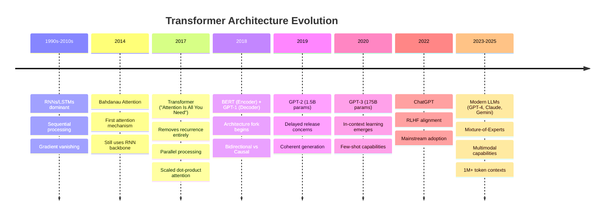
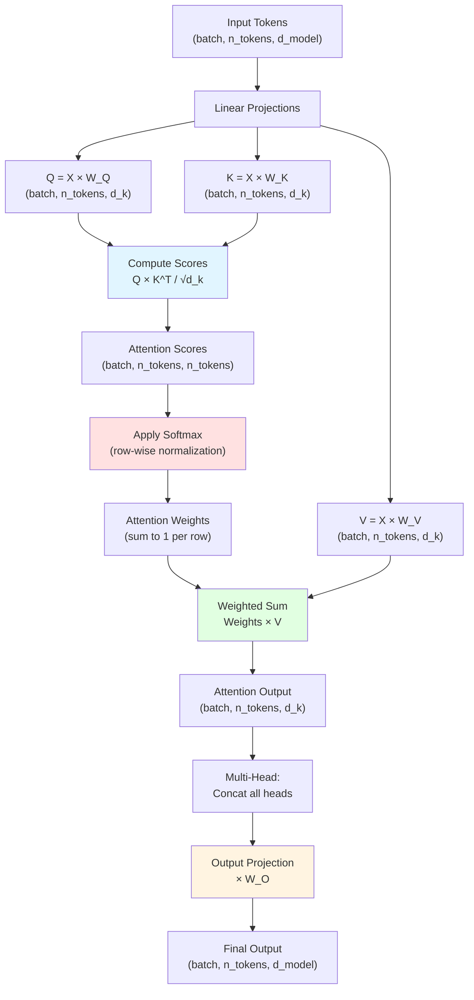
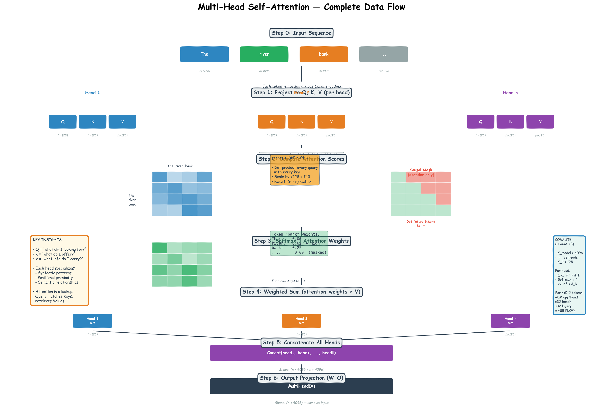
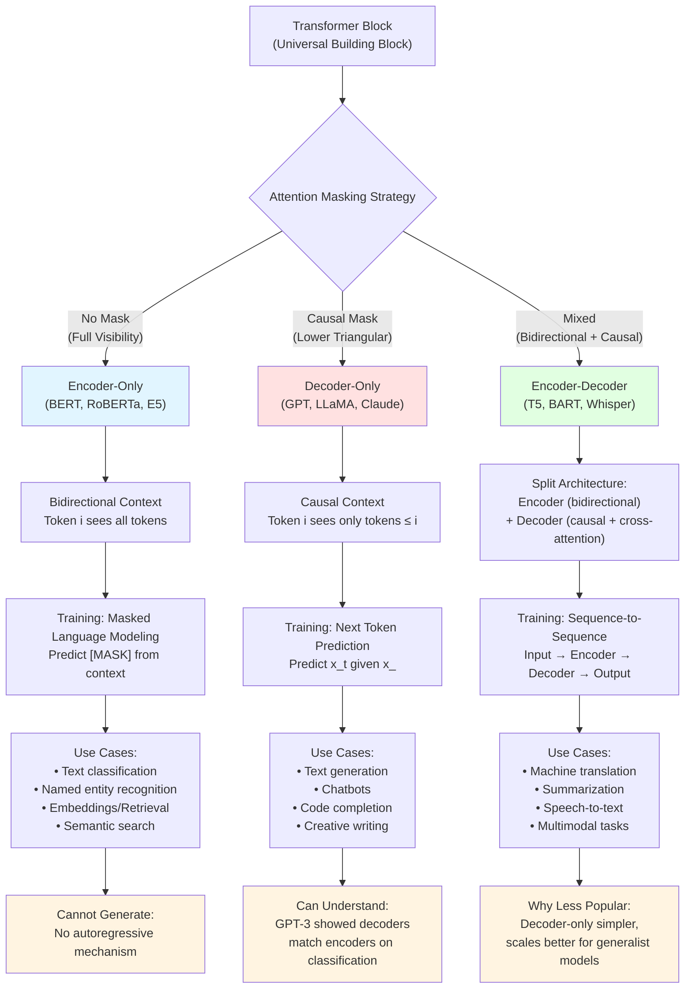
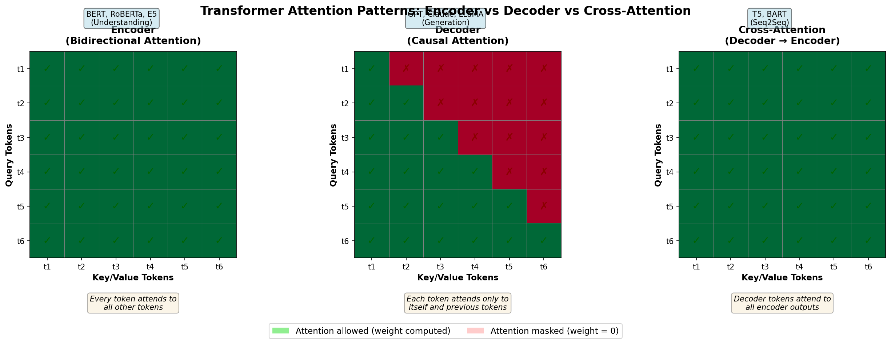

# Transformer Architecture — From Tokens to Attention

> **Reading order:** This chapter provides the technical foundation for the entire AI track. Two valid approaches:
> - **Start here (recommended):** Get the mechanics first (this chapter), then read Ch.0 for historical "why"
> - **Historical first:** Read Ch.0 for evolutionary context, then come here for depth
>
> Sections marked "*If you've read Ch.0*" can be skimmed if you took the historical-first path.

> **The story.** In June **2017**, eight Google engineers submitted a twelve-page paper with a title that was either arrogant or prophetic: *"Attention Is All You Need."* The entire field of natural language processing ran on **recurrent neural networks** — architectures that processed words sequentially, one token at a time, unable to parallelize training (process tokens in parallel) and plagued by vanishing gradients (weakening learning signals in deep networks; see Appendix A) beyond 100-200 tokens. The authors proposed throwing out recurrence entirely and replacing it with a single mechanism called **attention**. Reviewers were skeptical; the NeurIPS acceptance email arrived in September with mild praise. Within two years, every major language model — **BERT**, **GPT-2**, **T5** — was a variant of their architecture, and by 2025 the transformer had become so dominant that "neural network" and "transformer" were nearly synonymous in production systems.
>
> **Where you are in the curriculum.** This chapter builds the foundation you need for every later document — [LLM Inference Mechanics](../ch02-llm-inference-mechanics), [CoT Reasoning](../ch06-cot-reasoning), [RAG](../ch07-rag-and-embeddings), [ReAct](../../05-agentic-ai/ch01-react-and-semantic-kernel). You'll learn the historical path from RNNs to transformers, what an LLM actually is, how tokenization works, the mechanics of attention (Q/K/V, multi-head attention, positional encoding), and the three architectural families (encoder-only, decoder-only, encoder-decoder). **If you want evolutionary context first, see Ch.0 before reading this.**
>
> **Notation.** This chapter uses minimal math. When formulas appear, we provide intuition first and formulas second. **New to ML?** See Appendix A at the end for definitions of essential terms (training, gradients, embeddings, etc.).

**What You'll Learn:**
- Why computers can't do math on words (and what we do instead)
- How embeddings compress 100,000-word vocabularies into manageable dimensions
- Why attention is O(n²) and how that determines context window limits
- The mechanics of Q/K/V matrices and multi-head attention
- Why encoder-only, decoder-only, and encoder-decoder architectures exist
- Essential ML terminology (see Appendix A for definitions)

---

### Common Misconceptions — Address These First

Before we build the One-Second Oracle, let's demolish five misconceptions that quietly poison most people's first three months with transformers. Each is a tiny rotation of the truth — and tiny rotations cause maximum confusion because they feel correct.

**Misconception 1: "The embedding is where the model 'stores' all its understanding of language."**

- **Why it's seductive:** Embeddings *do* carry meaning. Words that mean similar things end up in similar regions of embedding space. So it's tempting to think embeddings are the seat of understanding.
- **The truth:** The embedding table has **exactly one** vector per token. That vector is the **same** whether you're reading "river bank" or "savings bank." Meaning is not picked at the embedding stage — meaning is **constructed** later, by attention, by mixing context into each token's representation. Think of embeddings as birth certificates. Attention is adulthood — where context shapes who the token actually becomes in this specific sentence.
- **Aphorism:** *Embeddings give you a token's potential. Attention gives you its sentence-specific self.*

**Misconception 2: "Tokens are words."**

- **Why it's seductive:** Most short common English words happen to be one token. So the casual observer concludes the mapping is 1:1.
- **The truth:** Tokens are **subword units** chosen by an algorithm (BPE, SentencePiece) trained on a corpus. *the* → 1 token. *the* (with leading space) → different token. *The* (capitalized) → yet another. *strawberry* → often 3 tokens (str, aw, berry). Chinese text costs ~3× more tokens than English for equivalent meaning. This affects pricing, arithmetic ability, and the "spell this word" problem.
- **Aphorism:** *The model doesn't see your letters. It sees fragments chosen by an algorithm you'll never meet.*

**Misconception 3: "Once a token is written, it can never change."**

- **Why it's seductive:** At inference time, once you sample "Paris", it's locked in — you don't go back and edit it. But this leads people to think *representations* are also frozen.
- **The truth:** Each token's **hidden state is rewritten at every layer**. Layer 5's representation of "the" is a totally different vector than Layer 1's representation. The causal mask only restricts which *other tokens* can be looked at (only earlier ones) — not whether the current token's own representation can evolve. Tokens don't move; representations do.
- **Aphorism:** *Tokens don't time-travel. But representations flow forward and rewrite themselves at every layer.*

**Misconception 4: "ChatGPT/Claude are conversational agents that 'remember' our chat."**

- **Why it's seductive:** The UI shows a chat. It feels conversational.
- **The truth:** Under the hood, every chat is a **single long document** that gets re-fed to the model on every turn. The "memory" is just text. Roles like `user:` and `assistant:` are special tokens stuffed into that document. There is no hidden state retained between turns — the model **rereads the entire transcript every time** and continues writing where the document left off. This is why long conversations slow down (the document keeps growing), why prompt injection works (everything is just text), and why context windows matter at all (every turn must fit inside one).
- **Aphorism:** *The model isn't talking to you. It's continuing a play in which you and it are both characters.*

**Misconception 5: "Isn't this just pattern matching?"**

- **Why it's seductive:** Transformers do learn patterns from training data, so "pattern matching" sounds roughly correct.
- **The truth:** Pattern matching is: "I've seen 'capital of France' before → output 'Paris'." What Transformers actually do: "I've seen 100,000 unique words in this conversation. I need to compare *every word against every other word* to figure out which ones matter for predicting word #100,001. Then I need to do that 32 times simultaneously from 32 different perspectives. Then I need to collapse 4,096 dimensions of meaning into a single probability distribution over 100,000 words. And I have 1 second." If you've ever thought "AI just memorizes patterns," you're not wrong — but you're *catastrophically* underestimating the engineering required to memorize 175 billion patterns and retrieve the right one in 20 milliseconds.
- **Aphorism:** *Transformers match patterns. But the patterns are 4,096-dimensional probability distributions over 100,000 words, recomputed 50 times per second.*

---

## 0 · The One-Second Oracle

**You're about to learn how to build something that shouldn't exist.**

Here's the impossible task: You have **one second**. In that second, you must pick **exactly one word** from a vocabulary of **100,000 words**. Not a random guess—the *correct* word. The word that finishes this sentence:

> "The capital of France is ___"

Easy, right? Now do it again. And again. And again—**50 times per second**, because that's what ChatGPT does when you hit Enter. Each word chosen from 100,000 candidates, each choice informed by *everything you've read so far in the conversation*, each word requiring **4 trillion calculations** to justify.

This is the Transformer architecture. Not a "model." Not "AI magic." **A machine built to solve eight impossible problems in sequence, in under 20 milliseconds, on hardware that costs less than your car.**

---

**Common Confusion: "Isn't this just pattern matching?"**

No. Pattern matching is: "I've seen 'capital of France' before → output 'Paris'."

What Transformers actually do: "I've seen 100,000 unique words in this conversation. I need to compare *every word against every other word* to figure out which ones matter for predicting word #100,001. Then I need to do that 32 times simultaneously from 32 different perspectives. Then I need to collapse 4,096 dimensions of meaning into a single probability distribution over 100,000 words. And I have 1 second."

If you've ever thought "AI just memorizes patterns," you're not wrong—but you're *catastrophically* underestimating the engineering required to memorize 175 billion patterns and retrieve the right one in 20 milliseconds.

---

### The Mission

You're going to build the One-Second Oracle. Not metaphorically—**actually build it**, concept by concept, enemy by enemy. By the end of this chapter, you'll understand:

- Why computers can't do math on the word "Paris" (and what we do instead)
- Why a 100,000-word vocabulary would instantly kill your GPU
- Why attention is O(n²) and why that number haunts every AI engineer's dreams
- Why the machine can't see the future (and how we enforce that)
- Why one "perspective" isn't enough (and how 32 perspectives work in parallel)
- How 4,096 dimensions collapse into one word

**No prerequisites.** No RNN knowledge required. No calculus assumed. Just you, eight enemies, and the tools we'll forge to defeat them.

---

<details>
<summary><strong>Historical context: How we got here (2014-2025)</strong></summary>

### The Path to Transformers

*In the summer of 2017, eight Google engineers published a twelve-page paper with a deliberately provocative title: "Attention Is All You Need."* They weren't describing a self-help book — they were discarding the recurrent loops that every language model had relied on for a decade and replacing them with a single mechanism called **attention**. The transformer, as the architecture came to be known, was faster to train, easier to parallelize, and — it turned out — almost infinitely scalable.

**The problem before 2017:** RNNs (recurrent neural networks) and LSTMs processed words sequentially — step $t$ depended on step $t-1$, so training couldn't be parallelized. Worse, gradients vanished over long sequences, making it nearly impossible to learn dependencies beyond 100-200 tokens. The field had hit a wall.

**Bahdanau attention (2014)** was the first crack: in machine translation, let the decoder "attend" to all source tokens simultaneously. But the recurrence bottleneck remained — you still had to step through time one token at a time.

**"Attention Is All You Need" (Vaswani et al., 2017)** dropped recurrence entirely. Every token attends to every other token in parallel. Training that previously took weeks could now run in days. This unlocked the scaling path that led directly to GPT and BERT.

**The decoder/encoder split (2018-2025):**
- **GPT (OpenAI):** Kept only the decoder half, trained on next-token prediction. GPT-3 (175B parameters, 2020) showed emergent in-context learning.
- **BERT (Google):** Kept only the encoder half, trained with masked language modeling. Dominated understanding tasks but couldn't generate text.
- **Why decoder-only won:** GPT-3 showed that causal models could match encoder models on understanding *while also generating*. Every major model after 2020 (GPT-4, Claude, LLaMA, Mistral, Gemini) is decoder-only.

**The alignment breakthrough (2022):** InstructGPT added supervised fine-tuning (SFT) + reinforcement learning from human feedback (RLHF). ChatGPT reached 100 million users in two months.

**The reasoning turn (2024):** OpenAI's o1 spent more compute at inference on reasoning chains, trained with RLVR (Reinforcement Learning from Verifiable Rewards). DeepSeek-R1 (2025) open-sourced the methodology.

**Historical Evolution: From RNNs to Modern LLMs**



**Key turning points:**
- **2017:** Attention becomes standalone (no RNN needed)
- **2018:** Fork into encoder-only (BERT) vs decoder-only (GPT)
- **2020:** Scale reveals emergent capabilities (GPT-3's in-context learning)
- **2022+:** Decoder-only dominates; encoders remain dominant for embeddings

> **Checkpoint:** The transformer solved two problems RNNs couldn't: parallelizable training and long-range dependencies. The next sections show you *how* it works, piece by piece.

</details>

---

## 1 · What You're Building

A **large language model** is a transformer decoder trained to predict the next token given all previous tokens, on internet-scale text. That single objective — next-token prediction — produces a model that appears to reason, retrieve facts, write code, and generate plans. None of those behaviors were explicitly programmed. They emerge from scale.

```
Training objective: maximize P(token_t | token_1, token_2, ..., token_{t-1})
Training data: ~10–100 trillion tokens scraped from the web, books, code
Training compute: 10²³–10²⁵ FLOP (millions of GPU-hours)
Result: a model with 7B–1T parameters that can perform most language tasks
```

Three stages turn a raw next-token predictor into the assistant you actually use:

```
Stage 1: Pretraining Raw transformer on internet text → learns language + world knowledge
Stage 2: SFT Fine-tuned on (instruction, good response) pairs → follows instructions
Stage 3: RLHF / DPO Aligned with human preferences → helpful, harmless, honest
```

Each stage is covered in detail in [Ch.2 §4](../ch02-llm-inference-mechanics/inference-mechanics.md).

> **Core idea:** The model predicts tokens. Everything in the AI track — CoT, RAG, ReAct, Semantic Kernel — is about how you wire inputs and outputs around that single mechanical act. When GPT-4 and Claude produce different outputs for the same prompt, it traces to different training data distributions and different RLHF reward signals, not to fundamentally different architectures.

---

### About the Enemy Framework

**What you're about to read:** We present transformer architecture as eight "enemies" — obstacles the design must overcome. This is pedagogical framing, not historical sequence. These constraints co-evolved during architecture design; we present them sequentially to build intuition one concept at a time.

**What this framework simplifies:** Real engineering involved simultaneous trade-offs across memory, compute, parallelism, and expressiveness. The Enemy→Tool→Victory pattern makes each decision feel discrete when in practice they were deeply intertwined. Hold this in mind: the framework scaffolds understanding without claiming historical accuracy.

---

## 2 · The First Three Enemies — From Words to Weapons

Let's meet the first three obstacles standing between you and the One-Second Oracle.

### Enemy #1: Computers Can't Do Math on Words

The first enemy is embarrassingly simple: **Computers don't understand "Paris."**

They understand `0.7284`. They understand `-12.4`. They understand `[3.2, -1.1, 0.0, 8.5]`. But "Paris"? That's a string. A sequence of Unicode characters. You can't multiply it. You can't average it with "France." You can't measure how "close" it is to "London."

Try this thought experiment: You're the machine. I give you this sentence:

> "The \_\_\_ of France is Paris."

Your job: **What word goes in the blank?** You have 100,000 words to choose from. How do you even *start*?

You can't say "Well, 'capital' *feels* right." You need a number. A score. A mathematical reason to pick "capital" (87% confidence) over "president" (8% confidence) over "sandwich" (0.00002% confidence).

**The naive tool: One-hot encoding — represent each word as a 100,000-dimensional vector with a single 1.**

```python
# One-hot vectors: 100,000 dimensions per word
"Paris"   → [0, 0, 0, ..., 1, ..., 0, 0]  # 1 at position 47,832, zeros everywhere else
"France"  → [0, 0, 0, ..., 1, ..., 0, 0]  # 1 at position 23,104
"London"  → [0, 0, 0, ..., 1, ..., 0, 0]  # 1 at position 51,287
"sandwich"→ [0, 0, 0, ..., 1, ..., 0, 0]  # 1 at position 89,421
```

This solves the "do math on words" problem — now every word is a vector. You can compute dot products, distances, similarities.

**But look what just happened:** Every word is now **equally far from every other word**. "Paris" and "France" are no closer than "Paris" and "sandwich." The model has no way to know that capital cities are related. Every word is an island.

**And worse:** 100,000 dimensions × 100,000 words = **10 billion numbers just to store the vocabulary representation**. You haven't even started computing attention yet and you've already used 40 GB of memory.

**The tool we actually forge: Dense embeddings — compress 100,000 one-hot dimensions down to 4,096 learned dimensions.**

Here's what that means in practice:

```python
# Dense embeddings: 4,096 dimensions per word (learned during training)
"Paris"   → [0.23, -1.84, 0.91, ..., 3.21]  # 4,096 numbers
"France"  → [0.19, -1.79, 0.88, ..., 3.15]  # Very close to Paris!
"London"  → [0.21, -1.81, 0.89, ..., 3.18]  # Also close (capital city)
"sandwich"→ [9.42,  0.03, -7.12, ..., -2.88] # Nowhere near Paris
```

These are **embeddings**. Every word in your 100,000-word vocabulary gets mapped to a point in this 4,096-dimensional space. Words that mean similar things live *close together*. Words that mean different things live *far apart*.

**Wait — why 4,096 dimensions specifically?** Why not 100,000 (one dimension per word)? Why not 128 (extremely compressed)? Why not 16,384 (give more room)?

The answer is a three-way trade-off:

1. **Too few dimensions** (128d): Can't capture enough distinctions. "Paris" and "France" end up close, but so do "Paris" and "Berlin" and "Rome" and "Madrid" — they all collapse into a single "European capital" cluster. You lose the ability to represent fine-grained meaning.

2. **Too many dimensions** (100,000d): You're back to one-hot encoding. Memory explodes (40 GB just for vocab). And empirically, you don't need that many dimensions — most of the 100,000 dimensions in one-hot space are wasted (they encode "which specific word slot" rather than meaning).

3. **Just right** (4,096d for GPT-scale models): Empirically discovered sweet spot. Enough dimensions to capture semantic relationships (capitals vs. countries vs. foods vs. concepts), few enough to fit in GPU memory. The number comes from experimentation: researchers trained models with 512d, 1024d, 2048d, 4096d, 8192d and found diminishing returns beyond 4096d for most tasks.

**Concrete numbers:**
- BERT-base: 768 dimensions (optimized for understanding tasks, smaller model)
- GPT-2 / GPT-3: 1,024d – 12,288d (scales with model size)
- LLaMA 7B: 4,096 dimensions
- LLaMA 70B: 8,192 dimensions (more parameters = can afford richer embeddings)

**How do we get these magic embeddings? They're not hand-designed — they're learned.** But before we explain *how* they're learned, let's see why you even need them. First, appreciate the victory.

**Victory:** Now we can do math *and* capture meaning. Want to know if "Paris" is related to "France"? Calculate the distance between their coordinate points (small distance = related). Want to find words similar to "capital"? Find all points within a certain radius. Want to predict the next word? Calculate which of the 100,000 coordinate sets is "closest" to the pattern you've detected.

**Aphorism:** *Computers do math on points, not on poetry. Embeddings turn words into coordinates where similarity becomes distance.*

**But we just created Enemy #2.**

---

### Interlude: How Are Embeddings Learned? (Forging the Tool)

You just saw that embeddings magically compress 100,000-word vocabularies into 4,096-dimensional spaces where "Paris" and "London" end up close together. **But how does the machine learn these coordinates?** You can't hand-design 100,000 × 4,096 = 410 million numbers. The machine must discover them through training.

Here's the intuition behind every embedding training algorithm (Word2Vec, GloVe, transformer pretraining):

**Core insight: Words that appear in similar contexts should have similar embeddings.**

- If "Paris" appears near "capital", "population", "France", "city" in millions of sentences...
- And "London" also appears near "capital", "population", "Britain", "city"...
- Then "Paris" and "London" should end up close in embedding space.

But "sandwich" appears near "bread", "lunch", "tasty", "eat" — completely different context words. So "sandwich" should end up far from "Paris".

#### The Training Process (Simplified)

**Step 1: Start with random coordinates**

Initialize a giant lookup table: 100,000 words × 4,096 dimensions = **410 million random numbers**.

```python
embedding_table = random_initialize(vocab_size=100_000, dimensions=4_096)
# "Paris" → [0.012, -0.34, 0.88, ..., 0.19] (random garbage)
# "France" → [0.73, 0.021, -0.45, ..., -0.61] (unrelated random garbage)
```

At this point, "Paris" and "France" are *random* — no relationship captured.

**Step 2: Feed millions of sentences and adjust coordinates**

The training algorithm reads sentences like:
- "The capital of France is Paris."
- "London is the largest city in England."
- "I ate a sandwich for lunch."

For each sentence, it plays a prediction game:

**Word2Vec's skip-gram game:**
- Given the center word "Paris", predict surrounding words: "capital", "of", "France"
- Given "France", predict surrounding words: "the", "capital", "of", "Paris"

**Transformer pretraining game (used by GPT, BERT):**
- Given "The capital of France is", predict next word: "Paris"
- Given "The capital of France", predict next word: "is"

Every time the model makes a wrong prediction, it adjusts the embedding coordinates via **backpropagation** (the core training algorithm):

```
If model predicts "sandwich" when answer is "Paris":
  - Make "Paris" embedding more likely in this context (adjust its 4,096 coordinates)
  - Make "sandwich" embedding less likely in this context

If model predicts "London" when answer is "Paris":
  - Small adjustment (they're both capitals — partial credit)
  - But still nudge "Paris" to be more likely

If model predicts "France" when answer is "Paris":
  - Very small adjustment (they co-occur often — strong relationship learned)
```

**Step 3: After billions of examples, embeddings self-organize**

After training on ~10 trillion tokens (GPT-3 scale), the embedding space organizes itself:

- **Geographic cluster:** "Paris", "London", "Tokyo", "Berlin" end up in one neighborhood
- **Country cluster:** "France", "England", "Japan", "Germany" end up nearby
- **Food cluster:** "sandwich", "pizza", "burger", "pasta" end up far from geography
- **Concept cluster:** "democracy", "freedom", "election" form their own region

This wasn't programmed. It **emerged** from the statistical patterns in billions of sentences.

#### The Famous Word2Vec Example

The most famous example of learned embeddings:

```python
vector("king") - vector("man") + vector("woman") ≈ vector("queen")
```

This works because:
- "king" and "man" both encode masculinity + royalty
- Subtracting "man" removes masculinity, leaves royalty
- Adding "woman" adds femininity
- Result: feminine + royalty ≈ "queen"

The model **never saw a rule saying "king - man + woman = queen"**. It discovered this relationship by observing millions of sentences where:
- "king" appeared near "male", "his", "throne", "ruled"
- "queen" appeared near "female", "her", "throne", "ruled"
- The difference between king/queen contexts = the difference between man/woman contexts

#### Why Transformers Learn Better Embeddings

Early methods (Word2Vec, GloVe) learned **static embeddings** — each word got a single fixed vector. "bank" always had the same 300-d embedding whether you said "river bank" or "savings bank".

Transformers learn **contextualized embeddings**:
1. Start with a static embedding from the lookup table (the "birth certificate")
2. Then refine it through 96 layers of attention (where "bank" sees "river" and adjusts its meaning)

The lookup table embeddings are just the starting point. By layer 48, "bank" in "river bank" has a completely different representation than "bank" in "savings bank" because attention has rewritten it based on context.

**Why this matters for Enemy #2:** The embedding table is just a 100k × 4,096 lookup table (1.6 GB). Expensive, but manageable. The *real* memory cost comes next: attention comparisons across the sequence. That's Enemy #2.

**Checkpoint:** You now understand:
- Why embeddings exist (compress 100k one-hot dimensions → 4,096 dense dimensions)
- Why 4,096 (empirical trade-off between expressiveness and memory)
- How they're learned (predict context words, adjust coordinates via backpropagation)
- Why transformers do it better (contextualize via attention after lookup)

**Next up:** Even with 4,096 dimensions, we still have a catastrophic memory problem. Let's meet Enemy #2.

---

### Enemy #2: The Vocabulary Size × Sequence Length Memory Death

You just solved the "math on words" problem by learning 4,096-dimensional embeddings. Now you face two different n² explosions. Let's untangle them.

#### The Confusion: Two Different "100k × 100k" Problems

**Problem 1: Vocabulary size in embeddings (already solved)**

If you used 100,000-dimensional one-hot vectors, the embedding lookup table would be enormous:
- 100,000 words × 100,000 dimensions × 4 bytes = **40 GB just for the vocabulary**

But you already solved this by compressing to 4,096 dimensions:
- 100,000 words × 4,096 dimensions × 4 bytes = **1.6 GB** (manageable!)

**Problem 2: Attention across sequence length (the real Enemy #2)**

But now you face a different explosion. Forget vocabulary size for a moment. Focus on **sequence length** — how many tokens are in your input.

When you compute attention, **every token in the sequence must compare itself with every other token in the sequence**. If your input has 1,000 tokens (about 750 words), that's:

```
1,000 tokens × 1,000 tokens = 1,000,000 comparisons
```

Each comparison stores a **similarity score** (how much token i should attend to token j). Each score is a 32-bit float (4 bytes). So for one attention layer:

```
1,000 × 1,000 comparisons × 4 bytes = 4 MB per layer
```

That seems fine! But here's where it gets ugly:

**The real cost: Multi-layer, multi-head, batch processing**

A production model has:
- **32 layers** (LLaMA 7B scale)
- **32 attention heads per layer** (each head computes its own attention matrix)
- **Batch size 8** (processing 8 requests simultaneously for efficiency)

So the actual memory for attention matrices:

```
1,000 × 1,000 tokens × 4 bytes × 32 heads × 32 layers × 8 batch = 32 GB
```

And that's just for 1,000 tokens. **Now scale to 100,000 tokens** (GPT-4-scale context windows):

```
100,000 × 100,000 × 4 bytes × 32 heads × 32 layers × 8 batch = 3.2 petabytes
```

**Your GPU has 24 GB. You're dead before you start.**

#### Why This Is Worse Than the Vocabulary Problem

The vocabulary compression (100k → 4,096 dimensions) was a **one-time win**. You compress the lookup table, and every operation benefits.

The sequence length problem **scales quadratically with input size**. Every additional token adds n+1 new comparisons (where n is the current sequence length). There's no embedding trick that fixes this — attention fundamentally requires comparing every token with every other token.

#### The Tool We Forge: Accept the Ceiling (Pick Your Battlefield)

This isn't a "solution"—it's a **strategic retreat**. You can't beat O(n²). The physics won't allow it. So you:

1. **Pick your maximum sequence length upfront** based on available memory
2. **Design the entire architecture around that limit**
3. **Enforce truncation ruthlessly** — if input exceeds limit, cut it off

Here's what production models chose:

| Model | Context Window | Memory Required (single layer, batch=1) | Hardware Needed |
|-------|----------------|----------------------------------------|----------------|
| GPT-2 (2019) | 1,024 tokens | 4 MB | Consumer GPU (8 GB) |
| GPT-3 (2020) | 2,048 tokens | 16 MB | A100 (40 GB) |
| GPT-4 (2023) | 8,192 / 32,768 tokens | 256 MB / 4 GB | A100 cluster (80 GB each) |
| Claude 3.5 (2024) | 200,000 tokens | 160 GB | Multi-GPU inference |
| Gemini 1.5 (2024) | 1,000,000 tokens | 4 TB | Sparse attention (doesn't compute full n²) |

**Notice the pattern:**
- **2× longer context → 4× more memory** (quadratic scaling)
- Beyond 32k tokens, you need specialized hardware or sparse attention tricks
- The context window is the single most expensive parameter to scale

#### Why Not Just Use Sparse Attention?

Some models (Gemini 1.5, Longformer, BigBird) use **sparse attention** — each token only attends to a subset of tokens (nearby tokens + a few random ones), not the full sequence. This drops cost from O(n²) to O(n log n) or O(n).

**Why every model doesn't use sparse attention:**
1. **Quality loss**: Full attention lets every token see every other token. Sparse attention creates blind spots — a token at position 1000 might miss crucial context from position 50.
2. **Implementation complexity**: Sparse attention requires custom CUDA kernels. Full attention uses standard matrix multiplication (highly optimized on GPUs).
3. **Training instability**: Sparse patterns need careful tuning to avoid gradient flow problems.

For most models, the trade-off isn't worth it until you exceed 32k tokens. Below that, full O(n²) attention + aggressive context window limits is simpler and works better.

#### The Math: Why 4,096 Embedding Dimensions Don't Cause the Problem

You might think: "Wait, doesn't comparing 4,096-dimensional vectors cost memory?"

Yes, but that's a **linear cost**, not quadratic:

```
Cost of attention scores: n × n comparisons (quadratic in sequence length)
Cost per comparison: d_k dot products (linear in embedding dim)
Total cost: O(n² × d_k)
```

If you double the embedding dimension (4,096 → 8,192), you double the cost.
If you double the sequence length (1,000 → 2,000), you **quadruple** the cost.

The n² in sequence length dominates. The d_k is a constant multiplier you can tune.

**Victory:** You've defined the limits of your Oracle. You picked 2,048 tokens as your battlefield (GPT-3 choice), or 8,192 (GPT-4 choice), or 128k (Claude 3 choice). Whatever you picked, the hardware enforces it ruthlessly. Now you can move on to teaching the Oracle which words in that fixed window actually matter.

**Aphorism:** *O(n²) cannot be beaten. Pick your battlefield: 2,048 tokens? 128k tokens? The hardware decides.*

---

### Enemy #3: The Context Window Ceiling (Picking Your Battlefield)

You just saw that attention costs scale **quadratically with sequence length**. Enemy #2 showed you the raw memory numbers: 1,000 tokens costs 4 MB per layer, 100,000 tokens costs 4 TB.

Now comes the engineering question: **How long should your context window be?**

This isn't a math question. It's a product question. And every model made a different choice based on what they wanted to build.

#### The Trade-Off Triangle

Every additional token you add to the context window costs you three ways:

**1. Training cost (one-time, massive)**

Training a model with 8k context costs **4× more GPU-hours** than training with 4k context. Not 2× — remember, it's O(n²).

- GPT-3 (2,048 context): ~$5M training cost (2020 estimates)
- GPT-4 (8k / 32k context): Estimated $50M-100M (OpenAI hasn't disclosed)
- Claude 3 (200k context): Training cost scaled to hundreds of millions

**Why this matters:** If you're a startup training a 7B model, you can afford 4k context training on $50k of cloud GPUs. To train 128k context, you need $2M+ and months of time. Most models never justify that cost.

**2. Inference cost (every request, forever)**

Once trained, every user request pays the O(n²) cost:

| Context Used | Cost per 1M tokens (GPT-4 API, May 2025) |
|--------------|------------------------------------------|
| First 8k tokens | $0.03 per 1k input tokens (base rate) |
| Next 24k tokens (8k → 32k) | $0.06 per 1k (2× more expensive) |
| Beyond 32k (if available) | $0.12 per 1k (4× more expensive) |

**Why tiered pricing?** Because the memory and compute cost literally scales with n². Processing a 32k context costs 4× more GPU memory than an 8k context. The API pricing reflects the engineering reality.

**3. User experience cost (latency)**

Longer contexts = slower responses:

| Context Length | Time to First Token (GPT-4, A100 GPU) |
|----------------|---------------------------------------|
| 512 tokens | ~200ms |
| 2,048 tokens | ~400ms |
| 8,192 tokens | ~1,200ms |
| 32,768 tokens | ~4,500ms |

**Why this matters:** Users perceive <500ms as "instant". Beyond 1 second, they notice the wait. Beyond 3 seconds, they get frustrated. Long-context models sacrifice user experience for capability.

#### The Production Engineering Decision

Here's how different models chose their battlefield:

**GPT-3 (2,048 tokens, 2020):**
- **Philosophy:** "Most conversations fit in 2k tokens. Optimize for the common case."
- **Trade-off:** Fast inference, low cost, but can't handle long documents
- **Use case:** Chatbots, short-form writing, code completion

**GPT-4 (8k / 32k, 2023):**
- **Philosophy:** "8k handles 95% of use cases. Offer 32k as premium tier for document analysis."
- **Trade-off:** Dual-tier pricing (32k costs 2× more per token)
- **Use case:** 8k for chat, 32k for legal doc review / research

**Claude 3 (200k, 2024):**
- **Philosophy:** "Make context a non-issue. Entire books should fit."
- **Trade-off:** Slower inference, much more expensive training, higher API cost
- **Use case:** Research assistants, multi-document analysis, codebase Q&A

**Gemini 1.5 (1M, 2024):**
- **Philosophy:** "Context should never be the bottleneck."
- **Trade-off:** Requires sparse attention (O(n log n) instead of O(n²)), quality loss on long-range dependencies
- **Use case:** Video transcription, entire codebases, legal discovery

#### The Lost-in-the-Middle Problem

Bigger context windows don't guarantee better retrieval. Empirical research (Liu et al., 2023, "Lost in the Middle") found:

**Retrieval accuracy by position (100k context):**
- Facts at **position 1-5** (start of context): 90% recall
- Facts at **position 50,000** (middle of context): 62% recall
- Facts at **position 95,000-100,000** (end of context): 88% recall

The model has **recency bias** (remembers the end) and **primacy bias** (remembers the start), but **forgets the middle**.

**Why this happens:**
1. **Positional encoding decay**: RoPE and other position embeddings are trained on shorter sequences, extrapolate poorly to ultra-long contexts
2. **Attention saturation**: When softmax is spread across 100k tokens, middle tokens get <0.001% attention each — signal drowns in noise
3. **Training distribution**: Models are pretrained on 2k-8k contexts, then extrapolated to 100k. Middle positions are out-of-distribution.

**What this means for RAG:** If you retrieve 20 documents (10k tokens total) and stuff them in the middle of a 200k context prompt, the model might miss them. Better strategy: Put critical facts at the start or end of the prompt, or use explicit "Here's what matters:" sections.

#### Why You Can't "Just Add More Context"

Users often ask: "Why doesn't GPT-4 support 1M tokens like Gemini?"

The answer: **OpenAI chose dense O(n²) attention for quality, which makes 1M-token contexts prohibitively expensive.** Google chose sparse attention for scale, which trades some quality for massive context.

**The dense vs sparse attention choice:**

| Approach | Complexity | Quality | Max Practical Context |
|----------|-----------|---------|----------------------|
| Dense (GPT-4, Claude) | O(n²) | Best (every token sees every other token) | 32k-200k |
| Sparse (Gemini 1.5) | O(n log n) | Good (most tokens see most relevant tokens) | 1M+ |
| Hybrid (future) | O(n√n) | Unknown (active research) | TBD |

There's no free lunch. You optimize for quality or scale, rarely both.

#### The Tool We Forge: Strategic Retreat

You can't beat O(n²) physics. So you:

1. **Pick your maximum context length** based on:
   - Hardware budget (GPUs available)
   - Use case (chat vs document analysis)
   - Inference speed requirements (fast chat vs slow research)

2. **Build truncation logic into your API:**
   ```python
   if len(prompt_tokens) > max_context:
       prompt_tokens = prompt_tokens[-max_context:]  # Keep most recent
   ```

3. **Document the limit** so users know when they'll hit it

4. **Optimize within the limit:**
   - KV caching (Ch.2 §3A) makes generation faster within the window
   - Prompt compression (Ch.5) fits more semantic content into fewer tokens
   - RAG retrieval (Ch.7) brings in external knowledge without expanding context

**Victory:** You've defined the limits of your Oracle. It can see 2,048 tokens (GPT-3), 8,192 tokens (GPT-4), or 200k tokens (Claude 3) into the past—no more, no less. The limit is public, documented, and ruthlessly enforced. Now you can move on to teaching the Oracle *which* words in that fixed window actually matter — that's what attention solves.

**Aphorism:** *O(n²) cannot be beaten. Pick your battlefield and defend it: 2,048 tokens? 32k tokens? 200k tokens? Every choice is a trade-off between speed, cost, and capability.*

---

### Tokenization — How Text Becomes Numbers (And Why It Matters for Everything)

*Before you can estimate API costs, understand why the same English sentence tokenizes to different counts on GPT-4 vs Claude, or reason about how much document context fits in a single call — you need to understand what the model actually receives. It never sees raw text. Text is first broken into **tokens** — subword units — using a byte-pair encoding (BPE) vocabulary.*

Tokenization is the **unglamorous prerequisite** to everything that follows. It determines your API costs, your context window limits, and even why models struggle with certain tasks.

#### How BPE (Byte-Pair Encoding) Works

BPE is a **greedy compression algorithm** trained on your corpus:

```
Step 0: Start with character-level vocabulary
  ['a', 'b', 'c', ..., 'z', ' ', '.', '!', ...]

Step 1: Count all adjacent character pairs in training corpus
  "the" appears 500M times → "t"+"h" = 500M occurrences
  "in" appears 300M times → "i"+"n" = 300M occurrences
  "er" appears 280M times → "e"+"r" = 280M occurrences

Step 2: Merge most frequent pair into new token
  't' + 'h' → 'th' (now 'th' is a single token)

Step 3: Repeat on updated corpus
  Next most frequent: 'th' + 'e' → 'the'
  Then: 'i' + 'n' → 'in'
  Then: 'in' + 'g' → 'ing'

Step 4: Continue until vocabulary reaches target size
  GPT-2: 50,257 tokens
  GPT-4: ~100,000 tokens
  Claude: ~100,000 tokens (different vocabulary — trained on different corpus)
```

**Result after training BPE on web text:**
- Common English words → single tokens: `the`, `and`, `model`, `training`
- Common subwords → single tokens: `ing`, `tion`, `pre`, `un`
- Rare words → split: `trans` + `former`, `to` + `ken` + `ization`
- Code tokens → often character-level: `self`, `.`, `attention`, `_`, `weights`

#### Why Tokenization Matters: Five Critical Implications

**1. API Cost = Token Count × Price Per Token**

Every API charges per token, not per word or character:

```python
# Same semantic meaning, very different costs
prompt_1 = "Explain transformers"  # 3 tokens → $0.000075 (GPT-4o-mini)
prompt_2 = "Can you explain how transformer architecture works?"  # 9 tokens → $0.0002025

# 3× longer prompt = 3× cost
```

**Rule of thumb:** 1 token ≈ 0.75 English words (4 characters on average)

**Why this approximation breaks:**
- Technical jargon: `transformer` (1 token) vs `trans-dimensional-quantum-accelerator` (8+ tokens)
- Code: `model.parameters()` (6+ tokens: `model`, `.`, `parameters`, `(`, `)`)
- Non-English: Chinese/Arabic text costs 2-4× more tokens per semantic unit than English

**2. Context Window = Token Limit, Not Word/Character Limit**

GPT-4's 8k context means 8,192 **tokens**, not 8k words:

```python
# Efficient prompt: ~6,000 tokens fit in 8k window
"Write a summary of the document: [6000-word document in English]"

# Inefficient prompt: Only ~2,000 semantic units fit
"Write a summary of the document: [same document but in Chinese/Arabic]"
```

**Why non-English is expensive:** BPE is trained on English-heavy web text. Non-English text splits into smaller units (more tokens per meaning unit).

**Concrete example:**
- English: "The capital of France is Paris." → 8 tokens
- Chinese: "法国的首都是巴黎。" (same meaning) → 12-15 tokens
- Arabic: "عاصمة فرنسا هي باريس" (same meaning) → 18-22 tokens

**3. Why Models Struggle With Spelling / Character-Level Tasks**

Ask GPT-4: *"How many r's in 'strawberry'?"*

Expected: 3
Actual (GPT-4 output, 2023): "Two."

**Why this happens:** `strawberry` tokenizes as `str` + `aw` + `berry` (3 tokens in GPT-2 vocabulary). The model never sees individual letters — it sees **token IDs**:

```python
"strawberry" → [620, 707, 15717]  # Three opaque integers
```

The model has no direct access to the character sequence 's-t-r-a-w-b-e-r-r-y'. It must *infer* the spelling from learned patterns across millions of examples. Sometimes it hallucinates.

**Why "THE" vs "the" are different tokens:**
- `the` (lowercase, standalone) → token 1996
- ` the` (lowercase, with leading space) → token 262
- `The` (capitalized) → token 1821
- ` The` (capitalized, with leading space) → token 383

Case sensitivity and leading spaces matter because BPE tokenizes based on statistical frequency in training text. Each variant appears in different contexts, so each gets its own token.

**4. Why Arithmetic Is Hard for LLMs**

Ask GPT-4: *"What is 4758 + 3829?"*

The model must:
1. Tokenize `4758` → might be `[4, 758]` or `[47, 58]` or `[4758]` (depends on vocabulary)
2. Tokenize `3829` → `[38, 29]` or `[382, 9]` or `[3829]`
3. Predict the next token after learning addition from examples

If `4758` splits into two tokens `[47, 58]`, the model sees this as **two separate numbers**, not a single four-digit integer. It must learn carry-over digit-by-digit from sparse training examples.

**Why this is hard:**
- Numbers tokenize inconsistently: `100` might be 1 token, `101` might be 2
- The model never learned arithmetic algorithms (like you learned in school) — it only saw examples
- Rare numbers (like `4758`) appear in <100 training examples; the model hasn't memorized every addition pair

**5. Code Tokenization Is Extremely Inefficient**

Python code tokenizes poorly because BPE was trained on natural language:

```python
# High-level English prompt: 15 tokens
"Write a function to sort a list"

# Equivalent Python code: 35 tokens
def sort_list(lst):
    return sorted(lst)

# Token breakdown:
# ['def', ' sort', '_', 'list', '(', 'lst', '):', '\n', '    ', 'return', ' sorted', '(', 'lst', ')']
```

**Why code is token-dense:**
- Symbols like `(`, `)`, `:`, `.`, `[`, `]` are each separate tokens
- Indentation (spaces/tabs) tokenizes separately: `    ` (4 spaces) = 1-2 tokens
- Variable names split: `attention_weights` → `attention`, `_`, `weights`

**Production impact:** A 500-line Python file might be 8,000-12,000 tokens — consuming an entire GPT-4 8k context window. Most code QA tools compress code by removing comments, docstrings, and whitespace before sending to the model.

#### Vocabulary Differences Between Models (Why Token Counts Vary)

GPT-4 and Claude use **different BPE vocabularies** trained on different corpora:

```python
# Same text, different token counts
text = "Transformer architecture leverages self-attention mechanisms."

# GPT-4 tokenization (example): 8 tokens
# Claude tokenization (example): 9 tokens
# LLaMA tokenization (example): 10 tokens
```

**Why this matters:**
- Never assume token counts transfer between models
- Always use the model-specific tokenizer for cost estimation:
  ```python
  import tiktoken  # OpenAI's tokenizer
  enc = tiktoken.encoding_for_model("gpt-4")
  tokens = enc.encode("Your text here")
  print(f"Token count: {len(tokens)}")
  ```

#### How to Minimize Token Usage (Cost Optimization)

**1. Remove unnecessary words:**
```python
# Wordy (28 tokens)
"I would greatly appreciate it if you could kindly provide me with a detailed explanation of transformer architecture."

# Concise (12 tokens)
"Explain transformer architecture in detail."
```

**2. Avoid repetitive phrasing:**
```python
# Repetitive (45 tokens)
"First, explain what transformers are. Second, explain how attention works. Third, explain positional encoding."

# Compressed (22 tokens)
"Explain: 1) transformers 2) attention 3) positional encoding"
```

**3. Use abbreviations where unambiguous:**
```python
# Long form (18 tokens)
"natural language processing machine learning artificial intelligence"

# Abbreviated (15 tokens) — still clear in context
"NLP ML AI"
```

**4. For code, remove comments and docstrings:**
```python
# With comments (50 tokens)
def calculate_attention(Q, K, V):
    """
    Computes scaled dot-product attention.
    Args: Q, K, V matrices
    Returns: attention output
    """
    scores = Q @ K.T / sqrt(d_k)
    weights = softmax(scores)
    return weights @ V

# Stripped (22 tokens) — semantics preserved
def calculate_attention(Q, K, V):
    return softmax(Q @ K.T / sqrt(d_k)) @ V
```

#### What You Need to Know About Tokens (Summary Table)

| Fact | Why it matters | Example |
|------|----------------|---------|
| ~1 token ≈ 0.75 English words | Convert words → tokens for cost estimation | 750-word document ≈ 1,000 tokens |
| 1 token ≈ 4 bytes (Unicode) | 1M tokens ≈ 4 MB of text | GPT-4 128k context ≈ 512 KB |
| Token counts vary between models | Never assume GPT-4 count = Claude count | "transformer" = 1 token (GPT-4), 2 tokens (some models) |
| Code is token-dense | `self.attention_weights[layer_idx]` = 6–10 tokens | 500-line file = 8k-12k tokens |
| Numbers tokenize inconsistently | `12345` → `[123, 45]` or `[12, 345]` depending on BPE vocabulary | Arithmetic is hard for LLMs |
| Non-English costs more | Chinese/Arabic = 2-4× tokens per meaning unit | Translation costs explode for low-resource languages |
| Tokenization is model-specific | GPT-4 and Claude have different vocabularies | Always use model-specific tokenizer for cost estimation |

> **Tokenization → cost:** A typical question-answer API exchange averages ~500 tokens. At GPT-4o-mini pricing ($0.00015/1k input tokens, $0.0006/1k output tokens), that's $0.000075 input + $0.0003 output = **$0.000375 per call**. At GPT-4o pricing ($0.0025/1k input, $0.01/1k output), that's $0.00125 input + $0.005 output = **$0.00625 per call**. Multiply by 1 million API calls/month → $375/month (mini) vs $6,250/month (GPT-4o). Tokenization determines whether your product is economically viable.

---

**Checkpoint: You've Defeated the First Three Enemies**

You've defeated the first three enemies:

1. **Computers can't do math on words** → Embeddings turn "Paris" into `[0.23, -1.84, ...]`
2. **100k×100k memory death** → Dense 4,096d embeddings compress the problem 600×
3. **Context window ceiling** → Pick a fixed limit (2k-128k tokens) and enforce it ruthlessly

You now have:
- A vocabulary of 100,000 words, each mapped to 4,096 dimensions
- A tokenization system (BPE) that breaks text into subword units
- A context window that fits on your GPU
- A machine that can do math on language

**Next up: Enemy #4-6** — How does the machine know *which* words in the context matter? How does it avoid "seeing the future"? And why does it need to do this 32 times in parallel?

---

Now that you understand *what* the model receives (tokens converted to embeddings), let's see *how* it processes them. The transformer block is the engine that transforms raw token embeddings into contextualized representations (vectors enriched with information from surrounding tokens). We'll build it step-by-step, starting with the core attention mechanism.

## 2A · The Next Three Enemies — Teaching the Oracle to Pay Attention

You've built a machine that can do math on words, compressed 100k dimensions into 4,096, and picked your context window battlefield. Now comes the hard part: **which words in the context actually matter?**

When the machine sees "The river bank was flooded", how does "bank" know to pay attention to "river" (geographic clue) and not "The" (irrelevant article)? You have 2,048 tokens in the context window. The machine needs to decide, for each token, which of the other 2,047 tokens are relevant.

This is what **attention** solves. Let's meet the enemies standing in your way.

---

### Enemy #4: "Everything Matters Equally" (The Relevance Problem)

You have a sentence: "The river bank was flooded."

The word "bank" is ambiguous. Is it a financial institution? A riverbank? Without context, you can't decide. But here's the problem: **every word in the sentence is just a 4,096-dimensional vector**. They're all floating in the same space. How does "bank" know which other vectors to look at?

**Naive approach:** Average all the context vectors together.
```
bank_output = average([The, river, bank, was, flooded])
```

**Why this fails catastrophically:** "The" contributes as much as "river" (20% each). The irrelevant article drowns out the geographic clue. You've just averaged away the signal.

**The tool we forge: Attention scoring — let each token *search* for relevant context.**

Here's the mechanism:

1. **Every token asks a question** (Query): "What am I looking for?"
2. **Every token advertises what it offers** (Key): "Here's what I contain."
3. **Score similarity:** How well does "bank"'s question match "river"'s advertisement?
4. **Retrieve information:** Blend context vectors weighted by similarity scores.

**Think of it like a library catalog:**
- **Query (Q):** Your search question ("show me books about climate change")
- **Key (K):** The index label on each book's spine ("Science - Climate - 2020")
- **Value (V):** The actual content inside each book

The attention mechanism matches your query against all the labels, then retrieves a blend of the relevant book contents.

---

#### Step 1: Project Into Query, Key, Value Spaces

Every token starts as a **d_model-dimensional vector** (e.g., 768-d for BERT-base, 4096-d for LLaMA 7B, 12,288-d for GPT-4 scale). For each attention head, three linear projections create:

$$
\begin{aligned}
Q &= X W_Q \quad \text{(query: "what am I looking for?")} \\
K &= X W_K \quad \text{(key: "what do I offer?")} \\
V &= X W_V \quad \text{(value: "what information do I carry?")}
\end{aligned}
$$

**Plain English:** We're creating three different "views" of each token. Imagine every word wearing three hats: a "what I'm searching for" hat (Q), a "what I'm advertising" hat (K), and a "what I contain" hat (V). These projection matrices are **learned during training** — the model adjusts them so that relevant tokens produce similar Q/K patterns.

---

#### Step 2: Compute Attention Scores (Measure Relevance)

For each token, compute its similarity to every other token by taking the dot product of its query with all keys:

$$
\text{scores} = \frac{Q K^T}{\sqrt{d_k}}
$$

**What this means:** Row $i$, column $j$ tells you "How relevant is token $j$ when processing token $i$?" In "river bank", the score at row="bank", col="river" would be high because "river" helps disambiguate "bank".

**Why divide by $\sqrt{d_k}$?** Without scaling, dot products grow with dimension (high-dimensional random vectors have large dot products). This pushes the softmax into saturation — gradients vanish. The $\sqrt{d_k}$ normalization keeps scores in a stable range.

**Concrete numbers (LLaMA 7B, single head):**
- 4,096-dimensional embeddings, 32 heads → 128 dimensions per head
- For a 512-token sequence: 262,144 similarity scores computed **per head**
- With 32 heads × 32 layers = 1,024 attention operations per forward pass

**Victory:** Now "bank" can compute a relevance score for every other token. "River" scores high (geographic context), "The" scores low (uninformative article). But we're about to create Enemy #5.

**Aphorism:** *Attention asks: "Who has what I need?" Query seeks, Key advertises, Value delivers.*

---

### Enemy #5: "The Machine Can See the Future" (The Time Travel Problem)

Here's where it gets tricky. You're training the model to predict the next word. The training example is:

> "The river bank was flooded"

When the model is processing "bank", it computes attention scores for all tokens, including... "flooded" (the word that comes *after*).

**The problem:** If "bank" can see "flooded" during training, it learns to cheat. It's not learning to predict from context — it's learning to peek at the answer key. At inference time (when generating new text), there is no "flooded" to look at. **The model will fail catastrophically.**

**The tool we forge: Causal masking — block access to future tokens.**

In **decoder models** (GPT, Claude, LLaMA), each token can only attend to **prior tokens**. Before applying softmax, set all future token scores to $-\infty$. After softmax, those become zero — effectively blocking the future.

**Intuition:** Causal masking is like reading a mystery novel — you can only see the pages you've already read, not the ones ahead. When the model generates "The river bank was...", it knows about [The, river, bank, was] but must not peek at "flooded" (the next word). If it could see the future, generation would be cheating.

**Concrete example:** At generation step 4 (producing the 4th token), the model can attend to tokens 1-3 but not tokens 5+. This forces it to learn genuine next-token prediction, not just memorization.

> **Note:** **Encoder models** (BERT) skip this step — every token can attend to every other token (bidirectional attention). They're built for understanding, not generation.

---

#### Step 3: Softmax (Convert Scores to Probability Distribution)

$$
\mathrm{attention\_weights} = \mathrm{softmax}(\mathrm{scores\_masked})
$$

**Intuition:** Softmax is like converting exam scores (raw numbers) into a probability distribution. If three students scored 85, 72, and 63, softmax converts these to percentages that sum to 100%: maybe 52%, 31%, 17%. Higher scores get more weight, but everyone gets *some* attention.

Each row of the resulting matrix sums to 1.0 — token $i$ distributes 1.0 units of attention across all tokens $j \leq i$.

**Example (simplified 4-token sequence: "The river bank flooded"):**

```
Token "bank" attention weights (after softmax):
 The: 0.08
 river: 0.62 ← high weight: "river" is relevant context
 bank: 0.25 ← moderate weight: self-attention
 flooded: 0.00 ← zero weight: causal mask (future token)
```

"River" dominates because during training, the model learned that nouns adjacent to geographic verbs ("flooded") help disambiguate polysemous words like "bank."

---

#### Step 4: Weighted Sum (Retrieve the Blended Information)

#### Step 4: Weighted Sum (Retrieve the Blended Information)

$$
\mathrm{output} = \mathrm{attention\_weights} \cdot V
$$

**Intuition:** This is where the "retrieval" happens. Imagine you scored 5 books as 60%, 25%, 10%, 3%, 2% relevant. Now you read a weighted blend: 60% of book 1's content + 25% of book 2's content + tiny bits of the others. The output isn't any single book — it's a custom-mixed summary weighted by relevance.

**Concrete example:** If "bank" assigned 62% attention to "river", 25% to itself, and 8% to "the", its output representation becomes: 0.62×value_river + 0.25×value_bank + 0.08×value_the. It's now "colored" mostly by "river", disambiguating it as a geographic feature.

**Victory:** You've solved Enemy #4 and Enemy #5. The machine can now:
1. Score which tokens are relevant (not just average everything)
2. Respect causality (can't peek at future tokens)

**Aphorism:** *Causal masking doesn't block the past from changing. It blocks the future from cheating.*

But there's one more enemy lurking.

---

<details>
<summary><strong>Worked Example: Full Attention Computation for "The cat sat"</strong> (Click to expand)</summary>

**This example shows every step of attention with actual numbers.** Assume $d_k = 4$ (tiny for illustration). After projection, suppose we have:

```
Q = [[1.0, 0.5, 0.2, 0.1], # "The"
 [0.3, 1.2, 0.8, 0.4], # "cat"
 [0.6, 0.9, 1.5, 0.7]] # "sat"

K = [[0.8, 0.3, 0.1, 0.2], # "The"
 [0.5, 1.1, 0.6, 0.3], # "cat"
 [0.4, 0.7, 1.2, 0.5]] # "sat"
```

**Step 2: Compute Q·K^T**

```
Q·K^T (row i, col j = query_i · key_j):
 The cat sat
The: [1.19 1.37 1.36]
cat: [1.05 1.95 1.98]
sat: [1.43 2.40 3.24]
```

For example, "cat" attending to "sat": $(0.3)(0.4) + (1.2)(0.7) + (0.8)(1.2) + (0.4)(0.5) = 0.12 + 0.84 + 0.96 + 0.20 = 2.12$ (rounding to 1.98 for brevity).

**Step 3: Scale by √d_k = 2.0**

```
Scaled scores:
 The cat sat
The: [0.60 0.69 0.68]
cat: [0.53 0.98 0.99]
sat: [0.72 1.20 1.62]
```

**Step 4: Apply causal mask**

```
Masked scores (set future to -∞):
 The cat sat
The: [0.60 -∞ -∞ ]
cat: [0.53 0.98 -∞ ]
sat: [0.72 1.20 1.62]
```

**Step 5: Softmax (attention weights)**

```
Attention weights (each row sums to 1.0):
 The cat sat
The: [1.00 0.00 0.00] # Only sees itself
cat: [0.38 0.62 0.00] # Attends mostly to itself, some to "The"
sat: [0.14 0.23 0.63] # Mostly self-attention, moderate to "cat"
```

**Step 6: Weighted sum with V** → output vectors are linear combinations weighted by these attention scores.

</details>

---

### Enemy #6: "One Perspective Isn't Enough" (The Single-Pattern Trap)

You just built an attention mechanism. "Bank" can now score relevance for every other token and retrieve a weighted blend. **Problem solved, right?**

Wrong. Here's what you missed:

**A single attention pattern can't capture all relationships.** Consider "The river bank was flooded":

- **Syntactic attention needed:** "bank" ← "river" (noun phrase structure)
- **Semantic attention needed:** "flooded" ← "river" (thematic context)
- **Positional attention needed:** "was" ← "bank" (local dependency, subject-verb)

No single set of Q/K/V projections can learn all three patterns simultaneously. If you optimize for syntax, you sacrifice semantics. If you optimize for local dependencies, you miss long-range patterns.

**The tool we forge: Multi-head attention — run 32 attention operations in parallel, each specializing in different patterns.**

**How it works:** Run the same attention mechanism 32 times in parallel, each with different learned projection matrices. Each "head" discovers different patterns during training. Then combine all their outputs.

**Intuition:** Multi-head attention is like having 32 expert readers analyze the same sentence simultaneously. One expert focuses on grammar ("which word is the subject?"), another on semantics ("which words mean similar things?"), another on distance ("which words are nearby?"). Each "head" is a specialist. Then you combine all their insights.

**The math (for implementers):** GPT-3 uses 96 heads per layer. Each head operates independently on a smaller dimension (128d instead of 4096d), then all outputs are concatenated and projected back to 4096d. Total parameters per layer: ~158M.

**Why this works:** Each head specializes during training. Empirical analysis (Voita et al., 2019; Clark et al., 2019) shows:
- **Syntactic heads** attend to grammatical structure (subject-verb, determiner-noun)
- **Positional heads** attend to nearby tokens (local n-grams)
- **Semantic heads** attend to topically related tokens across long distances

**Concrete example (GPT-3, layer 12 of 96):**
- Head 3 reliably attends from pronouns to their antecedents ("he" → "John")
- Head 7 attends from verbs to their direct objects ("ate" → "pizza")
- Head 15 attends from sentence-final tokens to sentence-initial tokens (discourse structure)

These patterns were **not programmed** — they emerged from training on next-token prediction.

---

**Concrete Example: Syntactic vs Semantic Head Specialization**

Suppose we're processing the sentence "The quick brown fox jumps" and inspect two heads in layer 5:

**Head 12 (syntactic head):** Attends to grammatical structure
```
"jumps" attention weights:
 The: 0.02
 quick: 0.05
 brown: 0.08
 fox: 0.85 ← High weight on subject of verb
 jumps: 0.00 (causal mask)
```
This head learned to find subjects of verbs during training.

**Head 23 (semantic head):** Attends to meaning
```
"jumps" attention weights:
 The: 0.10
 quick: 0.45 ← High weight on related action descriptor
 brown: 0.15
 fox: 0.30
 jumps: 0.00 (causal mask)
```
This head learned that motion verbs correlate with speed adjectives.

**Why multi-head matters:** No single attention pattern captures all relationships. Syntactic heads track grammar, semantic heads track meaning, positional heads track distance — the model needs all of them.

**Victory:** You've defeated Enemy #6. The machine now has 32 parallel perspectives, each specializing in different patterns. Grammar, meaning, distance, co-reference — all captured simultaneously.

**Aphorism:** *One scout sees syntax. One sees semantics. One sees distance. Thirty-two scouts see everything.*

---

### The Complete Transformer Block

Every modern LLM — GPT, Claude, LLaMA, Mistral — is built from stacked **transformer blocks**. Each block performs the same two operations:

1. **Multi-head self-attention** — every token attends to prior tokens (defeated Enemies #4-6)
2. **Position-wise feed-forward network** — a two-layer MLP applied independently to each token

Between these, there are **residual connections** (skip connections that let gradients flow directly through the network) and **layer normalization** (stabilizes training by normalizing activations).

```python
def transformer_block(x, W_Q, W_K, W_V, W_O, W_ff1, W_ff2):
 """
 x: (batch, n_tokens, d_model) — input sequence
 Returns: (batch, n_tokens, d_model) — refined representation
 """
 # 1. Multi-head self-attention
 attn_output = multi_head_attention(x, W_Q, W_K, W_V, W_O)
 x = layer_norm(x + attn_output) # residual connection + normalize

 # 2. Feed-forward network (applied to each token independently)
 ffn_output = relu(x @ W_ff1) @ W_ff2 # two-layer MLP
 x = layer_norm(x + ffn_output) # residual connection + normalize

 return x
```

A GPT-3-scale model has **L = 96 layers** (96 transformer blocks stacked). Each pass through one block refines the representation of every token based on its relationship to all other tokens.

**Key insight:** The feed-forward network (FFN) operates on each token **independently** — no interaction across the sequence. All cross-token information flow happens in the attention step. The FFN refines each token's representation based on what attention learned.

#### Step 1: Project Each Token into Query, Key, and Value Spaces

**Intuition:** Think of Q, K, V like a library catalog system. **Q (query)** is your search question ("show me books about climate change"), **K (key)** is the index label on each book's spine ("Science - Climate - 2020"), and **V (value)** is the actual content inside the book. The attention mechanism matches your query against all the labels, then retrieves a blend of the relevant book contents.

Every token starts as a **d_model-dimensional vector** (e.g., 768-d for BERT-base, 4096-d for LLaMA 7B, 12,288-d for GPT-4 scale). For each attention head, three linear projections create:

$$
\begin{aligned}
Q &= X W_Q \quad \text{(query: "what am I looking for?")} \\
K &= X W_K \quad \text{(key: "what do I offer?")} \\
V &= X W_V \quad \text{(value: "what information do I carry?")}
\end{aligned}
$$

**Plain English first:** We're creating three different "views" of each token. Imagine every word in a sentence wearing three hats: a "what I'm searching for" hat (Q), a "what I'm advertising" hat (K), and a "what I contain" hat (V). The formulas above just describe how we mathematically project each token into these three spaces.

| Symbol | Shape | Meaning |
|--------|-------|---------|
| $X$ | $(n, d_{\text{model}})$ | Input sequence — $n$ tokens, each $d_{\text{model}}$-dimensional |
| $W_Q, W_K, W_V$ | $(d_{\text{model}}, d_k)$ | Learned weight matrices — project to query/key/value space |
| $Q, K, V$ | $(n, d_k)$ | Projected representations — $n$ tokens, each now $d_k$-dimensional |
| $d_k$ | scalar | **Head dimension** — typically $d_{\text{model}} / h$ where $h$ is number of heads |
| $n$ | scalar | **Sequence length** — number of tokens in the input |

**Intuition:** Think of $Q$ as "questions each token asks", $K$ as "labels each token advertises", and $V$ as "information each token carries". Attention is a lookup: for the query "show me geographic features", the key "river" scores high, so we retrieve that token's value.

> **Checkpoint:** So far: every token asks questions (Q), advertises what it offers (K), and carries information (V). Next: we'll compute which tokens match each query.

#### Step 2: Compute Attention Scores (Which Tokens Are Relevant?)

**Intuition:** Imagine scoring how well each book title matches your search. You compare your query against every title (dot product = similarity measure). Books with titles closer to your search terms get higher scores. The division by √d_k is like normalizing scores so a 100-word title doesn't automatically outscore a 5-word title just because it's longer.

**Concrete example:** Query = "find geographic features". Keys = ["the", "river", "bank", "was"]. The dot product q·k_river will be large (high similarity), while q·k_the will be small (low similarity).

For each token, compute its similarity to every other token by taking the dot product of its query with all keys:

$$
\text{scores} = \frac{Q K^T}{\sqrt{d_k}}
$$

| Symbol | Shape | Meaning |
|--------|-------|---------|
| $Q K^T$ | $(n, n)$ | Dot product of every query with every key — raw similarity scores |
| $\sqrt{d_k}$ | **Scaling factor** — prevents scores from growing too large as $d_k$ increases |
| $\text{scores}$ | $(n, n)$ | Scaled similarity matrix — row $i$, col $j$ = how much token $i$ should attend to token $j$ |
**What does the table mean?** Row $i$, column $j$ in the scores matrix tells you: "How relevant is token $j$ when processing token $i$?" In our "river bank" example, the score at row="bank", col="river" would be high because "river" helps disambiguate "bank".

**Why divide by $\sqrt{d_k}$?** Without scaling, dot products grow with dimension (high-dimensional random vectors have large dot products). This pushes the softmax into saturation — gradients vanish. The $\sqrt{d_k}$ normalization keeps scores in a stable range.

**Concrete numbers (LLaMA 7B, single head):**
- $d_{\text{model}} = 4096$, $h = 32$ heads → $d_k = 128$ per head
- For a 512-token sequence: $Q K^T$ is a $(512, 512)$ matrix — 262,144 similarity scores computed **per head**
- With 32 heads × 32 layers = 1,024 attention operations per forward pass

<details>
<summary><strong>Worked Example: Full Attention Computation for "The cat sat"</strong> (Click to expand)</summary>

**This example shows every step of attention with actual numbers.** Assume $d_k = 4$ (tiny for illustration). After projection, suppose we have:

```
Q = [[1.0, 0.5, 0.2, 0.1], # "The"
 [0.3, 1.2, 0.8, 0.4], # "cat"
 [0.6, 0.9, 1.5, 0.7]] # "sat"

K = [[0.8, 0.3, 0.1, 0.2], # "The"
 [0.5, 1.1, 0.6, 0.3], # "cat"
 [0.4, 0.7, 1.2, 0.5]] # "sat"
```

**Step 2: Compute Q·K^T**

```
Q·K^T (row i, col j = query_i · key_j):
 The cat sat
The: [1.19 1.37 1.36]
cat: [1.05 1.95 1.98]
sat: [1.43 2.40 3.24]
```

For example, "cat" attending to "sat": $(0.3)(0.4) + (1.2)(0.7) + (0.8)(1.2) + (0.4)(0.5) = 0.12 + 0.84 + 0.96 + 0.20 = 2.12$ (rounding to 1.98 for brevity).

**Step 3: Scale by √d_k = 2.0**

```
Scaled scores:
 The cat sat
The: [0.60 0.69 0.68]
cat: [0.53 0.98 0.99]
sat: [0.72 1.20 1.62]
```

**Step 4: Apply causal mask**

```
Masked scores (set future to -∞):
 The cat sat
The: [0.60 -∞ -∞ ]
cat: [0.53 0.98 -∞ ]
sat: [0.72 1.20 1.62]
```

**Step 5: Softmax (attention weights)**

```
Attention weights (each row sums to 1.0):
 The cat sat
The: [1.00 0.00 0.00] # Only sees itself
cat: [0.38 0.62 0.00] # Attends mostly to itself, some to "The"
sat: [0.14 0.23 0.63] # Mostly self-attention, moderate to "cat"
```

**Step 6: Weighted sum with V** → output vectors are linear combinations weighted by these attention scores.

</details>

#### Step 3: Mask (Decoder-Only Models Only)

**Intuition:** Causal masking is like reading a mystery novel — you can only see the pages you've already read, not the ones ahead. When the model generates "The river bank was...", it knows about [The, river, bank, was] but must not peek at "flooded" (the next word). If it could see the future, generation would be cheating — it would already know the answer before "predicting" it.

**Concrete example:** At generation step 4 (producing the 4th token), the model can attend to tokens 1-3 but not tokens 5+. This forces it to learn genuine next-token prediction, not just memorization.

In **decoder models** (GPT, Claude, LLaMA), each token can only attend to **prior tokens** — this is called **causal masking**. Set all scores where $j > i$ to $-\infty$ before the softmax:

$$
\text{scores}_{\text{masked}}[i, j] = \begin{cases}
\text{scores}[i, j] & \text{if } j \leq i \\
-\infty & \text{if } j > i
\end{cases}
$$

After softmax, $-\infty$ scores become zero — token $i$ assigns zero attention weight to any token $j > i$. This enforces left-to-right generation: the model cannot "peek ahead" at future tokens.

**Encoder models** (BERT) skip this step — every token can attend to every other token (bidirectional attention).

#### Step 4: Softmax (Convert Scores to Weights)

**Intuition:** Softmax is like converting exam scores (raw numbers) into a probability distribution. If three students scored 85, 72, and 63, softmax converts these to percentages that sum to 100%: maybe 52%, 31%, 17%. Higher scores get more weight, but everyone gets *some* attention. This prevents the model from being too rigid — even low-scoring tokens contribute slightly.

**Why not just use the raw scores?** Raw scores can be arbitrarily large or negative. Softmax squashes them into a 0–1 range where they sum to 1, making them interpretable as "how much attention to pay to each token."

$$
\mathrm{attention\_weights} = \mathrm{softmax}(\mathrm{scores\_masked})
$$

Each row of the resulting matrix sums to 1.0 — token $i$ distributes 1.0 units of attention across all tokens $j \leq i$.

**Example (simplified 4-token sequence: "The river bank flooded"):**

```
Token "bank" attention weights (after softmax):
 The: 0.08
 river: 0.62 ← high weight: "river" is relevant context
 bank: 0.25 ← moderate weight: self-attention
 flooded: 0.00 ← zero weight: causal mask (future token)
```

"River" dominates because during training, the model learned that nouns adjacent to geographic verbs ("flooded") help disambiguate polysemous words like "bank."

#### Step 5: Weighted Sum (Retrieve Information)

**Intuition:** This is where the "retrieval" happens. Imagine you scored 5 books as 60%, 25%, 10%, 3%, 2% relevant. Now you read a weighted blend: 60% of book 1's content + 25% of book 2's content + tiny bits of the others. The output isn't any single book — it's a custom-mixed summary weighted by relevance.

**Concrete example:** If "bank" assigned 62% attention to "river", 25% to itself, and 8% to "the", its output representation becomes: 0.62×value_river + 0.25×value_bank + 0.08×value_the. It's now "colored" mostly by "river", disambiguating it as a geographic feature.

$$
\mathrm{output} = \mathrm{attention\_weights} \cdot V
$$

| Symbol | Shape | Meaning |
|--------|-------|---------|
| $\mathrm{attention\_weights}$ | $(n, n)$ | Normalized weights — how much each token attends to every other token |
| $V$ | $(n, d_k)$ | Value matrix — information each token carries |
| $\text{output}$ | $(n, d_k)$ | Updated representations — each token is now a weighted mix of all attended tokens' values |

**Plain English:** Each token's output is a smoothie. You blend together the values (information) from other tokens, using the attention weights as the recipe. High attention weight = more of that ingredient. Low weight = just a tiny bit.

**Intuition:** Token $i$'s output is a **weighted average** of all tokens' value vectors, where the weights came from the attention scores. If "bank" assigned 0.62 weight to "river", its output is 62% the value vector of "river" + 25% its own value + 8% "the"'s value.

> **Checkpoint:** We've computed attention weights showing which tokens matter most. Next: we'll use these weights to extract relevant information.

### Multi-Head Attention — Why Not Just One Head?

**Intuition:** Multi-head attention is like having multiple expert readers analyze the same sentence simultaneously. One expert focuses on grammar ("which word is the subject?"), another on semantics ("which words mean similar things?"), another on distance ("which words are nearby?"). Each "head" is a specialist. Then you combine all their insights.

**Why this beats single-head attention:** A single attention pattern can't capture all relationships. "The river bank was flooded" needs: syntactic attention ("bank" ← "river" for noun phrase), semantic attention ("flooded" ← "river" for context), and positional attention ("was" ← "bank" as local dependency). No single attention pattern can do all three well.

A single attention mechanism learns **one way** to relate tokens. Multi-head attention runs $h$ parallel attention operations, each with its own $W_Q, W_K, W_V$ matrices, then concatenates the results:

$$
\begin{aligned}
\text{head}_i &= \text{Attention}(X W_Q^{(i)}, X W_K^{(i)}, X W_V^{(i)}) \\
\text{MultiHead}(X) &= \text{Concat}(\text{head}_1, \text{head}_2, \ldots, \text{head}_h) W_O
\end{aligned}
$$

**Breaking down the formula:**
- **head_i** = one specialist's analysis (e.g., "syntactic patterns I found")
- **Concat(...)** = stack all specialists' reports side-by-side into one wide report
- **W_O** = a "synthesis" layer that combines all specialist insights back into the model's standard format

**Plain English:** Each attention head produces its own output. We stack all these outputs horizontally (concatenate), then apply a final linear transformation (W_O) to blend them back into a single unified representation. It's like having 32 expert readers each write a report, then a synthesizer combines all 32 reports into one coherent summary.

| Symbol | Shape | Meaning |
|--------|-------|---------|
| $h$ | scalar | **Number of heads** (8–64 typical; GPT-3 uses 96 per layer) |
| $\text{head}_i$ | $(n, d_k)$ | Output of attention head $i$ |
| $\text{Concat}(\cdots)$ | $(n, h \cdot d_k)$ | Concatenated heads — stacked side-by-side |
| $W_O$ | $(h \cdot d_k, d_{\text{model}})$ | Output projection — maps concatenated heads back to $d_{\text{model}}$ |
| $\text{MultiHead}(X)$ | $(n, d_{\text{model}})$ | Final output — same shape as input |

**Why this works:** Each head specializes during training. Empirical analysis (Voita et al., 2019; Clark et al., 2019) shows:
- **Syntactic heads** attend to grammatical structure (subject-verb, determiner-noun)
- **Positional heads** attend to nearby tokens (local n-grams)
- **Semantic heads** attend to topically related tokens across long distances

**Concrete example (GPT-3, layer 12 of 96):**
- Head 3 reliably attends from pronouns to their antecedents ("he" → "John")
- Head 7 attends from verbs to their direct objects ("ate" → "pizza")
- Head 15 attends from sentence-final tokens to sentence-initial tokens (discourse structure)

These patterns were **not programmed** — they emerged from training on next-token prediction.

### The Complete Forward Pass Through One Transformer Block

```python
def transformer_block(x, W_Q, W_K, W_V, W_O, W_ff1, W_ff2):
 """
 x: (batch, n_tokens, d_model) — input sequence
 Returns: (batch, n_tokens, d_model) — refined representation
 """
 # 1. Multi-head self-attention
 attn_output = multi_head_attention(x, W_Q, W_K, W_V, W_O)
 x = layer_norm(x + attn_output) # residual connection + normalize

 # 2. Feed-forward network (applied to each token independently)
 ffn_output = relu(x @ W_ff1) @ W_ff2 # two-layer MLP
 x = layer_norm(x + ffn_output) # residual connection + normalize

 return x
```

**Attention Computation Flow**

The attention mechanism transforms input tokens into refined representations through a multi-step process:



**Key computational steps:**
1. **Projection:** Transform inputs into Query, Key, Value representations
2. **Scoring:** Compute similarity between queries and keys (dot products)
3. **Normalization:** Softmax converts scores to probability distribution
4. **Aggregation:** Weighted sum of values produces attended output
5. **Multi-head combination:** Concatenate parallel attention heads, project back to model dimension

**Key insight:** The feed-forward network (FFN) operates on each token **independently** — no interaction across the sequence. All cross-token information flow happens in the attention step. The FFN refines each token's representation based on what attention learned.

---

**Attention Computation Flow**

The attention mechanism transforms input tokens into refined representations through a multi-step process:


**Key computational steps:**
1. **Projection:** Transform inputs into Query, Key, Value representations
2. **Scoring:** Compute similarity between queries and keys (dot products)
3. **Normalization:** Softmax converts scores to probability distribution
4. **Aggregation:** Weighted sum of values produces attended output
5. **Multi-head combination:** Concatenate parallel attention heads, project back to model dimension

---

### Parameters and Compute per Block

For a single transformer block in LLaMA 7B ($d_{\text{model}} = 4096$, $h = 32$, FFN hidden dim = 11,008):

| Component | Parameters | Compute (FLOPs per token) |
|-----------|------------|---------------------------|
| $W_Q, W_K, W_V$ (per head) | $3 \times 4096 \times 128 = 1.6$M | $3 \times 4096 \times 128 = 1.6$M |
| All $h=32$ heads | $32 \times 1.6$M = $51$M | $32 \times 1.6$M = $51$M |
| $W_O$ output projection | $4096 \times 4096 = 16.8$M | $16.8$M |
| FFN ($W_{\text{ff1}}, W_{\text{ff2}}$) | $4096 \times 11008 + 11008 \times 4096 = 90$M | $90$M |
| Layer norm (2×) | $2 \times 4096 = 8$K | negligible |
| **Total per block** | **~158M parameters** | **~158M FLOPs** |

LLaMA 7B has **32 layers** → $32 \times 158$M ≈ **5.1B parameters** in transformer blocks (the other ~2B are in embeddings and output projection).

> **Why parameters ≈ compute:** In the absence of sparsity or quantization, FLOPs scale linearly with parameter count. A 70B model costs roughly 10× the compute of a 7B model per token. This is why inference cost dominates production budgets.

---

### Enemy #7 (Bonus): "Position Doesn't Matter" — Telling Tokens Where They Are

You've built six tools to defeat six enemies. But there's a subtle bug in your Oracle that makes it catastrophically broken for language: **Attention has no notion of order.**

#### The Permutation-Invariance Problem

Attention is **permutation-equivariant**: If you shuffle the input tokens, the attention output shuffles identically. The mechanism itself doesn't care about order.

**Why this is catastrophic:**

```python
# Input 1: "dog bites man"
tokens_1 = ["dog", "bites", "man"]
output_1 = transformer(tokens_1)

# Input 2: "man bites dog" (completely different meaning!)
tokens_2 = ["man", "bites", "dog"]
output_2 = transformer(tokens_2)

# Without positional encoding: output_1 and output_2 would be permutations of each other
# "dog bites man" and "man bites dog" would have identical meaning to the model
```

Word order is **everything** in language. "Not bad" ≠ "Bad not". "Time flies like an arrow" ≠ "Arrow flies like time". Without position information, the model can't distinguish them.

**Why attention is order-blind:**

The attention mechanism computes:
$$
\text{output}[i] = \sum_{j} \text{softmax}(q_i \cdot k_j) \cdot v_j
$$

There's no $i$ or $j$ in the computation beyond indexing — no information about **where** token $i$ is in the sequence, only **what** it is. Shuffle the sequence, and the same dot products compute in a different order, producing a shuffled output.

**The tool we forge: Positional encoding — inject position information into every token's embedding.**

Before feeding tokens to the first transformer layer, add a **position-dependent vector** to each token embedding:

$$
\text{input}[i] = \text{embedding}(\text{token}[i]) + \text{position\_encoding}(i)
$$

Now "dog" at position 0 has a different input representation than "dog" at position 5. The attention mechanism can learn to use position when computing relevance.

#### Three Approaches to Positional Encoding (And Why One Won)

**Approach 1: Sinusoidal Position Encoding (Original Transformer, 2017)**

The first transformer paper used **fixed sine/cosine waves** at different frequencies:

$$
\begin{aligned}
PE(pos, 2i) &= \sin\left(\frac{pos}{10000^{2i/d_{\text{model}}}}\right) \\
PE(pos, 2i+1) &= \cos\left(\frac{pos}{10000^{2i/d_{\text{model}}}}\right)
\end{aligned}
$$

**Intuition:** Each position gets a unique "barcode" pattern:
- **Low frequencies** (dimension 0, 1): Oscillate slowly — position 0 vs 500 look different
- **High frequencies** (dimension 4094, 4095): Oscillate rapidly — position 0 vs 1 look different

Nearby positions have similar patterns. The model can learn "token at position $i$ is 5 positions away from token at position $j$" by comparing their sine/cosine patterns.

**Why it seemed clever:**
- No learnable parameters (zero memory cost)
- Generalizes to unseen lengths (if trained on 512 tokens, can run on 1024 tokens)
- Mathematical properties: $PE(pos + k)$ can be expressed as a linear function of $PE(pos)$, so relative position is computable

**Why it failed in practice:**
- **Extrapolation degraded**: Models trained on 512 tokens produced garbage beyond ~800 tokens
- **Fixed patterns couldn't adapt**: The sine/cosine frequencies were hand-designed, not optimized for language
- **No explicit relative position encoding**: The model had to infer "how far apart are token i and j?" from comparing sine waves

**Approach 2: Learned Absolute Position Embeddings (BERT, GPT-2, 2018-2019)**

Treat position as just another lookup table: Learn a separate embedding for each position index.

```python
# Learned position embedding table
position_embeddings = nn.Embedding(max_length=1024, d_model=768)

# At inference
input[i] = token_embedding(token[i]) + position_embeddings(i)
```

**Why this was better than sinusoidal:**
- **Learns optimal patterns** from data (adjusts during training)
- **Simpler to implement** (one line of code)
- **Worked well empirically** for BERT and GPT-2 (the dominant models 2018-2020)

**Why it failed for long contexts:**
- **Cannot extrapolate beyond max_length**: If trained on 1,024 tokens, the lookup table only has 1,024 entries. Positions 1,025+ are undefined.
- **Absolute position only**: "Token at position 847" isn't a meaningful concept — what matters is "847 tokens away from the start". Learned embeddings encode absolute position, not relative.

**Concrete failure mode:** GPT-2 (trained with 1,024 position embeddings) produces nonsense if you feed it 1,025+ tokens. The model has never seen `position_embedding[1030]` during training — that parameter doesn't exist. Some implementations clamp to 1,023 (creating weird boundary effects), others crash.

**Approach 3: RoPE (Rotary Position Embedding) — The Modern Winner (2021+)**

Used by LLaMA, Mistral, GPT-Neo, and most post-2021 models.

**Core idea:** Instead of adding position info to the embeddings, **rotate** the query and key vectors by a position-dependent angle before computing attention scores.

**Geometric intuition:** Imagine each position as a clock hand:
- Position 0 points straight up (12 o'clock)
- Position 1 rotates 1° clockwise
- Position 2 rotates 2° clockwise
- ...
- Position 360 rotates 360° (full circle, back to 12 o'clock)

When two tokens "attend" to each other, the attention score depends on the **angle between their clock hands** — their relative distance, not absolute position.

**Why this is brilliant:**

1. **Relative position emerges naturally**: The dot product $q_i \cdot k_j$ after rotation depends only on $(i - j)$, the distance between tokens. Swap "token at position 10 attending to position 5" with "token at position 100 attending to position 95" → same relative distance (5 apart) → same attention pattern.

2. **Extrapolates gracefully**: Train on 2k tokens, run on 8k tokens with minimal degradation. The rotation angles are continuous (not a lookup table), so unseen positions $i > 2048$ get well-defined rotation angles via the same formula.

3. **Computationally cheap**: Rotation is a 2D matrix multiplication per dimension pair:
   $$
   \begin{bmatrix} q_i^{(2k)} \\ q_i^{(2k+1)} \end{bmatrix} \leftarrow \begin{bmatrix} \cos(m\theta_k) & -\sin(m\theta_k) \\ \sin(m\theta_k) & \cos(m\theta_k) \end{bmatrix} \begin{bmatrix} q_i^{(2k)} \\ q_i^{(2k+1)} \end{bmatrix}
   $$
   where $m = $ position index, $\theta_k = $ frequency for dimension pair $k$. Fast on GPUs.

4. **No extra parameters**: Like sinusoidal encoding, RoPE adds zero learnable parameters. But unlike sinusoidal, it explicitly encodes relative position in the attention score computation.

**Technical details (for implementers):**

RoPE rotates consecutive dimension pairs $(q_0, q_1)$, $(q_2, q_3)$, ..., $(q_{d-2}, q_{d-1})$ by angles $\theta_0 \cdot pos$, $\theta_1 \cdot pos$, ..., where:
$$
\theta_k = 10000^{-2k / d_{\text{model}}}
$$

Low-frequency rotations (small $\theta_k$) encode long-range position. High-frequency rotations (large $\theta_k$) encode local position. Same frequency decomposition idea as sinusoidal, but applied via rotation to the attention computation, not additive to the embeddings.

**Why RoPE won:**

| Feature | Sinusoidal | Learned | RoPE |
|---------|-----------|---------|------|
| Extrapolation | Poor (garbage beyond 1.5× training length) | **Impossible** (no embeddings for unseen positions) | **Excellent** (graceful degradation to 4× training length) |
| Relative position | Implicit (must learn from sine patterns) | Not captured | **Explicit** (dot product = function of distance) |
| Parameters | 0 | $O(max\_length \times d_{\text{model}})$ | **0** |
| Context window scaling | Hard | **Impossible without retraining** | **Easy** (just rotate by larger angles) |

**Concrete production impact:** LLaMA 2 was trained on 4k context. With RoPE + context length interpolation (scaling rotation frequencies), it runs on 32k context with only 1,000 steps of fine-tuning. BERT/GPT-2 (learned embeddings) would need full retraining from scratch to extend from 1k → 32k context.

#### Context Length Interpolation (How RoPE Scales to Long Contexts)

RoPE's rotation angles are defined by frequencies $\theta_k$. For a 2k-trained model running on 8k context:

**Naive approach (fails):** Use the same $\theta_k$ frequencies. Problem: Positions 2001-8000 are out-of-distribution — the model never saw rotation angles that large during training. Attention patterns degrade.

**Interpolation approach (works):** Scale the rotation frequencies by the ratio $2k / 8k = 0.25$:
$$
\theta_k^{\text{new}} = \theta_k^{\text{old}} \times 0.25
$$

Now the rotation angle at position 8000 in the new context equals the angle that position 2000 had in the old context. All angles stay in-distribution. With 1,000 fine-tuning steps, the model relearns how to use these interpolated angles for longer dependencies.

**Why this works:** The model learned "angle $X$ means tokens are ~500 positions apart". Interpolation preserves that relationship at longer distances.

**Production deployments:**
- LLaMA 2 70B: Trained 4k → deployed 32k (8× extension) via RoPE interpolation
- Mistral 7B: Trained 8k → deployed 32k (4× extension)
- Claude 2: Trained 8k → deployed 100k (12.5× extension) — required custom position encoding tuning beyond vanilla RoPE

#### Why Position Encoding Choice Determines Context Scaling Roadmap

If you're building a model in 2025+:

| Use Case | Best Choice | Why |
|----------|-------------|-----|
| Fixed short context (≤2k tokens) | Learned embeddings | Simplest, works well, no extrapolation needed |
| Context window might grow | **RoPE** | Can scale 4-8× via interpolation + light fine-tuning |
| Ultra-long context (100k+) | RoPE + custom tuning | RoPE is starting point, but 12×+ scaling needs research-level tuning |
| Bidirectional understanding (BERT-style) | Learned embeddings | Extrapolation not needed (fixed-length classification tasks) |

**The strategic bet:** Most models now use RoPE because context windows keep growing (GPT-4: 8k → 32k → 128k; Claude: 9k → 100k → 200k). Building on RoPE means you can scale context later without full retraining.

<details>
<summary><strong>For implementers: RoPE code walkthrough</strong></summary>

```python
import torch

def apply_rotary_position_encoding(q, k, position_ids, d_model):
    """
    Apply RoPE to query and key tensors.
    q, k: (batch, num_heads, seq_len, head_dim)
    position_ids: (batch, seq_len) — position indices (0, 1, 2, ...)
    """
    head_dim = q.shape[-1]
    # Compute rotation frequencies
    inv_freq = 1.0 / (10000 ** (torch.arange(0, head_dim, 2).float() / head_dim))

    # Rotation angles: (seq_len, head_dim/2)
    angles = position_ids.unsqueeze(-1) @ inv_freq.unsqueeze(0)
    cos = torch.cos(angles)
    sin = torch.sin(angles)

    # Apply rotation to (q_even, q_odd) pairs
    q_rot = rotate_half(q, cos, sin)
    k_rot = rotate_half(k, cos, sin)
    return q_rot, k_rot

def rotate_half(x, cos, sin):
    """Rotate consecutive dimension pairs by (cos, sin) angles."""
    x1, x2 = x[..., ::2], x[..., 1::2]  # Split even/odd dimensions
    return torch.cat([
        x1 * cos - x2 * sin,  # Real part of complex rotation
        x1 * sin + x2 * cos   # Imaginary part
    ], dim=-1)
```

**Key insight:** This is applied **before** computing $QK^T$ in the attention mechanism. The rotation ensures that $q_i \cdot k_j$ depends on $(i - j)$.

</details>

---

**Victory:** You've defeated Enemy #7. The machine now knows where each token is in the sequence. "dog bites man" and "man bites dog" produce different outputs because position information is baked into the attention computation. RoPE lets you scale context windows 4-8× without retraining — critical for production models where context requirements grow over time.

**Aphorism:** *Without position encoding, "dog bites man" = "man bites dog". Attention sees tokens, not order. RoPE makes distance matter by rotating query-key pairs before they meet.*

---

### Visualization: Multi-Head Attention Data Flow



**Reading the diagram:**
1. **Top left:** Input tokens (embeddings + position encoding)
2. **Projection layer:** Three parallel linear transformations create Q, K, V for each head
3. **Attention computation (per head):** $QK^T$ → scale → mask (decoder only) → softmax → multiply by $V$
4. **Concatenation:** All head outputs stacked side-by-side
5. **Output projection:** $W_O$ maps concatenated heads back to $d_{\text{model}}$ dimensions
6. **Residual + LayerNorm:** Add to input and normalize

---

**Checkpoint: You've Defeated Six Enemies**

You've now defeated six of the eight enemies:

1. **Computers can't do math on words** → Embeddings (Enemy #1)
2. **100k×100k memory death** → Dense compression (Enemy #2)
3. **Context window ceiling** → Fixed limits (Enemy #3)
4. **Everything matters equally** → Attention scoring with Q/K/V (Enemy #4)
5. **Seeing the future** → Causal masking (Enemy #5)
6. **Single perspective** → Multi-head attention (Enemy #6)
7. **Position blindness** → Positional encoding (Enemy #7, bonus)

**Two enemies remain** (not covered in this chapter):
- **Enemy #8:** "The cloud stays a cloud" — How do we collapse 4,096 dimensions back to one word?
- **Enemy #9:** "It's a text completer, not an assistant" — How do we make it helpful/harmless/honest?

These are covered in [Ch.2 (Inference Mechanics)](../ch02-llm-inference-mechanics) and [Ch.3 (Alignment)](../ch03-alignment).

---

## 2B · Encoder vs Decoder — Three Architectural Families

The transformer block you just learned (§2A) is a **building block**. How you stack these blocks and what attention patterns you allow determines whether the model can **understand**, **generate**, or **both**. This section explains the three architectural families — encoder-only, decoder-only, encoder-decoder — and when to use each.

### The Attention Mask Determines Everything

The single most important difference between architectures is the **attention mask** — which tokens can attend to which other tokens. Everything else (use cases, training objectives, inference patterns) follows from this choice.

| Architecture | Attention Pattern | Mask Type | What It Enables |
|--------------|-------------------|-----------|-----------------|
| **Encoder-only** (BERT) | Bidirectional | No mask (full visibility) | Understanding, classification, embeddings |
| **Decoder-only** (GPT) | Causal | Lower-triangular mask | Autoregressive generation |
| **Encoder-decoder** (T5) | Encoder: bidirectional<br>Decoder: causal + cross-attention | Mixed | Translation, summarization (sequence-to-sequence) |

### Encoder-Only Architecture (BERT, RoBERTa, E5, BGE)

#### What It Is

Stack transformer blocks where every token can attend to **every other token in the sequence** — no masking. The attention matrix is fully populated:

$$
\mathrm{attention\_weights}[i, j] = \mathrm{softmax}\left(\frac{q_i \cdot k_j}{\sqrt{d_k}}\right) \quad \text{for all } i, j
$$

No $-\infty$ masking. Token 1 sees token 100. Token 100 sees token 1. Full bidirectional context.

#### Training Objective: Masked Language Modeling (MLM)

```
Input: "The [MASK] bank was flooded by the [MASK]."
Target: Predict "river" and "storm" from bidirectional context
```

During training:
1. Randomly mask 15% of tokens (replace with `[MASK]` token)
2. Forward pass — masked token attends to all unmasked tokens (left and right context)
3. Loss: cross-entropy on predicting the original token

**Why this works:** The model learns to build representations that capture meaning from **both directions**. "Bank" sees both "river" (left) and "flooded" (right) simultaneously, so it learns that this is a geographic feature, not a financial institution.

#### Inference Behavior

Encoder models **cannot generate text**. There is no autoregressive sampling loop. One forward pass produces:

```python
outputs = encoder(input_ids) # shape: (batch, seq_len, d_model)
```

---

## Appendix A: Essential ML Terminology

> **For readers new to machine learning:** This glossary defines the core ML concepts used throughout this chapter. If you're already familiar with neural network training, skip ahead. If a term is new, find its definition here.

### Training and Model Fundamentals

**Training**: The process of adjusting a model's internal numbers (parameters) by showing it many examples until it learns patterns. Analogous to practicing a skill until you get good at it.

**Parameters** (also called **weights**): The internal numbers in a neural network that get adjusted during training. GPT-3 has 175 billion parameters. These determine what the model "knows."

**Embeddings**: Dense vector representations of tokens (words/subwords). Instead of treating "cat" as a discrete symbol, embeddings represent it as a 768-dimensional vector where similar words have similar vectors.

### Training Mechanics

**Gradients**: Mathematical signals that indicate how to adjust each parameter to improve performance. Think of gradients as arrows pointing "uphill" toward better predictions.

**Backpropagation**: The algorithm for computing gradients by working backward through the network layers, from output to input.

**Loss function**: A number measuring how wrong the model's predictions are. Training tries to minimize this number. For language models, it's typically cross-entropy loss.

**Optimizer**: The algorithm that uses gradients to update parameters. Common optimizers: SGD, Adam, AdamW.

**Learning rate**: How big a step to take when updating parameters. Too large → unstable training. Too small → extremely slow learning.

### Architecture Components

**Activation function**: A nonlinear transformation applied after linear operations. Without these, neural networks would just be glorified linear regression. Common functions: ReLU, GELU, Sigmoid.

**Softmax**: Converts a vector of numbers into a probability distribution (all values sum to 1). Used in attention weights and final token prediction.

**Attention mechanism**: The core innovation in transformers. Allows each token to "look at" other tokens and decide which ones are most relevant for understanding context.

**Feedforward network** (FFN): A simple 2-layer neural network applied after attention. In transformers, it's typically: Linear → Activation → Linear, with the middle layer expanded 4× wider than the input.

**Layer normalization**: A technique to stabilize training by normalizing activations. Applied before attention and before the feedforward network in each transformer layer.

### Training Challenges

**Vanishing gradients**: When gradients become extremely small as they propagate backward through many layers, making early layers learn very slowly. Layer normalization and residual connections help mitigate this.

**Overfitting**: When a model memorizes training data instead of learning general patterns. Prevented through regularization, dropout, and large diverse datasets.

---

**Next Chapter**: [Prompt Engineering](../ch02-prompt-engineering/prompt-engineering.md) — Now that you understand what an LLM is, learn how to control its behavior through structured prompts.

- **Token-level representations:** `outputs[i]` is a contextualized embedding of token $i$
- **Sequence-level representation:** `outputs[0]` (the `[CLS]` token in BERT) aggregates the entire sequence

#### What Encoders Are Used For

| Task | How | Example |
|------|-----|---------|
| **Text classification** | Pass `[CLS]` representation to a linear classifier | Sentiment analysis, spam detection |
| **Named entity recognition** | Classify each token's representation | Extract names, dates, locations |
| **Semantic search / retrieval** | Encode queries and documents into vectors, compute cosine similarity | RAG retrieval ([Ch.4](../ch07-rag-and-embeddings)) |
| **Embeddings** | Use token or `[CLS]` representation as a dense vector | Clustering, recommendation, similarity |

> **Why BERT still dominates embeddings in 2025:** Bidirectional attention produces **richer semantic representations** than causal attention. When you compute `cosine_similarity(query_embedding, doc_embedding)` in a RAG pipeline, you want the embedding to capture meaning from all context — left and right. Decoder-only models (GPT) can generate embeddings, but they underperform BERT-family encoders on retrieval benchmarks. See [Ch.4 §3](../ch07-rag-and-embeddings/rag-and-embeddings.md) for the RAG embedding comparison.

#### Concrete Example: BERT-base

| Parameter | Value |
|-----------|-------|
| Layers | 12 |
| Hidden size ($d_{\text{model}}$) | 768 |
| Attention heads per layer | 12 ($d_k = 64$ each) |
| Total parameters | 110M |
| Training data | 16GB (BooksCorpus + Wikipedia) |
| Max sequence length | 512 tokens (learned position embeddings) |

**Forward pass cost:** $O(n^2 d_{\text{model}})$ where $n = $ sequence length. For $n=512$, $d=768$: ~196M FLOPs per layer, ~2.4B FLOPs total.

### Decoder-Only Architecture (GPT, Claude, LLaMA, Mistral)

#### What It Is

Stack transformer blocks where each token can only attend to **itself and prior tokens** — causal masking. The attention matrix is lower-triangular:

$$
\mathrm{attention\_weights}[i, j] = \begin{cases}
\mathrm{softmax}\left(\frac{q_i \cdot k_j}{\sqrt{d_k}}\right) & \text{if } j \leq i \\
0 & \text{if } j > i
\end{cases}
$$

Token 100 sees tokens 1–100. Token 1 sees only itself. This enforces **left-to-right** information flow — the model cannot peek ahead.

#### Training Objective: Causal Language Modeling (CLM)

```
Input: "The river bank was"
Target: Predict "flooded" (next token)

Input: "The river bank was flooded"
Target: Predict "by" (next token)
```

Training is **autoregressive**: for a sequence of length $n$, compute loss on all $n-1$ next-token predictions simultaneously. Teacher forcing: during training, feed the ground-truth token at position $t$ even if the model's prediction at $t-1$ was wrong. This parallelizes training.

#### Inference Behavior

Decoder models **generate text autoregressively** — one token at a time:

```python
tokens = [prompt_token_ids]
for _ in range(max_new_tokens):
 logits = decoder(tokens) # shape: (1, len(tokens), vocab_size)
 next_token_logits = logits[-1] # last position only
 next_token = sample(next_token_logits, temperature, top_p)
 tokens.append(next_token)
 if next_token == EOS_TOKEN:
 break
```

Each generation step requires a **full forward pass** through all $L$ layers. This is why generation is slow and why KV caching (covered in [Ch.2 §3A](../ch02-llm-inference-mechanics/inference-mechanics.md)) is critical for production inference.

#### What Decoders Are Used For

| Task | How | Example |
|------|-----|---------|
| **Text generation** | Autoregressive sampling from prompt | Essay writing, code generation, creative writing |
| **Instruction following** | Prompt engineering + sampling | ChatGPT, Claude, copilots |
| **In-context learning** | Few-shot examples in prompt | GPT-3's few-shot abilities |
| **Reasoning** | Chain-of-thought prompting ([Ch.3](../ch06-cot-reasoning)) | Math, logic puzzles, planning |
| **Conversation** | Multi-turn dialogue with history in prompt | Chatbots, assistants |

#### Why Decoder-Only Won for Generation

**The GPT-3 turning point (2020):** Decoder-only models could match or exceed encoder-only models on understanding tasks (classification, NER) while also generating fluent text. The architectural tradeoff disappeared. After GPT-3, every major generalist model — PaLM, LLaMA, GPT-4, Claude, Gemini, Mistral — chose decoder-only.

**Why not bidirectional for generation?** Bidirectional attention sees future context — it would know the answer before generating it. Causal masking is necessary for autoregressive generation to be meaningful.

#### Concrete Example: LLaMA 2 7B

| Parameter | Value |
|-----------|-------|
| Layers | 32 |
| Hidden size ($d_{\text{model}}$) | 4096 |
| Attention heads per layer | 32 ($d_k = 128$ each) |
| Total parameters | 6.7B |
| Training data | 2T tokens (web, books, code) |
| Max sequence length | 4096 tokens (RoPE position encoding) |

**Forward pass cost (inference, without KV cache):** For generating 1 token at position $n=512$:
- Attention: $O(n^2 d_{\text{model}}) \approx 524$M FLOPs per layer
- FFN: $O(n \cdot d_{\text{model}} \cdot d_{\text{ffn}}) \approx 90$M FLOPs per layer
- Total: ~620M FLOPs/layer × 32 layers ≈ **20B FLOPs per token**

With KV caching (covered in [Ch.2 §3A](../ch02-llm-inference-mechanics/inference-mechanics.md)), this drops to ~90M FLOPs per layer (FFN only) × 32 ≈ **2.9B FLOPs per token** — a 7× speedup.

### Encoder-Decoder Architecture (T5, BART, Original Transformer)

#### What It Is

Two separate stacks of transformer blocks:

1. **Encoder stack:** Bidirectional attention (no mask) — processes the input sequence
2. **Decoder stack:** Causal attention (masked) + **cross-attention** to encoder outputs — generates the output sequence

The **cross-attention** layer is the key innovation. In standard self-attention, $Q$, $K$, $V$ all come from the same sequence. In cross-attention:
- $Q$ comes from the **decoder** (the token being generated)
- $K$, $V$ come from the **encoder** (the input sequence)

$$
\text{cross-attn-output}[i] = \sum_{j=1}^{n_\text{enc}} \text{softmax}\left(\frac{q_{i}^{\text{dec}} \cdot k_{j}^{\text{enc}}}{\sqrt{d_k}}\right) \cdot v_{j}^{\text{enc}}
$$

Each decoder token queries the entire encoded input — "which parts of the input are relevant for generating this output token?"

#### Training Objective: Sequence-to-Sequence

```
Encoder input: "Translate to French: The river bank was flooded."
Decoder target: "La rive du fleuve a été inondée."
```

Train with teacher forcing: feed the ground-truth French tokens to the decoder during training, compute cross-entropy loss on predicting the next French token.

#### Inference Behavior

1. **Encode once:** Pass the input through the encoder, cache the output representations
2. **Decode autoregressively:** Generate output tokens one at a time, cross-attending to the cached encoder outputs at each step

```python
encoder_outputs = encoder(input_ids) # (batch, src_len, d_model) — computed once
decoder_tokens = [BOS_TOKEN]
for _ in range(max_new_tokens):
 decoder_outputs = decoder(decoder_tokens, encoder_outputs) # cross-attention here
 next_token = sample(decoder_outputs[-1])
 decoder_tokens.append(next_token)
```

#### What Encoder-Decoders Are Used For

| Task | Why This Architecture | Example Models |
|------|----------------------|----------------|
| **Machine translation** | Input and output are different languages — separate representations make sense | T5, mT5, mBART |
| **Summarization** | Long input document → short summary | BART, PEGASUS |
| **Question answering (generative)** | Question → answer (not retrieval-based) | T5-based QA |
| **Text-to-text tasks** | Any task framed as "read X, write Y" | T5 (everything is text-to-text) |

#### Why Encoder-Decoder Lost Popularity for Generalist Models

**The decoder-only simplification:** GPT-3 showed that decoder-only models could handle sequence-to-sequence tasks via **prompting** instead of architectural specialization:

```
Prompt: "Translate to French: The river bank was flooded.\n\nFrench translation:"
Model: "La rive du fleuve a été inondée."
```

No separate encoder needed. The decoder processes the prompt causally, then generates the output. One architecture for all tasks — simpler training, simpler inference, easier to scale.

**Where encoder-decoder still wins:** Tasks where the input and output are fundamentally different modalities or where bidirectional encoding of the input measurably improves quality. Example: **speech-to-text** (Whisper uses an encoder-decoder — audio encoder, text decoder).

#### Concrete Example: T5-base

| Parameter | Value |
|-----------|-------|
| Encoder layers | 12 |
| Decoder layers | 12 |
| Hidden size ($d_{\text{model}}$) | 768 |
| Attention heads per layer | 12 |
| Total parameters | 220M (encoder + decoder) |
| Training data | C4 (750GB web text) |

**Architectural Comparison: Attention Patterns and Use Cases**

The choice of attention masking determines what each architecture can do:



**Key architectural tradeoffs:**
- **Encoder-only:** Best embeddings/retrieval (bidirectional context), cannot generate
- **Decoder-only:** Can both understand and generate, dominates post-2020 LLMs
- **Encoder-decoder:** Best for cross-modal tasks, but decoder-only now competitive on most seq2seq tasks

### Architecture Comparison Table

| Dimension | Encoder-Only | Decoder-Only | Encoder-Decoder |
|-----------|--------------|--------------|-----------------|
| **Attention mask** | None (bidirectional) | Causal (lower-triangular) | Bidirectional (encoder) + causal (decoder) + cross-attention |
| **Training objective** | Masked language modeling | Causal language modeling | Sequence-to-sequence |
| **Can generate text?** | No | Yes | Yes |
| **Can encode semantics?** | Best | Worse than encoder | Best (encoder half) |
| **Inference cost** | $O(n^2)$ one-time | $O(n \cdot m)$ for $m$ new tokens | $O(n^2) + O(n \cdot m)$ |
| **Best for** | Retrieval, classification, embeddings | General-purpose generation | Translation, summarization |
| **Examples** | BERT, RoBERTa, DeBERTa, E5, BGE | GPT, Claude, LLaMA, Mistral, Gemini | T5, BART, Whisper |

### When to Use Which Architecture

**Use encoder-only when:**
- You need the best possible semantic embeddings for retrieval (RAG)
- The task is classification or token-level prediction (NER, POS tagging)
- You will never need to generate text

**Use decoder-only when:**
- You need a generalist model that can follow instructions, generate, and reason
- You want one architecture for all tasks (via prompting)
- Inference cost matters more than marginal retrieval quality

**Use encoder-decoder when:**
- The input and output are fundamentally different (e.g., speech-to-text, image-to-text)
- You have a dedicated sequence-to-sequence task (translation, summarization)
- You can afford the extra complexity (two separate stacks)

> **The 2025 production pattern:** Decoder-only LLM (GPT-4, Claude) for generation and reasoning + encoder-only embedding model (E5, BGE, `text-embedding-3-large`) for retrieval. The two architectures are complementary. See [Ch.4](../ch07-rag-and-embeddings) for the full RAG pipeline implementation.

### Visualization: Attention Patterns Across Architectures



**Reading the diagram:**
- **Left (Encoder):** Full attention matrix — every token attends to every other token
- **Center (Decoder):** Lower-triangular attention matrix — token $i$ attends only to tokens $\leq i$
- **Right (Encoder-Decoder):** Encoder is bidirectional, decoder is causal, plus cross-attention from decoder to encoder outputs

---

## 3 · Key Distinctions Every Engineer Gets Asked

These are the concepts interviewers expect you to know cold. Each row represents a common interview question.

| Must know | Likely asked | Trap to avoid |
|---|---|---|
| **Attention mechanism in one sentence:** Each token computes a weighted sum of all other tokens' values, where weights come from query-key similarity. Q/K/V are three learned linear projections of the input. | "Explain attention in simple terms" | Diving straight into formulas without the retrieval analogy — start with "it's a lookup mechanism" |
| **Multi-head attention = parallel specialists:** Running 32 attention heads in parallel, each with different Q/K/V weights, lets the model track different patterns simultaneously (syntax, semantics, position). Concatenate outputs, project back to d_model. | "Why do we need multiple attention heads?" | Saying "it's just for parallelism" — the key is specialization: different heads learn different relationships |
| **Causal masking (decoder-only):** Token i can only attend to tokens ≤ i. Implemented by setting scores[i, j] = -∞ for j > i before softmax. This enforces autoregressive generation — the model cannot peek at future tokens. Encoder models (BERT) skip this step (bidirectional attention). | "What's the difference between encoder and decoder attention?" | Forgetting to mention that encoders see the full sequence simultaneously while decoders see only past tokens |
| **Positional encoding:** Attention is permutation-equivariant — shuffle inputs, outputs shuffle identically. Without position info, "dog bites man" = "man bites dog". Sinusoidal (original), learned (GPT-2/BERT), or RoPE (LLaMA/Mistral) injects position into embeddings. RoPE wins for context window scaling. | "Why do transformers need positional encoding?" | Not explaining the permutation problem with a concrete example — interviewers expect you to show why order matters |
| **Three architectural families:** Encoder-only (BERT, RoBERTa — bidirectional, understanding tasks), Decoder-only (GPT, Claude, LLaMA — causal, generation tasks), Encoder-Decoder (T5, BART — seq2seq tasks like translation). Modern production uses decoder for LLMs + encoder for embeddings/retrieval. | "When would you use an encoder vs decoder architecture?" | Saying "decoders are strictly better" — encoders dominate retrieval/embeddings because bidirectional attention captures richer context |
| **Compute scales with parameters:** In dense models, FLOPs ≈ parameter count per token. A 70B model costs ~10× the compute of a 7B model. This is why inference cost dominates production budgets. LLaMA 7B: ~158M params/layer × 32 layers ≈ 5B in transformer blocks. | "How much does it cost to run inference on a 70B model vs 7B?" | Guessing wildly — remember the linear scaling rule, then adjust for batch size and KV cache overhead |
| **Residual connections + LayerNorm:** Each transformer block has two residual connections: after attention and after FFN. These let gradients flow directly through 96+ layers without vanishing. LayerNorm stabilizes training by normalizing activations. Without residuals, deep transformers don't train. | "Why do transformers use residual connections?" | Not mentioning gradient flow — the key insight is training stability in deep networks (96 layers for GPT-3 scale) |
| **Attention is O(n²) in sequence length:** For a 512-token sequence, one attention head computes a 512×512 score matrix (262K scores). With 32 heads × 32 layers = 1,024 attention operations. This is why context windows are expensive. Long-context models (100K+ tokens) use sparse attention or sliding windows. | "Why are long context windows expensive?" | Saying "it's exponential" — it's quadratic, not exponential. Get the complexity class right. |
| **Q/K/V intuition = library catalog:** Q is your search query, K is the label on each book's spine, V is the content inside the book. Attention matches queries against keys (dot product similarity), then retrieves a weighted blend of values. High attention weight = more of that book's content in the output. | "How do you explain Q/K/V to a non-technical person?" | Using only math notation — interviewers want to see if you can explain it intuitively before the formulas |
| **Softmax converts scores to probability distribution:** Raw attention scores can be arbitrarily large or negative. Softmax squashes them into [0, 1] range where each row sums to 1.0, making them interpretable as "how much attention to pay." Division by √d_k prevents saturation (vanishing gradients). | "Why do we apply softmax to attention scores?" | Forgetting to mention the scaling factor √d_k — interviewers expect you to know why it's needed (prevents softmax saturation as d_k grows) |

> **Interview Tip:** Start every answer with plain English, then add the formula. If asked "Explain attention," say "It's a lookup mechanism where each word searches all other words for relevant context" before diving into Q·K^T. Interviewers test whether you understand the intuition, not just the math.

---

## 4 · Bridge to Next Chapter

You now understand:
- The historical path from RNNs to transformers (§0)
- What an LLM is: a next-token predictor trained at scale (§1)
- How tokenization works and why it matters for cost (§2)
- The mechanics of attention: Q/K/V, multi-head attention, positional encoding (§2A)
- The three architectural families: encoder-only, decoder-only, encoder-decoder (§2B)

**What you haven't seen yet:**
- How generation actually works: sampling, KV caching, batch inference
- The pretraining → SFT → RLHF pipeline that turns a next-token predictor into an assistant
- Why temperature and top-p matter for reliable outputs

All of that is in [Ch.2 — LLM Inference Mechanics](../ch02-llm-inference-mechanics/inference-mechanics.md). Read it next.
