# LLM Inference Mechanics — Sampling, KV Cache, and Production Serving

> **The story.** In February 2019, OpenAI's _GPT-2_ could write coherent essays — but inference was glacially slow. Every new token required recomputing attention over all previous tokens, making a 500-word generation take minutes. Six months later, researchers at Google and Hugging Face independently discovered the same breakthrough: **cache the key-value matrices** from past tokens, avoiding redundant computation. This single optimization — storing ~1 MB per sequence — made interactive chatbots economically viable. Today's ChatGPT responses feel instant because they reuse 99% of their attention computation.
>
> **Where you are:** You've learned what transformers are (ch01 §1, §2) and how attention works (ch01 §2A). Now you'll learn **how text generation actually works at inference time** — the autoregressive loop, KV caching (the optimization that makes modern LLM serving viable), and the production tradeoffs between throughput and latency. This chapter answers: *When you type a prompt into ChatGPT and it generates 500 tokens, what's actually happening?*

**What You'll Learn:**
- The autoregressive loop: how models generate text one token at a time
- Sampling parameters: temperature, top-p, top-k and when to use each
- KV caching: the optimization that makes chatbots fast
- Production tradeoffs: throughput vs. latency

---

## Common Misconceptions That Quietly Poison the First 3 Months

### Misconception #1: "The model generates all tokens at once"

**Why it's seductive:** When you send a prompt and get back a complete paragraph instantly, it *feels* like the model "thought about" the whole response before writing it. ChatGPT shows the full answer streaming in, creating the illusion of parallel generation.

**The truth:** The model generates **one token at a time, left to right**, with no ability to plan ahead. At step $t$, it doesn't know what token $t+1$ will be — it only knows tokens $1 \ldots t$. Each token is independently sampled from a probability distribution conditioned on what came before. The streaming you see is autoregressive generation made visible.

**Aphorism:** *"LLMs don't outline. They improvise."*

**Why this misconception breaks things:** You think longer responses are "more considered" when they're actually exponentially more fragile. After 500 tokens, compounding probability errors mean 10-20% of long responses contradict themselves or trail off. This is why ChatGPT sometimes starts strong and ends weak — there's no coherence guarantee across 500 autoregressive steps.

---

### Misconception #2: "KV cache is just an optimization — like a nice-to-have"

**Why it's seductive:** It's taught as "advanced optimization" in tutorials. The word "cache" implies it's a performance tweak, like caching web images — the site works without it, just slower.

**The truth:** Without KV cache, modern LLM inference **doesn't exist**. The naive implementation (recomputing attention for all tokens at every step) is 10-20× slower — turning a 0.5-second response into a 10-second response. Interactive chatbots, coding assistants, real-time agents — all economically impossible without KV cache. It's not an optimization; it's the **foundation** that makes the entire LLM product category viable.

**Aphorism:** *"KV cache didn't speed up LLMs. It created them."*

**Why this misconception breaks things:** You underestimate memory requirements. A single 70B model serving 16 concurrent users needs **171 GB just for KV cache** (more than the model weights). When your inference server runs out of memory, it's not the model size — it's the cache.

---

### Misconception #3: "Temperature is randomness"

**Why it's seductive:** Higher temperature → more varied outputs. Sounds like you're "adding noise" or "making it random." Tutorials say "temperature controls creativity," which sounds like a randomness dial.

**The truth:** Temperature is a **confidence scaling parameter**. The model outputs a probability distribution ("Paris" = 0.92, "Lyon" = 0.04, "Berlin" = 0.02). Temperature doesn't add randomness — it **reshapes that distribution**. `T=0.1` sharpens it ("Paris" → 0.999); `T=2.0` flattens it ("Paris" → 0.40). Randomness comes from *sampling* the distribution, not temperature itself.

**Aphorism:** *"Temperature tunes confidence. Sampling introduces chance."*

**Why this misconception breaks things:** You use `temperature=0.7` for tasks requiring determinism (like extracting structured JSON from text), then wonder why results vary across runs. Production code extracting data from LLM outputs needs `temperature=0` for reproducibility. Using creative settings for deterministic tasks contaminates experiment results.

---

### Misconception #4: "Greedy decoding (always pick top token) is optimal"

**Why it's seductive:** Picking the highest-probability token at each step sounds like the "safest" strategy. If the model is 92% confident that "Paris" is next, why risk the 4% option?

**The truth:** Greedy decoding **locally optimizes each step but globally produces mediocre sequences**. The best overall sentence might require picking a 60%-probability word at step 3 to unlock a 95%-probability continuation at step 5. Greedy never explores alternatives. For creative tasks, beam search (explore top-k paths) or nucleus sampling (controlled randomness) consistently outperforms greedy.

**Aphorism:** *"Greedy climbs the nearest hill. Beam search finds the mountain."*

**Why this misconception breaks things:** You wonder why greedy outputs sound repetitive and stilted. Greedy gets stuck in local maxima — generating "very very very interesting" instead of "fascinating." It optimizes token-by-token but misses the global structure that makes text compelling.

---

### Misconception #5: "Prefill and decode are the same operation"

**Why it's seductive:** Both phases run the transformer forward pass. Both compute attention. They look identical in code diagrams.

**The truth:** Prefill and decode have **opposite bottlenecks**. Prefill processes $n$ tokens in parallel, computing $n^2$ attention scores — it's **compute-bound** (GPU utilization at 95%, arithmetic units maxed out). Decode processes 1 token against $n$ cached tokens — it's **memory-bound** (GPU utilization at 20%, waiting for weights to be fetched from VRAM). This is why quantization helps decode (2× faster) more than prefill (1.2× faster) — you're reducing memory fetch time, not compute time.

**Aphorism:** *"Prefill is math-heavy. Decode is memory-starved."*

**Why this misconception breaks things:** You optimize the wrong phase. Adding a faster GPU helps prefill significantly but barely touches decode throughput. Quantizing weights (int8 instead of fp16) gives massive decode speedups but marginal prefill gains. You need different strategies for each phase.

---

### Misconception #6: "Inference is cheap compared to training"

**Why it's seductive:** Training GPT-3 cost $5M. Training GPT-4 cost ~$100M. Inference is just running the model — how expensive could that be?

**The truth:** **Inference costs dominate training costs in production.** Training is a one-time expense. Inference is paid every request, forever. GPT-4 training: ~$100M (once). GPT-4 inference for one year at production scale: ~$9M/year (every year). After 11 years, cumulative inference exceeds training. For popular models serving billions of requests from day one, inference costs exceed training in the first month.

**Aphorism:** *"Training builds the engine. Inference pays for the fuel — forever."*

**Why this misconception breaks things:** You design systems that maximize quality without considering token cost. A chatbot generating 1,000-token responses instead of 300-token responses costs 3.3× more to run — and burns through your budget in weeks. Token limits exist because compute isn't free.

---

### Misconception #7: "Longer context windows are always better"

**Why it's seductive:** If 8k tokens is good, 128k tokens must be amazing. Why wouldn't you want more context?

**The truth:** Longer context has three hidden costs: (1) **Quadratic memory** — 128k context needs 16× the KV cache of 8k (512 MB → 8 GB per request); (2) **Lost-in-the-middle** — models recall 95% of facts at position 500, but only 62% at position 50,000; (3) **Quadratic compute** — prefill for 128k tokens takes 256× longer than 8k (attention is $O(n^2)$). You pay massively in memory, accuracy, and speed for context you might not need.

**Aphorism:** *"Infinite context is infinite cost. Pick your battlefield."*

**Why this misconception breaks things:** You dump entire codebases into prompts ("here's 100k tokens of context") and wonder why the model misses critical details buried at token 60,000. The solution isn't more context — it's better retrieval (RAG, Ch.4) to surface only the relevant 2k tokens.

---

**Checkpoint:** If any of these misconceptions surprised you, that's expected — they're **designed to sound obvious** until you hit production. Re-read any that challenged your mental model. The rest of this chapter will show **why** these truths matter and **how** to build systems that respect them.

---

## 0 · Your Mission — Making Inference Fast Enough to Ship

**The setup:** You've trained a 7B-parameter language model. It works — given "The capital of France is", it assigns 92% probability to "Paris". Now you need to deploy it as a chatbot. Users send prompts, expect responses in <1 second, and you have a $50,000/month GPU budget. You hit three enemies:

**Enemy #1 — "Generating one token at a time is catastrophically slow"**
The naive autoregressive loop takes 10 seconds per response. Users abandon chatbots that take >2 seconds to respond. You need 5-10× speedup just to be viable.

**Enemy #2 — "The model is confident but boring"**
Greedy decoding (always pick the top token) produces repetitive, stilted text. "The cat sat on the mat. The cat sat on the rug. The cat sat on the floor." You need controlled randomness that balances quality and variety.

**Enemy #3 — "Memory usage explodes with batch size"**
Serving 16 concurrent users needs 171 GB of memory — more than the model weights. Your A100 has 80 GB. You can serve 7 users before running out of memory. You need smarter memory management to hit target throughput.

This chapter shows the three tools forged to defeat these enemies: **KV caching** (10-20× speedup), **sampling parameters** (controlled randomness), and **paged attention** (5-24× memory efficiency).

> **About the framework:** This narrative presents inference challenges in pedagogical order (speed → quality → scale), not historical order. KV caching was discovered before PagedAttention, but understanding *why* we need better memory management requires first understanding *how* KV cache works and *what* it costs. The enemies are real; the order is chosen for learning.

---

## 1 · Sampling — Temperature, Top-p, Top-k (Defeating Enemy #2)

**The enemy restated:** Your model generates grammatically correct but repetitive text. Greedy decoding (always picking the highest-probability token) produces "The X sat on the Y" patterns that sound robotic. You need to introduce variety without descending into gibberish.

**The tool forged:** Sampling parameters — temperature, top-p, top-k — let you control the exploration-exploitation tradeoff. You're not adding randomness arbitrarily; you're **tuning how much the model trusts its top choice versus considering alternatives**.

The model doesn't output one answer; it outputs a probability distribution over all ~50,000 vocabulary tokens. **Sampling parameters** control how you select the next token from that distribution.

### Temperature — The Confidence Scaling Parameter

**The concrete example before the abstraction:**

Your model predicts the next word after "The capital of France is". It outputs logits (raw scores):

```
Token    Logit  Probability (T=1.0)  Probability (T=0.5)  Probability (T=2.0)
"Paris"   4.2        0.92                  0.987                0.42
"Lyon"    2.1        0.04                  0.011                0.19
"Berlin"  1.8        0.02                  0.001                0.16
"London"  1.5        0.015                 0.0005               0.14
...
```

**What temperature does:** Before applying softmax, divide each logit by $T$:
- **T=0.5 (sharpening):** $4.2 / 0.5 = 8.4$ (top token dominates even more → 98.7%)
- **T=1.0 (unchanged):** Model's original distribution (92% Paris)
- **T=2.0 (flattening):** $4.2 / 2.0 = 2.1$ (top token only 42% — alternatives gain weight)

**Think of temperature as a confidence dial:** When you're confident, you go with your first instinct. When you're exploring, you consider alternatives. Temperature controls how much the model "trusts" its top choice versus exploring other options.

**The intuition:**
- **Low temperature (T → 0):** Like a confident expert giving factual answers — always picks the most probable word. "What's the capital of France?" → "Paris" (every time)
- **Medium temperature (T = 1):** Natural variability — picks words proportional to their probability. Like having a conversation where word choice varies slightly
- **High temperature (T > 1):** Like brainstorming — considers unlikely options. "Paris" might lose to "Lyon" or "Marseille" occasionally, adding creative unpredictability

*"Temperature tunes confidence. Sampling introduces chance."*

**Why T=0.7 is the production default:** Three-way tradeoff:
- **Too low (T<0.3):** Deterministic but repetitive — gets stuck in loops ("very very very")
- **Just right (T=0.7):** Balances coherence and variety — sounds natural
- **Too high (T>1.5):** Creative but incoherent — generates plausible nonsense

Empirical sweet spot: `T=0.7` for chat, `T=0` for structured extraction (JSON, SQL), `T=1.2` for creative fiction.

**Rule of Thumb:**
- Factual Q&A, code generation → `T = 0.0–0.2` (be boring and correct)
- General chat, summarization → `T = 0.7` (natural variation)
- Creative writing, brainstorming → `T = 1.0+` (explore weird options)

<details>
<summary>For the mathematically curious: Temperature formula</summary>

$$
p'_i = \frac{e^{z_i / T}}{\sum_j e^{z_j / T}}
$$

Dividing each logit $z_i$ by temperature $T$ before softmax either sharpens ($T<1$) or flattens ($T>1$) the probability distribution. When $T→0$, the top token gets probability ≈1; when $T→\infty$, all tokens become equally likely.

</details>

> **Temperature control:** Factual question-answering (`temperature=0`) produces deterministic, reproducible outputs — essential when you're running controlled experiments and need the same prompt to produce the same answer. Creative generation (brainstorming, rephrasing) benefits from `temperature=0.7–1.0`. Getting this wrong contaminates experiment results: a creative temperature on a factual-answer test will inflate variance and make the model look less reliable than it is.

### Top-p (Nucleus Sampling) — Adaptive Truncation

**Think of top-p as a "reasonable options" filter:** Instead of considering all 50,000 vocabulary words (including typos, rare names, gibberish), only consider the "top 90%" of probability mass — the words that actually make sense in context.

**The intuition:** When the model is **confident**, the top few words dominate ("The capital of France is ___" → "Paris" has 95% probability). When it's **uncertain**, many words are plausible ("I feel ___" → "happy", "sad", "excited", "tired" all reasonable). Top-p adapts automatically:

- **Model confident:** Top-p keeps only 2-3 words (the 90% is concentrated)
- **Model uncertain:** Top-p keeps 20-30 words (the 90% is spread out)

**Concrete example:**
```
Original distribution (50,000 tokens):
[0.40, 0.25, 0.15, 0.10, 0.05, 0.03, 0.01, 0.005, ...49,992 tokens with <0.001]

top_p = 0.9 algorithm:
1. Sort descending: [0.40, 0.25, 0.15, 0.10, ...]
2. Cumulative sum: [0.40, 0.65, 0.80, 0.90, ...]
3. Cut at 0.90 threshold → keep [0.40, 0.25, 0.15, 0.10]
4. Renormalize: [0.444, 0.278, 0.167, 0.111] (sums to 1.0)
5. Sample from these 4 tokens only
```

*"Top-p: Keep the signal, discard the noise."*

**Why top-p matters for quality:** Without truncation, temperature can accidentally assign 2% probability to typos or broken Unicode. With `top_p=0.9`, those tokens never enter the sampling pool — maintaining quality even at high temperatures.

**Production combination: Temperature + Top-p**
```python
# Step 1: Temperature reshapes distribution
logits = model_output / temperature  # Sharpen or flatten

# Step 2: Top-p filters to reasonable options
probs = softmax(logits)
filtered_probs = nucleus_filter(probs, top_p=0.9)  # Keep top 90%

# Step 3: Sample from filtered distribution
next_token = sample(filtered_probs)
```

**Rule of Thumb:** `top_p = 0.9` is the default for almost everything. It says "ignore the bottom 10% of weird/unlikely words." Almost all production systems combine `temperature` (control confidence) + `top_p` (filter nonsense).

### Top-k — Fixed Truncation

Keep only the k highest-probability tokens and renormalize. Less adaptive than top-p (fixed k regardless of confidence); rarely preferred in practice.

**Why top-k loses to top-p:** When the model is confident ("Paris" = 92%), `top_k=50` keeps 49 useless tokens. When it's uncertain (top 50 tokens all ~2%), `top_k=50` might cut off reasonable alternatives at rank 51. Top-p adapts; top-k is rigid.

**Victory condition:** You've defeated Enemy #2. Your chatbot now generates varied, natural-sounding text without repetition or gibberish. Temperature and top-p give you precise control over the coherence-creativity tradeoff. But responses still take 10 seconds to generate. Time to face Enemy #1.

---

Understanding how the model picks tokens is only half the story. Now let's see *how* generation actually happens under the hood — and why naive implementations are catastrophically slow.

## 2 · Inference Mechanics — How Generation Actually Works (Defeating Enemy #1)

**The enemy restated:** Generating text one token at a time means re-running the entire model for every new word. A 500-token response requires 500 forward passes. For a 32-layer model, that's 16,000 layer operations. On a high-end GPU, this takes 10 seconds per response — **unusable for production**. You need 10-20× speedup just to be viable.

**The tool forged:** KV caching — the single optimization that transformed LLMs from academic curiosities to production services. By storing past attention computations, you avoid recomputing 99% of the work. This isn't a nice-to-have; it's the **only reason ChatGPT can respond in real time**.

You know the model predicts the next token (§1). You know attention computes $QK^T$ (Ch.1 §2A). But when you type a prompt into ChatGPT and it generates 500 tokens of response, what **actually happens** computationally? This section opens the inference loop and explains the single most important optimization in modern LLM serving: **KV caching**.

### The Naive Autoregressive Loop (No Caching) — Why It Fails

**Concrete example first:** Let's generate 3 tokens from a 2-token prompt using a simplified 1-layer model:

```
Prompt: ["The", "cat"] (tokens 1-2)
Goal: Generate ["sat", "on", "the"] (tokens 3-5)

=== STEP 1: Generate "sat" ===
Input: ["The", "cat"] (2 tokens)
Attention: Compute 2×2 matrix (4 comparisons)
  Q_1 · K_1, Q_1 · K_2
  Q_2 · K_1, Q_2 · K_2
Output: "sat"

=== STEP 2: Generate "on" ===
Input: ["The", "cat", "sat"] (3 tokens)
Attention: Compute 3×3 matrix (9 comparisons) ← RECOMPUTING 2×2 FROM STEP 1!
  Q_1 · K_1, Q_1 · K_2, Q_1 · K_3
  Q_2 · K_1, Q_2 · K_2, Q_2 · K_3  ← These 4 were computed in Step 1
  Q_3 · K_1, Q_3 · K_2, Q_3 · K_3
Output: "on"

=== STEP 3: Generate "the" ===
Input: ["The", "cat", "sat", "on"] (4 tokens)
Attention: Compute 4×4 matrix (16 comparisons) ← RECOMPUTING 3×3 FROM STEP 2!
  Q_1 · K_1, Q_1 · K_2, Q_1 · K_3, Q_1 · K_4
  Q_2 · K_1, Q_2 · K_2, Q_2 · K_3, Q_2 · K_4  ← These 9 were computed in Step 2
  Q_3 · K_1, Q_3 · K_2, Q_3 · K_3, Q_3 · K_4  ← (which already included Step 1)
  Q_4 · K_1, Q_4 · K_2, Q_4 · K_3, Q_4 · K_4
Output: "the"

Total comparisons: 4 + 9 + 16 = 29
```

**The catastrophic waste:** You computed $(Q_1 \cdot K_1)$ **three times** (steps 1, 2, 3) even though token 1 never changed. You computed $(Q_2 \cdot K_2)$ **twice** (steps 2, 3). For a 500-token generation, you'd compute $(Q_1 \cdot K_1)$ **500 times**.

**The essay analogy:** Imagine you're writing a 500-word essay, and after **every single word you write**, you re-read the **entire essay from the beginning** to figure out the next word. That's what naive autoregressive generation does.

Decoder models generate text one token at a time. After generating token $t$, append it to the sequence and run a full forward pass to generate token $t+1$:

```python
tokens = encode(prompt) # e.g., [5812, 374, 3021, ...] (prompt tokens)

for step in range(max_new_tokens):
 # Full forward pass through all L layers
 logits = model(tokens) # shape: (1, len(tokens), vocab_size)

 # Sample next token from the last position's distribution
 next_token_probs = softmax(logits[0, -1, :] / temperature)
 next_token = sample(next_token_probs, top_p=0.9)

 # Append and repeat
 tokens.append(next_token)

 if next_token == EOS_TOKEN:
 break
```

**The computational explosion — why naive generation doesn't work:**

Generating $n$ tokens from an $m$-token prompt requires:

$$
\text{Total attention operations} = \sum_{t=m}^{m+n} t^2 \times L
$$

where $L$ is the number of layers.

**Concrete numbers (LLaMA 7B: 32 layers, generate 500 tokens from 100-token prompt):**

$$
\begin{align*}
\text{Operations} &= \sum_{t=100}^{600} t^2 \times 32 \\
&= 32 \times (100^2 + 101^2 + \ldots + 600^2) \\
&\approx 32 \times 5.47 \text{ million} \\
&= \mathbf{175 \text{ million token-layer operations}}
\end{align*}
$$

**With KV caching (preview):**

$$
\begin{align*}
\text{Operations} &= (100^2 \times 32) + (500 \times 32) \quad \text{(prefill + decode)} \\
&= 320{,}000 + 16{,}000 \\
&= \mathbf{336{,}000 \text{ token-layer operations}}
\end{align*}
$$

**Reduction: $175M \div 336k = 521\times$ fewer operations.**

*"Without KV cache: $O(n^3)$ death spiral. With KV cache: $O(n^2)$ prefill + $O(n)$ decode."*

**The performance disaster — why naive generation doesn't work:**

Imagine you're writing a 500-word essay, and after **every single word you write**, you re-read the **entire essay from the beginning** to figure out the next word. That's what naive autoregressive generation does.

**The waste:**
- Step 1: Read 100-word prompt → write word 1
- Step 2: Re-read 100-word prompt + word 1 → write word 2
- Step 3: Re-read 100-word prompt + words 1-2 → write word 3
- ...
- Step 500: Re-read 100-word prompt + words 1-499 → write word 500

You're re-reading the same 100-word prompt **500 times**. And each time the essay gets longer, the re-reading gets slower.

**Rule of Thumb:** Without KV caching, generating a 500-token response takes roughly **5-10 seconds per response** even on high-end GPUs — completely unusable for production. With KV caching, the same response takes **0.5-1 second**. That's why KV caching isn't optional — it's the **only reason ChatGPT can respond in real time**.

**The technical waste:** At step $t$, you recompute attention scores for all tokens $1 \ldots t-1$, even though those tokens **haven't changed**. Token 50's key/value was computed at step 50 — why compute it again at steps 51, 52, ..., 500?

**The math (for the curious):** Generating 500 tokens from a 100-token prompt requires $100 + 101 + 102 + \ldots + 600 \approx 175{,}000$ token-layer passes. For a 32-layer model, that's 5.6 million operations. With KV caching, it drops to ~20,000 operations — a **280× reduction**.

### KV Caching — The Core Optimization (Forging the Tool)

**The breakthrough insight (2019):** In causal attention, token $t$'s attention computation uses:

$$
\text{attention\_score}[t, i] = \frac{q_t \cdot k_i}{\sqrt{d_k}} \quad \text{for } i \in [1, t]
$$

Tokens $1 \ldots t-1$ are **frozen** (you're not changing the prompt or already-generated tokens). Their keys $k_i$ and values $v_i$ never change. **Why recompute them?**

**KV caching:** After computing $k_i$ and $v_i$ for token $i$ at step $i$, **store them in memory**. At step $t$, don't recompute keys/values for tokens $1 \ldots t-1$ — just look them up in the cache.

**Concrete example with cache (same 3-token generation):**

```
=== STEP 1: Generate "sat" ===
Input: ["The", "cat"]
Compute: k_1, v_1, k_2, v_2
Cache: Store k_1, v_1, k_2, v_2
Attention: 2×2 matrix (4 comparisons)
Output: "sat"

=== STEP 2: Generate "on" ===
Input: ["sat"] (just the new token!)
Compute: k_3, v_3 (only)
Cache: Load k_1, v_1, k_2, v_2; append k_3, v_3
Attention: 1×3 matrix (3 comparisons) ← ONLY NEW TOKEN vs ALL CACHED!
  Q_3 · K_cached = [Q_3 · k_1, Q_3 · k_2, Q_3 · k_3]
Output: "on"

=== STEP 3: Generate "the" ===
Input: ["on"] (just the new token!)
Compute: k_4, v_4 (only)
Cache: Load k_1...k_3, v_1...v_3; append k_4, v_4
Attention: 1×4 matrix (4 comparisons)
  Q_4 · K_cached = [Q_4 · k_1, Q_4 · k_2, Q_4 · k_3, Q_4 · k_4]
Output: "the"

Total comparisons: 4 + 3 + 4 = 11 (vs 29 without cache)
Reduction: 29 / 11 = 2.6× speedup (for just 3 tokens!)
```

**The magic:** As sequences get longer, the gap widens. For 500 tokens:
- **Without cache:** $100^2 + 101^2 + \ldots + 600^2 \approx 5.47M$ operations per layer
- **With cache:** $100^2 + 101 + 102 + \ldots + 600 \approx 10.5k$ operations per layer
**521× reduction.**

*"KV cache: Compute once, reuse forever."*

```python
# Initialize cache (once)
kv_cache = {layer_idx: {"keys": [], "values": []} for layer_idx in range(num_layers)}

tokens = encode(prompt)

# Prefill phase: process entire prompt, populate cache
logits = model_with_cache(tokens, kv_cache, use_cache=True)
next_token = sample(logits[0, -1, :] / temperature, top_p=0.9)
tokens.append(next_token)

# Decode phase: generate one token at a time, reusing cache
for step in range(max_new_tokens - 1):
 # Only process the LAST token (newly generated)
 logits = model_with_cache(tokens[-1:], kv_cache, use_cache=True)
 next_token = sample(logits[0, -1, :] / temperature, top_p=0.9)
 tokens.append(next_token)

 if next_token == EOS_TOKEN:
 break
```

**What changed:** Instead of processing all $t$ tokens at step $t$, we process **only the new token** and concatenate its $K, V$ with the cached $K, V$ from prior tokens.

### Prefill vs Decode — Two Phases with Opposite Bottlenecks

**Why this distinction matters:** You might think "inference is inference — it's all just running the model." But prefill and decode have **opposite bottlenecks**, requiring **opposite optimization strategies**. Optimizing one can hurt the other.

Modern inference splits into two phases with different computational characteristics:

#### Prefill Phase (Prompt Processing) — Compute-Bound

**The intuition:** Think of prefill like **speed-reading a book** — you scan the whole thing at once, understanding how every sentence relates to every other sentence. This is intensive work (comparing N things to N things = N² comparisons), but you only do it once.

Process the **entire prompt** in parallel (one forward pass):

```
Input: [token_1, token_2, ..., token_n] (n = prompt length)
Output: logits for position n (next token after prompt)
Action: Compute K, V for all n tokens across all L layers, store in cache
Cost: O(n^2 * d_model * L) (quadratic in prompt length)
Bottleneck: GPU compute (matrix multiplications)
```

**Concrete example (LLaMA 7B, 32 layers, $d_{model} = 4096$, prompt = 2048 tokens):**

**Self-attention cost per layer:**
- $Q = X W_Q$ (query projection): $2048 \times 4096 \times 4096 = 34M$ FLOPs
- $K = X W_K$ (key projection): $2048 \times 4096 \times 4096 = 34M$ FLOPs
- $V = X W_V$ (value projection): $2048 \times 4096 \times 4096 = 34M$ FLOPs
- $QK^T$ (attention scores): $2048 \times 2048 \times 4096 = 17.2B$ FLOPs ← **Quadratic term!**
- Weighted sum: $2048 \times 2048 \times 4096 = 17.2B$ FLOPs

**Per-layer total:** ~34.5B FLOPs
**All 32 layers:** $32 \times 34.5B = 1.1$ **trillion FLOPs** (TFLOPs)

**Feed-forward network per layer:**
- Up-projection: $2048 \times 4096 \times 11008 = 92B$ FLOPs
- Down-projection: $2048 \times 11008 \times 4096 = 92B$ FLOPs
**FFN total (32 layers):** $32 \times 184B = 5.9$ TFLOPs

**Total prefill cost:** $1.1 + 5.9 = 7$ **TFLOPs** for 2048-token prompt.

**On an A100 GPU (312 TFLOPs theoretical, ~200 TFLOPs practical):**
- **Prefill time:** $7 / 200 = 35$ ms (ideal)
- **Actual observed:** ~300 ms (due to memory bandwidth, kernel launch overhead)
- **GPU utilization:** 95% — **compute-bound** (arithmetic units maxed out)

**Why prefill is slow for long prompts:** For 2,000 prompt tokens, attention computes ~4 million comparisons per head per layer (2000 × 2000). The GPU is **compute-bound** — maxed out doing math as fast as it can.

**What helps prefill:**
1. **Faster GPUs:** A100 (312 TFLOPs) → H100 (989 TFLOPs) = 3.2× faster prefill
2. **Flash Attention:** Reduces memory I/O (helps more at longer contexts)
3. **Shorter prompts:** Quadratic scaling — half the length = 4× faster

**What doesn't help prefill much:**
- **Quantization:** You're already maxing out compute; smaller numbers don't help when bottleneck is math speed
- **Batching:** Prefill is already processing tokens in parallel; adding more requests just means more work

*"Prefill: More tokens = more math. $O(n^2)$ cannot be beaten. Pick your battlefield."*

#### Decode Phase (Token Generation) — Memory-Bound

**The intuition:** Think of decode like **writing an essay one word at a time** — you glance at your notes (cached keys/values), think of the next word, write it down. The hard part isn't looking at your notes — it's **thinking of the next word** (feed-forward network). This is **memory-intensive** because the GPU waits for data more than it computes.

Generate one token at a time, reusing the cache:

```
Input: [token_new] (just the newly generated token)
KV: Cached K, V for tokens [1...t-1] from prior steps
Output: logits for next token
Action: Compute q_new, k_new, v_new; concatenate k_new, v_new to cache
Cost: O(t * d_model * L) per token (linear in sequence length so far)
Bottleneck: Memory bandwidth (fetching weights, cache from VRAM)
```

**Concrete example (LLaMA 7B, 32 layers, decode step at position 2048):**

**Self-attention cost per layer:**
- $q_{new} = x_{new} W_Q$: $1 \times 4096 \times 4096 = 16.8M$ FLOPs
- $k_{new}, v_{new}$: $2 \times 16.8M = 33.6M$ FLOPs
- $q_{new} \cdot K_{cached}$: $1 \times 2048 \times 4096 = 8.4M$ FLOPs ← **Linear, not quadratic!**
- Weighted sum: $1 \times 2048 \times 4096 = 8.4M$ FLOPs

**Per-layer total:** ~67M FLOPs
**All 32 layers:** $32 \times 67M = 2.1B$ FLOPs

**Feed-forward network per layer:**
- Up-projection: $1 \times 4096 \times 11008 = 45M$ FLOPs
- Down-projection: $1 \times 11008 \times 4096 = 45M$ FLOPs
**FFN total (32 layers):** $32 \times 90M = 2.9B$ FLOPs

**Total decode cost per token:** $2.1B + 2.9B = 5B$ FLOPs.

**On an A100 GPU (200 TFLOPs practical):**
- **Decode time (math only):** $5B / 200T = 0.025$ ms (ideal)
- **Actual observed:** ~15 ms/token
- **GPU utilization:** 20% — **memory-bound** (arithmetic units sit idle waiting for data)

**The memory bottleneck:** During decode, you're fetching:
1. **Model weights:** 7B parameters × 2 bytes (fp16) = 14 GB
2. **KV cache:** ~1 GB for 2048-token context
3. **Intermediate activations:** ~500 MB

A100 memory bandwidth: 2 TB/s. Fetching 14 GB takes ~7 ms. The math (5B FLOPs at 200 TFLOPs) takes 0.025 ms. **You're waiting on memory 280× longer than you're computing.**

**What helps decode:**
1. **Quantization (int8/int4):** Weights shrink from 14 GB → 7 GB or 3.5 GB → 2× to 4× faster fetch = **2-4× decode speedup**
2. **Memory bandwidth:** HBM2 (2 TB/s) → HBM3 (3.35 TB/s) = 1.7× faster
3. **Smaller models:** 7B → 3B = half the weights to fetch

**What doesn't help decode much:**
- **Faster GPUs (compute):** You're already waiting on memory, not compute
- **Batching (without tricks):** Fetching weights for 8 requests = same 14 GB fetch, just more math on top

*"Prefill is math-heavy. Decode is memory-starved."*

**Rule of Thumb:**
- **Prefill:** Bottlenecked by attention math (quadratic comparisons). Faster GPUs help a lot.
- **Decode:** Bottlenecked by memory bandwidth (fetching weights/cache). Quantization (smaller data to fetch) helps more than faster GPUs.

**Why quantization is magic for decode:** During decode, the feed-forward network (90M operations) costs 10× more than attention (8M operations). Quantizing from 16-bit to 8-bit means **half the data to fetch** → 2× faster decode, minimal quality loss.

**Concrete example (LLaMA 7B on A100):**
- **Prefill (2048 tokens):** 95% GPU utilization, 300 ms → ~7 tokens/ms (compute-bound)
- **Decode (1 token/step):** 20% GPU utilization, 15 ms/token → 67 tokens/sec (memory-bound)

> **Checkpoint:** Before moving on, make sure you understand: (1) Prefill processes all prompt tokens in parallel, (2) Decode generates one token at a time, (3) Prefill is compute-bound, decode is memory-bound. If unclear, re-read the speed-reading analogy.

### KV Cache Memory Cost

**The grocery list analogy:** Imagine you're following a recipe with 20 steps. Instead of re-reading steps 1-19 every time you finish a new step, you keep a **grocery list of what you've already gathered** (ingredients = keys/values). The list grows with each step, but you never re-scan the entire recipe. That's KV caching.

**The memory cost:** Each token you process adds one entry to the "grocery list" — but this list has to store information for every layer of the model. The longer your conversation and the bigger the model, the larger the list.

**Rule of Thumb:**
- **7B model, 2k context:** ~1 GB of cache per request (like storing a small document)
- **70B model, 2k context:** ~10 GB of cache per request (like storing a short video)
- **Batch of 16 requests:** Cache alone exceeds the model's weight size

**The math (if you're capacity planning):**

$$
\text{Cache size per layer} = 2 \times (\text{seq-len} \times d_\text{model}) \times \text{precision}
$$

**Concrete example (LLaMA 2 7B, fp16, seq_len=2048):**

- Per layer: $2 \times 2048 \times 4096 \times 2 = 33.5$ MB
- Total (32 layers): $32 \times 33.5 = 1{,}073$ MB ≈ **1 GB per request**

For a 70B model with $d_\text{model} = 8192$:
- Per layer: $2 \times 2048 \times 8192 \times 2 = 134$ MB
- Total (80 layers): $80 \times 134 = 10{,}752$ MB ≈ **10.7 GB per request**

> **Warning — KV cache is the memory bottleneck for batch inference.** Model weights for LLaMA 70B: ~140 GB (fp16). KV cache for **one** request at 2k context: ~10.7 GB. For a batch of 16 requests, KV cache alone is ~171 GB — more than the model weights. This is why production LLM serving (vLLM, TensorRT-LLM) focuses on **KV cache management** — paging, quantization, and eviction strategies.

### PagedAttention (vLLM's Innovation) — Defeating Enemy #3

**The hotel room analogy:** Traditional KV cache is like **booking a hotel suite for 30 days** even though you're only staying 3 days — you pay for the full 30 days upfront. PagedAttention is like **booking one night at a time** — you only pay for what you use, and when you leave, the next guest can use the room immediately.

**The waste in traditional caching:** If you allocate memory for `max_seq_len=8192` but the conversation ends at 512 tokens, 93% of the memory sits empty, reserved but useless. With 16 concurrent requests, that's like having 16 hotel suites mostly empty while people are sleeping in the hallway.

**PagedAttention** (vLLM, 2023) applies OS-style paging to KV cache:
1. Divide cache into fixed-size **pages** (e.g., 16 tokens per page)
2. Allocate pages on-demand as the sequence grows
3. Free pages when requests complete
4. Share pages across requests for common prompt prefixes (e.g., system prompts)

**Concrete example (LLaMA 7B on A100 80GB):**

**Traditional caching:**
```
Allocate for max_seq_len=8192 per request: 1 GB × (8192/2048) = 4 GB per request
Max concurrent requests: 80 GB / (14 GB model + 4 GB cache) = 4 requests
Actual average sequence length: 512 tokens → 3.5 GB wasted per request
```

**PagedAttention:**
```
Allocate only for actual tokens (512 avg): 1 GB × (512/2048) = 0.25 GB per request
Max concurrent requests: 80 GB / (14 GB model + 0.25 GB cache) = 19 requests
Throughput increase: 19 / 4 = 4.75× more requests on same hardware
```

**Why page size = 16 tokens specifically?** Three-way tradeoff:
- **Too small (4 tokens/page):** High metadata overhead (page table management), more memory fragmentation
- **Just right (16 tokens/page):** ~2% metadata overhead, minimal fragmentation, easy alignment with attention block sizes
- **Too large (128 tokens/page):** Internal fragmentation (last page mostly empty), defeats the purpose

Empirical finding: 16 tokens/page gives optimal balance across diverse workloads.

**Rule of Thumb:** PagedAttention gives you **5–24× higher throughput** on the same hardware by eliminating wasted memory. It's why vLLM became the de facto production serving framework within months of release.

**The prefix-sharing magic:** If 100 requests all start with the same system prompt ("You are a helpful assistant..."), PagedAttention stores that prompt's KV cache **once** and shares it across all 100 requests. Traditional caching would store it 100 times.

*"PagedAttention: Memory is traffic, not capacity. Allocate on-demand, share aggressively."*

**Victory condition:** You've defeated all three enemies. KV cache makes generation fast enough (10-20× speedup). Sampling parameters make outputs high-quality and varied. PagedAttention makes memory scale with traffic (19 concurrent users instead of 4). Your chatbot is production-ready. But now you need to understand the economics — what does it cost to run this at scale?

> **Checkpoint:** Before moving on, make sure you understand: (1) KV cache stores past attention keys/values, (2) This avoids recomputing for every token, (3) Memory grows linearly with sequence length, (4) PagedAttention allocates cache on-demand like OS virtual memory. If unclear, re-read the grocery list analogy.

### Computational Cost Breakdown — Where the Time Goes

**The intuition:** Think of inference as two different jobs:

1. **Prefill (reading your prompt):** Like speed-reading a document — you process all words in parallel, comparing every word to every other word (attention). This is **compute-intensive** because you're doing tons of comparisons ($n^2$ comparisons for $n$ words).

2. **Decode (writing the response):** Like typing one word at a time while glancing at your notes (cached keys/values). The hard part isn't looking at your notes — it's **thinking of the next word** (feed-forward network). This is **memory-intensive** because the GPU waits for data more than it computes.

**Rule of Thumb:**
- **Prefill:** Bottlenecked by attention math (quadratic comparisons). Faster GPUs help a lot.
- **Decode:** Bottlenecked by memory bandwidth (fetching weights/cache). Quantization (smaller data to fetch) helps more than faster GPUs.

**Why quantization is magic for decode:** During decode, the feed-forward network (90M operations) costs 10× more than attention (8M operations). Quantizing from 16-bit to 8-bit means **half the data to fetch** → 2× faster decode, minimal quality loss.

**The detailed breakdown (for capacity planning):**

For a 7B-parameter decoder model (32 layers, $d_\text{model} = 4096$, $d_\text{ffn} = 11008$):

| Phase | Operation | FLOPs per Token | What it means |
|-------|-----------|-----------------|---------------|
| **Prefill** | Attention ($QK^T$) | $n^2 \times d_\text{model}$ | Compare every prompt token to every other |
| | Feed-forward | $d_\text{model} \times d_\text{ffn}$ | 90M (constant per token) |
| **Decode** (with KV cache) | Attention | $t \times d_\text{model}$ | Compare new token to cached ones (linear, not quadratic) |
| | Feed-forward | $d_\text{model} \times d_\text{ffn}$ | 90M (dominates — 10× more than attention) |

> **Math-Free Summary:** Without KV caching, generating a 500-token response requires recomputing attention 175,000 times. With KV caching, you compute once and reuse. This is why real LLM inference is 10-20× faster than the naive approach.

### Batching — The Challenge

**The restaurant analogy:** Imagine a restaurant where each dish takes different amounts of time to cook:
- **Static batching:** Wait until you have 10 orders, start cooking all 10, serve them all when the slowest one finishes. Even if pizza is done in 10 minutes, it sits getting cold for 30 minutes waiting for the slow-cooked stew.
- **Dynamic batching:** Start cooking order 1 immediately. When it's done, serve it and start order 11. Always keep all burners hot. Never let cooked food sit waiting.

In standard neural networks, batching is trivial: all inputs have the same shape, compute is identical. In LLM generation:

- Requests have different prompt lengths (100 vs 2000 tokens)
- Requests generate different numbers of tokens (10 vs 500)
- Requests complete at different times (some hit EOS early)

**Rule of Thumb:**
- **Static batching:** Simple to implement, wastes GPU time. Use for offline batch jobs (summarizing 10,000 documents overnight).
- **Dynamic batching:** 2–10× higher throughput, requires sophisticated scheduling. Use for production APIs (ChatGPT, GitHub Copilot).

**Static batching** waits for all requests in the batch to complete before starting the next batch — wastes GPU cycles on padding and idle time.

**Dynamic batching (continuous batching):** As soon as one request finishes, remove it from the batch and add a new request. Never idle. This is what vLLM, TensorRT-LLM, and Text Generation Inference (TGI) implement.

**Concrete Example: 3 Requests**

**Static batching:**
```
Time Request A (50 tokens) Request B (200 tokens) Request C (500 tokens)
0 ms Start Start Start
100 Done → IDLE Processing Processing
400 IDLE Done → IDLE Processing
1000 IDLE IDLE Done
```
GPU sits idle 450 ms waiting for C to finish. Throughput: 750 tokens / 1000 ms = 0.75 tokens/ms.

**Dynamic batching (continuous):**
```
Time Slot 1 Slot 2 Slot 3
0 ms A (50 tok) B (200 tok) C (500 tok)
100 A done → D starts B (continuing) C (continuing)
400 D (continuing) B done → E starts C (continuing)
1000 D done E (continuing) C done → F starts
```
No idle time — as soon as a slot frees, fill it. Throughput increase: 2-10× depending on request length variance.

**Chunked prefill:** Split long prompts into chunks (e.g., 512 tokens per chunk) and interleave prefill chunks with decode steps from other requests. Reduces latency variance — no single request blocks the batch for seconds during prefill.

### Throughput vs Latency Tradeoffs

| Metric | Optimized By | Tradeoff |
|--------|--------------|----------|
| **Time to first token (TTFT)** | Prefill speed | Large batch → slower prefill → higher TTFT |
| **Tokens per second (decode)** | Decode speed, batching | Small batch → less GPU utilization → lower throughput |
| **Memory efficiency** | KV cache paging, quantization | Quantization → quality degradation risk |

**Production serving pattern:**
- **Low-latency interactive** (chatbots): Small batch size (1–8), optimize TTFT, accept lower throughput
- **High-throughput batch** (document summarization, coding assistants): Large batch size (32–128), optimize tokens/sec, accept higher TTFT

**Static vs Dynamic Batching: Latency and Throughput Impact**

Batching strategy fundamentally determines whether you optimize for **individual request latency** or **aggregate system throughput**:

```mermaid
gantt
 title Static vs Dynamic Batching Comparison
 dateFormat X
 axisFormat %s

 section Static Batch (Size=4)
 Wait for batch: 0, 3000
 Request 1 arrives: milestone, 0, 0
 Request 2 arrives: milestone, 500, 0
 Request 3 arrives: milestone, 1500, 0
 Request 4 arrives: milestone, 2800, 0
 Prefill (all 4): 3000, 500
 Decode (parallel): 3500, 2000
 All complete: milestone, 5500, 0

 section Dynamic Batch
 Req 1 prefill: 0, 200
 Req 1 decode start: 200, 500
 Req 2 arrives (joins): milestone, 500, 0
 Req 2 prefill: 700, 200
 Batch decode (1+2): 900, 800
 Req 3 arrives (joins): milestone, 1500, 0
 Req 3 prefill: 1700, 200
 Batch decode (1+2+3): 1900, 1000
 Req 1 completes: milestone, 2900, 0
 Req 4 arrives (joins): milestone, 2800, 0
 Req 4 prefill: 2900, 200
 Remaining decode: 3100, 1500
 All complete: milestone, 4600, 0
```



**Static batching:**
- Waits until batch is full (or timeout) before processing
- All requests experience same **total latency** = wait time + processing time
- Request 1 waits 3000ms for batch to fill, then 2500ms processing = **5500ms total**
- Simple to implement; predictable throughput; poor user experience for early arrivals

**Dynamic batching (continuous batching):**
- Starts processing immediately; new requests join the active batch during decode
- Earlier requests complete sooner; later requests benefit from ongoing batch
- Request 1: 200ms prefill + 2700ms decode = **2900ms total** (nearly 2× faster than static)
- Request 4: minimal wait + fast join to existing batch
- **2–10× throughput improvement** at lower average latency
- Requires sophisticated scheduling (see vLLM, TensorRT-LLM)

**When to use each:**
- **Static:** Offline batch jobs (document summarization, dataset annotation) where throughput matters more than individual latency
- **Dynamic:** Interactive applications (chatbots, code assistants) where **time-to-first-token** and responsiveness are critical

### Inference Optimizations Hierarchy — What to Optimize and When

**The 80/20 rule for LLM optimization:** Not all optimizations are created equal. The first three give you 95% of the gains; the rest are tuning for the last 5%.

**Priority Order (do these first):**

```
1. KV caching → 10–20× speedup (mandatory for all production systems)
 "Stop re-reading the entire book every sentence"

2. Quantization (int8/int4) → 2–4× speedup + memory reduction
 "Use smaller numbers → fetch data faster → decode speeds up"

3. Flash Attention → 2–3× speedup on long contexts (n > 2048)
 "Smarter attention math → less memory movement"

4. Continuous batching → 2–10× throughput increase
 "Never let the GPU sit idle waiting for slow requests"

5. Tensor parallelism → Enables large models to fit; adds comm overhead
 "Split model across GPUs when it's too big for one"

6. Speculative decoding → 2–3× speedup on predictable tasks
 "Guess ahead with a small model, verify with the big model"
```

**Comparative Table: Optimization Strategies**

| Optimization | Speedup | Quality Impact | Implementation Cost | When to Use |
|--------------|---------|----------------|---------------------|-------------|
| **KV caching** | 10-20× | None | Low (standard in all frameworks) | **Always** — non-negotiable |
| **Quantization (int8)** | 2× decode | <1% accuracy loss | Low (built into PyTorch/HF) | Always for production |
| **Quantization (int4)** | 4× decode | 2-5% accuracy loss | Medium (requires calibration) | When memory/cost constrained |
| **Flash Attention** | 2-3× (long context) | None | Low (drop-in replacement) | Prompts >2k tokens |
| **Continuous batching** | 5-10× throughput | None | High (requires vLLM/TRT-LLM) | Production serving (multiple users) |
| **Speculative decoding** | 2-3× | None | High (need draft model + verification) | Code, SQL, structured tasks only |
| **Tensor parallelism** | Enables large models | None | High (multi-GPU comm overhead) | Models that don't fit on 1 GPU |

**Where diminishing returns hit:** After KV caching + quantization + Flash Attention, you've captured most of the low-hanging fruit. Everything else is either infrastructure complexity (batching, parallelism) or task-specific tricks (speculative decoding works great for code, fails for creative writing).

*"Optimize the bottleneck, not the theory. Decode is memory-bound — throw faster GPUs at prefill, throw quantization at decode."*

---

## 3 · Strategic Retreat — The Limits You Can't Optimize Away

**Not all problems have solutions.** Some constraints are physics, not engineering choices. Understanding where to accept limits (instead of fighting them) is production wisdom.

### Strategic Retreat #1: Context Length vs Memory

**The unbreakable law:** Longer context = quadratic memory growth. KV cache for 128k tokens needs 64× more memory than 2k tokens.

**What you can't fix:**
- Attention is $O(n^2)$ in both compute and memory
- A100 has 80 GB VRAM — this is a hard limit
- At some context length, **you run out of memory before the model runs out of ideas**

**What you can do (strategic acceptance):**
- **Pick your battlefield:** Use 8k context for chatbots, 32k for document analysis, 128k only when necessary (legal review, long codebases)
- **RAG instead of context stuffing:** Retrieve 2k relevant tokens instead of feeding 50k tokens and hoping the model finds the answer
- **Sliding window:** Keep only the most recent N tokens, discard the rest (accept that the model "forgets" earlier conversation)

**Production example:** Claude (200k context) is 25× more expensive per token than GPT-3.5-Turbo (4k context). Not because Claude is "better" — because serving 200k context requires 50× more memory per request. You're paying for infrastructure, not intelligence.

*"Infinite context is infinite cost. Pick your battlefield."*

---

### Strategic Retreat #2: Prefill Latency on Long Prompts

**The unbreakable law:** Prefill is $O(n^2)$ compute. Doubling prompt length quadruples prefill time.

**What you can't fix:**
- Quadratic attention math (unless you use approximate methods that sacrifice quality)
- A 50k-token prompt takes ~5 seconds to prefill on an A100 — users perceive this as "lag"
- No amount of optimization changes the exponent ($n^2$ is $n^2$)

**What you can do (strategic acceptance):**
- **Chunked prefill:** Break 50k prompt into 10× 5k chunks, interleave with decode from other requests (reduces *perceived* latency by serving other users while prefilling yours)
- **Prompt compression:** Summarize 50k → 5k with a small model first (tradeoff: 2-step inference, potential information loss)
- **Set user expectations:** Show progress bar during prefill ("Processing 50,000-token document... 60% complete")

**Production example:** NotebookLM (Google) processes entire books as context by chunking prefill across 30-second intervals and streaming intermediate results. Users see partial answers immediately, perceive system as "fast," even though total prefill takes minutes.

*"$O(n^2)$ cannot be beaten. Pick your battlefield."*

---

### Strategic Retreat #3: Batch Size vs Latency Tradeoff

**The unbreakable law:** Larger batches = higher throughput but longer individual latency. You can't have both.

**What you can't fix:**
- Batch size 1: Low latency (15ms/token) but GPU at 20% utilization (wasting 80% of compute)
- Batch size 128: GPU at 90% utilization (great throughput) but request 1 waits for requests 2-128 to finish
- Physics: serving 128 requests in parallel = 128× more work than serving 1 request

**What you can do (strategic acceptance):**
- **Separate serving tiers:**
  - Interactive tier (batch size 1-8): Low latency for chatbots, <100ms target
  - Batch tier (batch size 32-128): High throughput for document processing, <10s target
- **Dynamic batching (vLLM):** Mitigates but doesn't eliminate the tradeoff — earlier requests still benefit less than later arrivals
- **Set SLAs correctly:** Promise p95 latency, not p50 (accept that 5% of requests will be slow due to batching)

**Production example:** OpenAI likely runs separate clusters for GPT-4 (interactive, small batch) vs GPT-4-Turbo (batch API, large batch, 50% cheaper but slower). Same model, different serving strategy.

*"Throughput wants batch size 128. Latency wants batch size 1. You can't have both. Pick your user."*

---

### Edge Case Warning: Lost-in-the-Middle (Long Context Recall)

**Empirical finding (Liu et al., 2023):** Models recall facts at different positions with varying accuracy:

| Position in Context | Recall Accuracy | Why |
|---------------------|-----------------|-----|
| **First 10%** (recency) | 95% | Strong recency bias — recent tokens dominate attention |
| **Last 10%** (primacy) | 90% | Primacy effect — opening context sets framing |
| **Middle 50%** | **62%** | Lost-in-the-middle — attention dilutes across long sequences |
| **Position 50k** (128k context) | 58% | Severe degradation — quadratic attention spreads probability thin |

**Why this breaks production:**
- You feed 100k-token legal document with critical clause at position 60,000
- Model outputs answer based on position 5,000 and 95,000 (beginning + end)
- **Misses the critical clause buried in the middle**
- User assumes "I gave it the whole document" = "it read the whole document" (false)

**Workarounds (none are perfect):**
1. **Retrieval (RAG):** Search for relevant 2k-token sections, feed only those (accuracy 95%, but requires good retrieval)
2. **Prompt engineering:** Instruct model explicitly: "Pay special attention to sections 40k-60k" (marginal improvement)
3. **Multi-pass:** Summarize document in chunks, then aggregate summaries (2× inference cost, risks losing nuance)

*"Long context ≠ perfect recall. Models read like humans — skim the middle, remember the ends."*

---

**Checkpoint:** You've learned the optimizations that make inference viable (KV cache, quantization, batching) and the limits you can't optimize away (quadratic context, prefill latency, batch-latency tradeoff). Production wisdom: **Optimize the bottleneck, accept the physics, set user expectations.**

### Why Inference Cost Dominates Training Cost in Production

**The movie theater analogy:** Training a model is like producing a movie — expensive upfront ($100M budget), but you do it once. Running inference is like **showing that movie in theaters every day** — each screening costs money (projector electricity, staff), and if 100 million people watch it, the electricity bill exceeds the production cost.

**The surprising economics:**
- **Training GPT-4:** ~$100M in compute (estimated). **One-time cost.**
- **Running GPT-4 for one year (hypothetical):** ~$9M/year in compute. **But you pay this every year.**

After ~11 years of operation, inference costs exceed training costs. For popular models serving billions of requests, **inference dominates from day one**.

*"Training builds the engine. Inference pays for the fuel — forever."*

**Five Critical Implications of API Pricing:**

1. **Prefill costs more per token than decode**
   API providers charge ~$3/M input tokens vs ~$15/M output tokens (5× ratio for GPT-4). Why? Prefill is compute-bound (95% GPU utilization), decode is memory-bound (20% utilization). Providers optimize for throughput, so they charge more for what's expensive to parallelize.

2. **Prompt length directly impacts latency and cost**
   A 10k-token prompt costs 10× more than 1k, but also takes 100× longer to prefill (quadratic attention). Production systems optimize prompts ruthlessly — every unnecessary token costs money and time.

3. **Context window size determines batch size**
   Longer context → more KV cache per request → fewer concurrent requests. At 128k context (vs 8k), you can serve 1/16th the users on the same hardware. This is why GPT-4-Turbo (128k) costs more than GPT-3.5 (4k) — not just capability, but infrastructure cost.

4. **Streaming responses reduce perceived latency but not cost**
   Streaming (showing tokens as they generate) makes chatbots feel instant, but you're still generating 500 tokens at 15ms/token = 7.5 seconds total compute. Streaming is UX magic, not optimization.

5. **Token limits exist because compute isn't free**
   ChatGPT's 4k message limit (GPT-3.5) and usage caps aren't arbitrary. If every user generated 10k-token essays instead of 500-token responses, OpenAI's compute cost would 20× overnight. Limits are economic necessity.

**Rule of Thumb:**
- **1 training run:** Costs as much as ~40 days of production inference (for a popular model)
- **Every token you generate costs money:** A 500-token answer costs 10× more than a 50-token answer
- **This is why ChatGPT has token limits:** Letting users generate infinite tokens would bankrupt the service

**The math (if you're budgeting a service):**

**Scenario: Mid-sized LLM API (LLaMA 2 70B scale, OpenAI-comparable quality)**

**Assumptions:**
- 100M requests/day (moderate scale — Claude/GPT-4 tier)
- Average: 200 prompt tokens, 300 completion tokens per request
- Total tokens/day: (200 + 300) × 100M = 50B tokens/day

**Compute requirements:**
- Decode speed: 60 tokens/sec per A100 GPU (int8 quantization, batch size = 16)
- Total decode time: 30B tokens / (60 tok/sec × batch_size) = 31.25M GPU-seconds/day
- GPUs needed: 31.25M sec / 86,400 sec/day = 362 A100s running continuously

**Cost (cloud pricing):**
- A100 cloud cost: ~$2.50/hour (reserved pricing, AWS/GCP/Azure)
- Daily cost: 362 GPUs × 24 hrs × $2.50 = **$21,720/day** = **$7.9M/year**
- Cost per request: $0.000217 (~0.02 cents)

**Revenue model:**
- API pricing: $0.01/1k tokens (competitive with GPT-3.5-Turbo)
- Revenue per request: 500 tokens × $0.01/1k = **$0.005** (0.5 cents)
- Gross margin: ($0.005 - $0.000217) / $0.005 = **95.7% margin**

**Why margins are high but volume matters:** You need 100M requests/day to make this work. At 1M requests/day (100× smaller), you still need ~20 GPUs (can't scale linearly below batch size), but revenue drops 100×. **Scale or die.**

**Comparison: Training vs Inference costs**

| Phase | Compute | Cost (one-time or annual) | Notes |
|-------|---------|--------------------------|-------|
| **Training (70B model)** | 1,000 A100s × 30 days | ~$1.8M (one-time) | Pretraining from scratch |
| **Inference (first year)** | 362 A100s × 365 days | **$7.9M/year** | At 100M requests/day |
| **Inference (Year 10)** | Same | **$79M cumulative** | Training cost = 2.3% of lifetime |

**Breakeven:** After ~82 days of operation, inference costs exceed training costs. For GPT-4 serving billions of requests, inference exceeded training costs in **the first week**.

**This is why RAG matters:** Retrieval-augmented generation (Ch.4) reduces hallucination → fewer retries → lower token count → lower cost. If RAG cuts average response from 500 tokens to 300 tokens, you just saved 40% of your compute bill.

**This is why fine-tuning matters:** A fine-tuned 7B model (costs $50 to fine-tune) can replace a GPT-4 API call (costs $0.03 per request). After 1,667 requests, fine-tuning breaks even. At 1M requests/month, you save $30k/month vs API calls.

**Production cost optimization strategies (ordered by impact):**

1. **Quantization (int8/int4):** 2-4× throughput increase → 2-4× cost reduction (50-75% savings)
2. **Prompt engineering:** Reduce prompt from 1k → 200 tokens → 5× faster prefill, 80% cost savings on input
3. **Speculative decoding:** 2-3× faster decode on predictable tasks → 50-67% savings (code, SQL, structured output)
4. **Continuous batching (vLLM):** 5-10× higher throughput → 80-90% savings vs naive serving
5. **Model distillation:** Train 7B to mimic 70B → 10× cheaper inference at 95% quality

**Combined effect:** Naive serving (fp16, static batching, no optimization) vs production (int8, vLLM, speculative decoding):
**Cost reduction: 50× lower** (from $400M/year to $8M/year at same traffic).

### Visualization: Autoregressive Generation with KV Cache


**Reading the diagram:**
1. **Prefill (top):** Process all prompt tokens in parallel; compute full $(n \times n)$ attention matrix; cache all $K, V$
2. **Decode step 1 (middle):** Generate token 1; compute $q_1 \cdot K_\text{cached}$; append $k_1, v_1$ to cache
3. **Decode step 2 (bottom):** Generate token 2; compute $q_2 \cdot K_\text{cached}$ (now includes $k_1$); append $k_2, v_2$
4. **KV cache grows incrementally** — no recomputation of past tokens

---

## Bridge to Next Chapter — From Serving to Training

**What you've mastered:**
- The autoregressive loop and why naive generation is 10-20× too slow for production
- KV caching — the single optimization that made ChatGPT economically viable
- Sampling parameters (temperature, top-p) — controlling the exploration-exploitation tradeoff
- Production tradeoffs: prefill (compute-bound) vs decode (memory-bound), throughput vs latency
- The economics: why inference costs dominate training costs after ~82 days of operation
- Strategic retreats: where physics limits optimization (quadratic context, prefill latency, batch-latency tradeoff)

> **About this chapter's framing:** The "three enemies" structure (speed, quality, scale) is pedagogical, not historical. KV caching was discovered in 2019 before PagedAttention (2023), but understanding *why* memory management matters requires first understanding *what* KV cache costs. The enemies are real; the presentation order optimizes for learning, not chronology.

You now understand how LLMs generate text at inference time and why KV caching is the optimization that makes production serving economically viable. The next chapter (Ch.3: Training Pipeline) shifts to **how these models are created** — pretraining on trillions of tokens, supervised fine-tuning to follow instructions, and RLHF to align with human preferences. You'll learn why pretraining dominates compute costs, how instruction-following is taught, and the tradeoffs between capability and safety in RLHF.

→ **Next:** [Ch.3 · LLM Training Pipeline](../ch03-llm-training-pipeline/)
