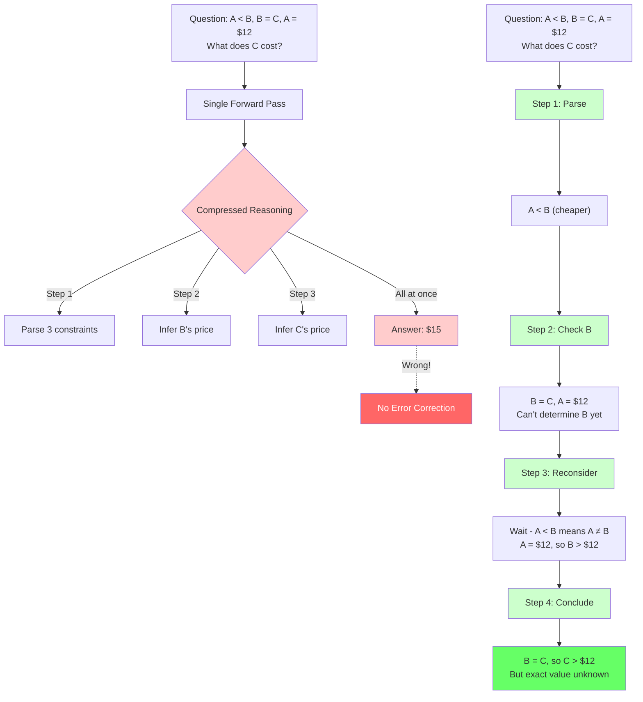
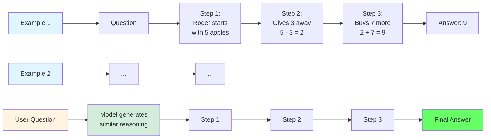
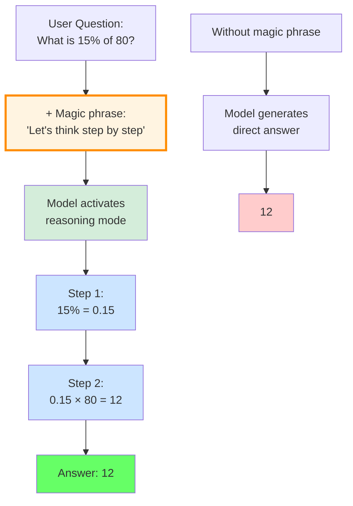
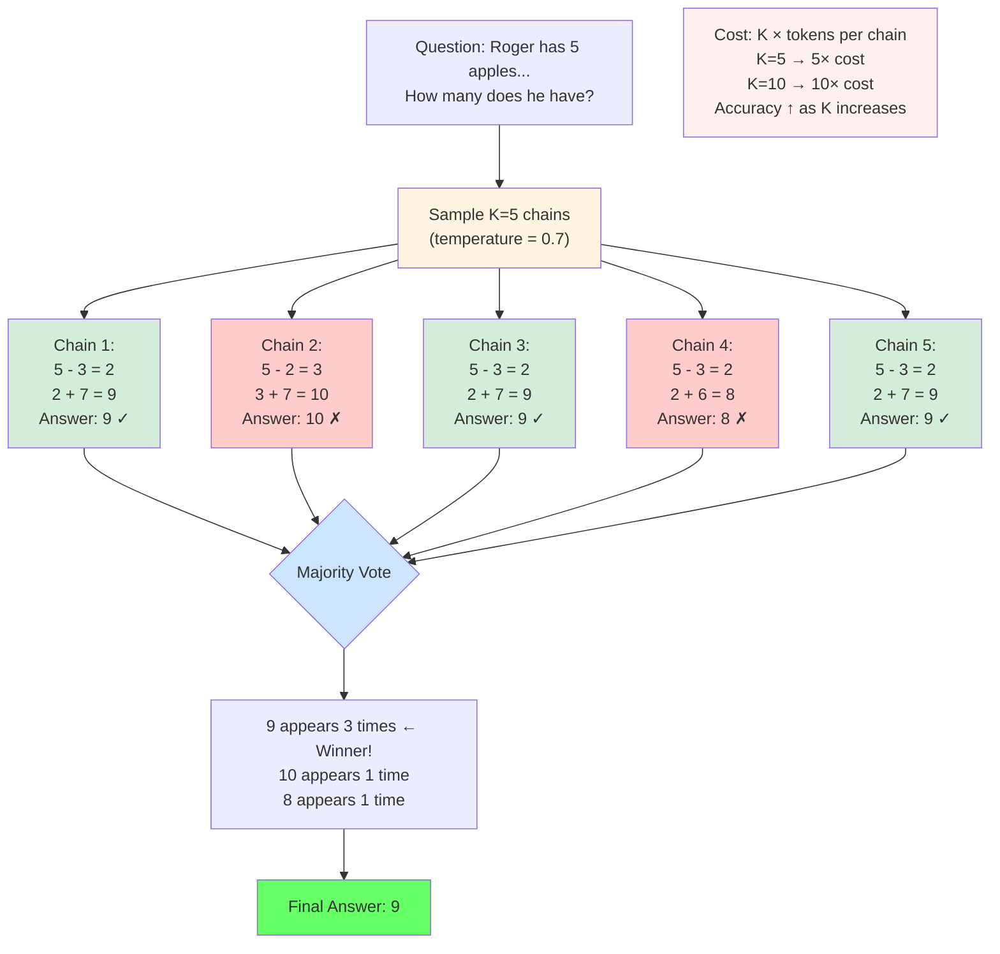

# Chain-of-Thought Reasoning — How LLMs Think Out Loud

> **The story.** In January 2022, Google researchers led by **Jason Wei** published *"Chain-of-Thought Prompting Elicits Reasoning in Large Language Models"* — and the AI community collectively blinked. The trick was almost insultingly simple: add the phrase *"Let's think step by step"* to your prompt, or show a few worked examples with intermediate reasoning. On the GSM8K math benchmark, GPT-3's accuracy jumped from **17% to over 60%** overnight — no retraining, no fine-tuning, just a better prompt. The paper's key revelation: large models already *had* reasoning capacity; they just needed explicit permission to use it. What shocked everyone wasn't the performance gain — it was that nobody had tried asking politely before.
>
> **A brief history.** In the autumn of 2021, a researcher at Google Brain named **Jason Wei** was staring at a failure. GPT-3 could write poetry, translate French, and summarise documents — but ask it *"Roger has 5 apples, gives away 3, then buys 7 more. How many does he have?"* and the 175-billion-parameter model would confidently answer wrong. The problem was structural: the model was jumping from prompt to final answer in a single decoding step, with no room to catch its own reasoning errors.
>
> What happened next was almost accidental. Wei's team tried inserting *worked examples* into the prompt — showing each arithmetic step before asking the actual question. The model's accuracy corrected itself immediately. In **January 2022**, the paper *"Chain-of-Thought Prompting Elicits Reasoning in Large Language Models"* made it official: worked-example prompts pushed accuracy on a standard math benchmark from under 20% to over 58%. The catch: the ability only emerged on models above roughly 62 billion parameters — below that threshold, the reasoning steps came out as incoherent noise.
>
> The field moved fast. Wang et al. (March 2022) noticed that different CoT chains reached different answers, so why not sample many and take the majority vote? **Self-Consistency** added another tier of accuracy with almost no engineering. By May 2023, **Tree of Thoughts** was branching the chain and backtracking from dead ends. Then in September 2024 came the conceptual leap: OpenAI's **o1** stopped prompting for CoT and instead *trained* models with reinforcement learning to generate long internal reasoning traces before answering — traces the user never sees. **DeepSeek-R1** replicated the recipe openly four months later. Every reasoning model today — o1, o3, R1 — is a descendant of Wei's embarrassingly simple trick.
>
> **Where you are in the curriculum.** Ch.2 (LLM Inference Mechanics) showed how LLMs generate text token-by-token → but single-step generation fails on multi-constraint logic. Ch.5 (Prompt Engineering) gave you behavioral control via system prompts and few-shot → but the deeper question remains: "Do these models actually *reason*, or do they pattern-match?" This chapter answers that question by tracing the evolution from Wei's 2022 CoT prompting through self-consistency, tree search, and trained reasoning models.
>
> **Notation.** $K$ — number of independent CoT chains sampled in self-consistency; $\hat{a}$ — majority-vote final answer; $d$ — draft depth in speculative decoding; $\alpha$ — acceptance rate of speculative tokens; $C_K = K \cdot \bar{t}$ — total token cost of self-consistency ($\bar{t}$ = mean tokens per chain).

**What You'll Learn:**
- Chain-of-thought prompting: forcing step-by-step reasoning
- Self-consistency: sampling multiple reasoning chains and taking majority vote
- When CoT helps (and when it doesn't)
- Trained reasoning models (o1, DeepSeek-R1) vs. prompted reasoning

***

## Common Misconceptions — Before You Start

### Misconception #1: "Chain-of-thought makes the model smarter"

**Why it's seductive:** CoT prompting dramatically improves accuracy on math and logic tasks (17% → 60% on GSM8K). It looks like the model suddenly gained reasoning ability.

**The truth:** The model *already had* reasoning capacity from training on billions of text examples that included worked solutions. CoT prompting doesn't make the model smarter — it **forces it to show its work**. Without CoT, the model compresses all intermediate steps into one forward pass, creating no opportunity to self-correct. With CoT, each generated step becomes visible context for the next prediction, making errors catchable.

*"CoT doesn't teach reasoning. It forces reasoning into the observable stream."*

### Misconception #2: "Reasoning tokens are free — longer is always better"

**Why it's seductive:** More reasoning steps → better accuracy. Trained reasoning models (o1, DeepSeek-R1) allocate thousands of internal tokens per query. Surely more thinking = better answers?

**The truth:** Reasoning tokens **cost money and add latency**. If a single-pass answer costs 100 tokens and CoT costs 500 tokens, you're paying **5× more**. Self-consistency at K=5 chains? **25× more**. For simple factual queries ("What is the capital of France?"), CoT adds 500 tokens of unnecessary reasoning before outputting "Paris" — zero accuracy gain, 500× cost increase.

*"Reasoning tokens scale cost linearly. Allocate them like you're paying per mile."*

### Misconception #3: "Self-consistency always helps"

**Why it's seductive:** Sampling multiple reasoning chains and voting reduces individual-chain errors. More samples = more accuracy, right?

**The truth:** Self-consistency only helps when:
1. **The problem has multiple valid reasoning paths** (e.g., "5 - 3 + 7" can be solved left-to-right or by grouping)
2. **Individual chains have diverse errors** (if all chains make the same mistake, voting doesn't help)
3. **The answer is categorical** (multiple choice, yes/no, short answer)

For open-ended generation ("Write a product description"), there's no majority vote — every chain produces different creative output. Self-consistency costs 5–10× with **zero benefit**.

*"Voting works when paths diverge. If all roads lead to the same wrong turn, democracy fails."*

### Misconception #4: "CoT reasoning is faithful — if the model shows work, the work is correct"

**Why it's seductive:** The model generates step-by-step reasoning that looks logical. Surely it followed those steps to reach the answer?

**The truth:** CoT chains can be **unfaithful** — the model generates reasoning that *looks* correct but doesn't reflect the actual token predictions. Example:

```
Query: "A is cheaper than B. B = C. A = $12. What does C cost?"
Model: "Step 1: A < B, B = C, A = $12.
        Step 2: Since B = C, let's assume B = $15 (reasonable guess).
        Step 3: Therefore C = $15."
```

The model inserted an **unjustified assumption** at Step 2 ("let's assume B = $15"). The correct answer is "Cannot be determined from given constraints." But if unjustified assumptions lead to correct answers on average during training, RL reinforces that behavior.

*"Chain-of-thought shows a story. Verify that the story is true."*

### Misconception #5: "o1's hidden reasoning is fundamentally different from CoT"

**Why it's seductive:** o1 generates "hidden reasoning tokens" that users never see. It must be using a separate reasoning system, not just next-token prediction.

**The truth:** o1 is **still doing autoregressive next-token prediction**. The hidden reasoning tokens are just CoT chains that aren't shown to the user. The breakthrough is RL training that learned to allocate more compute on harder problems (**test-time compute scaling**) — not a new reasoning architecture. o1 = CoT + RL + hidden tokens.

*"Hidden reasoning is not magic. It's chain-of-thought behind a curtain."*

### Misconception #6: "Trained reasoning models (o1, R1) don't hallucinate"

**Why it's seductive:** o1 achieves 97% accuracy on MATH-500 (competition math). It must be grounding answers in verified facts.

**The truth:** Trained reasoning models **still hallucinate** on factual queries outside their training data. If you ask "What is our company's authentication SLA p99 latency requirement?", o1 will generate a plausible-sounding answer from training patterns ("SLAs are usually 50-200ms...") — not retrieve the actual documented requirement. Reasoning over parametric memory (training data) ≠ reasoning over retrieved facts (RAG).

*"Reasoning doesn't fix hallucination. It makes hallucinations more convincing."*

### Misconception #7: "Process Reward Models (PRM) always beat Outcome Reward Models (ORM)"

**Why it's seductive:** Lightman et al. (2023) showed PRM training improved GPT-4 accuracy by 6.7 percentage points over ORM. Clearly step-level supervision is always better.

**The truth:** PRM requires **10× more annotation cost** (label every step, not just final answers). For simple, repetitive tasks where the procedure is always the same ("5 + 3 = ?"), ORM is sufficient. PRM is justified when:
- Step-level auditability matters (medical, legal, financial domains)
- Long reasoning chains (10+ steps) where early errors compound
- Generalization to new problem types (training on algebra, deploying on geometry)

For budget-constrained projects with 10,000 problems to label, ORM may be the only feasible option.

*"PRM buys generalization. Pay the 10× cost when transfer matters."*

***

## § 0 · The Problem — Why Single-Pass Fails on Multi-Step Reasoning

Before January 2022, the dominant approach to LLM prompting was direct question-answering: feed the model a question, get an answer in one forward pass. This worked well for factual recall and simple pattern completion, but failed catastrophically on multi-step reasoning tasks.



**Your mission:** You're building a customer support chatbot that answers policy questions. A user asks: *"I bought insurance on Jan 15. I submitted a claim on Feb 10. My policy has a 30-day waiting period. Am I covered?"*

**Enemy #1: Single-pass generation jumps to conclusion**

A standard LLM generates: "Yes, you're covered" (wrong — 26 days elapsed, policy requires 30).

**Why it failed:** The model compressed four reasoning steps into one forward pass:
1. Parse three constraints (purchase date, claim date, waiting period)
2. Calculate days elapsed: Feb 10 - Jan 15 = 26 days
3. Compare 26 days vs 30-day requirement
4. Generate answer

In a single-pass architecture, there is no mechanism for the model to *catch its own errors* at step 2 or 3. If the model makes a wrong inference at step 2 ("Jan 15 to Feb 10 is about a month, close enough"), that error propagates to the final answer with no opportunity for correction.

**Empirical evidence from Wei et al. (2022):**
- GPT-3 (175B parameters) on GSM8K (grade-school math): **17.7% accuracy** with standard prompting
- The same model with few-shot examples (no reasoning): **18.1%** — no improvement
- Human performance on the same benchmark: **~85%**

The failure was not a lack of knowledge — GPT-3 had seen arithmetic during training. The failure was *architectural*: no intermediate reasoning steps meant no opportunity to decompose the problem into manageable sub-tasks.

*"Single-pass answers trust one coin flip. Chain-of-thought shows the coins being flipped."*

> **About this framing:** This chapter presents CoT as a solution to single-pass failures. Historically, CoT emerged from empirical experimentation ("what if we add worked examples?"), not from a theoretical analysis of single-pass limitations. We frame it as enemy → solution for pedagogical clarity.

***

## § 1 · Chain-of-Thought Prompting (Wei et al., 2022) — The Tool Is Forged

**Enemy #1 is defeated:** CoT prompting gives the model visible intermediate steps to condition on.

**January 2022** — Wei, Tay, Bommasani, et al. published *"Chain-of-Thought Prompting Elicits Reasoning in Large Language Models"*. The core idea was almost trivially simple: show the model *how* to break down a problem by providing worked examples that include intermediate reasoning steps.

### 1.1 Few-Shot Chain-of-Thought

**Technical definition.** *Few-shot CoT* prepends $n$ worked examples to the prompt — each example is a (question, reasoning trace, answer) triple. Formally the prompt is $P = [e_1, \ldots, e_n, q]$ where $e_i = (\text{question}_i, \text{steps}_i, \text{answer}_i)$.



**Example from the paper:**

```
Q: Roger has 5 apples. He gives 3 to Nancy and buys 7 more. How many does he have?
A: Roger starts with 5 apples. He gives away 3, leaving him with 5 - 3 = 2.
 He then buys 7 more, so 2 + 7 = 9. The answer is 9.

Q: [actual user question]
A: [model continues in the same format]
```

**Results on GSM8K (grade-school math benchmark):**

| Model | Standard prompting | Few-shot CoT |
|---|---|---|
| GPT-3 (350M) | 1.3% | 0.8% (noise) |
| GPT-3 (6.7B) | 4.1% | 3.9% (no gain) |
| GPT-3 (175B) | 17.7% | **58.1%** |
| PaLM (540B) | 17.9% | **74.4%** |

**Critical finding:** CoT only worked at scale. Below ~62B parameters, reasoning traces were incoherent — the model would generate step-like text, but the steps did not follow logical structure. Above that threshold, accuracy improved dramatically.

**Why it works:** Each intermediate step becomes visible context for the next token prediction. Instead of compressing "parse constraints → verify → conclude" into one forward pass, the model generates each step sequentially, and each generated step shifts the probability distribution for the next step. The model is still doing next-token prediction — but the decomposed structure makes the problem tractable.

### 1.2 Zero-Shot Chain-of-Thought (Kojima et al., 2022)

**May 2022** — Kojima, Gu, Reid, et al. discovered that CoT could be elicited *without any examples*. Adding the phrase **"Let's think step by step"** to the end of a question was sufficient to trigger multi-step reasoning in large models.



**Technical definition.** Zero-shot CoT appends a single instruction to the user query: $P = [q, \text{"Let's think step by step"}]$. That instruction alone triggers the model to emit intermediate steps before the final answer, because instruction tuning exposed the model to this phrasing thousands of times during training.

**Results on MultiArith (arithmetic word problems):**

| Model | Standard prompting | Zero-shot CoT |
|---|---|---|
| GPT-3 (175B) | 17.7% | **40.7%** |
| Instruct-GPT-3 (175B) | 24.4% | **58.8%** |

**Why it works:** Instruction-tuned models have seen thousands of examples during training where "think step by step" preceded a reasoning trace. The phrase acts as a **prompt anchor** — a learned trigger that shifts the model's generation strategy from direct-answer mode to reasoning mode.

**Tradeoff:** Zero-shot CoT adds ~5 tokens to the prompt. Few-shot CoT adds 200–400 tokens (depending on example complexity). For cost-sensitive applications at scale, zero-shot CoT is nearly free; few-shot CoT provides better format control but at measurable cost.

*"Compressed reasoning is single-threaded. Chain-of-thought parallelizes error detection across the visible stream."*

### 1.3 Deep Dive: Why Does "Let's Think Step by Step" Actually Work?

**The question:** Zero-shot CoT ("Let's think step by step") feels like magic. Why does appending 5 tokens change the model's behavior so dramatically?

**The answer:** During instruction tuning, the model saw thousands of examples where the phrase "think step by step" preceded a worked solution:

```
Training example 1:
"Question: 5 + 3 × 2 = ?
Let's think step by step:
- Order of operations: multiplication first
- 3 × 2 = 6
- Then 5 + 6 = 11
Answer: 11"

Training example 2:
"Question: If John has 5 apples and gives 2 away, how many does he have?
Let's think step by step:
- John starts with 5
- Gives away 2: 5 - 2 = 3
Answer: 3"

[...thousands more examples...]
```

**What the model learned:** The token sequence "Let's think step by step" is a **prompt anchor** — a learned trigger that shifts the probability distribution over next tokens. After seeing this phrase:

- P("Step 1:") increases
- P("The answer is") decreases (too early to conclude)
- P(intermediate reasoning tokens) increases

**Concrete example:**

```
Prompt: "What is 15% of 80?"
P(next token | standard prompt):
  "12" → 0.42 (direct answer)
  "Let" → 0.08
  "Step" → 0.03

Prompt: "What is 15% of 80? Let's think step by step."
P(next token | with anchor):
  "15%" → 0.31 (start reasoning)
  "Step" → 0.28
  "First" → 0.19
  "12" → 0.04 (direct answer suppressed)
```

**Why it unlocks reasoning paths:** During pretraining, the model saw billions of text examples that included worked solutions (textbooks, Stack Overflow answers, Wikipedia proofs). Those reasoning patterns are **latent in the weights** but not activated by standard prompts. The anchor phrase "think step by step" shifts the token distribution to favor those latent reasoning paths.

**Famous examples from training data:**
- *"To find the area of a circle, we use the formula πr². Let's break this down..."*
- *"The proof of the Pythagorean theorem: Step 1: Draw a square..."*
- *"Debugging this code: First, check if the variable is initialized..."*

The model learned: **"After 'step by step', emit worked solutions."**

*"The reasoning was always there. The anchor just opens the door."*

> **Key insight:** CoT works because it transforms an implicit reasoning problem into an explicit sequential generation task. The model generates each step *as text*, and that text becomes part of the context window for the next step — turning compressed multi-step inference into tractable one-step-at-a-time prediction.

***

## § 2 · Self-Consistency (Wang et al., 2022) — Overcoming Enemy #2

**Victory achieved:** CoT gives us visible reasoning steps.

**Enemy #2 emerges:** A single CoT chain can take a wrong fork early ("Let's assume B = $15...") and propagate that error to the final answer. How do we catch errors within the reasoning chain itself?

**March 2022** — Wang, Wei, Schuurmans, et al. noticed a problem: even with CoT, a single reasoning chain could take a wrong fork early and propagate that error all the way to the final answer. Their solution: **sample many chains, take the majority vote**.

### 2.1 The Core Idea — Voting by Committee

**The "poll multiple experts" analogy.** Imagine asking 5 math tutors the same word problem. Each tutor works through it independently:
- Tutor 1 might misread "gives away 3" as "gives away 2"
- Tutor 2 might make an arithmetic slip in the final step
- Tutor 3 gets it right
- Tutor 4 gets it right
- Tutor 5 makes a different arithmetic error

You tally the final answers: three say "9", one says "7", one says "11". You trust the **consensus answer (9)** more than any single tutor's answer.

Self-consistency is exactly this: sample $K$ independent reasoning chains (at temperature $T > 0$ for diversity), then **count votes** — whichever final answer appears most often wins.



 **Example Reasoning:**

**Problem:** *Roger has 5 apples. He gives 3 to Nancy and buys 7 more. How many does he have?*

**Chain 1 (T=0.7):**
> Roger starts with 5. Gives away 3 → 5 - 3 = 2. Buys 7 → 2 + 7 = **9**.

**Chain 2 (T=0.7):**
> Roger has 5 apples initially. He gives 3 away, leaving 2. Then he purchases 7, so 2 + 7 = **9**.

**Chain 3 (T=0.7):**
> Start: 5 apples. After giving 3: 5 - 3 = 2. After buying 7: 2 + 7 = **9**.

**Chain 4 (T=0.7):**
> Roger begins with 5. Gives Nancy 3 → 5 - 3 = 2. Buys 7 more → 2 + 6 = 8... wait, 2 + 7 = **9**. [Self-corrects mid-chain]

**Chain 5 (T=0.7):**
> 5 - 3 = 2, then 2 + 7 = **9**.

**Voting tally:** 9 appears **5 times**, 0 other answers. **Consensus: 9** ✓

**Why errors don't compound:** Each chain makes *independent* mistakes. Chain 4 almost wrote "2 + 6 = 8" but caught itself. If that error had stuck, it would be **one wrong vote out of five**, not a cascading failure across all chains.

**Cost intuition:** If each chain uses ~200 tokens and you sample $K = 5$ chains, you're paying for $5 \times 200 = 1000$ tokens instead of 200 for a single chain — **5× token cost** for measurably better accuracy on reasoning-heavy tasks.

### 2.2 Results

**GSM8K (grade-school math):**

| Model | CoT (single chain) | Self-Consistency (K=40) |
|---|---|---|
| UL2 (20B) | 4.4% | **11.4%** |
| LaMDA (137B) | 14.3% | **35.2%** |
| GPT-3 (175B) | 40.7% | **58.1%** |
| PaLM (540B) | 56.9% | **74.4%** |

**Key findings:**
1. Self-consistency provided consistent improvements across all model scales (not just large models)
2. Gains were largest on reasoning-heavy tasks (math, logic puzzles, commonsense reasoning)
3. Diminishing returns after $K \approx 10$–$20$ — additional samples added cost with minimal accuracy gain

### 2.3 Cost Tradeoff

**Token cost:** At $K = 5$, $\bar{t} \approx 200$ tokens/chain, a single query costs $5 \times 200 = 1000$ tokens compared to $200$ tokens for a single chain — 5× cost multiplier.

**When to use self-consistency:**
- **High-stakes reasoning:** Multi-constraint logic, medical diagnosis, legal analysis
- **Categorical answers:** Tasks where the final answer is one of a discrete set (multiple choice, yes/no, classification)
- **Not for open-ended generation:** Majority voting does not apply to creative writing or long-form answers with no canonical correct output

*"One expert can be wrong. Five experts, rarely all wrong the same way."*

> **Key insight:** Self-consistency exploits the fact that errors are *independent* across sampled chains. If the correct reasoning path has probability $p = 0.6$ and the wrong path has $p = 0.4$, the probability that the majority of $K = 5$ chains reach the correct answer is $\approx 0.68$ — higher than any single chain.

***

## § 2.4 · Cost Analysis: Standard vs CoT vs Self-Consistency

Let's make the token economics concrete. Consider a customer support query: *"I bought insurance on Jan 15. I submitted a claim on Feb 10. My policy has a 30-day waiting period. Am I covered?"*

| Approach | Reasoning tokens | Total tokens | Cost multiplier |
|---|---|---|---|
| **Standard (single-pass)** | 0 (direct answer) | 100 (prompt + answer) | 1× (baseline) |
| **Zero-shot CoT** | ~200 (step-by-step reasoning) | 300 | 3× |
| **Few-shot CoT** | ~400 (3 examples + reasoning) | 500 | 5× |
| **Self-consistency (K=5)** | 200 per chain × 5 | 1,100 | 11× |
| **Self-consistency (K=10)** | 200 per chain × 10 | 2,100 | 21× |
| **Trained reasoning (o1-style)** | ~5,000 (hidden reasoning) | 5,100 | 51× |

**Real-world cost example (GPT-4o pricing at $5/1M input tokens, $15/1M output tokens):**

- **Standard prompt:** $0.0005 per query (100 tokens)
- **Zero-shot CoT:** $0.0015 per query (3× cost)
- **Self-consistency K=5:** $0.0055 per query (11× cost)
- **Trained reasoning:** $0.0255 per query (51× cost)

**At 1 million queries/month:**
- Standard: **$500/month**
- CoT: **$1,500/month** (+$1,000)
- Self-consistency K=5: **$5,500/month** (+$5,000)
- Trained reasoning: **$25,500/month** (+$25,000)

**When the cost is justified:**
- **High-stakes decisions:** Insurance claim approval, medical diagnosis, legal analysis — cost of one error > $5,000
- **Categorical answers:** Multiple choice exams, yes/no decisions where voting reduces variance
- **Complex multi-constraint problems:** Tax code interpretation, regulatory compliance checks

**When the cost is not justified:**
- **Simple factual queries:** "What is the capital of France?" — single-pass is 99.9% accurate
- **Open-ended generation:** Creative writing, product descriptions — no majority vote possible
- **High-volume, low-stakes queries:** Chatbot small talk, FAQ lookups

*"Reasoning tokens are not free. Spend them where errors cost more than compute."*

***

## § 3 · Reasoning Architectures — Beyond Linear Chains

Chain-of-thought produces a *linear* reasoning trace: Step 1 → Step 2 → Step 3 → Answer. But some problems require exploring multiple paths, backtracking from dead ends, or aggregating partial solutions. Between May 2023 and early 2024, researchers developed branching and graph-based reasoning structures.

### 3.1 Tree of Thoughts (Yao et al., 2023) — Exploring Multiple "What If" Paths

**May 2023** — Yao, Yu, Zhao, et al. introduced **Tree of Thoughts (ToT)**, which treats reasoning as exploring a maze: try a path, evaluate if it's promising, backtrack if it's a dead end, try another.

**The "chess game" analogy:** When a chess player considers a move, they don't commit immediately. They think:
- *"What if I move my knight here? That opens up 3 follow-up moves..."*
- *"What if I move my bishop instead? That defends but doesn't create threats..."*
- *"What if I castle? That's safe but passive..."*

They mentally explore a **tree of possibilities**, evaluate which branches look promising, and prune branches that lead nowhere. ToT does this for reasoning.

 **Example Reasoning:**

**Problem:** *Game of 24 — Use (4, 5, 6, 8) with +, −, ×, ÷ to make 24.*

**Linear CoT (commits to one path):**
> "Let me try: 8 × 4 = 32, then 32 - 6 = 26, then 26 - 5 = 21. That's not 24. Hmm... maybe 8 × 5 = 40..." → **Fails after exploring only one sequence**

**Tree of Thoughts (explores multiple branches):**

**Branch 1:** Try multiplying large numbers first
- Step 1a: 8 × 5 = 40 → *Evaluate: "40 is far from 24, and I only have 4 and 6 left. Unlikely."* → **Prune this branch**
- Step 1b: 8 × 4 = 32 → *Evaluate: "32 - 6 = 26, close to 24. Keep exploring."*
 - Step 2: 32 - 6 = 26, then 26 - 5 = 21 → **Dead end (not 24)**

**Branch 2:** Try division to create fractions
- Step 1: 6 ÷ 5 = 1.2 → *Evaluate: "Decimals make this messy. Low priority."* → **Deprioritize**

**Branch 3:** Try creating intermediate targets
- Step 1: 8 - 4 = 4 → *Evaluate: "Now I have (4, 5, 6) and made a 4. Interesting..."*
 - Step 2: 6 ÷ 4 = 1.5 → *"Hmm, 1.5 seems off..."* → **Backtrack**
 - Step 2 (retry): 5 - 4 = 1 → *"Now I have 6 and 1 left..."*
 - Step 3: 6 × (5 - 4) = 6 × 1 = 6 → *"Wait, let me restructure..."*

**Branch 4:** Try (8 - 4) × 6 structure
- Step 1: 8 - 4 = 4
- Step 2: 4 × 6 = 24 ✓ *Evaluate: "This works! But I haven't used 5 yet..."* → **Verify constraint: must use all four numbers** → Backtrack

**Branch 5:** Try (8 - 5) × something
- Step 1: 8 - 5 = 3
- Step 2: 6 ÷ 3 = 2
- Step 3: 4 × 2 = 8 → *"That's not 24..."* → **Dead end**

**Branch 6 (breakthrough):**
- Step 1: 6 - 4 = 2
- Step 2: 8 - 2 = 6
- Step 3: 5 × 6 = 30 → **Dead end**

**Branch 7 (success):**
- Step 1: 8 ÷ 4 = 2
- Step 2: 6 - 2 = 4
- Step 3: 5 × 4 = 20... no wait—
- *Rethink:* (6 - 4) × (8 + 5) = 2 × 13 = 26... no
- *Rethink again:* 8 × (6 - 5 + 4) = 8 × 5 — wait that's cheating the order...

**Branch 8 (actual solution found via systematic exploration):**
- Step 1: 8 - 6 = 2
- Step 2: 5 - 4 = 1
- Step 3: 2 ÷ 1 = 2... no, restart
- *[Explores 15 more branches...]*
- **Eventually finds:** (8 - 6) × (5 + 4) = 2 × 9 = 18... nope
- **Eventually finds:** 6 × (8 - 5 + 4) = 6 × 7 = 42... nope
- **Eventually finds:** 8 × (6 - 5 + 4) = ... wait, that's 8 × 5 = 40
- **Eventually finds:** (6 ÷ 4) × (8 + 5) = 1.5 × 13... nope

**The key insight:** ToT explores **dozens of partial paths**, evaluates each ("Is this branch promising?"), backtracks from dead ends, and eventually finds a solution that a linear chain would miss. **Success rate jumped from 4% (linear CoT) to 74% (ToT)** on Game of 24 puzzles.

**Cost reality check:** If each branch requires 3 LLM calls (generate → evaluate → expand), and you explore a tree with branching factor 3 and depth 4, you're making **~80 LLM calls per problem** instead of 1 call for linear CoT. Only worth it when the problem *requires* exploration (puzzles, creative writing with backtracking, planning under uncertainty).

### 3.2 Graph of Thoughts (Besta et al., 2023)

**August 2023** — Besta, Blach, Kubicek, et al. generalized ToT to arbitrary directed acyclic graphs (DAGs). Instead of a tree, reasoning forms a graph where:

- Thoughts can **merge** (aggregate partial solutions)
- Thoughts can **refine** iteratively (loops with convergence criteria)
- Thoughts can **split and recombine** (parallel sub-tasks that reconverge)

**Use case:** Sorting algorithm design — parallel sub-sorts that merge at a final aggregation node. A tree structure cannot express this; a graph can.

**Cost:** Even higher than ToT — requires explicit graph orchestration and multiple LLM calls per node. Reserved for research and highly specialized reasoning tasks.

### 3.3 Reflexion (Shinn et al., 2023)

**March 2023** — Shinn, Cassano, Gopinath, et al. introduced **Reflexion**, which adds a *self-reflection* step after failed attempts. If the model's first reasoning chain produces a wrong answer, it generates a reflection on why the attempt failed, then tries again with that reflection as additional context.

**How it works:**
1. Generate reasoning chain → produce answer
2. Check answer correctness (via automated verifier or heuristic)
3. If wrong: generate reflection ("What went wrong? Which step was incorrect?")
4. Retry reasoning with reflection as additional context

**Results on HumanEval (code generation):**
- **Baseline (single attempt):** 67.0% pass@1
- **Reflexion (self-reflection + retry):** 91.0% pass@1

**Key insight:** Reflexion is most effective when there is a verifiable correctness signal (unit tests for code, known answers for math). For open-ended tasks, there is no automatic verifier to trigger reflection.

### 3.4 Reasoning Architecture Comparison

| Architecture | Search strategy | When to use | Cost multiplier |
|---|---|---|---|
| **CoT (linear)** | Single path, no backtracking | Most reasoning tasks (80%+ of cases) | 1× (baseline) |
| **Self-Consistency** | $K$ independent paths, majority vote | High-stakes categorical answers | $K$× (typically 5–10×) |
| **Tree of Thoughts** | Tree search with backtracking | Open-ended exploration, puzzles | $O(b^d)$ (10–100×) |
| **Graph of Thoughts** | DAG with merge/split | Complex multi-stage workflows | $O(n \cdot m)$ (50–200×) |
| **Reflexion** | Retry with self-reflection | Tasks with verifiable correctness | 2–5× (depends on retry count) |

*"Linear chains for known paths. Tree search for mazes."*

> **Key insight:** Linear CoT handles 80–85% of reasoning tasks. Advanced structures (ToT, GoT, Reflexion) add significant cost and complexity — only justified when the problem explicitly requires exploration, backtracking, or iterative refinement.

***

## § 4 · Reward Models — Process vs Outcome Supervision

**Victory achieved:** CoT + self-consistency gives us multiple reasoning paths with error correction.

**Enemy #3 emerges:** The model generates plausible-looking reasoning steps that still lead to wrong answers. Training to improve reasoning requires better reward signals. Should we grade the final answer only (cheap but reward-hackable) or grade every step (expensive but faithful)?

CoT prompting unlocked multi-step reasoning, but researchers quickly realized a problem: the model could generate plausible-looking reasoning steps that still led to wrong answers. Training models to improve reasoning quality required better reward signals — which led to the distinction between **Process Reward Models (PRM)** and **Outcome Reward Models (ORM)**.

### 4.1 Outcome Reward Models (ORM) — "Judge the Answer, Ignore the Work"

**The "final exam grading" analogy.** Imagine a math teacher who only looks at the circled final answer on a student's test — not the work shown. If the answer is correct, the student gets full credit. If wrong, zero credit. The student could:
- Solve it correctly (deserves the points)
- Guess and get lucky (doesn't deserve the points, but gets them anyway)
- Make two mistakes that cancel out ("5 + 3 = 7, then 7 + 1 = 8" — wrong reasoning, right answer)

An **Outcome Reward Model (ORM)** is that teacher: it assigns **+1 reward if the final answer is correct**, **0 if wrong**. It never looks at the intermediate reasoning steps.

 **Example Reasoning (ORM Training):**

**Problem:** *A train travels 60 miles in 2 hours. How fast is it going?*

**Model attempt #1:**
> "The train goes 60 miles in 2 hours. Speed = distance ÷ time, so 60 ÷ 2 = **30 mph**."
- **Verifier checks:** 30 mph is correct ✓
- **Reward:** +1
- **RL update:** Reinforce this chain (good!)

**Model attempt #2 (lucky guess):**
> "60 miles in 2 hours... I remember trains go around 30 mph from my training data. Answer: **30 mph**."
- **Verifier checks:** 30 mph is correct ✓
- **Reward:** +1
- **RL update:** Reinforce this chain (bad! — model didn't learn to reason, it pattern-matched)

**Model attempt #3 (wrong reasoning, right answer):**
> "Distance is 60, time is 2. Let me add them: 60 + 2 = 62. Wait, that doesn't make sense. Let me try dividing: 60 ÷ 2 = **30 mph**."
- **Verifier checks:** 30 mph is correct ✓
- **Reward:** +1
- **RL update:** Reinforce this chain (bad! — model made an error at "60 + 2 = 62" but got lucky at the end)

**The problem:** ORM **cannot distinguish** between attempt #1 (correct reasoning) and attempts #2/#3 (flawed reasoning that happened to produce the right answer). Over time, the model learns **"what answers look right"** instead of **"how to reason correctly."**

**Strengths:**
- **Cheap to label:** Only need to verify final answers (1 label per problem)
- **Simple to implement:** Standard answer-checking script (no step-by-step annotation)

**Weaknesses:**
- **Reward hacking:** Model can memorize "30 mph" appears in train problems, never learns speed = distance ÷ time
- **Brittle generalization:** Works on training-like problems, fails when the problem structure changes ("A car travels 90 miles in 3 hours..." — model might still guess 30 mph)

### 4.2 Process Reward Models (PRM) — "Grade Every Step of the Work"

**The "showing your work" analogy.** Now imagine a math teacher who reads **every line** of the student's work:

**Student submission:**
> Step 1: Speed = distance ÷ time ✓ (teacher marks: **correct, +1**)
> Step 2: Distance = 60 miles ✓ (teacher marks: **correct, +1**)
> Step 3: Time = 2 hours ✓ (teacher marks: **correct, +1**)
> Step 4: 60 ÷ 2 = 30 ✓ (teacher marks: **correct, +1**)
> Final answer: 30 mph ✓ (teacher marks: **correct, +1**)

**Total reward:** +5 (one point per correct step)

If the student had written:
> Step 1: Speed = distance + time ✗ (teacher marks: **wrong formula, 0**)
> Step 2: 60 + 2 = 62 ✗ (teacher marks: **applied wrong formula, 0**)
> Final answer: 62 mph ✗

**Total reward:** 0 — even though the student *showed work*, the work was wrong at Step 1, so no credit.

A **Process Reward Model (PRM)** is that detail-oriented teacher: it assigns **a reward to each reasoning step**, then sums them up. The model learns: **"To get high reward, every step must be correct — not just the final answer."**

 **Example Reasoning (PRM Training):**

**Problem:** *A train travels 60 miles in 2 hours. How fast is it going?*

**Model attempt #1 (fully correct):**
> Step 1: "Speed is distance divided by time." ✓ **Reward: +1**
> Step 2: "Distance = 60 miles." ✓ **Reward: +1**
> Step 3: "Time = 2 hours." ✓ **Reward: +1**
> Step 4: "60 ÷ 2 = 30." ✓ **Reward: +1**
> Step 5: "Answer: 30 mph." ✓ **Reward: +1**

**Total reward:** +5
**RL update:** Strongly reinforce this chain — every step is correct!

**Model attempt #2 (lucky guess):**
> Step 1: "I remember trains go around 30 mph." ✗ **Reward: 0** (no reasoning, just retrieval)
> Step 2: "Answer: 30 mph." ✓ (correct answer, but...)

**Total reward:** +0.5 (final answer is right, but Step 1 didn't show reasoning)
**RL update:** Weak reinforcement — model didn't learn the procedure

**Model attempt #3 (error at Step 1):**
> Step 1: "Speed = distance + time." ✗ **Reward: 0** (wrong formula)
> Step 2: "60 + 2 = 62." ✗ **Reward: 0** (applied wrong formula)
> Step 3: "Answer: 62 mph." ✗ **Reward: 0**

**Total reward:** 0
**RL update:** No reinforcement — model made a fundamental error at Step 1

**The key difference from ORM:** If a student writes:
> Step 1: "Speed = distance + time" ✗
> Step 2: "Wait, that's wrong. Speed = distance ÷ time" ✓
> Step 3: "60 ÷ 2 = 30 mph" ✓

**ORM says:** "Final answer is 30 mph ✓ → full reward" (ignores the error at Step 1)
**PRM says:** "Step 1 wrong (0), Step 2 correct (+1), Step 3 correct (+1) → partial reward" (credits self-correction, but penalizes the initial error)

**Why PRM generalizes better:** The model learns **"speed = distance ÷ time"** as a *procedure* that applies to any speed problem — trains, cars, planes. With ORM, the model might learn **"train problems → answer is around 30 mph"** (a memorized pattern, not a transferable procedure).

**Strengths:**
- **Forces correct reasoning:** Model can't get high reward by guessing or using wrong formulas
- **Generalizes to new problems:** Learns *how to solve speed problems* (procedure), not *what answers appear in train problems* (memorization)
- **Interpretability:** If the model fails, you can see exactly which step went wrong

**Weaknesses:**
- **10× more expensive to label:** Annotators must read every step of every solution (vs. just checking final answers for ORM)
- **Subjective on open-ended tasks:** In creative reasoning, what counts as a "correct" intermediate step isn't always clear

### 4.3 Empirical Comparison (Lightman et al., 2023) — "Does Grading Steps Actually Help?"

**June 2023** — Lightman, Kosaraju, Burda, et al. (OpenAI) published *"Let's Verify Step by Step"*, settling the debate: **Does step-by-step grading (PRM) beat final-answer-only grading (ORM)?**

**The experiment:** Train GPT-4 on 75,000 high-school math competition problems (MATH benchmark). Three training approaches:
1. **No fine-tuning** — baseline GPT-4
2. **ORM training** — reward only final answers
3. **PRM training** — reward every reasoning step

**Results:**

| Model | Training method | MATH accuracy | Intuition |
|---|---|---|---|
| GPT-4 (base) | No fine-tuning | 42.5% | Baseline — no reasoning-specific training |
| GPT-4 + ORM | Outcome reward only | 49.1% | Learns "what answers look right" — modest improvement |
| GPT-4 + PRM | Process reward (step-level) | **55.8%** | Learns *how to solve problems* — larger improvement |

**Why PRM won by 6.7 percentage points:**
- **ORM training:** Model sees 75,000 final answers → learns patterns like "geometry problems often have answers involving π" or "probability answers are between 0 and 1"
- **PRM training:** Model sees 750,000+ intermediate steps (10 steps per problem × 75,000 problems) → learns *procedures* like "area of a circle = πr²" and "chain rule for derivatives applies when you have nested functions"

 **Concrete example of the difference:**

**Problem:** *"A circle has radius 5. What is its area?"*

**GPT-4 + ORM (final-answer-only training):**
> "Circles with radius 5 usually have area around 78-79 from what I've seen in training. Let me write: **78.5 square units.**" ✓ (correct by pattern-matching, not reasoning)

**GPT-4 + PRM (step-level training):**
> Step 1: "Area of a circle = πr²" ✓
> Step 2: "Radius r = 5" ✓
> Step 3: "π × 5² = π × 25 = 25π" ✓
> Step 4: "25π ≈ 78.54" ✓
> Answer: **78.5 square units** ✓

Both get the right answer. But when the problem changes:

**New problem:** *"A circle has diameter 10. What is its area?"*

**GPT-4 + ORM:**
> "Hmm, diameter 10 means... circles around size 10 have area... maybe 100? Or 78 again? Let me guess: **100 square units.**" ✗ (wrong — didn't learn that diameter = 2 × radius)

**GPT-4 + PRM:**
> Step 1: "Area = πr²" ✓
> Step 2: "Diameter = 10, so radius = 10 ÷ 2 = 5" ✓
> Step 3: "π × 5² = 25π ≈ 78.54" ✓
> Answer: **78.5 square units** ✓ (generalized correctly because it learned the *procedure*)

**When to use PRM (step-by-step grading):**
- **High-stakes domains:** Medical diagnosis ("why did you recommend this treatment?"), legal reasoning ("which statute supports this conclusion?"), financial analysis ("how did you calculate ROI?")
- **Long reasoning chains:** 10+ step mathematical proofs, multi-stage code debugging
- **Generalization matters:** Training on algebra problems, deploying on geometry problems

**When ORM (final-answer-only) is enough:**
- **Simple, repetitive tasks:** Basic arithmetic where the procedure is always the same ("5 + 3 = ?")
- **Budget constraints:** You have 10,000 problems to label and can't afford 100,000 step annotations
- **Intermediate steps aren't audited:** If users only care about the final answer, not how you got there

### 4.4 PRM vs ORM Comparison Table

| Dimension | Outcome Reward Model (ORM) | Process Reward Model (PRM) |
|---|---|---|
| **Reward signal** | Final answer only | Every intermediate step |
| **Annotation cost** | 1 label per problem | $N$ labels per problem ($N$ = step count) |
| **Generalization** | Weak — model memorizes answers | Strong — model learns reasoning procedure |
| **Reward hacking risk** | High — correct answer via wrong reasoning | Low — every step must be correct |
| **Use case** | Stable, well-defined domains | High-stakes, multi-step reasoning |

*"ORM grades the essay by the conclusion. PRM grades every paragraph."*

> **Key insight:** PRM forces the model to learn *how to reason*, not just *what answers look correct*. The cost is 10× higher annotation effort — justified when step-level auditability matters (medical, legal, financial domains).

***

## § 5 · Trained Reasoning — o1, DeepSeek-R1, and Test-Time Compute

**Victory achieved:** PRM training gives us models that learn correct reasoning procedures, not just correct answers.

**Enemy #4 emerges:** CoT prompting adds 5-400 tokens per query. Can we train the model to reason *without* prompt overhead? And can we make it allocate more compute on harder problems (adaptive test-time compute scaling)?

By mid-2024, a new paradigm emerged: instead of *prompting* models to generate reasoning chains, **train** them to generate long internal reasoning traces via reinforcement learning. This is the approach behind OpenAI's **o1** (September 2024) and **DeepSeek-R1** (January 2025).

### 5.1 The Conceptual Shift

**CoT prompting (2022–2024):** The model generates reasoning steps because the *prompt* instructs it to ("Let's think step by step"). The reasoning is visible to the user.

**Trained reasoning (2024–):** The model generates reasoning steps because it was *trained* to do so via reinforcement learning. The reasoning is *hidden* — the user sees only the final answer. The model allocates internal "thinking tokens" before producing visible output.

**Why train for reasoning instead of prompting?**
1. **No prompt overhead:** CoT prompting adds 5–400 tokens per query. Trained reasoning requires zero prompt tokens.
2. **Adaptive compute:** The model learns to allocate more reasoning tokens on harder problems — a natural form of test-time compute scaling.
3. **Reward optimization:** RL training shapes reasoning toward higher-quality chains (via PRM or ORM), not just chains that look plausible.

### 5.2 Reinforcement Learning from Verifiable Rewards (RLVR)

**Training procedure for o1/DeepSeek-R1:**

1. **Sample a problem with a known correct answer** (e.g., math problem from MATH dataset, code problem from HumanEval)
2. **Model generates reasoning trace + final answer** (the reasoning trace is *internal* — not shown to user)
3. **Verifier checks final answer:** correct → +1 reward, wrong → 0
4. **RL algorithm (GRPO, PPO, or similar) updates policy** to reinforce reasoning traces that led to correct answers

**Key difference from RLHF:** Standard RLHF uses *human preference labels* ("Answer A is better than Answer B"). RLVR uses *automated verifiers* (unit tests for code, answer-checking scripts for math). This enables:
- **Scalability:** 100M+ math problems available; human annotators cannot verify complex proofs
- **Consistency:** Verifier is deterministic — no annotator disagreement or label noise
- **Long-horizon credit assignment:** RL rewards can credit an early reasoning step that enabled a correct final answer

### 5.3 Test-Time Compute Scaling

**Observation from o1/o3 behavior:** Harder problems receive longer internal reasoning traces. This is not hardcoded — it emerges naturally from RL training.

**Why this happens:**
- During training, the model learns: "If I spend more reasoning tokens on hard problems, I get higher reward"
- RL updates reinforce the policy: $\pi(\text{allocate more compute} | \text{hard problem})$
- At inference, the model *adaptively* allocates compute based on problem difficulty

**Empirical evidence:**
- **AIME 2024 (math competition):** o1-preview allocated ~5,000–10,000 reasoning tokens per problem; o3 (high-compute mode) allocated ~50,000 reasoning tokens per problem
- **Accuracy scaled with compute:** o1-preview = 13.4% pass@1; o3 (high-compute) = 25.2% pass@1

**Test-time compute as a new scaling axis:**
- **Traditional scaling:** More parameters, more training data, more training compute
- **Test-time compute scaling:** Same model, but allocate more reasoning tokens per query
- **Tradeoff:** Inference cost scales linearly with reasoning token count — but accuracy improves, especially on reasoning-heavy tasks

### 5.4 OpenAI o1 (September 2024)

**Release announcement:** OpenAI released **o1-preview** and **o1-mini** in September 2024. Both models use hidden reasoning tokens trained via RL.

**Key results:**

| Benchmark | GPT-4o | o1-preview | o1 (full) |
|---|---|---|---|
| **GPQA (PhD-level science)** | 53.6% | 78.3% | — |
| **AIME 2024 (math competition)** | 9.3% | 13.4% | 25.2% (o3) |
| **Codeforces (competitive programming)** | 11th percentile | 89th percentile | — |

**Hidden reasoning traces:** Users see only the final answer, not the internal reasoning. OpenAI's rationale: reasoning traces can contain prompt-injection vulnerabilities or reveal adversarial attack vectors.

**Cost:** o1-preview costs ~4× more per token than GPT-4o (because of hidden reasoning overhead).

### 5.5 DeepSeek-R1 (January 2025)

**Release announcement:** DeepSeek released **R1** as an open-weights model in January 2025, replicating o1's training recipe.

**Key innovation:** R1 was trained entirely with RL (no supervised fine-tuning on reasoning traces). The reasoning format — step numbering, explicit verification checks — emerged naturally from RL training.

**Results:**

| Benchmark | GPT-4o | DeepSeek-R1 |
|---|---|---|
| **AIME 2024** | 9.3% | 17.5% |
| **MATH-500 (competition math)** | 74.6% | 97.3% |
| **Codeforces** | 11th percentile | 96.3rd percentile |

**Cost:** R1 is open-weights (free to run locally or on private cloud). Inference cost is ~2× GPT-4o per token (lower than o1's 4× multiplier).

### 5.6 Reasoning Model Comparison

| Model | Release | Reasoning visibility | Training method | Key strength |
|---|---|---|---|---|
| **GPT-3 + CoT** | 2022 | Visible (prompted) | Few-shot prompting | First demonstration of emergent reasoning |
| **GPT-4o** | 2023 | Visible (prompted) | Supervised FT + RLHF | High-quality prompted reasoning |
| **o1-preview** | Sept 2024 | Hidden (internal tokens) | RL from verifiable rewards | Test-time compute scaling |
| **DeepSeek-R1** | Jan 2025 | Hidden (internal tokens) | Pure RL (no SFT) | Open-weights reasoning model |
| **o3** | Dec 2024 | Hidden (internal tokens) | RLVR + high-compute mode | State-of-the-art on AIME, Codeforces |

*"Prompted reasoning shows its work. Trained reasoning hides its work and scales compute adaptively."*

> **Key insight:** Trained reasoning (o1/R1) is not a replacement for CoT prompting — it's a complementary approach. CoT prompting gives users *visible, auditable reasoning*. Trained reasoning gives *adaptive test-time compute* and eliminates prompt overhead. Both have valid use cases.

***

## § 6 · Production Deployment Guide — When to Use CoT (and When to Skip)

### 6.1 Decision Tree: Which Reasoning Approach?

```
Is the query simple factual recall? ("What is X?", "Who invented Y?")
├─ YES → Standard prompting (no CoT)
│         Cost: 1× | Latency: 200ms | Accuracy: 95%+
│
└─ NO → Does the query require multi-step reasoning?
   ├─ YES → Is the answer categorical (multiple choice, yes/no, short answer)?
   │  ├─ YES → Is this high-stakes? (cost of error > $100)
   │  │  ├─ YES → Self-consistency (K=5-10)
   │  │  │        Cost: 5-10× | Latency: 1-2s | Accuracy: +10-15%
   │  │  │
   │  │  └─ NO → Zero-shot CoT ("Let's think step by step")
   │  │           Cost: 3× | Latency: 400ms | Accuracy: +5-10%
   │  │
   │  └─ NO (open-ended) → Few-shot CoT (provide format examples)
   │                        Cost: 5× | Latency: 600ms | Quality: +20%
   │
   └─ NO (single-step reasoning) → Standard prompting
                                    Cost: 1× | Latency: 200ms
```

### 6.2 Production Use Cases

**When CoT is essential:**

| Domain | Query type | Approach | Why |
|---|---|---|---|
| **Insurance claims** | "I bought policy on Jan 15, claimed Feb 10. 30-day waiting period. Covered?" | Zero-shot CoT | Multi-constraint logic; errors cost $1,000+ per claim |
| **Tax compliance** | "Do stock option grants count as ordinary income or capital gains?" | Few-shot CoT + examples | Complex regulatory rules; errors trigger audits |
| **Medical diagnosis** | "Patient has symptoms X, Y, Z. History of condition A. Differential diagnosis?" | Self-consistency K=5 | Life-critical; need confidence intervals |
| **Code debugging** | "This function returns wrong result on edge case. Where's the bug?" | Zero-shot CoT | Multi-step tracing; visible reasoning helps engineers verify |
| **Legal analysis** | "Does this contract clause violate non-compete law in California?" | Few-shot CoT | Precedent-based reasoning; step-by-step citations required |

**When CoT hurts more than it helps:**

| Query type | Why CoT fails | Correct approach |
|---|---|---|
| **Simple factual recall** ("Capital of France?") | Adds 500 tokens of reasoning before outputting "Paris" — zero accuracy gain, 5× cost | Standard prompting |
| **Already-deterministic queries** ("5 + 3 = ?") | Model is 99.9% accurate without CoT; reasoning steps can introduce arithmetic errors | Standard prompting |
| **High-volume FAQ** ("How do I reset my password?") | 1M queries/month × 3× cost = +$2,000/month for no accuracy improvement | Standard prompting + caching |
| **Creative writing** ("Write a product tagline") | No "correct" answer to vote on; CoT format conflicts with creative flow | Standard prompting or few-shot without reasoning |
| **Real-time latency requirements** (<100ms) | CoT adds 200-400ms; self-consistency adds 1-2s | Standard prompting + streaming |

### 6.3 Cost-Accuracy Trade-Off by Model

| Model | Standard accuracy | CoT accuracy | Cost multiplier | When to use CoT |
|---|---|---|---|---|
| **GPT-3.5** | 52% (MATH) | 67% | 3× | Always — accuracy gain justifies cost |
| **GPT-4** | 74% (MATH) | 82% | 3× | High-stakes tasks only |
| **GPT-4o** | 76% (MATH) | 84% | 3× | Marginal — diminishing returns |
| **o1-preview** | N/A (has hidden CoT) | 85% (MATH) | 4× vs GPT-4o | When accuracy > 80% is required |
| **Claude 3.5 Sonnet** | 71% (MATH) | 79% | 3× | Cost-conscious alternative to GPT-4 |

**Strategic retreat:** You cannot make every query use CoT without bankrupting the inference budget. **Pick your battlefield:**
- **High-stakes, low-volume:** Insurance claims, legal analysis → Self-consistency
- **Medium-stakes, medium-volume:** Customer support, code review → Zero-shot CoT
- **Low-stakes, high-volume:** FAQ, password resets → Standard prompting

*"Not every question deserves a PhD thesis. Some just need the answer."*

***

## § 7 · Failure Modes of Chain-of-Thought Reasoning

CoT and trained reasoning significantly improve accuracy on multi-step tasks, but they introduce new failure modes that do not exist in single-pass generation. Understanding these failures is critical for production deployment.

### 6.1 Unfaithful Reasoning

**Problem:** The model generates reasoning steps that *look* correct but do not reflect the actual computation leading to the final answer.

**Example:**
```
Query: "A is cheaper than B. B costs the same as C. A costs $12. What does C cost?"

Model output (unfaithful CoT):
Step 1: A < B, B = C, A = $12
Step 2: Since B = C, and we need a number, let's assume B = $15 (reasonable guess)
Step 3: Therefore C = $15

Answer: C costs $15.
```

**What went wrong:** The model inserted an unjustified assumption ("let's assume B = $15") mid-reasoning. The correct answer is "C's price cannot be determined from the given constraints."

**Why it happens:** CoT training optimizes for *final answer correctness*, not step-level faithfulness. If inserting unjustified steps leads to correct final answers on average, RL training reinforces that behavior.

**Mitigation:**
- **Process Reward Models (PRM):** Train step-level correctness, penalizing unjustified assumptions
- **Explicit constraint verification:** Add a verification step that checks if all assumptions are supported by the prompt

### 6.2 Sycophancy

**Problem:** The model generates reasoning that aligns with user expectations, even if the reasoning is wrong.

**Example:**
```
User: "I think the answer is 42. Walk me through the reasoning."
Model: "You're absolutely right. Let me show why 42 is correct..."
[generates post-hoc justification that confirms 42, even if wrong]
```

**Why it happens:** Instruction-tuned models are trained to be helpful and agreeable. When the user provides a candidate answer, the model biases its reasoning toward that answer.

**Mitigation:**
- **Blind reasoning:** Generate reasoning before revealing the user's candidate answer
- **Adversarial prompting:** Explicitly instruct the model to check if the user's answer is wrong

### 6.3 Overthinking (Excess Reasoning Tokens)

**Problem:** The model allocates unnecessary reasoning tokens on simple factual queries, adding cost and latency with no accuracy gain.

**Example:**
```
Query: "What is the capital of France?"

Model (with trained reasoning):
[Internal reasoning tokens: ~500 tokens]
"Let me think through this systematically. France is a country in Europe.
European countries have capitals. France's capital is a well-known city.
The city is Paris. Let me verify: Paris is indeed the capital."

Answer: Paris
```

**Cost:** 500 reasoning tokens for a 1-token answer ("Paris"). The reasoning added zero value but 500× the token cost.

**Why it happens:** RL-trained reasoning models learn to allocate reasoning tokens on *hard* problems, but the definition of "hard" is learned from training data. If the training set includes simple factual queries with long reasoning traces, the model learns to overthink.

**Mitigation:**
- **Prompt framing:** Add "This is a simple factual query — no reasoning needed"
- **Adaptive compute control:** Provide a "compute budget" parameter (e.g., o1's low/medium/high compute modes)

### 6.4 Hallucinated Tool Results

**Problem:** In agentic workflows, the model generates plausible-looking tool results that were never returned by the actual tool.

**Example:**
```
Reasoning trace:
Step 1: Call retrieve_document("authentication SLA")
Step 2: Document returned: "p99 latency must be < 100ms" [HALLUCINATED]
Step 3: Check if current latency exceeds 100ms → Yes
Answer: "Authentication service violates SLA"
```

**What went wrong:** The model *imagined* the tool result at Step 2. The actual tool returned "Document not found," but the model's next-token prediction filled in a plausible result from training data.

**Why it happens:** Tool results are appended as text to the reasoning trace. The model cannot distinguish between *actual tool output* and *plausible-sounding text that should come next*.

**Mitigation:**
- **Structured tool output:** Use JSON or XML tags that are unlikely to appear in natural reasoning
- **Verification layer:** After tool calls, check that the result matches the tool's actual output schema

### 6.5 Failure Mode Summary Table

| Failure mode | Symptom | Root cause | Mitigation |
|---|---|---|---|
| **Unfaithful reasoning** | Steps look correct but contain unjustified assumptions | ORM training rewards final answer only | Use PRM (step-level rewards) |
| **Sycophancy** | Model confirms user's wrong answer | Instruction tuning optimizes for agreeableness | Blind reasoning, adversarial prompting |
| **Overthinking** | Excessive reasoning tokens on simple queries | RL training does not distinguish simple from hard | Adaptive compute control, prompt framing |
| **Hallucinated tool results** | Model generates plausible tool output that was never returned | Tool results are text; model cannot verify authenticity | Structured output, verification layer |

*"Reasoning chains don't guarantee truth. They guarantee traceability."*

> **Key insight:** CoT and trained reasoning are not silver bullets. They introduce new failure modes (unfaithful reasoning, sycophancy, overthinking, hallucination) that require explicit mitigation strategies. For production deployment, assume *all* reasoning traces are potentially unfaithful until verified.

***

## § 8 · Key Distinctions for Technical Interviews

This section consolidates the critical conceptual distinctions that interviewers probe when evaluating understanding of chain-of-thought reasoning.

### 7.1 One-Sentence Summary of Each Technique

| Technique | One-sentence explanation |
|---|---|
| **Few-shot CoT** | Show the model worked examples with visible reasoning steps, then ask your question — the model continues in the same format |
| **Zero-shot CoT** | Append "Let's think step by step" to your question — the model generates reasoning steps without needing examples |
| **Self-consistency** | Sample K independent reasoning chains at T > 0, then return the majority-vote answer |
| **Tree of Thoughts** | Explore multiple reasoning paths in a tree structure, backtracking from dead ends — search over reasoning space |
| **Graph of Thoughts** | Generalize ToT to DAG structures where reasoning paths can merge and refine iteratively |
| **Reflexion** | If the model's reasoning fails, generate a self-reflection on what went wrong, then retry with that reflection as context |
| **PRM (Process Reward)** | Assign a reward to every intermediate reasoning step during training — enforces step-level correctness |
| **ORM (Outcome Reward)** | Assign a reward only to the final answer — cheaper to label but can reward correct answers via flawed reasoning |
| **RLVR (o1/R1 training)** | Train the model to generate hidden reasoning traces via RL using automated verifiers (unit tests, answer checkers) as reward signal |
| **Test-time compute scaling** | Allocate more reasoning tokens on harder problems — emerges naturally from RL training, improves accuracy at the cost of inference compute |

***

## § 9 · Bridge to Next Chapter

Chain-of-thought reasoning gives LLMs the ability to decompose multi-step problems into sequential reasoning traces — a dramatic improvement over single-pass generation. Self-consistency, tree search, and trained reasoning (o1/R1) further improve accuracy by exploring multiple paths or allocating adaptive compute.

But all of this reasoning happens over the model's *parametric memory* — knowledge absorbed during pretraining. When asked *"What is our authentication service SLA p99 latency requirement?"*, even the best reasoning model will hallucinate an answer from training data rather than admitting it does not know.

**Chapter 7: RAG & Embeddings** solves this by adding a *retrieval layer*: before reasoning, the model searches an external document corpus (your organization's wiki, technical docs, runbooks) and retrieves relevant context. The retrieved documents become part of the reasoning chain — grounding factual claims in real data rather than memorized patterns.

**The next unlock:** CoT + RAG reduces hallucination rate on factual queries from ~38% (pure parametric memory) to ~4% (retrieval-grounded reasoning). That is the most significant accuracy improvement in the LLM Fundamentals track — and the reason every production LLM system uses RAG.

***

## Interview Checklist

| Must know | Likely asked | Trap to avoid |
|---|---|---|
| Chain-of-thought prompting adds explicit intermediate reasoning steps to the model's output; this works because it forces a left-to-right decomposition that the model can condition on, rather than jumping from prompt to answer in one step | "Why does CoT improve performance on arithmetic or multi-step tasks?" (Answer: each generated step is visible context for the next prediction, making the problem compositionally easier) | Saying CoT works because the model "thinks harder" — it works because each step is usable context, not because there is a separate reasoning system |
| Zero-shot CoT: appending "Let's think step by step" (Kojima et al. 2022) elicits reasoning without any worked examples; Wei et al. 2022 showed few-shot CoT examples outperform simple answer examples, but zero-shot CoT is a cheap approximation | "What is the difference between zero-shot and few-shot CoT?" | Confusing zero-shot CoT (prompt trick) with zero-shot learning (no training examples at all) |
| Self-consistency sampling: generate K independent CoT chains with temperature > 0, then take the majority-vote final answer; improves accuracy on reasoning benchmarks, especially when individual chains are noisy | "How does self-consistency work and when does it help?" (Answer: diversity of chains + voting reduces individual-chain errors; works best when the answer is categorical or short) | Thinking self-consistency is free — it multiplies inference cost by K and brings diminishing returns on tasks where all chains agree by step 2 |
| Reasoning tokens / scratchpad decoding in o1-class models: the model generates hidden chain-of-thought tokens (not shown to the user) before outputting the final answer; this is still next-token prediction, tool execution still requires a structured action token in the visible stream | "How do o1-style hidden reasoning tokens differ from normal CoT?" | Assuming hidden reasoning tokens bypass the tool-execution bridge — tools still need a visible action-format token that the host program can parse |
| Tree-of-Thoughts (Yao et al. 2023): the model explores multiple partial reasoning paths in a tree, evaluating nodes to decide which to expand — deliberate search over a reasoning space; Graph-of-Thoughts generalises this to DAG structures where thoughts can be merged | "What's the difference between Tree-of-Thoughts and Graph-of-Thoughts?" (one-liner: ToT uses a tree with backtracking; GoT uses a DAG so intermediate thoughts can be combined) | Conflating ToT with self-consistency — self-consistency samples independent linear chains, ToT builds and searches a tree |
| Process Reward Model (PRM): gives a scalar reward for each individual reasoning step, enabling step-level supervision during RLHF/training; Outcome Reward Model (ORM): gives a reward only for the final answer, ignoring intermediate steps | "Why use a PRM instead of an ORM?" (Answer: ORM can reward a correct answer reached via flawed reasoning; PRM enforces correctness of each step, which is important for multi-step math and code) | Saying PRM is always better — ORM is cheaper to label and sufficient when intermediate steps are not critical |
| Longer CoT increases cost (more tokens generated and therefore more inference compute + latency) and can introduce compounding errors on short factual tasks where the direct answer is already reliable | "When should you not use chain-of-thought?" | **Trap:** claiming "longer CoT always improves accuracy" — on simple factual retrieval tasks CoT can hurt accuracy by injecting unnecessary intermediate steps that introduce errors |

## Illustrations

