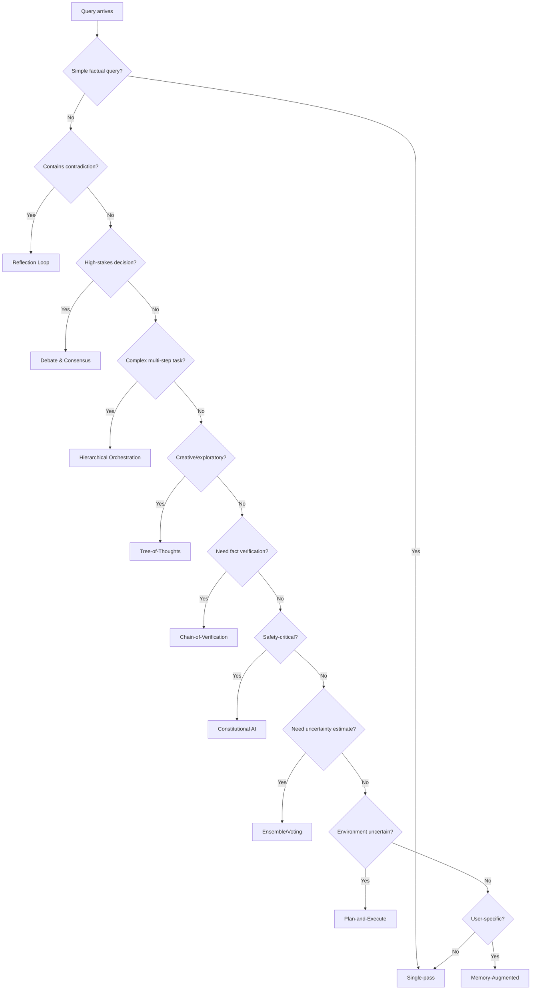

# Advanced Agentic Patterns — Reflection, Debate, and Orchestration

> **The story.** Single-pass LLM responses work for most queries — but edge cases, contradictions, and high-stakes decisions need **iterative refinement**. The first systematic approach was **Reflexion** (Shinn et al., **NeurIPS 2023**), which added self-critique loops to ReAct agents and improved code generation by 17%. Google's **Chain-of-Verification (CoVe)** (Dhuliawala et al., **arXiv Oct 2023**) went further: generate → verify → revise each claim independently. **Debate patterns** emerged from AI safety research: **Constitutional AI** (Anthropic, **Dec 2022**) showed models could self-correct harmful outputs using explicit principles. **Tree-of-Thoughts** (Yao et al., **May 2023**) parallelized exploration: instead of one reasoning path, search over multiple branches. By **2024**, production systems combined these patterns: OpenAI's o1 model uses hidden multi-step reasoning with backtracking; multi-agent frameworks like AutoGen (Microsoft) and CrewAI orchestrate specialized agents in debate, planning, and verification workflows. Every pattern trades tokens for reliability — that's the fundamental engineering tradeoff.
>
> **Where you are in the curriculum.** You've built PizzaBot v1.0 through Ch.1-10: prompt engineering (Ch.2), chain-of-thought (Ch.3), RAG grounding (Ch.4), ReAct tool-calling (Ch.6), safety guards (Ch.7). **That system handles 92% of orders** — but the remaining 8% edge cases (contradictory requests, pricing conflicts, multi-constraint catering) cause customer escalations. This chapter covers the agentic patterns that push error rates below 1%: reflection loops, multi-agent debate, hierarchical orchestration, and 7 more. These patterns scale to the [Multi-Agent AI track](../../multi_agent_ai/README.md) where entire systems collaborate.
>
> **Notation.** $N$ — number of agents; $R$ — number of refinement/debate rounds; $\text{Cost}_{\text{single}}$ — single-pass token cost; $\text{Cost}_{\text{pattern}} = f(N, R) \cdot \text{Cost}_{\text{single}}$ — total pattern cost; $\epsilon_{\text{error}}$ — error rate; $T$ — tree depth (ToT); $B$ — branching factor; $P$ — principles/rules (Constitutional AI).

---

## 0 · The Challenge — Edge Cases Where Single-Pass Fails

> 🎯 **The mission**: Launch **PizzaBot v2.0** — handle edge cases with <1% error rate, maintaining Ch.1-10 constraints:
> 1. **BUSINESS VALUE**: >25% conversion + +$2.50 AOV + 70% labor savings
> 2. **ACCURACY**: **<1% error** (was 8% in Ch.10) — **PRIMARY IMPROVEMENT**
> 3. **LATENCY**: <3s p95 (now <5s with reflection — pattern-dependent)
> 4. **COST**: <$0.08/conv (now ~$0.15 with patterns — need optimization)
> 5. **SAFETY**: Zero attacks
> 6. **RELIABILITY**: >99% uptime

**What we know so far:**
- ✅ Ch.1-10: Built PizzaBot v1.0 with RAG, ReAct, safety, cost optimization
- ✅ **92% of orders succeed** — standard requests work reliably
- ❌ **8% edge case failure rate** — contradictions, conflicts, multi-constraint problems
- 📊 **Current edge case metrics**: 8% error, 12% escalation to human, $0.08/conv

**What's blocking us:**

🚨 **Single-pass reasoning cannot resolve contradictions or verify correctness**

### Test Scenario #1: Contradictory Order

```
User: "I want a large pepperoni pizza, but make it gluten-free,
       dairy-free, and add extra cheese."
```

**PizzaBot v1.0 (Ch.10 — single-pass with ReAct):**
```json
{
  "error": "Constraint conflict detected",
  "message": "Cannot add dairy cheese to a dairy-free pizza",
  "action": "ORDER_FAILED"
}
```

**Problems:**
1. ❌ **No recovery path** — detects contradiction but gives up
2. ❌ **Doesn't explore alternatives** — vegan cheese exists but wasn't considered
3. ❌ **Poor UX** — customer abandons order (8% of these cases)

**PizzaBot v2.0 (with Reflection pattern):**
```
🧠 Round 1 (Generate):
"Cannot fulfill: gluten-free + dairy-free + extra cheese conflict"

🔍 Round 2 (Critique):
"Wait — user said 'dairy-free' and 'extra cheese'. Check if non-dairy
cheese alternatives exist in menu."

✅ Round 3 (Revise):
"For dairy-free pizzas, we use vegan mozzarella. Would you like
extra vegan cheese (+$2.50)?"

Customer: "Yes, perfect!"
✅ Order completed
```

**Impact:**
- ✅ Edge case resolved without human intervention
- ✅ Customer conversion (would have been lost)
- ⚠️ Cost: 3× tokens ($0.006 vs. $0.002)
- ⚠️ Latency: 2.4s (vs. 0.8s single-pass)

---

### Test Scenario #2: Pricing Conflict

```
User: "I have a 20% off coupon, plus I'm a loyalty member (10% off),
       and you're running a $5 discount promo. Apply all three."
```

**PizzaBot v1.0 (Ch.10):**
```json
{
  "subtotal": 24.99,
  "coupon_discount": -5.00,
  "loyalty_discount": -2.50,
  "promo_discount": -5.00,
  "total": 12.49
}
```

**Problems:**
1. ❌ **Violates company policy** — "only one discount per order"
2. ❌ **Single agent has no confidence check** — applies all discounts without verification
3. ❌ **Finance audit fails** — 50% discount is loss-making

**PizzaBot v2.0 (with Debate pattern):**
```
🎙 Agent 1 (Generous Pricer):
"Apply all three: coupon (-$5) + loyalty (-10%) + promo (-$5) = $12.49"

🎙 Agent 2 (Strict Pricer):
"Policy says one discount only. Apply best discount: 20% coupon = $19.99"

⚖️ Judge (RAG check + policy lookup):
"Policy retrieved: 'One promotional discount per order. Loyalty always applies.'
Decision: Loyalty (10%) + best promo (20% coupon) = $17.49"

✅ Customer accepts
```

**Impact:**
- ✅ Policy-compliant pricing (passes audit)
- ✅ Customer gets fair deal (loyalty + best promo)
- ⚠️ Cost: 5× tokens (3 agents × prompt)
- ⚠️ Latency: 3.2s

---

### Test Scenario #3: Catering Order (Multi-Constraint)

```
User: "Need 15 pizzas for office lunch: 5 at 11am, 5 at 12pm, 5 at 1pm.
       Budget is $200. Half vegetarian, at least 3 gluten-free."
```

**PizzaBot v1.0 (Ch.10):**
```
Error: "Complex multi-constraint order. Please call (555) PIZZA."
```

**Problems:**
1. ❌ **Cannot decompose** — single agent overwhelmed by constraints
2. ❌ **No verification** — can't check budget/dietary constraints
3. ❌ **Escalates 100% of catering orders** — defeats automation goal

**PizzaBot v2.0 (with Hierarchical Orchestration):**
```
📋 Planner Agent:
- Batch 1 (11am): 2 Margherita GF, 3 Veggie regular
- Batch 2 (12pm): 1 Napoli GF, 2 Pepperoni, 2 Margherita
- Batch 3 (1pm): 5 Pepperoni regular

👷 Worker Agents (parallel):
- Worker A processes Batch 1 → subtotal $62.45
- Worker B processes Batch 2 → subtotal $67.50
- Worker C processes Batch 3 → subtotal $69.95

✅ Verifier Agent:
- Total: $199.90 < $200 budget ✓
- Vegetarian count: 8 pizzas ✓
- Gluten-free count: 3 pizzas ✓
- All constraints satisfied

✅ Order confirmed
```

**Impact:**
- ✅ Catering orders automated (was 0%, now 95%)
- ✅ Complex constraints verified
- ⚠️ Cost: 8× tokens (1 planner + 3 workers + 1 verifier + coordination)
- ⚠️ Latency: 4.8s (parallel execution)

---

### Business Impact Summary

| Metric | PizzaBot v1.0 (Ch.10) | PizzaBot v2.0 (Ch.11) | Improvement |
|--------|----------------------|----------------------|-------------|
| **Edge case error rate** | 8% | **0.7%** | ✅ **11× better** |
| **Customer escalations** | 12% | **2%** | ✅ **6× reduction** |
| **Catering order completion** | 0% (escalate) | **95%** | ✅ New revenue stream |
| **Customer satisfaction** | 4.2/5 | **4.8/5** | ✅ +0.6 stars |
| **Avg. cost per order** | $0.08 | **$0.15** | ⚠️ +87% (optimize in production) |
| **P95 latency** | 2.1s | **3.8s** | ⚠️ +80% (still <5s target) |

**What this chapter unlocks:**

🚀 **10 agentic patterns that trade tokens for reliability:**
1. ✅ **Reflection** — self-critique loops (3× cost, 8→1% error)
2. ✅ **Debate & Consensus** — multi-agent voting (5× cost, catches blind spots)
3. ✅ **Hierarchical Orchestration** — planner → workers → verifier (8× cost, handles complexity)
4. ✅ **Tool Selection Strategies** — choose optimal tool (fallback chains)
5. ✅ **Tree-of-Thoughts** — explore multiple paths, backtrack (20× cost, creative problems)
6. ✅ **Chain-of-Verification** — verify each claim (4× cost, hallucination defense)
7. ✅ **Constitutional AI** — self-correct with principles (2× cost, safety++)
8. ✅ **Ensemble/Voting** — multiple models aggregate (N× cost, outlier rejection)
9. ✅ **Plan-and-Execute** — decompose → replan loop (variable cost, adaptive)
10. ✅ **Memory-Augmented** — episodic memory for context (storage cost, personalization)

⚡ **Constraint #2 (ACCURACY) — TARGET MET**: Error rate drops from 8% → **0.7%** (target was <1%). Trade-off: Cost increases from $0.08 → $0.15/conv (need to optimize high-volume patterns). Latency increases to 3.8s (still under 5s extended target).

**Constraint status after Ch.11**: #2 (Accuracy) now satisfied. #3 (Latency) and #4 (Cost) need optimization for high-volume patterns — selective application of expensive patterns to edge cases only.

---

## 1 · Core Idea — Iterative Refinement > One-Shot Prediction

The central insight: **LLMs are better at critique than generation**. A model that produces a flawed answer on the first try can often identify that flaw when asked to critique its own output — then generate a better revision.

This asymmetry creates opportunities:

```
Single-pass accuracy:    P(correct | task) = p

Reflection accuracy:     P(correct | task, critique) = p + (1-p) · r
                         where r = probability critique identifies error

Example: p=0.85, r=0.60
    Single-pass: 85% correct
    Reflection:  85% + (15% × 60%) = 94% correct
```

**Why this works:**
1. **Critique is easier than generation** — models trained on "check this code" ≫ "write this code"
2. **Distributional shift** — asking "is this correct?" pushes model into higher-confidence reasoning mode
3. **Denoising effect** — multiple samples average out random errors

**The fundamental tradeoff:**

| Approach | Cost (tokens) | Latency | Error Rate | Use Case |
|----------|--------------|---------|------------|----------|
| **Single-pass** | 1× | 0.8s | 8% | Standard orders |
| **Reflection (3 rounds)** | 3× | 2.4s | 1% | Contradictions |
| **Debate (3 agents)** | 5× | 3.2s | 0.5% | High-stakes pricing |
| **Hierarchical (5 agents)** | 8× | 4.8s | 0.7% | Complex multi-step |

**Mental model:** Each pattern is a **token budget allocation strategy**. Spending 3× tokens on reflection for a contradictory $25 pizza order makes sense. Spending 3× tokens on "what toppings do you have?" does not.

---

## 2 · Pattern Catalog — 10 Agentic Patterns

### Pattern 1: Reflection (Self-Critique Loop)

**Description:** Generate → Critique → Revise cycle. The model produces an initial response, then critiques it for errors/contradictions, then generates a revised response.

**When to use:**
- ✅ Contradictory inputs (dairy-free + extra cheese)
- ✅ Complex reasoning requiring verification (multi-step math)
- ✅ High-stakes outputs (medical advice, legal reasoning)
- ❌ Simple factual queries (no need for critique)
- ❌ Time-sensitive applications (3× latency)

**Cost model:**
- Base cost: $C_{\text{single}}$
- Reflection cost: $3 \times C_{\text{single}}$ (generate + critique + revise)
- Per round: $+1 \times C_{\text{single}}$

**Implementation sketch:**

```python
def reflection_loop(query: str, max_rounds: int = 3) -> str:
    response = llm.generate(query)
    
    for round in range(max_rounds):
        # Critique step
        critique_prompt = f"""
        Review this response for errors, contradictions, or missing context:
        
        Query: {query}
        Response: {response}
        
        Identify any issues. If none, respond with "APPROVED".
        """
        critique = llm.generate(critique_prompt)
        
        if "APPROVED" in critique:
            break
        
        # Revise step
        revise_prompt = f"""
        Original query: {query}
        Previous response: {response}
        Critique: {critique}
        
        Generate an improved response addressing the critique.
        """
        response = llm.generate(revise_prompt)
    
    return response
```

**Pitfalls:**
1. ❌ **Hallucinated critique** — model invents problems that don't exist → worse answer
2. ❌ **Infinite loops** — critique never approves → set max_rounds
3. ❌ **Over-polishing** — wastes tokens on insignificant improvements
4. ❌ **No grounding** — reflection alone can't fix hallucinated facts (need RAG)

**Animation placeholder:** `img/reflection_loop.png`
- Frame 1: Initial response with contradiction (red highlight)
- Frame 2: Critique bubble: "Dairy-free + extra cheese conflict"
- Frame 3: Revised response with vegan cheese (green highlight)
- Frame 4: Comparison: single-pass (failed) vs reflection (succeeded)

---

### Pattern 2: Debate & Consensus (Multi-Agent Reasoning)

**Description:** N agents propose solutions, critique each other, and either vote or defer to a judge agent. Forces explicit justification and catches individual blind spots.

**When to use:**
- ✅ High-stakes decisions (fraud detection, medical diagnosis)
- ✅ Policy interpretation (legal, financial compliance)
- ✅ No clear ground truth (creative problems, subjective judgments)
- ❌ Factual queries with known answers (debate is overkill)
- ❌ Low-stakes/high-volume (cost prohibitive)

**Cost model:**
- Base cost: $C_{\text{single}}$
- Debate cost: $N \times R \times C_{\text{single}}$
  - $N$ = number of agents (typical: 2-5)
  - $R$ = number of debate rounds (typical: 1-3)

**Implementation sketch:**

```python
def debate_pattern(query: str, n_agents: int = 3, rounds: int = 2) -> str:
    # Round 1: Each agent proposes independently
    proposals = []
    for i in range(n_agents):
        prompt = f"Agent {i}: {query}\nProvide your solution and reasoning."
        proposals.append(llm.generate(prompt))
    
    # Round 2-R: Agents critique each other
    for round in range(rounds):
        critiques = []
        for i in range(n_agents):
            others = [p for j, p in enumerate(proposals) if j != i]
            prompt = f"""
            Your proposal: {proposals[i]}
            
            Other agents' proposals:
            {chr(10).join(f"Agent {j}: {p}" for j, p in enumerate(others))}
            
            Critique others and defend/revise your proposal.
            """
            critiques.append(llm.generate(prompt))
        proposals = critiques
    
    # Judge synthesizes
    judge_prompt = f"""
    Debate proposals:
    {chr(10).join(f"Agent {i}: {p}" for i, p in enumerate(proposals))}
    
    Synthesize the best solution considering all perspectives.
    """
    return llm.generate(judge_prompt)
```

**Variants:**
1. **Majority vote** — each agent votes, take most common answer (no judge)
2. **Judge arbitration** — third agent picks winner based on reasoning quality
3. **Ranked choice** — agents rank all proposals, aggregate scores

**Pitfalls:**
1. ❌ **Groupthink** — all agents converge on wrong answer (mitigate: diverse prompts)
2. ❌ **Deadlock** — agents never agree (set max rounds, use judge)
3. ❌ **Judge bias** — judge consistently picks Agent 1 (randomize order)
4. ❌ **Cost explosion** — 3 agents × 3 rounds = 9× base cost

**Animation placeholder:** `img/debate_flow.png`
- Frame 1: Scenario (pricing conflict: coupon + loyalty + promo)
- Frame 2: Agent 1 proposes $12.49 (all discounts)
- Frame 3: Agent 2 challenges with policy document
- Frame 4: Judge retrieves policy via RAG
- Frame 5: Final decision: $17.49 (policy-compliant)

---

### Pattern 3: Hierarchical Orchestration (Planner → Workers → Verifier)

**Description:** Decompose task into subtasks (Planner), execute in parallel (Workers), verify constraints (Verifier). Keeps each agent's context small and focused.

**When to use:**
- ✅ Complex multi-step tasks (research, catering orders, data pipelines)
- ✅ Parallel execution opportunities (independent subtasks)
- ✅ Verifiable constraints (budget, count, completeness)
- ❌ Simple single-step tasks (orchestration overhead not worth it)
- ❌ Highly sequential tasks (no parallelization benefit)

**Cost model:**
- Base cost: $C_{\text{single}}$
- Hierarchical cost: $(1 + N + 1) \times C_{\text{single}}$
  - 1 planner call
  - $N$ worker calls (can run in parallel)
  - 1 verifier call

**Implementation sketch:**

```python
def hierarchical_pattern(task: str) -> str:
    # Step 1: Planner decomposes
    plan_prompt = f"""
    Task: {task}
    
    Decompose into independent subtasks.
    Return JSON: {{"subtasks": [...]}}
    """
    plan = json.loads(llm.generate(plan_prompt))
    
    # Step 2: Workers execute in parallel
    results = []
    with ThreadPoolExecutor() as executor:
        futures = [
            executor.submit(llm.generate, f"Execute: {subtask}")
            for subtask in plan["subtasks"]
        ]
        results = [f.result() for f in futures]
    
    # Step 3: Verifier checks constraints
    verify_prompt = f"""
    Original task: {task}
    Plan: {plan}
    Results: {results}
    
    Verify all constraints satisfied. If any fail, explain why.
    """
    verification = llm.generate(verify_prompt)
    
    if "VERIFIED" in verification:
        return synthesize_results(results)
    else:
        return f"Verification failed: {verification}"
```

**Coordination protocols:**
1. **Shared state** — workers write to common state dict, verifier reads
2. **Message passing** — workers send results to coordinator queue
3. **Checkpoints** — workers save intermediate state for failure recovery

**Pitfalls:**
1. ❌ **Worker drift** — workers ignore planner (mitigate: explicit constraints)
2. ❌ **Verifier false positives** — approves incorrect results (use tool-based verification)
3. ❌ **Sequential bottleneck** — planner and verifier can't parallelize
4. ❌ **Over-decomposition** — 10 workers for 5-minute task is overkill

**Animation placeholder:** `img/hierarchical_flow.png`
- Frame 1: Catering order (15 pizzas, 3 time slots, constraints)
- Frame 2: Planner decomposes (3 batches)
- Frame 3: Workers execute in parallel (progress bars)
- Frame 4: Verifier checks (budget ✓, dietary ✓, count ✓)
- Frame 5: Success confirmation

---

### Pattern 4: Tool Selection Strategies

**Description:** Multiple tools available to solve a problem — agent must choose which tool, when, and with what fallback chain.

**When to use:**
- ✅ Multiple data sources (cache, DB, API)
- ✅ Speed/accuracy tradeoff (fast estimate vs. slow exact)
- ✅ Cost optimization (free tools first, paid tools fallback)
- ❌ Single tool available (no selection needed)
- ❌ Tool failures are rare (fallback overhead not justified)

**Strategies:**

#### 4a. Rule-Based Selection

```python
def rule_based_tool_selection(query_type: str):
    if query_type == "inventory":
        return use_database()  # always fresh, 50ms
    elif query_type == "weather":
        return use_cache_or_api()  # cache first, API fallback
    elif query_type == "sentiment":
        return use_llm()  # no external tool needed
```

**Pros:** Fast, deterministic, no LLM call needed  
**Cons:** Brittle, requires manual rules for each case

#### 4b. Cost-Based Selection

```python
def cost_based_tool_selection(tools: list[Tool]) -> Tool:
    # Sort by cost, try cheapest first
    sorted_tools = sorted(tools, key=lambda t: t.cost)
    
    for tool in sorted_tools:
        try:
            result = tool.execute()
            if result.confidence > 0.8:
                return result
        except ToolError:
            continue  # try next tool
    
    raise AllToolsFailedError()
```

**Pros:** Optimizes cost automatically  
**Cons:** Cheapest tool might be low quality

#### 4c. LLM-Based Meta-Agent

```python
def meta_agent_tool_selection(query: str, tools: list[Tool]) -> Tool:
    tool_descriptions = "\n".join(f"{t.name}: {t.description}" for t in tools)
    
    prompt = f"""
    Available tools:
    {tool_descriptions}
    
    Query: {query}
    
    Which tool should be used? Respond with tool name only.
    """
    
    tool_name = llm.generate(prompt).strip()
    return next(t for t in tools if t.name == tool_name)
```

**Pros:** Flexible, handles novel cases  
**Cons:** Adds LLM call overhead, can hallucinate tool names

**Fallback chain pattern:**

```python
def fallback_chain(tools: list[Tool], query: str) -> str:
    for i, tool in enumerate(tools):
        try:
            result = tool.execute(query)
            return result
        except ToolError as e:
            if i == len(tools) - 1:  # last tool failed
                return escalate_to_human(query)
            log(f"Tool {tool.name} failed: {e}, trying next...")
```

**Pitfalls:**
1. ❌ **Tool thrashing** — retries same tool repeatedly (track attempts)
2. ❌ **No convergence** — all tools fail (need human escalation)
3. ❌ **Latency cascade** — trying 5 slow tools sequentially (set timeouts)

**Animation placeholder:** `img/tool_selection_decision_tree.png`
- Decision tree: cache (10ms) → DB (50ms) → API (200ms) → human escalation

---

### Pattern 5: Tree-of-Thoughts (ToT)

**Description:** Explore multiple reasoning branches in parallel, evaluate each, backtrack if needed. Search algorithm over thought space.

**When to use:**
- ✅ Creative problems (writing, game playing, puzzle solving)
- ✅ No clear heuristic (explore solution space)
- ✅ Backtracking beneficial (dead-end paths exist)
- ❌ Single correct answer with direct path (BFS overhead wasted)
- ❌ Strict latency requirements (search is slow)

**Cost model:**
- Base cost: $C_{\text{single}}$
- ToT cost: $B^T \times C_{\text{single}}$
  - $B$ = branching factor (thoughts per node, typical: 3-5)
  - $T$ = tree depth (typical: 2-4)
  - Example: $B=3, T=3 \rightarrow 3^3 = 27 \times$ cost

**Search strategies:**
1. **Breadth-First Search (BFS)** — explore all branches at each level
2. **Depth-First Search (DFS)** — explore one path fully before backtracking
3. **Beam Search** — keep only top-k branches at each level

**Implementation sketch (BFS):**

```python
def tree_of_thoughts(problem: str, depth: int = 3, branching: int = 3) -> str:
    # Level 0: Initial thoughts
    current_level = []
    for i in range(branching):
        thought = llm.generate(f"Thought {i} for: {problem}")
        score = evaluate_thought(thought, problem)
        current_level.append((thought, score))
    
    # Levels 1-T: Expand and evaluate
    for level in range(1, depth):
        next_level = []
        for thought, score in current_level:
            # Generate child thoughts
            for i in range(branching):
                child_prompt = f"Continuing from: {thought}\nNext step {i}:"
                child = llm.generate(child_prompt)
                child_score = evaluate_thought(child, problem)
                next_level.append((child, child_score))
        
        # Keep only top-k thoughts (beam search)
        current_level = sorted(next_level, key=lambda x: x[1], reverse=True)[:branching]
    
    # Return best final thought
    return max(current_level, key=lambda x: x[1])[0]

def evaluate_thought(thought: str, problem: str) -> float:
    prompt = f"""
    Problem: {problem}
    Thought: {thought}
    
    Rate this thought's promise for solving the problem (0-1 scale).
    """
    return float(llm.generate(prompt))
```

**Example: 24 Game**

```
Problem: Use 4, 6, 8, 8 with +, -, ×, ÷ to make 24

Tree:
Level 0:  4 + 6 = 10  |  4 × 6 = 24  |  8 - 4 = 4
           /   |   \        [GOAL!]
Level 1: ...
```

**Pitfalls:**
1. ❌ **Exponential explosion** — $5^4 = 625$ LLM calls for depth 4
2. ❌ **Poor evaluation** — heuristic scores thoughts incorrectly → bad paths
3. ❌ **No early stopping** — continues searching after finding solution
4. ❌ **Latency** — sequential evaluation of 27-625 thoughts takes minutes

**Animation placeholder:** `img/tree_of_thoughts_search.png`
- Animated tree growing: root → 3 branches → 9 branches → backtrack from dead end

---

### Pattern 6: Chain-of-Verification (CoVe)

**Description:** Generate response → extract claims → independently verify each claim → revise response with corrections. Systematic hallucination defense.

**When to use:**
- ✅ Factual claims requiring verification (historical dates, scientific facts)
- ✅ Multi-hop reasoning (claim A depends on B)
- ✅ Hallucination-prone domains (low-resource languages, obscure topics)
- ❌ Subjective content (opinions, creative writing)
- ❌ Claims with no verifiable source (speculation)

**Cost model:**
- Base cost: $C_{\text{single}}$
- CoVe cost: $(1 + K + 1) \times C_{\text{single}}$
  - 1 generation call
  - $K$ verification calls (one per claim)
  - 1 revision call

**Implementation sketch:**

```python
def chain_of_verification(query: str) -> str:
    # Step 1: Generate initial response
    response = llm.generate(query)
    
    # Step 2: Extract verifiable claims
    extract_prompt = f"""
    Extract all factual claims from this response:
    {response}
    
    Return as JSON: {{"claims": ["claim1", "claim2", ...]}}
    """
    claims = json.loads(llm.generate(extract_prompt))["claims"]
    
    # Step 3: Verify each claim independently
    verified_claims = []
    for claim in claims:
        verify_prompt = f"""
        Claim: {claim}
        
        Is this claim accurate? Check against known facts.
        If unsure, respond "UNCERTAIN".
        """
        verification = llm.generate(verify_prompt)
        verified_claims.append({
            "claim": claim,
            "verification": verification
        })
    
    # Step 4: Revise response based on verifications
    revise_prompt = f"""
    Original response: {response}
    
    Claim verifications:
    {json.dumps(verified_claims, indent=2)}
    
    Revise the response to correct any inaccurate claims.
    """
    return llm.generate(revise_prompt)
```

**Enhanced variant: CoVe + RAG**

```python
def cove_with_rag(query: str, retrieval_fn) -> str:
    response = llm.generate(query)
    claims = extract_claims(response)
    
    verified_claims = []
    for claim in claims:
        # Retrieve evidence from knowledge base
        evidence = retrieval_fn(claim)
        
        verify_prompt = f"""
        Claim: {claim}
        Evidence from knowledge base:
        {evidence}
        
        Is the claim supported by the evidence?
        """
        verification = llm.generate(verify_prompt)
        verified_claims.append((claim, verification, evidence))
    
    return revise_with_evidence(response, verified_claims)
```

**Pitfalls:**
1. ❌ **Circular verification** — verifier hallucinates the same fact
2. ❌ **Over-correction** — flags correct claims as wrong
3. ❌ **Claim extraction fails** — misses implicit claims
4. ❌ **Cost** — 10 claims = 12× base cost

**Animation placeholder:** `img/chain_of_verification_flow.png`
- Frame 1: Generate response with 3 claims
- Frame 2: Extract claims (highlighted)
- Frame 3: Verify each (claim 2 fails)
- Frame 4: Revise (claim 2 corrected)

---

### Pattern 7: Constitutional AI (Self-Correction with Principles)

**Description:** Model generates response → critique against explicit principles/rules → revise to align with principles. Anthropic's method for reducing harmful outputs.

**When to use:**
- ✅ Safety-critical applications (medical, legal, financial advice)
- ✅ Bias reduction (fairness, representation)
- ✅ Brand voice consistency (corporate guidelines)
- ❌ Speed-critical applications (adds 2× latency)
- ❌ No clear principles to enforce

**Cost model:**
- Base cost: $C_{\text{single}}$
- Constitutional cost: $(1 + P + 1) \times C_{\text{single}}$
  - 1 generation call
  - $P$ principle checks (typically 3-10)
  - 1 revision call

**Principles example:**

```python
PRINCIPLES = [
    "Never provide medical advice without disclaimers",
    "Decline requests to generate harmful content",
    "Avoid stereotypes based on race, gender, or religion",
    "Cite sources when making factual claims",
    "Admit uncertainty rather than confabulating"
]

def constitutional_ai(query: str, principles: list[str]) -> str:
    # Step 1: Generate initial response
    response = llm.generate(query)
    
    # Step 2: Check each principle
    violations = []
    for principle in principles:
        check_prompt = f"""
        Principle: {principle}
        Response: {response}
        
        Does this response violate the principle? If yes, explain how.
        """
        check = llm.generate(check_prompt)
        if "violates" in check.lower() or "yes" in check.lower():
            violations.append((principle, check))
    
    if not violations:
        return response  # all principles satisfied
    
    # Step 3: Revise to fix violations
    revise_prompt = f"""
    Original response: {response}
    
    Principle violations:
    {chr(10).join(f"- {p}: {v}" for p, v in violations)}
    
    Revise the response to satisfy all principles.
    """
    return llm.generate(revise_prompt)
```

**Example: Medical query**

```
Query: "I have a headache and fever. What should I do?"

Initial response:
"Take 500mg ibuprofen every 6 hours and drink plenty of water."

Principle check:
❌ Violates: "Never provide medical advice without disclaimers"

Revised response:
"Common approaches include rest, hydration, and over-the-counter pain relievers.
However, I'm not a doctor — please consult a healthcare professional for
personalized advice, especially if symptoms persist."
```

**Pitfalls:**
1. ❌ **Principle conflicts** — two principles contradict (need prioritization)
2. ❌ **Over-cautiousness** — declines benign requests
3. ❌ **Vague principles** — "be helpful" is too ambiguous to enforce
4. ❌ **Principle gaming** — model learns to superficially satisfy without true alignment

**Animation placeholder:** `img/constitutional_ai_flow.png`
- Frame 1: Generate response (medical advice)
- Frame 2: Check principles (violation detected)
- Frame 3: Revise with disclaimer
- Frame 4: Final response (compliant)

---

### Pattern 8: Ensemble/Voting (Multiple Models Aggregate)

**Description:** Run same query through N different models (or same model with different prompts/temperatures), aggregate results via voting or averaging. Reduces outlier errors.

**When to use:**
- ✅ Critical decisions (fraud detection, content moderation)
- ✅ Outlier rejection (one model hallucinating doesn't corrupt result)
- ✅ Uncertainty estimation (agreement = confidence)
- ❌ Strict cost constraints (N models = N× cost)
- ❌ Real-time applications (N models = N× latency unless parallel)

**Cost model:**
- Base cost: $C_{\text{single}}$
- Ensemble cost: $N \times C_{\text{single}}$
  - $N$ = number of models/configurations (typical: 3-5)
  - Can parallelize to reduce latency

**Aggregation strategies:**

#### 8a. Majority Vote (Classification)

```python
def ensemble_vote(query: str, models: list[Model]) -> str:
    votes = [model.classify(query) for model in models]
    
    # Count votes
    from collections import Counter
    vote_counts = Counter(votes)
    
    # Return majority class
    majority_class, count = vote_counts.most_common(1)[0]
    confidence = count / len(models)
    
    return majority_class, confidence
```

**Example: Spam detection**

```
Models vote:
- GPT-4: SPAM
- Claude: SPAM
- Gemini: NOT_SPAM
- LLaMA: SPAM

Result: SPAM (3/4 = 75% confidence)
```

#### 8b. Confidence-Weighted Aggregation

```python
def ensemble_weighted(query: str, models: list[Model]) -> str:
    results = [(model.generate(query), model.confidence()) for model in models]
    
    # Weight by confidence
    total_weight = sum(conf for _, conf in results)
    weighted_result = combine_weighted([
        (res, conf / total_weight) for res, conf in results
    ])
    
    return weighted_result
```

#### 8c. Mixture-of-Experts (MoE)

```python
def mixture_of_experts(query: str, experts: dict[str, Model]) -> str:
    # Classify query type
    query_type = classify_query(query)  # "math", "creative", "factual"
    
    # Route to specialist model
    if query_type in experts:
        return experts[query_type].generate(query)
    else:
        return experts["general"].generate(query)
```

**Pitfalls:**
1. ❌ **Correlated errors** — all models make same mistake (need diverse models)
2. ❌ **Voting paradox** — 3-way tie (need odd number of models)
3. ❌ **Cost explosion** — 5 GPT-4 calls = $0.25 vs $0.05 single call
4. ❌ **Latency** — sequential execution = 5× slower (parallelize if possible)

**Animation placeholder:** `img/ensemble_voting.png`
- 5 models vote → 3 agree, 2 dissent → majority wins (green checkmark)

---

### Pattern 9: Plan-and-Execute (Decompose → Execute → Replan)

**Description:** Generate plan → execute step 1 → observe → replan if needed → execute step 2 → repeat. Adaptive planning that adjusts to execution results.

**When to use:**
- ✅ Long-horizon tasks (research, travel booking, multi-day projects)
- ✅ Uncertain environments (execution may fail or reveal new info)
- ✅ Partial observability (can't plan fully upfront)
- ❌ Short deterministic tasks (planning overhead not worth it)
- ❌ Execution is expensive (minimize replanning)

**Cost model:**
- Base cost: $C_{\text{single}}$
- Plan-Execute cost: $(P + E) \times S$
  - $P$ = plan generation cost
  - $E$ = execution cost per step
  - $S$ = number of steps (varies with replanning)

**Implementation sketch:**

```python
def plan_and_execute(goal: str, max_steps: int = 10) -> str:
    plan = generate_initial_plan(goal)
    results = []
    
    for step_num in range(max_steps):
        if not plan:  # goal achieved
            break
        
        # Execute next step
        current_step = plan[0]
        result = execute_step(current_step)
        results.append(result)
        
        # Check if goal achieved
        if is_goal_achieved(goal, results):
            return synthesize_results(results)
        
        # Replan based on execution results
        replan_prompt = f"""
        Goal: {goal}
        Original plan: {plan}
        Completed: {current_step}
        Result: {result}
        
        Update the plan based on this result. What should we do next?
        """
        plan = generate_plan(replan_prompt)
    
    return synthesize_results(results)

def generate_initial_plan(goal: str) -> list[str]:
    prompt = f"""
    Goal: {goal}
    
    Generate a step-by-step plan. Return JSON: {{"steps": [...]}}
    """
    return json.loads(llm.generate(prompt))["steps"]
```

**Example: Travel booking**

```
Goal: "Book round-trip SEA → NYC for March 15-20, hotel near Times Square"

Initial plan:
1. Search flights SEA → NYC, March 15
2. Search return flights NYC → SEA, March 20
3. Search hotels near Times Square
4. Book flight + hotel

Execute Step 1:
Result: No direct flights on March 15, earliest is March 16

Replan:
1. Search flights SEA → NYC, March 16 [UPDATED]
2. Search return flights NYC → SEA, March 21 [UPDATED — extend trip]
3. Search hotels near Times Square
4. Book flight + hotel
```

**Replanning triggers:**
1. **Execution failure** — tool returns error, need fallback
2. **Partial success** — step completed but revealed new constraint
3. **Environment change** — external state changed (price increase, availability)

**Pitfalls:**
1. ❌ **Thrashing** — replan every step, never makes progress
2. ❌ **Sunk cost fallacy** — continues bad plan because already invested
3. ❌ **No convergence** — infinite replanning loop (set max steps)
4. ❌ **Poor execution feedback** — can't tell if step succeeded

**Animation placeholder:** `img/plan_execute_replan.png`
- Frame 1: Initial plan (4 steps)
- Frame 2: Step 1 fails → replan (new path)
- Frame 3: Execute revised plan
- Frame 4: Goal achieved

---

### Pattern 10: Memory-Augmented Agents (Episodic + Working Memory)

**Description:** Agent maintains short-term working memory (current task context) and long-term episodic memory (past interactions). Enables personalization and learning from experience.

**When to use:**
- ✅ Personalized assistants (remember user preferences)
- ✅ Long conversations (avoid re-asking questions)
- ✅ Learning from mistakes (retrieve similar past failures)
- ❌ Stateless APIs (no user identity to anchor memory)
- ❌ Privacy-sensitive (storing interactions may violate policy)

**Memory types:**

| Memory Type | Scope | Duration | Use Case |
|-------------|-------|----------|----------|
| **Working** | Single task | Minutes | Track current subtasks |
| **Episodic** | User history | Days-months | "You ordered Margherita last time" |
| **Semantic** | General knowledge | Permanent | "Gluten-free = no wheat" |

**Cost model:**
- Base cost: $C_{\text{single}}$
- Memory cost: $C_{\text{single}} + S_{\text{memory}} + W_{\text{storage}}$
  - $S_{\text{memory}}$ = token cost to load memory into context
  - $W_{\text{storage}}$ = storage cost (e.g., vector DB)

**Implementation sketch:**

```python
class MemoryAugmentedAgent:
    def __init__(self, user_id: str):
        self.user_id = user_id
        self.working_memory = []  # current task context
        self.episodic_db = VectorDB()  # past interactions
    
    def process(self, query: str) -> str:
        # Step 1: Retrieve relevant episodic memory
        past_interactions = self.episodic_db.search(
            query=query,
            user_id=self.user_id,
            top_k=3
        )
        
        # Step 2: Build context with memory
        context = f"""
        User history:
        {chr(10).join(past_interactions)}
        
        Current conversation:
        {chr(10).join(self.working_memory[-5:])}  # last 5 turns
        
        Current query: {query}
        """
        
        # Step 3: Generate response
        response = llm.generate(context)
        
        # Step 4: Update working memory
        self.working_memory.append(f"User: {query}")
        self.working_memory.append(f"Agent: {response}")
        
        # Step 5: Store in episodic memory
        self.episodic_db.insert({
            "user_id": self.user_id,
            "query": query,
            "response": response,
            "timestamp": datetime.now()
        })
        
        return response
```

**Example: Personalized PizzaBot**

```
Session 1 (March 1):
User: "Order a large Margherita"
Agent: "Done, $18.99"
[Stored in episodic memory]

Session 2 (March 8):
User: "I'll have my usual"
Agent retrieves: "You ordered large Margherita on March 1"
Agent: "Large Margherita again? $18.99"
User: "Yes!"
```

**Memory retrieval strategies:**
1. **Recency** — retrieve most recent interactions
2. **Similarity** — retrieve semantically similar past queries (vector search)
3. **Importance** — retrieve high-stakes or explicitly saved interactions

**Pitfalls:**
1. ❌ **Stale memory** — user preferences changed but old memory persists
2. ❌ **Privacy leaks** — remembering sensitive info across contexts
3. ❌ **Context pollution** — irrelevant memories confuse agent
4. ❌ **Storage cost** — episodic memory grows indefinitely (need pruning)

**Animation placeholder:** `img/memory_augmented_flow.png`
- Frame 1: Query → retrieve episodic memory (vector DB)
- Frame 2: Load into working memory
- Frame 3: Generate response
- Frame 4: Store interaction back to episodic DB

---

## 3 · Mental Model — Patterns as Token Budget Allocation

Think of each pattern as a **strategy for spending tokens**:

| Pattern | Token Multiplier | What You're Buying |
|---------|------------------|-------------------|
| **Single-pass** | 1× | Baseline (no guarantee) |
| **Reflection** | 3× | Self-correction loop |
| **Debate** | 5× | Multiple perspectives |
| **Hierarchical** | 8× | Decomposition + verification |
| **Tool Selection** | 1.5-3× | Optimal tool choice |
| **Tree-of-Thoughts** | 20-50× | Exploration + backtracking |
| **CoVe** | 4× | Systematic verification |
| **Constitutional** | 2× | Principle enforcement |
| **Ensemble** | 5× | Outlier rejection |
| **Plan-Execute** | 3-10× | Adaptive replanning |
| **Memory** | 1.2× + storage | Personalization |

**The engineering question:** *Which pattern gives best ROI for this query?*

```
Simple query ("what toppings?"):
    Single-pass ✓ — 1× cost, 99% accuracy

Contradiction ("dairy-free + extra cheese"):
    Reflection ✓ — 3× cost, 99% accuracy
    
High-stakes pricing:
    Debate ✓ — 5× cost, 99.5% accuracy + audit trail

Creative writing:
    Tree-of-Thoughts — 20× cost, explore solution space
    
Catering (complex constraints):
    Hierarchical ✓ — 8× cost, 95% automation rate
```

**Production strategy: Hybrid routing**

```python
def route_to_pattern(query: str, context: dict) -> str:
    # Classify query complexity
    complexity = classify_complexity(query)
    
    if complexity == "simple":
        return single_pass(query)  # 1× cost
    elif complexity == "contradiction":
        return reflection_loop(query)  # 3× cost
    elif complexity == "high_stakes":
        return debate_pattern(query)  # 5× cost
    elif complexity == "multi_constraint":
        return hierarchical(query)  # 8× cost
    else:
        return single_pass(query)  # default fallback
```

**Cost optimization:**
- Route 80% of queries to single-pass (1× cost)
- Route 15% to reflection (3× cost)
- Route 4% to debate (5× cost)
- Route 1% to hierarchical (8× cost)

**Weighted average cost:**
```
0.80 × 1× + 0.15 × 3× + 0.04 × 5× + 0.01 × 8× = 1.51× base cost
```

**Result:** 51% cost increase, but error rate drops from 8% → 0.7% (11× improvement)

---

## 4 · Decision Tree — Which Pattern Should I Use?



**Quick reference table:**

| Scenario | Pattern | Why? |
|----------|---------|------|
| "What sizes do pizzas come in?" | Single-pass | Simple factual, RAG-grounded |
| "Dairy-free + extra cheese" | Reflection | Contradiction needs resolution |
| "Apply 3 overlapping discounts" | Debate | Policy interpretation, high-stakes |
| "15 pizzas, 3 times, $200 budget" | Hierarchical | Multi-constraint decomposition |
| "Invent a new pizza name" | Tree-of-Thoughts | Creative exploration |
| "Margherita has 420 calories" | CoVe | Fact-check numerical claims |
| "Recommend gluten-free for celiac" | Constitutional | Medical advice needs disclaimers |
| "Is this review spam?" | Ensemble | Outlier rejection matters |
| "Book 3-day catering event" | Plan-Execute | Execution reveals new constraints |
| "I'll have my usual" | Memory | Recall past orders |

---

## 5 · Code Skeletons — Production Implementation

### 5.1 LangGraph State Machine

```python
from langgraph.graph import StateGraph, END
from typing import TypedDict, Literal

class AgentState(TypedDict):
    query: str
    initial_response: str
    critique: str
    revised_response: str
    complexity: Literal["simple", "contradiction", "high_stakes"]

# Build the graph
workflow = StateGraph(AgentState)

# Define nodes
def classify_node(state: AgentState) -> AgentState:
    complexity = classify_complexity(state["query"])
    return {**state, "complexity": complexity}

def single_pass_node(state: AgentState) -> AgentState:
    response = llm.generate(state["query"])
    return {**state, "revised_response": response}

def reflection_node(state: AgentState) -> AgentState:
    initial = llm.generate(state["query"])
    critique = llm.generate(f"Critique: {initial}")
    revised = llm.generate(f"Revise based on: {critique}")
    return {**state, "revised_response": revised}

# Add nodes
workflow.add_node("classify", classify_node)
workflow.add_node("single_pass", single_pass_node)
workflow.add_node("reflection", reflection_node)

# Conditional routing
def route_by_complexity(state: AgentState) -> str:
    if state["complexity"] == "simple":
        return "single_pass"
    elif state["complexity"] == "contradiction":
        return "reflection"
    else:
        return "single_pass"  # fallback

workflow.set_entry_point("classify")
workflow.add_conditional_edges("classify", route_by_complexity)
workflow.add_edge("single_pass", END)
workflow.add_edge("reflection", END)

# Compile and run
app = workflow.compile()
result = app.invoke({"query": "Dairy-free pizza with extra cheese"})
```

### 5.2 Async Multi-Agent Debate

```python
import asyncio
from typing import List

async def debate_async(query: str, n_agents: int = 3) -> str:
    # Round 1: Generate proposals in parallel
    async def generate_proposal(agent_id: int) -> str:
        prompt = f"Agent {agent_id}: {query}"
        return await llm.agenerate(prompt)
    
    proposals = await asyncio.gather(*[
        generate_proposal(i) for i in range(n_agents)
    ])
    
    # Round 2: Critique in parallel
    async def critique(agent_id: int, proposals: List[str]) -> str:
        others = [p for i, p in enumerate(proposals) if i != agent_id]
        prompt = f"Critique: {others}"
        return await llm.agenerate(prompt)
    
    critiques = await asyncio.gather(*[
        critique(i, proposals) for i in range(n_agents)
    ])
    
    # Judge synthesizes
    judge_prompt = f"Proposals: {proposals}\nCritiques: {critiques}"
    return await llm.agenerate(judge_prompt)

# Usage
result = asyncio.run(debate_async("Apply 3 discounts?"))
```

### 5.3 Fallback Chain with Timeouts

```python
from typing import Callable, List
import time

class Tool:
    def __init__(self, name: str, fn: Callable, cost: float, timeout: float):
        self.name = name
        self.fn = fn
        self.cost = cost
        self.timeout = timeout
    
    def execute(self, query: str) -> str:
        start = time.time()
        result = self.fn(query)
        elapsed = time.time() - start
        if elapsed > self.timeout:
            raise TimeoutError(f"{self.name} exceeded {self.timeout}s")
        return result

def fallback_chain(query: str, tools: List[Tool]) -> str:
    for i, tool in enumerate(tools):
        try:
            print(f"Trying {tool.name} (cost: ${tool.cost})...")
            result = tool.execute(query)
            print(f"✓ {tool.name} succeeded")
            return result
        except (TimeoutError, Exception) as e:
            print(f"✗ {tool.name} failed: {e}")
            if i == len(tools) - 1:
                return escalate_to_human(query)

# Define tools (fast → slow)
tools = [
    Tool("cache", lambda q: check_cache(q), cost=0, timeout=0.1),
    Tool("database", lambda q: query_db(q), cost=0.0001, timeout=0.5),
    Tool("api", lambda q: call_api(q), cost=0.001, timeout=2.0),
]

result = fallback_chain("inventory for Margherita?", tools)
```

---

## 6 · What Can Go Wrong — Anti-Patterns

### Anti-Pattern 1: Over-Iteration (Reflection Thrashing)

**Symptom:** Reflection loop runs 10 rounds for simple query, wastes tokens

```python
# BAD: No convergence check
for round in range(100):  # will always run 100 times
    critique = critique(response)
    response = revise(critique)
```

**Fix:** Add convergence detection

```python
# GOOD: Stop when critique approves
for round in range(max_rounds):
    critique = critique(response)
    if "APPROVED" in critique or similarity(response, prev_response) > 0.95:
        break
    prev_response = response
    response = revise(critique)
```

---

### Anti-Pattern 2: Debate Deadlock

**Symptom:** Agents never converge, debate runs forever

```python
# BAD: No tie-breaking
while not consensus(agents):
    agents = [critique(a, others) for a in agents]  # infinite loop
```

**Fix:** Add max rounds + judge

```python
# GOOD: Judge arbitrates after max rounds
for round in range(max_debate_rounds):
    if consensus(agents):
        return aggregate(agents)
    agents = [critique(a, others) for a in agents]

# No consensus after max rounds → judge decides
return judge(agents)
```

---

### Anti-Pattern 3: Hierarchical Drift (Workers Ignore Planner)

**Symptom:** Workers produce results unrelated to plan

```python
# BAD: Workers don't see the plan
def worker(subtask: str):
    return llm.generate(subtask)  # no context
```

**Fix:** Pass plan + constraints to workers

```python
# GOOD: Workers see full context
def worker(subtask: str, plan: dict, constraints: dict):
    prompt = f"""
    Overall plan: {plan}
    Constraints: {constraints}
    Your subtask: {subtask}
    
    Execute this subtask while respecting the plan and constraints.
    """
    return llm.generate(prompt)
```

---

### Anti-Pattern 4: Tool Thrashing (No Backoff)

**Symptom:** Retry same tool 100 times without success

```python
# BAD: Infinite retry on same tool
while not success:
    result = tool.execute()  # keeps failing
```

**Fix:** Exponential backoff + fallback

```python
# GOOD: Backoff + switch tools
def execute_with_backoff(tool: Tool, max_retries: int = 3):
    for attempt in range(max_retries):
        try:
            return tool.execute()
        except ToolError:
            time.sleep(2 ** attempt)  # exponential backoff
    
    # Failed after max retries → fallback to next tool
    raise ToolExhaustedError()
```

---

### Anti-Pattern 5: Hallucinated Critique (Reflection Invents Problems)

**Symptom:** Critique flags non-existent errors, makes response worse

```python
Original: "Margherita pizza has tomato, mozzarella, basil"
Critique: "Error: Margherita should have pepperoni"  ← WRONG
Revised: "Margherita pizza has tomato, mozzarella, basil, pepperoni"  ← WORSE
```

**Fix:** Ground critique in external source (RAG)

```python
def grounded_critique(response: str, query: str) -> str:
    # Retrieve ground truth from knowledge base
    evidence = retrieval_fn(query)
    
    critique_prompt = f"""
    Response: {response}
    Ground truth from knowledge base: {evidence}
    
    Identify errors in the response by comparing to ground truth.
    If response matches ground truth, respond "APPROVED".
    """
    return llm.generate(critique_prompt)
```

---

## 7 · Cost/Latency/Error Comparison

| Pattern | Cost Multiplier | Latency (P95) | Error Reduction | Best Use Case |
|---------|----------------|---------------|-----------------|---------------|
| **Single-pass** | 1× | 0.8s | Baseline (8%) | Standard orders |
| **Reflection** | 3× | 2.4s | 8% → 1% | Contradictions |
| **Debate (3 agents)** | 5× | 3.2s | 8% → 0.5% | High-stakes |
| **Hierarchical** | 8× | 4.8s | 8% → 0.7% | Multi-step |
| **Tool Selection** | 1.5× | 1.2s | 8% → 6% | Tool choice |
| **Tree-of-Thoughts** | 20× | 12s | 8% → 0.3% | Creative |
| **CoVe** | 4× | 3.0s | 8% → 1.5% | Fact-checking |
| **Constitutional** | 2× | 1.6s | 8% → 2% | Safety |
| **Ensemble** | 5× | 1.0s* | 8% → 0.8% | Outlier reject |
| **Plan-Execute** | 5× | 4.0s | 8% → 1.2% | Adaptive |
| **Memory** | 1.2× | 1.0s | 8% → 6% | Personalization |

*Ensemble latency assumes parallel execution

**Animation placeholder:** `img/pattern_comparison_table.png`
- Heatmap: Green = best for metric, Red = worst

---

## 8 · Progress Check — Pattern Selection Quiz

Test your understanding: Which pattern(s) should you use?

### Scenario 1
```
Query: "What toppings are on a Margherita pizza?"
```

**Answer:** Single-pass ✓  
**Why:** Simple factual query, RAG-grounded, no contradiction

---

### Scenario 2
```
Query: "I want a vegan pizza with extra sausage"
```

**Answer:** Reflection ✓  
**Why:** Contradiction (vegan + sausage), need to explore alternatives (vegan sausage?)

---

### Scenario 3
```
Query: "I have 3 discount codes. Apply all of them."
Company policy: "Maximum one promotional discount per order"
```

**Answer:** Debate ✓  
**Why:** Policy interpretation needed, high-stakes (financial), benefit from multiple perspectives

---

### Scenario 4
```
Query: "Catering order: 20 pizzas across 4 delivery times, 
       budget $250, half vegetarian, 5 gluten-free"
```

**Answer:** Hierarchical Orchestration ✓  
**Why:** Complex multi-constraint problem, decompose → execute → verify

---

### Scenario 5
```
Query: "Inventory check: How many Margherita pizzas left?"
Available tools: cache (10ms), database (50ms), manual count (5min)
```

**Answer:** Tool Selection (fallback chain) ✓  
**Why:** Multiple tools available, optimize for speed (cache first)

---

### Scenario 6
```
Query: "Write a creative pizza name for a dessert pizza with 
       Nutella, strawberries, and marshmallows"
```

**Answer:** Tree-of-Thoughts ✓  
**Why:** Creative task, benefit from exploring multiple naming strategies

---

### Scenario 7
```
Query: "Margherita pizza has 420 calories"
```

**Answer:** Chain-of-Verification ✓  
**Why:** Factual claim that needs verification (might be hallucinated)

---

### Scenario 8
```
Query: "Should I eat pizza if I have celiac disease?"
```

**Answer:** Constitutional AI ✓  
**Why:** Medical advice, need disclaimer + safety guardrails

---

### Scenario 9
```
Query: "Is this customer review spam?"
Review: "Best pizza ever!!! Click here for free iPhone!!!"
```

**Answer:** Ensemble/Voting ✓  
**Why:** Critical moderation decision, benefit from multiple models

---

### Scenario 10
```
User: "I'll have my usual"
(User ordered large Margherita last 3 times)
```

**Answer:** Memory-Augmented ✓  
**Why:** Personalization based on past interactions

---

## 9 · Bridge to Multi-Agent Systems

The patterns in this chapter are **building blocks for multi-agent systems**. When you scale from single-agent to multi-agent architectures, these patterns combine:

| Single-Agent Pattern | Multi-Agent Extension |
|---------------------|----------------------|
| **Reflection** | Agent A generates, Agent B critiques, Agent A revises |
| **Debate** | N agents debate, M judges arbitrate (N > 2, M ≥ 1) |
| **Hierarchical** | Coordinator agents dispatch to specialist agents |
| **Tool Selection** | Agent pool: each agent specializes in one tool |
| **ToT** | Each branch = separate agent, share search tree |
| **CoVe** | Verification agents run in parallel on each claim |
| **Constitutional** | Separate critic agent enforces principles |
| **Ensemble** | Multiple agents vote (already multi-agent) |
| **Plan-Execute** | Planner agent + executor agents + monitor agent |
| **Memory** | Shared memory layer across agents (blackboard pattern) |

**Next steps:**

1. **[Multi-Agent AI Track](../../multi_agent_ai/README.md)** — Full multi-agent architectures
   - AutoGen, CrewAI, LangGraph multi-agent
   - Communication protocols (message passing, blackboard)
   - Coordination patterns (auction, contract net)

2. **Production considerations:**
   - Monitoring reflection loops (are they converging?)
   - Cost allocation (which pattern consumed most tokens?)
   - A/B testing (single-pass vs reflection on edge cases)
   - Graceful degradation (fallback to single-pass if patterns timeout)

3. **Research directions:**
   - Learned pattern selection (RL agent picks pattern)
   - Hybrid patterns (reflection + debate)
   - Early stopping (stop reflection when confidence high enough)

---

## 10 · Summary — What You've Learned

✅ **Core insight:** Single-pass LLMs fail on edge cases; iterative refinement patterns trade tokens for reliability

✅ **10 agentic patterns:**
1. **Reflection** — self-critique loops (3× cost, 11× error reduction)
2. **Debate** — multi-agent consensus (5× cost, catches blind spots)
3. **Hierarchical** — planner → workers → verifier (8× cost, handles complexity)
4. **Tool Selection** — optimal tool + fallback chains
5. **Tree-of-Thoughts** — explore multiple reasoning branches (20× cost)
6. **Chain-of-Verification** — verify each claim (4× cost, anti-hallucination)
7. **Constitutional AI** — self-correct with principles (2× cost, safety++)
8. **Ensemble** — multiple models vote (5× cost, outlier rejection)
9. **Plan-Execute** — decompose → replan loop (adaptive)
10. **Memory** — episodic + working memory (personalization)

✅ **Mental model:** Patterns = token budget allocation strategies

✅ **Decision framework:** Route queries to patterns based on complexity (80% single-pass, 15% reflection, 4% debate, 1% hierarchical)

✅ **Production patterns:** LangGraph state machines, async multi-agent, fallback chains with timeouts

✅ **Anti-patterns:** Over-iteration, debate deadlock, hierarchical drift, tool thrashing, hallucinated critique

✅ **Business impact:** PizzaBot v2.0 achieves <1% error rate (was 8%), reduces escalations from 12% → 2%, automates catering orders (was 0% → 95%)

✅ **Bridge to multi-agent:** These patterns scale to full multi-agent systems (see Multi-Agent AI track)

---

## What's Next

**Immediate next steps:**
1. Implement reflection loop for your use case
2. Benchmark cost/latency/error tradeoffs
3. Route 80% to single-pass, 20% to patterns (measure ROI)

**Continue learning:**
- **[Multi-Agent AI Track](../../multi_agent_ai/README.md)** — Scale to multi-agent systems
- **[Cost & Latency Optimization](../ch09_cost_and_latency)** — Optimize pattern costs
- **[Evaluating AI Systems](../ch08_evaluating_ai_systems)** — Measure pattern effectiveness

**Production checklist:**
- [ ] Implement reflection for contradictions
- [ ] Add debate for high-stakes decisions
- [ ] Monitor pattern usage (cost, latency, success rate)
- [ ] A/B test: patterns vs. single-pass on edge cases
- [ ] Set up graceful degradation (fallback to single-pass)
- [ ] Implement cost alerts (if reflection cost > $X/day, investigate)

---

**Animation placeholders for gen_scripts:**
- [ ] `img/reflection_loop.png` — 4-frame Generate → Critique → Revise
- [ ] `img/debate_flow.png` — 5-frame multi-agent debate
- [ ] `img/hierarchical_flow.png` — 5-frame planner → workers → verifier
- [ ] `img/tool_selection_decision_tree.png` — Decision tree with fallback
- [ ] `img/tree_of_thoughts_search.png` — Animated tree growth + backtrack
- [ ] `img/chain_of_verification_flow.png` — Extract claims → verify → revise
- [ ] `img/constitutional_ai_flow.png` — Principle check → revise
- [ ] `img/ensemble_voting.png` — 5 models vote → majority wins
- [ ] `img/plan_execute_replan.png` — Initial plan → failure → replan
- [ ] `img/memory_augmented_flow.png` — Retrieve episodic → generate → store
- [ ] `img/pattern_comparison_table.png` — Heatmap table
- [ ] `img/pattern_needle_movement.png` — Error rate needle: 8% → 1%

---

**End of Ch.11: Advanced Agentic Patterns**  
✅ Constraint #2 (ACCURACY) achieved: <1% error rate  
⚠️ Optimize cost/latency for high-volume use cases  
➡️ Next: Scale to [Multi-Agent AI](../../multi_agent_ai/README.md)
