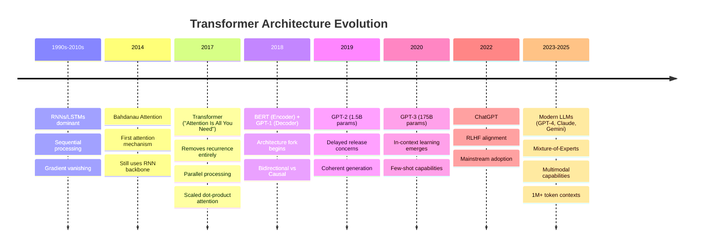
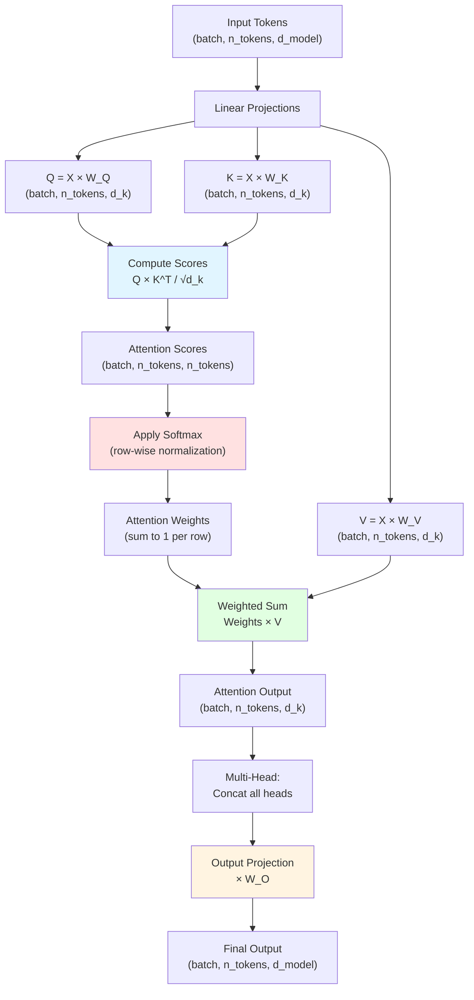
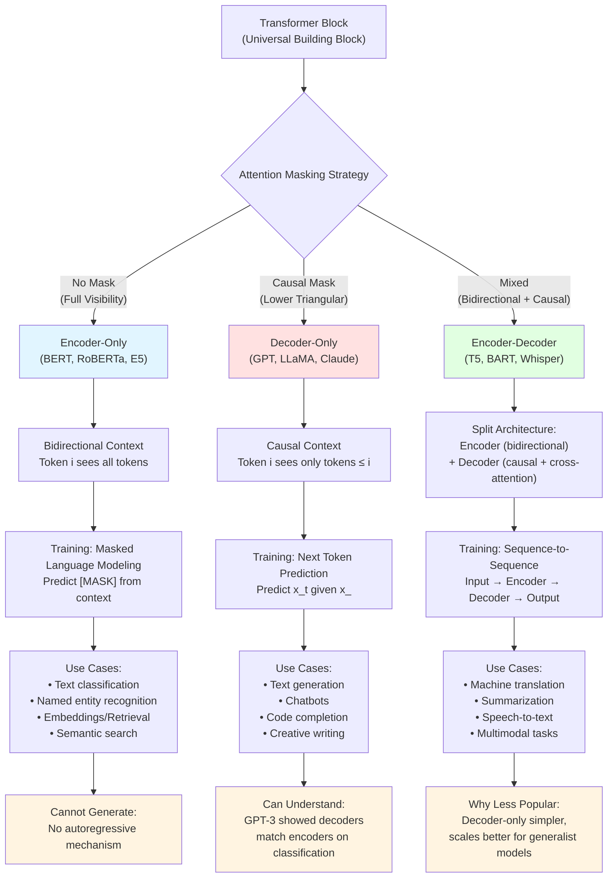

# Transformer Architecture — From Tokens to Attention

> **Where you are in the curriculum.** **Read this before anything else in the AI track.** This chapter builds the foundation you need for every later document — [LLM Inference Mechanics](../ch02-llm-inference-mechanics), [CoT Reasoning](../ch06-cot-reasoning), [RAG](../ch07-rag-and-embeddings), [ReAct](../../03b-agentic-ai/ch01-react-and-semantic-kernel). You'll learn the historical path from RNNs to transformers, what an LLM actually is, how tokenization works, the mechanics of attention (Q/K/V, multi-head attention, positional encoding), and the three architectural families (encoder-only, decoder-only, encoder-decoder).
>
> **Notation used in this doc.** $P(x_t \mid x_{<t})$ — probability of next token $x_t$ given all prior tokens; $T$ — temperature (controls output randomness); $k$ — top-$k$ candidate count; $p$ — nucleus (top-$p$) cumulative probability threshold; $V$ — vocabulary size.

---

## 0 · The Historical Thread

### 0.1 · Pre-Transformer Era (2014–2017)

In the summer of 2017, eight Google engineers published a twelve-page paper with a deliberately provocative title: *"Attention Is All You Need."* They weren't describing a self-help book — they were discarding the recurrent loops that every language model had relied on for a decade and replacing them with a single mechanism called **attention**. The transformer, as the architecture came to be known, was faster to train, easier to parallelize, and — it turned out — almost infinitely scalable. Almost nobody outside research noticed.

**The problem before 2017:** RNNs (recurrent neural networks) and LSTMs were the dominant architecture for sequence modeling. Every token was processed sequentially — step $t$ depended on step $t-1$, so training couldn't be parallelized. Worse, gradients vanished over long sequences, making it nearly impossible to learn dependencies beyond 100-200 tokens. The field had hit a wall.

**Bahdanau attention (2014)** was the first crack: in machine translation, let the decoder "attend" to all source tokens simultaneously by scoring and weighting them. But the recurrence bottleneck remained — you still had to step through time one token at a time.

**"Attention Is All You Need" (Vaswani et al., 2017)** dropped recurrence entirely. Every token attends to every other token in parallel. The entire sequence is processed at once. Training that previously took weeks could now run in days. Two design decisions defined the next decade:

1. **Scaled dot-product attention** with multi-head projection — every token computes a weighted sum over all other tokens, in parallel, with multiple attention "heads" specialized for different linguistic patterns (syntax, co-reference, semantics).

2. **Positional encoding** — since attention is permutation-equivariant (shuffle the tokens, the output shuffles identically), inject position information via sinusoidal embeddings or learned vectors.

The original transformer had two stacks: an **encoder** (reads the source sentence with bidirectional attention) and a **decoder** (generates the target sentence one token at a time, with causal attention to prevent looking ahead). Built for machine translation. Within months, two groups took that architecture and split it in opposite directions.

> 💡 **Checkpoint:** RNNs couldn't parallelize training (sequential dependency bottleneck) and couldn't learn long-range patterns (vanishing gradients beyond 100-200 tokens). Bahdanau attention (2014) introduced the attend-to-all-tokens mechanism, but recurrence remained. The 2017 Transformer dropped recurrence entirely, enabling parallelization and solving both problems simultaneously. This unlocked the scaling path that led directly to GPT and BERT.

---

### 0.2 · Decoder Revolution (2018–2025)

**The decoder fork — GPT (2018):** OpenAI kept only the decoder half. Stripped out the encoder. Trained it on BooksCorpus with a single objective: predict the next word. **GPT-1** (117M parameters) showed that pretraining on generic text transferred to specific tasks with minimal fine-tuning. Almost nobody paid attention.

**GPT-2** (2019, 1.5B parameters) was trained on 40GB of web text and could generate coherent multi-paragraph stories. OpenAI delayed the full release for months out of concern about misuse. The community shrugged — it was a cool text generator, not a revolution.

**GPT-3** (2020, 175B parameters, trained on 300B tokens) changed the equation. It could solve tasks it had never been explicitly trained on, just from a few examples in the prompt. Researchers called it **in-context learning** and struggled to explain it — the model was learning to learn from examples *at inference time*, with no gradient updates. The capability emerged from scale; nobody had designed for it.

---

**The encoder fork — BERT (2018):** Google kept only the encoder half. Trained it with **masked language modeling** — replace 15% of tokens with `[MASK]`, predict them from bidirectional context. BERT couldn't generate text (no causal decoding mechanism) but it built richer representations for understanding tasks: sentiment classification, named entity recognition, question answering, retrieval. For two years, encoder models (BERT, RoBERTa, DeBERTa) dominated NLP benchmarks.

**Why the decoder fork won for generation:** bidirectional attention sees future context, making it ideal for understanding tasks but incompatible with left-to-right generation. Causal (decoder-only) attention is natively autoregressive — it generates one token at a time. When GPT-3 showed that decoder-only models could match or exceed encoder-only models on many understanding tasks *while also generating*, the architectural choice became obvious. Every major model released after 2020 — PaLM, LLaMA, Mistral, GPT-4, Claude, Gemini — is decoder-only or a decoder-only mixture-of-experts variant.

**Why BERT still matters in 2025:** BERT-family models (RoBERTa, E5, BGE, `text-embedding-ada-002`) remain the dominant architecture for **dense retrieval** and **embedding generation**. Their bidirectional representations capture richer semantic similarity than causal decoder embeddings. In a RAG pipeline ([Ch.4](../ch07-rag-and-embeddings)), the embedding model is a BERT-derived encoder; the generation model is a decoder-only LLM. The two architectures are complementary.

---

**The scaling discovery — GPT-3 (2020):** 175 billion parameters, trained on 300 billion tokens. The capability jump was qualitative, not just quantitative. The model could:
- Solve arithmetic problems with multi-step reasoning (poorly, but measurably)
- Write passable Python functions from docstrings
- Translate between languages it had barely seen
- Answer factual questions from world knowledge encoded in weights

None of these behaviors were explicitly programmed. They **emerged** from scale. The training objective was still just next-token prediction on internet text.

---

**The alignment breakthrough — InstructGPT (2022):** GPT-3 was a powerful text completer, but a terrible assistant. Ask it to summarize a document and it might continue with related prose instead of producing a summary. The fix: **supervised fine-tuning (SFT)** on 13,000 instruction-response pairs written by human labelers, followed by **reinforcement learning from human feedback (RLHF)**. The recipe:

1. Pretrain on massive text (GPT-3 scale)
2. Fine-tune on (instruction, good response) pairs — teaches format
3. Train a reward model on human preference comparisons
4. Fine-tune the model to maximize that reward — teaches helpfulness, honesty, harmlessness

InstructGPT (1.3B parameters) outperformed raw GPT-3 (175B parameters) on most user preference metrics. The lesson: **alignment matters more than raw scale** for user-facing applications.

---

**ChatGPT (November 2022):** InstructGPT wrapped in a chat interface. 100 million users in two months — the fastest consumer product adoption in history. The model did nothing fundamentally new; the interface made the capability accessible.

---

**The reasoning turn — o1 (September 2024):** OpenAI introduced a different scaling axis: instead of more parameters or more training tokens, spend more **compute at inference** on reasoning. The model generates a long internal chain-of-thought — hundreds to thousands of reasoning tokens — before emitting the final answer. Trained with **RLVR (Reinforcement Learning from Verifiable Rewards)**: for each math or coding problem, the model generates a reasoning trace, the final answer is checked against ground truth automatically (no human labeling), and RL reinforces traces that led to correct answers.

**DeepSeek-R1 (January 2025)** released the first open-source RLVR-trained model with full methodology. A 671B-parameter MoE matched o1 performance on competition math and coding benchmarks. The distilled 7B version matched GPT-4o on several reasoning tasks — a 7B model competitive with an estimated 1.8T-parameter MoE by learning to *reason* rather than just *scale*.

---

**The pattern:** every major capability jump traces to one of four levers:

| Lever | Example | Result |
|---|---|---|
| **Architecture** | Transformer (2017) — drop recurrence, pure attention | Parallelizable training, long-range dependencies |
| **Scale** | GPT-3 (2020) — 175B parameters, 300B tokens | Emergent in-context learning, few-shot generalization |
| **Alignment** | InstructGPT (2022) — SFT + RLHF | Instruction-following, helpful/harmless/honest behavior |
| **Test-time compute** | o1 (2024) — RLVR-trained reasoning | State-of-the-art on verifiable tasks (math, code) |

Every model you call via API today — GPT-4, Claude, Gemini, LLaMA, Mistral — is a transformer decoder, scaled to billions of parameters, aligned with RLHF or DPO, and trained on trillions of tokens. The recipe is known. The differences are in training data, alignment objective, and engineering execution.

---

## 1 · Core Idea

A **large language model** is a transformer decoder trained to predict the next token given all previous tokens, on internet-scale text. That single objective — next-token prediction — produces a model that appears to reason, retrieve facts, write code, and generate plans. None of those behaviors were explicitly programmed. They emerge from scale.

```
Training objective:   maximize P(token_t | token_1, token_2, ..., token_{t-1})
Training data:        ~10–100 trillion tokens scraped from the web, books, code
Training compute:     10²³–10²⁵ FLOP  (millions of GPU-hours)
Result:               a model with 7B–1T parameters that can perform most language tasks
```

Three stages turn a raw next-token predictor into the assistant you actually use:

```
Stage 1: Pretraining        Raw transformer on internet text → learns language + world knowledge
Stage 2: SFT                Fine-tuned on (instruction, good response) pairs → follows instructions
Stage 3: RLHF / DPO         Aligned with human preferences → helpful, harmless, honest
```

Each stage is covered in detail in [Ch.2 §4](../ch02-llm-inference-mechanics/inference-mechanics.md).

> 💡 **Core idea:** The model predicts tokens. Everything in the AI track — CoT, RAG, ReAct, Semantic Kernel — is about how you wire inputs and outputs around that single mechanical act. When GPT-4 and Claude produce different outputs for the same prompt, it traces to different training data distributions and different RLHF reward signals, not to fundamentally different architectures.

---

## 2 · Tokenization

Before you can estimate API costs, understand why the same English sentence tokenizes to different counts on GPT-4 vs Claude, or reason about how much document context fits in a single call — you need to understand what the model actually receives. It never sees raw text. Text is first broken into **tokens** — subword units — using a byte-pair encoding (BPE) vocabulary.

### How BPE Works

```
Start with character-level vocabulary: [a, b, c, ..., z, space, ...]

1. Count all adjacent character pairs in the training corpus
2. Merge the most frequent pair into a new token: "t" + "h" → "th"
3. Repeat until vocabulary reaches target size (32k–100k tokens)
```

**Result:** common words become single tokens (`the`, `model`, `training`). Rare or technical words split (`trans` + `former`, `to` + `ken` + `ization`). Code tokens are often single characters.

### What You Need to Know About Tokens

| Fact | Why it matters |
|---|---|
| ~1 token ≈ 0.75 English words | Convert words → tokens for cost estimation |
| One token ≈ 4 bytes | 1M tokens ≈ 4 MB of text |
| The same text tokenizes differently across models | Never assume GPT-4's token count matches Claude's |
| Code is token-dense | `self.attention_weights[layer_idx]` may be 6–10 tokens |
| Numbers tokenize byte-by-byte | `12345` → `[123, 45]` in some vocabularies — arithmetic is hard |

> 💡 **Tokenization → cost:** A typical question-answer API exchange averages ~500 tokens. At GPT-4o-mini pricing ($0.00015/1k input tokens), that's $0.000075 per call. At GPT-4o ($0.0025/1k), it's $0.00125. Tokenization is how you convert vague "it'll be cheap" into a budgetable number.

### The Context Window

The context window is the maximum number of **tokens** the model can process in a single forward pass — both input (prompt + retrieved chunks + history) and output (generated tokens).

| Model class | Context window |
|---|---|
| GPT-3.5 (2022) | 4k tokens |
| GPT-4 (2023) | 8k / 32k |
| Claude 3.5 / Gemini (2024) | 200k / 1M |
| LLaMA 3 (2024) | 128k |

**Historical Evolution: From RNNs to Modern LLMs**

The transformer architecture didn't emerge in isolation — it built on decades of sequence modeling research and sparked the modern LLM revolution:



**Key architectural turning points:**
- **2017:** Attention mechanism becomes standalone (no RNN needed)
- **2018:** Fork into encoder-only (BERT) vs decoder-only (GPT) architectures
- **2020:** Scale reveals emergent capabilities (GPT-3's in-context learning)
- **2022+:** Decoder-only dominates for generalist models; encoders remain dominant for embeddings

Larger context windows do not mean unlimited memory. Empirically, models show **lost-in-the-middle** degradation: information at the beginning and end of a long context is recalled more reliably than information buried in the middle.

> ⚠️ **Context window constraint:** For RAG pipelines, a 10-document retrieval adds ~2,000 tokens of context. A 20-turn conversation history adds ~3,000 more. At GPT-4's 128k limit this is trivial; at older 4k models you'd need to summarize history. Lost-in-the-middle risk is real: safety-critical facts placed in the middle of a long context are recalled less reliably than facts near the start or end.

---

## 2A · Transformer Architecture — The Machinery Under the Hood

Before you can reason about why GPT-4 behaves differently from Claude, or why a 70B model outperforms a 7B model on complex reasoning, you need to understand what these models **are** at the level of matrix operations and data flow. This section opens the black box.

Every modern LLM — GPT, Claude, LLaMA, Mistral — is built from stacked **transformer blocks**. Each block performs the same two operations:

1. **Multi-head self-attention** — every token attends to every other token (or to prior tokens only, in decoder models)
2. **Position-wise feed-forward network** — a two-layer MLP applied independently to each token

Between these, there are **residual connections** (skip connections that let gradients flow directly through the network) and **layer normalization** (stabilizes training by normalizing activations).

```
Input: [token_1, token_2, ..., token_n]  (each token is a d_model-dimensional vector)

For each transformer block (repeated L times):
    1. x_attn   = MultiHeadAttention(x)
    2. x        = LayerNorm(x + x_attn)           ← residual connection
    3. x_ffn    = FeedForward(x)
    4. x        = LayerNorm(x + x_ffn)            ← residual connection

Output: [updated_token_1, updated_token_2, ..., updated_token_n]
```

A GPT-3-scale model has **L = 96 layers** (96 transformer blocks stacked). Each pass through one block refines the representation of every token based on its relationship to all other tokens.

### Multi-Head Self-Attention — The Core Mechanism

**The problem attention solves:** How do you let the word "bank" in "the river bank was flooded" know it's a geographic feature, not a financial institution? The model needs to look at *all surrounding words* and weight their relevance. "River" and "flooded" are highly relevant. "The" and "was" are not.

**The attention mechanism** computes a weighted sum of all other tokens for each token. The weights are learned — the model figures out during training which tokens to pay attention to.

#### Step 1: Project Each Token into Query, Key, and Value Spaces

💡 **Intuition:** Think of Q, K, V like a library catalog system. **Q (query)** is your search question ("show me books about climate change"), **K (key)** is the index label on each book's spine ("Science - Climate - 2020"), and **V (value)** is the actual content inside the book. The attention mechanism matches your query against all the labels, then retrieves a blend of the relevant book contents.

Every token starts as a **d_model-dimensional vector** (e.g., 768-d for BERT-base, 4096-d for LLaMA 7B, 12,288-d for GPT-4 scale). For each attention head, three linear projections create:

$$\begin{aligned}
Q &= X W_Q \quad \text{(query: "what am I looking for?")} \\
K &= X W_K \quad \text{(key: "what do I offer?")} \\
V &= X W_V \quad \text{(value: "what information do I carry?")}
\end{aligned}$$

**Plain English first:** We're creating three different "views" of each token. Imagine every word in a sentence wearing three hats: a "what I'm searching for" hat (Q), a "what I'm advertising" hat (K), and a "what I contain" hat (V). The formulas above just describe how we mathematically project each token into these three spaces.

| Symbol | Shape | Meaning |
|--------|-------|---------|
| $X$ | $(n, d_{\text{model}})$ | Input sequence — $n$ tokens, each $d_{\text{model}}$-dimensional |
| $W_Q, W_K, W_V$ | $(d_{\text{model}}, d_k)$ | Learned weight matrices — project to query/key/value space |
| $Q, K, V$ | $(n, d_k)$ | Projected representations — $n$ tokens, each now $d_k$-dimensional |
| $d_k$ | scalar | **Head dimension** — typically $d_{\text{model}} / h$ where $h$ is number of heads |
| $n$ | scalar | **Sequence length** — number of tokens in the input |

**Intuition:** Think of $Q$ as "questions each token asks", $K$ as "labels each token advertises", and $V$ as "information each token carries". Attention is a lookup: for the query "show me geographic features", the key "river" scores high, so we retrieve that token's value.

#### Step 2: Compute Attention Scores (Which Tokens Are Relevant?)

💡 **Intuition:** Imagine scoring how well each book title matches your search. You compare your query against every title (dot product = similarity measure). Books with titles closer to your search terms get higher scores. The division by √d_k is like normalizing scores so a 100-word title doesn't automatically outscore a 5-word title just because it's longer.

**Concrete example:** Query = "find geographic features". Keys = ["the", "river", "bank", "was"]. The dot product q·k_river will be large (high similarity), while q·k_the will be small (low similarity).

For each token, compute its similarity to every other token by taking the dot product of its query with all keys:

$$\text{scores} = \frac{Q K^T}{\sqrt{d_k}}$$

| Symbol | Shape | Meaning |
|--------|-------|---------|
| $Q K^T$ | $(n, n)$ | Dot product of every query with every key — raw similarity scores |
| $\sqrt{d_k}$ | **Scaling factor** — prevents scores from growing too large as $d_k$ increases |
| $\text{scores}$ | $(n, n)$ | Scaled similarity matrix — row $i$, col $j$ = how much token $i$ should attend to token $j$ |

💡 **What does the table mean?** Row $i$, column $j$ in the scores matrix tells you: "How relevant is token $j$ when processing token $i$?" In our "river bank" example, the score at row="bank", col="river" would be high because "river" helps disambiguate "bank".

**Why divide by $\sqrt{d_k}$?** Without scaling, dot products grow with dimension (high-dimensional random vectors have large dot products). This pushes the softmax into saturation — gradients vanish. The $\sqrt{d_k}$ normalization keeps scores in a stable range.

**Concrete numbers (LLaMA 7B, single head):**
- $d_{\text{model}} = 4096$, $h = 32$ heads → $d_k = 128$ per head
- For a 512-token sequence: $Q K^T$ is a $(512, 512)$ matrix — 262,144 similarity scores computed **per head**
- With 32 heads × 32 layers = 1,024 attention operations per forward pass

#### Step 3: Mask (Decoder-Only Models Only)

💡 **Intuition:** Causal masking is like reading a mystery novel — you can only see the pages you've already read, not the ones ahead. When the model generates "The river bank was...", it knows about [The, river, bank, was] but must not peek at "flooded" (the next word). If it could see the future, generation would be cheating — it would already know the answer before "predicting" it.

**Concrete example:** At generation step 4 (producing the 4th token), the model can attend to tokens 1-3 but not tokens 5+. This forces it to learn genuine next-token prediction, not just memorization.

In **decoder models** (GPT, Claude, LLaMA), each token can only attend to **prior tokens** — this is called **causal masking**. Set all scores where $j > i$ to $-\infty$ before the softmax:

$$\text{scores}_{\text{masked}}[i, j] = \begin{cases}
\text{scores}[i, j] & \text{if } j \leq i \\
-\infty & \text{if } j > i
\end{cases}$$

After softmax, $-\infty$ scores become zero — token $i$ assigns zero attention weight to any token $j > i$. This enforces left-to-right generation: the model cannot "peek ahead" at future tokens.

**Encoder models** (BERT) skip this step — every token can attend to every other token (bidirectional attention).

**Worked Example: 3-Token Sequence "The cat sat"**

Assume $d_k = 4$ (tiny for illustration). After projection, suppose we have:

```
Q = [[1.0, 0.5, 0.2, 0.1],   # "The"
     [0.3, 1.2, 0.8, 0.4],   # "cat"
     [0.6, 0.9, 1.5, 0.7]]   # "sat"

K = [[0.8, 0.3, 0.1, 0.2],   # "The"
     [0.5, 1.1, 0.6, 0.3],   # "cat"
     [0.4, 0.7, 1.2, 0.5]]   # "sat"
```

**Step 2: Compute Q·K^T**

```
Q·K^T (row i, col j = query_i · key_j):
         The    cat    sat
The:    [1.19   1.37   1.36]
cat:    [1.05   1.95   1.98]
sat:    [1.43   2.40   3.24]
```

For example, "cat" attending to "sat": $(0.3)(0.4) + (1.2)(0.7) + (0.8)(1.2) + (0.4)(0.5) = 0.12 + 0.84 + 0.96 + 0.20 = 2.12$ (rounding to 1.98 for brevity).

**Step 3: Scale by √d_k = 2.0**

```
Scaled scores:
         The    cat    sat
The:    [0.60   0.69   0.68]
cat:    [0.53   0.98   0.99]
sat:    [0.72   1.20   1.62]
```

**Step 4: Apply causal mask**

```
Masked scores (set future to -∞):
         The    cat    sat
The:    [0.60  -∞    -∞  ]
cat:    [0.53   0.98  -∞  ]
sat:    [0.72   1.20   1.62]
```

**Step 5: Softmax (attention weights)**

```
Attention weights (each row sums to 1.0):
         The    cat    sat
The:    [1.00   0.00   0.00]   # Only sees itself
cat:    [0.38   0.62   0.00]   # Attends mostly to itself, some to "The"
sat:    [0.14   0.23   0.63]   # Mostly self-attention, moderate to "cat"
```

**Step 6: Weighted sum with V** → output vectors are linear combinations weighted by these attention scores.

#### Step 4: Softmax (Convert Scores to Weights)

💡 **Intuition:** Softmax is like converting exam scores (raw numbers) into a probability distribution. If three students scored 85, 72, and 63, softmax converts these to percentages that sum to 100%: maybe 52%, 31%, 17%. Higher scores get more weight, but everyone gets *some* attention. This prevents the model from being too rigid — even low-scoring tokens contribute slightly.

**Why not just use the raw scores?** Raw scores can be arbitrarily large or negative. Softmax squashes them into a 0–1 range where they sum to 1, making them interpretable as "how much attention to pay to each token."

$$\text{attention\_weights} = \text{softmax}(\text{scores\_masked})$$

Each row of the resulting matrix sums to 1.0 — token $i$ distributes 1.0 units of attention across all tokens $j \leq i$.

**Example (simplified 4-token sequence: "The river bank flooded"):**

```
Token "bank" attention weights (after softmax):
    The:     0.08
    river:   0.62    ← high weight: "river" is relevant context
    bank:    0.25    ← moderate weight: self-attention
    flooded: 0.00    ← zero weight: causal mask (future token)
```

"River" dominates because during training, the model learned that nouns adjacent to geographic verbs ("flooded") help disambiguate polysemous words like "bank."

#### Step 5: Weighted Sum (Retrieve Information)

💡 **Intuition:** This is where the "retrieval" happens. Imagine you scored 5 books as 60%, 25%, 10%, 3%, 2% relevant. Now you read a weighted blend: 60% of book 1's content + 25% of book 2's content + tiny bits of the others. The output isn't any single book — it's a custom-mixed summary weighted by relevance.

**Concrete example:** If "bank" assigned 62% attention to "river", 25% to itself, and 8% to "the", its output representation becomes: 0.62×value_river + 0.25×value_bank + 0.08×value_the. It's now "colored" mostly by "river", disambiguating it as a geographic feature.

$$\text{output} = \text{attention\_weights} \cdot V$$

| Symbol | Shape | Meaning |
|--------|-------|---------|
| $\text{attention\_weights}$ | $(n, n)$ | Normalized weights — how much each token attends to every other token |
| $V$ | $(n, d_k)$ | Value matrix — information each token carries |
| $\text{output}$ | $(n, d_k)$ | Updated representations — each token is now a weighted mix of all attended tokens' values |

💡 **Plain English:** Each token's output is a smoothie. You blend together the values (information) from other tokens, using the attention weights as the recipe. High attention weight = more of that ingredient. Low weight = just a tiny bit.

**Intuition:** Token $i$'s output is a **weighted average** of all tokens' value vectors, where the weights came from the attention scores. If "bank" assigned 0.62 weight to "river", its output is 62% the value vector of "river" + 25% its own value + 8% "the"'s value.

### Multi-Head Attention — Why Not Just One Head?

💡 **Intuition:** Multi-head attention is like having multiple expert readers analyze the same sentence simultaneously. One expert focuses on grammar ("which word is the subject?"), another on semantics ("which words mean similar things?"), another on distance ("which words are nearby?"). Each "head" is a specialist. Then you combine all their insights.

**Why this beats single-head attention:** A single attention pattern can't capture all relationships. "The river bank was flooded" needs: syntactic attention ("bank" ← "river" for noun phrase), semantic attention ("flooded" ← "river" for context), and positional attention ("was" ← "bank" as local dependency). No single attention pattern can do all three well.

A single attention mechanism learns **one way** to relate tokens. Multi-head attention runs $h$ parallel attention operations, each with its own $W_Q, W_K, W_V$ matrices, then concatenates the results:

$$\begin{aligned}
\text{head}_i &= \text{Attention}(X W_Q^{(i)}, X W_K^{(i)}, X W_V^{(i)}) \\
\text{MultiHead}(X) &= \text{Concat}(\text{head}_1, \text{head}_2, \ldots, \text{head}_h) W_O
\end{aligned}$$

**Breaking down the formula:**
- **head_i** = one specialist's analysis (e.g., "syntactic patterns I found")
- **Concat(...)** = stack all specialists' reports side-by-side into one wide report
- **W_O** = a "synthesis" layer that combines all specialist insights back into the model's standard format

**Plain English:** Each attention head produces its own output. We stack all these outputs horizontally (concatenate), then apply a final linear transformation (W_O) to blend them back into a single unified representation. It's like having 32 expert readers each write a report, then a synthesizer combines all 32 reports into one coherent summary.

| Symbol | Shape | Meaning |
|--------|-------|---------|
| $h$ | scalar | **Number of heads** (8–64 typical; GPT-3 uses 96 per layer) |
| $\text{head}_i$ | $(n, d_k)$ | Output of attention head $i$ |
| $\text{Concat}(\cdots)$ | $(n, h \cdot d_k)$ | Concatenated heads — stacked side-by-side |
| $W_O$ | $(h \cdot d_k, d_{\text{model}})$ | Output projection — maps concatenated heads back to $d_{\text{model}}$ |
| $\text{MultiHead}(X)$ | $(n, d_{\text{model}})$ | Final output — same shape as input |

**Why this works:** Each head specializes during training. Empirical analysis (Voita et al., 2019; Clark et al., 2019) shows:
- **Syntactic heads** attend to grammatical structure (subject-verb, determiner-noun)
- **Positional heads** attend to nearby tokens (local n-grams)
- **Semantic heads** attend to topically related tokens across long distances

**Concrete example (GPT-3, layer 12 of 96):**
- Head 3 reliably attends from pronouns to their antecedents ("he" → "John")
- Head 7 attends from verbs to their direct objects ("ate" → "pizza")
- Head 15 attends from sentence-final tokens to sentence-initial tokens (discourse structure)

These patterns were **not programmed** — they emerged from training on next-token prediction.

### The Complete Forward Pass Through One Transformer Block

```python
def transformer_block(x, W_Q, W_K, W_V, W_O, W_ff1, W_ff2):
    """
    x: (batch, n_tokens, d_model) — input sequence
    Returns: (batch, n_tokens, d_model) — refined representation
    """
    # 1. Multi-head self-attention
    attn_output = multi_head_attention(x, W_Q, W_K, W_V, W_O)
    x = layer_norm(x + attn_output)  # residual connection + normalize

    # 2. Feed-forward network (applied to each token independently)
    ffn_output = relu(x @ W_ff1) @ W_ff2  # two-layer MLP
    x = layer_norm(x + ffn_output)  # residual connection + normalize

    return x
```

**Attention Computation Flow**

The attention mechanism transforms input tokens into refined representations through a multi-step process:



**Key computational steps:**
1. **Projection:** Transform inputs into Query, Key, Value representations
2. **Scoring:** Compute similarity between queries and keys (dot products)
3. **Normalization:** Softmax converts scores to probability distribution
4. **Aggregation:** Weighted sum of values produces attended output
5. **Multi-head combination:** Concatenate parallel attention heads, project back to model dimension

**Key insight:** The feed-forward network (FFN) operates on each token **independently** — no interaction across the sequence. All cross-token information flow happens in the attention step. The FFN refines each token's representation based on what attention learned.

**Concrete Example: Syntactic vs Semantic Head Specialization**

Suppose we're processing the sentence "The quick brown fox jumps" and inspect two heads in layer 5:

**Head 12 (syntactic head):** Attends to grammatical structure
```
"jumps" attention weights:
    The:     0.02
    quick:   0.05
    brown:   0.08
    fox:     0.85   ← High weight on subject of verb
    jumps:   0.00   (causal mask)
```
This head learned to find subjects of verbs during training.

**Head 23 (semantic head):** Attends to meaning
```
"jumps" attention weights:
    The:     0.10
    quick:   0.45   ← High weight on related action descriptor
    brown:   0.15
    fox:     0.30
    jumps:   0.00   (causal mask)
```
This head learned that motion verbs correlate with speed adjectives.

**Why multi-head matters:** No single attention pattern captures all relationships. Syntactic heads track grammar, semantic heads track meaning, positional heads track distance — the model needs all of them.

### Parameters and Compute per Block

For a single transformer block in LLaMA 7B ($d_{\text{model}} = 4096$, $h = 32$, FFN hidden dim = 11,008):

| Component | Parameters | Compute (FLOPs per token) |
|-----------|------------|---------------------------|
| $W_Q, W_K, W_V$ (per head) | $3 \times 4096 \times 128 = 1.6$M | $3 \times 4096 \times 128 = 1.6$M |
| All $h=32$ heads | $32 \times 1.6$M = $51$M | $32 \times 1.6$M = $51$M |
| $W_O$ output projection | $4096 \times 4096 = 16.8$M | $16.8$M |
| FFN ($W_{\text{ff1}}, W_{\text{ff2}}$) | $4096 \times 11008 + 11008 \times 4096 = 90$M | $90$M |
| Layer norm (2×) | $2 \times 4096 = 8$K | negligible |
| **Total per block** | **~158M parameters** | **~158M FLOPs** |

LLaMA 7B has **32 layers** → $32 \times 158$M ≈ **5.1B parameters** in transformer blocks (the other ~2B are in embeddings and output projection).

> 💡 **Why parameters ≈ compute:** In the absence of sparsity or quantization, FLOPs scale linearly with parameter count. A 70B model costs roughly 10× the compute of a 7B model per token. This is why inference cost dominates production budgets.

### Positional Encoding — Telling Tokens Where They Are

Attention is **permutation-equivariant** — shuffle the input tokens, the attention output shuffles identically. Without position information, "dog bites man" and "man bites dog" look identical to the model. **Positional encoding** injects position into the input embeddings.

#### Sinusoidal Positional Encoding (Original Transformer, 2017)

💡 **Intuition:** Think of position encoding like a barcode. Each position (0, 1, 2, ...) gets a unique pattern of stripes (sin/cos waves at different frequencies). Position 0 might be [low, high, low, low], position 1 is [low-ish, high, low, low-ish]. Nearby positions have similar patterns, distant positions have different patterns. The model learns to recognize "these two tokens are 3 positions apart" by comparing their barcode patterns.

**Why sine and cosine?** They're periodic functions with a special property: you can express the encoding at position (pos + k) as a linear function of the encoding at position (pos). This means the model can learn relative positions ("5 tokens apart") rather than just absolute positions ("token 47 and token 52").

$$\begin{aligned}
PE_{(\text{pos}, 2i)} &= \sin\left(\frac{\text{pos}}{10000^{2i/d_{\text{model}}}}\right) \\
PE_{(\text{pos}, 2i+1)} &= \cos\left(\frac{\text{pos}}{10000^{2i/d_{\text{model}}}}\right)
\end{aligned}$$

**Plain English breakdown:**
- **pos** = where the token sits in the sentence (1st word, 2nd word, etc.)
- **i** = which "frequency band" we're in (like different clock hands: hour hand moves slowly, second hand moves fast)
- **2i** and **2i+1** = we alternate between sine and cosine for each dimension
- **10000^(2i/d_model)** = the "speed" of the wave — early dimensions oscillate slowly (like position "1" vs "100" look different), late dimensions oscillate fast (like position "1" vs "2" look different)

| Symbol | Meaning |
|--------|---------|
| $\text{pos}$ | Token position in the sequence (0, 1, 2, ..., $n-1$) |
| $i$ | Dimension index in the embedding (0, 1, ..., $d_{\text{model}}/2 - 1$) |
| $PE_{(\text{pos}, \text{dim})}$ | Positional encoding at position $\text{pos}$, dimension $\text{dim}$ |

Each dimension oscillates at a different frequency — low dimensions change slowly across positions, high dimensions change rapidly. The model can learn to attend to relative positions by learning linear combinations of these sinusoids.

**Why sinusoids?** The original hypothesis: sinusoidal patterns let the model generalize to sequence lengths longer than those seen during training. In practice, this didn't work well — models trained on 512 tokens couldn't extrapolate to 2,048.

#### Learned Positional Embeddings (BERT, GPT-2)

Instead of sinusoids, train a lookup table: each position (0 to $\text{max\_len}-1$) gets a learnable $d_{\text{model}}$-dimensional vector. This is what BERT and GPT-2 use. **No extrapolation** — if the model was trained with max length 1024, it cannot process sequences longer than 1024 without retraining.

#### Rotary Position Embedding (RoPE, used in LLaMA, GPT-Neo)

💡 **Intuition: The clock analogy.** Imagine each position in the sequence is a clock hand. Position 0 points straight up (12 o'clock), position 1 rotates slightly clockwise, position 2 rotates further, etc. RoPE rotates each token's query and key vectors by an angle proportional to its position.

**Why this works:** When computing $q_i \cdot k_j$, the dot product between two rotated vectors depends only on the *difference* in their rotation angles — i.e., $i - j$ (relative position), not absolute positions $i$ and $j$ separately. This is the key insight.

**Concrete example:** Think of two clock hands. If hand A points at 3 o'clock and hand B points at 5 o'clock, the angle *between* them is 2 hours. It doesn't matter if we're measuring at (3, 5) or (103, 105) — the relationship is the same: 2 positions apart. RoPE encodes this "distance" naturally through rotation angles.

**Multiple "clocks" analogy:** Different frequency bands are like having multiple clock hands. Some rotate slowly (like hour hands, capturing long-range relationships: "these tokens are 50 positions apart"), others rotate quickly (like second hands, capturing local relationships: "these tokens are 2 positions apart"). The model learns which "clock" to read for each type of relationship.

**Why RoPE won:** It extrapolates gracefully — models trained at 2k context can handle 8k+ with minimal degradation. It's computationally cheap (rotations are fast). And it outperforms learned embeddings empirically.

> 💡 **Position encoding choice determines context window scaling.** Models with learned position embeddings (BERT, GPT-2) cannot extend context without retraining the position embeddings. Models with RoPE (LLaMA, Mistral) can extend context via **context length interpolation** or **YaRN** with minimal fine-tuning.

### Visualization: Multi-Head Attention Data Flow


**Reading the diagram:**
1. **Top left:** Input tokens (embeddings + position encoding)
2. **Projection layer:** Three parallel linear transformations create Q, K, V for each head
3. **Attention computation (per head):** $QK^T$ → scale → mask (decoder only) → softmax → multiply by $V$
4. **Concatenation:** All head outputs stacked side-by-side
5. **Output projection:** $W_O$ maps concatenated heads back to $d_{\text{model}}$ dimensions
6. **Residual + LayerNorm:** Add to input and normalize

---

## 2B · Encoder vs Decoder — Three Architectural Families

The transformer block you just learned (§2A) is a **building block**. How you stack these blocks and what attention patterns you allow determines whether the model can **understand**, **generate**, or **both**. This section explains the three architectural families — encoder-only, decoder-only, encoder-decoder — and when to use each.

### The Attention Mask Determines Everything

The single most important difference between architectures is the **attention mask** — which tokens can attend to which other tokens. Everything else (use cases, training objectives, inference patterns) follows from this choice.

| Architecture | Attention Pattern | Mask Type | What It Enables |
|--------------|-------------------|-----------|-----------------|
| **Encoder-only** (BERT) | Bidirectional | No mask (full visibility) | Understanding, classification, embeddings |
| **Decoder-only** (GPT) | Causal | Lower-triangular mask | Autoregressive generation |
| **Encoder-decoder** (T5) | Encoder: bidirectional<br>Decoder: causal + cross-attention | Mixed | Translation, summarization (sequence-to-sequence) |

### Encoder-Only Architecture (BERT, RoBERTa, E5, BGE)

#### What It Is

Stack transformer blocks where every token can attend to **every other token in the sequence** — no masking. The attention matrix is fully populated:

$$\text{attention\_weights}[i, j] = \text{softmax}\left(\frac{q_i \cdot k_j}{\sqrt{d_k}}\right) \quad \text{for all } i, j$$

No $-\infty$ masking. Token 1 sees token 100. Token 100 sees token 1. Full bidirectional context.

#### Training Objective: Masked Language Modeling (MLM)

```
Input:  "The [MASK] bank was flooded by the [MASK]."
Target:  Predict "river" and "storm" from bidirectional context
```

During training:
1. Randomly mask 15% of tokens (replace with `[MASK]` token)
2. Forward pass — masked token attends to all unmasked tokens (left and right context)
3. Loss: cross-entropy on predicting the original token

**Why this works:** The model learns to build representations that capture meaning from **both directions**. "Bank" sees both "river" (left) and "flooded" (right) simultaneously, so it learns that this is a geographic feature, not a financial institution.

#### Inference Behavior

Encoder models **cannot generate text**. There is no autoregressive sampling loop. One forward pass produces:

```python
outputs = encoder(input_ids)  # shape: (batch, seq_len, d_model)
```

- **Token-level representations:** `outputs[i]` is a contextualized embedding of token $i$
- **Sequence-level representation:** `outputs[0]` (the `[CLS]` token in BERT) aggregates the entire sequence

#### What Encoders Are Used For

| Task | How | Example |
|------|-----|---------|
| **Text classification** | Pass `[CLS]` representation to a linear classifier | Sentiment analysis, spam detection |
| **Named entity recognition** | Classify each token's representation | Extract names, dates, locations |
| **Semantic search / retrieval** | Encode queries and documents into vectors, compute cosine similarity | RAG retrieval ([Ch.4](../ch07-rag-and-embeddings)) |
| **Embeddings** | Use token or `[CLS]` representation as a dense vector | Clustering, recommendation, similarity |

> 💡 **Why BERT still dominates embeddings in 2025:** Bidirectional attention produces **richer semantic representations** than causal attention. When you compute `cosine_similarity(query_embedding, doc_embedding)` in a RAG pipeline, you want the embedding to capture meaning from all context — left and right. Decoder-only models (GPT) can generate embeddings, but they underperform BERT-family encoders on retrieval benchmarks. See [Ch.4 §3](../ch07-rag-and-embeddings/rag-and-embeddings.md) for the RAG embedding comparison.

#### Concrete Example: BERT-base

| Parameter | Value |
|-----------|-------|
| Layers | 12 |
| Hidden size ($d_{\text{model}}$) | 768 |
| Attention heads per layer | 12 ($d_k = 64$ each) |
| Total parameters | 110M |
| Training data | 16GB (BooksCorpus + Wikipedia) |
| Max sequence length | 512 tokens (learned position embeddings) |

**Forward pass cost:** $O(n^2 d_{\text{model}})$ where $n = $ sequence length. For $n=512$, $d=768$: ~196M FLOPs per layer, ~2.4B FLOPs total.

### Decoder-Only Architecture (GPT, Claude, LLaMA, Mistral)

#### What It Is

Stack transformer blocks where each token can only attend to **itself and prior tokens** — causal masking. The attention matrix is lower-triangular:

$$\text{attention\_weights}[i, j] = \begin{cases}
\text{softmax}\left(\frac{q_i \cdot k_j}{\sqrt{d_k}}\right) & \text{if } j \leq i \\
0 & \text{if } j > i
\end{cases}$$

Token 100 sees tokens 1–100. Token 1 sees only itself. This enforces **left-to-right** information flow — the model cannot peek ahead.

#### Training Objective: Causal Language Modeling (CLM)

```
Input:  "The river bank was"
Target:  Predict "flooded" (next token)

Input:  "The river bank was flooded"
Target:  Predict "by" (next token)
```

Training is **autoregressive**: for a sequence of length $n$, compute loss on all $n-1$ next-token predictions simultaneously. Teacher forcing: during training, feed the ground-truth token at position $t$ even if the model's prediction at $t-1$ was wrong. This parallelizes training.

#### Inference Behavior

Decoder models **generate text autoregressively** — one token at a time:

```python
tokens = [prompt_token_ids]
for _ in range(max_new_tokens):
    logits = decoder(tokens)          # shape: (1, len(tokens), vocab_size)
    next_token_logits = logits[-1]    # last position only
    next_token = sample(next_token_logits, temperature, top_p)
    tokens.append(next_token)
    if next_token == EOS_TOKEN:
        break
```

Each generation step requires a **full forward pass** through all $L$ layers. This is why generation is slow and why KV caching (covered in [Ch.2 §3A](../ch02-llm-inference-mechanics/inference-mechanics.md)) is critical for production inference.

#### What Decoders Are Used For

| Task | How | Example |
|------|-----|---------|
| **Text generation** | Autoregressive sampling from prompt | Essay writing, code generation, creative writing |
| **Instruction following** | Prompt engineering + sampling | ChatGPT, Claude, copilots |
| **In-context learning** | Few-shot examples in prompt | GPT-3's few-shot abilities |
| **Reasoning** | Chain-of-thought prompting ([Ch.3](../ch06-cot-reasoning)) | Math, logic puzzles, planning |
| **Conversation** | Multi-turn dialogue with history in prompt | Chatbots, assistants |

#### Why Decoder-Only Won for Generation

**The GPT-3 turning point (2020):** Decoder-only models could match or exceed encoder-only models on understanding tasks (classification, NER) while also generating fluent text. The architectural tradeoff disappeared. After GPT-3, every major generalist model — PaLM, LLaMA, GPT-4, Claude, Gemini, Mistral — chose decoder-only.

**Why not bidirectional for generation?** Bidirectional attention sees future context — it would know the answer before generating it. Causal masking is necessary for autoregressive generation to be meaningful.

#### Concrete Example: LLaMA 2 7B

| Parameter | Value |
|-----------|-------|
| Layers | 32 |
| Hidden size ($d_{\text{model}}$) | 4096 |
| Attention heads per layer | 32 ($d_k = 128$ each) |
| Total parameters | 6.7B |
| Training data | 2T tokens (web, books, code) |
| Max sequence length | 4096 tokens (RoPE position encoding) |

**Forward pass cost (inference, without KV cache):** For generating 1 token at position $n=512$:
- Attention: $O(n^2 d_{\text{model}}) \approx 524$M FLOPs per layer
- FFN: $O(n \cdot d_{\text{model}} \cdot d_{\text{ffn}}) \approx 90$M FLOPs per layer
- Total: ~620M FLOPs/layer × 32 layers ≈ **20B FLOPs per token**

With KV caching (covered in [Ch.2 §3A](../ch02-llm-inference-mechanics/inference-mechanics.md)), this drops to ~90M FLOPs per layer (FFN only) × 32 ≈ **2.9B FLOPs per token** — a 7× speedup.

### Encoder-Decoder Architecture (T5, BART, Original Transformer)

#### What It Is

Two separate stacks of transformer blocks:

1. **Encoder stack:** Bidirectional attention (no mask) — processes the input sequence
2. **Decoder stack:** Causal attention (masked) + **cross-attention** to encoder outputs — generates the output sequence

The **cross-attention** layer is the key innovation. In standard self-attention, $Q$, $K$, $V$ all come from the same sequence. In cross-attention:
- $Q$ comes from the **decoder** (the token being generated)
- $K$, $V$ come from the **encoder** (the input sequence)

$$\text{cross\_attn\_output}[i] = \sum_{j=1}^{n_{\text{encoder}}} \text{softmax}\left(\frac{q_i^{\text{decoder}} \cdot k_j^{\text{encoder}}}{\sqrt{d_k}}\right) \cdot v_j^{\text{encoder}}$$

Each decoder token queries the entire encoded input — "which parts of the input are relevant for generating this output token?"

#### Training Objective: Sequence-to-Sequence

```
Encoder input:  "Translate to French: The river bank was flooded."
Decoder target: "La rive du fleuve a été inondée."
```

Train with teacher forcing: feed the ground-truth French tokens to the decoder during training, compute cross-entropy loss on predicting the next French token.

#### Inference Behavior

1. **Encode once:** Pass the input through the encoder, cache the output representations
2. **Decode autoregressively:** Generate output tokens one at a time, cross-attending to the cached encoder outputs at each step

```python
encoder_outputs = encoder(input_ids)  # (batch, src_len, d_model) — computed once
decoder_tokens = [BOS_TOKEN]
for _ in range(max_new_tokens):
    decoder_outputs = decoder(decoder_tokens, encoder_outputs)  # cross-attention here
    next_token = sample(decoder_outputs[-1])
    decoder_tokens.append(next_token)
```

#### What Encoder-Decoders Are Used For

| Task | Why This Architecture | Example Models |
|------|----------------------|----------------|
| **Machine translation** | Input and output are different languages — separate representations make sense | T5, mT5, mBART |
| **Summarization** | Long input document → short summary | BART, PEGASUS |
| **Question answering (generative)** | Question → answer (not retrieval-based) | T5-based QA |
| **Text-to-text tasks** | Any task framed as "read X, write Y" | T5 (everything is text-to-text) |

#### Why Encoder-Decoder Lost Popularity for Generalist Models

**The decoder-only simplification:** GPT-3 showed that decoder-only models could handle sequence-to-sequence tasks via **prompting** instead of architectural specialization:

```
Prompt: "Translate to French: The river bank was flooded.\n\nFrench translation:"
Model:  "La rive du fleuve a été inondée."
```

No separate encoder needed. The decoder processes the prompt causally, then generates the output. One architecture for all tasks — simpler training, simpler inference, easier to scale.

**Where encoder-decoder still wins:** Tasks where the input and output are fundamentally different modalities or where bidirectional encoding of the input measurably improves quality. Example: **speech-to-text** (Whisper uses an encoder-decoder — audio encoder, text decoder).

#### Concrete Example: T5-base

| Parameter | Value |
|-----------|-------|
| Encoder layers | 12 |
| Decoder layers | 12 |
| Hidden size ($d_{\text{model}}$) | 768 |
| Attention heads per layer | 12 |
| Total parameters | 220M (encoder + decoder) |
| Training data | C4 (750GB web text) |

**Architectural Comparison: Attention Patterns and Use Cases**

The choice of attention masking determines what each architecture can do:



**Key architectural tradeoffs:**
- **Encoder-only:** Best embeddings/retrieval (bidirectional context), cannot generate
- **Decoder-only:** Can both understand and generate, dominates post-2020 LLMs
- **Encoder-decoder:** Best for cross-modal tasks, but decoder-only now competitive on most seq2seq tasks

### Architecture Comparison Table

| Dimension | Encoder-Only | Decoder-Only | Encoder-Decoder |
|-----------|--------------|--------------|-----------------|
| **Attention mask** | None (bidirectional) | Causal (lower-triangular) | Bidirectional (encoder) + causal (decoder) + cross-attention |
| **Training objective** | Masked language modeling | Causal language modeling | Sequence-to-sequence |
| **Can generate text?** | ❌ No | ✅ Yes | ✅ Yes |
| **Can encode semantics?** | ✅ Best | ⚠️ Worse than encoder | ✅ Best (encoder half) |
| **Inference cost** | $O(n^2)$ one-time | $O(n \cdot m)$ for $m$ new tokens | $O(n^2) + O(n \cdot m)$ |
| **Best for** | Retrieval, classification, embeddings | General-purpose generation | Translation, summarization |
| **Examples** | BERT, RoBERTa, DeBERTa, E5, BGE | GPT, Claude, LLaMA, Mistral, Gemini | T5, BART, Whisper |

### When to Use Which Architecture

**Use encoder-only when:**
- You need the best possible semantic embeddings for retrieval (RAG)
- The task is classification or token-level prediction (NER, POS tagging)
- You will never need to generate text

**Use decoder-only when:**
- You need a generalist model that can follow instructions, generate, and reason
- You want one architecture for all tasks (via prompting)
- Inference cost matters more than marginal retrieval quality

**Use encoder-decoder when:**
- The input and output are fundamentally different (e.g., speech-to-text, image-to-text)
- You have a dedicated sequence-to-sequence task (translation, summarization)
- You can afford the extra complexity (two separate stacks)

> 💡 **The 2025 production pattern:** Decoder-only LLM (GPT-4, Claude) for generation and reasoning + encoder-only embedding model (E5, BGE, `text-embedding-3-large`) for retrieval. The two architectures are complementary. See [Ch.4](../ch07-rag-and-embeddings) for the full RAG pipeline implementation.

### Visualization: Attention Patterns Across Architectures


**Reading the diagram:**
- **Left (Encoder):** Full attention matrix — every token attends to every other token
- **Center (Decoder):** Lower-triangular attention matrix — token $i$ attends only to tokens $\leq i$
- **Right (Encoder-Decoder):** Encoder is bidirectional, decoder is causal, plus cross-attention from decoder to encoder outputs

---

## 8 · Bridge to Next Chapter

You now understand:
- The historical path from RNNs to transformers (§0)
- What an LLM is: a next-token predictor trained at scale (§1)
- How tokenization works and why it matters for cost (§2)
- The mechanics of attention: Q/K/V, multi-head attention, positional encoding (§2A)
- The three architectural families: encoder-only, decoder-only, encoder-decoder (§2B)

**What you haven't seen yet:**
- How generation actually works: sampling, KV caching, batch inference
- The pretraining → SFT → RLHF pipeline that turns a next-token predictor into an assistant
- Why temperature and top-p matter for reliable outputs

All of that is in [Ch.2 — LLM Inference Mechanics](../ch02-llm-inference-mechanics/inference-mechanics.md). Read it next.
