# LLM Inference Mechanics — Sampling, KV Cache, and Production Serving

> **Where you are:** You've learned what transformers are (ch01 §1, §2) and how attention works (ch01 §2A). Now you'll learn **how text generation actually works at inference time** — the autoregressive loop, KV caching (the optimization that makes modern LLM serving viable), and the production tradeoffs between throughput and latency. This chapter answers: *When you type a prompt into ChatGPT and it generates 500 tokens, what's actually happening?*

---

## 3 · Sampling — Temperature, Top-p, Top-k

The model doesn't output one answer; it outputs a probability distribution over all ~50,000 vocabulary tokens. **Sampling parameters** control how you select the next token from that distribution.

### Temperature

**Think of temperature as a confidence dial:** When you're confident, you go with your first instinct. When you're exploring, you consider alternatives. Temperature controls how much the model "trusts" its top choice versus exploring other options.

**The intuition:**
- **Low temperature (T → 0):** Like a confident expert giving factual answers — always picks the most probable word. "What's the capital of France?" → "Paris" (every time)
- **Medium temperature (T = 1):** Natural variability — picks words proportional to their probability. Like having a conversation where word choice varies slightly
- **High temperature (T > 1):** Like brainstorming — considers unlikely options. "Paris" might lose to "Lyon" or "Marseille" occasionally, adding creative unpredictability

🎯 **Rule of Thumb:**
- Factual Q&A, code generation → `T = 0.0–0.2` (be boring and correct)
- General chat, summarization → `T = 0.7` (natural variation)
- Creative writing, brainstorming → `T = 1.0+` (explore weird options)

<details>
<summary>For the mathematically curious: Temperature formula</summary>

$$
p'_i = \frac{e^{z_i / T}}{\sum_j e^{z_j / T}}
$$

Dividing each logit $z_i$ by temperature $T$ before softmax either sharpens ($T<1$) or flattens ($T>1$) the probability distribution. When $T→0$, the top token gets probability ≈1; when $T→\infty$, all tokens become equally likely.

</details>

> 💡 **Temperature control:** Factual question-answering (`temperature=0`) produces deterministic, reproducible outputs — essential when you're running controlled experiments and need the same prompt to produce the same answer. Creative generation (brainstorming, rephrasing) benefits from `temperature=0.7–1.0`. Getting this wrong contaminates experiment results: a creative temperature on a factual-answer test will inflate variance and make the model look less reliable than it is.

### Top-p (Nucleus Sampling)

**Think of top-p as a "reasonable options" filter:** Instead of considering all 50,000 vocabulary words (including typos, rare names, gibberish), only consider the "top 90%" of probability mass — the words that actually make sense in context.

**The intuition:** When the model is **confident**, the top few words dominate ("The capital of France is ___" → "Paris" has 95% probability). When it's **uncertain**, many words are plausible ("I feel ___" → "happy", "sad", "excited", "tired" all reasonable). Top-p adapts automatically:

- **Model confident:** Top-p keeps only 2-3 words (the 90% is concentrated)
- **Model uncertain:** Top-p keeps 20-30 words (the 90% is spread out)

```
Sort tokens by probability descending: [0.40, 0.25, 0.15, 0.10, 0.05, 0.03, ...]
top_p = 0.9 → keep [0.40, 0.25, 0.15, 0.10] (cumsum = 0.90) → sample only these four
```

🎯 **Rule of Thumb:** `top_p = 0.9` is the default for almost everything. It says "ignore the bottom 10% of weird/unlikely words." Almost all production systems combine `temperature` (control confidence) + `top_p` (filter nonsense).

### Top-k

Keep only the k highest-probability tokens and renormalize. Less adaptive than top-p (fixed k regardless of confidence); rarely preferred in practice.

---

Understanding how the model picks tokens is only half the story. Now let's see *how* generation actually happens under the hood — and why naive implementations are catastrophically slow.

## 3A · Inference Mechanics — How Generation Actually Works

You know the model predicts the next token (§1). You know attention computes $QK^T$ (§2A). But when you type a prompt into ChatGPT and it generates 500 tokens of response, what **actually happens** computationally? This section opens the inference loop and explains the single most important optimization in modern LLM serving: **KV caching**.

### The Naive Autoregressive Loop (No Caching)

Decoder models generate text one token at a time. After generating token $t$, append it to the sequence and run a full forward pass to generate token $t+1$:

```python
tokens = encode(prompt)  # e.g., [5812, 374, 3021, ...]  (prompt tokens)

for step in range(max_new_tokens):
    # Full forward pass through all L layers
    logits = model(tokens)  # shape: (1, len(tokens), vocab_size)

    # Sample next token from the last position's distribution
    next_token_probs = softmax(logits[0, -1, :] / temperature)
    next_token = sample(next_token_probs, top_p=0.9)

    # Append and repeat
    tokens.append(next_token)

    if next_token == EOS_TOKEN:
        break
```

**The performance disaster — why naive generation doesn't work:**

Imagine you're writing a 500-word essay, and after **every single word you write**, you re-read the **entire essay from the beginning** to figure out the next word. That's what naive autoregressive generation does.

**The waste:**
- Step 1: Read 100-word prompt → write word 1
- Step 2: Re-read 100-word prompt + word 1 → write word 2
- Step 3: Re-read 100-word prompt + words 1-2 → write word 3
- ...
- Step 500: Re-read 100-word prompt + words 1-499 → write word 500

You're re-reading the same 100-word prompt **500 times**. And each time the essay gets longer, the re-reading gets slower.

🎯 **Rule of Thumb:** Without KV caching, generating a 500-token response takes roughly **5-10 seconds per response** even on high-end GPUs — completely unusable for production. With KV caching, the same response takes **0.5-1 second**. That's why KV caching isn't optional — it's the **only reason ChatGPT can respond in real time**.

**The technical waste:** At step $t$, you recompute attention scores for all tokens $1 \ldots t-1$, even though those tokens **haven't changed**. Token 50's key/value was computed at step 50 — why compute it again at steps 51, 52, ..., 500?

**The math (for the curious):** Generating 500 tokens from a 100-token prompt requires $100 + 101 + 102 + \ldots + 600 \approx 175{,}000$ token-layer passes. For a 32-layer model, that's 5.6 million operations. With KV caching, it drops to ~20,000 operations — a **280× reduction**.

### KV Caching — The Core Optimization

**Key insight:** In causal attention, token $t$ computes attention scores with tokens $1 \ldots t$ using:

$$
\text{attention_weights}[t] = \text{softmax}\left(\frac{q_t K^T}{\sqrt{d_k}}\right)
$$

where $K = [k_1, k_2, \ldots, k_t]$ (the key matrix for all prior tokens). Since tokens $1 \ldots t-1$ are **frozen** (we're not changing the prompt or already-generated tokens), their keys and values never change.

**KV caching:** After computing $k_i$ and $v_i$ for token $i$ at step $i$, **store them in memory**. At step $t$, don't recompute keys/values for tokens $1 \ldots t-1$ — just look them up in the cache.

```python
# Initialize cache (once)
kv_cache = {layer_idx: {"keys": [], "values": []} for layer_idx in range(num_layers)}

tokens = encode(prompt)

# Prefill phase: process entire prompt, populate cache
logits = model_with_cache(tokens, kv_cache, use_cache=True)
next_token = sample(logits[0, -1, :] / temperature, top_p=0.9)
tokens.append(next_token)

# Decode phase: generate one token at a time, reusing cache
for step in range(max_new_tokens - 1):
    # Only process the LAST token (newly generated)
    logits = model_with_cache(tokens[-1:], kv_cache, use_cache=True)
    next_token = sample(logits[0, -1, :] / temperature, top_p=0.9)
    tokens.append(next_token)

    if next_token == EOS_TOKEN:
        break
```

**What changed:** Instead of processing all $t$ tokens at step $t$, we process **only the new token** and concatenate its $K, V$ with the cached $K, V$ from prior tokens.

### Prefill vs Decode — Two Phases of Inference

Modern inference splits into two phases with different computational characteristics:

#### Prefill Phase (Prompt Processing)

**The intuition:** Think of prefill like **speed-reading a book** — you scan the whole thing at once, understanding how every sentence relates to every other sentence. This is intensive work (comparing N things to N things = N² comparisons), but you only do it once.

Process the **entire prompt** in parallel (one forward pass):

```
Input:  [token_1, token_2, ..., token_n]   (n = prompt length)
Output: logits for position n (next token after prompt)
Action: Compute K, V for all n tokens across all L layers, store in cache
Cost:   O(n^2 * d_model * L)  (quadratic in prompt length)
```

**Why prefill is slow for long prompts:** For 2,000 prompt tokens, attention computes ~4 million comparisons per head per layer (2000 × 2000). The GPU is **compute-bound** — maxed out doing math as fast as it can.

**Concrete example (LLaMA 7B on A100):**
- **Prefill (2048 tokens):** 95% GPU utilization, 300 ms → ~7 tokens/ms (compute-bound)

#### Decode Phase (Token Generation)

**The intuition:** Think of decode like **writing an essay one word at a time** — you glance at your notes (cached keys/values), think of the next word, write it down. The thinking (feed-forward network) takes longer than glancing at your notes (attention lookup).

Generate one token at a time, reusing the cache:

```
Input:  [token_new]   (just the newly generated token)
KV:     Cached K, V for tokens [1...t-1] from prior steps
Output: logits for next token
Action: Compute q_new, k_new, v_new; concatenate k_new, v_new to cache
Cost:   O(t * d_model * L) per token  (linear in sequence length so far)
```

**Why decode is slow differently:** You're only generating one token, so the math is small. The GPU spends most of its time **waiting for data** (weights, cached keys/values) to be fetched from memory. The GPU is **memory-bound** — arithmetic units sit idle.

**Concrete example (LLaMA 7B on A100):**
- **Decode (1 token/step):** 20% GPU utilization, 15 ms/token → 67 tokens/sec (memory-bound)

🎯 **Rule of Thumb:**
- **Prefill:** Faster GPUs help (more compute). Reducing prompt length helps quadratically (half the length = 4× faster).
- **Decode:** Quantization helps (less data to fetch). Faster GPUs help less because you're waiting on memory, not compute.

This is why **quantization helps decode more than prefill** — int8 weights are half the size of fp16, so you fetch data 2× faster. But prefill was already maxing out compute anyway, so smaller data doesn't help as much.

> **⚠️ Checkpoint:** Before moving on, make sure you understand: (1) Prefill processes all prompt tokens in parallel, (2) Decode generates one token at a time, (3) Prefill is compute-bound, decode is memory-bound. If unclear, re-read the speed-reading analogy.

### KV Cache Memory Cost

**The grocery list analogy:** Imagine you're following a recipe with 20 steps. Instead of re-reading steps 1-19 every time you finish a new step, you keep a **grocery list of what you've already gathered** (ingredients = keys/values). The list grows with each step, but you never re-scan the entire recipe. That's KV caching.

**The memory cost:** Each token you process adds one entry to the "grocery list" — but this list has to store information for every layer of the model. The longer your conversation and the bigger the model, the larger the list.

🎯 **Rule of Thumb:**
- **7B model, 2k context:** ~1 GB of cache per request (like storing a small document)
- **70B model, 2k context:** ~10 GB of cache per request (like storing a short video)
- **Batch of 16 requests:** Cache alone exceeds the model's weight size

**Why this matters:** In production, the KV cache (the "grocery lists" for all active users) often uses **more memory than the model weights themselves**. This is why ChatGPT can't remember your 100k-token conversation history — it would cost $50 in GPU memory just for your cache.

**The math (if you're capacity planning):**

$$
\text{Cache size per layer} = 2 \times (\text{seq_len} \times d_{\text{model}}) \times \text{precision}
$$

**Concrete example (LLaMA 2 7B, fp16, seq_len=2048):**

- Per layer: $2 \times 2048 \times 4096 \times 2 = 33.5$ MB
- Total (32 layers): $32 \times 33.5 = 1{,}073$ MB ≈ **1 GB per request**

For a 70B model with $d_{\text{model}} = 8192$:
- Per layer: $2 \times 2048 \times 8192 \times 2 = 134$ MB
- Total (80 layers): $80 \times 134 = 10{,}752$ MB ≈ **10.7 GB per request**

> ⚠️ **KV cache is the memory bottleneck for batch inference.** Model weights for LLaMA 70B: ~140 GB (fp16). KV cache for **one** request at 2k context: ~10.7 GB. For a batch of 16 requests, KV cache alone is ~171 GB — more than the model weights. This is why production LLM serving (vLLM, TensorRT-LLM) focuses on **KV cache management** — paging, quantization, and eviction strategies.

### PagedAttention (vLLM's Innovation)

**The hotel room analogy:** Traditional KV cache is like **booking a hotel suite for 30 days** even though you're only staying 3 days — you pay for the full 30 days upfront. PagedAttention is like **booking one night at a time** — you only pay for what you use, and when you leave, the next guest can use the room immediately.

**The waste in traditional caching:** If you allocate memory for `max_seq_len=8192` but the conversation ends at 512 tokens, 93% of the memory sits empty, reserved but useless. With 16 concurrent requests, that's like having 16 hotel suites mostly empty while people are sleeping in the hallway.

**PagedAttention** (vLLM, 2023) applies OS-style paging to KV cache:
1. Divide cache into fixed-size **pages** (e.g., 16 tokens per page)
2. Allocate pages on-demand as the sequence grows
3. Free pages when requests complete
4. Share pages across requests for common prompt prefixes (e.g., system prompts)

🎯 **Rule of Thumb:** PagedAttention gives you **5–24× higher throughput** on the same hardware by eliminating wasted memory. It's why vLLM became the de facto production serving framework within months of release.

**The prefix-sharing magic:** If 100 requests all start with the same system prompt ("You are a helpful assistant..."), PagedAttention stores that prompt's KV cache **once** and shares it across all 100 requests. Traditional caching would store it 100 times.

> **⚠️ Checkpoint:** Before moving on, make sure you understand: (1) KV cache stores past attention keys/values, (2) This avoids recomputing for every token, (3) Memory grows linearly with sequence length. If unclear, re-read the grocery list analogy.

### Computational Cost Breakdown — Where the Time Goes

**The intuition:** Think of inference as two different jobs:

1. **Prefill (reading your prompt):** Like speed-reading a document — you process all words in parallel, comparing every word to every other word (attention). This is **compute-intensive** because you're doing tons of comparisons ($n^2$ comparisons for $n$ words).

2. **Decode (writing the response):** Like typing one word at a time while glancing at your notes (cached keys/values). The hard part isn't looking at your notes — it's **thinking of the next word** (feed-forward network). This is **memory-intensive** because the GPU waits for data more than it computes.

🎯 **Rule of Thumb:**
- **Prefill:** Bottlenecked by attention math (quadratic comparisons). Faster GPUs help a lot.
- **Decode:** Bottlenecked by memory bandwidth (fetching weights/cache). Quantization (smaller data to fetch) helps more than faster GPUs.

**Why quantization is magic for decode:** During decode, the feed-forward network (90M operations) costs 10× more than attention (8M operations). Quantizing from 16-bit to 8-bit means **half the data to fetch** → 2× faster decode, minimal quality loss.

**The detailed breakdown (for capacity planning):**

For a 7B-parameter decoder model (32 layers, $d_{\text{model}} = 4096$, $d_{\text{ffn}} = 11008$):

| Phase | Operation | FLOPs per Token | What it means |
|-------|-----------|-----------------|---------------|
| **Prefill** | Attention ($QK^T$) | $n^2 \times d_{\text{model}}$ | Compare every prompt token to every other |
| | Feed-forward | $d_{\text{model}} \times d_{\text{ffn}}$ | 90M (constant per token) |
| **Decode** (with KV cache) | Attention | $t \times d_{\text{model}}$ | Compare new token to cached ones (linear, not quadratic) |
| | Feed-forward | $d_{\text{model}} \times d_{\text{ffn}}$ | 90M (dominates — 10× more than attention) |

> **Math-Free Summary:** Without KV caching, generating a 500-token response requires recomputing attention 175,000 times. With KV caching, you compute once and reuse. This is why real LLM inference is 10-20× faster than the naive approach.

### Batching — The Challenge

**The restaurant analogy:** Imagine a restaurant where each dish takes different amounts of time to cook:
- **Static batching:** Wait until you have 10 orders, start cooking all 10, serve them all when the slowest one finishes. Even if pizza is done in 10 minutes, it sits getting cold for 30 minutes waiting for the slow-cooked stew.
- **Dynamic batching:** Start cooking order 1 immediately. When it's done, serve it and start order 11. Always keep all burners hot. Never let cooked food sit waiting.

In standard neural networks, batching is trivial: all inputs have the same shape, compute is identical. In LLM generation:

- Requests have different prompt lengths (100 vs 2000 tokens)
- Requests generate different numbers of tokens (10 vs 500)
- Requests complete at different times (some hit EOS early)

🎯 **Rule of Thumb:**
- **Static batching:** Simple to implement, wastes GPU time. Use for offline batch jobs (summarizing 10,000 documents overnight).
- **Dynamic batching:** 2–10× higher throughput, requires sophisticated scheduling. Use for production APIs (ChatGPT, GitHub Copilot).

**Static batching** waits for all requests in the batch to complete before starting the next batch — wastes GPU cycles on padding and idle time.

**Dynamic batching (continuous batching):** As soon as one request finishes, remove it from the batch and add a new request. Never idle. This is what vLLM, TensorRT-LLM, and Text Generation Inference (TGI) implement.

**Concrete Example: 3 Requests**

**Static batching:**
```
Time  Request A (50 tokens)  Request B (200 tokens)  Request C (500 tokens)
0 ms  Start                  Start                   Start
100   Done → IDLE           Processing              Processing
400   IDLE                   Done → IDLE            Processing
1000  IDLE                   IDLE                    Done
```
GPU sits idle 450 ms waiting for C to finish. Throughput: 750 tokens / 1000 ms = 0.75 tokens/ms.

**Dynamic batching (continuous):**
```
Time  Slot 1              Slot 2              Slot 3
0 ms  A (50 tok)          B (200 tok)         C (500 tok)
100   A done → D starts  B (continuing)      C (continuing)
400   D (continuing)      B done → E starts  C (continuing)
1000  D done              E (continuing)      C done → F starts
```
No idle time — as soon as a slot frees, fill it. Throughput increase: 2-10× depending on request length variance.

**Chunked prefill:** Split long prompts into chunks (e.g., 512 tokens per chunk) and interleave prefill chunks with decode steps from other requests. Reduces latency variance — no single request blocks the batch for seconds during prefill.

### Throughput vs Latency Tradeoffs

| Metric | Optimized By | Tradeoff |
|--------|--------------|----------|
| **Time to first token (TTFT)** | Prefill speed | Large batch → slower prefill → higher TTFT |
| **Tokens per second (decode)** | Decode speed, batching | Small batch → less GPU utilization → lower throughput |
| **Memory efficiency** | KV cache paging, quantization | Quantization → quality degradation risk |

**Production serving pattern:**
- **Low-latency interactive** (chatbots): Small batch size (1–8), optimize TTFT, accept lower throughput
- **High-throughput batch** (document summarization, coding assistants): Large batch size (32–128), optimize tokens/sec, accept higher TTFT

**Static vs Dynamic Batching: Latency and Throughput Impact**

Batching strategy fundamentally determines whether you optimize for **individual request latency** or **aggregate system throughput**:

```mermaid
gantt
    title Static vs Dynamic Batching Comparison
    dateFormat X
    axisFormat %s

    section Static Batch (Size=4)
    Wait for batch: 0, 3000
    Request 1 arrives: milestone, 0, 0
    Request 2 arrives: milestone, 500, 0
    Request 3 arrives: milestone, 1500, 0
    Request 4 arrives: milestone, 2800, 0
    Prefill (all 4): 3000, 500
    Decode (parallel): 3500, 2000
    All complete: milestone, 5500, 0

    section Dynamic Batch
    Req 1 prefill: 0, 200
    Req 1 decode start: 200, 500
    Req 2 arrives (joins): milestone, 500, 0
    Req 2 prefill: 700, 200
    Batch decode (1+2): 900, 800
    Req 3 arrives (joins): milestone, 1500, 0
    Req 3 prefill: 1700, 200
    Batch decode (1+2+3): 1900, 1000
    Req 1 completes: milestone, 2900, 0
    Req 4 arrives (joins): milestone, 2800, 0
    Req 4 prefill: 2900, 200
    Remaining decode: 3100, 1500
    All complete: milestone, 4600, 0
```



**Static batching:**
- Waits until batch is full (or timeout) before processing
- All requests experience same **total latency** = wait time + processing time
- Request 1 waits 3000ms for batch to fill, then 2500ms processing = **5500ms total**
- Simple to implement; predictable throughput; poor user experience for early arrivals

**Dynamic batching (continuous batching):**
- Starts processing immediately; new requests join the active batch during decode
- Earlier requests complete sooner; later requests benefit from ongoing batch
- Request 1: 200ms prefill + 2700ms decode = **2900ms total** (nearly 2× faster than static)
- Request 4: minimal wait + fast join to existing batch
- **2–10× throughput improvement** at lower average latency
- Requires sophisticated scheduling (see vLLM, TensorRT-LLM)

**When to use each:**
- **Static:** Offline batch jobs (document summarization, dataset annotation) where throughput matters more than individual latency
- **Dynamic:** Interactive applications (chatbots, code assistants) where **time-to-first-token** and responsiveness are critical

### Inference Optimizations Hierarchy

**The 80/20 rule for LLM optimization:** Not all optimizations are created equal. The first three give you 95% of the gains; the rest are tuning for the last 5%.

🎯 **Priority Order (do these first):**

```
1. KV caching                     → 10–20× speedup (mandatory for all production systems)
   "Stop re-reading the entire book every sentence"

2. Quantization (int8/int4)       → 2–4× speedup + memory reduction
   "Use smaller numbers → fetch data faster → decode speeds up"

3. Flash Attention                → 2–3× speedup on long contexts (n > 2048)
   "Smarter attention math → less memory movement"

4. Continuous batching            → 2–10× throughput increase
   "Never let the GPU sit idle waiting for slow requests"

5. Tensor parallelism             → Enables large models to fit; adds comm overhead
   "Split model across GPUs when it's too big for one"

6. Speculative decoding           → 2–3× speedup on predictable tasks
   "Guess ahead with a small model, verify with the big model"
```

**Where diminishing returns hit:** After KV caching + quantization + Flash Attention, you've captured most of the low-hanging fruit. Everything else is either infrastructure complexity (batching, parallelism) or task-specific tricks (speculative decoding works great for code, fails for creative writing).

### Why Inference Cost Dominates Training Cost in Production

**The movie theater analogy:** Training a model is like producing a movie — expensive upfront ($100M budget), but you do it once. Running inference is like **showing that movie in theaters every day** — each screening costs money (projector electricity, staff), and if 100 million people watch it, the electricity bill exceeds the production cost.

**The surprising economics:**
- **Training GPT-4:** ~$100M in compute (estimated). **One-time cost.**
- **Running GPT-4 for one year (hypothetical):** ~$9M in compute. **But you pay this every year.**

After ~11 years of operation, inference costs exceed training costs. For popular models serving billions of requests, inference dominates from day one.

🎯 **Rule of Thumb:**
- **1 training run:** Costs as much as ~40 days of production inference (for a popular model)
- **Every token you generate costs money:** A 500-token answer costs 10× more than a 50-token answer
- **This is why ChatGPT has token limits:** Letting users generate infinite tokens would bankrupt the service

**The math (if you're budgeting a service):**

If GPT-4 serves 100M requests/day at 500 tokens/request:
- Tokens/day: 50B tokens
- GPUs needed: ~500 H100s running continuously (at 2 petaFLOP each)
- Cost: ~$24k/day = **$9M/year** just for the compute

**This is why RAG matters:** Retrieval-augmented generation (Ch.4) reduces hallucination → fewer retries → lower token count → lower cost. If RAG cuts average response from 500 tokens to 300 tokens, you just saved 40% of your compute bill.

### Visualization: Autoregressive Generation with KV Cache


**Reading the diagram:**
1. **Prefill (top):** Process all prompt tokens in parallel; compute full $(n \times n)$ attention matrix; cache all $K, V$
2. **Decode step 1 (middle):** Generate token 1; compute $q_1 \cdot K_{\text{cached}}$; append $k_1, v_1$ to cache
3. **Decode step 2 (bottom):** Generate token 2; compute $q_2 \cdot K_{\text{cached}}$ (now includes $k_1$); append $k_2, v_2$
4. **KV cache grows incrementally** — no recomputation of past tokens

---

## Bridge to Next Chapter

You now understand how LLMs generate text at inference time and why KV caching is the optimization that makes production serving economically viable. The next chapter (Ch.3: Training Pipeline) shifts to **how these models are created** — pretraining on trillions of tokens, supervised fine-tuning to follow instructions, and RLHF to align with human preferences. You'll learn why pretraining dominates compute costs, how instruction-following is taught, and the tradeoffs between capability and safety in RLHF.

→ **Next:** [Ch.3 · LLM Training Pipeline](../ch03-llm-training-pipeline/)
