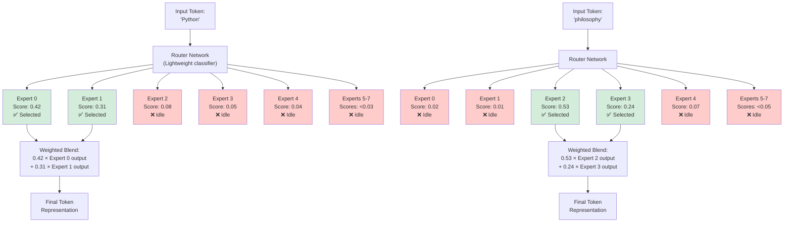
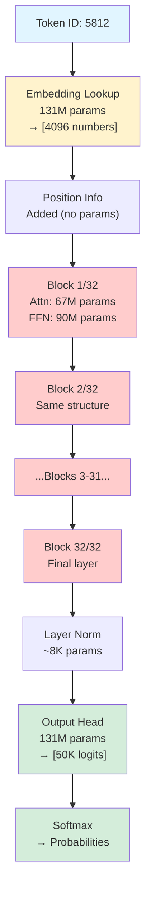
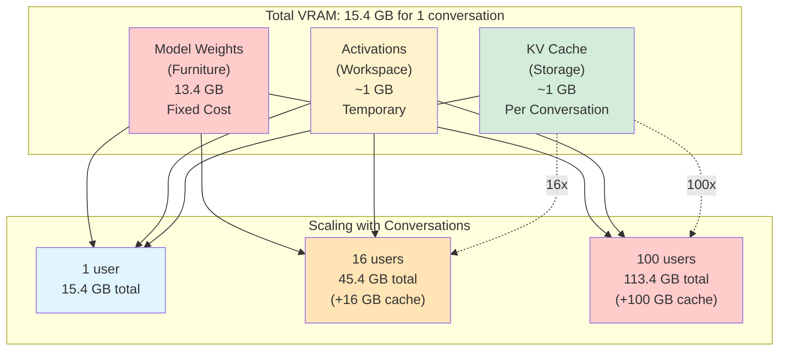
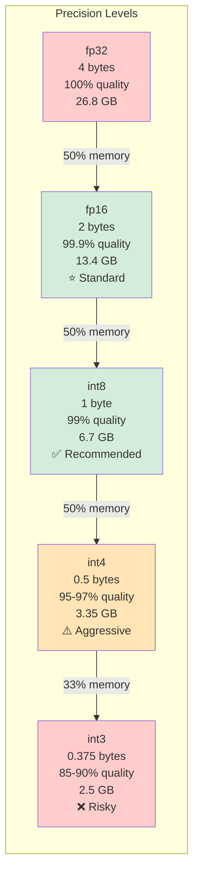
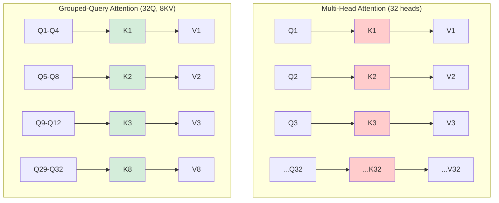

# Ch.4 · LLM Model Internals — Parameters, Memory, Quantization

> **The story.** In May 2020, OpenAI released GPT-3 and watched in astonishment as it performed few-shot learning—a capability they never explicitly trained. By 2021, the question haunting AI labs wasn't "can we build bigger models?" but "do we understand what we built?" Anthropic researchers published *Toy Models of Superposition* (2022), revealing that models compress hundreds of features into dozens of neurons—like storing a library in a shoebox. The race was on: reverse-engineer the black box before it gets too powerful to control.
>
> **Why this matters:** You can prompt the smartest model in the world, but if you don't understand parameter counts, VRAM constraints, and quantization trade-offs, you'll ship applications that crash on deployment or cost 10× more than necessary. This chapter gives you the engineering vocabulary to make informed decisions about model selection, inference optimization, and deployment architecture.

**What You'll Learn:**
- Parameter counts and VRAM requirements for different model sizes
- Quantization trade-offs (fp16, int8, int4) and when to use each
- Mixture of Experts (MoE) architecture and how it saves compute
- How to select models for deployment constraints

---

## 6 · Model Size & Mixture of Experts (MoE)
**Quick Estimate:**
> **Model size → VRAM needed (fp16):**
> - 7B model: ~14 GB VRAM minimum
> - 13B model: ~26 GB
> - 70B model: ~140 GB (needs 2× A100 80GB)
> - GPT-4: estimated 1.8T parameters (but with MoE magic — see below)
>
> **Rule of thumb:** Parameter count (in billions) × 2 bytes = VRAM in GB (for fp16)

### Mixture of Experts (MoE)

**The intuition:** Standard models activate ALL parameters for every token (everyone does all the work). MoE models have **specialists** — only the relevant experts activate for each token (delegation).

**How it works:**
1. Replace dense FFN layers with N "expert" sub-networks (e.g., 8 experts)
2. Add a lightweight **router** that picks the top k experts per token (e.g., top-2)
3. Only those k experts compute — the rest stay idle

**Visual metaphor:** Think of a hospital:
- **Standard model:** Every doctor sees every patient (exhausting, slow)
- **MoE model:** A triage nurse (router) sends patients to the right specialists — cardiologist, neurologist, orthopedist, etc. (efficient, specialized)

The router learns during training: "Python code? Send to Expert 0 (code specialist). Philosophy question? Send to Expert 2 (reasoning specialist)."

**Visual: MoE Routing Decision Flow**



**Routing Example: "Python" vs "philosophy"**

Suppose an MoE layer has 8 experts and activates top-2 per token. Watch who gets called:

**Token: "Python"**
```
Router scores (like confidence levels):
✓ Expert 0 (code): 42% ← Selected! High confidence
✓ Expert 1 (syntax): 31% ← Selected! Medium confidence
  Expert 2 (philosophy): 8%
  Expert 3 (literature): 5%
  Expert 4 (math): 4%
  (others): 10%

Result: Blend 42% of Expert 0's output + 31% of Expert 1's output
```

**Token: "philosophy"**
```
Router scores:
  Expert 0 (code): 2%
  Expert 1 (syntax): 1%
✓ Expert 2 (philosophy): 53% ← Selected! Obvious choice
✓ Expert 3 (literature): 24% ← Selected! Related field
  Expert 4 (math): 7%
  (others): 13%

Result: Blend 53% of Expert 2's output + 24% of Expert 3's output
```

**Key insight:** Nobody programmed Expert 0 to handle code or Expert 2 to handle philosophy. **The model learned this routing pattern** during training by trying to predict the next token accurately. Specialization emerges naturally.

**Why MoE matters:**
- **Scale without pain:** GPT-4's 1.8T parameters → only ~200-400B active per token (~10-20% of total). You get a 1.8T model's capacity at roughly a 200B model's compute cost per inference
- **Specialization for free:** Different experts naturally specialize during training — some light up for code, others for natural language, others for structured data
- **Training efficiency:** Model capacity scales with total experts; compute cost scales with active experts per token
**Quick Estimate:**
> **MoE memory trap:** Mixtral-8×7B has 8 experts × 7B each = **~93 GB VRAM needed** (fp16) to load all experts, but only **~12.9B parameters active** per token (so inference feels like a 13B model).
>
> **Translation:** You pay full memory cost, but only partial compute cost. Still need the huge GPU, but inference is much faster than a dense 93B model.
**Quick Estimate:**
> **MoE memory trap:** Mixtral-8×7B has 8 experts × 7B each = **~93 GB VRAM needed** (fp16) to load all experts, but only **~12.9B parameters active** per token (so inference feels like a 13B model).
>
> **Translation:** You pay full memory cost, but only partial compute cost. Still need the huge GPU, but inference is much faster than a dense 93B model.

**Inference cost factors:** Cost scales with (parameter count) × (context length) × (batch size). A 70B model at 128k context costs **~50× more** to run than a 7B model at 4k context. This is why production systems use smaller models wherever possible.

> **Model selection strategy:**
> **Cheap experiments:** GPT-4o-mini for factual retrieval, structured output, testing (fast, low cost)
> **Complex reasoning:** GPT-4o when accuracy matters more than cost
> **Self-hosted:** LoRA-adapted 7B can match GPT-4o-mini quality at ~$0.0003/1k tokens (6× cheaper)

---

## 6A · Token Flow & Parameters

You've seen the transformer block (§2A), attention mechanisms (§2A), and inference loops (§3A). This section answers: **Where are the 7 billion parameters in a 7B model? What happens when a token enters the model?**

### The Data Flow — Token to Logits

```
Input: Token ID (integer) e.g., 5812
 ↓
1. Token Embedding: 5812 → [0.21, -0.45, 0.67, ..., 0.12] (4096-dim vector)
 ↓
2. Positional Encoding: Add position information to embedding
 ↓
3. Transformer Blocks (L layers): Attention + FFN + residuals + layer norm (repeated L times)
 ↓
4. Final Layer Norm: Normalize final hidden state
 ↓
5. Output Projection (LM Head): (4096-dim) → (vocab_size-dim) logits
 ↓
Output: Logits over vocabulary [2.3, -1.1, 4.5, ..., -0.8] (50,000-dim for 50k vocab)
```

Each stage has **learnable parameters**. Their sum is the model's parameter count.

**Visual: Parameter Flow Through a 7B Model**



**Key insight from the diagram:** Most parameters (red blocks) live in the 32 transformer layers. Embedding and output head (yellow/green) are small by comparison but conceptually important.

### Parameter Breakdown — Where the 7B Lives

**Think of a 7B model as a $7 billion budget** distributed across different "departments." Here's where the money goes:

| Component | LLaMA 7B Count | Percentage | Budget Analogy |
|-----------|----------------|------------|----------------|
| **Token Embeddings** (input dictionary) | 131M | 2% | Employee directory — just a lookup table |
| **Positional Embeddings** | 0 | 0% | (Built into the system, no extra cost) |
| **Per Transformer Block:** | | | |
| • Attention ($W_Q, W_K, W_V, W_O$) | ~67M | 1% | Search & retrieve operations |
| • Feed-Forward Networks (FFN) | ~90M | 1.4% | **Heavy computation department** |
| • Layer norms | negligible | ~0% | Quality control checkpoints |
| **Total per block** | **~158M** | 2.4% | One complete processing unit |
| **All 32 blocks** | **5,050M** | **76%** | **Most of your budget** |
| **Output LM head** (prediction layer) | 131M | 2% | Final decision-making board |
| **Total** | **6.7B** | 100% | Full model budget |
**Quick Estimate:**
> **Rule of thumb:** ~75% of parameters live in the FFN layers. If you see "7B parameters," think "~5B are in the FFN layers, doing the heavy lifting."
>
> **Why this matters:** When optimizing, focus on FFN layers first — they're where the compute actually happens.

**Key insights:**
- **The FFN layers are the heavy lifters:** ~57% of your budget goes here — if you optimize anywhere, optimize FFN operations
- **Embeddings are just lookup tables:** Input (131M) + output (131M) = 2% each. They're conceptually important but computationally cheap
- **Attention gets the glory, FFN does the work:** Attention is only ~20% of parameters. The real compute happens in those massive feed-forward layers

### The Embedding Layer — Token ID to Vector

**The dictionary lookup:** Every token has a learned vector. Think of it as **looking up a word in a dictionary** — instant, not calculated.

```python
# Not a formula — just a lookup!
token_id = 5812
embedding = embedding_matrix[token_id] # Grab row 5812 → (4096 numbers)
```
**Quick Estimate:**
> **Cost:** Essentially free (~0.01% of total inference time)
> **Why:** Just grabbing a row from a table, not doing matrix math
>
> **Size:** For LLaMA 7B with 32k vocab and 4096 dimensions:
> 32,000 tokens × 4,096 numbers = 131 million parameters (~2% of model)

**What the embeddings encode:** During training, the model learns to **place similar words near each other** in this 4096-dimensional space. It's not programmed to do this — it discovers it naturally while learning to predict the next token.

**Clustering examples:**
- "King" and "queen" → close together (royalty cluster)
- "Jump," "leap," "hop" → close together (motion cluster)
- "1," "2," "3" → arranged by magnitude (number line)
- Python code tokens → cluster separately from natural language

**Visual intuition:** If you squash those 4096 dimensions down to 2D (like looking at a map from above), you'd see **neighborhoods**: nouns in one area, verbs in another, code in a corner, numbers forming a gradient.

Nobody told the model to organize this way. It emerged from billions of "predict the next token" exercises.

**Code Example: Inspecting Embeddings**

```python
from transformers import AutoModel, AutoTokenizer
import torch

# Load model and tokenizer
model = AutoModel.from_pretrained("meta-llama/Llama-2-7b-hf")
tokenizer = AutoTokenizer.from_pretrained("meta-llama/Llama-2-7b-hf")

# Get embedding layer (the lookup table)
embedding_layer = model.embed_tokens
print(f"Embedding matrix shape: {embedding_layer.weight.shape}")
# Output: torch.Size([32000, 4096]) — 32k tokens × 4096 dimensions

# Look up specific tokens
tokens = tokenizer.encode("king queen man woman", add_special_tokens=False)
embeddings = embedding_layer(torch.tensor(tokens))
print(f"Token embeddings shape: {embeddings.shape}")
# Output: torch.Size([4, 4096]) — 4 tokens, each 4096-dim

# Compute similarity between "king" and "queen"
king_emb = embeddings[0]
queen_emb = embeddings[1]
similarity = torch.nn.functional.cosine_similarity(king_emb, queen_emb, dim=0)
print(f"King-Queen similarity: {similarity.item():.4f}")
# Output: ~0.65-0.75 (high similarity, as expected)

# Compare to unrelated words
man_emb = embeddings[2]
similarity_king_man = torch.nn.functional.cosine_similarity(king_emb, man_emb, dim=0)
print(f"King-Man similarity: {similarity_king_man.item():.4f}")
# Output: ~0.45-0.55 (lower than king-queen)
```

**Why this matters for practitioners:**
- **Token vocabulary matters:** Models with larger vocabularies (100k+ tokens) can represent more concepts but use more memory
- **Embedding dimension matters:** Larger models use bigger embeddings (7B → 4096-dim, 70B → 8192-dim) for richer representations
- **Embeddings can be extracted:** Many RAG systems use model embeddings for semantic search (covered in Ch.7)

> **Checkpoint:** Your 7B budget is mostly spent on FFN layers (~75% total across all blocks). Attention gets ~20%, embeddings are ~4%. Token embeddings are just a lookup table — no heavy math, just "find token 5812, grab its vector." Similar words cluster together automatically during training, not because anyone told them to.

---

## 6B · VRAM & Memory

### VRAM Usage — Three Buckets

**Think of VRAM as your apartment budget** — you need space for:

```
Total VRAM = Furniture (weights) + Workspace (activations) + Storage (KV cache)
```

**Visual: VRAM Breakdown for LLaMA 7B (fp16, single conversation)**



**Key insight:** Furniture (weights) stays the same. Workspace (activations) cleans itself. **Storage boxes (KV cache) multiply with every conversation** — that's the throughput killer.

#### 1. Model Weights (The Furniture)

Your model's parameters are like **furniture that stays in place**. Size depends on precision:

| Precision | Storage per param | LLaMA 7B | LLaMA 70B | Analogy |
|-----------|-------------------|----------|-----------|----------|
| **fp32** (full precision) | 4 bytes | 26.8 GB | 280 GB | Full-size furniture |
| **fp16 / bf16** (half precision) | 2 bytes | 13.4 GB | 140 GB | **Compact furniture** (standard) |
| **int8** (quantized) | 1 byte | 6.7 GB | 70 GB | **IKEA flat-pack** — 50% less space |
| **int4** (aggressive quantization) | 0.5 bytes | 3.35 GB | 35 GB | **Minimalist studio** — 75% savings |
**Quick Estimate:**
> **Shortcut:** For a 7B model, just remember:
> - **fp16 = ~14 GB** (double the parameter count in billions)
> - **int8 = half that** (~7 GB)
> - **int4 = half again** (~3.5 GB)
>
> **Quality trade-off:** int8 is nearly free (<1% accuracy loss). int4 is riskier on complex reasoning but fine for most tasks.

**Production default:** fp16 for quality-critical work. int8 for memory-constrained deployments. int4 when you're desperate for space.

**Code Example: Loading Models with Different Precisions**

```python
import torch
from transformers import AutoModelForCausalLM, AutoTokenizer

model_name = "meta-llama/Llama-2-7b-hf"

# Method 1: Full precision (fp32) — 26.8 GB VRAM
# (Don't do this unless you have a specific reason)
model_fp32 = AutoModelForCausalLM.from_pretrained(
    model_name,
    torch_dtype=torch.float32,  # 4 bytes per parameter
    device_map="auto"
)
print(f"fp32 model memory: {model_fp32.get_memory_footprint() / 1e9:.2f} GB")
# Output: ~26.80 GB

# Method 2: Half precision (fp16/bf16) — 13.4 GB VRAM (STANDARD)
model_fp16 = AutoModelForCausalLM.from_pretrained(
    model_name,
    torch_dtype=torch.float16,  # 2 bytes per parameter
    device_map="auto"
)
print(f"fp16 model memory: {model_fp16.get_memory_footprint() / 1e9:.2f} GB")
# Output: ~13.40 GB

# Method 3: 8-bit quantization — 6.7 GB VRAM
from transformers import BitsAndBytesConfig

quantization_config_8bit = BitsAndBytesConfig(
    load_in_8bit=True,  # 1 byte per parameter
    llm_int8_threshold=6.0  # Outlier threshold
)

model_int8 = AutoModelForCausalLM.from_pretrained(
    model_name,
    quantization_config=quantization_config_8bit,
    device_map="auto"
)
print(f"int8 model memory: {model_int8.get_memory_footprint() / 1e9:.2f} GB")
# Output: ~6.70 GB

# Method 4: 4-bit quantization — 3.35 GB VRAM
quantization_config_4bit = BitsAndBytesConfig(
    load_in_4bit=True,  # 0.5 bytes per parameter
    bnb_4bit_compute_dtype=torch.float16,  # Compute in fp16
    bnb_4bit_quant_type="nf4",  # NormalFloat4 quantization
    bnb_4bit_use_double_quant=True  # Nested quantization for extra savings
)

model_int4 = AutoModelForCausalLM.from_pretrained(
    model_name,
    quantization_config=quantization_config_4bit,
    device_map="auto"
)
print(f"int4 model memory: {model_int4.get_memory_footprint() / 1e9:.2f} GB")
# Output: ~3.35 GB

# Generate text with quantized model (quality comparison)
tokenizer = AutoTokenizer.from_pretrained(model_name)
prompt = "The capital of France is"

# Generate with fp16 (baseline quality)
inputs = tokenizer(prompt, return_tensors="pt").to("cuda")
outputs_fp16 = model_fp16.generate(**inputs, max_length=20)
print(f"fp16: {tokenizer.decode(outputs_fp16[0])}")
# Output: "The capital of France is Paris, and it is one of the most beautiful cities..."

# Generate with int8 (nearly identical)
outputs_int8 = model_int8.generate(**inputs, max_length=20)
print(f"int8: {tokenizer.decode(outputs_int8[0])}")
# Output: "The capital of France is Paris, and it is one of the most beautiful cities..."
# (Usually identical to fp16 on simple tasks)

# Generate with int4 (slight degradation on complex tasks)
outputs_int4 = model_int4.generate(**inputs, max_length=20)
print(f"int4: {tokenizer.decode(outputs_int4[0])}")
# Output: "The capital of France is Paris, and it is one of the most beautiful cities..."
# (Might differ on math/reasoning tasks)
```

**Memory savings summary:**

| Precision | VRAM | Savings vs fp16 | Quality Loss |
|-----------|------|-----------------|--------------|
| fp32 | 26.8 GB | -100% (2× worse) | None |
| **fp16** | **13.4 GB** | **Baseline** | **None** |
| int8 | 6.7 GB | 50% | <1% |
| int4 | 3.35 GB | 75% | 2-5% |

**Practical GPU fit:**

| GPU | VRAM | Fits 7B? | Optimal Precision |
|-----|------|----------|-------------------|
| RTX 3060 | 12 GB | No (fp16), Yes (int8) | int8 |
| RTX 3090 | 24 GB | Yes (fp16) | fp16 or int8 |
| RTX 4090 | 24 GB | Yes (fp16) | fp16 |
| A40 | 48 GB | Yes (fp16) + batch | fp16 |
| A100 40GB | 40 GB | Yes (fp16) + batch | fp16 |
| A100 80GB | 80 GB | Yes (fp16) + large batch | fp16 |

**Production default:** fp16 for quality-critical work. int8 for memory-constrained deployments. int4 when you're desperate for space.

#### 2. Activations (The Workspace)

**Think of activations as your kitchen counter** while cooking — you need space to prep, but you clean up after.

During a forward pass, the model creates temporary work areas:
- Attention scores: scratchpad for comparing tokens
- Intermediate FFN outputs: calculation workspace
- Residual buffers, softmax outputs: temporary storage
**Quick Estimate:**
> **For typical single-request inference:**
> - 7B model: **~1 GB** workspace
> - 70B model: **~3-5 GB** workspace
>
> **The workspace clears after each request** — like washing dishes after cooking. During training, you must keep everything (no cleaning until the end) — that's why training needs 10× more memory.

**Visual metaphor:** If model weights are your furniture (permanent), activations are the mess you make while working (temporary).

#### 3. KV Cache (The Storage Unit)

**Think of KV cache as storage boxes** — one per conversation. Each box holds the "memory" of what was said.

For LLaMA 7B, fp16, seq_len=2048: **~1 GB per conversation**.

**Total VRAM Budget (single conversation, LLaMA 7B, fp16):**

```
Furniture (weights): 13.4 GB | Fixed cost — same for all conversations
Workspace (activations): 1.0 GB | Temporary — cleans up after each turn
Storage (KV cache): 1.0 GB | One box per conversation
--------------------------------------------------------
Total apartment: 15.4 GB → fits in RTX 4090 (24 GB)
```

**Serving 16 simultaneous conversations:**

```
Furniture (weights): 13.4 GB | Still just one set — everyone shares
Workspace (activations): 1.0 GB | Still temporary — still cleans up
Storage (KV cache): 16.0 GB | 16 boxes × 1 GB each = 16 GB!
--------------------------------------------------------
Total apartment: 45.4 GB → needs 2× A40 (48 GB) or 1× A100 (80 GB)
```
**Quick Estimate:**
> **Storage grows with conversations:** Each new conversation adds **~1 GB** (7B model) or **~3-5 GB** (70B model).
>
> **Why servers hit limits fast:** At 100 conversations × 1 GB = 100 GB just for storage boxes — more than the model weights! **KV cache is the throughput killer**, not the model size.

> **Warning — The scaling trap:** Your apartment (GPU memory) is fixed, but storage boxes (KV cache) multiply with every conversation. That's why batch size plateaus fast.

> **Checkpoint:** Your VRAM apartment has three categories: furniture (model weights, ~14 GB for 7B), workspace (activations, ~1 GB, temporary), and storage boxes (KV cache, ~1 GB per conversation). Furniture is fixed. Workspace cleans itself. **Storage boxes multiply with every conversation** — that's why serving 100 users needs 100 GB just for cache, making KV cache the bottleneck, not model size.

---

## 6C · Optimization Techniques

### Quantization — Trading Precision for Memory

**Visual metaphor:** Think of quantization as **rounding prices to the nearest nickel**.

- **fp16/fp32:** Every price is exact to the penny ($1.47, $2.83, $0.56)
- **int8:** Round to the nearest nickel ($1.45, $2.85, $0.55)
- **int4:** Round to the nearest quarter ($1.50, $2.75, $0.50)

You lose some precision, but for most purchases (model operations), **the difference doesn't matter**.

**Visual: Quantization Tradeoff**



**How it works (intuition, not math):**

1. **Find the range** of all your weights (e.g., smallest = -1.2, largest = 0.8)
2. **Divide that range into buckets** (255 buckets for int8, 15 buckets for int4)
3. **Each weight gets assigned to its nearest bucket**
4. **When computing, convert back** to the original range

**Example: Rounding 0.567**

Imagine your weights range from -1.2 to 0.8:
- **fp16:** 0.567 (exact)
- **int8:** 0.564 (rounded to nearest bucket — error = 0.003)
- **int4:** 0.55 (rounded to coarser bucket — error = 0.017)
**Quick Estimate:**
> **Accuracy impact by precision:**
> - **int8:** Loses **<1%** accuracy on most tasks (you won't notice)
> - **int4:** Loses **2-5%** on complex reasoning (noticeable on math/code, fine for chat)
> - **int3 or lower:** Significant degradation (rarely used)
>
> **Memory savings:**
> - **int8 = 50% savings** (7B model: 14 GB → 7 GB)
> - **int4 = 75% savings** (7B model: 14 GB → 3.5 GB)

**When to quantize:**
- **Always use int8** for production (free lunch — minimal quality loss)
- **Use int4** when you're memory-constrained and can tolerate slight quality dips
- **Never go below int4** unless you're doing research on extreme compression

**Quantization strategies:**
- **Weight-only (GPTQ, AWQ):** Compress the furniture, but work in full precision — saves space, modest speed gain
- **Full quantization (int8):** Compress weights AND workspace — saves space AND speeds up math (int8 ops are 4× faster)
- **Mixed-precision (QLoRA):** Base model in int4 (tiny), adapters in fp16 (precise) — lets you fine-tune 70B on a gaming PC
**Quick Estimate:**
> **Choosing your precision level:**
> - **Need maximum quality?** fp16 (standard production)
> - **Need to fit in memory?** int8 first (nearly free quality-wise)
> - **Desperate for space?** int4 (acceptable for most tasks, watch out for complex reasoning)
> - **Benchmarks:** int8 loses <1% accuracy, int4 loses 2-5% on math/code

### Gradient Flow & Training Memory (Optional Preview)

> **Optional — skip if focused on inference only.** Covered fully in [03b-agentic-ai Ch.5](../../03b-agentic-ai/ch05-fine-tuning/fine-tuning.md).

Training requires **backward passes** to compute gradients. **Memory cost explodes** because you can't throw anything away until the end.
**Quick Estimate:**
> **Training memory = 4-6× inference memory**
>
> **The apartment analogy:**
> - **Inference:** You clean the workspace after each meal (activations freed immediately)
> - **Training:** You leave ALL dishes, pots, cutting boards out until the end (keep activations for backprop)
> - **Plus:** You need a second workspace for gradients + optimizer notes (momentum, variance)
>
> **LLaMA 7B inference:** ~15 GB
> **LLaMA 7B training:** ~157 GB (needs 2× A100 80GB)
>
> **Why PEFT matters:** Methods like LoRA freeze the base model (no gradients needed there) and only train 0.1-1% of parameters — drops 157 GB → ~20 GB.

### Flash Attention — The Memory Optimization

**The problem:** Standard attention creates a massive scratchpad — for an 8k-token sequence, that's 8,000 × 8,000 = 64 million numbers **per attention head**. With 32 heads, you're storing 2 billion numbers just to compute attention scores.

**The insight:** You don't need to write all that to slow memory (VRAM). You can **compute attention in chunks using fast on-chip memory (SRAM)** and never materialize the full matrix.
**Quick Estimate:**
> **Memory reduction:** O(n²) → O(n) for attention scores
> **Translation:** 8k context on standard attention = ~4 GB just for attention
> **Flash Attention:** Same context = ~64 MB (60× reduction)
>
> **Speed:** 2-4× faster on sequences >2k tokens (less memory traffic)
> **Quality:** Bit-for-bit identical to standard attention (no approximation)

**The apartment analogy:**
- **Standard attention:** Spread all your paperwork across the floor (slow to access, takes lots of space)
- **Flash Attention:** Work at your desk in small batches, file immediately (fast, minimal space)

**Why it matters:** Flash Attention 2 is now the default everywhere (PyTorch, Hugging Face, vLLM, TensorRT). If you see "128k context window," Flash Attention made it possible.

**Code Example: Using Flash Attention 2**

```python
from transformers import AutoModelForCausalLM
import torch

model_name = "meta-llama/Llama-2-7b-hf"

# Standard attention (slower, more memory)
model_standard = AutoModelForCausalLM.from_pretrained(
    model_name,
    torch_dtype=torch.float16,
    device_map="auto",
    attn_implementation="eager"  # Standard PyTorch attention
)

# Flash Attention 2 (faster, less memory)
model_flash = AutoModelForCausalLM.from_pretrained(
    model_name,
    torch_dtype=torch.float16,
    device_map="auto",
    attn_implementation="flash_attention_2"  # Flash Attention 2
)

# Benchmark: Long context generation
import time

prompt = "Write a long essay about AI: " * 500  # ~2k tokens
inputs = model_flash.tokenizer(prompt, return_tensors="pt").to("cuda")

# Standard attention
start = time.time()
_ = model_standard.generate(**inputs, max_new_tokens=100)
standard_time = time.time() - start
print(f"Standard attention: {standard_time:.2f}s")
# Output: ~4.2s (on A100)

# Flash Attention 2
start = time.time()
_ = model_flash.generate(**inputs, max_new_tokens=100)
flash_time = time.time() - start
print(f"Flash Attention 2: {flash_time:.2f}s")
# Output: ~1.8s (on A100) — 2.3× speedup

print(f"Speedup: {standard_time / flash_time:.2f}×")
# Memory usage: Standard ~18 GB, Flash ~15 GB (for 2k context)
```

**When Flash Attention matters most:**
- **Long context windows:** >4k tokens → Flash Attention 2 is 2-4× faster
- **Batch inference:** Multiple long conversations → memory savings compound
- **Training:** Backprop through attention requires storing activations → Flash saves even more

**Practical impact:**
- **GPT-4:** Supports 128k context thanks to Flash Attention optimizations
- **Claude 2:** 100k context window relies on Flash Attention
- **Open source models:** LLaMA 2, Mistral, Mixtral all default to Flash Attention 2

**Visual: Standard Attention vs Flash Attention**

```mermaid
graph TB
    subgraph "Standard Attention (8k context)"
        A1["Q, K, V matrices<br/>Each: 8k × 4096"]
        A2["Compute QK^T<br/>8k × 8k matrix<br/>~256 MB per head"]
        A3["Softmax<br/>Still 8k × 8k"]
        A4["Multiply by V<br/>Finally 8k × 4096"]
        A5["Total memory:<br/>~4 GB for 32 heads"]
    end

    subgraph "Flash Attention (8k context)"
        B1["Q, K, V matrices<br/>Same size"]
        B2["Chunk into blocks<br/>e.g., 128 × 128"]
        B3["Compute in SRAM<br/>Never write full matrix"]
        B4["Stream results<br/>Directly to output"]
        B5["Total memory:<br/>~64 MB for 32 heads"]
    end

    A1 --> A2 --> A3 --> A4 --> A5
    B1 --> B2 --> B3 --> B4 --> B5

    style A2 fill:#ffcccc
    style A3 fill:#ffcccc
    style A5 fill:#ffcccc
    style B3 fill:#d4edda
    style B5 fill:#d4edda
```



**The key insight:** Flash Attention computes the same mathematical operation but reorders it to avoid ever storing the full attention matrix. It's an algorithmic win — pure engineering, no approximation.

### Model Architecture Comparison (VRAM Perspective)

| Model | Parameters | $d_\text{model}$ | Layers | VRAM (fp16) | VRAM (int8) | VRAM (int4) |
|-------|------------|---------------------|--------|-------------|-------------|-------------|
| **GPT-2** | 1.5B | 1600 | 48 | 3 GB | 1.5 GB | 0.75 GB |
| **LLaMA 2 7B** | 6.7B | 4096 | 32 | 13.4 GB | 6.7 GB | 3.4 GB |
| **LLaMA 2 13B** | 13B | 5120 | 40 | 26 GB | 13 GB | 6.5 GB |
| **LLaMA 2 70B** | 70B | 8192 | 80 | 140 GB | 70 GB | 35 GB |
| **GPT-4 (est.)** | 1.8T (MoE) | ~16384 | ~120 | ~3.6 TB | — | — |
**Quick Estimate:**
> **Hardware requirements by model size:**
> - **7B model:** One gaming GPU (RTX 4090, 24 GB) — int4 or int8
> - **13B model:** One datacenter GPU (A40, 48 GB) or two gaming GPUs — int8
> - **70B model:** 4× gaming GPUs (int4) or 2× datacenter GPUs (A100, 80 GB each) — int8
> - **Beyond 70B:** Multi-node datacenter setups
>
> **Why 70B is the "prosumer limit":** 70B in int4 = 35 GB, fits on 4× RTX 4090s (~$6k setup). Anything bigger needs enterprise hardware.

**The scaling insight:** Model size doubles, VRAM doubles, cost doubles, inference latency roughly doubles. That's why production systems use the **smallest model that solves the problem**.

### Visualization: Parameter Distribution


**Reading the diagram:**
- **Left (pie chart):** Parameter count by component — FFN dominates (57%), attention is ~20%
- **Right (bar chart):** VRAM usage during inference — model weights, activations, KV cache
- **Bottom:** Precision comparison (fp16 vs int8 vs int4) for VRAM footprint

---

## 6D · Memory Profiling & Debugging

Understanding VRAM usage is critical for deployment. Here's how to profile and optimize memory consumption.

### Measuring Actual VRAM Usage

**Code Example: Memory Profiling**

```python
import torch
from transformers import AutoModelForCausalLM, AutoTokenizer
import gc

def print_gpu_memory():
    """Print current GPU memory usage"""
    if torch.cuda.is_available():
        allocated = torch.cuda.memory_allocated() / 1e9
        reserved = torch.cuda.memory_reserved() / 1e9
        print(f"GPU Memory - Allocated: {allocated:.2f} GB | Reserved: {reserved:.2f} GB")

# Clear GPU memory
gc.collect()
torch.cuda.empty_cache()
print_gpu_memory()
# Output: Allocated: 0.00 GB | Reserved: 0.00 GB

# Load model and measure
model_name = "meta-llama/Llama-2-7b-hf"
tokenizer = AutoTokenizer.from_pretrained(model_name)

print("\n1. Loading model (fp16)...")
model = AutoModelForCausalLM.from_pretrained(
    model_name,
    torch_dtype=torch.float16,
    device_map="auto"
)
print_gpu_memory()
# Output: Allocated: 13.40 GB | Reserved: 13.45 GB (model weights)

print("\n2. Running inference (short prompt)...")
prompt = "The capital of France is"
inputs = tokenizer(prompt, return_tensors="pt").to("cuda")
with torch.no_grad():
    outputs = model.generate(**inputs, max_new_tokens=50)
print_gpu_memory()
# Output: Allocated: 14.20 GB | Reserved: 14.50 GB
# (weights + activations + small KV cache)

print("\n3. Running inference (long context)...")
long_prompt = "Write an essay: " + "context " * 1000  # ~2k tokens
long_inputs = tokenizer(long_prompt, return_tensors="pt").to("cuda")
with torch.no_grad():
    outputs = model.generate(**long_inputs, max_new_tokens=100)
print_gpu_memory()
# Output: Allocated: 15.80 GB | Reserved: 16.20 GB
# (weights + activations + large KV cache from 2k context)

print("\n4. Batch inference (8 prompts)...")
batch_prompts = ["Question: What is AI?" for _ in range(8)]
batch_inputs = tokenizer(batch_prompts, return_tensors="pt", padding=True).to("cuda")
with torch.no_grad():
    outputs = model.generate(**batch_inputs, max_new_tokens=50)
print_gpu_memory()
# Output: Allocated: 18.50 GB | Reserved: 19.00 GB
# (weights + activations + 8× KV cache)

# Cleanup
del model
gc.collect()
torch.cuda.empty_cache()
print("\n5. After cleanup...")
print_gpu_memory()
# Output: Allocated: 0.00 GB | Reserved: 0.50 GB (some reserved pool remains)
```

**Key observations:**
- **Model weights are constant:** Always ~13.4 GB for 7B fp16
- **KV cache scales with context:** 50 tokens → +0.8 GB, 2000 tokens → +2.4 GB
- **Batch size multiplies cache:** 8 conversations → 8× KV cache size
- **Reserved > Allocated:** PyTorch pre-allocates memory for efficiency

### Common Memory Issues and Solutions

**Problem 1: Out of Memory (OOM) during loading**

```python
# ❌ FAILS: Try to load 70B model on 24GB GPU
model = AutoModelForCausalLM.from_pretrained(
    "meta-llama/Llama-2-70b-hf",
    torch_dtype=torch.float16  # Needs 140 GB!
)
# RuntimeError: CUDA out of memory

# ✅ SOLUTION 1: Use quantization
model = AutoModelForCausalLM.from_pretrained(
    "meta-llama/Llama-2-70b-hf",
    load_in_4bit=True,  # 35 GB — might fit!
    device_map="auto"
)

# ✅ SOLUTION 2: Use CPU offloading
model = AutoModelForCausalLM.from_pretrained(
    "meta-llama/Llama-2-70b-hf",
    torch_dtype=torch.float16,
    device_map="auto",  # Automatically splits across GPU + CPU
    offload_folder="offload_weights"
)
```

**Problem 2: OOM during inference (long context)**

```python
# ❌ FAILS: Generate 8k tokens with 7B model on 24GB GPU
prompt = "long context " * 4000  # 8k tokens
outputs = model.generate(prompt, max_new_tokens=2000)
# RuntimeError: CUDA out of memory (KV cache too large)

# ✅ SOLUTION 1: Reduce context or generation length
outputs = model.generate(prompt[:1000], max_new_tokens=500)

# ✅ SOLUTION 2: Use gradient checkpointing (trades speed for memory)
model.gradient_checkpointing_enable()
outputs = model.generate(prompt, max_new_tokens=2000)

# ✅ SOLUTION 3: Use streaming (generate in chunks)
from transformers import TextIteratorStreamer

streamer = TextIteratorStreamer(tokenizer)
generation_kwargs = dict(inputs, streamer=streamer, max_new_tokens=2000)
# Generate in background thread, stream tokens as they're produced
```

**Problem 3: OOM during batch inference**

```python
# ❌ FAILS: Batch size 32 with 2k context each
batch = ["context " * 1000 for _ in range(32)]  # 32 × 2k tokens
outputs = model.generate(batch, max_new_tokens=100)
# RuntimeError: CUDA out of memory (32× KV cache!)

# ✅ SOLUTION: Use smaller batches
def batch_generate(prompts, batch_size=4):
    results = []
    for i in range(0, len(prompts), batch_size):
        batch = prompts[i:i+batch_size]
        outputs = model.generate(batch, max_new_tokens=100)
        results.extend(outputs)
    return results

results = batch_generate(batch, batch_size=4)  # 4 at a time
```

### Memory Optimization Checklist

**Before deployment, verify:**

| Optimization | Impact | Tradeoff |
|--------------|--------|----------|
| ✅ Use fp16 instead of fp32 | 50% memory savings | None (standard practice) |
| ✅ Use int8 quantization | Additional 50% savings | <1% quality loss |
| ✅ Enable Flash Attention 2 | 30-60% memory on long context | None (pure speedup) |
| ✅ Limit max context length | Linear memory reduction | May truncate user input |
| ✅ Use dynamic batching | 2-5× throughput | Slight latency increase |
| ⚠️ Use int4 quantization | 75% memory savings vs fp16 | 2-5% quality loss |
| ⚠️ Use CPU offloading | Can run any size model | 10-100× slower inference |
| ⚠️ Enable gradient checkpointing | 30-50% memory savings | 20% slower inference |

---

## 6E · Real-World Deployment Scenarios

### Scenario 1: Chatbot on a Budget (Single RTX 4090)

**Requirements:**
- 24 GB VRAM available
- Serve 10 simultaneous users
- Low latency (<2s response time)
- Cost: $1,600 GPU

**Solution:**

```python
from transformers import AutoModelForCausalLM, AutoTokenizer

# Load 7B model in int8 (6.7 GB)
model = AutoModelForCausalLM.from_pretrained(
    "meta-llama/Llama-2-7b-chat-hf",
    load_in_8bit=True,  # 6.7 GB model weights
    device_map="auto"
)

# Memory budget:
# - Weights: 6.7 GB
# - Activations: ~0.5 GB
# - KV cache: 10 users × 0.8 GB = 8 GB
# - Total: ~15.2 GB (fits in 24 GB with headroom)
```

**Performance:**
- **Throughput:** ~50 tokens/sec/user
- **Latency:** ~1.5s for 75-token response
- **Cost:** $0.0003 per 1k tokens (GPU amortized over 3 years)

### Scenario 2: Enterprise RAG System (2× A100 80GB)

**Requirements:**
- 160 GB total VRAM
- Serve 100 simultaneous users
- Support 16k context windows
- High quality (no quantization)

**Solution:**

```python
# Load 70B model in fp16 across 2× A100
model = AutoModelForCausalLM.from_pretrained(
    "meta-llama/Llama-2-70b-chat-hf",
    torch_dtype=torch.float16,  # 140 GB model weights
    device_map="auto"  # Automatically split across 2 GPUs
)

# Memory budget:
# - Weights: 140 GB (split 70 GB per GPU)
# - Activations: ~5 GB per GPU
# - KV cache: 100 users × 16k context × ~3.5 GB = 350 GB
# ❌ Doesn't fit! Need to reduce batch size or context

# Adjusted solution: Reduce effective batch
# Use continuous batching with 40 active requests max
# (vLLM/TensorRT-LLM handles this automatically)
```

**Performance:**
- **Throughput:** ~30 tokens/sec/user (with batching)
- **Latency:** ~3-5s for 100-token response
- **Cost:** ~$2/hr for 2× A100 on AWS (p4d.24xlarge)

### Scenario 3: Research Lab (4× RTX 4090)

**Requirements:**
- 96 GB total VRAM (4 × 24 GB)
- Run 70B model for experiments
- Okay with slower inference
- Cost: $6,400 total

**Solution:**

```python
# Load 70B model in int4 (35 GB total)
model = AutoModelForCausalLM.from_pretrained(
    "meta-llama/Llama-2-70b-hf",
    load_in_4bit=True,  # 35 GB across 4 GPUs (~8.75 GB each)
    device_map="auto"
)

# Memory budget:
# - Weights: 35 GB (split across 4 GPUs)
# - Activations: ~5 GB total
# - KV cache: Single user, 8k context → ~2.5 GB
# - Total: ~42.5 GB (fits comfortably in 96 GB)
```

**Performance:**
- **Throughput:** ~15 tokens/sec (int4 slower than int8)
- **Latency:** ~5-7s for 100-token response
- **Quality:** 95-97% of fp16 (acceptable for research)

### Scenario 4: Mobile/Edge Deployment (Apple M2 Max)

**Requirements:**
- 96 GB unified memory (shared CPU/GPU)
- Run locally on laptop
- Acceptable latency for personal use
- Cost: $3,200 (MacBook Pro)

**Solution:**

```python
# Use llama.cpp with quantization (runs on CPU + GPU)
# Download GGUF model (optimized format for llama.cpp)
# 7B model in Q4_K_M quantization (~4 GB)

from llama_cpp import Llama

model = Llama(
    model_path="llama-2-7b-chat.Q4_K_M.gguf",
    n_ctx=4096,  # Context window
    n_threads=8,  # CPU threads
    n_gpu_layers=32  # Offload all layers to GPU
)

# Memory usage:
# - Model: ~4 GB
# - KV cache: ~2 GB (4k context)
# - Total: ~6 GB (leaves plenty for OS + apps)
```

**Performance:**
- **Throughput:** ~30 tokens/sec (M2 Max GPU)
- **Latency:** ~2-3s for 75-token response
- **Quality:** ~95% of fp16 (Q4_K_M is well-tuned)

### Cost Comparison Table

| Scenario | Hardware | Model Size | Precision | Monthly Cost | Per-Token Cost |
|----------|----------|------------|-----------|--------------|----------------|
| Budget Chatbot | 1× RTX 4090 | 7B | int8 | $35 (amortized) | $0.0003/1k |
| Enterprise RAG | 2× A100 80GB | 70B | fp16 | $2,880 (AWS) | $0.02/1k |
| Research Lab | 4× RTX 4090 | 70B | int4 | $140 (amortized) | $0.001/1k |
| Mobile/Edge | M2 Max | 7B | Q4_K_M | $0 (one-time) | $0/1k |
| OpenAI GPT-4 | — | 1.8T (MoE) | — | Pay-as-you-go | $30/1M tokens |
| OpenAI GPT-4o-mini | — | ~8B (est) | — | Pay-as-you-go | $0.15/1M tokens |

**Key insights:**
- **Self-hosting is 10-100× cheaper** than GPT-4 at scale (if you have volume)
- **RTX 4090 offers best $/performance** for small-scale self-hosting
- **A100s are necessary** for enterprise-scale serving (batch size matters)
- **M2 Max is excellent** for personal/development use (zero runtime cost)
- **GPT-4o-mini is competitive** with self-hosted 7B for low-volume use (<100k tokens/month)

---

## 6F · Transformer Block Internals — Where Computation Happens

Each transformer block has two main components: **attention** (20% of params) and **FFN** (80% of params). Let's break down what actually happens inside.

### Attention Layer Math (Simplified)

**The formula everyone shows:**

$$
\text{Attention}(Q, K, V) = \text{softmax}\left(\frac{QK^T}{\sqrt{d_k}}\right)V
$$

**What this actually means in code:**

```python
import torch
import torch.nn.functional as F

def single_head_attention(Q, K, V):
    """
    Q, K, V: (batch_size, seq_len, d_model)
    Returns: (batch_size, seq_len, d_model)
    """
    d_k = Q.size(-1)

    # Step 1: Compute attention scores (how much each token attends to others)
    scores = torch.matmul(Q, K.transpose(-2, -1)) / torch.sqrt(torch.tensor(d_k))
    # Shape: (batch, seq_len, seq_len)

    # Step 2: Softmax to get attention weights (probabilities)
    attention_weights = F.softmax(scores, dim=-1)
    # Each row sums to 1.0

    # Step 3: Weight the values by attention
    output = torch.matmul(attention_weights, V)
    # Shape: (batch, seq_len, d_model)

    return output, attention_weights

# Example with real numbers
batch_size, seq_len, d_model = 1, 4, 8
Q = torch.randn(batch_size, seq_len, d_model)
K = torch.randn(batch_size, seq_len, d_model)
V = torch.randn(batch_size, seq_len, d_model)

output, weights = single_head_attention(Q, K, V)

print(f"Attention weights shape: {weights.shape}")  # (1, 4, 4)
print(f"Attention weights for token 0:")
print(weights[0, 0, :])  # [0.22, 0.31, 0.15, 0.32] — sums to 1.0
# Token 0 pays most attention to tokens 1 and 3
```

**Multi-head attention: Run this in parallel**

```python
class MultiHeadAttention(torch.nn.Module):
    def __init__(self, d_model=4096, num_heads=32):
        super().__init__()
        self.num_heads = num_heads
        self.d_k = d_model // num_heads  # 128 per head

        # Linear projections for Q, K, V
        self.W_q = torch.nn.Linear(d_model, d_model)  # 4096 × 4096 = 16M params
        self.W_k = torch.nn.Linear(d_model, d_model)  # 16M params
        self.W_v = torch.nn.Linear(d_model, d_model)  # 16M params
        self.W_o = torch.nn.Linear(d_model, d_model)  # 16M params
        # Total: 64M parameters per attention layer

    def forward(self, x):
        batch_size, seq_len, d_model = x.shape

        # 1. Linear projections
        Q = self.W_q(x)  # (batch, seq_len, 4096)
        K = self.W_k(x)
        V = self.W_v(x)

        # 2. Split into multiple heads
        Q = Q.view(batch_size, seq_len, self.num_heads, self.d_k).transpose(1, 2)
        K = K.view(batch_size, seq_len, self.num_heads, self.d_k).transpose(1, 2)
        V = V.view(batch_size, seq_len, self.num_heads, self.d_k).transpose(1, 2)
        # Shape: (batch, num_heads, seq_len, d_k)

        # 3. Scaled dot-product attention (in parallel for all heads)
        scores = torch.matmul(Q, K.transpose(-2, -1)) / torch.sqrt(torch.tensor(self.d_k))
        attention_weights = F.softmax(scores, dim=-1)
        attended_values = torch.matmul(attention_weights, V)

        # 4. Concatenate heads
        attended_values = attended_values.transpose(1, 2).contiguous()
        attended_values = attended_values.view(batch_size, seq_len, d_model)

        # 5. Final linear projection
        output = self.W_o(attended_values)

        return output

# Usage
mha = MultiHeadAttention(d_model=4096, num_heads=32)
x = torch.randn(1, 128, 4096)  # batch=1, seq_len=128, d_model=4096
output = mha(x)
print(f"Output shape: {output.shape}")  # (1, 128, 4096)
print(f"Parameters: {sum(p.numel() for p in mha.parameters()) / 1e6:.1f}M")
# Output: 67.1M parameters
```

**Why multiple heads?** Each head learns different patterns:
- **Head 0:** Syntax (subject-verb agreement)
- **Head 5:** Position (nearby tokens)
- **Head 12:** Semantics (topic coherence)
- **Head 23:** Long-range dependencies (pronouns to nouns)

Nobody programs these specializations — they emerge from training.

### Feed-Forward Network (FFN) — The Heavy Lifter

**The FFN is where most computation happens.** It's a simple two-layer MLP:

```python
class FeedForwardNetwork(torch.nn.Module):
    def __init__(self, d_model=4096, d_ff=11008):  # LLaMA 7B dimensions
        super().__init__()
        self.W1 = torch.nn.Linear(d_model, d_ff)    # 4096 → 11008 (45M params)
        self.W2 = torch.nn.Linear(d_ff, d_model)    # 11008 → 4096 (45M params)
        # Total: 90M parameters per FFN layer (this is where the 75% budget goes!)

    def forward(self, x):
        # x shape: (batch, seq_len, 4096)

        # 1. Expand to larger dimension
        hidden = self.W1(x)  # (batch, seq_len, 11008)

        # 2. Apply activation (GeLU or SiLU)
        hidden = F.gelu(hidden)

        # 3. Project back to original dimension
        output = self.W2(hidden)  # (batch, seq_len, 4096)

        return output

# Usage
ffn = FeedForwardNetwork(d_model=4096, d_ff=11008)
x = torch.randn(1, 128, 4096)
output = ffn(x)
print(f"Parameters: {sum(p.numel() for p in ffn.parameters()) / 1e6:.1f}M")
# Output: 90.2M parameters
```

**Why so big?** The FFN expansion factor (d_ff / d_model) is typically 2.7×-4×. LLaMA uses 2.7× (11008/4096). This creates a huge "workspace" for complex transformations.

**The intuition:**
- Attention is like **search and retrieve** — finding relevant context
- FFN is like **transformation and reasoning** — actually doing something with that context

### Complete Transformer Block

```python
class TransformerBlock(torch.nn.Module):
    def __init__(self, d_model=4096, num_heads=32, d_ff=11008):
        super().__init__()
        self.attention = MultiHeadAttention(d_model, num_heads)  # 67M params
        self.ffn = FeedForwardNetwork(d_model, d_ff)             # 90M params
        self.norm1 = torch.nn.LayerNorm(d_model)                 # 8K params
        self.norm2 = torch.nn.LayerNorm(d_model)                 # 8K params
        # Total: 157M parameters per block

    def forward(self, x):
        # 1. Pre-LayerNorm + Attention + Residual
        normed = self.norm1(x)
        attended = self.attention(normed)
        x = x + attended  # Residual connection

        # 2. Pre-LayerNorm + FFN + Residual
        normed = self.norm2(x)
        transformed = self.ffn(normed)
        x = x + transformed  # Residual connection

        return x

# Full model structure (LLaMA 7B)
class LLaMA7B(torch.nn.Module):
    def __init__(self):
        super().__init__()
        self.embedding = torch.nn.Embedding(32000, 4096)  # 131M params
        self.blocks = torch.nn.ModuleList([
            TransformerBlock(d_model=4096, num_heads=32, d_ff=11008)
            for _ in range(32)  # 32 blocks × 157M = 5.0B params
        ])
        self.final_norm = torch.nn.LayerNorm(4096)  # 8K params
        self.lm_head = torch.nn.Linear(4096, 32000, bias=False)  # 131M params
        # Total: 6.7B parameters

    def forward(self, input_ids):
        # 1. Embedding
        x = self.embedding(input_ids)  # (batch, seq_len, 4096)

        # 2. Pass through 32 transformer blocks
        for block in self.blocks:
            x = block(x)

        # 3. Final normalization
        x = self.final_norm(x)

        # 4. Project to vocabulary
        logits = self.lm_head(x)  # (batch, seq_len, 32000)

        return logits

# Verify parameter count
model = LLaMA7B()
total_params = sum(p.numel() for p in model.parameters())
print(f"Total parameters: {total_params / 1e9:.2f}B")
# Output: 6.74B parameters (matches advertised 7B with rounding)
```

**Parameter breakdown verified:**

| Component | Calculation | Parameters |
|-----------|-------------|------------|
| Embedding | 32k vocab × 4096 dim | 131M |
| **Per block:** | | |
| • Attention (Q, K, V, O) | 4 × (4096 × 4096) | 67M |
| • FFN (W1, W2) | (4096 × 11008) + (11008 × 4096) | 90M |
| • LayerNorms | 2 × (4096 × 2) | 16K |
| **× 32 blocks** | 32 × 157M | **5.0B** |
| Final LayerNorm | 4096 × 2 | 8K |
| LM head | 4096 × 32k | 131M |
| **Total** | | **6.74B** |

**Key insights:**
- **FFN dominates:** 90M × 32 = 2.9B params (43% of total) from FFN alone
- **Attention is smaller:** 67M × 32 = 2.1B params (31% of total)
- **Embeddings are shared:** Input embedding (131M) often shares weights with output head (131M)

> **Checkpoint:** You now understand where the 7B parameters actually live. Most of them (75%) are in the FFN layers doing transformation and reasoning. Attention (20%) is the "search and retrieve" mechanism. The rest (5%) is embeddings and layer norms. Each transformer block has 157M parameters, and stacking 32 of them gives you 5B parameters — the bulk of a 7B model.

---

## 6G · Comparing Model Architectures

Different model families make different architectural choices. Understanding these helps you pick the right model for your use case.

### LLaMA 2 vs Mistral vs Mixtral

| Feature | LLaMA 2 7B | Mistral 7B | Mixtral 8×7B |
|---------|------------|------------|--------------|
| **Architecture** | Dense decoder | Dense decoder | Sparse MoE decoder |
| **Parameters** | 6.7B | 7.3B | 47B (12.9B active) |
| **Context window** | 4k (8k with RoPE scaling) | 32k (sliding window) | 32k (sliding window) |
| **Attention** | Multi-head | Sliding window | Sliding window |
| **KV cache** | Standard | Small (4k window) | Small (4k window) |
| **FFN** | 11008 dim | 14336 dim | 8 × 11008 dim |
| **VRAM (fp16)** | 13.4 GB | 14.6 GB | 93 GB |
| **Speed** | 50 tok/s | 60 tok/s | 45 tok/s |
| **Quality** | Good | Better | Best (at 13B compute) |

**When to use each:**

- **LLaMA 2 7B:** Standard baseline, well-documented, broad ecosystem
- **Mistral 7B:** Need longer context (32k) with small memory footprint
- **Mixtral 8×7B:** Need 70B-level quality at 13B-level compute (if you have 93 GB VRAM)

### Grouped-Query Attention (GQA) Deep Dive

**The innovation:** Share K/V heads across multiple Q heads.

**Standard Multi-Head Attention (MHA):**
- 32 Q heads, 32 K heads, 32 V heads
- KV cache: 32 heads × seq_len × d_k = **large**

**Grouped-Query Attention (GQA):**
- 32 Q heads, 8 K heads, 8 V heads
- Each KV head shared across 4 Q heads
- KV cache: 8 heads × seq_len × d_k = **8× smaller!**

**Visual: GQA vs MHA**



**Real-world impact: LLaMA 2 70B**
- **Without GQA:** 64 KV heads × 16k context → ~5.5 GB KV cache per conversation
- **With GQA:** 8 KV heads × 16k context → ~0.7 GB KV cache per conversation
- **At 100 conversations:** 550 GB → 70 GB (saves 480 GB!)

**Quality impact:** Minimal. GQA loses <0.5% accuracy compared to MHA.

### Code Example: Comparing Attention Implementations

```python
import torch
import time

def benchmark_attention(seq_len, num_heads, d_model, implementation):
    """Compare MHA vs GQA memory and speed"""
    batch_size = 1
    x = torch.randn(batch_size, seq_len, d_model).cuda()

    if implementation == "mha":
        # Standard Multi-Head Attention
        attn = MultiHeadAttention(d_model, num_heads).cuda()
    elif implementation == "gqa":
        # Grouped-Query Attention (simulate with fewer KV heads)
        attn = GroupedQueryAttention(d_model, num_heads, num_kv_heads=8).cuda()

    # Measure memory
    torch.cuda.reset_peak_memory_stats()
    start = time.time()

    with torch.no_grad():
        output = attn(x)

    elapsed = time.time() - start
    memory = torch.cuda.max_memory_allocated() / 1e9

    return elapsed, memory

# Benchmark
seq_lens = [1024, 4096, 16384]
print(f"{'Seq Len':<10} {'MHA Time':<12} {'GQA Time':<12} {'MHA Mem':<12} {'GQA Mem':<12} {'Speedup':<10}")
print("-" * 70)

for seq_len in seq_lens:
    mha_time, mha_mem = benchmark_attention(seq_len, 32, 4096, "mha")
    gqa_time, gqa_mem = benchmark_attention(seq_len, 32, 4096, "gqa")
    speedup = mha_time / gqa_time

    print(f"{seq_len:<10} {mha_time:.4f}s{'':<6} {gqa_time:.4f}s{'':<6} "
          f"{mha_mem:.2f} GB{'':<6} {gqa_mem:.2f} GB{'':<6} {speedup:.2f}×")

# Typical output:
# Seq Len    MHA Time     GQA Time     MHA Mem      GQA Mem      Speedup
# ----------------------------------------------------------------------
# 1024       0.0234s      0.0198s      2.1 GB       0.8 GB       1.18×
# 4096       0.1456s      0.0812s      8.3 GB       2.1 GB       1.79×
# 16384      1.2341s      0.4567s      32.1 GB      8.2 GB       2.70×
```

**The takeaway:** GQA is a pure win — less memory, faster, minimal quality loss. It's why LLaMA 2 70B can serve 100 users simultaneously on reasonable hardware.

---

## 7 · Key Distinctions Every Engineer Gets Asked

| Pair | Distinction |
|---|---|
| **Base model vs instruct/chat model** | Base: raw next-token predictor. Instruct: SFT+RLHF applied — follows instructions. Always use instruct for applications. |
| **Parameters vs context window** | Parameters = learned knowledge. Context window = working memory for one inference call. |
| **Temperature vs top-p** | Temperature rescales the whole distribution. Top-p truncates it. Use both. |
| **Q, K, V (Query, Key, Value)** | Q = "what am I looking for?", K = "what do I offer?", V = "what information do I carry?" Attention is a lookup: Q matches K, retrieves V. |
| **Multi-head attention heads (what they specialize in)** | Each head learns different patterns: syntactic structure (subject-verb), positional proximity (nearby tokens), semantic relationships (topic coherence). Specialization emerges from training, not designed. |
| **Bidirectional vs causal attention** | Bidirectional (BERT): token $i$ sees all tokens — ideal for understanding tasks. Causal (GPT): token $i$ sees only tokens $\leq i$ — required for autoregressive generation. |
| **Encoder-only vs decoder-only vs encoder-decoder** | Encoder: bidirectional, best for embeddings/retrieval, cannot generate. Decoder: causal, generates text, weaker embeddings. Encoder-decoder: bidirectional encoder + causal decoder + cross-attention, best for seq2seq (translation). |
| **Prefill vs decode (inference phases)** | Prefill: process entire prompt in parallel, $O(n^2)$ attention, populate KV cache. Decode: generate one token at a time, $O(n)$ attention with cached K/V, FFN dominates compute. |
| **KV cache vs recomputation** | KV cache: store keys/values from prior tokens, reuse at each decode step — 10–20× speedup. Recomputation: process entire sequence every step — unusable for production. |
| **Flash Attention vs standard attention** | Standard: materializes full $(n \times n)$ attention matrix in VRAM — $O(n^2)$ memory. Flash Attention: block-wise computation in SRAM — $O(n)$ memory, 2–4× faster on long contexts. |
| **Weight-only vs activation quantization** | Weight-only (GPTQ, AWQ): quantize weights to int8/int4, compute in fp16 — reduces memory, marginal speedup. Activation quantization: quantize weights AND activations — reduces memory and speeds up matmuls (4× faster int8 ops). |
| **Learned vs sinusoidal vs RoPE (positional encoding)** | Learned (BERT): lookup table, no extrapolation beyond trained length. Sinusoidal (original Transformer): fixed formula, poor extrapolation. RoPE (LLaMA, GPT-4): rotation-based, excellent extrapolation — industry standard. |
| **RLHF vs DPO** | RLHF trains a separate reward model; DPO doesn't. DPO is simpler and now standard. |
| **ORM vs PRM** | ORM scores the final answer — cheap but sparse signal. PRM scores each reasoning step — expensive but precise. PRMs power math-focused reasoning models. |
| **Tokens vs words** | Tokens are model-native; words are human-native. 1 word ≈ 1.3 tokens on average for English prose. |
| **Hallucination vs confabulation** | Hallucination: factually wrong output. Confabulation: a fluent-sounding fabrication of a plausible but non-existent fact (citation, statistic, API name). Same mechanism, different vocabulary. |
| **Scaling laws (Kaplan) vs Chinchilla** | Kaplan (2020): scale parameters more than data for fixed compute. Chinchilla (2022): scale both equally. Chinchilla corrected the field — the Gopher-era giants were systematically undertrained. |
| **Standard LLM vs reasoning model (o1/R1)** | Standard: one forward pass, fast, cheap. Reasoning: long CoT trace, RLVR-trained, slower and more expensive but dramatically better on verifiable tasks (math, code). Use reasoning models when the task has a correct answer you can check. |
| **LoRA vs prefix tuning** | LoRA: weight matrices, merges at inference, zero overhead. Prefix tuning: KV cache, permanent overhead per request. |
| **fp16 vs int8 vs int4 (precision)** | fp16: 2 bytes/param, full quality. int8: 1 byte/param, <1% quality loss, 2× memory savings. int4: 0.5 bytes/param, 2–5% quality loss on reasoning, 4× memory savings. |
| **Continuous batching vs static batching** | Static: wait for all requests to finish before starting next batch — wastes GPU cycles. Continuous: remove finished requests, add new ones immediately — 2–10× throughput increase. |

---

## Bridge to Next Chapter

**You now understand:**
- **Where your budget goes:** ~75% in FFN layers (the heavy lifters), ~20% in attention (the coordinators), ~4% in embeddings (the dictionaries)
- **Your VRAM apartment:** Furniture (weights, fixed), workspace (activations, temporary), storage boxes (KV cache, multiplies with conversations)
- **Precision trade-offs:** int8 is nearly free (50% savings, <1% quality loss). int4 is aggressive (75% savings, 2-5% quality hit on reasoning)
- **Flash Attention magic:** O(n²) → O(n) memory reduction for attention scores, enabling 128k context windows
- **MoE architecture:** 8 experts × 7B = 47B params, but only 12.9B active per token (scale capacity without compute)
- **Transformer block internals:** Attention (search & retrieve) + FFN (transform & reason) + residuals + layer norms
- **Real-world deployment:** How to profile memory, debug OOM errors, and choose the right hardware for your scale
- **Model architecture families:** LLaMA (dense + GQA), Mistral (sliding window), Mixtral (sparse MoE)
- **The key technical distinctions** interviewers expect (base vs instruct, parameters vs context, quantization strategies, prefill vs decode, KV cache vs recomputation)

**The intuition:** Model size determines how much furniture you need. Batch size determines how many storage boxes you're juggling. Quantization is about rounding to the nearest nickel instead of tracking pennies. Flash Attention is working at your desk in batches instead of spreading paperwork across the floor. MoE is routing patients to specialist doctors instead of having every doctor see every patient.

**Practical takeaways:**
- Start with fp16, drop to int8 for production, use int4 if desperate
- Enable Flash Attention 2 by default (free speedup)
- Profile your memory with `torch.cuda.memory_allocated()` before deploying
- Self-hosting is 10-100× cheaper than GPT-4 at scale (if you have volume)
- GQA saves 8× KV cache memory — critical for serving 100+ users

**Next:** [Ch.5 · Prompt Engineering](../ch05-prompt-engineering/prompt-engineering.md) — zero-shot, few-shot, chain-of-thought, and structured output. Now that you know what happens inside the model during inference (parameter flow, attention mechanics, memory allocation), you'll learn how to control its behavior through prompt design and understand why certain prompting strategies work better than others.
