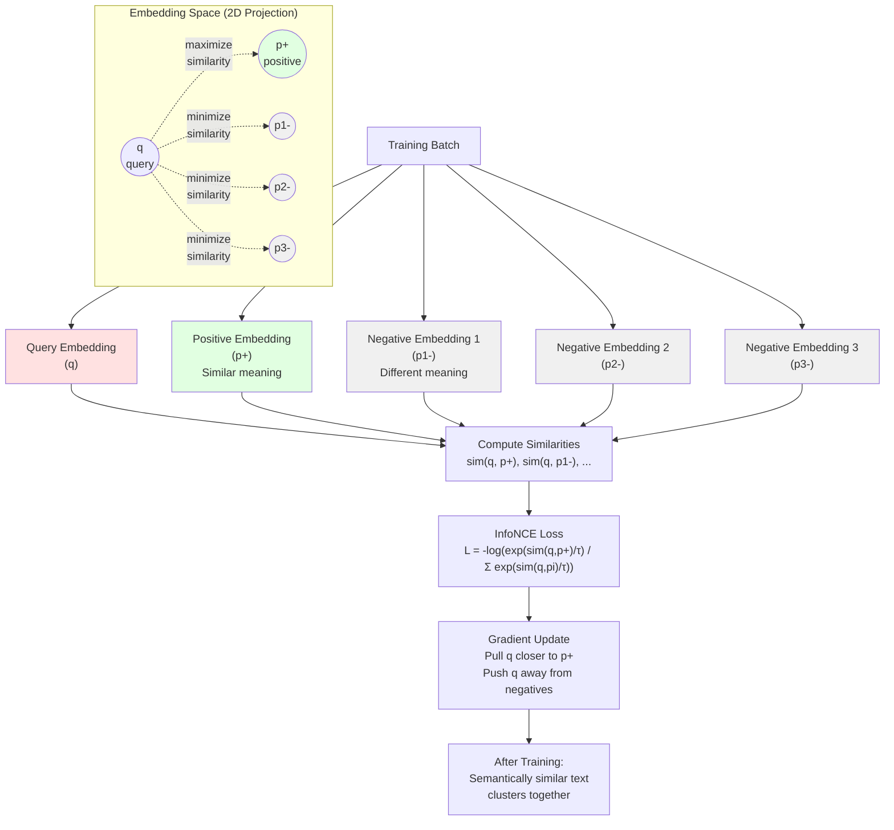
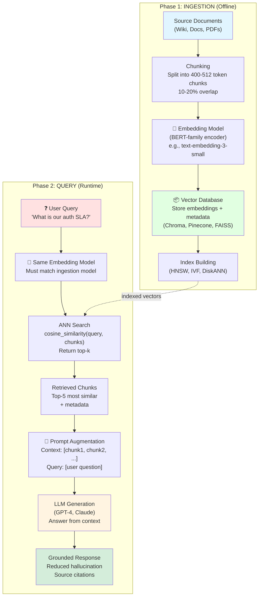
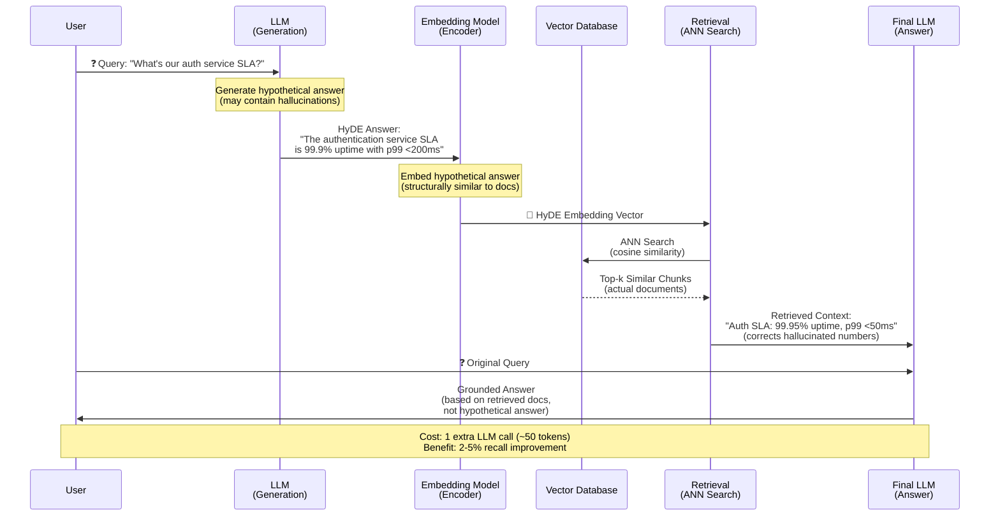

# RAG and Embeddings: Grounding LLMs in Retrieved Knowledge

> **The story.** By summer 2020, GPT-3 had blown everyone's minds with its fluent prose and reasoning — but it had a fatal flaw: ask it about something not in its training data, and it would confidently fabricate an answer. **Patrick Lewis and a team at Meta AI** (then Facebook) published *Retrieval-Augmented Generation for Knowledge-Intensive NLP Tasks* with a radical idea: don't make the model memorize everything. Let it **retrieve** the answer from a knowledge base first, then **generate** a response grounded in actual documents. The paper's key insight was deceptively simple: parametric memory (model weights) is frozen at training time, but retrieval gives you a dynamic, updatable knowledge source. By 2023, every production LLM system — customer support bots, legal assistants, code search — was built on some variant of RAG.
>
> **Where you are in the curriculum.** In the spring of 2013, a young Google researcher named **Tomas Mikolov** was running out of patience with neural language models that couldn't generalize. He had an idea that felt almost too simple: train a shallow network not to *understand* language, but just to *predict neighbors* — what words tend to appear near this word? The result was **Word2vec**. What surprised even Mikolov was that the learned vectors had geometry: *king − man + woman ≈ queen*. Meaning had become arithmetic.
>
> The field spent the next six years refining the recipe. **GloVe** (Pennington, Socher, Manning, Stanford 2014) combined global co-occurrence statistics with local prediction. **fastText** (Bojanowski et al., Facebook 2016) added subword structure so "gluten-free" and "glutenfree" stopped being strangers. But all of these were word-level: each word got one fixed vector regardless of context. *Bank* in "river bank" and *bank* in "bank account" were given the exact same number. The vectors were beautiful, but brittle.
>
> The fix came in 2019 when **Nils Reimers and Iryna Gurevych** at TU Darmstadt published **Sentence-BERT**: a siamese transformer trained with contrastive loss to push semantically similar sentences together and dissimilar ones apart. For the first time, a model could reliably answer *"are these two paragraphs about the same thing?"* — and return a number you could actually trust.
>
> Then **Patrick Lewis and a team at Facebook AI** connected the final wire. In their **2020 RAG paper**, they asked: what if you plugged a retriever into the front of a generative model? Instead of making the LLM memorize every fact during training, let it *look things up* at inference time — search a corpus, read the relevant chunks, then answer. The model could now cite sources instead of hallucinating. By 2023, this pattern — embed a corpus offline, retrieve the nearest chunks at query time, hand them to the LLM — had become the default architecture for any AI system that touches private data.
>
> **This chapter explains why that architecture works.** The hallucinated facts you saw in Ch.3 exist because the model answers from parametric memory, not from the organization's actual documents. This chapter traces the path from *"LLMs hallucinate private data"* to *"retrieval fixes the gap"* — embeddings as the bridge, encoder vs. decoder models, contrastive learning as the secret sauce, and the full RAG pipeline from chunking to generation.
>
> **Where you are in the curriculum.** This is the chapter where you learn what *exactly* gets stored in a vector index, how an embedding model decides two pieces of text are similar, and how a query is matched against millions of chunks. The next chapter — [VectorDBs](../ch08-vector-dbs) — takes the index itself apart (HNSW, IVF, DiskANN). Together they are the foundation for everything else: agents that retrieve before they answer, evaluation pipelines that check grounding, and the entire RAG project under [`projects/ai/rag-pipeline`](../../../projects/ai/rag_pipeline).
>
> **Think of RAG as a library search system:** You walk into a massive library (your document corpus) with a specific question. Instead of reading every book (parametric memory), you ask the librarian (embedding model) to find the 3-5 most relevant sections (retrieval). Then you read just those sections (context) and answer your question (generation). RAG makes LLMs smart by giving them the right reference material at the right time.

***

***

## 0 · The Hallucination Problem

LLMs trained on public corpora answer questions about their training data — Wikipedia, books, web crawls. But when you ask about your organization's authentication service SLA, the model has no choice but to guess. The pretraining corpus is frozen at training time and does not include your internal wiki, runbooks, or policy documents. **The model invents a plausible-sounding answer from training memory instead of admitting ignorance.**

**Baseline: no grounding**

```
Query: "What's the SLA for our authentication service?"

GPT-4 (no RAG):
"Typical SLA targets for authentication services are 99.9% uptime (three nines),
with p99 latency under 200ms."

Actual company SLA (from internal wiki): 99.95% uptime, p99 under 50ms, MTTR < 5 minutes
```

The model returned a *reasonable* industry baseline, but it is wrong for this organization. Across a 50-question test set drawn from an internal engineering wiki, **38% of factual answers contain at least one hallucinated number or claim**. Chain-of-thought prompting cannot fix this — reasoning machinery helps with logic ("if A < B and B < C, then A < C"), not facts ("what is the actual company SLA?").

**The root cause:** The model has no mechanism to look up private documents at inference time. It can only answer from parametric memory — the knowledge baked into its weights during pretraining.

**The fix:** **Retrieval-Augmented Generation (RAG).** Instead of relying solely on parametric memory, fetch relevant documents at query time and include them in the prompt context. The model reads the actual SLA document and answers from it, eliminating hallucination of facts that can be looked up.

**Test results:**
- Without RAG: **38%** hallucination rate on factual queries
- With RAG (after implementing this chapter): **4%** hallucination rate

The remaining 4% are retrieval failures — the relevant document exists but wasn't retrieved. Fixing retrieval is the focus of Ch.8.

> **Problem statement:** LLMs hallucinate because the pretraining corpus is frozen and private data was never in it. Retrieval is the grounding fix: don't train the knowledge in, look it up at query time.

***

***

## 1 · Embeddings: Text → Fixed Vector Where Semantic Distance Is Measurable

### 1A · From Word2vec to Sentence Embeddings

**The retrieval problem:** You need to find documents about "service uptime targets" when the wiki says "99.95% availability" — different words, same meaning. Keyword search fails. You need semantic similarity.

**Embeddings solve this** by transforming text into vectors where meaning becomes measurable. Similar concepts cluster together in high-dimensional space, so "uptime" and "availability" become neighbors even with different exact wording. **Text → fixed vector where semantic distance is measurable.**
**Real-World Example:**
Imagine organizing books in a library. Instead of alphabetical order, you place books by *meaning* — all authentication guides cluster together, all database tutorials in another corner, all deployment docs nearby. When someone asks "How do I secure user logins?", you don't search for exact words. You walk to the authentication cluster because that's where semantically similar concepts live. That's what embeddings do: they create a map where related ideas are physical neighbors.

Word2vec (2013) proved that word vectors could encode meaning: *king − man + woman ≈ queen*. But these were word-level — one vector per word regardless of context. *Bank* in "river bank" and *bank* in "bank account" got the same vector. GloVe (2014) and fastText (2016) refined the approach but kept the word-level limitation.

Sentence-BERT (2019) fixed this with **contextual embeddings** — entire sentences collapsed to a single vector that captures their meaning in context. Modern embedding models are built on **transformer encoder** architectures. Unlike decoder-only models (GPT, Llama) that generate text autoregressively, encoder models process the entire input simultaneously and produce contextual representations for each token.

**What embeddings "feel like":** If you could visualize the 768-dimensional embedding space, you'd see galaxies of related concepts. The "authentication" galaxy has stars for "login", "password", "2FA", "OAuth" all clustered together. The "database" galaxy has "SQL", "schema", "migration", "index" nearby. When you embed "How do I reset user passwords?", the vector lands right in the authentication galaxy, making retrieval trivial — just find the nearest neighbors.

---

### 1B · How Transformer Encoders Create Embeddings

### The Encoding Process

The transformer encoder consists of stacked self-attention layers. Each layer allows every token to attend to every other token, building increasingly abstract representations. The process follows a specific flow:

1. **Tokenization:** Input text is split into tokens, with special tokens added (e.g., `[CLS]` and `[SEP]`)
2. **Token + Position Embeddings:** Each token receives an initial embedding (typically 768-dimensional)
3. **Self-Attention Layers:** The input passes through 6–12 stacked self-attention and feed-forward layers
4. **Final Hidden States:** The model outputs a matrix of contextual token embeddings (e.g., `[768-dim] × N tokens`)
5. **Pooling:** A pooling strategy collapses the per-token representations into a single fixed-size vector

The self-attention mechanism computes attention scores between all token pairs, requiring **O(n²) operations** for a sequence of *n* tokens — which is why most embedding models have sequence length limits (512–8,192 tokens).

### Pooling Strategies: How to Collapse Many Tokens Into One Vector

After the transformer processes text, you have one vector per token. But retrieval needs a single vector for the entire chunk. **Pooling** is how you collapse many vectors into one.

**Think of it like summarizing a group discussion:**
- **Mean Pooling** (most common): Everyone gets equal say — average all opinions. Works well because every word contributes.
- **CLS Pooling**: The designated speaker (special `[CLS]` token) represents the group. BERT uses this.
- **Max Pooling**: Take the strongest opinion on each topic. Useful when you want the loudest signals.
- **Last Token Pooling**: The person who spoke last (final token) summarizes everything. Used in decoder-based embeddings.

Most modern RAG systems use **mean pooling** because it's simple and effective — every word in your chunk contributes equally to the final embedding.

**For the curious — what the code looks like:**
```python
# Mean pooling (most common)
embedding = mean(all_token_vectors * attention_mask)

# CLS pooling (BERT-style)
embedding = first_token_vector # [CLS] token

# Max pooling (capture strongest signals)
embedding = max(all_token_vectors, dim=0)

# Last token pooling (decoder models)
embedding = last_non_padding_token_vector
```

### Concrete Example: Context-Dependent Embeddings

**The problem Word2vec couldn't solve:** Static word embeddings assign the same vector to a word regardless of context.

**Sentence 1:** "The river **bank** was flooded after heavy rain."
**Sentence 2:** "I withdrew cash from the **bank** this morning."

With a modern transformer encoder (e.g., BERT, Sentence-BERT), the word "bank" gets **different embeddings** based on context:

```
Sentence 1 embedding for "bank":
 → Lands near: river, shore, erosion, flood, waterway
 → Far from: money, finance, deposit, ATM

Sentence 2 embedding for "bank":
 → Lands near: money, account, deposit, financial, ATM
 → Far from: river, shore, flood, waterway

The angle between the two "bank" vectors: nearly 90° (almost perpendicular = very different meaning)
```
**Real-World Example:**
A user searches your company knowledge base for "How do I check my account balance?" The embedding model produces a vector that points toward the "financial services" region of the embedding space — far from geography documents. Even though both "river bank" and "bank account" use the word "bank", the retrieval system returns only financial docs because contextual embeddings understand *which* meaning of "bank" you're asking about.

**Why this matters for RAG:** When a user asks "How do I check my account balance?", the retrieval system can distinguish financial documents ("bank account") from geography documents ("river bank") because the embedding model learned to represent "bank" differently based on surrounding context. This context-awareness is why modern RAG pipelines reliably retrieve the right documents even with ambiguous query terms.

**More real-world examples of context-dependent embeddings:**
- "Apple" in "Apple iPhone" vs "apple pie" → tech docs vs cooking docs
- "Python" in "Python programming" vs "python snake" → code docs vs biology docs
- "Java" in "Java development" vs "Java coffee" → software docs vs beverage docs

Without contextual embeddings, a search for "Python tutorials" would return both programming guides AND reptile care instructions. With contextual embeddings, the model understands from context ("tutorials") that you mean the programming language, not the snake.

> **Contextual embeddings solve disambiguation:** Word2vec gave "bank" one vector for all contexts. Transformer encoders with bidirectional attention produce different vectors for "river bank" vs "bank account" by incorporating surrounding context. This is the core capability that makes semantic search work for ambiguous queries.

***

## 2 · Encoder vs Decoder: BERT vs GPT, Bidirectional vs Causal

**Not all transformers are created equal.** GPT and BERT are both transformers, but they're architecturally opposite — and that matters for embeddings.

**Think of it like reading a sentence:**

**Decoder models (GPT family) — reading left-to-right with a blindfold:**
- **Causal attention:** Each word can only see previous words (left-to-right)
- **Trained objective:** Predict the next word autoregressively
- **Use case:** Text generation — "complete this sentence"
- **Embedding quality:** Weaker for similarity because the model never sees future context
- **Analogy:** Reading "The bank is by the river" word-by-word, having to guess what "bank" means before seeing "river"

**Encoder models (BERT family) — reading the whole sentence at once:**
- **Bidirectional attention:** Each word sees all other words (left and right simultaneously)
- **Trained objective:** Masked language modeling — "fill in the blank"
- **Use case:** Understanding and classification — "are these two sentences similar?"
- **Embedding quality:** Ideal for embeddings because every word has full context
- **Analogy:** Reading "The bank is by the river" all at once, understanding "bank" from both "the" (before) and "river" (after)

Modern embedding models (Sentence-BERT, E5, BGE) are **encoder-based** because bidirectional attention produces richer representations. A decoder can generate text but struggles to compare semantic similarity — it sees "The bank is by the river" token-by-token, never having future context to disambiguate "bank." An encoder sees the full sentence simultaneously and can encode that this "bank" relates to rivers, not money.
**Real-World Example:**
You're building a customer support chatbot that needs to match user questions to help articles:

**With a decoder (GPT-style) embedding:** When embedding "How do I reset my password?", the model processes "How" first (no context), then "do" (only saw "How"), then "I" (only saw "How do I"), and so on. By the time it reaches "password", it has limited context. The resulting embedding is biased toward recent words.

**With an encoder (BERT-style) embedding:** The model sees "How do I reset my password?" all at once. Every word knows it's part of a password-reset question. The word "reset" understands it's about passwords (not factory resets or database resets). The embedding accurately captures the full intent.

**Result:** The encoder-based retriever correctly finds the "Password Reset Guide" article. A decoder-based embedding might confuse it with "Factory Reset Instructions" or other reset-related documents.

**Why this matters for RAG:** Your retriever needs to answer "are these two pieces of text about the same thing?" — a bidirectional task. Encoders are architecturally designed for it; decoders are not.

> **BERT vs GPT for embeddings:** BERT-family (encoders) are ideal for RAG retrieval because bidirectional attention sees full context. GPT-family (decoders) excel at generation but produce weaker embeddings due to causal masking. Use encoders for retrieval, decoders for generation.

***

## 3 · Contrastive Learning: Teaching Embeddings What "Similar" Means

Embedding models are **not** trained to predict tokens like GPT. They are trained with **contrastive learning** — a teaching method that shows the model examples of "these two things are similar" and "these two things are different."

**Think of it like teaching a child about categories:**

You show the child:
- 🍎 Apple and 🍊 Orange → "These are both fruits" (pull them together)
- 🍎 Apple and 🚗 Car → "These are completely different" (push them apart)
- 🍊 Orange and 🥕 Carrot → "Kind of related (both orange), but not the same category" (moderate distance)

After thousands of examples, the child learns that "fruit" means "edible, grows on plants, sweet" — not from a definition, but from seeing which things cluster together.

**How embedding models learn:** During training, the model sees triplets:
- **Query:** "How to handle authentication errors?"
- **Positive match:** "Authentication failures should return 401 status" (same topic)
- **Negative examples:** "Database schema design", "JavaScript arrays tutorial" (different topics)

The training objective is simple: **Make the query embedding point in the same direction as the positive, and in different directions from the negatives.**
**Real-World Example:**
Suppose you're training an embedding model for a company wiki. You feed it:
- Query: "What's our service uptime SLA?"
- Positive: "Authentication service SLA: 99.95% uptime"
- Negative 1: "How to deploy Docker containers"
- Negative 2: "Python testing best practices"

The model learns:
- "uptime" and "SLA" should have similar embeddings (they appear together in similar contexts)
- "service" and "authentication" are related concepts
- Questions and their answers have similar meanings even with different words

After seeing millions of such examples, the embedding space organizes itself: all authentication docs cluster together, all deployment docs in another region, all testing docs elsewhere. This is why RAG retrieval works — you search by *meaning*, not by matching exact words.

**The training process (InfoNCE):** The model gets rewarded when it correctly identifies which of many candidates is the true match. If you show it a query and 100 candidate answers (1 correct, 99 wrong), and the model ranks the correct one first, the loss is near zero. If the model ranks a wrong answer higher than the correct one, the loss is high and the model adjusts its weights.

<details>
<summary> <b>For the mathematically curious: InfoNCE loss formula</b></summary>

The training objective is to maximize the similarity between query and positive while minimizing similarity to negatives:

```
L = -log(exp(sim(q,p+)/τ) / Σ exp(sim(q,pi)/τ))
```

Where:
- `q` = query embedding
- `p+` = positive (correct match) embedding
- `pi` = negative (incorrect) embeddings
- `τ` = temperature parameter (typically 0.05–0.1)
- `sim()` = cosine similarity

**Translation to plain English:** "Make the query-to-positive similarity stand out compared to query-to-negative similarities." Lower temperature makes the model more confident in picking the positive over negatives.

**You don't need this formula to understand RAG.** The arrow/angle intuition above is sufficient.

</details>

**Worked Example:**

Training batch:
- **Query:** "How to handle authentication errors?"
- **Positive:** "Authentication failures should return 401 status" (correct match)
- **Negative 1:** "The database schema includes user tables" (different topic)
- **Negative 2:** "JavaScript arrays support map and filter" (unrelated)

After embedding, imagine arrows:
```
Query arrow →→→→ (points toward "authentication" region)
Positive arrow →→→ (points same direction — small angle!)
Negative 1 arrow ↗ (points toward "database" region — medium angle)
Negative 2 arrow ↑ (points toward "programming" region — large angle)
```

The model learns to maximize the similarity (minimize the angle) between query and positive, while minimizing similarity (maximizing the angle) to negatives. Over millions of training examples, semantically related text clusters together in embedding space.

**Why this matters for RAG:** This training objective is why semantic search works at all. Your retrieval quality depends on how well the embedding model was trained with contrastive learning — models trained on domain-specific data (medical, legal, code) perform better on those domains because their contrastive training aligned the embedding space to those concepts.

**The "angle between arrows" intuition:**
Imagine every piece of text as an arrow pointing in 768-dimensional space:
- Similar concepts → arrows point in nearly the same direction (small angle between them)
- Different concepts → arrows point in different directions (large angle)
- Retrieval → find the arrows that point most similarly to your query arrow

You don't need to understand the math — just remember that embeddings turn the question "are these similar?" into geometry: **similar = small angle, different = large angle.**
**Real-World Example:**
When you ask "What's our authentication service SLA?", the embedding is an arrow pointing toward the "service reliability" region of the space. Documents about "99.95% uptime" and "availability targets" have arrows pointing in similar directions, so they get retrieved. Documents about "database migration" or "frontend styling" point in completely different directions, so they're ignored. Retrieval is just finding the nearest arrows.

> **Contrastive learning:** Training teaches embeddings to cluster semantically similar text by showing millions of examples of "these are similar" and "these are different." This is why RAG retrieval can find "authentication SLA" documents even when the query uses different wording ("service uptime targets") — the embedding space learned that these concepts are related.

**Contrastive Learning: Pushing Similar Text Together, Different Text Apart**

InfoNCE training teaches embedding models to cluster semantically similar text through positive/negative pairs:



**Training example:**
- **Query:** "What is the authentication service uptime?"
- **Positive:** "Authentication Service SLA: 99.95% uptime" (same topic, different phrasing)
- **Negatives:** "Database backup schedule", "Frontend deployment guide", "Security audit logs" (different topics)

**Why this works for RAG:**
After seeing millions of (query, positive, negatives) examples, the model learns that:
- "uptime" and "SLA" are semantically related
- "authentication" and "auth service" refer to the same concept
- Structural differences (question vs statement) don't prevent semantic similarity

**Temperature parameter (τ):** Lower τ sharpens the distribution, making the model more confident in choosing the positive over negatives. Typical values: 0.05–0.1.

***

## 4 · The RAG Pipeline: Ingestion + Query Flow

RAG is a **two-phase architecture** that separates offline corpus preparation from online query execution:

**Phase 1: Ingestion (Offline) — Building the Library**

1. **Chunk:** Split documents into 400-512 token chunks with 10-20% overlap
2. **Embed:** Convert each chunk to a dense vector using an encoder model (e.g., `text-embedding-3-small`)
3. **Store:** Index vectors in a vector database (Chroma, Pinecone, FAISS) with metadata

**Phase 2: Query (Runtime) — Asking the Librarian**

1. **Embed:** Convert user query to a vector using the **same** embedding model
2. **Retrieve:** ANN search finds top-k most similar chunks by measuring angles between vectors
3. **Augment:** Insert retrieved chunks into LLM prompt as context
4. **Generate:** LLM answers from retrieved context, grounding the response
**Real-World Example:**
**Ingestion (done once):**
You have 500 internal wiki pages about your company's services. You split them into ~5,000 chunks, embed each one, and store the embeddings in a vector database. This is like cataloging every book in your library — expensive upfront, but you only do it once (or when documents change).

**Query (happens every time a user asks a question):**
User asks: "What's the authentication service SLA?"
1. Embed the question → get a 768-dimensional arrow
2. Search the vector DB → find the 5 chunks whose arrows point most similarly
3. Retrieved chunks might be:
 - "Authentication Service SLA: 99.95% uptime, p99 latency <50ms"
 - "The auth service handles 10M requests/day"
 - "SLA violations trigger PagerDuty alerts"
 - "Our auth system uses OAuth 2.0 with JWT tokens"
 - "Uptime is measured as successful auth attempts / total attempts"
4. Hand these 5 chunks to the LLM along with the original question
5. LLM reads the chunks and answers: "The authentication service SLA is 99.95% uptime with p99 latency under 50ms."

**The key insight:** The LLM doesn't need to memorize every SLA in your company. It just needs to read the right document at query time. RAG gives it that document.

**Two-Phase RAG Architecture**

The separation between offline ingestion and online query execution is fundamental to RAG system design:



**Key architectural decisions:**
1. **Ingestion is one-time** (or incremental on updates) — expensive operations (chunking, embedding, index building) happen offline
2. **Query path is latency-critical** — optimized for <100ms retrieval + <2s generation
3. **Embedding model consistency:** Using different models for ingestion vs query breaks semantic similarity
4. **Index choice matters:** HNSW for real-time updates, IVF for static large corpora, DiskANN for billion-scale

**Pipeline diagram:**

```
INGESTION (Offline) QUERY (Runtime)
══════════════════════ ═══════════════

Documents User Query
 ↓ ↓
Chunk (400 tokens) Embed Query
 ↓ (same model!)
Embed All Chunks ↓
 ↓ ANN Search
Store in Vector DB (top-k chunks)
 ↓
 Augment Prompt
 ↓
 LLM Generate
 ↓
 Grounded Answer
```

**Critical constraint:** Query and document embeddings **must use the exact same model**. `text-embedding-3-small` and `text-embedding-ada-002` both output 1,536-dimensional vectors, but those dimensions mean completely different things — the axes of each model's space are independent. Mixing models produces numerically meaningless similarity scores.

**Chunking strategy matters:** A 40% recall difference exists between naive fixed-size chunking and well-tuned recursive splitting. Chunk size determines the recall-vs-context tradeoff:

- **256 tokens:** High precision, but multi-section entries get fragmented
- **400-512 tokens:** Sweet spot for most use cases (80% of production RAG systems)
- **1,024+ tokens:** Better for analytical queries, but dilutes embeddings

**Chunk overlap (10-20%):** Prevents boundary information loss. If a key sentence falls on a chunk boundary, overlap ensures it appears in multiple chunks.

**Hybrid search (BM25 + dense retrieval):** Combines keyword matching (exact terms, acronyms, codes) with semantic similarity (paraphrases, synonyms). **Reciprocal Rank Fusion (RRF)** merges results without needing to normalize the different score types.

**How RRF works (intuitive):**
Imagine two separate retrieval systems:
- **BM25 (keyword search):** Returns documents ranked 1-100 based on exact word matches
- **Dense retrieval (semantic search):** Returns documents ranked 1-100 based on meaning similarity

The problem: BM25 scores might be 0-50, while cosine similarity scores are 0-1. You can't just add them — they're on different scales!

**RRF solution:** Ignore the raw scores entirely. Just use rankings:
- If a document ranks #1 in BM25 and #3 in dense → it gets high combined score
- If a document ranks #1 in BM25 but #90 in dense → it gets medium combined score
- If a document ranks #50 in both → it gets low combined score
- If a document appears in only one list → it still gets considered

The actual formula gives higher weight to top-ranked items (rank 1 scores higher than rank 10), but you don't need to memorize the math. Just remember: **RRF merges rankings, not raw scores**.
**Real-World Example:**
User searches: "What's the auth service error code 401?"
- **BM25 retriever:** Finds docs with exact match "401" → ranks "HTTP Status Codes" #1
- **Dense retriever:** Finds docs about authentication problems → ranks "Auth Troubleshooting" #1, "HTTP Status Codes" #8

**RRF merges them:** "HTTP Status Codes" appears high in both lists → final rank #1. "Auth Troubleshooting" appears in only dense search → final rank #2. The document that's relevant to BOTH keyword and semantic search wins.

> **RAG pipeline:** Chunk → embed → store (offline), then embed query → retrieve → augment → generate (online). Mixing embedding models breaks retrieval; chunking strategy determines recall; hybrid search combines exact + semantic matching.

***

## 5 · HyDE: Hypothetical Document Embeddings

**The semantic gap problem:** A user asks "What's our authentication service SLA?" — phrased as a question. The wiki document says "Authentication Service SLA: 99.95% uptime, p99 <50ms" — phrased as a statement. These have different sentence structures and embeddings, reducing similarity even though they're about the same topic.

**HyDE (Hypothetical Document Embeddings)** solves this by **embedding a hypothetical answer instead of the raw question**. Instead of directly embedding the query, generate what an answer might look like, then embed that. Hypothetical answers are structurally similar to actual documents, closing the phrasing gap.

**The algorithm:**

1. **User query:** "What's our authentication service SLA?"
2. **Generate hypothetical answer:** Use an LLM to generate a plausible answer (even if hallucinated): "The authentication service SLA is 99.9% uptime with p99 latency under 200ms."
3. **Embed hypothetical answer:** This embedding is structurally similar to actual wiki documents
4. **Retrieve:** Search using the hypothetical answer embedding
5. **Generate real answer:** LLM sees the actual retrieved chunks and corrects any hallucinations from step 2

**Why it works:** The hypothetical answer embedding clusters near actual document chunks because they share structural patterns ("The X is Y" vs. "What is X?"). The hallucinated numbers in step 2 don't matter — retrieval finds the actual documents, and the LLM reads the correct values in step 5.

**Cost tradeoff:** HyDE adds one extra LLM call per query (hypothetical answer generation). For a 50-token generation at $0.03/1M tokens (GPT-4-mini), that's $0.0000015 per query — negligible. The retrieval quality improvement (2-5 percentage points in recall) often justifies the cost.

**When to use HyDE:**
- Questions phrased differently than documents (Q&A style vs. declarative docs)
- Queries where semantic gap reduces retrieval quality
- Exact keyword searches (BM25 already handles these)
- Ultra-low-latency requirements (<100ms p95)

> **HyDE:** Embed a hypothetical answer instead of the raw question, closing the phrasing gap between queries and documents. Adds one LLM call per query but improves recall by 2-5 percentage points when questions and documents have structural mismatches.

**HyDE Workflow: Closing the Query-Document Phrasing Gap**

HyDE improves retrieval by transforming questions into declarative statements that match document structure:



**Why HyDE improves retrieval:**

1. **Structural alignment:** Questions ("What is X?") and documents ("X is Y") have different embeddings even for the same topic
2. **Hypothetical answer** is phrased declaratively, matching document structure
3. **Embedding space proximity:** Declarative statements cluster together in embedding space
4. **Hallucinations don't matter:** The hypothetical answer is only used for retrieval — the final LLM reads the actual retrieved documents

**Example transformation:**
- **Direct embed (poor):** "What's our auth service SLA?" → embeds as a question
- **HyDE embed (better):** "The authentication service SLA is 99.9% uptime..." → embeds as a statement
- **Retrieved doc:** "Authentication Service SLA: 99.95% uptime, p99 latency <50ms" (statement)
- **Cosine similarity:** HyDE embedding is closer to document embedding than raw question

**When to use HyDE:**
- Large phrasing gap between queries and documents (Q&A vs technical docs)
- Budget allows 1 extra LLM call per query (~$0.0000015 at GPT-4-mini pricing)
- Skip for keyword-heavy queries (BM25 already handles "error code 500")
- Skip for ultra-low-latency requirements (<100ms p95)

***

## 6 · Failure Modes

RAG reduces hallucination from 38% → 4%, but the remaining 4% traces to specific failure modes. Understanding these is critical for debugging production systems.

### Common RAG Failure Modes

| Failure Mode | Cause | Symptom | Fix |
|--------------|-------|---------|-----|
| **Semantic gap** | Query and relevant documents use different terminology | Relevant chunks not retrieved; model answers from parametric memory or says "I don't know" | Use hybrid search (BM25 + dense); consider domain-specific embedding model; HyDE for structural mismatches |
| **Chunk size mismatch** | Chunks too small → context fragmented; chunks too large → embeddings diluted | Retrieved chunks don't contain complete information; similarity scores mushy | Test 256/400/512 tokens on your corpus; 400-512 is the sweet spot for most cases |
| **Lost-in-the-middle** | LLM ignores context buried in the middle of a long prompt | Model answers from parametric memory despite relevant chunks in context | Re-rank chunks (put highest-confidence first); reduce k (top-5 instead of top-20); use models with better long-context handling |
| **Unfaithful generation** | Model hallucinates despite seeing correct information in retrieved chunks | Answer contradicts retrieved context | Fine-tune for instruction following; add "cite your sources" prompt constraint; use structured output formats (JSON) |
| **Retrieval failure** | Relevant document exists but wasn't retrieved | Model says "I don't know" or invents an answer; correct document not in top-k | Improve chunking strategy; increase k; hybrid search; better embedding model; check index quality (Ch.8) |
| **Stale index** | Document corpus updated but embeddings not re-indexed | Retrieved chunks contain outdated information | Implement incremental index updates; version control embeddings; track document freshness metadata |

**Debugging workflow:**

1. **Check if retrieval succeeded:** Log the top-k chunks for failed queries. If the correct chunk is present, it's a generation problem. If absent, it's a retrieval problem.
2. **Test with manual context:** Put the correct answer in the prompt manually. If the model still fails, fine-tune for instruction following. If it succeeds, improve retrieval.
3. **Measure recall@k:** What fraction of test queries retrieve the relevant chunk in top-k? If <90%, focus on chunking, embedding model, or hybrid search.

> **Failure modes:** The 4% residual errors split into retrieval failures (3%) and generation failures (1%). Fix retrieval with better chunking/hybrid search/re-ranking. Fix generation with fine-tuning for instruction following.

***

## 7 · Key Distinctions (Interview Table)

These are the concepts interviewers expect you to know cold. Each row represents a common interview question.

| Must know | Likely asked | Trap to avoid |
|---|---|---|
| The two-phase RAG pipeline: **ingestion** (chunk → embed → store in vector DB) vs **query** (embed query → ANN retrieve → re-rank → generate); failures in either phase compound downstream | "Walk me through a RAG pipeline end-to-end" — interviewers expect both phases, not just retrieval | Describing RAG as just "search then generate" without mentioning chunking, embedding, and the index |
| Chunking strategy matters: **fixed-size** (fast, baseline), **sentence/recursive** (respects natural boundaries, most common in prod), **semantic** (highest recall, groups by meaning, slowest); chunk size drives the recall-vs-context tradeoff | "What chunking strategy would you use for a legal document Q&A system?" | Saying chunk size doesn't matter — a 40% recall difference between naive and tuned chunking is well-documented |
| **Similarity = angle between vectors:** Small angle = similar meaning, large angle = different meaning. Most production pipelines normalize vectors at index time and use dot product (faster) at query time. For normalized vectors, cosine similarity and dot product are equivalent. | "How do you measure similarity between embeddings?" | Overcomplicating with formulas — just remember: similar concepts have vectors pointing in similar directions (small angle) |
| Sparse retrieval (BM25): keyword-based, fast, no index warm-up, excels on rare proper nouns and exact matches. Dense retrieval (bi-encoder): semantic, catches paraphrases, misses OOV terms. Hybrid search uses **Reciprocal Rank Fusion (RRF)** to merge both rank lists with no score normalization required | "When would you prefer BM25 over a dense retriever?" | Saying dense retrieval is strictly better — on domain-specific jargon, acronyms, or cold-start (no training data), BM25 often wins |
| Re-ranker (cross-encoder): reads the full query + chunk together, much more accurate than bi-encoder but O(k) LLM calls; bi-encoder retrieval is approximate but sub-millisecond. Architecture: use bi-encoder for top-100 recall, cross-encoder to re-rank to top-5 | "Why not use a cross-encoder for all retrieval?" | Forgetting that a cross-encoder has to see every candidate — you can't run it against millions of chunks |
| Hybrid search with RRF: combines sparse and dense rank lists without needing to normalize heterogeneous scores. Merges rankings, not raw scores. | "How does RRF combine results from different retrievers?" | Trying to combine raw BM25 and cosine scores directly — their scales are incompatible without normalization |
| **Encoder vs Decoder for embeddings:** BERT (encoder, bidirectional attention, sees full context, ideal for similarity) vs GPT (decoder, causal attention, only sees past tokens, optimized for generation). Use encoders for RAG retrieval | "Why is BERT better than GPT for embeddings?" | Saying "all transformers are the same" — causal masking in decoders produces weaker embeddings because tokens never see future context |
| **Contrastive learning:** Embedding models learn by seeing millions of examples of "these are similar" (push vectors close) and "these are different" (push vectors apart). This creates clusters where related concepts have similar embeddings. | "How are embedding models trained?" | Saying embeddings are trained to predict the next token like GPT — embedding models use contrastive objectives (positive/negative pairs), not autoregressive prediction |
| **HyDE:** Embed a hypothetical answer instead of the raw query to close the phrasing gap between questions and declarative documents. Adds one LLM call per query but improves recall when queries and docs have structural mismatches | "What is HyDE and when would you use it?" | Thinking HyDE embeddings replace the retrieval step entirely — HyDE generates a hypothetical answer, embeds it, then uses that for retrieval |
| **Failure mode: embedding similarity ≠ relevance** — a chunk can be semantically close to the query yet contextually useless (e.g., a definition chunk when the query needs a procedure); re-ranking and result diversity both matter | "Why might high-similarity retrieved chunks still produce a bad RAG answer?" | Assuming top-k by similarity is always the right answer to pass to the LLM |

***

## 8 · Bridge to Next Chapter

RAG grounds LLM answers in the organization's actual documents — but retrieval at prototype scale is brute-force: every query does a linear scan over all chunks. **Vector DBs (Ch.8)** replaces that with HNSW and IVF indexes that return approximate nearest neighbors in sub-millisecond time, scaling from ~1,400 wiki chunks to millions without hitting the latency constraint (<3s p95).

**What you've learned:**
- Embeddings convert text to vectors where semantic distance is measurable
- Encoder models (BERT) are ideal for embeddings; decoder models (GPT) are ideal for generation
- Contrastive learning (InfoNCE) is why embedding models cluster semantically similar text
- RAG pipeline: chunk → embed → store (ingestion), embed query → retrieve → augment → generate (query)
- HyDE closes the phrasing gap by embedding hypothetical answers instead of raw queries
- Failure modes: semantic gap, chunk size, lost-in-middle, unfaithful generation, retrieval failure

**What's next:**
- Ch.8 (Vector DBs): HNSW, IVF, DiskANN — the index structures that make RAG scale
- Ch.6 (RAG Evaluation): Measuring retrieval quality, faithfulness, and answer correctness
- Ch.8 (Fine-Tuning): When RAG can't fix behavior problems (instruction following, tone, format)

---

## Bridge

RAG grounds LLM answers in retrieved documents, reducing hallucination from 38% to 4%. You now understand *what* embeddings are, *how* they cluster semantically similar text, and *why* the two-phase pipeline (ingestion + query) works. But there's a scaling wall: brute-force retrieval over 50K chunks takes 1.5 seconds — unacceptable for production.

The next chapter — [Vector Databases](../ch08-vector-dbs/vector-dbs.md) — solves this with approximate nearest neighbor (ANN) indexes. You'll learn why traditional spatial indexes fail in high dimensions (curse of dimensionality), how HNSW achieves O(log N) graph traversal, when IVF cluster-based search wins, and how DiskANN moves billion-scale indexes to SSD without sacrificing recall. This is what makes RAG fast enough to deploy.

## Illustrations


