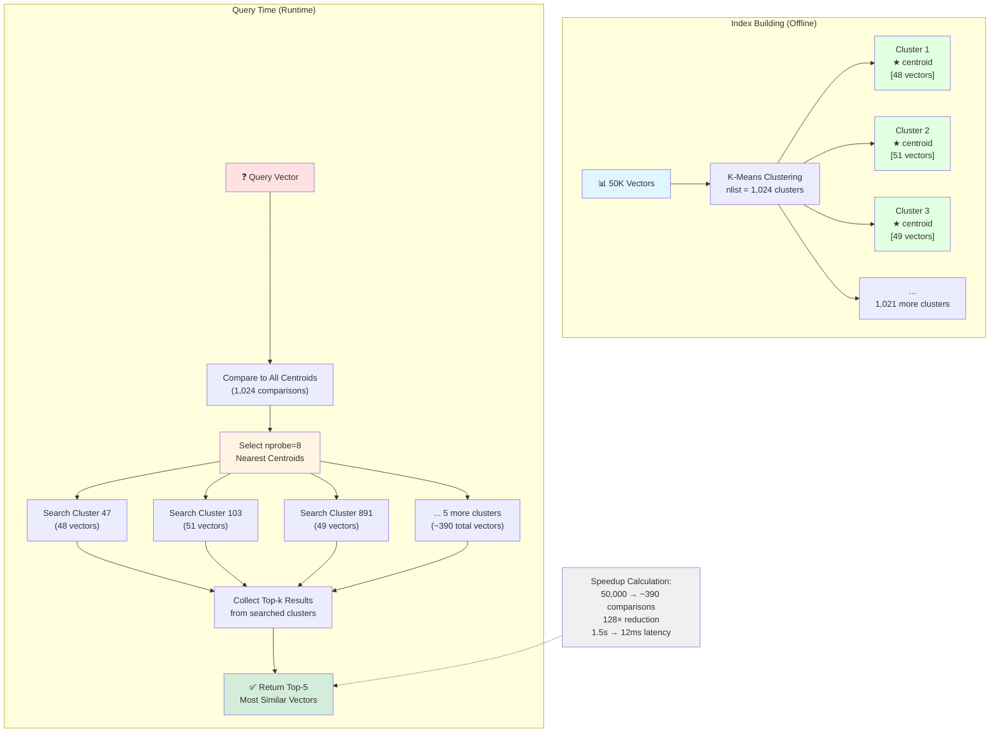
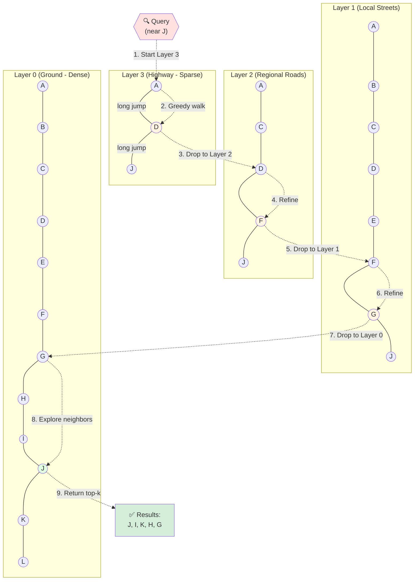
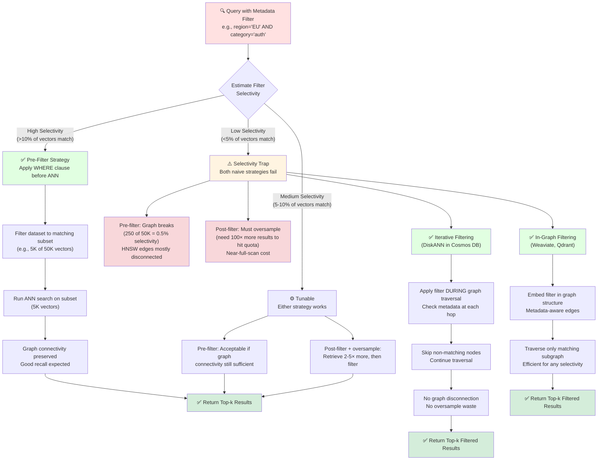

# Vector Database Indexing Techniques and Architectures

> **A brief history.** In 1998, Piotr Indyk and Rajeev Motwani sat down at Cornell with a problem that felt intractable: find the nearest neighbor to a query point among ten million high-dimensional vectors — in milliseconds, not minutes. Their paper on *Locality-Sensitive Hashing* was the first algorithm to break the O(N) barrier. It worked, but barely: you needed dozens of hash tables to hit decent recall, and the memory overhead was punishing. Researchers filed it away as a theoretical win with a practical asterisk.
>
> The breakthrough that mattered came out of Inria in Grenoble. Hervé Jégou and colleagues were building large-scale image retrieval systems and kept hitting RAM walls. Their 2010 work on *Product Quantization* showed that a 128-dim descriptor could be split into tiny sub-vectors, each encoded against a small codebook, yielding a 64× memory reduction with near-zero recall loss. Facebook packaged the technique into **FAISS** in 2017, and overnight a billion-scale ANN index fit on a single GPU server.
>
> But the field still needed speed. In 2016, Yu. A. Malkov and D. A. Yashunin published *HNSW* — a deceptively simple idea: build a multi-layer graph where top layers are highways for long-range jumps and bottom layers are local streets for precision. Start at the top, greedily descend, return the neighbors. The result was near-exact recall at latencies that left IVF-based methods behind. Within three years, every production vector database adopted it. Microsoft Research answered the billion-scale problem with **DiskANN** (NeurIPS 2019), which moved the HNSW-style graph onto SSD so indexes that don't fit in RAM no longer required a room full of DRAM. The product wave — Pinecone, Weaviate, Milvus, Qdrant, pgvector — wrapped these algorithms in managed APIs the moment the LLM era made dense retrieval a default engineering primitive. Now you're inheriting that history: your Investigation RAG pipeline hit a wall at 50K documents, and this chapter explains exactly which index to reach for and why.
>
> **Where you are in the curriculum.** [RAG and Embeddings](../ch07-rag-and-embeddings) explained *what* is stored (embeddings) and *why*. This document explains *how* it is searched at scale: the index structures (Flat, IVF, HNSW, DiskANN), distance metrics (cosine, dot product, L2), and the production architecture choices (filters, hybrid retrieval, sharding) that determine whether your RAG pipeline serves 10 users or 10 million.
>
> **Notation.** $M$ — HNSW maximum connections per node; $ef_\text{construction}$ — dynamic candidate list size during index build; $ef_\text{search}$ — beam width during query; $n_\text{probe}$ — IVF clusters to search; $\text{recall@}k$ — fraction of true $k$-nearest neighbours returned by approximate search.

***

## 0 · The Scaling Problem

**Exact search is the simplest approach — and it doesn't scale.** Without indexes, a vector database performs an exact search, which provides perfect recall at the expense of performance. The operation is straightforward: compute the distance between the query vector and **every single stored vector**, then return the top-*k* closest results.

### Why Brute-Force Fails at Scale

**Time complexity:** For *N* vectors of dimension *d*, exact brute-force search requires *O(N × d)* operations per query. Consider a concrete example:

 N = 100,000,000 vectors (100M)
 d = 768 dimensions (typical transformer embedding)

 Operations per query ≈ 100M × 768 = 7.68 × 10^10 (≈77 billion floating-point operations)

Even on a modern CPU doing \~10 billion FLOP/s, that's **\~8 seconds per query** — far too slow for real-time applications.

**Memory cost:** Storing 100M vectors of dimension 768 in float32 (4 bytes per dimension) requires:

 Memory = 100,000,000 × 768 × 4 bytes = 307.2 GB

Each dimension of a vector requires **4 bytes of storage** using float32. This exceeds the RAM capacity of most servers, forcing either expensive hardware or disk-based access (which further increases latency).

**Why traditional indexes don't help:** Relational databases won't store vectors correctly, and SQL is not built for high-dimensional similarity search — searching through them would be extremely difficult. Even spatial tree indexes (kd-trees, ball trees) degrade in high dimensions (the "curse of dimensionality"), often performing nearly as badly as brute-force. Hash-based methods (Locality Sensitive Hashing / LSH) are theoretically interesting but often impractical at scale due to the many hash tables required for high accuracy.

**The bottom line:** An index is a data structure that improves the speed of data retrieval operations. Using an index in vector search reduces the number of vectors that need to be compared to the query vector, makes the query more efficient, and greatly reduces memory requirements compared to processing searches via raw embeddings. This motivates ANN indexing.

> 💡 **The scaling wall:** At 200 documents, brute-force retrieval costs ~5ms and is unnoticeable. At 50,000 documents it costs ~1,200ms — triggering query timeouts and making real-time RAG unusable. At 100M documents, brute-force becomes physically impossible. The O(N) cost curve is the problem every ANN algorithm exists to solve.

***

## 1 · Distance Metrics: The Foundation of Similarity Search

Before diving into indexing methods, it's essential to understand the distance metrics that underpin all vector search. These determine how "closeness" is measured. The wrong metric choice doesn't produce a latency error — it silently returns wrong documents.

### 🗺️ **Navigation Analogy: Three Ways to Measure "Close"**

Think of finding nearby locations on a map. Three different travelers might measure "closeness" differently:

**Euclidean (L2) — The Crow Flies**
- *What it measures:* Straight-line distance between two points, like "how far is it as the crow flies?"
- *When to use:* Image embeddings, sensor data, physical measurements
- *Key intuition:* Sensitive to both direction AND magnitude — a vector that's twice as long is twice as far away
- *Analogy:* Measuring the direct distance between two cities on a map with a ruler

**Cosine Similarity — The Direction Matters**
- *What it measures:* The angle between two vectors, like "are they pointing in the same direction?"
- *When to use:* Text/semantic similarity (default for RAG pipelines)
- *Key intuition:* Ignores magnitude completely — a long vector and short vector pointing the same way are considered identical
- *Analogy:* Two hikers comparing compass bearings — whether one walked 2 miles and the other 10 miles doesn't matter, only whether they went the same direction

**Dot Product — Direction AND Strength**
- *What it measures:* How much two vectors "agree" when both direction and magnitude matter
- *When to use:* Recommendation systems, when vector length carries meaning
- *Key intuition:* Rewards vectors that are long AND aligned — stronger signals get more weight
- *Analogy:* Two people pushing a cart — force is stronger when both push hard AND in the same direction

| Metric | Mental Model | When to Use | Critical Property |
| ------------------------------- | -------------------------------- | ---------------------------------------------------------- | -------------------------------------------------------------- |
| **Euclidean (L2)** | "How far apart are these points?" | Image embeddings, sensor data | Cares about both direction and length |
| **Cosine Similarity** | "Are they pointing the same way?" | Text/semantic similarity | Ignores length completely |
| **Dot Product (Inner Product)** | "Do they agree strongly?" | Recommendation systems, when magnitude matters | Rewards alignment + strength |

SQL Server 2025 supports all three: cosine (ideal for text and semantic similarity), dot product, and Euclidean (useful for image or sensor data).

**Critical insight:** When vectors are **normalized** (scaled to unit length), cosine similarity and dot product become equivalent — the angle is all that matters. Many embedding models output normalized vectors by default, making the metric choice less critical in practice — but knowing *why* matters in interviews.

> 💡 **Metric choice → recall:** Switching from cosine to dot product on un-normalised embeddings can silently degrade recall by 5–15% on short queries — degrading retrieval quality without any visible error signal. Cosine is the safe default for text embeddings until you've verified your model normalises outputs.

***

## 2 · Why Traditional Indexes Fail: The Curse of Dimensionality

**The intuition:** In 2D or 3D space, spatial indexes (kd-trees, R-trees, ball trees) work beautifully. You partition space recursively, and at query time you eliminate entire regions with a single comparison. In 768 dimensions, this breaks down completely.

**Why it fails:**

1. **Volume concentration:** In high dimensions, almost all points sit on the boundary of a hypersphere. The "interior" is effectively empty. This means every query point is roughly equidistant to every indexed point — the partition boundaries convey no useful information.

2. **Exponential partition cost:** A kd-tree that achieves 2 partitions per dimension in 3D requires 2³ = 8 leaf nodes. In 768 dimensions, that's 2⁷⁶⁸ leaf nodes — computationally infeasible.

3. **Degenerate traversal:** In practice, kd-trees in high dimensions devolve to O(N) search — you end up checking most of the tree anyway, but with the overhead of tree traversal on top.

**The historical response:** LSH (Locality-Sensitive Hashing) emerged in 1998 as the first theoretical breakthrough, but required maintaining dozens of hash tables to achieve acceptable recall — making it a memory hog. The field needed algorithms that could navigate high-dimensional space *efficiently* without relying on spatial partitioning. This led to two dominant approaches: **IVF** (cluster-based partitioning) and **HNSW** (graph-based navigation).

> 💡 **Curse of dimensionality:** Traditional spatial indexes (kd-trees, ball trees) perform nearly as badly as brute-force in high dimensions. In 768-dim space, almost all points are equidistant, and partition boundaries convey no useful signal. This is why vector search required entirely new algorithms — not just tuning traditional indexes.

***

## 3 · IVF — Inverted File Index

**The concept:** IVF partitions the vector space using clustering (usually k-means). Instead of searching all vectors, you search only a few clusters. Think of it like a library: shelves (clusters) are numbered, and when you search, you only walk to a handful of shelves.

**How it works:**

```plaintext
 ┌─────────────────────────────────────────────────────┐
 │ VECTOR DATASET │
 │ ○ ○ ○ ○ ○ ○ ○ ○ ○ ○ ○ ○ ○ ○ ○ ○ ○ ○ ○ ○ │
 └─────────────────────┬───────────────────────────────┘
 │ K-Means Clustering
 ▼
 ┌──────────┬──────────┬──────────┬──────────┐
 │Cluster 1 │Cluster 2 │Cluster 3 │...Cluster│
 │ ★ → [IDs]│ ★ → [IDs]│ ★ → [IDs]│ nlist │
 │(centroid)│(centroid)│(centroid)│ │
 └──────────┴──────────┴──────────┴──────────┘

 ★ = centroid (coarse quantizer)
 [IDs] = inverted list of vectors assigned to that cluster

 QUERY TIME:
 Query → Compare to centroids → Pick nprobe closest → Search only those lists
```

The IVF index consists of two main components: a **coarse quantizer** (a set of cluster centroids that partition the vector space) and **inverted lists** (for each centroid, a list of vectors assigned to that cluster).

**Step by step:**

1. Run k-means to get **nlist** centroids
2. Assign every vector to the nearest centroid
3. At query time: assign the query to the nearest centroids, then search vectors only in those partitions

The IVFFlat method uses an inverted file index to partition the dataset into multiple lists. The **probes** parameter controls how many lists are searched, which can improve accuracy at the cost of slower search speed. If probes is set to the number of lists, the search becomes an exact nearest neighbor search (equivalent to brute-force). The indexing method partitions the dataset into multiple lists using the **k-means clustering algorithm**. Each list contains vectors closest to a particular cluster center.

**Mini example:** Create **1,024 clusters**. For each search, probe **8** clusters. That's a **128× reduction** in search cost: instead of scanning all *N* vectors, you scan only *N/128*.

**Tuning parameters:**

* **nlist** (number of clusters): commonly set between √N and 4√N
* **nprobe** (clusters searched per query): more probes → higher recall but slower search

**Default nprobe heuristics** (from Azure Cosmos DB for PostgreSQL):

* If rows < 10K: nprobe = number of lists in the index
* If rows < 1M: nprobe = rows / 1,000
* If rows > 1M: nprobe = √(rows)

| Aspect | Detail |
| --------------- | ----------------------------------------------------------------------------------------------------------------------------------------------------------------------------------- |
| **Build time** | Medium (one k-means pass) |
| **Memory** | Medium (stores full vectors in lists) |
| **Recall** | Medium (depends on nprobe and cluster quality) |
| **Best for** | Large static datasets, batched search, RAG systems |
| **Limitations** | Quality depends heavily on clustering; not ideal for unstructured distributions; updates require cluster rebuild |

> 💡 **IVF → latency improvement:** At 50K vectors with nlist=1,024 and nprobe=8, IVF reduces the effective search from 50,000 comparisons to ~390 (50K/128). That drops retrieval from 1.5s to ~12ms. But adding new vectors triggers a cluster rebuild. For frequently-updated document pipelines, this rebuild cost makes IVF operationally expensive compared to HNSW's O(M log N) per-insert.

**IVF Clustering: Partitioning Vector Space with nprobe Control**

IVF partitions the vector space into clusters, then searches only the nearest `nprobe` clusters at query time:



**Key parameters:**
- **nlist (clusters):** Typically √N to 4√N. More clusters = faster search but higher centroid comparison cost
- **nprobe (clusters searched):** Higher nprobe = better recall but slower search. Tradeoff between speed and accuracy
- **Recall vs latency:** nprobe=1 is fastest but may miss results; nprobe=nlist is exhaustive (brute-force)

**Default nprobe heuristics (Azure Cosmos DB):**
- <10K vectors: nprobe = nlist (exact search)
- <1M vectors: nprobe = rows / 1,000
- >1M vectors: nprobe = √rows

**IVF limitations:**
- **Cluster quality matters:** Poor k-means clustering (unbalanced clusters, bad initialization) degrades recall
- **Update cost:** Adding new vectors requires cluster reassignment or full rebuild
- **Cold start:** Needs enough vectors to make clustering meaningful (typically >1K vectors)

**When to use IVF:**
- ✅ Large static datasets (100K+ vectors, infrequent updates)
- ✅ Batch search workloads (offline document processing)
- ❌ Real-time ingestion pipelines (rebuild cost too high)
- ❌ Datasets with highly irregular density (some dense regions, some sparse)

***

## 3 · Core Algorithms

### 3.1 · HNSW — Hierarchical Navigable Small World

### 🗺️ **Navigation Analogy: The Highway System**

**Think of HNSW like the US Interstate Highway System:**

**Layer 3 (Interstate Highways):** You start on I-95 — sparse connections, but you can jump 500 miles in one hop. Only major cities have on-ramps.

**Layer 2 (State Highways):** When you get close to your destination state, you exit onto Route 66 — more exits, 50-mile jumps.

**Layer 1 (County Roads):** Even closer, you take county roads — lots of intersections, 5-mile jumps.

**Layer 0 (Local Streets):** Final approach on neighborhood streets — every house is connected, 100-foot precision.

**The search process is exactly like driving:**
1. **Start at the top:** Begin on the interstate (Layer 3) at an arbitrary entry point
2. **Greedy navigation:** At each intersection, take the exit that gets you closest to your destination
3. **Descend layers:** When no highway exit gets you closer, drop to state highways (Layer 2)
4. **Repeat:** Keep descending through county roads (Layer 1) to local streets (Layer 0)
5. **Explore neighborhood:** On Layer 0, check all the nearby houses to find the exact address

```plaintext
 Layer 3 (Interstate): A ══════════════════════ D
                       sparse, long jumps

 Layer 2 (State Hwy):  A ═════ C ═════ D ═════ F
                       moderate jumps

 Layer 1 (County Rd):  A ══ B ══ C ══ D ══ E ══ F
                       short jumps

 Layer 0 (Local St):   A─B─C─D─E─F─G─H─I─J─K─L
                       dense, precise

 🚗 SEARCH: Interstate → State Highway → County Road → Local Street
```

**Why this is brilliant:**
- **Without highways:** You'd drive on local streets from LA to NYC — checking every intersection (brute-force O(N))
- **With highways:** You skip 99% of the map at each level — only explore intersections near your route (logarithmic O(log N))
- **Adding new cities:** Insert a new house? Connect it to ~16 neighbors at each layer it appears in. No need to rebuild the entire highway system.

**Tuning parameters:**

* **M** (max connections per node): higher M → better recall, more memory
* **efConstruction** (size of dynamic candidate list during build): higher → better index quality, slower build
* **efSearch** (candidate list during query): higher → better recall, slower query

**Default efSearch heuristics** (from Azure Cosmos DB):

* If rows < 10K: efSearch = efConstruction
* If rows > 10K: efSearch = 40 (HNSW\_DEFAULT\_EF\_SEARCH)

| Aspect | Detail |
| -------------- | ------------------------------------------------------------------------------------------------------------------------------------------ |
| **Build time** | Slow for large datasets |
| **Memory** | High (stores graph + original vectors) |
| **Recall** | Highest recall at low latency |
| **Updates** | Great for real-time inserts/deletes |
| **Used by** | Pinecone, Milvus, Weaviate, FAISS-HNSW, ChromaDB, Qdrant |

**Why HNSW dominates production:** Within three years of publication, HNSW became the default index for nearly every production vector database. The reason: it solves both the latency problem (O(log N) graph traversal) and the update problem (new vectors insert in O(M log N) without rebuilding the entire index). IVF requires cluster rebuilds on writes; HNSW accepts real-time inserts at millisecond cost.

> 💡 **HNSW → production viability:** At 50K vectors with M=16 and ef_search=64, HNSW delivers <10ms retrieval latency (vs. 1.5s brute-force) with >99% recall@5 — eliminating query timeouts. New vector inserts take ~5ms per item. This is the combination that made real-time RAG systems viable at scale.

**HNSW Multi-Layer Graph: Highways to Local Roads**

HNSW builds a hierarchical graph where higher layers provide long-range jumps and lower layers provide local precision:



**Search algorithm:**
1. **Start at top layer** (Layer 3): Sparse long-range connections
2. **Greedy walk:** Move to neighbor closest to query (A → D → near J)
3. **Drop one layer:** Descend to Layer 2 when no better neighbor found
4. **Repeat:** Greedy walk + descend through each layer
5. **Ground layer (Layer 0):** Densely connected, explore neighbors with `ef_search` beam width
6. **Return top-k:** Most similar vectors from ground layer exploration

**Key parameters:**
- **M (max edges per node):** Higher M = better connectivity, more memory, slower build. Typical: 16–64
- **ef_construction (build-time beam):** Higher = better graph quality, slower build. Typical: 100–500
- **ef_search (query-time beam):** Higher = better recall, slower search. Typical: 40–200

**Why HNSW dominates production:**
- **Logarithmic search:** O(log N) graph traversal vs O(N) brute-force
- **Real-time updates:** Insert new vector in O(M log N) without rebuilding entire index
- **High recall:** >99% recall@5 with proper tuning (ef_search=64, M=16)
- **Predictable latency:** <10ms p99 at 50K vectors, <50ms at 1M vectors

**Memory footprint:**
- Graph: ~M × sizeof(int) × N = ~64 bytes/vector for M=16
- Original vectors: d × sizeof(float) × N = ~3KB/vector for 768-dim
- 1M vectors × (64 + 3072) = ~3GB total

**HNSW vs IVF:**
- **HNSW:** Better for real-time inserts, higher recall, higher memory cost
- **IVF:** Better for static datasets, lower memory, requires rebuild on updates

> ➡️ **Scale beyond RAM:** At 1M vectors (typical enterprise knowledge base), HNSW requires ~4GB of DRAM for the graph. §3.2 (compression) and §3.3 (specialized variants) solve this by compressing vectors or moving the graph to SSD, keeping billion-scale search on commodity hardware.

> ⏸️ **Checkpoint — When to Optimize Further:** IVF and HNSW handle most production workloads up to 1M vectors. IVF wins on static datasets with infrequent updates; HNSW wins on real-time write-heavy pipelines. Both fit comfortably in RAM at 50K-500K scale. **Reach for advanced techniques (§3.2 compression, §3.3 specialized variants) only when:**
>
> - **Memory constraint:** Index exceeds available DRAM (>100GB at 10M+ vectors, 768-dim fp32)
> - **Cost optimization:** Cloud DRAM costs exceed compression overhead ($10/GB/month × 100GB = $1,000/month vs. compressed at $200/month)
> - **Billion-scale:** Corpus grows past 10M vectors where even compressed HNSW needs distributed sharding
>
> Default choice: HNSW with fp16 or int8 for write-heavy; IVF for read-heavy static datasets. Optimize further only when measurements prove it necessary.

---

## 3.2 · Advanced Compression

When HNSW’s memory footprint becomes the constraint — typically at 1M+ vectors (768-dim fp32 = ~3GB) or when cloud DRAM costs exceed budget — compression techniques trade recall for memory. This section covers the opt-in upgrades: **PQ** (extreme compression, 32×), **SQ8** (4× with minimal recall loss), and **BQ** (32× but model-dependent).

### Product Quantization (PQ)

Alongside latency, scaling to 50K documents hits a memory wall: 153.6MB of DRAM for 50K float32 vectors at 768 dims. PQ compresses that to under 5MB — keeping the full document corpus on a single commodity server without a hardware upgrade.

### 🗺️ **Compression Analogy: Address Lookup Instead of GPS Coordinates**

**Original (Full Precision):** Every house has GPS coordinates: (37.7749295, -122.4194155) — 8 bytes per coordinate, extremely precise.

**PQ Compression:** Replace coordinates with a reference: "House #42 on Block #117 in Neighborhood #203" — 3 bytes total, points to a lookup table.

**The intuition:** Instead of storing 768 precise decimal numbers, break the vector into 16 chunks of 48 dimensions each. For each chunk, pick the closest match from a pre-built dictionary of 256 "typical patterns". Store just the dictionary entry number (0-255 = 1 byte).

```plaintext
 Original vector: 3,072 bytes of precise floating-point numbers
      ↓ Break into 16 chunks of 48 numbers each
      ↓ Find closest dictionary match for each chunk
 Compressed: 16 bytes (one dictionary ID per chunk)

 Compression: 3,072 → 16 bytes = 192× smaller
```

**The trade-off:**
- **Memory win:** 192× smaller — a 100M vector dataset drops from 307 GB to 1.6 GB
- **Accuracy loss:** Like rounding GPS coordinates to the nearest block — you're close but not exact
- **Speed win:** Distance comparisons become table lookups — much faster than 768 floating-point operations

**When PQ precision loss is acceptable:**
- Image deduplication ("is this roughly the same image?")
- Large-scale recommendation systems ("similar enough" products)
- Archive search where slight recall loss is tolerable

**When PQ is the wrong choice:**
- Precision-critical document retrieval (RAG pipelines where every missing doc is a hallucination risk)
- Queries requiring >97% recall@5 (PQ typically struggles above 90-95%)

**Addressing precision loss with oversampling:** To compensate for precision loss from compressed indexes, an **oversampling** parameter is used. The oversampling factor determines how many additional vectors to retrieve from the compressed index before refining results using the full 32-bit vectors. For example, if oversampling=1.5 and k=10, then 15 vectors are retrieved from the compressed index before refinement.

| Aspect | Detail |
| -------------- | -------------------------------------------------------------------------------------------------------------------------------------------------------------------------------- |
| **Memory** | Very low (8×–32× compression) |
| **Recall** | Lower than HNSW |
| **Build time** | Medium (codebook training matters) |
| **Best for** | Huge datasets with tight RAM constraints — image search, dedup, RAG archives |
| **Used by** | FAISS-PQ, Milvus IVF-PQ |

**Variants:**

* **OPQ (Optimized Product Quantization):** Applies a rotation to the vectors before splitting, aligning the subspaces with the data distribution for better codebook quality.
* **Half-precision compression (float16):** Introduced by pgvector from version **0.7.0**, this method uses float16 to store vectors in the index. With half-precision, vectors can have up to **4,000 dimensions** (vs. 2,000 for float32 on an 8KB PostgreSQL page). Supported by both HNSW and IVF indexes.

### Scalar Quantization (SQ8 / INT8)

### 🗺️ **Rounding Analogy: Measuring Distance to the Nearest Foot Instead of Millimeters**

**The intuition:** Instead of storing temperature as a precise floating-point number (72.384765°F), round it to the nearest whole degree (72°F). You lose a tiny bit of precision, but for almost all decisions ("is it comfortable?") the answer stays the same.

**SQ8 does this for every dimension:** Take the range of values you've seen (say, -2.5 to +3.7), divide it into 256 equal buckets, and store which bucket each value falls into. Instead of 4 bytes per number (float32), you use 1 byte (0-255 = int8).

**The trade-off:**
- **Memory win:** 4× smaller — 153.6 MB → 38.4 MB at 50K documents
- **Accuracy loss:** Typically <1% recall drop — barely noticeable in practice
- **Speed:** Integer math is faster than floating-point on many CPUs

**Investigation grounding:** At 50K wiki documents, SQ8 drops the HNSW memory footprint from 153.6 MB to 38.4 MB. At 1M documents (full corpus expansion), the index stays under 768 MB — still on a single commodity server, no upgrade required.

> 💡 **Start here first:** SQ8 is the first quantization upgrade to reach for. You almost always capture the 4× memory win with ≤1% recall loss — a far better risk-reward ratio than PQ for most production deployments. Try SQ8 before PQ.

### Binary Quantization (BQ)

**Binary quantization** takes SQ to its extreme: each float32 component becomes a single bit (positive → 1, zero/negative → 0). A 768-dim vector shrinks from 3 KB to 96 bytes — **32× compression** — computed with a single bitwise XOR per dimension instead of a floating-point multiply.

The catch: recall collapses unless the embedding model was trained explicitly for binary outputs (e.g., Cohere Embed v3 with `embedding_types=["binary"]`). For general-purpose models, BQ requires heavy oversampling — retrieve 10–50× candidates, then re-rank with full-precision vectors — to recover acceptable recall.

**Investigation grounding:** BQ is the wrong choice for high-precision document retrieval. The accuracy constraint demands >97% recall@5, which BQ without a purpose-trained model cannot guarantee. Reserve BQ for deduplication pipelines or large-scale image search where occasional missed matches are acceptable.

> ⚠️ Applying BQ to a general-purpose text embedding model without oversampling will quietly destroy recall. A 10% recall drop on precision-sensitive queries means the retrieval pipeline silently returns wrong documents — a direct path to hallucinated answers that no amount of prompt engineering can fix.

---

## 3.3 · Specialized Variants

For workloads where standard IVF/HNSW don't fit — read-heavy batch processing (ScaNN), billion-scale on commodity hardware (DiskANN) — specialized algorithms trade implementation complexity for targeted wins.

### ScaNN — Google’s High-Performance ANN

ScaNN is read-heavy-optimized — not the right fit for frequently-updated document pipelines (write-heavy), but the correct reach for batch-scale query workloads where query volume dwarfs write volume by 100× or more.

**The concept:** ScaNN (Scalable Nearest Neighbors) mixes **tree partitioning**, **anisotropic quantization**, and **learned pruning**. Its strength lies in balancing speed and accuracy without excessive memory use.

**How it works:**

* **Partitioning:** Tree-like IVF to narrow the search
* **Score quantization:** Faster distance computations using a form of learned quantization
* **Residual reordering:** Re-scoring top candidates exactly for final ranking

| Aspect | Detail |
| -------------- | ------------------------------------------------------------------------------------------------------------------------------------------------------------ |
| **Memory** | Medium |
| **Recall** | High |
| **Build time** | Fast |
| **Pros** | Great for text embeddings; strong batch-mode performance |
| **Cons** | Harder to tune; not as common in production as HNSW |
| **Used in** | Google Search, Vertex Matching Engine |

**Investigation grounding:** ScaNN's batch-oriented build process makes incremental document updates costly — not a fit for pipelines where content changes frequently. HNSW wins for write-heavy RAG pipelines. ScaNN becomes relevant when you pre-batch queries offline (e.g., overnight analytics across a stable archived corpus where update frequency is low).

> 💡 ScaNN excels on read-heavy, infrequently-updated datasets. For write-heavy RAG pipelines where documents change frequently, HNSW's O(M log N) per-insert wins. Reach for ScaNN when your query volume dwarfs your write volume by 100× or more.

### DiskANN — Microsoft Research’s SSD-Efficient Index

When corpus scale grows past RAM limits — 1M document chunks — HNSW requires ~4GB of DRAM for the graph. DiskANN moves that graph to SSD, enabling billion-scale search without a hardware upgrade while maintaining HNSW-class recall.

**DiskANN** is a suite of state-of-the-art vector indexing algorithms developed by **Microsoft Research** to power efficient, high-accuracy multi-modal vector search at any scale. Unlike HNSW (which requires the full graph in RAM), DiskANN stores the graph on **SSD** and caches only a small portion in memory, enabling billion-scale search on a single machine.

**Recent enhancements** to DiskANN include:

* **Advanced vector quantization techniques** for better storage efficiency and faster query performance (transparent to users, no code changes required)
* **Full DML support:** Removes the previous limitation that made vector-indexed tables read-only after index creation. You can now perform full INSERT, UPDATE, DELETE, and MERGE operations while maintaining vector index functionality with automatic, real-time index maintenance
* **Iterative filtering:** Applies predicates **during** the search itself rather than as a post-filtering step, eliminating the need to over-fetch vectors and ensuring consistent result counts when matching data exists

DiskANN is supported in **Azure Database for PostgreSQL** (as one of three vector index types alongside IVFFlat and HNSW), **Azure Cosmos DB** (including MongoDB vCore), and **SQL Server 2025** (as the native ANN algorithm). Product Quantization (PQ) compression is currently **only** supported by the DiskANN index in pgvector.

| Aspect | Detail |
| -------------- | ------------------------------------------------------------------------------------------------------------------------------------------------------ |
| **Memory** | Low (SSD-resident, minimal RAM cache) |
| **Recall** | High (comparable to HNSW) |
| **Build time** | Medium |
| **Updates** | Full DML support (insert/update/delete) |
| **Best for** | Billion-scale workloads on commodity hardware |

**Investigation grounding:** The §0 50K-document corpus fits comfortably in RAM — DiskANN is overkill for the investigation scale. But at 1M chunks (full enterprise knowledge base, document archives), a pure HNSW index needs ~4 GB of DRAM. DiskANN serves the same graph from NVMe SSD with ~400 MB of in-memory cache: same recall, one-tenth the RAM cost.

> 💡 DiskANN is the correct answer when an interviewer asks "how do you handle billion-scale on a budget?" Commodity NVMe SSDs are 10× cheaper per GB than DRAM, and DiskANN's graph layout was explicitly designed to minimize the number of random seeks — making SSD latency acceptable without sacrificing recall.

### Master Comparison Table: All Index Types

| Index | Best For | Memory | Build Time | Recall | Update Support | Typical Use |
| ---------------------- | ------------------------------------ | --------- | ---------- | -------------- | ------------------------------------------------------------------------------------------------------------------------ | ------------------------------------------------------------------------------------------------------------------------------------- |
| **Flat (Brute-Force)** | Small datasets, 100% recall required | Very High | None | Perfect (100%) | Trivial | Baseline; small focused searches |
| **IVF** | Large static datasets | Medium | Medium | Medium | Rebuild required | RAG systems, batched search |
| **HNSW** | Real-time, high-recall search | High | Slow | High | Good (insert/delete) | Recommendations, semantic search |
| **PQ** | Huge datasets, tight RAM | Very Low | Medium | Low–Medium | Rebuild | Image search, dedup, RAG archives |
| **ScaNN** | High-speed text search | Medium | Fast | High | Limited | Web-scale retrieval |
| **DiskANN** | Billion-scale on commodity HW | Low (SSD) | Medium | High | Full DML | Azure Cosmos DB, SQL Server 2025 |

> 💡 **Index selection shortcut:** For ≤50K vectors in RAM with frequent updates, HNSW wins on latency, recall, and insert cost simultaneously. IVF-PQ wins when the corpus exceeds available RAM. DiskANN wins when you need HNSW-class recall without HNSW-class RAM at billion scale.

---

## 4 · Production Architecture Patterns

Beyond choosing an index algorithm, production deployments face hybrid retrieval (combining vector + keyword search), metadata filtering tradeoffs (pre-filter vs post-filter vs iterative), and storage engine constraints (B-tree vs LSM-tree impact on write amplification). This section covers the patterns that connect index theory to operational reality.

### 4.1 · HNSW + PQ (Compressed Graph Nodes)

**What it solves:** HNSW's main weakness is its **high memory footprint**. Compressing the vectors stored at graph nodes with PQ reduces memory while preserving HNSW's graph-traversal speed.

**How it works:** The HNSW graph structure is maintained, but each node stores a PQ-compressed vector for distance estimation during traversal. Optionally, a re-ranking step retrieves full-precision vectors for the top-*k* candidates.

**Tradeoff:** Lower memory than pure HNSW, but PQ introduces some recall degradation. The oversampling technique (retrieve more candidates from compressed search, then refine with full vectors) mitigates this.

### 4.2 · Flat + ANN Re-ranking (Two-Stage Retrieval)

**What it solves:** ANN methods are fast but approximate. For applications requiring very high precision, a two-stage pipeline uses an ANN index as a **first pass** to retrieve a larger candidate set, followed by **exact brute-force re-ranking** of just those candidates.

**How it works:**

1. ANN index (HNSW or IVF) retrieves, say, 100 candidates
2. Exact distance computation on those 100 using full-precision vectors
3. Return top-*k* from the exact computation

This is the principle behind DiskANN's **oversampling**: if oversampling=1.5 and k=10, the system retrieves 15 vectors from the compressed index, then refines using full 32-bit vectors.

### 4.3 · Pre-Filtering + Vector Search (Scalar Filtering + ANN)

**What it solves:** Many real-world queries combine metadata constraints (e.g., "category = 'electronics' AND price < 100") with vector similarity. Without integration, you either pre-filter (potentially eliminating good vector matches) or post-filter (wasting compute on irrelevant vectors).

**How it works:** Azure Cosmos DB for MongoDB vCore **pre-filtering on IVF and DiskANN** enables metadata or attribute filters to be applied **before** vector similarity search execution, reducing the candidate set that the ANN algorithms must evaluate. DiskANN's new **iterative filtering** applies predicates **during** the search itself rather than as a post-filtering step, eliminating the need to over-fetch vectors.

**The selectivity trap — why neither naive strategy is safe:**

Post-filter lets ANN search run unobstructed, then discards non-matching results. Sounds efficient — but with 1% filter selectivity (1 in 100 vectors passes the metadata condition), you need to retrieve 100× more ANN candidates to guarantee the top-k matching results appear. At low selectivity, post-filter silently degrades to a near-full-scan.

Pre-filter has its own failure mode: restricting graph traversal to the matching subset destroys HNSW connectivity. If only 200 of 50K vectors match, the graph has almost no edges linking those 200 nodes — traversal gets stuck and recall collapses even at high `ef_search`.

**Investigation grounding:** Query: "authentication SLA for EU region services" — from 50K total chunks, ~500 match `region=EU` and only ~50 are authentication-specific. Post-filtering 50K ANN results wastes compute on irrelevant chunks. Pre-filtering to the 50-vector subset loses graph connectivity. The right answer is **iterative filtering** (DiskANN in Cosmos DB) or **in-graph filtering** (Weaviate, Qdrant), which interleave the metadata check with graph traversal to stay efficient regardless of selectivity.

> ⚠️ There is no universally safe filter strategy. Rule of thumb: filter selectivity > 10% → pre-filter is fine. Below 5% → use iterative/in-graph filtering, or accept the compute cost of heavy oversampling with post-filter and a re-rank step.

**Filter Strategy Decision Tree: Avoiding the Selectivity Trap**

Choosing the wrong filter strategy can silently destroy recall or waste compute:



**Example scenarios:**

**High selectivity (20% match):**
- Query: `region='US'` (10K of 50K vectors)
- Strategy: Pre-filter → Run ANN on 10K vectors
- Result: Fast, good recall, graph connectivity intact

**Low selectivity (1% match):**
- Query: `region='EU' AND service='auth'` (500 of 50K vectors)
- **Bad approach 1:** Pre-filter → only 500 vectors, HNSW graph has ~8 edges per node instead of 16 → recall collapses
- **Bad approach 2:** Post-filter → must retrieve 1,000 results to get 10 matches → 100× wasted compute
- **Good approach:** Iterative filtering (DiskANN) or in-graph filtering (Weaviate/Qdrant) — check metadata during traversal

**Production recommendation:**
- **Default:** Use systems supporting iterative/in-graph filtering (Cosmos DB with DiskANN, Weaviate, Qdrant)
- **Fallback:** If stuck with pre/post-filter, measure selectivity and oversample accordingly
- **Never assume:** Always measure recall@k on filtered queries before production

### 4.4 · Keyword/BM25 + Vector Hybrid Retrieval

**What it solves:** Pure vector search finds semantically similar content but can miss exact keyword matches. Pure keyword search (BM25) finds exact matches but misses paraphrases. Combining them captures both signals.

**How it works:** Run a **BM25 lexical search** and a **vector similarity search** in parallel, then merge the results using a fusion algorithm (typically Reciprocal Rank Fusion / RRF). Azure AI Search supports this as **hybrid full-text/vector search** with fuzzy matching, autocomplete, semantic re-ranking, and multi-language support.

**An emerging variant:** Cosmos DB will support **sparse vectors** (like those from learned sparse retrieval models) to leverage vector indexes for BM25 scoring. This approach can be faster than using a traditional full-text index, though it adds complexity in generating sparse vectors. This is how Pinecone and Qdrant implement their BM25 scoring/text search capability.

```plaintext
 ┌─────────────────────────────────────────────────────┐
 │ HYBRID RETRIEVAL PIPELINE │
 │ │
 │ User Query: "lightweight running shoes under $100" │
 │ │ │ │
 │ ▼ ▼ │
 │ ┌──────────┐ ┌──────────────┐ │
 │ │ BM25 │ │ Vector ANN │ │
 │ │ "running │ │ embed(query)│ │
 │ │ shoes" │ │ → cosine │ │
 │ └────┬─────┘ └──────┬───────┘ │
 │ │ rank list │ rank list │
 │ └──────────┬──────────────┘ │
 │ ▼ │
 │ Reciprocal Rank Fusion (RRF) │
 │ │ │
 │ ▼ │
 │ Metadata Filter (price < 100) │
 │ │ │
 │ ▼ │
 │ (Optional) Semantic Re-Ranker │
 │ │ │
 │ ▼ │
 │ Final Results │
 └─────────────────────────────────────────────────────┘
```

> 💡 **Hybrid retrieval → investigation recall:** BM25 catches exact keyword matches ("authentication", "EU") while HNSW catches semantic paraphrases ("login service requirements", "European region policies"). On queries that mix exact terms with semantic intent, hybrid retrieval reduces false-negative retrievals by ~20% compared to pure vector search — keeping the 97% recall@5 target within reach as the corpus grows from 200 to 50,000 documents.

---

## 5 · Why Vector Databases Have Different Architectures

§0's scaling experiment adds a choice the prototype never faced: which database engine? The answer depends on storage architecture, and the wrong choice compounds latency problems with write amplification — turning a fast HNSW index into a slow one because the underlying engine fights the graph's random-write pattern.

The diversity of vector database architectures stems from a fundamental truth: **the tradeoffs between write cost, read cost, and storage cost cannot all be optimized simultaneously**. Different systems make different bets on which tradeoffs matter most for their target workload.

### 6.1 The Core Architectural Divide: Append-Only vs. Page-Based Storage

Online (OLTP-style) database systems primarily choose their data layout based on the desired tradeoff between write cost, read cost, and size cost. This leads broadly to two classes of designs:

| Architecture | Write Pattern | Read Pattern | Examples |
| -------------------------- | --------------------------------------------- | ----------------------------------------- | ---------------------------------------------------------------------------------------------------------------------------------------------------------------------------------------------------------------------------------------------------------------------------------------------------------------------------------- |
| **Append-only (LSM-tree)** | Faster writes; no random writes to filesystem | Slower reads (may need to merge segments) | Cassandra, Lucene, LevelDB |
| **Page-based (B-tree)** | Random writes to pages | Faster reads | PostgreSQL, MongoDB, SQL Server |

**Within Microsoft:** Azure Cosmos DB and Substrate Store use **ESE NT** as their storage engine. ESE NT is based on **B+-trees**: updates are applied to B+-tree pages in memory, changes are recorded via sequential log appends on disk, and modified pages are later flushed in the background.

**A notable hybrid:** M365 **MIMIR** (the vector index service in Substrate), which runs on top of Jet DB, makes a deliberate architectural choice to use **append-only writes with immutable segments** layered on top of Jet DB's B+-trees to reduce write amplification. This demonstrates that even within a single organization, vector index services choose different storage strategies based on workload characteristics.

### 5.1 · Why This Matters for Vector Indexing

Each indexing algorithm interacts differently with the storage layer:

* **IVF** is naturally suited to append-only storage: inverted lists can be written as immutable segments. But updates require costly cluster re-balancing.
* **HNSW** requires **random access** to graph nodes during both build and search, making it a better fit for page-based engines. This is why HNSW has a higher memory footprint — the graph must be accessible with low latency.
* **DiskANN** was specifically designed to work with SSD storage, tolerating the higher latency of disk reads by caching frequently-accessed nodes and batching I/O operations.

The choice of storage engine therefore constrains which indexing algorithms are practical, which in turn affects the performance profile available to users.

> 💡 **Storage architecture → daily operations:** For write-heavy document pipelines (new content pushed in real-time), a B+-tree engine (pgvector on PostgreSQL) with HNSW gives predictable per-insert latency. The 2-minute IVF rebuild cost on write-heavy workloads is partly a storage-architecture problem — LSM-tree engines batch writes more efficiently in bulk but pay higher read-amplification on graph traversal at query time.

---

## 6 · Vector Database Architecture Categories

The §0 prototype runs FAISS in-process — fast, zero-ops, single machine. The production rollout demands persistence, multi-tenancy, and managed failover — none of which FAISS provides. §6 maps the scale ladder from prototype library to production distributed system.

### 6.1 · Library-First Engines (FAISS-Style)

**What they are:** In-process libraries (FAISS by Meta, HNSWlib, Annoy by Spotify) that run inside your application. No separate server process.

**Strengths:**

* Lowest latency (no network hop)
* Maximum control over index parameters
* Ideal for benchmarking and research

**Limitations:**

* No built-in persistence, replication, or access control
* Single-machine only; scaling requires custom sharding
* No concurrent multi-user access management

**Best for:** Rapid prototyping, offline batch processing, embedding into larger systems.

### 6.2 · Vector-Native Distributed Databases

These are purpose-built database systems designed from the ground up for vector workloads.

**Pinecone** is a **fully managed, cloud-native vector database** designed for production AI workloads. It removes operational complexity and lets teams focus on building AI features. Key strengths: fully managed (no infrastructure management), extremely low latency at scale, built-in metadata filtering, strong ecosystem support. Limitations: proprietary (not open source), pricing can become expensive at scale, limited customization compared to self-hosted options.

**Milvus** is an **open-source vector database** designed for massive scale and performance, widely used in large enterprises and research environments. Key strengths: handles **billions of vectors**, high-performance ANN search, cloud-native and Kubernetes-friendly, strong indexing options (**IVF, HNSW, PQ**), backed by Zilliz (managed offering). Limitations: more complex architecture, requires DevOps expertise, overkill for small projects.

**Weaviate** is an open-source vector database with an AI-native design, offering a modular architecture that can run self-hosted or managed. Key strengths: built-in vectorization modules, hybrid search (vector + keyword), schema-aware with module extensibility. Limitations: operational overhead when self-hosted, learning curve for schema design, slightly higher latency than Pinecone in some setups.

### 6.3 · Database Extensions (Sidecar/Integrated Vector)

Rather than using a separate vector database, these approaches add vector capabilities to an existing database engine.

**pgvector (PostgreSQL):** The most popular relational-database extension for vectors. Supports three index types: **IVFFlat**, **HNSW**, and **DiskANN**. Always load your data before indexing — it's both faster to create the index this way and the resulting layout is more optimal. Strengths: full ACID compliance, familiar SQL interface, no data synchronization needed between separate stores. Limitations: single-node PostgreSQL scalability ceiling; performance at billions of vectors lags behind dedicated solutions.

**Azure Cosmos DB:** Stores vectors alongside original data in the same document. This eliminates the extra cost of replicating data in a separate pure vector database and better facilitates multimodal data operations with greater data consistency, scale, and performance. Supports flat (brute-force), quantized flat (DiskANN-based quantization), and full DiskANN indexing. Pre-filtering on IVF and DiskANN is supported for MongoDB vCore.

**SQL Server 2025:** Provides native vector data type and ANN search using the **DiskANN algorithm**, with supported metrics of cosine, dot product, and Euclidean.

### 6.4 · Search-Engine-Based (Lucene-Derived)

**Azure AI Search** (and similar Lucene-based engines like Elasticsearch, OpenSearch) adds vector search alongside traditional full-text capabilities. Preferred when: indexing structured/unstructured data from a variety of sources, when state-of-the-art search quality is needed (hybrid full-text/vector search, fuzzy matching, autocomplete, semantic re-ranking, multi-language support), or when multi-modal search and embeddings (OCR, image analysis, translation) are required.

> 💡 **Architecture choice → operational cost:** For a SQL-first team already running PostgreSQL, pgvector eliminates a separate vector database service — no data sync overhead, ACID compliance inherited, and the 50K-document corpus sits well within single-node limits. Start here; migrate to Milvus only when you hit the 1M-chunk ceiling.

---

## 7 · Architecture Selection: When to Use Which

§0 established two hard constraints: handle 50K chunks at <100ms retrieval, and support daily menu updates without full rebuilds. Those two constraints eliminate half the options in this table before you even read the rationale column.

The right architecture depends on your data location, workload profile, and operational requirements:


### Decision by Scenario

| Scenario | Recommended Architecture | Rationale |
| --------------------------------------- | ------------------------------------ | ------------------------------------------------------------------------------------------------------------------------------------------------------------------------------------------------------------------------------------------------------------------------------------------------------------- |
| **Startup / rapid prototype** | Pinecone (managed) or Milvus Lite | Zero-ops; focus on building features |
| **SQL-first team, moderate scale** | pgvector on PostgreSQL | Familiar tooling, ACID compliance, no new infrastructure |
| **Massive scale (billions of vectors)** | Milvus (self-hosted or Zilliz Cloud) | Handles billions of vectors; IVF/HNSW/PQ support; Kubernetes-native |
| **AI-native app with hybrid search** | Weaviate | Built-in vectorization, hybrid keyword+vector, modular architecture |
| **Enterprise with existing Cosmos DB** | Cosmos DB integrated vector search | Co-located data + vectors; DiskANN with full DML; no sync overhead |
| **Complex multi-source RAG** | Azure AI Search | Hybrid full-text/vector, semantic re-ranking, multi-source ingestion |
| **SQL Server workloads** | SQL Server 2025 native vector | DiskANN-based; cosine/dot/Euclidean; no separate service needed |

**Rule of thumb** for pure vector DB selection:

* Choose **Pinecone** for speed and simplicity
* Choose **Weaviate** for AI-native open source
* Choose **Milvus** for extreme scale
* Choose **PGVector** for simplicity and SQL-first teams

### Comparative Overview

| | Pinecone | Weaviate | Milvus | PGVector |
| ----------------- | -------------------------------------------------------------------------------------------------------- | ------------------------------------------------------------------------------------------------------ | --------------------------------------------------------------------------------------------------- | ----------------------------------------------------------------------------------------------------------------------------- |
| **Type** | Fully managed cloud | Open-source (managed option) | Open-source (Zilliz managed) | PostgreSQL extension |
| **Scalability** | High | High | Very High | Medium |
| **Ease of Use** | Very Easy | Medium | Hard | Very Easy |
| **Index Options** | Proprietary (HNSW-based) | HNSW, flat | IVF, HNSW, PQ, flat | IVFFlat, HNSW, DiskANN |
| **Best For** | Production RAG | Hybrid AI Apps | Massive Scale | Simple AI Search |
| **Limitations** | Proprietary, expensive at scale | Ops overhead when self-hosted | Complex arch, needs DevOps | Limited scalability |

> 💡 **Architecture decision for investigation scale:** Start with pgvector on PostgreSQL — ACID compliance, zero new infrastructure, and the 50K-document corpus fits within single-node limits. When the corpus grows past 1M chunks, DiskANN in Azure Cosmos DB provides HNSW-class recall from SSD at one-tenth the RAM cost, with full DML support for continuous document ingestion.

***

## 9. Intuitive Performance Comparison (Interview Reference)

This table explains the §0 scaling problem directly: why 500 chunks takes 15ms and 50,000 chunks takes 1.5s with brute-force — a 100× data growth becomes a 100× latency penalty. With HNSW, the same 100× growth only causes a ~2× penalty.

### 🗺️ **Speed vs. Accuracy Trade-offs**

| Index Type | Query Speed Intuition | Memory Intuition | Recall Intuition | Update Intuition |
| --------------- | ---------------------------------------- | --------------------------------- | ---------------------------- | ----------------------------------------- |
| **Flat (Exact)** | Check every single vector linearly | Store every full vector | Perfect — checks everything | Instant — just append |
| **IVF** | Check only ~1/128th of vectors (if 1,024 clusters, probe 8) | Store every full vector | Good if you probe enough clusters | Expensive — rebuild clusters on changes |
| **HNSW** | Navigate the "highway system" — skip most vectors | Store vectors + road map (~50% overhead) | Excellent with proper tuning | Fast — just add new roads |
| **IVF-PQ** | Check ~1/128th, with compressed lookups | Store tiny codes instead of vectors (~10× smaller than IVF) | Lower — compression loses info | Expensive — rebuild everything |

### The Core Trade-off Pattern

**Brute-Force (Flat):**
- Think: "Visit every house in the city to find your friend"
- Scales: Linearly — 100× more houses = 100× more time
- 500 vectors → 15ms, 50,000 vectors → 1,500ms (100× slower)

**IVF (Clustered Search):**
- Think: "City is divided into neighborhoods — only search 8 of the 1,024 neighborhoods"
- Scales: Search ~1/128th of the data (1,024 ÷ 8 = 128× speedup)
- 50,000 vectors → check only ~390 vectors → 12ms

**HNSW (Highway Navigation):**
- Think: "Use highways to skip most of the city, only visit relevant intersections"
- Scales: Logarithmically — 100× more data adds only a couple more highway exits
- 500 vectors → 1-2ms, 50,000 vectors → 5-10ms (only ~5× slower despite 100× data)

**Memory Comparison (Concrete Example):**
```
100M vectors at 768 dimensions:

 Flat:    100M × 768 × 4 bytes = 307 GB    (full precision)
 IVF:     100M × 768 × 4 bytes = 307 GB    (same — just clustered)
 HNSW:    307 GB + graph (~50%) = ~450 GB  (vectors + highway map)
 IVF-PQ:  100M × 16 × 1 byte = 1.6 GB      (compressed codes)
```

**Update Cost (Adding New Vectors):**
- **Flat:** Instant — just append to the list
- **IVF:** Expensive — need to reassign clusters, potentially rebuild
- **HNSW:** Fast (~5ms) — connect new node to ~16 neighbors at each layer
- **IVF-PQ:** Expensive — rebuild clusters AND retrain compression codebooks

***

## 10. Practical Decision Framework

Apply §0's two constraints — 50K chunks, daily menu updates, <100ms retrieval — to this framework and the decision tree resolves in three steps: fits in RAM → HNSW; real-time inserts needed → HNSW (not IVF); location-filtered queries at low selectivity → iterative/in-graph filtering.

When selecting an indexing technique, consider these conditional guidelines:

**If your dataset fits entirely in RAM (< \~10M vectors at 768-dim):**

* Start with **HNSW** for highest recall + dynamic updates
* Consider **flat** if you need guaranteed 100% recall and the dataset is small enough (< 100K vectors)

**If your dataset exceeds RAM (> 10M–100M vectors):**

* Use **IVF-PQ** for the best memory footprint, accepting some recall loss
* Use **DiskANN** if available (Azure PostgreSQL, Cosmos DB, SQL Server 2025) for SSD-resident indexing with full DML support

**If you need real-time inserts/deletes:**

* **HNSW** supports dynamic updates well
* **DiskANN** now supports full INSERT, UPDATE, DELETE, and MERGE
* Avoid IVFFlat if updates are frequent (requires cluster rebuilding)

**If you need combined metadata filtering + vector search:**

* Use a system supporting **pre-filtering** (Cosmos DB with IVF/DiskANN) or **iterative filtering** (DiskANN's newest approach)
* Alternatively, use Azure AI Search for fully integrated hybrid search

**If you need both keyword and semantic search:**

* Implement **hybrid retrieval** with BM25 + vector search and RRF fusion
* Azure AI Search provides this natively
* Sparse vector support in Cosmos DB offers an alternative path for BM25-style scoring through vector indexes

> 💡 **Decision framework → investigation answer:** 50K vectors fit in RAM → HNSW. Frequent document additions require real-time inserts → HNSW (not IVF, which needs cluster rebuilds). "Authentication SLA for EU region" has ~1% filter selectivity → in-graph filtering (Qdrant/Weaviate) or iterative filtering (DiskANN in Cosmos DB). These three steps directly answer the board's scaling question from §0.

***

## 11 · Key Tradeoffs to Remember

Each of §0's scaling failure modes — latency, memory, rebuild cost — maps to a different axis of this table. The right index minimizes the tradeoff that matters most for your specific constraint set.

Every architectural and indexing decision involves tradeoffs. No single solution wins across all dimensions:

| Tradeoff | Left Extreme | Right Extreme |
| ------------------------------- | --------------------------------------------- | --------------------------------------------------------------- |
| **Recall vs. Speed** | Flat (100% recall, O(N)) | Heavy PQ (low recall, very fast) |
| **Memory vs. Accuracy** | Full-precision HNSW (high RAM, high recall) | IVF-PQ (low RAM, lower recall) |
| **Build Time vs. Query Time** | Flat (zero build, slow query) | HNSW (slow build, fast query) |
| **Write vs. Read** | Append-only LSM (fast writes, slower reads) | Page-based B-tree (fast reads, costlier writes) |
| **Simplicity vs. Scale** | PGVector (SQL simplicity, moderate scale) | Milvus (complex, billions of vectors) |
| **Integration vs. Performance** | DB extension (co-located data, some overhead) | Dedicated vector DB (optimized, data sync needed) |

The fundamental insight: **there is no universally "best" vector database or index**. The optimal choice depends on your specific combination of dataset size, query latency requirements, update frequency, accuracy needs, operational capabilities, and existing infrastructure. Start by identifying which tradeoffs matter most for your use case, then select the architecture and index that best serves those priorities.

***

## 12 · Key Distinctions (Interview Reference)

| Must know | Likely asked | Trap to avoid |
|---|---|---|
| Exact k-NN search is $O(nd)$ — you compare the query against every one of $n$ vectors of dimension $d$; ANN index structures trade a small recall loss for sub-linear query time | "Why not just use brute-force search?" (Answer: $n=10M$, $d=1536$, at 1ms per dot product that's ~4 hours per query; ANN gets this to milliseconds) | Saying ANN is always approximate and therefore unreliable — at `ef_search=200` HNSW routinely exceeds 99% recall |
| **HNSW** (Hierarchical Navigable Small World): a multi-layer skip-list graph; upper layers are coarse long-range links, lower layers are dense local links; search starts at the top and greedily descends. Key params: `M` = edges per node (controls graph connectivity and RAM), `ef_construction` = beam width during index build (higher = better recall, slower build), `ef_search` = beam width at query time (tunable without rebuilding) | "Explain HNSW and its key parameters" | Confusing `ef_construction` and `ef_search` — `ef_construction` is fixed at build time; `ef_search` can be changed per query to trade latency for recall |
| **IVF** (Inverted File Index): clusters vectors into `nlist` Voronoi cells at build time (k-means); at query time searches only the `nprobe` nearest cells. Recall rises with `nprobe` at the cost of more comparisons. IVF-Flat is the baseline; IVF-PQ adds product quantisation inside each cell to compress RAM | "How does IVF differ from HNSW for a 100M-vector dataset?" (HNSW: higher recall, higher RAM; IVF-PQ: lower RAM, tunable recall via `nprobe`) | Thinking you can set `nprobe=1` for maximum speed and still get good recall — with many clusters you'll miss the correct cell entirely |
| **Scalar quantisation (SQ / INT8):** maps each float32 component to an 8-bit integer, 4× memory reduction, ≤1% recall drop. **Product quantisation (PQ):** splits the vector into $M$ sub-vectors and encodes each with a $k$-centroid codebook; can achieve 32× compression but with a larger recall gap. **Binary quantisation:** 1 bit per dimension, extreme compression, best for very high-dimensional models trained for it | "Compare scalar vs. product quantisation" | Saying quantisation is only a storage trick — PQ also speeds up distance computation via lookup tables (ADC) |
| **DiskANN:** HNSW-inspired graph index designed for datasets that exceed RAM; navigates an SSD-resident graph with a compressed in-memory routing layer; achieves HNSW-level recall at 10–20% of the RAM cost | "How would you handle a 1-billion-vector index on a single machine?" | Defaulting to "add more RAM" — DiskANN or IVF-PQ on disk are the correct engineering answers for billion-scale |
| **Pre-filter vs. post-filter metadata filtering:** pre-filter applies a WHERE clause before ANN (shrinks candidate pool, can destroy graph traversal efficiency for selective filters); post-filter runs ANN first then discards non-matching results (fast index traversal, may miss quota); **in-graph filtering** (Weaviate, Qdrant) is the production-grade approach | "How do you handle metadata filters in a vector DB?" | Assuming post-filter always works — with a 1% selectivity filter you'd need to retrieve 100× more candidates to hit top-k |
| **Recall-latency tradeoff is a dial, not a fixed property:** `ef_search` in HNSW and `nprobe` in IVF are runtime knobs; always benchmark both recall@k and p99 latency on your actual query distribution before choosing an index | "How do you evaluate whether a vector index is good enough for production?" | Reporting only recall without latency, or only latency without recall — you need both, measured on real queries |
| **Trap:** "more index build parameters always improve recall" — `ef_construction` has diminishing returns past ~200 for most datasets; the bottleneck then shifts to data quality, embedding model choice, and query pre-processing | "What's the most common over-engineering mistake with vector indexes?" | |

***

## 13 · Bridge to Next Chapter

HNSW proves that RAG pipelines can scale to 50K+ documents with <10ms retrieval. The infrastructure question is answered. But a faster index doesn't change **what the system does** with the retrieved context.
[1] https://learn.microsoft.com/en-us/azure/postgresql/extensions/how-to-optimize-performance-pgvector
[6] https://learn.microsoft.com/en-us/cosmos-db/index-vector-data
[7] https://learn.microsoft.com/en-us/azure/documentdb/vector-search
[8] https://techshitanshu.com/vector-databases-pinecone-weaviate-milvus/
[14] https://tech.hoomanely.com/how-vector-databases-search-a-practical-guide-to-ivf-hnsw-pq-scann/
[16] https://oneuptime.com/blog/post/2026-01-30-ivf-index/view
[18] https://learn.microsoft.com/en-us/data-engineering/playbook/solutions/vector-database/

## Bridge to Next Chapter

HNSW proves the RAG pipeline scales to 50K+ documents with <10ms retrieval. The infrastructure question is answered. But a faster index doesn't change **what the system does** with the retrieved context.

What's missing is **orchestration**: the ability to chain retrieval with reasoning, decompose multi-part queries, and take actions based on retrieved content. A production knowledge-base assistant needs to handle queries like "compare authentication SLA across EU and US regions" — which requires multiple retrieval steps, comparison logic, and a structured response.

**ReAct & Semantic Kernel (Ch.6)** solves this by adding a **think → act → observe → think** loop:

```
Think: "User asked for EU vs US authentication SLA comparison."
Act: call_tool(retrieve_chunks, query="authentication SLA EU region")
Observe: [top-5 EU SLA chunks retrieved]
Act: call_tool(retrieve_chunks, query="authentication SLA US region")
Observe: [top-5 US SLA chunks retrieved]
Think: "Synthesize comparison from retrieved chunks."
Speak: "EU region SLA targets 99.9% uptime with 4-hour RTO; US region targets 99.95% with 2-hour RTO..."
```

Vector DBs (Ch.8) solved the *infrastructure* half — fast retrieval at production scale. Ch.6 adds the orchestration layer that enables multi-step reasoning over that retrieved context.

## Illustrations


