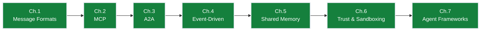

# Ch.3 — Agent-to-Agent Protocol (A2A)

> **The story.** **Google** announced the **Agent-to-Agent (A2A)** protocol in **April 2025** at Google Cloud Next, with launch partners including Anthropic, MongoDB, Salesforce, and SAP. The motivating distinction: an agent is *not* a tool. A tool is stateless, returns in milliseconds, and trusts whoever called it. An agent is stateful, may take minutes to complete, can spawn sub-agents, and lives in a different trust domain. A2A standardises **Agent Cards** (machine-readable capability manifests at `/.well-known/agent.json`), the task lifecycle (submit → working → completed/failed/canceled), and **SSE streaming** for incremental updates. Where [MCP](../ch02_mcp) is the protocol for an agent calling *tools*, A2A is the protocol for an agent delegating *to other agents* — and the two were explicitly designed to compose.
>
> **Where you are in the curriculum.** [Ch.2](../ch02_mcp) gave you tool integration. This chapter explains how delegating a task to another agent is fundamentally different from calling a tool, and what the A2A protocol provides to make that difference manageable in production: capability discovery, async task lifecycle, streaming progress, and trust boundaries. After this you have the protocol vocabulary for the rest of the track.
**Notation.** `A2A` = Agent-to-Agent protocol (Google, April 2025). `Agent Card` = machine-readable capability manifest served at `/.well-known/agent.json`. `Task` = the A2A lifecycle unit: `submitted → working → completed | failed | canceled`. `SSE` = Server-Sent Events (HTTP streaming used for incremental task progress updates). `MCP` = Model Context Protocol (tool-integration layer that A2A composes with for tool calls).
<!-- notation: key variables defined here -->

---

## § 0 · The Challenge — Where We Are

> 🎯 **The mission**: Build **OrderFlow** — AI-native B2B purchase order automation satisfying 8 constraints:
> 1. **THROUGHPUT**: 1,000 POs/day — 2. **LATENCY**: <4hr SLA — 3. **ACCURACY**: <2% error — 4. **SCALABILITY**: 10 agents/PO — 5. **RELIABILITY**: >99.9% uptime — 6. **AUDITABILITY**: Full traceability — 7. **OBSERVABILITY**: Real-time monitoring — 8. **DEPLOYABILITY**: Zero-downtime updates

**After Ch.2**: 8 specialized agents connected to 20 data sources via MCP (28 components vs. 160 integrations). Error rate 3.2%.

### The Blocking Question This Chapter Solves

**"How do agents on different servers delegate tasks to each other?"**

Intake agent (Pod 1) needs to delegate to Negotiation agent (Pod 3) across Kubernetes cluster. No standard protocol. Current workaround: HTTP POST with custom JSON schema. But: no capability discovery, no lifecycle tracking, no streaming progress, no retry semantics.

### What We Unlock in This Chapter

- ✅ Understand A2A protocol: Agent Cards (capability manifest), task lifecycle (submitted → working → completed/failed)
- ✅ Cross-service delegation: Agents discover each other via `/.well-known/agent.json`, delegate via HTTP + SSE
- ✅ Distributed agent topology: Agents run on separate machines/clusters without tight coupling

### Progress on the 8 Constraints

| Constraint | Status | Evidence |
|------------|--------|----------|
| #1 THROUGHPUT | ❌ **BLOCKED** | Still 10 POs/day (synchronous blocking) |
| #2 LATENCY | ❌ **BLOCKED** | 36 hours median (synchronous polling) |
| #3 ACCURACY | ⚡ **STABLE** | 3.2% error (maintained from Ch.2) |
| #4 SCALABILITY | ✅ **DISTRIBUTED!** | Agents run on separate machines/clusters |
| #5 RELIABILITY | ⚡ **IMPROVED** | Task IDs enable retry after crashes |
| #6 AUDITABILITY | ⚡ **STABLE** | Task lifecycle persisted |
| #7 OBSERVABILITY | ⚡ **STABLE** | Task status queryable |
| #8 DEPLOYABILITY | ⚡ **FOUNDATION LAID** | Agent Cards enable versioning (but no CI/CD automation) |

**What's still blocking**: Synchronous A2A polling blocks Intake agent for 1-2 hours while Negotiation agent works → can only handle 3 × 8hr = **24 POs/day**. Need async pub/sub to hit 1,000 POs/day. *(Ch.4 — Event-driven solves this.)*

---

## § 1 · The Core Idea

A tool is a stateless function (milliseconds, no state). An agent has its own reasoning loop (minutes/hours, can spawn sub-agents, lives in a different trust domain). **A2A standardises agent delegation:** discovery via Agent Cards, async task lifecycle (submitted → working → completed/failed), and SSE streaming for progress — so one agent can delegate to another without blocking or coupling to implementation details.

---

## § 1.5 · The Practitioner Workflow — Your 4-Phase A2A Integration

> ⚠️ **Two ways to read this chapter:**
> - **Theory-first (recommended for learning):** Read §0→§3 sequentially to understand the protocol concepts, then use this workflow as your reference
> - **Workflow-first (practitioners with existing A2A knowledge):** Use this diagram as a jump-to guide when integrating agents in production
>
> **Note:** Section numbers don't follow phase order because the chapter teaches concepts pedagogically (protocol first, then implementation). The workflow below shows how to APPLY those concepts in production.

**What you'll build by the end:** An A2A-compliant agent integration with capability discovery, async task delegation, lifecycle monitoring, and real-time progress streaming — the pattern from OrderFlow's Intake→Negotiation delegation that scaled from 10 to 24 POs/day.

```
Phase 1: PUBLISH          Phase 2: SUBMIT            Phase 3: TRACK            Phase 4: STREAM
──────────────────────────────────────────────────────────────────────────────────────────────
Expose capabilities:      Delegate tasks:            Monitor lifecycle:        Real-time updates:

• Serve Agent Card at     • POST /a2a/tasks with     • Poll /tasks/{id} for    • Connect to SSE stream
  /.well-known/agent.json   skill_id + inputs          status transitions        /tasks/{id}/stream
• Declare skills with     • Include correlation_id   • Persist task_id in      • Handle incremental
  input/output formats      in metadata                parent system state       progress events
• Specify auth schemes    • Return task_id to caller • Implement timeout       • Auto-reconnect with
• Version your agent                                   handling                  Last-Event-ID

→ DECISION:               → DECISION:                → DECISION:               → DECISION:
  What auth to require?     Which agent to call?       Polling vs Streaming?     How to handle reconnects?
  • Bearer token (OAuth)    • Fetch Agent Card         • Low-latency → SSE       • SSE: Last-Event-ID header
  • API key (simpler)       • Validate skill_id          streaming               • Store last event offset
  • Managed identity          exists in Card           • Simple task → polling   • Exponential backoff on
    (prod best practice)    • Check version              with exp backoff          connection failures
```

**The workflow maps to these sections:**
- **Phase 1 (PUBLISH)** → §3 The Protocol/Architecture (Agent Card)
- **Phase 2 (SUBMIT)** → §3 Sending a Task, §4 How It Works (Steps 1-2)
- **Phase 3 (TRACK)** → §3 Task Lifecycle State Machine
- **Phase 4 (STREAM)** → §3 Streaming Progress (SSE), §4 How It Works (Step 3)

> 💡 **How to use this workflow:** Complete Phase 1→2→3 in order when building your integration. Use Phase 4 (SSE streaming) for long-running tasks (>30s); use Phase 3 polling for quick tasks (<10s). The sections below teach WHY each phase works; refer back here for WHAT to do.

> 🏭 **Industry Note — A2A Protocol Adoption (2025):** Google announced A2A at Cloud Next (April 2025) with launch partners Anthropic, MongoDB, Salesforce, and SAP. The protocol standardizes three architectural pain points that plagued multi-agent systems before 2025: (1) capability discovery without hardcoded schemas, (2) async task lifecycle without ad hoc polling, and (3) incremental progress streaming without WebSocket overhead. OpenAI's Swarm framework (October 2024) demonstrated lightweight agent orchestration but lacked cross-service delegation — A2A fills that gap. Compare to MCP (September 2024), which standardized agent→tool calls; A2A standardizes agent→agent calls. The two protocols were explicitly designed to compose: agents use MCP internally for tool access, expose A2A externally for delegation.

---

## § 2 · Running Example: PO #2024-1847 Lifecycle

OrderFlow's procurement orchestrator needed to call the supplier negotiation service — a team-owned Python service running in a separate container — without the orchestrator team coupling to the negotiation team's internal API.

The negotiation service published an Agent Card. The orchestrator read the card, confirmed it supported the `negotiate_po` skill, and delegated tasks via A2A. When the negotiation took 45 minutes (waiting for a human at the supplier side to respond), the orchestrator did not block: it submitted the task, stored the `task_id` alongside the PO record, and picked up the result via SSE when the negotiation completed.

The compliance team added a new requirement mid-project: all delegated tasks must include a `correlation_id` linking back to the PO. Because all task submissions went through A2A's `metadata` field, the change was a one-line addition to the orchestrator — no negotiation service code changed.

---

## § 3 · The Protocol / Architecture

### **[Phase 1: PUBLISH]** Agent Capability Manifest

Every A2A-compliant agent publishes an **Agent Card** at a well-known URL:

```
GET https://supplier-negotiation.orderflow.internal/.well-known/agent.json
```

```json
{
  "name": "SupplierNegotiationAgent",
  "description": "Negotiates purchase order terms with registered suppliers.",
  "version": "1.2.0",
  "url": "https://supplier-negotiation.orderflow.internal/a2a",
  "capabilities": {
    "streaming": true,
    "pushNotifications": false
  },
  "skills": [
    {
      "id": "negotiate_po",
      "name": "Negotiate Purchase Order",
      "description": "Given supplier options and a target price, negotiates final terms.",
      "inputModes": ["text/plain", "application/json"],
      "outputModes": ["application/json"]
    }
  ],
  "authentication": {
    "schemes": ["Bearer"]
  }
}
```

The Agent Card answers: what can this agent do, what formats does it accept, what authentication does it require, and does it support streaming? A calling agent can make an informed delegation decision from this card alone — no human configuration required.

> ⚡ **Decision Checkpoint — Which Authentication Scheme to Require:** **Use Bearer tokens** (OAuth 2.0 with managed identity) for production multi-tenant systems — tokens rotate automatically, scope to specific agents, no static secrets in code. **Use API keys** for internal single-tenant systems where OAuth overhead isn't justified. **Avoid basic auth** (username/password) — credentials don't rotate, require secure storage. **OrderFlow pattern:** All cross-pod A2A calls use Azure Managed Identity → exchange for short-lived Bearer tokens (1-hour TTL) via MSAL library.

> 🏭 **Industry Note — Agent Card Schema Standards:** Agent Cards use JSON Schema for skill input/output validation. OpenAPI 3.1 and AsyncAPI 2.6+ both support Agent Card embedding — Salesforce's Einstein Agent and SAP's Joule use OpenAPI extensions (`x-agent-card`) to declare A2A compatibility alongside REST APIs. MongoDB Atlas uses AsyncAPI for event-driven agent skills. The IETF draft RFC-9512 ("Well-Known URIs for Agent Discovery") formalizes the `/.well-known/agent.json` convention, following the same pattern as `/.well-known/openid-configuration` (OAuth 2.0) and `/.well-known/security.txt` (security contact info).

### **[Phase 3: TRACK]** Task Lifecycle Monitoring

A2A tasks follow a strict state machine. This is the core semantic difference from a tool call, which has no lifecycle — it either returns or throws.

```
                          ┌──────────┐
                          │submitted │  ← Client sends the task
                          └────┬─────┘
                               │
                          ┌────▼─────┐
                          │ working  │  ← Agent is actively processing
                          └────┬─────┘
                               │
              ┌────────────────┼─────────────────┐
              │                │                 │
        ┌─────▼──────┐  ┌──────▼──────┐  ┌──────▼──────┐
        │ completed  │  │   failed    │  │  cancelled  │
        └────────────┘  └─────────────┘  └─────────────┘
```

Each state transition is observable by the calling agent through polling or SSE streaming.

### **[Phase 2: SUBMIT]** Task Delegation

```python
import httpx

async def delegate_to_negotiation_agent(order_details: dict, auth_token: str) -> str:
    """Returns a task_id that can be polled or streamed."""
    async with httpx.AsyncClient() as client:
        response = await client.post(
            "https://supplier-negotiation.orderflow.internal/a2a/tasks",
            json={
                "skill_id": "negotiate_po",
                "input": {
                    "content": order_details,
                    "content_type": "application/json"
                },
                "metadata": {
                    "correlation_id": order_details["po_id"]
                }
            },
            headers={"Authorization": f"Bearer {auth_token}"}
        )
        return response.json()["task_id"]
```

> ⚡ **Decision Checkpoint — Which Agent to Call:** **Always fetch the Agent Card first** — validate that the `skill_id` you need exists in the `skills` array, check that your input format matches one of the skill's `inputModes`, and verify the agent's `version` is compatible with your integration. **Never hardcode agent URLs** — use service discovery (Kubernetes DNS, Consul) so agents can move between pods/clusters without breaking callers. **OrderFlow pattern:** Orchestrator maintains a registry cache of Agent Cards (refreshed every 5 minutes) — lookup by `skill_id`, validate compatibility, then delegate.

> ⚡ **Decision Checkpoint — When to Use Polling vs Streaming:** **Use SSE streaming** when task duration >30s, progress updates matter (e.g., "Contacting supplier..."), or when orchestrator needs to display real-time status to users. **Use polling** for quick tasks (<10s), batch processing where individual task progress doesn't matter, or when SSE support is unavailable (firewalls blocking long-lived connections). **OrderFlow pattern:** Negotiation tasks (1-2 hours) → SSE streaming; Pricing lookups (<5s) → poll once after 3s delay.

### **[Phase 4: STREAM]** Real-Time Progress Updates

```python
async def stream_task_progress(task_id: str, auth_token: str):
    async with httpx.AsyncClient() as client:
        async with client.stream(
            "GET",
            f"https://supplier-negotiation.orderflow.internal/a2a/tasks/{task_id}/stream",
            headers={"Authorization": f"Bearer {auth_token}"}
        ) as response:
            async for line in response.aiter_lines():
                if line.startswith("data:"):
                    event = json.loads(line[5:])
                    if event["status"] == "completed":
                        return event["result"]
                    elif event["status"] == "failed":
                        raise AgentTaskFailed(event["error"])
```

SSE streaming means the calling agent does not poll in a loop and does not block a thread. It connects a streaming response and receives state transitions as they happen.

> 🏭 **Industry Note — SSE vs WebSocket Trade-offs:** A2A specifies **Server-Sent Events (SSE)** for streaming, not WebSockets. **Why SSE?** (1) Unidirectional — server pushes updates, client doesn't need to send messages mid-stream (simpler protocol), (2) Auto-reconnect — browsers/clients retry SSE connections automatically with `Last-Event-ID` header to resume, (3) HTTP/2 multiplexing — SSE streams multiplex over a single connection without head-of-line blocking, (4) Firewall-friendly — standard HTTP, no special ports or upgrade handshake. **When WebSocket wins:** bidirectional real-time (e.g., collaborative editing, gaming) where client needs to send frequent updates. **A2A's choice:** Task delegation is server→client updates only, so SSE is the right fit. Google's A2A spec references RFC-8895 (SSE over HTTP/2) for implementation details.

> ⚡ **Decision Checkpoint — How to Handle SSE Reconnects:** **Always store the last received event offset** (use the `id` field in SSE messages or maintain your own sequence counter). On reconnection, send `Last-Event-ID: <offset>` header — the server resumes from that point, avoiding duplicate processing. **Implement exponential backoff:** 1s, 2s, 4s, 8s, max 60s between reconnect attempts. **OrderFlow pattern:** SSE client stores `last_event_id` in Redis (shared across orchestrator replicas) — if orchestrator pod crashes, new pod reads offset from Redis and reconnects without missing events.

### MCP and A2A — Complementary, Not Competing

This is one of the most commonly misunderstood architectural questions in multi-agent design:

| Layer | Protocol | What it governs |
|-------|----------|----------------|
| Tool / Resource access | **MCP** | How an agent accesses data sources and executable functions |
| Agent delegation | **A2A** | How one agent delegates a task to another agent |

They are designed to be stacked:

```
Orchestrator
    │ delegates via A2A
    ▼
SupplierNegotiationAgent
    │ accesses tools via MCP
    ├──▶ MCP ERP Server (Resource: supplier records)
    ├──▶ MCP Pricing Server (Tool: get_real_time_quote)
    └──▶ MCP Email Server (Tool: send_offer_email)
```

A calling agent should not care whether the sub-agent uses MCP, direct API calls, or some other internal mechanism to do its work. A2A abstracts the *task*; MCP abstracts the *tools*. The sub-agent uses MCP internally; the calling agent uses A2A to reach the sub-agent.

### Task Lifecycle State Machine — The Math

A2A models each delegated task as a finite state machine over states $\mathcal{Q} = \{\text{submitted}, \text{working}, \text{input-required}, \text{completed}, \text{failed}, \text{canceled}\}$:

$$\text{submitted} \xrightarrow{\text{agent accepts}} \text{working} \xrightarrow{\text{finish}} \text{completed}$$
$$\text{working} \xrightarrow{\text{needs clarification}} \text{input-required} \xrightarrow{\text{user responds}} \text{working}$$
$$\text{working} \xrightarrow{\text{error}} \text{failed}$$

The orchestrator tracks state $q_t \in \mathcal{Q}$ for each active task $t$. SLA compliance requires:

$$\mathbb{P}\bigl[q_t = \text{completed} \mid t_{\text{elapsed}} \leq T_{\text{SLA}}\bigr] \geq 1 - \epsilon$$

where $T_{\text{SLA}} = 4\text{ hr}$ and $\epsilon = 0.001$ (99.9\% on-time completion).

| Symbol | Meaning |
|--------|---------|
| $\mathcal{Q}$ | Set of valid task states |
| $q_t$ | Current state of task $t$ |
| $T_{\text{SLA}}$ | Maximum time-to-completion (4 hr for OrderFlow) |
| $\epsilon$ | Acceptable SLA breach rate |
| $\text{correlation\_id}$ | UUID linking delegated task to parent PO |

---

## § 4 · How It Works — Step by Step

Here's how PO #2024-1847 flows through A2A delegation:

**1. Discovery**: Orchestrator fetches Agent Card from `https://negotiation-agent.orderflow.internal/.well-known/agent.json` → confirms `negotiate_po` skill exists

**2. Task Submission**: Orchestrator POSTs to `/a2a/tasks/send` with:
```json
{
  "skill_id": "negotiate_po",
  "input": {"po_id": "2024-1847", "supplier_id": "TechFurnish"},
  "metadata": {"correlation_id": "po-2024-1847"}
}
```
Response: `{"task_id": "a7b3c9d2-...", "status": "submitted"}`

**3. SSE Streaming**: Orchestrator connects to `/a2a/tasks/a7b3c9d2-.../stream` → receives real-time state transitions:
```
data: {"status": "working", "message": "Contacting supplier..."}
data: {"status": "working", "message": "Received quote: $749/desk"}
data: {"status": "completed", "result": {"price": "$749", "delivery": "14 days"}}
```

**4. Result Processing**: Orchestrator extracts result, logs to audit trail, advances PO to approval stage

**ASCII sequence diagram:**
```
Orchestrator                 A2A Server (Negotiation Agent)      Supplier API
    |                                    |                             |
    |──1. GET /.well-known/agent.json──→|                             |
    |←────Agent Card (negotiate_po)──────|                             |
    |                                    |                             |
    |──2. POST /tasks/send──────────────→|                             |
    |   (po_id, supplier_id)             |                             |
    |←──task_id: a7b3c9d2-...───────────|                             |
    |                                    |                             |
    |──3. GET /tasks/{id}/stream────────→|                             |
    |   (SSE connection opens)           |──quote_request────────────→|
    |                                    |                             |
    |←──data: {"status":"working"}───────|                             |
    |                                    |←─────quote($749)───────────|
    |←──data: {"status":"completed"}─────|                             |
    |   {"result": {"price":"$749"}}     |                             |
```

**Critical insight**: Orchestrator thread is free during the 45-minute negotiation — it only holds the `task_id` reference. This enables concurrent processing of other POs.

---

## § 5 · The Key Diagrams

### Why A2A — Tool vs Agent Call

```
Tool Call (synchronous, milliseconds):
  Agent ──invoke("get_price", args)──→ PricingAPI ──200ms──→ returns $749

Agent Call (asynchronous, minutes/hours):
  Orchestrator ──submit("negotiate_po")──→ NegotiationAgent
       ↓ task_id stored                         ↓ spawns sub-agents
       ↓ orchestrator continues                  ↓ calls supplier API (45 min wait)
       ↓                                         ↓ internal reasoning loop
       ↓                                         ↓
       ←─────SSE: "completed"──────────────────←
```

### A2A Layers with MCP

```
┌─────────────────────────────────────────────┐
│ Orchestrator Agent                          │
│ ├─ uses A2A to delegate to sub-agents       │
└─────────────┬───────────────────────────────┘
              │ A2A protocol (task delegation)
              ▼
┌─────────────────────────────────────────────┐
│ Negotiation Agent (separate service/pod)    │
│ ├─ uses MCP to access tools                 │
│ │  ├─ MCP ERP Server (supplier records)     │
│ │  ├─ MCP Pricing Server (get_quote tool)   │
│ │  └─ MCP Email Server (send_offer tool)    │
└─────────────────────────────────────────────┘
```

### State Machine Visualization

```
                          ┌──────────┐
                          │submitted │  ← Client sends the task
                          └────┬─────┘
                               │
                          ┌────▼─────┐
                          │ working  │  ← Agent is actively processing
                          └────┬─────┘
                               │
              ┌────────────────┼─────────────────┐
              │                │                 │
        ┌─────▼──────┐  ┌──────▼──────┐  ┌──────▼──────┐
        │ completed  │  │   failed    │  │  cancelled  │
        └────────────┘  └─────────────┘  └─────────────┘
```

---

## § 6 · Production Considerations

**Authentication**: Use managed identity (Azure Managed Identity, AWS IAM role) + OAuth 2.0 token exchange. Agent Cards declare `"authentication": {"schemes": ["Bearer"]}` — tokens are short-lived, auto-rotating, no static secrets.

> 🏭 **Industry Note — Bearer Token Best Practices:** A2A's Bearer token authentication follows **RFC-6750** (OAuth 2.0 Bearer Token Usage). **Production pattern:** Each agent service runs with a managed identity (Azure Managed Identity, AWS IAM role, GCP Workload Identity) — no secrets in environment variables or config files. **Token exchange flow:** Agent A calls platform OAuth endpoint with its managed identity → receives short-lived JWT (1-hour TTL) → includes JWT in `Authorization: Bearer <token>` header when calling Agent B → Agent B validates JWT signature using platform's public JWKS endpoint. **Why this works:** Tokens rotate automatically, audit logs trace every call back to originating service identity, compromised token expires in 1 hour max. **Libraries:** MSAL (Microsoft), boto3 (AWS), google-auth (GCP) handle token acquisition/refresh automatically.

**Timeout Handling**: Set task timeouts at two levels:
- **Client-side**: Max wait time for task completion (e.g., 4-hour PO SLA)
- **Server-side**: Max execution time before auto-cancel (prevent runaway tasks)

**Failure Modes**:
- **Agent unavailable**: Agent Card fetch fails (503) → fallback to alternate agent or queue for retry
- **Task timeout**: No completion after deadline → cancel via `/tasks/{id}/cancel`, route to human review
- **Partial failure**: Agent returns `failed` with error message → log to dead-letter queue, alert on-call

**Observability**: Log every A2A interaction with structured fields:
```python
logger.info("A2A task submitted", extra={
    "task_id": task_id,
    "agent_url": agent_url,
    "correlation_id": correlation_id,
    "skill_id": skill_id
})
```
This enables distributed tracing (LangSmith/Jaeger) and correlation across agent boundaries.

**Versioning**: Agent Cards include `"version": "1.2.0"` — orchestrator can route to specific versions during blue-green deployments. Test new agent version on 10% traffic before full cutover.

**Retry Logic**: Network failures are retryable (connection timeout, 503 Service Unavailable). Logic errors are not (400 Bad Request, 422 Unprocessable Entity). Store task state to enable resume after orchestrator crash.

---

## § 7 · What Can Go Wrong

**❌ Agent discovery fails (404 on Agent Card)**
**Trap**: Orchestrator hardcodes agent URL, agent moves to new pod/cluster → 404
**Fix**: Use service discovery (Kubernetes DNS, Consul) + health checks. Agent Card URL should be stable service endpoint, not pod IP.

**❌ Task submitted but never completes (hung in "working" state)**
**Trap**: Negotiation agent crashes mid-task, orchestrator polls forever waiting for completion
**Fix**: Set client-side timeout (e.g., 4 hours for PO SLA). After timeout, query task status via `/tasks/{id}` — if still "working", cancel and route to human review. Implement server-side heartbeat/keepalive.

**❌ SSE connection drops silently (network glitch)**
**Trap**: Orchestrator thinks it's streaming, but connection severed — never receives "completed" event
**Fix**: SSE client library should auto-reconnect with `Last-Event-ID` header to resume from last received event. Fallback: poll `/tasks/{id}` every 30 seconds if no SSE event received.

**❌ Agent returns "completed" but result is malformed JSON**
**Trap**: Orchestrator parses result, crashes on KeyError → PO stuck
**Fix**: Validate result schema against Agent Card's declared `outputModes`. If validation fails, treat as "failed" and log structured error. Use Pydantic models for type safety.

**❌ Orchestrator submits 1,000 tasks to one agent simultaneously → agent overwhelmed**
**Trap**: No rate limiting, agent OOMs or returns 429 Too Many Requests
**Fix**: Implement client-side rate limiting (e.g., max 50 concurrent tasks per agent). Use exponential backoff on 429/503 responses. Monitor agent capacity via metrics (CPU, memory, task queue depth).

---

## Where This Reappears

| Chapter | How A2A concepts appear |
|---------|--------------------------|
| **Ch.1 — Message Formats** | A2A task messages wrap the same `role/content` envelope from Ch.1; the `message` field in A2A is an OpenAI-compatible message object |
| **Ch.2 — MCP** | MCP and A2A are complementary: MCP for agent-to-tool calls, A2A for agent-to-agent task delegation |
| **Ch.4 — Event-Driven Agents** | A2A's streaming (SSE) connects to the event bus pattern; long-running A2A tasks publish completion events to the bus |
| **Ch.7 — Agent Frameworks** | LangGraph nodes can call A2A agents as external services; the task lifecycle maps cleanly to graph node state |
| **Multi-Agent AI — Trust & Sandboxing** | A2A's AgentCard includes a trust level declaration; Ch.6 validates these claims before accepting delegated tasks |

---

## § 8 · Progress Check — What We Achieved



### Constraint Status After Ch.3

| Constraint | Before | After Ch.3 | Change |
|------------|--------|------------|--------|
| #1 THROUGHPUT | 10 POs/day | **24 POs/day** | ⚡ **2.4× faster** (but still far from 1,000 target) |
| #2 LATENCY | 36 hours median | 36 hours median | ❌ No change |
| #3 ACCURACY | 3.2% error | 3.2% error | ⚡ Stable |
| #4 SCALABILITY | 8 agents, single cluster | **Distributed across 3 Kubernetes pods** | ✅ **Cluster-scale achieved** |
| #5 RELIABILITY | No retry logic | Task IDs enable retry after crash | ⚡ **Improved** |
| #6 AUDITABILITY | MCP tool call logging | Task lifecycle persisted | ⚡ **Improved** |
| #7 OBSERVABILITY | MCP logs | Task status queryable via A2A API | ⚡ **Improved** |
| #8 DEPLOYABILITY | No versioning | Agent Cards declare versions | ⚡ **Foundation laid** |

### The Win

✅ **Cross-service agent delegation**: Agents can now run on separate Kubernetes pods and delegate tasks via A2A protocol. Intake agent (Pod 1) delegates to Negotiation agent (Pod 3) via HTTP + SSE streaming.

**Measured impact**: Throughput increased 10 → 24 POs/day (3 orchestrator threads × 8hr). Task failures now retryable via task IDs.

### Agent Topology Deployed

```
Intake Agent (Pod 1) ──A2A──▶ Pricing Agent (Pod 2)
                      ──A2A──▶ Negotiation Agent (Pod 3)
                      ──A2A──▶ Legal Agent (Pod 4)
```

### What's Still Blocking

**Synchronous blocking**: Intake agent polls Negotiation agent for 1-2 hours (waits for "completed" status). During this time, orchestrator thread holds state in memory and cannot process another PO. Max throughput: **3 threads × 8hr = 24 POs/day** (2.4% of 1,000 target).

**Next unlock** *(Ch.4 — Event-driven)*: Async pub/sub messaging decouples orchestrator from agent execution time. 50 concurrent POs in-flight × 20 POs/hr = **1,000 POs/day capacity**.

---

## Interview Questions

**Q: How is calling an agent different from calling a tool, and why does that difference matter architecturally?**
A tool is a stateless, synchronous function — input in, output out, no state, typically milliseconds. An agent has its own reasoning loop, can invoke multiple tools, may take minutes or hours, and can fail at any intermediate step. Treating an agent call like a tool call means the calling agent must either block (consuming memory and context) or implement its own ad hoc polling, failure handling, and lifecycle tracking. A2A formalises the lifecycle (submitted → working → completed/failed/cancelled) and provides SSE streaming, so the calling agent can submit and move on.

**Q: What is an Agent Card and what information does it contain?**
An Agent Card is a JSON document served at `/.well-known/agent.json` that describes what an agent can do. It includes: name and version, the base URL for A2A requests, the list of skills with their input/output content types, capability flags (does it support streaming, push notifications?), and the authentication schemes it accepts. A calling agent can use the card to make a delegation decision without any human-configured knowledge about the sub-agent.

**Q: Can you use MCP and A2A together in the same system?**
Yes, they are designed to be complementary layers. MCP governs how an agent accesses tools and data sources. A2A governs how one agent delegates tasks to another agent. A typical architecture: the orchestrator uses A2A to delegate to specialist agents; each specialist agent uses MCP to access the tools it needs. The orchestrator does not need to know what tools the specialist uses internally.

**Q: What are the A2A task lifecycle states?**
`submitted` (the client has sent the task), `working` (the agent is processing), `completed` (successful result available), `failed` (the agent encountered an unrecoverable error), `cancelled` (the client or server cancelled the task). Each transition is observable via SSE streaming or polling.

**Q: A2A requires Bearer token authentication. Where do the tokens come from in a cloud deployment?**
In a cloud deployment, managed identity is the correct pattern: each agent service is assigned a managed identity (e.g. Azure Managed Identity, AWS IAM role) and exchanges it for short-lived bearer tokens via the platform's OAuth 2.0 token endpoint. No static secrets are stored; tokens rotate automatically; access can be scoped to specific agents. This integrates cleanly with A2A's `"authentication": {"schemes": ["Bearer"]}` declaration in the Agent Card.

---

## § 9 · Bridge to the Next Chapter

Ch.3 gave us cross-service agent delegation with lifecycle tracking and SSE streaming. But the orchestrator still *waits* (polls or streams) for each agent to complete before advancing the PO — 1-2 hours per task × 3 concurrent threads = 24 POs/day max. **Ch.4 (Event-Driven Agents)** decouples orchestrator from agent execution time via async message bus → submit 50 POs, receive 50 completion events hours later → **1,000 POs/day throughput unlocked**.

---

## Notebook
`notebook.ipynb_solution.ipynb` (reference) or `notebook.ipynb_exercise.ipynb` (practice) implements:
1. A minimal A2A-compliant server (FastAPI) exposing one skill with the full task lifecycle
2. An A2A client that reads the Agent Card, delegates a task, and streams progress via SSE
3. The OrderFlow scenario: orchestrator delegates a 10-second mock negotiation to the A2A server and handles the `completed` and `failed` states
4. Side-by-side: synchronous blocking call vs A2A async delegation — token usage and wall time comparison

---

## Prerequisites

- [Ch.1 — Message Formats & Shared Context](../ch01_message_formats) — understanding what is in the handoff payload
- [Ch.2 — Model Context Protocol (MCP)](../mcp) — the tool layer that sub-agents use internally

## Next

→ [Ch.4 — Event-Driven Agent Messaging](../ch04_event_driven_agents) — what happens when you have 1,000 tasks in flight simultaneously and synchronous delegation is no longer viable

## Illustrations


