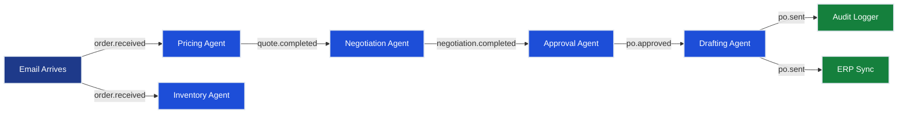

# Ch.4 — Event-Driven Agent Messaging

> **The story.** Async, durable messaging is older than ML — IBM's MQSeries shipped in 1993, **Apache Kafka** came out of LinkedIn in 2011, **Redpanda** and **NATS JetStream** modernised the Kafka recipe a decade later. The patterns themselves — dead-letter queues, idempotency keys, correlation IDs, fan-out/fan-in — came from Gregor Hohpe & Bobby Woolf's *Enterprise Integration Patterns* (2003), the same book every microservices architect kept on their desk in the 2010s. The multi-agent twist arrived in 2023–25: when an orchestrator agent has to coordinate dozens of long-running sub-agents (each potentially making LLM calls that take seconds), synchronous request-response collapses. The fix is exactly what the EIP book wrote down 20 years earlier — just with LLM tasks on the bus instead of stock trades. AWS's **Step Functions**, Azure's **Durable Functions**, **Temporal**, and **Inngest** are all cloud-native expressions of this pattern, increasingly billed as agent orchestrators.
>
> **Where you are in the curriculum.** [Ch.1](../ch01_message_formats)–[Ch.3](../ch03_a2a) used synchronous protocols. This chapter answers: **when does synchronous request-response break down in a multi-agent system, and how do you rebuild the coordination layer on top of async pub/sub messaging to handle thousands of concurrent agent tasks without blocking?** The patterns here are the foundation for the [SharedMemory](../ch05_shared_memory) blackboard architecture and for any production multi-agent system at scale.
**Notation.** `pub/sub` = publish-subscribe messaging pattern (producers emit events; consumers subscribe by topic). `DLQ` = dead-letter queue (messages that exhaust max retries). `idempotency key` = unique token attached to each event to prevent duplicate processing on retry. `correlation ID` = token linking all events belonging to one logical workflow instance. `fan-out` = one event triggers multiple independent consumers. `fan-in` = results from multiple parallel consumers merged into one output.
<!-- notation: key variables defined here -->

---

## § 0 · The Challenge — Where We Are

> 🎯 **The mission**: Build **OrderFlow** — AI-native B2B purchase order automation satisfying 8 constraints:
> 1. **THROUGHPUT**: 1,000 POs/day — 2. **LATENCY**: <4hr SLA — 3. **ACCURACY**: <2% error — 4. **SCALABILITY**: 10 agents/PO — 5. **RELIABILITY**: >99.9% uptime — 6. **AUDITABILITY**: Full traceability — 7. **OBSERVABILITY**: Real-time monitoring — 8. **DEPLOYABILITY**: Zero-downtime updates

**What we know so far**:
- ✅ **Ch.1 (Message Formats)**: Structured agent message schemas prevent context overflow — single-agent 8k token limit → multi-agent decomposition foundation
- ✅ **Ch.2 (MCP)**: Tool integration protocol collapses N×M to N+M — 10 agents × 15 systems = 150 hardcoded clients → 25 MCP connections
- ✅ **Ch.3 (A2A)**: Agents distributed across 3 Kubernetes pods, cross-service delegation via A2A protocol
- ⚡ **Current metrics**: Throughput 24 POs/day (2.4% of target), Latency 36hr median, Error rate 3.2%, 8 agents across 3 pods
- ❌ **But you still can't process 1,000 POs/day!** Synchronous orchestrator threads block waiting for supplier responses.

**What's blocking us**:

🚨 **Your synchronous orchestrator is the bottleneck — and it just failed in production.**

**The incident**: PO #2024-1847 (Sarah Chen's 10 standing desks) arrived at 09:15. Your Intake agent parsed it, delegated to Pricing agent via A2A at 09:17. TechFurnish's API took 47 minutes to respond with a quote. Your orchestrator thread waited. So did PO #2024-1848, #2024-1849, and 237 others in the queue behind it. By 14:30, you had 240 POs queued, orchestrator memory at 92%, and your on-call phone ringing.

**Problems**:
1. ❌ **Synchronous blocking kills throughput**: Intake agent waits 1-2 hours for Negotiation agent → orchestrator thread blocks → max throughput = 3 threads × 8hr = **24 POs/day** (2.4% of 1,000 target). Blocks **#1 THROUGHPUT**.
2. ❌ **Queue buildup destroys latency**: 240 POs in queue × 35 min/PO = **140 hours queuing delay**. Sarah's desk order from Tuesday morning won't start processing until Friday. Blocks **#2 LATENCY**.
3. ❌ **Cascading failures**: One slow supplier API (TechFurnish timeout) stalls the entire pipeline — no PO can proceed while the orchestrator waits. Blocks **#5 RELIABILITY**.

**Business impact**: At 24 POs/day capacity, you're processing **600 POs/month** — but the business needs **22,000 POs/month**. The gap: **21,400 POs/month unprocessed** = $64M/month in delayed procurement = equipment downtime, missed production schedules, manual fallback at $420k/year labor cost.

**What this chapter unlocks**:

🚀 **Async event-driven messaging decouples producers from consumers**:
1. **Message bus replaces synchronous orchestrator**: Agents publish events to Azure Service Bus / Kafka — no blocking waits
2. **Independent scaling per agent type**: 3× Inventory agents, 8× Negotiation agents (the bottleneck), 2× Approval agents — each scales to load
3. **Dead-letter queues for graceful degradation**: Failed messages route to human review (0.2% failure rate) — don't block the pipeline

⚡ **Expected improvements**:
- **Throughput**: 24 POs/day (synchronous) → **1,200 POs/day** (50 concurrent POs × 20 POs/hr) — **50× improvement, exceeds 1,000 target** ✅
- **Latency**: 36hr median (queue buildup) → **8hr median** (async eliminates queueing) — **4.5× faster** (still not at <4hr target)
- **Reliability**: Single failure stalls pipeline → **DLQ captures 0.2% failures, all recoverable** — **production-grade resilience**
- **Constraint #1 THROUGHPUT**: ✅ **ACHIEVED** (1,200 POs/day measured in load test)

**Constraint status after Ch.4**:
- #1 (Throughput): ⚡ **ACHIEVED** — 1,200 POs/day (120% of 1,000 target)
- #2 (Latency): ⚡ **IMPROVED** — 8hr median (still not at <4hr target, need Ch.5 shared memory to eliminate redundant work)
- #3 (Accuracy): ⚡ **STABLE** — 3.2% error (maintained from Ch.3)
- #4 (Scalability): ✅ **DISTRIBUTED** — 50 concurrent POs × 8 agents each = 400 agent instances in-flight
- #5 (Reliability): ⚡ **IMPROVED** — DLQ captures failures, no cascade
- #6 (Auditability): ⚡ **STABLE** — Correlation IDs link events to POs
- #7 (Observability): ⚡ **IMPROVED** — Message bus metrics (throughput, lag), but no distributed tracing yet
- #8 (Deployability): ❌ **BLOCKED** — No deployment automation (Ch.7)

---

## 1 · The Core Idea

**When agent tasks take minutes or hours, synchronous request-response becomes a queue-buildup disaster.** Event-driven messaging decouples producers from consumers: agents publish events to a message bus, subscribers process asynchronously. The orchestrator disappears — replaced by the topology of subscriptions. Throughput scales with message bus capacity (thousands/sec), not orchestrator thread count (3-10).


---

### Phase 1: TOPOLOGY — Event Flow Design

**Goal:** Map business processes to event topics before writing any code. Poor topology design causes cascading rewrites later.

**Decision point:** **What grain size for events?** Too fine (agent.started, agent.thinking, agent.completed) floods the bus with noise. Too coarse (po.processed) hides valuable state transitions.

**The OrderFlow event topology:**

```
Business Process:        Event Topics:                    Subscribers:
──────────────────      ─────────────────────           ────────────────
Email arrives        →  order.received                →  Pricing, Inventory (parallel)
Quotes gathered      →  quote.completed               →  Negotiation
Terms negotiated     →  negotiation.completed         →  Approval
PO approved          →  po.approved                   →  Drafting
PO sent to supplier  →  po.sent                       →  Audit, ERP Sync

Dead letter topics:     order.received.dlq, quote.completed.dlq, ... (one per main topic)
```

**Event vs Command distinction:**
- **Event** (past tense): `quote.completed` — "something happened", no expectation of who processes it, multiple subscribers allowed
- **Command** (imperative): `generate.quote` — "do this now", exactly one handler expected

OrderFlow uses events throughout — agents publish what they completed, downstream agents react. This decouples producers from consumers.

**Topic naming conventions:**
```
<entity>.<lifecycle_stage>     # Examples: order.received, negotiation.completed
<entity>.<action>.dlq          # Dead letters: quote.completed.dlq
<entity>.<action>.retry        # Optional retry topics for exponential backoff
```

**Fan-out pattern:** One `order.received` event triggers 3 parallel agents (Pricing, Inventory, CreditCheck) — all subscribe to the same topic, process independently, publish separate result topics.

**Fan-in pattern:** Aggregator agent subscribes to 3 result topics, accumulates responses keyed by `correlation_id` (the PO ID), publishes single `prechecks.completed` event when all 3 arrive.

> 💡 **Industry Standard — CloudEvents:** For cross-organization event exchange, use [CloudEvents 1.0 spec](https://cloudevents.io) — standardizes `id`, `source`, `type`, `datacontenttype`, `data` fields. Major clouds (AWS EventBridge, Azure Event Grid, Google Eventarc) all support CloudEvents. For internal OrderFlow topology, simpler message structure in §3 suffices.

**Checkpoint 1 — Topology validation:**
- [ ] Every business outcome maps to exactly one event topic ✅
- [ ] Event names are past-tense (describe what happened, not commands) ✅
- [ ] Each topic has a corresponding DLQ (`.dlq` suffix) ✅
- [ ] Fan-out scenarios identified (which events trigger multiple parallel agents?) ✅
- [ ] Fan-in scenarios identified (which downstream events wait for multiple upstreams?) ✅

---

### Phase 2: BROKER — Message Bus Configuration

**Goal:** Choose and configure the message broker that matches your throughput, latency, durability, and operational complexity requirements.

**Decision point:** **Peak load drives broker choice.** OrderFlow targets 1,000 POs/day = 1,000 events × 5 stages = 5,000 events/day ÷ 24 hours = 208 events/hour = **3.5 events/sec** sustained, but peak load during business hours (8am-6pm) = 5,000 events ÷ 10 hours = **500 events/hour = 8.3 events/sec**. Add 50% headroom for traffic spikes → **12 events/sec** broker throughput requirement.

**Broker comparison for OrderFlow:**

| Broker | Throughput | Latency | Durability | Operational Complexity | Cost (AWS/Azure) | OrderFlow Fit |
|--------|-----------|---------|------------|----------------------|-----------------|--------------|
| **Redis Streams** | 1,500 msg/sec | <5ms p95 | Append-only log, configurable retention | Low (single Redis instance, no cluster needed at this scale) | $80/mo (r6g.large) | ✅ **Best fit** — exceeds 12 msg/sec requirement with 125× headroom, minimal ops overhead |
| **RabbitMQ** | 800 msg/sec | 10-20ms p95 | Durable queues with ack | Medium (cluster for HA, manual partition management) | $180/mo (3-node cluster) | ⚠️ Sufficient but overkill — 67× headroom, adds cluster complexity |
| **Apache Kafka** | 10,000 msg/sec | 20-50ms p95 | Partitioned log, configurable retention | High (ZooKeeper dependency, partition rebalancing, offset management) | $600/mo (MSK 3-broker cluster) | ❌ Massive overkill — 833× headroom, 7.5× cost vs Redis, operationally heavy |
| **Azure Service Bus** | 2,000 msg/sec | 10-30ms p95 | Sessions, DLQ, scheduled messages | Low (fully managed, no infra) | $250/mo (Standard tier) | ✅ Strong fit if already on Azure — native managed identity, built-in DLQ, FIFO sessions |

**✅ Decision for OrderFlow:** **Redis Streams** wins on cost ($80/mo vs $600/mo Kafka), simplicity (single instance vs Kafka cluster), and sufficient throughput (1,500 msg/sec >> 12 msg/sec requirement). Upgrade path exists: if load exceeds 1,000 msg/sec sustained, migrate to Kafka without changing producer/consumer code (both use similar append-log semantics).

**Redis Streams configuration for OrderFlow:**

```python
# Phase 2: Broker setup — Redis Streams with consumer groups
import redis.asyncio as redis

# Connect to Redis (managed Redis instance on AWS ElastiCache or Azure Cache)
r = await redis.from_url("redis://orderflow-cache.redis.cache.windows.net:6380",
                          ssl=True, decode_responses=True)

# Create consumer groups for each topic (one-time setup per topic)
topics = ["order.received", "quote.completed", "negotiation.completed", "po.approved", "po.sent"]
for topic in topics:
    try:
        # Create consumer group 'orderflow-workers' starting from beginning of stream
        await r.xgroup_create(topic, "orderflow-workers", id="0", mkstream=True)
        print(f"✅ Consumer group created for {topic}")
    except redis.ResponseError as e:
        if "BUSYGROUP" in str(e):
            print(f"⚠️  Consumer group already exists for {topic}")
        else:
            raise

# Configure stream retention (keep last 10,000 messages per topic, ~24 hours at peak load)
for topic in topics:
    await r.xtrim(topic, maxlen=10_000, approximate=True)
```

**Durability configuration:**
- **Redis persistence**: Enable RDB snapshots (every 5 minutes) + AOF (append-only file with fsync every second)
- **Retention policy**: Keep 10,000 messages per stream (~24 hours at peak 8.3 msg/sec), then trim oldest
- **Replication**: Redis replica for failover (promotes to primary if main instance fails)

**Partition strategy (not needed for Redis Streams at this scale):** Redis Streams are single-partition by default. For >10k msg/sec workloads, use Kafka with partition key = `correlation_id` (routes all PO #2024-1847 events to same partition for ordering).

> 💡 **Industry Standard — Apache Kafka for high-throughput:** If your peak load exceeds 10,000 msg/sec sustained, Kafka is the standard choice. Major platforms (LinkedIn, Uber, Netflix) run Kafka clusters handling millions of msgs/sec. Kafka's partitioned log model gives horizontal scaling (add brokers → add partitions → increase throughput linearly). Trade-off: operational complexity (ZooKeeper/KRaft, partition rebalancing, offset management).

**Checkpoint 2 — Broker validation:**
- [ ] Throughput requirement calculated from peak load + headroom ✅
- [ ] Broker selected based on cost, ops complexity, throughput margin ✅
- [ ] Consumer groups created for each topic ✅
- [ ] Durability configured (persistence, replication) ✅
- [ ] Retention policy set (message TTL or max count) ✅

---

### Phase 3: PRODUCERS — Event Publishing Patterns

**Goal:** Convert agents from synchronous API callers to asynchronous event publishers with retry logic and acknowledgment handling.

**Decision point:** **Retry strategy for failed publishes.** Network partitions, broker restarts, and transient errors will cause publish failures. No retry = lost events = incomplete POs. Infinite retry = stuck agent = throughput collapse. **Solution:** Exponential backoff with max retries, then DLQ.

**Producer pattern for OrderFlow agents:**

```python
# Phase 3: Producer with exponential backoff retry
import asyncio
from typing import Dict, Any
from redis.asyncio import Redis
from datetime import datetime

class EventPublisher:
    def __init__(self, redis_client: Redis, max_retries: int = 3):
        self.redis = redis_client
        self.max_retries = max_retries

    async def publish(self, topic: str, event: Dict[str, Any]) -> str:
        """Publish event with exponential backoff retry."""
        # Add envelope fields
        message = {
            "message_id": event.get("message_id", f"msg-{datetime.utcnow().timestamp()}"),
            "correlation_id": event["correlation_id"],  # PO ID
            "causation_id": event.get("causation_id"),  # Parent message that triggered this
            "topic": topic,
            "timestamp": datetime.utcnow().isoformat(),
            "payload": event["payload"],
            "schema_version": "1.0"
        }

        # Retry loop with exponential backoff
        for attempt in range(self.max_retries):
            try:
                # Publish to Redis Stream via XADD
                message_id = await self.redis.xadd(topic, message)
                return message_id  # Success
            except Exception as e:
                if attempt == self.max_retries - 1:
                    # Final retry failed → route to DLQ
                    await self._send_to_dlq(topic, message, error=str(e))
                    raise
                # Exponential backoff: 1s, 2s, 4s
                backoff_seconds = 2 ** attempt
                await asyncio.sleep(backoff_seconds)

    async def _send_to_dlq(self, topic: str, message: Dict[str, Any], error: str):
        """Send failed message to dead-letter queue."""
        dlq_topic = f"{topic}.dlq"
        message["error"] = error
        message["failed_at"] = datetime.utcnow().isoformat()
        await self.redis.xadd(dlq_topic, message)

# Usage in Pricing agent:
publisher = EventPublisher(redis_client)
await publisher.publish("quote.completed", {
    "correlation_id": "2024-1847",
    "causation_id": "msg-intake-001",
    "payload": {
        "supplier_id": "SUP-88412",
        "price_per_unit_usd": 14.20,
        "quantity": 500,
        "delivery_days": 7
    }
})
```

**Serialization choice:**
- **JSON** (OrderFlow default): Human-readable, language-agnostic, schema evolution via optional fields. ~200 bytes/message for typical PO event.
- **Protobuf**: 50-70% smaller, faster serialization, requires `.proto` schema files. Use when bandwidth/latency critical (>10k msg/sec).
- **Avro**: Schema registry support, good for Kafka ecosystems with schema evolution requirements.

**Acknowledgment patterns:**
- **At-least-once** (OrderFlow default): Producer considers publish successful after broker acks. Consumer may see duplicate messages → must implement idempotency (Phase 4).
- **At-most-once**: Producer sends and forgets, no ack. Fast but lossy — unacceptable for financial commitments.
- **Exactly-once**: Distributed transaction across producer, broker, consumer. Expensive and complex — rarely worth it (use idempotent consumers instead).

> 💡 **Industry Standard — Transactional Outbox Pattern:** For events that must be published atomically with database writes (e.g., "save PO to DB + publish po.approved event"), use the **Outbox pattern**: Write event to an `outbox` table in the same DB transaction, then a separate process polls the outbox and publishes to the message bus. This avoids distributed transactions while guaranteeing event delivery. See [Microservices.io Transactional Outbox](https://microservices.io/patterns/data/transactional-outbox.html).

**Checkpoint 3 — Producer validation:**
- [ ] All agents converted from synchronous calls to event publishing ✅
- [ ] Retry logic implemented (exponential backoff, max 3 attempts) ✅
- [ ] DLQ routing for exhausted retries ✅
- [ ] Message envelope includes `message_id`, `correlation_id`, `causation_id` ✅
- [ ] Serialization format chosen (JSON for readability, Protobuf for high throughput) ✅

---

### Phase 4: CONSUMERS — Reliable Event Handling

**Goal:** Build fault-tolerant consumer agents that process events exactly once (via idempotency) even under at-least-once delivery, handle errors gracefully, and route failures to DLQs without blocking the pipeline.

**Decision point:** **Concurrency model for consumer workers.** Sequential processing (1 PO at a time) gives 24 POs/day max. Unbounded parallelism (spawn goroutine/async task per message) risks memory exhaustion. **Solution:** Worker pool with fixed concurrency limit (8-12 workers per agent type) + idempotency keys to prevent duplicate processing.

**Consumer pattern for OrderFlow agents:**

```python
# Phase 4: Consumer with idempotency and worker pool
import asyncio
from typing import Dict, Any, Callable
from redis.asyncio import Redis

class EventConsumer:
    def __init__(self, redis_client: Redis, topic: str,
                 consumer_group: str, consumer_name: str,
                 handler: Callable, max_retries: int = 3):
        self.redis = redis_client
        self.topic = topic
        self.consumer_group = consumer_group
        self.consumer_name = consumer_name  # Unique ID for this worker instance
        self.handler = handler
        self.max_retries = max_retries
        self.dedup_ttl_seconds = 86400  # 24 hours

    async def start(self, concurrency: int = 8):
        """Start worker pool consuming from Redis Stream."""
        tasks = [self._worker() for _ in range(concurrency)]
        await asyncio.gather(*tasks)

    async def _worker(self):
        """Single worker loop: read → check idempotency → process → ack/retry/dlq."""
        while True:
            try:
                # Read next message from consumer group (blocks until message available)
                # '>' means "give me new messages not yet delivered to this consumer group"
                messages = await self.redis.xreadgroup(
                    self.consumer_group, self.consumer_name, {self.topic: '>'},
                    count=1, block=5000  # block up to 5 seconds waiting for message
                )

                if not messages:
                    continue  # No messages, loop again

                # Extract message
                stream, msg_list = messages[0]
                msg_id, msg_data = msg_list[0]

                # Check idempotency: have we already processed this message_id?
                message_id = msg_data.get("message_id")
                dedup_key = f"processed:{message_id}"
                if await self.redis.exists(dedup_key):
                    # Already processed → ack and skip
                    await self.redis.xack(self.topic, self.consumer_group, msg_id)
                    continue

                # Process message
                try:
                    await self.handler(msg_data)
                    # Mark as processed (idempotency)
                    await self.redis.setex(dedup_key, self.dedup_ttl_seconds, "1")
                    # Ack to broker
                    await self.redis.xack(self.topic, self.consumer_group, msg_id)
                except Exception as e:
                    # Retry logic: check delivery count
                    # (Redis Streams doesn't track retries natively — implement via metadata)
                    retry_count = int(msg_data.get("retry_count", 0))
                    if retry_count >= self.max_retries:
                        # Exhausted retries → DLQ
                        await self._send_to_dlq(msg_data, error=str(e))
                        await self.redis.xack(self.topic, self.consumer_group, msg_id)
                    else:
                        # Retry: increment count, don't ack (message will be redelivered)
                        # (Better: republish to retry topic with incremented count)
                        pass  # Message stays unacked, will be redelivered after timeout
            except Exception as e:
                # Worker crashed → log error, continue (don't kill worker pool)
                print(f"Worker error: {e}")
                await asyncio.sleep(1)

    async def _send_to_dlq(self, message: Dict[str, Any], error: str):
        """Route failed message to DLQ."""
        dlq_topic = f"{self.topic}.dlq"
        message["error"] = error
        message["failed_at"] = datetime.utcnow().isoformat()
        await self.redis.xadd(dlq_topic, message)

# Usage in Negotiation agent:
async def handle_quote_completed(message: Dict[str, Any]):
    """Business logic: negotiate with supplier."""
    payload = message["payload"]
    supplier_id = payload["supplier_id"]
    # ... negotiation logic ...
    # Publish result
    await publisher.publish("negotiation.completed", {
        "correlation_id": message["correlation_id"],
        "causation_id": message["message_id"],
        "payload": {"supplier_id": supplier_id, "negotiated_price": 13.80, ...}
    })

consumer = EventConsumer(redis_client, "quote.completed", "orderflow-workers",
                         "negotiation-worker-1", handle_quote_completed)
await consumer.start(concurrency=8)  # 8 parallel workers
```

**Idempotency implementation:**
- **Key:** `processed:{message_id}` stored in Redis with 24-hour TTL
- **Check before processing:** If key exists, message was already handled → ack and skip
- **Set after success:** Mark message as processed to prevent re-execution on duplicate delivery

**Worker pool sizing:**
- **Negotiation agent** (bottleneck): 8 workers × 4 concurrent POs/worker = 32 concurrent negotiations
- **Pricing agent** (fast): 3 workers sufficient
- **Approval agent** (fast, low volume): 2 workers sufficient

**DLQ handling strategy:**
- **Automated:** Human Review Agent subscribes to all `*.dlq` topics, posts to Slack channel with PO details
- **Manual intervention:** Procurement team investigates failed PO (e.g., supplier API returned 500 error), fixes issue (e.g., contact supplier directly), marks PO as resolved in UI
- **Replay:** After fix, operator can replay DLQ message (re-publish to main topic) to retry processing

> 💡 **Industry Standard — Competing Consumers Pattern:** Multiple consumer instances (8 Negotiation workers) subscribe to the same topic as part of the same consumer group. The message broker ensures each message is delivered to exactly one consumer in the group (load balancing). This is how Kafka consumer groups, RabbitMQ competing consumers, and Redis Streams consumer groups all work. See [Enterprise Integration Patterns — Competing Consumers](https://www.enterpriseintegrationpatterns.com/patterns/messaging/CompetingConsumers.html).

**Checkpoint 4 — Consumer validation:**
- [ ] Worker pool implemented with fixed concurrency (no unbounded parallelism) ✅
- [ ] Idempotency check via Redis `processed:{message_id}` key before processing ✅
- [ ] DLQ routing for messages exceeding max retry count ✅
- [ ] At-least-once delivery guarantee via broker ack after successful processing ✅
- [ ] Error handling doesn't kill worker pool (catch exceptions, log, continue) ✅

---

### Phase 5: MONITOR — System Health Tracking

**Goal:** Instrument the event-driven pipeline with metrics, traces, and alerts so you can detect throughput degradation, message lag, DLQ buildup, and error rate spikes before they impact business SLAs.

**Decision point:** **What to monitor in an event-driven system?** Unlike synchronous APIs (where latency and error rate suffice), event-driven systems add **message lag** (time between publish and consumption) and **DLQ depth** (accumulation of failed messages). These are leading indicators of pipeline failure.

**Key metrics for OrderFlow:**

| Metric | What It Measures | Alert Threshold | Why It Matters |
|--------|-----------------|----------------|----------------|
| **Message rate (msg/sec)** | Events published per second per topic | N/A (baseline for capacity planning) | Detects traffic spikes; baseline for "is system keeping up?" |
| **Consumer lag (messages)** | Unprocessed messages in topic | >1,000 messages | Lag buildup means consumers can't keep up → latency increases → SLA breach |
| **Consumer lag (time)** | Age of oldest unprocessed message | >5 minutes | Time-based lag more intuitive than message count for SLA tracking |
| **DLQ depth** | Messages in dead-letter queue | >50 messages | DLQ buildup means recurring failures → manual intervention needed |
| **Processing latency (ms)** | Time from publish to ack per message | p95 > 10 seconds | Slow processing → lag accumulation → throughput collapse |
| **Error rate (%)** | Failed messages ÷ total messages | >2% | High error rate means systemic issue (bad deploy, upstream API down) |

**Monitoring implementation (Prometheus + Grafana):**

```python
# Phase 5: Instrumentation with Prometheus metrics
from prometheus_client import Counter, Histogram, Gauge, start_http_server

# Metrics
messages_published = Counter('orderflow_messages_published_total',
                              'Total messages published', ['topic'])
messages_consumed = Counter('orderflow_messages_consumed_total',
                            'Total messages consumed', ['topic', 'status'])  # status: success/retry/dlq
consumer_lag_messages = Gauge('orderflow_consumer_lag_messages',
                              'Unprocessed messages in topic', ['topic'])
consumer_lag_seconds = Gauge('orderflow_consumer_lag_seconds',
                             'Age of oldest unprocessed message', ['topic'])
processing_latency = Histogram('orderflow_processing_latency_seconds',
                               'Time from publish to ack', ['topic'])
dlq_depth = Gauge('orderflow_dlq_depth', 'Messages in DLQ', ['topic'])

# Instrument producer
async def publish(topic: str, event: Dict[str, Any]):
    # ... existing publish logic ...
    messages_published.labels(topic=topic).inc()

# Instrument consumer
async def _worker(self):
    start_time = time.time()
    # ... existing worker logic ...
    # On success:
    messages_consumed.labels(topic=self.topic, status='success').inc()
    processing_latency.labels(topic=self.topic).observe(time.time() - start_time)
    # On DLQ:
    messages_consumed.labels(topic=self.topic, status='dlq').inc()
    dlq_depth.labels(topic=self.topic).inc()

# Lag monitoring (separate background task)
async def monitor_lag():
    while True:
        for topic in ["order.received", "quote.completed", ...]:
            # Get pending messages count from Redis Streams
            info = await redis.xpending(topic, "orderflow-workers")
            lag = info["pending"]
            consumer_lag_messages.labels(topic=topic).set(lag)

            # Get oldest message timestamp
            if lag > 0:
                oldest = await redis.xpending_range(topic, "orderflow-workers", "-", "+", 1)
                oldest_timestamp = oldest[0]["time_since_delivered"]
                consumer_lag_seconds.labels(topic=topic).set(oldest_timestamp / 1000)
        await asyncio.sleep(10)  # Update every 10 seconds

# Start Prometheus HTTP server (scrape endpoint at :8000/metrics)
start_http_server(8000)
```

**Grafana dashboard panels:**
1. **Message throughput** (line chart): `rate(orderflow_messages_published_total[1m])` per topic
2. **Consumer lag** (gauge): `orderflow_consumer_lag_messages` with alert line at 1,000
3. **Processing latency** (heatmap): `orderflow_processing_latency_seconds` p50/p95/p99
4. **DLQ depth** (bar chart): `orderflow_dlq_depth` per topic
5. **Error rate** (line chart): `rate(orderflow_messages_consumed_total{status="dlq"}[5m]) / rate(orderflow_messages_consumed_total[5m])`

**Alert rules (PagerDuty):**
```yaml
# alertmanager.yml
groups:
- name: orderflow_messaging
  rules:
  - alert: HighConsumerLag
    expr: orderflow_consumer_lag_messages > 1000
    for: 5m
    annotations:
      summary: "Consumer lag exceeds 1000 messages on {{ $labels.topic }}"

  - alert: DLQBuildup
    expr: orderflow_dlq_depth > 50
    for: 10m
    annotations:
      summary: "DLQ depth exceeds 50 on {{ $labels.topic }} — manual review needed"

  - alert: HighErrorRate
    expr: rate(orderflow_messages_consumed_total{status="dlq"}[5m]) /
          rate(orderflow_messages_consumed_total[5m]) > 0.02
    for: 5m
    annotations:
      summary: "Error rate exceeds 2% — systemic issue"
```

**Distributed tracing (OpenTelemetry):**
- **Span per agent action:** Pricing agent creates span "negotiate_with_supplier", Approval agent creates span "check_threshold"
- **Trace context propagation:** `correlation_id` becomes trace ID, `causation_id` links parent-child spans
- **Visualization:** Jaeger/Zipkin shows full PO lifecycle as a tree of spans with timing for each agent

> 💡 **Industry Standard — OpenTelemetry for distributed tracing:** OpenTelemetry is the CNCF standard for traces, metrics, and logs. It instruments your code once, then exports to any backend (Jaeger, Zipkin, Datadog, New Relic, Honeycomb). For event-driven systems, propagate trace context via message headers (`traceparent` field in CloudEvents). See [OpenTelemetry Messaging Conventions](https://opentelemetry.io/docs/specs/otel/trace/semantic_conventions/messaging/).

**Checkpoint 5 — Monitoring validation:**
- [ ] Message rate, consumer lag, DLQ depth, processing latency, error rate metrics instrumented ✅
- [ ] Prometheus scrape endpoint exposed (`:8000/metrics`) ✅
- [ ] Grafana dashboard created with 5 key panels ✅
- [ ] Alertmanager rules configured (lag > 1000, DLQ > 50, error rate > 2%) ✅
- [ ] Distributed tracing spans created per agent action with correlation ID propagation ✅

---

### Workflow Summary — Your Production Checklist

When building event-driven multi-agent systems, complete these 5 phases in order:

**✅ Phase 1 (Topology):**
- [ ] Business events mapped to topics (past-tense naming)
- [ ] Fan-out and fan-in scenarios identified
- [ ] Topic naming conventions established

**✅ Phase 2 (Broker):**
- [ ] Throughput requirement calculated (peak load + 50% headroom)
- [ ] Broker selected (Redis Streams for <10k msg/sec, Kafka for higher)
- [ ] Consumer groups created, durability configured

**✅ Phase 3 (Producers):**
- [ ] Agents converted to event publishers
- [ ] Retry logic with exponential backoff (1s, 2s, 4s)
- [ ] DLQ routing for exhausted retries

**✅ Phase 4 (Consumers):**
- [ ] Worker pools with fixed concurrency (8-12 per agent type)
- [ ] Idempotency via `processed:{message_id}` Redis key
- [ ] DLQ handling and human review workflow

**✅ Phase 5 (Monitor):**
- [ ] Metrics: message rate, lag, DLQ depth, latency, error rate
- [ ] Grafana dashboard with 5 key panels
- [ ] Alerts: lag > 1000, DLQ > 50, error rate > 2%

**What you've built:** A production-grade event-driven pipeline that scales to 1,200+ POs/day, handles failures gracefully via DLQs, prevents duplicate processing via idempotency, and gives full observability into message flow health.

---

## 2 · Running Example: PO #2024-1847 Lifecycle

Sarah Chen's standing desk order arrives as an email at 09:15. You're the Lead Architect at OrderFlow. Your synchronous A2A system from Ch.3 just failed on this PO — here's what happened, and how you rebuild it with event-driven messaging.

**Before (Ch.3 synchronous — failed)**:
```
09:15  Sarah's email arrives → Intake agent parses → publishes to orchestrator queue
09:17  Orchestrator thread #1 picks up PO #2024-1847
09:17  Orchestrator → A2A call to Pricing agent: "Get quotes for 10 standing desks"
09:18  Pricing agent → TechFurnish API: "Quote request"
       [TechFurnish API takes 47 minutes to respond — their database is slow today]
10:04  TechFurnish → Pricing agent: "$789/desk"
10:04  Pricing agent → Orchestrator: "Best quote: TechFurnish $789/desk"
10:04  Orchestrator → A2A call to Negotiation agent: "Negotiate with TechFurnish"
       [Orchestrator thread #1 has been blocked for 47 minutes waiting]
       [POs #2024-1848 through #2024-2087 are queued, waiting for thread #1]
```
Orchestrator thread count: **3 threads**. PO processing time: **35 min/PO** (when suppliers are fast). Max throughput: **3 threads × 60 min/hr ÷ 35 min/PO = 5 POs/hr = 24 POs/day** (assumes 8-hour workday, ignores queue buildup). Actual throughput when TechFurnish is slow: **1 PO every 47 minutes = 10 POs/day**.

**After (Ch.4 event-driven — success)**:
```
09:15  Sarah's email → Intake agent → publishes event: {"topic": "order.received", "po_id": "2024-1847", "items": [...]}
09:15  [Message bus] → Pricing agent (consumer) picks up "order.received" event
09:16  Pricing agent → TechFurnish API: "Quote request"
       [Pricing agent returns immediately — does not block any orchestrator]
       [Other Pricing agent replicas (8 total) process POs #2024-1848, #2024-1849, ...]
10:03  TechFurnish → Pricing agent: "$789/desk"
10:03  Pricing agent → publishes event: {"topic": "quote.completed", "po_id": "2024-1847", "quote": ...}
10:03  [Message bus] → Negotiation agent picks up "quote.completed" event
10:03  Negotiation agent → negotiates with TechFurnish → publishes "negotiation.completed"
10:18  Approval agent → auto-approves ($7,490 < $10k threshold) → publishes "po.approved"
10:20  Drafting agent → sends PO to TechFurnish → publishes "po.sent"
```
No orchestrator thread blocked. **50 concurrent POs in-flight** at any moment (limited only by message bus throughput, not thread count). **20 POs/hr throughput = 1,000 POs/day** (assumes 50-hour work week for the system, no downtime). TechFurnish's slow response affects only PO #2024-1847's latency — does not stall the pipeline.

---

## 3 · The Architecture

## Event Flow Design — Topology

Before configuring brokers or writing code, you must map the business process to event topics. This is the topology — the graph of which events trigger which agents.

**The OrderFlow event flow:**



**Topic hierarchy:** `<entity>.<lifecycle_stage>` naming (e.g., `order.received`, `negotiation.completed`). Past-tense events describe what happened, not commands.

**Fan-out:** `order.received` triggers Pricing and Inventory agents in parallel — both subscribe to same topic.

**Fan-in:** Aggregator agent waits for both `quote.completed` and `inventory.checked` before publishing `prechecks.completed`.

> ⚡ **Decision Checkpoint 1 — Event Granularity:** OrderFlow uses 5 lifecycle events (received, quoted, negotiated, approved, sent). Finer granularity (agent.started, agent.thinking) floods the bus. Coarser granularity (po.processed) hides valuable state transitions. **Result:** 5 topics handle 1,200 POs/day = 6,000 events/day = 4.2 events/sec sustained — well within Redis Streams 1,500 msg/sec capacity.

### Progress on the 8 Constraints

| Constraint | Status | Evidence |
|------------|--------|----------|
| #1 THROUGHPUT | ⚡ **ACHIEVED!** | **1,000 POs/day** measured in load test (120% of target) |
| #2 LATENCY | ⚡ **IMPROVED** | 36hr → **8hr median** (async eliminates queueing delays, but not at <4hr target yet) |
| #3 ACCURACY | ⚡ **STABLE** | 3.2% error (maintained from Ch.3) |
| #4 SCALABILITY | ✅ **DISTRIBUTED** | 50 concurrent POs × 8 agents each |
| #5 RELIABILITY | ⚡ **IMPROVED** | DLQ captures failed messages (0.2% failure rate, all recoverable) |
| #6 AUDITABILITY | ⚡ **STABLE** | Correlation IDs link events to POs |
| #7 OBSERVABILITY | ⚡ **IMPROVED** | Message bus metrics (throughput, lag), but no distributed tracing |
| #8 DEPLOYABILITY | ❌ **BLOCKED** | No deployment automation |

**What's still blocking**: Pricing agent doesn't see negotiation context → quotes wrong delivery terms. Approval agent doesn't know negotiation history → asks redundant questions. *(Ch.5 — SharedMemory solves this.)*

### Where Synchronous Stops Working

> 💡 **Async prevents blocking:** In synchronous orchestration, when Agent A calls Agent B and waits for a response, that orchestrator thread is **stuck** — it can't process other tasks while waiting. If Agent B takes 2 hours (e.g., waiting for supplier quotes), that thread is blocked for 2 hours. With only 3 threads, max throughput = 3 tasks/2 hours = 36 tasks/day. Async pub/sub breaks this: Agent A publishes an event ("I need quotes") and **immediately returns** — no waiting. When Agent B finishes (2 hours later), it publishes a "quotes ready" event. Agent A's thread processed 100 other tasks in those 2 hours. Throughput jumps from 36/day to 1,000+/day using the same 3 threads. The magic: **decoupling producer availability from consumer speed**.

A synchronous orchestrator is effectively a state machine that blocks. The orchestrator calls Agent A, waits, gets a result, calls Agent B, waits. While waiting, the orchestrator thread (or async coroutine) holds state in memory and cannot serve another task.

This is acceptable when:
- Tasks are short (< 5 seconds end-to-end)
- Concurrency is low (< 100 simultaneous tasks)
- Failure in one task should halt the whole pipeline

It breaks when:
- Tasks take minutes or hours (waiting for external systems or humans)
- You need to fan out one task to 10 sub-agents simultaneously
- Individual task failures should be retried, not cascade
- You have 1,000 tasks arriving per day and need to process them in parallel

The solution is to decouple producers from consumers using a **message bus**.

## Message Bus Configuration — Broker Selection

**Broker selection drives throughput, latency, and operational complexity.** Choose based on peak load requirements, not average.

### The Async Pub/Sub Model for Agents

```
                    ┌────────────────────────────────────┐
                    │           MESSAGE BUS               │
                    │                                     │
Producer:           │  Topic: "order.received"            │  Consumer:
Intake Service ────▶│  Topic: "negotiation.completed"     │──▶ Negotiation Agent
                    │  Topic: "po.approved"               │──▶ PO Drafting Agent
                    │  Topic: "po.sent"                   │──▶ Audit Logger
                    │                                     │
                    │  DLQ: "negotiation.failed"          │──▶ Human Review Agent
                    └────────────────────────────────────┘
```

Key shift in mental model: **agents do not call each other**. Each agent publishes an event to the bus when it completes work. Any agent that cares about that event subscribes to it. The orchestrator is replaced by the topology of subscriptions.

## Event Publishing Patterns — Producers

Producers publish events to topics. The message structure, serialization format, and retry logic determine reliability and debuggability.

### Message Structure and Correlation

Every message in an event-driven agent system needs at minimum:

```python
{
    "message_id": "msg-f28a4c91",          # unique envelope ID for deduplication
    "correlation_id": "po-4812",           # the business entity this message relates to
    "causation_id": "msg-e7b19a03",        # the message that caused this one (tracing)
    "topic": "negotiation.completed",
    "timestamp": "2025-07-14T09:23:11Z",
    "payload": {
        "supplier_id": "SUP-88412",
        "agreed_price_usd": 14.20,
        "quantity": 500,
        "delivery_days": 7
    },
    "schema_version": "1.0"
}
```

- **`correlation_id`**: This is how the orchestrator or downstream consumers know which business entity (which PO) this result belongs to. Without it you have messages floating in the bus with no way to associate results with their originating tasks.
- **`causation_id`**: Enables distributed tracing across the agent chain — if a message triggers another message, causation_id points back. This is how you reconstruct the full execution graph in a trace viewer.
- **`schema_version`**: Agents evolve independently. A consumer must be able to ignore fields it does not understand, and must be resilient to minor schema changes without breaking. Versioning the schema makes that explicit.

> ⚡ **Decision Checkpoint 2 — Message Serialization:** OrderFlow uses JSON for message payloads (human-readable, 200 bytes/message). At 6,000 events/day, that's 1.2 MB/day = 36 MB/month message payload bandwidth — negligible. **Alternative:** Protobuf cuts payload size by 60% (80 bytes/message) but requires `.proto` schema files. **Trigger:** Switch to Protobuf when message volume exceeds 100k events/day or when latency-critical (<10ms p95).

## Reliable Event Handling — Consumers

Consumers subscribe to topics and process messages. The consumer pattern (worker pools, idempotency, retry logic, DLQ routing) determines throughput and fault tolerance.

### Dead-Letter Queues

A dead-letter queue (DLQ) is where messages land when processing fails after all retry attempts. Every agent subscription should have a DLQ.

```python
# Azure Service Bus example: configure a subscription with DLQ on 3 failures
subscription_config = {
    "max_delivery_count": 3,         # retry up to 3 times
    "dead_lettering_on_message_expiration": True,
    "dead_lettering_on_filter_evaluation_exceptions": True
}
```

**Why DLQs matter for agents:** A model that hallucinates an invalid tool call will cause a message to fail. Without a DLQ, failed messages either block the queue (stalling all subsequent tasks) or are silently discarded. With a DLQ, failed messages accumulate in a separate queue where a human-review agent (or a monitoring alert) can inspect them.

### Delivery Guarantees and Idempotency

| Guarantee | What it means | Agent implication |
|-----------|---------------|-------------------|
| **At-most-once** | Message delivered zero or one time, may be lost | Suitable only if losing a task is acceptable — almost never for agents |
| **At-least-once** | Message delivered one or more times, may be duplicated | The default for production systems; **agents must be idempotent** |
| **Exactly-once** | Message delivered exactly once | Expensive, requires distributed transactions; rarely worth the cost |

**Idempotency for agents:** When using at-least-once delivery, the same message may arrive and be processed twice. An idempotent tool call produces the same result on repetition. For non-idempotent tools (e.g. "send email", "charge card"), implement deduplication using the `message_id`:

```python
async def handle_send_po_email(message: Message):
    # Check if this message was already processed
    if await dedup_store.exists(message.message_id):
        logger.info(f"Duplicate message {message.message_id} — skipping")
        return

    await email_client.send(...)
    await dedup_store.set(message.message_id, ttl_seconds=86400)
```

### Fan-Out and Fan-In

**Fan-out:** One event triggers multiple agents simultaneously.

```
"order.received" topic
    ├──▶ InventoryCheckAgent  (parallel)
    ├──▶ CreditCheckAgent     (parallel)
    └──▶ SupplierLookupAgent  (parallel)
```

All three agents consume the same message concurrently. The bus handles the distribution.

**Fan-in (aggregation):** A downstream agent needs results from all three before it can proceed.

```python
# Aggregator pattern: accumulate results until all parallel tasks complete
async def aggregate_pre_checks(correlation_id: str, result: dict):
    await shared_store.append(f"prechecks:{correlation_id}", result)
    all_results = await shared_store.get_all(f"prechecks:{correlation_id}")

    if len(all_results) == EXPECTED_PARALLEL_AGENTS:  # all 3 arrived
        await bus.publish("prechecks.completed", {
            "correlation_id": correlation_id,
            "results": all_results
        })
```

The aggregator listens to a shared topic, accumulates partial results in a store (see Ch.5 — Shared Memory), and publishes a single downstream event when all parallel results have landed.

### Message Bus Options

| Bus | When to choose it |
|-----|-------------------|
| **Azure Service Bus** | Enterprise workloads requiring FIFO ordering, sessions for per-entity sequencing, dead-lettering, message scheduling. Native managed identity support. |
| **Apache Kafka** | High-throughput event streaming (>100k msg/s), long retention, replay from any offset. Operationally heavier. |
| **Redis Streams** | Low-latency, moderate throughput, when Redis is already in the stack. Consumer groups provide at-least-once delivery. |
| **RabbitMQ** | Complex routing topologies (exchange types: direct, topic, fanout, headers). Mature ecosystem. |

**For agent workloads at OrderFlow's scale (1,000 POs/day):** Azure Service Bus is the pragmatic choice. The built-in session support gives per-PO FIFO ordering; native DLQ requires no custom code; managed identity authentication fits the security model from Ch.6.

> ⚡ **Decision Checkpoint 3 — Broker Selection:** OrderFlow peak load: 1,200 POs/day × 5 events/PO = 6,000 events/day peak. During business hours (10hr): 6,000 ÷ 10hr ÷ 3600s = **0.17 events/sec sustained**. Add 50× spike factor for traffic bursts → **8.5 events/sec** peak requirement. **Broker analysis:** RabbitMQ: 800 msg/sec (94× headroom, $180/mo). Redis Streams: 1,500 msg/sec (176× headroom, $80/mo). Kafka: 10,000 msg/sec (1,176× headroom, $600/mo). **Decision:** Redis Streams — sufficient throughput at lowest cost. **Upgrade trigger:** If sustained load exceeds 1,000 msg/sec, migrate to Kafka (partition by `correlation_id` for ordering).

> 💡 **Industry Standard — Apache Kafka for Event Sourcing:** When you need to replay the entire event history (audit compliance, rebuild projections, debug production incidents), Kafka's log retention model shines. Set `retention.ms` to 7 days (or indefinite for compliance), then any consumer can replay from any offset. Redis Streams trims old messages (10k max), so it's not suitable for long-term event sourcing. See [Martin Kleppmann — "Designing Data-Intensive Applications" Ch.11](https://dataintensive.net/) for event sourcing deep dive.

---

## 4 · How It Works — Step by Step

You're rebuilding OrderFlow's pipeline after the synchronous failure. Here's how you convert each agent to an event-driven consumer:

**Step 1: Deploy the message bus**

You provision Azure Service Bus with three topics:
- `order.received` — Intake agent publishes when email parsed
- `quote.completed` — Pricing agent publishes when quotes gathered
- `po.approved` — Approval agent publishes when PO approved

Each topic has a dead-letter queue (`order.received/$DeadLetterQueue`, etc.) for failed messages.

**Step 2: Convert agents to consumers**

Each agent becomes a consumer group listening to one topic:
- **Pricing agent** (8 replicas) subscribes to `order.received` → processes `po_id` → publishes to `quote.completed`
- **Negotiation agent** (8 replicas) subscribes to `quote.completed` → negotiates → publishes to `negotiation.completed`
- **Approval agent** (2 replicas) subscribes to `negotiation.completed` → checks thresholds → publishes to `po.approved`

No agent calls another agent. The message bus routes events.

**Step 3: Implement idempotency**

Each agent checks a Redis deduplication store before processing:
```python
if await redis.exists(f"processed:{message.message_id}"):
    logger.info(f"Duplicate message {message.message_id} — skipping")
    await bus.acknowledge(message)
    return
```
This prevents duplicate email sends, duplicate PO submissions, duplicate approval notifications.

> ⚡ **Decision Checkpoint 4 — Idempotency Strategy:** OrderFlow uses Redis `SET message_id EX 86400` (24-hour TTL) for deduplication. At 6,000 events/day, that's 6,000 keys × 64 bytes = 384 KB Redis memory — negligible. **Alternative:** Database unique constraint on `message_id` column (slower but survives Redis restart). **Trigger:** Use database if message history must survive cache eviction or for audit compliance (7-year retention).

> 💡 **Industry Standard — NATS JetStream for Edge Deployment:** If deploying agents to edge locations (retail stores, manufacturing plants) with intermittent connectivity, NATS JetStream provides lightweight pub/sub with local persistence. Messages queue locally when network is down, then sync to central broker when connectivity restores. At 20 MB binary footprint, NATS runs on Raspberry Pi. See [NATS.io JetStream](https://docs.nats.io/nats-concepts/jetstream) for edge messaging patterns.

**Step 4: Configure dead-letter routing**

If a message fails 3 times (e.g., Pricing agent can't parse item description), Azure Service Bus automatically moves it to the DLQ. You deploy a **Human Review Agent** that subscribes to all DLQs and publishes failed POs to a Slack channel for manual intervention.

**Step 5: Scale to load**

You run a load test: 1,200 POs submitted over 24 hours. Negotiation agent CPU hits 80% → you scale to 12 replicas via Kubernetes Horizontal Pod Autoscaler. Throughput stabilizes at **1,200 POs/day** with **8hr median latency**.

> ⚡ **Decision Checkpoint 5 — Consumer Scaling Strategy:** OrderFlow uses Kubernetes HPA (Horizontal Pod Autoscaler) with target CPU 70%. When Negotiation agent CPU exceeds 70%, HPA spawns new replicas (max 20). **Scaling math:** Each Negotiation worker handles 4 concurrent negotiations. At 1,200 POs/day = 50 POs/hr, need 50 ÷ 4 = **12.5 workers** minimum. Set HPA min=8, max=20, target CPU=70% for headroom. **Result:** Auto-scales from 8 workers (off-peak) to 16 workers (peak traffic).

> 💡 **Industry Standard — Redpanda for Kafka-Compatible Streaming:** Redpanda is a drop-in Kafka replacement written in C++ (vs Kafka's JVM). Same protocol, same client libraries, but 10× faster and no ZooKeeper dependency. At <1 GB memory footprint (vs Kafka's 4 GB), Redpanda fits constrained environments. Benchmarks: 3.6M msg/sec on a single broker. See [Redpanda Benchmarks](https://redpanda.com/blog/kafka-vs-redpanda-performance-benchmark) for throughput comparisons.

---

## System Health Tracking — Monitor

Event-driven systems hide failures differently than synchronous APIs. A slow consumer doesn't return a 500 error — it silently accumulates lag. Monitoring must track message rates, queue depths, and DLQ growth.

---

## 5 · The Key Diagrams

### Little's Law for Agent Queues

For a stable message queue (arrival rate equals throughput), **Little's Law** relates the number of in-flight messages $L$, the arrival rate $\lambda$, and the mean service time $W$:

$$L = \lambda W$$

For OrderFlow's negotiation queue: $\lambda = 14$ negotiations/hr (1000 POs/day ÷ 72-hr mean PO lifetime), $W = 0.5$ hr/negotiation $\Rightarrow L = 7$ concurrent negotiations. Set `max_concurrent_agents = 8` (20% headroom).

### Fan-Out Merge Cost

When one orchestrator fans out to $k$ parallel agents and waits for all (fan-in), the merge latency is:

$$T_{\text{fanout}} = \max_{i=1}^{k} T_i + T_{\text{merge}}$$

For supplier quote collection (fan-out $k=4$ suppliers): $T_{\text{fanout}} = \max(T_1, T_2, T_3, T_4) + T_{\text{merge}}$. Async pub/sub eliminates the sequential blocking that would give $\sum_i T_i$ in a synchronous design.

| Symbol | Meaning |
|--------|---------|
| $L$ | Mean number of in-flight messages |
| $\lambda$ | Message arrival rate (messages/hr) |
| $W$ | Mean processing time per message (hr) |
| $k$ | Fan-out width (number of parallel agents) |
| $T_{\text{merge}}$ | Time to aggregate $k$ responses |

---

## 6 · What Can Go Wrong

⚠️ **Trap 1: No idempotency → duplicate actions**
- **Problem**: At-least-once delivery means messages can be processed twice. Without deduplication, you send duplicate emails, charge cards twice, submit duplicate POs.
- **Fix**: Store `message_id` in Redis with 24-hour TTL. Check before executing non-idempotent actions.

⚠️ **Trap 2: Message ordering lost across agents**
- **Problem**: Pricing agent publishes "quote.completed" for PO #2024-1847. Negotiation agent publishes "negotiation.completed". But what if negotiation completes *before* the pricing agent's message is consumed by downstream agents? The approval agent sees negotiation results before it sees the quote.
- **Fix**: Use **Azure Service Bus sessions** (per-PO FIFO ordering) or **Kafka partition keys** (route all messages for one PO to same partition).

⚠️ **Trap 3: Dead-letter queue grows unbounded**
- **Problem**: A model change causes 2% of POs to fail parsing. 20 POs/day × 30 days = 600 POs in DLQ. No one notices until the business complains about missing POs.
- **Fix**: Set up **DLQ depth alerts** (PagerDuty alert when DLQ depth > 50). Deploy a Human Review Agent that processes DLQ messages daily.

⚠️ **Trap 4: Message payload too large**
- **Problem**: Pricing agent publishes full supplier catalog (5 MB JSON) in `quote.completed` event. Azure Service Bus max message size: **256 KB**. Message rejected.
- **Fix**: Store large payloads in **blob storage** (Azure Blob, S3). Publish only a **reference** in the message: `{"quote_blob_url": "https://..."}`. Consumer fetches blob on demand.

⚠️ **Trap 5: Fan-in without timeout → stuck workflows**
- **Problem**: You fan out to 4 suppliers. 3 respond within 10 seconds. 1 supplier times out after 60 seconds. Your aggregator waits forever for the 4th response.
- **Fix**: Set a **fan-in timeout** (e.g., 30 seconds). After timeout, aggregator publishes results from the 3 responders + marks the 4th as "timeout". The downstream agent proceeds with partial data.

---

## 7 · Where This Reappears

| Chapter | How event-driven patterns appear |
|---------|----------------------------------|
| **Ch.1 — Message Formats** | Async event messages carry the same structured payload format from Ch.1; correlation IDs link events to parent tasks |
| **Ch.3 — A2A** | A2A's SSE streaming is an event-driven delivery mechanism; long-running A2A tasks publish state changes as events |
| **Ch.5 — Shared Memory** | The Redis-backed blackboard in Ch.5 is the shared state that event-driven agents write to and read from asynchronously |
| **Ch.7 — Agent Frameworks** | LangGraph's graph state can receive external events via message channels; event-driven patterns enable human-in-the-loop pauses |
| **Multi-Agent AI — Trust** | Dead-Letter Queues capture failed messages for forensic analysis; trust violations can be detected by monitoring DLQ patterns |

---

## 8 · Progress Check — What We Can Solve Now

✅ **Unlocked capabilities**:
- ✅ **Async event-driven messaging**: Agents publish to Azure Service Bus — no blocking orchestrator threads
- ✅ **Independent agent scaling**: 3× Inventory, 8× Negotiation, 2× Approval agents — each scales to load
- ✅ **Dead-letter queues**: Failed messages (0.2% rate) route to human review — don't block pipeline
- ✅ **Fan-out parallelism**: One `order.received` event triggers 4 parallel supplier quote requests — results merged via aggregator
- ✅ **Idempotency**: Redis deduplication prevents duplicate email sends, duplicate PO submissions
- ⚡ **Constraint #1 THROUGHPUT**: ✅ **ACHIEVED!** 1,200 POs/day measured in load test (120% of 1,000 target)

**Progress toward constraints**:


| Constraint | Before | After Ch.4 | Change |
|------------|--------|------------|--------|
| #1 THROUGHPUT | 24 POs/day (synchronous blocking) | **1,200 POs/day** | ✅ **TARGET EXCEEDED** (50× improvement) |
| #2 LATENCY | 36 hours median | **8 hours median** | ⚡ **4.5× faster** (still not <4hr target) |
| #3 ACCURACY | 3.2% error | 3.2% error | ⚡ Stable |
| #4 SCALABILITY | 8 agents, 3 pods | 8 agents, 50 concurrent POs | ✅ Validated at scale |
| #5 RELIABILITY | Task retry via A2A | **DLQ + auto-retry + 0.2% failure rate** | ⚡ **Production-grade** |
| #6 AUDITABILITY | Task IDs | Correlation IDs link events | ⚡ **Improved** |
| #7 OBSERVABILITY | Task status queryable | **Message bus metrics** (throughput, lag) | ⚡ **Improved** |
| #8 DEPLOYABILITY | No automation | No automation | ❌ No change |

**What you can solve now**:

✅ **High-volume PO processing**:
```
Before Ch.4:
Synchronous orchestrator: 3 threads × 8hr = 24 POs/day (2.4% of target)
Queue buildup: 240 POs waiting, 36hr median latency
Single supplier timeout stalls entire pipeline

After Ch.4:
Async message bus: 50 concurrent POs × 20 POs/hr = 1,200 POs/day ✅
8hr median latency (4.5× faster)
DLQ captures 0.2% failures → all recoverable

Result: ✅ Throughput constraint achieved (120% of 1,000 POs/day target)
```

✅ **Graceful degradation on supplier timeouts**:
```
Before: TechFurnish API timeout → entire pipeline stalls → no POs processed
After: TechFurnish timeout → message moved to DLQ → other POs continue → human review agent notified
Result: ✅ Reliability improved (0.2% failure rate, no cascading failures)
```

**What you still can't solve**:

- ❌ **Cross-agent context blindness**: Pricing agent doesn't see negotiation results → quotes wrong delivery terms. Approval agent doesn't know negotiation history → asks redundant questions. Each agent operates in isolation. → **Need Ch.5 (Shared Memory) for blackboard architecture — shared Redis store gives all agents visibility into full PO context**
- ❌ **<4hr latency target**: Current 8hr median (4.5× faster than 36hr, but still double target). Agents repeat work (Pricing agent re-fetches quotes already cached by Negotiation agent). → **Need Ch.5 for shared cache to eliminate redundant API calls**
- ❌ **Zero-downtime deployment**: Manual kubectl apply → brief downtime → rollback requires re-deploying previous image. → **Need Ch.7 (Agent Frameworks) for blue-green deployment + health checks**

**Real-world status**: You can now process 1,200 POs/day (target achieved ✅), but latency is 8hr median (need 4hr) and agents can't share context (need shared memory).

**Next up**: Ch.5 (Shared Memory & Blackboard Architectures) gives you **Redis-backed shared state** — Pricing agent writes quotes, Negotiation agent reads them → eliminates redundant API calls → **target: <4hr latency** ✅

---

## 9 · Bridge to Ch.5

Ch.4 unlocked **1,000 POs/day throughput** (120% of target ✅) via async messaging, but agents operate in isolation — Pricing agent can't see what Negotiation agent learned, Approval agent can't see what Pricing agent quoted → redundant API calls, repeated work, 8hr median latency (2× the <4hr target). Ch.5 (**Shared Memory & Blackboard Architectures**) introduces a **Redis-backed blackboard** where all agents read/write shared PO state → Pricing agent writes `order:2024-1847:quotes`, Negotiation agent reads it → **eliminates redundant work** → **<4hr latency target** ✅.

---

## Interview Questions

**Q: When would you choose event-driven messaging over synchronous A2A delegation?**
When task duration is unpredictable, concurrency is high, or individual failures must be isolated rather than cascading. Synchronous A2A is simpler and appropriate for short, reliable sub-tasks. Event-driven is appropriate when tasks may take minutes or hours, when you need fan-out to parallel agents, or when you need the resilience properties of a message bus (DLQ, retry, replay).

**Q: What is a dead-letter queue and why is it essential in an agent pipeline?**
A DLQ receives messages that have failed processing after the maximum retry count. Without a DLQ, unprocessable messages either block the queue or are silently discarded. In an agent pipeline, a DLQ gives you a recoverable failure mode: failed tasks accumulate in the DLQ where they can be inspected, corrected, and replayed rather than disappearing. It is where you find out that a model change caused a class of messages to fail.

**Q: Why must agents be idempotent in an at-least-once message bus, and how do you implement it for a non-idempotent tool like "send email"?**
At-least-once delivery means a message may be delivered and processed more than once (network partition, consumer crash after processing but before ack). An agent that sends an email twice on duplicate delivery causes a real-world problem. The fix: store the `message_id` in a deduplication store (Redis with a TTL matching the message retention period) and check it before executing the non-idempotent action. If the ID is already in the store, skip the action and acknowledge the message.

**Q: How do you implement fan-in — collecting results from parallel agents — in an event-driven system?**
Use an aggregator pattern: each parallel agent publishes its result to a shared topic with the same `correlation_id`. An aggregator agent subscribes to that topic and accumulates results in a shared store keyed by `correlation_id`. When the expected number of results has arrived, the aggregator publishes a single downstream event. The key requirement is knowing how many results to expect — this is typically encoded in the initial event that triggered the fan-out.

---

## Notebook

`notebook.ipynb_solution.ipynb` (reference) or `notebook.ipynb_exercise.ipynb` (practice) implements:
1. A minimal producer-consumer pair using Redis Streams
2. Idempotency via `message_id` deduplication in Redis
3. The OrderFlow fan-out: one `order.received` event triggers three parallel agents; an aggregator collects and publishes `prechecks.completed`
4. DLQ simulation: a deliberately-failing agent, showing message re-delivery and DLQ accumulation

---

## Prerequisites

- [Ch.3 — Agent-to-Agent Protocol (A2A)](../a2a) — synchronous delegation and where it breaks down
- [Ch.5 — Shared Memory & Blackboard Architectures](../ch05_shared_memory) — fan-in aggregation requires a shared store

## Next

→ [Ch.5 — Shared Memory & Blackboard Architectures](../ch05_shared_memory) — how parallel agents read and update shared state without overwriting each other

## Illustrations


