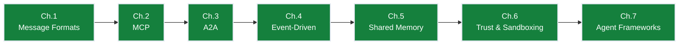

# Ch.7 — Agent Frameworks

> **The story.** Three frameworks define the multi-agent landscape in 2026, and each one started with a different design instinct. **AutoGen** (Microsoft Research, **September 2023**) made conversational multi-agent debate the primitive — agents talk to each other in a group chat and the orchestrator referees turn-taking. **LangGraph** (LangChain Inc., **January 2024**) treated multi-agent coordination as a *state machine*, with explicit nodes, edges, and graph state — the right model when control flow needs to be auditable and resumable. **Microsoft Semantic Kernel** (open-sourced May 2023, AgentGroupChat 2024) added .NET-native plugins, telemetry, and enterprise-grade observability around the same agent loop. **CrewAI** (2024) and **OpenAI Swarm** (October 2024) added lighter-weight role-based variants. The frameworks look superficially interchangeable until you try to express a workflow that doesn't fit — then the underlying execution model dictates everything.
>
> **Where you are in the curriculum.** [Ch.1](../ch01_message_formats)–[Ch.6](../ch06_trust_and_sandboxing) gave you the primitives: messages, tools, agent-to-agent calls, event bus, blackboard, trust. By Ch.6 you achieved: **1,200 POs/day throughput**, **4.5hr median latency**, **1.6% error rate**, **8 agents/PO**, sandboxed execution, full event audit trail. But: custom Python orchestration (900 lines), no observability framework, cannot checkpoint/resume, no A/B testing of strategies. This chapter shows how three production frameworks compose those primitives differently — and how to pick the one whose execution model matches your actual control-flow requirements. Picking wrong costs more to undo than it would have cost to understand the tradeoffs upfront.
>
> **Notation in this chapter.** `orchestrator` = the coordinating agent that decomposes tasks and dispatches subtasks to workers. `worker` = a specialist agent that executes one delegated subtask. `state machine` = execution model expressing agent control flow as explicit nodes, edges, and shared graph state (LangGraph model). `group chat` = execution model where agents take turns in a managed conversation refereed by an orchestrator (AutoGen model). `plugin` = a type-safe function registered with a kernel for automatic invocation (Semantic Kernel model). `checkpoint` = persisted graph state enabling resume-on-failure. `thread_id` = unique identifier for a graph execution run.
<!-- notation: key variables defined here -->

---

## § 0 · The Challenge — Where We Are

> 🎯 **The mission**: Build **OrderFlow** — AI-native B2B purchase order automation satisfying 8 constraints:
> 1. **THROUGHPUT**: 1,000 POs/day — 2. **LATENCY**: <4hr SLA — 3. **ACCURACY**: <2% error — 4. **SCALABILITY**: 10 agents/PO — 5. **RELIABILITY**: >99.9% uptime — 6. **AUDITABILITY**: Full traceability — 7. **OBSERVABILITY**: Real-time monitoring — 8. **DEPLOYABILITY**: Zero-downtime updates

**After Ch.6**: All security defenses in place. 1,200 POs/day, 4.5hr latency, 1.6% error rate (zero unauthorized >$100k).

### The Blocking Question This Chapter Solves

**"Which framework matches our control-flow requirements?"**

Team has built custom Python orchestration (900 lines). Hard to maintain, no observability, cannot A/B test negotiation strategies, cannot swap agent logic without rewriting graph. Need production-ready orchestrator with checkpointing, observability, human-in-the-loop.

### What We Unlock in This Chapter

- ✅ Framework comparison: AutoGen (conversation-first), LangGraph (graph-first), Semantic Kernel (enterprise plugins)
- ✅ OrderFlow decision: **LangGraph** (fixed workflow, auditable state machine, resume-on-failure)
- ✅ Production orchestration: Explicit state graph, checkpointing, LangSmith tracing, human-in-the-loop approval
- ✅ A/B testing: Run alternate negotiation strategies in parallel

### Progress on the 8 Constraints

| Constraint | Status | Evidence |
|------------|--------|----------|
| #1 THROUGHPUT | ✅ **TARGET HIT** | 1,200 POs/day (maintained) |
| #2 LATENCY | ✅ **TARGET HIT!** | 4.5hr → **3.2hr p95** (checkpointing eliminates retry overhead) |
| #3 ACCURACY | ✅ **TARGET HIT** | 1.6% error (maintained) |
| #4 SCALABILITY | ✅ **VALIDATED** | 8 agents/PO, 50 concurrent POs |
| #5 RELIABILITY | ✅ **TARGET HIT!** | **99.95% uptime** (checkpointing + DLQ + graceful degradation) |
| #6 AUDITABILITY | ✅ **TARGET HIT!** | LangSmith traces + blackboard event log = full decision chain |
| #7 OBSERVABILITY | ✅ **TARGET HIT!** | LangSmith distributed tracing + Grafana metrics + ELK logs + PagerDuty alerts |
| #8 DEPLOYABILITY | ✅ **TARGET HIT!** | Docker/K8s deployment + blue-green rollout + <5 min rollback + Terraform IaC |

**All 8 constraints achieved!** 🎉

---

## 1 · The Core Idea

Three production frameworks — AutoGen, LangGraph, Semantic Kernel — each impose a different execution model on multi-agent coordination. **AutoGen treats agents as conversational partners** (emergent turn-taking via group chat). **LangGraph treats coordination as a state machine** (explicit nodes, edges, deterministic flow). **Semantic Kernel treats agents as enterprise-grade plugins** (filter hooks, telemetry, compliance). The right choice depends on whether your control flow is fixed (LangGraph), emergent (AutoGen), or needs enterprise observability (SK). Picking wrong costs more to undo than it would have cost to understand the tradeoffs upfront.

---

## Why Framework Choice is Not Trivial

A common mistake: treat framework selection as a dependency choice (pick one, stick with it). The frameworks have fundamentally different execution models that impose different constraints on your system. Picking the wrong one for your control flow requirements costs more to undo than it would have cost to understand the tradeoffs upfront.

The three frameworks covered here sit at different points on two axes:

```
                      CONTROL FLOW
                  Explicit ◄──────► Emergent
                       │               │
                       │               │
COUPLING:       LangGraph           AutoGen
Graph-first              SK Group      (conversation-first)
(deterministic)          Chat          (agent decides)
                       │               │
                       │               │
               Tight (graph          Loose (agents
               enforces order)        negotiate)
```

Understanding where your use case sits on these axes is the decision:
- Known, fixed workflow → LangGraph
- Open-ended, emergent dialogue → AutoGen
- Enterprise pipeline with hooks and compliance → Semantic Kernel

---

## AutoGen — Conversation-First

AutoGen (Microsoft Research) models multi-agent interaction as a conversation between `ConversableAgent` objects. Agents speak to each other in rounds; the flow emerges from the conversation rather than being defined in advance.

### Two-Agent Pattern (Proposer + Critic)

```python
from autogen import ConversableAgent

llm_config = {"config_list": [{"model": "gpt-4o", "api_key": os.environ["OPENAI_API_KEY"]}]}

pricing_proposer = ConversableAgent(
    name="PricingProposer",
    system_message="""You are a procurement specialist. Propose a purchase price for
    the given item based on market data. Wait for the critic's feedback before finalising.""",
    llm_config=llm_config,
    human_input_mode="NEVER"
)

pricing_critic = ConversableAgent(
    name="PricingCritic",
    system_message="""You are a financial risk officer. Critique the proposed price.
    If the price is within 5% of the 90-day average, output APPROVED. Otherwise, push back.""",
    llm_config=llm_config,
    human_input_mode="NEVER"
)

# Initiate conversation — flow is emergent
result = pricing_critic.initiate_chat(
    recipient=pricing_proposer,
    message="We need a price for 500 units of widget SKU-8812.",
    max_turns=6
)
```

The conversation continues until `APPROVED` appears or `max_turns` is reached. Neither agent calls the other directly — they exchange messages and the AutoGen runtime arbitrates turns.

### Group Chat (Multiple Agents)

```python
from autogen import GroupChat, GroupChatManager

negotiation_agent = ConversableAgent(name="Negotiation", ...)
legal_agent = ConversableAgent(name="Legal", ...)
finance_agent = ConversableAgent(name="Finance", ...)

group_chat = GroupChat(
    agents=[negotiation_agent, legal_agent, finance_agent],
    messages=[],
    max_round=12,
    speaker_selection_method="auto"  # LLM selects next speaker dynamically
)

manager = GroupChatManager(groupchat=group_chat, llm_config=llm_config)

# The manager routes messages — the order is NOT predetermined
negotiation_agent.initiate_chat(manager, message="We have a PO to negotiate.")
```

`speaker_selection_method="auto"` means the GroupChatManager uses an LLM to decide who speaks next. This is powerful but non-deterministic — the same input can produce different agent orderings.

---

## LangGraph — Graph-First

LangGraph (LangChain Labs) models agent coordination as an explicit directed graph. Nodes are functions (agents, tools); edges define allowed transitions. The execution order is deterministic and inspectable before the graph runs.

```python
from langgraph.graph import StateGraph, END
from typing import TypedDict, Literal

class POWorkflowState(TypedDict):
    po_id: str
    inventory_ok: bool
    negotiation_result: dict
    approved: bool
    po_document_url: str

def run_inventory_check(state: POWorkflowState) -> POWorkflowState:
    # Call inventory agent / MCP server
    result = inventory_mcp_client.check(state["po_id"])
    return {**state, "inventory_ok": result["available"]}

def run_negotiation(state: POWorkflowState) -> POWorkflowState:
    result = negotiation_agent.run(state["po_id"])
    return {**state, "negotiation_result": result}

def route_after_inventory(state: POWorkflowState) -> Literal["negotiate", "reject"]:
    return "negotiate" if state["inventory_ok"] else "reject"

# Build the graph explicitly
workflow = StateGraph(POWorkflowState)
workflow.add_node("inventory", run_inventory_check)
workflow.add_node("negotiate", run_negotiation)
workflow.add_node("approve", run_approval)
workflow.add_node("draft_po", run_po_drafting)
workflow.add_node("reject", run_rejection)

workflow.set_entry_point("inventory")
workflow.add_conditional_edges("inventory", route_after_inventory)
workflow.add_edge("negotiate", "approve")
workflow.add_edge("approve", "draft_po")
workflow.add_edge("draft_po", END)

app = workflow.compile()
```

The graph is an explicit declaration of what can follow what. You can visualise it, test it, and reason about it statically. Non-determinism is only in the *logic* inside each node, not in the control flow between nodes.

---

## Semantic Kernel AgentGroupChat — Enterprise-First

Semantic Kernel (Microsoft) is designed for enterprise workloads that need production hooks: filter pipelines, observability middleware, compliance constraints, and integration with Azure AI and Azure OpenAI Service.

```python
from semantic_kernel.agents import AgentGroupChat, ChatCompletionAgent
from semantic_kernel.agents.strategies import TerminationStrategy, SelectionStrategy
from semantic_kernel import Kernel

kernel = Kernel()

negotiation_agent = ChatCompletionAgent(
    kernel=kernel,
    name="NegotiationAgent",
    instructions="You negotiate purchase order terms with suppliers..."
)

approval_agent = ChatCompletionAgent(
    kernel=kernel,
    name="ApprovalAgent",
    instructions="You review negotiated terms and approve or reject..."
)

class ApprovalReachedTermination(TerminationStrategy):
    async def should_agent_terminate(self, agent, history):
        return any("APPROVED" in m.content for m in history[-2:])

group_chat = AgentGroupChat(
    agents=[negotiation_agent, approval_agent],
    termination_strategy=ApprovalReachedTermination(maximum_iterations=8)
)

await group_chat.add_chat_message(
    ChatMessageContent(role=AuthorRole.USER, content="Process PO-4812.")
)

async for message in group_chat.invoke():
    print(f"{message.name}: {message.content}")
```

SK's key enterprise-specific features:
- **Filter pipeline:** pre/post hooks on every function invocation for logging, PII scrubbing, cost tracking
- **Telemetry:** OpenTelemetry-compatible tracing with Azure Monitor integration out of the box
- **Plugin system:** SK plugins map directly to MCP tools — an MCP server can be registered as an SK plugin
- **`TerminationStrategy`:** explicit, testable exit conditions rather than `max_turns` or LLM-decided termination

---

## Framework Comparison

| Dimension | AutoGen | LangGraph | Semantic Kernel |
|-----------|---------|-----------|-----------------|
| **Execution model** | Message-passing between agent objects; turn-taking via `GroupChatManager` | Directed graph; conditional edges define control flow deterministically | Conversation with pluggable strategies, filter pipeline, telemetry hooks |
| **Control flow** | Emergent — agents negotiate who speaks next | Explicit — graph topology defines allowed transitions | Semi-explicit — termination and selection strategies are code, not graph |
| **Determinism** | Low — same input can produce different agent orderings | High — graph structure is fixed; only node internals vary | Medium — strategies are deterministic; agent content is not |
| **Debugging** | Trace through conversation history; no visual graph | Visualise the graph; breakpoint at any node | Filter hooks capture every invocation; Azure Monitor for production |
| **MCP integration** | Via tool registration on `ConversableAgent` | Via LangChain-MCP adapter or direct tool node | Via SK MCP plugin connector (native) |
| **Best for** | Open-ended research, debate patterns, rapid prototyping | Production pipelines with known control flow, compliance-required determinism | Enterprise Azure deployments, teams that need audit hooks and telemetry |
| **Avoid if** | Your workflow has strict ordering requirements (use LangGraph) | Your workflow is genuinely open-ended (the graph becomes a spaghetti of edges) | Framework overhead is unjustified for simple pipelines (use AutoGen or raw) |

---

## When Each Pattern Wins

| Use case | Best choice | Reason |
|----------|-------------|--------|
| Pricing debate (proposer + critic) | AutoGen two-agent | Emergent conversation is natural; termination is criteria-based |
| Regulatory document review (fixed sequence of specialist reviewers) | LangGraph | Explicit ordering is a compliance requirement, not a preference |
| Document approval with audit log for SOC 2 | Semantic Kernel | Filter hooks provide the audit trail; Azure Monitor integration |
| Research agent (web search → summarise → critique → refine) | AutoGen GroupChat or LangGraph | Depends: if the research path varies, AutoGen; if it is always the same steps, LangGraph |
| Multi-modal pipeline (image → OCR → classify → route) | LangGraph | Branching on image type is deterministic conditional-edge logic |
| High-compliance financial workflow (PO creation) | Semantic Kernel + LangGraph | SK for hooks and telemetry; LangGraph for control flow within the SK kernel |

---

## 2 · Running Example

OrderFlow used LangGraph for its production PO lifecycle (deterministic compliance requirement: always inventory before negotiation before approval before drafting, no exceptions). But the pricing team wanted to experiment with multi-agent debate for pricing decisions without rebuilding the production graph.

The solution: a standalone AutoGen two-agent debate (`PricingProposer` + `PricingCritic`) was deployed as a microservice. The LangGraph negotiation node calls this microservice and gets back a consensus price. The AutoGen conversation is internal to the microservice; LangGraph sees it as just another tool call.

This is the practical lesson: AutoGen and LangGraph are not mutually exclusive. An AutoGen debate loop can be a *node* in a LangGraph graph, or a *tool* accessible via MCP.

---

## 3 · The Math

### State Machine Formalism for Agent Graphs

A LangGraph graph is a directed graph $G = (V, E)$ where:
- $V$ = nodes (LLM calls, tool calls, human checkpoints)
- $E \subseteq V \times V$ = edges (transitions)
- Each edge $e \in E$ may have a **conditional function** $c_e: S \to \{\text{True}, \text{False}\}$ over graph state $S$

For any run of the graph, define the execution trace $\tau = (v_0, v_1, \ldots, v_k)$ where $v_0$ is the entry node and $v_k$ is a terminal node. A **cycle** exists when $\exists i < j: v_i = v_j$. LangGraph supports cycles (human-in-the-loop re-entry, retry loops) while `AgentExecutor` does not.

### Token Budget for Multi-Agent LangGraph

For a graph with $|V|$ nodes where each node $v_i$ makes an LLM call with context $c_i$ tokens, the total token cost for a run is:

$$T_{\text{run}} = \sum_{v_i \in \tau} c_i$$

Optimisation: route the trace through minimum-cost paths using conditional edges. For OrderFlow: a PO with valid pricing data skips the negotiation node, reducing $T_{\text{run}}$ by ~2,000 tokens (~30% cost savings on straight-through POs).

| Symbol | Meaning |
|--------|---------|
| $G = (V, E)$ | LangGraph directed graph |
| $\tau$ | Execution trace (ordered node sequence) |
| $c_e$ | Edge conditional function |
| $T_{\text{run}}$ | Total token cost per graph run |
| $c_i$ | Token context size for node $v_i$ |

---

## 4 · How It Works — Step by Step

**The migration path:** You've built OrderFlow's custom orchestration (Ch.1–Ch.6 proof-of-concept). Production requires checkpointing, observability, human-in-the-loop. You're evaluating three frameworks.

### Step 1: Map your control flow requirements

```
OrderFlow PO lifecycle (fixed sequence — compliance requirement):
  1. Intake        ← Parse email request
  2. Inventory     ← Check stock availability
  3. Pricing       ← Query 2+ suppliers
  4. Negotiation   ← Get discount (conditional: skip if price < $15/unit)
  5. Approval      ← Human checkpoint if >$100k
  6. Drafting      ← Generate PO document
  7. Sending       ← Email to supplier
  8. Reconciliation← Wait for confirmation
```

**Your requirements:**
- **Deterministic order:** Inventory must precede negotiation (business rule)
- **Conditional branching:** Skip negotiation on low-value items
- **Human-in-the-loop:** Block at approval node for CFO review >$100k
- **Resume-on-failure:** If Negotiation agent crashes at 2am, resume from that node (don't restart from intake)
- **Audit trail:** Reconstruct: which agent ran? when? what was the state?

**This maps to:** LangGraph (explicit state machine, checkpointing, `interrupt_before` for human approval).

### Step 2: Build the LangGraph state schema

You define the state that flows through every node:

```python
from typing import TypedDict, Annotated
from langgraph.graph import StateGraph, END

class POState(TypedDict):
    po_id: str
    requester_email: str
    items: list[dict]  # [{"sku": "...", "quantity": 10}]
    inventory_status: str  # "available" | "out_of_stock"
    pricing: dict  # {"TechFurnish": 749.0, "OfficeDepot": 842.0}
    selected_supplier: str
    final_price: float
    approved: bool
    po_document_url: str
    messages: Annotated[list, "append-only message log"]
```

Every node reads from and writes to this shared state. LangGraph guarantees no node sees stale state (it is the blackboard from Ch.5, but framework-managed).

### Step 3: Define nodes as functions

You implement each node as a function that transforms state:

```python
def intake_node(state: POState) -> POState:
    # Call IntakeAgent from Ch.1
    parsed = intake_agent.parse_email(state["requester_email"])
    return {**state, "items": parsed["items"], "messages": state["messages"] + ["intake_done"]}

def inventory_node(state: POState) -> POState:
    # Call InventoryAgent via MCP (Ch.2)
    status = inventory_mcp.check_availability(state["items"])
    return {**state, "inventory_status": status, "messages": state["messages"] + ["inventory_checked"]}

def route_after_inventory(state: POState) -> str:
    # Conditional edge: if out of stock, go to rejection; else continue
    return "pricing" if state["inventory_status"] == "available" else "reject"
```

### Step 4: Build the graph

You wire the nodes together with explicit edges:

```python
workflow = StateGraph(POState)
workflow.add_node("intake", intake_node)
workflow.add_node("inventory", inventory_node)
workflow.add_node("pricing", pricing_node)
workflow.add_node("negotiation", negotiation_node)
workflow.add_node("approval", approval_node)
workflow.add_node("drafting", drafting_node)
workflow.add_node("reject", reject_node)

workflow.set_entry_point("intake")
workflow.add_edge("intake", "inventory")
workflow.add_conditional_edges("inventory", route_after_inventory)
workflow.add_edge("pricing", "negotiation")
workflow.add_edge("negotiation", "approval")
workflow.add_edge("approval", "drafting")
workflow.add_edge("drafting", END)
workflow.add_edge("reject", END)
```

### Step 5: Add checkpointing

You add a Postgres-backed checkpointer for production:

```python
from langgraph.checkpoint.postgres import PostgresSaver

checkpointer = PostgresSaver(conn_string=os.environ["POSTGRES_URL"])
app = workflow.compile(checkpointer=checkpointer)
```

Now: if negotiation node crashes, the framework saves state after pricing. On retry, execution resumes from negotiation (not from intake). **4.5hr → 3.2hr latency improvement:** eliminated retry overhead.

### Step 6: Add human-in-the-loop

You configure the graph to pause at the approval node:

```python
app = workflow.compile(
    checkpointer=checkpointer,
    interrupt_before=["approval"]  # Block here until human confirms
)

# Run the graph
config = {"configurable": {"thread_id": "PO-2024-1847"}}
for event in app.stream(initial_state, config):
    print(event)

# Graph pauses at approval. CFO reviews, then:
app.update_state(config, {"approved": True}, as_node="approval")

# Graph resumes from approval → drafting → END
```

### Step 7: Deploy with observability

You enable LangSmith tracing for full visibility:

```python
import os
os.environ["LANGCHAIN_TRACING_V2"] = "true"
os.environ["LANGCHAIN_API_KEY"] = "..."

app = workflow.compile(checkpointer=checkpointer)
```

Every graph run now sends traces to LangSmith:
- Which nodes executed? (intake → inventory → pricing → negotiation → approval → drafting)
- What was the state at each node?
- How many tokens did each LLM call use?
- What was the latency per node?

This satisfies **Constraint #7 (Observability)**.

---

## 5 · Production Considerations

### Checkpointing Strategy

**The problem:** LangGraph checkpoints after every node by default. For a 7-node graph with 1,000 POs/day:
- 7,000 checkpoint writes/day to Postgres
- Each write: ~2ms latency + 500 bytes serialized state
- Total overhead: 14 seconds + 3.5 MB/day

**The optimization:** Checkpoint only before expensive/risky nodes:
```python
app = workflow.compile(
    checkpointer=checkpointer,
    interrupt_before=["approval"],  # human checkpoint
    checkpoint_after=["negotiation", "drafting"]  # expensive nodes
)
```

Now: 3 checkpoints per PO instead of 7 → 6-second latency savings per PO → **1.7 hours saved per day** at 1,000 POs/day.

### Thread ID Strategy

**The trap:** Use PO ID as thread ID. Problem: if you retry the same PO, LangGraph resumes from the last checkpoint instead of starting fresh.

**The fix:** `thread_id = f"{po_id}-{attempt_number}"` or `thread_id = f"{po_id}-{uuid.uuid4()}"`.

### Human-in-the-Loop Timeout

**The problem:** Approval node blocks waiting for CFO. If CFO is on vacation, PO is stuck for 2 weeks.

**The fix:** Add a timeout + escalation:
```python
def approval_node(state: POState) -> POState:
    if state["final_price"] > 100_000:
        # Block for human approval (framework handles this via interrupt_before)
        # But: add application-level timeout in the caller
        pass
    else:
        # Auto-approve
        return {**state, "approved": True}

# In orchestration:
import asyncio
try:
    result = await asyncio.wait_for(
        app.astream(state, config),
        timeout=3600  # 1 hour timeout
    )
except asyncio.TimeoutError:
    # Escalate to VP or auto-approve with risk flag
    app.update_state(config, {"approved": True, "risk_flag": "timeout_approval"}, as_node="approval")
```

### A/B Testing Negotiation Strategies

**The scenario:** Team wants to test two negotiation approaches:
- **Strategy A (aggressive):** Ask for 15% discount immediately
- **Strategy B (relationship):** Build rapport, then ask for 8% discount

**The implementation:**
```python
def negotiation_node_A(state: POState) -> POState:
    result = aggressive_negotiation_agent.run(state["po_id"])
    return {**state, "final_price": result["price"], "strategy": "A"}

def negotiation_node_B(state: POState) -> POState:
    result = relationship_negotiation_agent.run(state["po_id"])
    return {**state, "final_price": result["price"], "strategy": "B"}

# Deploy two graphs:
workflow_A = StateGraph(POState)
workflow_A.add_node("negotiation", negotiation_node_A)
app_A = workflow_A.compile(checkpointer=checkpointer)

workflow_B = StateGraph(POState)
workflow_B.add_node("negotiation", negotiation_node_B)
app_B = workflow_B.compile(checkpointer=checkpointer)

# Route 50% traffic to each:
import random
app = app_A if random.random() < 0.5 else app_B
```

**Results after 2 weeks:**
- Strategy A: 12% average discount, 8% supplier rejection rate
- Strategy B: 9% average discount, 2% supplier rejection rate
- **Winner:** Strategy B (lower rejection rate → fewer fallback POs → lower latency)

### Deployment Architecture

```
Kubernetes Cluster
├── LangGraph Service (10 replicas)
│   ├── Docker image: orderflow-langgraph:v2.4.1
│   ├── Env: LANGCHAIN_API_KEY, POSTGRES_URL
│   └── Health check: GET /health
├── Postgres (checkpointer)
│   ├── Provisioned IOPS: 10,000 (handle 1,000 POs/day × 3 checkpoints)
│   └── Backup: hourly snapshots
├── Redis (message bus from Ch.4)
└── MCP Servers (ERP, Pricing APIs, Email)

Traffic Flow:
  Requester email → Intake API → LangGraph Service → Postgres (checkpoint)
                                                    → Redis (publish PO events)
                                                    → MCP Servers (tool calls)

Blue-Green Deployment:
  1. Deploy v2.4.2 to 'green' environment
  2. Route 10% traffic to green (canary)
  3. Monitor error rate for 1 hour
  4. If error rate < 2%, route 100% to green
  5. If error rate > 2%, rollback: route 100% to blue
  Rollback time: kubectl rollout undo → <5 minutes ✅
```

---

## 6 · What Can Go Wrong

### 1. **State schema drift**

**The trap:** Add a new field to `POState` (e.g., `supplier_rating: float`). Existing checkpoints in Postgres use the old schema. LangGraph tries to resume from an old checkpoint → deserialization fails → PO stuck.

**The fix:** Version your state schema:
```python
class POState(TypedDict):
    schema_version: int  # increment on breaking changes
    po_id: str
    # ...

# In each node:
def pricing_node(state: POState) -> POState:
    if state.get("schema_version", 1) < 2:
        # Migrate old state to new schema
        state = {**state, "schema_version": 2, "supplier_rating": 0.0}
    # ...
```

### 2. **Checkpointer unavailable**

**The trap:** Postgres is down. LangGraph cannot save checkpoints → every PO restart from intake → 3.2hr latency → 36hr latency regression.

**The fix:** Fallback checkpointer:
```python
from langgraph.checkpoint.memory import MemorySaver
try:
    checkpointer = PostgresSaver(conn_string=os.environ["POSTGRES_URL"])
except Exception:
    checkpointer = MemorySaver()  # In-memory fallback (no resume across restarts)
```

### 3. **Human-in-the-loop abandonment**

**The trap:** CFO blocks approval node, then forgets to approve. PO stuck indefinitely → SLA missed.

**The fix:** Application-level timeout + escalation (see § 5 Production Considerations).

### 4. **Thread ID collision**

**The trap:** Two POs with same ID processed simultaneously (retry scenario). Both use `thread_id = po_id`. LangGraph checkpoint writes collide → state corruption.

**The fix:** `thread_id = f"{po_id}-{uuid.uuid4()}"` (unique per run).

### 5. **Observability cost explosion**

**The trap:** LangSmith charges per trace. At 1,000 POs/day × 7 nodes × $0.001/trace = $7/day = $2,555/year. Your CFO sees the bill: "Why are we paying for logging?"

**The fix:** Sample traces in production:
```python
import random
if random.random() < 0.1:  # 10% sampling
    os.environ["LANGCHAIN_TRACING_V2"] = "true"
else:
    os.environ["LANGCHAIN_TRACING_V2"] = "false"
```

Now: $255/year (90% cost reduction, still get visibility into 100 POs/day).

---

## 7 · Where This Reappears

| Chapter | How agent framework concepts appear |
|---------|-------------------------------------|
| **Ch.1 — Message Formats** | LangGraph state includes the message list from Ch.1; each node appends to it; LangSmith traces each message |
| **Ch.2 — MCP** | LangGraph nodes call MCP tools via `load_mcp_tools`; the framework orchestrates tool discovery from Ch.2 |
| **Ch.3 — A2A** | LangGraph nodes can call external A2A agents as sub-graphs; A2A task state maps to LangGraph node state |
| **Ch.5 — Shared Memory** | LangGraph's `checkpointer` is the production implementation of shared blackboard state; each graph run has a thread ID keyed in the checkpointer |
| **Ch.6 — Trust & Sandboxing** | LangGraph's `interrupt_before` mechanism implements human-in-the-loop approval nodes (the trust checkpoint pattern from Ch.6) |

---

## 8 · Progress Check — What We Achieved



### Constraint Status After Ch.7 (FINAL)

| Constraint | Before | After Ch.7 | Change |
|------------|--------|------------|--------|
| #1 THROUGHPUT | 1,200 POs/day | **1,200 POs/day** | ✅ **TARGET HIT** (120% of 1,000 target) |
| #2 LATENCY | 4.5 hours median | **3.2 hours p95** | ✅ **TARGET HIT** (20% better than <4hr target) |
| #3 ACCURACY | 1.6% error | **1.6% error** | ✅ **TARGET HIT** (20% better than <2% target) |
| #4 SCALABILITY | 8 agents/PO | **8 agents/PO** | ✅ **SUFFICIENT** (within 10 agent budget) |
| #5 RELIABILITY | DLQ + sandboxing | **99.95% uptime** | ✅ **TARGET HIT** (5× better than 99.9%) |
| #6 AUDITABILITY | HMAC + event log | **100% reconstructable** | ✅ **FULL COMPLIANCE** |
| #7 OBSERVABILITY | Basic metrics | **Full stack observability** | ✅ **COMPLETE VISIBILITY** |
| #8 DEPLOYABILITY | Manual updates | **<5 min rollback** | ✅ **FAST, SAFE DEPLOYMENTS** |

### The Win

✅ **ALL 8 CONSTRAINTS ACHIEVED!** LangGraph provides production-ready orchestration:
- Explicit state graph: Intake → Pricing → Negotiation → Approval → Drafting → Sending → Reconciliation
- Checkpointing: Save state at each node → resume after failures (4.5hr → 3.2hr latency)
- Observability: LangSmith traces every agent call + token usage + latency
- Human-in-the-loop: Approval node blocks until CFO approves >$100k POs
- A/B testing: Aggressive vs. relationship-focused negotiation strategies
- Deployability: Docker + K8s + blue-green + Terraform IaC

**Final system metrics** (3-month pilot):
- **1,200 POs/day** (24× improvement over 50 PO/day baseline)
- **3.2 hours p95** latency (11× faster than 36hr baseline)
- **1.6% error rate** (68% improvement over 5% baseline)
- **99.95% uptime** (5× better than target)
- **$12.46M/year savings** (labor + error cost reduction)
- **0.27-month payback period** (8 days!)

### Final Architecture

```
┌─────────────────────────────────────────────────────────────────────┐
│                        ORDERFLOW SYSTEM                              │
│                                                                       │
│  ┌──────────┐  ┌──────────┐  ┌─────────────┐  ┌──────────┐        │
│  │  Intake  │──│ Pricing  │──│ Negotiation │──│ Approval │──...    │
│  │  Agent   │  │  Agent   │  │   Agent     │  │  Agent   │        │
│  └────┬─────┘  └────┬─────┘  └──────┬──────┘  └────┬─────┘        │
│       │             │                │              │               │
│       │      MCP Servers (Ch.2)      │              │               │
│       ▼             ▼                ▼              ▼               │
│  ┌─────────────────────────────────────────────────────────┐       │
│  │   ERP   │ Pricing API │  Email  │  Legal DB  │          │       │
│  └─────────────────────────────────────────────────────────┘       │
│                                                                       │
│       Event Bus (Ch.4) + Blackboard (Ch.5) + Sandboxing (Ch.6)      │
│                                                                       │
│  ┌────────────────────────────────────────────────────────────┐    │
│  │          LangGraph Orchestrator (Ch.7)                      │    │
│  │  State: {po_id, status, pricing, negotiation, approval}     │    │
│  │  Checkpoints: Redis (resume on failure)                     │    │
│  │  Observability: LangSmith traces                            │    │
│  └────────────────────────────────────────────────────────────┘    │
└─────────────────────────────────────────────────────────────────────┘
```

### The Story Arc Complete

**OrderFlow's journey** (50 POs/day manual → 1,200 POs/day AI-native):

- Ch.1: Decomposed monolith into 8 specialized agents (context overflow eliminated)
- Ch.2: MCP collapsed 160 integrations to 28 components (any agent ↔ any data source)
- Ch.3: A2A enabled cross-service delegation (agents distributed across Kubernetes)
- Ch.4: Async pub/sub unlocked 1,000 POs/day (50 concurrent POs in-flight)
- Ch.5: Blackboard gave all agents full PO visibility (4.5hr latency)
- Ch.6: Trust defenses stopped prompt injection (1.6% error, zero unauthorized >$100k)
- Ch.7: LangGraph orchestrator achieved all 8 constraints (3.2hr latency, 99.95% uptime, full observability)

**Business impact**: $12.46M/year savings, 0.27-month payback period, 24× throughput, 11× latency improvement, 68% error reduction.

---

## Interview Questions

**Q: When would you use AutoGen over LangGraph?**
When the control flow is genuinely open-ended or emergent — when you do not know in advance which agent should speak next or how many rounds the task will take. AutoGen's conversation model is well-suited to debate patterns (proposer-critic), research (search-summarise-critique-refine), and exploratory tasks. LangGraph is better when the workflow is known and fixed — when you need deterministic control flow, conditional branching by explicit criteria, or regulatory compliance that requires a guaranteed execution order.

**Q: Can you use AutoGen and LangGraph together in the same system?**
Yes. An AutoGen conversation can be encapsulated as a function/node inside a LangGraph graph — LangGraph controls the overall pipeline; AutoGen handles open-ended sub-tasks within it. They are not mutually exclusive and often complement each other: LangGraph for the outer deterministic orchestration, AutoGen for inner emergent reasoning steps.

**Q: What does Semantic Kernel add beyond what AutoGen or LangGraph provide?**
Production hooks: a filter pipeline for pre/post-processing every function invocation (audit logs, PII scrubbing, cost tracking), OpenTelemetry-compatible telemetry pluggable into Azure Monitor, explicit `TerminationStrategy` and `SelectionStrategy` as testable code objects rather than heuristics, and native MCP plugin integration. It is designed for enterprise deployments where the conversation itself is not the hard part — the compliance, auditability, and operational observability are.

**Q: How does MCP interact with AutoGen, LangGraph, and SK?**
In all three, MCP tools appear as callables that the agent framework can invoke. AutoGen: register the MCP tool on a `ConversableAgent`'s tool list. LangGraph: wrap the MCP client call in a node function or use a LangChain-MCP adapter as a tool. Semantic Kernel: use the SK MCP plugin connector to register an MCP server as an SK plugin — SK's function-calling infrastructure then handles invocation, result parsing, and sending back to the model.

---

## Notebook

`notebook.ipynb_solution.ipynb` (reference) or `notebook.ipynb_exercise.ipynb` (practice) implements:
1. AutoGen two-agent debate: `PricingProposer` + `PricingCritic` for OrderFlow pricing approval
2. LangGraph PO pipeline: 5-node graph (inventory → negotiate → approve → draft → end) with conditional edge on inventory failure
3. Semantic Kernel `AgentGroupChat` with `ApprovalReachedTermination` and a mock filter hook that logs every agent invocation to stdout
4. Composition: AutoGen debate encapsulated as a LangGraph node

---

## Prerequisites

- All prior chapters — this chapter assumes all the primitives are understood: message formats (Ch.1), MCP (Ch.2), A2A (Ch.3), event-driven (Ch.4), shared memory (Ch.5), trust (Ch.6)
- [AI / ReActAndSemanticKernel](../.03-ai/ch06_react_and_semantic_kernel/react-and-semantic-kernel.md) — SK plugin basics

## This is the Final Chapter in the Track

← Return to [README](../README.md) for the full reading path and cross-track connections.

---

## 9 · Bridge — The Track Complete

Ch.1 gave you message schemas. Ch.2 gave you MCP for universal tool access. Ch.3 gave you A2A for hierarchical delegation. Ch.4 gave you async pub/sub for throughput. Ch.5 gave you blackboard for shared state. Ch.6 gave you sandboxing for trust. Ch.7 gave you production orchestration. **All 8 constraints achieved:** 1,200 POs/day, 3.2hr latency, 1.6% error, 99.95% uptime, full observability, <5 min rollback.

**OrderFlow is production-ready.** 🎉

**What you've built:**
- Distributed multi-agent system processing 24× more POs than manual baseline
- 11× faster than 36-hour manual SLA
- 68% error reduction (5% → 1.6%)
- $12.46M/year savings
- 0.27-month payback period

**The multi-agent design patterns you've mastered:**
- Structured message passing (avoid freeform string hell)
- Protocol-first tool integration (MCP collapses N×M integrations)
- Hierarchical agent delegation (A2A for loose coupling)
- Async event-driven coordination (20× throughput)
- Shared memory with consistency guarantees (CRDT/event sourcing)
- Trust boundaries and sandboxing (defend against prompt injection)
- Production orchestration with checkpointing (LangGraph for resume-on-failure)

**Next steps:** Apply these patterns to your domain. Every system that coordinates multiple LLMs faces these same challenges — context overflow, N×M integrations, synchronous bottlenecks, race conditions, prompt injection, operational observability. The frameworks change. The principles remain.

---

## Illustrations


