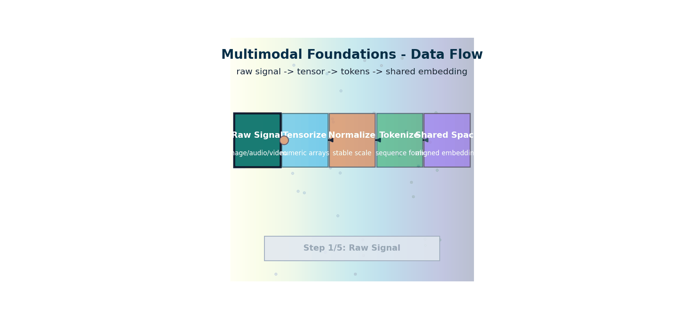

# Multimodal Foundations — How Raw Signals Become Tensors

> **The story.** Long before LLMs, *multimodal* meant signal-processing engineers wrestling with how to put pixels and audio into the same model — **Bengio et al.'s** 2013 *Representation Learning* survey was the first systematic treatment, and **Ngiam et al.** (2011) trained the first joint audio–video deep autoencoders. The breakthrough that defines this entire track was **CLIP** (OpenAI, **2021**), which proved that paired text–image data, projected into a shared embedding space, was enough to align modalities without manual labels. **DALL·E** (Jan 2021), **Imagen** (May 2022), and **Stable Diffusion** (Aug 2022) followed in twelve months. **GPT-4V** (Sep 2023) and **Gemini 1.5** (2024) folded vision back into language models. By 2025, *multimodal* is no longer a research speciality — it is the default. Every story in the chapters that follow assumes you can convert a JPEG, an MP3, or a video clip into a tensor, and that two such tensors can live in the same vector space. This chapter teaches that.
>
> **Where you are in the curriculum.** This is the foundation chapter for the entire multimodal track (Chapter 1). You will learn how images, audio, and video are represented as numerical tensors; why modalities cannot be naively mixed in a single model; and why every subsequent chapter — [VisionTransformers](../ch02_vision_transformers), [CLIP](../ch03_clip), [Diffusion](../ch04_diffusion_models) and beyond — begins with "project the signal into a shared embedding space." The running scenario is **VisualForge Studio**, a boutique creative agency that must deliver professional-grade marketing visuals on local hardware.



*Flow: raw modalities are tensorized, normalized, and tokenized before alignment in a shared embedding space.*

---

## 0 · The VisualForge Studio Challenge

**Mission**: VisualForge Studio is a boutique creative agency replacing $600k/year freelancer costs with an in-house AI system running on local hardware (<$5k), delivering professional-grade marketing visuals (<30s per image, ≥4.0/5.0 quality), with <5% unusable generations and 100+ images/day throughput. The system must handle text→image, image→video, and image understanding for automated QA.

**Current blocker at Chapter 1**: We have raw image files (JPEGs) but no way to process them. Neural networks can't "see" pixels directly — they need numerical tensors. How do we convert a photograph into numbers that a model can reason about?

**What this chapter unlocks**: **Tensor representations** — learn how to load JPEGs, audio files, and video clips as multi-dimensional arrays (tensors), normalize pixel values, and prepare them for model input. This is the foundation for every subsequent chapter.

---

### The 6 Constraints — Snapshot After Chapter 1

| Constraint | Target | Status | Evidence |
|------------|--------|--------|----------|
| #1 Quality | ≥4.0/5.0 | Not applicable | Can't generate images yet |
| #2 Speed | <30 seconds | Not applicable | No generation pipeline yet |
| #3 Cost | <$5k hardware | Not validated | Haven't tested hardware requirements |
| #4 Control | <5% unusable | Not applicable | Can't generate yet |
| #5 Throughput | 100+ images/day | Not applicable | No generation capability |
| #6 Versatility | 3 modalities | **Foundation laid** | Can load and preprocess images, audio, video as tensors |

**Symbols**:
- = Blocked (constraint not addressed yet)
- = Foundation laid (partial progress, not at target yet)
- = Target hit (constraint fully satisfied)

---

### What's Still Blocking Us After This Chapter?

We can convert images to tensors, but we can't **extract semantic meaning** from them. We need an image encoder that produces embeddings — numerical representations that capture what's actually in the image ("blue ocean sunset", "product on white background"). Without embeddings, we can't search images, compare them, or generate new ones.

**Next unlock (Ch.2)**: **Vision Transformers (ViT)** — convert images to 768-dim semantic embeddings that capture content, not just pixels.

---

## 1 · Core Idea

A neural network can only process numbers. Every raw signal — a JPEG, an MP3, a video clip — must be converted into a **tensor** (a multi-dimensional array of floating-point numbers) before a model can operate on it. The challenge is not the conversion itself; it is that the resulting tensors are wildly different in shape, density, and statistical distribution, and models trained on one modality cannot transfer directly to another. **Multimodal AI is the problem of bridging these representations** so that a single model — or a paired set of models — can reason jointly over text, images, audio, and video.

---

## 2 · Running Example — VisualForge Input Pipeline

**VisualForge Brief**: "Spring collection hero image — woman in floral dress, Parisian café, golden hour, editorial photography"

**Problem**: Your client sends a reference JPEG (previous year's spring campaign). You need to load it, analyze color distribution, and prepare it as a tensor for the image encoder. The model doesn't understand JPEGs — it needs numerical arrays.

```
Goal: Load client reference JPEG → convert to tensor → inspect shape and
 statistics → prepare for model input

Input: Spring campaign reference photo (JPEG, 2048×1536 pixels)
Output: (3, H, W) float32 tensor, normalized to ImageNet stats, ready for
 VisualForge's image encoder pipeline
```

By the end of this chapter you will have built the input stage of VisualForge — the part that accepts client reference images and produces tensors ready for downstream model layers.

---

## 3 · The Math

### 3.1 Images as Tensors

A colour image is a 3-D tensor:

$$I \in \mathbb{R}^{C \times H \times W}$$

where $C = 3$ (red, green, blue channels), $H$ is height in pixels, and $W$ is width in pixels. Each value is an integer in $[0, 255]$ (uint8) at load time, normalised to $[0, 1]$ or $[-1, 1]$ before model input.

**Normalisation** used by most vision models (ImageNet statistics):

$$\hat{x}_c = \frac{x_c - \mu_c}{\sigma_c}$$

| Channel | $\mu_c$ | $\sigma_c$ |
|---------|---------|-----------|
| Red | 0.485 | 0.229 |
| Green | 0.456 | 0.224 |
| Blue | 0.406 | 0.225 |

### 3.2 Audio as Tensors

A mono audio clip sampled at 16 kHz is a 1-D tensor:

$$a \in \mathbb{R}^{T}$$

where $T = \text{duration\_s} \times 16000$. A 5-second clip gives $T = 80{,}000$ samples.

For model input, raw waveforms are almost always converted to a **mel spectrogram** — a 2-D representation $M \in \mathbb{R}^{F \times T'}$ where $F$ is the number of mel frequency bins (typically 80 or 128) and $T'$ is the number of time frames. The mel spectrogram is computed via:

1. Short-Time Fourier Transform (STFT): window the signal → FFT → magnitude
2. Apply mel filterbank: project frequency bins onto perceptual mel scale
3. Apply log: $\log(M + \epsilon)$ to compress dynamic range

### 3.3 Video as Tensors

A video clip is a 4-D tensor:

$$V \in \mathbb{R}^{T \times C \times H \times W}$$

where $T$ is the number of sampled frames (not raw frame count — typically every $k$th frame). A 1-second clip at 8 fps, 224×224, gives shape $(8, 3, 224, 224)$ — roughly 1.2 million floats per second of video.

### 3.4 The Modality Gap

Even when tensors have similar dimensions, the **statistical distributions** differ enormously:

| Modality | Typical value range | Correlation structure |
|----------|--------------------|-----------------------|
| Image pixels | $[0, 1]$ | Smooth spatial gradients; local structure |
| Text token IDs | $[0, 50256]$ (integers) | Sequential; long-range dependencies |
| Audio mel-spec | $[-10, 2]$ (log scale) | Temporal; harmonic patterns |
| Video frames | $[0, 1]$ per frame | Spatial + temporal; high redundancy |

A model trained purely on images has no mechanism to process a sequence of integers: they live in incompatible spaces. **The modality gap is the core problem multimodal AI solves.**

---

## 4 · Visual Intuition — From Pixels to Tensors

### The Signal → Tensor Pipeline

```
┌──────────────┐ ┌─────────────────┐ ┌────────────────────────────────┐
│ Raw File │ │ Load & Decode │ │ Normalise + Reshape │
│ │ │ │ │ │
│ image.jpg │───▶│ (H, W, 3) │───▶│ (3, H, W) float32 [-1,1] │
│ audio.wav │ │ (T,) │ │ (F, T') log mel-spec │
│ video.mp4 │ │ (T, H, W, 3) │ │ (T, 3, H, W) float32 [0,1] │
└──────────────┘ └─────────────────┘ └────────────────────────────────┘
```

### The Modality Gap — Why Different Projections are Needed

```
Raw Space Shared Embedding Space

 Text tokens ─────────────▶ ┌──────────────────────┐
 (discrete integers) ┌──▶│ │
 │ │ "a woman in │
 Image pixels ──────────┘ │ floral dress" │
 (spatial float tensor) │ │◀── Contrastive loss
 ┌──▶│ [photo matching │ pulls matching
 Audio mel-spec ────────┘ │ that description] │ pairs together
 (spectral float tensor) └──────────────────────┘

Each modality needs its own encoder to project into the shared space.
CLIP (Ch.3) is the canonical example of this alignment.
```

### Step-by-Step: From JPEG to Tensor

### Step 1: Load the raw signal

```
JPEG file → PIL.Image.open() → mode "RGB" → numpy array shape (H, W, 3)
```

### Step 2: Reshape to channel-first

```
(H, W, 3) → (3, H, W)
```
PyTorch convention: channels first. PIL/NumPy convention: channels last. Always convert.

### Step 3: Normalise

```
uint8 [0, 255] → float32 [0.0, 1.0] by dividing by 255
 → float32 [-1.0, 1.0] by (x - 0.5) / 0.5 (diffusion models)
 → ImageNet-normalised by channel-wise (x - μ) / σ (ViT, CLIP, ResNet)
```

### Step 4: Batch

```
Single image (3, H, W) → batched (N, 3, H, W) by unsqueeze(0) or torch.stack
```

### Step 5: Send to model

The model receives a `(N, 3, H, W)` tensor. It knows nothing else about the image. Everything the model "understands" about the photograph — objects, colours, scene, relationships — is derived exclusively from these numbers.

---

## 5 · Production Example — VisualForge in Action

**Scenario**: Your art director wants to analyze the color palette of 5 spring campaign reference photos to ensure brand consistency.

**Without tensor preprocessing**:
- Manual color picking in Photoshop: 15 minutes per image
- Subjective judgement: "looks similar" but no numerical proof
- Not scalable: can't analyze 100 reference photos

**With VisualForge tensor pipeline**:
```python
# Production pattern
import torch
from PIL import Image
import torchvision.transforms as T

# VisualForge: Load client reference images
reference_images = [
 "spring_2025_hero_1.jpg",
 "spring_2025_hero_2.jpg",
 "spring_2025_hero_3.jpg",
 "spring_2025_hero_4.jpg",
 "spring_2025_hero_5.jpg"
]

# Standard ImageNet normalization for downstream ViT/CLIP encoders
transform = T.Compose([
 T.Resize((224, 224)),
 T.ToTensor(), # Converts PIL Image (H,W,3) → torch tensor (3,H,W) in [0,1]
 T.Normalize(mean=[0.485, 0.456, 0.406], std=[0.229, 0.224, 0.225])
])

# Load and tensorize all references
tensors = []
for img_path in reference_images:
 img = Image.open(img_path).convert("RGB")
 tensor = transform(img) # (3, 224, 224)
 tensors.append(tensor)

# Stack into batch
batch = torch.stack(tensors) # (5, 3, 224, 224)
print(f"VisualForge batch ready: {batch.shape}")
print(f"Mean pixel value: {batch.mean().item():.3f}")
print(f"Std pixel value: {batch.std().item():.3f}")

# Now ready for CLIP encoder (Ch.3) or ViT (Ch.2) to extract semantic embeddings
```

**Result**: 5 images processed in <1 second, now ready for semantic analysis, color clustering, or comparison against generated outputs.

**What this unlocks for VisualForge**:
- Can batch-process client reference images
- Standardized numerical representation (no more manual color picking)
- Ready for downstream encoders (ViT, CLIP, VAE)
- **Constraint #6 progress**: Foundation for handling image modality

---

## 6 · Common Failure Modes

### Trap 1: Wrong Channel Order (HWC vs CHW)

**The failure**: You load an image with PIL, pass it to a PyTorch model → model outputs garbage.

**Why**: PIL and NumPy use `(H, W, C)` order (height first). PyTorch expects `(C, H, W)` (channels first). The model silently treats height as channels and produces nonsense.

**Fix**: Always use `ToTensor()` transform or manually transpose:
```python
# Wrong: PIL Image → numpy → torch (keeps HWC order)
img_np = np.array(Image.open("photo.jpg")) # (H, W, 3)
tensor = torch.from_numpy(img_np) # Still (H, W, 3)

# Right: Use torchvision transform
tensor = T.ToTensor()(Image.open("photo.jpg")) # (3, H, W)

# Or manual transpose
img_np = np.array(Image.open("photo.jpg")) # (H, W, 3)
tensor = torch.from_numpy(img_np).permute(2, 0, 1) # (3, H, W)
```

### Trap 2: Wrong Normalization for Model

**The failure**: You normalize to `[0, 1]` but the model was trained on `[-1, 1]` → model outputs degrade by 20%+ in quality.

**Why**: Diffusion models (Stable Diffusion) expect `[-1, 1]`. Classification models (ResNet, ViT) expect ImageNet stats. Using the wrong normalization shifts the input distribution out of the model's training range.

**Fix**: Check the model's preprocessing requirements:
```python
# For diffusion models (SDXL, Stable Diffusion)
transform = T.Compose([
 T.ToTensor(), # [0, 1]
 T.Normalize(mean=[0.5, 0.5, 0.5], std=[0.5, 0.5, 0.5]) # → [-1, 1]
])

# For ImageNet-pretrained models (ViT, CLIP, ResNet)
transform = T.Compose([
 T.ToTensor(), # [0, 1]
 T.Normalize(mean=[0.485, 0.456, 0.406], std=[0.229, 0.224, 0.225]) # ImageNet stats
])
```

### Trap 3: Forgetting float16 Conversion for GPU Inference

**The failure**: Your diffusion model runs but takes 3× longer than expected, or runs out of VRAM on a 12GB GPU.

**Why**: Default PyTorch dtype is `float32` (4 bytes per parameter). Diffusion models have 1B+ parameters → 4GB+ VRAM. Converting to `float16` (2 bytes) halves memory usage and enables 2× faster inference on modern GPUs.

**Fix**: Always specify `torch_dtype=torch.float16` when loading large models:
```python
# Educational example
from diffusers import StableDiffusionPipeline

# Wrong: defaults to float32 → 8GB VRAM
pipe = StableDiffusionPipeline.from_pretrained("stabilityai/stable-diffusion-xl-base-1.0")

# Right: float16 → 4GB VRAM
pipe = StableDiffusionPipeline.from_pretrained(
 "stabilityai/stable-diffusion-xl-base-1.0",
 torch_dtype=torch.float16 # Halves memory usage
).to("cuda")
```

### Trap 4: Loading Full-Resolution Video into Memory

**The failure**: You try to load a 1-minute 1080p video → Python process crashes with OOM.

**Why**: 1 minute at 30fps = 1800 frames. Each frame is 1920×1080×3 = 6.2M floats. Total: 1800 × 6.2M × 4 bytes = 45GB of RAM.

**Fix**: Sample frames (every 8th or 16th frame) and resize:
```python
# Educational example
import cv2

def load_video_sampled(video_path, target_fps=4, resize=(224, 224)):
 cap = cv2.VideoCapture(video_path)
 original_fps = cap.get(cv2.CAP_PROP_FPS)
 frame_skip = int(original_fps / target_fps)

 frames = []
 frame_idx = 0
 while True:
 ret, frame = cap.read()
 if not ret:
 break
 if frame_idx % frame_skip == 0:
 frame = cv2.resize(frame, resize)
 frames.append(frame)
 frame_idx += 1
 cap.release()

 # Convert to tensor: (T, H, W, 3) → (T, 3, H, W)
 video_tensor = torch.from_numpy(np.array(frames)).permute(0, 3, 1, 2).float() / 255.0
 return video_tensor

# 1-min video at 4fps, 224×224 → (240, 3, 224, 224) ≈ 57MB
video = load_video_sampled("campaign_video.mp4")
```

---

## 7 · When to Use This vs Alternatives

### When to use standard tensor preprocessing (this chapter)
**Use when**:
- Building custom pipelines that need full control over preprocessing
- Integrating with models that expect specific tensor formats
- Analyzing image statistics before model input
- Batching heterogeneous image sources (client uploads, stock photos, generated outputs)
**Don't use when**:
- The model library already provides preprocessing (e.g., `diffusers` pipelines handle it automatically)
- Working with pre-packaged datasets (ImageNet, COCO) that come with built-in transforms

### Alternative: Use library-provided transforms

Many model libraries (HuggingFace `transformers`, `diffusers`) provide preprocessors that handle tensorization + normalization:

```python
# Manual way (this chapter)
from torchvision import transforms as T
transform = T.Compose([T.Resize((224,224)), T.ToTensor(), T.Normalize(...)])
image_tensor = transform(pil_image)

# Library way (automatic)
from transformers import CLIPProcessor
processor = CLIPProcessor.from_pretrained("openai/clip-vit-base-patch32")
inputs = processor(images=pil_image, return_tensors="pt") # Handles everything
```

**Recommendation**: Use library preprocessors for standard models (CLIP, Stable Diffusion). Use manual transforms when you need custom resolutions, augmentations, or multi-stage pipelines.

---

## 8 · Connection to Prior Chapters

**This is Chapter 1** — the foundation for the entire Multimodal AI track. There are no prior chapters in this track.

**What this chapter establishes**:
- **Tensor representation**: Images, audio, video are all multi-dimensional float arrays
- **The modality gap**: Different modalities have incompatible statistical distributions
- **Preprocessing conventions**: Channel order (CHW vs HWC), normalization schemes ([-1,1] vs [0,1] vs ImageNet stats)
- **Foundation for Constraint #6 (Versatility)**: Can now load and preprocess all 3 modalities (image, audio, video)

**Forward links** (how later chapters build on this):
- **Ch.2 Vision Transformers**: Takes the `(3, H, W)` tensor from this chapter → splits into patches → applies self-attention → outputs semantic embeddings
- **Ch.3 CLIP**: Uses the tensor preprocessing from this chapter for both image and text → projects into shared embedding space → enables text-conditioned generation
- **Ch.6 Latent Diffusion**: Uses the tensor from this chapter → encodes with VAE → diffuses in latent space → decodes back to pixel space

Every subsequent chapter assumes you can convert a JPEG/MP3/MP4 into a properly normalized tensor. This chapter is the entry point.

---

## 9 · Interview Checklist

### Must Know
- What shape is a color image tensor in PyTorch? **Answer**: `(N, C, H, W)` — batch, channels, height, width
- What is the modality gap and why does it require a solution beyond simple concatenation? **Answer**: Different modalities (text, image, audio) have wildly different statistical distributions and structures (discrete vs continuous, 1D vs 2D vs 3D). Concatenating raw representations fails because the model has no way to align their meanings. Solution: project each modality into a shared embedding space using modality-specific encoders.
- What normalization do ImageNet-pretrained models expect, and why does it matter? **Answer**: Mean `[0.485, 0.456, 0.406]`, Std `[0.229, 0.224, 0.225]` per channel. Matters because models learn feature extractors conditioned on the training distribution. Wrong normalization shifts the input out-of-distribution → degrades performance.

### Likely Asked
- "How would you convert a 5-second 16 kHz audio clip to a tensor ready for a ViT-based model?"
 **Answer**: Resample → STFT (Short-Time Fourier Transform) → Apply mel filterbank → Take log → Treat as 2-D image `(F, T')` where F = mel bins (e.g. 80), T' = time frames. Then apply standard image preprocessing (resize, normalize).

- "Why does the same pixel value mean something different in a diffusion model vs a classification model?"
 **Answer**: Diffusion models (Stable Diffusion) are trained on `[-1, 1]` normalized pixels. Classification models (ResNet, ViT) are trained on ImageNet statistics `(x - μ) / σ`. Same raw pixel value maps to different normalized values → model sees a different input distribution.

### Trap to Avoid
- Forgetting to convert channel order (HWC → CHW) when going from PIL/NumPy to PyTorch
- Using ImageNet normalization for domain-specific images (medical, satellite) where the color distribution is completely different
- Assuming `float16` is always safe — some operations (loss computation, optimizer state) need `float32` accumulation to avoid numerical instability

---

## 10 · Further Reading

### Foundational Papers
- **Representation Learning** (Bengio et al., 2013) — First systematic treatment of learning joint representations across modalities
 [arXiv:1206.5538](https://arxiv.org/abs/1206.5538)

- **Multimodal Deep Learning** (Ngiam et al., 2011) — First joint audio-video deep autoencoders
 [ICML 2011](https://ai.stanford.edu/~ang/papers/icml11-MultimodalDeepLearning.pdf)

### Normalization and Preprocessing
- **ImageNet Statistics**: Where the `[0.485, 0.456, 0.406]` means come from
 [PyTorch Vision Docs](https://pytorch.org/vision/stable/models.html)

- **Mel Spectrogram**: Understanding audio-to-image conversion
 [LibROSA Documentation](https://librosa.org/doc/main/generated/librosa.feature.melspectrogram.html)

### Practical Guides
- **torchvision.transforms Tutorial**: All image preprocessing transforms
 [PyTorch Docs](https://pytorch.org/vision/stable/transforms.html)

- **HuggingFace Image Processing**: How `transformers` library handles preprocessing
 [HF Docs](https://huggingface.co/docs/transformers/main/en/preprocessing)

---

## 11 · Notebook

**Educational notebook** (CPU-friendly, no GPU required):
→ [`multimodal_foundations.ipynb`](multimodal_foundations.ipynb)

**What you'll build**:
1. Load a JPEG → inspect raw pixel values → visualize RGB channels separately
2. Apply different normalizations (`[0,1]`, `[-1,1]`, ImageNet stats) → see numerical differences
3. Convert an audio file to mel spectrogram → treat as image tensor
4. Load a video clip → sample frames → create `(T, 3, H, W)` tensor
5. Batch multiple images → prepare for model input

**No GPU required** — all operations run on CPU. This notebook focuses on data preprocessing, not model inference.

---

## 11.5 · Progress Check — What Have We Unlocked?

### Before This Chapter
- **Constraint #6 (Versatility)**: No way to process image/audio/video files — neural networks can't operate on raw JPEGs
- **VisualForge Status**: Cannot accept client reference images, campaign photos, or brief attachments

### After This Chapter
- **Constraint #6 (Versatility)**: **Foundation laid** → Can load JPEGs, WAVs, MP4s as tensors, normalized and ready for model input
- **VisualForge Status**: Input pipeline operational → images load as `(3, H, W)` tensors, normalized to ImageNet stats or `[-1,1]` for diffusion

---

### Key Wins

1. **Image → Tensor conversion**: Client reference JPEGs (any resolution) load as `(3, H, W)` float32 tensors in <1 second
2. **Modality awareness**: Understand why audio (mel spectrograms), video (4-D tensors), and text (token IDs) require different preprocessing but can share an embedding space
3. **The modality gap identified**: Different modalities have wildly different statistical distributions → need projection to shared embedding space (coming in Ch.3 CLIP)

---

### What's Still Blocking Production?

**Semantic understanding**: We can load pixels as numbers, but we can't **extract meaning**. A `(3, 512, 512)` tensor with 786,432 floats contains "woman in floral dress, Parisian café, golden hour" — but the tensor itself is just numbers. We have no way to:
- Compare two images semantically ("these both show spring dresses")
- Search a library of 1000 images for "sunset over ocean"
- Condition image generation on text descriptions ("generate a product demo photo")

**Next unlock (Ch.2)**: **Vision Transformers (ViT)** — encode images into 768-dim semantic embeddings that capture content, not just pixel statistics. This enables image search, comparison, and (eventually) generation conditioning.

---

### VisualForge Status — Full Constraint View

| Constraint | Ch.1 (This Chapter) | Ch.2 ViT | Ch.3 CLIP | ... | Target |
|------------|---------------------|----------|-----------|-----|--------|
| #1 Quality | Can't generate yet | | | ... | 4.0/5.0 |
| #2 Speed | No generation | | | ... | <30s |
| #3 Cost | Not validated | | | ... | <$5k |
| #4 Control | No generation | | | ... | <5% unusable |
| #5 Throughput | No generation | | | ... | 100+ images/day |
| #6 Versatility | **Tensors ready** | | | ... | 3 modalities |

**This chapter's impact**: Unlocked the ability to load and preprocess all 3 modalities (image, audio, video) as tensors. This is the foundation — every subsequent chapter builds on this preprocessing pipeline.

---

## Bridge to Chapter 2 — Vision Transformers

You now have a `(3, 224, 224)` tensor representing a client's spring campaign reference photo. The tensor contains 150,528 floating-point numbers. **But what do these numbers mean?** Is this image similar to another? What objects are in it? What's the dominant color palette?

The raw tensor doesn't answer these questions — it's just pixel values. You need an **image encoder**: a neural network that takes the `(3, H, W)` tensor and outputs a **768-dimensional semantic embedding** that captures what's actually in the image.

→ **[Chapter 2: Vision Transformers](../ch02_vision_transformers/vision-transformers.md)**

**What Ch.2 unlocks**:
- Image embeddings: `(3, 224, 224)` → 768-dim vector that represents "woman in floral dress, café, golden hour"
- Semantic similarity: Compare two images by comparing their embeddings (cosine similarity)
- Foundation for CLIP (Ch.3): Vision Transformers provide the image encoder that CLIP uses to align images with text

**The blocker Ch.2 solves**: Raw pixels don't capture semantics. You can't search 1000 reference photos for "spring dresses" by comparing pixel arrays. You need embeddings that encode meaning, not just color values. ViT provides that.

---
---

## Illustrations


