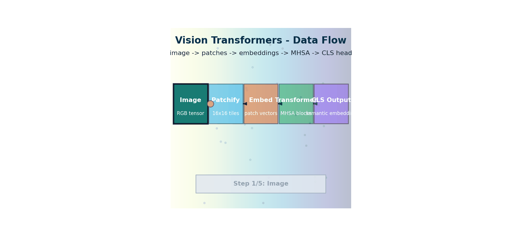

# Vision Transformers — How Images Become Sequences

> **The story.** For most of deep-learning history, vision meant CNNs — LeCun's LeNet (1989) through AlexNet (2012) through ResNet (2015). The transformer ([ML Ch.18](../../ml/03_neural_networks/ch10_transformers)) was for text. In **October 2020** **Alexey Dosovitskiy** and colleagues at Google Brain published *"An Image Is Worth 16x16 Words: Transformers for Image Recognition at Scale"* — the **Vision Transformer (ViT)** — with one audacious move: split the image into 16×16 patches, treat each as a token, throw it into a vanilla transformer encoder, and skip convolutions entirely. With enough data (JFT-300M), ViT matched and then beat the best CNNs on ImageNet. **Swin Transformer** (Microsoft, 2021) added hierarchical windows; **DINO** (Caron et al., Meta, 2021) showed self-supervised ViTs learn surprisingly clean object segmentations; and ViT became the visual backbone of **CLIP**, **Stable Diffusion**, **DINOv2**, **SAM**, and every modern multimodal LLM.
>
> **Where you are in the curriculum.** [MultimodalFoundations](../ch01_multimodal_foundations) showed why every modality needs to become tokens. This chapter shows how *images* become tokens. After this you understand the visual half of the [CLIP](../ch03_clip) embedding space, the encoder inside [Latent Diffusion](../ch06_latent_diffusion), and the vision tower of every [Multimodal LLM](../ch10_multimodal_llms) in the track.



*Flow: an image is patchified into tokens, projected to embeddings, then refined through MHSA blocks into semantic outputs.*

---

## 0 · The VisualForge Studio Challenge

**Mission**: VisualForge Studio needs to replace $600k/year freelancer costs with an in-house AI system running on local hardware (<$5k), delivering professional-grade marketing visuals (<30s per image, ≥4.0/5.0 quality), with <5% unusable generations and 100+ images/day throughput.

**Current blocker at Chapter 2**: We can load images as tensors (Ch.1) but have no way to **extract semantic meaning** from them. Can't search our 10,000-image stock library by query "modern office with natural light" because we have no embeddings.

**What this chapter unlocks**: **Vision Transformers (ViT)** — encode images into 768-dim semantic embeddings that capture content ("product photo", "blue ocean sunset"), enabling image search and (later) generation conditioning.

---

### The 6 Constraints — Snapshot After Chapter 2

| Constraint | Target | Status | Evidence |
|------------|--------|--------|----------|
| #1 Quality | ≥4.0/5.0 | Not applicable | Can't generate images yet |
| #2 Speed | <30 seconds | Not applicable | No generation pipeline yet |
| #3 Cost | <$5k hardware | Not validated | ViT runs on laptop but haven't tested full pipeline |
| #4 Control | <5% unusable | Not applicable | Can't generate yet |
| #5 Throughput | 100+ images/day | Not applicable | No generation capability |
| #6 Versatility | 3 modalities | **Image embeddings** | Can extract semantic image features (768-dim embeddings) |

---

### What's Still Blocking Us After This Chapter?

**Text-image gap**: We have image embeddings but no text embeddings. Can't do "generate an image of [text description]" because text and images live in separate spaces. Need a way to align them.

**Next unlock (Ch.3)**: **CLIP** — train dual encoders (ViT for images + Transformer for text) with contrastive loss → shared 512-dim embedding space where cosine_similarity("blue ocean sunset", <photo>) is high.

---

## 1 · Core Idea

A standard transformer expects a sequence of token embeddings as input. An image is a 2-D spatial grid of pixels, not a sequence. The Vision Transformer (ViT) resolves this mismatch with one elegant trick: **split the image into fixed-size patches and treat each patch as a token**. A 224×224 image divided into 16×16 patches yields 196 tokens. Each patch is flattened and linearly projected into a $d$-dimensional embedding vector, then processed by an ordinary transformer encoder with no convolutions at all.

This design has two major consequences:
1. ViT can process images with the same architecture that processes text — enabling true multimodal models.
2. At scale (large datasets + large models), ViT outperforms CNNs because attention can model long-range spatial dependencies that convolution's fixed receptive field cannot.

---

## 2 · Running Example — PixelSmith v1

**Your challenge**: VisualForge's creative director hands you 10,000 stock photos (real estate interiors, fashion shoots, automotive, hospitality) and says "I need to search this library by typing 'modern office with natural light' and get the top 5 matches. Go."

**First attempt — pixel-level comparison**: You flatten each image to a 150,528-dim vector (224×224×3) and compute cosine similarity. **Result**: Returns images with similar color histograms — blue ocean sunsets match "modern office" because both are "mostly blue pixels." Useless.

**What you need**: A **semantic embedding** that understands "office", "modern", "natural light" — not just pixel values.

**ViT solution**:
```python
# VisualForge: Embed stock library for semantic search
import torch
from transformers import ViTModel, ViTImageProcessor

processor = ViTImageProcessor.from_pretrained('google/vit-base-patch16-224')
model = ViTModel.from_pretrained('google/vit-base-patch16-224')

# Load a real estate interior photo from stock library
image = load_visualforge_image("stock_library/real_estate_001.jpg")
inputs = processor(images=image, return_tensors="pt")
outputs = model(**inputs)

# Extract CLS token embedding — 768-dim semantic representation
embedding = outputs.last_hidden_state[:, 0, :] # Shape: (1, 768)
# This embedding captures "modern office", "natural light", "minimalist" — not pixel colors
```

**What ViT does internally**:
```
Input: (3, 224, 224) normalised tensor
Process: Split into 196 patches of 16×16
 → each patch: 16 × 16 × 3 = 768 values
 → linear projection: 768 → 768 (dmodel = 768 for ViT-B)
Output: 197 tokens (196 patches + 1 [CLS]) × 768 dims
 → CLS token after 12 transformer layers = semantic embedding
```

**Result**: Now "modern office with natural light" query (embedded via CLIP text encoder in Ch.3) returns actual office interiors — not random blue images.

---

## 3 · The Math

### 3.1 Patch Embedding

Divide the image $I \in \mathbb{R}^{3 \times H \times W}$ into $N$ non-overlapping patches:

$$N = \frac{H \times W}{P^2}$$

where $P$ is the patch size (typically 16 or 32 pixels). Each patch $p_i \in \mathbb{R}^{3 P^2}$ is flattened and linearly projected:

$$\mathbf{z}_i = \mathbf{E} \cdot p_i + \mathbf{b}$$

where $\mathbf{E} \in \mathbb{R}^{d \times 3P^2}$ is the learned patch embedding matrix and $d$ is the model hidden dimension.

**Equivalently**, this can be implemented as a 2-D convolution with kernel size $P$, stride $P$:

```python
# Educational example
patch_embed = nn.Conv2d(in_channels=3, out_channels=d, kernel_size=P, stride=P)
# Input: (N, 3, 224, 224) → Output: (N, d, 14, 14)
# Flatten spatial dims → (N, d, 196) → transpose → (N, 196, d)
```

### 3.2 CLS Token and Positional Encoding

A learnable `[CLS]` token is prepended to the sequence. The classification (or embedding) output is taken from this token's final representation.

$$\mathbf{z}_0 = [\mathbf{x}_{cls} ; \mathbf{z}_1 + \mathbf{e}_1 ; \mathbf{z}_2 + \mathbf{e}_2 ; \ldots ; \mathbf{z}_N + \mathbf{e}_N]$$

where $\mathbf{e}_i \in \mathbb{R}^d$ are **learned positional embeddings** (one per patch position + one for CLS). Unlike sinusoidal positional encoding in NLP transformers, ViT uses learnable 1-D position embeddings that index the patch grid linearly (left-to-right, top-to-bottom).

### 3.3 Transformer Encoder

The patch sequence passes through $L$ standard transformer encoder layers:

$$\mathbf{y}_\ell = \text{MSA}(\text{LN}(\mathbf{z}_{\ell-1})) + \mathbf{z}_{\ell-1}$$
$$\mathbf{z}_\ell = \text{MLP}(\text{LN}(\mathbf{y}_\ell)) + \mathbf{y}_\ell$$

where MSA = Multi-head Self-Attention, LN = Layer Normalisation, MLP = 2-layer feedforward. Pre-norm (LN before MSA/MLP) is standard in ViT.

### 3.4 Self-Attention Over Patches

Each patch attends to every other patch. The attention weight $A_{ij}$ between patch $i$ and patch $j$:

$$A_{ij} = \frac{\exp \left(\mathbf{q}_i^\top \mathbf{k}_j / \sqrt{d_k}\right)}{\sum_m \exp \left(\mathbf{q}_i^\top \mathbf{k}_m / \sqrt{d_k}\right)}$$

**Why this matters for Constraint #6 (Versatility)**: Self-attention over patches lets ViT capture global context — a patch in the top-left ("natural light window") can attend to a patch in the bottom-right ("office desk") to understand "modern office interior." CNNs with fixed 3×3 kernels need many layers to connect distant regions.

**Computational cost**: $O(N^2)$ in the number of patches. For 196 patches: 38,416 pairs — manageable. For 512×512 images with P=16: 1024 patches → 1M pairs per head → 12M operations across 12 heads → bottleneck for real-time generation. This is why Stable Diffusion runs in **latent space** (Ch.6) not pixel space.

### 3.5 ViT Variants

| Model | Layers $L$ | Hidden dim $d$ | Heads | Params | Patch size |
|-------|-----------|----------------|-------|--------|-----------|
| ViT-Ti/16 | 12 | 192 | 3 | 6M | 16 |
| ViT-S/16 | 12 | 384 | 6 | 22M | 16 |
| ViT-B/16 | 12 | 768 | 12 | 86M | 16 |
| ViT-L/16 | 24 | 1024 | 16 | 307M | 16 |
| ViT-H/14 | 32 | 1280 | 16 | 632M | 14 |

**VisualForge uses**: ViT-L/14 (via CLIP) — smaller patches (14×14) capture fine details in product photos and real estate interiors. ViT-B/32 is faster but misses texture details that clients care about.

---

## 4 · Visual Intuition

**Step 1: Input tensor**
```
(3, 224, 224) image tensor — normalised to ImageNet stats
```

**Step 2: Patch extraction**
```
Divide into P×P patches → N = (224/16)² = 196 patches
Each patch: (3, 16, 16) → flatten → (768,)
```

**Step 3: Linear projection**
```
Each 768-dim patch vector projected through E ∈ ℝ^(d × 768)
→ 196 patch embeddings, each (d,) = (768,) for ViT-B
```

**Step 4: Prepend CLS token**
```
Total sequence: 1 + 196 = 197 tokens × 768 dims
```

**Step 5: Add positional embeddings**
```
Learned position embedding e_i ∈ ℝ^768 added to each position
This is the ONLY spatial information the model has — it's not baked into the architecture
```

**Step 6: Transformer encoder (×12 layers for ViT-B)**
```
Self-attention: each of 197 tokens attends to all 197 tokens
Cross-patch attention is what lets the model relate distant image regions
```

**Step 7: Output**
```
CLS token final representation → 768-dim image embedding
All 197 token representations → used for dense tasks (segmentation, detection)
```

---

### ViT Architecture Overview

```
Input image (3, 224, 224)
 │
 ▼
┌─────────────────────────────────────┐
│ Patch Embedding (Conv2d, P=16) │
│ (3, 224, 224) → (196, 768) │
└───────────────┬─────────────────────┘
 │
 Prepend [CLS]
 │
 ┌───────▼──────────┐
 │ + Pos Embeddings │ (learnable, 197 × 768)
 └───────┬──────────┘
 │
 ┌───────▼──────────┐
 │ Transformer L1 │ LN → MSA → Add
 │ │ LN → MLP → Add
 └───────┬──────────┘
 │
 ... × 12 layers (ViT-B)
 │
 ┌───────▼──────────┐
 │ Transformer L12 │
 └───────┬──────────┘
 │
 ┌───────▼──────────┐
 │ Layer Norm │
 └───────┬──────────┘
 │
 CLS output: (768,) ← image embedding (used by CLIP, etc.)
```

### Attention Pattern — Local vs Global

```
CNN (ResNet): ViT self-attention:

 ┌───┬───┬───┐ Every patch can attend to every other patch.
 │ * │ │ │
 ├───┼───┼───┤ Early layers: attend mostly to nearby patches
 │ │ R │ │ vs. (similar to CNN receptive field)
 ├───┼───┼───┤
 │ │ │ │ Deep layers: attend globally — patch at top-left
 └───┴───┴───┘ attends to patch at bottom-right

 Hard boundary: No boundary — pure data-driven attention
 max = kernel size anywhere in the image
```

---

## 5 · Production Example — VisualForge in Action

**Scenario**: Your first VisualForge client brief arrives — "Generate 20 variations of luxury hotel lobby, modern minimalist aesthetic, warm lighting, 4K quality."

**How ViT enables this** (even though we can't generate images yet in Ch.2):

```python
# Step 1: Embed the 10k stock library using ViT
stock_embeddings = [] # Will hold 10,000 × 768 embeddings
for image_path in visualforge_stock_library:
 image = load_image(image_path)
 inputs = processor(images=image, return_tensors="pt")
 outputs = vit_model(**inputs)
 cls_embedding = outputs.last_hidden_state[:, 0, :]
 stock_embeddings.append(cls_embedding)

# Step 2: When generating (Ch.6+), use nearest-neighbor search
# to find reference images that match "luxury hotel lobby"
query_text = "luxury hotel lobby, modern minimalist"
# (After Ch.3 CLIP): text_embedding = clip_text_encoder(query_text)
# closest_stock_images = find_top_k_similar(text_embedding, stock_embeddings, k=5)
```

**What this unlocks**:
- **Constraint #6 (Versatility)**: Can now extract semantic features from images
- **Throughput foundation**: Embedding 10k images takes ~5 minutes one-time cost (ViT-B on laptop GPU)
- **Cost**: Runs on $2.5k laptop, no cloud API costs

**What we still can't do**:
- Generate images (need diffusion model, Ch.4+)
- Condition generation on text (need CLIP text encoder, Ch.3)
- Measure quality (need evaluation metrics, Ch.11)

---

## 6 · Common Failure Modes

### 6.1 Positional Embedding Interpolation Breaks at High Resolution

**Symptom**: You fine-tune ViT-B/16 (trained at 224×224) on 512×512 images. Accuracy drops 15%.

**Cause**: ViT's positional embeddings are learned for a 14×14 patch grid (224/16 = 14). At 512×512 with P=16, you have a 32×32 grid. The model has never seen positional embeddings beyond index 196 — it doesn't know where patch 197+ are spatially.

**Fix**: Bicubic interpolation of the learned positional embeddings:
```python
# Interpolate 14×14 positional embeddings → 32×32
original_pos_embed = model.embeddings.position_embeddings.data # (1, 197, 768)
cls_pos = original_pos_embed[:, 0:1, :] # CLS token position
patch_pos = original_pos_embed[:, 1:, :] # 196 patch positions

patch_pos = patch_pos.reshape(1, 14, 14, 768).permute(0, 3, 1, 2) # (1, 768, 14, 14)
patch_pos = F.interpolate(patch_pos, size=(32, 32), mode='bicubic') # → (1, 768, 32, 32)
patch_pos = patch_pos.permute(0, 2, 3, 1).reshape(1, 1024, 768) # (1, 1024, 768)

new_pos_embed = torch.cat([cls_pos, patch_pos], dim=1) # (1, 1025, 768)
model.embeddings.position_embeddings.data = new_pos_embed
```

### 6.2 ViT Underperforms CNN on Small Datasets

**Symptom**: You train ViT-B/16 from scratch on a custom 50k-image dataset (VisualForge real estate photos). After 100 epochs, validation accuracy plateaus at 72%. A ResNet-50 trained identically hits 85%.

**Cause**: ViT has no inductive biases (local connectivity, translation equivariance) — it must learn these from data. With <100M images, CNNs' baked-in spatial priors dominate.

**Fix**:
1. **Transfer learning**: Start from ViT pretrained on ImageNet-21k or CLIP (340M images)
2. **Strong augmentation**: RandAugment, Mixup, CutMix (DeiT strategy)
3. **Switch to CNN**: For <1M images, ResNet/ConvNeXt often outperforms ViT

**VisualForge context**: Our stock library is 10k images — we **must** use pretrained ViT (from CLIP), not train from scratch.

### 6.3 Quadratic Attention Cost Explodes at High Resolution

**Symptom**: Generating 1024×1024 images with ViT-based diffusion U-Net takes 45 seconds per image — missing **Constraint #2** (<30s target).

**Cause**: ViT at 1024×1024 with P=16 has 4096 patches. Self-attention is $O(N^2)$ = 16.7M operations per head, 12 heads → 200M operations per layer, 12 layers → 2.4B operations.

**Fix**:
1. **Run diffusion in latent space**: Stable Diffusion runs U-Net on 64×64 latents (256 patches), not 512×512 pixels (1024 patches) — **Ch.6**
2. **Efficient attention**: Flash Attention, xFormers, window attention (Swin)

**VisualForge impact**: This is why we need **Latent Diffusion** (Ch.6) — pixel-space ViT diffusion can't hit our speed target.

---

## 7 · When to Use This vs Alternatives

| Dimension | Small / Laptop | Production |
|-----------|---------------|-----------|
| Patch size | P=32 (fewer tokens, faster) | P=14 or P=16 (more detail) |
| Resolution | 224×224 → 196 patches | 512×512 at P=16 → 1024 patches (10× compute) |
| Attention | Full $O(N^2)$ | Window attention / linear attention for high-res |
| Positional encoding | Learnable 1-D | Interpolated for arbitrary resolution; RoPE |
| Class token | Standard | Sometimes removed; global average pooling used instead |
| Pretraining data | ImageNet (1.3M) | LAION-5B (5 billion image-text pairs for CLIP) |

**The resolution problem:** diffusion models need high-resolution images. ViT at 512×512 with P=16 has 1024 tokens — quadratic attention is 1024² ≈ 1M operations per head. This is why Stable Diffusion runs the U-Net in **latent space** (64×64 latents, not 512×512 pixels) — Chapter 7.

| Use Case | When to Use ViT | When to Use CNN | When to Use Hybrid |
|----------|----------------|----------------|--------------------|
| **Image embedding for retrieval** | Always (CLIP uses ViT) | CNN embeddings less semantic | CLIP ViT already hybrid |
| **Diffusion model backbone** | High-res latent space (SD) | U-Net uses CNN-like structure | **Most common** (U-Net with attention layers) |
| **Classification on small dataset (<1M images)** | Needs pretraining | ResNet, ConvNeXt outperform | Fine-tune pretrained ViT |
| **Dense prediction (segmentation, detection)** | Needs hierarchical variant (Swin) | CNN feature pyramids work well | ViT backbone + CNN decoder |
| **Real-time inference (<100ms)** | Full attention too slow | MobileNet, EfficientNet | ViT-Tiny with distillation |
| **VisualForge image embedding** | **This chapter** — CLIP ViT-L/14 | Can't align with text | N/A |

**Decision tree for VisualForge**:
```
Need text-image alignment? (Yes for generation conditioning)
 ├─ Yes → ViT (CLIP architecture, Ch.3)
 └─ No → Consider CNN if <1M training images

Need to generate images?
 ├─ Yes → Latent Diffusion with hybrid U-Net (Ch.6)
 └─ No (just embeddings) → ViT sufficient

Need <30s generation time?
 ├─ Yes → Latent space (64×64) not pixel space (512×512)
 └─ No → Pixel-space ViT works but misses Constraint #2
```

---

## 8 · Connection to Prior Chapters

**From [Ch.1 Multimodal Foundations](../ch01_multimodal_foundations)**:
- Ch.1 showed how to load images as tensors and normalize them
- **This chapter adds**: The ability to convert those tensors into semantic embeddings (768-dim vectors that understand "modern office" vs "blue ocean")
- **Key link**: `PIL.Image` → `torch.Tensor` (Ch.1) → `ViT patch embedding` → `transformer` → `semantic embedding` (Ch.2)

**What Ch.1 left unresolved**:
- Images were just pixel arrays — no semantic understanding
- No way to search by concept ("natural light", "minimalist aesthetic")

**What ViT unlocks for future chapters**:
- **[Ch.3 CLIP](../ch03_clip)**: ViT becomes the **image encoder** in CLIP's dual-encoder architecture. CLIP trains a ViT and a text transformer jointly with contrastive loss → shared embedding space.
- **[Ch.6 Latent Diffusion](../ch06_latent_diffusion)**: ViT (via CLIP) encodes text prompts into conditioning vectors that guide the diffusion process.
- **[Ch.10 Multimodal LLMs](../ch10_multimodal_llms)**: ViT becomes the **vision tower** that encodes images before feeding them to the language model.

**Constraint progression**:
```
Ch.1: Can load images
Ch.2: Can extract semantic embeddings → Constraint #6 (Versatility) foundation
Ch.3: Can align text ↔ image embeddings → Constraint #4 (Control) foundation
```

---

## 9 · Interview Checklist

### Must Know
- How does ViT convert an image to a sequence? (split into $P \times P$ patches, flatten, linear project)
- Why does ViT struggle at low data regimes compared to CNN?
- What does the CLS token output represent?

### Likely Asked
- "A ViT-B/16 receives a 224×224 image. How many tokens does the transformer encoder process?"
 → $196 \text{ patches} + 1 \text{ CLS} = 197$
- "How would you adapt ViT to process a 512×512 image without retraining positional embeddings?"
 → Bicubic interpolation of the learned position embeddings from 14×14 to 32×32 grid
- "CLIP uses ViT-L/14 as its image encoder. Why L/14 and not B/16?"
 → Smaller patch size (14 vs 16) → more patches → finer detail → better zero-shot performance

### Trap to Avoid
- Forgetting that attention in ViT is over patches, not pixels — patch count $N = (H/P)^2$, not $H \times W$
- Conflating the CLS token (learned summary) with the image as a whole — the CLS embedding is what CLIP stores in its lookup table
- Stating that ViT has "no inductive biases" — it has translational invariance through tied patch weights, just not local connectivity
- **Swin vs plain ViT:** Swin introduces a hierarchical feature pyramid with shifted-window attention (local, $O(n)$ not $O(n^2)$); each stage halves spatial resolution and doubles channels like a CNN. Preferred for dense prediction (detection, segmentation). Trap: "Swin is always better than ViT" — for global understanding tasks (CLIP, large-scale classification), plain ViT with full attention often matches or exceeds Swin; Swin's advantage is on spatial-resolution-sensitive tasks
- **ViT data requirements:** ViT-B trained from scratch on ImageNet-1k underperforms ResNet-50 with equal training time because ViT has no spatial inductive biases; it needs JFT-300M scale or strong augmentation (DeiT) to compensate. Trap: "ViT always beats ResNet" — only with sufficient scale and data; DeiT and MAE address this for the constrained-data regime

---

## 10 · Further Reading

### Foundational Papers
1. **"An Image Is Worth 16x16 Words: Transformers for Image Recognition at Scale"** (Dosovitskiy et al., ICLR 2021) — The original ViT paper
 - [arXiv:2010.11929](https://arxiv.org/abs/2010.11929)
 - Shows ViT matches/beats CNNs at scale (JFT-300M dataset)

2. **"Training data-efficient image transformers & distillation through attention"** (Touvron et al., ICML 2021) — DeiT
 - [arXiv:2012.12877](https://arxiv.org/abs/2012.12877)
 - How to train ViT on ImageNet-1k (1.3M images) without massive pretraining

3. **"Swin Transformer: Hierarchical Vision Transformer using Shifted Windows"** (Liu et al., ICCV 2021)
 - [arXiv:2103.14030](https://arxiv.org/abs/2103.14030)
 - Efficient hierarchical ViT for dense prediction tasks

### Implementations
- **Hugging Face Transformers**: `transformers.ViTModel`, `transformers.ViTImageProcessor`
 - Pretrained weights: `google/vit-base-patch16-224`, `google/vit-large-patch14-224`
- **timm (PyTorch Image Models)**: `timm.create_model('vit_base_patch16_224')`
 - 500+ pretrained vision models including ViT, DeiT, Swin

### Key Repos
- **Google Research ViT**: [github.com/google-research/vision_transformer](https://github.com/google-research/vision_transformer)
- **CLIP (OpenAI)**: Uses ViT as image encoder — [github.com/openai/CLIP](https://github.com/openai/CLIP)

### Related Topics
- **MAE (Masked Autoencoders)**: Self-supervised pretraining for ViT — [arXiv:2111.06377](https://arxiv.org/abs/2111.06377)
- **DINO**: Self-supervised ViT learns object segmentation without labels — [arXiv:2104.14294](https://arxiv.org/abs/2104.14294)

---

## 11 · Notebook

📓 **[vision-transformers.ipynb](vision-transformers.ipynb)**

**What you'll build**:
1. Load VisualForge stock image (real estate interior)
2. Extract 768-dim ViT embedding using `transformers.ViTModel`
3. Compare embeddings of similar images ("modern office") vs dissimilar ("blue ocean sunset")
4. Visualize attention maps showing which patches ViT focuses on

**Runtime**:
- **CPU**: ~2 seconds per image (ViT-B/16 forward pass)
- **GPU** (laptop RTX 3060): ~0.1 seconds per image

**Key outputs**:
- Embedding similarity matrix for 10 stock images
- Attention map overlay showing "what ViT looks at" when classifying "modern office"
**Note**: This chapter only extracts embeddings. We don't train ViT from scratch (requires 100M+ images). We use pretrained weights from CLIP (Ch.3).

---

## 11.5 · Progress Check — What Have We Unlocked?

### Before This Chapter
- **Constraint #6 (Versatility)**: Can load images as tensors (Ch.1), no semantic understanding
- **VisualForge Status**: Cannot search stock library by semantic query ("modern office with natural light")

### After This Chapter
- **Constraint #6 (Versatility)**: **Image embeddings** → Can extract 768-dim semantic embeddings from images
- **VisualForge Status**: Image encoder ready (ViT-B/16) → can embed 10k stock photos for similarity search

---

### Key Wins

1. **Patch embeddings**: Split 224×224 image → 196 patches of 16×16 → each patch = one token
2. **Self-attention over patches**: ViT attends globally (patch at top-left can attend to bottom-right) vs CNN's fixed receptive field
3. **CLS token output**: 768-dim embedding captures semantic content ("product photo", "landscape") for downstream tasks

---

### What's Still Blocking Production?

**Text-image gap**: We have image embeddings but **no text embeddings**. Can't condition generation on text prompts because text and images live in incompatible spaces. Need a shared embedding space.

**Next unlock (Ch.3)**: **CLIP** — train ViT (images) + Transformer (text) jointly with contrastive loss → 512-dim shared space where text and images are directly comparable.

---

### VisualForge Status — Full Constraint View

| Constraint | Ch.1 | Ch.2 (ViT) | Ch.3 | Target |
|------------|------|------------|------|--------|
| #1 Quality | | | | ≥4.0/5.0 |
| #2 Speed | | | | <30s |
| #3 Cost | | | | <$5k |
| #4 Control | | | Text conditioning | <5% unusable |
| #5 Throughput | | | | 100+ images/day |
| #6 Versatility | Load images | **Image embeddings** | Text-image search | 3 modalities |

**Current state**: We can now extract semantic meaning from images, but still can't generate or condition on text.

---

## Bridge to Chapter 3

**What's still blocking**: ViT gives us 768-dim image embeddings. But when you type "modern office with natural light" — that's *text*, not an image. Text lives in a separate embedding space (from a language model). We need a way to make text embeddings and image embeddings **directly comparable** — so that cosine_similarity(text_embed("blue ocean"), image_embed(<photo_of_ocean>)) is high.

**Next chapter**: **[CLIP](../ch03_clip)** solves this with **contrastive learning**. Train two encoders (ViT for images + Transformer for text) on 400M (image, caption) pairs with a loss that pulls paired embeddings together and pushes unpaired embeddings apart. The result: a **shared 512-dim embedding space** where text and images are directly comparable — enabling zero-shot image classification, semantic image search, and (crucially) text-conditioned generation.

**The unlock**: Once you have CLIP, you can say "generate an image of [text description]" — because the text description becomes a vector in the same space as images. That vector guides the diffusion process (Ch.6+).

## Illustrations


