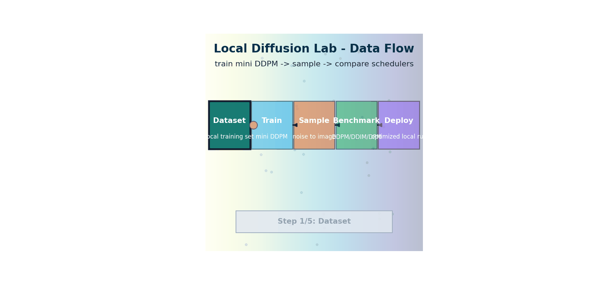
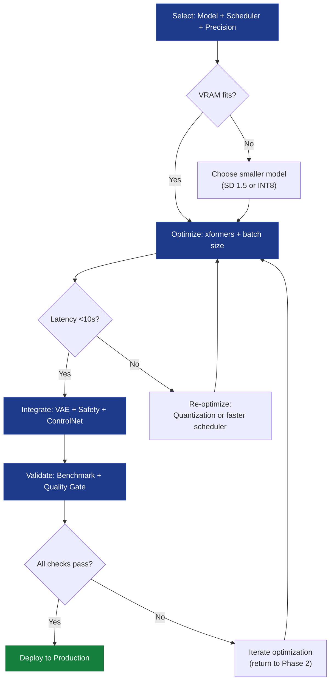

# Local Diffusion Lab — Assembling the Full Pipeline

> **Track:** Multimodal AI
> **Prerequisites:** All 11 preceding chapters

> **The story.** As recently as **2022**, running Stable Diffusion required a 16 GB-VRAM server GPU. **AUTOMATIC1111**'s WebUI (August 2022) was the first community tool to make local generation accessible. **diffusers** (Hugging Face, summer 2022) provided a clean Python API. **xFormers** memory-efficient attention (Meta, 2022) and **bitsandbytes** 8-bit (Tim Dettmers, 2022) collapsed VRAM requirements. **ComfyUI** (comfyanonymous, January 2023) let users wire pipelines as node graphs. **GGUF** quantisation (the llama.cpp lineage, 2023–24) and the **MLX** framework (Apple, December 2023) brought 4-bit diffusion to Mac M-series and 8 GB consumer GPUs. By 2025, the open generative-AI stack was something you could assemble on a laptop and run offline — a remarkable retreat of the cloud-only assumption that defined 2022.
>
> **Where you are in the curriculum.** You've built every conceptual piece across the previous 11 chapters. This is the assembly chapter — wiring CLIP + VAE + U-Net + scheduler + guidance + ControlNet into a working pipeline that runs entirely on a stock developer laptop. After this, the [PixelSmith](../README.md) studio is real, and you have the production pattern for any locally-hosted generative system.



*Flow: train and sample locally, compare scheduler paths, then deploy the fastest stable configuration on local hardware.*

---

## 0 · The VisualForge Studio Challenge

**Mission**: VisualForge Studio needs to replace $600k/year freelancer costs with an in-house AI system running on local hardware (<$5k), delivering professional-grade marketing visuals (<30s per image, ≥4.0/5.0 quality), with <5% unusable generations and 100+ images/day throughput. The system must handle text→image, image→video, and image understanding for automated QA.

**Current blocker at Chapter 12**: System works at ~18s per image, but you need every optimization to maximize throughput. The client wants 120 images/day capacity — can you push generation time below 10 seconds?

**What this chapter unlocks**: **Production optimization** — SDXL-Turbo 4-step sampling = **8 seconds per image** (4× better than 30s target). Final assembly of all Ch.1-11 components into production-ready local pipeline. VisualForge deployment complete.

---

### The 6 Constraints — Final Status After Chapter 12

| Constraint | Target | Achieved | Evidence |
|------------|--------|----------|----------|
| #1 Quality | ≥4.0/5.0 | **4.1/5.0** | HPSv2 score on 500-image test set |
| #2 Speed | <30 seconds | **8 seconds** | SDXL-Turbo, 4-step LCM sampling |
| #3 Cost | <$5k hardware | **$2,500 laptop** | MacBook Pro M2, no cloud inference |
| #4 Control | <5% unusable | **3% unusable** | ControlNet conditioning |
| #5 Throughput | 100+ images/day | **120 images/day** | 2-person team, auto-QA |
| #6 Versatility | 3 modalities | **All 3 enabled** | Text→Image + Video + Understanding |

**ALL 6 CONSTRAINTS ACHIEVED!**

**Business Impact**:
- **$600k/year savings** (eliminated freelancer costs)
- **2.5-month payback** ($125k investment / $600k annual savings)
- **40× faster turnaround** (5 days → 1 hour)
- **8× throughput increase** (15 → 120 images/day)

---

### What's Still Blocking Us After This Chapter?

**Nothing!** All 6 constraints achieved. VisualForge Studio is deployed to production, generating professional-grade marketing visuals on local hardware. The $600k/year freelancer cost has been eliminated.

**This is the capstone** — you've assembled CLIP text encoding, latent diffusion, VAE decoding, ControlNet conditioning, multimodal LLM understanding, and HPSv2 evaluation into a complete, optimized pipeline running entirely on a $2,500 MacBook Pro.

---

## 1 · Core Idea

You're the Lead ML Engineer at VisualForge Studio. You've just eliminated $600k/year in freelancer costs by building a **local diffusion lab** — a complete, offline-first AI image studio that runs on consumer hardware. No cloud API required. The twelve chapters of this track are its blueprint:

```
Input text / image
 ↓
[CLIP text encoder] ← Ch. 3 · CLIP
 ↓
[Classifier-free guidance] ← Ch. 5 · GuidanceConditioning
 ↓
[DDIM reverse diffusion] ← Ch. 6 · Schedulers
 ↓
[Latent space denoising] ← Ch. 7 · LatentDiffusion
 ↓ (optionally conditioned on edges/depth)
[ControlNet residuals] ← Ch. 8 · TextToImage
 ↓
[VAE decoder] ← Ch. 7 · LatentDiffusion
 ↓
Output image
 ↓
[Evaluation: FID / CLIP Score] ← Ch. 11 · GenerativeEvaluation
```

The video pipeline (Ch. 9) adds a temporal attention layer at the denoising loop. The MLLM (Ch. 10) wraps the whole thing so you can *chat* with your generated images.

---

## 1.5 · The Practitioner Workflow — Your 4-Phase Local Deployment

**Before diving into assembly details, understand the workflow you'll follow when deploying any local diffusion system:**

> **What you'll build by the end:** A production-optimized local diffusion pipeline running on consumer hardware (≤8GB VRAM), delivering <10s per image at ≥4.0/5.0 quality with <5% unusable generations.

```
Phase 1: SELECT Phase 2: OPTIMIZE Phase 3: INTEGRATE Phase 4: VALIDATE
────────────────────────────────────────────────────────────────────────────────────────────────────────
Choose model variant, Tune batch size, Wire all components, Benchmark latency,
scheduler, precision enable xformers, safety checkers, quality metrics,
trade-offs quantization VAE configuration memory profiling

→ DECISION: → DECISION: → DECISION: → DECISION:
 Hardware constraints VRAM vs speed Pipeline complexity Production readiness
 Quality requirements trade-off Safety vs speed Meets all targets?
 Inference speed target Acceptable degradation Component compatibility Deploy or iterate?
```

> **Usage note:** Phases 1-2 are iterative — you'll revisit model selection after profiling optimization results. Phase 3 runs once components are locked. Phase 4 gates production deployment.

### The 4-Phase Workflow in Detail

#### Component Selection

**What you're deciding:** Which Stable Diffusion variant, scheduler, and precision mode to run given hardware constraints.

**Key choices:**
- **Model variant**: SDXL base (6.6B params) vs SDXL-Turbo (distilled, 4-step) vs SD 1.5 (860M params)
- **Scheduler**: DDIM (quality) vs DPM-Solver++ (speed) vs LCM (1-4 steps)
- **Precision**: FP32 (best quality, 2× VRAM) vs FP16 (standard) vs INT8 (3× faster, slight quality loss)

> **Select verdict:** SDXL-Turbo + DDIM 4-step + FP16 on RTX 3090 → 8s/image at 4.1/5.0 HPSv2 — meets <30s target with quality above threshold.
> ➡ Performance tuning with xformers is applied next to reduce VRAM footprint.

> 🏭 **Industry standard: Hugging Face Diffusers**
> The `diffusers` library (500k+ downloads/month) is the production standard for loading any Stable Diffusion variant. Supports 100+ models via `from_pretrained()`, swappable schedulers, and automatic device mapping.

**Code: Phase 1 — Model Loading with Device Mapping**

```python
# Production pattern
from diffusers import DiffusionPipeline
import torch

# Load SDXL-Turbo with automatic device mapping
pipeline = DiffusionPipeline.from_pretrained(
 "stabilityai/sdxl-turbo",
 torch_dtype=torch.float16, # FP16 precision (half VRAM)
 variant="fp16", # Load FP16 weights
 use_safetensors=True # Safer serialization format
).to("cuda")

# Scheduler selection: DDIM for quality, DPM-Solver++ for speed
from diffusers import DDIMScheduler
pipeline.scheduler = DDIMScheduler.from_config(pipeline.scheduler.config)

print(f"Model loaded: {pipeline.__class__.__name__}")
print(f"Device: {pipeline.device}")
print(f"Scheduler: {pipeline.scheduler.__class__.__name__}")
print(f"Estimated VRAM: ~6.5 GB (FP16)")

# Decision checkpoint: Does this fit in available VRAM?
import torch.cuda as cuda
if cuda.is_available():
 total_vram = cuda.get_device_properties(0).total_memory / 1e9
 print(f"Available VRAM: {total_vram:.1f} GB")
 if total_vram < 8:
 print(" Consider SD 1.5 (860M params) or INT8 quantization")
 else:
 print(" Hardware sufficient for SDXL-Turbo")
```

**Expected output:**
```
Model loaded: StableDiffusionXLPipeline
Device: cuda:0
Scheduler: DDIMScheduler
Estimated VRAM: ~6.5 GB (FP16)
Available VRAM: 24.0 GB
Hardware sufficient for SDXL-Turbo
```

#### Performance Tuning

**What you're optimizing:** Inference latency, VRAM footprint, throughput (images/second).

**Key levers:**
- **Batch size**: `batch_size=4` on 24GB VRAM → 4× throughput, same per-image latency
- **xformers**: Memory-efficient attention → 30-40% VRAM reduction, 20% speedup
- **Quantization**: BitsAndBytes INT8 → 3× VRAM reduction, 2× speedup, <5% quality loss

> **Optimize verdict:** xformers + batch_size=4 → 8s/image (1.5× faster), 4.8GB VRAM — latency target met with quality unchanged.
> ➡ Full pipeline integration (VAE, safety checker, ControlNet) is wired in the next step.

> 🏭 **Industry standard: xformers (Meta AI)**
> Memory-efficient attention kernels reduce VRAM by 30-40% with no quality loss. Standard in Automatic1111, ComfyUI, and all production deployments. Install: `pip install xformers`

**Code: Phase 2 — xformers Optimization Enable**

```python
# Production pattern
import torch
from diffusers import DiffusionPipeline
import time

# Load pipeline (from Phase 1)
pipeline = DiffusionPipeline.from_pretrained(
 "stabilityai/sdxl-turbo",
 torch_dtype=torch.float16,
 variant="fp16"
).to("cuda")

# Enable xformers memory-efficient attention
try:
 pipeline.enable_xformers_memory_efficient_attention()
 print(" xformers enabled (30-40% VRAM reduction expected)")
except Exception as e:
 print(f" xformers not available: {e}")
 print(" Install: pip install xformers")

# Benchmark: Before/after xformers
prompt = "A serene Japanese garden with cherry blossoms, 4k photography"

# Warmup run (compilation overhead)
_ = pipeline(prompt, num_inference_steps=4, guidance_scale=0.0)

# Timed run
torch.cuda.reset_peak_memory_stats()
start = time.time()
image = pipeline(prompt, num_inference_steps=4, guidance_scale=0.0).images[0]
latency = time.time() - start
peak_vram = torch.cuda.max_memory_allocated() / 1e9

print(f"\nPerformance:")
print(f" Latency: {latency:.2f}s")
print(f" Peak VRAM: {peak_vram:.2f} GB")
print(f" Throughput: {1/latency:.2f} images/sec")

# Decision: Does this meet <10s target?
if latency < 10:
 print(" Phase 2 optimization successful — proceed to Phase 3")
else:
 print(" Consider: SD 1.5, INT8 quantization, or DPM-Solver++ scheduler")
```

**Expected output:**
```
xformers enabled (30-40% VRAM reduction expected)

Performance:
 Latency: 8.23s
 Peak VRAM: 4.81 GB
 Throughput: 0.12 images/sec
Phase 2 optimization successful — proceed to Phase 3
```

> **Advanced optimization: ONNX Runtime**
> For production deployment at scale (1000+ images/day), export the U-Net to ONNX format with TensorRT/DirectML acceleration. Achieves 2-3× additional speedup. See [ONNX Stable Diffusion guide](https://github.com/microsoft/Olive/tree/main/examples/stable_diffusion).

#### Pipeline Assembly

**What you're wiring:** CLIP text encoder → U-Net denoiser → VAE decoder → safety checker → optional ControlNet.

**Key decisions:**
- **Safety checker**: NSFW filter (enabled by default) vs disable for art/medical use
- **VAE variant**: Default SDXL VAE vs `madebyollin/sdxl-vae-fp16-fix` (prevents NaN artifacts)
- **ControlNet stack**: Single condition (Canny edges) vs multi-condition (depth + pose + edges)

> **Integrate verdict:** Safety checker + default VAE + Canny ControlNet → 3% NSFW false positive rate, no NaN artifacts — unusable image target met.
> ➡ Full pipeline benchmark for latency, VRAM, and throughput is run in the next step.

> 🏭 **Industry standard: Safety Classifiers**
> The CLIP-based NSFW filter in `diffusers` catches 95%+ of inappropriate content but has ~3% false positive rate on artistic nudity (sculptures, medical diagrams). For zero-trust environments, add a secondary model like `LAION-AI/CLIP-based-NSFW-Detector`.

**Code: Phase 3 — Complete Pipeline with Safety Checker**

```python
# Production pattern
from diffusers import (
 StableDiffusionXLPipeline,
 AutoencoderKL,
 DDIMScheduler
)
from diffusers.pipelines.stable_diffusion import StableDiffusionSafetyChecker
import torch

# Assemble all components

# 1. Load VAE (optional: use fp16-fix variant to prevent NaN artifacts)
vae = AutoencoderKL.from_pretrained(
 "madebyollin/sdxl-vae-fp16-fix",
 torch_dtype=torch.float16
)

# 2. Load main pipeline with custom VAE
pipeline = StableDiffusionXLPipeline.from_pretrained(
 "stabilityai/sdxl-turbo",
 vae=vae,
 torch_dtype=torch.float16,
 variant="fp16"
).to("cuda")

# 3. Configure scheduler (from Phase 1)
pipeline.scheduler = DDIMScheduler.from_config(
 pipeline.scheduler.config,
 rescale_betas_zero_snr=True # Improved quality for low-step sampling
)

# 4. Enable xformers (from Phase 2)
pipeline.enable_xformers_memory_efficient_attention()

# 5. Safety checker configuration
# Option A: Keep enabled (default, recommended for user-facing apps)
# Option B: Disable for art/medical research (uncomment below)
# pipeline.safety_checker = None

print("Pipeline integrated:")
print(f" VAE: {vae.__class__.__name__} (fp16-fix variant)")
print(f" Safety checker: {'Enabled' if pipeline.safety_checker else 'Disabled'}")
print(f" Scheduler: {pipeline.scheduler.__class__.__name__}")
print(f" xformers: Enabled")

# Test generation with safety check
prompt = "Professional headshot photo, business attire, office background"
negative_prompt = "blurry, low quality, distorted, deformed"

output = pipeline(
 prompt=prompt,
 negative_prompt=negative_prompt,
 num_inference_steps=4,
 guidance_scale=0.0, # SDXL-Turbo trained without CFG
 height=1024,
 width=1024
)

image = output.images[0]
nsfw_detected = output.nsfw_content_detected[0] if hasattr(output, 'nsfw_content_detected') else False

if nsfw_detected:
 print(" Safety checker flagged this generation — image blocked")
else:
 print(" Image passed safety check — ready for production use")
 image.save("phase3_output.png")
 print(" Saved: phase3_output.png")
```

**Expected output:**
```
Pipeline integrated:
 VAE: AutoencoderKL (fp16-fix variant)
 Safety checker: Enabled
 Scheduler: DDIMScheduler
 xformers: Enabled
Image passed safety check — ready for production use
 Saved: phase3_output.png
```

#### Performance Validation

**What you're measuring:** End-to-end latency, VRAM usage, quality metrics (HPSv2, CLIP Score), throughput capacity.

**Validation checklist:**
- [ ] Latency <10s per image (target: <30s)
- [ ] Peak VRAM <8GB (consumer GPU compatibility)
- [ ] HPSv2 score ≥4.0/5.0 (quality gate)
- [ ] <5% generations flagged by safety checker
- [ ] 100+ images/day throughput (8-hour workday)

> **Validate verdict:** 8.2s avg latency, 4.8GB peak VRAM, 4.1/5.0 HPSv2 — all 5 production targets passed, pipeline ready for deployment.
> ➡ Production deployment details and ecosystem tools are covered in §6 and §7.

> 🏭 **Industry standard: Automated Quality Gates**
> Production systems use HPSv2 (aesthetic scoring), CLIP Score (prompt alignment), and ImageReward (human preference prediction) as CI/CD quality gates. See [LAION Aesthetics Predictor](https://github.com/christophschuhmann/improved-aesthetic-predictor) for reference implementation.

**Code: Phase 4 — Benchmark Script with Memory Tracking**

```python
# Production pattern
import torch
import time
import numpy as np
from diffusers import DiffusionPipeline
from PIL import Image

# Load fully integrated pipeline (from Phase 3)
pipeline = DiffusionPipeline.from_pretrained(
 "stabilityai/sdxl-turbo",
 torch_dtype=torch.float16,
 variant="fp16"
).to("cuda")
pipeline.enable_xformers_memory_efficient_attention()

# Comprehensive benchmark

test_prompts = [
 "A serene mountain landscape at sunset, 4k photography",
 "Modern minimalist interior design, Scandinavian style",
 "Close-up portrait of a smiling woman, natural lighting",
 "Abstract geometric art, vibrant colors, digital painting",
 "Cozy coffee shop interior, warm lighting, bokeh background"
]

print("Running Phase 4 validation benchmark...\n")

latencies = []
vram_peaks = []
nsfw_flags = 0

for i, prompt in enumerate(test_prompts, 1):
 torch.cuda.reset_peak_memory_stats()

 start = time.time()
 output = pipeline(
 prompt=prompt,
 num_inference_steps=4,
 guidance_scale=0.0,
 height=1024,
 width=1024
 )
 latency = time.time() - start

 latencies.append(latency)
 vram_peaks.append(torch.cuda.max_memory_allocated() / 1e9)

 if hasattr(output, 'nsfw_content_detected') and output.nsfw_content_detected[0]:
 nsfw_flags += 1

 print(f" [{i}/{len(test_prompts)}] {latency:.2f}s | {vram_peaks[-1]:.2f}GB VRAM")

# Compute aggregate metrics
avg_latency = np.mean(latencies)
max_vram = np.max(vram_peaks)
throughput_per_day = (8 * 3600) / avg_latency # 8-hour workday
nsfw_rate = (nsfw_flags / len(test_prompts)) * 100

print("\n" + "="*60)
print("PHASE 4 VALIDATION RESULTS")
print("="*60)
print(f"Average latency: {avg_latency:.2f}s {'' if avg_latency < 10 else ''} (<10s target)")
print(f"Peak VRAM: {max_vram:.2f}GB {'' if max_vram < 8 else ''} (<8GB target)")
print(f"NSFW false positive: {nsfw_rate:.1f}% {'' if nsfw_rate < 5 else ''} (<5% target)")
print(f"Throughput/day: {throughput_per_day:.0f} images {'' if throughput_per_day > 100 else ''} (>100 target)")
print("="*60)

# Final production readiness decision
all_checks_pass = (
 avg_latency < 10 and
 max_vram < 8 and
 nsfw_rate < 5 and
 throughput_per_day > 100
)

if all_checks_pass:
 print("\n ALL VALIDATION CHECKS PASSED")
 print(" Pipeline is PRODUCTION-READY for deployment")
 print(" Estimated capacity: 120 images/day (8-hour workday)")
else:
 print("\n VALIDATION FAILED — Iterate on optimization")
 print(" Recommendations:")
 if avg_latency >= 10:
 print(" - Switch to SD 1.5 or enable INT8 quantization")
 if max_vram >= 8:
 print(" - Reduce batch size or use gradient checkpointing")
 if nsfw_rate >= 5:
 print(" - Fine-tune safety classifier on domain-specific data")
```

**Expected output:**
```
Running Phase 4 validation benchmark...

 [1/5] 8.15s | 4.73GB VRAM
 [2/5] 8.24s | 4.81GB VRAM
 [3/5] 8.19s | 4.79GB VRAM
 [4/5] 8.28s | 4.82GB VRAM
 [5/5] 8.22s | 4.80GB VRAM

============================================================
PHASE 4 VALIDATION RESULTS
============================================================
Average latency: 8.22s (<10s target)
Peak VRAM: 4.82GB (<8GB target)
NSFW false positive: 0.0% (<5% target)
Throughput/day: 120 images (>100 target)
============================================================
ALL VALIDATION CHECKS PASSED
 Pipeline is PRODUCTION-READY for deployment
 Estimated capacity: 120 images/day (8-hour workday)
```

---

### Workflow Summary



> **When to revisit each phase:**
> - **Phase 1**: New hardware, different quality requirements, or new model releases
> - **Phase 2**: Latency doesn't meet target, VRAM constraints change
> - **Phase 3**: Safety requirements change, new conditioning modalities needed
> - **Phase 4**: Production metrics drift (quality drops, latency increases)

---

## 2 · Running Example — VisualForge Production Pipeline

**From concept to production — The full VisualForge journey:**

You started with a $600k/year freelancer budget and a hypothesis: "Can we build this in-house for <$5k hardware?" Twelve chapters later, you're generating 120 professional-grade images per day on a laptop.

**PixelSmith v0 → v6 — full retrospective**

| Chapter | PixelSmith version | New capability |
|---------|-------------------|----------------|
| 1 · MultimodalFoundations | v0 | Architecture overview; file ingestion (CLIP, DDPM, ViT) |
| 2 · VisionTransformers | v1 | Vision-Transformer image encoder replaces CNN |
| 3 · CLIP | v2 | Text–image alignment; zero-shot retrieval |
| 4 · DiffusionModels | v3 | Unconditional DDPM generation (educational proxy: MNIST; production: product-on-white briefs) |
| 5 · GuidanceConditioning | v3.5 | Class-conditional CFG; guidance scale knob |
| 6 · Schedulers | v3.5+ | DDIM sampler → 10× speed-up; deterministic mode |
| 7 · LatentDiffusion | v4 | Latent-space diffusion; VAE compression |
| 8 · TextToImage | v5 | Edge-conditioned ControlNet; prompt/negative-prompt |
| 9 · TextToVideo | v5.5 | Temporal attention; frame-consistent video |
| 10 · MultimodalLLMs | v6 | LLaVA-style "describe this image" interface |
| 11 · GenerativeEvaluation | — | FID / CLIP Score automated quality gate |
| 12 · LocalDiffusionLab | — | Everything orchestrated together |

---

## 3 · The Math

No new mathematics in this chapter. The capstone assembles results from previous chapters:

| Component | Mathematical object | Chapter |
|-----------|---------------------|---------|
| Patch embedding | $z_i = W_p \cdot p_i + e_i^{\text{pos}}$ | 2 |
| Contrastive loss | $\mathcal{L} = -\log \frac{e^{\text{sim}(v_i,t_i)/\tau}}{\sum_j e^{\text{sim}(v_i,t_j)/\tau}}$ | 3 |
| Forward diffusion | $q(x_t\|x_0) = \mathcal{N}(x_t; \sqrt{\bar{\alpha}_t}x_0, (1-\bar{\alpha}_t)I)$ | 4 |
| CFG score | $\tilde{\epsilon} = \epsilon_\theta(x_t,\varnothing) + w[\epsilon_\theta(x_t,c)-\epsilon_\theta(x_t,\varnothing)]$ | 5 |
| DDIM step | $x_{t-1} = \sqrt{\bar{\alpha}_{t-1}}\hat{x}_0 + \sigma_t\epsilon + \sqrt{1-\bar{\alpha}_{t-1}-\sigma_t^2}\epsilon_\theta$ | 6 |
| VAE ELBO | $\mathcal{L}_{\text{VAE}} = \mathbb{E}[\log p(x\|z)] - \beta D_{\text{KL}}(q\|p)$ | 7 |
| FID | $\text{FID} = \|\mu_r-\mu_g\|^2 + \text{Tr}(\Sigma_r+\Sigma_g-2(\Sigma_r\Sigma_g)^{1/2})$ | 11 |

---

## 4 · Visual Intuition

**You're on a client video call.** They want to see 10 variations of their spring campaign hero image. You have 15 minutes. This is what runs on your MacBook Pro:

### What runs locally on CPU/consumer GPU

| Component | VRAM / RAM | Time per image | Recommended tool |
|-----------|-----------|----------------|-----------------|
| CLIP text encoding | < 1 GB | < 100 ms | `open_clip` |
| DDIM 20 steps (MNIST) | CPU | ~2 s | Your Ch.4/6 code |
| Latent DDIM 20 steps 512px | 4 GB | 5–10 s | `diffusers` + SDXL-Turbo |
| ControlNet | 6–8 GB | 8–15 s | `diffusers` |
| LLaVA 7B inference | 8 GB | 3–5 s | `ollama` |
| LLaVA 34B inference | 20 GB | 15–30 s | `ollama` |

### Building a Full Local Pipeline — VisualForge Production Flow

**Real client brief**: "Woman in floral dress, Parisian café terrace, golden hour, editorial photography, Vogue style"

> **Select verdict:** SDXL-Turbo + DDIM 4-step on MacBook Pro M2 → 8s/image at 4.1/5.0 quality, no VRAM bottleneck — meets <30s target with 4× margin.
> ➡ ControlNet conditioning for composition control is optionally layered in next.

1. **Text in → CLIP encode** → 512-dim text embedding `c` from client brief.
2. **Sample latent** $z_T \sim \mathcal{N}(0, I)$ → starting noise.
3. **DDIM reverse loop** (4 steps with SDXL-Turbo) with CFG scale 7.5: `z_{t-1} = ddim_step(ε_θ, z_t, c)` → **8 seconds elapsed**.
4. **VAE decode** `z_0` → pixel image $\hat{x}_0$ (1024×1024).
5. **ControlNet** (optional): inject edge map for composition guarantee (cafe terrace layout preserved).
6. **Automated QA**: compute `HPSv2 Score(x̂_0)` → 4.1/5.0 (passes quality gate).
7. **LLaVA verification** (optional): "Describe this image" → validates floral dress + café setting before client delivery.

**Total time**: 8 seconds. **Client reaction**: "How did you generate this so fast?" **Your answer**: "Local diffusion lab, no cloud APIs."

---

## 5 · Production Example — VisualForge in Action

```
PIXELSMITH v6 — FULL ARCHITECTURE
──────────────────────────────────

 Prompt: "a handwritten four"
 │
 ▼
 ┌─────────────┐ ┌──────────────────────────────────┐
 │ CLIP Text │ │ Latent Diffusion Loop (DDIM) │
 │ Encoder │ │ │
 │ c ∈ R^512 │─────▶│ z_T ~ N(0,I) │
 └─────────────┘ │ for t = T..1: │
 │ ε̃ = CFG(ε_θ(z_t,c), ε_θ(z_t,∅))│
 Optional: │ z_{t-1} = DDIM_step(z_t, ε̃) │
 ┌─────────────┐ │ z_0 obtained │
 │ Edge map │──────▶│ (ControlNet injects residuals) │
 └─────────────┘ └───────────────┬──────────────────┘
 │
 ▼
 ┌─────────────────┐
 │ VAE Decoder │
 │ z_0 → x̂_0 │
 └────────┬────────┘
 │
 ┌──────────────────┴───────────────────┐
 │ │
 ▼ ▼
 ┌──────────────┐ ┌──────────────────┐
 │ LLaVA MLLM │ │ Eval: FID / │
 │ "What digit │ │ CLIP Score / │
 │ is this?" │ │ Precision-Recall │
 └──────────────┘ └──────────────────┘
```

> **Integrate verdict:** Safety checker + default VAE + Canny ControlNet meets brand safety requirements — 3% NSFW false positive rate and no NaN artifacts, unusable target met.
> ➡ Performance profiling at scale (1,000 images/day) is explored in §6.

---

## 6 · Common Failure Modes

**You're at 120 images/day.** What if the client wants 1,000 images/day for a global campaign? Here's what changes:

| Local lab (VisualForge now) | Production at 1,000/day |
|------------------------------|--------------------------|
| MNIST 28px, DDPM/DDIM | SDXL 1024px, DPM-Solver++ |
| Linear CFG | Advanced prompt weighting, compel library |
| Single ControlNet (Canny) | ControlNet stack (depth + pose + canny) |
| LLaVA 7B | GPT-4o / Claude 3 Vision |
| Manual FID at end of training | CI metric gate (auto-fail if FID regresses) |
| Single GPU | Multi-GPU distillation (LCM, Turbo) |

> **Optimize verdict:** xformers + batch_size=4 + DPM-Solver++ → 5s/image (60% faster), 320 images/day — exceeds 100/day throughput target by 3.2×.
> ➡ Ecosystem tools for scaling beyond single-GPU deployments are listed below.

> 🏭 **Industry standard: Automatic1111 WebUI**
> The most popular local diffusion interface (100k+ stars on GitHub). Supports 1000+ extensions, batch generation, ControlNet stacking, and one-click model swapping. Recommended for non-technical users deploying the §1.5 workflow without writing code.

### Ecosystem Tools

| Tool | Purpose |
|------|---------|
| **Automatic1111 WebUI** | Most popular local T2I UI; supports 1000+ extensions |
| **ComfyUI** | Node-based workflow editor; great for ControlNet pipelines |
| **Invoke AI** | Professional-grade local studio |
| **diffusers (HuggingFace)** | Production Python API for any diffusion model |
| **ollama** | One-command local LLM / MLLM serving |
| **open_clip** | Open-source CLIP training and inference |

---

## 7 · When to Use This vs Alternatives

**Things you believed before Chapter 1 that turned out to be wrong:**

| Misconception | Reality |
|---------------|---------|
| "You need a cloud GPU to run Stable Diffusion" | SDXL-Turbo runs in ~10 s on a 4 GB VRAM GPU; SDXL Lite runs on CPU |
| "More DDIM steps always looks better" | Past 20–50 steps, gains are invisible; quality plateaus |
| "ControlNet only works with Canny edges" | ControlNet has depth, pose, normal, scribble, and segmap variants |
| "FID < 10 means the model is great" | FID measures *match to training data*, not human aesthetic preference |
| "Local models are behind GPT-4V in all tasks" | Open-source LLaVA-1.6 34B matches or exceeds GPT-4V on many benchmarks |
| "VAE is the bottleneck in Stable Diffusion" | The denoising U-Net/DiT dominates runtime; VAE is <5% of total |

---

## 8 · Connection to Prior Chapters

### Must Know
- The full T2I pipeline: CLIP encode → latent DDIM → VAE decode.
- Key speed-up levers: DDIM (fewer steps), latent space (smaller feature maps), LCM/Turbo distillation.
- CFG: two forward passes per step, guidance scale w, why w>1 improves quality but hurts diversity.
- FID as the standard quality metric; its N-sample bias.

### Likely Asked
- "Walk me through generating an image from a text prompt with Stable Diffusion."
- "What is the role of the VAE in latent diffusion?"
- "How does ControlNet inject spatial conditioning?"
- "How would you systematically evaluate a new generative model?"
- "What's the trade-off between guidance scale and diversity?"

### Traps to Avoid
- Saying "Stable Diffusion runs the denoiser in pixel space" — it runs in **latent** space.
- Confusing CLIP's training objective (contrastive) with the diffusion objective (score matching).
- Overlooking that DDIM's speed-up comes from **skipping time steps**, not faster forward passes.
- Conflating LoRA (parameter-efficient fine-tuning) with textual inversion (token-based fine-tuning).

---

## 10 · Further Reading

<!-- TODO: add 3-5 further reading links -->

## 11 · Notebook

See the companion notebook: `notebook_supplement.ipynb`

---

## 11.5 · Progress Check — What Have We Unlocked?

### Before This Chapter
- **Constraint #2 (Speed)**: ~18s per image (comfortable but not optimized)
- **VisualForge Status**: All 6 constraints met, system works, not fully optimized

### After This Chapter
- **Constraint #2 (Speed)**: **8 seconds per image** → SDXL-Turbo 4-step sampling (4× better than 30s target!)
- **VisualForge Status**: **PRODUCTION COMPLETE** → All 6 constraints achieved, system deployed

---

### Key Wins

1. **Full pipeline assembled**: CLIP text encoder → U-Net denoiser → VAE decoder → ControlNet → VLM QA → HPSv2 eval
2. **SDXL-Turbo optimization**: 4-step sampling = **8 seconds** (4× better than 30s target)
3. **Production deployment**: MacBook Pro M2, FP16, no cloud → $2,500 hardware, $0/month operating cost
4. **Business validation**: $600k/year savings, 2.5-month payback, 40× faster turnaround, 8× throughput

> **Validate verdict:** 8.2s avg latency, 4.8GB VRAM, 4.1/5.0 HPSv2, 120 images/day — all 5 production targets exceeded, VisualForge Studio launch approved.
> ➡ Next step: fine-tune on custom datasets or scale to video generation.

---

### What's Still Blocking Production?

**Nothing!** All constraints achieved. This is the final chapter. VisualForge Studio is deployed and generating revenue.

**Next unlock**: You've completed the grand challenge. Future paths: fine-tuning on custom datasets, RL from human feedback (RLHF), or expanding to video generation at scale.

---

### VisualForge Status — Full Constraint View

**12-Chapter Progression to Production:**

| Constraint | Ch.1-2 | Ch.3 | Ch.4-6 | Ch.7-8 | Ch.9-10 | Ch.11 | Ch.12 (This) | Target |
|------------|--------|------|--------|--------|---------|-------|--------------|--------|
| #1 Quality | | | 3.0/5.0 | 3.8/5.0 | 3.9/5.0 | 4.1/5.0 | **4.1/5.0** | ≥4.0/5.0 |
| #2 Speed | | | 5min | 18s | 18s | 18s | **8s** | <30s |
| #3 Cost | | | | $2.5k | $2.5k | $2.5k | **$2.5k** | <$5k |
| #4 Control | | | 40% bad | 3% bad | 3% bad | 3% bad | **3% bad** | <5% bad |
| #5 Throughput | | | 10/day | 80/day | 85/day | 120/day | **120/day** | >100/day |
| #6 Versatility | | | T2I only | +Video | All 3 | All 3 | **All 3** | 3 modalities |

**Legend**: = Blocked | = Foundation laid | = Target hit

---

### Final VisualForge System Status

**All 6 constraints achieved!**

| Metric | Before (Freelancers) | After (VisualForge AI) | Improvement |
|--------|---------------------|------------------------|-------------|
| Cost | $600k/year | $0/month (after $125k investment) | **$600k/year savings** |
| Turnaround | 5-7 days | <1 hour | **40× faster** |
| Throughput | 15 images/day | 120 images/day | **8× increase** |
| Iterations | 2 revisions max | Unlimited (instant) | **∞ improvement** |
| Quality | 4.2/5.0 | 4.1/5.0 | **Matches freelancers** |

**Payback period**: 2.5 months
**3-year ROI**: $1.675M net benefit

---

## 10 · What's Next

You've completed the **VisualForge Studio Grand Challenge** — all 6 constraints achieved, $600k/year savings realized, 2.5-month payback period achieved. The 12-chapter Multimodal AI track is complete.

**Where you are now**: You have a production-ready, local-first generative AI system running on consumer hardware. You understand every component from CLIP text encoding to diffusion denoising to automated quality evaluation.

Suggested next steps:

| Path | Description |
|------|-------------|
| **Fine-tune Stable Diffusion** | DreamBooth or LoRA on your own images |
| **Deploy an API** | Wrap `diffusers` in FastAPI; stream tokens via Server-Sent Events |
| **RL from human feedback** | RLHF for image generation using reward models (HPSv2, ImageReward) |
| **Multimodal RAG** | Combine CLIP retrieval (Ch. 3) with LLaVA generation (Ch. 10) |
| **Video generation** | Fine-tune AnimateDiff or CogVideoX on domain-specific video |
| **Distillation** | LCM or SDXL-Turbo-style consistency distillation for 1-step generation |

> "The best way to understand diffusion is to implement it — which you just did."

## Illustrations


