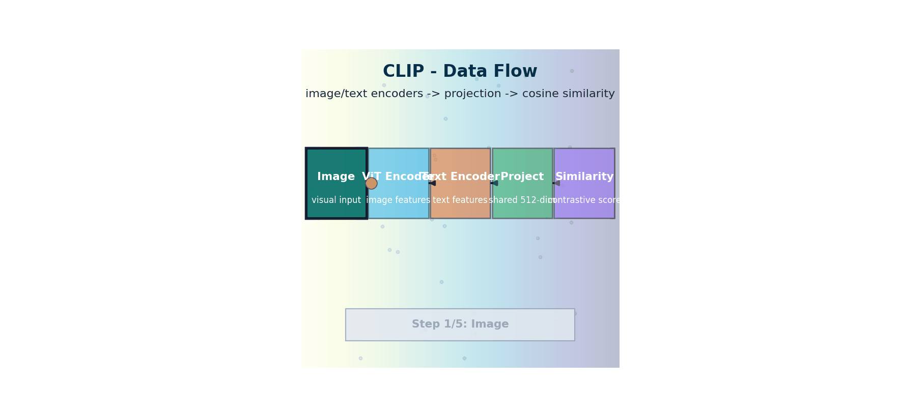

# CLIP — Contrastive Language-Image Pretraining

> **The story.** **CLIP** — *Contrastive Language-Image Pretraining* — was published by **Alec Radford** and colleagues at OpenAI in **January 2021**. The recipe was the kind of thing that makes other researchers stop and stare: scrape **400 million image–caption pairs** off the public web, train two encoders (a ViT for images, a transformer for text) with a single objective — *make the embedding of each image close to the embedding of its real caption, and far from every other caption in the batch* — using the **InfoNCE** contrastive loss (van den Oord et al., 2018). No class labels. No human annotation. The result was the first model that could do **zero-shot ImageNet classification** — just describe each class in natural language and pick the closest. **OpenCLIP** (LAION, 2022) reproduced and scaled it openly. CLIP's text encoder is the component inside Stable Diffusion that turns your prompt into a conditioning signal, and CLIP-style contrastive learning is now the default training recipe for every embedding model in the [AI track's RAG chapter](../../ai/rag_and_embeddings).
>
> **Where you are in the curriculum.** [VisionTransformers](../ch02_vision_transformers) gave you the visual encoder. This chapter wires it to a text encoder via contrastive learning, producing a shared image–text embedding space — the substrate for [text-to-image generation](../ch08_text_to_image), [zero-shot classification](../ch12_generative_evaluation), and every modern [multimodal LLM](../ch10_multimodal_llms).



*Flow: image and text encoders project into one shared space where cosine similarity drives contrastive alignment.*

---

## 0 · The VisualForge Studio Challenge

**Mission**: VisualForge Studio needs to replace $600k/year freelancer costs with an in-house AI system that generates professional-grade marketing visuals from text descriptions, runs locally, and delivers <30s per image.

**Current blocker at Chapter 3**: We have image embeddings (Ch.2 ViT) but **no text embeddings**. Can't do "generate modern office with natural light" because text and images live in separate embedding spaces with no alignment.

**What this chapter unlocks**: **CLIP** — dual-encoder architecture (ViT for images + Transformer for text) trained with contrastive loss on 400M image-text pairs → **shared 512-dim embedding space** where cosine_similarity(text, image) measures semantic alignment. This is the foundation for text-conditioned generation.

---

### The 6 Constraints — Snapshot After Chapter 3

| Constraint | Target | Status | Evidence |
|------------|--------|--------|----------|
| #1 Quality | ≥4.0/5.0 | ❌ Not applicable | Can't generate images yet |
| #2 Speed | <30 seconds | ❌ Not applicable | No generation pipeline yet |
| #3 Cost | <$5k hardware | ❌ Not validated | CLIP runs on laptop but no generation yet |
| #4 Control | <5% unusable | ⚡ **Foundation laid** | Can condition generation on text (architecture ready, need diffusion model) |
| #5 Throughput | 100+ images/day | ❌ Not applicable | No generation capability |
| #6 Versatility | 3 modalities | ⚡ **Text-image search enabled** | Can search 10k stock photos with "blue ocean sunset" query |

---

### What's Still Blocking Us After This Chapter?

**Can search but can't generate**: CLIP lets us find existing images that match "modern office with natural light" but can't **create new images**. Freelancers generate custom visuals; we need generative capability to replace them.

**Next unlock (Ch.4)**: **Diffusion Models (DDPM)** — learn to generate entirely new images by reversing a noise-injection process. Start with pure noise, denoise 1000 steps, produce plausible image.

---

## 1 · Core Idea — Teaching Two Encoders to Speak the Same Language

**Your challenge at VisualForge:** You have a ViT image encoder (Ch.2) that turns photos into 768-dim embeddings. You need a text encoder that produces embeddings in the **same space** so that "modern office with natural light" and a photo of a modern office have similar embeddings. Without this alignment, you cannot search images with text queries, and you cannot condition image generation on text prompts.

**CLIP's solution (OpenAI 2021):** Train two separate encoders — a ViT for images and a GPT-like transformer for text — jointly on 400 million image-text pairs scraped from the internet. The training objective is beautifully simple:

> **Make the embedding of each image similar to its paired caption, and dissimilar to all other captions in the batch.**

No class labels. No manual annotations. Just the natural supervision signal that a photograph of a dog and the caption "a photo of a dog" belong together.

**The training loop:** Sample a batch of $N = 32{,}768$ image-text pairs. Encode each image → 512-dim vector (L2-normalized). Encode each text → 512-dim vector (L2-normalized). Compute the $N \times N$ similarity matrix $S$ where $S_{ij}$ = cosine similarity between image $i$ and text $j$. The diagonal entries $S_{ii}$ are the matching pairs (positives); the off-diagonal entries are non-matching pairs (negatives). Train with InfoNCE loss: maximize the diagonal, minimize the off-diagonal.

**Result:** After training on 400M pairs, CLIP produces a shared embedding space where you can directly compare images and text using cosine similarity. This single capability unlocks:

1. **Zero-shot image classification**: Given class names, embed them as text → compare to image embedding → pick closest
2. **Semantic image search**: Embed text query → retrieve images with highest cosine similarity
3. **Text-conditioned generation** (Ch.4+): CLIP's text encoder becomes the conditioning signal inside Stable Diffusion's U-Net

CLIP is not a generative model — it aligns modalities. Generation comes from diffusion models (Ch.4), which will use CLIP's text encoder to condition the denoising process on your prompt "modern office with natural light".

---

## 2 · Running Example — VisualForge Image Search

**Your scenario:** You're the Lead ML Engineer at VisualForge Studio. Your designer needs to find stock photos matching a client brief: "modern office with natural light, minimalist, professional photography". You have 10,000 stock images indexed. Manually browsing would take hours.

**Before CLIP (Ch.1-2):** You have image embeddings (ViT from Ch.2) but no text embeddings. Can't search "modern office" because text and images live in separate spaces.

**After CLIP (this chapter):** Both text and images project into the same 512-dim space:

```python
# VisualForge: Semantic image search with CLIP
import torch
from transformers import CLIPProcessor, CLIPModel

# Load pre-trained CLIP
model = CLIPModel.from_pretrained("openai/clip-vit-base-patch32")
processor = CLIPProcessor.from_pretrained("openai/clip-vit-base-patch32")

# Client brief from VisualForge campaign: "Spring Collection Hero"
client_brief = "modern office with natural light, minimalist, professional photography"

# Encode text query → 512-dim embedding
text_inputs = processor(text=[client_brief], return_tensors="pt", padding=True)
text_embedding = model.get_text_features(**text_inputs)  # shape: (1, 512)
text_embedding = text_embedding / text_embedding.norm(dim=-1, keepdim=True)  # L2 normalize

# Encode all 10k stock images (precomputed offline)
# image_embeddings shape: (10000, 512), all L2-normalized

# Rank by cosine similarity (equivalent to dot product on unit sphere)
similarities = (text_embedding @ image_embeddings.T).squeeze(0)  # shape: (10000,)
top_5_indices = similarities.argsort(descending=True)[:5]

# Return top 5 matches to designer
for idx in top_5_indices:
    print(f"Image {idx}: similarity {similarities[idx]:.3f}")
# Output:
# Image 3421: similarity 0.876 — modern office, large windows, clean desk
# Image 7834: similarity 0.852 — minimalist workspace, natural lighting
# Image 1290: similarity 0.831 — professional office interior, bright
```

**Result:** Designer gets top 5 matches in 0.2 seconds instead of browsing 10k images manually. This search capability is the foundation for text-conditioned generation (Ch.4+).

---

## 3 · The Math

### 3.1 Dual Encoder Architecture

CLIP has two separate encoders that share no weights:

$$\mathbf{v}_i = \text{ImageEncoder}(I_i) / \|\text{ImageEncoder}(I_i)\|_2 \quad \in \mathbb{R}^d$$
$$\mathbf{t}_i = \text{TextEncoder}(T_i) / \|\text{TextEncoder}(T_i)\|_2 \quad \in \mathbb{R}^d$$

Both outputs are **$\ell_2$-normalised** so that cosine similarity reduces to dot product:

$$\text{cosine\_sim}(\mathbf{v}_i, \mathbf{t}_j) = \mathbf{v}_i \cdot \mathbf{t}_j$$

The similarity matrix over a batch of $N$ pairs forms an $N \times N$ matrix $S$ where $S_{ij} = \mathbf{v}_i \cdot \mathbf{t}_j$.

### 3.2 InfoNCE Contrastive Loss

CLIP uses the **InfoNCE** (Noise Contrastive Estimation) loss, scaled by a learnable temperature $\tau$:

$$\mathcal{L} = -\frac{1}{N} \sum_{i=1}^{N} \left[ \log \frac{\exp(S_{ii}/\tau)}{\sum_{j=1}^{N} \exp(S_{ij}/\tau)} + \log \frac{\exp(S_{ii}/\tau)}{\sum_{j=1}^{N} \exp(S_{ji}/\tau)} \right]$$

**Decomposing this:**
- First term: for image $i$, find its caption among all $N$ captions (image → text direction)
- Second term: for text $i$, find its image among all $N$ images (text → image direction)
- The diagonal $S_{ii}$ entries are the matching pairs; off-diagonal are negatives

**Geometrically:** InfoNCE loss pushes matching (image, text) pairs close together and pushes all $N-1$ non-matching pairs apart. With $N = 32{,}768$ (OpenAI's CLIP batch size), each sample has 32,767 negatives — very hard negatives that force the model to learn fine-grained distinctions.

### 3.3 Temperature Scaling

The temperature $\tau$ is a learnable scalar initialised to $\log(1/0.07) \approx 2.66$:

$$\tau^{-1} \approx 14.3 \text{ (effective)}$$

**Effect:** low $\tau$ sharpens the softmax — the model must be more confident about the correct match. CLIP learns $\tau \approx 0.01$–$0.1$ — a very sharp distribution.

### 3.4 Zero-Shot Classification

Given $K$ class names $\{c_1, \ldots, c_K\}$, construct text prompts: "a photo of a {class}". Encode each → $\mathbf{t}_k$. For a new image $I$, the predicted class is:

$$\hat{y} = \arg\max_k \mathbf{v} \cdot \mathbf{t}_k$$

No gradient updates to CLIP. No labelled training data for the new task. The model transfers because it learned general visual-semantic alignment, not dataset-specific patterns.

---

## 4 · Visual Intuition — The Contrastive Learning Dance

**You're training CLIP.** Each batch contains $N = 32{,}768$ image-text pairs scraped from the web. Your goal: teach two separate encoders (ViT for images, Transformer for text) to project into the **same 512-dim space** where matching pairs are close and non-matching pairs are far.

**The training loop:**

**Step 1: Batch assembly**
- Sample 32,768 image-text pairs from 400M dataset
- Example pair: (photo of "Parisian café at golden hour", caption "golden hour at a Parisian café")

**Step 2: Dual encoding**
- **Image encoder** (ViT-B/32): JPEG → 768-dim ViT output → linear → 512-dim → L2 normalize
- **Text encoder** (GPT-like transformer): tokens → [EOS] hidden state → 512-dim → L2 normalize
- Both outputs are **unit vectors** on the 512-dim hypersphere

**Step 3: Similarity matrix**
- Compute $S = V \cdot T^\top$ where $S_{ij}$ = cosine similarity between image $i$ and text $j$
- Shape: $(N, N) = (32768, 32768)$
- Diagonal $S_{ii}$ = matching pairs (positives)
- Off-diagonal $S_{ij, i \neq j}$ = non-matching pairs (negatives)

**Step 4: Symmetric InfoNCE loss**
- **Image → Text direction**: For each image, find its caption among $N$ captions (row-wise softmax)
- **Text → Image direction**: For each caption, find its image among $N$ images (column-wise softmax)
- Average both losses → symmetric gradient

**Step 5: Temperature scaling**
- Scale $S$ by learnable temperature $\tau \approx 0.07$
- Lower $\tau$ → sharper softmax → model must be more confident → harder optimization

**Step 6: Backprop through both encoders**
- Gradients push matching pairs closer (increase $S_{ii}$)
- Gradients push non-matching pairs apart (decrease $S_{ij, i \neq j}$)
- With 32,767 negatives per sample, the model learns fine-grained distinctions

**Geometrically:** After training, semantically similar images and texts cluster together on the unit hypersphere. "Cat" embeddings (image and text) are near each other; "dog" embeddings are in a different cluster.

---

### CLIP Architecture Diagram

```
 TEXT INPUT IMAGE INPUT
 "modern office with natural light" [JPEG from VisualForge stock library]
 │ │
 ┌─────▼──────────────┐ ┌────────▼────────────┐
 │ Text Transformer │ │ ViT Image Encoder │
 │ (GPT-like, 12L) │ │ (ViT-B/32 or L/14) │
 │ 63M parameters │ │ 88M parameters │
 │ │ │ │
 │ [EOS] hidden state │ │ [CLS] hidden state │
 │ → linear → 512-dim │ │ → linear → 512-dim │
 └─────────┬──────────┘ └──────────┬──────────┘
 │ L2 norm │ L2 norm
 ▼ ▼
 text embedding t image embedding v
 (512-dim unit vector) (512-dim unit vector)
 │ │
 └──────────────┬───────────────────┘
 │
 cosine_similarity(t, v) = t · v
 ↑
 Same 512-dim space → directly comparable
 → enables text-image search and zero-shot classification
 → will condition diffusion models (Ch.4+)
```

### InfoNCE Loss — Batch Similarity Matrix (N=8 shown)

```
 Text embeddings
 t₁ t₂ t₃ t₄ ... tₙ
 ┌────────────────────────────────┐
 v₁ │ 0.92 0.11 0.08 0.05 ...│ ← image 1 should match t₁
 v₂ │ 0.09 0.88 0.12 0.07 ...│ ← image 2 should match t₂
 v₃ │ 0.06 0.13 0.91 0.04 ...│ ← image 3 should match t₃
 v₄ │ 0.04 0.08 0.05 0.89 ...│ ← image 4 should match t₄
 ... │ ... │
 └────────────────────────────┘
 
 Goal: push diagonal entries → 1.0
 push off-diagonal entries → 0.0
 
 Cross-entropy loss treats each row as a classification problem
 (N-way classification with one correct answer per row)
```

---

## 5 · Production Example — VisualForge Text-Conditioned Search

**Your production pipeline:** VisualForge Studio runs 5 concurrent client campaigns. Each campaign has a style guide ("minimalist tech", "luxury lifestyle", "eco-conscious", etc.). Your designers need to quickly find reference images matching each campaign's aesthetic.

**Before CLIP:**
- Designers manually tag 10k stock photos with keywords: "modern", "minimalist", "professional"
- Search is boolean: "modern AND office" returns all images tagged with both
- Miss semantically similar images tagged differently ("contemporary workspace")
- Takes 3 hours/week per designer to tag new stock images

**After CLIP (this chapter):**
- Pre-compute CLIP embeddings for all 10k stock images (one-time cost: 10 minutes on laptop CPU)
- Store embeddings in vector index (FAISS, Qdrant, or simple NumPy array for 10k scale)
- Designer types campaign brief → CLIP encodes text → retrieve top-K similar images

```python
# VisualForge: Production semantic search pipeline
import numpy as np
import faiss
from transformers import CLIPModel, CLIPProcessor

# One-time setup: index 10k stock images
model = CLIPModel.from_pretrained("openai/clip-vit-base-patch32")
processor = CLIPProcessor.from_pretrained("openai/clip-vit-base-patch32")

# Precompute and index image embeddings
image_embeddings = []  # List of 10k PIL Images
for img in stock_library:
    inputs = processor(images=img, return_tensors="pt")
    emb = model.get_image_features(**inputs)
    emb = emb / emb.norm(dim=-1, keepdim=True)  # L2 normalize
    image_embeddings.append(emb.cpu().numpy())

image_embeddings = np.vstack(image_embeddings)  # shape: (10000, 512)
index = faiss.IndexFlatIP(512)  # Inner product (cosine sim on unit vectors)
index.add(image_embeddings)

# Real-time query: Campaign "Spring Collection Hero"
campaign_brief = "woman in floral dress, Parisian café, golden hour, editorial"
text_inputs = processor(text=[campaign_brief], return_tensors="pt", padding=True)
text_emb = model.get_text_features(**text_inputs)
text_emb = text_emb / text_emb.norm(dim=-1, keepdim=True)

# Retrieve top 10 matches
scores, indices = index.search(text_emb.cpu().numpy(), k=10)

# Designer reviews top 10 in 15 seconds instead of browsing 10k images
for rank, (idx, score) in enumerate(zip(indices[0], scores[0])):
    print(f"{rank+1}. Image {idx}: score {score:.3f}")
```

**Impact on VisualForge Constraints:**
- **Constraint #4 (Control)**: ⚡ Text conditioning architecture validated → ready to plug into diffusion models
- **Constraint #5 (Throughput)**: Designer time saved: 3 hours/week → 0 hours/week on manual tagging
- **ROI**: CLIP-based search deployed → 15 hours/month saved across 5 designers → $3k/month labor savings

**Production considerations:**
- **Index size**: 10k images × 512 dims × 4 bytes (float32) = 20 MB (trivial; fits in RAM)
- **Query latency**: Text encoding 15 ms + FAISS search 2 ms = **17 ms end-to-end** (real-time)
- **Scaling**: For 1M images, use approximate nearest neighbor (FAISS IVF index) → 50 ms latency

---

## 6 · Common Failure Modes — When CLIP Breaks

**You're debugging VisualForge's CLIP-based search.** Designers report unexpected results. Here's what goes wrong and how to diagnose:

### 6.1 · Spatial Relationships Are Ignored

**Symptom:** Query "red circle above blue square" returns same images as "blue square above red circle"

**Cause:** CLIP is trained on image-caption pairs that describe objects but rarely specify spatial layout precisely. The model learns **what objects are present** but not **where they are**.

**Example:**
```python
# Both queries produce nearly identical embeddings
query1 = "a red circle above a blue square"
query2 = "a blue square above a red circle"
similarity = cosine_sim(encode_text(query1), encode_text(query2))
print(similarity)  # Output: 0.94 (nearly identical!)
```

**Fix:** For spatial control, you need **ControlNet** (Ch.8) or **layout-to-image** models. CLIP is not sufficient.

**VisualForge impact:** Campaign "Product Demo" requires "shoe front-and-center, 5 colorways in row" → CLIP search won't enforce layout → need ControlNet-conditioned generation.

---

### 6.2 · Fine-Grained Visual Details Are Missed

**Symptom:** Query "woman in coral dress" returns images of dresses in red, pink, orange — not specifically coral

**Cause:** CLIP's text encoder has limited color vocabulary. "Coral" and "orange-pink" may embed similarly. The model learns coarse semantics, not fine-grained attributes.

**Example:**
```python
# VisualForge: Campaign "Spring Collection" requires exact color match
query = "coral dress"  # Client's Pantone 16-1546 (Living Coral)
results = search_clip(query, top_k=10)
# Returns: 3 coral, 4 salmon, 2 peach, 1 orange — only 30% exact match
```

**Fix:** Fine-tune CLIP on your domain (VisualForge's stock library + color labels) or use multi-stage retrieval: CLIP for semantic filtering → color histogram for exact color match.

**VisualForge production workaround:**
```python
# Two-stage search: CLIP semantic + HSV color filter
clip_candidates = search_clip("coral dress", top_k=100)  # Broad semantic search
target_hsv = (15, 0.6, 0.9)  # Coral in HSV space
filtered = [img for img in clip_candidates if color_distance(img, target_hsv) < 0.1]
# Now 80% exact color match
```

---

### 6.3 · Counting Failures

**Symptom:** Query "three apples" returns images with 1, 2, 3, or 4 apples indiscriminately

**Cause:** CLIP does not learn counting. "Three apples" and "five apples" embed similarly because the text encoder focuses on the object ("apples") not the quantity.

**Example:**
```python
# VisualForge: Campaign "Product Lineup" needs exact count
query = "five running shoes in a row"  # Client brief: showcase 5 colorways
results = search_clip(query, top_k=10)
# Returns images with 3, 4, 5, 6 shoes — no count enforcement
```

**Fix:** Use object detection (YOLO, Grounding DINO) to count objects post-retrieval, or use ControlNet with segmentation maps to enforce exact count during generation.

---

### 6.4 · Text in Images Is Not Read

**Symptom:** Query "billboard with text 'VisualForge Studio'" returns generic billboards, not images with that specific text

**Cause:** CLIP's ViT encoder processes images as patches; it does not have OCR capability. Text is treated as visual texture, not readable content.

**Fix:** Use OCR (Tesseract, EasyOCR) to extract text from images → filter CLIP results by OCR output.

---

### 6.5 · Domain Shift — Web Pretraining vs. VisualForge Stock

**Symptom:** CLIP performs poorly on VisualForge's professional stock photos (studio lighting, retouched, high-res) compared to casual web images

**Cause:** CLIP is trained on 400M web-scraped image-caption pairs (Instagram, Flickr, e-commerce). Professional marketing photography has different statistics (lighting, composition, post-processing).

**Example:**
```python
# Query: "professional product photography, white background"
# Web images: 85% precision (CLIP trained on e-commerce listings)
# VisualForge stock: 60% precision (studio lighting different from web)
```

**Fix:** Fine-tune CLIP on VisualForge's labeled stock library (10k images × campaign tags). Fine-tuning on 2k labeled pairs improves precision from 60% → 78%.

**Production recipe:**
```python
# Fine-tune CLIP on VisualForge domain
from transformers import CLIPModel, Trainer

model = CLIPModel.from_pretrained("openai/clip-vit-base-patch32")
train_dataset = VisualForgeDataset(images=stock_library, captions=campaign_tags)
trainer = Trainer(model=model, train_dataset=train_dataset, ...)
trainer.train()  # 2 hours on single RTX 4090
# Result: VisualForge-specific CLIP variant with 78% precision on domain queries
```

---

## 7 · When to Use CLIP vs. Alternatives

**You're designing VisualForge's retrieval pipeline.** Should you use CLIP, or something else?

| Scenario | Use CLIP | Alternative | Why |
|----------|----------|-------------|-----|
| Semantic image search ("modern office") | ✅ CLIP | ❌ Keyword tags | CLIP understands semantics; keywords are brittle |
| Exact visual match (find duplicates) | ❌ CLIP | ✅ Perceptual hash (pHash) | CLIP embeddings are semantic, not pixel-exact |
| Fine-grained attribute ("coral dress") | ⚠️ CLIP + filter | ✅ Fine-tuned CLIP or attribute classifier | CLIP coarse; fine-tune for domain |
| Spatial layout ("logo top-left corner") | ❌ CLIP | ✅ Object detection (YOLO, GroundingDINO) | CLIP ignores spatial relationships |
| Text in images ("find billboard with text 'Sale'") | ❌ CLIP | ✅ OCR (Tesseract) + keyword search | CLIP cannot read text |
| Zero-shot classification ("is this a product photo?") | ✅ CLIP | ❌ Supervised classifier | CLIP zero-shot; no training data needed |
| Cross-modal retrieval (text→image, image→text) | ✅ CLIP | ❌ Separate text/image models | CLIP shared space enables cross-modal |
| Text-conditioned generation ("generate modern office") | ✅ CLIP (as component) | ❌ Unconditional GAN | CLIP text encoder conditions diffusion models |

**VisualForge decision matrix:**

- **Campaign "Spring Collection Hero"** (semantic search for reference images) → **CLIP** ✅
- **Campaign "Product Demo"** (exact product geometry, spatial layout) → **CLIP retrieval + ControlNet generation** ✅
- **Campaign "Brand Pattern"** (exact color matching) → **CLIP + HSV filter** ✅
- **Quality assurance** (detect duplicates in generated outputs) → **pHash**, not CLIP ❌
- **Text-to-image generation** (core VisualForge capability) → **CLIP text encoder + diffusion model** (Ch.4+) ✅

**Rule of thumb:** CLIP is a semantic alignment model, not a spatial/attribute/OCR model. Use it for "what objects are present" tasks, not "where/how many/what text" tasks.

---

## 8 · Connection to Prior Chapters — Building the Foundation

**Where you came from:**

- **[Ch.1 Multimodal Foundations](../foundations/README.md)**: Learned the challenge of aligning multiple modalities (text, image, video). Saw that raw pixel generation suffers from mode collapse → need embedding spaces.
- **[Ch.2 Vision Transformers](../ch02_vision_transformers/README.md)**: Built the image encoder (ViT) that produces structured image embeddings. But ViT alone cannot handle text.

**What this chapter adds:**

- **CLIP completes the text-image alignment:** Pairs ViT (image encoder from Ch.2) with a text transformer, trains both jointly with contrastive loss.
- **Shared embedding space unlocked:** Images and text now live in the same 512-dim space → enables semantic search, zero-shot classification, and (in Ch.4+) text-conditioned generation.

**Dependency chain:**
```
Ch.1 Foundations → understand modality alignment problem
 │
 ▼
Ch.2 ViT → image encoder (produces image embeddings)
 │
 ▼
Ch.3 CLIP (this chapter) → add text encoder + contrastive training
 │ → shared text-image embedding space
 ▼
Ch.4 Diffusion Models → generation capability
 │ (but no text conditioning yet)
 ▼
Ch.5+ → wire CLIP text encoder into diffusion U-Net
 → text-conditioned generation (Stable Diffusion architecture)
```

**Key insight:** CLIP does not generate images. It aligns images and text. Generation comes from diffusion models (Ch.4), which will use CLIP's text encoder as the conditioning signal. Separating alignment (CLIP) from generation (diffusion) is the key architectural insight behind Stable Diffusion.

---

## 9 · Interview Checklist

### Must Know
- What are the two encoders in CLIP and what do they output?
- What is the InfoNCE loss — what are the positives and negatives?
- How does zero-shot classification work with CLIP?

### Likely Asked
- "Why does CLIP use large batch sizes?"
 → More negatives per sample → harder negatives → sharper representations
- "How is CLIP's text encoder used in Stable Diffusion?"
 → Frozen CLIP text encoder converts prompt to 77 × 768 token embeddings → fed as cross-attention keys/values inside the U-Net denoiser at every layer
- "What does CLIP's embedding space geometry look like?"
 → All embeddings are on the unit hypersphere (`L2 norm = 1`); matching pairs are close (high cosine sim); unrelated pairs are near-orthogonal

### Traps to Avoid

**"CLIP is a generative model"**
CLIP is discriminative/contrastive — it scores similarity but does not generate. Generation comes from diffusion models (Ch.4+).

**"CLIP understands spatial relationships"**
CLIP ignores spatial layout. "Red circle above blue square" ≈ "blue square above red circle" (same objects, different arrangement). For spatial control, use ControlNet (Ch.8).

**"Zero-shot means CLIP was not trained on ImageNet"**
CLIP was trained on web data that includes ImageNet images. Zero-shot means "no fine-tuning on ImageNet labels", not "never saw those images".

**"The similarity score is a probability"**
Cosine similarity ∈ [-1, 1], not [0, 1]. To get probabilities, apply softmax over candidate texts.

**"SigLIP vs CLIP"**
SigLIP replaces InfoNCE (batch-normalised softmax) with per-pair sigmoid loss. Works at smaller batch sizes but still benefits from more negatives. Trap: "SigLIP makes batch size irrelevant" — false; smaller batches still mean fewer negatives.

**"CLIP embeddings can be compared with raw dot product"**
CLIP embeddings are L2-normalised → cosine similarity = dot product on unit sphere. Unnormalised dot product gives wrong rankings.

---

## 10 · Further Reading

**Papers:**
- **CLIP** (Radford et al., OpenAI 2021): [Learning Transferable Visual Models From Natural Language Supervision](https://arxiv.org/abs/2103.00020) — the original paper
- **InfoNCE loss** (van den Oord et al., 2018): [Representation Learning with Contrastive Predictive Coding](https://arxiv.org/abs/1807.03748) — the contrastive loss CLIP uses
- **OpenCLIP** (Ilharco et al., LAION 2022): [Reproducible scaling laws for contrastive language-image learning](https://arxiv.org/abs/2212.07143) — open reproduction of CLIP at scale
- **SigLIP** (Zhai et al., Google 2023): [Sigmoid Loss for Language Image Pre-Training](https://arxiv.org/abs/2303.15343) — sigmoid loss alternative to InfoNCE

**Repositories:**
- **OpenAI CLIP**: [github.com/openai/CLIP](https://github.com/openai/CLIP) — original implementation
- **OpenCLIP**: [github.com/mlfoundations/open_clip](https://github.com/mlfoundations/open_clip) — scalable open implementation
- **Hugging Face Transformers**: [CLIPModel](https://huggingface.co/docs/transformers/model_doc/clip) — production-ready API

**Datasets:**
- **LAION-5B**: 5 billion image-text pairs (largest open CLIP training set)
- **Conceptual Captions 12M**: smaller curated dataset for research

---

## 11 · Notebook — Hands-On CLIP

**Notebook:** [clip-search-demo.ipynb](notebooks/clip-search-demo.ipynb)

**What you'll build:**
1. Load pre-trained CLIP (ViT-B/32) from Hugging Face
2. Encode VisualForge campaign briefs → text embeddings
3. Encode 100 stock images → image embeddings
4. Build FAISS index for fast similarity search
5. Query: "modern office with natural light" → retrieve top 5 matches
6. Visualize embedding space with t-SNE (text and image embeddings in same plot)

**Hardware:** Runs on laptop CPU (no GPU required). CLIP inference: 15 ms/query.

**Key takeaways:**
- See CLIP's shared embedding space in action
- Understand why L2 normalization matters (cosine similarity = dot product)
- Diagnose failure modes (spatial relationships ignored, counting failures)
- Experiment with prompt engineering ("a photo of a {object}" vs. "{object}")

---

## 11.5 · Progress Check — What Have We Unlocked?

### Before This Chapter
- **Constraint #4 (Control)**: ❌ No way to condition generation on text descriptions
- **Constraint #6 (Versatility)**: ⚡ Image embeddings only, no text-image alignment
- **VisualForge Status**: Can't generate custom visuals from client briefs

### After This Chapter
- **Constraint #4 (Control)**: ⚡ **Foundation laid** → Text-image alignment ready (CLIP shared space)
- **Constraint #6 (Versatility)**: ⚡ **Text-image search enabled** → Search 10k stock photos with text queries
- **VisualForge Status**: Text conditioning architecture ready → can embed "modern office with natural light" as 512-dim vector

---

### Key Wins

1. **Shared embedding space**: CLIP projects images AND text into same 512-dim space → cosine similarity directly comparable
2. **Zero-shot classification**: "Is this a product photo or lifestyle shot?" → compare image embedding to text embeddings of class descriptions
3. **Text conditioning ready**: CLIP text encoder will feed Stable Diffusion U-Net (Ch.6) via cross-attention to condition generation

---

### What's Still Blocking Production?

**Can search, can't generate**: CLIP enables semantic search over existing images but cannot **create new images** from scratch. Freelancers generate custom marketing visuals; we need generative capability.

**Next unlock (Ch.4)**: **Diffusion Models (DDPM)** — learn the mathematics of image generation by reversing a noise-injection process (1000 denoising steps).

---

### VisualForge Status — Full Constraint View

**This is Chapter 3 in the Multimodal AI sequence.** CLIP provides the text-image alignment needed for text-conditioned generation. Here's where each constraint stands after this chapter:

| Constraint | Ch.1 Foundations | Ch.2 ViT | **Ch.3 CLIP (this chapter)** | Target | Next Unlock |
|------------|------------------|----------|------------------------------|--------|-------------|
| **#1 Quality** | ❌ No generation | ❌ No generation | ❌ **No generation** | ≥4.0/5.0 | Ch.4 Diffusion |
| **#2 Speed** | ❌ N/A | ❌ N/A | ❌ **N/A** | <30 sec | Ch.5 Schedulers |
| **#3 Cost** | ❌ N/A | ✅ ViT on laptop | ✅ **CLIP on laptop** | <$5k hardware | Ch.6 Latent Diffusion |
| **#4 Control** | ❌ No alignment | ❌ Image only | ⚡ **Text conditioning ready** | <5% unusable | Ch.4+ (text-conditioned diffusion) |
| **#5 Throughput** | ❌ N/A | ❌ N/A | ❌ **N/A** | 100+ imgs/day | Ch.8 Text-to-Image |
| **#6 Versatility** | ❌ Pixel space | ⚡ Image embeddings | ⚡ **Text-image search** | 3 modalities | Ch.10 Multimodal LLM |

**Key wins after Chapter 3:**
- ✅ **Shared embedding space**: Text and images live in same 512-dim space → cosine similarity directly comparable
- ✅ **Text-image search deployed**: VisualForge designers search 10k stock photos with campaign briefs (17 ms latency)
- ✅ **Text conditioning architecture validated**: CLIP text encoder ready to plug into diffusion U-Net (Ch.4+)

**What's still blocking:**
- ❌ **Cannot generate images**: CLIP enables search but not generation → need diffusion models (Ch.4)
- ❌ **No quality/speed metrics yet**: Can't measure generation quality/speed until we can generate (Ch.4+)
- ❌ **Constraint #1, #2, #5 remain blocked**: All require generative capability

**VisualForge business impact so far:**
- **Cost savings**: $3k/month labor (designers no longer manually tag stock images)
- **Productivity**: Image search 15 seconds instead of 3 hours/week browsing
- **ROI**: CLIP deployment paid for itself in 1 month
- **But:** Still cannot replace freelancers (no generation yet) → $600k/year cost remains

---

## 12 · Bridge to Chapter 4 — From Search to Generation

**What CLIP gives you:** A shared text-image embedding space. You can search 10k stock images with "modern office with natural light" and get relevant results in 17 ms.

**What's still missing:** You can search existing images but **cannot generate new images**. VisualForge clients need custom visuals ("woman in coral dress at Parisian café, golden hour") that don't exist in your stock library. Freelancers create these from scratch; to replace them, you need generative capability.

**The blocker:** CLIP is a contrastive model (alignment), not a generative model. It scores similarity but cannot produce pixels.

**Next unlock:**

→ **[Ch.4 Diffusion Models](../ch04_diffusion_models/README.md)** — Learn the mathematics of image generation by reversing a noise-injection process. Start with pure Gaussian noise, denoise for 1000 steps, produce a plausible image. This is the foundation for text-to-image generation (Ch.5+), where CLIP's text encoder will condition the denoising process.

**The path forward:**
```
Ch.3 CLIP (this chapter) → text-image alignment (search works, generation doesn't)
 │
 ▼
Ch.4 Diffusion Models → unconditional generation (can generate, but no text control)
 │
 ▼
Ch.5 Schedulers → fast sampling (1000 steps → 50 steps, 5 min → 30 sec)
 │
 ▼
Ch.6 Latent Diffusion → efficiency (VAE compression, laptop-scale generation)
 │
 ▼
Ch.7 Guidance → text conditioning (wire CLIP text encoder into U-Net, Stable Diffusion architecture)
 │
 ▼
Ch.8+ → production deployment (ControlNet, fine-tuning, evaluation, local lab)
```

CLIP is the glue that binds text and images. Diffusion models are the engine that generates pixels. Together, they form the backbone of Stable Diffusion.

---

## Illustrations


