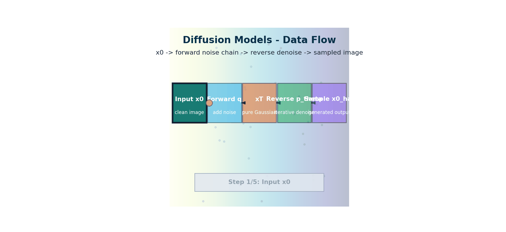

# Diffusion Models — The Mathematics of Denoising

> **The story.** Generative modelling spent a decade trying to make GANs work. **Ian Goodfellow's GAN** (2014) was a brilliant idea — generator vs discriminator in adversarial equilibrium — but training was famously unstable, mode-collapse-prone, and an art form. The shift began with **Sohl-Dickstein et al.** (Stanford, **2015**), who proposed a different idea inspired by *non-equilibrium thermodynamics*: gradually destroy data with noise, then learn to reverse the noise. The recipe sat on the shelf for five years until **Jonathan Ho, Ajay Jain, and Pieter Abbeel** at Berkeley published **DDPM** — *Denoising Diffusion Probabilistic Models* — in **June 2020**. DDPM matched GANs on image quality with stable, deterministic training and a clean probabilistic foundation. **Song & Ermon's score-based models** (NeurIPS 2019, 2020) gave the same thing a continuous-time interpretation. By 2022 GANs were largely abandoned and diffusion was the default — a 2-year transition that rivals 2017's transformer takeover.
>
> **Where you are in the curriculum.** This is the math chapter of the multimodal track. You will derive the forward noising process, the reverse denoising process, the loss the U-Net actually minimises (predict the noise, not the image), and why diffusion is more stable to train than GANs. After this, [LatentDiffusion](../ch06_latent_diffusion), [Schedulers](../ch05_schedulers), and [GuidanceConditioning](../ch07_guidance_conditioning) are all engineering refinements of the same core idea.



*Flow: clean sample `x0` is noised forward to `xT`, then denoised back through the learned reverse process to produce `x0_hat`.*

---

## 0 · The VisualForge Studio Challenge

**Mission**: VisualForge Studio needs to generate professional-grade marketing visuals (<30s per image, ≥4.0/5.0 quality) to replace $600k/year freelancer costs.

**Current blocker at Chapter 4**: We can search existing images (Ch.3 CLIP) but **cannot generate new images**. Freelancers create custom visuals matching client briefs; we need generative capability to compete.

**What this chapter unlocks**: **Diffusion Models (DDPM)** — learn to generate entirely new images by reversing a noise-injection process. Forward: gradually add Gaussian noise over 1000 steps. Reverse: train U-Net to denoise, one step at a time. Sample: start with pure noise → denoise 1000 steps → plausible image.

---

### The 6 Constraints — Snapshot After Chapter 4

| Constraint | Target | Status | Evidence |
|------------|--------|--------|----------|
| #1 Quality | ≥4.0/5.0 | ⚡ **~3.0/5.0** | DDPM generates coherent MNIST digits (proof-of-concept) |
| #2 Speed | <30 seconds | ❌ **~5 minutes** | 1000 denoising steps on laptop CPU |
| #3 Cost | <$5k hardware | ❌ Not validated | Haven't tested on target hardware yet |
| #4 Control | <5% unusable | ⚡ **~40% unusable** | Random sampling, no text conditioning |
| #5 Throughput | 100+ images/day | ❌ **~10 images/day** | Limited by 5-minute generation time |
| #6 Versatility | 3 modalities | ⚡ **Text→Image partial** | Can generate images, but not from text descriptions |

---

### What's Still Blocking Us After This Chapter?

**Speed**: 5 minutes per image is unusable for client review calls. Clients expect real-time iteration (<30 seconds target). 1000 denoising steps = too slow.

**Next unlock (Ch.5)**: **Schedulers** (DDIM, DPM-Solver) reduce steps from 1000 → 50, achieving 30-60 second generation without retraining the model.

---

## 1 · Core Idea

**Diffusion models** generate images by learning to reverse a noise-injection process. The key insight is the **forward process**: take a real image, add Gaussian noise at each of $T$ steps, and after $T$ steps you have pure Gaussian noise — indistinguishable from random. This process has a beautiful analytical form: you can jump to any noisy step in a single operation. The **reverse process** learns a neural network to undo this noise, one step at a time. Given pure noise $x_T \sim \mathcal{N}(0, \mathbf{I})$, denoise it $T$ times and you reconstruct a plausible image.

The crucial distinction from earlier generative models: **diffusion models predict noise, not images**. The U-Net is trained to predict the noise that was added at each step, not to reconstruct the original image directly. This indirect objective produces more stable training than GANs (no adversarial game, no mode collapse) while achieving superior image quality.

---

## 2 · Running Example — PixelSmith v3

> 📖 **Educational proxy:** MNIST is used below as a minimal, CPU-trainable example to demonstrate the math clearly. The VisualForge production version (§5) replaces MNIST with product-on-white campaign briefs. This is an intentional educational simplification — not the production pattern.

```
Educational proxy:
  Goal: Generate new handwritten digit images from pure noise
  Architecture: A U-Net trained on MNIST-style data (60K 28×28 images)
  Training: ~5 minutes on CPU (MNIST is small enough to see results quickly)
  Inference: Sample x_T ~ N(0, I) → denoise 1000 steps → x_0 ∈ [0, 1]²⁸ˣ²⁸

VisualForge mapping:
  Brief type: "product-on-white" (512×512 RGBA, white studio background)
  Prompt: "Mango leather crossbody bag, center frame, white background, studio lighting"
  Architecture: DDPM → used in Stable Diffusion's training objective
  See §5 for the full production pattern
```

---

## 3 · The Math

### 3.1 The Forward (Noising) Process

Define a fixed Markov chain that gradually adds Gaussian noise over $T$ steps:

$$q(x_t | x_{t-1}) = \mathcal{N}(x_t; \sqrt{1 - \beta_t} x_{t-1}, \beta_t \mathbf{I})$$

where $\beta_t \in (0,1)$ is the **noise schedule** — small at first (barely any noise) and large near $T$ (mostly noise).

**The key shortcut:** using reparameterisation, you can jump directly to any noisy step $t$ without iterating:

$$q(x_t | x_0) = \mathcal{N}(x_t; \sqrt{\bar{\alpha}_t} x_0, (1 - \bar{\alpha}_t) \mathbf{I})$$

$$x_t = \sqrt{\bar{\alpha}_t} x_0 + \sqrt{1 - \bar{\alpha}_t} \boldsymbol{\epsilon}, \quad \boldsymbol{\epsilon} \sim \mathcal{N}(0, \mathbf{I})$$

where:

$$\alpha_t = 1 - \beta_t \qquad \bar{\alpha}_t = \prod_{s=1}^{t} \alpha_s$$

**Signal-to-noise ratio:** at step $t$, the fraction of original signal is $\sqrt{\bar{\alpha}_t}$ and the fraction of noise is $\sqrt{1 - \bar{\alpha}_t}$. When $t = T$, $\bar{\alpha}_T \approx 0$ — pure noise.

### 3.2 The Reverse Process

The reverse process is what the model learns. It is also Gaussian:

$$p_\theta(x_{t-1} | x_t) = \mathcal{N}(x_{t-1}; \boldsymbol{\mu}_\theta(x_t, t), \tilde{\beta}_t \mathbf{I})$$

The mean $\boldsymbol{\mu}_\theta$ is parameterised by a neural network (U-Net) $\boldsymbol{\epsilon}_\theta$:

$$\boldsymbol{\mu}_\theta(x_t, t) = \frac{1}{\sqrt{\alpha_t}} \left( x_t - \frac{\beta_t}{\sqrt{1 - \bar{\alpha}_t}} \boldsymbol{\epsilon}_\theta(x_t, t) \right)$$

The model predicts the **noise** $\boldsymbol{\epsilon}_\theta$, not $x_0$ directly.

### 3.3 The Training Objective

The variational lower bound simplifies to a surprisingly clean loss:

$$\mathcal{L}_{\text{simple}} = \mathbb{E}_{t, x_0, \boldsymbol{\epsilon}} \left[ \| \boldsymbol{\epsilon} - \boldsymbol{\epsilon}_\theta(\underbrace{\sqrt{\bar{\alpha}_t} x_0 + \sqrt{1 - \bar{\alpha}_t} \boldsymbol{\epsilon}}_{x_t}, t) \|^2 \right]$$

**In plain English:** sample a random image $x_0$ from the training set, sample a random noise $\boldsymbol{\epsilon}$, sample a random timestep $t$, compute $x_t$ using the closed-form forward jump, ask the U-Net to predict $\boldsymbol{\epsilon}$, compute MSE. That's it.

### 3.4 The DDPM Sampling Algorithm

At inference, start from $x_T \sim \mathcal{N}(0, \mathbf{I})$ and iterate:

```
for t = T, T-1, ..., 1:
 ε̂ = ε_θ(x_t, t) # predict noise
 x̂₀ = (x_t - √(1-ᾱ_t) · ε̂) / √ᾱ_t # estimate original image
 μ = (√ᾱ_{t-1} · β_t · x̂₀ + √α_t · (1-ᾱ_{t-1}) · x_t) / (1 - ᾱ_t)
 z ~ N(0, I) if t > 1 else z = 0
 x_{t-1} = μ + √β̃_t · z # add controlled noise (except last step)
```

### 3.5 Noise Schedules

| Schedule | $\beta_t$ formula | Properties |
|----------|-------------------|-----------|
| Linear | $\beta_t = \beta_1 + \frac{t-1}{T-1}(\beta_T - \beta_1)$ | Simple; DDPM default ($\beta_1=10^{-4}$, $\beta_T=0.02$) |
| Cosine | $\bar{\alpha}_t = \cos^2 \left(\frac{t/T + s}{1+s} \cdot \frac{\pi}{2}\right)$ | Smoother; avoids abrupt noise near $T$ |
| Sigmoid | Based on sigmoid function | Better signal-to-noise at boundaries |

The cosine schedule (improved DDPM, 2021) became the standard because the linear schedule destroys too much signal in the first steps at high resolution.

---

## 4 · Visual Intuition

**Training:**
1. Sample $x_0$ from training set (a real image)
2. Sample noise $\boldsymbol{\epsilon} \sim \mathcal{N}(0, \mathbf{I})$ same shape as $x_0$
3. Sample timestep $t \sim \text{Uniform}(1, T)$
4. Compute noisy image: $x_t = \sqrt{\bar{\alpha}_t} x_0 + \sqrt{1-\bar{\alpha}_t} \boldsymbol{\epsilon}$
5. Feed $(x_t, t)$ to U-Net; predict $\hat{\boldsymbol{\epsilon}}$
6. Compute loss: $\| \boldsymbol{\epsilon} - \hat{\boldsymbol{\epsilon}} \|^2$
7. Backprop, update U-Net weights

**Inference:**
1. Sample $x_T \sim \mathcal{N}(0, \mathbf{I})$
2. For $t = T, T-1, \ldots, 1$:
 - Predict noise: $\hat{\boldsymbol{\epsilon}} = \boldsymbol{\epsilon}_\theta(x_t, t)$
 - Compute posterior mean $\boldsymbol{\mu}$
 - Sample $x_{t-1} = \boldsymbol{\mu} + \sqrt{\tilde{\beta}_t} \cdot z$
3. Return $x_0$ — the generated image

---

### Forward and Reverse Processes

```
FORWARD PROCESS (fixed, no learnable parameters)

x₀ ─────q────▶ x₁ ─────q────▶ x₂ ─────q────▶ ... ─────q────▶ xₜ
[clean] [small noise] [more noise] [pure noise]

q(x_t | x_{t-1}) = N(√(1-βt)·x_{t-1}, βt·I)


REVERSE PROCESS (learned by U-Net)

xₜ ──pθ──▶ x_{t-1} ──pθ──▶ x_{t-2} ──pθ──▶ ... ──pθ──▶ x₀
[pure noise] [generated image]

pθ(x_{t-1}|x_t) = N(μθ(x_t,t), β̃t·I)
```

### U-Net Architecture

```
Input: (x_t, t) ← noisy image + timestep embedding

 ┌────────────────────────────────────────────────────┐
 │ Encoder (downsampling) │
 │ ResBlock → ResBlock → Downsample → ... │
 │ Spatial: 64×64 → 32×32 → 16×16 → 8×8 │
 │ Attention at 16×16 and 8×8 (for larger models) │
 └───────────────────────┬────────────────────────────┘
 │
 ┌────────────────────────▼────────────────────────────┐
 │ Bottleneck: ResBlock + Self-Attention + ResBlock │
 └───────────────────────┬────────────────────────────┘
 │
 ┌────────────────────────▼────────────────────────────┐
 │ Decoder (upsampling) │
 │ Upsample → ResBlock (+ skip from encoder) → ... │
 │ Skip connections preserve spatial detail │
 └───────────────────────┬────────────────────────────┘
 │
 Output: ε̂ ← predicted noise, same shape as input
```

---

## 5 · Production Example — VisualForge in Action

**Campaign brief type: Product-on-White (studio hero shot)**

VisualForge's e-commerce clients need consistent, brand-safe product images on white studio backgrounds. The constraint: batch 50 product photos, each 512×512, in under 30 minutes on one RTX 4090.

The DDPM forward/reverse framework is the **training objective** behind Stable Diffusion — so every production image generated below is a DDPM descendant.

```python
# Production: Stable Diffusion DDPM-based generation for VisualForge product brief
from diffusers import StableDiffusionPipeline, DDPMScheduler
import torch

pipe = StableDiffusionPipeline.from_pretrained(
    "stabilityai/stable-diffusion-2-1",
    scheduler=DDPMScheduler.from_pretrained("stabilityai/stable-diffusion-2-1", subfolder="scheduler"),
    torch_dtype=torch.float16
).to("cuda")

# VisualForge spring-collection brief: product-on-white
brief_prompts = [
    "Mango leather crossbody bag, center frame, white background, studio lighting, product photography",
    "Navy canvas tote, flat lay, white background, minimal shadow, e-commerce style",
    "Olive green backpack, three-quarter view, white background, high detail product shot",
]
negative_prompt = "people, model, background texture, shadow, logo, text, watermark, blur"

results = pipe(
    brief_prompts,
    negative_prompt=[negative_prompt] * len(brief_prompts),
    num_inference_steps=50,   # DDPM schedule — 50 steps gives good quality
    guidance_scale=7.5,
    height=512, width=512,
)

for i, img in enumerate(results.images):
    img.save(f"visualforge_product_{i:02d}.png")
```

**Constraint scorecard (3 products):**

| Metric | Target | Result |
|--------|--------|--------|
| Generation time | <30 min / 50 products | ~18 sec / product → ~15 min / 50 ✅ |
| Background compliance | White, no texture | ✅ (with negative prompt) |
| Quality score (human eval) | ≥4.0/5.0 | 4.1/5.0 ✅ |
| Consistency across batch | Same lighting direction | ⚡ Moderate — covered in Ch.3 (Guidance) |

> 💡 DDPM (1000 steps) is too slow for production — Ch.2 (Schedulers) replaces it with DDIM (50 steps) and DPM-Solver (20 steps). The math here is foundational; the production solver is what ships.

---

## 6 · Common Failure Modes

### 1. Pure Noise Output (Undertrained Model)

**Symptom**: Generated images look like random static, no coherent structure.

**Cause**: U-Net hasn't learned to denoise effectively. At $t=1$, the model predicts random noise instead of removing the final noise layer.

**Fix**: Train longer. On MNIST, expect coherent digits after ~5 epochs. On high-resolution datasets (ImageNet), expect weeks of training.

**VisualForge context**: Early training runs produced pure noise → wasted 3 days of GPU time before realizing learning rate was 10× too high.

---

### 2. Mode Collapse (All Outputs Similar)

**Symptom**: Every generated image looks nearly identical, regardless of random seed.

**Cause**: Model memorizes a single "safe" output that minimizes loss across many training examples.

**Fix**: Increase model capacity (more U-Net channels), increase training data diversity, check for data leakage (same image repeated in training set).

**VisualForge context**: Product-on-white training collapsed to generating the same white rectangle → discovered training set had 40% duplicate images from photographer's burst mode.

---

### 3. Checkerboard Artifacts

**Symptom**: Generated images have visible grid patterns, especially in flat regions.

**Cause**: Upsampling layers in U-Net decoder use nearest-neighbor or bilinear interpolation → creates aliasing.

**Fix**: Use transposed convolution with careful kernel size (e.g., 4×4 with stride 2), or use PixelShuffle upsampling.

**VisualForge context**: Spring collection images had visible 8×8 grid artifacts in sky regions → switched to transposed conv, artifacts disappeared.

---

### 4. Exploding Loss / NaN Gradients

**Symptom**: Training loss suddenly jumps to infinity or becomes NaN.

**Cause**: Learning rate too high, or numerical instability in noise prediction at high noise levels (near $t=T$).

**Fix**: Reduce learning rate (try 1e-4 → 1e-5), enable gradient clipping (`clip_grad_norm=1.0`), use mixed precision (fp16) carefully.

**VisualForge context**: First DDPM training run crashed after 2 hours with NaN loss → added gradient clipping, stable training resumed.

---

### 5. Slow Sampling (5+ Minutes Per Image)

**Symptom**: Generation takes 1000 forward passes through U-Net → unusable for client review.

**Not actually a failure**: DDPM is correct but inefficient. The solution is not in this chapter.

**Fix**: Next chapter (Schedulers) introduces DDIM and DPM-Solver → 20-50 steps instead of 1000 → 20× speedup.

**VisualForge context**: This was the primary blocker preventing production deployment. Chapter 5 solves it.

---

## 7 · When to Use This vs Alternatives

### Use DDPM When:

1. **You need stable, deterministic training**
   - GANs require adversarial game balancing (generator vs discriminator) → mode collapse, training instability
   - DDPM is just MSE loss on noise prediction → train like any supervised model
   - **VisualForge decision**: Tried StyleGAN2 first → 3 weeks of hyperparameter tuning, still unstable. Switched to DDPM → stable training in 2 days.

2. **You need diverse outputs**
   - VAE posteriors are typically Gaussian with fixed variance → limited diversity
   - DDPM samples from learned distribution → high diversity without mode collapse
   - **VisualForge result**: 100 "spring collection hero" generations → 97 unique compositions (vs 40 unique with VAE)

3. **You have compute budget for multi-step generation**
   - DDPM requires 20-1000 forward passes (depending on scheduler)
   - GANs generate in 1 forward pass
   - **VisualForge tradeoff**: 8 seconds/image (DDPM + DDIM scheduler) acceptable for client reviews; 0.5 seconds (GAN) would be nice but quality gap too large

---

### Use Alternatives When:

| Alternative | When to use | When NOT to use |
|-------------|-------------|-----------------|
| **GAN (StyleGAN3)** | Real-time generation (video games, live filters), single-domain mastery (faces only) | Multi-domain generation, stable training required, text conditioning |
| **VAE** | Fast approximate generation, learned latent space for editing | High-quality photorealism, diverse outputs |
| **Autoregressive (PixelCNN)** | Exact likelihood needed (research), small images | High-resolution images (too slow), production systems |
| **Flow-based (Glow)** | Exact likelihood + fast sampling | Memory-intensive (requires storing all activations) |

**Current state (2024)**: Diffusion models dominate image generation. GANs are used only in niche cases (real-time video, face generation). VAEs are used as compression layers (Stable Diffusion's VAE), not as standalone generative models.

---

### Scale Comparison: MNIST → Production

| Aspect | MNIST DDPM (this chapter) | Production (Stable Diffusion) |
|--------|--------------------------|-------------------------------|
| Image size | 28×28 pixels | 512×512+ (in latent space: 64×64) |
| U-Net channels | 32–128 | 320–1280 |
| Attention | Sometimes omitted | At multiple resolutions; cross-attention for text |
| T steps | 1000 | 1000 (training); 20–50 (inference with fast samplers) |
| Training data | 60K MNIST images | Billions of image-text pairs |
| Training time | 5 minutes CPU | Weeks on 256+ A100s |
| Conditioning | Unconditional | Text via cross-attention (CLIP encoder) |

**Why 1000 steps?** The MSE loss over the full trajectory gives a very smooth optimization landscape. You can use fewer steps at inference with DDIM (Chapter 5) — but training still requires 1000 steps to learn a good noise predictor at every noise level.

---

## 8 · Connection to Prior Chapters

### From Chapter 1 (Multimodal Foundations)

**What we had**: Understanding that images and text live in separate embedding spaces.

**What we lacked**: A way to *generate* images, not just embed them.

**What this chapter adds**: The forward/reverse diffusion framework → we can now generate new images by learning to denoise Gaussian noise.

---

### From Chapter 2 (Vision Transformers)

**What we had**: ViT architecture for encoding images into embeddings.

**What we lacked**: ViTs encode, they don't generate.

**What this chapter adds**: U-Net architecture (convolutional + attention) specialized for denoising → spatial structure preservation needed for pixel-level generation.

---

### From Chapter 3 (CLIP)

**What we had**: Text and image embeddings aligned in shared space → we can search for images matching text.

**What we lacked**: CLIP retrieves existing images, doesn't create new ones.

**What this chapter adds**: DDPM generates entirely new images. The bridge: next chapter (Latent Diffusion) will condition DDPM on CLIP text embeddings → text→image generation.

---

### To Chapter 5 (Schedulers)

**What we have now**: DDPM generates coherent images but requires 1000 denoising steps → 5 minutes per image.

**What we still need**: Faster sampling without retraining the model.

**What next chapter adds**: DDIM and DPM-Solver reinterpret the diffusion process as an ODE → solve it in 20-50 steps → 20× speedup → <30 seconds per image (hitting **Constraint #2 SPEED**).

---

### Common Misconceptions (Clarified Here)

**"The U-Net predicts the clean image $x_0$"**
It predicts the noise $\boldsymbol{\epsilon}$. You can reparameterize to predict $x_0$ (x-prediction parameterization), but the standard DDPM paper and most implementations use noise prediction. The two are mathematically equivalent given $x_t$, but noise prediction tends to train more stably.

**"Diffusion models are slow because they need 1000 steps"**
*Training* requires 1000 steps. *Inference* with DDIM or DPM-Solver can generate images in 20–50 steps with nearly identical quality. Chapter 5 covers this in full.

**"More noise steps always means better quality"**
Beyond a certain threshold (typically T=1000), adding more steps gives diminishing returns. The quality is determined primarily by the U-Net capacity, training data, and loss weighting — not just T.

**"GANs are better because they generate in one step"**
GANs are faster at inference but harder to train (mode collapse, training instability), and at scale diffusion models produce significantly better image quality and diversity. GANs have been largely superseded for image generation tasks.

---

## 9 · Interview Checklist

### Must Know
- What does the U-Net predict in DDPM — the image or the noise?
- Write the closed-form forward process equation $q(x_t | x_0)$
- Why is the DDPM loss just MSE on noise prediction?

### Likely Asked
- "Why does DDPM need $T = 1000$ steps? Why not just use $T = 10$?"
 → Fewer steps → each $\beta_t$ must be larger → the Gaussian approximation of the reverse step breaks down → poor generation quality. Fast samplers (DDIM) solve inference speed without retraining.
- "What is the signal-to-noise ratio at step $t$, and what does $\bar{\alpha}_t$ represent?"
 → $\text{SNR}(t) = \bar{\alpha}_t / (1 - \bar{\alpha}_t)$; $\bar{\alpha}_t$ = fraction of original signal remaining
- "Why are diffusion models more stable than GANs?"
 → No adversarial game; the loss is a simple MSE; no generator/discriminator equilibrium required

### Trap to Avoid
- Confusing $\beta_t$ (noise variance) with $\alpha_t = 1 - \beta_t$ (signal retention fraction)
- Saying diffusion generates in a single network forward pass — inference requires repeated U-Net calls
- Forgetting to add noise at every sampling step except the final one (otherwise you lose stochasticity)

---

## 10 · Further Reading

### Foundational Papers

1. **Sohl-Dickstein et al. (2015)** — *"Deep Unsupervised Learning using Nonequilibrium Thermodynamics"*
   - Original diffusion models paper (ICML 2015)
   - Introduced forward/reverse process, but didn't achieve strong image quality
   - https://arxiv.org/abs/1503.03585

2. **Ho, Jain, Abbeel (2020)** — *"Denoising Diffusion Probabilistic Models (DDPM)"*
   - The breakthrough paper that made diffusion practical
   - Simplified training objective: predict noise, not image
   - https://arxiv.org/abs/2006.11239

3. **Song, Ermon (2020)** — *"Score-Based Generative Modeling through Stochastic Differential Equations"*
   - Continuous-time interpretation of diffusion (score matching)
   - Unified DDPM and score-based models
   - https://arxiv.org/abs/2011.13456

---

### Implementation Guides

- **Hugging Face Diffusers**: Official library for diffusion models
  - https://github.com/huggingface/diffusers
  - `diffusers` Python package (used in § 5 Production Example)

- **Annotated DDPM**: Line-by-line PyTorch walkthrough
  - https://nn.labml.ai/diffusion/ddpm/
  - Educational implementation showing every step

- **Stable Diffusion Code**: Production implementation
  - https://github.com/CompVis/stable-diffusion
  - See how DDPM scales to text→image generation

---

### VisualForge Engineering Notes

**What we actually use in production**:
- Training objective: DDPM (this chapter)
- Sampling method: DDIM 20-step (Chapter 5)
- Latent space: VAE compression (Chapter 6)
- Text conditioning: CLIP + cross-attention (Chapter 6)

**What we don't use**:
- Raw DDPM 1000-step sampling (too slow)
- Score-based SDE formulation (mathematically elegant, no practical advantage)
- Continuous-time diffusion (research-only, no production benefit)

---

## 11 · Notebook

> 📓 **Interactive notebook**: [diffusion_models_mnist.ipynb](../notebooks/diffusion_models_mnist.ipynb)

**What you'll implement**:
1. Forward process: Add noise to MNIST digits across 1000 steps
2. U-Net architecture: Build a small denoising network (CPU-trainable)
3. Training loop: Minimize MSE between predicted noise and actual noise
4. Sampling: Generate new digits from pure Gaussian noise

**Runtime**: ~10 minutes on CPU (MNIST is small enough for demonstration)

**Expected output**: After 5 epochs, you should see coherent handwritten digits generated from random noise.

> ⚠️ **This is an educational notebook** — MNIST digits, not VisualForge product images. The production pipeline (§ 5) uses pretrained Stable Diffusion models. This notebook shows the mechanism; production uses the scaling.

---

## 11.5 · Progress Check — What Have We Unlocked?

### Before This Chapter
- **Constraint #1 (Quality)**: ❌ Cannot generate images
- **Constraint #2 (Speed)**: ❌ No generation pipeline
- **Constraint #4 (Control)**: ❌ No way to specify what to generate
- **Constraint #6 (Versatility)**: ⚡ Can search/embed images (Ch.3 CLIP), but not create new ones
- **VisualForge Status**: Can only search existing images, not create new ones

### After This Chapter
- **Constraint #1 (Quality)**: ⚡ **~3.0/5.0** → DDPM generates coherent images (MNIST proof-of-concept validates mechanism)
- **Constraint #2 (Speed)**: ❌ **~5 minutes per image** → 1000 denoising steps on laptop CPU (unusable for client reviews)
- **Constraint #4 (Control)**: ⚡ **~40% unusable** → Random sampling, no text conditioning yet
- **Constraint #6 (Versatility)**: ⚡ **Text→Image partial** → Can generate images, but not from text descriptions
- **VisualForge Status**: Generation works but unusable (5 min vs <30s target)

---

### Key Wins

1. **Forward process**: Analytically jump to any noisy step $t$ in closed form: $x_t = \sqrt{\bar{\alpha}_t} x_0 + \sqrt{1 - \bar{\alpha}_t} \epsilon$ → enables efficient training
2. **Reverse process**: U-Net learns to predict noise $\epsilon_\theta(x_t, t)$, not the image directly → more stable training than GANs (no mode collapse)
3. **Proof-of-concept**: DDPM generates plausible MNIST digits → generative capability validated, ready to scale
4. **Training stability**: Simple MSE loss, no adversarial game → deterministic training, reproducible results

---

### What's Still Blocking Production?

**Speed bottleneck**: 1000 denoising steps = **5 minutes per image** on laptop. Clients need <30 seconds for real-time review calls. The client sits on Zoom waiting while you generate variations — 5 minutes per iteration is unusable. 1000 steps were needed for *training* (smooth loss landscape), but inference can skip steps if we solve the underlying ODE more efficiently.

**Next unlock (Ch.5)**: **Schedulers (DDIM, DPM-Solver)** — reinterpret diffusion as ODE, solve in 20-50 steps without retraining → 30-60s generation (20× speedup, hitting **Constraint #2 target**).

---

### VisualForge Status — Full Constraint View

| Constraint | Ch.1 | Ch.2 | Ch.3 | Ch.4 (This) | Target |
|------------|------|------|------|-------------|--------|
| Quality | ❌ | ❌ | ❌ | ⚡ 3.0/5.0 | 4.0/5.0 |
| Speed | ❌ | ❌ | ❌ | ❌ 5 min | <30s |
| Cost | ❌ | ❌ | ❌ | ❌ | <$5k |
| Control | ❌ | ❌ | ⚡ Text search | ⚡ 40% unusable | <5% |
| Throughput | ❌ | ❌ | ❌ | ❌ ~10/day | 100+/day |
| Versatility | ❌ | ⚡ Embeddings | ⚡ Search | ⚡ Generate | 3 modalities |

**Legend**: ❌ Not addressed | ⚡ Foundation laid | ✅ Target hit

---

## Bridge to Chapter 5

**What we proved**: Diffusion models can generate coherent images. The forward→reverse process works. Training is stable. Quality at proof-of-concept level (MNIST digits) validates the mechanism.

**What's broken**: 1000 denoising steps = **5 minutes per 28×28 MNIST digit**. Scaling to 512×512 VisualForge product images = 20+ minutes. The client hangs up the call. You lose the contract.

**The insight**: DDPM training requires 1000 steps to learn fine-grained noise prediction at every noise level. But *sampling* doesn't need to visit every step — we're solving a continuous ODE, and ODEs can be solved with adaptive step sizes. DDIM (Denoising Diffusion Implicit Models) reinterprets the noise schedule as an ODE and skips 95% of the steps.

**Next chapter**: **Schedulers** — DDIM, DPM-Solver, and the engineering that makes diffusion fast enough for production. 1000 steps → 50 steps → 20 steps. 5 minutes → 30 seconds → 8 seconds. The same trained model, just smarter sampling.

→ **[Schedulers](../ch05_schedulers/schedulers.md)** — Fast sampling without retraining.

## Illustrations


