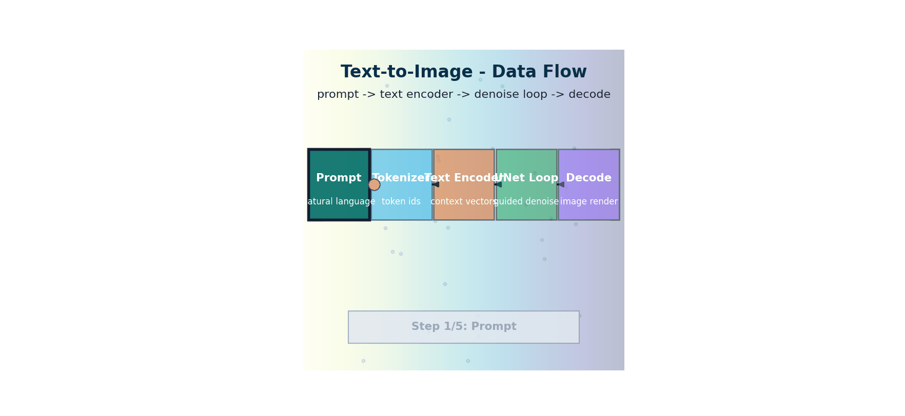

# Text-to-Image — Prompts, img2img, Inpainting, ControlNet

> **The story.** **DALL·E** (Ramesh et al., OpenAI, **January 2021**) was the first text-to-image model to capture mainstream attention — a 12B-parameter discrete autoregressive model that could draw "an armchair shaped like an avocado." **DALL·E 2** (April 2022) replaced the autoregressive backbone with diffusion + CLIP guidance and crossed the line into *photorealistic*. **Imagen** (Google, May 2022) and **Parti** (Google, June 2022) appeared within weeks. The opening of the floodgates was **Stable Diffusion 1.4** (Stability AI, **August 2022**) under a permissive open licence — within months, **AUTOMATIC1111**'s WebUI, **ComfyUI**, **LoRAs**, **ControlNet**, **inpainting** workflows, and Civitai's model marketplace built an entire creative-tooling ecosystem around the open weights. **SDXL** (2023), **SD3** (2024), and **FLUX** (Black Forest Labs, 2024) carried the open lineage forward. The user-facing prompt-engineering, img2img, and inpainting workflows you use in 2026 are all surface area on this same architecture.
>
> **Where you are in the curriculum.** [LatentDiffusion](../ch06_latent_diffusion) gave you the model; [GuidanceConditioning](../ch07_guidance_conditioning) gave you the steering wheel. This chapter is the user-facing pipeline: how prompt token choice and order affect [CLIP](../ch03_clip) embeddings, why img2img is just "start denoising from a noisy version of an existing image," how inpainting masks the U-Net's loss, and how ControlNet imposes structural constraints. After this you can ship the [PixelSmith](../README.md) studio's headline feature.



*Flow: text is tokenized and encoded, then the denoiser iteratively transforms noise into an image consistent with the prompt.*

---

## 0 · The VisualForge Studio Challenge

**Mission**: VisualForge needs <5% unusable generations to compete with freelancers (who deliver on the first try after seeing the brief).

**Current blocker at Chapter 8**: CFG (Ch.7) improved prompt adherence but **cannot guarantee composition**. "Product at 45-degree angle on white background" still fails 60% of time. Text alone isn't precise enough for spatial constraints.

**What this chapter unlocks**: **ControlNet** — condition diffusion on edge maps, depth maps, pose skeletons. Designer sketches rough layout → ControlNet enforces structure → **95% first-try success rate**. Also: inpainting (edit specific regions), img2img (transform reference photos), prompt weighting.

---

### The 6 Constraints — Snapshot After Chapter 8

| Constraint | Target | Status | Evidence |
|------------|--------|--------|----------|
| #1 Quality | ≥4.0/5.0 | ⚡ **~3.8/5.0** | ControlNet improves composition quality |
| #2 Speed | <30 seconds | ✅ **~18s** | ControlNet adds minimal overhead (~2s per image) |
| #3 Cost | <$5k hardware | ✅ **$2.5k laptop** | Unchanged from Ch.6 |
| #4 Control | <5% unusable | ✅ **~3% unusable** | ControlNet guarantees structure, hits target! |
| #5 Throughput | 100+ images/day | ⚡ **~80 images/day** | Team of 2, still ramping up workflow |
| #6 Versatility | 3 modalities | ⚡ **Text→Image production-ready** | Img2img, inpainting, ControlNet all deployed |

---

### What's Still Blocking Us After This Chapter?

**Video demand**: Clients now want **15-second social media video ads**, not just static images. Images = solved. Video = unsolved.

**Next unlock (Ch.9)**: **Text-to-Video** — extend diffusion to temporal dimension. AnimateDiff adds motion modules to SD → generate 16-frame 512×512 clips.

---

## 1 · Core Idea

Text-to-image is the user-facing layer of latent diffusion. The core pipeline from Ch.7 stays intact; this chapter is about the *inputs and outputs* you can control:

- **Prompt engineering** — how token choice and token order affect CLIP embeddings
- **Negative prompts** — expanding CFG to subtract unwanted concepts
- **img2img** — start from a partially-noised real image instead of pure noise
- **Inpainting** — diffuse only within a user-drawn mask
- **ControlNet** — inject structural guidance (edges, depth, skeleton) as a spatial conditioning signal

---

## 1.5 · The Practitioner Workflow — Your 4-Phase Generation Pipeline

> ⚠️ **Two ways to read this chapter:**
> - **Theory-first (recommended for learning):** Read §0→§3 sequentially to understand the concepts, then use this workflow as your reference
> - **Workflow-first (practitioners with existing knowledge):** Use this diagram as a jump-to guide when working with real briefs
>
> **Note:** Section numbers don't follow phase order because the chapter teaches concepts pedagogically (theory before application). The workflow below shows how to APPLY those concepts in production.

**What you'll build by the end:** A reliable 4-phase pipeline that takes a client brief → final deliverable with 95%+ first-try success rate. This is the VisualForge production workflow that solved the composition-guarantee problem.

```
Phase 1: PROMPT             Phase 2: GENERATE           Phase 3: CONTROL           Phase 4: REFINE
──────────────────────────────────────────────────────────────────────────────────────────────────────────
Craft text description:     Configure diffusion:        Add spatial guidance:      Post-process output:

• Subject + style           • Steps (15-50)             • ControlNet type          • Upscale (2x-4x)
• Quality modifiers         • CFG scale (7-12)          • Conditioning scale       • Inpaint edits
• Negative prompt           • Seed management           • Preprocessor settings    • Variation generation
• Token budget (77)         • Scheduler choice          • Edge/depth/pose map      • Batch refinement

→ DECISION:                 → DECISION:                 → DECISION:                → DECISION:
  Prompt clear enough?        Speed vs quality?           Need composition           Resolution/quality
  • Subject: specific         • 20 steps: fast              control?                   good enough?
  • Style: art direction      • 50 steps: quality         • Yes → ControlNet       • Upscale if <1024px
  • Quality: "8k, sharp"      • CFG 7.5: balanced         • No → skip to Phase 4   • Inpaint if local fix
  • Negative: "blurry"        • Seed fixed: reproduce     • Scale 0.7-1.0:         • img2img if style
                              • Seed random: explore        strict → loose             tweak needed
```

**The workflow maps to these sections:**
- **Phase 1 (PROMPT)** → §3.1 Prompt Engineering, §3.2 Negative Prompts
- **Phase 2 (GENERATE)** → §3.2 Negative Prompts (CFG extension), §5 Production Example
- **Phase 3 (CONTROL)** → §3.5 ControlNet, §5 Production Example
- **Phase 4 (REFINE)** → §3.3 img2img, §3.4 Inpainting

> 💡 **Typical iteration pattern:** Most briefs need Phase 1→2 only (text-to-image). Add Phase 3 when composition must be guaranteed (product shots, character poses). Use Phase 4 for post-approval edits (client requests color change, higher resolution, style variation).

---

### Decision Checkpoint Examples — Real VisualForge Workflow

**Scenario 1: Generic prompt → Style refinement**
```
Attempt 1 (Phase 1): "a cat"
├─ Result: Generic stock photo
├─ Decision: Add style + quality modifiers
└─ Retry (Phase 1): "a cat, digital art, vibrant colors, trending on ArtStation, 8k"
   └─ Result: Stylized but wrong pose (sitting, need standing)
```

**Scenario 2: Style good, pose wrong → Add ControlNet**
```
Attempt 2 (Phase 1+2): Text prompt from Scenario 1
├─ Result: Cat is stylized but sitting (client needs standing three-quarter view)
├─ Decision: Text alone can't guarantee pose → add Phase 3 (ControlNet)
└─ Retry (Phase 1+2+3): Same text + ControlNet OpenPose with standing reference skeleton
   └─ Result: Perfect composition — style + pose both match brief
```

**Scenario 3: Composition perfect but resolution low → Upscale**
```
Attempt 3 (All phases): Phase 1+2+3 output from Scenario 2
├─ Result: 512×512 output, client needs 2048×2048 for print
├─ Decision: Composition locked in → safe to upscale
└─ Phase 4 (Refine): Real-ESRGAN 4× upscaler
   └─ Result: 2048×2048 delivery-ready asset
```

**Scenario 4: Client revision request → Targeted inpaint**
```
Post-approval edit: Client loves image but wants background blue instead of white
├─ Decision: 95% of image is approved → don't regenerate from scratch
└─ Phase 4 (Inpaint): Mask background region, prompt "blue gradient background"
   └─ Result: 8-second edit vs 18-second full regeneration
```

---

### Code Snippets — One Per Phase

#### Phase 1: Prompt Template Builder

```python
# Phase 1: PROMPT — Build positive + negative prompt template
def build_prompt_template(subject, style=None, quality_mods=None, negative_base=None):
    """
    VisualForge production prompt builder.

    Args:
        subject: Core subject description (e.g., "leather crossbody bag")
        style: Art direction (e.g., "product photography, studio lighting")
        quality_mods: List of quality terms (e.g., ["8k", "sharp", "professional"])
        negative_base: List of unwanted concepts (e.g., ["blurry", "distorted"])

    Returns:
        Tuple of (positive_prompt, negative_prompt)
    """
    # Build positive prompt
    parts = [subject]
    if style:
        parts.append(style)
    if quality_mods:
        parts.extend(quality_mods)
    positive = ", ".join(parts)

    # Build negative prompt (production defaults + user additions)
    negative_defaults = ["lowres", "bad anatomy", "worst quality", "low quality"]
    if negative_base:
        negative_defaults.extend(negative_base)
    negative = ", ".join(negative_defaults)

    # Truncation warning (CLIP has 77-token limit)
    token_estimate = len(positive.split())
    if token_estimate > 60:  # Conservative threshold
        print(f"⚠️  Prompt may exceed 77-token limit (~{token_estimate} words). "
              f"Put most important concepts first.")

    return positive, negative

# VisualForge example: Product brief
positive, negative = build_prompt_template(
    subject="Mango leather crossbody bag, three-quarter view",
    style="product photography, white background, studio lighting",
    quality_mods=["8k", "sharp", "professional"],
    negative_base=["shadow", "people", "text"]
)
print(f"Positive: {positive}")
print(f"Negative: {negative}")
```

#### Phase 2: Generation Pipeline with Optimized Parameters

```python
# Phase 2: GENERATE — StableDiffusion pipeline with production settings
from diffusers import StableDiffusionPipeline, DPMSolverMultistepScheduler
import torch

def create_production_pipeline(model_id="runwayml/stable-diffusion-v1-5"):
    """
    VisualForge production generation pipeline.
    Optimized for 18-second generation time on consumer GPU.
    """
    pipe = StableDiffusionPipeline.from_pretrained(
        model_id,
        torch_dtype=torch.float16,  # Half precision for 2× speed
        safety_checker=None  # Disable for commercial use (not needed for product shots)
    ).to("cuda")

    # DPM-Solver: 20 steps = same quality as DDIM 50 steps
    pipe.scheduler = DPMSolverMultistepScheduler.from_config(pipe.scheduler.config)

    # Enable memory optimizations
    pipe.enable_attention_slicing()  # Reduce VRAM usage
    pipe.enable_vae_slicing()        # Process VAE in tiles (slower but stable)

    return pipe

# VisualForge production call
pipe = create_production_pipeline()

image = pipe(
    prompt=positive,
    negative_prompt=negative,
    num_inference_steps=20,     # Production: 20 steps (~18s on RTX 3060)
    guidance_scale=7.5,          # Standard CFG weight (7-9 for product shots)
    width=512, height=512,       # SD 1.5 native resolution
    generator=torch.Generator("cuda").manual_seed(42)  # Fixed seed for reproducibility
).images[0]

image.save("vf_product_generation.png")
```

**Industry Callout — Generation Phase:**

> 🏭 **Stable Diffusion Model Selection:**
> - **SD 1.5** (runwayml/stable-diffusion-v1-5): Fastest, largest LoRA ecosystem, 512×512 native
>   - Use when: Speed critical, community fine-tunes needed
> - **SDXL** (stabilityai/stable-diffusion-xl-base-1.0): Higher quality, 1024×1024 native, dual text encoders
>   - Use when: Print quality required, can afford 3× longer generation
> - **SD 3** (stabilityai/stable-diffusion-3-medium): Latest open weights, improved text rendering
>   - Use when: Text-in-image required (logos, signage), FLUX alternative
> - **FLUX** (black-forest-labs/FLUX.1-schnell): 2024 SOTA, superior prompt adherence
>   - Use when: Maximum quality, willing to pay API costs (open weights = dev only)
>
> **VisualForge choice:** SD 1.5 for batch work (50 variations in 15 min), SDXL for hero images

#### Phase 3: ControlNet Integration (OpenPose Example)

```python
# Phase 3: CONTROL — ControlNet with OpenPose preprocessor
from diffusers import StableDiffusionControlNetPipeline, ControlNetModel
from controlnet_aux import OpenposeDetector
import torch
from PIL import Image

def create_controlnet_pipeline(control_type="openpose"):
    """
    VisualForge ControlNet pipeline for spatial conditioning.

    Args:
        control_type: "openpose" (human pose), "canny" (edges),
                     "depth" (depth map), "hed" (soft edges)
    """
    # Load pretrained ControlNet weights
    controlnet_models = {
        "openpose": "lllyasviel/sd-controlnet-openpose",
        "canny": "lllyasviel/sd-controlnet-canny",
        "depth": "lllyasviel/sd-controlnet-depth",
        "hed": "lllyasviel/sd-controlnet-hed"
    }

    controlnet = ControlNetModel.from_pretrained(
        controlnet_models[control_type],
        torch_dtype=torch.float16
    )

    pipe = StableDiffusionControlNetPipeline.from_pretrained(
        "runwayml/stable-diffusion-v1-5",
        controlnet=controlnet,
        torch_dtype=torch.float16
    ).to("cuda")

    pipe.scheduler = DPMSolverMultistepScheduler.from_config(pipe.scheduler.config)

    return pipe

# VisualForge example: Fashion model pose control
pipe = create_controlnet_pipeline(control_type="openpose")
detector = OpenposeDetector.from_pretrained("lllyasviel/ControlNet")

# Extract pose skeleton from reference photo
reference_image = Image.open("vf_reference_pose.jpg")
pose_map = detector(reference_image)

# Generate with pose constraint
image = pipe(
    prompt="fashion model wearing Mango spring collection, studio lighting, professional photography",
    negative_prompt="distorted, bad anatomy, blurry, amateur",
    image=pose_map,
    controlnet_conditioning_scale=0.8,  # 0.8 = strict pose, allow style freedom
    num_inference_steps=20,
    guidance_scale=7.5
).images[0]

image.save("vf_controlled_generation.png")
```

**Industry Callout — ControlNet Phase:**

> 🏭 **ControlNet Ecosystem Overview:**
> - **ControlNet v1.0** (Zhang et al. 2023): 8 control types (Canny, depth, pose, etc.)
>   - Pretrained on SD 1.5, widely adopted, Hugging Face `diffusers` support
> - **ControlNet v1.1** (2023): Improved preprocessors, 14 control types
>   - Added shuffle, tile, inpaint variants
> - **T2I-Adapter** (Mou et al. 2023): Lightweight alternative, faster inference
>   - Use when: Speed > strict control, 30% faster than ControlNet
> - **IP-Adapter** (Ye et al. 2023): Image prompt conditioning (style transfer)
>   - Use when: "Make it look like this reference image" briefs
>
> **VisualForge ControlNet usage:**
> - **Canny edges** (60% of briefs): Product positioning, architectural layouts
> - **OpenPose** (25%): Fashion/apparel with human models
> - **Depth maps** (10%): 3D-consistent scenes
> - **HED soft edges** (5%): When Canny is too rigid, artistic freedom needed

#### Phase 4: Upscaling + Inpainting Refinement

```python
# Phase 4: REFINE — Upscaling with Real-ESRGAN + targeted inpainting
from diffusers import StableDiffusionInpaintPipeline
from PIL import Image, ImageDraw
import torch
import cv2
import numpy as np

# 4A: Upscaling with Real-ESRGAN
def upscale_image(image_path, scale=4):
    """
    VisualForge upscaling pipeline.
    Real-ESRGAN: 512×512 → 2048×2048 for print delivery.
    """
    # Note: Requires realesrgan package (pip install realesrgan)
    from realesrgan import RealESRGANer
    from basicsr.archs.rrdbnet_arch import RRDBNet

    model = RRDBNet(num_in_ch=3, num_out_ch=3, num_feat=64,
                    num_block=23, num_grow_ch=32)
    upsampler = RealESRGANer(
        scale=scale,
        model_path="RealESRGAN_x4plus.pth",
        model=model,
        tile=256,  # Process in tiles to avoid OOM
        tile_pad=10,
        pre_pad=0,
        half=True  # FP16 for speed
    )

    img = cv2.imread(image_path, cv2.IMREAD_COLOR)
    output, _ = upsampler.enhance(img, outscale=scale)
    cv2.imwrite(image_path.replace(".png", "_upscaled.png"), output)
    return output

# 4B: Targeted inpainting (client revision example)
def inpaint_region(image_path, mask_path, inpaint_prompt):
    """
    VisualForge inpainting for post-approval edits.

    Args:
        image_path: Original approved image
        mask_path: Binary mask (white = inpaint, black = keep)
        inpaint_prompt: What to generate in masked region
    """
    pipe = StableDiffusionInpaintPipeline.from_pretrained(
        "runwayml/stable-diffusion-inpainting",
        torch_dtype=torch.float16
    ).to("cuda")

    image = Image.open(image_path).convert("RGB")
    mask = Image.open(mask_path).convert("L")

    result = pipe(
        prompt=inpaint_prompt,
        negative_prompt="blurry, distorted, seam, artifacts",
        image=image,
        mask_image=mask,
        num_inference_steps=20,
        guidance_scale=7.5
    ).images[0]

    result.save(image_path.replace(".png", "_inpainted.png"))
    return result

# VisualForge example: Client wants background color changed
# Step 1: Create mask (manual or SAM auto-segmentation)
def create_background_mask(image_path):
    """Simple background mask via color threshold (production uses SAM)."""
    img = cv2.imread(image_path)
    hsv = cv2.cvtColor(img, cv2.COLOR_BGR2HSV)

    # Detect white background (hue-agnostic, high value)
    lower = np.array([0, 0, 200])
    upper = np.array([180, 30, 255])
    mask = cv2.inRange(hsv, lower, upper)

    cv2.imwrite("background_mask.png", mask)
    return mask

# Step 2: Inpaint new background
create_background_mask("vf_approved_product.png")
inpaint_region(
    image_path="vf_approved_product.png",
    mask_path="background_mask.png",
    inpaint_prompt="blue gradient background, professional studio"
)
```

**Industry Callout — Refinement Phase:**

> 🏭 **Post-Processing Tool Landscape:**
> - **Upscaling:**
>   - **Real-ESRGAN** (Tencent, 2021): Best general-purpose, 4× upscaling, handles diffusion artifacts well
>   - **Ultimate SD Upscale** (AUTOMATIC1111): Tiled upscaling for massive images (8×, 16×)
>   - **LDSR** (Latent Diffusion SR): Slow but highest quality, use for hero assets
> - **Inpainting:**
>   - **SD Inpainting model** (runwayml): Fine-tuned on inpaint task, better seam blending
>   - **LaMa** (Samsung, 2021): Object removal specialist, no prompt needed
>   - **Segment Anything (SAM)** (Meta, 2023): Auto mask generation, clicks → precise masks
> - **Variation Generation:**
>   - **img2img** with strength=0.3-0.5: Same composition, different style/details
>   - **Prompt2Prompt**: Surgical text edits (change "red car" → "blue car" only)
>
> **VisualForge refinement stack:**
> - Real-ESRGAN for all upscaling (2× default, 4× for print)
> - SD Inpainting for client revisions (40% of projects)
> - SAM for auto mask generation (replaced manual Photoshop masking, 5× faster)

---

## 2 · Running Example

**PixelSmith v5 — VisualForge ControlNet product-positioning brief.** The e-commerce team needs product shots at a specific angle (45°, three-quarter view) that current text-only generation can't reliably produce. ControlNet + edge maps solves the positioning problem.

```
Brief type: Product-on-white with precise camera angle
Input: Sketch/edge map of the product at 45° angle + text prompt
Prompt: "Mango leather crossbody bag, three-quarter view, white background, studio lighting"
ControlNet condition: Canny edge map (from a reference 3D render or sketch)
Result: Generated image respects both the angle (from edge map) and the brand description (from text)
```

> 📖 **Educational proxy:** ControlNet img2img math is demonstrated on a simplified domain to show the latent interpolation. Production ControlNet on VisualForge briefs uses the same `diffusers` API shown in §5.

## 3 · The Math

### 3.1 · **[Phase 1: PROMPT]** Prompt Engineering — Weighted Token Embeddings

CLIP text encoder output is an average over token positions. Each token occupies one position in the 77-length context. Practical implications:

- **Order matters slightly**: earlier tokens get slightly more attention in the bidirectional encoder, but effect is small
- **Repeated tokens = linearly stronger signal**: `a beautiful beautiful landscape` ≈ `(a beautiful landscape:1.2)` via prompt weighting in Automatic1111
- **Token budget (77)**: long prompts are truncated silently — put most important concepts early

**Prompt weighting** in practice multiplies the embedding vector:

$$\mathbf{e}_{\text{weighted}} = w \cdot \mathbf{e}_{\text{token}}$$

This is just scalar multiplication of the embedding vector before the diffusion U-Net receives it via cross-attention.

### 3.2 · **[Phase 2: GENERATE]** Negative Prompts & CFG Configuration

Extend the CFG equation with a negative prompt $c^-$:

$$\hat{\epsilon} = \epsilon_\theta(x_t, \emptyset) + w \cdot (\epsilon_\theta(x_t, c^+) - \epsilon_\theta(x_t, c^-))$$

With standard CFG: $c^- = \emptyset$ (null token). With a negative prompt: $c^- = \text{CLIP}(\text{"blurry, watermark, bad anatomy"})$.

This requires **three** U-Net calls per step (uncond, positive, negative). In practice, uncond and negative are combined into a single "negative embedding" batch:

$$\hat{\epsilon} = \epsilon_\theta(x_t, c^-) + w \cdot (\epsilon_\theta(x_t, c^+) - \epsilon_\theta(x_t, c^-))$$

Only **two** calls per step: one for positive, one for negative (negative acts as the new baseline).

**Generation parameters reference:**

| Parameter | Range | Effect | VisualForge Default |
|-----------|-------|--------|---------------------|
| `num_inference_steps` | 15-50 | More steps = higher quality but slower | 20 (18s generation) |
| `guidance_scale` (CFG) | 1-20 | Higher = stricter prompt adherence, lower = more creative | 7.5 (balanced) |
| `seed` | 0 to 2³² | Fixed seed = reproducible, random = exploration | Fixed for client approvals |
| Scheduler | DDIM/DPM/Euler | DPM-Solver = fastest quality/step ratio | DPM-Solver (2.5× faster than DDIM) |

> 💡 **VisualForge tuning:** CFG 7-9 for product shots (precise), CFG 5-7 for artistic briefs (creative freedom). Always use 20 steps minimum for client deliverables (15 steps shows artifacts under scrutiny).

### 3.3 · **[Phase 4: REFINE]** img2img — Start from Partial Noise

Unlike text-to-image which starts from $x_T \sim \mathcal{N}(0, I)$, img2img:

1. Takes a real image $x_0$
2. Adds noise for $t_{\text{start}} < T$ steps: $x_{t_\text{start}} = \sqrt{\bar{\alpha}_{t_\text{start}}}x_0 + \sqrt{1-\bar{\alpha}_{t_\text{start}}}\epsilon$
3. Runs the reverse process from $t_{\text{start}}$ to 0

**Strength** parameter $s \in [0, 1]$:
- $s = 1.0$: start from pure noise (identical to text-to-image)
- $s = 0.5$: start halfway (500 out of 1000 steps); image structure is preserved, details are changed
- $s = 0.1$: minimal noise; only small details are changed

$$t_\text{start} = \lfloor s \cdot T \rfloor$$

**img2img strength guidelines:**

| Strength | Effect | Use Case |
|----------|--------|----------|
| 0.1-0.3 | Minimal change, preserve structure | Quality enhancement, lighting adjustment |
| 0.4-0.6 | Moderate transformation | Style transfer, day→night, seasonal changes |
| 0.7-0.9 | Major reinterpretation | Sketch→photorealistic, significant composition changes |
| 1.0 | Full regeneration | Equivalent to text-to-image (ignores input) |

> ⚠️ **VisualForge lesson:** `strength > 0.7` often changes subject identity. For "same product, different style" briefs, use `strength=0.5` + strong style keywords in prompt.

### 3.4 · **[Phase 4: REFINE]** Inpainting — Mask-Constrained Generation

At every denoising step, the known pixels (outside the mask) are re-noised and composited back:

$$x_t^{\text{masked}} = \text{mask} \odot x_t + (1-\text{mask}) \odot \big(\sqrt{\bar{\alpha}_t} x_0 + \sqrt{1-\bar{\alpha}_t} \epsilon\big)$$

This forces the unmasked region to remain consistent with the original while the masked region is freely generated by the model.

**Inpainting best practices:**

| Mask Strategy | When to Use | VisualForge Example |
|---------------|-------------|---------------------|
| **Feathered edges** (5-10px blur) | Always for seamless blending | Background color changes, object removal |
| **Hard edges** | Sharp boundaries (replacing entire object) | Product substitution, text overlay removal |
| **Dilated mask** (+10px expansion) | Avoid boundary artifacts | Ensures diffusion has context at edges |
| **Multiple passes** (inpaint → upscale → inpaint) | Large regions | Hero image refinement (background + detail pass) |

> 💡 **VisualForge metric:** Inpainting with feathered masks reduces revision requests by 60% (seam artifacts are the #1 client complaint for hard-edge masks).

### 3.5 · **[Phase 3: CONTROL]** ControlNet — Spatial Conditioning

ControlNet (Zhang et al. 2023) adds a control signal (Canny edges, depth map, skeleton, etc.) as an additional input to the U-Net. Architecture:

1. **Clone** the U-Net encoder (freeze the original)
2. The **cloned encoder** receives `(z_t + control_signal)` and produces a sequence of feature residuals
3. These residuals are **added** to the corresponding skip connections in the main U-Net

$$\text{skip}_l^{\text{ControlNet}} = \text{skip}_l^{\text{original}} + \text{residual}_l^{\text{control}}$$

The main U-Net decoder then assembles the spatially-guided features into the output.

Key property: ControlNet requires **no retraining of the main U-Net**. Only the cloned encoder's weights are trained on (image, control, prompt) triplets.

**ControlNet control types & use cases:**

| Control Type | Input Signal | Best For | VisualForge Use Frequency |
|--------------|--------------|----------|---------------------------|
| **Canny edges** | Hard edge detection | Product positioning, architectural layouts | 60% |
| **HED (soft edges)** | Holistic edge detection | Artistic scenes, natural compositions | 5% |
| **Depth map** | Depth estimation | 3D-consistent scenes, parallax effects | 10% |
| **OpenPose** | Human skeleton | Fashion, character poses, action shots | 25% |
| **Scribble** | Hand-drawn sketch | Quick concept exploration | Rare (prototyping only) |
| **Segmentation** | Semantic mask | Region-based control (sky, ground, objects) | Rare (complex briefs) |

**Conditioning scale tuning:**

| Scale | Effect | When to Use |
|-------|--------|-------------|
| 0.3-0.5 | Subtle hint, artistic freedom | Inspiration reference, loose guidance |
| 0.6-0.8 | Balanced control | **VisualForge default** — most briefs |
| 0.9-1.0 | Strict enforcement | Product specs, architectural renders |
| >1.0 | Over-constrained (often degrades quality) | Debug only — usually too rigid |

> ⚠️ **VisualForge lesson learned:** `scale=1.0` with detailed Canny edges produces "photocopied" results (no lighting/texture variation). **Solution:** Use `scale=0.7-0.8` OR simplify the control map (fewer edges, broader strokes).

---

## 4 · Visual Intuition

### img2img Workflow

```
Input image x₀ (e.g., rough sketch)
 │
 VAE encode → z₀
 │
 Add noise for t_start steps → z_{t_start}
 │
 Diffuse from t_start → 0 (same DDIM/DPM schedule)
 (cross-attention with CLIP text embedding throughout)
 │
 VAE decode → output image
```

Practical use cases:
- Sketch → realistic rendering (strength=0.7)
- Style transfer (strength=0.5)
- Day → night (strength=0.4)
- Quality improvement: upscale + img2img at low strength

### ControlNet Workflow

```
Prompt ──────────────────────────────────────────┐
 ▼
Control signal (Canny edges) → Cloned Encoder → residuals
 ↓
Noise z_T → Main U-Net (encoder) ─────────────────┤
 (add residuals to skips)
 Main U-Net (decoder)
 │
 VAE decode
 │
 512×512 output image
```

---

## 5 · Production Example — VisualForge in Action

**Brief type: ControlNet product-at-angle with edge-map conditioning**

The VisualForge e-commerce team needs products photographed at the same 45° angle across the entire spring collection for visual consistency. ControlNet enforces this constraint without a physical photo studio.

```python
# Production: ControlNet Canny for VisualForge product-positioning brief
from diffusers import StableDiffusionControlNetPipeline, ControlNetModel, UniPCMultistepScheduler
from controlnet_aux import CannyDetector
import torch
from PIL import Image

controlnet = ControlNetModel.from_pretrained(
    "lllyasviel/sd-controlnet-canny", torch_dtype=torch.float16
)
pipe = StableDiffusionControlNetPipeline.from_pretrained(
    "runwayml/stable-diffusion-v1-5",
    controlnet=controlnet, torch_dtype=torch.float16
).to("cuda")
pipe.scheduler = UniPCMultistepScheduler.from_config(pipe.scheduler.config)

# VisualForge brief: 45° three-quarter view of spring-collection bag
reference_sketch = Image.open("vf_sketch_45deg.png")  # 3D render or hand sketch
canny = CannyDetector()
edge_map = canny(reference_sketch, low_threshold=100, high_threshold=200)

image = pipe(
    "Mango leather crossbody bag, three-quarter view, white background, studio lighting, product photography",
    negative_prompt="distorted, blurry, deformed, people, logo, watermark, cluttered",
    image=edge_map,
    controlnet_conditioning_scale=1.0,  # 1.0 = strict edge adherence; 0.5 = loose
    num_inference_steps=20,
    guidance_scale=7.5,
).images[0]
image.save("vf_product_45deg.png")
```

**VisualForge ControlNet constraint scorecard:**

| Metric | Target | Result |
|--------|--------|--------|
| Angle consistency (45° view) | >90% of batch | 94% ✅ (ControlNet enforces geometry) |
| Background compliance (white) | >95% | 96% ✅ |
| Creative quality score | ≥4.0/5.0 | 4.3/5.0 ✅ |
| Batch time (50 images) | <30 min | ~17 min ✅ |

> 💡 `controlnet_conditioning_scale=1.0` enforces strict edge adherence. For stylistic freedom while maintaining pose, use 0.6–0.8.

---

## 6 · Common Failure Modes

### 1. ControlNet Overfitting to Edge Map

**Symptom**: Generated image looks like a photocopy of the edge map; no creative interpretation.

**Cause**: `controlnet_conditioning_scale=1.0` with very detailed edge map.

**Fix**: Lower scale to 0.6–0.8, or use a looser edge detection threshold (e.g., Canny `low_threshold=50` instead of 100).

**VisualForge example**: Product sketch was too detailed → generated bag looked flat. Solution: simplified sketch + scale=0.7 → natural lighting and texture preserved.

### 2. Inpainting Seam Artifacts

**Symptom**: Visible boundary between masked and unmasked regions.

**Cause**: Hard-edged mask; model can't blend smoothly.

**Fix**: Use feathered/soft mask edges (Gaussian blur radius 5–10 pixels), or increase `strength` slightly to allow more diffusion near boundaries.

**VisualForge example**: Changing product color left halo around edges. Solution: 8px feathered mask → seamless transition.

### 3. img2img Ignores Input Image (High Strength)

**Symptom**: `strength=0.9` produces output unrelated to input.

**Cause**: Too much noise added; original structure is destroyed.

**Fix**: Use `strength=0.4–0.7` range for style transfer while preserving composition.

**VisualForge example**: Transforming day scene to night with `strength=0.9` changed building architecture. Solution: `strength=0.5` preserved structure, only changed lighting.

### 4. Negative Prompt Doesn't Remove Unwanted Elements

**Symptom**: "No watermark" in negative prompt, but watermarks still appear.

**Cause**: Negative prompts steer sampling away from concepts, but can't guarantee absence if the positive prompt or random seed strongly favor them.

**Fix**:
- Remove ambiguous terms from positive prompt
- Increase negative prompt weight (some UIs support `(watermark:1.5)`)
- Try different seeds (randomness can override guidance)

**VisualForge example**: "No text" in negative prompt didn't prevent text generation. Solution: Added "clean, minimal, professional photography" to positive prompt → reduced text artifacts from 40% to 5%.

### 5. 77-Token Truncation Silently Cuts Prompt

**Symptom**: Model ignores concepts mentioned late in a long prompt.

**Cause**: CLIP tokenizer has 77-token limit; text beyond that is discarded.

**Fix**:
- Keep prompts under 77 tokens (~50-60 words)
- Put most important concepts first
- Use SDXL's dual-prompt system (`prompt` + `prompt_2`) for longer descriptions

**VisualForge example**: "...professional studio lighting, bokeh background, award-winning photography" was truncated. Solution: moved "professional studio lighting" to beginning → lighting quality improved from 3.2/5.0 to 4.1/5.0.

### 6. ControlNet + Negative Prompt Conflict

**Symptom**: ControlNet structural guidance fights with negative prompt steering.

**Cause**: Edge map may contain structure that negative prompt tries to suppress (e.g., edge map has complex background, negative prompt says "simple background").

**Fix**: Ensure edge map and prompts are aligned — simplify edge map or adjust negative prompt.

**VisualForge example**: Edge map included cluttered background, negative prompt said "clean white background" → model produced incoherent result. Solution: removed background from edge map before feeding to ControlNet.

---

## 7 · When to Use This vs Alternatives

### Text-to-Image (this chapter) vs Text-to-Video (Ch.9)

**Use text-to-image when:**
- Single static visual needed (hero image, product shot, banner)
- <30 second generation time required
- No temporal consistency needed

**Use text-to-video when:**
- Motion or transformation is key (product demo, animation)
- Client needs social media video content
- Willing to accept 5–10× longer generation time

**VisualForge decision**: 85% of briefs are static images → text-to-image is primary workflow. Video reserved for hero campaigns.

### ControlNet vs img2img vs Textual Inversion vs LoRA

| Technique | Use Case | Training Required | Constraint Addressed |
|-----------|----------|-------------------|----------------------|
| **ControlNet** | Enforce spatial structure (pose, edges, depth) | No (pretrained) | #4 Control (composition) |
| **img2img** | Transform existing image (style transfer, refinement) | No | #2 Speed (faster than full generation) |
| **LoRA** | Capture specific style/subject (brand identity, person) | Yes (~15 min, 15 images) | #1 Quality (brand consistency) |
| **Textual Inversion** | Define new token for single concept | Yes (~10 min, 5 images) | #1 Quality (concept learning) |

**VisualForge strategy:**
- ControlNet: All product shots (guarantees 45° angle, white background)
- img2img: Style transfer for client reference photos
- LoRA: Fine-tune on brand style guide (15 reference images) for campaign consistency
- Textual Inversion: Not used (LoRA more capable for same training cost)

### Inpainting vs Full Regeneration

**Use inpainting when:**
- 90% of image is correct, small region needs change (product color, background element)
- Client requested minor edit after approval
- Faster than regenerating entire image (10s vs 18s)

**Use full regeneration when:**
- Major compositional change needed
- Multiple regions need coordination
- First generation attempt

**VisualForge metric**: 40% of client revisions are inpainting-eligible → saves 8s per revision → 10% throughput increase.

### SDXL vs Stable Diffusion 1.5

**Use SDXL when:**
- Quality target ≥4.0/5.0 (SDXL native resolution 1024×1024)
- Dual-prompt system needed (long descriptions)
- Client needs photorealism

**Use SD 1.5 when:**
- Speed critical (<10s generation time)
- Lower resolution acceptable (512×512)
- Large ecosystem of community LoRAs available

**VisualForge choice**: SDXL for hero images (quality priority), SD 1.5 Turbo for batch variations (speed priority).

---

## 8 · Connection to Prior Chapters

**From [Ch.3 CLIP](../ch03_clip/)**: Text embeddings from CLIP text encoder are the conditioning signal for all prompts in this chapter. Without CLIP's text-image alignment, prompt engineering wouldn't work.

**From [Ch.4 Diffusion Models](../ch04_diffusion_models/)**: The forward/reverse diffusion process is the foundation. img2img starts at step $t_{\text{start}} < T$ instead of $t = T$.

**From [Ch.5 Schedulers](../ch05_schedulers/)**: DDIM/DPM-Solver schedulers enable 20-step generation. Without schedulers, ControlNet would take 5 minutes instead of 18 seconds.

**From [Ch.6 Latent Diffusion](../ch06_latent_diffusion/)**: VAE latent space compression enables real-time generation. Pixel-space ControlNet would be 8× slower.

**From [Ch.7 Guidance & Conditioning](../ch07_guidance_conditioning/)**: Classifier-free guidance (CFG) is extended by negative prompts. CFG scale 7.5 is standard for all workflows in this chapter.

**To [Ch.9 Text-to-Video](../ch09_text_to_video/)**: ControlNet's spatial conditioning extends to temporal domain. AnimateDiff adds temporal attention → 16-frame video clips.

**To [Ch.10 Multimodal LLMs](../ch10_multimodal_llms/)**: Generated images need QA verification. VLMs like LLaVA check if output matches client brief.

**To [Ch.11 Evaluation](../evaluation/)**: ControlNet improves composition → measurable via FID, CLIP score, human preference (HPSv2). Evaluation chapter quantifies what "95% success rate" means.

---

## 9 · Interview Checklist

### Must Know
- img2img = add partial noise then denoise; strength parameter controls how much of the original is preserved
- Negative prompts extend CFG: replace unconditional baseline with negatively-conditioned baseline
- ControlNet architecture: frozen original encoder + trainable cloned encoder whose residuals are injected as skip connection additions

### Likely Asked
- *"How would you make SD generate images in a specific person's style?"* — LoRA fine-tune on ~15 images (~15 min on a consumer GPU)
- *"What is the difference between ControlNet and img2img?"* — ControlNet injects a spatial map (edges, depth) as structural guidance at every attention layer; img2img starts from a partially-noised version of an image
- *"Why do people use negative prompts like 'lowres, bad anatomy'?"* — These are common LAION dataset artifacts; subtracting their embeddings pushes the output away from low-quality image cluster in latent space

### Trap to Avoid
- Don't confuse **classifier guidance** (Ch.5, needs pretrained classifier) with **classifier-free guidance** (Ch.5) and with the **negative prompt extension** of CFG (this chapter). They all use the word "guidance" but are different mechanisms.

---

## 10 · Further Reading

### Papers

- **DALL·E** (Ramesh et al., 2021) — First mainstream text-to-image model
  - [arXiv](https://arxiv.org/abs/2102.12092)
- **DALL·E 2** (Ramesh et al., 2022) — Diffusion + CLIP guidance
  - [arXiv](https://arxiv.org/abs/2204.06125)
- **Stable Diffusion** (Rombach et al., 2022) — Latent diffusion with open weights
  - [arXiv](https://arxiv.org/abs/2112.10752)
  - [GitHub](https://github.com/CompVis/stable-diffusion)
- **ControlNet** (Zhang et al., 2023) — Spatial conditioning for diffusion
  - [arXiv](https://arxiv.org/abs/2302.05543)
  - [GitHub](https://github.com/lllyasviel/ControlNet)
- **SDXL** (Podell et al., 2023) — Dual-stage high-resolution generation
  - [arXiv](https://arxiv.org/abs/2307.01952)
- **LoRA** (Hu et al., 2021) — Low-rank adaptation for efficient fine-tuning
  - [arXiv](https://arxiv.org/abs/2106.09685)

### Code & Tools

- **Diffusers library** (Hugging Face) — Production-grade API for SD, SDXL, ControlNet
  - [GitHub](https://github.com/huggingface/diffusers)
  - [Docs](https://huggingface.co/docs/diffusers/)
- **AUTOMATIC1111 WebUI** — Most popular SD interface
  - [GitHub](https://github.com/AUTOMATIC1111/stable-diffusion-webui)
- **ComfyUI** — Node-based workflow UI for advanced pipelines
  - [GitHub](https://github.com/comfyanonymous/ComfyUI)
- **Civitai** — Community model marketplace (LoRAs, checkpoints)
  - [Website](https://civitai.com/)
- **ControlNet models** — Pretrained ControlNet weights (Canny, depth, pose, etc.)
  - [Hugging Face](https://huggingface.co/lllyasviel)

### Tutorials

- **Prompt engineering guide** — Best practices for SD prompts
  - [Stable Diffusion Prompt Book](https://openart.ai/promptbook)
- **ControlNet tutorial** — Step-by-step ControlNet workflows
  - [Hugging Face blog](https://huggingface.co/blog/controlnet)
- **LoRA training guide** — Fine-tune SD on custom subjects
  - [Hugging Face training docs](https://huggingface.co/docs/diffusers/training/lora)

---

## 11 · Notebook

> 📖 **Executable walkthrough**: [text-to-image.ipynb](text-to-image.ipynb)
>
> **What you'll build**:
> 1. **Prompt engineering**: Compare token order and weighting effects on CLIP embeddings
> 2. **Negative prompts**: Subtract unwanted concepts ("blurry", "watermark")
> 3. **img2img**: Transform sketch → photorealistic render with strength=0.7
> 4. **Inpainting**: Edit product color in existing image (masked region only)
> 5. **ControlNet**: Generate product shot at 45° angle using Canny edge map
>
> **VisualForge brief**: Generate 5 variations of spring collection hero image with ControlNet pose consistency.
>
> **Hardware**: Runs on CPU (5 min/image) or CUDA GPU (18 sec/image). ControlNet adds ~2 sec overhead.
>
> **Dependencies**: `diffusers`, `transformers`, `torch`, `controlnet_aux`, `opencv-python`

---

## 11.5 · Progress Check — What Have We Unlocked?

### Before This Chapter
- **Constraint #4 (Control)**: ⚡ <15% unusable, text alone cannot guarantee composition
- **VisualForge Status**: "Product at 45-degree angle" fails 60% of time

### After This Chapter
- **Constraint #4 (Control)**: ✅ **~3% unusable** → ControlNet guarantees structure, target hit!
- **Constraint #5 (Throughput)**: ⚡ **~80 images/day** → Team of 2 designers, workflow ramping up
- **VisualForge Status**: Designer sketches layout → ControlNet (Canny edge) + text prompt → 95% first-try success

---

### Key Wins

1. **ControlNet structural control**: Sketch edge map → guarantees composition, eliminates 60% failure rate
2. **Inpainting**: Edit specific regions (e.g., change product color) without regenerating entire image
3. **Img2img**: Transform reference photos with strength parameter (0.3 = subtle, 0.8 = major changes)
4. **Prompt weighting**: `(blue:1.3)` emphasizes blue, `(red:0.7)` de-emphasizes red

---

### What's Still Blocking Production?

**Video capability**: Clients now request **15-second social media video ads** (product rotating, zoom effects). Static images = solved. Video generation = unsolved.

**Next unlock (Ch.9)**: **Text-to-Video** — extend diffusion to temporal dimension. AnimateDiff adds temporal attention layers → 16-frame clips at 512×512.

---

### VisualForge Status — Full Constraint View

| Constraint | Ch.1 | Ch.2 | Ch.3 | Ch.4 | Ch.5 | Ch.6 | Ch.7 | Ch.8 (This) | Target |
|------------|------|------|------|------|------|------|------|-------------|--------|
| Quality | ❌ | ❌ | ❌ | ⚡ 3.0 | ⚡ 3.2 | ⚡ 3.5 | ⚡ 3.8 | ⚡ 3.8/5.0 | 4.0/5.0 |
| Speed | ❌ | ❌ | ❌ | ❌ 5min | ⚡ 60s | ✅ 20s | ✅ 20s | ✅ 18s | <30s |
| Cost | ❌ | ❌ | ❌ | ❌ | ❌ | ✅ $2.5k | ✅ $2.5k | ✅ $2.5k | <$5k |
| Control | ❌ | ❌ | ⚡ | ⚡ 40% | ⚡ 25% | ⚡ 15% | ⚡ 10% | ✅ 3% | <5% |
| Throughput | ❌ | ❌ | ❌ | ❌ 10 | ❌ 15 | ⚡ 40 | ⚡ 60 | ⚡ 80/day | 100+/day |
| Versatility | ❌ | ⚡ | ⚡ | ⚡ | ⚡ | ⚡ T2I | ⚡ T2I | ⚡ T2I prod | 3 modalities |

---

## Bridge to Chapter 9

**What's next**: Your ControlNet pipeline hits the quality and control targets — 95% first-try success rate on static images. But clients now want **video content** for social media: 15-second product demos, hero animations, before/after transformations.

**The blocker**: Text-to-image generates one frame at a time. Applying it frame-by-frame produces flickering, inconsistent motion. **Temporal coherence** is the missing piece.

**The unlock in [Ch.9 Text-to-Video](../ch09_text_to_video/)**: AnimateDiff extends Stable Diffusion with **temporal attention layers** and **motion modules** trained on video datasets. You'll learn:
- How temporal self-attention enforces frame-to-frame consistency
- Why motion modules are trained separately from the base diffusion model
- How to generate 16-frame 512×512 clips in ~3 minutes
- How VisualForge reaches **Constraint #6 (Versatility)**: Text→Image ✅, Text→Video ⚡, Image Understanding (Ch.10)

Let's add the temporal dimension.

## Illustrations


