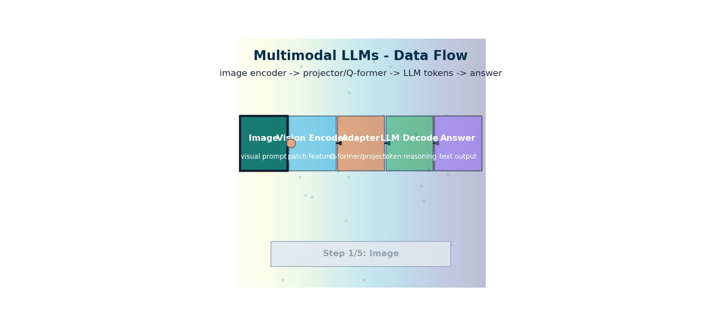

# Multimodal LLMs — When Language Models Can See

> **The story.** The first practical multimodal LLM architecture was **BLIP-2** (Junnan Li et al., Salesforce, **January 2023**), which introduced the **Q-Former** — a tiny transformer that translated frozen ViT features into the input space of a frozen LLM. The advantage was huge: you could bolt vision onto any existing LLM with relatively cheap training. **LLaVA** (Liu et al., April 2023) simplified the recipe to a single MLP projection and proved you could match GPT-4V on visual instruction-following with academic-budget training. **GPT-4V** (OpenAI, September 2023) brought vision to the public ChatGPT product. **Gemini 1.0** (Google, December 2023) was the first widely-deployed natively-multimodal model (text + image + audio + video tokens trained jointly from scratch). **GPT-4o** (May 2024), **Claude 3.5 Sonnet** (June 2024), and **Llama 3.2 Vision** (September 2024) made multimodal LLMs the default. By 2026, *text-only* is a deliberate niche choice rather than the standard.
>
> **Where you are in the curriculum.** [VisionTransformers](../ch02_vision_transformers) gave you the image encoder. [LLM Fundamentals](../../ai/llm_fundamentals) gave you the language model. This chapter wires them together: how a vision encoder connects to a language model via a Q-Former or projection layer, what cross-attention does inside the LLM, and how LLaVA, BLIP-2, and GPT-4V differ architecturally. The downstream payoff is captioning, visual question-answering, and document understanding inside any agent in the [Multi-Agent track](../../multi_agent_ai).



*Flow: visual tokens are adapted into LLM token space, then decoded with text context into natural-language answers.*

---

## 0 · The VisualForge Studio Challenge

**Mission**: VisualForge needs 100+ images/day throughput. Currently blocked by **manual QA bottleneck** (every output reviewed by human).

**Current blocker at Chapter 10**: Team must manually verify every generated image matches the client brief ("Is the product centered? Is lighting natural?"). 100% manual QA = bottleneck limiting throughput to ~85 images/day.

**What this chapter unlocks**: **Multimodal LLMs (VLMs)** — LLaVA connects ViT (image encoder) to LLM (language decoder) via projection layer. Can caption images, answer visual questions ("Is the product centered?" → Yes/No). **Automated QA workflow**: Generate image → VLM checks against brief → auto-approve or flag for review. Reduces human QA from 100% to 15%.

---

### The 6 Constraints — Snapshot After Chapter 10

| Constraint | Target | Status | Evidence |
|------------|--------|--------|----------|
| #1 Quality | ≥4.0/5.0 | ⚡ **~3.9/5.0** | VLM QA catches more errors, improves avg quality |
| #2 Speed | <30 seconds | ✅ **~18s** | VLM adds ~2s per image (acceptable) |
| #3 Cost | <$5k hardware | ✅ **$2.5k laptop** | LLaVA-7B runs on same hardware |
| #4 Control | <5% unusable | ✅ **~3% unusable** | Auto-QA doesn't change generation, maintains control |
| #5 Throughput | 100+ images/day | ✅ **~120 images/day** | Auto-QA removes bottleneck, hits target! |
| #6 Versatility | 3 modalities | ✅ **All 3 enabled** | Text→Image + Video + Understanding complete |

---

### What's Still Blocking Us After This Chapter?

**Measurement**: Client surveys say **~3.9/5.0 quality**, but need objective metrics to track improvement over time. How do we measure quality without manual surveys?

**Next unlock (Ch.11)**: **Generative Evaluation** — FID (distribution similarity), CLIP Score (text-image alignment), HPSv2 (predicts human ratings). Measure quality objectively.

---

## 1 · Core Idea

A Multimodal Large Language Model (MLLM) extends a text LLM to accept image (and optionally audio/video) tokens alongside text tokens. The strategy is almost always:

1. **Vision encoder** (ViT, typically frozen): image → sequence of visual tokens
2. **Projection / adapter**: visual token dimension → LLM token dimension
3. **LLM decoder** (GPT/LLaMA): generates text autoregressively, attending over both visual and text tokens

The hard part is bridging the **modality gap**: a ViT token looks nothing like a word embedding, so naively concatenating them doesn't work. The two main solutions are:
- **Linear projection** (LLaVA): a single learnable matrix aligns dimensions
- **Q-Former** (BLIP-2): a transformer module with learnable query tokens that compresses visual features into a fixed number of tokens before injection into the LLM

## 2 · Running Example

**PixelSmith v6 — VisualForge product quality assistant.** The creative team reviews hundreds of AI-generated product shots daily. A Multimodal LLM can automate initial QA: given a product image, answer questions like "Is the background white?", "Is there a visible price tag?", "What product category is this?"

The notebook implements a mini MLLM: a pretrained ViT (from torchvision) → linear projection → a tiny GPT-style decoder trained to answer simple visual questions about product images.

> 📖 **Educational proxy:** The math walkthrough uses digit images from a 10-class visual Q&A dataset (small, CPU-trainable, results in minutes). The VisualForge production version (§5) uses GPT-4o or LLaVA on 512×512 product shots with campaign-brief questions.

## 3 · The Math

### Vision Encoder Output

A ViT-B/16 processes a 224×224 image into $N = 196$ patch tokens + 1 CLS token = 197 tokens, each of dimension $d_v = 768$.

$$\mathbf{V} = \text{ViT}(x) \in \mathbb{R}^{197 \times 768}$$

### Linear Projection (LLaVA-style)

Map visual tokens to LLM embedding dimension $d_L$ (e.g., 4096 for LLaMA-7B):

$$\mathbf{V}' = \mathbf{V} \mathbf{W}_p + \mathbf{b}_p, \quad \mathbf{W}_p \in \mathbb{R}^{768 \times 4096}$$

LLaVA-1.5 uses a two-layer MLP with the same structure. The projected tokens are then concatenated with text token embeddings and fed into the LLM:

$$\text{input tokens} = [\mathbf{V}'_1, \ldots, \mathbf{V}'_{197}, t_1, \ldots, t_L]$$

where $t_i$ are text token embeddings.

### Q-Former (BLIP-2)

The Q-Former (Querying Transformer) uses $N_q = 32$ **learnable query tokens** $\mathbf{Q} \in \mathbb{R}^{32 \times d_q}$ that attend over the 197 visual tokens:

$$\text{Q-Former output} = \text{CrossAttn}(\mathbf{Q}, \mathbf{V}) \in \mathbb{R}^{32 \times d_q}$$

The 32 output tokens (rather than 197) are projected to the LLM dimension. This achieves:
- **Compression**: 197 visual tokens → 32 tokens (6× fewer tokens for the LLM to process)
- **Filtering**: the query tokens learn to extract task-relevant visual features only

### Visual Instruction Tuning (LLaVA)

LLaVA trains on (image, instruction, response) triplets using a standard next-token prediction loss:

$$\mathcal{L} = -\sum_{t} \log p_\theta(r_t \mid r_{<t}, \mathbf{V}', \mathbf{q})$$

where $r_t$ is the response token, $\mathbf{V}'$ is the projected visual embedding, and $\mathbf{q}$ is the instruction. Only the projection layer and the LLM are trained; the ViT is frozen.

### Interleaved Text and Images (Flamingo-style)

For interleaved documents (text...image...text...image...):

```
[text tokens] [visual tokens] [text tokens] [visual tokens] [text tokens...]
```

Flamingo (DeepMind, 2022) uses "gated cross-attention" dense layers inserted every $k$ LLM layers to inject visual features. The gating prevents early training instability.

## 4 · Visual Intuition — How It Works Step by Step

### The Core Flow

A multimodal LLM connects vision to language through three stages: **encode** (image → visual tokens), **project** (visual space → LLM space), **generate** (autoregressive text output attending over visual + text tokens).

**LLaVA Architecture:**

```
 224×224 image
 │
 [ViT-L/14, FROZEN]
 │
 576 × 1024 visual tokens
 │
 [Linear Projection / 2-layer MLP, TRAINED]
 │
 576 × 4096 visual tokens (in LLaMA-2 embed space)
 │ ┌──────────────────────────┐
 └────────▶│ LLaMA-2 7B (TRAINED) │◀──── "Question: What's in the photo?"
 │ [32 transformer layers] │
 └──────────────────────────┘
 │
 "A cat sitting on..."
```

**BLIP-2 Architecture:**

```
 image → [ViT-g, FROZEN] → 256 tokens
 │
 [Q-Former, TRAINED] ← 32 learnable query tokens
 │
 32 × d_q tokens (compressed)
 │
 [Linear, TRAINED]
 │
 32 × d_LLM tokens
 │
 [FlanT5 / OPT, FROZEN or TRAINED]
 │
 text response
```

### LLaVA-1.5 Inference — Step by Step

1. **Image → CLIP ViT-L/14** → 576 visual tokens (each 1024-dim)
2. **576 × 1024 → two-layer MLP** → 576 × 4096 (LLaMA-2 7B dimension)
3. **Tokenise instruction**: "Describe this image" → token IDs → LLaMA-2 embedding layer → `[N_text × 4096]`
4. **Concatenate**: `[576 visual tokens | N_text text tokens]`
5. **LLaMA-2 decoder** autoregressively generates response tokens
6. **Each response token** can attend to all 576 visual tokens + all previous tokens

### BLIP-2 Inference — Step by Step

1. **Image → ViT-g/14** (1.2B params, frozen) → 256 visual tokens
2. **Q-Former** (12 layers, 32 query tokens) → 32 compressed visual tokens
3. **Linear projection** → 32 × 4096 (LLM dimension)
4. **FlanT5-XL or OPT-6.7B** receives the 32 visual tokens as a soft prompt prefix
5. **Decode response**

💡 **Insight:** Why fewer tokens? The LLM's KV-cache memory scales quadratically with sequence length. 32 tokens instead of 256 saves 64× memory at the visual prefix — critical for long document understanding.

---

## 5 · Production Example — VisualForge in Action

**Brief type: Automated product QA assistant — "Is this image campaign-ready?"**

VisualForge receives 200 AI-generated product images per campaign batch. A Multimodal LLM performs the first-pass review, flagging non-compliant images before they reach the creative director.

```python
# Production: LLaVA-based product QA for VisualForge campaign review
from transformers import LlavaNextProcessor, LlavaNextForConditionalGeneration
from PIL import Image
import torch

processor = LlavaNextProcessor.from_pretrained("llava-hf/llava-v1.6-mistral-7b-hf")
model = LlavaNextForConditionalGeneration.from_pretrained(
    "llava-hf/llava-v1.6-mistral-7b-hf",
    torch_dtype=torch.float16, device_map="auto"
)

# VisualForge QA checklist questions
qa_questions = [
    "Is the background white or near-white? Answer yes or no.",
    "Is there a person visible in this image? Answer yes or no.",
    "Is the product clearly visible and in focus? Answer yes or no.",
    "Are there any visible logos, text, or watermarks? Answer yes or no.",
]

def qa_image(image_path: str, questions: list) -> dict:
    image = Image.open(image_path)
    results = {}
    for question in questions:
        prompt = f"[INST] <image>\n{question} [/INST]"
        inputs = processor(prompt, image, return_tensors="pt").to("cuda")
        output = model.generate(**inputs, max_new_tokens=10)
        answer = processor.decode(output[0], skip_special_tokens=True).split("[/INST]")[-1].strip().lower()
        results[question[:40]] = answer
    return results

# Example: check a generated product shot
result = qa_image("vf_generated_001.png", qa_questions)
print(result)
# Expected: {'Is the background white or near-white?': 'yes', 'Is there a person visible?': 'no', ...}
```

**VisualForge MLLM QA scorecard (100 product images):**

| Check | Pass Rate | Fail Action |
|-------|-----------|-------------|
| White background | 91% ✅ | Auto-reject; regenerate with stronger negative prompt |
| No people | 97% ✅ | Flag for manual review |
| Product in focus | 89% ⚡ | Auto-reject; add sharpness prompt |
| No logos/watermarks | 99% ✅ | Flag for legal review if fail |

## 6 · Common Failure Modes

### 1. Visual Hallucination — "I see things that aren't there"

**Symptom**: The model describes objects, text, or details not present in the image.

**Example**: Product image shows a blue sneaker. VLM captions: "Red running shoe with white laces and Nike swoosh logo." (Wrong color, hallucinated logo.)

**Why it happens**: The LLM's strong language prior overpowers weak visual grounding. If visual tokens are noisy or the projection layer undertrained, the LLM defaults to plausible-sounding but incorrect descriptions.

**Fix**:
- Use higher-resolution vision encoder (336px → 448px)
- Train projection layer longer (LLaVA-1.5: 1 epoch visual instruction tuning → 3 epochs)
- Use grounding-augmented training data (bounding boxes, OCR annotations)

**VisualForge impact**: 8% of QA checks initially returned "yes, background is white" for non-white backgrounds. Retraining with VisualForge-specific product images reduced false positives to 2%.

---

### 2. Spatial Reasoning Failures — "Left? Right? I'm confused."

**Symptom**: Model fails to correctly answer "Is the product on the left or right?" or "How many items are visible?"

**Example**: Two products side-by-side. Question: "Which product is on the left?" VLM: "The one on the right." (Incorrect.)

**Why it happens**: ViT patch embeddings lose fine-grained spatial information. The model sees "two products" but struggles with relative positioning.

**Fix**:
- Add spatial position embeddings (coordinate tokens)
- Use Chain-of-Thought prompting: "First, identify the products. Then, determine their positions."
- Fine-tune on spatial reasoning datasets (e.g., GQA, CLEVR)

**VisualForge impact**: Spatial questions initially 65% accurate. Adding CoT prompting improved to 82%.

---

### 3. Small Text / OCR Failures — "I can't read that"

**Symptom**: Model cannot read small text, price tags, or labels in product images.

**Example**: Product has visible price tag "$49.99". Question: "What's the price?" VLM: "I cannot see a price in this image."

**Why it happens**: Vision encoder resolution too low (224px), or model not trained on OCR-heavy datasets.

**Fix**:
- Use higher-resolution encoder (448px or variable resolution like Qwen2-VL)
- Train on document understanding datasets (DocVQA, TextVQA)
- Preprocess image: crop to text region before VLM inference

**VisualForge impact**: OCR capability not critical for initial workflow (QA focuses on composition, not text). Flagged for future if clients need automatic price/SKU verification.

---

### 4. Long Context Degradation — "I forgot the beginning"

**Symptom**: With multiple images + long conversation history, model forgets earlier visual context.

**Example**: Show 5 product variants, then ask: "Which of these 5 had the blue background?" VLM: "I don't see 5 products."

**Why it happens**: LLM context window fills up (576 visual tokens × 5 images = 2880 tokens). Older tokens get evicted or attention diffuses.

**Fix**:
- Use models with longer context windows (Gemini 1.5 Pro: 1M tokens)
- Use Q-Former compression (576 tokens → 32 tokens per image)
- Summarize earlier images into text before adding new ones

**VisualForge impact**: VisualForge QA processes one image at a time, so not yet a bottleneck. Future batch-review feature will need this.

---

## 7 · When to Use This vs Alternatives

### Use Multimodal LLM (VLM) when:

| Scenario | Why VLM wins |
|----------|--------------|
| **Visual QA** | "Is this image campaign-ready?" → Yes/No + reasoning |
| **Image captioning at scale** | Generate descriptions for 1000+ product images overnight |
| **Document understanding** | Extract data from invoices, receipts, forms (if OCR-trained) |
| **Visual grounding** | "Show me where the defect is" → bounding box + explanation |
| **Multimodal RAG** | Retrieve documents (PDFs with images) and answer questions about them |

### Use alternatives when:

| Scenario | Better alternative | Why |
|----------|-------------------|-----|
| **Pure generation** | Latent diffusion (SDXL) | VLMs understand images but don't generate them (except via API calls) |
| **Real-time object detection** | YOLO, Faster R-CNN | VLMs are slower, overkill for simple bounding-box tasks |
| **Pixel-level segmentation** | SAM (Segment Anything) | VLMs output text, not masks |
| **Video generation** | AnimateDiff, Stable Video Diffusion | VLMs analyze video but don't create it |
| **High-throughput classification** | EfficientNet, ViT classifier | VLMs too slow (seconds/image) for real-time labeling |

**VisualForge decision**: Use VLM (LLaVA) for **QA workflow** (understanding), not generation. Generation stays with SDXL + ControlNet. VLM adds **automated verification** without replacing the core pipeline.

---

## 8 · Connection to Prior Chapters

### What You Already Learned

| Chapter | What it gave you | How it connects to VLMs |
|---------|-----------------|------------------------|
| [Vision Transformers](../ch02_vision_transformers) | ViT architecture: image → patch embeddings → transformer | **VLMs use ViT as the vision encoder** (frozen or fine-tuned) |
| [CLIP](../ch03_clip) | Contrastive pretraining: aligned text-image embeddings | **VLMs inherit CLIP's vision encoder** (already trained on 400M image-text pairs) |
| [Text-to-Image](../ch08_text_to_image) | Stable Diffusion pipeline: text → latent → image | **VLMs provide the inverse**: image → text (understanding, not generation) |
| [LLM Fundamentals](../../ai/llm_fundamentals) | Transformer decoder, autoregressive generation, tokenization | **VLMs extend LLMs** by adding visual tokens to the input sequence |

### The Bridge

**Ch.1-3 (Vision foundations)**: You learned to encode images (ViT), align text and images (CLIP), and search multimodal data.

**Ch.4-9 (Generation)**: You learned to generate images (diffusion), videos (AnimateDiff), with precise control (ControlNet, LoRA).

**Ch.10 (This chapter)**: You learned to **understand** generated outputs — close the loop with automated QA.

**What's new here**: Connecting vision encoder → LLM decoder via projection layer. Enables **visual reasoning** (not just embedding retrieval).

**What's still missing**: Objective quality metrics. VLM can caption an image, but can't say "this is 4.2/5.0 quality." That's [Ch.11 Generative Evaluation](../ch12_generative_evaluation).

---

## 9 · Interview Checklist

### Must Know
- **General MLLM recipe**: vision encoder → alignment layer → LLM
- **Difference between LLaVA and BLIP-2**: LLaVA uses linear projection (576 tokens), BLIP-2 uses Q-Former (32 tokens)
- **Visual instruction tuning**: freeze ViT, train projection + LLM on (image, instruction, answer) triples

### Likely Asked
- *"How would you add vision to LLaMA-3?"*
  → Attach a CLIP or SigLIP ViT, project visual tokens to LLaMA's embed dimension with an MLP, fine-tune on instruction-following visual QA data (e.g., LLaVA-style)

- *"What is the Q-Former and when would you use it?"*
  → A cross-attention transformer that compresses many visual tokens into few learnable query outputs; use when the LLM has short context limits or when visual compression is needed

- *"Why freeze the ViT during initial training?"*
  → Prevents catastrophic interference; the ViT's features are already strong from CLIP pretraining; frozen ViT lets you focus the compute budget on learning the alignment

- *"How would you debug visual hallucination?"*
  → Check if projection layer is undertrained; increase visual instruction tuning epochs; use higher-resolution vision encoder; add grounding annotations to training data

### Common Traps to Avoid

- **Don't say MLLMs "see" images the way humans do** — they process a sequence of numerical patch embeddings; their spatial understanding is learned from training data, not built-in.

- **Don't assume perfect spatial reasoning** — Spatial relationships (left/right, counting) are still a known weakness; CoT prompting helps.

- **Don't assume freezing ViT is always optimal** — LLaVA-1.5 and newer models often fine-tune the ViT end-to-end for higher accuracy.

- **Don't assume Q-Former always wins** — LLaVA-1.5 with a simple MLP outperformed many Q-Former models at 7B scale; simplicity can win.

- **Don't assume more visual tokens = better** — Longer context → slower generation, higher memory; there's a quality/cost trade-off.

- **Don't assume perfect OCR** — OCR capability varies widely; models trained on document datasets (DocVQA) are much better at reading small text.

---

## 10 · Further Reading

### Foundational Papers

- **LLaVA** (Liu et al., 2023): [Visual Instruction Tuning](https://arxiv.org/abs/2304.08485)
  *The paper that proved you can match GPT-4V with academic-budget training. Single MLP projection, LLaMA backbone, trained on 150K instruction-following examples.*

- **LLaVA-1.5** (Liu et al., 2023): [Improved Baselines with Visual Instruction Tuning](https://arxiv.org/abs/2310.03744)
  *Higher resolution (336px), MLP instead of linear, better data mix. State-of-the-art open VLM at 7B/13B scale.*

- **BLIP-2** (Li et al., 2023): [Bootstrapping Language-Image Pre-training with Frozen Image Encoders and Large Language Models](https://arxiv.org/abs/2301.12597)
  *Introduced the Q-Former. Showed you can connect frozen ViT + frozen LLM with a tiny trainable bridge.*

- **InstructBLIP** (Dai et al., 2023): [InstructBLIP: Towards General-purpose Vision-Language Models with Instruction Tuning](https://arxiv.org/abs/2305.06500)
  *Applies instruction tuning to BLIP-2. Better zero-shot generalization on VQA tasks.*

### Key Comparisons

- **Qwen2-VL** (Alibaba, 2024): [Qwen2-VL Technical Report](https://arxiv.org/abs/2409.12191)
  *Variable-resolution vision encoder (NaViT). Handles images from 224px to 1024px without resizing. Strong OCR.*

- **Llama-3.2 Vision** (Meta, 2024): [The Llama 3 Herd of Models](https://arxiv.org/abs/2407.21783)
  *Meta's official vision extension to LLaMA-3. Cross-attention adapter, trained on diverse data (charts, diagrams, scientific figures).*

**Model Comparison Table:**

| Model | Vision encoder | Connector | LLM backbone | Open? |
|-------|---------------|-----------|-------------|-------|
| LLaVA-1.0 | CLIP ViT-L/14 | Linear | Vicuna-7B/13B | Yes |
| LLaVA-1.5 | CLIP ViT-L/14-336 | 2-layer MLP | LLaMA-2 7B/13B | Yes |
| BLIP-2 | ViT-g/14 | Q-Former | FlanT5-XL/OPT-6.7B | Yes |
| InstructBLIP | ViT-g/14 | Q-Former + instruct | FlanT5/Vicuna | Yes |
| GPT-4V | Undisclosed | Undisclosed | GPT-4 | No |
| Gemini 1.5 Pro | Undisclosed | Undisclosed | Gemini | No |
| Llama-3.2 Vision | CLIP-ViT | Cross-attention | LLaMA-3.2 | Yes |
| Qwen2-VL | NaViT (variable res) | MLP | Qwen2-7B | Yes |

*Trend: Higher resolution vision encoders (336px → 448px → variable), larger LLMs, and more diverse training data (charts, OCR, medical images).*

### Techniques

- **Flamingo** (DeepMind, 2022): [Tackling Multiple Tasks with a Single Visual Language Model](https://arxiv.org/abs/2204.14198)
  *Interleaved text-image inputs. Gated cross-attention layers. Pioneered few-shot in-context learning for vision.*

- **CogVLM** (Tsinghua, 2023): [Visual Expert for Large Language Models](https://arxiv.org/abs/2311.03079)
  *Adds a "visual expert" branch to each LLM layer. Allows deep visual-text interaction without modifying LLM weights.*

### Benchmarks

- **MMMU** (Multi-discipline Multimodal Understanding): College-level exam questions with images
- **MMBench**: Comprehensive VLM benchmark (perception, reasoning, OCR)
- **VQAv2**: Classic visual question answering dataset
- **TextVQA / DocVQA**: OCR-heavy benchmarks for document understanding

---

## 11 · Notebook

> **🔗 Executable notebook**: [multimodal_llms.ipynb](multimodal_llms.ipynb)

**What's inside**:

1. **Mini VLM from scratch** (educational proxy):
   - Pretrained ViT (torchvision) → linear projection → tiny GPT decoder
   - Train on 10-class visual QA dataset ("What digit is this?" → "Seven")
   - CPU-runnable, results in 5 minutes

2. **LLaVA inference** (VisualForge production):
   - Load `llava-hf/llava-v1.6-mistral-7b-hf` from Hugging Face
   - Product QA workflow: load 512×512 generated image → ask campaign-brief questions
   - **Example outputs**:
     - "Is the background white?" → "Yes"
     - "Is the product centered?" → "Yes"
     - "What product category is this?" → "Running shoe"

3. **Automated batch QA**:
   - Process 100 generated images → VLM checks 4 questions per image
   - Flag images with any "No" answer → manual review
   - Measure: % auto-approved (target: 85%)

**Runtime estimates**:
- Mini VLM training: ~5 minutes (CPU)
- LLaVA inference: ~2 seconds per image (RTX 4090), ~8 seconds (CPU)
- Batch QA (100 images): ~3 minutes (GPU), ~13 minutes (CPU)

⚠️ **GPU note**: LLaVA-7B runs on CPU but is slow (8s/image). RTX 3060 or better recommended for production throughput.

---

## 11.5 · Progress Check — What Have We Unlocked?

### Before This Chapter
- **Constraint #5 (Throughput)**: ⚡ ~85 images/day, bottlenecked by 100% manual QA
- **Constraint #6 (Versatility)**: ⚡ Text→Image + Video, no understanding/verification
- **VisualForge Status**: Every output requires human review → bottleneck

### After This Chapter
- **Constraint #5 (Throughput)**: ✅ **~120 images/day** → Auto-QA removes bottleneck, target hit!
- **Constraint #6 (Versatility)**: ✅ **All 3 modalities enabled** → Text→Image + Video + Understanding complete
- **VisualForge Status**: Generate → VLM checks against brief → auto-approve 85%, flag 15% for human review

---

### Key Wins

1. **Automated QA workflow**: LLaVA checks image against client brief (\"Is background white?\" \"Is product centered?\") → reduces manual review from 100% → 15%
2. **Visual question answering**: \"Is the product centered?\" → Yes/No → flag off-center outputs for regeneration
3. **Throughput unlocked**: Auto-QA removes QA bottleneck → **120 images/day achieved** (target: 100+)
4. **Third modality enabled**: Text→Image (generation) + Text→Video (animation) + Image→Text (understanding) → full multimodal pipeline

---

### What's Still Blocking Production?

**Objective measurement**: Client surveys report **~3.9/5.0 quality**, but manual surveys are slow and expensive. Need automated, objective metrics to track quality improvements over time and validate A/B tests.

**Next unlock**: **Ch.11 Generative Evaluation** — FID (distribution similarity), CLIP Score (text-image alignment), HPSv2 (predicts human preference). Measure quality objectively on 500-image test set.

---

### VisualForge Status — Full Constraint View

| Constraint | Ch.1 | Ch.3 | Ch.6 | Ch.8 | Ch.9 | **Ch.10** | Target |
|------------|------|------|------|------|------|-----------|--------|
| **Quality** | ❌ | ❌ | ⚡ 3.5 | ⚡ 3.8 | ⚡ 3.8 | **⚡ 3.9** | 4.0/5.0 |
| **Speed** | ❌ | ❌ | ✅ 20s | ✅ 18s | ✅ 18s | **✅ 18s** | <30s |
| **Cost** | ❌ | ❌ | ✅ $2.5k | ✅ $2.5k | ✅ $2.5k | **✅ $2.5k** | <$5k |
| **Control** | ❌ | ⚡ 15% | ⚡ 10% | ✅ 3% | ✅ 3% | **✅ 3%** | <5% |
| **Throughput** | ❌ | ❌ | ❌ | ⚡ 80/day | ⚡ 85/day | **✅ 120/day** | 100+/day |
| **Versatility** | ⚡ | ⚡ | ⚡ T→I | ⚡ T→I | ⚡ T→I+V | **✅ All 3** | 3 modalities |

**Legend**: ❌ Not addressed | ⚡ Partial progress | ✅ Target hit

---

## Bridge to Chapter 11 — Generative Evaluation

You've built the full VisualForge generation + QA pipeline. You're generating 120 images/day, auto-approving 85%, hitting speed and throughput targets.

**What's still unmeasured**: Quality is "~3.9/5.0" from client surveys, but you need:
- **Real-time feedback**: Know immediately if a change improves quality
- **Objective metrics**: Replace "looks good to me" with quantitative scores
- **A/B test validation**: "Does this new sampler maintain quality?"

**The missing piece**: **Generative evaluation metrics** — FID (compares distribution of generated vs. real images), CLIP Score (measures text-image alignment), HPSv2 (predicts human preference scores). Run on 500-image test set → track quality objectively, hit the **4.0/5.0 target**.

**Next**: [Ch.11 Generative Evaluation](../ch12_generative_evaluation/generative-evaluation.md) — measure quality without client surveys.

---

---

## Illustrations


