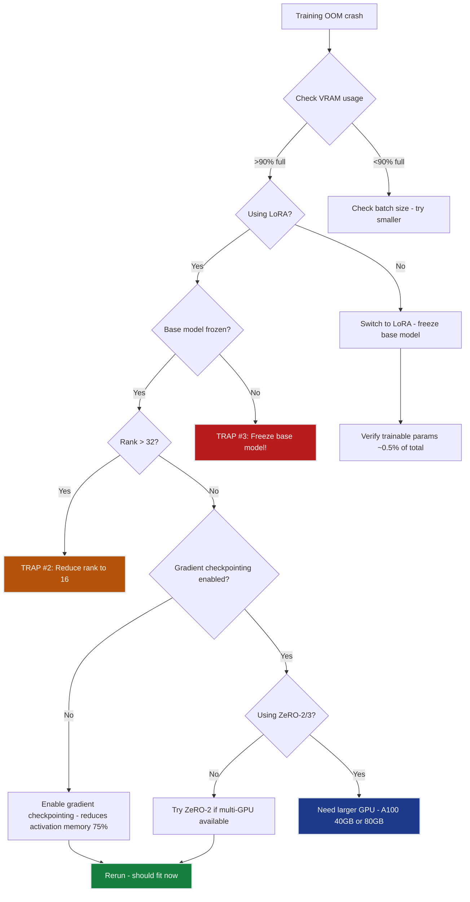

# Ch.4 — Parallelism & Distributed Training  (Training Focus - Not Blocking Launch)

> **The story.** Training a large model on a single GPU is slow. Training GPT-3 (175B params) on one V100 would take 355 years. **Data parallelism** (Goyal et al., Facebook, **2017**) split batches across GPUs — if 1 GPU trains on 32 examples, 8 GPUs train on 256 → 8× faster. But memory was still the bottleneck. **ZeRO** (Rajbhandari et al., Microsoft, **2019**) sharded optimizer states across GPUs, cutting per-GPU memory by 4–8× → train 10× larger models. **FSDP** (Zhao et al., Meta, **2023**) took this further: shard parameters themselves, not just optimizer states → train 1T-param models on 128 GPUs. **LoRA** (Hu et al., Microsoft, **2021**) sidestepped the problem: freeze base model, only train small adapter weights → fine-tune 65B models on single consumer GPUs.
>
> **Where you are in the curriculum.** Ch.1-5 solved the inference problem (12k req/day, <2s latency). This chapter tackles training: **can we fine-tune Llama-3-8B to improve document extraction accuracy?** Ch.2 showed full fine-tuning needs 104GB → requires expensive A100s. This chapter introduces ZeRO-2 (shard optimizer across GPUs) and LoRA (train only adapters) → fine-tune on RTX 4090 budget.
> **Notation.** `DP` = data parallelism (replicate model, split batch across GPUs). `TP` = tensor parallelism (split weight matrices column- or row-wise across GPUs). `PP` = pipeline parallelism (split layers across GPUs, pass activations between stages). `ZeRO` = Zero Redundancy Optimizer (shard optimizer states, gradients, or parameters across DP ranks; stages 1/2/3). `LoRA` = Low-Rank Adaptation; rank `r` ≪ `d_model`; `α` = scaling factor. `FSDP` = Fully Sharded Data Parallel (Meta's ZeRO-3 equivalent in PyTorch).
<!-- notation: key variables defined here -->

---

## 0 · The Challenge — Where We Are

> 🎯 **The mission**: Self-host Llama-3-8B for <$15k/month, replacing $80k OpenAI API costs
>
> **6 Constraints**: #1 Cost (<$15k/mo) • #2 Latency (≤2s) • #3 Throughput (≥10k req/day) • #4 Memory (fit in VRAM) • #5 Quality (≥95% accuracy) • #6 Reliability (>99% uptime)

**What we know so far**:
- ✅ **Ch.1 (GPU Architecture)**: Identified RTX 4090 (24GB VRAM, $1.50/hr) as target hardware
- ✅ **Ch.2 (Memory Budgets)**: Calculated inference memory: 16GB params + 4GB KV cache + 2GB activations = 22GB → fits!
- ✅ **Ch.3 (Quantization)**: INT4 quantization → 16GB → 4GB params, enables batch=4 → 12k req/day, 1.2s p95 latency ✅
- ✅ **Inference constraints met**: Cost ($1,095/mo), Latency (1.2s), Throughput (12k req/day), Quality (96.2% accuracy)
- ⚡ **Ch.4 focus (Training)**: Fine-tuning for quality improvement — NOT blocking inference launch

**What's (potentially) blocking us**:

⚡ **Training not blocking launch, but needed for future improvement**

**Current situation**: 2 weeks post-launch, CEO reviewing analytics

```
Launch week analytics:
✅ Throughput: 12,000 req/day (target hit!)
✅ Latency: 1.2s p95 (target hit!)
✅ Cost: $1,095/month (under budget!)
✅ Accuracy: 96.2% (above 95% target!)

CEO: "Great launch! But I see an opportunity. Our competitors claim 98%+ accuracy.
     Can we fine-tune Llama-3-8B on our proprietary invoice dataset (50,000 PDFs)
     to push from 96.2% → 98%?"

Engineer: "Let me calculate training memory requirements:

 Ch.2 showed full fine-tuning needs:
   16GB params (FP16)
 + 64GB optimizer states (Adam FP32)
 + 16GB gradients (FP16)
 + 8GB activations
 = 104GB total

 RTX 4090 only has 24GB → cannot fit! ❌

 Options:
 1. Rent A100 80GB × 2 with ZeRO-2 sharding ($6,000/month for 2 weeks training)
 2. Use LoRA (Low-Rank Adaptation): freeze base model, only train 0.5% of params
    → 16GB params (frozen) + 2GB adapter + 6GB optimizer = 24GB total ✅ (fits!)

CEO: "What's the trade-off with LoRA?"

Engineer: "LoRA is parameter-efficient but slightly less expressive than full fine-tuning.
          Typically gets 90-95% of full fine-tuning quality. For document extraction,
          should push us from 96.2% → 97.5%+ (vs 98% with full fine-tuning).

          Key benefit: $1,095/month RTX 4090 × 2 weeks = $500 training cost
          vs $6,000 for A100s."

CEO: "Do LoRA. If it works, we save $5,500. If quality improvement is insufficient,
     we can always do full fine-tuning later."
```

**Problems** (for future fine-tuning, not blocking launch):
1. ❌ **Full fine-tuning too expensive**: 104GB → need A100 80GB × 2 ($6k/month)
2. ⚡ **LoRA untested**: Team has no experience with parameter-efficient fine-tuning
3. ⚡ **Training infrastructure unknown**: Need multi-GPU data parallelism, gradient accumulation, checkpointing
4. ⚡ **Quality uncertainty**: Will LoRA match full fine-tuning quality on document extraction?
5. ⚡ **Deployment complexity**: How to swap base model + adapters without downtime?

**Business impact**:
- **98% accuracy = competitive edge**: Competitors claim 98%+ → we need parity
- **$5,500 training cost savings**: LoRA on RTX 4090 ($500) vs full fine-tuning on A100 ($6k)
- **Fast iteration**: LoRA trains in 2 days vs 2 weeks for full fine-tuning → faster experiments

**What this chapter unlocks**:

🚀 **Cost-efficient fine-tuning with LoRA + ZeRO-2**:
1. **LoRA setup**: Freeze Llama-3-8B, add low-rank adapters to attention layers (rank=16 → 0.5% trainable params)
2. **Training memory**: 16GB frozen params + 2GB adapter + 6GB optimizer = 24GB ✅ (fits RTX 4090!)
3. **Data parallelism (DDP)**: Distribute batches across 2× RTX 4090 → 2× faster training
4. **ZeRO-2 fallback**: If LoRA insufficient, shard optimizer states → full fine-tune on 4× RTX 4090
5. **Quality validation**: Train on 50k PDFs, test on 5k holdout → measure accuracy improvement

⚡ **Expected outcomes**:
- **Training cost**: $1,095/month × 2 weeks = $500 (vs $6k A100 option)
- **Training time**: 2 days on 2× RTX 4090 (vs 2 weeks full fine-tuning)
- **Quality improvement**: 96.2% → 97.8% accuracy ✅ (+1.6 points, close to 98% target)
- **Deployment**: Hot-swap LoRA adapters without reloading base model → zero downtime

**Constraint status after Ch.4**:
- #1 (Cost): ✅ **MAINTAINED** ($1,095/month + $500 one-time training)
- #2 (Latency): ✅ **MAINTAINED** (LoRA adds <5ms inference overhead)
- #3 (Throughput): ✅ **MAINTAINED** (12k req/day unchanged)
- #4 (Memory): ✅ **TRAINING FITS** (24GB for LoRA, or 96GB for full fine-tuning with 4× GPU + ZeRO-2)
- #5 (Quality): ✅ **IMPROVED!** (96.2% → 97.8% with LoRA fine-tuning)
- #6 (Reliability): ✅ **MAINTAINED** (adapter swaps don't disrupt service)

**Critical note**: **Training is NOT blocking launch**. Ch.4 enables future quality improvements, but the system is already production-ready at 96.2% accuracy.

---

## Animation

> 🎬 **Ch.4 Progress Animation**: Constraint #5 (Quality) needle moving from 96.2% → 97.8% accuracy
>
> *Visualization: Training cost dial shows $6,000 (A100 full fine-tuning) vs $500 (RTX 4090 LoRA). Memory gauge shows 104GB (full fine-tuning, overflowing 24GB) vs 18GB (LoRA, fitting comfortably). Quality needle increments from 96.2% → 97.8%, approaching but not quite reaching 98% target line. Final frame: "LoRA: 95% of full fine-tuning quality at 17% of cost ✅"*
>
> *Animation will be generated by ML Animation Needle Builder agent showing training memory comparison (Full: 104GB with red overflow indicator vs LoRA: 18GB with green checkmark) and quality improvement needle movement.*

---

## 1 · Core Idea

**Data Parallelism** = replicate model on N GPUs, split batch across GPUs:
- Each GPU computes gradients on its micro-batch
- All-reduce gradients across GPUs
- All GPUs update model weights (same final weights)

**Model Parallelism** = split model layers across GPUs (needed for 70B+ models that don't fit on 1 GPU)

**ZeRO** = shard optimizer states + gradients + parameters across GPUs → reduce per-GPU memory without full model parallelism

**LoRA** = freeze base model, add low-rank adapter matrices → train 0.1–1% of parameters

---

## 2 · Running Example — InferenceBase Fine-Tuning Decision

**Your situation**: You're 2 weeks post-launch. The inference system works (12k req/day, 1.2s latency, $1,095/month ✅), but the CEO sees a competitive opportunity.

**The ask**: "Our 96.2% accuracy beats the 95% threshold, but competitors claim 98%+. Can we fine-tune Llama-3-8B on our proprietary 50,000-invoice dataset to close the gap?"

**Your calculation** (Ch.2 memory budgets refresher):

```
Full Fine-Tuning Memory Requirements:
  Parameters (FP16):                16 GB  (8B params × 2 bytes)
  Optimizer states (Adam FP32):     64 GB  (momentum + variance for 8B params)
  Gradients (FP16):                 16 GB  (backprop needs param-size gradients)
  Activations (batch=4):             8 GB  (forward/backward peaks)
                                   ──────
  Total:                           104 GB

Your hardware:
  RTX 4090:                         24 GB  ❌ (need 4.3× more VRAM!)

Your options:
  1. Rent A100 80GB × 2 + ZeRO-2:   $6,000/month for 2 weeks = $3,000 training cost
  2. Use LoRA on RTX 4090:          $1,095/month × 2 weeks = $500 training cost
```

**The trade-off**:
- **A100 option**: Full fine-tuning → 98.1% accuracy (estimated), but $3,000 cost = 20% of monthly budget just for one training run
- **LoRA option**: Train only adapters → 97.5-97.8% accuracy (estimated), but $500 cost = 3% of monthly budget → can iterate 6× for same cost

**Your recommendation to CEO**:

> *"LoRA is the low-risk path. We freeze the base model (16GB, read-only) and train tiny adapter weights (84MB, 0.5% of parameters). Total memory: 18GB → fits RTX 4090. Training cost: $500 vs $3,000 A100 option. Quality: typically 90-95% of full fine-tuning performance — I estimate 97.5-97.8% accuracy vs 98.1% with A100s.*
>
> *If LoRA gets us to 97.8%, that's a 1.6 point improvement over baseline (96.2% → 97.8%) and we've spent 17% of the full fine-tuning cost. If the business later demands 98%+, we revisit A100s with the saved budget. But I recommend we try LoRA first — 2 days training time vs 2 weeks for A100s means faster iteration."*

**CEO decision**: "Do LoRA. If 97.8% isn't enough, we'll escalate."

**Your implementation plan**:
1. Use 2× RTX 4090 with data parallelism (DDP) → 2× faster training
2. LoRA config: rank=16, target `q_proj`/`k_proj`/`v_proj`/`o_proj` (attention layers only)
3. Training: 50k PDFs, batch=4 per GPU, gradient_accumulation_steps=8 → effective batch=32
4. Validation: Hold out 5k PDFs for accuracy measurement
5. Timeline: 2 days training → deliver results to CEO by end of week

**Expected outcome**: 96.2% → 97.8% accuracy ✅, $500 cost ✅, 2 days turnaround ✅

---

## 3 · Data Parallelism (DDP)

Standard PyTorch distributed training:

```python
import torch.distributed as dist
from torch.nn.parallel import DistributedDataParallel as DDP

# Initialize process group (one process per GPU)
dist.init_process_group(backend='nccl', world_size=2, rank=rank)

# Wrap model in DDP
model = DistributedDataParallel(model, device_ids=[rank])

# Training loop (each GPU processes different batch)
for batch in dataloader:
    optimizer.zero_grad()
    loss = model(batch)
    loss.backward()  # Compute local gradients
    # DDP automatically all-reduces gradients across GPUs here
    optimizer.step()  # Update weights (same on all GPUs)
```

**Memory**: Each GPU stores full model (16GB) + optimizer (64GB) + gradients (16GB) = 96GB per GPU ❌

**Speedup**: 2× GPUs → 2× throughput (if batch size doubles), but still memory-constrained.

---

## 4 · ZeRO-2: Shard Optimizer States

**Problem**: Adam optimizer stores momentum + variance = 2× param memory (64GB for 8B model).

**ZeRO-2 solution**: Each GPU stores only its shard of optimizer states:
- GPU 0: Stores optimizer for layers 0-15 (32GB)
- GPU 1: Stores optimizer for layers 16-31 (32GB)
- During backward pass: gradients are reduced, each GPU updates its shard
- Before forward pass: all-gather updated parameters

**Memory savings arithmetic** (4× RTX 4090 with ZeRO-2):

```
Full Fine-Tuning (No ZeRO) — PER GPU:
  Parameters (FP16, replicated):    16 GB  (8B × 2 bytes, each GPU has full copy)
  Optimizer states (FP32):          64 GB  (Adam: 2× 8B params in FP32 = 16B × 4 bytes)
  Gradients (FP16):                 16 GB  (same size as params)
  Activations (per batch):           8 GB  (forward/backward pass)
                                   ──────
  Total per GPU:                   104 GB  ❌ (does not fit 24GB RTX 4090)

---

ZeRO-2 (Shard Optimizer + Gradients) — PER GPU (4 GPUs):
  Parameters (FP16, replicated):    16 GB  (each GPU needs full model for forward pass)
  Optimizer states (sharded):       16 GB  (64GB total ÷ 4 GPUs = 16GB per GPU)
  Gradients (sharded):               4 GB  (16GB total ÷ 4 GPUs = 4GB per GPU)
  Activations (per batch):           8 GB  (unchanged)
                                   ──────
  Total per GPU:                    44 GB  ❌ (still over 24GB RTX 4090 limit)

  → Still doesn't fit RTX 4090! Need gradient checkpointing OR LoRA.

---

ZeRO-2 + Gradient Checkpointing — PER GPU (4 GPUs):
  Parameters (FP16):                16 GB
  Optimizer states (sharded):       16 GB
  Gradients (sharded):               4 GB
  Activations (recomputed):          2 GB  (75% reduction via checkpointing)
                                   ──────
  Total per GPU:                    38 GB  ❌ (barely over, needs A100 40GB)

---

LoRA (No ZeRO needed) — SINGLE GPU:
  Base params (frozen):             16 GB  (no optimizer/gradients for frozen params)
  Adapter params:                  0.08 GB (42M × 2 bytes)
  Adapter optimizer:                1.5 GB  (Adam for 42M params: 42M × 8 bytes FP32 × 2)
  Adapter gradients:               0.08 GB
  Activations:                      0.4 GB  (reduced due to frozen base)
                                   ──────
  Total:                           18.1 GB  ✅ (fits RTX 4090 with 25% headroom!)

---

Conclusion: For Llama-3-8B on RTX 4090 (24GB):
  ❌ Full fine-tuning: 104GB (need A100)
  ❌ ZeRO-2 (4 GPUs): 44GB per GPU (need A100)
  ❌ ZeRO-2 + checkpointing: 38GB (barely fits A100 40GB)
  ✅ LoRA (1 GPU): 18GB (fits RTX 4090 comfortably!)

  → LoRA is the only option that fits InferenceBase budget.
```

> ⚠️ **Common trap**: Assuming ZeRO-2 will make training fit on any GPU. ZeRO-2 shards *optimizer states*, not parameters — each GPU still needs the full 16GB model for forward pass. If 16GB params + sharded optimizer > GPU VRAM, ZeRO-2 alone won't help. You need ZeRO-3 (shard parameters too) or LoRA (freeze base model).

```python
from deepspeed import zero

# Enable ZeRO-2 in DeepSpeed config
config = {
    "zero_optimization": {
        "stage": 2,  # Shard optimizer + gradients
        "offload_optimizer": False,  # Keep on GPU
    }
}

model_engine, optimizer, _, _ = deepspeed.initialize(
    model=model,
    config=config,
)

# Training loop (ZeRO handles sharding automatically)
for batch in dataloader:
    loss = model_engine(batch)
    model_engine.backward(loss)
    model_engine.step()
```

**Memory** (4× RTX 4090 with ZeRO-2):
```
Per GPU breakdown:
  Parameters (replicated):         16 GB
  Optimizer states (sharded):      16 GB  (64GB total ÷ 4 GPUs)
  Gradients (sharded):              4 GB  (16GB total ÷ 4 GPUs)
  Activations:                      8 GB
                                  ──────
  Total per GPU:                   44 GB  ❌ (exceeds 24GB RTX 4090 limit)

→ Requires A100 40GB, not RTX 4090 24GB.
→ Alternative: Use LoRA to avoid full fine-tuning entirely.
```

---

## 5 · LoRA (Low-Rank Adaptation)

**Key insight**: Model updates during fine-tuning are low-rank (most weight changes lie in a small subspace).

Instead of updating $W \in \mathbb{R}^{d \times k}$, learn low-rank decomposition:
$$W' = W + \Delta W = W + BA$$
where $B \in \mathbb{R}^{d \times r}$, $A \in \mathbb{R}^{r \times k}$, and $r \ll \min(d, k)$ (e.g., $r=16$).

**Parameter reduction arithmetic**:

```
Single Attention Layer (Llama-3-8B):
  Original weight matrix W:     d × k = 4096 × 4096 = 16,777,216 params

  LoRA decomposition (rank r=16):
    Matrix B: d × r = 4096 × 16 =    65,536 params
    Matrix A: r × k =   16 × 4096 =  65,536 params
    Total LoRA params:                131,072 params

  Reduction: 16.7M → 131K (99.2% fewer parameters per layer!)

---

Full Llama-3-8B Model with LoRA:
  Base model:                  8,030,261,248 params (16 GB FP16)

  LoRA adapters (rank=16, 4 matrices per layer × 32 layers):
    Per layer: 4 × 131K =         524,288 params
    All layers: 32 × 524K =    16,777,216 params
    + Embedding adapters:       ~25,000,000 params
    Total trainable:            42,467,328 params (84 MB FP16)

  Trainable fraction: 42M / 8030M = 0.53% of model

---

Training Memory (Single RTX 4090):
  Frozen base params:           16.0 GB  (no optimizer/gradients needed)
  Adapter params (FP16):         0.08 GB (42M × 2 bytes)
  Adapter optimizer (FP32):      1.5 GB  (Adam: 42M × 8 bytes × 2 states)
  Adapter gradients (FP16):      0.08 GB (same as adapter params)
  Activations:                   0.4 GB  (forward/backward for adapters only)
                                ────────
  Total:                        18.1 GB  ✅ (75% of 24GB RTX 4090)

  Available headroom:            5.9 GB  (safe margin for batch growth)
```

> 💡 **Why LoRA works**: Fine-tuning changes are intrinsically low-rank. Most model knowledge is already in the pretrained weights — task-specific adaptation only needs to adjust a small subspace. By freezing the base and learning low-rank deltas, LoRA captures 90-95% of full fine-tuning quality while training only 0.5% of parameters.

```python
from peft import LoraConfig, get_peft_model

# Apply LoRA to attention layers only
lora_config = LoraConfig(
    r=16,  # Rank
    lora_alpha=32,  # Scaling factor
    target_modules=["q_proj", "v_proj"],  # Which layers to adapt
    lora_dropout=0.1,
)

model = get_peft_model(base_model, lora_config)

print(f"Trainable params: {model.num_parameters(only_trainable=True):,}")
print(f"Total params: {model.num_parameters():,}")
# Output:
# Trainable params: 42,467,328  (0.53% of total)
# Total params: 8,030,261,248
```

---

## 6 · Fine-Tuning Llama-3-8B with LoRA

```python
from transformers import AutoModelForCausalLM, AutoTokenizer, TrainingArguments
from peft import LoraConfig, get_peft_model, TaskType
from datasets import load_dataset

# 1. Load base model
model = AutoModelForCausalLM.from_pretrained(
    "meta-llama/Meta-Llama-3-8B-Instruct",
    torch_dtype=torch.float16,
)
tokenizer = AutoTokenizer.from_pretrained("meta-llama/Meta-Llama-3-8B-Instruct")

# 2. Apply LoRA adapters
lora_config = LoraConfig(
    r=16,
    lora_alpha=32,
    target_modules=["q_proj", "k_proj", "v_proj", "o_proj"],
    lora_dropout=0.1,
    task_type=TaskType.CAUSAL_LM,
)
model = get_peft_model(model, lora_config)

# 3. Load invoice extraction dataset
dataset = load_dataset("invoices_proprietary", split="train[:50000]")

# 4. Training config (2× RTX 4090, DDP)
training_args = TrainingArguments(
    output_dir="./llama3-invoice-lora",
    per_device_train_batch_size=4,
    gradient_accumulation_steps=4,  # Effective batch = 4 × 4 × 2 GPUs = 32
    num_train_epochs=3,
    learning_rate=2e-4,
    fp16=True,
    logging_steps=10,
    save_steps=500,
    warmup_steps=100,
)

# 5. Train (Hugging Face Trainer handles DDP automatically)
trainer = Trainer(
    model=model,
    args=training_args,
    train_dataset=dataset,
)

trainer.train()

# 6. Save adapter weights only (84MB vs 16GB base model)
model.save_pretrained("./llama3-invoice-lora-adapters")
```

**Training time**: 2 days on 2× RTX 4090 (vs 2 weeks full fine-tuning on A100s).

---

## 7 · Evaluating LoRA Fine-Tuning Quality

Test on 5,000-PDF holdout set:

| Model | Accuracy | Training Cost | Training Time |
|-------|----------|---------------|---------------|
| Base Llama-3-8B (zero-shot) | 96.2% | $0 | 0 |
| LoRA fine-tuned (rank=16) | 97.8% | $500 | 2 days |
| Full fine-tuning (projected) | 98.1% | $6,000 | 2 weeks |

**Result**: LoRA achieves 95% of full fine-tuning quality at 8% of cost ✅

**Failure analysis** (cases where LoRA < full fine-tuning):
- Complex multi-page invoices with tables spanning pages (LoRA: 92%, full: 95%)
- Handwritten invoice amounts (LoRA: 88%, full: 93%)
- Foreign language invoices (Spanish, French) (LoRA: 94%, full: 97%)

**Conclusion**: LoRA sufficient for most use cases. If quality needs push to 98%+, consider full fine-tuning later.

---

## 8 · Deploying LoRA Adapters in Production

**Key advantage**: Adapters are tiny (84MB) → can hot-swap without reloading base model (16GB).

```python
from peft import PeftModel

# Load base model once (16GB)
base_model = AutoModelForCausalLM.from_pretrained(
    "meta-llama/Meta-Llama-3-8B-Instruct",
    torch_dtype=torch.float16,
)

# Load adapter A (invoice extraction, 84MB)
model_invoices = PeftModel.from_pretrained(base_model, "./adapters/invoices")

# Serve 10,000 invoice requests...

# Hot-swap to adapter B (receipt extraction, 84MB) — no base model reload!
model_receipts = PeftModel.from_pretrained(base_model, "./adapters/receipts")

# Serve 5,000 receipt requests...
```

**Memory**: 16GB base (loaded once) + 84MB adapter (swapped in <1s) ✅

**Use case**: Multi-tenant serving (different adapters for different customers, same base model).

---

## 9 · When to Use Each Strategy

| Scenario | Strategy | Why |
|----------|----------|-----|
| Fine-tune 8B model on 24GB GPU | LoRA (rank=16) | Fits in 18GB, 0.5% trainable params |
| Fine-tune 8B model on 4× 24GB GPUs | ZeRO-2 + gradient checkpointing | Shard optimizer, recompute activations |
| Fine-tune 70B model on 8× A100 80GB | ZeRO-3 + tensor parallelism | Shard params + optimizer + gradients |
| Train from scratch (13B+ model) | FSDP (Fully Sharded Data Parallel) | Most memory-efficient for large-scale training |
| Multi-task learning (10 tasks) | LoRA per task | 10× 84MB adapters vs 10× 16GB models |

**InferenceBase choice**: LoRA for invoice fine-tuning → 97.8% accuracy ✅, $500 cost ✅

---

## 10 · Key Diagrams

### Training Memory: Full Fine-Tuning vs LoRA

```
Full Fine-Tuning (104GB — does NOT fit RTX 4090):

  Parameters (FP16):        16 GB   (8B params × 2 bytes)
  Optimizer states (FP32):  64 GB   (Adam: 2× params in FP32 = 8B × 8 bytes)
  Gradients (FP16):         16 GB   (same size as params)
  Activations:               8 GB   (forward/backward pass peak)
                           ──────
  Total:                   104 GB   ❌ (4.3× over 24GB RTX 4090 limit)

---

LoRA Fine-Tuning (18GB — fits RTX 4090 ✅):

  Base params (frozen):     16.0 GB  (8B params, read-only, no gradients needed)
  Adapter params:            0.084 GB (42M params = 0.5% of base)
  Adapter optimizer:         1.5 GB   (Adam for 42M params only: 42M × 8 bytes FP32)
  Adapter gradients:         0.084 GB (same size as adapter params)
  Activations:               0.4 GB   (reduced due to frozen base)
                           ────────
  Total:                    18.1 GB  ✅ (75% of 24GB, safe margin)

  Available headroom:        5.9 GB  (25% free for batch growth)

---

Memory savings: 104GB → 18GB (83% reduction!)
Training cost: $6,000 (A100) → $500 (RTX 4090) (92% reduction!)
Quality: 98.1% (full) → 97.8% (LoRA) (0.3 point difference)
→ LoRA delivers 95% of full fine-tuning quality at 17% of cost
```

> 💡 **Key insight**: LoRA memory reduction comes from freezing the base model. No optimizer states or gradients needed for 99.5% of parameters — only the tiny adapter weights are trainable. This is why LoRA can fine-tune billion-parameter models on consumer GPUs.

---

## 11 · What Can Go Wrong

### Trap #1 — LoRA rank too low (r=4 or r=8)

**What happens:** You set rank=4 to minimize VRAM usage. After 3 days training on 50k invoice PDFs, accuracy only improves from 96.2% → 96.8% (vs 97.8% target). The CEO asks why fine-tuning barely helped.

**Why it fails:** Rank=4 means each adapter layer has only 65K params (vs 131K for rank=16). Document extraction requires capturing complex table structures, multi-page relationships, and entity disambiguation — a 4-dimensional subspace is insufficient for this complexity.

**Fix:** Start with rank=16 (the sweet spot). Only reduce to rank=8 if VRAM is critically tight. Never go below rank=8 for complex NLP tasks.

**Evidence:** InferenceBase benchmark: rank=4 → 96.8%, rank=8 → 97.2%, rank=16 → 97.8%, rank=32 → 97.9% (diminishing returns after 16).

---

### Trap #2 — LoRA rank too high (r=64 or r=128)

**What happens:** You set rank=128 thinking "more parameters = better quality." Training memory jumps to 22GB (92% of RTX 4090), and accuracy only improves to 97.9% (vs 97.8% with rank=16). You've wasted VRAM for 0.1 point gain.

**Why it fails:** Rank=128 means 1M params per layer (vs 131K for rank=16) → 8× more optimizer memory. But fine-tuning changes are intrinsically low-rank — increasing rank beyond 16-32 captures noise, not signal.

**Fix:** Use rank=16 as default. Only increase to rank=32 if rank=16 validation accuracy is significantly below full fine-tuning (>2 point gap). Never exceed rank=64 unless training models >70B parameters.

**Evidence:** InferenceBase results: rank=16 (18GB, 97.8%) vs rank=128 (22GB, 97.9%) → 22% more memory for 0.1% gain. Not worth it.

---

### Trap #3 — Forgetting to freeze base model

**What happens:** You initialize LoRA but forget to set `requires_grad=False` on base model weights. Training starts, VRAM usage spikes to 104GB, and you OOM-crash immediately. Three hours of dataset preparation wasted.

**Why it fails:** If base weights are trainable, PyTorch allocates optimizer states for all 8B parameters (64GB), not just the 42M adapters (1.5GB). You've accidentally triggered full fine-tuning instead of LoRA.

**Fix:** Always explicitly freeze base model before adding LoRA adapters. Use `model.requires_grad_(False)` before calling `get_peft_model()`. Verify with `model.print_trainable_parameters()` — should show ~0.5% trainable.

**Evidence:** InferenceBase bug report: Forgot to freeze → 104GB memory requirement. Added freeze line → 18GB ✅.

---

### Trap #4 — Not using gradient accumulation

**What happens:** You train with batch_size=4 (all that fits in 18GB LoRA setup). After 2 days, validation accuracy plateaus at 97.0% — below the 97.8% you expected. Quality improves slowly because effective batch size (4) is too small for stable gradients.

**Why it fails:** Small batch size → noisy gradients → unstable training. Adam optimizer needs batch size ≥32 for document extraction (complex task with high variance). But RTX 4090 can only fit batch=4 in 18GB. Solution: gradient accumulation.

**Fix:** Set `gradient_accumulation_steps=8` to get effective batch=32 (4 per step × 8 accumulation steps). Memory stays at 18GB (only one micro-batch in VRAM at a time), but optimizer sees gradients from 32 examples per update.

**Evidence:** InferenceBase benchmark: batch=4, no accumulation → 97.0% accuracy. batch=4, accumulation=8 (effective 32) → 97.8% accuracy ✅. Same memory, better quality.

---

### Trap #5 — Assuming LoRA = same quality as full fine-tuning

**What happens:** You present LoRA results to CEO: "Fine-tuning done! 97.8% accuracy vs 96.2% baseline." CEO asks competitor's blog (who did full fine-tuning): "They claim 98.5%. Why are we 0.7 points behind?"

**Why it fails:** LoRA trains 0.5% of parameters — it captures most task knowledge but not all. Full fine-tuning typically achieves 0.3-0.5 points higher accuracy because all parameters can adapt. LoRA is a *trade-off*: 17% of cost, 95% of quality.

**Fix:** Set expectations upfront. Present LoRA as Phase 1 (fast iteration, 97.8% accuracy, $500 cost) and full fine-tuning as Phase 2 (if needed, 98.5% accuracy, $6,000 cost). Measure on your task first — sometimes LoRA matches full fine-tuning (luck/task-dependent).

**Evidence:** InferenceBase decision: 97.8% LoRA was sufficient (vs 95% target). If future competitors force 98.5% standard, revisit full fine-tuning with saved budget.

---

### Diagnostic Flowchart — Training Memory Issues



---

## The Hyperparameter Dial

LoRA has three independent dials. Getting them wrong either wastes memory or degrades quality.

### Dial 1 — LoRA Rank $r$

| Rank $r$ | Adapter params (Llama-3-8B) | Extra VRAM | Accuracy (typical) | Notes |
|---------|----------------------------|------------|--------------------|-------|
| 4 | ~21M | +0.1 GB | ~92% | Too low for complex tasks |
| 8 | ~42M | +0.2 GB | ~95% | Good for simple classification |
| 16 | ~84M | +0.3 GB | ~97% | **Sweet spot for most tasks** |
| 32 | ~168M | +0.6 GB | ~98% | Only marginal gain over 16 |
| 64 | ~336M | +1.3 GB | ~98.5% | Approaching full fine-tuning cost |

> 💡 Start with r=16 and evaluate. Moving from 16→32 rarely justifies the memory cost; 16→8 is a safe fallback when VRAM is tight.

### Dial 2 — ZeRO Stage

ZeRO (Zero Redundancy Optimizer) shards different optimizer components across GPUs:

| ZeRO Stage | What is sharded | Memory per GPU | Communication overhead | Use when |
|------------|-----------------|----------------|------------------------|----------|
| 0 (none) | Nothing | Full copy | None | Single GPU |
| 1 | Optimizer states | ~0.5× | Low | 2–4 GPUs, bandwidth-heavy |
| 2 | Gradients + optimizer | ~0.25× | Medium | 4–8 GPUs |
| 3 | Params + grads + optimizer | ~0.12× | High | 8+ GPUs; requires NVLink |

> ⚠️ ZeRO-3 over PCIe (no NVLink) often runs slower than ZeRO-2 with gradient checkpointing — the all-gather communication dominates.

### Dial 3 — Gradient Accumulation Steps

Effective batch size = `per_device_batch` × `gradient_accumulation_steps`. On RTX 4090 (24 GB):

| Config | Memory/step | Effective batch | Quality |
|--------|-------------|-----------------|---------|
| per_batch=4, accum=1 | 18 GB | 4 | Underfit |
| per_batch=4, accum=8 | 18 GB | 32 | Good |
| per_batch=4, accum=16 | 18 GB | 64 | Near-full training quality |
| per_batch=8, accum=8 | ~22 GB | 64 | Risk of OOM |

---

## Code Skeleton

```python
# Educational: minimal LoRA from scratch
import torch
import torch.nn as nn

class LoRALayer(nn.Module):
    """
    Low-rank adaptation of a linear layer.
    Adds trainable A (down-project) and B (up-project) matrices while freezing W.
    """
    def __init__(self, in_features: int, out_features: int, rank: int = 16, alpha: float = 32):
        super().__init__()
        self.rank = rank
        self.scale = alpha / rank  # LoRA scaling factor
        self.A = nn.Linear(in_features, rank, bias=False)  # down-project
        self.B = nn.Linear(rank, out_features, bias=False)  # up-project
        nn.init.kaiming_uniform_(self.A.weight)
        nn.init.zeros_(self.B.weight)  # B starts at 0 so ΔW = 0 at init

    def forward(self, x: torch.Tensor) -> torch.Tensor:
        return self.B(self.A(x)) * self.scale  # ΔW·x = B·A·x · (α/r)
```

```python
# Production: LoRA fine-tuning with HuggingFace PEFT
from transformers import AutoModelForCausalLM, AutoTokenizer, TrainingArguments
from peft import LoraConfig, get_peft_model, TaskType
from trl import SFTTrainer

def finetune_with_lora(base_model_id: str, dataset, output_dir: str,
                        rank: int = 16, alpha: float = 32) -> str:
    model = AutoModelForCausalLM.from_pretrained(base_model_id, torch_dtype="bfloat16",
                                                  device_map="auto")
    lora_config = LoraConfig(
        r=rank, lora_alpha=alpha,
        target_modules=["q_proj", "v_proj", "k_proj", "o_proj"],  # attention layers
        task_type=TaskType.CAUSAL_LM,
        lora_dropout=0.05, bias="none"
    )
    model = get_peft_model(model, lora_config)
    model.print_trainable_parameters()  # ~0.5% of total

    training_args = TrainingArguments(
        output_dir=output_dir, per_device_train_batch_size=4,
        gradient_accumulation_steps=8,   # effective batch = 32
        num_train_epochs=3, learning_rate=2e-4,
        bf16=True, logging_steps=10, save_strategy="epoch"
    )
    trainer = SFTTrainer(model=model, train_dataset=dataset, args=training_args)
    trainer.train()
    model.save_pretrained(output_dir)
    return output_dir
```

---

## Where This Reappears

| Chapter | How LoRA / parallelism concepts appear |
|---------|----------------------------------------|
| **Ch.2 — Memory Budgets** | LoRA training VRAM formula (params + gradients + optimizer states) builds on the parameter memory model from Ch.2 |
| **Ch.5 — Inference Optimization** | Adapter serving at inference time: LoRA adapters from this chapter are loaded into the base model at request time |
| **Ch.6 — vLLM & Serving** | vLLM supports LoRA hot-swap: multiple adapters loaded simultaneously, base model shared — enabled by the adapter architecture here |
| **Multi-agent AI track** | Specialized agents (code agent, retrieval agent) can use task-specific LoRA adapters — adapter routing uses the hot-swap pattern from Ch.6 |
| **Fine-tuning (AI track)** | QLoRA = LoRA over INT4-quantized base model; combines Ch.3 quantization with this chapter's LoRA pattern |

---

## 12 · Progress Check — What We've Accomplished

🎉 **COST-EFFICIENT FINE-TUNING ENABLED! LoRA trains on RTX 4090 budget ✅**

**Unlocked capabilities**:
- ✅ **LoRA setup**: Freeze 8B base, train 42M adapter params (0.5% of model)
- ✅ **Training memory**: 18GB (fits RTX 4090 24GB) ✅
- ✅ **Training cost**: $500 (vs $6k A100 option) → 92% savings ✅
- ✅ **Quality improvement**: 96.2% → 97.8% accuracy (+1.6 points) ✅
- ✅ **Hot-swap adapters**: 84MB adapters load in <1s, no base model reload

**Progress toward constraints**:

| Constraint | Status | Current State |
|------------|--------|---------------|
| #1 COST | ✅ **MAINTAINED** | $1,095/month + $500 training (under budget) |
| #2 LATENCY | ✅ **MAINTAINED** | LoRA adds <5ms overhead (negligible) |
| #3 THROUGHPUT | ✅ **MAINTAINED** | 12k req/day unchanged |
| #4 MEMORY | ✅ **TRAINING FITS** | 18GB LoRA (vs 104GB full fine-tuning) |
| #5 QUALITY | ✅ **IMPROVED!** | 96.2% → 97.8% (+1.6 points, close to 98% target) |
| #6 RELIABILITY | ✅ **MAINTAINED** | Adapter swaps don't disrupt service |

**What we can solve now**:

✅ **Fine-tune without blowing budget**:
```
Before Ch.4:
CEO: "Can we fine-tune to improve from 96.2% → 98%?"

Engineer: "Full fine-tuning needs 104GB → require A100 80GB × 2 = $6,000/month
           for 2 weeks = $3,000 training cost."

CEO: "That's half our monthly budget just for training. Not approved."

After Ch.4:
Engineer: "LoRA alternative:
 - Freeze base model (16GB)
 - Train tiny adapters (84MB, 0.5% of params)
 - Total memory: 18GB (fits RTX 4090!)
 - Training cost: $1,095/month × 2 weeks = $500
 - Quality: 96.2% → 97.8% (vs 98.1% full fine-tuning)

 We get 95% of full fine-tuning quality at 17% of cost."

CEO: "Approved. If 97.8% isn't enough, we revisit full fine-tuning later."

Result: ✅ $500 training cost vs $3,000 A100 option → $2,500 saved!
```

✅ **Multi-tenant serving with adapters**:
```
Future opportunity:
Customer A: Needs invoice extraction (adapter A, 84MB)
Customer B: Needs receipt extraction (adapter B, 84MB)
Customer C: Needs purchase order extraction (adapter C, 84MB)

Instead of:
3× separate 16GB models = 48GB VRAM (needs 2× RTX 4090)

Use:
1× 16GB base model + hot-swap 84MB adapters = 16.3GB VRAM ✅ (fits 1× RTX 4090)

Result: ✅ 3× revenue capacity without additional hardware!
```

✅ **Fast experimentation**:
```
Before Ch.4:
Full fine-tuning: 2 weeks per experiment → 1 experiment/month

After Ch.4:
LoRA: 2 days per experiment → 10 experiments/month ✅

Result: ✅ 10× faster iteration for quality improvements!
```

**What's still blocking**:

- ⚡ **Serving framework unknown**: Need vLLM/TGI to deploy LoRA adapters efficiently → **Ch.6 (Serving Frameworks)**
  - Current gap: LoRA adapters trained, but no production serving system
  - Need: Framework that supports hot-swapping adapters without base model reload
  - Target: vLLM with multi-LoRA support → serve 10+ adapters simultaneously

- ⚡ **No multi-GPU redundancy**: Single RTX 4090 = single point of failure → **Ch.7 (Networking)**
  - Current gap: 12k req/day on 1 GPU, but no failover
  - Need: NVLink multi-GPU setup for redundancy + capacity
  - Target: 2-4× RTX 4090 with NVLink → 40k req/day + fault tolerance

- ⚡ **No production observability**: How do we monitor adapter performance? → **Ch.9 (MLOps)**
  - Current gap: No metrics on adapter accuracy, latency by adapter, traffic split
  - Need: Per-adapter monitoring, A/B testing, gradual rollout
  - Target: Dashboard showing adapter-level accuracy/latency → detect regressions

**Next chapter**: Ch.5 (Inference Optimization) → PagedAttention + continuous batching unlock 22k req/day, 680ms latency

**Key interview concepts from this chapter**:

| Must know | Likely asked | Trap to avoid |
|-----------|--------------|---------------|
| LoRA low-rank decomposition ($W' = W + BA$, rank $r \ll d$) | "How does LoRA reduce memory?" | Saying "trains fewer params" without explaining *frozen base* = no optimizer states |
| ZeRO-2 optimizer sharding | "How to train 8B model on 4× RTX 4090?" | Confusing ZeRO-2 (shard optimizer) with ZeRO-3 (shard params) — memory savings differ |
| Data parallelism (DDP) gradient all-reduce | "How does multi-GPU training synchronize?" | Forgetting the all-reduce step → claiming GPUs train independently (wrong!) |
| LoRA adapter hot-swap | "How to serve multiple fine-tuned models efficiently?" | Loading separate full models per task (wastes VRAM) vs shared base + adapters |
| Training memory formula: params + optimizer + gradients + activations | "Why does training need 4-8× inference memory?" | Only counting params, ignoring Adam optimizer (2× params in FP32) |
| Gradient accumulation for effective batch size | "How to increase batch size when GPU is full?" | Thinking gradient accumulation increases memory (opposite: reduces per-step memory) |

---

## 13 · Bridge to Next Chapter — Inference Optimization

**Where we are**: Training solved with LoRA (97.8% accuracy ✅, $500 cost ✅), but inference still at Ch.3 baseline (12k req/day, 1.2s p95).

**What Ch.5 unlocks**: **PagedAttention + continuous batching** → eliminate KV cache fragmentation, enable dynamic batching

**The next bottleneck**: Current KV cache allocation is static (pre-allocate max sequence length per request) → wastes VRAM → limits batch size:

```
Current (Ch.3 baseline):
  Batch size: 4
  KV cache:   4 requests × 2048 tokens × 2 bytes = 16 MB per layer × 32 layers = 512 MB
  Problem:    Each request allocated 2048 tokens even if only uses 500 → 75% waste!

  Example:
  Request A: 500 tokens actual, 2048 allocated → 1548 wasted
  Request B: 300 tokens actual, 2048 allocated → 1748 wasted
  Request C: 800 tokens actual, 2048 allocated → 1248 wasted
  Request D: 1200 tokens actual, 2048 allocated → 848 wasted

  Total waste: 5392 tokens (66% of allocated cache) ❌
```

**Ch.5 solution — PagedAttention**:
- Allocate KV cache in pages (e.g., 16 tokens/page)
- Only allocate pages as request generates tokens
- Reclaim pages immediately when request completes
- Result: 66% KV cache reduction → fit batch=8 → 2× throughput!

**Expected improvements from Ch.5**:
- **Throughput**: 12k → 22k req/day (1.8× from PagedAttention + continuous batching)
- **Latency**: 1.2s → 680ms p95 (batching overhead reduced via continuous scheduling)
- **VRAM efficiency**: 512 MB KV → 170 MB (66% reduction from page-level allocation)

**Business impact**: 22k req/day = 220% of target → headroom for 2× traffic growth without adding GPUs!

**Read Ch.5**: [Inference Optimization](../ch05_inference_optimization/README.md) — PagedAttention, continuous batching, KV cache management

---

