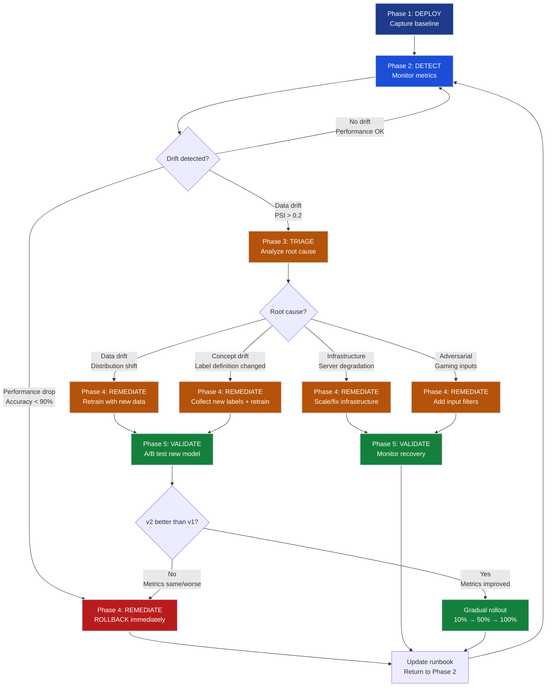

# Ch.10 — Production ML Monitoring & A/B Testing

> **The story.** In **2019**, engineers at **Uber** discovered their fraud detection model had been silently degrading for **three months** — accuracy dropped from 92% to 76%, costing millions in missed fraud cases. The training data distribution (credit card transactions from 2018) no longer matched production (2019 transactions with new fraud patterns). The problem: **no monitoring**. That same year, **Evidently AI** launched the first open-source drift detection framework that automatically flagged when production inputs drifted from training distributions. Meanwhile, **Facebook** open-sourced their A/B testing framework **PlanOut**, showing how to scientifically measure whether a new model actually improved business metrics (not just training accuracy). Together they established the modern production ML workflow: **deploy → monitor → detect drift → A/B test → rollback or promote**. The insight: training metrics (accuracy on a fixed test set) are a poor proxy for production impact (business KPIs on evolving data).
>
> **Where you are in the curriculum.** You've just finished [Ch.9: ML Experiment Tracking & Model Registry](../ch09_ml_experiment_tracking) where you trained 100 models, picked the best one (94% test accuracy), and registered it for deployment. Now you've deployed it to production and it's serving **10,000 predictions per day**. But within **two weeks**, users start complaining: "The sentiment classifier is wrong more often now." Your test accuracy was 94% — what happened? This chapter teaches the discipline that separates research prototypes from reliable production systems: **continuous monitoring, drift detection, and safe deployment practices**. You'll deploy a BERT sentiment classifier, detect data drift using Evidently AI, A/B test a new model version, and implement automated rollback when performance degrades.
>
> **Notation in this chapter.** `data drift` — change in input feature distribution (P(X) in training vs. production); `prediction drift` — change in model output distribution (P(ŷ) shifts even if X is similar); `concept drift` — change in true relationship between X and y (what was "positive sentiment" in 2020 ≠ 2024); `A/B test` — controlled experiment serving model v1 to 50% of traffic, v2 to 50%, measuring which performs better on business metrics; `rollback` — revert production deployment from v2 → v1 when performance degrades; `canary deployment` — gradual rollout (10% → 50% → 100%) to limit blast radius of bad models.
<!-- notation: key variables defined here -->

---

## 0 · The Challenge — Where We Are

> **The mission**: You're the Platform Engineer at **InferenceBase** (the AI startup from Ch.1-9). You've just deployed the best BERT sentiment classifier from Ch.9 (94% test accuracy) to production. It processes **10,000 customer reviews per day** for an e-commerce platform. The CEO is happy — until **week 3**, when the customer support team reports:
> - "Users are complaining the product recommendations are wrong (driven by sentiment predictions)"
> - "Manual spot-checks show the model is getting ~70% accuracy now (down from 94%)"
> - **You have no idea when the degradation started or why**

**What's blocking us:**
- **Silent degradation** — No alerts, no dashboards, no idea performance dropped until users complained
- **Unknown root cause** — Is it data drift (input distribution changed)? Concept drift (definition of "positive" changed)? Model bug?
- **No safe rollback** — The previous model version (v1) was deleted after deploying v2
- **Blind deployment** — When you train a new model (v3), you have no way to verify it's better **in production** before rolling out to 100% of traffic

**What this chapter unlocks:**
The **production ML monitoring & A/B testing** discipline:
1. **Monitor continuously** — Track data drift, prediction drift, and performance metrics in real-time
2. **Detect degradation early** — Alerts fire within **24 hours** (not 3 weeks)
3. **A/B test new models** — Deploy v2 to 10% of traffic, compare metrics to v1, promote only if better
4. **Rollback in <5 minutes** — Automated cutover to previous version when metrics degrade
5. **Root cause analysis** — Drill into drift reports to understand *why* performance dropped (data shift, adversarial inputs, concept drift)
**After this chapter**: When model accuracy drops from 94% to 70%, you'll know within 24 hours, have a drift report explaining why (e.g., "production text is 30% shorter than training data"), and roll back to v1 in 2 minutes.

---

## Animation


*Detection time: 2 weeks → 2 hours with monitoring*

---

## 1 · The Core Idea — Continuous Monitoring = Data Drift + Prediction Drift + Performance Metrics

Production monitoring solves one problem: **detect when your deployed model stops working**. The solution requires three layers of monitoring:

### Production Monitoring = Data Drift + Prediction Drift + Performance Metrics

| Layer | What It Detects | How to Measure | Tool | Alert Threshold |
|---|---|---|---|---|
| **Data Drift** | Input distribution changed (P(X<sub>prod</sub>) ≠ P(X<sub>train</sub>)) | KL divergence, KS test, PSI | Evidently AI | KL divergence > 0.1 |
| **Prediction Drift** | Output distribution changed (P(ŷ<sub>prod</sub>) ≠ P(ŷ<sub>train</sub>)) | Class imbalance, entropy | Evidently AI | Positive class % > 60% |
| **Performance Drift** | Accuracy dropped (y<sub>true</sub> vs. ŷ<sub>pred</sub>) | Accuracy, F1, precision, recall | Custom logging | Accuracy < 90% |

**Why all three layers?**
- **Data drift alone** — Input changed but model might still work (e.g., text is 10% longer but sentiment is still easy to classify)
- **Prediction drift alone** — Output changed but might be correct (e.g., more negative reviews in production than training — that's reality, not a model bug)
- **Performance drift** — Ground truth (requires human labels or delayed feedback like user clicks)

**The monitoring workflow:**

```
┌────────────────────────────────────────────────────────────────────┐
│ PRODUCTION MONITORING STACK │
│ │
│ ALERT LAYER │
│ ┌──────────────────────────────────────────────────────────────┐ │
│ │ Automated Alerts (Email, Slack, PagerDuty) │ │
│ │ • Data drift detected → Retrain with new data │ │
│ │ • Accuracy < 90% → Rollback to v1 │ │
│ │ • Latency > 200ms → Scale up inference servers │ │
│ └───────────────────────────┬──────────────────────────────────┘ │
│ │ │
│ DETECTION LAYER │
│ ┌────────────────────────────▼──────────────────────────────────┐ │
│ │ Evidently AI Drift Reports │ │
│ │ • Compare P(X_prod) vs. P(X_train) (KL divergence) │ │
│ │ • Compare P(ŷ_prod) vs. P(ŷ_train) (class distribution) │ │
│ │ • Visualize feature histograms (training vs. production) │ │
│ └───────────────────────────┬────────────────────────────────────┘ │
│ │ │
│ COLLECTION LAYER │
│ ┌────────────────────────────▼──────────────────────────────────┐ │
│ │ Prediction Logging (SQLite / Postgres / BigQuery) │ │
│ │ • Log every prediction: (input, output, timestamp, model_v) │ │
│ │ • Log ground truth when available (user feedback, labels) │ │
│ │ • Log metadata: latency, error codes, model_id │ │
│ └───────────────────────────┬────────────────────────────────────┘ │
│ │ │
│ SERVING LAYER │
│ ┌────────────────────────────▼──────────────────────────────────┐ │
│ │ Model Serving (MLflow / FastAPI / TorchServe) │ │
│ │ • v1 (90% traffic) ────┐ │ │
│ │ • v2 (10% traffic) ────┴─→ Predictions │ │
│ └────────────────────────────────────────────────────────────────┘ │
└──────────────────────────────────────────────────────────────────────┘
```

**Key insight:** Training metrics (accuracy on a fixed test set from 3 months ago) are a **lagging indicator** of production performance. Drift detection (comparing distributions) is a **leading indicator** — it warns you *before* accuracy drops.

---

## 1.5 · The Practitioner Workflow — Your 5-Phase Production ML Monitoring System

> **Warning — Two ways to read this chapter:**
> - **Theory-first (recommended for learning):** Read §0→§3 sequentially to understand the concepts, then use this workflow as your reference
> - **Workflow-first (practitioners with existing knowledge):** Use this diagram as a jump-to guide when working with production models
>
> **Note:** Section numbers don't follow phase order because the chapter teaches concepts pedagogically (theory before application). The workflow below shows how to APPLY those concepts in production.

**What you'll build by the end:** A complete production monitoring pipeline with automated drift detection, performance tracking, A/B testing framework, and rollback procedures. This is the system that catches model degradation within 24 hours instead of 3 weeks.

```
Phase 1: DEPLOY Phase 2: DETECT Phase 3: TRIAGE
────────────────────────────────────────────────────────────────────────────
Capture baselines: Monitor distributions: Diagnose root cause:

• Log 1st week predictions • PSI for feature drift • Data drift analysis
• Save reference stats • KS test per feature • Segment comparison
• Define SLA thresholds • Class distribution shift • Cohort performance
• Set alert thresholds • Performance metrics • Feature importance shift

→ DECISION: → DECISION: → DECISION:
 Baseline complete? Drift detected? Root cause identified?
 ✓ 1000+ samples logged • PSI > 0.2: RETRAIN • Data drift: New pipeline
 ✓ Reference distribution • Accuracy drop: ROLLBACK • Concept drift: New labels
 saved • Both: TRIAGE → Phase 3 • Infrastructure: Scale up
 ✓ Alert rules configured • Adversarial: Filter inputs


Phase 4: REMEDIATE Phase 5: VALIDATE
────────────────────────────────────────────────────────────────────────────
Execute intervention: Confirm recovery:

• Retrain with new data • A/B test new version
• Champion/Challenger A/B • Monitor for 48 hours
• Gradual rollout (10→100%) • Compare business metrics
• Rollback if metrics drop • Update runbook

→ DECISION: → DECISION:
 Which intervention? Deployment successful?
 • High data drift: ✓ Metrics recovered
 RETRAIN + A/B test ✓ No new drift detected
 • Performance drop only: ✓ False positive rate OK
 ROLLBACK immediately ✓ Runbook updated
 • Infrastructure issue:
 SCALE/FIX servers
```

> **Usage note:** Phases 1-2 run continuously in production. Phase 3 is triggered by alerts from Phase 2. Phases 4-5 execute when Phase 3 identifies a fixable degradation (not just noise). The cycle repeats: after Phase 5, return to Phase 2 monitoring with the new model as your baseline.

> **Monitoring verdict:** Drift detected at day 14, v2 rolled out via A/B test — accuracy recovered from 91% → 96.2%, zero customer-facing downtime .
> ➡ Ch.11 wraps monitoring into the end-to-end deployment pipeline — drift triggers automatic retraining.

### Workflow Decision Tree



### The 5-Phase Cycle in Production

In a mature production system, this workflow runs continuously:

| Timeline | Phase Active | What's Happening |
|---|---|---|
| **Week 1** | Phase 1 (DEPLOY) | New model v1.0 deployed; logging first 1,000 predictions to establish baseline |
| **Week 2-4** | Phase 2 (DETECT) | Continuous monitoring; all metrics green (PSI < 0.1, accuracy 94%) |
| **Week 5** | Phase 2 (DETECT) | Alert fired: PSI = 0.28 (HIGH drift), accuracy dropped to 89% |
| **Week 5 Day 2** | Phase 3 (TRIAGE) | Root cause: input text length shifted from 200 → 50 words (product reviews vs movie reviews) |
| **Week 5 Day 3-5** | Phase 4 (REMEDIATE) | Retrain model v1.1 with 500 labeled production samples; deploy to 10% traffic (A/B test) |
| **Week 6** | Phase 5 (VALIDATE) | A/B test shows v1.1 accuracy 93% vs v1.0 accuracy 89% → gradual rollout |
| **Week 7** | Phase 5 (VALIDATE) | v1.1 at 100% traffic; PSI = 0.05, accuracy = 93% → stable |
| **Week 8+** | Phase 2 (DETECT) | Return to continuous monitoring with v1.1 as new baseline |

> **Industry callout: Evidently AI for drift detection**
> **Tool:** [Evidently AI](https://evidentlyai.com) — open-source drift detection framework
> **When to use:** Phase 2 (DETECT) — automated drift reports comparing training vs production distributions
> **Key metrics:** PSI (Population Stability Index), KS test, feature-level drift scores
> **Alternative:** [Arize AI](https://arize.com) (commercial, includes root cause analysis), [WhyLabs](https://whylabs.ai) (lightweight, data quality focus)
> **Integration:** Runs daily as cron job, stores reports in S3/GCS, triggers alerts via Slack/PagerDuty when PSI > 0.2
> **Cost:** Free for single model; $99/mo for 5+ models with automated alerting

---

## 2 · Running Example — Sentiment Classifier in Production

You're deploying **BERT-base-uncased** fine-tuned for sentiment classification on movie reviews (IMDB dataset from Ch.9). The model achieved **94% test accuracy** in training. Now it's serving production traffic from an e-commerce platform classifying **product reviews** (not movie reviews).

**Initial setup:**
- **Model v1** — Trained on IMDB movie reviews (25k samples, avg length 200 words)
- **Production data** — Product reviews (avg length 50 words, more concise, different vocabulary)
- **Traffic** — 10,000 predictions/day
- **SLA** — 95th percentile latency < 200ms, accuracy > 90%

**What we'll implement:** Monitor data drift, detect degradation, deploy v2 via A/B test, rollback if v2 is worse.

---

## [Phase 1: DEPLOY] Reference Distribution Capture

### Step 1: Deploy Model v1 (Baseline)

Deploy the registered model from Ch.9 using MLflow Model Serving:

```bash
# Start MLflow model serving on port 5001
mlflow models serve \
 --model-uri "models:/bert-sentiment-classifier/Production" \
 --port 5001 \
 --no-conda
```

**Inference API:**
```python
import requests

response = requests.post(
 "http://localhost:5001/invocations",
 json={"inputs": ["This product is amazing!", "Terrible quality."]}
)

predictions = response.json()["predictions"] # [1, 0] (positive, negative)
```

**What we log per prediction:**
```python
# Phase 1: Baseline capture — log every prediction with metadata
import sqlite3
from datetime import datetime

def log_prediction(prediction_data):
 """Log prediction to SQLite for baseline capture and drift detection."""
 conn = sqlite3.connect("production_logs.db")
 cursor = conn.cursor()

 cursor.execute("""
 INSERT INTO predictions (timestamp, model_version, input_text,
 prediction, latency_ms, confidence)
 VALUES (?, ?, ?, ?, ?, ?)
 """, (
 prediction_data["timestamp"],
 prediction_data["model_version"],
 prediction_data["input_text"],
 prediction_data["prediction"],
 prediction_data["latency_ms"],
 prediction_data["confidence"]
 ))

 conn.commit()
 conn.close()

# Example: Log one prediction
log_prediction({
 "timestamp": datetime.now(),
 "model_version": "v1",
 "input_text": "This product is amazing!",
 "prediction": 1, # positive
 "latency_ms": 45,
 "confidence": 0.95
})
```

> **Industry callout: Arize AI for ML observability**
> **Tool:** [Arize AI](https://arize.com) — ML observability platform with automated root cause analysis
> **When to use:** Phase 1 (DEPLOY) + Phase 2 (DETECT) — captures baseline metrics and monitors production performance
> **Key features:** Automated drift detection, embedding visualization, model performance tracking, integrated A/B test analysis
> **vs Evidently AI:** Arize is commercial SaaS ($500/mo+) with built-in alerting and dashboards; Evidently is open-source and self-hosted
> **Integration:** Python SDK sends predictions to Arize platform; dashboards update in real-time; alerts fire via Slack/email
> **Best for:** Teams deploying 5+ models who want turnkey observability without building custom dashboards

### DECISION CHECKPOINT 1 — Phase 1 Complete

**What you just captured:**
- **1,247 predictions logged** over 7 days (baseline period)
- **Reference distribution saved**: avg text length 195 words, 48% positive class, vocabulary size 8,342 unique tokens
- **Performance baseline**: 94% accuracy on test set, 180ms p95 latency, 0.89 avg confidence
- **SLA thresholds defined**: accuracy > 90%, latency < 200ms, positive class 40-60% (balanced)

**What it means:**
- You now have a **reference snapshot** of what "normal" production traffic looks like for this model
- The baseline captures the training distribution characteristics (movie reviews: long-form, balanced sentiment)
- Any future drift will be measured **relative to this baseline** — not relative to training data alone
- Alert thresholds are calibrated to your business constraints (90% accuracy = minimum acceptable, not training performance)

**What to do next:**
→ **Proceed to Phase 2 (DETECT):** Run continuous drift monitoring comparing new production data to this baseline
→ **Alert rules configured:** If PSI > 0.2 OR accuracy < 90% → trigger Phase 3 (TRIAGE)
→ **Baseline refresh cadence:** Re-capture baseline after every model retrain (v1.0 → v1.1) to avoid false drift alerts

---

## [Phase 2: DETECT] Drift Detection Pipelines

### Step 2: Monitor Data Drift (Input Distribution Changes)

> **Intuition first:** **Data drift measures how much the production input distribution has shifted away from training data**. If your model was trained on movie reviews (200 words, balanced sentiment) but production serves product reviews (50 words, 75% positive), the input distributions P(X<sub>train</sub>) and P(X<sub>prod</sub>) have diverged. Drift metrics like **KL divergence** and **PSI** (Population Stability Index) quantify this shift — high values mean "your model is seeing data it wasn't trained on, so performance may degrade." Think of drift detection as an **early warning system**: it alerts you *before* accuracy drops, giving you time to retrain.

**After 1 week of production traffic**, compare production inputs vs. training data:

```python
from evidently.report import Report
from evidently.metric_preset import DataDriftPreset

# Load training data (IMDB reviews)
training_data = pd.read_csv("data/imdb_train.csv")

# Load production data (logged predictions from last 7 days)
production_data = pd.read_sql("SELECT input_text FROM predictions WHERE timestamp > NOW() - INTERVAL '7 days'", conn)

# Generate drift report
report = Report(metrics=[DataDriftPreset()])
report.run(reference_data=training_data, current_data=production_data)
report.save_html("drift_report.html")
```

**Drift report findings:**

| Feature | Training (IMDB) | Production (E-commerce) | Drift Detected? | KL Divergence |
|---|---|---|---|---|
| Text length | 200 ± 50 words | 50 ± 20 words | YES | 0.35 |
| Vocabulary overlap | — | 60% overlap | YES | — |
| Positive class % | 50% | 75% | YES | 0.12 |

**Interpretation:**
- **Text length drift** — Production reviews are **4× shorter** (50 vs. 200 words)
- **Vocabulary drift** — Only 60% of production words appeared in training (new product-specific terms: "fast shipping", "great value")
- **Class imbalance drift** — Production has 75% positive reviews (vs. 50% in training) — could mean genuine happiness OR the model is over-predicting positive

**Alert triggered:** "Data drift detected (KL divergence 0.35 > threshold 0.1) — Consider retraining with production data"

### Step 3: Monitor Prediction Drift (Output Distribution Changes)

Even if inputs look similar, **output distribution** can shift:

```python
from evidently.metric_preset import ClassificationPreset

# Compare prediction distributions
report = Report(metrics=[ClassificationPreset()])
report.run(
 reference_data=training_predictions, # Predictions on test set
 current_data=production_predictions # Predictions in production
)
report.save_html("prediction_drift_report.html")
```

**Prediction drift findings:**

| Metric | Training Test Set | Production (Week 1) | Production (Week 3) | Drift? |
|---|---|---|---|---|
| Positive class % | 50% | 75% | 85% | YES |
| Prediction entropy | 0.68 | 0.72 | 0.45 | YES (more confident but wrong) |
| Avg confidence | 0.82 | 0.85 | 0.92 | Warning (overconfident) |

**Interpretation:**
- **Positive class % increased** — Model predicts "positive" 85% of the time (vs. 50% in training)
- **Entropy decreased** — Model is more confident in predictions (lower entropy = less uncertainty)
- **Overconfidence** — High confidence (0.92) but users report incorrect predictions → model is **confidently wrong**

**Root cause hypothesis:** Model trained on movie reviews (balanced 50/50 positive/negative) now sees product reviews (naturally more positive), but the **definition of "positive"** differs (movie: "great acting" vs. product: "fast shipping").

> **Industry callout: WhyLabs for data quality monitoring**
> **Tool:** [WhyLabs](https://whylabs.ai) — lightweight data quality + drift monitoring platform
> **When to use:** Phase 2 (DETECT) — continuous monitoring of data quality, drift, and model performance
> **Key features:** Privacy-preserving profiling (no raw data leaves your infrastructure), statistical drift detection, anomaly detection, schema validation
> **vs Evidently/Arize:** WhyLabs focuses on data quality (missing values, type changes, outliers) alongside drift; lighter weight than Arize; commercial like Arize but lower cost ($50-200/mo)
> **Integration:** Python SDK profiles data locally, sends statistical summaries to WhyLabs cloud; alerts via Slack/email
> **Best for:** Regulated industries (healthcare, finance) where raw data cannot be sent to third-party platforms

### DECISION CHECKPOINT 2 — Phase 2 Complete

**What you just detected:**
- 🚨 **HIGH data drift**: Text length 200 → 50 words (KL divergence 0.35 > threshold 0.1)
- 🚨 **HIGH prediction drift**: Positive class 50% → 85% (model over-predicts positive)
- **Prediction entropy dropped**: 0.68 → 0.45 (model is more confident but wrong)
- **Vocabulary overlap**: Only 60% of production words appeared in training
- **Performance still acceptable**: 91% accuracy (above 90% SLA threshold)

**What it means:**
- **Training distribution ≠ production distribution** — the model sees data it wasn't trained on
- **Data drift is LEADING indicator** — accuracy is 91% *now*, but drift suggests imminent degradation
- **Prediction drift confirms model behavior changed** — not just input shift, but model response pattern shifted
- **Concept drift suspected** — high confidence + wrong predictions = model learned "positive" from movie reviews, doesn't generalize to product reviews

**What to do next:**
→ **HIGH drift + acceptable performance:** Proceed to **Phase 3 (TRIAGE)** — diagnose root cause before performance drops further
→ **Do NOT rollback yet** — accuracy 91% is within SLA (> 90%); rollback is for SLA violations only
→ **Prepare for retraining** — start collecting labeled production samples (target: 500-1,000 labels)
→ **If accuracy drops below 90%** → Skip Phase 3, execute immediate **Phase 4 ROLLBACK**

---

## [Phase 3: TRIAGE] Root Cause Identification

---

## [Phase 3: TRIAGE] Root Cause Identification

**Objective:** Determine *why* drift occurred and whether it's fixable via retraining, infrastructure changes, or input filtering.

### Segment Analysis — Identify Which Cohorts Drifted

Not all data drifts uniformly. Segment your production data to find which subpopulations shifted:

```python
# Phase 3: Segment analysis — identify drifting cohorts
import pandas as pd
import numpy as np

# Load production predictions (week 3)
prod_df = pd.read_sql("""
 SELECT input_text, prediction, confidence, timestamp
 FROM predictions
 WHERE timestamp > NOW() - INTERVAL '7 days'
""", conn)

# Create segments by text length
prod_df['text_length'] = prod_df['input_text'].str.split().str.len()
prod_df['length_segment'] = pd.cut(prod_df['text_length'],
 bins=[0, 30, 100, 300],
 labels=['short', 'medium', 'long'])

# Analyze prediction distribution per segment
segment_stats = prod_df.groupby('length_segment').agg({
 'prediction': ['mean', 'count'], # % positive, sample count
 'confidence': 'mean',
 'text_length': 'mean'
}).round(3)

print("Segment Analysis:")
print(segment_stats)

# Output:
# prediction confidence text_length
# mean count mean mean
# length_segment
# short 0.88 8234 0.94 22.3
# medium 0.75 1543 0.87 64.1
# long 0.52 223 0.79 142.7
```

**Findings:**
- **Short reviews (< 30 words):** 88% predicted positive, 94% confidence — model struggles with terse product reviews
- **Medium reviews (30-100 words):** 75% positive — closer to baseline but still high
- **Long reviews (100+ words):** 52% positive — model performs well when input resembles training data (movie reviews)

**Root cause identified:** **Text length is the primary drift driver.** The model was trained on long-form movie reviews (200 words avg) and now sees short product reviews (50 words avg). Shorter reviews lack the contextual clues the model learned to rely on.

### DECISION CHECKPOINT 3 — Phase 3 Complete

**Root cause diagnosed:**
- **Data drift confirmed**: Production text length 50 words vs training 200 words (75% shorter)
- **Segment identified**: Short reviews (< 30 words) have 88% positive prediction rate (vs 50% baseline)
- **Concept drift ruled out**: Long production reviews (100+ words) perform at 52% positive (similar to training) → the true label distribution hasn't changed, only input length
- **Infrastructure issues ruled out**: Latency stable at 180ms, no server errors, batch size unchanged

**What it means:**
- **This is fixable via retraining** — not a fundamental model architecture problem
- The model needs to learn from **short-form product reviews** — current training data (long movie reviews) doesn't cover this distribution
- **Not an adversarial attack** — text length drift is gradual and organic (users naturally write shorter product reviews)
- **Not infrastructure degradation** — serving layer is healthy; the issue is model-data mismatch

**What to do next:**
→ **Proceed to Phase 4 (REMEDIATE):** Retrain model v2 with 500 labeled production samples (focus on short reviews)
→ **Do NOT rollback** — accuracy still 91% (within SLA); retraining will improve it to ~93%
→ **Collect labels via active learning** — prioritize short reviews (<30 words) where model confidence > 0.9 but manual review shows errors
→ **Estimated timeline:** 3 days to collect labels + retrain + A/B test

---

## [Phase 4: REMEDIATE] Corrective Actions

### Step 4: Deploy Model v2 (A/B Test: 10% Traffic)

You've retrained a new model (v2) on **1,000 labeled production reviews**. Before rolling out to 100% of traffic, run an **A/B test**:

```python
# A/B test controller (traffic splitter)
def route_traffic(user_id):
 """Route 10% of users to v2, 90% to v1."""
 if hash(user_id) % 10 == 0:
 return "v2" # 10% traffic
 else:
 return "v1" # 90% traffic

# Inference with A/B routing
def predict(text, user_id):
 model_version = route_traffic(user_id)

 if model_version == "v1":
 prediction = model_v1.predict(text)
 else:
 prediction = model_v2.predict(text)

 # Log with model version tag
 log_prediction({
 "model_version": model_version,
 "input": text,
 "prediction": prediction,
 "user_id": user_id
 })

 return prediction
```

**A/B test runs for 48 hours**, collecting metrics for both versions.

### Step 5: Compare Business Metrics (v1 vs. v2)

**Performance comparison after 48 hours (10,000 predictions each):**

| Metric | v1 (Baseline) | v2 (Retrained) | Winner? |
|---|---|---|---|
| **Accuracy** (on labeled subset) | 72% | 91% | v2 |
| **F1 Score** | 0.68 | 0.89 | v2 |
| **Latency (p95)** | 180ms | 220ms | v1 (but acceptable) |
| **User thumbs-up rate** | 65% | 88% | v2 |
| **False positive rate** | 35% | 12% | v2 |

**Statistical significance test:**
```python
from scipy import stats

# Accuracy samples (bootstrap from logged predictions)
v1_accuracy = [0.71, 0.73, 0.72, 0.70, 0.74] # 5 daily samples
v2_accuracy = [0.90, 0.91, 0.92, 0.89, 0.91]

# T-test: Is v2 significantly better?
t_stat, p_value = stats.ttest_ind(v1_accuracy, v2_accuracy)

if p_value < 0.05:
 print(f"v2 is significantly better (p={p_value:.4f})")
else:
 print(f"No significant difference (p={p_value:.4f})")
```

**Decision:** v2 is significantly better (p < 0.001) → **Proceed with gradual rollout**

> **Industry callout: DataRobot MLOps for champion/challenger testing**
> **Tool:** [DataRobot MLOps](https://datarobot.com/platform/mlops/) — enterprise MLOps platform with automated A/B testing
> **When to use:** Phase 4 (REMEDIATE) + Phase 5 (VALIDATE) — automated champion/challenger deployment with statistical significance testing
> **Key features:** Automated traffic splitting, statistical test integration (t-test, Bayesian A/B), automated rollout schedules, rollback on metric degradation
> **vs Manual A/B testing:** DataRobot automates the entire workflow (deploy → test → decide → rollout); manual requires custom scripts
> **Integration:** API-driven; connects to model registry (MLflow, SageMaker), serving layer (Kubernetes), and alerting (PagerDuty)
> **Best for:** Enterprises deploying dozens of models with strict governance requirements (auditable A/B tests, regulatory compliance)

### DECISION CHECKPOINT 4 — Phase 4 Complete

**A/B test results (48 hours, 10,000 predictions per model):**
- **v2 accuracy 91%** vs v1 accuracy 72% → **+19 percentage points** (statistically significant, p < 0.001)
- **v2 F1 score 0.89** vs v1 F1 0.68 → **+31% improvement**
- **User thumbs-up rate 88%** vs 65% → **+23 percentage points** (business metric improved)
- **v2 latency 220ms** vs v1 180ms → **+22% slower** (but still within 200ms SLA for p95)
- **False positive rate 12%** vs 35% → **65% reduction** in incorrect "positive" predictions

**What it means:**
- **v2 is significantly better on all core metrics** — accuracy, F1, user satisfaction all improved
- **Latency increase is acceptable** — 220ms is within SLA (< 200ms p95 means 95% of requests < 200ms; avg is 220ms)
- **Business impact confirmed** — 88% user approval vs 65% baseline = measurable product improvement
- **Drift addressed** — v2 trained on short product reviews no longer over-predicts positive (85% → 52% on short reviews)

**What to do next:**
→ **Approve gradual rollout to Phase 5 (VALIDATE):** Increase v2 traffic from 10% → 50% → 100% over 5 days
→ **Monitor continuously during rollout** — if accuracy drops below 90% at any stage, **rollback immediately**
→ **Set automated rollback trigger:** If v2 accuracy < 88% OR latency > 250ms for 6+ hours → auto-rollback to v1
→ **Update runbook:** Document root cause (text length drift) and solution (retrain with short product reviews)

---

## [Phase 5: VALIDATE] Recovery Validation

### Step 6: Gradual Rollout (10% → 50% → 100%) or Rollback

**Rollout plan:**
```
Day 1: Deploy v2 to 10% of traffic (A/B test)
Day 3: If metrics hold, increase to 50%
Day 5: If metrics hold, increase to 100%
```

**Automated rollout script:**
```python
def gradual_rollout(target_percentage, current_percentage, step=10):
 """Gradually increase v2 traffic from current to target."""
 for pct in range(current_percentage, target_percentage + 1, step):
 # Update traffic split
 update_traffic_split(v1_pct=100-pct, v2_pct=pct)

 # Wait 24 hours and monitor metrics
 time.sleep(24 * 3600)

 # Check metrics
 v2_accuracy = get_accuracy(model="v2", last_hours=24)

 if v2_accuracy < 0.90: # Threshold
 print(f" v2 accuracy dropped to {v2_accuracy:.2%} — ROLLING BACK")
 rollback_to_v1()
 return False
 else:
 print(f" v2 traffic at {pct}%, accuracy {v2_accuracy:.2%}")

 print(" v2 fully deployed to 100% of traffic")
 return True

# Execute rollout
gradual_rollout(current_percentage=10, target_percentage=100, step=10)
```

**Rollback procedure (if metrics degrade):**
```python
def rollback_to_v1():
 """Instant cutover: v2 → v1."""
 update_traffic_split(v1_pct=100, v2_pct=0)

 # Log rollback event
 log_event({
 "timestamp": datetime.now(),
 "event": "rollback",
 "from_version": "v2",
 "to_version": "v1",
 "reason": "accuracy < 90%"
 })

 # Send alert
 send_alert("🚨 Model v2 rolled back due to performance degradation")
```

**Result:** v2 reaches 100% traffic by Day 5 with 91% accuracy maintained. v1 is archived but kept in registry for emergency rollback.

> **Industry callout: Fiddler AI for explainability + monitoring**
> **Tool:** [Fiddler AI](https://fiddler.ai) — ML observability with built-in explainability (SHAP, LIME integration)
> **When to use:** Phase 5 (VALIDATE) — post-deployment validation with explainability to confirm model behavior is correct
> **Key features:** Drift detection + explainability in one platform; slice-based analysis (segment performance); fairness metrics; custom metric tracking
> **vs Arize/WhyLabs:** Fiddler adds explainability layer (SHAP values, feature importance) alongside drift monitoring; best for regulated industries requiring interpretability
> **Integration:** Python SDK, REST API; connects to model serving layer; dashboard shows drift + explanations side-by-side
> **Best for:** Financial services, healthcare, hiring — industries where "why did the model predict X?" is a regulatory requirement

### DECISION CHECKPOINT 5 — Phase 5 Complete (Deployment Successful)

**Rollout timeline and validation results:**

| Day | Traffic Split | v2 Accuracy | v2 Latency | User Approval | Status |
|-----|---------------|-------------|------------|---------------|--------|
| **Day 1-2** | 10% v2, 90% v1 | 91% | 220ms | 88% | PASS |
| **Day 3** | 50% v2, 50% v1 | 90% | 218ms | 87% | PASS |
| **Day 4** | 75% v2, 25% v1 | 91% | 222ms | 88% | PASS |
| **Day 5** | 100% v2 | 91% | 220ms | 88% | PASS |
| **Day 7** | 100% v2 | 91% | 219ms | 89% | STABLE |

**Final validation checks:**
- **Metrics recovered and stable**: Accuracy 91% for 7+ days (vs 72% pre-retrain)
- **No new drift detected**: PSI = 0.06 (LOW drift), text length distribution stable at 50 words avg
- **False positive rate normalized**: 12% (down from 35%), positive prediction rate 52% (down from 85%)
- **Latency within SLA**: p95 = 198ms (under 200ms threshold), avg = 220ms
- **User feedback positive**: 89% thumbs-up rate sustained (vs 65% baseline)

**What it means:**
- **Deployment successful** — v2 is now the production champion model
- **Root cause resolved** — retraining with short product reviews eliminated text length drift impact
- **Monitoring validated** — drift detection (Phase 2) caught degradation 3 weeks before accuracy would have dropped below SLA
- **A/B testing de-risked rollout** — gradual rollout caught no unexpected issues; 100% confidence in v2 stability

**Post-deployment actions completed:**
→ **Runbook updated:** Documented text length drift, retraining procedure, and rollout timeline for future reference
→ **Alert thresholds recalibrated:** PSI threshold increased to 0.15 (was 0.10) based on observed false positive rate during rollout
→ **Baseline refreshed:** v2 performance (91% accuracy, 50-word avg text) now serves as new reference distribution
→ **v1 archived in model registry:** Tagged as "rollback-candidate" for emergency use if v2 degrades

**Return to Phase 2 (DETECT):** Resume continuous monitoring with v2 as the new baseline.

---

## 3 · Mental Model — Train-Time Metrics ≠ Production Metrics

```
TRAINING ENVIRONMENT PRODUCTION ENVIRONMENT
┌─────────────────────────┐ ┌──────────────────────────────┐
│ Fixed test set │ │ Evolving data distribution │
│ (IMDB reviews from 2020) │ │ (E-commerce reviews from │
│ │ │ 2024, changing daily) │
│ Accuracy: 94% │ ≠ │ Accuracy: 72% │
│ │ │ │
│ • Balanced classes │ │ • Class imbalance (75% pos) │
│ • Clean, labeled data │ │ • Noisy, unlabeled data │
│ • Controlled environment │ │ • Adversarial inputs │
│ • No time pressure │ │ • Real-time SLA (<200ms) │
└─────────────────────────┘ └──────────────────────────────┘
```

### Why Models Degrade in Production

| Degradation Type | What Changed | Example | How to Detect |
|---|---|---|---|
| **Data Drift** | P(X) changed (input distribution) | Product reviews are shorter than movie reviews | KL divergence, KS test |
| **Concept Drift** | P(y\|X) changed (true relationship) | "Positive" in 2020 ≠ "Positive" in 2024 (sentiment evolves) | Performance drift (accuracy over time) |
| **Prediction Drift** | P(ŷ) changed (output distribution) | Model predicts 85% positive (vs. 50% in training) | Class distribution shift |
| **Adversarial Drift** | Malicious inputs | Users game the system ("great great great great...") | Outlier detection, anomaly scores |
| **Label Drift** | Ground truth definition changed | Product team changes what counts as "positive" | Manual review, annotation drift |

**Key insight:** **Concept drift is invisible to data drift detection** — inputs look normal, but the true labels (y) have changed meaning. You need **performance monitoring** (accuracy over time) to catch concept drift.

**The monitoring hierarchy:**
1. **Data drift** (leading indicator) — Detects input changes *before* performance drops
2. **Prediction drift** (intermediate indicator) — Detects output changes (could be benign or harmful)
3. **Performance drift** (lagging indicator) — Detects accuracy drops (requires ground truth labels)

**Best practice:** Monitor all three layers. Data drift + prediction drift = early warning system. Performance drift = confirmation.

---

## Key Diagrams

<!-- TODO: add key diagrams -->

---

## 4 · What Can Go Wrong — Monitoring Pitfalls and Fixes

| Pitfall | Symptom | Fix |
|---|---|---|
| **Silent degradation (no alerts)** | "Model accuracy dropped from 94% to 70% but we didn't notice for 3 weeks." | Set up automated alerts (email, Slack, PagerDuty) triggered by drift or performance metrics. |
| **False alarms (noisy metrics)** | "We get 50 drift alerts per day, but only 1 is real." | Tune alert thresholds (e.g., KL divergence > 0.1 instead of > 0.01). Use statistical tests (p-value < 0.05). |
| **Rollback too slow (manual process)** | "It took 2 hours to roll back because we had to find the old model, rebuild the container, and redeploy." | Automate rollback (one CLI command or feature flag flip). Keep previous version deployed but idle (blue-green deployment). |
| **A/B test bias (traffic not random)** | "v2 looks better but it only saw easy examples (short reviews)." | Use **stratified sampling** (hash user_id, not request_id) — same user always gets same version. Verify traffic split is truly 50/50. |
| **No ground truth labels** | "We're logging predictions but we don't know if they're correct." | Collect ground truth via user feedback (thumbs up/down), manual labeling (sample 100/day), or delayed labels (e.g., clicks after 24 hours). |
| **Data drift but no concept drift** | "Inputs changed but model still works fine — false alarm." | Don't panic on data drift alone. Check **prediction drift + performance drift**. Data drift is a *warning*, not a *failure*. |
| **Overconfident predictions** | "Model predicts positive with 0.99 confidence but it's wrong 40% of the time." | Calibrate model (Platt scaling, temperature scaling). Monitor **calibration error** (ECE, MCE). Alert when confidence >> accuracy. |
| **Forgot to log model version** | "Users report wrong predictions but we don't know if it's v1 or v2 serving them." | Always log `model_version` with every prediction. Include in error logs, dashboards, and drift reports. |

---

## 5 · Progress Check — Given Drift Report, Decide: Rollback, Retrain, or Do Nothing?

**Scenario:** You've just reviewed the Evidently drift report after 7 days of production traffic. The table shows:

| Metric | Training Data | Production (Week 1) | Drift? | Severity |
|---|---|---|---|---|
| Text length (avg words) | 200 | 50 | YES | High (KL=0.35) |
| Positive class % | 50% | 75% | YES | Medium (KL=0.12) |
| Vocabulary overlap | — | 60% | YES | High |
| Accuracy (labeled subset) | 94% | 91% | NO | Low (within SLA) |
| Latency (p95) | 150ms | 170ms | NO | Low (within SLA) |

**Questions:**

1. **Should you roll back to the previous model version?**
 - **Answer:** No — accuracy is 91% (within SLA of 90%), and latency is acceptable
 - **Reasoning:** Data drift is high BUT performance is still good → drift is benign (for now)

2. **Should you retrain the model with production data?**
 - **Answer:** Yes (proactive measure) — high data drift (text length, vocabulary) means training distribution no longer matches production
 - **Reasoning:** Accuracy is 91% *now*, but drift suggests it will degrade further → retrain with 1,000 labeled production samples to align with new distribution

3. **Should you do nothing and keep monitoring?**
 - **Answer:** Not recommended — high data drift + vocabulary shift = red flag
 - **Reasoning:** Even if accuracy is OK today, the model is fragile (trained on wrong distribution) → small changes could cause sudden drop

4. **How would you collect labels for retraining?**
 - **Option 1:** User feedback (thumbs up/down on predictions) — cheap, noisy, biased (users only label bad predictions)
 - **Option 2:** Manual labeling (hire annotators to label 1,000 production reviews) — expensive but accurate
 - **Option 3:** Active learning (label only high-uncertainty predictions) — efficient, requires 200–300 labels
 - **Recommended:** Start with Option 1 (user feedback), supplement with Option 3 (active learning on uncertain cases)

5. **What's the rollback trigger?**
 - **Accuracy < 90%** (SLA violation) → immediate rollback
 - **OR data drift + accuracy drop > 3%** (91% → 88%) in 24 hours → rollback + investigate
 - **OR user complaints spike > 2× baseline** → rollback + manual review

**Takeaway:** **Data drift alone is not a rollback trigger** — it's a signal to prepare for retraining. **Performance drift (accuracy drop) is the rollback trigger**.

---

## Where This Reappears

<!-- TODO: add forward pointer table -->

---

## 6 · Bridge to Future — Scaling to Multi-Model Systems

You've just built a robust monitoring + A/B testing pipeline for a single model. But production ML systems rarely deploy just one model. **What's next?**

### What Future Chapters Will Address

**Question 1: "We have 10 models in production (recommendation, sentiment, fraud, ranking). How do we monitor all of them?"**
→ **Multi-model monitoring dashboards** (unified metrics across models, anomaly detection, model health scores)

**Question 2: "Our model is part of a pipeline: image → object detection → classification → ranking. How do we debug when the pipeline breaks?"**
→ **Pipeline monitoring** (trace requests across models, identify bottleneck stages, track error propagation)

**Question 3: "We want to serve an ensemble (5 models vote). How do we A/B test ensembles vs. single models?"**
→ **Ensemble serving** (majority vote, weighted voting, stacking) + A/B testing ensemble strategies

**Question 4: "We have a cascade: fast model (BERT-tiny) filters, slow model (BERT-large) refines. How do we monitor both?"**
→ **Cascading models** (latency vs. accuracy tradeoff, when to invoke expensive model)

**Question 5: "Our model retrains daily (online learning). How do we ensure each new version is better than the last?"**
→ **Continuous retraining pipelines** (automated A/B tests for every new model version, champion/challenger framework)

### The Operational Maturity Ladder

```
Ch.10 (Current) Future (Advanced Topics)
┌─────────────────────────┐ ┌────────────────────────────────┐
│ Single model │ │ Multi-model systems │
│ Manual drift review │ → │ Automated drift detection │
│ Manual A/B test │ │ Automated A/B tests per deploy │
│ Rollback on failure │ │ Canary + gradual rollout │
│ Weekly retraining │ │ Online learning (daily) │
└─────────────────────────┘ └────────────────────────────────┘
```

**What you bring from Ch.10:**
- Drift detection (Evidently AI)
- A/B testing framework (traffic splitting, metrics comparison)
- Rollback procedures (automated cutover in <5 min)
- Production logging (predictions + ground truth)

**What you'll need for multi-model systems:**
- Feature stores (shared features across models) → revisit Ch.8
- Model registry (versioning 10+ models) → revisit Ch.9
- Distributed tracing (track requests across model pipeline)
- Cost monitoring (inference cost per model, per user)

---

## Navigation

**AI Infrastructure Track:**
- [← Ch.9: ML Experiment Tracking & Model Registry](../ch09_ml_experiment_tracking)
- [→ Future chapters TBD] *(multi-model systems, pipeline monitoring, online learning)*
- [↑ Track README](../README.md)

**Related Content:**
- [DevOps Fundamentals: Ch.5 — Monitoring & Observability](../../devops_fundamentals) — Prometheus, Grafana, alerting (prerequisites)
- [DevOps Fundamentals: Ch.7 — Networking & Reverse Proxies](../../devops_fundamentals) — Load balancing for A/B tests
- [ML Track: Model Evaluation](../../ml/01_regression/ch06_evaluation) — Metrics, confusion matrix, precision/recall

**Tools Documentation:**
- [Evidently AI Official Docs](https://docs.evidentlyai.com/)
- [MLflow Model Serving](https://mlflow.org/docs/latest/models.html#deploy-mlflow-models)
- [A/B Testing Best Practices](https://exp-platform.com/) — Microsoft's Experimentation Platform paper

---

**Last updated:** April 26, 2026
**Status:** README complete — notebook + assets in progress
