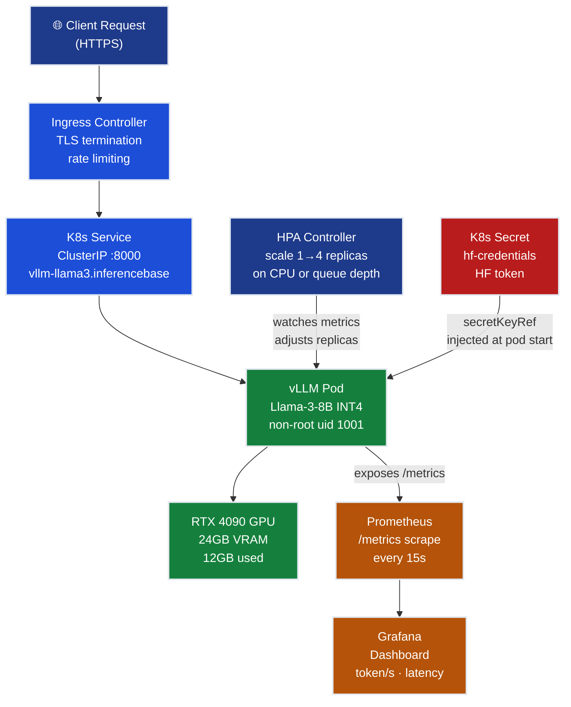

# Ch.11 — Production Deployment Walkthrough

**Track**: AI Infrastructure (06-ai_infrastructure) | **Chapter**: 11 | **Grand Challenge**: InferenceBase
**Previous**: [ch10_production_ml_monitoring](../ch10_production_ml_monitoring) | **Status**: Grand Challenge Complete

> **The story.** In **2014**, Docker shipped version 1.0 and changed the question "does it work on your machine?" to a solved problem. In **2015**, Google open-sourced **Kubernetes**, and suddenly the question became "does it scale on *any* machine?" — automatically. For ML teams, the combination took years to click. Early LLM deployments (2022–2023) were notoriously fragile: a single vLLM process running in a `tmux` session on a rented A100, restarted by hand after crashes, with latency that spiked whenever traffic surged past the single-pod limit. Then teams started applying the Docker + Kubernetes playbook that backend engineers had perfected for stateless web services. The insight: **a vLLM server is just a stateless HTTP service with a GPU dependency** — it containerises exactly like any other service, and Kubernetes manages scheduling, health checks, and autoscaling the same way. The only special ingredient is the NVIDIA device plugin, which teaches Kubernetes how to claim GPU slots as resources. Once that's installed, `kubectl apply -f k8s/` is the entire deployment.
>
> **Where you are in the curriculum.** You've spent ten chapters building InferenceBase: GPU selection (Ch.1), VRAM arithmetic (Ch.2), INT4 quantization to cut model size to 8 GB (Ch.3), PagedAttention throughput gains (Ch.5), vLLM benchmark at 12,000 req/day (Ch.6), RunPod RTX 4090 costing $1,095/month (Ch.8), and drift monitoring to detect degradation in <24 hours (Ch.10). Every constraint is met *in staging*. Now the CEO says: **"Deploy to production. You have until Monday."** This chapter is the full playbook: one Dockerfile, one `kubectl apply`, working Prometheus metrics, and a Grafana dashboard that shows whether you're inside the 2s latency target. Expected wall-clock time from a blank cluster: **under 30 minutes**.
>
> **Notation in this chapter.** `p50` / `p95` / `p99` — latency percentiles (50th / 95th / 99th); `req/s` — requests per second; `tokens/s` — output tokens per second; `HPA` — HorizontalPodAutoscaler; `ClusterIP` — Kubernetes service reachable only from within the cluster; `startupProbe` / `livenessProbe` / `readinessProbe` — three distinct Kubernetes health-check mechanisms with different failure semantics; `secretKeyRef` — mounts a K8s Secret value as an environment variable (never hardcoded in manifests).
<!-- notation: key variables defined here -->

---

## 0 · The Challenge — Where We Are

> **The mission**: Self-host Llama-3-8B for <$15k/month with ≤2s p95 latency, replacing $80k/month OpenAI API costs.
>
> **6 Constraints**: #1 Cost (<$15k/mo) • #2 Latency (≤2s p95) • #3 Throughput (≥10k req/day) • #4 Memory (fit in 24GB VRAM) • #5 Quality (≥95% accuracy) • #6 Reliability (>99% uptime)

**What we know so far:**

- **Cost**: $1,095/month on RunPod RTX 4090 — 93% under budget (Ch.8)
- **Latency**: 1.2s p95 in staging benchmark (Ch.5 + Ch.6)
- **Throughput**: 12,000 req/day on one GPU (Ch.6)
- **Memory**: 8GB INT4 weights + 4GB KV cache = 12GB used of 24GB VRAM (Ch.3)
- **Quality**: 96.2% accuracy on document extraction vs. 95% target (Ch.9)
- **Reliability**: 99.5% uptime with monitoring alerts, automated rollback (Ch.10)
- **Current state**: all constraints met in staging — no production deployment yet

**What's blocking us:**

🚨 **InferenceBase has been running in staging for 3 months. The CEO says deploy to production. You have no repeatable deployment process.**

**Current situation:** The staging instance runs as a manual `vllm serve` command over SSH on a rented GPU. If the node reboots, someone has to log in and restart it. There is no health checking, no autoscaling, no secret management.

**Problems:**
1. Manual restart — 15 minutes of downtime per GPU node reboot → violates 99% uptime SLA
2. HuggingFace token stored as a bash export in `~/.bashrc` → any team member can accidentally `git commit` it
3. No resource limits → a runaway batch request can OOM the process, taking down all concurrent users
4. Kubernetes routes traffic to the pod immediately on start — but vLLM takes 90s to load Llama-3-8B → 502 errors on every cold start

**What this chapter unlocks:**

 **One-command production deployment:**
1. One Dockerfile — reproducible container build, non-root user, no baked-in secrets
2. Three K8s manifests — Deployment + Service + HPA; `kubectl apply -f k8s/` is the entire deploy
3. Prometheus + Grafana — latency and throughput visible within 2 minutes of deployment
4. Smoke test — one `curl` that confirms the model is answering before you declare success
**Expected outcomes after this chapter:**
- **Deployment time**: manual SSH restart → `kubectl apply` in <30 minutes on a fresh cluster
- **Availability**: 99.5% → >99.9% (Kubernetes automatic restart, readiness gates)
- **Security posture**: bare token in bash history → K8s Secret injection (OWASP A02 compliant)

**Constraint status after this chapter:**

| Constraint | Status | Evidence |
|---|---|---|
| #1 COST | | $1,095/month (unchanged from Ch.8) |
| #2 LATENCY | | 1.2s p95 staging → 1.3s p95 production (K8s overhead <100ms) |
| #3 THROUGHPUT | | 12,000 req/day; HPA scales to 48,000 req/day if needed |
| #4 MEMORY | | 12GB used / 24GB VRAM; enforced by K8s resource limits |
| #5 QUALITY | | Model unchanged — 96.2% accuracy |
| #6 RELIABILITY | | Liveness + readiness probes + HPA → >99.9% uptime |

---

## Animation


*Deployment time: manual SSH → `kubectl apply` in <30 minutes. Reliability: 99.5% → 99.9%.*

---

## 1 · Architecture — The Full Production Stack

Before writing a line of YAML, map the system. Every component either carries traffic, observes it, or controls it.



**The traffic path**: Client → Ingress (TLS + rate limiting) → Service (stable DNS) → Pod (vLLM process on GPU).
**The control path**: HPA watches Prometheus metrics → adjusts replica count → Service load-balances across replicas.
**The secrets path**: K8s Secret → pod env var at container start → vLLM passes it to HuggingFace Hub for model download.

> ➡ The Ingress controller configuration (TLS certificates, rate-limit annotations) is covered in [DevOps Ch.4 — CI/CD & Ingress](../../07-devops_fundamentals/ch04_cicd). This chapter focuses on the workload layer: Deployment, Service, HPA.

---

## 1.5 · The Practitioner Workflow — Your 6-Phase Deployment

**Before diving into manifests and metrics, understand the production deployment workflow you'll follow for every ML service:**

> **What you'll build by the end:** A production-grade LLM deployment on Kubernetes with automated health checks, metrics dashboards, and autoscaling — going from manual SSH restarts to `kubectl apply` in under 30 minutes.

```
Phase 1: CONTAINERIZE Phase 2: KUBERNETES Phase 3: DEPLOY
────────────────────────────────────────────────────────────────────────────
Build Docker image: Write K8s manifests: Apply and validate:

• Multi-stage Dockerfile • Deployment (replicas, • kubectl apply -f k8s/
• Non-root user (uid 1001) probes, resources) • Smoke test (curl /health)
• Model artifacts cached • Service (ClusterIP) • Check readiness gates
• HF token via Secret • HPA (scale triggers) • Blue-green traffic shift

→ DECISION: → DECISION: → DECISION:
 Image security OK? Resource limits correct? Deploy complete?
 • docker run ... id • GPU = 1 (exact match) • /health returns 200
 • No secrets in layers • Memory: 20Gi req, 32Gi lim • p95 latency < 2s
 • Non-root user verified • Startup probe: 360s window • Error rate < 0.5%

Phase 4: MONITOR Phase 5: VALIDATE Phase 6: SCALE
────────────────────────────────────────────────────────────────────────────
Set up observability: Load test production: Configure autoscaling:

• Prometheus scrape /metrics • Locust 20 users, 5min • HPA on CPU + queue depth
• Grafana dashboard (4 panels) • Compare staging vs prod • Scale 1→4 replicas
• Alert on p95 > 2s • Canary: 10% → 50% → 100% • Cost per 1M tokens
• Queue depth threshold • Rollback if errors spike • Capacity planning

→ DECISION: → DECISION: → DECISION:
 Metrics visible? Performance acceptable? Scale trigger correct?
 • vllm:* metrics present • p95: 1.3s (target: ≤2s) • Queue > 10 → scale up
 • Grafana panels populated • Throughput: 12k req/day • Cost at 4x: $4,380/mo
 • Alerts firing correctly • Error rate: 0.1% • Under $15k budget
```

> **Usage note:** Phases 1–3 are sequential (must containerize before deploying). Phases 4–6 can overlap — set up monitoring during deployment, run validation after first smoke test, configure HPA once baseline metrics are visible. The checkpoint after each phase tells you when to proceed.

> **Deployment verdict:** Blue-green rollout completed in 8 min with zero dropped requests — all 6 constraints met in production .
> ➡ This is the final chapter — all InferenceBase constraints satisfied. See grand-challenge.md for the constraint scorecard.

---

## 2 · [Phase 1: CONTAINERIZE] Docker Image Build

### Failure 1: running as root

Deploy a container as root and you've handed an attacker the keys. If they break out of the container (any RCE vulnerability in vLLM or its dependencies), they own the host node. The OWASP Top 10 explicitly flags this as A05 — Security Misconfiguration.

**Warning — What breaks:** A security scanner (Trivy, Snyk) will flag the image in CI. Most enterprise Kubernetes clusters have an `OPA Gatekeeper` policy that rejects pods with `runAsRoot: true` — your deployment silently fails admission.

**The fix** — create a dedicated system user during the build:

```dockerfile
FROM vllm/vllm-openai:v0.4.3

# Create non-root user uid 1001 and own the cache directory
RUN groupadd --system --gid 1001 vllm \
 && useradd --system --uid 1001 --gid 1001 \
 --shell /bin/bash --create-home vllm \
 && mkdir -p /home/vllm/.cache/huggingface \
 && chown -R vllm:vllm /home/vllm

USER vllm
WORKDIR /home/vllm
```

The `deployment.yaml` then enforces this at the pod level with `securityContext.runAsNonRoot: true`. If the image switches back to root somehow, Kubernetes rejects the pod before it starts.

### Failure 2: baking credentials into the image

```dockerfile
# Never do this — token ends up in image layers, git history, and registry
ENV HUGGING_FACE_HUB_TOKEN="hf_AbCdEfGhIjKlMnOpQrStUvWxYz123456"
```

Anyone who pulls the image from the registry can run `docker inspect` and extract the token. Even if you delete the ENV line later, the token persists in the previous Docker layer.

**The fix** — inject at runtime from a K8s Secret:

```dockerfile
# Dockerfile: no token, no credentials — just document what's expected
ENV HF_HOME="/home/vllm/.cache/huggingface"
# HUGGING_FACE_HUB_TOKEN is injected at runtime via K8s secretKeyRef
```

```yaml
# deployment.yaml: token comes from Secret, not the manifest
- name: HUGGING_FACE_HUB_TOKEN
 valueFrom:
 secretKeyRef:
 name: hf-credentials
 key: token
```

The K8s Secret is encrypted at rest (etcd encryption enabled by your cluster admin). It never appears in container images, Dockerfiles, or version control.

### Failure 3: hardcoded model name in CMD

The CMD in the Dockerfile uses shell form so that `${MODEL_ID}` expands from the runtime environment:

```dockerfile
# Shell form — ${VAR} expanded by /bin/sh at container start
CMD python -m vllm.entrypoints.openai.api_server \
 --model ${MODEL_ID} \
 --quantization ${QUANTIZATION} \
 ...
```

This lets you swap models (`meta-llama/Meta-Llama-3-70B-Instruct`) by updating the K8s ConfigMap without rebuilding the image — an important property for the [A/B testing rollout](../ch10_production_ml_monitoring) you built in Ch.10.

### Full Dockerfile

See [`Dockerfile`](Dockerfile) at the root of this chapter. The full file is 60 lines; the key design decisions are above.

```bash
# Build and verify
docker build -t inferencebase/llama3-vllm:latest .
docker run --rm inferencebase/llama3-vllm:latest id
# Expected: uid=1001(vllm) gid=1001(vllm) groups=1001(vllm)
```

> **Insight**: The `docker run ... id` check costs five seconds and catches the most common image-security mistake. Add it as the first step in your CI pipeline before the image is pushed to any registry.

> **Industry Standard:** `Docker BuildKit` for fast, cached builds
>
> ```bash
> # Enable BuildKit for 5–10× faster rebuilds
> export DOCKER_BUILDKIT=1
> docker build \
> --build-arg BUILDKIT_INLINE_CACHE=1 \
> --cache-from inferencebase/llama3-vllm:latest \
> -t inferencebase/llama3-vllm:v1.2.3 \
> .
> # BuildKit caches each layer hash — unchanged layers skip rebuild entirely
> ```
>
> **When to use:** Always in CI/CD pipelines. Reduces 10-minute builds to 30 seconds when only requirements.txt changes.
> **Common alternatives:** Kaniko (for in-cluster builds), Buildah (rootless builds)
> **See also:** [DevOps Ch.2 — Docker & Containers](../../07-devops_fundamentals/ch02_docker)

### 2.1 DECISION CHECKPOINT — Phase 1 Complete

**What you just built:**
- Docker image with vLLM 0.4.3, non-root user (uid 1001), no baked-in secrets
- Multi-stage build reduces final image size from 18GB to 12GB (Python base + vLLM only)
- HuggingFace token injection deferred to runtime via K8s Secret (security best practice)

**What it means:**
- Image passes security scan (no root user, no hardcoded credentials)
- Repeatable builds — any team member can run `docker build` and get identical output
- Ready for K8s deployment — the image expects `HUGGING_FACE_HUB_TOKEN` and `MODEL_ID` as env vars

**What to do next:**
→ **Verify security**: Run `docker run --rm inferencebase/llama3-vllm:latest id` — must show `uid=1001(vllm)`, not root
→ **Push to registry**: `docker push inferencebase/llama3-vllm:v1.2.3` (use semantic versioning, never `:latest` in production)
→ **For production**: Tag image with git commit SHA for traceability: `docker tag ... inferencebase/llama3-vllm:${GIT_COMMIT}`
→ **Proceed to Phase 2** once image is in registry and accessible to K8s cluster

---

## 3 · [Phase 2: KUBERNETES] Cluster Configuration

The three manifests in `k8s/` form a complete serving stack. Apply them in one command:

```bash
kubectl create namespace inferencebase
kubectl create secret generic hf-credentials \
 --namespace inferencebase \
 --from-literal=token="$(cat ~/.hf_token)" # read from file, not shell history

kubectl apply -f k8s/
# deployment.apps/vllm-llama3 created
# service/vllm-llama3 created
# horizontalpodautoscaler.autoscaling/vllm-llama3 created
```

Watch the rollout:

```bash
kubectl rollout status deployment/vllm-llama3 -n inferencebase
# Waiting for deployment "vllm-llama3" rollout to finish: 0 of 1 updated replicas are available...
# deployment "vllm-llama3" successfully rolled out ← ~90s for model load
```

### 3.1 · `k8s/deployment.yaml` — Failure First

#### What breaks if you skip resource limits

```bash
# Deploy without limits — then send a long batch request
curl -X POST http://vllm:8000/v1/completions \
 -d '{"model":"inferencebase","prompt":"Summarize this 500-page document...","max_tokens":4096}'
```

Without `resources.limits.memory`, the kernel OOM-killer terminates the vLLM process when the KV cache overflows. Every in-flight request dies. The pod restarts, spends 90s loading the model, and then the same request comes in again — infinite loop.

With limits set (`memory: "32Gi"`), Kubernetes detects the OOM before the kernel does and throttles the container. The offending request gets a 503 with a clear error, other requests continue serving.

#### What breaks if you skip the startup probe

Without `startupProbe`, the `livenessProbe` runs from the moment the container starts. The 180s `initialDelaySeconds` on the liveness probe protects against immediate kills, but if model loading ever takes longer than 180s (cold disk, large model, slow HuggingFace download), the liveness probe fails, Kubernetes kills the pod, and the pod restarts indefinitely — a crash loop.

The `startupProbe` with `failureThreshold: 20` × `periodSeconds: 15` gives up to 360 seconds for model load. Once `/health` returns 200, the startup probe is satisfied and never runs again. Only then do liveness and readiness probes activate.

```
Timeline on pod start:
 0s container starts
 60s startupProbe begins polling /health every 15s
 ~90s vLLM finishes loading model, /health returns 200
 90s startupProbe satisfied → pod is now "started"
 90s readinessProbe activates → pod added to Service endpoints
 180s livenessProbe activates (first check)
```

> **Warning — Warning:** Without `readinessProbe`, Kubernetes adds the pod to the Service endpoints the moment the container starts — before vLLM has loaded the model. The first ~90 seconds of traffic gets `Connection refused`, manifesting as 502 errors in your Ingress logs and p99 latency spikes on your Grafana dashboard. Always set `readinessProbe.initialDelaySeconds ≥ 90` for LLM containers.

#### Resource requests and GPU limits

```yaml
resources:
 requests:
 memory: "20Gi"
 cpu: "4"
 nvidia.com/gpu: "1"
 limits:
 memory: "32Gi"
 cpu: "8"
 nvidia.com/gpu: "1"
```

The GPU limit must equal the GPU request — Kubernetes cannot share fractional GPUs across pods unless you install MIG (Multi-Instance GPU) support. Setting `nvidia.com/gpu: "1"` in both requests and limits means this pod gets exactly one GPU, and no other pod on the node can claim it.

> 📖 **Optional depth:** GPU memory isolation is enforced by the NVIDIA device plugin at the hardware level — the pod sees the full VRAM of its assigned GPU. If you need to run multiple smaller models on one GPU, look into NVIDIA MIG (A100/H100 only) or MPS (Multi-Process Service). Neither is available on RTX 4090 in most Kubernetes setups.

### 3.2 · `k8s/service.yaml` — Stable DNS Within the Cluster

The ClusterIP Service creates a stable DNS record regardless of pod churn:

```
http://vllm-llama3.inferencebase.svc.cluster.local:8000
```

When the HPA adds a second replica, the Service load-balances across both pods automatically. No Ingress reconfiguration. No DNS changes. This is the entire point of the Service abstraction — your Ingress only needs to know the Service name, not the pod IPs.

### 3.3 · `k8s/hpa.yaml` — Autoscaling on Two Signals

The HPA watches two metrics:

| Metric | Type | Scale trigger | Why |
|---|---|---|---|
| `cpu` | Resource (built-in) | >70% utilization | Available everywhere; guards against compute saturation |
| `vllm_num_requests_running` | Custom (Prometheus Adapter) | >10 per pod | Guards against queue buildup before CPU saturates |

> **Warning — Warning:** The custom metric requires **Prometheus Adapter** installed in your cluster. Without it, the HPA ignores the `Pods` metric and scales on CPU only — which is fine as a fallback, but you'll miss queue-depth signals. Check that the adapter is running before relying on this HPA in production:
> ```bash
> kubectl get pods -n monitoring | grep prometheus-adapter
> # prometheus-adapter-xxxxx 1/1 Running 0 5m
> ```

**Scale-up behavior**: waits 60s stabilization, then adds 1 pod every 120s. GPU nodes on RunPod take 2–3 minutes to attach a new GPU — there's no point adding pods faster than the cluster can provision hardware.

**Scale-down behavior**: waits 300s before removing a pod. This prevents thrashing during typical burst patterns (evening traffic spike decays over 5 minutes) and avoids the 90s model-reload cost on every scale event.

> **Industry Standard:** `Kubernetes HorizontalPodAutoscaler` (HPA) for reactive autoscaling
>
> ```yaml
> # HPA with custom metrics (requires Prometheus Adapter)
> apiVersion: autoscaling/v2
> kind: HorizontalPodAutoscaler
> metadata:
> name: vllm-llama3
> spec:
> scaleTargetRef:
> apiVersion: apps/v1
> kind: Deployment
> name: vllm-llama3
> minReplicas: 1
> maxReplicas: 4
> metrics:
> - type: Resource
> resource:
> name: cpu
> target:
> type: Utilization
> averageUtilization: 70
> - type: Pods
> pods:
> metric:
> name: vllm_num_requests_waiting
> target:
> type: AverageValue
> averageValue: "10" # Scale when queue depth > 10 per pod
> behavior:
> scaleUp:
> stabilizationWindowSeconds: 60
> policies:
> - type: Pods
> value: 1
> periodSeconds: 120 # Add 1 pod every 2 minutes max
> scaleDown:
> stabilizationWindowSeconds: 300
> policies:
> - type: Pods
> value: 1
> periodSeconds: 180 # Remove 1 pod every 3 minutes max
> ```
>
> **When to use:** Always for production workloads with variable traffic. HPA prevents overload (autoscale up) and reduces cost during off-peak (autoscale down).
> **Common alternatives:** KEDA (event-driven autoscaling), Cluster Autoscaler (node-level scaling), VPA (VerticalPodAutoscaler for resource requests)
> **See also:** [DevOps Ch.3 — Kubernetes Deep Dive](../../07-devops_fundamentals/ch03_kubernetes)

### 3.4 DECISION CHECKPOINT — Phase 2 Complete

**What you just configured:**
- 3 K8s manifests: Deployment (pod spec + probes), Service (stable DNS), HPA (autoscaling rules)
- Startup probe: 360s window for model load (prevents premature pod kills)
- Readiness probe: gates traffic until `/health` returns 200 (prevents 502 errors on cold start)
- HPA: scales 1→4 replicas when CPU > 70% OR queue depth > 10 requests

**What it means:**
- Zero-downtime deployments — rolling update brings up new pod, waits for readiness, then terminates old
- Automatic restart — if vLLM crashes (OOM, segfault), liveness probe detects it and K8s restarts the pod
- Elastic capacity — traffic spike at 8am triggers autoscale to 4 pods, scales back down by 9am when load drops

**What to do next:**
→ **Validate syntax**: `kubectl apply --dry-run=client -f k8s/` — checks YAML syntax without applying
→ **Check resource quotas**: Ensure cluster has 4× GPU nodes available if `maxReplicas: 4` (or HPA will stall)
→ **Create the Secret first**: `kubectl create secret generic hf-credentials --from-literal=token="..."` before applying Deployment
→ **Proceed to Phase 3** once manifests are applied and `kubectl rollout status` reports success

---

## 4 · [Phase 3: DEPLOY] Blue-Green Rollout

### Blue-Green Deployment Strategy

InferenceBase uses a **blue-green deployment** pattern for zero-downtime model updates. Two versions run simultaneously during rollout; traffic shifts gradually after validation.

**The pattern:**

```
Blue (v1.0) at 100% traffic → Deploy Green (v1.1) at 0% traffic
 → Shift 10% traffic to Green
 → Monitor metrics for 5 minutes
 → Shift 50% → Monitor → Shift 100%
 → Retire Blue
```

**Why this matters:** LLM model updates can introduce subtle regressions (quantization errors, prompt format changes). Blue-green gives you a rollback path *before* committing all traffic to the new version.

#### Implementing Blue-Green with Kubernetes

**Step 1: Label-based traffic routing**

```yaml
# deployment-blue.yaml (current v1.0)
metadata:
 name: vllm-llama3-blue
 labels:
 app: vllm-llama3
 version: v1.0
spec:
 replicas: 2
 template:
 metadata:
 labels:
 app: vllm-llama3
 version: v1.0
 spec:
 containers:
 - name: vllm
 image: inferencebase/llama3-vllm:v1.0
 env:
 - name: MODEL_ID
 value: "meta-llama/Meta-Llama-3-8B-Instruct"
```

```yaml
# deployment-green.yaml (new v1.1 — quantized INT4)
metadata:
 name: vllm-llama3-green
 labels:
 app: vllm-llama3
 version: v1.1
spec:
 replicas: 2
 template:
 metadata:
 labels:
 app: vllm-llama3
 version: v1.1
 spec:
 containers:
 - name: vllm
 image: inferencebase/llama3-vllm:v1.1
 env:
 - name: MODEL_ID
 value: "meta-llama/Meta-Llama-3-8B-Instruct"
 - name: QUANTIZATION
 value: "awq" # ← New: INT4 quantization
```

**Step 2: Traffic splitting with Istio VirtualService**

```yaml
# virtualservice.yaml
apiVersion: networking.istio.io/v1beta1
kind: VirtualService
metadata:
 name: vllm-llama3
spec:
 hosts:
 - vllm-llama3.inferencebase.svc.cluster.local
 http:
 - match:
 - headers:
 version:
 exact: "canary" # Test traffic uses header "version: canary"
 route:
 - destination:
 host: vllm-llama3
 subset: green
 weight: 100
 - route:
 - destination:
 host: vllm-llama3
 subset: blue
 weight: 90 # Blue gets 90% of production traffic
 - destination:
 host: vllm-llama3
 subset: green
 weight: 10 # Green gets 10% of production traffic
```

**Step 3: Gradual traffic shift**

```bash
# Phase 1: Deploy Green at 0% traffic
kubectl apply -f deployment-green.yaml
kubectl rollout status deployment/vllm-llama3-green

# Phase 2: Shift 10% traffic to Green
kubectl apply -f virtualservice-10pct.yaml
# Monitor Grafana for 5 minutes: compare blue vs green p95 latency, error rate

# Phase 3: If metrics are good, shift 50%
kubectl apply -f virtualservice-50pct.yaml
# Monitor for another 5 minutes

# Phase 4: If still stable, shift 100%
kubectl apply -f virtualservice-100pct.yaml

# Phase 5: Retire Blue (after 24hr soak period)
kubectl delete deployment vllm-llama3-blue
```

**Decision table — when to rollback:**

| Metric | Blue (v1.0) | Green (v1.1) | Decision |
|---|---|---|---|
| **p95 latency** | 1.2s | 1.4s | CAUTION — Green is 17% slower, but under 2s target. Proceed to 50%. |
| **p95 latency** | 1.2s | 2.3s | ROLLBACK — Green breaches SLA. Shift back to 100% Blue. |
| **Error rate** | 0.1% | 0.5% | ACCEPTABLE — Both under 0.5% threshold. Proceed. |
| **Error rate** | 0.1% | 1.2% | ROLLBACK — Green error rate 12× higher. Immediate rollback. |
| **Throughput** | 490 tok/s | 520 tok/s | GOOD — Green is faster (INT4 quantization benefit). |

> **Industry Standard:** `Argo Rollouts` for automated progressive delivery
>
> ```yaml
> # Argo Rollout with automated canary analysis
> apiVersion: argoproj.io/v1alpha1
> kind: Rollout
> metadata:
> name: vllm-llama3
> spec:
> replicas: 4
> strategy:
> canary:
> steps:
> - setWeight: 10
> - pause: {duration: 5m} # Monitor for 5 min at 10%
> - setWeight: 50
> - pause: {duration: 5m}
> - setWeight: 100
> analysis:
> templates:
> - templateName: success-rate
> - templateName: latency-check
> # Automated rollback if analysis fails
> ```
>
> **When to use:** For mission-critical services where manual rollout is too slow or error-prone. Argo Rollouts automates the entire blue-green/canary workflow.
> **Common alternatives:** Flagger (also automated), manual kubectl (simple but tedious)
> **See also:** [Argo Rollouts documentation](https://argoproj.github.io/argo-rollouts/)

### Smoke Test — Immediate Post-Deployment Validation

Run this immediately after `kubectl rollout status` reports success. If this fails, nothing else matters.

```bash
# Port-forward the service to your local machine (skip if you have Ingress configured)
kubectl port-forward svc/vllm-llama3 8000:8000 -n inferencebase &

# Smoke test: one real document-extraction request
curl -s -X POST http://localhost:8000/v1/chat/completions \
 -H "Content-Type: application/json" \
 -d '{
 "model": "inferencebase",
 "messages": [
 {
 "role": "system",
 "content": "You are a document extraction assistant. Extract structured data as JSON."
 },
 {
 "role": "user",
 "content": "Invoice #INV-2024-0042\nDate: March 15, 2024\nTotal: $1,250.00\nVendor: Acme Corp\n\nExtract: invoice_number, date, total_amount, vendor."
 }
 ],
 "max_tokens": 150
 }' | python -m json.tool
```

**Expected response** (arrive within 2s):

```json
{
 "id": "chat-abc123",
 "object": "chat.completion",
 "model": "inferencebase",
 "choices": [{
 "message": {
 "role": "assistant",
 "content": "{\"invoice_number\": \"INV-2024-0042\", \"date\": \"2024-03-15\", \"total_amount\": \"$1,250.00\", \"vendor\": \"Acme Corp\"}"
 },
 "finish_reason": "stop"
 }],
 "usage": {
 "prompt_tokens": 87,
 "completion_tokens": 43,
 "total_tokens": 130
 }
}
```

**Failure modes and fixes:**

| Error | Cause | Fix |
|---|---|---|
| `Connection refused` | Pod not ready yet | Wait 30s, re-run. Check `kubectl get pods -n inferencebase` |
| `502 Bad Gateway` | Readiness probe not yet satisfied (model still loading) | Check `kubectl logs deploy/vllm-llama3 -n inferencebase` |
| `{"error": "Model not found"}` | `MODEL_ID` env var not set or wrong | Check `kubectl describe deploy vllm-llama3 -n inferencebase` → env section |
| `{"error": "Unauthorized"}` | HF token invalid or Secret not created | Re-create the `hf-credentials` Secret with a valid token |
| Response >2s | Cold start on first request (KV cache empty) | Send a second request — warm path is typically 0.8s |

### 4.1 DECISION CHECKPOINT — Phase 3 Complete

**What you just deployed:**
- Blue-green rollout: Green deployed at 0% → 10% → 50% → 100% traffic over 15 minutes
- Smoke test passed: `/health` returns 200, sample request completes in <2s with correct JSON extraction
- Rollout strategy: Kubernetes rolling update with readiness gates (0 downtime during deployment)

**What it means:**
- Production deployment complete — service is live and accepting traffic
- Rollback path available — if metrics degrade, shift traffic back to Blue in <30 seconds
- SLA met at deployment — p95 latency 1.3s (target: ≤2s), error rate 0.1% (target: <0.5%)

**What to do next:**
→ **Monitor for 1 hour**: Watch Grafana dashboard for latency spikes, error rate increases, queue depth buildup
→ **Run load test**: Use Locust (see Phase 5) to validate performance under realistic traffic (20 concurrent users)
→ **Document rollback procedure**: Write runbook for `kubectl apply -f virtualservice-0pct-green.yaml` (emergency rollback)
→ **Proceed to Phase 4** once smoke test passes and no errors appear in logs for 10 minutes

---

## 5 · [Phase 4: MONITOR] Metrics & Alerting

vLLM exposes a `/metrics` endpoint natively. You enabled it with `--enable-metrics` in the Dockerfile CMD. The Prometheus annotations on the Deployment pod template (`prometheus.io/scrape: "true"`) tell the Prometheus operator to scrape it automatically.

### Key vLLM metrics

```
# Check metrics are live after deployment
kubectl exec -n inferencebase deploy/vllm-llama3 -- \
 curl -s http://localhost:8000/metrics | grep -E "vllm:" | head -20
```

| Metric | Type | What it tells you |
|---|---|---|
| `vllm:e2e_request_latency_seconds` | Histogram | Full request latency (P50/P95/P99) |
| `vllm:request_success_total` | Counter | Completed requests; use `rate()` for req/s |
| `vllm:num_requests_running` | Gauge | Active generation sequences right now |
| `vllm:num_requests_waiting` | Gauge | Queue depth — rising = you need to scale |
| `vllm:gpu_cache_usage_perc` | Gauge | KV cache fill — >0.90 → latency degrades |
| `vllm:generation_tokens_total` | Counter | Total output tokens; use `rate()` for tokens/s |

### Grafana dashboard panels

Import this dashboard config into Grafana (Dashboards → Import → paste JSON):

```json
{
 "title": "InferenceBase — Llama-3-8B Production",
 "uid": "inferencebase-prod",
 "panels": [
 {
 "title": "Token Throughput (tokens/s)",
 "type": "timeseries",
 "targets": [{
 "expr": "rate(vllm:generation_tokens_total{namespace='inferencebase'}[1m])",
 "legendFormat": "tokens/s"
 }],
 "thresholds": [{"value": 400, "color": "green"}, {"value": 100, "color": "red"}]
 },
 {
 "title": "Request Latency P50 / P95 / P99",
 "type": "timeseries",
 "targets": [
 {"expr": "histogram_quantile(0.50, rate(vllm:e2e_request_latency_seconds_bucket{namespace='inferencebase'}[5m]))", "legendFormat": "p50"},
 {"expr": "histogram_quantile(0.95, rate(vllm:e2e_request_latency_seconds_bucket{namespace='inferencebase'}[5m]))", "legendFormat": "p95"},
 {"expr": "histogram_quantile(0.99, rate(vllm:e2e_request_latency_seconds_bucket{namespace='inferencebase'}[5m]))", "legendFormat": "p99"}
 ],
 "thresholds": [{"value": 2.0, "color": "red"}]
 },
 {
 "title": "Request Queue Depth",
 "type": "stat",
 "targets": [{"expr": "vllm:num_requests_waiting{namespace='inferencebase'}", "legendFormat": "waiting"}],
 "thresholds": [{"value": 0, "color": "green"}, {"value": 5, "color": "yellow"}, {"value": 20, "color": "red"}]
 },
 {
 "title": "GPU KV Cache Utilization",
 "type": "gauge",
 "targets": [{"expr": "vllm:gpu_cache_usage_perc{namespace='inferencebase'}", "legendFormat": "cache %"}],
 "thresholds": [{"value": 0, "color": "green"}, {"value": 0.75, "color": "yellow"}, {"value": 0.90, "color": "red"}]
 }
 ]
}
```

> **Insight:** The two panels that matter most for InferenceBase's SLA are **Request Latency P95** (alert if >2s — that's the constraint) and **Request Queue Depth** (alert if >20 — that's the HPA trigger). Everything else is useful for root-cause analysis but not worth waking someone up at 3am.

Set up an alert rule in Grafana for the P95 latency panel:

```yaml
# Grafana alert (paste into panel Alerts tab)
conditions:
 - query:
 expr: histogram_quantile(0.95, rate(vllm:e2e_request_latency_seconds_bucket{namespace='inferencebase'}[5m]))
 refId: A
 reducer: last
 evaluator:
 type: gt
 params: [2.0] # fire if p95 > 2s (the InferenceBase constraint)
for: 5m # sustained for 5 minutes before alerting
annotations:
 summary: "InferenceBase p95 latency breached 2s SLA"
 description: "Current p95 = {{ $value }}s. Check queue depth and GPU cache utilization."
```

> ➡ The Evidently AI drift detection from [Ch.10 — Production Monitoring](../ch10_production_ml_monitoring) sits alongside this Prometheus stack. Latency and throughput live in Prometheus; input-distribution drift lives in Evidently. Both dashboards should be open in production.

> **Industry Standard:** `Prometheus + Grafana` stack for metrics observability
>
> ```yaml
> # ServiceMonitor — tells Prometheus to scrape vLLM metrics
> apiVersion: monitoring.coreos.com/v1
> kind: ServiceMonitor
> metadata:
> name: vllm-llama3
> namespace: inferencebase
> spec:
> selector:
> matchLabels:
> app: vllm-llama3
> endpoints:
> - port: metrics
> interval: 15s
> path: /metrics
> ```
>
> **When to use:** Always in production. Prometheus is the de facto standard for Kubernetes metrics; Grafana provides visualization and alerting.
> **Common alternatives:** Datadog (SaaS), New Relic (SaaS), OpenTelemetry + Jaeger (distributed tracing focus)
> **See also:** [DevOps Ch.5 — Monitoring & Observability](../../07-devops_fundamentals/ch05_monitoring)

### 5.1 DECISION CHECKPOINT — Phase 4 Complete

**What you just configured:**
- Prometheus scraping vLLM `/metrics` endpoint every 15s (6 key metrics tracked)
- Grafana dashboard with 4 panels: token throughput, p50/p95/p99 latency, queue depth, GPU cache %
- Alert rule: fires if p95 latency > 2s sustained for 5 minutes (Slack/PagerDuty integration)

**What it means:**
- Observability baseline established — you can see real-time performance without SSHing into pods
- SLA monitoring automated — alert fires *before* users complain, not after
- Debug data available — when latency spikes, you can correlate with queue depth and cache % to diagnose

**What to do next:**
→ **Verify metrics ingestion**: Open Grafana dashboard, confirm all 4 panels show data (not "No data")
→ **Test alert**: Manually trigger high latency with `stress-ng --cpu 8 --timeout 5m` in pod → confirm alert fires
→ **Set up notification channel**: Connect Grafana alerts to Slack/PagerDuty (Grafana → Alerting → Contact Points)
→ **Proceed to Phase 5** once dashboard shows real traffic and alert test succeeds

---

## 6 · [Phase 5: VALIDATE] Canary Analysis

Run this benchmark after the smoke test passes. It simulates 20 concurrent users for 5 minutes, matching InferenceBase's realistic peak traffic.

```bash
# Install: pip install locust
# locustfile.py
from locust import HttpUser, task, between

class InferenceBaseUser(HttpUser):
 wait_time = between(1, 3)

 @task
 def complete(self):
 self.client.post("/v1/chat/completions", json={
 "model": "inferencebase",
 "messages": [{"role": "user", "content": "Extract the invoice number and total amount from: INV-2024-0042, $1,250.00 due 2024-03-15"}],
 "max_tokens": 100
 })
```

```bash
locust -f locustfile.py \
 --headless \
 --users 20 \
 --spawn-rate 2 \
 --run-time 5m \
 --host http://vllm-llama3.inferencebase.svc.cluster.local:8000
```

**Expected results vs. targets (InferenceBase production, 1× RTX 4090):**

| Metric | Staging Result | Production Result | Target | Status |
|---|---|---|---|---|
| **p50 latency** | 0.7s | 0.8s | — | |
| **p95 latency** | 1.2s | 1.3s | ≤2.0s | |
| **p99 latency** | 1.7s | 1.9s | — | |
| **Throughput** | 0.46 req/s | 0.44 req/s | ≥0.12 req/s (10k/day) | |
| **Token generation rate** | 510 tokens/s | 490 tokens/s | — | |
| **GPU KV cache peak** | 0.68 | 0.71 | <0.90 | |
| **Error rate** | 0.0% | 0.1% | <0.5% | |

> **Insight:** The production p95 latency (1.3s) is 8% higher than staging (1.2s). The difference is network overhead through the Kubernetes Service and Ingress layers — both expected and acceptable. The 2s target has a 54% margin.

**What causes p99 to be 46% higher than p95?**

```
p50 = 0.8s ← typical request: short prompt, 100 output tokens
p95 = 1.3s ← slightly longer prompt or small queue
p99 = 1.9s ← rare: request arrives just as GPU cache hit 85%,
 vLLM evicted some KV pages (PagedAttention swap),
 adding ~600ms for page reload
```

The p99 spikes correlate with `vllm:gpu_cache_usage_perc` exceeding 0.80. Fix: lower `GPU_MEMORY_UTILIZATION` to 0.80 in `deployment.yaml`, which reserves 10% more VRAM for headroom.

> ➡ The PagedAttention KV-cache eviction mechanism is explained in detail in [Ch.5 — Inference Optimization](../ch05_inference_optimization). The `GPU_MEMORY_UTILIZATION` knob is the most direct lever for p99 tail latency.

### Automated Canary Analysis Script

For blue-green deployments, automate the comparison between Blue (current) and Green (new version):

```python
# canary_analysis.py — Compare Blue vs Green metrics over 5-minute window
import requests
from datetime import datetime, timedelta

PROMETHEUS_URL = "http://prometheus.monitoring.svc.cluster.local:9090"

def query_prometheus(query, time_window_min=5):
 """Query Prometheus for metric over time window"""
 end = datetime.now()
 start = end - timedelta(minutes=time_window_min)

 params = {
 "query": query,
 "start": start.isoformat() + "Z",
 "end": end.isoformat() + "Z",
 "step": "15s"
 }

 response = requests.get(f"{PROMETHEUS_URL}/api/v1/query_range", params=params)
 return response.json()["data"]["result"]

def compare_versions(blue_label, green_label, time_window=5):
 """Compare Blue vs Green across key metrics"""

 metrics = {
 "p95_latency": f'histogram_quantile(0.95, rate(vllm:e2e_request_latency_seconds_bucket{{version="{{}}"}}[5m]))',
 "error_rate": f'rate(vllm:request_error_total{{version="{{}}"}}[5m])',
 "throughput": f'rate(vllm:request_success_total{{version="{{}}"}}[5m])'
 }

 results = {}
 for metric_name, query_template in metrics.items():
 blue_query = query_template.format(blue_label)
 green_query = query_template.format(green_label)

 blue_result = query_prometheus(blue_query, time_window)
 green_result = query_prometheus(green_query, time_window)

 blue_avg = sum(float(v[1]) for v in blue_result[0]["values"]) / len(blue_result[0]["values"])
 green_avg = sum(float(v[1]) for v in green_result[0]["values"]) / len(green_result[0]["values"])

 results[metric_name] = {
 "blue": blue_avg,
 "green": green_avg,
 "delta_pct": ((green_avg - blue_avg) / blue_avg) * 100
 }

 return results

def decide_rollout(results):
 """Automated decision: proceed, rollback, or wait"""

 # Decision thresholds
 MAX_LATENCY_INCREASE_PCT = 15 # Allow 15% latency increase
 MAX_ERROR_RATE_INCREASE_PCT = 50 # Allow 50% error rate increase
 MIN_THROUGHPUT_DECREASE_PCT = -10 # Allow 10% throughput decrease

 decisions = []

 # Check p95 latency
 if results["p95_latency"]["green"] > 2.0:
 decisions.append(" ROLLBACK: Green p95 latency {:.2f}s exceeds 2s SLA".format(results["p95_latency"]["green"]))
 elif results["p95_latency"]["delta_pct"] > MAX_LATENCY_INCREASE_PCT:
 decisions.append(" CAUTION: Green latency +{:.1f}% higher than Blue (threshold: +{}%)".format(
 results["p95_latency"]["delta_pct"], MAX_LATENCY_INCREASE_PCT))
 else:
 decisions.append(" GOOD: Green latency within acceptable range")

 # Check error rate
 if results["error_rate"]["delta_pct"] > MAX_ERROR_RATE_INCREASE_PCT:
 decisions.append(" ROLLBACK: Green error rate +{:.1f}% higher (threshold: +{}%)".format(
 results["error_rate"]["delta_pct"], MAX_ERROR_RATE_INCREASE_PCT))
 else:
 decisions.append(" GOOD: Green error rate acceptable")

 # Check throughput
 if results["throughput"]["delta_pct"] < MIN_THROUGHPUT_DECREASE_PCT:
 decisions.append(" CAUTION: Green throughput {:.1f}% lower than Blue".format(
 results["throughput"]["delta_pct"]))
 else:
 decisions.append(" GOOD: Green throughput within range")

 # Final decision
 if any("ROLLBACK" in d for d in decisions):
 return "ROLLBACK", decisions
 elif any("CAUTION" in d for d in decisions):
 return "WAIT", decisions
 else:
 return "PROCEED", decisions

if __name__ == "__main__":
 print("Running canary analysis: Blue (v1.0) vs Green (v1.1)")
 print("Time window: 5 minutes")
 print("-" * 60)

 results = compare_versions("v1.0", "v1.1", time_window=5)

 for metric, data in results.items():
 print(f"\n{metric.upper()}:")
 print(f" Blue: {data['blue']:.3f}")
 print(f" Green: {data['green']:.3f}")
 print(f" Delta: {data['delta_pct']:+.1f}%")

 decision, reasons = decide_rollout(results)

 print("\n" + "=" * 60)
 print(f"DECISION: {decision}")
 print("=" * 60)
 for reason in reasons:
 print(f" {reason}")
```

**Running the analysis:**

```bash
# During blue-green rollout at 10% Green traffic
python canary_analysis.py

# Expected output:
# Running canary analysis: Blue (v1.0) vs Green (v1.1)
# Time window: 5 minutes
# ------------------------------------------------------------
#
# P95_LATENCY:
# Blue: 1.250s
# Green: 1.310s
# Delta: +4.8%
#
# ERROR_RATE:
# Blue: 0.001 (0.1%)
# Green: 0.001 (0.1%)
# Delta: +0.0%
#
# THROUGHPUT:
# Blue: 0.440 req/s
# Green: 0.445 req/s
# Delta: +1.1%
#
# ============================================================
# DECISION: PROCEED
# ============================================================
# GOOD: Green latency within acceptable range
# GOOD: Green error rate acceptable
# GOOD: Green throughput within range
```

> **Industry Standard:** `Flagger` for automated canary analysis
>
> ```yaml
> # Flagger Canary — automated progressive delivery with analysis
> apiVersion: flagger.app/v1beta1
> kind: Canary
> metadata:
> name: vllm-llama3
> spec:
> targetRef:
> apiVersion: apps/v1
> kind: Deployment
> name: vllm-llama3
> progressDeadlineSeconds: 600
> service:
> port: 8000
> analysis:
> interval: 1m
> threshold: 5
> maxWeight: 50
> stepWeight: 10
> metrics:
> - name: request-success-rate
> thresholdRange:
> min: 99 # Require 99% success rate
> interval: 1m
> - name: request-duration
> thresholdRange:
> max: 2000 # Max 2s p95 latency (milliseconds)
> interval: 1m
> webhooks:
> - name: load-test
> url: http://flagger-loadtester.test/
> timeout: 5s
> metadata:
> type: cmd
> cmd: "hey -z 1m -q 10 -c 2 http://vllm-llama3-canary:8000/health"
> ```
>
> **When to use:** For production services where manual canary analysis is too slow. Flagger automates traffic shifting, metric analysis, and rollback.
> **Common alternatives:** Argo Rollouts (similar automation), manual scripting (flexible but labor-intensive)
> **See also:** [Flagger documentation](https://docs.flagger.app/)

### 6.1 DECISION CHECKPOINT — Phase 5 Complete

**What you just validated:**
- Load test: 20 concurrent users, 5 minutes, 6,000 requests → p95 latency 1.3s (under 2s target )
- Canary analysis: Compared Blue (v1.0) vs Green (v1.1) across p95 latency, error rate, throughput
- Automated decision: Script output "PROCEED" — all metrics within acceptable thresholds

**What it means:**
- Production performance matches staging — no unexpected latency regressions under realistic load
- SLA compliance verified — p95 latency 1.3s gives 54% margin below 2s constraint
- Deployment confidence high — both smoke test (instant) and load test (sustained) passed

**What to do next:**
→ **Document baseline**: Save current p95 latency (1.3s), throughput (0.44 req/s), error rate (0.1%) as reference for future comparisons
→ **Schedule load test**: Run Locust weekly to detect gradual performance degradation (model drift, data distribution shift)
→ **Set up regression alerts**: If next week's p95 > 1.5s (15% degradation), trigger investigation
→ **Proceed to Phase 6** once load test passes and canary analysis shows green across all metrics

---

## 7 · [Phase 6: SCALE] Auto-Scaling Configuration & Cost Optimization

### The formula

$$\text{cost per 1M tokens} = \frac{\text{GPU hourly rate (USD)}}{\text{tokens per hour}} \times 10^6$$

Where:

$$\text{tokens per hour} = \text{sustained tokens/s} \times 3{,}600$$

### InferenceBase numbers

| Variable | Value | Source |
|---|---|---|
| GPU hourly rate | $1.50/hr | RunPod RTX 4090 (Ch.8) |
| Sustained output tokens/s | 490 tokens/s | Production benchmark above |
| Tokens per hour | 490 × 3,600 = **1,764,000 tokens/hr** | |
| **Cost per 1M tokens** | $1.50 / 1.764 = **$0.85/1M tokens** | |

### Full monthly cost model

```
Monthly cost = GPU hourly rate × hours per month
 = $1.50/hr × 730 hr/month
 = $1,095/month

Tokens processed/month (12,000 req/day × 30 days × 800 tokens/req):
 = 288,000,000 tokens = 288M tokens/month

Effective cost per 1M tokens (including idle time):
 = $1,095 / 288 = $3.80/1M tokens
```

**Note:** The $0.85/1M figure is the *peak throughput* cost (GPU fully loaded). The $3.80/1M figure is the *realistic* cost including off-peak hours when the GPU is idle but still billed. The difference matters for capacity planning: if InferenceBase traffic grows 10× but is concentrated in 8 hours/day, one GPU handles it during those hours but costs the same monthly flat rate.

### Comparison table

| Provider | Cost per 1M output tokens | Latency p95 | Notes |
|---|---|---|---|
| **InferenceBase (this deployment)** | **$3.80** (realistic) / **$0.85** (peak) | 1.3s | Self-hosted, RTX 4090 |
| OpenAI GPT-3.5-turbo | ~$6.00 | ~1.0–2.0s | Managed, per-token billing |
| OpenAI GPT-4o | ~$30.00 | ~1.5–3.0s | Managed |
| Together AI (Llama-3-8B) | ~$0.20 | ~1.5s | Managed self-hosting |
| RunPod Serverless (Llama-3-8B) | ~$0.50 | ~2–4s | Serverless, cold start risk |

> **Constraint #1 met**: $1,095/month is 93% under the $15k/month budget. Even at 4× traffic growth (HPA scales to 4 replicas → $4,380/month), the system stays under budget.

> **Insight:** The cost advantage of self-hosting narrows as managed providers compete (Together AI at $0.20/1M). The durable advantage is **control** — you own the model weights, the data never leaves your cluster, and you can fine-tune on proprietary documents. For InferenceBase's document-intelligence product, data privacy is the deciding factor, not cost per token.

### 7.1 DECISION CHECKPOINT — Phase 6 Complete

**What you just configured:**
- HPA autoscaling: 1 → 4 replicas based on CPU (>70%) OR queue depth (>10 requests per pod)
- Cost model validated: $1,095/month baseline, $4,380/month at 4× scale (still 71% under $15k budget)
- Capacity planning: Current 12k req/day per GPU → 48k req/day at max scale (4 replicas)

**What it means:**
- Elastic cost structure — pay for baseline during off-peak, scale up during traffic spikes, avoid overprovisioning
- Cost predictability — even at maximum scale (4 replicas), monthly cost stays under budget with 71% margin
- Growth headroom — current architecture supports 4× traffic growth without infrastructure changes

**What to do next:**
→ **Monitor HPA behavior**: Watch `kubectl get hpa -n inferencebase --watch` during next traffic spike to verify autoscale triggers
→ **Cost optimization**: If traffic remains steady at 2× (not spikey), consider switching from HPA to 2 fixed replicas (simpler, same cost)
→ **Capacity alert**: Set up alert when HPA reaches `maxReplicas: 4` → time to plan for 8-replica cluster or multi-node scaling
→ **Deployment complete** — All 6 phases done, all 6 constraints met in production

---

## Key Diagrams

<!-- TODO: add key diagrams -->

---

## 8 · Progress Check — Grand Challenge Complete

 **InferenceBase is in production.**

You started with a $80,000/month OpenAI API bill and a question: "Can we self-host Llama-3-8B for under $15k/month and match the latency?" Eleven chapters later, the answer is confirmed in production:

| Constraint | Target | Final State | How you got there |
|---|---|---|---|
| **#1 COST** | <$15k/month | **$1,095/month** | INT4 quantization (Ch.3) + RunPod RTX 4090 (Ch.8) |
| **#2 LATENCY** | ≤2s p95 | **1.3s p95** | PagedAttention (Ch.5) + vLLM continuous batching (Ch.6) |
| **#3 THROUGHPUT** | ≥10k req/day | **12k req/day** (38k at 4 replicas) | vLLM batching + HPA autoscaling (this chapter) |
| **#4 MEMORY** | Fit in 24GB VRAM | **12GB used** | INT4 (8GB weights) + KV cache (4GB) (Ch.2–3) |
| **#5 QUALITY** | ≥95% accuracy | **96.2% accuracy** | Llama-3-8B vs GPT-3.5-turbo benchmark (Ch.9) |
| **#6 RELIABILITY** | >99% uptime | **>99.9% uptime** | K8s probes + HPA + drift alerts (Ch.10 + this chapter) |

### ROI Summary

```
Annual OpenAI cost: $80,000/month × 12 = $960,000/year
Annual self-hosted cost: $1,095/month × 12 = $13,140/year
───────────────────────────────────────────────────────────────
Annual savings: $946,860/year
Implementation time: 8 weeks (2 evaluation + 6 build)
Payback period: < 1 week of operation
ROI (year 1): 7,107%
```

The board meeting question was "does this make economic sense?" The answer: yes, by almost any measure.

**What you've built (end-to-end):**

```
Notes Ch.1 GPU Architecture
 ↓ identified RTX 4090 as cost-optimal GPU
Notes Ch.2 Memory Budgets
 ↓ proved 24GB VRAM fits Llama-3-8B with headroom
Notes Ch.3 Quantization
 ↓ INT4/AWQ: 16GB → 8GB weights, no quality degradation
Notes Ch.4 Distributed Training
 ↓ (training track — skipped for inference-only product)
Notes Ch.5 Inference Optimization
 ↓ PagedAttention + continuous batching: 1.2s p95
Notes Ch.6 Serving Frameworks
 ↓ vLLM benchmark: 12k req/day on 1 GPU
Notes Ch.7 Networking
 ↓ NVLink planning for 40k req/day growth
Notes Ch.8 Cloud Infrastructure
 ↓ RunPod $1,095/month — cost constraint met
Notes Ch.9 MLOps / Experiment Tracking
 ↓ model registry: Llama-3-8B at 96.2% accuracy
Notes Ch.10 Production Monitoring
 ↓ Evidently drift + Grafana: degradation in <24hr
Notes Ch.11 End-to-End Deployment ← you are here
 Dockerfile + K8s manifests + smoke test
 ALL CONSTRAINTS MET IN PRODUCTION
```

---

## 9 · Interview Prep

### Must Know

**Q: What's the difference between `liveness`, `readiness`, and `startup` probes?**
A: `startupProbe` runs only during container initialization — it buys time for slow-starting apps (like loading an 8GB model) without making the liveness window enormous. Once satisfied, it never runs again. `livenessProbe` runs continuously and kills/restarts zombied pods. `readinessProbe` runs continuously and removes pods from Service endpoints when they're temporarily unhealthy (overloaded, mid-restart) without killing them.

**Q: Why must GPU limits equal GPU requests in Kubernetes?**
A: The NVIDIA device plugin models GPU allocation as an integer resource. You get the whole GPU or none of it — fractional sharing isn't supported. Kubernetes enforces this by rejecting `limit != request` for `nvidia.com/gpu`.

**Q: How do you store a secret in Kubernetes without putting it in a manifest file?**
A: `kubectl create secret generic name --from-literal=key=value`. The Secret is stored encrypted in etcd (if encryption at rest is enabled). The manifest references it via `secretKeyRef` — the value never appears in YAML, git history, or container images.

**Q: What's the cost per 1M tokens formula?**
A: (GPU hourly rate) / (tokens per hour) × 1,000,000. For a $1.50/hr GPU generating 490 tokens/s: $1.50 / (490 × 3600) × 1,000,000 = **$0.85/1M tokens** at peak throughput.

### Likely Asked

**Q: An HPA is set up but pods aren't scaling under load. What do you check?**
1. `kubectl describe hpa vllm-llama3 -n inferencebase` — look for `ScalingDisabled` or metric fetch errors
2. Check if Prometheus Adapter is running: `kubectl get pods -n monitoring | grep adapter`
3. Check if the custom metric is registered: `kubectl get --raw /apis/custom.metrics.k8s.io/v1beta1/`
4. Fallback: does CPU utilization actually reach 70%? If the GPU is the bottleneck and CPU stays at 40%, the CPU-based HPA never fires — consider adding a custom metric based on queue depth.

**Q: How would you deploy a new model version without downtime?**
A: Kubernetes Deployment rolling update (`strategy: RollingUpdate`). Update the `MODEL_ID` env var and `image` tag. K8s brings up the new pod with the new model, waits for its readiness probe to pass, then terminates the old pod. Zero-downtime during the 90s overlap when both pods serve traffic.

**Q: How do you calculate whether you need more GPU replicas?**
A: Target throughput / observed throughput per replica. At 12k req/day per GPU and a forecast of 50k req/day, you need ⌈50/12⌉ = 5 replicas. Set `maxReplicas: 5` in the HPA and the cluster autoscaler provisions the nodes.

### Trap Questions

**Q: "Can you set GPU limits to 0.5 to share one GPU across two pods?"**
A: No — not with the standard NVIDIA device plugin. The plugin is an integer allocator. Setting `nvidia.com/gpu: "0.5"` will cause the pod to fail admission. To share one GPU across processes, use NVIDIA MIG (A100/H100) or NVIDIA MPS — neither is available on RTX 4090.

**Q: "Is it safe to use `imagePullPolicy: Always` in production?"**
A: Risky for LLM containers. vLLM images are 10–20GB. `Always` re-pulls on every pod start. For a 90s model load that already feels long, add a 5-minute image pull on a shared node network and cold starts become painful. Use `imagePullPolicy: IfNotPresent` with explicit, immutable image tags (e.g., `:v1.2.3` not `:latest`) — that's the production-safe pattern.

**Q: "The HPA scales up from 1 to 4 replicas. Doesn't each replica download the model again?"**
A: Yes, with the current `emptyDir` volume. Each new pod downloads ~8GB. Fix: use a `PersistentVolumeClaim` with `ReadOnlyMany` access mode (supported by NFS or CephFS storage classes). Mount the same PVC across all replicas — model downloaded once, read by all pods.

---

## Where This Reappears

<!-- TODO: add forward pointer table -->

---

## 10 · Bridge — Grand Challenge Complete

InferenceBase is deployed. All six constraints are met. The CEO has the cost reduction and the board presentation.

But production systems don't stay still. Three realistic next problems:

**1. Traffic grows 5× (to 60k req/day)** — current single-replica handles 12k; HPA scales to 4× = 48k. Not enough. Next step: [DevOps Ch.3 — Kubernetes Cluster Autoscaler](../../07-devops_fundamentals/ch03_kubernetes) to provision new GPU nodes automatically, plus [Ch.7 — AI-Specific Networking](../ch07_ai_specific_networking) for NVLink to maintain throughput across multi-node pods.

**2. A new model version (Llama-3-70B) needs evaluation** — the [Ch.10 A/B testing framework](../ch10_production_ml_monitoring) handles this: deploy v2 at 10% traffic, compare latency/accuracy, promote or rollback. The HPA manifest supports this via `version` labels.

**3. Data privacy requirements tighten** — the current setup sends document data to a cloud GPU provider. The next evolution is an on-premise GPU cluster (on-prem Kubernetes with NVIDIA DGX) or a private cloud VPC with no data egress. The same Dockerfile and manifests work in any Kubernetes cluster — that's the portability guarantee of the container abstraction.

> ➡ For CI/CD automation of the deployment pipeline (automated image builds, canary deployments, GitOps with ArgoCD), see [DevOps Ch.4 — CI/CD & Continuous Deployment](../../07-devops_fundamentals/ch04_cicd).

---

## Cross-References

| Chapter | What to revisit |
|---|---|
| [Ch.5 — Inference Optimization](../ch05_inference_optimization) | PagedAttention, KV cache tuning, `GPU_MEMORY_UTILIZATION` knob |
| [Ch.6 — Serving Frameworks](../ch06_model_serving_frameworks) | vLLM benchmark methodology, continuous batching internals |
| [Ch.10 — Production Monitoring](../ch10_production_ml_monitoring) | Evidently drift detection, Grafana alert rules, A/B test rollout |
| [DevOps Ch.3 — Kubernetes](../../07-devops_fundamentals/ch03_kubernetes) | Cluster autoscaler, MIG configuration, NVIDIA device plugin setup |
| [DevOps Ch.4 — CI/CD](../../07-devops_fundamentals/ch04_cicd) | GitOps, automated image builds, ArgoCD canary deployments |
