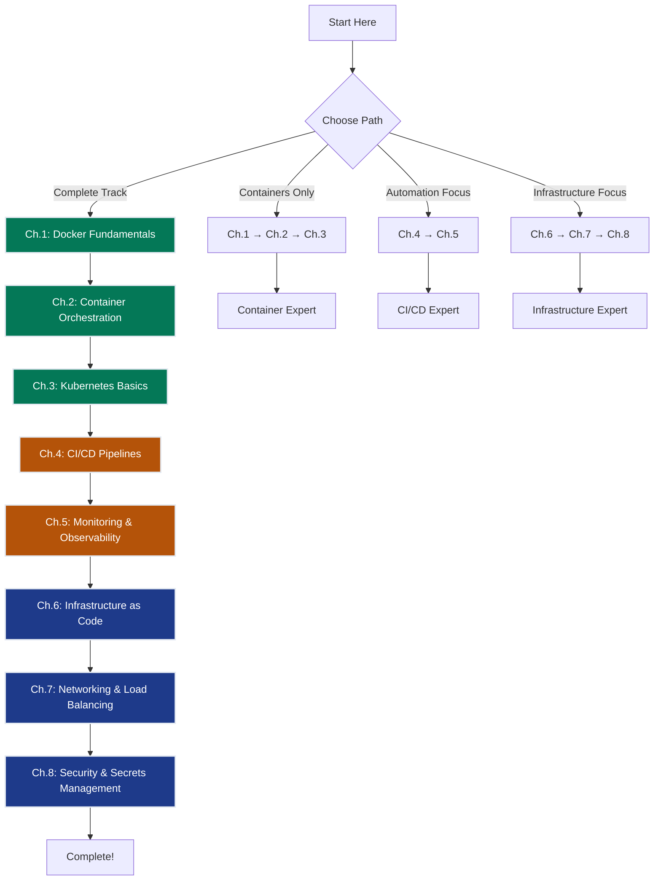

# DevOps Fundamentals — Production Deployment Skills

> **Track Status:** ✅ **COMPLETE** — All 8 chapters finished (Docker through security)

This track covers **general-purpose infrastructure and deployment practices** that every engineer should know, independent of AI/ML. All topics use **100% free local tools** with optional cloud integration. Perfect for engineers transitioning from development to production, backend engineers learning DevOps, and data scientists deploying applications.

## The Journey

You start by containerizing a Flask web app with Docker (Ch.1), orchestrate multi-container architectures with Docker Compose (Ch.2), then deploy to a local Kubernetes cluster using Kind (Ch.3). From there, build automated CI/CD pipelines with GitHub Actions (Ch.4), implement monitoring and observability with Prometheus and Grafana (Ch.5), and adopt Infrastructure as Code with Terraform (Ch.6). The track concludes with networking patterns using Nginx (Ch.7) and security best practices with secrets management (Ch.8). Each chapter is hands-on with local development first, optional cloud deployment second.

---

## The Grand Challenge — ProductionStack

> **Every chapter threads through a unified production-system challenge.**  
> This framework mirrors the "SmartVal AI" arc from the ML track, adapted for infrastructure deployment.

### The Scenario

You're the **Lead DevOps Engineer** at a fast-growing startup. The CTO wants to launch **"ProductionStack"** — a flagship production-grade API deployment system that can scale from 100 to 100,000 users without manual intervention.

This isn't a tutorial project. It's a **production system** that engineers, customers, and investors will rely on for business-critical operations. It must satisfy strict operational and business requirements.

### The 5 Core Constraints

Every chapter explicitly tracks which constraints it helps solve:

| # | Constraint | Target | Why It Matters |
|---|------------|--------|----------------|
| **#1** | **PORTABILITY** | Same deployment works locally and in cloud without changes | "Works on my machine" syndrome is unacceptable. Dev/staging/prod must be identical environments |
| **#2** | **AUTOMATION** | Zero-touch deployment — one command from commit to production | Manual deployment = slow, error-prone, unscalable. CI/CD is non-negotiable |
| **#3** | **RELIABILITY** | 99% uptime with self-healing (automatic restart on failure) | Downtime = lost revenue and trust. System must recover without human intervention |
| **#4** | **OBSERVABILITY** | <5min mean time to detect issues via metrics and alerts | Can't fix what you can't see. Must detect problems before users complain |
| **#5** | **SECURITY** | Zero secrets in git/images, automatic secrets rotation | Leaked credentials = data breach lawsuit. Security must be built-in, not bolted-on |

### Progressive Capability Unlock (8 Chapters)

| Ch | What Unlocks | Constraints Addressed | Deployment Time | Status |
|----|--------------|----------------------|-----------------|--------|
| 1 | Docker containerization | **#1 ✅ PORTABILITY** | Manual (~5min) | Foundation |
| 2 | Multi-container orchestration (Compose) | #1 Extended | Manual (~2min) | Composition |
| 3 | Kubernetes self-healing & scaling | **#3 ✅ RELIABILITY (basic)** | Manual (~3min) | Auto-restart unlocked |
| 4 | CI/CD pipelines (GitHub Actions) | **#2 ✅ AUTOMATION** | Zero-touch (~30sec) | **Breakthrough!** |
| 5 | Prometheus + Grafana metrics | **#4 ✅ OBSERVABILITY** | Zero-touch | <5min detection |
| 6 | Infrastructure as Code (Terraform) | #2 Extended | Reproducible | Version-controlled infra |
| 7 | Load balancing (Nginx) | #3 Extended | High availability | 99%+ uptime |
| 8 | Secrets management (Key Vault) | **#5 ✅ SECURITY** | Zero secrets in code | 🎉 **COMPLETE!** |

### The Running Example: ProductionStack

**Architecture:** 3-tier Flask web application
- **Web tier:** Flask API (Python 3.11) with health endpoints
- **Cache tier:** Redis 7.x for session storage and rate limiting
- **Data tier:** PostgreSQL 15.x for persistent user data

**Evolution across chapters:**

| Chapter | Stack Components | Deployment Method | Constraint Unlock |
|---------|------------------|-------------------|-------------------|
| Ch.1 | Flask + Redis (2 containers) | `docker run` commands | Portability achieved |
| Ch.2 | + PostgreSQL (3-tier complete) | `docker-compose up` | Service dependencies |
| Ch.3 | Same stack on Kubernetes | `kubectl apply` | Self-healing pods |
| Ch.4 | + Automated testing & build | GitHub Actions workflow | Zero-touch deploy |
| Ch.5 | + Prometheus + Grafana | Metrics scraping | <5min detection |
| Ch.6 | Entire stack in Terraform | `terraform apply` | Reproducible infra |
| Ch.7 | + Nginx load balancer | Upstream health checks | High availability |
| Ch.8 | + Azure Key Vault | Secrets injection | No leaked credentials |

**Measurable outcomes by chapter:**

- **Ch.1:** ✅ Same Docker image runs on laptop and server
- **Ch.2:** ✅ All services start with one command (`docker-compose up`)
- **Ch.3:** ✅ Crashed pods auto-restart within 10 seconds
- **Ch.4:** ✅ Git push → automated testing → deployment in <5 minutes
- **Ch.5:** ✅ Downtime detected within 2 minutes via alerts
- **Ch.6:** ✅ Infrastructure changes tracked in git with full history
- **Ch.7:** ✅ Zero-downtime deployments with rolling updates
- **Ch.8:** ✅ Zero secrets in source control or container images

---

## 8 Chapters

### 🚀 Container Fundamentals (Start Here)

#### 1. [Docker Fundamentals](ch01_docker_fundamentals/README.md) — Containerize a Flask App
> **Running Example**: Python Flask web app with Redis cache  
> **Constraint**: Must run identically on dev laptop and production server  
> **Free Tools**: Docker Desktop, Docker Hub

Learn container basics with a real web application. Master Dockerfiles, image layers, volumes, networks, port mapping, and multi-stage builds. Build and push custom images to Docker Hub.

**Key Concepts**: Image vs. container, layer caching, volume mounts, debugging containers

---

#### 2. [Container Orchestration](ch02_container_orchestration/README.md) — Docker Compose Multi-Service Apps
> **Running Example**: 3-tier architecture (Flask + PostgreSQL + Redis)  
> **Constraint**: All services start with one command  
> **Free Tools**: Docker Compose

Master multi-container applications with Docker Compose. Learn service dependencies, network isolation, volume persistence, environment variables, health checks, and service scaling.

**Key Concepts**: Declarative service definitions, dependency ordering, network isolation, named volumes

---

#### 3. [Kubernetes Basics](ch03_kubernetes_basics/README.md) — Deploy to Local K8s Cluster
> **Running Example**: Flask app deployment with self-healing and scaling  
> **Constraint**: Learn Kubernetes without cloud spend  
> **Free Tools**: Kind (Kubernetes in Docker), kubectl, K9s

Deploy containerized apps to Kubernetes locally. Master pods, deployments, services, replica sets, ConfigMaps, and Kubernetes self-healing capabilities.

**Key Concepts**: Pods vs. deployments, declarative configuration, service discovery, horizontal scaling

---

### 🔄 Automation & Monitoring

#### 4. [CI/CD Pipelines](ch04_cicd_pipelines/README.md) — GitHub Actions Workflows
> **Running Example**: Automated testing and Docker Hub deployment  
> **Constraint**: Zero-downtime deployments with rollback capability  
> **Free Tools**: GitHub Actions (2,000 free minutes/month)

Build production CI/CD pipelines. Master automated testing, linting, Docker image builds, GitHub Actions workflows, secrets management, and deployment automation.

**Key Concepts**: Pipeline stages, artifact caching, matrix builds, deployment gates, rollback strategies

---

#### 5. [Monitoring & Observability](ch05_monitoring_observability/README.md) — Prometheus + Grafana
> **Running Example**: Application metrics, dashboards, and alerting  
> **Constraint**: Detect issues before users complain  
> **Free Tools**: Prometheus, Grafana, node_exporter

Implement observability for production systems. Master metrics collection with Prometheus, dashboard creation with Grafana, alert rules, and SLO monitoring.

**Key Concepts**: Metrics vs. logs, time series data, PromQL queries, alert fatigue prevention

---

### 🏗️ Infrastructure & Operations

#### 6. [Infrastructure as Code](ch06_infrastructure_as_code/README.md) — Terraform Basics
> **Running Example**: Reproducible Docker infrastructure deployment  
> **Constraint**: Infrastructure must be version-controlled and reviewable  
> **Free Tools**: Terraform, Docker provider

Adopt Infrastructure as Code practices with Terraform. Master declarative infrastructure definitions, state management, resource dependencies, and infrastructure versioning.

**Key Concepts**: Declarative vs. imperative, state files, plan vs. apply, drift detection

---

#### 7. [Networking & Load Balancing](ch07_networking_load_balancing/README.md) — Nginx Reverse Proxy
> **Running Example**: Load-balanced Flask app with health checks  
> **Constraint**: Zero-downtime deployments with session affinity  
> **Free Tools**: Nginx, HAProxy

Master networking patterns for production systems. Learn reverse proxies, load balancing algorithms, health checks, SSL termination, and session persistence.

**Key Concepts**: Reverse proxy vs. forward proxy, load balancing algorithms, sticky sessions, SSL offloading

---

#### 8. [Security & Secrets Management](ch08_security_secrets_management/README.md) — Environment Variables to Azure Key Vault
> **Running Example**: Secure API keys, database passwords, and certificates  
> **Constraint**: Zero secrets in source control or container images  
> **Free Tools**: Docker secrets, Kubernetes secrets, Azure Key Vault (free tier)

Implement secure secrets management across development and production environments. Master environment variables, Docker secrets, Kubernetes secrets, and Azure Key Vault integration.

**Key Concepts:** Secrets rotation, RBAC, principle of least privilege, secret scanning

Implement security best practices for production deployments. Master environment variables, Docker secrets, Kubernetes secrets, Azure Key Vault integration, and secrets rotation.

**Key Concepts**: Secrets vs. config, least privilege access, rotation strategies, audit logging

---

## Learning Path

### Beginner Path (8 weeks)
**Goal**: Master containerization and orchestration

1. **Docker Fundamentals** (2 weeks) → Understand containers, images, volumes
2. **Container Orchestration** (2 weeks) → Multi-container apps with Docker Compose
3. **Kubernetes Basics** (2 weeks) → Deploy to K8s clusters
4. **CI/CD Pipelines** (2 weeks) → Automate testing and deployment

**Outcome**: Can containerize apps and deploy with automated pipelines

---

### Intermediate Path (12 weeks)
**Goal**: Add monitoring, infrastructure as code, and networking

5. **Monitoring & Observability** (2 weeks) → Prometheus and Grafana
6. **Infrastructure as Code** (2 weeks) → Terraform for reproducible infrastructure
7. **Networking & Load Balancing** (2 weeks) → Nginx reverse proxy and load balancing

**Outcome**: Can build production-grade infrastructure with observability

---

### Advanced Path (14 weeks)
**Goal**: Security and production hardening

8. **Security & Secrets Management** (2 weeks) → Secure secrets handling from dev to prod

**Outcome**: Production-ready DevOps engineer with security best practices

---

## Track Structure

Each chapter follows a consistent pattern:

- **README.md**: The Challenge, Core Idea, Running Example, Mental Model, Code Skeleton, What Can Go Wrong, Progress Check
- **notebook.ipynb**: 10 hands-on cells progressing from basics to production patterns (100% local, free tools)
- **notebook_supplement.ipynb**: Optional Azure deployment examples (requires Azure subscription)
- **gen_scripts/**: Python scripts to generate diagrams and animations
- **img/**: Generated visualizations (architecture diagrams, flows, animations)

---

## Prerequisites

**Required**:
- Basic command-line comfort (cd, ls, cat)
- Basic programming knowledge (any language)
- Text editor or IDE

**Helpful but not required**:
- Web development basics (HTTP, REST APIs)
- Linux fundamentals
- Cloud platform familiarity (Azure, AWS, GCP)

---

## Free Tools Used

All chapters use **100% free, locally runnable tools**:

| Tool | Purpose | Cost |
|------|---------|------|
| Docker Desktop | Container runtime | Free for personal use |
| Docker Compose | Multi-container orchestration | Free (included with Docker Desktop) |
| Kind | Kubernetes in Docker | Free |
| kubectl | Kubernetes CLI | Free |
| GitHub Actions | CI/CD pipelines | 2,000 free minutes/month |
| Prometheus | Metrics collection | Free (open source) |
| Grafana | Metrics visualization | Free (open source) |
| Terraform | Infrastructure as Code | Free (open source) |
| Nginx | Web server & reverse proxy | Free (open source) |

**Optional cloud integration** (all have free tiers):
- Azure Container Registry (1 free registry)
- Azure Container Instances (750 hours/month free)
- Azure Key Vault (10,000 operations/month free)

---

## Next Steps

1. **New to containers?** → Start with [Ch.1: Docker Fundamentals](ch01_docker_fundamentals/README.md)
2. **Have Docker experience?** → Jump to [Ch.3: Kubernetes Basics](ch03_kubernetes_basics/README.md)
3. **Need CI/CD?** → Go to [Ch.4: CI/CD Pipelines](ch04_cicd_pipelines/README.md)
4. **Deploying to production?** → Review [Ch.5: Monitoring & Observability](ch05_monitoring_observability/README.md)

---

## Contributing

See [CONTRIBUTING.md](../../CONTRIBUTING.md) for authoring guidelines and track conventions.
