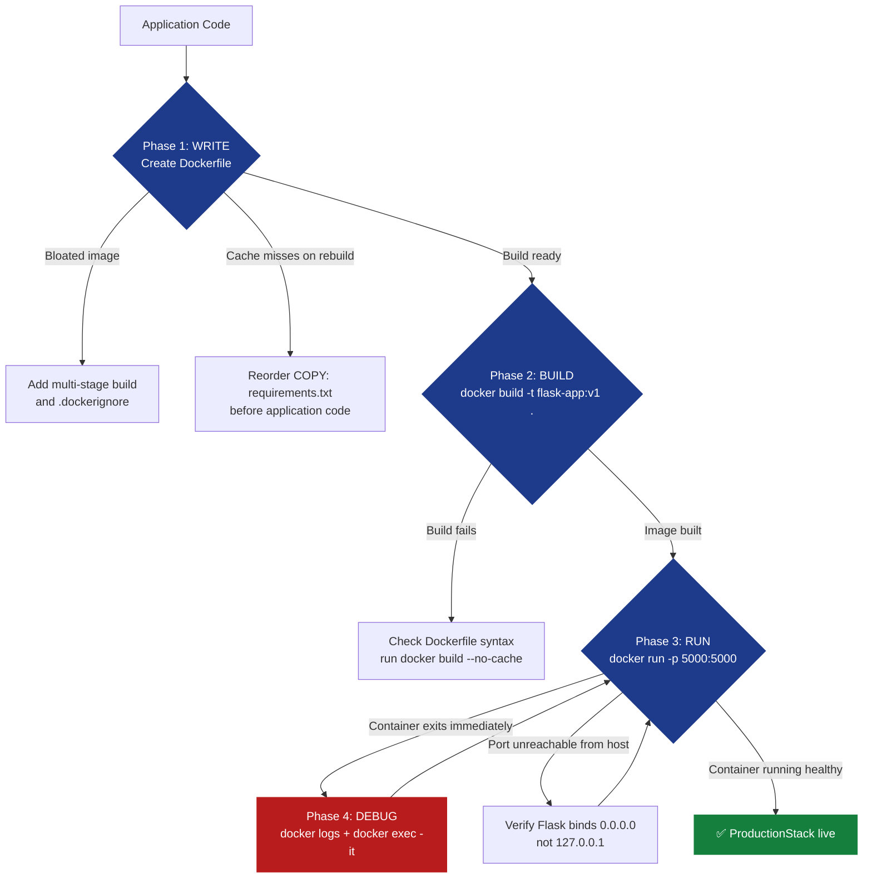

# Ch.1 — Docker Fundamentals

> **The story.** In **2013**, Solomon Hykes and the team at dotCloud introduced Docker at PyCon — a tool that would transform software deployment from "works on my machine" uncertainty into reproducible container-based workflows. By 2015, Docker had become the de facto standard for packaging applications, solving the ancient problem of dependency conflicts and environment drift. Every Kubernetes pod, every CI/CD pipeline, every microservice deployment you'll see in production today runs inside a container — and Docker established the vocabulary and tooling that made it possible.
>
> **Where you are in the curriculum.** This is chapter one of the DevOps Fundamentals track. You're an engineer deploying a Python Flask web application, and your constraint is simple but absolute: it must run identically on your dev laptop and the production server. One Dockerfile, one build, infinite deployments. Every concept here — images, containers, volumes, networks — scales directly to Kubernetes orchestration in Ch.3 and multi-service architectures throughout this track.
>
> **Notation in this chapter.** `Dockerfile` — blueprint for building images; `image` — read-only template; `container` — running instance of an image; `volume` — persistent storage mounted into containers; `port mapping` — exposing container ports to the host; `layer` — cached filesystem change in an image.

---

## 0 · The Challenge — Where We Are

> 💡 **The mission**: Deploy a **production-ready Flask web app** satisfying 5 constraints:
> 1. **PORTABILITY**: Runs identically on dev, staging, production — 2. **REPRODUCIBILITY**: Same build every time — 3. **ISOLATION**: No dependency conflicts with host — 4. **EFFICIENCY**: Fast builds, small images — 5. **OBSERVABILITY**: Logs, debugging, health checks

**What we know so far:**
- ✅ We have a Flask app with Redis cache (standard 3-tier architecture)
- ✅ It works on the developer's laptop (Python 3.11, Redis installed locally)
- ❌ **But it fails on the production server!** Different Python version, missing Redis, wrong environment variables

**What's blocking us:**
We need **containerization** — packaging the app and all its dependencies into a single, portable unit. Without containers:
- Deployment means manual setup on every server (Python, pip, Redis, environment config)
- "It works on my machine" becomes a recurring nightmare
- Rollbacks require manual reversal of dozens of shell commands
- Scaling means repeating the entire setup process for each new server

**What this chapter unlocks:**
The **Docker workflow** — write once, run anywhere:
- **Dockerfile defines the build**: One file specifies Python version, dependencies, startup command
- **Image is the blueprint**: Built once, pushed to registry, pulled by any server
- **Container is the runtime**: Start, stop, inspect, scale without touching the host OS

✅ **This is the foundation** — every later chapter assumes your app is containerized.

---

## Animation


> **What you're seeing:** The full lifecycle of a Docker container — write Dockerfile → build image → run container → inspect logs → exec into running container → stop → remove. Each frame shows the command and the resulting state. The animation demonstrates that containers are ephemeral (stop/remove destroys state) but images persist (rebuilt containers start fresh). This is the mental model you'll use for every deployment: **images are blueprints, containers are running instances**.

---

## 1 · Docker Solves "Works on My Machine" with Lightweight Containers

> ⚡ **When this breaks** — ProductionStack's Flask API runs perfectly on your laptop but crashes the moment it hits staging: Python 3.9 versus 3.11, missing Redis, conflicting system packages. The payment service goes dark, your CTO gets a support escalation at 3 am, and "it works on my machine" is not an acceptable incident report. Docker eliminates environment drift by baking the entire runtime — Python version, packages, config — into the image artifact, so the same container runs identically on every machine, every time.

Docker packages your application, runtime, and dependencies into a **container** — a lightweight, isolated environment that runs identically on any machine with Docker installed. Unlike virtual machines (which virtualize hardware), containers share the host OS kernel, making them fast to start and efficient in resource usage.

**The core abstraction:**
- **Image** = read-only template (the blueprint)
- **Container** = running instance of an image (the house built from the blueprint)

Every container starts from an image. You build an image once (defining Python version, installing dependencies, copying code) and run it anywhere — your laptop, a staging server, a cloud VM, a Kubernetes cluster. The container always sees the same filesystem, the same Python version, the same installed packages. "Works on my machine" is no longer a problem — because the machine is now *inside the container*.

---

## 1.5 · The Practitioner Workflow — Your 4-Phase Deployment

> ⚠️ **Two ways to read this chapter:**
> - **Theory-first (recommended for learning):** Read §0→§4 sequentially to understand concepts, then use this workflow as your reference
> - **Workflow-first (practitioners with existing knowledge):** Use this diagram as a jump-to guide when deploying real applications

**What you'll build by the end:** A production-ready containerized Flask app with optimized build times, minimal image size, proper networking, and complete debugging capability. This is the workflow you'll follow for every application deployment.

```
Phase 1: WRITE              Phase 2: BUILD              Phase 3: RUN                Phase 4: DEBUG
─────────────────────────────────────────────────────────────────────────────────────────────────────────────
Create Dockerfile:          Build optimized image:      Launch container:           Troubleshoot issues:

• Choose base image         • Enable BuildKit           • Port mapping              • View logs
• Layer dependencies        • Use build cache           • Volume mounts             • Exec into container
• Multi-stage builds        • Tag strategy              • Environment vars          • Inspect layers
• .dockerignore             • Size optimization         • Network setup             • Analyze performance

→ DECISION:                 → DECISION:                 → DECISION:                 → DECISION:
  Base image choice?          Fast enough?                Persistent data?            Root cause?
  • python:3.11-slim          • >2 min: Add cache         • Database: Volume          • Logs: Check stdout
  • python:3.11-alpine        • >100MB: Multi-stage       • Code: Bind mount (dev)    • Network: Exec ping
  • Full (800MB, avoid)       • Check with Dive tool      • Secrets: Env vars         • Layers: Use Dive
```

> 💡 **How to use this workflow:** Complete Phase 1→2→3→4 in order on your first deployment. For subsequent updates, you'll typically iterate between Phase 1 (modify Dockerfile), Phase 2 (rebuild), and Phase 4 (verify). The sections below teach WHY each phase works; refer back here for WHAT to do.

### The 4-Phase Decision Flow

This diagram shows the complete practitioner journey from raw application code to a running, debuggable containerized service:



---

## 2 · Containerizing a Flask App with Redis Cache

You're a backend engineer at a startup. Your first production deployment is a Flask API that stores session data in Redis. The app works perfectly on your laptop — Python 3.11, `flask==3.0.0`, `redis==5.0.0`, and a locally running Redis server. The staging server has Python 3.9, no Redis, and conflicting system packages. Deployment fails.

Your manager's requirement: **the app must run identically on dev, staging, and production with zero manual setup**. One `docker run` command. No environment-specific instructions. No Slack messages asking "did you install Redis?"

**The running example: Flask + Redis in 5 steps**

| Step | What you do | Why it matters |
|------|-------------|----------------|
| **1. Write Dockerfile** | Define base image (`python:3.11-slim`), install deps, copy code | Creates reproducible build instructions |
| **2. Build image** | `docker build -t flask-app:v1 .` | Packages app into portable image |
| **3. Run container** | `docker run -p 5000:5000 flask-app:v1` | Starts isolated instance with port mapping |
| **4. Add Redis** | Multi-container with Docker network | Enables inter-service communication |
| **5. Persist data** | Mount volume for Redis data | Survives container restarts |

By step 5, you have a **production-ready deployment**: two containers (Flask + Redis), networked together, with persistent storage. One command starts both. One command stops both. The entire stack is defined in version-controlled files — no manual setup required.

---

## 3 · Mental Model — Image vs. Container (Blueprint vs. Instance)

> 💡 **The analogy that never fails:** An **image** is like a class definition in Python. A **container** is like an object instantiated from that class. You can create 10 containers from one image — they all start with the same code and dependencies, but they run independently with separate memory and state.

**Image:**
- Read-only filesystem layers
- Built once from a Dockerfile
- Stored in a registry (Docker Hub, AWS ECR, GitHub Container Registry)
- Versioned with tags (`flask-app:v1`, `flask-app:v2`, `flask-app:latest`)
- **Never changes after build** — if you modify code, you build a new image

**Container:**
- Running (or stopped) instance of an image
- Has its own filesystem, network, and process space
- Can write to its filesystem (but changes are lost when removed)
- Ephemeral by default — stop/remove destroys all state unless volumes are used
- **Can run multiple containers from the same image** — each gets isolated resources

**The lifecycle:**
```
Dockerfile → build → Image → run → Container
                        ↓
                    push to registry → pull on production → run → Container
```

**Key insight:** When you run `docker build`, you're creating a **read-only template**. When you run `docker run`, you're creating a **writable runtime instance**. This separation is why Docker enables immutable infrastructure — you never patch a running container. You build a new image and replace the old container.

---

## 4 · The Four-Phase Docker Workflow

## Dockerfile Best Practices — Write

Every containerized application starts with a Dockerfile — the blueprint that defines how your image is built. The order of instructions matters: Docker caches each layer, and changing one instruction invalidates all subsequent layers. Write your Dockerfile strategically to maximize cache hits and minimize image size.

**The anatomy of an optimized Dockerfile:**

```dockerfile
# Phase 1: WRITE - Multi-stage Dockerfile with layer optimization
# Stage 1: Builder (install dependencies, compile code)
FROM python:3.11-slim AS builder

WORKDIR /app

# Install build dependencies (gcc, etc.) for compiling Python packages
RUN apt-get update && apt-get install -y --no-install-recommends \
    gcc \
    && rm -rf /var/lib/apt/lists/*

# Copy ONLY requirements first (maximize cache hits)
COPY requirements.txt .

# Install Python dependencies
RUN pip install --user --no-cache-dir -r requirements.txt

# Stage 2: Runtime (minimal production image)
FROM python:3.11-slim

WORKDIR /app

# Copy installed packages from builder stage
COPY --from=builder /root/.local /root/.local

# Copy application code
COPY . .

# Ensure scripts in .local are usable
ENV PATH=/root/.local/bin:$PATH

# Run as non-root user (security best practice)
RUN useradd -m appuser && chown -R appuser:appuser /app
USER appuser

# Expose port (documentation only - doesn't actually publish)
EXPOSE 5000

# Start application
CMD ["python", "app.py"]
```

**Key optimization strategies:**

| Technique | Impact | When to use |
|-----------|--------|-------------|
| **Multi-stage builds** | Reduces image size 40-70% | Always for compiled languages (Go, Rust) or when using build tools |
| **Layer ordering** | Eliminates unnecessary rebuilds | Always — put static layers first (base image, system packages), changing layers last (application code) |
| **.dockerignore** | Reduces build context 50-90% | Always — exclude `.git/`, `venv/`, `node_modules/`, `*.pyc` |
| **Slim base images** | Saves 500-700 MB | Always — use `python:3.11-slim` (120 MB) instead of `python:3.11` (800 MB) |
| **Chain RUN commands** | Reduces layer count | When installing packages — cleanup in same layer |

> 💡 **Industry Standard: Alpine vs Slim Base Images**
>
> ```dockerfile
> # Option 1: Debian-based slim (120 MB, better compatibility)
> FROM python:3.11-slim
>
> # Option 2: Alpine (50 MB, sometimes breaks binary packages)
> FROM python:3.11-alpine
> # May need: apk add --no-cache gcc musl-dev
> ```
>
> **When to use:**
> - **Slim (recommended for Python):** Better package compatibility, faster builds (pre-compiled wheels work)
> - **Alpine:** Smallest size, but many Python packages need manual compilation (adds build time)
> - **Full (python:3.11):** Never in production — 800 MB with unnecessary build tools
>
> **Common gotcha:** Alpine uses `musl libc` instead of `glibc` — binary wheels from PyPI often fail. Stick with `-slim` for Python unless size is critical.

**.dockerignore example:**
```
# .dockerignore - exclude unnecessary files from build context
.git
.gitignore
.venv
venv/
__pycache__
*.pyc
*.pyo
*.pyd
.pytest_cache
.coverage
*.log
README.md
.dockerignore
Dockerfile
docker-compose.yml
```

> 💡 **Write verdict:** Dockerfile uses multi-stage build — image size 300 MB → 120 MB; layer caching eliminates `pip install` on code-only changes.
> ➡️ Enables faster CI/CD pulls and reduced attack surface; proceed to Build phase.

---

## Image Build & Optimization — Build

Building the image transforms your Dockerfile into a runnable artifact. BuildKit (Docker's new build engine) enables parallel layer building, better caching, and secret mounting. Build time matters in CI/CD pipelines — a 10-minute build blocks every deployment.

**BuildKit-optimized build:**

```bash
# Phase 2: BUILD - BuildKit with cache mounts and build arguments
# Enable BuildKit (better caching, parallel builds, secret mounting)
export DOCKER_BUILDKIT=1

# Build with inline cache (stores cache metadata in image for remote caching)
docker build \
  --build-arg BUILDKIT_INLINE_CACHE=1 \
  --cache-from flask-app:latest \
  -t flask-app:v1 \
  -t flask-app:latest \
  .

# OUTPUT:
# [+] Building 12.3s (15/15) FINISHED
#  => [internal] load build definition from Dockerfile      0.1s
#  => [internal] load .dockerignore                          0.0s
#  => [internal] load metadata for docker.io/library/python  0.8s
#  => [builder 1/5] FROM python:3.11-slim                    0.0s (CACHED)
#  => [internal] load build context                          0.2s
#  => [builder 2/5] WORKDIR /app                             0.0s (CACHED)
#  => [builder 3/5] RUN apt-get update && apt-get install   2.1s
#  => [builder 4/5] COPY requirements.txt .                  0.0s
#  => [builder 5/5] RUN pip install --user                   8.2s
#  => [stage-1 2/6] WORKDIR /app                             0.0s (CACHED)
#  => [stage-1 3/6] COPY --from=builder /root/.local         0.3s
#  => [stage-1 4/6] COPY . .                                 0.1s
#  => [stage-1 5/6] RUN useradd -m appuser                   0.4s
#  => exporting to image                                     0.2s
#  => => writing image sha256:a3c5d9f8b2e1...                0.1s
#  => => naming to docker.io/library/flask-app:v1            0.0s
#  => => naming to docker.io/library/flask-app:latest        0.0s

# Verify image size
docker images flask-app
# REPOSITORY   TAG      IMAGE ID       CREATED          SIZE
# flask-app    v1       a3c5d9f8b2e1   30 seconds ago   122MB
# flask-app    latest   a3c5d9f8b2e1   30 seconds ago   122MB
```

**Build time optimization strategies:**

| Problem | Symptom | Solution |
|---------|---------|----------|
| **Slow pip install** | 5-8 min on every build | Add `--cache-from` to reuse previous layer |
| **Large build context** | "Sending build context: 800 MB" | Add comprehensive `.dockerignore` |
| **Rebuilds dependencies** | `requirements.txt` unchanged but rebuilds | Move `COPY requirements.txt` before `COPY . .` |
| **No layer caching in CI** | Every CI build is cold | Use registry as cache: `--cache-from registry.com/flask-app:latest` |

> 💡 **Industry Standard: BuildKit for Fast Builds**
>
> ```bash
> # Legacy builder (slow, sequential)
> docker build -t flask-app:v1 .
> # Build time: 4m 12s
>
> # BuildKit (parallel, better cache)
> export DOCKER_BUILDKIT=1
> docker build -t flask-app:v1 .
> # Build time: 1m 38s (2.5x faster)
>
> # BuildKit with cache mounts (persistent dependency cache)
> docker build \
>   --build-arg BUILDKIT_INLINE_CACHE=1 \
>   --cache-from flask-app:latest \
>   -t flask-app:v1 .
> # Build time: 22s on second build (dependencies cached)
> ```
>
> **When to use:**
> - **Always:** Set `DOCKER_BUILDKIT=1` in `.bashrc` or CI environment
> - **CI/CD:** Use `--cache-from` to pull previous image as cache source
> - **Monorepos:** BuildKit parallelizes independent build stages
>
> **See also:** [BuildKit documentation](https://docs.docker.com/build/buildkit/)

**Tag strategy for production:**

```bash
# Tag with semantic version + latest
docker build -t flask-app:1.2.3 -t flask-app:latest .

# Tag with git commit SHA (traceability)
docker build -t flask-app:$(git rev-parse --short HEAD) .

# Tag with environment + version
docker build -t flask-app:staging-1.2.3 .
```

> 💡 **Build verdict:** BuildKit cuts build time 4m12s → 1m38s; cached `requirements.txt` layer makes code-only rebuilds 22s.
> ➡️ Registry-ready artifact with SHA tag for rollback; proceed to Run phase.

---

## Container Execution — Run

Running the container launches an isolated process with its own filesystem, network, and process space. Port mapping exposes container services to the host. Volume mounts provide persistent storage. Environment variables configure runtime behavior without rebuilding the image.

**Production-ready container launch:**

```bash
# Phase 3: RUN - Container with volume mounts, port mapping, and environment variables

# 1. Create named volume for persistent data
docker volume create flask-data

# 2. Create custom network for inter-container communication
docker network create flask-net

# 3. Run Redis on custom network with volume
docker run -d \
  --name redis \
  --network flask-net \
  -v redis-data:/data \
  --restart unless-stopped \
  redis:7

# 4. Run Flask app with complete configuration
docker run -d \
  --name flask-api \
  --network flask-net \
  -p 5000:5000 \
  -v flask-data:/app/data \
  -e FLASK_ENV=production \
  -e REDIS_HOST=redis \
  -e REDIS_PORT=6379 \
  -e SECRET_KEY=${SECRET_KEY} \
  --restart unless-stopped \
  --memory="512m" \
  --cpus="1.0" \
  flask-app:v1

# OUTPUT:
# 89f7c3d2e1a5b4f6c8d9e0f1a2b3c4d5e6f7a8b9c0d1e2f3a4b5c6d7e8f9a0b1

# 5. Verify containers are running
docker ps
# CONTAINER ID   IMAGE          COMMAND                  STATUS         PORTS                    NAMES
# 89f7c3d2e1a5   flask-app:v1   "python app.py"          Up 10 seconds  0.0.0.0:5000->5000/tcp   flask-api
# 7b3e9f1d2c4a   redis:7        "docker-entrypoint.s…"   Up 15 seconds  6379/tcp                 redis

# 6. Test the application
curl http://localhost:5000/health
# {"status": "ok", "redis": "connected", "uptime": 10}

# 7. Check resource usage
docker stats flask-api --no-stream
# CONTAINER    CPU %   MEM USAGE / LIMIT   MEM %   NET I/O       BLOCK I/O
# flask-api    1.2%    45MiB / 512MiB      8.8%    1.2kB / 648B  0B / 0B
```

**Container runtime options:**

| Flag | Purpose | When to use |
|------|---------|-------------|
| `-d` | Detached mode (background) | Always in production |
| `-p 5000:5000` | Port mapping (host:container) | When container exposes HTTP/TCP service |
| `-v flask-data:/app/data` | Named volume mount | For persistent storage (databases, uploads) |
| `-e KEY=value` | Environment variable | For configuration without rebuilding image |
| `--network flask-net` | Custom network | For multi-container communication |
| `--restart unless-stopped` | Auto-restart policy | Always in production (survives host reboots) |
| `--memory="512m"` | Memory limit | Always in production (prevent runaway processes) |
| `--cpus="1.0"` | CPU limit | Always in production (prevent CPU starvation) |

> 💡 **Industry Standard: Docker Compose for Multi-Container Apps**
>
> Managing multiple `docker run` commands is error-prone. Docker Compose defines entire stacks in YAML:
>
> ```yaml
> # docker-compose.yml
> version: '3.8'
>
> services:
>   redis:
>     image: redis:7
>     volumes:
>       - redis-data:/data
>     restart: unless-stopped
>
>   flask-api:
>     build: .
>     ports:
>       - "5000:5000"
>     environment:
>       FLASK_ENV: production
>       REDIS_HOST: redis
>       SECRET_KEY: ${SECRET_KEY}
>     volumes:
>       - flask-data:/app/data
>     depends_on:
>       - redis
>     restart: unless-stopped
>     deploy:
>       resources:
>         limits:
>           cpus: '1.0'
>           memory: 512M
>
> volumes:
>   redis-data:
>   flask-data:
> ```
>
> **One command to rule them all:**
> ```bash
> docker compose up -d    # Start entire stack
> docker compose down     # Stop and remove all containers
> docker compose logs -f  # Follow logs from all services
> ```
>
> **When to use:**
> - **Always for multi-container apps** — covered in detail in Ch.2
> - **Local development** — simplifies onboarding (one command to start everything)
> - **CI/CD testing** — reproducible test environments
>
> **See also:** [Docker Compose documentation](https://docs.docker.com/compose/)

**Port mapping patterns:**

```bash
# Standard mapping (host port = container port)
docker run -p 5000:5000 flask-app:v1  # localhost:5000 → container:5000

# Custom host port (avoid conflicts)
docker run -p 8080:5000 flask-app:v1  # localhost:8080 → container:5000

# Bind to specific interface (security)
docker run -p 127.0.0.1:5000:5000 flask-app:v1  # Only localhost can access

# Random host port (useful for parallel testing)
docker run -p 5000 flask-app:v1  # Docker assigns random port (e.g., 32768)
```

> 💡 **Run verdict:** Flask + Redis running with 512 MB memory cap, named volume persistence, and bridge-network DNS — same `docker run` works on dev, staging, and production.
> ➡️ Persistent data and automatic restarts ready; proceed to Debug phase.

---

## Troubleshooting Containers — Debug

Debugging containers requires different tools than debugging local processes. The container filesystem is isolated, logs go to stdout, and network issues require inspecting Docker's virtual networking. Master these four commands: `logs`, `exec`, `inspect`, and `dive`.

**Complete debugging workflow:**

```bash
# Phase 4: DEBUG - Troubleshooting workflow (logs + exec + inspect + layer analysis)

# 1. Check if container is running
docker ps -a
# CONTAINER ID   IMAGE          STATUS                     NAMES
# 89f7c3d2e1a5   flask-app:v1   Exited (1) 5 seconds ago   flask-api
# ^ Container crashed! Let's find out why...

# 2. View container logs (stdout/stderr)
docker logs flask-api
# Traceback (most recent call last):
#   File "/app/app.py", line 12, in <module>
#     redis_host = os.environ['REDIS_HOST']  # Missing environment variable!
# KeyError: 'REDIS_HOST'
# ^ Root cause: Missing REDIS_HOST environment variable

# 3. Inspect container configuration
docker inspect flask-api --format='{{.Config.Env}}'
# [PATH=/usr/local/bin:/usr/bin PYTHON_VERSION=3.11.8]
# ^ Confirms REDIS_HOST is missing

# 4. Fix and restart with correct environment variable
docker rm flask-api
docker run -d --name flask-api -p 5000:5000 -e REDIS_HOST=redis flask-app:v1

# 5. Verify container is healthy
docker ps
# CONTAINER ID   IMAGE          STATUS         PORTS                    NAMES
# 7c8d9e0f1a2b   flask-app:v1   Up 10 seconds  0.0.0.0:5000->5000/tcp   flask-api
# ^ Now running!

# 6. Exec into running container for deeper inspection
docker exec -it flask-api /bin/bash
root@7c8d9e0f1a2b:/app# ls -la
# total 24
# drwxr-xr-x 1 root root 4096 Apr 29 10:15 .
# drwxr-xr-x 1 root root 4096 Apr 29 10:15 ..
# -rw-r--r-- 1 root root  342 Apr 29 10:10 app.py
# -rw-r--r-- 1 root root   87 Apr 29 10:10 requirements.txt

root@7c8d9e0f1a2b:/app# pip list
# Package    Version
# ---------- -------
# Flask      3.0.0
# redis      5.0.0

root@7c8d9e0f1a2b:/app# curl http://localhost:5000/health
# {"status": "ok", "redis": "connected"}

root@7c8d9e0f1a2b:/app# ping redis
# PING redis (172.18.0.2): 56 data bytes
# 64 bytes from 172.18.0.2: icmp_seq=0 ttl=64 time=0.123 ms
# ^ Network connectivity confirmed!

root@7c8d9e0f1a2b:/app# exit

# 7. Analyze image layers (check for bloat)
docker history flask-app:v1
# IMAGE          CREATED        CREATED BY                                      SIZE
# a3c5d9f8b2e1   2 hours ago    CMD ["python" "app.py"]                         0B
# <missing>      2 hours ago    USER appuser                                    0B
# <missing>      2 hours ago    RUN useradd -m appuser && chown -R appuser…     5.2kB
# <missing>      2 hours ago    COPY . .                                        1.2kB
# <missing>      2 hours ago    COPY --from=builder /root/.local /root/.local   45MB   <- Python packages
# <missing>      2 hours ago    WORKDIR /app                                    0B
# <missing>      3 days ago     /bin/sh -c #(nop)  CMD ["python3"]              0B
# <missing>      3 days ago     /bin/sh -c apt-get update && apt-get install…   75MB   <- Base Python
# ^ Largest layers: base image (75 MB) + Python packages (45 MB) = 120 MB total

# 8. Deep layer analysis with Dive tool
dive flask-app:v1
# ^ Interactive TUI shows file changes per layer, identifies wasted space
```

**Common debugging scenarios:**

| Symptom | Command to run | What to look for |
|---------|---------------|------------------|
| Container exits immediately | `docker logs <container>` | Error messages in stdout/stderr |
| Can't connect to port | `docker ps` then `docker logs` | Check if app binds to `0.0.0.0` (not `127.0.0.1`) |
| "Connection refused" between containers | `docker exec <container> ping <other-container>` | Verify both on same network |
| Missing files in container | `docker exec <container> ls -la /app` | Check if `COPY` paths are correct |
| Image size bloated (>500 MB) | `docker history <image>` or `dive <image>` | Find large layers, check for `.git`, `venv`, build tools |
| Build cache not working | `docker build --no-cache` then `docker build` | Compare build times — should be 10x faster with cache |

> 💡 **Industry Standard: Dive Tool for Image Layer Analysis**
>
> [Dive](https://github.com/wagoodman/dive) shows exactly what files changed in each layer:
>
> ```bash
> # Install Dive
> wget https://github.com/wagoodman/dive/releases/download/v0.11.0/dive_0.11.0_linux_amd64.deb
> sudo dpkg -i dive_0.11.0_linux_amd64.deb
>
> # Analyze image
> dive flask-app:v1
> ```
>
> **Interactive UI shows:**
> - Layer-by-layer file changes (added, modified, removed)
> - Wasted space (files added then deleted in later layer)
> - Efficiency score (% of image that's useful vs bloat)
>
> **Use cases:**
> - **Image size debugging:** Find accidentally copied `node_modules/`, `.git/`, `venv/`
> - **Layer optimization:** Verify multi-stage build properly discards builder stage
> - **Security audit:** Check for accidentally copied secrets (`.env`, `config.json`)
>
> **Example findings:**
> - ❌ Layer 5 adds `venv/` (200 MB) — not in `.dockerignore`
> - ❌ Layer 8 adds `.git/` (50 MB) — should be excluded
> - ✅ Layer 12 removes build tools (saved 180 MB via multi-stage)
>
> **See also:** [Dive GitHub repo](https://github.com/wagoodman/dive)

**Performance debugging:**

```bash
# Monitor real-time resource usage
docker stats flask-api
# CONTAINER    CPU %   MEM USAGE / LIMIT   MEM %   NET I/O       BLOCK I/O
# flask-api    15.3%   128MiB / 512MiB     25%     1.2MB / 3.4MB 0B / 4.1MB

# View running processes inside container
docker top flask-api
# UID    PID     PPID    C    STIME   TTY   TIME       CMD
# root   12847   12827   0    10:15   ?     00:00:00   python app.py
# root   12901   12847   0    10:15   ?     00:00:02   /usr/local/bin/python

# Check container health (if HEALTHCHECK defined in Dockerfile)
docker inspect flask-api --format='{{.State.Health.Status}}'
# healthy
```

> 💡 **Debug verdict:** Container logs and exec access identified missing env var in 90s — no local Python environment needed.
> ➡️ Four-command toolkit (logs/exec/inspect/dive) covers 95% of container failures; chapter complete.

---

## 5 · Volumes — Persistent Data Survives Container Restarts

### 5.1 · The Problem: Containers Are Ephemeral

**Scenario:** You add a Redis container for session storage.

```bash
docker run -d --name redis redis:7
```

Redis stores data inside the container's filesystem. When you stop and remove the container, **all data is lost**. This is by design — containers are ephemeral. For stateful services (databases, caches, file storage), you need **volumes**.

### 5.2 · Named Volumes (Recommended)

```bash
# Create named volume
docker volume create redis-data

# Run Redis with volume mounted
docker run -d \
  --name redis \
  -v redis-data:/data \
  redis:7

# Verify volume persists after container removal
docker rm -f redis
docker volume ls
# DRIVER    VOLUME NAME
# local     redis-data

# New container reuses same data
docker run -d --name redis -v redis-data:/data redis:7
```

**Volume mount syntax:** `-v VOLUME_NAME:CONTAINER_PATH`

**Key behavior:**
- Volume lives **outside the container** — managed by Docker
- Survives container stop/remove
- Can be shared between multiple containers (e.g., read-only mounts for shared config)
- Backed up independently (e.g., snapshot the volume, not the container)

### 5.3 · Bind Mounts (Development Only)

```bash
# Mount host directory into container
docker run -d \
  -p 5000:5000 \
  -v $(pwd)/app:/app \
  flask-app:v1
```

**Bind mount syntax:** `-v HOST_PATH:CONTAINER_PATH`

**Use case:** During development, mount source code directory so changes on host immediately reflect in container (no rebuild required). **Never use in production** — breaks portability and creates security risks.

**Development workflow:**
1. Edit `app.py` on host
2. Flask auto-reloads (debug mode)
3. Test changes instantly (no rebuild)

**Comparison:**

| Type | Managed by | Persistence | Use case |
|------|-----------|-------------|----------|
| **Named volume** | Docker | Survives container removal | Production databases, caches |
| **Bind mount** | Host filesystem | Tied to host directory | Development (live code editing) |
| **tmpfs mount** | Memory | Lost on container stop | Sensitive data (e.g., temporary tokens) |

---

## 6 · Multi-Container Setup — Flask + Redis Network

### 6.1 · Create Custom Network

```bash
# Create bridge network
docker network create flask-net
```

**Why networks matter:**
By default, containers are isolated. To enable Flask → Redis communication, both must be on the same Docker network. Containers on the same network can resolve each other **by container name** (automatic DNS).

### 6.2 · Run Redis on Custom Network

```bash
docker run -d \
  --name redis \
  --network flask-net \
  -v redis-data:/data \
  redis:7
```

### 6.3 · Run Flask with Redis Connection

```bash
docker run -d \
  --name flask-api \
  --network flask-net \
  -p 5000:5000 \
  -e REDIS_HOST=redis \
  flask-app:v1
```

**Environment variable injection:** `-e KEY=value`

**Flask app code:**
```python
import redis
import os

REDIS_HOST = os.getenv('REDIS_HOST', 'localhost')
r = redis.Redis(host=REDIS_HOST, port=6379)
```

**How DNS resolution works:**
- Flask container resolves `redis` → Redis container's IP (e.g., `172.18.0.2`)
- No hardcoded IPs — portable across environments
- Docker's embedded DNS server handles name resolution automatically

### 6.4 · Verify Communication

```bash
# From Flask container, ping Redis
docker exec flask-api ping redis
# PING redis (172.18.0.2): 56 data bytes
# 64 bytes from 172.18.0.2: icmp_seq=0 ttl=64 time=0.123 ms
```

> 💡 **Bridge to Ch.2:** Managing two containers with manual `docker run` commands is fragile. Docker Compose (Ch.2) defines multi-container apps in a single YAML file — one command starts the entire stack with correct networks, volumes, and environment variables.

---

## 7 · Image Registries — Sharing Images Across Machines

### 7.1 · Tagging for Docker Hub

```bash
# Tag image with Docker Hub username
docker tag flask-app:v1 yourusername/flask-app:v1
```

**Tag format:** `REGISTRY/NAMESPACE/REPOSITORY:TAG`

| Example | Meaning |
|---------|---------|
| `flask-app:v1` | Local image (no registry) |
| `yourusername/flask-app:v1` | Docker Hub (default registry) |
| `ghcr.io/yourorg/flask-app:v1` | GitHub Container Registry |
| `123456.dkr.ecr.us-east-1.amazonaws.com/flask-app:v1` | AWS ECR |

### 7.2 · Push to Docker Hub

```bash
# Login to Docker Hub
docker login

# Push image
docker push yourusername/flask-app:v1
```

**What happens:**
1. Docker compresses each layer
2. Uploads only changed layers (other layers already in registry)
3. Registry stores layers with content-addressable hashes (deduplication)

**Pull on production server:**
```bash
docker pull yourusername/flask-app:v1
docker run -d -p 5000:5000 yourusername/flask-app:v1
```

> ⚡ **Image size matters for deployment speed.** A 1 GB image takes ~2 minutes to pull over a 100 Mbps connection. A 120 MB image pulls in 10 seconds. Multi-stage builds and `.dockerignore` are not optional optimizations — they're production requirements.

---

## 8 · What Can Go Wrong

### 8.1 · Port Already in Use

**Symptom:**
```
Error starting userland proxy: listen tcp 0.0.0.0:5000: bind: address already in use
```

**Cause:** Another process (or stopped container) is using port 5000 on the host.

**Fix:**
```bash
# Find process using port 5000
lsof -i :5000  # macOS/Linux
netstat -ano | findstr :5000  # Windows

# Kill process or use different host port
docker run -d -p 8080:5000 flask-app:v1
```

### 8.2 · Image Bloat (500 MB+ Images)

**Symptom:** Image size is 800 MB for a simple Flask app.

**Causes:**
- Used `python:3.11` instead of `python:3.11-slim` (+600 MB)
- No `.dockerignore` — copied `venv/`, `.git/` (+300 MB)
- Installed build tools (`gcc`, `make`) and didn't remove them

**Fix checklist:**
1. ✅ Use `-slim` or `-alpine` base images
2. ✅ Add comprehensive `.dockerignore`
3. ✅ Use multi-stage builds to discard build tools
4. ✅ Chain `RUN` commands to reduce layers: `RUN apt-get update && apt-get install -y curl && rm -rf /var/lib/apt/lists/*`

**Target sizes:**

| App type | Reasonable size | Bloated size |
|----------|----------------|-------------|
| Python Flask | 100–150 MB | 500–800 MB |
| Node.js Express | 80–120 MB | 400–600 MB |
| Go binary | 10–20 MB | 100–200 MB |

### 8.3 · Layer Cache Not Working

**Symptom:** Every build reinstalls dependencies even when `requirements.txt` unchanged.

**Cause:** `COPY . .` appears before `COPY requirements.txt .` — any file change invalidates cache.

**Fix:** Reorder Dockerfile instructions by copying requirements.txt before application code to maximize cache hits.

**Cache invalidation order:**
```dockerfile
FROM python:3.11-slim        # Cached (base image unchanged)
WORKDIR /app                 # Cached (instruction unchanged)
COPY requirements.txt .      # Cached (file unchanged)
RUN pip install -r requirements.txt  # Cached (previous layer unchanged)
COPY . .                     # NOT CACHED (app.py changed)
CMD ["python", "app.py"]     # NOT CACHED (previous layer changed)
```

### 8.4 · Secrets Leaked in Image

**Symptom:** `docker history flask-app:v1` reveals API keys.

**Cause:**
```dockerfile
COPY .env .  # .env contains SECRET_KEY=abc123
RUN rm .env  # Too late — file exists in previous layer
```

**Fix:** **Never copy secrets into images.** Use:
- Environment variables at runtime: `docker run -e SECRET_KEY=abc123`
- Docker secrets (Swarm mode): `echo "abc123" | docker secret create secret_key -`
- Kubernetes secrets: `kubectl create secret generic api-keys --from-literal=key=abc123`
- Secret management services: AWS Secrets Manager, HashiCorp Vault

**Verify no secrets in layers:**
```bash
docker history flask-app:v1
# Check each layer's SIZE — large layers may contain secrets
```

### 8.5 · Container Exits Immediately

**Symptom:**
```bash
docker run flask-app:v1
# Container exits after 1 second
```

**Cause:** `CMD` instruction starts a process that exits immediately (e.g., `CMD ["echo", "hello"]`).

**Debug:**
```bash
# Check exit code and logs
docker ps -a
# STATUS: Exited (1) 5 seconds ago

docker logs <container-id>
# Error: Missing REDIS_HOST environment variable
```

**Fix:** Ensure `CMD` runs a **long-lived process** (web server, worker queue). For debugging, override command:
```bash
docker run -it flask-app:v1 /bin/bash
```

---

## 9 · Progress Check

> **Goal:** Verify you can build, run, debug, and optimize containerized applications. These questions cover the core concepts — if you can answer them without looking back, you're ready for Ch.2 (multi-container orchestration).

**1. Image layers and caching**

You change `app.py` in your Flask application. The Dockerfile is:
```dockerfile
FROM python:3.11-slim
WORKDIR /app
COPY . .
RUN pip install -r requirements.txt
CMD ["python", "app.py"]
```

**Question:** Why does Docker reinstall all dependencies (60s delay) even though `requirements.txt` didn't change?

<details>
<summary>Answer</summary>

`COPY . .` appears **before** `pip install`. When `app.py` changes, the `COPY . .` layer is invalidated. All subsequent layers are rebuilt, including `pip install`.

**Fix:** Copy `requirements.txt` first, install dependencies, then copy application code:
```dockerfile
COPY requirements.txt .
RUN pip install -r requirements.txt
COPY . .
```

Now changing `app.py` only invalidates the final `COPY` layer — `pip install` stays cached.

</details>

**2. Port mapping troubleshooting**

You run:
```bash
docker run -d -p 8080:5000 flask-app:v1
curl http://localhost:8080/
# curl: (7) Failed to connect to localhost port 8080
```

The container is running (`docker ps` confirms it). What are three possible causes?

<details>
<summary>Answer</summary>

1. **Flask is bound to 127.0.0.1 inside container** — change to `app.run(host='0.0.0.0')` to accept external connections
2. **Container crashed after startup** — check logs: `docker logs <container-id>`
3. **Firewall blocking port 8080 on host** — test with `telnet localhost 8080`

**Key insight:** `-p 8080:5000` maps **host port 8080** to **container port 5000**. The Flask app must listen on `0.0.0.0:5000` (not `127.0.0.1:5000`) to accept connections from outside the container.

</details>

**3. Volume persistence**

You run Redis with:
```bash
docker run -d --name redis redis:7
```

You write data to Redis, then run:
```bash
docker stop redis
docker start redis
```

**Question A:** Is the data still there?
**Question B:** What happens if you run `docker rm redis` instead of `docker start redis`?
**Question C:** How do you ensure data survives container removal?

<details>
<summary>Answer</summary>

**A:** Yes — `docker stop` + `docker start` preserves the container's filesystem. Data survives.

**B:** `docker rm redis` deletes the container **and its filesystem**. All data is lost.

**C:** Use a **named volume**:
```bash
docker volume create redis-data
docker run -d --name redis -v redis-data:/data redis:7
```

Now data is stored in the volume (outside the container). Removing the container doesn't delete the volume. A new container can mount the same volume and access the data.

**Key lesson:** Containers are ephemeral. Volumes are persistent. For any stateful service (database, cache, file storage), mount a volume.

</details>

---

## 10 · Bridge to Chapter 2 — Multi-Container Apps Need Orchestration

You've successfully containerized a Flask app with Redis. But manual `docker run` commands become fragile at scale:

**What we have now:**
```bash
docker network create flask-net
docker run -d --name redis --network flask-net -v redis-data:/data redis:7
docker run -d --name flask-api --network flask-net -p 5000:5000 -e REDIS_HOST=redis flask-app:v1
```

**What breaks in production:**
- **Startup ordering:** Flask starts before Redis finishes initializing → connection refused
- **Dependency tracking:** Stopping Redis should stop Flask (dependent service)
- **Environment drift:** Different `.env` files on dev/staging/prod → manual synchronization
- **Scaling:** Running 5 Flask containers requires 5 manual commands with different ports

**What Ch.2 introduces:**
**Docker Compose** — define multi-container apps in a single YAML file:
```yaml
services:
  redis:
    image: redis:7
    volumes:
      - redis-data:/data
  flask-api:
    build: .
    ports:
      - "5000:5000"
    environment:
      REDIS_HOST: redis
    depends_on:
      - redis

volumes:
  redis-data:
```

One command: `docker compose up`
One command: `docker compose down`

**The progression:**
- **Ch.1 (Docker):** Single-container workflows — build, run, debug
- **Ch.2 (Compose):** Multi-container workflows — define services, networks, volumes declaratively
- **Ch.3 (Kubernetes):** Multi-host orchestration — scale across servers, auto-healing, load balancing

✅ You now understand containers at the primitive level. Ch.2 builds the orchestration layer on top.

---

## Further Reading

**Official Docker documentation:**
- [Dockerfile best practices](https://docs.docker.com/develop/develop-images/dockerfile_best-practices/)
- [Docker networking](https://docs.docker.com/network/)
- [Docker volumes](https://docs.docker.com/storage/volumes/)

**Security:**
- [Dockerfile security best practices (Snyk)](https://snyk.io/blog/10-docker-image-security-best-practices/)
- [CIS Docker Benchmark](https://www.cisecurity.org/benchmark/docker)

**Advanced topics (covered in later chapters):**
- Multi-stage builds for microservices (Ch.2)
- Health checks and restart policies (Ch.2)
- Resource limits (CPU, memory) (Ch.3 — Kubernetes)
- Container scanning for vulnerabilities (Ch.8 — Security)

---

**Next:** [Ch.2 — Container Orchestration](../ch02_container_orchestration) — Docker Compose for multi-service applications.
