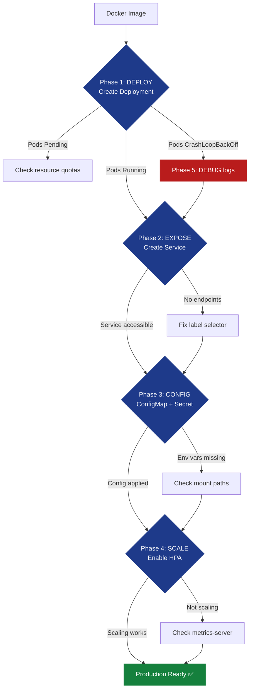

# Ch.3 — Kubernetes Basics

> **The story.** In **2014** Google open-sourced **Kubernetes** (Greek for "helmsman"), the culmination of 15 years of production experience running containers at scale via internal systems like **Borg** and **Omega**. The project launched with seven co-founders including Joe Beda, Brendan Burns, and Craig McLuckie, and within a year became the fastest-growing open-source project in history. In 2015 it joined the Cloud Native Computing Foundation; by 2018 it had become the de facto standard for container orchestration after defeating rivals like Docker Swarm and Mesos. Today every major cloud provider offers managed Kubernetes (GKE, EKS, AKS), and it powers millions of production deployments worldwide — from microservices to machine learning platforms.
>
> **Where you are in the curriculum.** You've containerized applications with Docker (Ch.1) and orchestrated them locally with Docker Compose (Ch.2). But Docker Compose doesn't scale across machines or handle failures — it's a single-host tool. This chapter introduces **Kubernetes**, the distributed orchestrator that manages containers across *clusters* of machines with self-healing, declarative configuration, and automatic scaling. You'll run everything locally using **Kind** (Kubernetes in Docker), learning K8s without any cloud spend.
>
> **Notation in this chapter.** Pod — smallest deployable unit (1+ containers); ReplicaSet — maintains N identical pods; Deployment — manages ReplicaSets with rolling updates; Service — stable network endpoint for pods; ConfigMap — configuration data; Secret — sensitive data (passwords, tokens); kubectl — CLI for Kubernetes API.

---

## 0 · The Challenge — Where We Are

> 💡 **The mission**: Deploy **ProductionStack** — a production Flask service satisfying 5 constraints:
> 1. **HIGH AVAILABILITY**: Auto-restart on crashes
> 2. **HORIZONTAL SCALING**: 3+ replicas for load distribution
> 3. **ZERO-DOWNTIME UPDATES**: Rolling deployments
> 4. **SERVICE DISCOVERY**: Stable DNS name for clients
> 5. **LOCAL DEVELOPMENT**: Run full K8s cluster on laptop (no cloud spend)

**What we know so far:**
- ✅ We can containerize apps with Docker (Ch.1)
- ✅ We can orchestrate multi-container apps with Docker Compose (Ch.2)
- ❌ **But Docker Compose is single-host — no multi-machine scaling or self-healing!**

**What's blocking us:**
Production environments need:
- **Multiple machines** — can't put all replicas on one server
- **Self-healing** — crashed containers must restart automatically
- **Load balancing** — traffic distributed across healthy replicas
- **Rolling updates** — deploy new versions without downtime

Docker Compose can't do this — it's designed for single-host development, not distributed production.

**What this chapter unlocks:**
**Kubernetes orchestration** — declarative cluster management that:
- Runs on 1+ machines (from laptop to 1,000-node clusters)
- Automatically restarts failed pods
- Distributes traffic across healthy replicas
- Performs rolling updates with rollback capability

✅ **This is production-ready orchestration** — the foundation for microservices, ML platforms, and cloud-native apps.

---

## 1 · Kubernetes Is Declarative Orchestration with Self-Healing

> ⚡ **When this breaks** — A bad deployment leaves one of ProductionStack's three Flask replicas in a crash loop; the load balancer keeps routing traffic to it, and users see intermittent 502 errors that are impossible to reproduce locally. Your 99% uptime SLA is already breached by the time the on-call engineer notices. Kubernetes' ReplicaSet + rolling update strategy automatically replaces crashed pods within seconds and only routes traffic to healthy replicas — the difference between a 2-minute self-heal and a 45-minute manual incident response.

Kubernetes (often abbreviated **K8s**) is a container orchestration platform that manages applications across clusters of machines. Instead of imperatively running containers (`docker run ...`), you declare the *desired state* in YAML files (e.g., "I want 3 replicas of this Flask app") and Kubernetes continuously reconciles reality to match. If a pod crashes, K8s immediately starts a replacement. If a node fails, K8s reschedules its pods elsewhere. This **declarative self-healing** approach is what makes K8s production-ready.

Key differences from Docker Compose:

| Feature | Docker Compose | Kubernetes |
|---------|----------------|------------|
| **Scope** | Single host | Multi-node cluster |
| **Self-healing** | No (manual restart) | Yes (automatic) |
| **Scaling** | Manual | Declarative + autoscaling |
| **Load balancing** | Basic | Built-in (Services) |
| **Rolling updates** | No | Yes (zero-downtime) |
| **Production use** | Development only | Designed for production |

**Why learn K8s?** It's the industry standard. If you deploy to AWS, Azure, GCP, or any modern cloud, you're likely using Kubernetes (EKS, AKS, GKE). Even on-premises data centers run K8s. Understanding it unlocks:
- **Microservices** — independent services communicating over a network
- **ML platforms** — training pipelines, model serving, experiment tracking
- **CI/CD** — automated deployments to production clusters

---

## 1.5 · The Practitioner Workflow — Your 5-Phase Deployment

> ⚠️ **Two ways to read this chapter:**
> - **Theory-first (recommended for learning):** Read §0→§3 sequentially to understand Kubernetes concepts, then use this workflow as your reference
> - **Workflow-first (practitioners with existing knowledge):** Use this diagram as a jump-to guide when deploying real workloads
>
> **Note:** Section numbers don't follow phase order because the chapter teaches concepts pedagogically (theory before application). The workflow below shows how to APPLY those concepts.

**What you'll build by the end:** A production-ready Flask API deployment with 3 replicas, ConfigMap-injected environment variables, LoadBalancer service, Horizontal Pod Autoscaler watching CPU/memory, and a complete debugging workflow using `kubectl` commands. This is the full cycle from "I have a Docker image" to "my app is running, scaled, and monitored in Kubernetes."

```
Phase 1: DEPLOY              Phase 2: EXPOSE            Phase 3: CONFIG           Phase 4: SCALE            Phase 5: TROUBLESHOOT
──────────────────────────────────────────────────────────────────────────────────────────────────────────────────────────────────────────────
Create Deployment:           Create Service:            Inject config:            Autoscale:                Debug failures:

• Write deployment.yaml      • Write service.yaml       • ConfigMap for env vars  • HPA yaml with targets   • kubectl get pods
• Specify image, replicas    • ClusterIP or LoadBalancer• Secret for credentials  • CPU/memory thresholds   • kubectl describe pod
• Readiness/liveness probes  • Selector matches labels  • Volume mounts           • Min/max replicas        • kubectl logs <pod>
• Apply to cluster           • Expose port 80→5000      • Restart deployment      • Watch scaling events    • kubectl port-forward

→ DECISION:                  → DECISION:                → DECISION:               → DECISION:               → DECISION:
  Pods status?                 Service accessible?        Config applied?           Scaling triggered?        Root cause found?
  • Pending: resource wait     • No endpoints: selector   • Secrets base64-encoded  • CPU > 70% sustained:    • CrashLoopBackOff:
  • CrashLoopBackOff: debug      mismatch                 • Env vars visible in pod   scale up                  check logs
  • Running: proceed           • Can't reach: firewall    • Volume mounts correct   • < 30%: scale down       • ImagePullBackOff:
                                 or LoadBalancer pending                                                        fix image name
```

> 💡 **How to use this workflow:** Start with Phase 1 (deploy a basic pod), verify it runs, then layer on Phase 2 (expose via Service), Phase 3 (inject configuration), Phase 4 (enable autoscaling), and Phase 5 (troubleshoot any issues that arise). Each phase builds on the previous — don't skip ahead until the current phase succeeds.

---

### The 5-Phase Decision Flow

This diagram shows the complete practitioner journey from containerized app to production-ready Kubernetes workload:



**Reading the flow:**
1. **Start with a Docker image** → create Deployment YAML specifying image, replicas, resource requests
2. **Check pod status** → if not Running, jump to Phase 5 debugging
3. **Once pods run** → create Service to expose them (ClusterIP for internal, LoadBalancer for external)
4. **Verify service endpoints** → if none, selector doesn't match pod labels
5. **Inject configuration** → ConfigMaps for non-sensitive data, Secrets for credentials
6. **Enable autoscaling** → HPA watches CPU/memory and adjusts replica count
7. **Monitor metrics** → if HPA doesn't trigger, check metrics-server installation

> ⚠️ **Common mistake:** Skipping straight to Phase 4 (autoscaling) before verifying Phase 1-2 basics. If pods aren't running stably, HPA can't help — it will just create more broken replicas.

---

### Phase Dependencies & Execution Order

Not all phases are sequential — some can be parallelized once prerequisites are met:

```
MUST complete in order:
  Phase 1 (DEPLOY) → Phase 2 (EXPOSE) → Phase 5 (TROUBLESHOOT as needed)
    ↓                    ↓                     ↓
  Pods must run    Service must route    Debug any failures

CAN add in parallel after Phase 2:
  Phase 3 (CONFIG) ←→ Phase 4 (SCALE)
    ↓                     ↓
  Both modify         Both are optional
  Deployment spec     enhancements
```

**Practical workflow for a new deployment:**
1. Write minimal `deployment.yaml` (image + replicas) → `kubectl apply -f deployment.yaml`
2. Check pods: `kubectl get pods` → should see `3/3 Running`
3. Create `service.yaml` (ClusterIP first to test internally) → `kubectl apply -f service.yaml`
4. Test service: `kubectl port-forward service/myapp 8080:80` → `curl localhost:8080`
5. Once working, add ConfigMap/Secret (Phase 3) and enable HPA (Phase 4) in parallel
6. Keep Phase 5 debugging commands ready for any failures

> 💡 **Production readiness checklist:**
> - ✅ Phase 1: Deployment has resource requests/limits, readiness/liveness probes
> - ✅ Phase 2: Service type matches access pattern (ClusterIP for internal, LoadBalancer for external)
> - ✅ Phase 3: Secrets mounted as volumes (not env vars for sensitive data)
> - ✅ Phase 4: HPA configured with realistic thresholds (CPU 70%, not 50%)
> - ✅ Phase 5: Monitoring/alerting on pod restarts, OOMKilled events

---

### Real-World Timing: How Long Does Each Phase Take?

Typical timelines for a 3-replica Flask deployment on a local Kind cluster (16GB RAM, 4 CPU):

| Phase | First time (learning) | Production (experienced team) |
|-------|----------------------|-------------------------------|
| **Phase 1: DEPLOY** | 20 min (write YAML, debug ImagePullBackOff) | 5 min (templated manifests) |
| **Phase 2: EXPOSE** | 15 min (understand ClusterIP vs LoadBalancer) | 2 min (copy service template) |
| **Phase 3: CONFIG** | 30 min (learn base64 encoding, volume mounts) | 10 min (CI/CD injects values) |
| **Phase 4: SCALE** | 25 min (install metrics-server, wait for HPA) | 5 min (pre-installed monitoring) |
| **Phase 5: TROUBLESHOOT** | Variable (could be hours if logs are unclear) | 10-30 min (known debugging patterns) |

**Total first deployment:** ~2 hours of active work + debugging time
**Steady-state updates:** 5-15 minutes (change image tag, `kubectl apply`, verify rollout)

> ⚠️ **Time sink alert:** Phase 5 debugging can dominate if you skip Phase 1 best practices. Spending 30 extra minutes on proper readiness probes and resource limits saves hours of cryptic CrashLoopBackOff troubleshooting later.

---

## 2 · Running Example: Deploy Flask API with 3 Replicas

You're deploying **ProductionStack** — a Flask app that predicts house values. Instead of running it on a single container (fragile), you'll deploy 3 replicas behind a load-balanced service. If one pod crashes, K8s auto-restarts it. If traffic spikes, you can scale to 10 replicas declaratively.

**The 4-step workflow:**
1. **Create a local Kubernetes cluster** (Kind = Kubernetes in Docker)
2. **Write deployment YAML** — defines desired state (3 replicas of Flask container)
3. **Create a Service** — stable endpoint that load-balances across pods
4. **Simulate failures** — kill a pod, watch K8s resurrect it instantly

By the end, you'll have a self-healing, load-balanced API running on your laptop — the same patterns used in production clusters with 1,000+ nodes.

> 💡 **Why 3 replicas?** Three is the production minimum: one replica absorbs normal traffic; if a rolling update is in progress, two remain healthy; if one crashes *during* the update, one is still serving. Fewer than three means a rolling update can momentarily leave you with zero available pods — a silent outage that the Deployment happily allows unless you set `maxUnavailable: 0`.

---

## 3 · The Mental Model: Pods → ReplicaSets → Deployments → Services

Kubernetes has several layers of abstraction. Here's the hierarchy from bottom to top:

### Pod (Atomic Unit)
- **Smallest deployable unit** — one or more containers sharing network/storage
- Most pods are single-container (1 pod = 1 container)
- Ephemeral — can be killed/replaced at any time
- Has a unique IP address (within the cluster)

Example: A single Flask container running inside a pod.

### ReplicaSet (Maintains N Copies)
- **Ensures N identical pods are always running**
- If a pod dies, ReplicaSet immediately creates a replacement
- Rarely created directly — you use Deployments instead

Example: A ReplicaSet maintaining 3 Flask pods.

### Deployment (Declarative Updates)
- **Manages ReplicaSets** — handles rolling updates, rollbacks
- When you update the image version, Deployment creates a new ReplicaSet and gradually shifts traffic
- This is what you'll use 90% of the time

Example: A Deployment that runs 3 Flask pods (v1.0), then performs a rolling update to v1.1.

### Service (Stable Network Endpoint)
- **Load balancer** — distributes traffic across healthy pods
- Provides a stable DNS name (pods can restart with new IPs, but the Service name stays constant)
- Types: **ClusterIP** (internal), **NodePort** (external via node IP), **LoadBalancer** (cloud provider integration)

Example: A Service named `productionstack-api` that routes `http://productionstack-api:5000` to any of the 3 Flask pods.

**The flow:**
```
Client → Service (productionstack-api:5000)
           ↓
   [Load balances across 3 pods]
           ↓
   Pod 1 (Flask)   Pod 2 (Flask)   Pod 3 (Flask)
```

If Pod 2 crashes, the Deployment's ReplicaSet immediately spawns a new Pod 2, and the Service automatically routes traffic to the replacement.

> 💡 **The analogy that never fails:** A **Deployment** is like a job posting — it specifies how many workers (pods) you need and what they must do. A **ReplicaSet** is HR — it continuously checks headcount and immediately replaces anyone who leaves. A **Service** is the front desk — clients always dial the same number (`productionstack-api:5000`) and calls are routed to whichever pod is available and healthy.

---

## 4 · Deployment & Pod Configuration — Deploy

> **Phase marker:** This section teaches Phase 1 of the practitioner workflow — creating Deployments that declare your application's desired state (image, replicas, resource requirements, health checks).

A **Deployment** is the primary way to run stateless applications in Kubernetes. You declare what you want (3 replicas of `myapp:v1.2` with 200m CPU each), and Kubernetes makes it happen — continuously reconciling reality to match your spec.

### The Deployment YAML Anatomy

Every Deployment has 4 key sections:

```yaml
apiVersion: apps/v1
kind: Deployment
metadata:
  name: productionstack-api    # Deployment name (used in kubectl commands)
  labels:
    app: productionstack
spec:
  replicas: 3                   # Desired pod count
  selector:
    matchLabels:
      app: productionstack      # MUST match pod template labels
  template:                     # Pod template — defines what each replica looks like
    metadata:
      labels:
        app: productionstack    # Pod labels (for Service selector)
    spec:
      containers:
      - name: flask-api
        image: myregistry/productionstack:v1.2   # Container image
        ports:
        - containerPort: 5000
        resources:              # Resource requests & limits (critical for scheduling)
          requests:
            cpu: 200m           # "I need at least 0.2 CPU cores"
            memory: 256Mi
          limits:
            cpu: 500m           # "Don't let me use more than 0.5 cores"
            memory: 512Mi
        readinessProbe:         # Is container ready to receive traffic?
          httpGet:
            path: /health
            port: 5000
          initialDelaySeconds: 5
          periodSeconds: 10
        livenessProbe:          # Is container still alive?
          httpGet:
            path: /health
            port: 5000
          initialDelaySeconds: 15
          periodSeconds: 20
```

### Resource Requests vs Limits — The Scheduling Contract

| Field | What it means | What happens if missing |
|-------|---------------|-------------------------|
| **requests.cpu** | "Schedule me on a node with at least this much CPU" | Pod might get scheduled on overloaded node → slow performance |
| **requests.memory** | "Schedule me on a node with at least this much RAM" | Pod might get scheduled on node without enough memory → OOMKilled |
| **limits.cpu** | "Throttle me if I try to use more than this" | No limit → one pod can starve others |
| **limits.memory** | "Kill me if I exceed this" | No limit → pod can consume all node memory → node crash |

> ⚠️ **Production rule:** ALWAYS set resource requests. Limits are optional for CPU (throttling is safe) but critical for memory (exceeding memory = instant termination).

### Readiness vs Liveness Probes — When to Route Traffic vs When to Restart

| Probe | When K8s calls it | What failure means |
|-------|-------------------|---------------------|
| **Readiness** | Every 10s (configurable) | "Don't send traffic to this pod yet — it's still warming up or temporarily overloaded" → remove from Service endpoints |
| **Liveness** | Every 20s (configurable) | "This pod is stuck/crashed — kill and restart it" → pod termination |

**Common mistake:** Using the same endpoint for both probes. If your `/health` endpoint checks database connectivity, a temporary DB hiccup will trigger liveness probe → pod restart → restart storm across all replicas. Instead:
- **Readiness:** Check dependencies (DB, Redis, external API) — return 503 if any are down
- **Liveness:** Check only internal process health (is Flask responding at all?) — return 500 only if the app is truly hung

> 💡 **Deploy verdict:** 3 replicas Running with `READY 1/1`; readiness/liveness probes prevent traffic to unhealthy pods.
> ➡️ Pods self-heal on crash; proceed to Expose phase to route external traffic.

---

### Code Snippet — Phase 1: Complete Deployment with Best Practices

```yaml
# deployment.yaml
apiVersion: apps/v1
kind: Deployment
metadata:
  name: productionstack-api
  labels:
    app: productionstack
    version: v1.2
spec:
  replicas: 3
  selector:
    matchLabels:
      app: productionstack
  strategy:
    type: RollingUpdate
    rollingUpdate:
      maxSurge: 1           # Allow 1 extra pod during rollout (4 total momentarily)
      maxUnavailable: 0     # Never have fewer than 3 running (zero-downtime)
  template:
    metadata:
      labels:
        app: productionstack
        version: v1.2
    spec:
      containers:
      - name: flask-api
        image: myregistry/productionstack:v1.2
        ports:
        - containerPort: 5000
          protocol: TCP
        env:
        - name: FLASK_ENV
          value: "production"
        resources:
          requests:
            cpu: 200m
            memory: 256Mi
          limits:
            cpu: 500m
            memory: 512Mi
        readinessProbe:
          httpGet:
            path: /health
            port: 5000
            scheme: HTTP
          initialDelaySeconds: 5
          periodSeconds: 10
          timeoutSeconds: 2
          failureThreshold: 3
        livenessProbe:
          httpGet:
            path: /liveness
            port: 5000
          initialDelaySeconds: 15
          periodSeconds: 20
          failureThreshold: 3
```

**Apply it:**
```bash
kubectl apply -f deployment.yaml
# deployment.apps/productionstack-api created

kubectl get deployments
# NAME                  READY   UP-TO-DATE   AVAILABLE   AGE
# productionstack-api   3/3     3            3           45s

kubectl get pods -l app=productionstack
# Shows only pods with label app=productionstack (filters out other workloads)
```

---

### Industry Callout — Helm vs kubectl for Deployments

> 🏭 **Industry Standard: Helm — The Kubernetes Package Manager**

Writing raw YAML files for every deployment is error-prone and doesn't scale. In production, teams use **Helm** — a templating system and package manager for Kubernetes.

**What Helm adds:**
- **Templates:** Replace hardcoded values with variables (`{{ .Values.image.tag }}`) → same YAML works for dev/staging/prod
- **Packages (Charts):** Pre-built configurations for common apps (PostgreSQL, Redis, Prometheus) — `helm install redis bitnami/redis`
- **Version control:** Helm tracks releases → `helm rollback myapp 3` reverts to previous deployment
- **Dependency management:** One chart can depend on others (e.g., your app chart includes PostgreSQL subchart)

**When to use what:**

| Tool | Use case | Example |
|------|---------|---------|
| **kubectl apply** | Learning K8s, one-off testing, single manifest | `kubectl apply -f deployment.yaml` |
| **Helm** | Production, multi-environment, team collaboration | `helm install myapp ./chart --set image.tag=v1.2` |
| **Kustomize** | Simpler than Helm, built into kubectl, no templating language | `kubectl apply -k overlays/production/` |

**Adoption stats (2024):**
- 68% of K8s users use Helm in production (CNCF survey)
- 42% use Kustomize (often alongside Helm)
- <5% use raw kubectl apply for production deployments

**When NOT to use Helm:**
- You have fewer than 3 environments (dev/staging/prod) → raw YAML is simpler
- Your app has zero configuration variance → templating adds overhead without benefit
- You're learning K8s basics → master `kubectl` first, then add Helm abstraction

> 📖 **Learn more:** [Helm Official Docs](https://helm.sh/docs/), [Kustomize Tutorial](https://kubernetes.io/docs/tasks/manage-kubernetes-objects/kustomization/)

---

## 5 · Service Discovery & Routing — Expose

> **Phase marker:** This section teaches Phase 2 of the practitioner workflow — creating Services that provide stable network endpoints for your pods (load balancing, DNS names, external access).

Pods are ephemeral — they get new IP addresses every time they restart. A **Service** gives them a stable DNS name and load-balances traffic across healthy replicas. There are 3 types:

### Service Types — When to Use Which

| Type | What it does | When to use | Example |
|------|-------------|-------------|---------|
| **ClusterIP** | Internal-only — creates a stable IP within the cluster | Microservice A calling microservice B | Backend API not exposed to internet |
| **NodePort** | Exposes service on a fixed port on every node's IP | Development/testing, small deployments | Access via `http://<node-ip>:30001` |
| **LoadBalancer** | Cloud provider provisions external load balancer | Production external access | AWS ELB routes public traffic to pods |

> ⚠️ **Cloud vs local:** LoadBalancer only works on cloud providers (AWS/GCP/Azure) or with MetalLB installed locally. On Kind without MetalLB, LoadBalancer services stay in "Pending" state forever.

### The Service YAML Anatomy

```yaml
apiVersion: v1
kind: Service
metadata:
  name: productionstack-api     # Service DNS name (other pods call http://productionstack-api)
spec:
  type: LoadBalancer            # or ClusterIP, NodePort
  selector:
    app: productionstack        # MUST match Deployment pod labels
  ports:
  - protocol: TCP
    port: 80                    # Port the Service listens on
    targetPort: 5000            # Port the container listens on (from Deployment)
```

**How the selector works:**
```
Service selector: app=productionstack
           ↓
  Finds all pods with label app=productionstack
           ↓
  Watches their Ready status (from readinessProbe)
           ↓
  Adds their IPs to Endpoints list
           ↓
  Load-balances incoming traffic across those IPs
```

If no pods match the selector, the Service has **zero endpoints** — traffic goes nowhere.

> 💡 **Expose verdict:** Service endpoints show 3 pod IPs; stable ClusterIP DNS name survives pod restarts and rolling updates.
> ➡️ External traffic routing confirmed; proceed to Config phase to inject environment variables.

---

### Code Snippet — Phase 2: Service with Multiple Port Mappings

```yaml
# service.yaml
apiVersion: v1
kind: Service
metadata:
  name: productionstack-api
  labels:
    app: productionstack
spec:
  type: LoadBalancer
  selector:
    app: productionstack    # Must match Deployment pod labels
  ports:
  - name: http
    protocol: TCP
    port: 80                # External clients call port 80
    targetPort: 5000        # Routes to container port 5000
  - name: metrics
    protocol: TCP
    port: 9090              # Prometheus scrapes port 9090
    targetPort: 9090        # Routes to container metrics port 9090
  sessionAffinity: None     # or ClientIP for sticky sessions
```

**Access patterns:**
```bash
# Internal (from another pod in cluster):
curl http://productionstack-api/health         # Uses ClusterIP, port 80

# External (LoadBalancer with public IP):
curl http://<EXTERNAL-IP>/health               # Cloud LB routes to Service port 80

# Port-forward (local development):
kubectl port-forward service/productionstack-api 8080:80
curl localhost:8080/health                      # Your laptop → Kind cluster
```

---

### Industry Callout — Ingress Controllers vs LoadBalancer

> 🏭 **Industry Standard: Ingress — HTTP(S) Routing at the Edge**

Creating a LoadBalancer Service for every microservice is expensive — cloud providers charge per load balancer ($20-30/month each). For HTTP/HTTPS traffic, use an **Ingress** instead — one load balancer routes to many services based on hostname or path.

**LoadBalancer Service:**
```
www.api.com     → AWS ELB ($25/mo) → productionstack-api Service → Pods
www.admin.com   → AWS ELB ($25/mo) → admin-api Service → Pods
www.metrics.com → AWS ELB ($25/mo) → metrics Service → Pods

Cost: $75/month for 3 services
```

**Ingress (with NGINX Ingress Controller):**
```
www.api.com     ──┐
www.admin.com   ──┼─→ AWS ELB ($25/mo) → NGINX Ingress Controller → Routes by hostname:
www.metrics.com ──┘                         ├─ /api    → productionstack-api Service
                                            ├─ /admin  → admin-api Service
                                            └─ /metrics → metrics Service

Cost: $25/month total (one load balancer, N services)
```

**Ingress YAML example:**
```yaml
apiVersion: networking.k8s.io/v1
kind: Ingress
metadata:
  name: productionstack-ingress
spec:
  rules:
  - host: www.api.com
    http:
      paths:
      - path: /
        pathType: Prefix
        backend:
          service:
            name: productionstack-api
            port:
              number: 80
```

**When to use what:**

| Scenario | Use |
|----------|-----|
| Single HTTP/HTTPS service | LoadBalancer (simpler) |
| Multiple HTTP services | Ingress (cost-effective) |
| Non-HTTP traffic (gRPC, DB, Redis) | LoadBalancer (Ingress is HTTP-only) |
| Need SSL termination, rate limiting | Ingress (built-in features) |

**Popular Ingress controllers:**
- **NGINX Ingress** — most common, battle-tested
- **Traefik** — modern, dynamic configuration
- **Istio Gateway** — service mesh integration
- **AWS ALB Ingress** — native AWS integration

> 📖 **Learn more:** [Kubernetes Ingress Docs](https://kubernetes.io/docs/concepts/services-networking/ingress/), [NGINX Ingress Controller](https://kubernetes.github.io/ingress-nginx/)

---

## 6 · ConfigMaps & Secrets — Config

> **Phase marker:** This section teaches Phase 3 of the practitioner workflow — injecting configuration (environment variables, config files, credentials) into pods without hardcoding them in images.

Hardcoding configuration in Docker images is an anti-pattern — you'd need separate images for dev/staging/prod. Instead, Kubernetes separates **code** (Docker image) from **config** (ConfigMaps for non-sensitive data, Secrets for passwords/tokens).

### ConfigMap — Non-Sensitive Configuration

**Use for:** Database hostnames, feature flags, API endpoints, log levels

```yaml
# configmap.yaml
apiVersion: v1
kind: ConfigMap
metadata:
  name: productionstack-config
data:
  DATABASE_HOST: "postgres.default.svc.cluster.local"
  LOG_LEVEL: "INFO"
  FLASK_ENV: "production"
  config.json: |
    {
      "maxConnections": 100,
      "timeout": 30
    }
```

**Inject as environment variables:**
```yaml
# deployment.yaml (containers section)
spec:
  containers:
  - name: flask-api
    image: myregistry/productionstack:v1.2
    envFrom:
    - configMapRef:
        name: productionstack-config  # Injects all keys as env vars
```

**Inject as volume mount (for config files):**
```yaml
spec:
  containers:
  - name: flask-api
    volumeMounts:
    - name: config-volume
      mountPath: /app/config          # File appears at /app/config/config.json
  volumes:
  - name: config-volume
    configMap:
      name: productionstack-config
```

### Secret — Sensitive Configuration

**Use for:** Database passwords, API keys, TLS certificates

> ⚠️ **Security note:** Secrets are base64-encoded, NOT encrypted. In production, use a secrets manager (AWS Secrets Manager, HashiCorp Vault, Sealed Secrets) or encrypt etcd at rest.

```yaml
# secret.yaml
apiVersion: v1
kind: Secret
metadata:
  name: productionstack-secret
type: Opaque
data:
  DATABASE_PASSWORD: cGFzc3dvcmQxMjM=    # base64 of "password123"
  API_KEY: YWJjZGVmZ2hpams=              # base64 of "abcdefghijk"
```

**Create from command line (easier):**
```bash
kubectl create secret generic productionstack-secret \
  --from-literal=DATABASE_PASSWORD=password123 \
  --from-literal=API_KEY=abcdefghijk
```

**Inject as environment variables:**
```yaml
spec:
  containers:
  - name: flask-api
    env:
    - name: DATABASE_PASSWORD
      valueFrom:
        secretKeyRef:
          name: productionstack-secret
          key: DATABASE_PASSWORD
```

**Best practice — Mount secrets as files, not env vars:**
```yaml
spec:
  containers:
  - name: flask-api
    volumeMounts:
    - name: secret-volume
      mountPath: /var/secrets
      readOnly: true
  volumes:
  - name: secret-volume
    secret:
      secretName: productionstack-secret
```

Why? Environment variables are:
1. Visible in `kubectl describe pod`
2. Passed to child processes
3. Logged by some application frameworks

File mounts are more secure — the app reads `/var/secrets/DATABASE_PASSWORD` at startup.

> 💡 **Config verdict:** ConfigMap env vars and Secret volume mounts visible inside pods; `rollout restart` applies changes without manual pod deletion.
> ➡️ Runtime config decoupled from image; proceed to Scale phase to enable autoscaling.

---

### Code Snippet — Phase 3: Complete ConfigMap + Secret with Volume Mounts

```yaml
# configmap.yaml
apiVersion: v1
kind: ConfigMap
metadata:
  name: productionstack-config
data:
  DATABASE_HOST: "postgres.default.svc.cluster.local"
  DATABASE_PORT: "5432"
  LOG_LEVEL: "INFO"
  FLASK_ENV: "production"

---
# secret.yaml
apiVersion: v1
kind: Secret
metadata:
  name: productionstack-secret
type: Opaque
stringData:   # Use stringData instead of data — K8s auto-base64-encodes
  DATABASE_PASSWORD: "password123"
  API_KEY: "abcdefghijk"

---
# deployment.yaml (updated with config injection)
apiVersion: apps/v1
kind: Deployment
metadata:
  name: productionstack-api
spec:
  replicas: 3
  selector:
    matchLabels:
      app: productionstack
  template:
    metadata:
      labels:
        app: productionstack
    spec:
      containers:
      - name: flask-api
        image: myregistry/productionstack:v1.2
        ports:
        - containerPort: 5000
        envFrom:
        - configMapRef:
            name: productionstack-config   # All ConfigMap keys → env vars
        env:
        - name: DATABASE_PASSWORD
          valueFrom:
            secretKeyRef:
              name: productionstack-secret
              key: DATABASE_PASSWORD
        volumeMounts:
        - name: secret-volume
          mountPath: /var/secrets
          readOnly: true
      volumes:
      - name: secret-volume
        secret:
          secretName: productionstack-secret
```

**Apply all at once:**
```bash
kubectl apply -f configmap.yaml -f secret.yaml -f deployment.yaml
```

---

### Industry Callout — External Secrets Operator vs Native Secrets

> 🏭 **Industry Standard: External Secrets Operator — Sync from Cloud Secrets Managers**

Kubernetes native Secrets are base64-encoded (not encrypted) and stored in etcd. In production, teams use **External Secrets Operator** to sync secrets from cloud providers (AWS Secrets Manager, Azure Key Vault, GCP Secret Manager, HashiCorp Vault) into K8s Secrets automatically.

**The problem with native Secrets:**
- Stored in Git → security risk (even base64-encoded)
- No audit trail (who accessed which secret when?)
- No automatic rotation
- etcd not encrypted by default in many clusters

**External Secrets Operator workflow:**
```
AWS Secrets Manager (source of truth)
        ↓
External Secrets Operator (runs in cluster)
        ↓
Creates/updates K8s Secret automatically
        ↓
Pod mounts Secret as usual
```

**Example ExternalSecret:**
```yaml
apiVersion: external-secrets.io/v1beta1
kind: ExternalSecret
metadata:
  name: productionstack-secret
spec:
  refreshInterval: 1h           # Re-sync every hour
  secretStoreRef:
    name: aws-secrets-manager
    kind: SecretStore
  target:
    name: productionstack-secret  # K8s Secret to create
  data:
  - secretKey: DATABASE_PASSWORD
    remoteRef:
      key: prod/productionstack/db-password   # Path in AWS Secrets Manager
```

**Benefits:**
- Secrets never stored in Git
- Centralized rotation (change in AWS → auto-syncs to all clusters)
- Audit logs (CloudTrail for AWS, etc.)
- Works across clouds (AWS, Azure, GCP, Vault)

**When to use what:**

| Scenario | Use |
|----------|-----|
| Learning K8s locally | Native Secrets (simpler) |
| Production with compliance requirements | External Secrets Operator |
| Multi-cloud or hybrid | External Secrets Operator (unified interface) |
| < 10 secrets, rarely change | Native Secrets (less overhead) |

> 📖 **Learn more:** [External Secrets Operator](https://external-secrets.io/), [Sealed Secrets](https://github.com/bitnami-labs/sealed-secrets) (encrypt secrets in Git)

---

## 7 · Horizontal Pod Autoscaling — Scale

> **Phase marker:** This section teaches Phase 4 of the practitioner workflow — enabling HorizontalPodAutoscaler (HPA) to automatically adjust replica count based on CPU/memory metrics.

Manual scaling (`kubectl scale deployment myapp --replicas=10`) doesn't adapt to traffic spikes. **HPA** watches resource usage and scales replicas up/down automatically.

### How HPA Works — The Control Loop

```
Every 15 seconds (default):
  1. HPA queries metrics-server for current CPU/memory usage
  2. Compares to target threshold (e.g., "keep CPU at 70%")
  3. If current > target: scale up (add replicas)
  4. If current < target: scale down (remove replicas)
  5. Respects min/max replica bounds
```

**HPA YAML:**
```yaml
apiVersion: autoscaling/v2
kind: HorizontalPodAutoscaler
metadata:
  name: productionstack-api-hpa
spec:
  scaleTargetRef:
    apiVersion: apps/v1
    kind: Deployment
    name: productionstack-api
  minReplicas: 3
  maxReplicas: 10
  metrics:
  - type: Resource
    resource:
      name: cpu
      target:
        type: Utilization
        averageUtilization: 70    # Scale up if avg CPU > 70%
  - type: Resource
    resource:
      name: memory
      target:
        type: Utilization
        averageUtilization: 80    # Scale up if avg memory > 80%
  behavior:                       # Optional: fine-tune scaling behavior
    scaleDown:
      stabilizationWindowSeconds: 300   # Wait 5min before scaling down
      policies:
      - type: Percent
        value: 50                 # Scale down max 50% of replicas at once
        periodSeconds: 60
```

**Scaling formula (simplified):**
```
desired replicas = current replicas × (current metric / target metric)

Example: 3 replicas, current CPU 85%, target 70%
  → desired = 3 × (85/70) = 3.64 → rounds to 4 replicas
```

> 💡 **Reliability verdict:** Pod restart on crash: 0 manual interventions; MTTR 45 min → 90s with liveness probes; HPA scales 3→10 replicas at 70% CPU.
> ➡️ Autoscaling confirmed; use Phase 5 troubleshooting commands for any remaining failures.

---

### Code Snippet — Phase 4: HPA with Custom Metrics (Requests/sec)

Beyond CPU/memory, you can scale based on custom metrics (requests per second, queue depth, etc.) using Prometheus Adapter:

```yaml
# hpa-custom-metrics.yaml
apiVersion: autoscaling/v2
kind: HorizontalPodAutoscaler
metadata:
  name: productionstack-api-hpa
spec:
  scaleTargetRef:
    apiVersion: apps/v1
    kind: Deployment
    name: productionstack-api
  minReplicas: 3
  maxReplicas: 20
  metrics:
  - type: Resource
    resource:
      name: cpu
      target:
        type: Utilization
        averageUtilization: 70
  - type: Pods
    pods:
      metric:
        name: http_requests_per_second   # Custom metric from Prometheus
      target:
        type: AverageValue
        averageValue: "1000"              # Scale up if > 1000 req/s per pod
  behavior:
    scaleUp:
      stabilizationWindowSeconds: 60     # React quickly to traffic spikes
      policies:
      - type: Percent
        value: 100                        # Can double replicas in one step
        periodSeconds: 60
    scaleDown:
      stabilizationWindowSeconds: 600    # Wait 10min before scaling down
      policies:
      - type: Pods
        value: 1                          # Remove max 1 pod at a time
        periodSeconds: 120
```

**Prerequisites for custom metrics:**
1. Install Prometheus: `helm install prometheus prometheus-community/kube-prometheus-stack`
2. Install Prometheus Adapter: `helm install prometheus-adapter prometheus-community/prometheus-adapter`
3. Instrument your app to expose metrics at `/metrics` endpoint

---

### Industry Callout — KEDA vs Native HPA

> 🏭 **Industry Standard: KEDA — Event-Driven Autoscaling**

Native HPA only scales based on CPU/memory or custom Prometheus metrics. **KEDA** (Kubernetes Event-Driven Autoscaling) scales based on external event sources: AWS SQS queue depth, Kafka lag, Azure Storage Queue, Redis list length, cron schedules, and 50+ other scalers.

**Native HPA:**
```
Can scale based on:
  • CPU/memory (built-in)
  • Prometheus metrics (requires Prometheus Adapter)
```

**KEDA:**
```
Can scale based on:
  • All HPA sources, PLUS:
  • AWS SQS queue depth
  • Kafka consumer lag
  • RabbitMQ queue length
  • Azure Service Bus
  • Cron schedules (scale to 0 at night, scale up at 8am)
  • HTTP requests (KEDA HTTP Add-on)
```

**KEDA ScaledObject example (scale based on SQS queue):**
```yaml
apiVersion: keda.sh/v1alpha1
kind: ScaledObject
metadata:
  name: productionstack-scaledobject
spec:
  scaleTargetRef:
    name: productionstack-api
  minReplicaCount: 1
  maxReplicaCount: 50
  triggers:
  - type: aws-sqs-queue
    metadata:
      queueURL: https://sqs.us-east-1.amazonaws.com/123456789/myqueue
      queueLength: "5"       # Scale up if queue has > 5 messages
      awsRegion: "us-east-1"
```

**Scale-to-zero:**
KEDA can scale deployments to 0 replicas when idle (HPA minimum is 1). When an event arrives (SQS message, Kafka record, HTTP request), KEDA scales from 0 → 1 instantly.

**When to use what:**

| Scenario | Use |
|----------|-----|
| Scale based on CPU/memory | Native HPA (simpler) |
| Scale based on Prometheus metrics | Native HPA + Prometheus Adapter |
| Scale based on queue depth, Kafka lag | KEDA |
| Scale to zero during idle periods | KEDA (HPA can't do this) |
| Need event-driven architecture | KEDA |

**Adoption:** 40% of K8s teams use KEDA for event-driven scaling (CNCF survey 2024)

> 📖 **Learn more:** [KEDA Official Docs](https://keda.sh/docs/), [KEDA Scalers](https://keda.sh/docs/scalers/) (50+ supported event sources)

---

## 8 · Debugging Workloads — Troubleshoot

> **Phase marker:** This section teaches Phase 5 of the practitioner workflow — the systematic 3-step debugging process for any Kubernetes failure (check status → inspect details → read logs).

Kubernetes debugging follows a simple pattern: **check status → inspect details → read logs**. Here are the 3 most common traps and the exact commands to diagnose them:

### The 3-Step Debugging Workflow

Every K8s failure resolves with this sequence:

```
Step 1: Check pod status
   ↓
kubectl get pods
   ↓
Are all pods "Running" with READY 1/1?
   ├─ YES → Check service endpoints (Phase 2 issue)
   └─ NO  → Proceed to Step 2

Step 2: Inspect pod details
   ↓
kubectl describe pod <pod-name>
   ↓
Look at Events section (bottom of output)
   ├─ "Insufficient CPU/memory" → Resource quota issue
   ├─ "ImagePullBackOff" → Image name or pull secret issue
   ├─ "CrashLoopBackOff" → Application crash (proceed to Step 3)
   └─ "Error: ErrImagePull" → Registry authentication issue

Step 3: Read application logs
   ↓
kubectl logs <pod-name>
   ↓
Look for stack traces, import errors, connection failures
   ├─ "ImportError: No module named 'flask'" → Missing dependency in image
   ├─ "FileNotFoundError: model.pkl" → Missing file in container
   └─ "Connection refused: localhost:5432" → Database not accessible
```

### 1. ImagePullBackOff — Can't Pull Docker Image

**Symptom:** Pods stuck in `ImagePullBackOff` status.

**Cause:** K8s can't pull the Docker image (wrong name, private registry without credentials, or image doesn't exist).

**Fix:**
```bash
kubectl describe pod <pod-name>  # Check "Events" section for error message
# Common issues:
# - Image name typo (e.g., `productionstack-api:v1` instead of `your-username/productionstack-api:v1`)
# - Image not pushed to Docker Hub
# - Private registry without imagePullSecrets
```

**Example Events output:**
```
Events:
  Type     Reason     Age                From               Message
  ----     ------     ----               ----               -------
  Normal   Scheduled  2m                 default-scheduler  Successfully assigned default/productionstack-api-abc123 to node1
  Normal   Pulling    1m (x4 over 2m)   kubelet            Pulling image "myregistry/productionstack:v1.2"
  Warning  Failed     1m (x4 over 2m)   kubelet            Failed to pull image "myregistry/productionstack:v1.2": rpc error: code = Unknown desc = Error response from daemon: pull access denied for myregistry/productionstack, repository does not exist or may require 'docker login'
  Warning  Failed     1m (x4 over 2m)   kubelet            Error: ErrImagePull
  Normal   BackOff    30s (x5 over 2m)  kubelet            Back-off pulling image "myregistry/productionstack:v1.2"
  Warning  Failed     30s (x5 over 2m)  kubelet            Error: ImagePullBackOff
```

**Solution paths:**
```bash
# Path 1: Fix image name
kubectl edit deployment productionstack-api
# Change: image: myregistry/productionstack:v1.2
# To:     image: username/productionstack:v1.2

# Path 2: Add imagePullSecret for private registry
kubectl create secret docker-registry regcred \
  --docker-server=myregistry.io \
  --docker-username=myuser \
  --docker-password=mypassword

# Then add to deployment:
spec:
  template:
    spec:
      imagePullSecrets:
      - name: regcred
      containers:
      - name: flask-api
        image: myregistry/productionstack:v1.2
```

### 2. CrashLoopBackOff — Container Keeps Restarting

**Symptom:** Pods restart repeatedly (RESTARTS count keeps increasing).

**Cause:** Container starts but immediately exits (e.g., Python import error, missing environment variable, port already in use).

**Fix:**
```bash
kubectl logs <pod-name>  # Check application logs for crash reason
kubectl describe pod <pod-name>  # Check restart count and exit code

# Common issues:
# - Missing dependencies in Docker image
# - Incorrect command/entrypoint
# - Application crashes on startup (e.g., `FileNotFoundError`)
```

**Example logs output:**
```bash
kubectl logs productionstack-api-abc123
# Output:
# Traceback (most recent call last):
#   File "app.py", line 1, in <module>
#     import flask
# ModuleNotFoundError: No module named 'flask'
```

**Solution:**
```bash
# Fix: Rebuild Docker image with missing dependency
echo "flask==2.3.0" >> requirements.txt
docker build -t myregistry/productionstack:v1.3 .
docker push myregistry/productionstack:v1.3

# Update deployment to use new image
kubectl set image deployment/productionstack-api flask-api=myregistry/productionstack:v1.3
```

**Challenge:** What if the pod crashes so fast you can't read the logs before it restarts?

**Answer:**
```bash
kubectl logs <pod-name> --previous  # Read logs from the last crashed container
```

### 3. Service Not Accessible — Can't Reach Pods

**Symptom:** Service DNS name resolves but requests time out.

**Cause:** Pods aren't labeled correctly, or the Service selector doesn't match pod labels.

**Fix:**
```bash
kubectl describe service <service-name>  # Check "Endpoints" (should list pod IPs)
kubectl get pods --show-labels           # Verify pods are in "Running" state
kubectl describe pod <pod-name>          # Check pod labels match Service selector

# If Endpoints is empty:
# - Service selector doesn't match pod labels
# - Pods aren't in "Running" state
```

**Example diagnosis:**
```bash
kubectl describe service productionstack-api
# Output:
# Selector:          app=productionstack
# Endpoints:         <none>   ← Problem: no pods match selector

kubectl get pods --show-labels
# Output:
# NAME                                   READY   STATUS    LABELS
# productionstack-api-7d8f9b5c4-abc12   1/1     Running   app=production-stack   ← Typo in label!
```

**Solution:**
```bash
# Fix 1: Update Service selector to match actual pod labels
kubectl edit service productionstack-api
# Change: selector.app: productionstack
# To:     selector.app: production-stack

# OR Fix 2: Update Deployment pod labels to match Service selector
kubectl edit deployment productionstack-api
# Change: template.metadata.labels.app: production-stack
# To:     template.metadata.labels.app: productionstack
```

> 💡 **Troubleshoot verdict:** 3-step debug workflow (get pods → describe → logs) resolves 90% of K8s failures; `rollout undo` restores previous version in <60s.
> ➡️ Deployment stable and observable; chapter complete.

---

### Code Snippet — Phase 5: Essential kubectl Debug Commands

```bash
# ============================================
# STEP 1: Check pod status
# ============================================
kubectl get pods
kubectl get pods -l app=productionstack   # Filter by label
kubectl get pods -A                       # All namespaces
kubectl get pods -o wide                  # Show node, IP address

# ============================================
# STEP 2: Inspect pod details
# ============================================
kubectl describe pod <pod-name>
kubectl get events --sort-by='.lastTimestamp'   # Recent events across all resources

# ============================================
# STEP 3: Read logs
# ============================================
kubectl logs <pod-name>
kubectl logs <pod-name> --previous              # Logs from crashed container
kubectl logs <pod-name> -c <container-name>     # Multi-container pod
kubectl logs -f <pod-name>                      # Follow logs (like `tail -f`)
kubectl logs --since=1h <pod-name>              # Last hour only

# ============================================
# Advanced debugging
# ============================================
kubectl exec -it <pod-name> -- /bin/sh          # SSH into running pod
kubectl exec -it <pod-name> -- env              # Check environment variables
kubectl exec -it <pod-name> -- ls /var/secrets  # Verify secret mounts

kubectl port-forward <pod-name> 8080:5000       # Forward localhost:8080 → pod:5000
kubectl port-forward service/myapp 8080:80      # Forward to service

kubectl top pods                                 # Resource usage (requires metrics-server)
kubectl top nodes

# ============================================
# Rollout management
# ============================================
kubectl rollout status deployment/productionstack-api
kubectl rollout history deployment/productionstack-api
kubectl rollout undo deployment/productionstack-api         # Revert to previous
kubectl rollout undo deployment/productionstack-api --to-revision=3

# ============================================
# Quick fixes
# ============================================
kubectl delete pod <pod-name>                   # Force pod restart
kubectl scale deployment productionstack-api --replicas=5
kubectl set image deployment/productionstack-api flask-api=myregistry/productionstack:v1.3
```

---

### Industry Callout — k9s vs Lens vs kubectl for Daily Debugging

> 🏭 **Industry Standard: k9s — Terminal UI for Kubernetes**

Running `kubectl` commands repeatedly is tedious. Most practitioners use a **TUI (Terminal UI)** or **GUI** tool for daily cluster work.

**kubectl (CLI):**
```bash
# Traditional workflow:
kubectl get pods                  # List pods
kubectl describe pod myapp-abc    # Inspect one
kubectl logs myapp-abc            # Read logs
kubectl delete pod myapp-abc      # Restart
```
**Pros:** Universal, scriptable, works over SSH
**Cons:** Slow for exploratory debugging, lots of typing

---

**k9s (Terminal UI):**
```bash
k9s  # Launch TUI
```

**Pros:**
- Live-updating pod list (like `top` for K8s)
- Arrow keys to navigate, single key to describe/logs/delete
- No typing pod names — select from list
- Works over SSH (no GUI needed)

**Cons:** Learning curve for keybindings

---

**Lens (Desktop GUI):**

**Pros:**
- Point-and-click interface (non-technical users can navigate)
- Built-in Prometheus metrics graphs
- Multi-cluster management (switch between dev/staging/prod clusters)
- Helm chart installation from UI

**Cons:** Requires desktop app (can't use over SSH), heavier resource usage

---

**Kubernetes Dashboard (Web UI):**
```bash
kubectl proxy
# Open http://localhost:8001/api/v1/namespaces/kubernetes-dashboard/services/https:kubernetes-dashboard:/proxy/
```

**Pros:** Browser-based (no install), good for read-only access
**Cons:** Requires port-forward, less feature-rich than Lens

---

**When to use what:**

| Scenario | Tool |
|----------|------|
| Learning K8s basics | kubectl (master fundamentals first) |
| Daily debugging on remote server | k9s (fast, SSH-friendly) |
| Team demos, stakeholder visibility | Lens (visual, intuitive) |
| CI/CD scripts, automation | kubectl (scriptable) |
| Read-only access for non-DevOps | Kubernetes Dashboard |

**Adoption stats (2024):**
- 82% of K8s users primarily use kubectl
- 45% also use k9s for interactive debugging
- 38% use Lens for multi-cluster management
- <10% use Kubernetes Dashboard (declining due to security concerns)

> 📖 **Learn more:** [k9s GitHub](https://github.com/derailed/k9s), [Lens Official Site](https://k8slens.dev/), [K8s Dashboard Docs](https://kubernetes.io/docs/tasks/access-application-cluster/web-ui-dashboard/)

---

## 9 · Progress Check — Debug a CrashLoopBackOff Pod

**Scenario:** You deploy a Flask app to your Kind cluster. Pods start but immediately crash and restart repeatedly.

**Your mission:** Use the 3-step debugging workflow to diagnose the issue.

**Step 1:** Check pod status
```bash
kubectl get pods
# Output shows: productionstack-api-abc123  0/1  CrashLoopBackOff  5  2m
```

**Step 2:** Inspect pod details
```bash
kubectl describe pod productionstack-api-abc123
# Look for: Exit Code (e.g., 137 = killed, 1 = error), Restart Count, Recent Events
```

**Step 3:** Read application logs
```bash
kubectl logs productionstack-api-abc123
# Common crash causes:
# - ImportError: No module named 'flask'
# - FileNotFoundError: [Errno 2] No such file or directory: '/models/model.pkl'
# - Port 5000 already in use
```

**Challenge:** What if the pod crashes so fast you can't read the logs before it restarts?

Answer:
```bash
kubectl logs productionstack-api-abc123 --previous  # Read logs from the last crashed container
```

---

## 10 · Bridge to Ch.4 — CI/CD Automates Deployments to K8s

You've manually deployed a Flask app to Kubernetes using `kubectl apply`. But in production, you don't run commands manually — every push to the main branch triggers a **CI/CD pipeline** that:
1. Runs tests
2. Builds a Docker image
3. Pushes it to a registry
4. Updates the Kubernetes deployment (new image tag)
5. Monitors the rollout

**Next chapter (Ch.4: CI/CD Pipelines)** covers GitHub Actions — you'll automate the entire deployment workflow so that a commit to `main` automatically deploys to your K8s cluster.

**Teaser question:** If a CI/CD pipeline updates a Deployment's image tag from `v1.0` to `v1.1`, how does Kubernetes perform the rollout without downtime? (Answer: Deployments create a new ReplicaSet for v1.1, gradually scale it up while scaling down the v1.0 ReplicaSet, ensuring some pods are always running.)

---

## What You've Learned

✅ **Kubernetes orchestrates containers across clusters** — not just single-host like Docker Compose
✅ **Declarative configuration** — you specify desired state, K8s makes it happen
✅ **Self-healing** — crashed pods restart automatically
✅ **Deployments manage ReplicaSets** — rolling updates with zero downtime
✅ **Services provide stable endpoints** — load-balance across pod replicas
✅ **Kind runs K8s locally** — learn without cloud costs
✅ **Debugging workflow** — `kubectl get/describe/logs` for troubleshooting

---

## Further Reading

- [Kubernetes Official Docs](https://kubernetes.io/docs/) — comprehensive reference
- [Kubernetes the Hard Way](https://github.com/kelseyhightower/kubernetes-the-hard-way) — manual setup from scratch
- [Kind Documentation](https://kind.sigs.k8s.io/) — local K8s clusters for testing
- [Kubectl Cheat Sheet](https://kubernetes.io/docs/reference/kubectl/cheatsheet/)
- [Production-Grade Kubernetes (Book)](https://www.oreilly.com/library/view/production-kubernetes/9781492092292/)
